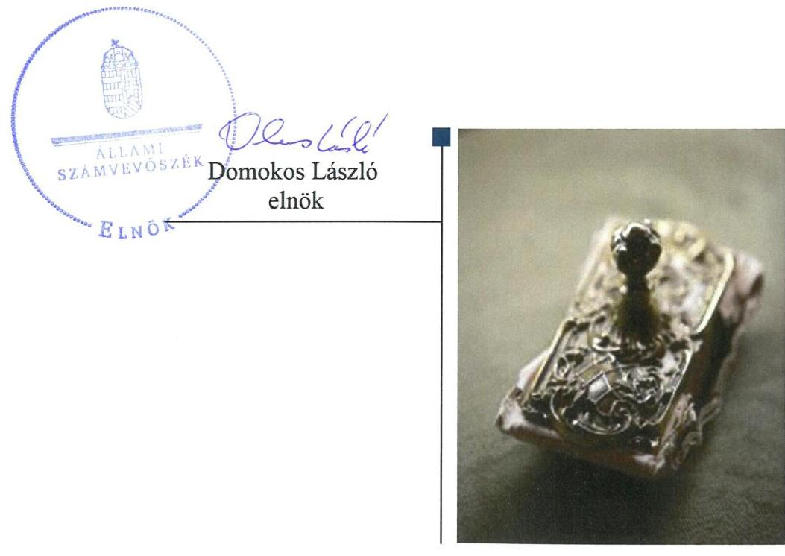

# Jelentés 

## Az állami tulajdonú gazdasági társaságok ellenőrzése

Gandhi Gimnázium Közhasznú Nonprofit Korlátolt Felelősségű Társaság 2018.

18276
www.asz.hu

---

# Jelentés 

## Az állami tulajdonú gazdasági társaságok ellenőrzése

Gandhi Gimnázium Közhasznú Nonprofit Korlátolt Felelősségű Társaság
2018. 10. hó 10. nap

---

# AZ ELLENŐRZÉST FELÜGYELTE:

DR. NÉMETH ERZSÉBET felügyeleti vezető

## AZ ELLENŐRZÉST VEZETTE ÉS A VÉGREHAJTÁSÁÉRT FELELŐS:

DR. NAGY JUDIT ellenőrzésvezető

## A PROGRAM ÖSSZEÁLLÍTÁSÁÉRT FELELŐS:

TÓTPÁL SZABOLCS osztályvezető

IKTATÓSZÁM: EL-0392-023/2018

TÉMASZÁM: 2469

ELLENŐRZÉS-AZONOSÍTÓ SZÁM: V081413

Jelentéseink az Országgyűlés számítógépes hálózatán és az Interneten a www.asz.hu címen is olvashatóak.

---

# TARTALOMJEGYZÉK 

■ ÖSSZEGZÉS ..... 5
■ AZ ELLENŐRZÉS CÉLJA ..... 6
■ AZ ELLENŐRZÉS TERÜLETE ..... 7
■ AZ ELLENŐRZÉS HÁTTERE, INDOKOLTSÁGA ..... 10
■ A JELENTÉS LÉNYEGES KÉRDÉSKÖREI ..... 11
■ AZ ELLENŐRZÉS HATÓKÖRE ÉS MÓDSZEREI ..... 12
■ MEGÁLLAPÍTÁSOK ..... 14
■ JAVASLATOK ..... 17
■ MELLÉKLETEK ..... 19
I. sz. melléklet: Értelmező szótár ..... 19
■ FÜGGELÉK: ÉSZREVÉTELEK ..... 21
■ RÖVIDÍTÉSEK JEGYZÉKE ..... 23

---

.

---

# ÖSSZEGZÉS 

A Gandhi Gimnázium Közhasznú Nonprofit Korlátolt Felelősségű Társaság szabályozottan működött, gazdálkodása, vagyongazdálkodása szabályszerű volt. Adatszolgáltatási feladatait nem látta el, így működésének és gazdálkodásának átláthatósága nem volt biztosított.

## Az ellenőrzés társadalmi indokoltsága

Az állami tulajdonú gazdálkodó szervezetek a nemzeti vagyon részét képezik. Az állami vagyonnal való gazdálkodást illetően a tulajdonosi joggyakorlás és vagyongazdálkodás feladata az állami vagyon átlátható, rendeltetésszerű és felelős felhasználásának biztosítása. Minden közpénzt, közvagyont használó szervezettel szemben társadalmi igény, hogy tevékenységéről elszámoljon.

Az Állami Számvevőszék 2013-2016. évekre kiterjedő ellenőrzése során arra kereste a választ, hogy a tulajdonosi jogok gyakorlása szabályszerű volt-e; a gazdálkodószervezet szabályozottsága, gazdálkodása és vagyongazdálkodási tevékenysége megfelelt-e a jogszabályi és a tulajdonosi előírásoknak.

## Főbb megállapítások, következtetések, javaslatok

Az Emberi Erőforrások Minisztériuma tulajdonosi jogait szabályszerűen gyakorolta.
A Gandhi Gimnázium Közhasznú Nonprofit Korlátolt Felelősségű Társaság (továbbiakban Társaság) gazdálkodási környezete szabályozott, a pénzügyi feladatok ellátása szabályszerű volt. A Társaság azonban nem alakított ki tevékenységének és a szervezeti célok megvalósításának nyomon követését biztosító rendszert.

A Társaság vagyongazdálkodása szabályszerű volt. A vagyontárgyakat érintő döntések meghozatalának folyamata szabályszerű volt.

A Társaság közérdekű adatokra vonatkozó közzétételi kötelezettségét nem teljesítette.
Az Állami Számvevőszék javaslatokat fogalmazott meg a nyomon követhetőség és átláthatóság javítása érdekében.

---

# AZ ELLENŐRZÉS CÉLJA 

Az ellenőrzés célja annak értékelése volt, hogy a tulajdonosi jogok gyakorlása szabályszerű volt-e; a gazdálkodószervezet szabályozottsága, gazdálkodása és vagyongazdálkodási tevékenysége megfelelt-e a jogszabályi és a tulajdonosi előírásoknak; biztosítva volt-e a közfeladatok átláthatósága és elszámoltathatósága érdekében a közszolgáltatás díjának megalapozottsága szabályszerű önköltségszámítással. A vagyonváltozást eredményező döntések esetében a tulajdonosi jogok gyakorlója és a gazdálkodó szervezet szabályszerűen jártak-e el. Az ellenőrzés célja továbbá annak megítélése, hogy a kormányzati szektorba sorolt állami tulajdonban (résztulajdonban) lévő gazdálkodó szervezetek gazdálkodásának a kormányzati szektor hiányára és az államadósságra befolyással bíró elemei a jogszabályi előírásoknak megfeleltek-e.

---

# AZ ELLENŐRZÉS TERÜLETE 

## Gandhi Gimnázium Közhasznú Nonprofit Korlátolt Felelősségű Társaság

A Gandhi Gimnázium Közhasznú Nonprofit Korlátolt Felelősségű Társaság-t Korm. határozat: ${ }^{1}$ alapján a Gandhi Közalapítvány általános jogutódjaként alapították 2011. július 29-én. Alapításkor a Társaság 1 M Ft jegyzett tőkéjéből a Magyar Állam 90%-os, Pécs Megyei Jogú Város Önkormányzata 10,0%-os tulajdoni hányaddal rendelkezett. 2014. december 31-én a Taggyűlés² a jegyzett tőkét - eredménytartalék terhére -, 3 M Ftra emelte, megtartva a tulajdoni arányokat. Ezt követően Pécs Megyei Jogú Város Önkormányzata -Közgyűlésének határozata alapján - a 10%-os üzletrészhányadot ingyenesen állami tulajdonba adta, így 2016. január 13-tól a Társaság kizárólagosan állami tulajdonban volt.

A tulajdonosi jogokat az MNV Zrt. ${ }^{3}$ - mint a Magyar Állam képviselője - helyett és nevében 2012. június 29-től az Emberi Erőforrások Minisztériuma gyakorolta.

A Társaság a Korm. határozat: és a Köznevelési tv. ${ }^{4}$ 4. § 9 pontja szerint látta el a Gandhi Gimnázium ${ }^{5}$-mal kapcsolatos fenntartói feladatokat. A feladatellátásra vonatkozóan az EMMI ${ }^{6}$, a Társaság és a Gandhi Gimnázium, a Köznevelési tv. 31. § (2) bekezdése illetve 74. § (2) bekezdése alapján, Köznevelési Szerződést ${ }^{7}$ kötött. A Gandhi Gimnázium Magyarország és egyben Európa első roma nemzetiségi, érettségit adó intézménye.

A Társaság közhasznú jogállását 2011. július 29-én szerezte meg, közhasznú tevékenységei közé tartozott többek között a nevelés és oktatás, a képesség fejlesztés, az ismeretterjesztés, a gyermek és ifjúságvédelem, a kulturális tevékenység, a magyarországi nemzeti és etnikai kisebbségekkel kapcsolatos tevékenység.

A Társaság a közhasznú tevékenysége során, a Köznevelési tv. 4. § 1.5; 1.7; 1.18 pontjai alapján oktatási intézmények alapításával, fenntartásával köznevelési közfeladatot látott el. Tevékenységi körébe tartozott középiskolai és felnőttképzés szervezése, a célokhoz illeszkedő kiadói munka, kulturális tevékenység folytatása.
2016. július 29-től ${ }^{8}$ a Társaság tevékenységi köre a Nemzetiségi - Roma Módszertani, Oktatási és Kulturális Központ (továbbiakban: NeRok) és annak intézményei, így a Kreatív Digitális Információs és Alkotóközpont (Pécs), a Német Nemzetiségi Kiállítási és Élményközpont (Nagynyárád), a Nemzetiségek Háza (Komló) és az Oktatási és Kreatív Alkotóház (Alsószentmárton) működtetésével bővült.

A Társaság - a Számv. tv. 155. § (3) bekezdésében meghatározottak szerint - nem volt kötelezett könyvvizsgálatra, de könyveit alapítástól könyvvizsgáló vizsgálta felül, akinek személyét a Társasági Szerződésben ${ }^{9}$, illetve az Alapító Okiratban ${ }^{10}$ meghatározták.

A Társaság az ellenőrzött időszak minden évében részesült támogatásban. A Gandhi Gimnázium fenntartására működési támogatást, intézményi

---

normatív támogatást, fejlesztéshez kapcsolódó támogatásokat kapott. A Gandhi Gimnázium, önálló gazdálkodási jogkörrel rendelkezett, költségvetését a Társaság állapította meg, amelyhez a forrásokat a Köznevelési tv. 88. §-a szerint a Társaság, mint fenntartó, biztosította. Az intézményi normatívát a mindenkori költségvetési törvény határozta meg, amelyet a Társaság igényelt és adott tovább a Gandhi Gimnáziumnak. Ez volt a fedezete a Gandhi Gimnázium által a Társaságnak fizetett ingatlan bérleti díjnak, a Gandhi Gimnázium állományában lévő oktatók bérének és járulékainak.

A Társaság gazdálkodásával kapcsolatos főbb adatok alakulását az 1. táblázat mutatja be:

1. táblázat

# A TÁRSASÁG GAZDÁLKODÁSÁNAK EGYES KIEMELT ADATAI 2013-2016. ÉVEKRE (MILLIÓ FT)

|  Megnevezés | 2013. év | 2014. év | 2015. év | 2016. év  |
| --- | --- | --- | --- | --- |
|  Értékesítés nettó árbevétele: | 63,3 | 23,8 | 12,5 | 13,6  |
|  Kapott támogatások: | 337,8 | 341,0 | 244,8 | 258,9  |
|  Mérlegfőösszeg: | 770,3 | 850,3 | 2.004,7 | 1.911,6  |
|  Vevők: | 22,2 | 6,9 | 6,4 | 5,1  |
|  Saját tőke: | 76,8 | 73,8 | 17,2 | 18,8  |
|  Jegyzett tőke: | 1,0 | 1,0 | 3,0 | 3,0  |
|  Mérleg szerinti (2016-ban adózott) | 59,5 | $-3,0$ | $-56,7$ | 1,7  |
|  eredmény: |  |  |  |   |
|  Rövid lejáratú kötelezettségek: | 0,8 | 19,3 | 1.282,1 | 42,2  |
|  Foglalkoztatottak száma (fő): | 4 | 5 | 7 | 13  |

Forrás: A Társaság egyszerűsített éves beszámolói

A Társaság mérlegfőösszege 2016. végén a 2013. évi adathoz viszonyítva 248,2%-kal nőtt. A növekedést a 2015. évben DDOP ${ }^{11}$ és TIOP ${ }^{12}$ támogatási forrásból megvalósult beruházás aktiválása eredményezte. A DDOP 3.2.1/D-14 forrásból kapott támogatásból újították fel a kollégium és tornacsarnok épületét. A TIOP 1.2.6/14 támogatás infrastrukturális beruházást finanszírozott, ebből hozták létre a NeRok-t (Pécs, Alsószentmárton, Komló, Nagynyárád településeken). A Társaság árbevétele ingatlanok bérbeadásából, rendezvényszervezésből, szállás, étkezés kiszámlázásából származott.

A kapott támogatások a Társaság közhasznú bevételének részét képezték, értéke 2016.-ban 2013. évhez viszonyítva 78,9 M Ft-tal, 258,9 M Ft-ra csökkent, az Arany János kollégiumi program megszűnése miatt.

A Társaság legnagyobb vevője a Gandhi Gimnázium normatív támogatása 2013. szeptemberétől jogszabályi változás miatt csökkent. A Társaság a Gandhi Gimnáziummal kapcsolatos követelései után 2014. évben 17,9 M Ft értékvesztést számolt el.

A kötelezettségek nagyságrendje 2015. évben volt kiugróan magas, amit a TIOP és DDOP forrásból megvalósított beruházásokra kapott előleg miatt, amelynek elszámolására csak 2016. évben került sor.

A Nemzetgazdasági Miniszter a Társaságot 2013.-ban a kormányzati szektorba sorolt ${ }^{13}$ egyéb szervezetek között nyilvántartásba vette. A Társaság az ellenőrzött időszakban a Gst. tv. ${ }^{14}$ szerinti adósságot keletkeztető ügyletet nem kötött, gazdálkodásának az államadósságra befolyással bíró gazdasági eseményei nem voltak.

---

A Társaság vagyonkezelt eszközzel, más gazdasági társaságban részesedéssel nem rendelkezett az ellenőrzött időszakban.

Az Ügyvezető ${ }^{15}$ személye az ellenőrzött időszak alatt nem változott.

---

# AZ ELLENŐRZÉS HÁTTERE, INDOKOLTSÁGA 

Az állami tulajdonú gazdálkodó szervezetek ellenőrzése kiemelten fontos a nemzeti vagyon megőrzése, megóvása érdekében, valamint a kormányzati szektor elszámolásaiban megjelenő állami tulajdonú gazdálkodó szervezetek esetében, amelyekkel szemben alapvető követelmény, hogy gazdálkodásuk, működésük szabályszerű, az általuk szolgáltatott adatok minél megbízhatóbbak legyenek. Gazdálkodásuk jellemzően a közérdeklődés és a média figyelmének középpontjában áll, amihez hozzájárul a gazdálkodásuk körébe tartozó - közvetlen vagy közvetett állami tulajdonú, tehát végső soron a nemzeti vagyon részét képező - vagyon nagysága, illetve az általuk ellátott közszolgáltatások/közfeladatok minősége és hatékonysága. Az ellenőrzés rámutathat az állami tulajdonú gazdálkodó szervezetek gazdálkodási tevékenységével kapcsolatos jó gyakorlatokra és szabálytalanságokra. Felhívhatja a figyelmet a jogszabályi követelmények teljesítéséhez szükséges feltételek hiányosságaira, hozzájárulhat az államháztartáson kívüli, de (közvetlenül vagy közvetve) állami vagyont használó gazdálkodó szervezetek tevékenységének átláthatóságához. Ellenőrzésünk eredményeképpen javaslatainkkal, megállapításainkkal hozzájárulhatunk a nemzeti vagyonnal való gazdálkodás átláthatóságának, elszámoltathatóságának javításához. A Magyarországon élő nemzetiségek kultúráját, lehetőségeit befolyásoló szervezetek ÁSZ ellenőrzései a tolerancia, az elfogadás és az egyes nemzetiségekkel kapcsolatos sztereotípiák, előítéletek csökkentését is szolgálják.

---

# A JELENTÉS LÉNYEGES KÉRDÉSKÖREI 

1. A tulajdonosi jogok gyakorlása szabályszerű volt-e?
2. A Társaság működésének szabályozottsága előírás szerű volt-e?
3. A Társaságnál a pénzügyi-számviteli, adatszolgáltatási feladatok ellátása szabályszerű volt-e?
4. A Társaság vagyongazdálkodása szabályszerű volt-e?

---

# AZ ELLENŐRZÉS HATÓKÖRE ÉS MÓDSZEREI 

## Az ellenőrzés típusa

Megfelelőségi ellenőrzés.

## Az ellenőrzött időszak

2013.-2016. évek, a 2016. évi egyszerűsített éves beszámoló jóváhagyásáig tartó időszak.

## Az ellenőrzés tárgya

Állami tulajdonban (résztulajdonban) lévő gazdasági társaság gazdálkodása, kiemelten vagyongazdálkodási tevékenysége, a tulajdonosi jogok gyakorlása.

## Az ellenőrzött szervezet

Gandhi Gimnázium Közhasznú Nonprofit Korlátolt Felelősségű Társaság és az Emberi Erőforrások Minisztériuma, mint a Magyar Nemzeti Vagyonkezelő Zrt. helyett és nevében eljáró meghatalmazott

## Az ellenőrzés jogalapja

Az ellenőrzés jogalapját az ÁSZ tv. 1.§ (3) bekezdése és 5. § (3)-(5) bekezdései képezik.

## Az ellenőrzés módszerei

Az ellenőrzést az ellenőrzési program ellenőrzési kérdései, az ellenőrzött időszakban hatályos jogszabályok, az ellenőrzés szakmai szabályok és módszertanok figyelembe vételével végeztük el.

Az ellenőrzött szervezetek az ellenőrzés lefolytatásához tanúsítványok kitöltésével, valamint az ÁSZ által kért dokumentumok megküldésével szolgáltattak adatokat.

A teljes ellenőrzött időszakra vonatkozóan került ellenőrzésre a gazdasági társaság tervezési, beszámolási, közzétételi, adatszolgáltatási kötelezettségének, valamint belső ellenőrzési tevékenységének szabályszerűsége. A 2013. és 2016. évekre vonatkozóan a gazdasági társaság működésének szabályozottságát, a bevételei és ráfordításai elszámolását,
 illetve

---

vagyongazdálkodásának szabályszerűségét is ellenőriztük. A tulajdonosi joggyakorlást 2013. és 2016. évekre vonatkozóan értékeltük.

A személyi jellegű ráfordítások esetében az ellenőrzött tételek kijelölése véletlen mintavételi eljárás alkalmazásával történt a teljes sokaságból. A bevételek és a ráfordítások, valamint az immateriális javak, tárgyi eszközök esetében az ellenőrzés azokra a legnagyobb értékű tételekre – a lényeges sokaságra – terjedt ki, melyek összértéke eléri a teljes sokaság összértékének 50%-át. A 2013. és 2016. évi ráfordítások elszámolásának szabályszerűségét a lényeges sokaságból véletlen mintavételi eljárással kiválasztott tételek alapján ellenőriztük. A mintavétellel ellenőrzött területek esetében minden egyes tétel vonatkozásában a szabályszerűségre vonatkozó kérdéseket tettünk fel, amelyek eredménye összesítésre került. „Szabályszerűnek” értékeltünk egy ellenőrzött területet, amennyiben 95%-os bizonyossággal az ellenőrzött sokaságban az átlagos hibaarány legfeljebb 10%, „nem szabályszerűnek”, amennyiben 10%-nál magasabb arányt képviselt.

---

# 1. A tulajdonosi jogok gyakorlása szabályszerű volt-e? 

Összegző megállapítás

Az EMMI a tulajdonosi joggyakorlás kereteit szabályszerűen alakította ki és tulajdonosi jogait szabályszerűen gyakorolta.

A TULAJDONOSI JOGOKAT a Magyar Állam Társaságban lévő részesedése felett a MNV Zrt.-vel kötött Megbízási Szerződés ${ }_{12}{ }^{16}$ alapján az EMMI gyakorolta.

Az EMMI Szervezeti és Működési Szabályzatában ${ }^{17}$ és utasításban ${ }^{18}$ határozta meg a tulajdonosi joggyakorlás általános rendjét. Az EMMI a jogszabályi előírások szerint a Társasági Szerződésben, illetve az Alapító ${ }^{19}$ Okiratban meghatározta a Taggyűlés, valamint az Alapító kizárólagos hatáskörébe tartozó feladatokat.

A Társasági Szerződés és az Alapító Okirat szabályszerűen rendelkezett a Társaság gazdálkodása során elért eredményének fel nem oszthatóságáról, valamint arról, hogy a Társaság gazdasági-vállalkozási tevékenységet csak közhasznú céljainak megvalósítása érdekében, azokat nem veszélyeztetve végezhetett. A Társaságnál a Felügyelőbizottság szabályszerűen működött, tagjait a Társasági Szerződés, illetve az Alapító Okirat kijelölte. Az EMMI a Felügyelőbizottság ügyrendjét, a jogszabályoknak megfelelően elfogadta ${ }^{20}$.

Az EMMI a Társasági Szerződésben, illetve Alapító Okiratban az Ügyvezető feladataként határozta meg:
$\longrightarrow$ üzleti terv készítését,
$\longrightarrow$ a Taggyűlés és az Alapító folyamatos (legalább negyedévenkénti) tájékoztatását a Társaság és az általa fenntartott Gandhi Gimnázium működéséről és gazdálkodásáról.
A Taggyűlés megalkotta a Társaság Javadalmazási Szabályzatát²1, a Taktv. 5. § (3) bekezdésében, valamint a Korm-határozat ${ }_{2}{ }^{22}$ 4. a) pontjában foglalt előírások szerint.

A Taggyűlés, illetve az Alapító az üzleti terveket, az egyszerűsített éves beszámolókat a Felügyelőbizottság írásbeli jelentése birtokában fogadta el. A könyvvizsgáló az egyszerűsített éves beszámolókat hitelesítő záradékkal látta el.

TULAJDONOSI ELLENŐRZÉSE keretében az EMMI ellenőrizte 2012. és 2013. évek vonatkozásában a támogatás felhasználást az Integrációs Pedagógiai Program fejezeti kezelésű előirányzat felhasználására vonatkozó ellenőrzés részeként. Az ellenőrzés megállapításai alapján nem volt szükség intézkedési terv készítésére.

A Társaságnál egyéb, felügyelőbizottsági, tulajdonosi és külső ellenőrzésre is sor került. Ezek a támogatás elszámolásokhoz, a beruházások megvalósulásához, a közbeszerzésekhez kapcsolódtak. A megállapított hiányosságok megszüntetéséről a Társaság gondoskodott.

---

# 2. A Társaság működésének szabályozottsága előírásszerű volt-e? 

Összegző megállapítás

A Társaság nem alakította ki a tevékenységének és a célok megvalósításának nyomon követését biztosító rendszert, de működésének szabályozottsága a jogszabályi előírások szerinti volt.

A SZABÁLYSZERŰ MŰKÖDÉS FELTÉTELRENDSZERÉT a Társasági Szerződés, illetve Alapító Okirat és a Szervezeti és Működési Szabályzat ${ }^{23}$ rögzítette.

A Gandhi Gimnázium, illetve a Társaság, mint fenntartó közötti együttműködést Együttműködési Szabályzatban ${ }^{24}$ szabályozták.

A Társaság rendelkezett Számviteli Politikával ${ }^{25}$, Pénzkezelési Szabályzattal ${ }^{26}$, Leltározási szabályzattal ${ }^{27}$ a Számv. tv. 14. § (3) bekezdése, illetve (5) bekezdése a), d) pontjainak előírásai szerint.

A Társaság a Bkr. 10 §-ban, valamint 54/A §-ban foglalt kötelezettsége ellenére nem alakított ki a tevékenységének és a célok megvalósításának nyomon követését biztosító rendszert.

A Társaság nem rendelkezett a közérdekű adatok megismerésére irányuló igények teljesítésének rendjét rögzítő szabályzattal, az Info tv. ${ }^{28}$ 30. § (6) bekezdése előírásai ellenére.

## 3. A Társaságnál a pénzügyi-számviteli, adatszolgáltatási feladatok ellátása szabályszerű volt-e?

## Összegző megállapítás

A Társaságnál a pénzügyi-számviteli feladatok ellátása szabályszerű volt. A tájékoztatási kötelezettségekre vonatkozó előírások esetében az Ügyvezető nem szabályszerűen járt el.

A Társaságnál a bevételek, ráfordítások és az értékcsökkenés elszámolása, a vagyonnyilvántartás szabályszerű volt.

A Társaság egyszerűsített éves beszámolói közzétételre kerültek a jogszabályi előírások szerint.

Az Ügyvezető nem tett eleget a Társasági Szerződésben, illetve Alapító Okiratban, a Taggyűlés/Alapító felé előírt, a Társaság, valamint a Gimnázium működésére vonatkozó, legalább negyedéves gyakoriságú tájékoztatási kötelezettségének. A Társaság az ellenőrzött időszakban nem tett eleget 2013. december 20-ig az Áht. ${ }^{29}$ 13. § (5) bekezdése, 2013. december 21-től az Áht. 13. § (3) bekezdése, valamint az Áht. 107.§ (1) bekezdése, illetve az Ávr ${ }^{30}$ 5. mellékletében meghatározott adatszolgáltatási kötelezettségének.

A Társaság nem tett eleget az Info. tv. 37. § (1) bekezdésében előírt közzétételi kötelezettségének, nem tette közzé az Info. tv. 1. számú mellékletében előírtakat.

---

# 4. A Társaság vagyongazdálkodása szabályszerű volt-e? 

## Összegző megállapítás

## A Társaság saját vagyonát érintő döntések szabályszerűen, az előírások szerint történtek.

A Társaság vagyonkezelt vagyonnal nem rendelkezett, számviteli szabályzataiban kitért a saját vagyonra vonatkozó állományba vételi, nyilvántartási és elszámolási szabályokra, amelyek alapján szabályszerűen végezték a vagyonnyilvántartást.

A Társaság a 2016. évi egyszerűsített éves beszámolóját leltárral támasztotta alá, a Számv. tv 69. § (1) bekezdése előírásait betartva.

A Társaság a terv szerinti értékcsökkenést meghaladóan valósított meg beruházásokat az ellenőrzött időszakban, így a Társaság tárgyi eszköz állománya többszörösére nőtt.

A Társaság gondoskodott a vagyontárgyak értékének megőrzéséről, a tárgyi eszköz állomány növekedés 66,4 %-a ingatlanok felújításához kapcsolódott.

A vagyon változás alakulásával kapcsolatos főbb adatok alakulását a 2. táblázat mutatja:
2. táblázat

A TÁRSASÁG TÁRGYI ESZKÖZEINEK ÉS ÉRTÉKCSÖKKENÉSÉNEK ALAKULÁSA 2013-2016. ÉVEKRE (MILLIÓ FT)

| Megnevezés | 2013.12 .31 | 2016.12 .31 | Változás   (2016-2013) |
| :-- | --: | --: | --: |
| Ingatlanok: | 750,0 | 1.641,5 | 891,5 |
| Gépek, berendezések: | 2,1 | 451,4 | 449,3 |
| Tárgyi eszközök összesen: | 752,1 | 2.094,4 | 1.342,4 |
| Terv szerinti értékcsökkenési leírás: | 14,8 | 142,4 | 127,6 |

A Társaságnál a saját vagyon változását eredményező döntések szabályozottan, a Társasági Szerződésben és az Alapító Okiratban előírtak szerint születtek. Ezen döntések – melyek a működési feltételek javítására, a szükséges infrastruktúra megteremtésére terjedtek ki – az éves üzleti tervekben kerültek meghatározásra.

Az éves üzleti terveket – ezek részeként az éves beruházási és költségtervet – a Társasági Szerződésben, valamint az Alapító Okiratban meghatározott jogosultságok szerint terjesztették elő és hagyták jóvá.

A Társaság kötelezettségállományának változását a beruházásokhoz kapott támogatásokkal kapcsolatos elszámolások ütemezése befolyásolta, de a kötelezettségállomány a Társaság működését nem veszélyeztette.

---

# JAVASLATOK 

Az ÁSZ tv. 33. § (1) bekezdésében foglaltak értelmében az ellenőrzött szervezet vezetője köteles a jelentésben foglalt megállapításokhoz kapcsolódó intézkedési tervet összeállítani és azt a jelentés kézhezvételétől számított 30 napon belül az ÁSZ részére megküldeni. Amennyiben az ellenőrzött szervezet vezetője nem küldi meg határidőben az intézkedési tervet, vagy továbbra sem elfogadható intézkedési tervet küld, az Állami Számvevőszék elnöke az ÁSZ tv. 33. § (3) bekezdése a) és b) pontjaiban foglaltakat érvényesítheti.

## a Gandhi Gimnázium Közhasznú Nonprofit Kft. ügyvezetőjének

1. Intézkedjen a Bkr. előírásainak megfelelően a szervezet tevékenységének és a célok megvalósításának nyomon követését biztosító rendszer kialakításáról
(2. sz. megállapítás 4. bekezdése alapján)
2. Gondoskodjon az Info tv. előírásainak megfelelően a közérdekű adatok megismerésére irányuló igények teljesítésének rendjét rögzítő szabályzat elkészítéséről.
(2. sz. megállapítás 5. bekezdése alapján)
3. Tegyen eleget az Áht. és Ávr. szerinti adatszolgáltatási kötelezettségének.
(3. sz. megállapítás 3. bekezdés 2. mondata alapján)
4. Gondoskodjon az Info tv. által előírt közzétételi kötelezettség teljesítéséről.
(3. sz. megállapítás 4. bekezdése alapján)

---

.

---

# MELLÉKLETEK 

- I. SZ. MELLÉKLET: ÉRTELMEZŐ SZÓTÁR
állami vagyon
a) Az állam tulajdonában lévő dolog, valamint a dolog módjára hasznosítható természeti erő
b) az a) pont hatálya alá nem tartozó mindazon vagyon, amely vonatkozásában törvény az állam kizárólagos tulajdonjogát nevesíti,
c) az állam tulajdonában lévő tagsági jogviszonyt megtestesítő értékpapír, illetve az államot megillető egyéb társasági részesedés
d) az államot megillető olyan immateriális, vagyoni értékkel rendelkező jogosultság, amelyet jogszabály vagyoni értékű jogként nevesít
Forrás: Vtv. ${ }^{31}$ 1. § (2) bekezdése
e) az állam tulajdonában lévő pénzügyi eszközök
Forrás: Vtv. 1. § (2) bekezdése
MNV Zrt.
gazdasági társaság
kormányzati szektorba sorolt egyéb szervezet
közszolgáltatás
nemzeti vagyon
nonprofit gazdasági társaság
Az állami vagyon felett, a Magyar Államot megillető tulajdonosi jogok és kötelezettségek összességét – a hatályos szabályozás szerint – az állami vagyon felügyeletéért felelős miniszter gyakorolja. A miniszter feladatát nagy részben az MNV Zrt., mint tulajdonosi joggyakorló szervezet útján látja el.
Ptk. 3.88. § (1) bekezdése szerint „a gazdasági társaságok üzletszerű közös gazdasági tevékenység folytatására, a tagok vagyoni hozzájárulásával létrehozott, jogi személyiséggel rendelkező vállalkozások, amelyekben a tagok a nyereségből közösen részesednek, és a veszteséget közösen viselik”.
Az Áht. 3. § (2) és (3) bekezdésében foglaltakon kívül az Európai Közösséget létrehozó szerződéshez csatolt, a túlzott hiány esetén követendő eljárásról szóló jegyzőkönyv alkalmazásáról szóló 2009. május 25-i 479/2009/EK rendelet (a továbbiakban: 479/2009/EK rendelet) szerint a kormányzati szektorba sorolt szervezet (Áht. 1. § (12))
Az Ebktv. ${ }^{32}$ 3. § d) pontja a következőképpen határozza meg a közszolgáltatást: „szerződéskötési kötelezettség alapján a lakosság alapvető szükségleteinek ellátására irányuló szolgáltatás, így különösen a villamos energia-, gáz-, hő-, víz-, szenny-víz- és hulladékkezelési, köztisztasági, postai és távközlési szolgáltatás, továbbá a menetrend alapján közlekedő járművekkel végzett közforgalmú személyszállítás”.
Az Nvtv. 1. § (2) bekezdése szerint többek között:
„az állam vagy a helyi önkormányzat kizárólagos tulajdonában álló dolgok, az a) pont hatálya alá nem tartozó, állam vagy a helyi önkormányzat tulajdonában lévő dolog,
az állam vagy a helyi önkormányzat tulajdonában lévő pénzügyi eszközök, továbbá az államot vagy a helyi önkormányzatot megillető társasági részesedések, az államot vagy a helyi önkormányzatot megillető bármely vagyoni értékkel rendelkező jogosultság, amelyet jogszabály vagyoni értékű jogként nevesít.”
Civil tv. 9/F. § (2) bekezdése szerint „az a gazdasági társaság minősül nonprofit gazdasági társaságnak és cégnevében az a gazdasági társaság tüntetheti fel a nonprofit jelleget, amelynek létesítő okirata tartalmazza, hogy a gazdasági társaság tevékenységéből származó nyereség a tagok között nem osztható fel, hanem az a gazdasági társaság vagyonát gyarapítja.” (hatályos 2014. március 15-től)

---

.

---

# FÜGGELÉK: ÉSZREVÉTELEK 

A jelentéstervezetet a Számvevőszék 15 napos észrevételezésre megküldte az ellenőrzött szervezetek vezetőinek az ÁSZ tv. 29. §* (1) bekezdése előírásának megfelelően.
Az ellenőrzött szervezetek vezetői a jelentéstervezet megállapításaira nem tettek észrevételt.

[^0]
[^0]:    * 29. § (1) Az Állami Számvevőszék az ellenőrzési megállapításait megküldi az ellenőrzött szervezet vezetőjének vagy az általa megbízott személynek, és annak, akinek személyes felelősségét állapította meg.
    (2) Az ellenőrzött szervezet vezetője és a felelősként megjelölt személy az ellenőrzés megállapításaira tizenöt napon belül írásban észrevételt tehet.
    (3) Az Állami Számvevőszék az észrevételre a beérkezésétől számított

 harminc napon belül írásban válaszol. A figyelembe nem vett észrevételeket köteles a jelentésben feltüntetni, és megindokolni, hogy azokat miért nem fogadta el.

---

.

---

# RÖVIDÍTÉSEK JEGYZÉKE 

${ }^{1}$ Korm. határozat ${ }_{1}$
${ }^{2}$ Taggyülés
${ }^{3}$ MNV Zrt.
${ }^{4}$ Köznevelési tv.
${ }^{5}$ Gandhi Gimnázium
${ }^{6}$ EMMI
${ }^{7}$ Köznevelési Szerződés
${ }^{8}$ Tevékenységi kör bővülés
${ }^{9}$ Társasági Szerződés
${ }^{10}$ Alapító Okirat
${ }^{11}$ DDOP
${ }^{12}$ TIOP
${ }^{13}$ Kormányzati szektorba sorolás
${ }^{14}$ Stabilitási tv.
${ }^{15}$ Ügyvezető
${ }^{16}$ Megbízási Szerződés ${ }_{1}$

Megbízási Szerződés ${ }_{2}$
${ }^{17}$ EMMI SZMSZ
${ }^{18}$ EMMI utasítás
${ }^{19}$ Alapító
${ }^{20}$ Felügyelőbizottsági ügyrend elfogadás
${ }^{21}$ Javadalmazási Szabályzat

1122/2011. (IV. 28.) Korm. határozat a Gandhi Közalapítvány közhasznú nonprofit gazdasági társasággá történő átalakításáról
Gandhi Gimnázium Közhasznú Nonprofit Korlátolt Felelősségű Társaság Taggyűlése
Magyar Nemzeti Vagyonkezelő Zrt.
2011. évi CXC. törvény a nemzeti köznevelésről (hatályos: 2012. szeptember 1-től)
Gandhi Gimnázium, Kollégium és Alapfokú Művészeti Iskola
Emberi Erőforrások Minisztériuma
A 31239-6/2013/KOIR ügyiratszámú köznevelési szerződés, amely létrejött az Emberi Erőforrások Minisztériuma (Minisztérium), a Gandhi Gimnázium Közhasznú Nonprofit Korlátolt Felelősségű Társaság (Fenntartó) és a Gandhi Gimnázium és Kollégium (Intézmény) között 2013. december 2-án. VII/2016. sz. alapítói határozattal, kelt 2016. július 29-én. Gandhi Gimnázium Nonprofit Közhasznú Korlátolt Felelősségű Társaság társasági szerződése (hatályos: 2011. július 29-től 2016. január 12-ig)
Gandhi Gimnázium Nonprofit Közhasznú Korlátolt Felelősségű Társaság alapító okirata (hatályos: 2016. január 13-tól)
Dél-dunántúli Operatív Program - Széchenyi 2020
Társadalmi Infrastruktúra Operatív Program - Széchenyi 2020
A 2013. június 28-án megjelent Hivatalos Értesítő 2013/32. sz. I. rész Központi kormányzat alszektorba tartozó szervezetek 88. sz. helyén
A 2013. december 16-án megjelent Hivatalos Értesítő 2013/60. sz. I. rész Központi kormányzat alszektorba tartozó szervezetek 73. sz. helyén
A 2015. december 30-án megjelent Hivatalos Értesítő 2015/66. sz. I. rész Központi kormányzat alszektorba tartozó szervezetek 87. sz. helyén
2011. évi CXCIV. törvény Magyarország gazdasági stabilitásáról (hatályos: 2011. december 30-tól)
Gandhi Gimnázium Nonprofit Közhasznú Korlátolt Felelősségű Társaság ügyvezetője
A Magyar Nemzeti Vagyonkezelő Zrt. és az EMMI között, 2012. június 29-én létrejött SZT-38059 sz. megbízási szerződés
A Magyar Nemzeti Vagyonkezelő Zrt. és az EMMI között 2013. március 7-én létrejött SZT-39090 sz. megbízási szerződés
4/2013. (I. 31.) EMMI utasítás az Emberi Erőforrások Minisztériuma Szervezeti és Működési Szabályzatáról
18/2015. (V. 15.) EMMI utasítás az Emberi Erőforrások Minisztériuma tulajdonosi joggyakorlással kapcsolatos jogok gyakorlásának rendjéről
A Magyar Állam, képviselte a Magyar Nemzeti Vagyonkezelő Zrt. illetve a Magyar Nemzeti Vagyonkezelő Zrt. helyett és nevében az Emberi Erőforrások Minisztériuma
V/2016. sz. alapítói határozattal, kelt 2016. június 28-án. Javadalmazási Szabályzat a Gandhi Gimnázium Közhasznú Nonprofit Korlátolt Felelősségű Társaság részére (elfogadva a 23/2014. 03. 27. sz. taggyűlési határozattal, hatályos: 2014. április 4-től)

---

${ }^{22}$ Korm.határozat: $\square$
${ }^{23}$ Szervezeti és Működési Szabályzat
${ }^{24}$ Együttműködési Szabályzat
${ }^{25}$ Számviteli Politika
${ }^{26}$ Pénzkezelési Szabályzat
${ }^{27}$ Leltározási Szabályzat
${ }^{28}$ Info tv.
${ }^{29}$ Áht.
${ }^{30}$ Ávr
${ }^{31}$ Vtv.
${ }^{32}$ Ebktv.
2173/2003. (VII. 09.) Korm. határozat az állam, illetőleg a központi és a társadalombiztosítási költségvetési szervek többségi befolyása alatt álló gazdálkodó szervezetek vezető tisztségviselői, felügyelő bizottsági tagjai és más vezető állású munkavállalói javadalmazásának elveiről
Gandhi Gimnázium Nonprofit Közhasznú Korlátolt Felelősségű Társaság Szervezeti és Működési Szabályzata (hatályos: 2012. május 1-től)
Együttműködési Szabályzat, amely létrejött a Gandhi Gimnázium és Kollégium (mint Intézmény), valamint a Gandhi Gimnázium Közhasznú Nonprofit Korlátolt Felelősségű Társaság (mint Fenntartó) között, 2013. január 1-jén.
Gandhi Gimnázium Nonprofit Közhasznú Korlátolt Felelősségű Társaság Számviteli Politika (hatályos: 2012. október 1-től)
Gandhi Gimnázium Nonprofit Közhasznú Korlátolt Felelősségű Társaság Számviteli Politika (hatályos: 2012. október 1-től)
Gandhi Gimnázium Nonprofit Közhasznú Korlátolt Felelősségű Társaság Számviteli Politika (hatályos: 2014. szeptember 5-től)
2011. évi CXII. törvény az információs önrendelkezési jogról és az információszabadságról (hatályos: 2011. július 27-től)
2011. évi CXCV. törvény az államháztartásról (hatályos 2011. december 30-tól) 368/2011. (XII. 31.) Korm. rendelet az államháztartásról szóló törvény végrehajtásáról
2007. évi CVI. törvény az állami vagyonról (hatályos: 2007. szeptember 25-től) 2003. évi CXXV. törvény az egyenlő bánásmódról és az esélyegyenlőség előmozdításáról (hatályos: 2004. július 27-től)

---

# ÁLLAMI SZÁMVEVŐSZÉK 

1052 Budapest, Apáczai Csere János utca 10.
Levélcím: 1364 Budapest 4. Pf. 54
Telefon: +36 14849100 Telefax: +36 14849200
www.asz.hu
