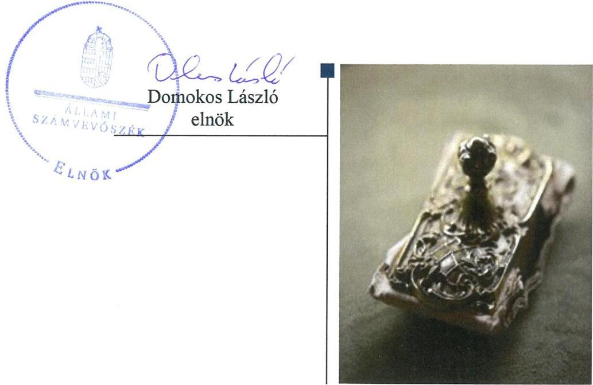
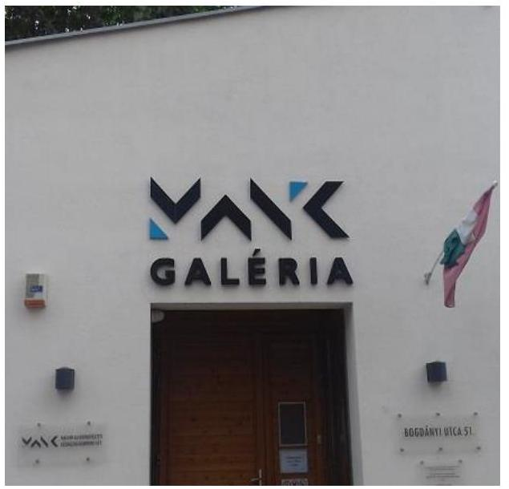

# Jelenetés 

## Az állami tulajdonú gazdasági társaságok ellenőrzése

MANK Magyar Alkotóművészeti Közhasznú Nonprofit Kft.
2018.

---

# Jelentés 

## Az állami tulajdonú gazdasági társaságok ellenőrzése

MANK Magyar Alkotóművészeti Közhasznú Nonprofit Kft.
2018. 10. hó 19. nap

---

# AZ ELLENŐRZÉST FELÜGYELTE:

DR. NÉMETH ERZSÉBET felügyeleti vezető

## AZ ELLENŐRZÉST VEZETTE ÉS A VÉGREHAJTÁSÁÉRT FELELŐS:

JÁNOSI ISTVÁN ellenőrzésvezető

A PROGRAM ÖSSZEÁLLÍTÁSÁÉRT FELELŐS:

TÓTPÁL SZABOLCS osztályvezető

IKTATÓSZÁM: EL-0391-039/2018.

TÉMASZÁM: 2469

ELLENŐRZÉS-AZONOSÍTÓ SZÁM: V081412

Jelentéseink az Országgyűlés számítógépes hálózatán és az Interneten a www.asz.hu címen is olvashatóak.

---

# TARTALOMJEGYZÉK 

■ ÖSSZEGZÉS ..... 5
■ AZ ELLENŐRZÉS CÉLJA ..... 6
■ AZ ELLENŐRZÉS TERÜLETE ..... 7
■ AZ ELLENŐRZÉS HÁTTERE, INDOKOLTSÁGA ..... 9
■ A JELENTÉS LÉNYEGES KÉRDÉSKÖREI ..... 10
■ AZ ELLENŐRZÉS HATÓKÖRE ÉS MÓDSZEREI ..... 11
■ MEGÁLLAPÍTÁSOK ..... 13
■ JAVASLATOK ..... 17
■ MELLÉKLETEK ..... 19
I. sz. melléklet: Értelmező szótár ..... 19
■ FÜGGELÉK: ÉSZREVÉTELEK ..... 21
■ RÖVIDÍTÉSEK JEGYZÉKE ..... 23

---

.

---

# ÖSSZEGZÉS 

A MANK Magyar Alkotóművészeti Közhasznú Nonprofit Kft. pénzügyi gazdálkodása 2013-ban nem volt szabályszerű, 2016-ban szabályszerű volt. A vagyongazdálkodás szabályszerű volt. A Társaság a tulajdonosi joggyakorló irányában történő adatszolgáltatási kötelezettségeinek, valamint a közérdekű adatokra vonatkozó közzétételi kötelezettségének nem tett eleget, ezáltal nem biztosította tevékenységének átláthatóságát és elszámoltathatóságát.

## Az ellenőrzés társadalmi indokoltsága

Az állami tulajdonú gazdálkodó szervezetek ellenőrzése kiemelten fontos a vagyon megőrzése, megóvása érdekében, valamint a kormányzati szektor elszámolásaiban megjelenő állami tulajdonú gazdálkodó szervezetek esetében, amelyekkel szemben alapvető követelmény, hogy gazdálkodásuk, működésük szabályszerű, az általuk szolgáltatott adatok minél megbízhatóbbak legyenek. A kiegyensúlyozott, átlátható és fenntartható költségvetési gazdálkodás érvényesítésének elvét az Alaptörvény rögzíti, a nemzeti vagyon megőrzésének, védelmének és a nemzeti vagyonnal való felelős gazdálkodásnak a követelményeit sarkalatos törvény határozza meg.

A MANK Magyar Alkotóművészeti Közhasznú Nonprofit Kft.-t azzal a céllal alapították, hogy a Magyar Állam művészeteket támogató, mecénás szerepét szervezze, lehetőségeket biztosítson, szolgáltatásokat nyújtson az alkotómunkához.

Az Állami Számvevőszék 2013-2016. évekre kiterjedő ellenőrzése során arra kereste a választ, hogy szabályszerű volt-e a közfeladatot ellátó társaság gazdálkodása és az ehhez kapcsolódó tulajdonosi joggyakorlás.

## Főbb megállapítások, következtetések, javaslatok

Az Emberi Erőforrások Minisztériumának tulajdonosi joggyakorlása a MANK Magyar Alkotóművészeti Közhasznú Nonprofit Kft. felett az ellenőrzött időszakban szabályszerű volt.

A MANK Magyar Alkotóművészeti Közhasznú Nonprofit Kft. működésének szabályozottsága nem felelt meg a jogszabályi előírásoknak, mert nem rendelkezett a szükséges belső szabályzatokkal.

Pénzügyi gazdálkodása 2013-ban nem volt szabályszerű, mert a ráfordítások elszámolása, valamint az államadósságot keletkeztető ügyletek kezelése nem felelt meg a jogszabályi előírásoknak. 2016-ban az elszámolások szabályszerűek voltak.

Éves beszámolókkal kapcsolatos letétbehelyezési és közzétételi kötelezettségeinek eleget tett.
Közérdekű adat közzétételi kötelezettségét, valamint a tulajdonosi joggyakorló irányában fennálló évközi beszámolási kötelezettségét nem teljesítette.

A belső ellenőrzést a jogszabályi előírásoknak megfelelően működtette.
A Társaság vagyongazdálkodása szabályszerű volt. Vagyonnyilvántartása megfelelt a jogszabályi előírásoknak. Éves beszámolóit a számviteli törvény előírásainak megfelelő leltárral alátámasztotta.

---

# AZ ELLENŐRZÉS CÉLJA 

AZ ELLENŐRZÉS CÉLJA annak értékelése volt, hogy a tulajdonosi jogok gyakorlása szabályszerű volt-e. A gazdálkodó szervezet szabályozottsága, gazdálkodása és vagyongazdálkodási tevékenysége megfelelt-e a jogszabályi és a tulajdonosi előírásoknak. A vagyonváltozást eredményező döntések esetében a tulajdonosi jogok gyakorlója és a gazdálkodó szervezet szabályszerűen jártak-e el. Az ellenőrzés célja továbbá annak megítélése volt, hogy a kormányzati szektorba sorolt állami tulajdonban (résztulajdonban) lévő gazdálkodó szervezetek gazdálkodásának a kormányzati szektor hiányára és az államadósságra befolyással bíró elemei a jogszabályi előírásoknak megfeleltek-e.

---

# **AZ ELLENŐRZÉS TERÜLETE**

## **MANK Magyar Alkotóművészeti Közhasznú Nonprofit Kft.**

**A MAGYAR ÁLLAM** a Társaságot^{1} 2011. október 20-án alapította 500 ezer Ft jegyzett tőkével.

**A TULAJDONOSI JOGOKAT** a Társaság felett az ellenőrzött időszakban az MNV Zrt.^{2} – mint a Magyar Állam képviselője – helyett és nevében az Emberi Erőforrások Minisztériuma gyakorolta.

**A TÁRSASÁG** 100 %-os állami tulajdonban lévő, közfeladatot ellátó, közhasznú jogállású szervezet, melynek főtevékenysége egészségügy, oktatás, kultúra, egyéb szociális szolgáltatás igazgatása. A Társaság a Kormány 1151/2011. (V.18.) számú határozata értelmében a Magyar Alkotóművészeti Közalapítvány feladatait vette át a 2012. évben. A Társaság nem általános jogutódja a Közalapítványnak, de vagyonát és vagyonértékű jogait tulajdonba kapta és ezekkel gazdálkodott. A Társaság a Magyar Állam művészeteket támogató, mecénás szerepét szervezte, támogatást nyújtott az alkotómunkához. A Társaság alkotóházakat tartott fenn, kiállítási lehetőséget biztosított az alkotóművészeknek, művészeti és művészetközeli programok teljes körű szakmai és pénzügyi lebonyolítását végezte. A Társaság ellátta továbbá az EMMI^{3} kulturális háttérintézményi feladatainak egy részét is.

A Társaságnál 2014. július 7-én tőkeemelésre került sor, melynek keretében a tulajdonosi joggyakorló a jegyzett tőkét a módosult jogszabályi előírásnak eleget téve három millió Ft-ra emelte.

A Társaság főbb mérleg adatait az 1. táblázat mutatja be.

1. táblázat

|  A TÁRSASÁG FŐBB MÉRLEGADATAI (MILLIÓ FT) |  |  |  |   |
| --- | --- | --- | --- | --- |
|  Megnevezés | 2013.
XII. 21. | 2014.
XII. 21. | 2015.
XII. 21. | 2016.
XII. 21.  |
|  Mérlegfőösszeg | 6743,8 | 7259,4 | 7702,8 | 7927,5  |
|  Saját tőke | 38,4 | 43,8 | 600,7 | 608,1  |
|  Adózott eredmény | 2,7 | 5,4 | 557,0 | 7,3  |
|   |  |  | Forrás: Éves beszámolók |   |

A kiugróan magas 2015. évi adózott eredmény a Társaság nagy értékű ingatlanértékesítési ügyletéből származott, melynek végrehajtását kormányhatározat írta elő.

A Társaság élén ügyvezető^{4} állt, munkáját három tagú felügyelőbizottság^{5} ellenőrizte. Az ügyvezető személye az ellenőrzött időszakban két alkalommal, 2013-ban és 2015-ben változott.

A foglalkoztatottak átlagos statisztikai állományi létszáma a 2013. évi 58 főről 2016-ban 65 főre emelkedett.

---

A Társaság az ellenőrzött időszakban vagyonkezelt vagyonnal nem rendelkezett.

A Társaság a NGM közleménye alapján az ellenőrzött időszak egészében kormányzati szektorba sorolt egyéb szervezet volt.

---

# AZ ELLENŐRZÉS HÁTTERE, INDOKOLTSÁGA 

AZ ÁLLAMI TULAJDONÚ GAZDÁLKODÓ SZERVEZETEK ellenőrzése kiemelten fontos a vagyon megőrzése, megóvása érdekében, valamint a kormányzati szektor elszámolásaiban megjelenő állami tulajdonú gazdálkodó szervezetek esetében, amelyekkel szemben alapvető követelmény, hogy gazdálkodásuk, működésük szabályszerű, az általuk szolgáltatott adatok minél megbízhatóbbak legyenek. Gazdálkodásuk jellemzően a közérdeklődés és a média figyelmének középpontjában áll, amihez hozzájárul a gazdálkodásuk körébe tartozó - közvetlen vagy közvetett állami tulajdonú, tehát végső soron a nemzeti vagyon részét képező - vagyon nagysága, illetve az általuk ellátott közszolgáltatások/közfeladatok minősége és hatékonysága. A közszolgáltatási árképzés megalapozottsága és a rendszeres elszámoltatás feltételeinek kialakítása az ellenőrzése során nagy hangsúlyt kap. A közszolgáltatás árában és annak támogatásában meg kell jelennie az önköltségszámítás szempontjainak, amely biztosítja a működés fenntarthatóságát (eszközpótlást) is.

Az ellenőrzés rámutathat az állami tulajdonú gazdálkodó szervezetek gazdálkodási tevékenységével jó gyakorlatokra és szabálytalanságokra. Felhívhatja a figyelmet a jogszabályi követelmények teljesítéséhez szükséges feltételek hiányosságaira, hozzájárulhat az államháztartáson kívüli, de (közvetlenül vagy közvetve) állami vagyont használó gazdálkodó szervezetek tevékenységének átláthatóságához. Ellenőrzésünk eredményeképpen javaslatainkkal, megállapításainkkal hozzájárulhatunk a nemzeti vagyonnal való gazdálkodás átláthatóságának, elszámoltathatóságának javításához.

---

# A JELENTÉS LÉNYEGES KÉRDÉSKÖREI 

1.     - A tulajdonosi jogok gyakorlása szabályszerű volt-e?
2.     - A Társaság működésének szabályozottsága megfelelt-e az előírásoknak?
3.     - A Társaságnál a pénzügyi-számviteli, adatszolgáltatási és ellenőrzési feladatok ellátása szabályszerű volt-e?
4.     - A Társaság vagyongazdálkodása szabályszerű volt-e?
5.     - A Társaság gazdálkodásának államadósságra befolyással bíró elemei megfeleltek-e a jogszabályi előírásoknak?

---

# AZ ELLENŐRZÉS HATÓKÖRE ÉS MÓDSZEREI 

## Az ellenőrzés típusa

Megfelelőségi ellenőrzés.

## Az ellenőrzött időszak

Az ellenőrzött időszak a 2013. - 2016. évek, a 2016. évi beszámoló jóváhagyásáig tartó időszak.

## Az ellenőrzés tárgya

Az állami tulajdonban (résztulajdonban) lévő gazdasági társaságok gazdálkodása, kiemelten vagyongazdálkodási tevékenysége, a tulajdonosi jogok gyakorlása, továbbá a kormányzati szektorba sorolt gazdasági társaságok gazdálkodásának a kormányzati szektor hiányára és az államadósságra befolyással bíró elemei.

Az ellenőrzés kiterjedt minden olyan körülményre és adatra, amely az ÁSZ ${ }^{6}$ jogszabályban meghatározott feladatainak teljesítéséhez, valamint a program végrehajtása folyamán felmerült újabb összefüggések feltárásához szükséges.

## Az ellenőrzött szervezet

MANK Magyar Alkotóművészeti Közhasznú Nonprofit Kft., valamint a tulajdonosi jogokat gyakorló Emberi Erőforrások Minisztériuma

## Az ellenőrzés jogalapja

Az ellenőrzés jogalapját az ÁSZ tv. ${ }^{7}$ 1. § (3) bekezdése és 5. § (3)-(5) bekezdései képezték.

## Az ellenőrzés módszerei

Az ellenőrzést a nemzetközi standardokat irányadónak tekintve az ellenőrzési program ellenőrzési kérdései, az ellenőrzött időszakban hatályos jogszabályok, az ellenőrzés szakmai szabályok és módszertanok figyelembe vételével végeztük.

---

Az ellenőrzés ideje alatt az ellenőrzött szervezettel történő kapcsolattartást az ÁSZ Szervezeti és Működési Szabályzatának vonatkozó előírásai alapján biztosítottuk.

Az ellenőrzési kérdések megválaszolásához szükséges bizonyítékok megszerzése a következő ellenőrzési eljárások alkalmazásával történt: megfigyelés, kérdésfeltevés (információkérés), összehasonlítás, valamint elemző eljárás. Az ellenőrzési bizonyítékként felhasználható adatforrások közé tartoznak egyrészt az ellenőrzési programban felsorolt adatforrások, másrészt adatforrás lehet még minden - az ellenőrzés folyamán - feltárt, az ellenőrzés szempontjából információkat tartalmazó dokumentum.

Az ellenőrzést a kérdésekre adott válaszok kiértékelésével, valamint a megjelölt adatforrások, a csatolt tanúsítványok felhasználásával, továbbá az adott időszakban hatályos jogszabályok figyelembe vételével kellett lefolytatni.

A teljes ellenőrzött időszakra vonatkozóan került ellenőrzésre a gazdasági társaság tervezési, beszámolási, közzétételi, adatszolgáltatási kötelezettségének, valamint belső ellenőrzési tevékenységének szabályszerűsége. A 2013. és 2016. évekre vonatkozóan a gazdasági társaság működésének szabályozottságát, a bevételei és ráfordításai elszámolását, illetve vagyongazdálkodásának szabályszerűségét is ellenőriztük.

A személyi jellegű ráfordítások esetében az ellenőrzött tételek kijelölése véletlen mintavételi eljárás alkalmazásával történt a teljes sokaságból.

A bevételek és a ráfordítások, valamint az immateriális javak, tárgyi eszközök esetében az ellenőrzés azokra a legnagyobb értékű tételekre - a lényeges sokaságra - terjedt ki, melyek összértéke eléri a teljes sokaság összértékének 50%-át.

A 2016. évi ráfordítások elszámolásának szabályszerűségét a lényeges sokaságból véletlen mintavételi eljárással kiválasztott tételek alapján ellenőriztük.

A mintavétellel ellenőrzött területek esetében minden egyes tétel vonatkozásában a szabályszerűségre vonatkozó kérdéseket tettünk fel, amelyek eredménye összesítésre került. „Szabályszerűnek" értékeltünk egy ellenőrzött területet, amennyiben 95%-os bizonyossággal az ellenőrzött sokaságban az átlagos hibaarány legfeljebb 10%, "nem szabályszerűnek", amennyiben 10%-nál magasabb arányt képviselt.

---

# 1. A tulajdonosi jogok gyakorlása szabályszerű volt-e? 

Összegző megállapítás

A tulajdonosi jogok gyakorlása szabályszerű volt.
A TULAJDONOSI JOGGYAKORLÁS KERETEIT az EMMI a jogszabályi előírásoknak megfelelően határozta meg belső szabályzataiban és a Társaság Alapító Okiratában ${ }_{1-11}{ }^{8}$. Az Alapító Okirat ${ }_{1-11}$ a Gt. ${ }^{9}$ és a Ptk. ${ }^{10}$ jogszabályi előírásaival összhangban szabályozta a Társaság feladat- és hatásköreit. Az Alapító Okirat ${ }_{1-11}$ a Társaság ügyvezetője részére üzleti terv készítését, valamint negyedéves rendszerességgel évközi beszámolási, tájékoztatási kötelezettséget írt elő.

A TÁRSASÁG ÉVES ÜZLETI TERVEIT az EMMI jóváhagyta.

A VAGYONVÁLTOZÁST eredményező ügyletek vonatkozásában az EMMI a jogszabályi előírásoknak és a belső szabályzatoknak megfelelően hozott döntéseket.

A TÁRSASÁG ÉVES BESZÁMOLÓIT az EMMI a jogszabályi előírásoknak megfelelően, a független könyvvizsgálói jelentés és a felügyelőbizottság írásbeli jelentésének ismeretében fogadta el.

## 2.
 A Társaság működésének szabályozottsága megfelelt-e az előírásoknak?

Összegző megállapítás

A Társaság működésének szabályozottsága nem felelt meg a jogszabályi előírásoknak.

SZMSZ-szel a Társaság a 2013. évben az Alapító Okirat ${ }_{1-11}$-ban foglalt előírás ellenére nem rendelkezett. A tulajdonosi joggyakorló a Társaság SZMSZ ${ }_{1-2}{ }^{11}$-ét első alkalommal X/2013. AH (2014.01.15) számú határozatával fogadta el.

A SZÁMVITELI POLITIKÁT ${ }_{1-3}{ }^{12}$, valamint annak keretében az eszköz-forrás értékelési szabályzatot ${ }_{1-3}{ }^{13}$, a leltározási szabályzatot ${ }_{1-3}{ }^{14}$ és pénzkezelési szabályzatot ${ }_{1-3}{ }^{15}$ a Társaság a Számv. tv. ${ }^{16}$ előírásainak megfelelően elkészítette, azonban a Számv. tv. 14. § (5) bekezdés c) pontjában foglaltakkal ellentétben nem rendelkezett önköltségszámítási szabályzattal, annak ellenére, hogy a Számv. tv. 14. § (6) bekezdésében foglaltak alapján nem mentesült az önköltségszámítási szabályzat készítésének kötelezettsége alól.

---

SZÁMLARENDDEL ${ }^{17}$ a Társaság rendelkezett, amelyben főkönyvi számlacsoport mélységű bontásban szabályozták a főkönyvi számlák tartalmát, a főkönyvi számlacsoportok értéke növekedésének és csökkenésének jogcímeit, más főkönyvi számlacsoportokkal, analitikus nyilvántartásokkal való kapcsolatát. Ugyanakkor a számlarend nem felelt meg teljes körűen a Számv. tv. 161. § (2) bek. a) és b) pontjaiban foglalt előírásoknak, mivel nem tartalmazta tételesen minden alkalmazásra kijelölt főkönyvi számlák számlajelét és megnevezését, a számla tartalmát, a számla értéke növekedésének és csökkenésének jogcímeit.

JAVADALMAZÁSI SZABÁLYZATTAL ${ }^{18}$ a Társaság rendelkezett, amely megfelelt a Taktv. ${ }^{19}$ előírásainak.

# 3. A Társaságnál a pénzügyi-számviteli, adatszolgáltatási és ellenőrzési feladatok ellátása szabályszerű volt-e? 

Összegző megállapítás

A Társaság pénzügyi-számviteli tevékenysége 2013-ban nem volt szabályszerű, 2016-ban szabályszerű volt. Közérdekű adat közzétételi kötelezettségét, valamint a tulajdonosi joggyakorló irányában fennálló évközi beszámolási kötelezettségét nem teljesítette. A belső ellenőrzést a jogszabályi előírásoknak megfelelően működtette.

A bevételek és a ráfordítások elszámolása 2013-ban nem volt szabályszerű, 2016-ban szabályszerű volt.

AZ ANYAGJELLEGŰ RÁFORDÍTÁSOK, valamint az egyéb, a rendkívüli és a pénzügyi műveletek ráfordításainak elszámolása 2016-ban szabályszerű volt, 2013-ban nem volt szabályszerű. A 2013. évben az elszámolást nem támasztották alá a Számv. tv. 165. § (1) bekezdésének és 166. § (2) bekezdésének megfelelő bizonylatokkal, mivel a szállítók által kibocsátott számlákon szereplő szolgáltatás tartalma és összege nem egyezett meg a kapcsolódó szerződésben foglalt tartalommal és összeggel.

A BEVÉTELEK, A SZEMÉLYI JELLEGŰ RÁFORDÍTÁSOK ÉS AZ ÉRTÉKCSÖKKENÉS ELSZÁMOLÁSA szabályszerű volt, megfelelt a Számv. tv. és a Számviteli politika ${ }_{1-3}$ előírásainak.

A Társaság az éves beszámolókkal kapcsolatos letétbehelyezési és közzétételi kötelezettségének eleget tett. Közérdekű adatszolgáltatási kötelezettségét, valamint a tulajdonosi joggyakorló irányában fennálló évközi beszámolási kötelezettségét nem teljesítette. A belső ellenőrzés működése szabályszerű volt.

## LETÉTBEHELYEZÉSI ÉS KÖZZÉTÉTELI KÖTELE-

ZETTSÉGEINEK a Társaság a 2014-2016. évi éves beszámolók vonatkozásában a jogszabályi előírásoknak megfelelően eleget tett. Ugyan-

---

akkor a 2013. évi beszámolót a Számv. tv. 153. § (1) bekezdésében meghatározott határidőhöz képest 23 nappal később, 2014. június 23-án helyezte letétbe és tette közzé a céginformációs szolgálat honlapján.

BESZÁMOLÁSI KÖTELEZETTSÉGÉNEK a Társaság nem tett eleget, mivel az Alapító Okiratban ${ }_{1-11}$ foglalt előírás ellenére nem készített rendszeres évközi jelentést működéséről és vagyoni helyzetéről a tulajdonosi joggyakorló és a felügyelőbizottság részére.

A KÖZÉRDEKŰ ADATOK közzétételére vonatkozó, az Info tv. ${ }^{20}$ 37. § (1) bekezdésében előírt kötelezettségét nem teljesítette, mert az Info tv. 1. melléklete I.11, II.1, II.13, valamint III.2-3 pontjaiban szereplő információkat sem a Társaság, sem a tulajdonosi joggyakorló internetes honlapján, sem erre a célra létrehozott más, központi honlapon nem jelenítette meg.

A Társaság az Info tv. 35. § (3) bekezdésében foglalt előírás ellenére nem rendelkezett a kötelezően közzéteendő közérdekű adatok közzétételi kötelezettségének teljesítési szabályait tartalmazó szabályzattal.

A BELSŐ ELLENŐRZÉST a Társaság kormányzati szektorba sorolt szervezetként az ellenőrzött időszakban a Bkr. ${ }^{21}$ előírásainak megfelelően működtette. A Társaság intézkedett a belső ellenőrzés javaslatainak végrehajtása érdekében.

# 4. A Társaság vagyongazdálkodása szabályszerű volt-e? 

## Összegző megállapítás

A Társaság vagyongazdálkodása szabályszerű volt. Vagyonnyilvántartása megfelelt az előírásoknak.

A VAGYONGAZDÁLKODÁSSAL kapcsolatos feladat és hatáskörök a Társaság Alapító Okiratában ${ }_{1-11}$ és belső szabályzataiban meghatározásra kerültek. A Társaság az ellenőrzött időszakban az üzleti tervek részéként elkészítette a beruházási terveket.

A Társaság 2013. és 2016. évi éves beszámolóinak mérlegét a Számv. tv. előírásainak megfelelő leltárral alátámasztotta.

A vagyonnyilvántartás megfelelt a Számv. tv. és a Társaság belső szabályzatai előírásainak.

## 5. A Társaság gazdálkodásának államadósságra befolyással bíró elemei megfeleltek-e a jogszabályi előírásoknak?

Összegző megállapítás

A Társaság államadósságot keletkeztető ügyleteivel kapcsolatos gazdasági események 2013-ban nem feleltek meg a jogszabályi előírásoknak. 2016-ban szabályszerűek voltak.

ÁLLAMADÓSSÁGOT keletkeztető ügyleteket a Társaság az ellenőrzött időszakban kezelt.

---

A Társaság 2012-ben 4,3 millió Ft összegű négy éves futamidejű, 2013-ban 2,8 millió Ft összegű négy éves futamidejű, 2014-ben 4,8 millió Ft összegű három éves futamidejű, összesen 11,9 millió Ft összegű pénzügyi lízing szerződést kötött gépkocsi vásárlások finanszírozása céljából. Az ellenőrzött időszakban hatályos szerződések vonatkozásában azonban a 353/2011 (XII.30) Korm. rendelet 11. § (1) bekezdésében foglalt előírás ellenére a szerződések megkötéséhez az államháztartásért felelős miniszter előzetes hozzájárulásának megszerzése érdekében kérelmét nem küldte meg a tulajdonosi joggyakorlónak. A Társaság az adósságot keletkeztető ügyleteket a Stabilitási tv. ${ }^{22}$ 9. § (1) bekezdésében foglalt előírás ellenére az államháztartásért felelős miniszter előzetes hozzájárulása nélkül kötötte meg.

Az ügyletek számviteli elszámolása szabályszerű volt.

---

# JAVASLATOK 

Az ÁSZ tv. 33. § (1) bekezdésében foglaltak értelmében az ellenőrzött szervezet vezetője köteles a jelentésben foglalt megállapításokhoz kapcsolódó intézkedési tervet összeállítani és azt a jelentés kézhezvételétől számított 30 napon belül az ÁSZ részére megküldeni. Amennyiben az ellenőrzött szervezet vezetője nem küldi meg határidőben az intézkedési tervet, vagy továbbra sem elfogadható intézkedési tervet küld, az Állami Számvevőszék elnöke az ÁSZ tv. 33. § (3) bekezdése a) és b) pontjaiban foglaltakat érvényesítheti.

## a MANK Magyar Alkotóművészeti Közhasznú Nonprofit Kft. ügyvezetőjének

1. Gondoskodjon az önköltségszámítás rendjére vonatkozó belső szabályzat elkészítéséről a Számv. tv. előírásainak megfelelően.
(2. sz. megállapítás 2. bekezdése alapján)
2. Intézkedjen a Számlarend Számv. tv. előírásainak megfelelő kiegészítéséről.
(2. sz. megállapítás 3. bekezdése alapján)
3. Intézkedjen az Info tv. által előírt közzétételi kötelezettség teljesítéséről.
(3.2 sz. megállapítás 3. bekezdése alapján)
4. Intézkedjen az Info tv. előírásainak megfelelően a kötelezően közzéteendő közérdekű adatok közzétételi kötelezettségének teljesítési szabályait tartalmazó szabályzat elkészítéséről.
(3.2. sz. megállapítás 4. bekezdése alapján)
5. Adósságot keletkeztető ügyletek esetén az államháztartásért felelős miniszter előzetes hozzájárulására vonatkozó kérelmét küldje meg a tulajdonosi joggyakorlónak.
(5. sz. megállapítás 2. bekezdése alapján)

---

.

---

# MELLÉKLETEK 

- I. SZ. MELLÉKLET: ÉRTELMEZŐ SZÓTÁR
állami vagyon
gazdasági társaság
kormányzati szektorba sorolt egyéb szervezet
nemzeti vagyon
a) Az állam tulajdonában lévő dolog, valamint a dolog módjára hasznosítható természeti erő,
b) az a) pont hatálya alá nem tartozó mindazon vagyon, amely vonatkozásában törvény az állam kizárólagos tulajdonjogát nevesíti,
c) az állam tulajdonában lévő tagsági jogviszonyt megtestesítő értékpapír, illetve az államot megillető egyéb társasági részesedés,
d) az államot megillető olyan immateriális, vagyoni értékkel rendelkező jogosultság, amelyet jogszabály vagyoni értékű jogként nevesít.
Forrás: Vtv. ${ }^{23} 1 . \S$ (2) bekezdése
e) az állam tulajdonában lévő pénzügyi eszközök
Forrás: Vtv. 1. § (2) bekezdése
A Ptk. 3:88. § (1) bekezdése szerint „a gazdasági társaságok üzletszerű közös gazdasági tevékenység folytatására, a tagok vagyoni hozzájárulásával létrehozott, jogi személyiséggel rendelkező vállalkozások, amelyekben a tagok a nyereségből közösen részesednek, és a veszteséget közösen viselik".
Az a szervezet, amely az Áht. alapján nem része az államháztartásnak, azonban az Európai Közösséget létrehozó szerződéshez csatolt, a túlzott hiány esetén követendő eljárásról szóló jegyzőkönyv alkalmazásáról szóló 2009. május 25-i 479/2009/EK rendelet szerint a kormányzati szektorba tartozik. A nemzetgazdasági miniszter 2013. június 26-án megjelent Közleményben tette közé ezen szervezetek listáját
a) az állam vagy a helyi önkormányzat kizárólagos tulajdonában álló dolgok,
b) az a) pont hatálya alá nem tartozó, állam vagy a helyi önkormányzat tulajdonában lévő dolog,
c) az állam vagy a helyi önkormányzat tulajdonában lévő pénzügyi eszközök, továbbá az államot vagy a helyi önkormányzatot megillető társasági részesedések,
d) az államot vagy a helyi önkormányzatot megillető bármely vagyoni értékkel rendelkező jogosultság, amelyet jogszabály vagyoni értékű jogként nevesít,
e) Magyarország határa által körbezárt terület feletti légtér,
f) az üvegházhatású gázok kibocsátási egységeinek kereskedelméről szóló törvény szerint kibocsátási egység és légiközlekedési kibocsátási egység, valamint az ENSZ Éghajlatváltozási Keretegyezménye és annak Kiotói Jegyzőkönyv végrehajtási keretrendszeréről szóló törvény szerinti kiotói egység,
g) állami vagy helyi önkormányzati fenntartású közgyűjtemény (muzeális intézmény, levéltár, közgyűjteményként működő kép- és hangarchívum, valamint könyvtár) saját gyűjteményében nyilvántartott kulturális javak körébe tartozó dolog, kivéve, ha az állami vagy önkormányzati tulajdon jogszerű létrejötte kétséget kizáró módon nem bizonyítható és a dologra nézve más a tulajdonjogát bizonyítja vagy a kulturális javakra vonatkozó jogszabályokban meghatározott eljárás keretében valószínűsíti (g. pont módosult 2013. december 7-től),
h) a régészeti lelet,
i) a nemzeti adatvagyon körébe tartozó állami nyilvántartások fokozottabb védelméről szóló törvény szerinti nemzeti adatvagyon.
Forrás: Nvtv. ${ }^{24} 1 . \S$ (2)

---

tulajdonosi jogok gyakorlója

# 1. 

2013. június 27-ig:

Az állami vagyon felett a Magyar Államot megillető tulajdonosi jogok és kötelezettségek összességét - ha törvény eltérően nem rendelkezik - az állami vagyon felügyeletéért felelős miniszter (a továbbiakban: miniszter) gyakorolja, aki e feladatát a Magyar Nemzeti Vagyonkezelő Zártkörűen Működő Részvénytársaság (a továbbiakban: MNV Zrt.), a Magyar Fejlesztési Bank, illetve a tulajdonosi joggyakorló szervezet útján látja el. A miniszter miniszteri rendeletben, a törvényben meghatározott állami vagyoni kör tekintetében, meghatározott időtartamra, a joggyakorlás egyes szabályainak meghatározásával - az őt megillető tulajdonosi jogok és kötelezettségek összességének, illetve azok meghatározott részének gyakorlóját az Áht. szerinti központi költségvetési szervek, ezek intézménye, továbbá a 100%-ban állami tulajdonban álló gazdasági társaságok közül kijelölheti.
Forrás: Vtv. 3. § (1) és (2)
2013. június 28-ától:

A rábízott állami vagyon felett az államot megillető tulajdonosi jogok és kötelezettségek összességét tulajdonosi joggyakorlóként:
a) ha törvény vagy miniszteri rendelet eltérően nem rendelkezik, a Magyar Nemzeti Vagyonkezelő Zártkörűen Működő Részvénytársaság (a továbbiakban: MNV Zrt.),
b) törvényben kijelölt személy vagy
c) az állami vagyon felügyeletéért felelős miniszter (a továbbiakban: miniszter) által rendeletben kijelölt személy gyakorolja.
[...] A miniszter e törvény felhatalmazása alapján - a meghatározott célok hatékonyabb elérése érdekében, miniszteri rendeletben, az ott meghatározott állami vagyoni kör tekintetében, meghatározott időtartamra - e törvény keretei között, a joggyakorlás egyes szabályainak meghatározásával - az államot megillető tulajdonosi jogok és kötelezettségek összességének, illetve azok meghatározott részének gyakorlóját az Áht. szerinti központi költségvetési szervek, ezek intézménye, továbbá a 100%-ban állami tulajdonban álló gazdasági társaságok közül kijelölheti.
Forrás: Vtv. 3. § (1) és (2)
2.

Aki a nemzeti vagyon felett az államot vagy a helyi önkormányzatot megillető tulajdonosi jogok és kötelezettségek összességének gyakorlására jogosult
Forrás: Nvtv. 3. § (1) 17. pontja

---

# FÜGGELÉK: ÉSZREVÉTELEK 

A jelentéstervezetet a Számvevőszék 15 napos észrevételezésre megküldte az ellenőrzött szervezetek vezetőinek az ÁSZ tv. 29.
 §* (1) bekezdése előírásának megfelelően.

Az ellenőrzött szervezetek vezetői a jelentéstervezet megállapításaira nem tettek észrevételt.

[^0]
[^0]:    * 29. § (1) Az Állami Számvevőszék az ellenőrzési megállapításait megküldi az ellenőrzött szervezet vezetőjének vagy az általa megbízott személynek, és annak, akinek személyes felelősségét állapította meg.
    (2) Az ellenőrzött szervezet vezetője és a felelősként megjelölt személy az ellenőrzés megállapításaira tizenöt napon belül írásban észrevételt tehet.
    (3) Az Állami Számvevőszék az észrevételre a beérkezésétől számított harminc napon belül írásban válaszol. A figyelembe nem vett észrevételeket köteles a jelentésben feltüntetni, és megindokolni, hogy azokat miért nem fogadta el.

---

.

---

# RÖVIDÍTÉSEK JEGYZÉKE 

${ }^{1}$ Társaság
${ }^{2}$ MNV Zrt.
${ }^{3}$ EMMI
${ }^{4}$ ügyvezető
${ }^{5}$ felügyelőbizottság
${ }^{6}$ ÁSZ
${ }^{7}$ ÁSZ tv.
${ }^{8}$ Alapító Okirat ${ }_{1-11}$
${ }^{9}$ Gt.
${ }^{10}$ Ptk.
${ }^{11}$ SZMSZ $_{1-2}$
${ }^{12}$ számviteli politika $_{1-3}$
${ }^{13}$ eszköz-forrás értékelési szabályzat ${ }_{1-3}$
${ }^{14}$ leltározási szabályzat ${ }_{1-2}$
${ }^{15}$ pénzkezelési szabályzat ${ }_{1-3}$
${ }^{16}$ Számv. tv.
${ }^{17}$ számlarend
${ }^{18}$ javadalmazási szabályzat ${ }_{1-2}$
${ }^{19}$ Taktv.
${ }^{20}$ Info tv.
${ }^{21}$ Bkr.
${ }^{22}$ Stabilitási tv.
${ }^{23}$ Vtv.
${ }^{24}$ Nvtv.

MANK Magyar Alkotóművészeti Közhasznú Nonprofit Kft.
Magyar Nemzeti Vagyonkezelő Zrt.
Emberi Erőforrások Minisztériuma
A Társaság ügyvezetője
A Társaság felügyelőbizottsága
Állami Számvevőszék
2011. évi LXVI. törvény az Állami Számvevőszékről (hatályos: 2011. július 1-jétől)

A Társaság egységes szerkezetbe foglalt Alapító okirata (hatályos: 2012. október 18-ától, 2013. április 25-étől, 2013. augusztus 12-étől, 2014. május 20-ától, 2014. december 31-étől, 2015. június 18-ától, 2015. október 29-étől, 2016. május 12-étől, 2016. augusztus 11-étől, 2016. november 22-étől, 2016. december 29-étől)
2006. évi IV. törvény a gazdasági társaságokról (hatályos 2014. március 14-éig)
2013. évi V. törvény a Polgári Törvénykönyvről (hatályos: 2014. március 15-étől)
A Társaság Szervezeti- és Működési Szabályzata (hatályos: 2014. január 15-étől, 2014. december 31-étől)

A Társaság számviteli politikája (hatályos 2012. október 8-ától, 2014. március 31-étől, 2015. február 2-ától)

A Társaság eszköz és forrás értékelési szabályzata (hatályos 2012. október 8-ától, 2014. március 31-étől, 2015. február 2-ától)

A Társaság leltározási szabályzata (hatályos 2012. július 1-jétől, 2015. március 1-jétől)

A Társaság pénzkezelési szabályzata (hatályos 2012. október 8-ától, 2015. január 5-étől, 2015. december 8-ától)
2000. évi C. törvény a számvitelről (hatályos: 2001. január 1-jétől)

A Társaság számlarendje (hatályos 2012. október 8-ától)
A Társaság Javadalmazási Szabályzata (hatályos 2012. március 19-étől, 2015. október 29-étől)
2009. évi CXXII. törvény a köztulajdonban álló gazdasági társaságok takarékosabb működéséről (hatályos 2009. december 4-étől)
2011. évi CXII. törvény az információs önrendelkezési jogról és az információszabadságról (hatályos: 2011. július 27-étől)
370/2011. (XII. 31.) Korm. rendelet a költségvetési szervek belső
kontrollrendszeréről és belső ellenőrzéséről (hatályos: 2011. december 31-étől)
Magyarország gazdasági stabilitásáról szóló 2011. évi CXCIV. törvény (hatályos: 2011. december 31-étől)
2007. évi CVI. törvény az állami vagyonról (hatályos: 2007. szeptember 25-étől)
2011. évi CXCVI. törvény a nemzeti vagyonról (hatályos: 2011. december 31-étől)

---

ÁLLAMI SZÁMVEVŐSZÉK
1052 Budapest, Apáczai Csere János utca 10.
Levélcím: 1364 Budapest 4. Pf. 54
Telefon: +36 14849100 Telefax: +36 14849200
www.asz.hu
