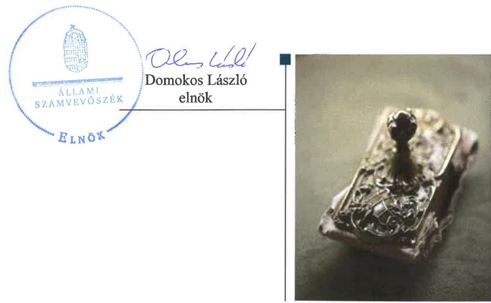
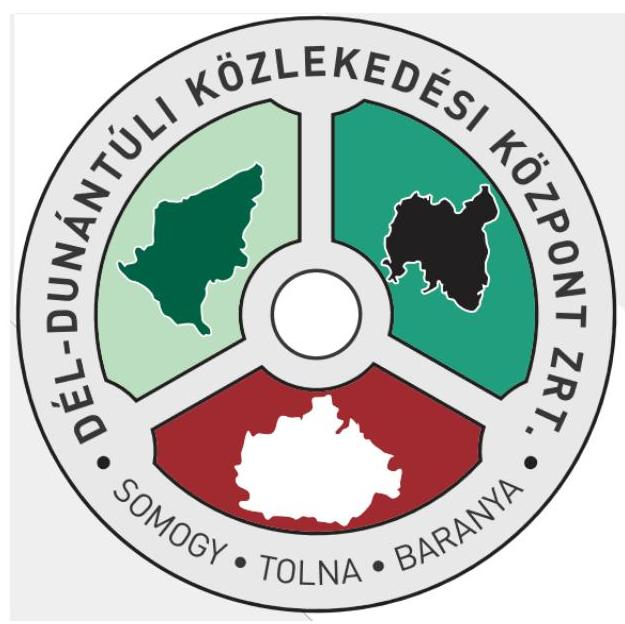

# Jelentés 

## Az állami tulajdonú gazdasági társaságok ellenőrzése

Dél-dunántúli Közlekedési Központ Zrt. 2018.

18278
www.asz.hu

---

# Jelentés 

## Az állami tulajdonú gazdasági társaságok ellenőrzése

Dél-dunántúli Közlekedési Központ Zrt.
2018. 10 hó 02 nap

---

# AZ ELLENŐRZÉST FELÜGYELTE: 

PETŐ KRISZTINA felügyeleti vezető

## AZ ELLENŐRZÉST VEZETTE ÉS A VÉGREHAJTÁSÁÉRT FELELŐS:

SALAMIN VIKTOR ellenőrzésvezető

## A PROGRAM ÖSSZEÁLLÍTÁSÁÉRT FELELŐS:

TÓTPÁL SZABOLCS osztályvezető

IKTATÓSZÁM: EL-0414-021/2018

TÉMASZÁM: 2469

## ELLENŐRZÉS-AZONOSÍTÓ SZÁM: V081432

Jelentéseink az Országgyúlés számítógépes hálózatán és az Interneten a www.asz.hu címen is olvashatóak.

---

# TARTALOMJEGYZÉK 

- ÖSSZEGZÉS ..... 5
- AZ ELLENŐRZÉS CÉLJA ..... 6
- AZ ELLENŐRZÉS TERÜLETE ..... 7
- AZ ELLENŐRZÉS HÁTTERE, INDOKOLTSÁGA ..... 8
- A JELENTÉS LÉNYEGES KÉRDÉSKÖREI ..... 9
- AZ ELLENŐRZÉS HATÓKÖRE ÉS MÓDSZEREI ..... 10
- MEGÁLLAPÍTÁSOK ..... 12
- MELLÉKLETEK ..... 15
I. sz. melléklet: Értelmező szótár ..... 15
- FÜGGELÉK: ÉSZREVÉTELEK ..... 17
- RÖVIDÍTÉSEK JEGYZÉKE ..... 19

---

.

---

# ÖSSZEGZÉS 

A Dél-dunántúli Közlekedési Központ Zrt. gazdálkodásának szabályozottsága, gazdálkodása és vagyongazdálkodása 2013. évhez képest 2016-ra javult, szabályszerú volt, így a vagyon megőrzése és az elszámoltathatóság biztositott volt. A Társaság közzétételi kötelezettségének eleget tett, ezzel biztositotta az átláthatóságot. A Magyar Nemzeti Vagyonkezelő Zrt. a tulajdonosi jogait szabályszerüen gyakorolta.

## Az ellenőrzés társadalmi indokoltsága

Az állami tulajdonú gazdálkodó szervezetek ellenőrzése kiemelten fontos a vagyon megőrzése, megóvása érdekében, amelyekkel szemben alapvető követelmény, hogy gazdálkodásuk, múködésük szabályszerű, az általuk szolgáltatott adatok minél megbízhatóbbak legyenek. Az állami tulajdonban álló gazdálkodó szervezetek államot megillető társasági részesedése a nemzeti vagyon részét képezi és legfőbb rendeltetése szerint a közfeladatok ellátását szolgálja.

Az Állami Számvevőszék stratégiájában megfogalmazta, hogy az államháztartáson kívül múködő közfeladat-ellátó rendszerek ellenőrzéseivel hozzájárul ahhoz, hogy a közpénzeket az államháztartáson kívül múködő szervezetek is átlátható, rendezett módon használják fel a közfeladatok szerződésben vállalt ellátása érdekében. Ellenőrzésünk eredményeképpen javaslatainkkal, megállapításainkkal hozzájárulhatunk a nemzeti vagyonnal való gazdálkodás átláthatóságának, elszámoltathatóságának javításához.

Az Állami Számvevőszék céljaival és a társadalmi igénnyel összhangban, valamint a gazdasági társaságok kiemelt fontosságú szerepe miatt került sor a Dél-dunántúli Közlekedési Központ Zrt. ellenőrzésére. Az ellenőrzést a Társaság a feladatellátásából adódó további társadalmi elvárás is indokolta, a régióban a lakosság rendszeresen kapcsolatba kerül a Társasággal a helyi és helyközi személyszállítás tevékenysége révén.

## Főbb megállapítások, következtetések

A Dél-dunántúli Közlekedési Központ Zrt. szabályozottsága 2013. évben nem volt szabályszerű, mert a Társaság számlarenddel a jogszabályi előírás ellenére nem rendelkezett. 2016. évben a Társaság szabályozottsága már megfelelt a jogszabályi előírásoknak.

A Társaság gazdálkodása és vagyongazdálkodása 2013-ban nem volt szabályszerű a szabályozási hiányosságok következtében. 2016-ban a gazdálkodás és vagyongazdálkodás már megfelelt a jogszabályi előírásoknak, így az elszámoltathatóság és a vagyon védelme biztosított volt. 2016-ban a Társaság a szolgáltatás dijait a jogszabályi előírásnak megfelelően önköltségszámítással alapozta meg. A bevételek és ráfordítások elszámolása, illetve a beszámoló 2016ban szabályszerű volt.

A Társaság 2013-2016. években teljesítette beszámolási, közzétételi és adatszolgáltatási kötelezettségét, ezzel biztosította az átláthatóságot.

A Magyar Nemzeti Vagyonkezelő Zrt.-nél a tulajdonosi joggyakorlás kereteinek kialakítása és a Társaság feletti tulajdonosi jogok gyakorlása szabályszerű volt.

A 2016. évre vonatkozóan az Állami Számvevőszék nem tett olyan megállapítást, amelyre az ellenőrzött szervezetek vezetőinek intézkedési kötelezettségét eredményezte volna. Javaslatot megalapozó megállapítás hiányában az Állami Számvevőszék a Dél-dunántúli Közlekedési Központ Zrt. vezérigazgatójának nem fogalmazott meg javaslatot.

---

# AZ ELLENŐRZÉS CÉLJA 

AZ ELLENŐRZÉS CÉLJA annak értékelése, volt, hogy a tulajdonosi jogok gyakorlása szabályszerű volt-e. A Dél-dunántúli Közlekedési Központ Zrt. szabályozottsága, gazdálkodása és vagyongazdálkodási tevékenysége megfelelt-e a jogszabályi és a tulajdonosi előírásoknak; biztosítva volt-e a közfeladatok átláthatósága és elszámoltathatósága érdekében a közszolgáltatás díjának megalapozottsága szabályszerű önköltségszámítással. A vagyonváltozást eredményező döntések esetében a tulajdonosi jogok gyakorlója és a gazdálkodó szervezet szabályszerűen jártak-e el.

---

# AZ ELLENŐRZÉS TERÜLETE 

## Dél-dunántúli Közlekedési Központ Zrt.

A Dél-dunántúli Közlekedési Központ Zrt.-t az MNV Zrt. ${ }^{1}$ alapította 2012. november 19-én. A Társaság ${ }^{2}$ létrehozásának célja a Dél-dunántúli régió három volán társaságát (Gemenc, Kapos, Pannon Volán Zrt.) magába foglaló vállalatcsoport létrehozása volt a társaság csoportszintú irányításának biztosítása, a gazdasági érdekek egységes és hatékony érvényre juttatása érdekében. A Társaság 2013. és 2016. években a magyar állam 100\%-os tulajdonában volt. A magyar állam nevében a részvényesi jogokat az ellenőrzött időszakban az MNV Zrt. gyakorolta.

A 2014 májusában megkezdett átalakítási folyamat eredményeként a régióba tartozó három volán társaság (Gemenc, Kapos, Pannon Volán Zrt.) 2014. december 31. hatállyal beolvadt a Társaságba. Az egyesüléssel létrejött Társaság 2015. január 1-én kezdte meg múködését. A Társaság főtevékenysége ekkortól a közszolgáltatói feladatok körébe tartozó belföldi helyközi, távolsági menetrend szerinti személyszállítás lett. Egyéb tevékenységei körében számottevő volt az üzemanyag és járműalkatrész kiskereskedelem, a gépjármú értékesítés, valamint az autóbusszal végzett egyéb feladatok, a szerződéses járatok és a különjárati személyszállítási. A Társaságnak az apportként rendelkezésére bocsátott vagyon hasznosításából, valamint a múködéshez nem szükséges eszközök értékesítéséből és bérbeadásából is származott bevétele. A Társaság a közszolgáltatási tevékenységével összefüggő, bevételekkel nem fedezett, a közszolgáltatási ellátási kötelezettség miatt felmerült indokolt költségekre a Személyszállítási tv. ${ }^{3} 30 . \S$ (1) bekezdése alapján évente ellentételezést kapott.

A Társaság alapításkori jegyzett tőkéje 20,0 M Ft volt, amely 2016. december 31-re 10 434,1 M Ft-ra nőtt. A Társaságnál az Alapító okirat ${ }_{1-4}{ }^{4}$ és az Alapszabály ${ }_{1-4}{ }^{5}$ előírásának megfelelően Igazgatóság és Felügyelőbizottság múködött.

A Társaság éves nettó árbevétele a beolvadás után 2015-ben 12 558,9 M Ft, 2016-ban 12 111,0 M Ft volt, melyből 2015-ben 378,6 M Ft, 2016ban 315,9 M Ft adózott eredmény realizálódott.

A Vezérigazgató személye az ellenőrzött időszakban nem változott, tevékenységét 2012. november 19-től látta el. Az egyesülés következtében a foglalkoztatottak létszáma az ellenőrzött időszakban 23 fơről 2022 főre emelkedett.

A Társaság az ellenőrzött időszakban a kormányzati szektorba nem tartozó szervezetnek minősült. Vagyonkezelésre, hasznosításra vonatkozó szerződéssel nem rendelkezett, vagyonkezett eszköze nem volt, az állami vagyon apportálásának eredményeként saját tulajdonú vagyonával gazdálkodott. A Társaság az Alapító okirat ${ }_{1-4}$-ben és az Alapszabály ${ }_{1-4}$-ben rögzítettek szerint könyvvizsgálatra kötelezett volt, a könyvvizsgálót az MNV. Zrt., mint alapító jelölte ki.

---

# AZ ELLENŐRZÉS HÁTTERE, INDOKOLTSÁGA 

Az Európai Unióban 1994. év óta hatályos túlzott hiány eljárás mindig kihívást jelentett a tagállamok számára. Az állami tulajdonú gazdálkodó szervezetek ellenőrzése kiemelten fontos a vagyon megőrzése, megóvása érdekében, valamint a kormányzati szektor elszámolásaiban megjelenő állami tulajdonú gazdálkodó szervezetek esetében, amelyekkel szemben alapvető követelmény, hogy gazdálkodásuk, múködésük szabályszerű, az általuk szolgáltatott adatok minél megbízhatóbbak legyenek. Gazdálkodásuk jellemzően a közérdeklődés és a média figyelmének középpontjában áll, amihez hozzájárul a gazdálkodásuk körébe tartozó - közvetlen vagy közvetett állami tulajdonú, tehát végső soron a nemzeti vagyon részét képező - vagyon nagysága, illetve az általuk ellátott közszolgáltatások/közfeladatok minősége és hatékonysága.

Az ellenőrzés rámutathat az állami tulajdonú gazdálkodó szervezetek gazdálkodási tevékenységével jó gyakorlatokra és szabálytalanságokra. Felhívhatja a figyelmet a jogszabályi követelmények teljesítéséhez szükséges feltételek hiányosságaira, hozzájárulhat az államháztartáson kívüli, de (közvetlenül vagy közvetve) állami vagyont használó gazdálkodó szervezetek tevékenységének átláthatóságához. Ellenőrzésünk eredményeképpen javaslatainkkal, megállapításainkkal hozzájárulhatunk a nemzeti vagyonnal való gazdálkodás átláthatóságának, elszámoltathatóságának javításához.

---

# A JELENTÉS LÉNYEGES KÉRDÉSKÖREI 

1. A tulajdonosi jogok gyakorlása szabályszerű volt-e?
2. A Társaság szabályozottsága megfelelt-e a jogszabályi előírásoknak, a Társaságnál a gazdálkodási, vagyongazdálkodási és adatszolgáltatási feladatok ellátása szabályszerű volt-e?

---

# AZ ELLENŐRZÉS HATÓKÖRE ÉS MÓDSZEREI 

## Az ellenőrzés típusa

Megfelelőségi ellenőrzés.

## Az ellenőrzött időszak

2013-2016. évek, a 2016. évi beszámoló jóváhagyásáig tartó időszak.

## Az ellenőrzés tárgya

Állami tulajdonban lévő gazdasági társaság gazdálkodása, kiemelten vagyongazdálkodási tevékenysége, a tulajdonosi jogok gyakorlása.

## Az ellenőrzött szervezet

Dél-dunántúli Közlekedési Központ Zrt., valamint a tulajdonosi jogokat gyakorló Magyar Nemzeti Vagyonkezelő Zrt.

## Az ellenőrzés jogalapja

Az ellenőrzés jogszabályi alapját az az Állami Számvevőszékről szóló 2011. évi LXVI. törvény 1. § (3) bekezdése és 5. § (3)-(5) bekezdései képezték.

## Az ellenőrzés módszerei

Az ellenőrzést a nemzetközi standardokat irányadónak tekintve az ellenőrzési program ellenőrzési kérdései, az ellenőrzött időszakban hatályos jogszabályok, az ellenőrzés szakmai szabályok és módszertanok figyelembe vételével végeztük.

Az ellenőrzés ideje alatt az ellenőrzött szervezettel történő kapcsolattartást az ÁSZ ${ }^{6}$ Szervezeti és Müködési Szabályzatának vonatkozó előírásai alapján biztosítottuk.

Az ellenőrzésre a nemzetgazdasági szempontból kiemelt jelentőségű nemzeti vagyon körébe tartozó gazdálkodó szervezeteknél és a többségi állami tulajdonban álló gazdálkodó szervezeteknél került sor. A program szerinti feladatokat a kiválasztott gazdálkodó szervezeteknél (társaságoknál) és azok többségi tulajdonban lévő leányvállalatainál, valamint a tulajdonosi jogok gyakorlójánál kellett végrehajtani. Az ellenőrzés szempontjai

---

és az ellenőrzés alá vont gazdálkodó szervezetek köre az ellenőrzés tapasztalatai alapján nem változott.

A személyi jellegű ráfordítások esetében az ellenőrzött tételek kijelölése véletlen mintavételi eljárás alkalmazásával történt a teljes sokaságból.

A bevételek és a ráfordítások valamint az immateriális javak, tárgyi eszközök esetében az ellenőrzés azokra a legnagyobb értékű tételekre - a lényeges sokaságra - terjedt ki, melyek összértéke eléri a teljes sokaság összértékének 50\%-át.

A 2016. évi bevételek és a ráfordítások valamint az immateriális javak, tárgyi eszközök elszámolásának szabályszerűségét a lényeges sokaságból véletlen mintavételi eljárással kiválasztott tételek alapján ellenőriztük.

A mintavétellel ellenőrzött területek esetében minden egyes tétel vonatkozásában a szabályszerűségre vonatkozó kérdéseket tettünk fel, amelyek eredménye összesítésre került. „Szabályszerűnek" értékeltünk egy ellenőrzött területet, amennyiben 95\%-os bizonyossággal az ellenőrzött sokaságban az átlagos hibaarány legfeljebb 10\%, "nem szabályszerűnek", amennyiben 10\%-nál magasabb arányt képviselt.

Az ellenőrzési kérdések megválaszolásához szükséges bizonyítékok megszerzése a következő ellenőrzési eljárások alkalmazásával történt: megfigyelés, kérdésfeltevés (információkérés), összehasonlítás, valamint elemző eljárás. Az ellenőrzési bizonyítékként felhasználható adat-források közé tartoztak egyrészt az ellenőrzési programban felsorolt adatforrások, másrészt adatforrás lehet még minden - az ellenőrzés folyamán - feltárt, az ellenőrzés szempontjából információkat tartalmazó dokumentum.

A teljes ellenőrzött időszakra vonatkozóan került ellenőrzésre a gazdasági társaság tervezési, beszámolási, közzétételi, adatszolgáltatási kötelezettségének, valamint belső ellenőrzési tevékenységének szabályszerűsége. A 2013. és 2016. évekre vonatkozóan a tulajdonosi joggyakorlást, a gazdasági társaság múködésének szabályozottságát, a bevételei és ráfordításai elszámolását, illetve vagyongazdálkodásának szabályszerűségét is ellenőriztük.

Az ellenőrzést a kérdésekre adott válaszok kiértékelésével, valamint a megjelölt adatforrások, a csatolt tanúsítványok felhasználásával, továbbá az adott időszakban hatályos jogszabályok figyelembe vételével folytattuk le.

---

# 1. A tulajdonosi jogok gyakorlása szabályszerű volt-e? 

Összegző megállapítás

Az MNV Zrt. tulajdonosi joggyakorlása 2013. és 2016. években szabályszerű volt.

A TULAJDONOSI JOGGYAKORLÁS KERETEIT az MNV Zrt. kialakította, az SZMSZ ${ }_{1-5}{ }^{7}$-ben szabályozta. Az SZMSZ ${ }_{1-5}$-ben meghatározott feladatok részletes szabályait a tulajdonosi joggyakorlás területeire vonatkozó belső szabályzatokkal és vezérigazgatói utasításokkal biztosította. Az MNV Zrt. a tulajdonosi joggyakorlás rendjét a Társaság az Alapító okirat ${ }_{1-4}$-ben és az Alapszabály ${ }_{2-4}$-ben kialakította, amely megfelelt a Gt. ${ }^{8}$-ben, illetve a Ptk. ${ }^{9}$-ban foglalt előírásoknak. Az MNV Zrt. a jogszabályi előírásoknak megfelelően a Monitoring szabályzat ${ }_{1-2}{ }^{10}$-ben, valamint a Portfóliós kódex ${ }_{1-2}{ }^{11}$-ben alakította ki a részesedések feletti tulajdonosi jogok gyakorlásának rendjét a Társaságnál.

A TULAJDONOSI JOGGYAKORLÁS 2013. és 2016. években szabályszerű volt. Az Alapító okirat ${ }_{1-4}$-ben és az Alapszabály ${ }_{2-4}$-ben foglaltak szerint a Társaság három főből álló Felügyelőbizottságának elnökét és tagjait, valamint a könyvvizsgálót a Taktv. ${ }^{12}$, a Gt., illetve a Ptk. előírásainak megfelelően választották meg.

Az MNV Zrt. a Társaság beszámolóit a Gt., illetve a Ptk. előírásainak megfelelően, a Felügyelőbizottság jelentése birtokában jóváhagyta, döntött a nyereség eredménytartalékba helyezéséről. Az MNV Zrt. a Társaság Javadalmazási szabályzatát ${ }_{1-2}{ }^{13}$ a Taktv.-ben foglaltaknak megfelelően megalkotta.

## 2. A Társaság szabályozottsága megfelelt-e a jogszabályi előírásoknak, a Társaságnál a gazdálkodási, vagyongazdálkodási és adatszolgáltatási feladatok ellátása szabályszerű volt-e?

Összegző megállapítás

A Társaság szabályozottsága, gazdálkodása és vagyongazdálkodása 2013-ban nem volt szabályszerű, 2016-ban szabályszerű volt. Az adatszolgáltatási feladatok ellátása szabályszerű volt.
2.1. számú megállapítás

A Társaság múködésének szabályozottsága a számlarend hiánya miatt 2013-ban nem felelt meg a jogszabályi előírásoknak, 2016ban azonban már megfelelő volt.

A Társaság szabályozottsága 2013-ban nem felelt meg a jogszabályi előírásoknak, a Társaság a Számv. tv. ${ }^{14} 161 . \S$ (1) bekezdésében foglalt előírás ellenére számlarenddel nem rendelkezett.

---

A TÁRSASÁG SZABÁLYOZOTTSÁGA 2016. évben megfelel a jogszabályi előírásoknak. Az Alapszabály2-4-ben, valamint a társasági SZMSZ4,5 ${ }^{15}$ rögzítette a múködés alapvető szabályait, a vagyongazdálkodással kapcsolatos feladat- és hatásköröket, felelősségi viszonyokat.

A Társaság rendelkezett Számviteli politikával ${ }_{1-5}{ }^{16}$, annak részeként elkészítette Leltározási szabályzatát ${ }_{1-2}{ }^{17}$, Értékelési szabályzatát ${ }_{1-2}{ }^{18}$, valamint Pénzkezelési szabályzatát ${ }_{1-3}{ }^{19}$, elkészítette továbbá Számlarendjét ${ }^{20}$ és Selejtezési szabályzatát ${ }_{1-2}{ }^{21}$. A szabályzatok megfeleltek a Számv. tv. előírásainak.

A Társaság a Számv. tv. előírásai szerint elkészítette Önköltségszámítási szabályzatát ${ }^{22}$, az egyes tevékenységek költségeinek elkülönült nyilvántartását biztosították.

# 2.2. számú megállapítás 

A Társaság gazdálkodása és vagyongazdálkodása a szabályozás hiányosságai miatt 2013. évben nem volt szabályszerű. A Társaság gazdálkodása, a bevételek és ráfordítások elszámolása, valamint vagyongazdálkodása 2016-ban már megfelelt a jogszabályok előírásainak.

A Társaság múködésének szabályozottsága 2013-ban nem volt megfelelő, ezért gazdálkodási, vagyongazdálkodási tevékenysége nem volt szabályszerű. Számlarend hiányában a bevételek és ráfordítások elszámolásának szabályszerűsége, valamint a vagyonnyilvántartás szabályszerűsége nem volt biztosított.

## A BEVÉTELEK ÉS A RÁFORDÍTÁSOK ELSZÁMOLÁSA 2016. évben szabályszerű volt. Az elszámolások megfeleltek

Számv. tv. és a Számlarend előírásainak. A Társaság a személyszállítási közfeladat ellátásához, illetve a vállalkozási tevékenységéhez kapcsolódó bevételeit és ráfordításait a Személyszállítási tv.-ben, valamint a Számv. tv.ben foglaltaknak megfelelően tevékenységenként elkülönítve számolta el. A személyi jellegú ráfordítások elszámolását a munkaszerződések alátámasztották, az elszámolás a Számv. tv. és a Számlarend előírásainak megfelelt.

A TÁRSASÁG ÁLTAL ALKALMAZOTT DÍJ AK megállapítása 2016. évben szabályszerű volt. A Társaság a nyújtott szolgáltatás díjait önköltségszámítással alapozta meg, amely megfelelt a Számv. tv. és az Önköltségszámítási szabályzatban foglaltaknak.

A VAGYONGAZDÁLKODÁS feltételeit a Társaság 2016. évben biztosította. A feladat- és hatásköröket, felelősségi viszonyokat az Alapsza-bály2-4-ben, a társasági SZMSZ4,5-ben rögzítették. A Társaság az éves vagyongazdálkodási, fejlesztési terveket az Alapszabály2-4-ben és a társasági SZMSZ4,5-ben előírtaknak megfelelően elkészítette. A vagyont érintő beruházásokkal, felújításokkal kapcsolatos döntések megfeleltek a Számv. tv.ben foglaltaknak, valamint a tulajdonosi előírásoknak.

AZ ÉRTÉKCSÖKKENÉS elszámolása 2016. évben szabályszerű volt, megfelelt a Számv. tv., a Számviteli politika3-5 és a Számlarend előírásainak.

---

# 2.3. számú megállapítás 

A Társaság adatszolgáltatási, beszámolási és közzétételi kötelezettségének 2013-2016. években eleget tett.

A TERVEZÉSI ÉS ADATSZOLGÁLTATÁSI KÖTELEZETTSÉGÉT 2013-2016. években a Társaság az MNV Zrt. előírásainak megfelelően teljesítette. A Társaság üzleti terveit határidőre elkészítette, azokat a Felügyelőbizottság jóváhagyta, a tulajdonos elfogadta. Az MNV Zrt. a Monitoring szabályzat ${ }_{1,2}$-ben és éves tervezési irányelveiben közzétett adatszolgáltatási kötelezettségét a Társaság teljesítette. Az éves beszámolóit a Társaság 2013-2016. években a jogszabályok előírásainak megfelelően elkészítette, a mérlegtételeket leltárral alátámasztotta, az éves beszámolókat letétbe helyezte és közzétette.

KÖZZÉTÉTELI KÖTELEZETTSÉGÉNEK a Társaság a Taktv. és Info.tv. előírásainak megfelelően honlapján eleget tett.

---

# MELLÉKLETEK 

- I. SZ. MELLÉKLET: ÉRTELMEZŐ SZÓTÁR
gazdasági társaság
gazdálkodó szervezet
kormányzati szektorba sorolt egyéb szervezet
közszolgáltatás
nemzeti vagyon

Ptk. 3:88. § (1) bekezdése szerint „a gazdasági társaságok üzletszerű közös gazdasági tevékenység folytatására, a tagok vagyoni hozzájárulásával létrehozott, jogi személyiséggel rendelkező vállalkozások, amelyekben a tagok a nyereségből közösen részesednek, és a veszteséget közösen viselik".
A Ptk. 685. § c) pontja szerint gazdálkodó szervezet: „az állami vállalat, az egyéb állami gazdálkodó szerv, a szövetkezet, a lakásszövetkezet, az európai szövetkezet, a gazdasági társaság, az európai részvénytársaság, az egyesülés, az európai gazdasági egyesülés, az európai területi együttmúködési csoportosulás, az egyes jogi személyek vállalata, a leányvállalat, a vízgazdálkodási társulat, az erdő birtokossági társulat, a végrehajtói iroda, az egyéni cég, továbbá az egyéni vállalkozó." (2014. 03.15-ig hatályos)
az Áht. ${ }^{23} 3$. § (2) és (3) bekezdésében foglaltakon kívül az Európai Közösséget létrehozó szerződéshez csatolt, a túlzott hiány esetén követendő eljárásról szóló jegyzőkönyv alkalmazásáról szóló 2009. május 25-i 479/2009/EK rendelet (a továbbiakban: 479/2009/EK rendelet) szerint a kormányzati szektorba sorolt szervezet (Áht. 1. § (12))
Az Ebktv. ${ }^{24} 3$. § d) pontja a következőképpen határozza meg a közszolgáltatást: „szerződéskötési kötelezettség alapján a lakosság alapvető szükségleteinek ellátására irányuló szolgáltatás, így különösen a villamos energia-, gáz-, hő-, víz-, szenny-víz- és hulladékkezelési, köztisztasági, postai és távközlési szolgáltatás, továbbá a menetrend alapján közlekedő járművekkel végzett közforgalmú személyszállítás". Nvtv. ${ }^{25} 1$. § (2) bekezdése szerint többek között:
„az állam vagy a helyi önkormányzat kizárólagos tulajdonában álló dolgok, az a) pont hatálya alá nem tartozó, állam vagy a helyi önkormányzat tulajdonában lévő dolog,
az állam vagy a helyi önkormányzat tulajdonában lévő pénzügyi eszközök, továbbá az államot vagy a helyi önkormányzatot megillető társasági részesedések, az államot vagy a helyi önkormányzatot megillető bármely vagyoni értékkel rendelkező jogosultság, amelyet jogszabály vagyoni értékű jogként nevesít."

---

.

---

# FÜGGELÉK: ÉSZREVÉTELEK 

A jelentéstervezetet a Számvevőszék 15 napos észrevételezésre megküldte az ellenőrzött szervezetek vezetőinek az ÁSZ tv. 29. §* (1) bekezdése előírásának megfelelően.
A Dél-dunántúli Közlekedési Központ Zrt. és a Magyar Nemzeti Vagyonkezelő Zrt. vezérigazgatója nem élt észrevételezési jogával.

[^0]
[^0]:    * 29. § (1) Az Állami Számvevőszék az ellenőrzési megállapításait megküldi az ellenőrzött szervezet vezetőjének vagy az általa megbízott személynek, és annak, akinek személyes felelősségét állapította meg.
    (2) Az ellenőrzött szervezet vezetője és a felelősként megjelölt személy az ellenőrzés megállapításaira tizenöt napon belül írásban észrevételt tehet.
    (3) Az Állami Számvevőszék az észrevételre a beérkezésétől számított harminc napon belül írásban válaszol. A figyelembe nem vett észrevételeket köteles a jelentésben feltüntetni, és megindokolni, hogy azokat miért nem fogadta el.

---

.

---

# RÖVIDÍTÉSEK JEGYZÉKE 

${ }^{1}$ MNV Zrt.
${ }^{2}$ Társaság
${ }^{3}$ Személyszállítási tv.
${ }^{4}$ Alapító okirat ${ }_{1}$

Alapító okirat ${ }_{2}$

Alapító okirat ${ }_{3}$

Alapító okirat ${ }_{4}$
${ }^{5}$ Alapszabály ${ }_{1}$
Alapszabály ${ }_{2}$
Alapszabály ${ }_{3}$
Alapszabály ${ }_{4}$
${ }^{6}$ ÁSZ
${ }^{7}$ SZMSZ ${ }_{1}$
SZMSZ ${ }_{2}$
SZMSZ ${ }_{3}$
SZMSZ ${ }_{4}$
SZMSZ ${ }_{5}$
${ }^{8} \mathrm{Gt}$.
${ }^{9}$ Ptk.
${ }^{10}$ Monitoring szabályzat ${ }_{1-2}$
${ }^{11}$ Portfóliós kódex ${ }_{1-2}$
${ }^{12}$ Taktv.
${ }^{13}$ Javadalmazási szabályzat ${ }_{1-2}$
${ }^{14}$ Számv. tv.

Magyar Nemzeti Vagyonkezelő Zrt.
Dél-dunántúli Közlekedési Központ Zrt.
2012. évi XLI. törvény a személyszállítási szolgáltatásokról (hatályos 2012. július 1-től)
A Dél-dunántúli Közlekedési Központ Zrt. Alapító okirata, hatályos 2012. december 20-tól
A Dél-dunántúli Közlekedési Központ Zrt. Alapító okirata, hatályos 2013. április 8-tól
A Dél-dunántúli Közlekedési Központ Zrt. Alapító okirata, hatályos 2013. június 3-tól
A Dél-dunántúli Közlekedési Központ Zrt. Alapító okirata, hatályos 2013. november 28-tól
A Dél-dunántúli Közlekedési Központ Zrt. Alapszabálya, hatályos 2014. július 30-ától
A Dél-dunántúli Közlekedési Központ Zrt. Alapszabálya, hatályos 2015. október 21-től
A Dél-dunántúli Közlekedési Központ Zrt. Alapszabálya, hatályos 2016. április 20-tól
A Dél-dunántúli Közlekedési Központ Zrt. Alapszabálya, hatályos 2016. május 31-től
Állami Számvevőszék
Magyar Nemzeti Vagyonkezelő Zártkörűen Működős Részvénytársaság Szervezeti és Müködési Szabályzata (hatályos: 2012. október 8-tól 2013. március 15-ig)
Magyar Nemzeti Vagyonkezelő Zártkörűen Müködős Részvénytársaság Szervezeti és Müködési Szabályzata (hatályos: 2013. március 16-tól 2013. április 24-ig)
Magyar Nemzeti Vagyonkezelő Zártkörűen Müködős Részvénytársaság Szervezeti és Müködési Szabályzata (hatályos: 2013. április 25-től 2013. június 30-ig)
Magyar Nemzeti Vagyonkezelő Zártkörűen Müködős Részvénytársaság Szervezeti és Müködési Szabályzata (hatályos: 2013. július 1-től 2016. április 5-ig)
Magyar Nemzeti Vagyonkezelő Zártkörűen Müködős Részvénytársaság Szervezeti és Müködési Szabályzata (hatályos: 2016. április 6-tól)
2006. évi IV. törvény a gazdasági társaságokról (hatálytalan: 2014. március 15étől)
2013. évi V. törvény a Polgári Törvénykönyvről (hatályos 2014. március 15-től)

MNV Zrt. Monitoring Szabályzata ${ }_{1}$ (hatályos: 2013. december 19-től 2016. július 31-ig)
MNV Zrt. Monitoring Szabályzata ${ }_{2}$ (hatályos: 2016. augusztus 1-től)
MNV Zrt. Portfóliós Kódexe ${ }_{1}$ (hatályos: 2015. március 31-től 2016. május 30-ig)
MNV Zrt. Portfóliós Kódexe ${ }_{2}$ (hatályos: 2016. május 31-től)
2009. évi CXXII. törvény a köztulajdonban álló gazdasági társaságok takarékosabb müködéséről (hatályos: 2009. december 4-től)
Javadalmazási szabályzat ${ }_{1}$ (Hatályos: 2013. januártól 2015. december 31-ig)
Javadalmazási szabályzat ${ }_{2}$ (Hatályos: 2016. január 1-jétől)
2000. évi C. törvény a számvitelről

---

${ }^{15}$ társasági SZMSZ1
társasági SZMSZ2
társasági SZMSZ3
társasági SZMSZ4
társasági SZMSZ5
${ }^{16}$ Számviteli politika1
Számviteli politika2
Számviteli politika3
Számviteli politika4
Számviteli politika5
${ }^{17}$ Leltározási szabályzatát1
Leltározási szabályzatát2
${ }^{18}$ Értékelési szabályzatát1
Értékelési szabályzatát2
${ }^{19}$ Pénzkezelési szabályzatát1
Pénzkezelési szabályzatát2
Pénzkezelési szabályzatát3
${ }^{20}$ Számlarend
${ }^{21}$ Selejtezési szabályzat1
Selejtezési szabályzat2
${ }^{22}$ Önköltségszámítási szabályzat
${ }^{23}$ Áht.
${ }^{24}$ Ebktv.
${ }^{25} \mathrm{Nvtv}$.

---

# ÁLLAMI SZÁMVEVŐSZÉK 

1052 Budapest, Apáczai Csere János utca 10.
Levélcím: 1364 Budapest 4. Pf. 54
Telefon: +36 14849100 Telefax: +36 14849200
www.asz.hu