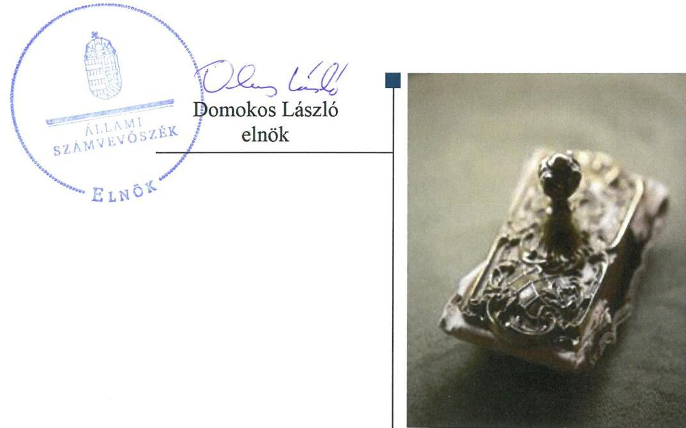
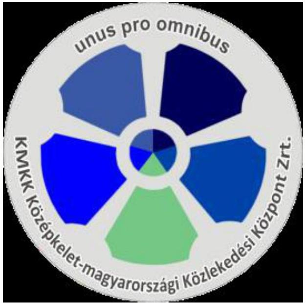
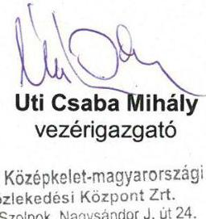
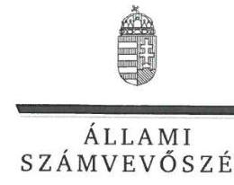
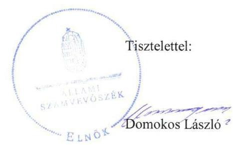
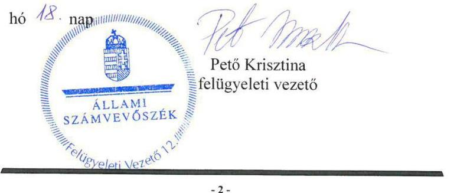
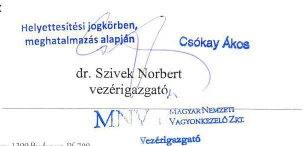
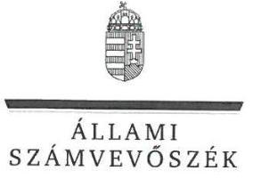
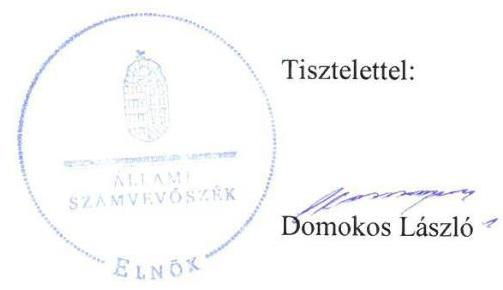
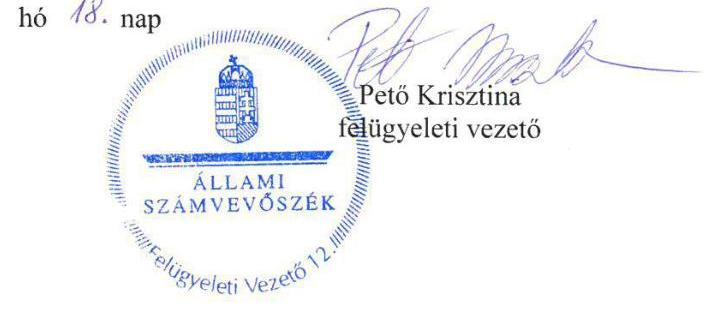

# Jelentés 

## Az állami tulajdonú gazdasági társaságok ellenőrzése

KMKK Középkelet-magyarországi Közlekedési Központ Zrt.
2018.

---

# Jelentés 

## Az állami tulajdonú gazdasági társaságok ellenőrzése

KMKK Középkelet-magyarországi
Közlekedési Központ Zrt.
2018. 10. hó 02. nap

---

# AZ ELLENŐRZÉST FELÜGYELTE:

- PETŐ KRISZTINA felügyeleti vezető
- AZ ELLENŐRZÉST VEZETTE ÉS A VÉGREHAJTÁSÁÉRT FELELŐS:
  - SALAMIN VIKTOR ellenőrzésvezető
  - A PROGRAM ÖSSZEÁLLÍTÁSÁÉRT FELELŐS:
    - TÓTPÁL SZABOLCS osztályvezető

**IKTATÓSZÁM:** EL-0417-022/2018.

**TÉMASZÁM:** 2469

**ELLENŐRZÉS-AZONOSÍTÓ SZÁM:** V081435

Jelentéseink az Országgyűlés számítógépes hálózatán és az Interneten a www.asz.hu címen is olvashatóak.

---

# TARTALOMJEGYZÉK 

■ ÖSSZEGZÉS ..... 5
■ AZ ELLENŐRZÉS CÉLJA ..... 6
■ AZ ELLENŐRZÉS TERÜLETE ..... 7
■ AZ ELLENŐRZÉS HÁTTERE, INDOKOLTSÁGA ..... 8
■ A JELENTÉS LÉNYEGES KÉRDÉSKÖREI ..... 9
■ AZ ELLENŐRZÉS HATÓKÖRE ÉS MÓDSZEREI ..... 10
■ MEGÁLLAPÍTÁSOK ..... 12
■ MELLÉKLETEK ..... 15
I. sz. melléklet: Értelmező szótár ..... 15
■ FÜGGELÉK: ÉSZREVÉTELEK ..... 17
■ RÖVIDÍTÉSEK JEGYZÉKE ..... 25

---

.

---

# ÖSSZEGZÉS 

A KMKK Középkelet-magyarországi Közlekedési Központ Zrt. gazdálkodásának szabályozottsága, gazdálkodása és vagyongazdálkodása 2013. évhez képest 2016-ra javult, a jogszabályi előírásoknak megfelelt, így az elszámoltathatóság biztosított volt. A Társaság beszámolási, adatszolgáltatási és közzétételi kötelezettségének eleget tett, ezzel biztosította az átláthatóságot. A Magyar Nemzeti Vagyonkezelő Zrt. tulajdonosi joggyakorlása szabályszerű volt.

## Az ellenőrzés társadalmi indokoltsága

Az állami tulajdonú gazdálkodó szervezetek ellenőrzése kiemelten fontos a vagyon megőrzése, megóvása érdekében, amelyekkel szemben alapvető követelmény, hogy gazdálkodásuk, működésük szabályszerű, az általuk szolgáltatott adatok minél megbízhatóbbak legyenek. Az állami tulajdonban álló gazdálkodó szervezetek államot megillető társasági részesedése a nemzeti vagyon részét képezi és legfőbb rendeltetése szerint a közfeladatok ellátását szolgálja.

Az Állami Számvevőszék stratégiájában megfogalmazta, hogy az államháztartáson kívül működő közfeladat-ellátó rendszerek ellenőrzéseivel hozzájárul ahhoz, hogy a közpénzeket az államháztartáson kívül működő szervezetek is átlátható, rendezett módon használják fel a közfeladatok szerződésben vállalt ellátása érdekében. Ellenőrzésünk eredményeképpen javaslatainkkal, megállapításainkkal hozzájárulhatunk a nemzeti vagyonnal való gazdálkodás átláthatóságának, elszámoltathatóságának javításához.

Az Állami Számvevőszék céljaival és a társadalmi igénnyel összhangban, valamint a gazdasági társaságok kiemelt fontosságú szerepe miatt került sor az KMKK Középkelet-magyarországi Közlekedési Központ Zrt. ellenőrzésére. Az ellenőrzést a Társaság a feladatellátásából adódó további társadalmi elvárás is indokolta, a régióban a lakosság rendszeresen kapcsolatba kerül a Társasággal a helyi és helyközi személyszállítási tevékenység ellátása kapcsán.

## Főbb megállapítások, következtetések

A KMKK Középkelet-magyarországi Közlekedési Központ Zrt. szabályozottsága 2013. évben nem volt szabályszerű, 2016. évben azonban már megfelelt a jogszabályi előírásoknak.

A Társaság gazdálkodása és vagyongazdálkodása 2013-ban nem volt szabályszerű. A belső szabályozottság hiányosságainak megszüntetésével a gazdálkodás és vagyongazdálkodás 2016-ban már szabályszerű volt, így a Társaság biztosította a vagyon megőrzését és az elszámoltathatóságot.

A Társaság által alkalmazott díjak megállapítása 2016-ban szabályszerű volt. A Társaság a szolgáltatás díjait a jogszabályi előírásnak megfelelően önköltségszámítással alapozta meg. A Társaság teljesítette közzétételi és adatszolgáltatási kötelezettségét.

A Magyar Nemzeti Vagyonkezelő Zrt.-nél a tulajdonosi joggyakorlás kereteinek kialakítása és a Társaság feletti tulajdonosi jogok gyakorlása szabályszerű volt.

A 2016. évre vonatkozóan nem került megfogalmazásra olyan megállapítás, amelyre az ellenőrzött szervezetek vezetőinek intézkedési kötelezettsége keletkezett volna. Javaslatot megalapozó megállapítás hiányában az Állami Számvevőszék a KMKK Középkelet-magyarországi Közlekedési Központ Zrt. vezérigazgatójának nem fogalmazott meg javaslatot.

---

# AZ ELLENŐRZÉS CÉLJA 

AZ ELLENŐRZÉS CÉLJA annak értékelése, volt, hogy a tulajdonosi jogok gyakorlása szabályszerű volt-e. A KMKK Középkelet-magyarországi Közlekedési Központ Zrt. szabályozottsága, gazdálkodása és vagyongazdálkodási tevékenysége megfelelt-e a jogszabályi és a tulajdonosi előírásoknak; biztosítva volt-e a közfeladatok átláthatósága és elszámoltathatósága érdekében a közszolgáltatás díjának megalapozottsága szabályszerű önköltségszámítással. A vagyonváltozást eredményező döntések esetében a tulajdonosi jogok gyakorlója és a gazdálkodó szervezet szabályszerűen jártak-e el.

---

# **AZ ELLENŐRZÉS TERÜLETE**

## **KMKK Középkelet-magyarországi Közlekedési Központ Zrt.**

A KMKK Középkelet-magyarországi Közlekedési Központ Zrt.-t az MNV Zrt.1 alapította 2012. november 19-én. A Társaság2 létrehozásának célja a Középkelet-magyarországi régió öt Volán társaságát (Agria, Hatvani, Jászkun, Mátra, Nógrád Volán Zrt.) magába foglaló vállalatcsoport létrehozása volt a társaság csoportszintű irányításának biztosítása, a gazdasági érdekek egységes és hatékony érvényre juttatása érdekében. A szolnoki székhelyű Társaság 2013. és 2016. években a Magyar Állam 100%-os tulajdonában volt. A magyar állam nevében a részvényesi jogokat az ellenőrzött időszakban az MNV Zrt. gyakorolta.

A 2014. májusában megkezdett átalakítási folyamat eredményeként a régióba tartozó öt Volán társaság 2014. december 31-i hatállyal beolvadt a Társaságba. Az egyesüléssel létrejött Társaság 2015. január 1-én kezdte meg működését. A Társaság főtevékenysége ekkortól a közszolgáltatói feladatok körébe tartozó belföldi helyközi-, helyi- és távolsági menetrend szerinti személyszállítás. Egyéb tevékenységei között szerepelt üzemanyag és járműalkatrész kiskereskedelem, gépjármű értékesítés, valamint autóbusszal végzett egyéb feladatok, szerződéses járatok és különjárati személyszállítás. A Társaság a közszolgáltatási tevékenységével összefüggő, bevételekkel nem fedezett, a közszolgáltatási ellátási kötelezettség miatt felmerült indokolt költségekre a Személyszállítási tv.3 30. § (1) bekezdése alapján évente ellentételezést kapott.

A KMKK Zrt. alapításkori jegyzett tőkéje 20,0 M Ft volt, amely 2016. december 31-re 7 497,0 M Ft-ra nőtt. A Társaság éves nettó árbevétele a beolvadás után, 2015-ben 16 674,7 M Ft, 2016-ban 15 971,5 M Ft volt, melyből 2015-ben 89,6 M Ft, 2016-ban 34,2 M Ft adózott eredmény realizálódott.

A vezérigazgató személye az ellenőrzött időszakban nem változott, tevékenységét 2012-től látta el. A Társaság átlagos állományi létszáma 2016. évben 2 020 fő volt. A Társaság 2016. évben a Számv. tv.4 14. § (7) bekezdése, valamint a Személyszállítási tv. 30. § (7) bekezdés a) pontja alapján kötelezett volt önköltségszámítási szabályzat készítésére.

A Társaság az ellenőrzött időszakban a kormányzati szektorba nem tartozó szervezetnek minősült. A Társaság az állami vagyon apportálásának eredményeként saját tulajdonú vagyonával gazdálkodott. Ezen kívül az ellenőrzött időszakot megelőzően kötött vagyonkezelési szerződés szerint Hatvan Város Önkormányzata 20 éves határozott időtartamra vagyonkezelésbe adta a Társaság jogelődje, a Hatvani Volán Közlekedési Zrt. részére a hatvani buszpályaudvart.

---

# AZ ELLENŐRZÉS HÁTTERE, INDOKOLTSÁGA 

Az Európai Unióban 1994. év óta hatályos túlzott hiány eljárás mindig kihívást jelentett a tagállamok számára. Az állami tulajdonú gazdálkodó szervezetek ellenőrzése kiemelten fontos a vagyon megőrzése, megóvása érdekében, valamint a kormányzati szektor elszámolásaiban megjelenő állami tulajdonú gazdálkodó szervezetek esetében, amelyekkel szemben alapvető követelmény, hogy gazdálkodásuk, működésük szabályszerű, az általuk szolgáltatott adatok minél megbízhatóbbak legyenek. Gazdálkodásuk jellemzően a közérdeklődés és a média figyelmének középpontjában áll, amihez hozzájárul a gazdálkodásuk körébe tartozó - közvetlen vagy közvetett állami tulajdonú, tehát végső soron a nemzeti vagyon részét képező - vagyon nagysága, illetve az általuk ellátott közszolgáltatások/közfeladatok minősége és hatékonysága.

Az ellenőrzés rámutathat az állami tulajdonú gazdálkodó szervezetek gazdálkodási tevékenységével jó gyakorlatokra és szabálytalanságokra. Felhívhatja a figyelmet a jogszabályi követelmények teljesítéséhez szükséges feltételek hiányosságaira, hozzájárulhat az államháztartáson kívüli, de (közvetlenül vagy közvetve) állami vagyont használó gazdálkodó szervezetek tevékenységének átláthatóságához. Ellenőrzésünk eredményeképpen javaslatainkkal, megállapításainkkal hozzájárulhatunk a nemzeti vagyonnal való gazdálkodás átláthatóságának, elszámoltathatóságának javításához.

---

# A JELENTÉS LÉNYEGES KÉRDÉSKÖREI 

1. A tulajdonosi jogok gyakorlása szabályszerű volt-e?
2. A Társaság szabályozottsága megfelelt-e a jogszabályi előírásoknak, a gazdálkodási, vagyongazdálkodási és adatszolgáltatási feladatok ellátása szabályszerű volt-e?

---

# AZ ELLENŐRZÉS HATÓKÖRE ÉS MÓDSZEREI 

## Az ellenőrzés típusa

Megfelelőségi ellenőrzés

## Az ellenőrzött időszak

2013-2016. évek, a 2016. évi beszámoló jóváhagyásáig tartó időszak.

## Az ellenőrzés tárgya

Állami tulajdonban lévő gazdasági társaság gazdálkodása, kiemelten vagyongazdálkodási tevékenysége, a tulajdonosi jogok gyakorlása.

## Az ellenőrzött szervezet

KMKK Középkelet-magyarországi Közlekedési Központ Zrt., valamint a tulajdonosi jogokat gyakorló Magyar Nemzeti Vagyonkezelő Zrt.

## Az ellenőrzés jogalapja

Az ellenőrzés jogszabályi alapját az az Állami Számvevőszékről szóló 2011. évi LXVI. törvény 1. § (3) bekezdése és 5. § (3)-(5) bekezdései képezték.

## Az ellenőrzés módszerei

Az ellenőrzést a nemzetközi standardokat irányadónak tekintve az ellenőrzési program ellenőrzési kérdései, az ellenőrzött időszakban hatályos jogszabályok, az ellenőrzés szakmai szabályok és módszertanok figyelembevételével végeztük.

Az ellenőrzés ideje alatt az ellenőrzött szervezettel történő kapcsolattartást az ÁSZ³ Szervezeti és Működési Szabályzatának vonatkozó előírásai alapján biztosítottuk.

Az ellenőrzésre a nemzetgazdasági szempontból kiemelt jelentőségű nemzeti vagyon körébe tartozó gazdálkodó szervezeteknél és a többségi állami tulajdonban álló gazdálkodó szervezeteknél került sor. A program szerinti feladatokat a kiválasztott gazdálkodó szervezeteknél (társaságoknál) és azok többségi tulajdonban lévő leányvállalatainál, valamint a tulajdonosi jogok gyakorlójánál kellett végrehajtani. Az ellenőrzés szempontjai

---

és az ellenőrzés alá vont gazdálkodó szervezetek köre az ellenőrzés tapasztalatai alapján nem változott.

A személyi jellegű ráfordítások esetében az ellenőrzött tételek kijelölése véletlen mintavételi eljárás alkalmazásával történt a teljes sokaságból.

A bevételek és a ráfordítások valamint az immateriális javak, tárgyi eszközök esetében az ellenőrzés azokra a legnagyobb értékű tételekre - a lényeges sokaságra - terjedt ki, melyek összértéke eléri a teljes sokaság összértékének 50%-át.

A 2016. évi ráfordítások elszámolásának szabályszerűségét a lényeges sokaságból véletlen mintavételi eljárással kiválasztott tételek alapján ellenőriztük.

A mintavétellel ellenőrzött területek esetében minden egyes tétel vonatkozásában a szabályszerűségre vonatkozó kérdéseket tettünk fel, amelyek eredménye összesítésre került. „Szabályszerűnek" értékeltünk egy ellenőrzött területet, amennyiben 95%-os bizonyossággal az ellenőrzött sokaságban az átlagos hibaarány legfeljebb 10%, "nem szabályszerűnek", amennyiben 10%-nál magasabb arányt képviselt. Abban az esetben, ha az ellenőrzött sokaság tekintetében a 10%-os hibaarányhoz való viszony megítélésének megbízhatósága nem érte el a 95%-ot, annak elérése érdekében értékelésünket további szempontokkal egészítettük ki, és figyelembe vettük a feltárt hibák értékét.

Az ellenőrzési kérdések megválaszolásához szükséges bizonyítékok megszerzése a következő ellenőrzési eljárások alkalmazásával történt: megfigyelés, kérdésfeltevés (információkérés), összehasonlítás, valamint elemző eljárás. Az ellenőrzési bizonyítékként felhasználható adatforrások közé tartoztak egyrészt az ellenőrzési programban felsorolt adatforrások, másrészt adatforrás lehet még minden - az ellenőrzés folyamán - feltárt, az ellenőrzés szempontjából információkat tartalmazó dokumentum.

A teljes ellenőrzött időszakra vonatkozóan ellenőriztük a gazdasági társaság tervezési, beszámolási, közzétételi, adatszolgáltatási kötelezettségének szabályszerűségét. A 2013. és 2016. évekre vonatkozóan a tulajdonosi joggyakorlást, a gazdasági társaság működésének szabályozottságát, a bevételei és ráfordításai elszámolását, illetve vagyongazdálkodásának szabályszerűségét is ellenőriztük.

Az ellenőrzést a kérdésekre adott válaszok kiértékelésével, valamint a megjelölt adatforrások, a csatolt tanúsítványok felhasználásával, továbbá az adott időszakban hatályos jogszabályok figyelembevételével folytattuk le.

---

# 1. A tulajdonosi jogok gyakorlása szabályszerű volt-e? 

Összegző megállapítás

Az MNV Zrt. tulajdonosi joggyakorlása a 2013. és a 2016. években szabályszerű volt.

A TULAJDONOSI JOGGYAKORLÁS KERETEIT az MNV Zrt. kialakította, az SZMSZ 1-5-ben⁶ szabályozta. Az SZMSZ 1-5-ben meghatározott feladatok részletes szabályait a tulajdonosi joggyakorlás területeire vonatkozó belső szabályzatokkal és vezérigazgatói utasításokkal biztosította. Az MNV Zrt. a tulajdonosi joggyakorlás rendjét a Társaság Alapító okirat 1-4-ben⁷ és az Alapszabály 3-5-ben⁸ kialakította, amely megfelelt a Gt.-ben⁹, illetve a Ptk.-ban¹⁰ foglalt előírásoknak. Az MNV Zrt. a jogszabályi előírásoknak megfelelően a Monitoring szabályzat 1,2-ben¹¹, valamint a Portfóliós kódex 1,2-ben¹² alakította ki a részesedések feletti tulajdonosi jogok gyakorlásának rendjét a Társaságnál.

A TULAJDONOSI JOGGYAKORLÁS 2013. és 2016. években szabályszerű volt. Az
 Alapító okirat ${ }_{1-4}$-ben és az Alapszabály $3-5$-ben foglaltak szerint a Társaság három főből álló felügyelőbizottságának elnökét és tagjait, valamint a könyvvizsgálót a Taktv. ${ }^{13}$, a Gt., illetve a Ptk. előírásainak megfelelően választották meg.

Az MNV Zrt. a Társaság beszámolóit a Gt., illetve a Ptk. előírásainak megfelelően, a felügyelőbizottság jelentése birtokában jóváhagyta, döntött a nyereség eredménytartalékba helyezéséről. Az MNV Zrt. 2016. évben a Társaság Javadalmazási szabályzatát ${ }^{14}$ a Taktv.-ben foglaltaknak megfelelően megalkotta, 2013. évben azonban a Társaság javadalmazási szabályzattal nem rendelkezett.

---

# 2. A Társaság szabályozottsága megfelelt-e a jogszabályi előírásoknak, a gazdálkodási, vagyongazdálkodási és adatszolgáltatási feladatok ellátása szabályszerű volt-e? 

Összegző megállapítás

2.1. számú megállapítás

A Társaság szabályozottsága, gazdálkodása és vagyongazdálkodása 2013-ban nem volt szabályszerű, 2016-ban szabályszerű volt. Az adatszolgáltatási feladatok ellátása szabályszerű volt.

A Társaság működésének szabályozottsága a szabályzatok hiánya miatt 2013-ban nem felelt meg a jogszabályi előírásoknak, 2016-ban azonban már megfelelő volt.

A Társaság szabályozottsága 2013. évben nem felelt meg a jogszabályi előírásoknak. 2013. évben a Társaság nem rendelkezett a Számv. tv. 14. § (5) bekezdés a) pontjában előírt leltározási szabályzattal, a 14. § (5) bekezdés b) pontjában előírt értékelési szabályzattal, a 14. § (5) bekezdés d) pontjában előírt pénzkezelési szabályzattal, továbbá a 161. § (1) bekezdésében rögzített számlarenddel.
2016. évben a Társaság szabályozottsága megfelelt a jogszabályi előírásoknak. A Társaság rendelkezett a Számv. tv. előírásainak megfelelő Számviteli politiká${ }_{1-3}$-mal ${ }^{15}$, Leltározási szabályzattal ${ }^{16}$, Értékelési szabályzattal ${ }^{17}$, Pénzkezelési szabályzattal ${ }^{18}$, valamint Számlarenddel ${ }^{19}$. Az Alapító okirat ${ }_{1-4}$, az Alapszabály ${ }_{3-5}$, valamint a társasági SZMSZ ${ }_{2-5}$ ${ }^{20}$ rögzítette a működés alapvető szabályait, a vagyongazdálkodással kapcsolatos feladat- és hatásköröket, felelősségi viszonyokat.

A Társaság a Számv. tv. előírásai szerint elkészítette Önköltségszámítási szabályzatát ${ }^{21}$, az egyes tevékenységek költségeinek elkülönült nyilvántartását biztosították.

A Társaság gazdálkodása és vagyongazdálkodása a szabályozás hiányosságai miatt 2013. évben nem volt szabályszerű. A Társaság gazdálkodása, a bevételek és ráfordítások elszámolása 2016-ban szabályos volt. A Társaság vagyongazdálkodása 2016-ban szabályszerű volt.

A Társaság működésének szabályozottsága 2013-ban nem volt megfelelő, ezért gazdálkodási, vagyongazdálkodási tevékenysége nem volt szabályszerű.

A bevételek és a ráfordítások elszámolása 2016. évben szabályszerű volt, az elszámolások megfeleltek a Számv. tv. és a Számlarend előírásainak. A személyi jellegű ráfordítások elszámolása összhangban volt a Számv. tv és a Számlarend előírásaival, a munkaszerződésekkel, azok alátámasztottak voltak.

A Társaság által alkalmazott díj megállapítása 2016-ban szabályszerű volt. A Társaság a nyújtott szolgáltatás díjait

---

önköltségszámítással alapozta meg, amely megfelelt a Számv. tv. és az Önköltségszámítási szabályzatban foglaltaknak.

A vagyongazdálkodás feltételeit 2016. évben a Társaság biztosította. A feladat- és hatásköröket, felelősségi viszonyokat az Alapszabály 3-5-ben és a társasági SZMSZ 2-5-ben rögzítették. A Társaság az éves vagyongazdálkodási, fejlesztési terveket az Alapszabály 3-5-ben és az SZMSZ 2.5-ben előírtaknak megfelelően elkészítette.

# A vagyon nyilvántartása, az értékcsökkenés elszámolása szabályszerű volt, megfelelt a Számv. tv. és a Számviteli politika ${ }_{2,3}$ előírásainak. A vagyont érintő beruházásokkal, felújításokkal kapcsolatos döntések megfeleltek a Számv. tv.-ben foglaltaknak, valamint a tulajdonosi előírásoknak.
2.3. számú megállapítás

A Társaság beszámolási, adatszolgáltatási és közzétételi kötelezettségének eleget tett.

A tervezési és adatszolgáltatási kötelezettségét a Társaság teljesítette. A Társaság üzleti terveit határidőre elkészítette, azokat a felügyelőbizottság jóváhagyta, a tulajdonos elfogadta. Az MNV Zrt. Monitoring szabályzat ${ }_{1,2}$-ben és éves tervezési irányelveiben közzétett adatszolgáltatási kötelezettségét a Társaság teljesítette. Az éves beszámolóit a Társaság a jogszabályi előírásoknak megfelelően elkészítette, letétbe helyezte és közzétette.

Közzétételi kötelezettségének a Társaság a Taktv. és az Info tv. előírásainak megfelelően eleget tett.

A Társaság belső ellenőrzés kialakításáról és működtetéséről a Bkr. előírásainak megfelelően gondoskodott.

---

# MELLÉKLETEK 

- I. SZ. MELLÉKLET: ÉRTELMEZŐ SZÓTÁR
gazdasági társaság
gazdálkodó szervezet
kormányzati szektorba sorolt egyéb szervezet
közszolgáltatás
nemzeti vagyon

Ptk. 3:88. § (1) bekezdése szerint „a gazdasági társaságok üzletszerű közös gazdasági tevékenység folytatására, a tagok vagyoni hozzájárulásával létrehozott, jogi személyiséggel rendelkező vállalkozások, amelyekben a tagok a nyereségből közösen részesednek, és a veszteséget közösen viselik".
A Ptk. 685. § c) pontja szerint gazdálkodó szervezet: „az állami vállalat, az egyéb állami gazdálkodó szerv, a szövetkezet, a lakásszövetkezet, az európai szövetkezet, a gazdasági társaság, az európai részvénytársaság, az egyesülés, az európai gazdasági egyesülés, az európai területi együttműködési csoportosulás, az egyes jogi személyek vállalata, a leányvállalat, a vízgazdálkodási társulat, az erdő birtokossági társulat, a végrehajtói iroda, az egyéni cég, továbbá az egyéni vállalkozó." (2014. 03. 15-ig hatályos)
az Áht. ${ }^{22}$ 3. § (2) és (3) bekezdésében foglaltakon kívül az Európai Közösséget létrehozó szerződéshez csatolt, a túlzott hiány esetén követendő eljárásról szóló jegyzőkönyv alkalmazásáról szóló 2009. május 25-i 479/2009/EK rendelet (a továbbiakban: 479/2009/EK rendelet) szerint a kormányzati szektorba sorolt szervezet (Áht. 1. § (12))
Az Ebktv. ${ }^{23}$ 3. § d) pontja a következőképpen határozza meg a közszolgáltatást: „szerződéskötési kötelezettség alapján a lakosság alapvető szükségleteinek ellátására irányuló szolgáltatás, így különösen a villamos energia-, gáz-, hő-, víz-, szennyvíz- és hulladékkezelési, köztisztasági, postai és távközlési szolgáltatás, továbbá a menetrend alapján közlekedő járművekkel végzett közforgalmú személyszállítás". Nvtv. ${ }^{24}$ 1. § (2) bekezdése szerint többek között:
„az állam vagy a helyi önkormányzat kizárólagos tulajdonában álló dolgok, az a) pont hatálya alá nem tartozó, állam vagy a helyi önkormányzat tulajdonában lévő dolog,
az állam vagy a helyi önkormányzat tulajdonában lévő pénzügyi eszközök, továbbá az államot vagy a helyi önkormányzatot megillető társasági részesedések, az államot vagy a helyi önkormányzatot megillető bármely vagyoni értékkel rendelkező jogosultság, amelyet jogszabály vagyoni értékű jogként nevesít."

---

.

---

# FÜGGELÉK: ÉSZREVÉTELEK 

A jelentéstervezetet a Számvevőszék 15 napos észrevételezésre megküldte az ellenőrzött szervezetek vezetőinek az ÁSZ tv. 29. § (1) bekezdése előírásának megfelelően.

A KMKK Középkelet-magyarországi Közlekedési Központ Zrt. vezérigazgatója és a Magyar Nemzeti Vagyonkezelő Zrt. vezérigazgatója a jelentéstervezet megállapításaira írásban észrevételeket tettek.
A függelék - melléklet nélkül - tartalmazza az ellenőrzöttek észrevételeit, illetve az el nem fogadott észrevételek elutasításának indoklását.

[^0]
[^0]:    * 29. § (1) Az Állami Számvevőszék az ellenőrzési megállapításait megküldi az ellenőrzött szervezet vezetőjének vagy az általa megbízott személynek, és annak, akinek személyes felelősségét állapította meg.
    (2) Az ellenőrzött szervezet vezetője és a felelősként megjelölt személy az ellenőrzés megállapításaira tizenöt napon belül írásban észrevételt tehet.
    (3) Az Állami Számvevőszék az észrevételre a beérkezésétől számított harminc napon belül írásban válaszol. A figyelembe nem vett észrevételeket köteles a jelentésben feltüntetni, és megindokolni, hogy azokat miért nem fogadta el.

---

# KMKK KÖZÉPKELET-MAGYARORSZÁGI 

Közlekedési Központ Zártkörűen működő Részvénytársaság

Domokos László úr
elnök

Állami Számvevőszék
Budapest
Apácai Csere János utca 10.
1052

Tisztelt Elnök Úr!

Ikt.sz.: VK-0984-GAZD/2018.
Tárgy: észrevétel

## ÁLLAMI SZÁMVEVŐSZÉK

$3 E-49300 / 2018$
Ekszert: 2018 AUG 28.
Iktatószóm: EL-0534 - 03/2018
Melléklet:

Hivatkozással az EL-0597-034/2018. iktatószámú levéllel megküldött „Az állami tulajdonú gazdasági társaságok ellenőrzése - KMKK Középkelet-magyarországi Közlekedési Központ Zrt." című számvevőszéki jelentéstervezetre az alábbi
észrevételt
teszem:

A jelentéstervezet 13. oldala a következőket tartalmazza:
„A Társaság szabályozottsága 2013. évben nem felelt meg a jogszabályi előírásoknak. 2013. évben a társaság nem rendelkezett a Számv. tv. 14. § (5) bekezdés a) pontjában előírt leltározási szabályzattal, a 14. § (5) bekezdés b) pontjában előírt értékelési szabályzattal, a 14. § (5) bekezdés d) pontjában előírt pénzkezelési szabályzattal,"

A jelentéstervezet megállapítása nem helytálló, mivel a KMKK Középkelet-magyarországi Közlekedési Központ Zrt. a 4/2013. (II.20.) IG sz. Igazgatósági határozattal elfogadott Számviteli politika keretében, önálló szabályzatként elkészítette a(z)

- Eszközök és források értékelési szabályzatát,
- Leltározási szabályzatát,
- Pénzkezelési szabályzatát,
- Selejtezési szabályzatát.

A hivatkozott szabályzatok az ÁSZ EL-0417-003/2017. ikt. sz. adatbekérő levele alapján feltöltésre kerültek, a feltöltött dokumentumok felsorolását a mellékletként csatolt „Teljességi és hitelességi nyilatkozat" 10. oldala tartalmazza.

[^0]
[^0]:    5000 Szolnok, Nagysándor József út 24. Telefon: 56/420-111, Fax: 56/514-564
    Levélcím: 5001 SZOLNOK, Postafiók: 56. E-mail: kmkk@kmkk.hu
    Szolnoki Törvényszék Cégbírósága Cg. 16-10-001794

---

# KMKK KÖZÉPKELET-MAGYARORSZÁGI 

Közlekedési Központ Zártkörűen működő Részvénytársaság

Kérem Tisztelt Elnök Urat, hogy a számvevőszéki jelentés összeállításakor a jelentéstervezetre tett észrevételünket szíveskedjenek figyelembe venni és tekintsenek el a megállapítástól, mely szerint „a KMKK Középkelet-magyarországi Közlekedési Központ Zrt. szabályozottsága 2013. évben nem volt szabályszerű".

Melléklet: Teljességi és hitelességi nyilatkozat (2017. december 13.)

Szolnok, 2018. augusztus 22.

Tisztelettel:

5000 Szolnok, Nagysándor József út 24. Telefon: 56/420-111, Fax: 56/514-564
Levélcím: 5001 SZOLNOK, Postafiók: 56. E-mail: kmkk@kmkk.hu
Szolnoki Törvényszék Cégbírósága Cg. 16-10-001794

---

ELNÖK

Ikt.szám: EL-0597-041/2018.

# Úti Csaba Mihály úr 

vezérigazgató
KMKK Középkelet-magyarországi Közlekedési Központ Zrt.

## Szolnok

## Tisztelt Vezérigazgató Úr!

,,Az állami tulajdonú gazdasági társaságok ellenőrzése - KMKK Középkelet-magyarországi Közlekedési Központ Zrt. " címmel készített számvevőszéki jelentéstervezetre tett észrevételeit megkaptam.
Az Állami Számvevőszék észrevételekre vonatkozó álláspontjáról a felügyeleti vezető által készített részletes tájékoztatást csatoltan megküldöm.
Tájékoztatom Vezérigazgató urat, hogy a számvevőszéki jelentésben - az Állami Számvevőszékről szóló 2011. évi LXVI. törvény 29. § (3) bekezdése alapján - a figyelembe nem vett észrevételeket szerepeltetjük az elutasítás indokának feltüntetésével.

Budapest, 2018. 05. hó 15. nap

Melléklet: Tájékoztatás az el nem fogadott észrevételekről

---

# Tájékoztatás az el nem fogadott észrevételekről 

„Az állami tulajdonú gazdasági társaságok ellenőrzése - KMKK Középkelet-magyarországi Közlekedési Központ Zrt. " című jelentéstervezetre levélben megküldött észrevételét áttekintettem. Az észrevételének kezeléséről az alábbi tájékoztatást adom.

## A jelentéstervezet 2.1. megállapításának 1. bekezdéséhez füzött észrevétele kapcsán

Észrevételében jelezte, hogy a KMKK Középkelet-magyarországi Közlekedési Központ Zrt. (továbbiakban: Társaság) a 4/2013. (II. 20.) IG sz. Igazgatósági határozattal elfogadott Számviteli politika keretében önálló szabályzatként elkészítette a(z)

- Eszközök és források értékelési szabályzatát;
- Leltározási szabályzatát;
- Pénzkezelési szabályzatát; illetve
- Selejtezési szabályzatát.

Vezérigazgató úr jelezte, hogy a hivatkozott szabályzatok az Állami Számvevőszék EL-0417-003/2017. ikt. sz. adatbekérő levele alapján feltöltésre kerültek, a feltöltött dokumentumok felsorolását a mellékletként csatolt „Teljességi és hitelességi nyilatkozat" 10. oldala tartalmazza.
Az észrevételben felsorolt és az Állami Számvevőszék részére átadott dokumentumok ismételt felülvizsgálatát követően megállapítottam, hogy a fent említett szabályzatok a Vezérigazgató úr aláírása mellett nem tartalmaznak információt a dokumentumok hatályba lépésének időpontjára vonatkozóan. A dokumentumok a hatályba lépés időpontja nélkül nem tekinthetőek a 2013. évre vonatkozó hatályos és érvényes szabályzatoknak.

A fent leírtakra tekintettel megalapozott az Állami Számvevőszék azon megállapítása, hogy a Társaság a hivatkozott szabályzatokkal az érintett időszakra (2013. év) nem rendelkezett.
Fentiekre tekintettel észrevételét nem fogadjuk el, a jelentéstervezet módosítása nem indokolt.

Budapest, 2018.

---

# 1103 

## MNV   MAGYAR NEMZETI   VAGYONKEZELŐ ZRT.

VEZÉRIGAZGATÓ

Állami Számvevőszék

## Domokos László

elnök

1052 Budapest
Apáczai Cs. J. u. 10.

Ikt. sz.: MNV/01/8520/4/2018.
Hiv. sz.: EL-0597-035/2018.

Tisztelt Elnök Úr!
Tájékoztatom, hogy a 2018. augusztus 15. napján, az ,,Állami tulajdonú (résztulajdonú) gazdasági társaságok ellenőrzése - KMKK Középkelet-magyarországi Közlekedési Központ Zrt." tárgyában kézhez vett, EL-0597-035/2018. ikt. sz. levél mellékleteként megküldött jelentéstervezetre az alábbi észrevételt tesszük.
„Megállapítások" fejezet / 12. oldal, 1. rész, utolsó bekezdés utolsó mondatának utolsó fordulata (,2013. évben azonban a Társaság javadalmazási szabályzattal
 nem rendelkezett"):

Az MNV Zrt. a 601/2012. (XI.19.) IG sz. határozatának VI/4. pontjában fogadta el a KMKK Középkelet-magyarországi Közlekedési Központ Zrt. Javadalmazási Szabályzatát, amely a Társaság megalakulásával egyidejűleg lépett hatályba. A 601/2012. (XI.19.) IG sz. határozat alapján a Társaság részére a 446/2012. (XI.19.) számmal kiadott Alapítói határozat 2. számú melléklete ez a 2013. évben hatályos javadalmazási szabályzat. A fentiekre tekintettel kérjük törölni a jelentéstervezetből a 2013. évi javadalmazási szabályzat hiányára utaló megállapítást.

Kérem Elnök Urat, hogy a jelentés véglegesítése során jelen észrevételünket szíveskedjenek figyelembe venni.

Budapest, 2018. augusztus 26.
Üdvözlettel:

Vestérigazgató

---

ELNÖK

Ikt.szám: EL-0597-042/2018.

# Rózsa Zsolt úr 

vezérigazgató
Magyar Nemzeti Vagyonkezelő Zrt.

## Budapest

## Tisztelt Vezérigazgató Úr!

„Az állami tulajdonú gazdasági társaságok ellenőrzése - KMKK Középkelet-magyarországi Közlekedési Központ Zrt. " címmel készített számvevőszéki jelentéstervezetre dr. Szivek Norbert úr, a Magyar Nemzeti Vagyonkezelő Zrt. vezérigazgatója az MNV/01/8520/4/2018. ikt. számú, 2018. augusztus 23-án kelt levelében tett észrevételét megkaptam.

Az Állami Számvevőszék észrevételekre vonatkozó álláspontjáról a felügyeleti vezető által készített részletes tájékoztatást csatoltan megküldöm.
Tájékoztatom Vezérigazgató urat, hogy a számvevőszéki jelentésben - az Állami Számvevőszékről szóló 2011. évi LXVI. törvény 29. § (3) bekezdése alapján - a figyelembe nem vett észrevételeket szerepeltetjük az elutasítás indokának feltüntetésével.

Budapest, 2018. 03. hó 5. nap

Melléklet: Tájékoztatás az el nem fogadott észrevételekről

---

# Tájékoztatás az el nem fogadott észrevételekról 

„Az állami tulajdonú gazdasági társaságok ellenőrzése - KMKK Középkelet-magyarországi Közlekedési Központ Zrt. " című jelentéstervezetre megküldött észrevételt áttekintettem. Az észrevétel kezeléséről az alábbi tájékoztatást adom.

## A jelentéstervezet 1. összegző megállapításának 3. bekezdésének utolsó mondatához füzött észrevétel kapcsán

Észrevételben jelezték, hogy a Magyar Nemzeti Vagyonkezelő Zrt. (továbbiakban: MNV Zrt.) a 601/2012. (XI.19.) IG sz. határozatának VI/4. pontjában fogadta el a KMKK Középkelet-magyarországi Közlekedési Központ Zrt. (továbbiakban: Társaság) Javadalmazási szabályzatát, amely a Társaság megalakulásával egyidejűleg lépett hatályba. A 601/2012. (XI.19.) IG sz. határozat alapján a Társaság részére a 446/2012. (XI.19.) számmal kiadott Alapítói határozat 2. számú melléklete ez a 2013. évben hatályos javadalmazási szabályzat.

Az ellenőrzés részére átadott dokumentumok ismételt felülvizsgálatát követően megállapítottam, hogy az Állami Számvevőszék által EL-0417-017/2018. ikt. számon megküldött 2018. január 20-án megküldött adatbekérő levelében is hivatkozott dokumentum nem került az Állami Számvevőszék részére megküldésre, azt az MNV Zrt. vezérigazgatója által 2018. február 2-án aláírt teljességi és hitelességi nyilatkozat nem tartalmazza.
A fent leírtakra tekintettel megalapozott az Állami Számvevőszék azon megállapítása, hogy a Társaság a hivatkozott szabályzattal az érintett időszakra (2013. év) nem rendelkezett.
Fentiekre tekintettel észrevételét nem fogadjuk el, a jelentéstervezet módosítása nem indokolt.

Budapest, 2018.

---

# RÖVIDÍTÉSEK JEGYZÉKE 

${ }^{1}$ MNV Zrt.
${ }^{2}$ Társaság
${ }^{3}$ Személyszállítási tv.
${ }^{4}$ Számv. tv.
${ }^{5}$ ÁSZ
${ }^{6}$ SZMSZ ${ }_{1}$

SZMSZ ${ }_{2}$
SZMSZ ${ }_{3}$
SZMSZ ${ }_{4}$
SZMSZ ${ }_{5}$
${ }^{7}$ Alapító okirat ${ }_{1}$
Alapító okirat ${ }_{2}$
Alapító okirat ${ }_{3}$
Alapító okirat ${ }_{4}$
Alapító okirat ${ }_{5}$
${ }^{8}$ Alapszabály ${ }_{1}$
Alapszabály ${ }_{2}$
Alapszabály ${ }_{3}$
Alapszabály ${ }_{4}$
Alapszabály ${ }_{5}$
${ }^{9}$ Gt.
${ }^{10}$ Ptk.
${ }^{11}$ Monitoring szabályzat ${ }_{1}$
Monitoring szabályzat ${ }_{2}$
${ }^{12}$ Portfóliós kódex ${ }_{1}$
Portfóliós kódex ${ }_{2}$

Magyar Nemzeti Vagyonkezelő Zrt.
KMKK Középkelet-magyarországi Közlekedési Központ Zrt.
2012. évi XLI. törvény a személyszállítási szolgáltatásokról (hatályos: 2012. július 1-jétől)
2000. évi C. törvény a számvitelről

Állami Számvevőszék
Magyar Nemzeti Vagyonkezelő Zártkörűen Működő Részvénytársaság Szervezeti és Működési Szabályzata (hatályos: 2012. október 8-tól 2013. március 15-ig)
Magyar Nemzeti Vagyonkezelő Zártkörűen Működő Részvénytársaság Szervezeti és Működési Szabályzata (hatályos: 2013. március 16-tól 2013. április 24-ig)
Magyar Nemzeti Vagyonkezelő Zártkörűen Működő Részvénytársaság Szervezeti és Működési Szabályzata (hatályos: 2013. április 25-től 2013. június 30-ig)
Magyar Nemzeti Vagyonkezelő Zártkörűen Működő Részvénytársaság Szervezeti és Működési Szabályzata (hatályos: 2013. július 1-jétől 2016. április 5-ig)
Magyar Nemzeti Vagyonkezelő Zártkörűen Működő Részvénytársaság Szervezeti és Működési Szabályzata (hatályos: 2016. április 6-tól)
A KMKK Középkelet-magyarországi Közlekedési Központ Zrt. alapító okirata 2012. december 19-től 2013. április 11-ig
A KMKK Középkelet-magyarországi Közlekedési Központ Zrt. alapító okirata 2013. április 12-től 2013. június 2-ig
A KMKK Középkelet-magyarországi Közlekedési Központ Zrt. alapító okirata 2013. június 3-tól 2013. augusztus 15-ig
A KMKK Középkelet-magyarországi Közlekedési Központ Zrt. alapító okirata 2013. augusztus 16-tól 2014. március 5-ig
A KMKK Középkelet-magyarországi Közlekedési Központ Zrt. alapító okirata 2014. március 6-tól 2014. december 31-ig
A KMKK Középkelet-magyarországi Közlekedési Központ Zrt. alapszabálya 2015. január 1-jétől 2015. június 28-ig
A KMKK Középkelet-magyarországi Közlekedési Központ Zrt. alapszabálya 2015. június 29-től 2015. október 20-ig
A KMKK Középkelet-magyarországi Közlekedési Központ Zrt. alapszabálya 2015. október 21-től 2016. április 19-ig
A KMKK Középkelet-magyarországi Közlekedési Központ Zrt. alapszabálya 2016. április 20-tól (kelt 2016. április 20-án)
A KMKK Középkelet-magyarországi Közlekedési Központ Zrt. alapszabálya 2016. április 20-tól (kelt 2016. május 31-én)
2006. évi IV. törvény a gazdasági társaságokról (hatálytalan: 2014. március 15-től)
2013. évi V. törvény a Polgári Törvénykönyvről (hatályos: 2014. március 15-től)

MNV Zrt. Monitoring Szabályzata: (hatályos: 2013. december 19-től 2016. július 31-ig)
MNV Zrt. Monitoring Szabályzata: (hatályos: 2016. augusztus 1-jétől)
MNV Zrt. Portfóliós Kódexe (hatályos: 2015. március 31-től 2016. május 30-ig)
MNV Zrt. Portfóliós Kódexe (hatályos: 2016. május 31-től)

---

${ }^{13}$ Taktv.
${ }^{14}$ Javadalmazási szabályzat
${ }^{15}$ Számviteli politika ${ }_{1}$
Számviteli politika ${ }_{2}$
Számviteli politika ${ }_{3}$
${ }^{16}$ Leltározási szabályzat
${ }^{17}$ Értékelési szabályzat
${ }^{18}$ Pénzkezelési szabályzat
${ }^{19}$ Számlarend
${ }^{20}$ társasági SZMSZ ${ }_{1}$
társasági SZMSZ ${ }_{2}$
társasági SZMSZ ${ }_{3}$
társasági SZMSZ ${ }_{4}$
társasági SZMSZ ${ }_{5}$
${ }^{21}$ Önköltségszámítási szabályzat
${ }^{22}$ Áht.
${ }^{23}$ Ebktv.
${ }^{24}$ Nvtv.
2009. évi CXXII. törvény a köztulajdonban álló gazdasági társaságok takarékosabb működéséről (hatályos: 2009. december 4-től)
A KMKK Középkelet-magyarországi Közlekedési Központ Zrt. Javadalmazási szabályzata (hatályos: 2016. február 23-tól)
Számviteli politika (hatályos: 2013. február 20-tól 2015. december 31-ig)
Számviteli politika (hatályos: 2016. január 1-jétől, kelt: 2016. április 20-án)
Számviteli politika (hatályos: 2016. január 1-jétől, kelt: 2016. május 31-én)
KMKK Középkelet-magyarországi Közlekedési Központ Zrt. Leltározási szabályzata (hatályos: 2016. november 2-től)
KMKK Középkelet-magyarországi Közlekedési Központ Zrt. Értékelési szabályzata (hatályos: 2015. március 31-től)
KMKK Középkelet-magyarországi Közlekedési Központ Zrt. Pénzkezelési szabályzata (hatályos: 2016. február 11-től)
KMKK Középkelet-magyarországi Közlekedési Központ Zrt. Számlarendje (hatályos: 2016. március 31-től)
KMKK Középkelet-magyarországi Közlekedési Központ Zrt. Szervezeti és Működési Szabályzata (hatályos: 2014. július 23-tól 2015. március 24-ig)
KMKK Középkelet-magyarországi Közlekedési Központ Zrt. Szervezeti és Működési Szabályzata (hatályos: 2015. március 25-től 2016. július 26-ig)
KMKK Középkelet-magyarországi Közlekedési Központ Zrt. Szervezeti és Működési Szabályzata (hatályos: 2016. július 27-től 2016. október 17-ig)
KMKK Középkelet-magyarországi Közlekedési Központ Zrt. Szervezeti és Működési Szabályzata (hatályos: 2016. október 18-tól 2016. december 7-ig)
KMKK Középkelet-magyarországi Közlekedési Központ Zrt. Szervezeti és Működési Szabályzata (hatályos: 2016. december 8-tól)
Önköltségszámítási szabályzat (hatályos: 2015. január 1-jétől)
2011. évi CXCV. törvény az államháztartásról (hatályos: 2011. december 31-től)
2003. évi CXXV. törvény az egyenlő bánásmódról és az esélyegyenlőség előmozdításáról (hatályos: 2004. január 27-től)
2011. évi CXCVI. törvény a nemzeti vagyonról (hatályos: 2011. december 31-től)

---

# ÁLLAMI SZÁMVEVŐSZÉK 

1052 Budapest, Apáczai Csere János utca 10.
Levélcím: 1364 Budapest 4. Pf. 54
Telefon: +36 14849100 Telefax: +36 14849200
www.asz.hu
