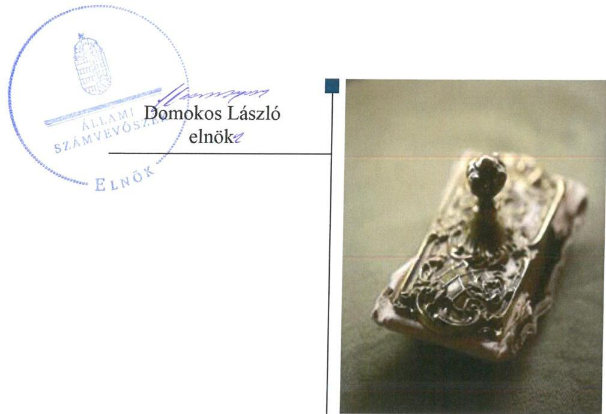
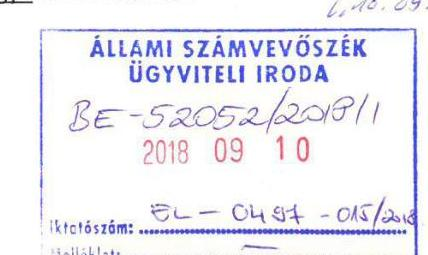
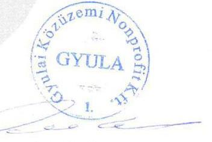

# Jelentés 

## Az önkormányzatok gazdasági társaságai

Az önkormányzatok többségi tulajdonában lévő gazdasági társaságok gazdálkodásának ellenőrzése - Gyulai Közüzemi Nonprofit Kft.
2018.

---

# Jelentés 

## Az önkormányzatok gazdasági társaságai

Az önkormányzatok többségi
tulajdonában lévő gazdasági társaságok gazdálkodásának ellenőrzése - Gyulai Közüzemi Nonprofit Kft.
2018. 10. hó 30. nap

---

# AZ ELLENŐRZÉST FELÜGYELTE:

- **KLINGA LÁSZLÓ** felügyeleti vezető
- **AZ ELLENŐRZÉST VEZETTE ÉS A VÉGREHAJTÁSÁÉRT FELELŐS:**
  - **HOFMEISTER LÁSZLÓ** ellenőrzésvezető
  - **A PROGRAM ÖSSZEÁLLÍTÁSÁÉRT FELELŐS:**
    - **TÓTPÁL SZABOLCS** osztályvezető

**IKTATÓSZÁM:** EL-0206-045/2018

**TÉMASZÁM:** 2447

**ELLENŐRZÉS-AZONOSÍTÓ SZÁM:** V-079373

Jelentéseink az Országgyűlés számítógépes hálózatán és az Interneta a www.asz.hu címen is olvashatóak.

---

# TARTALOMJEGYZÉK 

■ ÖSSZEGZÉS ..... 5
■ AZ ELLENŐRZÉS CÉLJA ..... 6
■ AZ ELLENŐRZÉS TERÜLETE ..... 7
■ AZ ELLENŐRZÉS HÁTTERE, INDOKOLTSÁGA ..... 8
■ A JELENTÉS LÉNYEGES KÉRDÉSKÖREI ..... 9
■ AZ ELLENŐRZÉS HATÓKÖRE ÉS MÓDSZEREI ..... 10
■ MEGÁLLAPÍTÁSOK ..... 12
■ JAVASLATOK ..... 14
■ MELLÉKLETEK ..... 15
I. sz. melléklet: Értelmező szótár ..... 15
■ FÜGGELÉK: ÉSZREVÉTELEK ..... 17
■ RÖVIDÍTÉSEK JEGYZÉKE ..... 21

---

.

---

# ÖSSZEGZÉS 

A Gyulai Közüzemi Nonprofit Kft. feletti tulajdonosi jogokat Gyula Város Önkormányzata szabályszerűen gyakorolta. A Társaság szabályozottsága és gazdálkodási tevékenysége szabályszerű volt. A vagyongazdálkodása nem volt szabályszerű, mert a közzétett beszámolók hiteles és megbizható alátámasztásáról nem gondoskodtak, így nem volt biztositott a gazdálkodás átláthatósága.

## Az ellenőrzés társadalmi indokoltsága

Magyarországon az önkormányzatok kötelező és önként vállalt feladataik ellátása során egyre szélesebb körben alkalmazzák a költségvetési szerveken kívüli feladatellátást, ezáltal az önkormányzati tulajdonú gazdasági társaságok is kiemelt fontosságú szerephez jutnak a lakossági szolgáltatások biztosításában. Az önkormányzatok többségi tulajdonában álló gazdasági társaságok ellenőrzése kiemelt jelentőségű, mivel működésük hatással van a tulajdonos önkormányzat gazdálkodására, gazdálkodásának egyes elemei befolyásolják az önkormányzati alszektor hiányát és az államadósságot.

Az Állami Számvevőszék stratégiájában célul tűzte ki az államháztartáson kívül működő szervezetek ellenőrzését, mely hozzájárul a közpénzek szabályos, átlátható, elszámoltatható és eredményes felhasználásához. A Gyulai Közüzemi Nonprofit Kft.-vel az általa ellátott feladaton keresztül az ellátási területeken élő lakosság széles rétege került kapcsolatba.

## Főbb megállapítások, következtetések

Az Önkormányzat a Társaság feletti tulajdonosi joggyakorlásának kereteit szabályszerűen alakította ki. A tulajdonosi jogait szabályszerűen gyakorolta.

A Társaság a megfelelő számviteli szabályozottság kialakításával megteremtette a szabályszerű működés feltételeit.

A bevételek és ráfordítások elszámolása szabályszerű volt. A szolgáltatások díját szabályszerűen alátámasztotta önköltségszámítással, árképzése során figyelembe vette a vonatkozó jogszabályi előírásokat.

A vagyongazdálkodása nem volt szabályszerű, mert a tárgyi eszközök és a készletek mennyiségi felvétellel történő leltározását - a leltározási szabályzatban előírt gyakorisággal, legalább háromévente - nem végezték el.

A megállapítások alapján az Állami Számvevőszék a Gyulai Közüzemi Nonprofit Kft. ügyvezetőjének egy javaslatot fogalmazott meg.

---

# AZ ELLENŐRZÉS CÉLJA 

Az ellenőrzés célja annak értékelése volt, hogy az önkormányzat vagyongazdálkodási tevékenysége során szabályszerűen gyakorolta-e tulajdonosi jogait, a gazdasági társaság szabályozottsága, gazdálkodása és vagyongazdálkodási tevékenysége, bevételeinek és ráfordításainak elszámolása megfelelt-e a jogszabályi és tulajdonosi előírásoknak; a gazdasági társaság kötelezettségállománya jelentett-e kockázatot a múködésre, valamint a gazdálkodás átláthatósága és elszámoltathatósága érdekében biztosított volt-e a szolgáltatás dijának megalapozottsága szabályszerű önköltségszámítással.

---

# **AZ ELLENŐRZÉS TERÜLETE**

## **Gyula Város Önkormányzata és a többségi tulajdonában lévő Gyulai Közüzemi Nonprofit Korlátolt Felelősségű Társaság**

Az Önkormányzat¹ 1996-ban alapította a Gyulai Közüzemi Kft.-t, 100%-os önkormányzati tulajdonú társaságként. A Társaság² 2014. április 30-tól lett nonprofit gazdasági társaság.

A Társaságban 2013. május 9-től tulajdonossá vált hét másik önkormányzat, az Önkormányzat taggyűlésben fennálló 85%-os szavazati többsége az ellenőrzött időszak végéig megmaradt. A Társaság jegyzett tőkéje 2013. január 1-jén 136,4 M Ft volt – mely 96,2 M Ft pénzbeli hozzájárulásból és 40,2 M Ft apportból állt –, 2016. december 31-ére 157,1 M Ft-ra emelkedett.

A Társaság fő tevékenysége a víztermelés, vízkezelés, vízelosztás, a szennyvíz gyűjtése, kezelése, a hulladékgazdálkodás és egyéb városüzemeltetési feladatokból állt. Az Önkormányzat a Társaság feladatellátáshoz szükséges közműveket bérleti díj ellenében, üzemeltetésre bocsátotta rendelkezésre, vagyonkezelésbe a Társaság vagyont nem vett át.

A Társaság minden évben nyereségesen működött, a 2013-2016. években mintegy 400 M Ft nyereséget ért el, melyből a 2014. évben 25,0 M Ft osztalékot fizetett ki. Az átlagos állományi létszáma a 2013. évi 236 főről a 2016. évre 302 főre növekedett.

A Társaság nem tartozott a kormányzati szektorba sorolt egyéb szerveztek körébe.

A feladatellátásra támogatásokat a tulajdonos önkormányzatoktól kapott a Társaság, melynek mértéke folyamatosan nőtt a négy év alatt, öszszesen több mint 600 M Ft-ot tett ki.

Az ellenőrzött időszakban a Társaság ügyvezetője, valamint az Önkormányzat polgármesterének és a jegyzőjének személye nem változott.

---

# AZ ELLENŐRZÉS HÁTTERE, INDOKOLTSÁGA 

Az önkormányzatok többségi tulajdonában álló gazdasági társaságok ellenőrzése kiemelten fontos a vagyon megőrzése, megóvása érdekében, alapvető követelmény, hogy gazdálkodásuk, működésük szabályszerű, az általuk szolgáltatott adatok minél megbízhatóbbak legyenek.

A feladatellátás költségeinek, ráfordításainak alakulása a lakosság széles rétegét érinti. Az ellenőrzés várható hasznosulásaként ellenőrzéseink feltárhatják, hogy az önkormányzat a feladatellátásához rendelt vagyon működtetését a tulajdonostól elvárható gondossággal végezte-e, a feladatot ellátó gazdasági társaság a létesítő okiratban, szolgáltatási szerződésben foglaltak betartásával biztosította-e a feladat ellátását. Az ellenőrzés rávilágíthat arra, hogy a gazdasági társaság a vagyon használatával biztosította-e a szolgáltatás folytatásának feltételeit, az önkormányzat tulajdonosi felügyelete hozzájárult-e a szabályszerű gazdálkodáshoz és feladatellátáshoz.

A megállapítások alapján megfogalmazott számvevőszéki javaslatok hasznosítása elősegítheti a meglévő hibák megszüntetését. A jó gyakorlatok bemutatásával az ÁSZ hozzájárul a követendő megoldások megismertetéséhez, terjesztéséhez.

---

# A JELENTÉS LÉNYEGES KÉRDÉSKÖREI 

1. A tulajdonosi jogok gyakorlása szabályszerű volt-e?
2. A gazdasági társaság szabályozottsága, gazdálkodása és vagyongazdálkodása megfelel-e az elöírásoknak?

---

# AZ ELLENŐRZÉS HATÓKÖRE ÉS MÓDSZEREI 

## Az ellenőrzés típusa

Megfelelőségi ellenőrzés.

## Az ellenőrzött időszak

2013. január 1-jétől 2016. december 31-ig.

## Az ellenőrzés tárgya

Gyula Város Önkormányzatának tulajdonosi joggyakorlása, valamint a Gyulai Közüzemi Nonprofit Korlátolt Felelősségű Társaság gazdálkodásának szabályozottsága és szabályszerűsége volt az ellenőrzés tárgya.

Az ellenőrzés kiterjedt minden olyan körülményre és adatra, amely az ÁSZ ${ }^{3}$ jogszabályban meghatározott feladatainak teljesítéséhez, valamint a program végrehajtása folyamán felmerült újabb összefüggések feltárásához szükséges volt.

## Az ellenőrzött szervezet

Gyula Város Önkormányzata és Gyulai Közüzemi Nonprofit Korlátolt Felelősségű Társaság.

## Az ellenőrzés jogalapja

Az ellenőrzés jogalapját az ÁSZ tv. ${ }^{4}$ 1. § (3) bekezdése és 5. § (3)-(5) bekezdései képezik.

## Az ellenőrzés módszerei

Az ellenőrzést a nemzetközi standardokat irányadónak tekintve az ellenőrzési program ellenőrzési kérdései, az ellenőrzött időszakban hatályos jogszabályok, az ellenőrzés szakmai szabályok és módszertanok figyelembe vételével végeztük.

Az ellenőrzés ideje alatt az ellenőrzött szervezettel történő kapcsolattartást az ÁSZ Szervezeti és Múködési Szabályzatának vonatkozó előírásai alapján biztosítottuk.

Az ellenőrzés a kizárólagos tulajdonosi jogokat gyakorló önkormányzatra, és az ellenőrzött gazdasági társaságra terjedt ki.

---

Az ellenőrzési kérdések megválaszolásához szükséges bizonyítékok megszerzése a következő ellenőrzési eljárások alkalmazásával történt: megfigyelés, kérdésfeltevés (információkérés), összehasonlítás, valamint elemző eljárás. Az ellenőrzési bizonyítékként felhasználható adatforrások közé tartoztak egyrészt az ellenőrzési programban felsorolt adatforrások, másrészt adatforrás lehet még minden - az ellenőrzés folyamán - feltárt, az ellenőrzés szempontjából információkat tartalmazó dokumentum.

Az ellenőrzést a kérdésekre adott válaszok kiértékelésével, valamint a megjelölt adatforrások, a csatolt tanúsítványok felhasználásával, továbbá az adott időszakban hatályos jogszabályok figyelembe vételével folytattuk le.

A bevételek és ráfordítások elszámolása, valamint a vagyonnyilvántartás terén a szabályszerű működést véletlen mintavétellel ellenőriztük. A mintavétellel ellenőrzött területek esetében minden egyes tétel vonatkozásában a szabályszerűségre vonatkozó kérdéseket tettünk fel, amelyek eredménye összesítésre került. Megfelelőnek értékeltünk egy ellenőrzött területet, amennyiben 95\%-os bizonyossággal a teljes sokaságban az átlagos hibaarány legfeljebb 10\%, nem megfelelőnek, amennyiben 10\%-nál magasabb arányt képviselt. Abban az esetben, ha a teljes sokaság tekintetében a 10\%-os hibaarányhoz való viszony megítélésnek megbízhatósága nem érte el a 95\%-ot, annak elérése érdekében értékelésünket további szempontokkal egészítettük ki, és figyelembe vettük a feltárt hibák típusát és súlyát. A ráfordítások elszámolására és a vagyonnyilvántartásra vonatkozó véletlen mintavételt kockázati alapú kiválasztással egészítettük ki, amelynek során évente a három legnagyobb összegű tételt értékeltük.

---

# 1. A tulajdonosi jogok gyakorlása szabályszerű volt-e? 

## Összegző megállapítás

A tulajdonosi jogok gyakorlása szabályszerű volt.
A TÁRSASÁG FELETTI TULAJDONOSI JOGOK gyakorlásának rendjét az Önkormányzat az Alapító Okirat ${ }^{5}$-ban a Gt. ${ }^{6}$ és a Ptk. ${ }^{7}$ rendelkezéseinek megfelelően szabályozta. Az Alapító Okirat rögzítette a Társaság vezető tisztségviselője és a Taggyúlés ${ }^{8}$ hatáskörébe tartozó feladatokat, valamint a megválasztott könyvvizsgáló személyét.

A tulajdonosi jogokat a Taggyúlés az előírásoknak megfelelően gyakorolta. A háromtagú $\mathrm{FB}^{9}$-t a Társaságnál a Gt.-ben előírtak szerint hozták létre.

A Társaság 2015. november 1-jét megelőzően a Taktv. ${ }^{10}$-ben előírt, Taggyúlés által jóváhagyott Javadalmazási szabályzat ${ }^{11}$-tal nem rendelkezett.

ÜZLETI TERV készítésének kötelezettségét az Alapító Okirat rögzítette. Az üzleti terveket az ügyvezető elkészítette, az Alapító ${ }^{12}$, majd a Taggyúlés minden évben határozatában jóváhagyta.

A TÁRSASÁG SZÁMVITELI BESZÁMOLÓIT a Taggyúlés megtárgyalta a könyvvizsgáló írásos véleménye, valamint az FB írásbeli jelentése birtokában és elfogadásáról határozatot hozott.

RENDELETALKOTÁSI KÖTELEZETTSÉGÉNEK az Önkormányzat a Hgt. ${ }^{13} 35 . \S$ (1) bekezdés előírásának megfelelően a hulladékgazdálkodási rendelet ${ }_{1-2}{ }^{14}$ megalkotásával eleget tett.

## 2. A gazdasági társaság szabályozottsága, gazdálkodása és vagyongazdálkodása megfelelt-e az előírásoknak?

## Összegző megállapítás

2.1. számú megállapítás

A Társaság szabályozottsága és gazdálkodása szabályszerű volt. A Társaság vagyongazdálkodása nem volt szabályszerű.

A Társaság számviteli szabályozottsága megfelelő volt.
A Társaság rendelkezett a Számv. tv. ${ }^{15}$ előírásainak megfelelő Számviteli politika ${ }_{1-4}{ }^{16}$-val, valamint az annak keretében elkészített Értékelési szabályzat ${ }_{1-2}{ }^{17}$-tal, Leltározási szabályzat ${ }_{1-2}{ }^{18}$-tal, Önköltségszámítási szabályzat ${ }_{3}$ ${ }^{19}$-tal, Pénzkezelési szabályzat ${ }_{3-3}{ }^{20}$-tal, valamint Számlarend ${ }_{3-3}{ }^{21}$-del. A Társaság kialakított nyilvántartásai biztosították az egyes tevékenységek átláthatóságát, a diszkriminációmentességet, továbbá kizárta a keresztfinanszírozást.

---

### 2.2. számú megállapítás

A Társaság bevételeinek és ráfordításainak elszámolása szabályszerű volt. A Társaság a beszámolót mennyiségi leltározással nem támasztotta alá.

A BEVÉTELEK ÉS RÁFORDÍTÁSOK elszámolása szabályszerűen történt.

A Társaságnál a tárgyi eszközök és készletek mérlegtételeit a 20132016. évek egyikében sem támasztották alá mennyiségi felvétellel történő leltárral, ezzel nem tettek eleget a Számv. tv. 69. § (3) bekezdésében előírtaknak, mert a Leltározási szabályzat ${ }_{1,2}$ 5. pontjában foglaltak ellenére a tárgyi eszközöket kétévente és a készleteket évente, de a jogszabályban előírtak alapján legalább háromévente mennyiségi felvétellel nem leltározták.

A Társaság úgy tett eleget a beszámoló közzétételi kötelezettségének, hogy a beszámoló nem felelt meg a Számv. tv. 20. § (1), valamint a 69. § (3) bekezdés előírásainak, így a gazdálkodásának, vagyongazdálkodásának átláthatóságát nem biztosította.

A könyvvizsgáló a leltározás hiányossága ellenére a beszámolót minden évben korlátozás nélküli hitelesítő záradékkal látta el.

A KÖZÉRDEKŰ ADATOK nyilvánosságra hozatalával és szabályozásával kapcsolatos kötelezettségeinek a Taktv. és az Info tv. ${ }^{22}$ alapján a Társaság eleget tett.

## A TÁRSASÁG A TEVÉKENYSÉGEK ÖNKÖLTSÉGÉT

szabályszerűen, az Önköltségszámítási szabályzat ${ }_{1,4}$-ban foglaltaknak és a jogszabályi előírásoknak megfelelően állapította meg. A Társaság által alkalmazott díjak szabályszerűek voltak.

---

# JAVASLATOK 

Az ÁSZ tv. 33. § (1) bekezdésében foglaltak értelmében az ellenőrzött szervezet vezetője köteles a jelentésben foglalt megállapításokhoz kapcsolódó intézkedési tervet összeállítani és azt a jelentés kézhezvételétől számított 30 napon belül az ÁSZ részére megküldeni. Amennyiben az ellenőrzött szervezet vezetője nem küldi meg határidőben az intézkedési tervet, vagy továbbra sem elfogadható intézkedési tervet küld, az Állami Számvevőszék elnöke az ÁSZ tv. 33. § (3) bekezdése a) és b) pontjaiban foglaltakat érvényesítheti.

## Gyulai Közüzemi Nonprofit Kft. ügyvezetőjének

1. Intézkedjen a tárgyi eszközök és készletek mennyiségi felvétellel történő leltározásának a Leltározási szabályzatban elöirt gyakorisággal történő elvégzéséről.
(2.2. sz. megállapítás 2. bekezdése alapján)

---

# MELLÉKLETEK 

- I. SZ. MELLÉKLET: ÉRTELMEZŐ SZÓTÁR
non-profit gazdasági társaság

2006. évi V. tv (Ctv. 9/F. § (2) bekezdése szerint: „az a gazdasági társaság minősül nonprofit gazdasági társaságnak és cégnevében az a gazdasági társaság tüntetheti fel a nonprofit jelleget, amelynek létesítő okirata tartalmazza, hogy a gazdasági társaság tevékenységéből származó nyereség a tagok között nem osztható fel, hanem az a gazdasági társaság vagyonát gyarapítja." (hatályos 2006. január 4-től)
keresztfinanszírozás tilalma

A közszolgáltatás díját úgy kell megállapítani, hogy az maradéktalanul fedezetet nyújtson a közszolgáltatás indokolt költségeire és ráfordításaira, valamint a közszolgáltató e tevékenységével kapcsolatos ésszerű nyereségére; az ésszerű nyereség nem tartalmazhatja a közszolgáltatáson kívül eső egyéb gazdasági tevékenységei költségeinek, ráfordításainak fedezetét.
gazdasági társaság

A Ptk. 3:88. § (1) bekezdése szerint „a gazdasági társaságok üzletszerű közös gazdasági tevékenység folytatására, a tagok vagyoni hozzájárulásával létrehozott, jogi személyiséggel rendelkező vállalkozások, amelyekben a tagok a nyereségből közösen részesednek, és a veszteséget közösen viselik".
nemzeti vagyon
a) az állam vagy a helyi önkormányzat kizárólagos tulajdonában álló dolgok,
b) az a) pont hatálya alá nem tartozó, állam vagy a helyi önkormányzat tulajdonában lévő dolog,
c) az állam vagy a helyi önkormányzatot tulajdonában lévő pénzügyi eszközök, továbbá az államot vagy a helyi önkormányzatot megillető társasági részesedések,
d) az államot vagy a helyi önkormányzatot megillető bármely vagyoni értékkel rendelkező jogosultság, amelyet jogszabály vagyoni értékű jogként nevesít,
e) Magyarország határa által körbezárt terület feletti légtér,
f) az üvegházhatású gázok kibocsátási egységeinek kereskedelméről szóló törvény szerint kibocsátási egység és légiközlekedési kibocsátási egység, valamint az ENSZ Éghajlatváltozási Keretegyezménye és annak Kiotói Jegyzőkönyve végrehajtási keretrendszeréről szóló törvény szerinti kiotói egység,
g) állami vagy helyi önkormányzati fenntartású közgyűjtemény (muzeális intézmény, levéltár, közgyűjteményként működő kép- és hangarchívum, valamint könyvtár) saját gyűjteményében nyilvántartott kulturális javak körébe tartozó dolog, kivéve, ha az állami vagy önkormányzati tulajdon jogszerű létrejötte kétséget kizáró módon nem bizonyítható és a dologra nézve más a tulajdonjogát bizonyítja vagy a kulturális javakra vonatkozó jogszabályokban meghatározott eljárás keretében valószínűsíti (g. pont módosult 2013. december 7től),
h) a régészeti lelet,
i) a nemzeti adatvagyon körébe tartozó állami nyilvántartások fokozottabb védelméről szóló törvény szerinti nemzeti adatvagyon.
Forrás: Nvtv ${ }^{23}$. 1. § (2)

---

.

---

# FÜGGELÉK: ÉSZREVÉTELEK 

A jelentéstervezetet a Számvevőszék 15 napos észrevételezésre megküldte az ellenőrzött szervezetek vezetőinek az ÁSZ tv. 29. §* (1) bekezdése előírásának megfelelően.

Gyula Város polgármestere valamint a Gyulai Közüzemi Nonprofit Kft. ügyvezető igazgatója az ÁSZ tv. 29. § (2) bekezdésében foglalt észrevételezési jogával nem élt, írásban jelezte, hogy a jelentéstervezetre észrevételt nem tesz.

[^0]
[^0]:    * 29. § (1) Az Állami Számvevőszék az ellenőrzési megállapításait megküldi az ellenőrzött szervezet vezetőjének vagy az általa megbízott személynek, és annak, akinek személyes felelősségét állapította meg.
    (2) Az ellenőrzött szervezet vezetője és a felelősként megjelölt személy az ellenőrzés megállapításaira tizenöt napon belül írásban észrevételt tehet.
    (3) Az Állami Számvevőszék az észrevételre a beérkezésétől számított harminc napon belül írásban válaszol. A figyelembe nem vett észrevételeket köteles a jelentésben feltüntetni, és megindokolni, hogy azokat miért nem fogadta el.

---

# 1276 

Gyula Város Polgármestere

Úgyiratezám: V. 43/2018.
Úgyintéző: Hanyecz Ágnes

Állami Számvevőszék
Domokos László elnök úr részére

Budapest
Pf.: 54 .
1364

ÁLLAMI SZÁMVEVÓSZÉK
$3 E-54085 / 2018 / 1$
Ériszelt: 2018 SZPT 18.
Intelbzám: EL-0499-016/2018
Moliélet

Hiv. szám: EL-0497-011/2018.

Tisztelt Elnök Úr!

Köszönettel megkaptuk az Állami Számvevőszék által „Az önkormányzatok gazdasági társaságai Az önkormányzatok többségi tulajdonában lévő gazdasági társaságok gazdálkodásának ellenőrzése Gyulai Közüzemi Nonprofit Kft." címmel készített számvevőszéki jelentéstervezetet.

Szeretném önt arról biztosítani, hogy Gyula Város Önkormányzata elkötelezett a tulajdonában álló gazdasági társaságok törvényes és szabályos müködésének biztosítása iránt, ezért fontos nekünk minden szakmai megállapítás, amely ezen törekvéseink érvényesítését támogatja. A Gyulai Közüzemi Nonprofit Kft. ügyvezetője arról tájékoztatott, hogy az Állami Számvevőszék jelentéstervezetében megfogalmazott szakmai hibák és szabálytalanságok megszüntetése, kiküszöbölése céljából a szükséges vizsgálatokat lefolytatja, a kellő intézkedéseket meghozza.

Nincs egyéb észrevételünk az anyaggal kapcsolatban.

Gyula, 2018. szeptember 12.

Entente Florale Europe
Euriput Virágróthézi Virseny
arany mivöztés
2014
5700 Gyula, Petőfi tér 3. (5701 Gyula, Pf. 44.) tel.:66/526-801, fax: (66)463-143
Internet: www.gyula.hu, E-mail: gorgenyiuigyula.hu

---

Állami Számvevőszék
Budapest
Apáczai Csere János utca 10.
1052

Tisztelt Elnök Úr!

Ikt. számEte: 1/2018.
Tárgy: észrevételezés

Az Állami Számvevőszék V-079373. ellenőrzés azonosító szám alatt - a Gyulai Közüzemi Nonprofit Kft. gazdálkodására vonatkozóan - lefolytatott ellenőrzéséről készült (iktatószám: EL-0497-014/2018.) Számvevőszéki jelentéstervezetet megkaptuk.
2.2 megállapítás 2. bekezdéshez:
„A Társaságnál a tárgyi eszközök és készletek mérlegtételeit a 2013-2016. évek egyikében sem támasztották alá mennyiségi felvétellel történő leltárral, ezzel nem tettek eleget a Számv. tv. 69. § (3) bekezdésében elöírtaknak, mert a Leltározási Szabályzat 5. pontjában foglaltak ellenére a tárgyi eszközöket kétévente és a készleteket évente, de a jogszabályban elöírtak alapján legalább három évente mennyiségi felvétellel nem leltározták."

ÁSZ. tv. 29. § (2) bekezdés alapján az alábbi észrevételt fogalmazom meg Önök felé:

Az ellenőrzés során feltárt hiányosságok tényének közlését elfogadom, a hiányosságok megszüntetéséhez szükséges intézkedést megteszem.

Az ÁSZ. tv. 33. § (1) bekezdés szerinti intézkedési tervet a rendelkezésre álló időn belül küldi meg az Önök részére.

Gyula, 2018. szeptember 06.

Tisztelettel:

Daróczi László
ügyvezető igazgató

---

.

---

# RÖVIDÍTÉSEK JEGYZÉKE 

${ }^{1}$ Önkormányzat
${ }^{2}$ Társaság
${ }^{3}$ ÁSZ
${ }^{4}$ ÁSZ tv.
${ }^{5}$ Alapító Okirat
${ }^{6}$ Gt.
${ }^{7}$ Ptk.
${ }^{8}$ Taggyúlés
${ }^{9} \mathrm{FB}$
${ }^{10}$ Taktv.
${ }^{11}$ Javadalmazási szabályzat
${ }^{12}$ Alapító
${ }^{13} \mathrm{Hgt}$.
${ }^{14}$ Hulladékgazdálkodási rendelet ${ }_{1-2}$
${ }^{15}$ Számv. tv.
${ }^{16}$ Számviteli politika $1-4$
${ }^{17}$ Értékelési szabályzat ${ }_{1-2}$
${ }^{18}$ Leltározási szabályzat ${ }_{1-2}$

Gyula Város Önkormányzata
Gyulai Közüzemi Kft. 2014. 04. 29-ig, 2014. 04. 30-tól Gyulai Közüzemi Nonprofit Kft.
Állami Számvevőszék
Az Állami Számvevőszékről szóló 2011. évi LXVI. törvény (hatályos 2011. július 1-jétől)
Gyulai Közüzemi Nonprofit Korlátolt Felelősségű Társaság Alapító Okirata (hatályos 1996. december 23-tól, módosítások: 2013. május 9., 2013. október 29., 2014. április 30., 2014. december 10., 2015. május 14., 2015. október 7., 2016. március 17., 2016. május 19., 2016. október 5.) A Társaság 2013. május 8-ig egyszemélyes Kft. révén Alapító Okirattal, ezt követően Társasági szerződéssel rendelkezett.
2006. évi IV. törvény a gazdasági társaságokról (hatálytalan 2014. március 15-től)
2013. évi V. törvény a Polgári Törvénykönyvről (hatályos 2014. március 15-től)

Gyulai Közüzemi Közhasznú Nonprofit Korlátolt Felelősségű Társaság Taggyűlése (2013. május 9-től)
Gyulai Közüzemi Nonprofit Korlátolt Felelősségű Társaság felügyelőbizottsága
2009. évi CXXII. törvény a köztulajdonban álló gazdasági társaságok takarékosabb müködéséről (hatályos 2009. december 4-től)
szabályzat a Taktv.-ben meghatározott, Gyula Város Önkormányzata többségi befolyása alatt álló gazdasági társaságok ügyvezetőire és felügyelőbizottsági tagjaira, valamint a munka törvénykönyvéről szóló 2012. évi I. tv. 208. § hatálya alá tartozó munkavállalókra vonatkozó javadalmazás elveiről, 11/2015. (X. 07.) számú Taggyúlési határozattal elfogadott (2015. november 1-jétől)
Gyula Város Önkormányzat Képviselő-testülete
2012. évi CLXXXV. törvény a hulladékról (hatályos 2013. január 1-től)

Hulladékgazdálkodási rendelet ${ }_{1}$ : Gyula város helyi hulladékgazdálkodási tervéről szóló 17/2010. (IV. 30.) számú rendelet (hatályos 2013. november 30-ig)
Hulladékgazdálkodási rendelet ${ }_{2}$ : a hulladékgazdálkodási helyi közszolgáltatásról szóló 23/2013. (XI. 27.) számú rendelet (hatályos 2013. december 1-jétől)
2000. évi C. törvény a számvitelről (hatályos 2001. január 1-jétől)

Számviteli politika ${ }_{1}$ : Gyulai Közüzemi Korlátolt Felelősségű Társaság Számviteli politikája (hatályos 2013. január 1-jétől)
Számviteli politika ${ }_{2}$ : Gyulai Közüzemi Korlátolt Felelősségű Társaság Számviteli politikája (hatályos 2014. január 1-jétől)
Számviteli politika ${ }_{3}$ : Gyulai Közüzemi Nonprofit Korlátolt Felelősségű Társaság Számviteli politikája (hatályos 2015. január 1-jétől)
Számviteli politika ${ }_{4}$ : Gyulai Közüzemi Nonprofit Korlátolt Felelősségű Társaság Számviteli politikája (hatályos 2016. január 1-jétől)
Értékelési szabályzat ${ }_{1}$ : Gyulai Közüzemi Korlátolt Felelősségű Társaság Értékelési szabályzata (hatályos 2013. január 1-jétől)
Értékelési szabályzat ${ }_{2}$ : Gyulai Közüzemi Korlátolt Felelősségű Társaság Értékelési szabályzata (hatályos 2014. január 1-jétől)
Leltározási szabályzat ${ }_{1}$ : Gyulai Közüzemi Korlátolt Felelősségű Társaság Leltározási szabályzata (hatályos 2013. január 1-jétől)

---

${ }^{19}$ Önköltség-számítási szabályzat ${ }_{1-4}$
${ }^{21}$ Számlarend $_{1-3}$
${ }^{22}$ Info tv.
${ }^{23} \mathrm{Nvtv}$. Leltározási szabályzat2: Gyulai Közüzemi Nonprofit Korlátolt Felelősségű Társaság Leltározási szabályzata (hatályos 2016. január 1-jétől)
Önköltség-számítási szabályzat1: Gyulai Közüzemi Korlátolt Felelősségű Társaság Önköltség-számítási szabályzata (hatályos 2011. június 1-jétől)
Önköltség-számítási szabályzat2: Gyulai Közüzemi Nonprofit Korlátolt Felelősségű Társaság Önköltség-számítási szabályzata (hatályos 2015. január 1-jétől)
Önköltség-számítási szabályzat3: Gyulai Közüzemi Nonprofit Korlátolt Felelősségű Társaság Önköltség-számítási szabályzata (hatályos 2015. június 1-jétől)
Önköltség-számítási szabályzat4: Gyulai Közüzemi Nonprofit Korlátolt Felelősségű Társaság Önköltség-számítási szabályzata (hatályos 2016. január 1-jétől)
Pénzkezelési szabályzat1: Gyulai Közüzemi Korlátolt Felelősségű Társaság Pénzkezelési szabályzata (hatályos 2013. január 1-jétől)
Pénzkezelési szabályzat2: Gyulai Közüzemi Nonprofit Korlátolt Felelősségű Társaság Pénzkezelési szabályzata (hatályos 2015. június 1-jétől)
Pénzkezelési szabályzat3: Gyulai Közüzemi Nonprofit Korlátolt Felelősségű Társaság Pénzkezelési szabályzata (hatályos 2016. szeptember 15-től)
Számlarend1: Gyulai Közüzemi Korlátolt Felelősségű Társaság Számlarendje (hatályos 2012. január 1-jétől)
Számlarend2: Gyulai Közüzemi Korlátolt Felelősségű Társaság Számlarendje (hatályos 2014. január 1-jétől)
Számlarend3: Gyulai Közüzemi Nonprofit Korlátolt Felelősségű Társaság Számlarendje (hatályos 2016. január 1-jétől)
2011. évi CXII. törvény az információs önrendelkezési jogról és az információszabadságról (hatályos 2011. július 11-től)
2011. évi CXCVI. törvény a nemzeti vagyonról (hatályos 2012. január 1-jétől)

---

# ÁLLAMI SZÁMVEVŐSZÉK 

1052 Budapest, Apáczai Csere János utca 10.
Levélcím: 1364 Budapest 4. Pf. 54
Telefon: +36 14849100 Telefax: +36 14849200
www.asz.hu