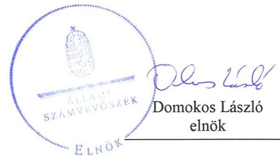
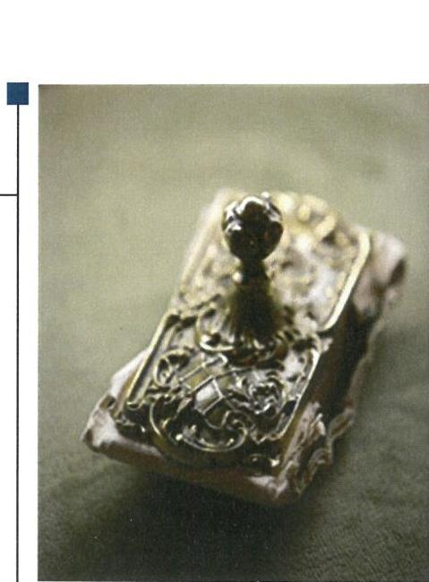
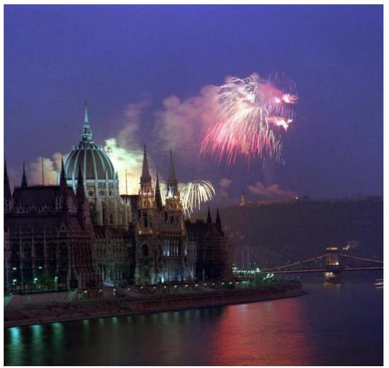

# Jelenetés 

## Az állami tulajdonú gazdasági társaságok ellenőrzése

Hungarofest Nemzeti
Rendezvényszervező Nonprofit Kft.
2018. 10 hó 19 nap

---

# AZ ELLENŐRZÉST FELÜGYELTE:

DR. NÉMETH ERZSÉBET felügyeleti vezető

## AZ ELLENŐRZÉST VEZETTE ÉS A VÉGREHAJTÁSÁÉRT FELELŐS:

JÁNOSI ISTVÁN ellenőrzésvezető

A PROGRAM ÖSSZEÁLLÍTÁSÁÉRT FELELŐS:

TÓTPÁL SZABOLCS osztályvezető

IKTATÓSZÁM: EL-0403-053/2018.

TÉMASZÁM: 2469

ELLENŐRZÉS-AZONOSÍTÓ SZÁM: V081424

Jelentéseink az Országgyűlés számítógépes hálózatán és az Interneten a www.asz.hu címen is olvashatóak.

---

# TARTALOMJEGYZÉK 

■ ÖSSZEGZÉS ..... 5
■ AZ ELLENŐRZÉS CÉLJA ..... 6
■ AZ ELLENŐRZÉS TERÜLETE ..... 7
■ AZ ELLENŐRZÉS HÁTTERE, INDOKOLTSÁGA ..... 9
■ A JELENTÉS LÉNYEGES KÉRDÉSKÖREI ..... 10
■ AZ ELLENŐRZÉS HATÓKÖRE ÉS MÓDSZEREI ..... 11
■ MEGÁLLAPÍTÁSOK ..... 13
■ JAVASLATOK ..... 16
■ MELLÉKLETEK ..... 17
I. sz. melléklet: Értelmező szótár ..... 17
■ FÜGGELÉK: ÉSZREVÉTELEK ..... 19
■ RÖVIDÍTÉSEK JEGYZÉKE ..... 21

---

.

---

# ÖSSZEGZÉS 

A Hungarofest Nemzeti Rendezvényszervező Nonprofit Kft. feletti tulajdonosi joggyakorlás a 2013. évben megfelelt a jogszabályi előírásoknak, a 2016. évben nem volt szabályszerű. A Társaság pénzügyi-számviteli és vagyongazdálkodási tevékenysége nem volt szabályszerű. A 2016. évi egyszerűsített éves beszámolóval kapcsolatos közzétételi kötelezettségének, valamint közérdekű adat közzétételi kötelezettségének nem tett eleget. Mindezek által nem biztosította tevékenységének átláthatóságát és elszámoltathatóságát, valamint a vagyon megőrzését.

## Az ellenőrzés társadalmi indokoltsága

Az állami tulajdonú gazdálkodó szervezetek ellenőrzése kiemelten fontos a vagyon megőrzése, megóvása érdekében, valamint a kormányzati szektor elszámolásaiban megjelenő állami tulajdonú gazdálkodó szervezetek esetében, amelyekkel szemben alapvető követelmény, hogy gazdálkodásuk, működésük szabályszerű, az általuk szolgáltatott adatok minél megbízhatóbbak legyenek. A kiegyensúlyozott, átlátható és fenntartható költségvetési gazdálkodás érvényesítésének elvét az Alaptörvény rögzíti, a nemzeti vagyon megőrzésének, védelmének és a nemzeti vagyonnal való felelős gazdálkodásnak a követelményeit sarkalatos törvény határozza meg.

A Hungarofest Nemzeti Rendezvényszervező Nonprofit Kft-t a magyar kultúra belföldi és külföldi terjesztésére irányuló tevékenység programjainak meghatározása, a programok végrehajtásának megszervezése, valamint a közművelődési tevékenységgel kapcsolatos feladatok ellátása céljából alapították.

Az Állami Számvevőszék 2013-2016. évekre kiterjedő ellenőrzése során arra kereste a választ, hogy szabályszerű volt-e a közfeladatot ellátó társaság gazdálkodása és az ehhez kapcsolódó tulajdonosi joggyakorlás.

## Főbb megállapítások, következtetések, javaslatok

A tulajdonosi joggyakorlás a 2013. évben szabályszerű volt, azonban a 2016. évi egyszerűsített éves beszámoló tulajdonosi joggyakorló általi elfogadására nem került sor.

A Hungarofest Nemzeti Rendezvényszervező Nonprofit Kft. pénzügyi-számviteli tevékenysége nem volt szabályszerű.

A Társaság a jogszabályoknak megfelelő gazdálkodás feltételrendszerét a 2016. évet megelőzően nem alakította ki, 2016-ban a szabályozottság megfelelt a jogszabályi előírásoknak.

A Társaság a 2016. évben nem rendelkezett a jogszabályi előírásoknak megfelelő egyszerűsített éves beszámolóval, ezáltal a beszámoló közzétételével a nyilvánosság és a gazdaság szereplői számára nem biztosított hiteles és megbízható információkat a Társaság pénzügyi-gazdálkodási tevékenységéről, valós vagyoni, pénzügyi és jövedelmi helyzetéről.

A Társaság vagyongazdálkodási tevékenysége nem volt szabályszerű, mert éves beszámolóit a 2013-2016. években a jogszabályi előírásoknak megfelelő leltárral nem támasztotta alá.

A Hungarofest Nemzeti Rendezvényszervező Nonprofit Kft. a jogszabályban előírt közérdekű adat közzétételi kötelezettségének nem tett eleget.

---

# AZ ELLENŐRZÉS CÉLJA 

AZ ELLENŐRZÉS CÉLJA annak értékelése volt, hogy a tulajdonosi jogok gyakorlása szabályszerű volt-e. A gazdálkodó szervezet szabályozottsága, gazdálkodása és vagyongazdálkodási tevékenysége megfelelt-e a jogszabályi és a tulajdonosi előírásoknak. A vagyonváltozást eredményező döntések esetében a tulajdonosi jogok gyakorlója és a gazdálkodó szervezet szabályszerűen jártak-e el. Az ellenőrzés célja továbbá annak megítélése volt, hogy a kormányzati szektorba sorolt állami tulajdonban (résztulajdonban) lévő gazdálkodó szervezetek gazdálkodásának a kormányzati szektor hiányára és az államadósságra befolyással bíró elemei a jogszabályi előírásoknak megfeleltek-e.

---

# **AZ ELLENŐRZÉS TERÜLETE**

## **Hungarofest Nemzeti Rendezvényszervező Nonprofit Kft.**

**A MAGYAR ÁLLAM** a Társaság^{1} jogelődjét Hungarofest Közhasznú Társaság néven, 3 millió Ft jegyzett tőkével 1998. május 1-jén alapította. A Társaság a 2009. június 30-ai átalakulást követően Hungarofest Nemzeti Rendezvényszervező Nonprofit Kft. néven folytatta tevékenységét.

**A TULAJDONOSI JOGOKAT** a Társaság felett az ellenőrzött időszakban 2016. április 19-éig a Magyar Fejlesztési Bank Zrt., 2016. április 20-ától 2017. április 25-éig a Magyar Nemzeti Vagyonkezelő Zrt., majd ezt követően a Magyar Turisztikai Ügynökség Zrt. gyakorolta.

**A TÁRSASÁG** 100 %-os állami tulajdonban lévő, közhasznú jogállású szervezet, melynek főtevékenysége előadóművészetet kiegészítő tevékenység. A Társaság közhasznú tevékenysége során az egyes miniszterek, valamint a Miniszterelnökséget vezető államtitkár feladat- és hatásköréről szóló 212/2010. (VII. 1.) Korm. rendeletben, illetve a Kormány tagjainak feladat és hatásköréről szóló 152/2014. (VI. 6.) Korm. rendeletben meghatározott közfeladatok ellátásában vett részt. E feladatkörébe tartozott a magyar kultúra belföldi és külföldi terjesztésére irányuló tevékenység programjainak meghatározása, a programok végrehajtásának megszervezése, valamint a közművelődési tevékenységgel kapcsolatos feladatok ellátása.

A Társaságnál több alkalommal került sor tőkeemelésre. A tulajdonosi joggyakorló 2012. augusztus 29-én a jegyzett tőkét 1 millió Ft-tal, a tőketartalékot 99 millió Ft-tal, 2015. december 29-én a jegyzett tőkét 1 millió Ft-tal, a tőketartalékot 14 millió Ft-tal emelte meg. 2016. december 12-én a tulajdonosi joggyakorló további 1 millió Ft-os jegyzett tőke és 24 millió Ft-os tőketartalék növelésről döntött, ennek pénzügyi végrehajtása áthúzódott 2017-re.

A Társaság főbb mérleg adatait az 1. táblázat mutatja be.

1. táblázat

|  A TÁRSASÁG FŐBB MÉRLEGADATAI (MILLIÓ FT) |  |  |  |   |
| --- | --- | --- | --- | --- |
|  Megnevezés | 2013. | 2014. | 2015. | 2016.  |
|   | VII.31. | VII.31. | VII.31. | VII.31.  |
|  Mérlegfőösszeg | 210,7 | 106,2 | 21,2 | 10,2  |
|  Saját tőke | 158,2 | 48,9 | -9,7 | -29,1  |
|  Adózott eredmény | -8,4 | -109,3 | -58,6 | -35,4  |
|   |  |  | Forrás: Céginformációs Szolgálat |   |

A Társaság élén ügyvezető állt, munkáját három tagú felügyelőbizottság^{2} ellenőrizte. Az ügyvezető személye az ellenőrzött időszakban 2013-ban és 2015-ben változott.

A foglalkoztatottak átlagos statisztikai állományi létszáma a 2013. évi 17 főről 2016-ban 9 főre csökkent.

---

A Társaság az ellenőrzött időszakban vagyonkezelt vagyonnal nem rendelkezett.

Önköltségszámítási szabályzatot a Társaságnak a jogszabályi előírások alapján nem kellett készítenie.

A Társaság az NGM ${ }^{3}$ közleménye alapján az ellenőrzött időszak egészében kormányzati szektorba sorolt egyéb szervezet volt.

A Társaságnak a kormányzati szektor hiányára és az államadósságra befolyással bíró gazdasági eseménye nem volt.

---

# AZ ELLENŐRZÉS HÁTTERE, INDOKOLTSÁGA 

AZ ÁLLAMI TULAJDONÚ GAZDÁLKODÓ SZERVEZETEK ellenőrzése kiemelten fontos a vagyon megőrzése, megóvása érdekében, valamint a kormányzati szektor elszámolásaiban megjelenő állami tulajdonú gazdálkodó szervezetek esetében, amelyekkel szemben alapvető követelmény, hogy gazdálkodásuk, működésük szabályszerű, az általuk szolgáltatott adatok minél megbízhatóbbak legyenek. Gazdálkodásuk jellemzően a közérdeklődés és a média figyelmének középpontjában áll, amihez hozzájárul a gazdálkodásuk körébe tartozó - közvetlen vagy közvetett állami tulajdonú, tehát végső soron a nemzeti vagyon részét képező - vagyon nagysága, illetve az általuk ellátott közszolgáltatások/közfeladatok minősége és hatékonysága. A közszolgáltatási árképzés megalapozottsága és a rendszeres elszámoltatás feltételeinek kialakítása az ellenőrzése során nagy hangsúlyt kap. A közszolgáltatás árában és annak támogatásában meg kell jelennie az önköltségszámítás szempontjainak, amely biztosítja a működés fenntarthatóságát (eszközpótlást) is.

Az ellenőrzés rámutathat az állami tulajdonú gazdálkodó szervezetek gazdálkodási tevékenységével jó gyakorlatokra és szabálytalanságokra. Felhívhatja a figyelmet a jogszabályi követelmények teljesítéséhez szükséges feltételek hiányosságaira, hozzájárulhat az államháztartáson kívüli, de (közvetlenül vagy közvetve) állami vagyont használó gazdálkodó szervezetek tevékenységének átláthatóságához. Ellenőrzésünk eredményeképpen javaslatainkkal, megállapításainkkal hozzájárulhatunk a nemzeti vagyonnal való gazdálkodás átláthatóságának, elszámoltathatóságának javításához.

---

# A JELENTÉS LÉNYEGES KÉRDÉSKÖREI 

1.     - A tulajdonosi jogok gyakorlása szabályszerű volt-e?
2.     - A társaság működésének szabályozottsága megfelelt-e az előírásoknak?
3.     - A társaság pénzügyi-számviteli és vagyongazdálkodási tevékenysége, adatszolgáltatási feladatainak ellátása szabályszerű volt-e?

---

# AZ ELLENŐRZÉS HATÓKÖRE ÉS MÓDSZEREI 

## Az ellenőrzés típusa

Megfelelőségi ellenőrzés.

## Az ellenőrzött időszak

Az ellenőrzött időszak a 2013. - 2016. évek, a 2016. évi beszámoló jóváhagyásáig tartó időszak.

## Az ellenőrzés tárgya

Az állami tulajdonban (résztulajdonban) lévő gazdasági társaságok gazdálkodása, kiemelten vagyongazdálkodási tevékenysége, a tulajdonosi jogok gyakorlása, továbbá a kormányzati szektorba sorolt gazdasági társaságok gazdálkodásának a kormányzati szektor hiányára és az államadósságra befolyással bíró elemei.

Az ellenőrzés kiterjedt minden olyan körülményre és adatra, amely az ÁSZ ${ }^{4}$ jogszabályban meghatározott feladatainak teljesítéséhez, valamint a program végrehajtása folyamán felmerült újabb összefüggések feltárásához szükséges.

## Az ellenőrzött szervezet

Hungarofest Nemzeti Rendezvényszervező Nonprofit Kft., valamint a tulajdonosi jogokat gyakorló Magyar Fejlesztési Bank Zrt., Magyar Nemzeti Vagyonkezelő Zrt., Magyar Turisztikai Ügynökség Zrt.

## Az ellenőrzés jogalapja

Az ellenőrzés jogalapját az ÁSZ tv. ${ }^{5}$ 1. § (3) bekezdése és 5. § (3)-(5) bekezdései képezték.

## Az ellenőrzés módszerei

Az ellenőrzést a nemzetközi standardokat irányadónak tekintve az ellenőrzési program ellenőrzési kérdései, az ellenőrzött időszakban hatályos jogszabályok, az ellenőrzés szakmai szabályok és módszertanok figyelembe vételével végeztük.

---

Az ellenőrzés ideje alatt az ellenőrzött szervezettel történő kapcsolattartást az ÁSZ Szervezeti és Működési Szabályzatának vonatkozó előírásai alapján biztosítottuk.

Az ellenőrzési kérdések megválaszolásához szükséges bizonyítékok megszerzése a következő ellenőrzési eljárások alkalmazásával történt: megfigyelés, kérdésfeltevés (információkérés), összehasonlítás, valamint elemző eljárás. Az ellenőrzési bizonyítékként felhasználható adatforrások közé tartoznak egyrészt az ellenőrzési programban felsorolt adatforrások, másrészt adatforrás lehet még minden - az ellenőrzés folyamán - feltárt, az ellenőrzés szempontjából információkat tartalmazó dokumentum.

Az ellenőrzést a kérdésekre adott válaszok kiértékelésével, valamint a megjelölt adatforrások, a csatolt tanúsítványok felhasználásával, továbbá az adott időszakban hatályos jogszabályok figyelembe vételével kellett lefolytatni.

A teljes ellenőrzött időszakra vonatkozóan került ellenőrzésre a gazdasági társaság tervezési, beszámolási, közzétételi, adatszolgáltatási kötelezettségének, valamint belső ellenőrzési tevékenységének szabályszerűsége. A 2013. és 2016. évekre vonatkozóan a tulajdonosi jogok gyakorlásának szabályszerűségét, a gazdasági társaság működésének szabályozottságát, a bevételei és ráfordításai elszámolását, illetve vagyongazdálkodásának szabályszerűségét is ellenőriztük.

---

# 1. A tulajdonosi jogok gyakorlása szabályszerű volt-e? 

Összegző megállapítás

A tulajdonosi joggyakorlás a 2013. évben szabályszerű volt, a 2016. évben nem volt szabályszerű.

A TULAJDONOSI JOGGYAKORLÁS KERETEIT az MFB Zrt. ${ }^{6}$ és az MNV Zrt. ${ }^{7}$ az ellenőrzött időszakban a jogszabályi előírásoknak megfelelően határozta meg belső szabályzataiban és a Társaság Alapító Okirat ${ }_{1-9}{ }^{8}$. Az Alapító Okirat ${ }_{1-9}$ a Gt. ${ }^{9}$ és a Ptk. ${ }^{10}$ jogszabályi előírásaival összhangban szabályozta a Társaság feladat- és hatásköreit. Az Alapító Okirat ${ }_{1-9}$ a Társaság ügyvezetője részére üzleti terv készítését, valamint negyedéves rendszerességgel évközi beszámolási, tájékoztatási kötelezettséget írt elő.

A TÁRSASÁG ÉVES BESZÁMOLÓJÁT az MFB Zrt. a 2013. vonatkozásában a jogszabályi előírásoknak megfelelően, határidőben, a független könyvvizsgálói jelentés és a felügyelőbizottság írásbeli jelentésének ismeretében fogadta el. A 2016. évi éves beszámoló Magyar Turisztikai Ügynökség Zrt. mint tulajdonosi joggyakorló általi jóváhagyására a Ptk. 3:109. § (2) bekezdésében foglalt előírás ellenére nem került sor.

A TÁRSASÁG SAJÁT TÖKÉJE a veszteséges gazdálkodás következtében
 a 2015. évi éves beszámoló alapján az ötmillió Ft-os törzstőke felénél alacsonyabb értékre, valamint a jogszabályban meghatározott legalább három millió Ft-os összeg alá, -9,7 millió Ft-ra csökkent, mely körülményre a kapcsolódó könyvvizsgálói jelentés korlátozott vélemény kiadása mellett hívta fel a figyelmet.

Az MNV Zrt. 2016. június 13-án kelt, Nemzeti Fejlesztési Minisztériumnak írt levelével intézkedett a tőkehelyzet rendezése érdekében a Ptk. előírásainak megfelelően.

A tényleges rendezésre a Nemzeti Fejlesztési Minisztérium jóváhagyását követően az MNV Zrt. 741/2016. (XII.12.) AH számú alapítói határozatával került sor, melyben a tulajdonosi joggyakorló a Társaság törzstőkéjének egymillió Ft-os, tőketartalékának 24 millió Ft-os emeléséről döntött. A tőkeemelés ugyanakkor nem volt elegendő a 2016. évi beszámolóban feltüntetett, negatív összegű saját tőke rendezésére.

---

# 2. A társaság működésének szabályozottsága megfelelt-e az előírásoknak? 

Összegző megállapítás

A Társaság működésének szabályozottsága a 2013. évben nem volt szabályszerű, 2016-ban szabályszerű volt.

SZÁMVITELI POLITIKÁVAL és az annak keretében elkészítendő szabályzatokkal - a pénzkezelési szabályzat ${ }_{1}{ }^{11}$ kivételével - a Társaság a 2013. évben a Számv. tv. ${ }^{12}$ 14. § (3)-(5) bekezdéseiben foglalt előírások ellenére nem rendelkezett, ezáltal nem biztosította a szabályszerű könyvvezetés feltételeinek kialakítását.

A Társaság a 2016. évben a Számv. tv. előírásaival összhangban szabályozta a számviteli politikát ${ }^{13}$, elkészítette a számlarendet ${ }^{14}$, a leltározási és selejtezési szabályzatot ${ }^{15}$, az értékelési szabályzatot ${ }^{16}$ és a pénzkezelési szabályzat${ }_{2}$-ot ${ }^{17}$.

JAVADALMAZÁSI SZABÁLYZATTAL ${ }^{18}$ a Társaság rendelkezett, amely megfelelt a Taktv. ${ }^{19}$ előírásainak. A javadalmazási szabályzatot a tulajdonosi joggyakorló határozatban állapította meg.

## 3. A társaság pénzügyi-számviteli és vagyongazdálkodási tevékenysége, adatszolgáltatási feladatainak ellátása szabályszerű volt-e?

Összegző megállapítás

A Társaság pénzügyi-számviteli és vagyongazdálkodási tevékenysége nem volt szabályszerű. Letétbehelyezési és közzétételi kötelezettségeit nem a jogszabályi előírásoknak megfelelően teljesítette. Közérdekű adat közzétételi kötelezettségének nem tett eleget.

A TÁRSASÁG ÉVES BESZÁMOLÓJA a 2014. év és a 2016. év vonatkozásában nem felelt meg a Számv. tv. 20. § (6) bekezdésében foglalt előírásnak, mert a 2014. évi éves beszámoló részét képező dokumentumok közül a mérleg, az eredménykimutatás és a kiegészítő melléklet, valamint a 2016. évi egyszerűsített éves beszámoló részét képező dokumentumok közül a mérleg és az eredménykimutatás nem tartalmazta a Társaság képviseletére jogosult ügyvezető aláírását. A Társaság a 2016. év vonatkozásában a Ptk. 3:109. § (2) bekezdésében foglalt előírás ellenére nem rendelkezett a tulajdonosi joggyakorló által jóváhagyott egyszerűsített éves beszámolóval. A 2016. évi éves beszámolóhoz készített független könyvvizsgálói jelentés a Számv. tv. 156. § (5) bekezdése I) és m) pontjában foglalt előírások ellenére nem tartalmazta a könyvvizsgáló cég képviseletére jogosult személy és a könyvvizsgálatért személyében felelős könyvvizsgáló aláírását.

A MÉRLEGTÉTELEK ALÁTÁMASZTÁSÁRA a Társaság a 2013-2016. években a Számv. tv. 69. § (1) bekezdésének előírása ellenére

---

nem állított össze olyan leltárt, amely tételesen és ellenőrizhető módon tartalmazta volna valamennyi - a mérleg fordulónapján meglévő - eszközeit és forrásait mennyiségben és értékben. A könyvvizsgáló a leltározási hiányosságok ellenére a 2013-2016. években a leltár hiánya vonatkozásában korlátozás nélküli hitelesítési záradékkal látta el a beszámolókat.

# LETÉTBEHELYEZÉSI ÉS KÖZZÉTÉTELI KÖTELE-

ZETTSÉGEINEK a Társaság a 2013-2015. évi éves beszámolók vonatkozásában a jogszabályi előírásoknak megfelelően eleget tett. Ugyanakkor a 2016. évi egyszerűsített éves beszámoló letétbehelyezése és közzététele nem felelt meg a Számv. tv. 153. § (1) bekezdése, valamint 154. § (1) és 154. § (7) bekezdése előírásainak, mivel olyan beszámolót helyeztek letétbe és tettek közzé, amelynek tulajdonosi joggyakorló általi jóváhagyása nem történt meg.

BESZÁMOLÁSI KÖTELEZETTSÉGÉNEK a Társaság a tulajdonosi joggyakorló irányában a 2016. év vonatkozásában nem tett eleget, mert az Alapító Okiratban ${ }_{1-9}$ foglalt előírás ellenére nem készítette el 2016. évre vonatkozó üzleti tervét, továbbá nem készített évközi jelentést legalább negyedéves gyakorisággal működéséről és vagyoni helyzetéről.

A KÖZÉRDEKŰ ADATOK közzétételére vonatkozó, az Info tv. ${ }^{20}$ 37. § (1) bekezdésében és a Taktv. 2. § (1)-(3) bekezdéseiben előírt adatszolgáltatási kötelezettségét a Társaság nem teljesítette, mert az Info tv. 1. mellékletében és a Taktv. 2. § (1)-(3) bekezdéseiben szereplő információkat sem a Társaság, sem a tulajdonosi joggyakorló internetes honlapján, sem erre a célra létrehozott más, központi honlapon nem jelenítette meg. A Társaság az Info tv. 35. § (3) bekezdésében foglalt előírás ellenére nem rendelkezett a kötelezően közzéteendő közérdekű adatok közzétételi kötelezettségének teljesítési szabályait tartalmazó szabályzattal.

A BELSŐ ELLENŐRZÉS rendszerét a Társaság kormányzati szektorba sorolt szervezetként a 2013-2015. években a Bkr. ${ }^{21}$ előírásaival összhangban alakította ki és működtette.

---

# JAVASLATOK 

Az ÁSZ tv. 33. § (1) bekezdésében foglaltak értelmében az ellenőrzött szervezet vezetője köteles a jelentésben foglalt megállapításokhoz kapcsolódó intézkedési tervet összeállítani és azt a jelentés kézhezvételétől számított 30 napon belül az ÁSZ részére megküldeni. Amennyiben az ellenőrzött szervezet vezetője nem küldi meg határidőben az intézkedési tervet, vagy továbbra sem elfogadható intézkedési tervet küld, az Állami Számvevőszék elnöke az ÁSZ tv. 33. § (3) bekezdése a) és b) pontjaiban foglaltakat érvényesítheti.

## a Hungarofest Nemzeti Rendezvényszervező Nonprofit Kft. ügyvezetőjének

1. Intézkedjen arra vonatkozóan, hogy a mérleg és az eredménykimutatás a Számv. tv. előírásainak megfelelően tartalmazza a Társaság képviseletére jogosult ügyvezető aláírását.
(3. sz. megállapítás 1. bekezdésének 1. mondata alapján)
2. Intézkedjen olyan leltár összeállításáról, amely a Számv. tv előírásainak megfelelően, tételesen, ellenőrizhető módon tartalmazza a Társaság a mérleg fordulónapján meglévő eszközeit és forrásait mennyiségben és értékben.
(3. sz. megállapítás 2. bekezdése alapján)
3. Intézkedjen, hogy az éves beszámolók letétbe helyezésére és közzétételére a Számv. tv előírásainak megfelelően a jóváhagyásra jogosult testület általi elfogadást követően kerüljön sor.
(3. sz. megállapítás 3. bekezdésének 2. mondata alapján)
4. Intézkedjen az Info tv. és a Taktv. előírásainak megfelelően a Társaság közérdekű adatainak közzétételéről.
(3. sz. megállapítás 5. bekezdésének 1. mondata alapján)
5. Állapítsa meg belső szabályzatban a kötelezően közzéteendő közérdekű adatok közzétételi kötelezettségének teljesítési szabályait az Info tv. előírásainak megfelelően.
(3. sz. megállapítás 5. bekezdésének 2. mondata alapján)

---

# MELLÉKLETEK 

- I. SZ. MELLÉKLET: ÉRTELMEZŐ SZÓTÁR
állami vagyon
gazdasági társaság
kormányzati szektorba sorolt egyéb szervezet
nemzeti vagyon
a) Az állam tulajdonában lévő dolog, valamint a dolog módjára hasznosítható természeti erő,
b) az a) pont hatálya alá nem tartozó mindazon vagyon, amely vonatkozásában törvény az állam kizárólagos tulajdonjogát nevesíti,
c) az állam tulajdonában lévő tagsági jogviszonyt megtestesítő értékpapír, illetve az államot megillető egyéb társasági részesedés,
d) az államot megillető olyan immateriális, vagyoni értékkel rendelkező jogosultság, amelyet jogszabály vagyoni értékű jogként nevesít.
Forrás: Vtv. ${ }^{22}$ 1. § (2) bekezdése
e) az állam tulajdonában lévő pénzügyi eszközök

Forrás: Vtv. 1. § (2) bekezdése
A Ptk. 3:88. § (1) bekezdés szerint „a gazdasági társaságok üzletszerű közös gazdasági tevékenység folytatására, a tagok vagyoni hozzájárulásával létrehozott, jogi személyiséggel rendelkező vállalkozások, amelyekben a tagok a nyereségből közösen részesednek, és a veszteséget közösen viselik".
Az a szervezet, amely az Áht. alapján nem része az államháztartásnak, azonban az Európai Közösséget létrehozó szerződéshez csatolt, a túlzott hiány esetén követendő eljárásról szóló jegyzőkönyv alkalmazásáról szóló 2009. május 25-i 479/2009/EK rendelet szerint a kormányzati szektorba tartozik. A nemzetgazdasági miniszter 2013. június 26-án megjelent Közleményben tette közé ezen szervezetek listáját
a) az állam vagy a helyi önkormányzat kizárólagos tulajdonában álló dolgok,
b) az a) pont hatálya alá nem tartozó, állam vagy a helyi önkormányzat tulajdonában lévő dolog,
c) az állam vagy a helyi önkormányzat tulajdonában lévő pénzügyi eszközök, továbbá az államot vagy a helyi önkormányzatot megillető társasági részesedések,
d) az államot vagy a helyi önkormányzatot megillető bármely vagyoni értékkel rendelkező jogosultság, amelyet jogszabály vagyoni értékű jogként nevesít,
e) Magyarország határa által körbezárt terület feletti légtér,
f) az üvegházhatású gázok kibocsátási egységeinek kereskedelméről szóló törvény szerint kibocsátási egység és légiközlekedési kibocsátási egység, valamint az ENSZ Éghajlatváltozási Keretegyezménye és annak Kiotói Jegyzőkönyv végrehajtási keretrendszeréről szóló törvény szerinti kiotói egység,
g) állami vagy helyi önkormányzati fenntartású közgyűjtemény (muzeális intézmény, levéltár, közgyűjteményként működő kép- és hangarchívum, valamint könyvtár) saját gyűjteményében nyilvántartott kulturális javak körébe tartozó dolog, kivéve, ha az állami vagy önkormányzati tulajdon jogszerű létrejötte kétséget kizáró módon nem bizonyítható és a dologra nézve más a tulajdonjogát bizonyítja vagy a kulturális javakra vonatkozó jogszabályokban meghatározott eljárás keretében valószínűsíti (g. pont módosult 2013. december 7-től),
h) a régészeti lelet,
i) a nemzeti adatvagyon körébe tartozó állami nyilvántartások fokozottabb védelméről szóló törvény szerinti nemzeti adatvagyon.
Forrás: Nvtv. ${ }^{23}$ 1. § (2)

---

tulajdonosi jogok gyakorlója

# 1. 

2013. június 27-ig:

Az állami vagyon felett a Magyar Államot megillető tulajdonosi jogok és kötelezettségek összességét - ha törvény eltérően nem rendelkezik - az állami vagyon felügyeletéért felelős miniszter (a továbbiakban: miniszter) gyakorolja, aki e feladatát a Magyar Nemzeti Vagyonkezelő Zártkörűen Működő Részvénytársaság (a továbbiakban: MNV Zrt.), a Magyar Fejlesztési Bank, illetve a tulajdonosi joggyakorló szervezet útján látja el. A miniszter miniszteri rendeletben, a törvényben meghatározott állami vagyoni kör tekintetében, meghatározott időtartamra, a joggyakorlás egyes szabályainak meghatározásával - az őt megillető tulajdonosi jogok és kötelezettségek összességének, illetve azok meghatározott részének gyakorlóját az Áht. szerinti központi költségvetési szervek, ezek intézménye, továbbá a 100%-ban állami tulajdonban álló gazdasági társaságok közül kijelölheti.
Forrás: Vtv. 3. § (1) és (2)
2013. június 28-ától:

A rábízott állami vagyon felett az államot megillető tulajdonosi jogok és kötelezettségek összességét tulajdonosi joggyakorlóként:
a) ha törvény vagy miniszteri rendelet eltérően nem rendelkezik, a Magyar Nemzeti Vagyonkezelő Zártkörűen Működő Részvénytársaság (a továbbiakban: MNV Zrt.),
b) törvényben kijelölt személy vagy
c) az állami vagyon felügyeletéért felelős miniszter (a továbbiakban: miniszter) által rendeletben kijelölt személy gyakorolja.
[...] A miniszter e törvény felhatalmazása alapján - a meghatározott célok hatékonyabb elérése érdekében, miniszteri rendeletben, az ott meghatározott állami vagyoni kör tekintetében, meghatározott időtartamra - e törvény keretei között, a joggyakorlás egyes szabályainak meghatározásával - az államot megillető tulajdonosi jogok és kötelezettségek összességének, illetve azok meghatározott részének gyakorlóját az Áht. szerinti központi költségvetési szervek, ezek intézménye, továbbá a 100%-ban állami tulajdonban álló gazdasági társaságok közül kijelölheti.
Forrás: Vtv. 3. § (1) és (2)
2.

Aki a nemzeti vagyon felett az államot vagy a helyi önkormányzatot megillető tulajdonosi jogok és kötelezettségek összességének gyakorlására jogosult
Forrás: Nvtv. 3. § (1) 17. pontja

---

# FÜGGELÉK: ÉSZREVÉTELEK 

A jelentéstervezetet a Számvevőszék 15 napos észrevételezésre megküldte az ellenőrzött szervezetek vezetőinek az ÁSZ tv. 29. §* (1) bekezdése előírásának megfelelően.

Az ellenőrzött szervezetek vezetői a jelentéstervezet megállapításaira nem tettek észrevételt.

[^0]
[^0]:    * 29. § (1) Az Állami Számvevőszék az ellenőrzési megállapításait megküldi az ellenőrzött szervezet vezetőjének vagy az általa megbízott személynek, és annak, akinek személyes felelősségét állapította meg.
    (2) Az ellenőrzött szervezet vezetője és a felelősként megjelölt személy az
 ellenőrzés megállapításaira tizenöt napon belül írásban észrevételt tehet.
    (3) Az Állami Számvevőszék az észrevételre a beérkezésétől számított harminc napon belül írásban válaszol. A figyelembe nem vett észrevételeket köteles a jelentésben feltüntetni, és megindokolni, hogy azokat miért nem fogadta el.

---

.

---

# RÖVIDÍTÉSEK JEGYZÉKE 

${ }^{1}$ Társaság
${ }^{2}$ felügyelőbizottság
${ }^{3}$ NGM
${ }^{4}$ ÁSZ
${ }^{5}$ ÁSZ tv.
${ }^{6}$ MFB Zrt.
${ }^{7}$ MNV Zrt.
${ }^{8}$ Alapító Okirat ${ }_{1-9}$
${ }^{9}$ Gt.
${ }^{10}$ Ptk.
${ }^{11}$ pénzkezelési szabályzat ${ }_{1}$
${ }^{12}$ Számv. tv.
${ }^{13}$ számviteli politika
${ }^{14}$ számlarend
${ }^{15}$ leltározási és selejtezési szabályzat
${ }^{16}$ értékelési szabályzat
${ }^{17}$ pénzkezelési szabályzat ${ }_{2}$
${ }^{18}$ javadalmazási szabályzat
${ }^{19}$ Tak. tv.
${ }^{20}$ Info tv.
${ }^{21}$ Bkr.
${ }^{22}$ Vtv.
${ }^{23}$ Nvtv.

Hungarofest Nemzeti Rendezvényszervező Nonprofit Kft.
A Társaság felügyelőbizottsága
Nemzetgazdasági Minisztérium
Állami Számvevőszék
2011. évi LXVI. törvény az Állami Számvevőszékről (hatályos: 2011. július 1-jétől)

Magyar Fejlesztési Bank Zrt.
Magyar Nemzeti Vagyonkezelő Zrt.
A Társaság egységes szerkezetbe foglalt Alapító okirata (hatályos: 2012. szeptember 25-étől, 2013. június 6-ától, 2013. augusztus 6-ától, 2014. június 3-ától, 2014. november 24-étől, 2015. június 1-jétől, 2015. október 2-ától, 2016. január 5-étől, 2016. augusztus 1-jétől)
2006. évi IV. törvény a gazdasági társaságokról (hatályos 2014. március 14-éig) 2013. évi V. törvény a Polgári Törvénykönyvről (hatályos: 2014. március 15-étől) A Társaság 3/2012. Ügyvezetői utasítása (hatályos 2012. április 10-étől) 2000. évi C. törvény a számvitelről (hatályos: 2001. január 1-jétől) A Társaság 3/2014. Ügyvezetői utasítása (hatályos 2014. március 31-étől) A Társaság 7/2014. Ügyvezetői utasítása (hatályos 2014. március 31-étől) A Társaság 11/2014. Ügyvezetői utasítása (hatályos 2014. március 31-étől) A Társaság 9/2014. Ügyvezetői utasítása (hatályos 2014. március 31-étől) A Társaság 10/2014. Ügyvezetői utasítása (hatályos 2014. március 31-étől) A Társaság 4/2014. Ügyvezetői utasítása (hatályos 2014. április 8-ától) 2009. évi CXXII. törvény a köztulajdonban álló gazdasági társaságok takarékosabb működéséről (hatályos 2009. december 4-étől)
2011. évi CXII. törvény az információs önrendelkezési jogról és az információszabadságról (hatályos: 2011. július 27-étől)
370/2011. (XII. 31.) Korm. rendelet a költségvetési szervek belső kontrollrendszeréről és belső ellenőrzéséről (hatályos: 2011. december 31-étől) 2007. évi CVI. törvény az állami vagyonról (hatályos: 2007. szeptember 25-étől) 2011. évi CXCVI. törvény a nemzeti vagyonról (hatályos: 2011. december 31-étől)

---

ÁLLAMI SZÁMVEVŐSZÉK
1052 Budapest, Apáczai Csere János utca 10.
Levélcím: 1364 Budapest 4. Pf. 54
Telefon: +36 14849100 Telefax: +36 14849200
www.asz.hu
