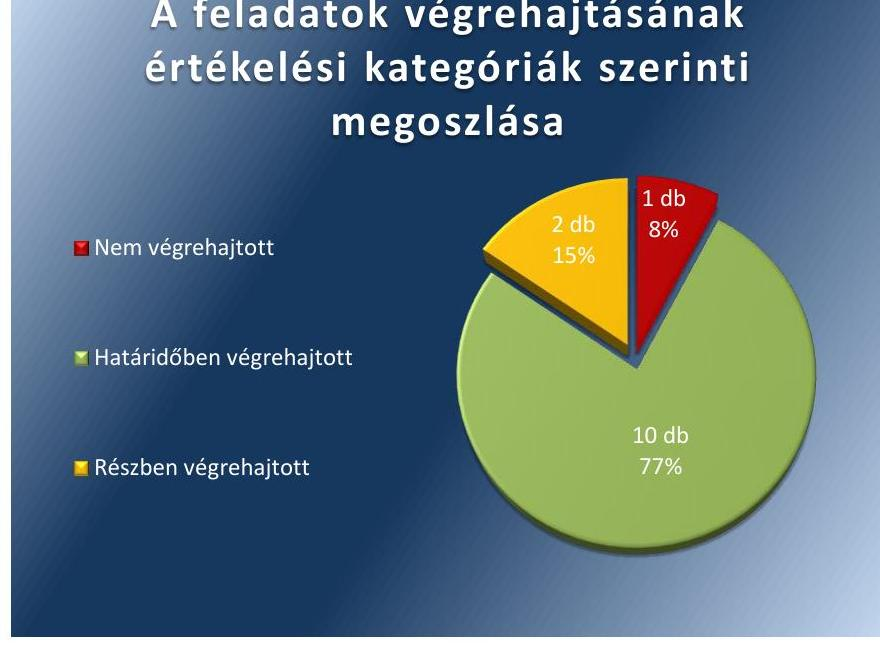

# Jelenetés 

## Utóellenőrzések

Az országos nemzetiségi önkormányzatok gazdálkodásának utóellenőrzése Bolgár Országos Önkormányzat 2018.

---

# Jelenetés 

## Utóellenőrzések

Az országos nemzetiségi önkormányzatok gazdálkodásának utóellenőrzése Bolgár Országos Önkormányzat 2018. 10. hó 25. nap

---

# AZ ELLENŐRZÉST FELÜGYELTE: 

DR. NÉMETH ERZSÉBET felügyeleti vezető

## AZ ELLENŐRZÉST VEZETTE ÉS A VÉGREHAJTÁSÁÉRT FELELŐS:

JÁNOSI ISTVÁN ellenőrzésvezető

## A PROGRAM ÖSSZEÁLLÍTÁSÁÉRT FELELŐS:

TÓTPÁL SZABOLCS osztályvezető

## A TÉMÁHOZ KAPCSOLÓDÓ KORÁBBI SZÁMVEVŐSZÉKI JELENTÉSEK:

- címe: Jelentés - Az Országos Nemzetiségi Önkormányzatok gazdálkodásának ellenőrzéséről - Bolgár Országos Önkormányzat
- sorszáma: 15153

IKTATÓSZÁM: EL-1139-001/2018
TÉMASZÁM: 2460
ELLENŐRZÉS-AZONOSÍTÓ SZÁM: V080408

---

# TARTALOMJEGYZÉK 

■ ÖSSZEGZÉS ..... 5
■ AZ ELLENŐRZÉS CÉLJA ..... 6
■ AZ ELLENŐRZÉS TERÜLETE ..... 7
■ AZ ELLENŐRZÉS HÁTTERE, INDOKOLTSÁGA ..... 8
■ A JELENTÉS LÉNYEGES KÉRDÉSKÖRE ..... 9
■ AZ ELLENŐRZÉS HATÓKÖRE ÉS MÓDSZEREI ..... 10
■ MEGÁLLAPÍTÁSOK ..... 12
■ MELLÉKLETEK ..... 15
I. sz. melléklet: Bolgár Országos Önkormányzat intézkedési terve végrehajtásának értékelése ..... 15
■ FÜGGELÉK: ÉSZREVÉTELEK ..... 19
■ RÖVIDÍTÉSEK JEGYZÉKE ..... 21

---

.

---

# ÖSSZEGZÉS 

A Bolgár Országos Önkormányzat intézkedési tervében foglalt feladatok végrehajtása következtében a belső kontrollrendszer szabályozottsága és a pénzügyi gazdálkodási tevékenység szabályszerüsége javult. Vagyongazdálkodása továbbra sem volt szabályszerű. A végre nem hajtott intézkedések továbbra is veszélyeztetik a közpénzekkel való felelős, elszámoltatható és átlátható gazdálkodást.

## Az ellenőrzés társadalmi indokoltsága

Az Állami Számvevőszék stratégiájában célul tűzte ki a számvevőszéki munka hasznosulásának javítását. Ezzel összhangban ellenőrzi, hogy az ellenőrzött szervezet megvalósította-e a korábbi ellenőrzései által feltárt hibák, hiányosságok és szabálytalanságok megszüntetése céljából elkészített intézkedési tervében foglaltakat. A rendszeres utóellenőrzések hozzájárulnak a szükséges intézkedések tényleges végrehajtásához, ezáltal a közpénzügyek rendezettségének javulásához.

## Főbb megállapítások, következtetések

A Bolgár Országos Önkormányzat az Állami Számvevőszék intézkedést igénylő megállapításai alapján tett javaslataira készített intézkedési tervében 13 feladatot határozott meg, amelyből tízet határidőben, kettőt részben és egyet nem hajtott végre.

Az integritás biztosítása érdekében a Bolgár Országos Önkormányzat Közgyűlése a jogszabályi előírással összhangban határozatba foglalta az elnök vélemény-nyilvánítási joggyakorlásának feltételeit.

A belső kontrollrendszer szabályozottsága a végrehajtott intézkedések eredményeként javult. A jogszabályi előírásoknak megfelelően elkészítették az információs és kommunikációs szabályzatot, az adatvédelmi szabályzatot, a kötelezően közzéteendő adatok nyilvánosságra hozatalának rendjét tartalmazó szabályzatot, az informatikai biztonsági szabályzatot, a kockázatkezelési szabályzatot, valamint a szabálytalanságok kezelésének eljárásrendjét. Elkészítették az ellenőrzési nyomvonalat és kialakították a nyomonkövetési rendszert. Ugyanakkor a jogszabályi előírás ellenére nem alakították ki a közérdekű adatok megismerésére irányuló igények teljesítési rendjét. Az önkormányzat honlapján közzétették a működési és fejlesztési támogatások kedvezményezettjeire vonatkozó információkat.

A pénzügyi gazdálkodási tevékenység szabályszerűsége javult. Az intézkedési tervben meghatározott szabályzatokat, valamint a költségvetési határozat-tervezeteket a jogszabályi előírásoknak megfelelően készítették el. A költségvetési határozat-tervezetet a jogszabályi előírásoknak megfelelően egyeztették az önkormányzathoz tartozó költségvetési szervek vezetőivel.

A vagyongazdálkodás szabályszerűsége nem javult. A jogszabályi előírással összhangban az önkormányzat tulajdonát képező vagyon használatának és hasznosításának szabályait közgyűlési határozatban rögzítették. Ugyanakkor a jogszabályi előírások ellenére a 2014. évi éves beszámoló mérlegét nem támasztották alá leltárral, továbbá nem készítették el az önkormányzat közép- és hosszú távú vagyongazdálkodási tervét.

Az intézkedési tervben meghatározott feladatok végrehajtásáról a jogszabályi előírás ellenére nem vezettek nyilvántartást.

---

# AZ ELLENŐRZÉS CÉLJA 

Az ellenőrzés célja annak értékelése volt, hogy a számvevőszéki jelentésben ${ }^{1}$ foglalt intézkedést igénylő megállapításokkal összhangban készített intézkedési tervben meghatározott feladatokat az ellenőrzött szervezet vég-rehajtotta-e.

---

# **AZ ELLENŐRZÉS TERÜLETE**

## **Bolgár Országos Önkormányzat**

A Bolgár Országos Önkormányzat 1994. évben alakult, ellátja az általa képviselt kisebbség érdekeinek országos, illetve szükség szerint a területi képviseletét és védelmét. Az Önkormányzat² elnöke 2014. október 28-ától kezdődően látta el feladatát.

A Bolgár Országos Önkormányzat Hivatalát 2009. július 1-jén hozta létre az Önkormányzat. A Hivatal³ feladata az Önkormányzat és intézményei gazdálkodásával kapcsolatos feladatok ellátása volt.

Az ÁSZ⁴ a 2015. évben ellenőrizte az Önkormányzat gazdálkodását a 2010. január 1. – 2014. június 30. közötti időszak vonatkozásában. Az ellenőrzés célja annak értékelése volt, hogy az országos nemzetiségi önkormányzat gazdálkodása, a belső kontrollrendszer kialakítása és működtetése, az államháztartásból nyújtott támogatás, illetve az államháztartásból meghatározott célra ingyenesen juttatott vagyon felhasználása a jogszabályi előírásoknak megfelelően történt-e. Az ÁSZ az ellenőrzésről szóló 15153. sorszámú jelentését 2015. szeptember 24-én hozta nyilvánosságra.

---

# AZ ELLENŐRZÉS HÁTTERE, INDOKOLTSÁGA 

Az ÁSZ tv. ${ }^{5}$ 33. § (1) bekezdése értelmében a számvevőszéki jelentések intézkedést igénylő megállapításaihoz és javaslataihoz kapcsolódóan az ellenőrzött szervezet vezetője intézkedési tervet köteles összeállítani, és az Állami Számvevőszék részére megküldeni.

Az ÁSZ által befogadott intézkedési tervben foglaltak megvalósítását - az ÁSZ tv. 33. § (7) bekezdésében foglaltak alapján - az Állami Számvevőszék utóellenőrzés keretében ellenőrizheti. Az utóellenőrzések keretében - az intézkedések értékelése során - az Állami Számvevőszék figyelembe veszi az ellenőrzött szervezetek működési feltételeiben, valamint a jogszabályi előírásokban bekövetkezett változásokat.

Az utóellenőrzés során az ÁSZ értékeli, hogy az érintett számvevőszéki jelentésben foglalt intézkedést igénylő megállapításokkal és javaslatokkal összhangban, az ellenőrzött szervezet által készített intézkedési tervben meghatározott feladatokat a feladatra kijelöltek végrehajtották-e.

Az intézkedések végrehajtásával az adott terület szabályszerű múködése vonatkozásában a kockázatok csökkenhetnek, azonban hosszabb távon az intézkedési tervben foglaltak végrehajtásával önmagában nem szűnnek meg, csak akkor, ha beépülnek az ellenőrzött szervezet múködésébe, azokat folyamatosan karban tartják, figyelembe véve, illetve kezelve a változásokat. Emellett az intézkedések végrehajtásáig újabb kockázatok merülhetnek fel a szabályszerű múködés vonatkozásában, amelyek kezelése szintén kiemelten fontos az ellenőrzött szervezet számára.

Az ellenőrzött szervezet vezetője által készített intézkedési tervekben foglalt feladatok hiányos, illetve késedelmes végrehajtása, vagy annak elmaradása a szabályszerűség és a felelős vezetői magatartás vonatkozásában kockázatot hordoz, ami azt mutatja, hogy az ellenőrzések során feltárt hibák, hiányosságok és szabálytalanságok kezelése nem kapott kellő hangsúlyt. Az utóellenőrzés során is fennálló szabálytalanságok esetén a közpénz, közvagyon veszélyeztetettségi kockázat valószínűsített hatásának értékelése további intézkedéseket vonhat maga után.

Az ellenőrzött szervezet szintjén az utóellenőrzés feltárja, hogy a szervezet az intézkedések végrehajtásával hasznosította-e a korábbi ellenőrzési jelentésben a hiányosságok megszüntetése, illetve a kockázatok kezelése érdekében megfogalmazott javaslatokat, illetve az intézkedések végrehajtása elmaradásának következtében továbbra is fennálló szabálytalanság esetén értékeli a közpénzek, közvagyon veszélyeztetettségét.

Az ÁSZ szintjén az utóellenőrzés visszacsatolást ad az ellenőrzési jelentések hasznosulásáról, az intézkedések elmaradásának, vagy részleges megvalósulásának a közpénzek, közvagyon veszélyeztetettségére gyakorolt valószínűsített hatásának értékelése, további intézkedéseket vonhat maga után.

---

# A JELENTÉS LÉNYEGES KÉRDÉSKÖRE 

Az Önkormányzat az intézkedési tervben foglaltakat az elöirt határidőben végrehajtotta-e?

---

# AZ ELLENŐRZÉS HATÓKÖRE ÉS MÓDSZEREI 

## Az ellenőrzés típusa

Megfelelőségi ellenőrzés.

## Az ellenőrzött időszak

Az utóellenőrzés alapját képező számvevőszéki jelentés közzétételének napjától (2015. szeptember 24.) az ellenőrzésről szóló kiértesítő levél keltének napjáig (2018. május 23.) tartó időszak.

## Az ellenőrzés tárgya

Az ÁSZ tv. 2011. július 1-jei hatálybalépését követően a számvevőszéki jelentésben foglalt intézkedést igénylő megállapításokkal összhangban - az Önkormányzat által - készített Intézkedési tervben foglaltak végrehajtásának ellenőrzése.

## Az ellenőrzött szervezet

Bolgár Országos Önkormányzat és a Bolgár Országos Önkormányzat Hivatala

## Az ellenőrzés jogalapja

Az ellenőrzés jogszabályi alapját az ÁSZ tv. 33. § (1)-(2), illetve (6)-(7) bekezdéseinek az előírási képezik.

## Az ellenőrzés módszerei

Az ellenőrzést az ellenőrzött időszakban hatályos jogszabályok, az ellenőrzés szakmai szabályai, a jelen ellenőrzésre irányadó ÁSZ módszertanok, az ellenőrzési programban foglalt értékelési szempontok szerint, végeztük.

Az ellenőrzés ideje alatt az Önkormányzattal történő kapcsolattartást az ÁSZ SZMSZ ${ }^{6}$-ének vonatkozó előírásai alapján biztosítottuk.

Az utóellenőrzés megállapításait az ÁSZ rendelkezésére álló, valamint az ÁSZ adatbekérése szerint, az Önkormányzat által rendelkezésre bocsátott dokumentumok alapozták meg.

Az ellenőrzési bizonyítékként felhasználható adatforrások közé tartoztak egyrészt az ellenőrzési program részletes szempontjainál felsorolt

---

adatforrások, másrészt minden - az ellenőrzés folyamán feltárt, az ellenőrzés szempontjából információt tartalmazó - dokumentum.

Az intézkedési tervekben előírt feladatokat azok végrehajthatósága, illetve végrehajtása szempontjából az alábbiak szerint értékeltük:
$\longrightarrow$ „határidőben végrehajtott" a feladat, ha a teljesítés dokumentáltan, az intézkedési tervben előírt határidőben és tartalommal megtörtént;
$\longrightarrow$ „határidőn túl végrehajtott" a feladat, ha annak teljesítése az intézkedési tervben meghatározott módon, de az előírt határidőn túl történt meg;
$\longrightarrow$ „részben végrehajtott" a feladat, ha végrehajtása teljes körűen az intézkedési tervben előírt módon nem történt meg;
$\longrightarrow$ „nem végrehajtott" a feladat, ha a végrehajtás nem történt meg, vagy amennyiben a teljesítést nem dokumentálták;
$\longrightarrow$ „okafogyottá vált" a feladat, ha végrehajtására - meghatározott esemény bekövetkezése, továbbá külső körülmény, a működést érintő feltétel változása miatt - már nincs szükség, illetve lehetőség, és egyértelműen megállapítható, hogy az intézkedést szükségessé tevő körülmény a jövőben nem fordulhat elő;
$\longrightarrow$ „nem időszerű" az a feladat, amelynek ellenőrzési időszakon belüli végrehajtására azért nem került (kerülhetett) sor, mert az intézkedés alapjául szolgáló esemény nem következett be, de annak jövőbeni előfordulása lehetséges, a végrehajtása nem volt esedékes, vagy a végrehajtás határideje még nem járt le.
Az ellenőrzés lefolytatásához az Önkormányzat a tanúsítványok elektronikus kitöltésével, valamint az ÁSZ által kért dokumentumok elektronikus megküldésével szolgáltatott adatokat, amelyek valódiságát és teljes körűségét az ellenőrzött szervezet vezetője által tett teljességi és hitelességi nyilatkozat igazolja. Az így rendelkezésre bocsátott adatok, információk kontrollja az ellenőrzés keretében megtörtént.

Az utóellenőrzés az Önkormányzat ellenőrzéséről készült 15153. számú ÁSZ jelentés intézkedést igénylő megállapításai és javaslatai hasznosítására elfogadott intézkedési tervben foglalt feladatok 2015. szeptember 24. 2018. május 23. közötti végrehajtására irányult.

---

# MEGÁLLAPÍTÁSOK 

## Az Önkormányzat az intézkedési tervben foglaltakat az előírt határidőben végrehajtotta-e?

Összegző megállapítás

Az Önkormányzat az intézkedési tervben szereplő 13 feladatból tízet határidőben végrehajtott, két feladatot részben, egy feladatot nem hajtott végre.

Az Önkormányzat az általa elkészített és az ÁSZ által elfogadott intézkedési tervében meghatározott 13 feladatból tízet határidőben végrehajtott, két feladatot részben, egy feladatot nem hajtott végre.

Az Önkormányzat intézkedési tervében meghatározott feladatokat, határidőket, a feladatok végrehajtásáért felelős személyeket és a feladatok végrehajtását az I. sz. melléklet mutatja be.

A hivatalvezető ${ }^{7}$ az intézkedési tervben meghatározott feladatok végrehajtásának $8 \mathrm{kr} .{ }^{8} 14 . \S$ (1) bekezdése előírása szerinti nyilvántartást nem vezette.

Az Önkormányzat intézkedési tervében vállalt feladatok végrehajtásának értékelését az 1. ábra szemlélteti.

1. ábra

A feladatok végrehajtásának értékelési kategóriák szerinti megoszlása

A Z INTEGRITÁS biztosítása érdekében a Közgyűlés ${ }^{9}$ a Nek. tv. ${ }^{10}$ előírásával összhangban határozatba foglalta az elnök ${ }^{11}$ vélemény-nyilvánítási joggyakorlásának feltételeit.

---

A BELSŐ KONTROLLRENDSZER szabályszerű működtetésének biztosítása érdekében a hivatalvezető Info. tv. ${ }^{12}$ előírásaival összhangban elkészítette az információs és kommunikációs szabályzatot, az adatvédelmi szabályzatot, valamint a kötelezően közzéteendő adatok nyilvánosságra hozatalának rendjét tartalmazó szabályzatot. Az Önkormányzat honlapján közzétették a múködési és fejlesztési támogatások kedvezményezettjeire vonatkozó információkat. Ugyanakkor a hivatalvezető az Info. tv. 30. § (6) bekezdésében és az Ávr. ${ }^{13} 13 . \S$ (2) bekezdés h) pontjában foglalt előírások ellenére nem alakította ki a közérdekú adatok megismerésére irányuló igények teljesítési rendjét.

A hivatalvezető az Ibtv. ${ }^{14}$ előírásával összhangban elkészítette az informatikai biztonsági szabályzatot.

A hivatalvezető a Bkr. előírásaival összhangban elkészítette a kockázatkezelési szabályzatot és a szabálytalanságok kezelésének eljárásrendjét.

A hivatalvezető a Bkr. előírásaival összhangban elkészítette az ellenőrzési nyomvonalat és kialakította a nyomonkövetési rendszert.

# A PÉNZÜGYI GAZDÁLKODÁSI TEVÉKENYSÉG 

szabályszerűsége érdekében a hivatalvezető a jogszabályi előírásokkal összhangban elkészítette az intézkedési tervben meghatározott számviteli és gazdálkodási szabályzatokat.

A hivatalvezető a költségvetési határozat-tervezeteket az Áht. ${ }^{15}$-ban és az Ávr.-ben foglalt előírásoknak megfelelően készítette el és terjesztette elő a Közgyűlés számára. A költségvetési határozat-tervezeteket az Ávr. előírásának megfelelően egyeztette az Önkormányzathoz tartozó költségvetési szervek vezetőivel.

A hivatalvezető az éves beszámolók részeként elkészítette a vagyonkimutatást, amely tartalmilag megfelelt az Áhsz. ${ }^{16}$ előírásainak.

A VAGYONGAZDÁLKODÁS szabályszerűsége érdekében a hivatalvezető az Nvtv. ${ }^{17}$-ben és az Nek. tv. -ben foglaltakkal összhangban elkészítette az Önkormányzat tulajdonát képező vagyon használatának és hasznosításának szabályait, amelyet a Közgyűlés határozatban fogadott el.

Ugyanakkor a hivatalvezető az Nvtv. 9. § (1) bekezdésében foglalt előírás ellenére nem készítette el az Önkormányzat közép- és hosszú távú vagyongazdálkodási tervét.

A hivatalvezető a Számv. tv. ${ }^{18}$ 69. § (1) bekezdésében és az Áhsz. 22. § (1) bekezdésében foglalt előírások ellenére a 2014. évi éves beszámolóhoz nem készített leltárt. Ezáltal sérült a Számv. tv. 15. § (3) bekezdésében foglalt valódiság elve, mely szerint a könyvvitelben rögzített és a beszámolóban szereplő tételeknek a valóságban is megtalálhatóknak, bizonyíthatóknak, kívülállók által is megállapíthatóknak kell lenniük.

---

.

---

# MELLÉKLETEK

- I. SZ. MELLÉKLET: BOLGÁR ORSZÁGOS ÖNKORMÁNYZAT INTÉZKEDÉSI TERVE VÉGREHAJTÁSÁNAK ÉRTÉKELÉSE

|  1. | Intézkedési tervben meghatározott feladat | Az intézkedési tervben meghatározott határidő | Az intézkedési tervben heghatározott feladat felelőse | A feladat végrehajtása  |
| --- | --- | --- | --- | --- |
|  1. | A Bolgár Országos Önkormányzat Közgyűlése 2016. február 5-i ülésén elfogadta a következő határozatot:
Határozat 17/2016. (02.05.) BOÓ
A Bolgár Országos Önkormányzat képviselő-testülete beszámolási kötelezettség előírásával felhatalmazza az elnököt az Önkormányzatnak a Közgyűlés hatáskörébe tartozó vélemény-nyilvánítási, egyetértési és közreműködési jogosultságainak teljesítésére. | folyamatos | elnök | A Közgyűlés 17/2016. (02.05.) BOÓ számú határozata a Nek. tv. 39/A. § (1) bekezdésének előírásával összhangban felhatalmazta az elnököt az Önkormányzatnak a Közgyűlés hatáskörébe tartozó vélemény-nyilvánítási, egyetértési és közreműködési jogosultságainak teljesítésére.  |
|  2. | A számlarend, a bizonylati rend, az önköltségszámítás rendje, a beszerzések lebonyolításának eljárásrendje, a reprezentációs kiadások felosztásának eljárásrendje, továbbá a szabálytalanságok eljárásrendjére vonatkozó szabályzatok elkészítése folyamatban van. A vezetékes és rádiótelefonok használatára vonatkozó szabályzat elkészült és 2015. június 1-én hatályba lépett. | 2015. december 31. | hivatalvezető | A hivatalvezető az intézkedési tervben meghatározott szabályzatokat a jogszabályi előírásokkal összhangban elkészítette. Az egyes kiadmányozott szabályzatok a következők:
- 2016. január 1-től hatályos „Számlarend" a Számv. tv. 161. §-a, valamint az Áhsz. 51. § (2) bekezdése előírásaival összhangban (Közgyűlés általi elfogadás határozatszáma: 95/2015. (11.20.) BOÓ);
- 2015. július 1-től hatályos „Bizonylati szabályzat" a Számv. tv. 161. § (2) bekezdésének d) pontjával összhangban (Közgyűlés általi elfogadás határozatszáma: 96/2015. (11.20.) BOÓ);
- 2016. január 1-től hatályos „Önköltség számítási szabályzat" a Számv. tv. 14. § (5) bekezdése c) pontja és az Áhsz. 50. § (3) bekezdése előírásaival összhangban (Közgyűlés általi elfogadás határozatszáma: 97/2015. (11.20.) BOÓ);
- 2015. december 1-től hatályos „Szabálytalanságok kezelésének eljárásrendje" című szabályzat a Bkr. 6. § (4) bekezdése előírásaival összhangban (Közgyűlés általi elfogadás határozatszáma: 98/2015. (11.20.) BOÓ);  |

---

|  3. |  |  | Az intézkedési
tervben
meghatározott
haláridő | Az intézkedési
tervben meghatározott feladat felelőse | A feladat végrehajtása  |
| --- | --- | --- | --- | --- | --- |
|   |  |  |  |  | - 2016. január 1-től hatályos „Beszerzések lebonyolításának eljárásrendje" című szabályzat, az Ávr. 13. § (2) bekezdés b) pontja előírásával összhangban;
- 2016. január 1-től hatályos „Reprezentációs kiadások szabályzata", az Ávr. 13. § (2) bekezdés e) pontja előírásával összhangban;
- 2015. június 1-től hatályos „Szabályzat az Önkormányzat és intézményei helyiségeinek és berendezésének, valamint a telefonok, a személyi számítógépek, faxok és az internet használatának rendjéről", az Ávr. 13. § (2) bekezdés g) pontja előírásával összhangban.  |
|   |  |  |  |  | 3. Az ellenőrzési és beszámoltatási nyomvonalakról szóló dokumentum kiadásra került. A dokumentum tartalmazza a Bolgár Országos Önkormányzat és intézményei beszámoltatási és ellenőrzési nyomvonalait, valamint a felelősségi köröket.  |
|   |  |  |  |  | 4. A kockázatkezelési szabályzat 2015. június 1-én lépett hatályba.  |
|   |  |  |  |  | 5. A Bolgár Országos Önkormányzat Közgyűlése 2016. február 5-i ülésén elfogadta a Bolgár Országos Önkormányzat Hivatala információs és kommunikációs szabályzatát, amely 2016. február 8-án hatályba lépett, amely alapján a rendszert működtetjük.  |
|   |  |  |  |  | 6. Az informatikai biztonsági szabályzat, továbbá az adatvédelmi és adatbiztonsági szabályzat 2015. június 1-én lépett hatályba.  |
|   |  |  |  |  | 2015. június 1.  |
|   |  |  |  |  | 2015. június 1.  |
|   |  |  |  |  | 2015. június 1.  |
|   |  |  |  |  | 2015. június 1.  |
|   |  |  |  |  | 2015. június 1.  |
|   |  |  |  |  | 2015. június 1.  |
|   |  |  |  |  | 2015. június 1.  |
|   |  |  |  |  | 2015. június 1.  |
|   |  |  |  |  | 2015. június 1.  |
|   |  |  |  |  | 2015. június 1.  |
|   |  |  |  |  | 2015. június 1.  |
|   |  |  |  |  | 2015. június 1.  |
|   |  |  |  |  | 2015. június 1.  |
|   |  |  |  |  | 2015. június 1.  |
|   |  |  |  |  | 2015. június 1.  |
|   |  |  |  |  | 2015. június 1.  |
|   |  |  |  |  | 2015. június 1.  |
|   |  |  |  |  | 2015. június 1.  |
|   |  |  |  |  | 2015. június 1.  |
|   |  |  |  |  | 2015. június 1.  |
|   |  |  |  |  | 2015. június 1.  |
|   |  |  |  |  | 2015. június 1.  |
|   |  |  |  |  | 2015. június 1.  |
|   |  |  |  |  | 2015. június 1.  |
|   |  |  |  |  | 2015. június 1.  |
|   |  |  |  |  | 2015. június 1.  |
|   |  |  |  |  | 2015. június 1.  |
|   |  |  |  |  | 2015. június 1.  |
|   |  |  |  |  | 2015. június 1.  |
|   |  |  |  |  | 2015. június 1.  |
|   |  |  |  |  | 2015. június 1.  |
|  

---

|  6 | Intézkedési
tervben
meghatározott
feladat | Az intézkedési
tervben
meghatározott
határidő | Az intézkedési
tervben meghatározott feladat
felelőse | A feladat végrehajtása  |
| --- | --- | --- | --- | --- |
|  7. | A hivatal tevékenységének keretében megvalósuló nyomon követési rendszer kialakítása tárgyában 2015. április 1. - június 30. közötti időben szervezeti átvilágítást végeztünk, kiemelt fontossággal a felelősségi körök és munkafolyamatok megvalósulásának útjára és annak hatékonyságára. Az ellenőrzési és beszámoltatási nyomvonalakról szóló dokumentum elkészült, a szükséges nyomon követési rendszer felülvizsgálata – belső ellenőr bevonásával – folyamatos. | 2015. december 31., utána folyamatosan | hivatalvezető | A hivatalvezető 2015. augusztus 1-jén a 8kr. 3. § e) pontjának és 10. §-ának előírásaival összhangban elkészítette az "Ellenőrzési és beszámoltatási nyomvonalak a Bolgár Országos Önkormányzatnál" című dokumentumot, amely tartalmazta az Önkormányzat és intézményei nyomonkövetési rendszerét.  |
|  8. | A jövőben a költségvetési határozat-tervezetek költségvetési szervek vezetőivel történő egyeztetését írásba fogjuk foglalni. | folyamatos | hivatalvezető | A 2016-2018. évi költségvetési határozat-tervezetek egyeztetése az Önkormányzathoz tartozó költségvetési szervek vezetőivel az Ávr. 27. § (1) bekezdésében foglalt előírásnak megfelelően megtörtént.  |
|  9. | A költségvetési határozatra vonatkozó előterjesztések megfelelőségére – a gazdasági vezető bevonásával – kiemelt figyelmet fordít a hivatalvezető a jövőben. | folyamatos | hivatalvezető | A hivatalvezető a 2016-2018. évi költségvetési határozat-tervezeteket az Áht. és az Ávr. előírásaival összhangban készítette el és terjesztette elő a Közgyűlés számára.  |
|  10. | A jövőben a zárszámadási határozat-tervezet előterjesztésekor a Közgyűlés részére tájékoztatásul bemutatandó vagyonkimutatás elkészítéséről – a gazdasági vezető bevonásával – a hivatalvezető gondoskodik. | folyamatos | hivatalvezető | A hivatalvezető az Áhsz. 30. §-ában foglalt előírásokkal összhangban elkészítette a 2015-2017. évi éves beszámolók részét képező vagyonkimutatást.  |
|   |  | Részben végrehajtott feladatok |  |   |
|  11. | Az Önkormányzat honlapján a nem normatív, céljellegű, működési és fejlesztési támogatások kedvezményezettjeinek neve, a támogatás célja és összege kigyűjtésre kerül, a honlapra történő feltöltése folyamatban van. A közérdekű adatok megismerésére vonatkozó szabályzat kiadása folyamatban van. | 2015. december 31. | hivatalvezető | Végrehajtott feladat:
A hivatalvezető az Info. tv. 35. § (3) bekezdése és az Ávr. 13. § (2) bekezdés h) pontja előírásaival összhangban elkészítette és a Közgyűlés 99/2015. (11.20.) BOÖ számú határozatával elfogadta az Önkormányzat és a Hivatal 2015. december 1-től hatályos, "Kötelezően közzéteendő adatok nyilvánosságra hozatalának rendje" című szabályzatát.  |
|   | A Bolgár Országos Önkormányzat és a Bolgár Országos Önkormányzat Hivatala kötelezően közzéteendő adatok nyilvánosságra hozatalának rendjéről szóló szabályzatának kidolgozása folyamatban van. | 2016. március 31. |  | Az Önkormányzat honlapján megjelenítésre került a nem normatív, céljellegű, működési és fejlesztési támogatások kedvezményezettjeinek neve, a támogatás célja és összege.
Nem végrehajtott feladat:
A hivatalvezető az Info. tv. 30. § (6) bekezdésében és az Ávr. 13. § (2) bekezdés h) pontjában foglalt előírások ellenére – nem intézkedett a közérdekű adatok megismerésére irányuló igények teljesítése rendjének kialakításáról.  |

---

|  12. | A törzsvagyonba tartozó vagyonelemek körének meghatározásáról és a vagyon használatáról és hasznosításáról szóló szabályzat és a közép- és hosszú távú vagyongazdálkodási terv készítése folyamatban van. | 2015. december 31. | hivatalvezető | Végrehajtott feladat:
A hivatalvezető a Nek. tv. 113. § c) pontjának előírásaival összhangban elkészítette és a Közgyűlés 100/2015. (11.20.) BOÓ számú határozatával elfogadta az Önkormányzat tulajdonát képező vagyon használatának és hasznosításának szabályait.
Nem végrehajtott feladat:
A hivatalvezető az Nvtv. 9. § (1) bekezdésében foglalt előírás ellenére nem készítette el az Önkormányzat közép- és hosszú távú vagyongazdálkodási tervét.  |
| --- | --- | --- | --- | --- |
|  13. | A mérleg tételeinek alátámasztására szolgáló leltár - a leltározási szabályzatnak megfelelően - 2014. december 31. fordulónappal elkészült. | 2014. december 31. | hivatalvezető | A hivatalvezető a Számv. tv. 69. § (1) bekezdésében, valamint az Áhsz. 22. § (1) bekezdésében foglalt előírások ellenére a 2014. évi éves beszámoló mérlegében szereplő tételek alátámasztásához nem állított össze olyan leltárt, amely tételesen és ellenőrizhető módon tartalmazta volna a mérleg fordulónapján meglévő eszközöket és forrásokat mennyiségben és értékben.  |

---

# FÜGGELÉK: ÉSZREVÉTELEK 

A jelentéstervezetet a Számvevőszék 15 napos észrevételezésre megküldte az ellenőrzött szervezetek vezetőinek az ÁSZ tv. 29. §* (1) bekezdése előírásának megfelelően.
Az ellenőrzött szervezetek vezetői a jelentéstervezet megállapításaira nem tettek észrevételt.

[^0]
[^0]:    * 29. § (1) Az Állami Számvevőszék az ellenőrzési megállapításait megküldi az ellenőrzött szervezet vezetőjének vagy az általa megbízott személynek, és annak, akinek személyes felelősségét állapította meg.
    (2) Az ellenőrzött szervezet vezetője és a felelősként megjelölt személy az ellenőrzés megállapításaira tizenöt napon belül írásban észrevételt tehet.
    (3) Az Állami Számvevőszék az észrevételre a beérkezésétől számított harminc napon belül írásban válaszol. A figyelembe nem vett észrevételeket köteles a jelentésben feltüntetni, és megindokolni, hogy azokat miért nem fogadta el.

---

.

---

# RÖVIDÍTÉSEK JEGYZÉKE 

${ }^{1}$ számvevőszéki jelentés
${ }^{2}$ Önkormányzat
${ }^{3}$ Hivatal
${ }^{4}$ ÁSZ
${ }^{5}$ ÁSZ tv.
${ }^{6}$ ÁSZ SZMSZ
${ }^{7}$ hivatalvezető
${ }^{8}$ Bkr.
${ }^{9}$ Közgyűlés
${ }^{10}$ Nek. tv.
${ }^{11}$ elnök
${ }^{12}$ Info. tv.
${ }^{13}$ Ávr.
${ }^{14}$ Ibtv.
${ }^{15}$ Áht.
${ }^{16}$ Áhsz.
${ }^{17}$ Nvtv.
${ }^{18}$ Számv. tv.
„Az Országos Nemzetiségi Önkormányzatok gazdálkodásának ellenőrzése - Bolgár Országos Önkormányzat" című 15153. számú jelentés
Bolgár Országos Önkormányzat
Bolgár Országos Önkormányzat Hivatala
Állami Számvevőszék
2011. évi LXVI. törvény az Állami Számvevőszékről
az Állami Számvevőszék Szervezeti és Működési Szabályzata
Bolgár Országos Önkormányzat Hivatalának vezetője
370/2011. (XII. 31.) Korm. rendelet a költségvetési szervek belső kontrollrendszeréről és belső ellenőrzéséről (hatályos: 2012. január 1-jétől)
Bolgár Országos Önkormányzat közgyűlése
2011. évi CLXXIX. törvény a nemzetiségek jogairól (hatályos: 2012. január 1-jétől)

Bolgár Országos Önkormányzat elnöke
2011. évi CXII. törvény az információs önrendelkezési jogról és az információszabadságról (hatályos: 2011. július 27-étől)
368/2011. (XII.31.) Kormányrendelet az államháztartásról szóló törvény végrehajtásáról (hatályos: 2012. január 1-jétől)
2013. évi L. törvény az állami és önkormányzati szervek elektronikus információbiztonságáról (hatályos: 2013. január 1-jétől)
2011. évi CXCV. törvény az államháztartásról (hatályos 2011. december 31-étől) 4/2013. (I. 11.) Korm. rendelet az államháztartás számviteléről (hatályos: 2014. január 1-jétől)
2011. évi CXCVI. törvény a nemzeti vagyonról (hatályos: 2011. december 31-étől) 2000. évi C. törvény a számvitelről (hatályos: 2001. január 1-jétől)

---

# ÁLLAMI SZÁMVEVŐSZÉK 

1052 Budapest, Apáczai Csere János utca 10.
Levélcím: 1364 Budapest 4. Pf. 54
Telefon: +36 14849100 Telefax: +36 14849200
www.asz.hu