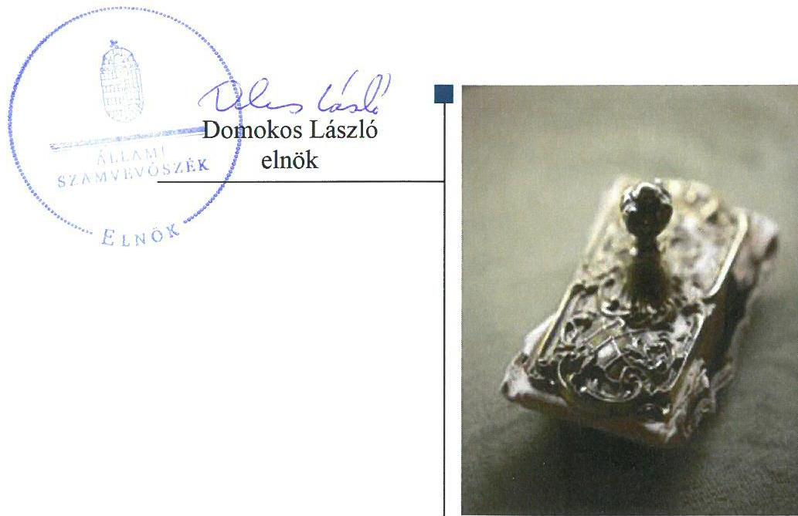
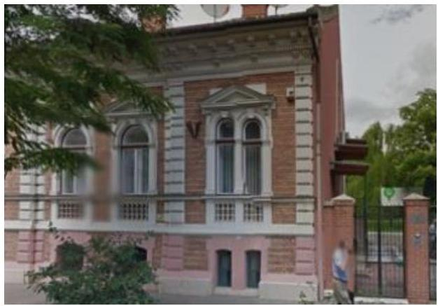
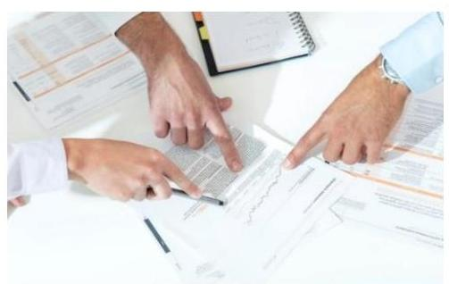

# Jelentés 

## Utóellenőrzések

Az Országos Nemzetiségi Önkormányzatok gazdálkodásának utóellenőrzése Országos Horvát Önkormányzat 2018. november 6.

---

# AZ ELLENŐRZÉST FELÜGYELTE: 

DR. NÉMETH ERZSÉBET felügyeleti vezető

## AZ ELLENŐRZÉST VEZETTE ÉS A VÉGREHAJTÁSÁÉRT FELELŐS:

DR. JAKAB KORNÉL ellenőrzésvezető

## A PROGRAM ÖSSZEÁLLÍTÁSÁÉRT FELELŐS:

TÓTPÁL SZABOLCS osztályvezető

## A TÉMÁHOZ KAPCSOLÓDÓ KORÁBBI SZÁMVEVŐSZÉKI JELENTÉSEK:

- címe: Jelentés - Az Országos Nemzetiségi Önkormányzatok gazdálkodásának ellenőrzéséről - Országos Horvát Önkormányzat
- sorszáma: 15160

IKTATÓSZÁM: EL-1140-001/2018
TÉMASZÁM: 6/2
ELLENŐRZÉS-AZONOSÍTÓ SZÁM: V080411

---

# TARTALOMJEGYZÉK 

■ ÖSSZEGZÉS ..... 5
■ AZ ELLENŐRZÉS CÉLJA ..... 6
■ AZ ELLENŐRZÉS TERÜLETE ..... 7
■ AZ ELLENŐRZÉS HÁTTERE, INDOKOLTSÁGA ..... 8
■ A JELENTÉS LÉNYEGES KÉRDÉSKÖRE ..... 9
■ AZ ELLENŐRZÉS HATÓKÖRE ÉS MÓDSZEREI ..... 10
■ MEGÁLLAPÍTÁSOK ..... 12
■ MELLÉKLETEK ..... 15
I. sz. melléklet: az Országos Horvát Önkormányzat intézkedési tervének végrehajtása ..... 15
■ FÜGGELÉK: ÉSZREVÉTELEK ..... 19
■ RÖVIDÍTÉSEK JEGYZÉKE ..... 21

---

.

---

# ÖSSZEGZÉS 

Az utóellenőrzés megállapította, hogy az Országos Horvát Önkormányzat az intézkedési tervben meghatározott feladatokat határidőben végrehajtotta, ennek eredményeként javult az önkormányzat gazdálkodásának szabályszerűsége és átláthatósága.

## Az ellenőrzés társadalmi indokoltsága

Az Állami Számvevőszék stratégiájában célul tűzte ki a számvevőszéki munka hasznosulásának javítását. Ezzel összhangban ellenőrzi, hogy az ellenőrzött szervezet megvalósította-e a korábbi ellenőrzései által feltárt hibák, hiányosságok és szabálytalanságok megszüntetése céljából elkészített intézkedési tervében foglaltakat. A rendszeres utóellenőrzések hozzájárulnak a szükséges intézkedések tényleges végrehajtásához, ezáltal a közpénzügyek rendezettségének javulásához.

## Főbb megállapítások, következtetések

Az Önkormányzat intézkedési tervében meghatározott kilenc feladatot azok felelősei határidőben végrehajtották.
Az Elnök az intézkedési tervnek megfelelően a költségvetési határozattervezeteket határidőben a Közgyűlés elé terjesztette, a Hivatalvezető intézkedett a Hivatal SZMSZ-ének, és Ügyrendjének kiegészítéséről. A Hivatalvezető a Magyar Államkincstár felé határidőben teljesítette az adatszolgáltatási kötelezettségét. Az Önkormányzat az intézményei tevékenységének törvényességi, szakszerűségi és hatékonysági ellenőrzését elvégezte. A Hivatal a gazdálkodási jogkörök gyakorlása során érvényesítette a jogszabályi előírásokat. A Hivatal elvégezte az ingatlanok mennyiségi felvétellel történő leltározását, a székház helyes számviteli nyilvántartásba vételét és felülvizsgálta a forgalomképtelennek minősülő törzsvagyont. Az intézkedési tervben foglaltak végrehajtásának hatására javult az önkormányzat gazdálkodásának szabályszerűsége és átláthatósága.

Az Elnök gondoskodott a feladatok végrehajtásának nyilvántartásáról, a Hivatalvezető a jogszabályi előírásnak megfelelően vezette az intézkedési tervben rögzített feladatok végrehajtásáról szóló nyilvántartást.

---

# AZ ELLENŐRZÉS CÉLJA 

Az ellenőrzés célja annak értékelése volt, hogy a számvevőszéki jelentésben foglalt intézkedést igénylő megállapításokkal összhangban készített intézkedési tervben meghatározott feladatokat az ellenőrzött szervezet végrehajtotta-e.

---

# **AZ ELLENŐRZÉS TERÜLETE**

## **Országos Horvát Önkormányzat**

Az Önkormányzat jogi személyiséggel rendelkező, az Njtv. alapján létrehozott nemzetiségi önkormányzat, amely 1995. évben alakult. Alapvető feladata a magyarországi horvátok egyéni és kollektív jogainak, érdekeinek védelme és képviselete az önkormányzati feladat- és hatáskörök gyakorlásával. Az Önkormányzat közfeladatai ellátásához támogatásban részesül, valamint hazai és uniós pályázati forrásokat szerezhet. Az Önkormányzatot az Elnök képviseli, a jelenlegi Elnök a 2014. évi országos nemzetiségi választások óta látja el feladatát. Az Önkormányzat gazdálkodási feladatait az önállóan működő Hivatal látja el. A nemzetiségi önkormányzati feladat- és hatáskörök a Közgyűlést illetik meg.

Az ÁSZ 2010. január 1. és 2014. június 30. közötti időszakra vonatkozóan végezte el az Önkormányzat gazdálkodása szabályszerűségének ellenőrzését és erről 2015. szeptember 10.-én hozta nyilvánosságra a 15160. számú ÁSZ jelentést.

Az ÁSZ jelentés az Önkormányzat Elnöke részére egy, a Hivatalvezető részére hat intézkedést igénylő megállapítást fogalmazott meg. A Hivatalvezető az ÁSZ Elnökének 2015. október 8-án küldte meg a Közgyűlése által, a 111/2015. (IX.26.) számú közgyűlési határozattal elfogadott intézkedési tervet. Az intézkedési terv az Önkormányzat Elnöke részére kettő, a Hivatalvezető részére hét intézkedési kötelezettséggel járó feladatot foglalt magában.

Az utóellenőrzés a 2015. szeptember 10. és 2018. március 29. közötti ellenőrzési időszak alatt végrehajtott feladatok teljesítésének értékelésére irányult.

---

# AZ ELLENŐRZÉS HÁTTERE, INDOKOLTSÁGA 

Az ÁSZ tv. 33. § (1) bekezdése értelmében a számvevőszéki jelentések intézkedést igénylő megállapításaihoz és javaslataihoz kapcsolódóan az ellenőrzött szervezet vezetője intézkedési tervet köteles összeállítani, és az Állami Számvevőszék részére megküldeni.

Az ÁSZ által befogadott intézkedési tervben foglaltak megvalósítását az ÁSZ törvény 33. § (7) bekezdésében foglaltak alapján - az Állami Számvevőszék utóellenőrzés keretében ellenőrizheti. Az utóellenőrzések keretében - az intézkedések értékelése során - az Állami Számvevőszék figyelembe veszi az ellenőrzött szervezetek működési feltételeiben, valamint a jogszabályi előírásokban bekövetkezett változásokat.

Az utóellenőrzés során az ÁSZ értékeli, hogy az érintett számvevőszéki jelentésben foglalt intézkedést igénylő megállapításokkal és javaslatokkal összhangban, az ellenőrzött szervezet által készített intézkedési tervben meghatározott feladatokat a feladatra kijelöltek végrehajtották-e.

Az intézkedések végrehajtásával az adott terület szabályszerű működése vonatkozásában a kockázatok csökkenhetnek, azonban hosszabb távon az intézkedési tervben foglaltak végrehajtásával önmagában nem szűnnek meg, csak akkor, ha beépülnek az ellenőrzött szervezet működésébe, azokat folyamatosan karban tartják, figyelembe véve, illetve kezelve a változásokat. Emellett az intézkedések végrehajtásáig újabb kockázatok merülhetnek fel a szabályszerű működés vonatkozásában, amelyek kezelése szintén kiemelten fontos az ellenőrzött szervezet számára.

Az ellenőrzött szervezet vezetője által készített intézkedési tervekben foglalt feladatok hiányos, illetve késedelmes végrehajtása, vagy annak elmaradása a szabályszerűség és a felelős vezetői magatartás vonatkozásában kockázatot hordoz, ami azt mutatja, hogy az ellenőrzések során feltárt hibák, hiányosságok és szabálytalanságok kezelése nem kapott kellő hangsúlyt. Az utóellenőrzés során is fennálló szabálytalanságok esetén a közpénz, közvagyon veszélyeztetettségi kockázat valószínűsített hatásának értékelése további intézkedéseket vonhat maga után.

Az ellenőrzött szervezet szintjén az utóellenőrzés feltárja, hogy a szervezet az intézkedések végrehajtásával hasznosította-e a korábbi ellenőrzési jelentésben a hiányosságok megszüntetése, illetve a kockázatok kezelése érdekében megfogalmazott javaslatokat, illetve az intézkedések végrehajtása elmaradásának következtében továbbra is fennálló szabálytalanság esetén értékeli a közpénzek, közvagyon veszélyeztetettségét.

Az ÁSZ szintjén az utóellenőrzés visszacsatolást ad az ellenőrzési jelentések hasznosulásáról, az intézkedések elmaradásának, vagy részleges megvalósulásának a közpénzek, közvagyon veszélyeztetettségére gyakorolt valószínűsített hatásának értékelése további intézkedéseket vonhat maga után.

---

# A JELENTÉS LÉNYEGES KÉRDÉSKÖRE 

Az Önkormányzat az intézkedési tervben foglaltakat az előírt határidőben végrehajtotta-e?

---

# AZ ELLENŐRZÉS HATÓKÖRE ÉS MÓDSZEREI 

## Az ellenőrzés típusa

Megfelelőségi ellenőrzés.

## Az ellenőrzött időszak

Az utóellenőrzés alapját képező ÁSZ jelentés közzétételének napjától 2015. szeptember 10. - az ellenőrzésről szóló kiértesítő levél keltének napjáig - 2018. március 29. - tartó időszak.

## Az ellenőrzés tárgya

Az ÁSZ tv. 2011. július 1-jei hatálybalépését követően a számvevőszéki jelentésben foglalt intézkedést igénylő megállapításokkal összhangban - az Önkormányzat által - készített Intézkedési tervben foglaltak végrehajtásának ellenőrzése.

## Az ellenőrzött szervezet

Országos Horvát Önkormányzat, Országos Horvát Önkormányzat Hivatala.

## Az ellenőrzés jogalapja

Az ellenőrzés jogszabályi alapját az ÁSZ tv. 33. § (7) bekezdése képezi.

## Az ellenőrzés módszerei

Az ellenőrzést az ellenőrzött időszakban hatályos jogszabályok, az ellenőrzés szakmai szabályai, a jelen ellenőrzésre irányadó ÁSZ módszertanok, az ellenőrzési programban foglalt értékelési szempontok szerint végeztük.

Az ellenőrzés ideje alatt az ellenőrzöttel történő kapcsolattartást az ÁSZ SZMSZ-ének vonatkozó előírásai alapján biztosítottuk.

Az utóellenőrzés megállapításait az ÁSZ rendelkezésére álló, valamint az ÁSZ adatbekérése szerint, az ellenőrzött által rendelkezésre bocsátott dokumentumok alapozták meg.

Az ellenőrzési bizonyítékként felhasználható adatforrások közé tartoztak egyrészt az ellenőrzési program részletes szempontjainál felsorolt adatforrások, másrészt minden - az ellenőrzés folyamán feltárt, az ellenőrzés szempontjából információt tartalmazó dokumentum.

---

Az intézkedési tervekben előírt feladatokat azok végrehajthatósága, illetve végrehajtása szempontjából az alábbiak szerint értékeltük:
$\longrightarrow$ „határidőben végrehajtott" a feladat, ha a teljesítés dokumentáltan, az intézkedési tervben előírt határidőben és tartalommal megtörtént;
$\longrightarrow$ „határidőn túl végrehajtott" a feladat, ha annak teljesítése az intézkedési tervben meghatározott módon, de az előírt határidőn túl történt meg;
$\longrightarrow$ „részben végrehajtott" a feladat, ha végrehajtása teljes körűen az intézkedési tervben előírt módon nem történt meg;
$\longrightarrow$ „nem végrehajtott" a feladat, ha a végrehajtás nem történt meg, vagy amennyiben a teljesítést nem dokumentálták;
$\longrightarrow$ „okafogyottá vált" a feladat, ha végrehajtására - meghatározott esemény bekövetkezése, továbbá külső körülmény, a működést érintő feltétel változása miatt - már nincs szükség, illetve lehetőség, és egyértelműen megállapítható, hogy az intézkedést szükségessé tevő körülmény a jövőben nem fordulhat elő;
$\longrightarrow$ „nem időszerű" az a feladat, amelynek ellenőrzési időszakon belüli végrehajtására azért nem került (kerülhetett) sor, mert az intézkedés alapjául szolgáló esemény nem következett be, de annak jövőbeni előfordulása lehetséges, a végrehajtása nem volt esedékes, vagy a végrehajtás határideje még nem járt le.
Az ellenőrzés lefolytatásához az ellenőrzött a tanúsítványok elektronikus kitöltésével, valamint az ÁSZ által kért dokumentumok elektronikus megküldésével szolgáltatott adatokat, amelyek valódiságát és teljes körűségét az ellenőrzött szervezet vezetője által tett teljességi és hitelességi nyilatkozat igazolja. Az így rendelkezésre bocsátott adatok, információk kontrollja az ellenőrzés keretében megtörtént.

---

# MEGÁLLAPÍTÁSOK 

## Az Önkormányzat az intézkedési tervben foglaltakat az előírt határidőben végrehajtotta-e?

Összegző megállapítás

Az Önkormányzat az intézkedési tervben szereplő kilenc feladatot határidőben végrehajtotta. Az intézkedési tervben meghatározott feladatok végrehajtásáról az előírásoknak megfelelően vezették a nyilvántartást.

Az Önkormányzat az általa elkészített, és az ÁSZ által elfogadott intézkedési tervben meghatározott feladatokat határidőben végrehajtotta.

A feladatokat, határidőket, megjelölt felelősöket és a feladatok végrehajtását az I. sz. melléklet mutatja be.

Az Elnök gondoskodott a feladatok végrehajtásának Bkr. szerinti nyilvántartásáról, a Hivatalvezető a jogszabályi előírásnak megfelelően vezette az intézkedési tervben rögzített feladatok végrehajtásáról szóló nyilvántartást.

## A MŰKÖDÉSI ÉS A GAZDÁLKODÁSI FOLYAMATOK SZABÁLYOZOTTSÁGA az Önkormányzatnál javult. A

Közgyűlés módosította a Hivatal SZMSZ-ét, amely az Ávr. előírásának megfelelően tartalmazta azon költségvetési szervek felsorolását, amelyek gazdálkodási feladatait a Hivatal látta el. Az Ügyrend az Ávr. előírásainak megfelelően tartalmazta a Hivatal gazdasági szervezetének belső és külső kapcsolattartási szabályait. A Hivatal a gazdálkodási jogkörök szabályszerű gyakorlásának érvényesítését végrehajtotta. 2015. évtől a Pénztárban utalványrendelet került bevezetésre a gazdasági események dokumentálására.

## A PÉNZÜGYI ELSZÁMOLTATHATÓSÁG JAVÍ-

TÁSA érdekében az Elnök a költségvetési határozattervezeteket az Áht.-ban meghatározott határidő betartásával terjesztette a Közgyűlés elé. A Hivatal a Magyar Államkincstár felé határidőben teljesítette az elemi költségvetésével, beszámolójával, az időközi költségvetési jelentésével és mérlegjelentésével kapcsolatos adatszolgáltatási kötelezettségét.

A VAGYONGAZDÁLKODÁS terén a működési kockázatok csökkentek. A Hivatal az ingatlanok mennyiségi felvétellel történő leltározását 2015. december 31.-ei fordulónappal elvégezte. A Közgyűlés elfogadta az "Országos Horvát Önkormányzat vagyongazdálkodásáról szóló szabályzatot", amely tartalmazta a nemzetgazdasági szempontból kiemelt jelentőségű nemzeti vagyon elemeket. Az Önkormányzat székháza értékének számviteli rendezése a kiemelt jelentőségű nemzeti

---

vagyonná történő minősítést követően a rendezőmérlegben megtörtént.

# A BELSŐ KONTROLLOK ÉS A BELSŐ ELLENŐR- 

ZÉS működése javult az ellenőrzött időszakban. Az Önkormányzat az intézményei tevékenységének törvényességi, szakszerűségi és hatékonysági ellenőrzését elvégezte.

---

.

---

# MELLÉKLETEK

- I. SZ. MELLÉKLET: AZ ORSZÁGOS HORVÁT ÖNKORMÁNYZAT INTÉZKEDÉSI TERVÉNEK VÉGREHAJTÁSA

|  1. | Intézkedési terv alapján elvégzendő feladat | Az intézkedési tervben meghatározott határidő | Az intézkedési tervben meghatározott felelős 3. | Az intézkedési

 tervben meghatározott feladat végrehajtása  |
| --- | --- | --- | --- | --- |
|   | 1. | 2. | 3. | 4.  |
|  Határidőben végrehajtott feladatok |  |  |  |   |
|  1. | „Az Elnök a jövőben gondoskodik a költségvetési határozat-tervezeteknek jogszabályban előírt határidőn belüli Közgyűlés elé terjesztéséről." | jogszabály szerint | Elnök | Az Elnök az ellenőrzéssel érintett időszak vonatkozásában a költségvetési határozattervezeteket az Áht. 24. § (2) bekezdésében meghatározott határidő betartásával - 2016. február 4-én, 2017. január 17-én, illetve 2018. január 25-én - terjesztette a Közgyűlés elé.  |
|  2. | „Az Országos Horvát Önkormányzat Hivatala Szervezeti és Működési Szabályzata az Ávr. 13.§ (1) bekezdés i) pontjának megfelelően kiegészítésre kerül azon költségvetési szervek felsorolásával, melynek gazdálkodási feladatait a Hivatal látja el." | 2015. december 31. | Hivatalvezető | A Közgyűlés a 143/2015. (XII.19.) OHÓ határozattal módosította az Önkormányzat Hivatala SZMSZ-ét. A 2016. január 1-jétől hatályos módosított SZMSZ 4. fejezet (2) (d) pontja az Ávr. 13. § (1) bekezdés i) pontja előírásának megfelelően tartalmazta azon költségvetési szervek felsorolását, amelyek gazdálkodási feladatait a Hivatal látta el.  |
|  3. | „Az Országos Horvát Önkormányzat Hivatala Ügyrendje az Ávr. 13.§ (5) bekezdésének megfelelően a gazdasági szervezetre vonatkozó rendelkezésekbe beépítésre kerülnek a belső és külső kapcsolattartás szabályai." | 2015. december 31. | Hivatalvezető | Az Önkormányzat Hivatalának 2015. december 1-jén kiadott, 2016. január 1-jétől hatályos Ügyrendje IV. fejezetének 8. pontja az Ávr. 13.§ (5) bekezdésének megfelelően tartalmazta a Hivatal gazdasági szervezete belső és külső kapcsolattartásának szabályait.  |
|  4. | „A Hivatal a jövőben gondoskodni fog az Országos Horvát Önkormányzat elemi költségvetésének és elemi költségvetési beszámolójának, adatszolgáltatásának az illetékes állami szerveknek határidőben történő megküldéséről, valamint az időközi költségvetési jelentéskészítési, illetve | folyamatos, jogszabályi előírásokra tekintettel | Hivatalvezető | Az ellenőrzött időszakban az Önkormányzat Hivatala az elemi költségvetésével és elemi költségvetési beszámolójával kapcsolatos adatszolgáltatási kötelezettségeinek határidőben eleget tett.
Az ellenőrzött időszakban az Önkormányzat Hivatala az időközi költségvetési jelentéskészítéssel és időközi mérlegjelentéssel kapcsolatos adatszolgáltatási kötelezettségét határidőben teljesítette.  |

---

|  5. | Intézkedési terv alapján elvégzendő feladat | Az intézkedési tervben meghatározott határidő | Az intézkedési tervben meghatározott felelős | Az intézkedési tervben meghatározott feladat végrehajtása  |
| --- | --- | --- | --- | --- |
|   | 1. | 2. | 3. | 4.  |
|   | az időközi mérlegjelentés határidejének betartásáról." |  |  |   |
|  5. | „A Közgyűlés megállapítja, hogy az Áht. 9.§ (1) bekezdés f) pontjában foglalt előírások már nem hatályosak. A Közgyűlés a jövőben az Áht. 9.§ e) pontjában foglaltakra tekintettel intézményei irányítási hatáskörében eljárva ellenőrzései során vizsgálni fogja költségvetési szerveinek tevékenységével kapcsolatban a törvényességi megfelelőséget, a szakszerűségi és hatékony működést." | ellenőrzési tervben foglaltak szerint | Elnök, Hivatalvezető | Az Önkormányzat az Áht. 9. § e) pontjában foglalt irányítási hatáskör gyakorlásához kapcsolódóan az intézményei tevékenységének törvényességi, szakszerűségi és hatékonysági ellenőrzését elvégezte. A meghatározott feladatot az Önkormányzat a belső ellenőrzés által végzett ellenőrzések keretében hajtotta végre. A belső ellenőrzés az Önkormányzatnál és intézményeinél tervezett ellenőrzéseket végrehajtotta, 2015-ben 12 pénzügyi, illetve 6 szabályszerűségi és pénzügyi, 2016-ban 10 pénzügyi, illetve 12 szabályszerűségi és pénzügyi ellenőrzést végzett el.  |
|  6. | „A személyi juttatások, a dologi és felhalmozási kiadások, valamint a pénzeszközátadások során a gazdálkodási jogkörök (szakmai teljesítésigazolás, érvényesítés és utalvány ellenjegyzés) gyakorlása során érvényesítésre kerülnek a szabályszerűségi szempontok. A gazdálkodási jogkörök gyakorlását a hatályos szakszabályzatban meghatározott jogosultak aláírásukkal igazolják, amelyek a belső kontrollrendszer működtetése során ellenőrzésre kerülnek. A pénztárban történő gazdasági események végrehajtásához 2015. január 1. napjával utalványrendelet került bevezetésre, amely tartalmazza a gazdálkodási jogkörök érvényre juttatásának igazolását." | folyamatos | Hivatalvezető | 2015. 01. 01-től utalványrendelet került bevezetésre a Pénztárban, annak érdekében, hogy megfelelően dokumentálásra kerüljenek az egyes gazdasági események. Az utalványrendelet megfelelő részletezettséggel és tartalommal rendelkezik a gazdálkodási jogkörök gyakorlásával kapcsolatban. A 2017. évben a belső ellenőrzés önálló ellenőrzés keretében vizsgálta az utalványozás rendjét, mely ellenőrzés nem tárt fel hibát a Hivatal utalványozási gyakorlatában.  |

---

|  6 | Intézkedési terv alapján elvégzendő feladat | Az intézkedési tervben meghatározott határidő | Az intézkedési tervben meghatározott felelős | Az intézkedési tervben meghatározott feladat végrehajtása  |
| --- | --- | --- | --- | --- |
|  7. | „A Hivatal a jogszabályi előírásokra tekintettel végrehajtja az ingatlanok mennyiségi felvétellel történő leltározását." | 2015. december 31. | Hivatalvezető | A Hivatal az ingatlanok mennyiségi felvétellel történő leltározását 2015. 12. 31-ei fordulónappal - 2015. 11. 03. és 2015. 12. 08. közötti időszakban elvégezte. A leltározási tevékenység kiértékelését a 2015. 12. 10. -én kelt jegyzőkönyv tartalmazta. Az Ingatlanok mennyiségi felvétellel történő leltározásának végrehajtásával a Hivatal eleget tett az Áhsz. ${ }^{15}$ 22. § (3) bekezdésében és a Számv. tv. ${ }^{16}$ 69.§ (3) bekezdésében előírtaknak.  |
|  8. | „A Hivatal a Vagyongazdálkodási Szabályzat megalkotásának előkészítése során felülvizsgálta a forgalomképtelennek minősített törzsvagyont és ennek eredményeképpen javaslatot tett a kiemelt jelentőségű nemzeti vagyonná történő átminősítés érdekében. A Közgyűlés 2014. május 1. hatállyal az Országos Horvát Önkormányzat (székház) 1089 Budapest, Bíró L. u. 24. hrsz: 38806 ingatlant nemzetgazdasági szempontból kiemelt jelentőségű nemzeti vagyonná minősítette. További intézkedésre nincs szükség." | - | Hivatalvezető | A Közgyűlés a 49/2014. (IV.12.) határozattal elfogadta az "Országos Horvát Önkormányzat vagyongazdálkodásáról szóló szabályzatot". A szabályzat 2. számú melléklete tartalmazta a nemzetgazdasági szempontból kiemelt jelentőségű nemzeti vagyon elemeket, amelybe az OHÖ székháza ${ }^{17}$ került. A székházat a Közgyűlés 2014. 05. 01.-jétől minősítette kiemelt jelentőségű nemzeti vagyonná. A szabályzat 3. számú melléklete a Korlátozottan forgalomképes vagyon elemeket, a 4. számú melléklete az Önkormányzat üzleti vagyonának elemeit tartalmazta. Az OHÖ a 36/2013.(IX.13.) NGM rendelet ${ }^{18}$ alapján készített 2014. évi rendezőmérlegében már átminősítve szerepeltette a vagyon elemeket. Az Önkormányzat az Njtv. 124. § (2) bekezdésben foglalt jogszabályi előírásoknak megfelelően rendelkezett az OHÖ vagyonával.  |
|  9. | „Az egyszeri ingyenes vagyonjuttatás keretében kapott Országos Horvát Önkormányzat székháza 1089 Budapest, Bíró L. u. 24. hrsz: 38806 ingatlan értékének számviteli nyilvántartása az államháztartás számvitelének 2014. évi megváltozásával kapcsolatos feladatokról szóló 36/2013.(IX.13.) NGM rendelet alapján, a 2014. március 31-ig elkészített rendezőmérleggel egyidejűleg a kiemelt jelentő- | - | Hivatalvezető | Az OHÖ székház értékének számviteli rendezése a kiemelt jelentőségű nemzeti vagyonná történő minősítést követően - a 36/2013. (IX.13.) NGM rendeletben foglalt előírások megfelelően - a rendezőmérlegben megtörtént. Az Önkormányzat az Njtv. 124. § (2) bekezdésben foglalt jogszabályi előírásoknak megfelelően rendelkezett az OHÖ vagyonával.  |

---

|  |   |   |   |
| --- | --- | --- | --- |
|  |   |   |   |
|  |   |   |   |
|  |   |   |   |
|  |   |   |   |
|  |   |   |   |
|  |   |   |   |
|  |   |   |   |
|  |   |   |   |
|  |   |   |   |
|  |   |   |   |
|  |   |   |   |
|  |   |   |   |
|  |   |   |   |
|  |   |   |   |
|  |   |   |   |
|  |   |   |   |
|  |   |   |   |
|  |   |   |   |
|  |   |   |   |
|  |   |   |   |
|  |   |   |   |
|  |   |   |   |
|  |   |   |   |
|  |   |   |   |
|  |   |   |   |
|  |   |   |   |
|  |   |   |   |
|  |   |   |   |
|  |   |   |   |
|  |   |   |   |

---

# FÜGGELÉK: ÉSZREVÉTELEK 

A jelentéstervezetet a Számvevőszék 15 napos észrevételezésre megküldte az ellenőrzött szervezetek vezetőinek az ÁSZ tv. 29. § (1) bekezdése előírásának megfelelően.
Az ellenőrzött szervezetek vezetői a jelentéstervezet megállapításaira nem tettek észrevételt.

[^0]
[^0]:    * 29. § (1) Az Állami Számvevőszék az ellenőrzési megállapításait megküldi az ellenőrzött szervezet vezetőjének vagy az általa megbízott személynek, és annak, akinek személyes felelősségét állapította meg.
    (2) Az ellenőrzött szervezet vezetője és a felelősként megjelölt személy az ellenőrzés megállapításaira tizenöt napon belül írásban észrevételt tehet.
    (3) Az Állami Számvevőszék az észrevételre a beérkezésétől számított harminc napon belül írásban válaszol. A figyelembe nem vett észrevételeket köteles a jelentésben feltüntetni, és megindokolni, hogy azokat miért nem fogadta el.

---

.

---

# RÖVIDÍTÉSEK JEGYZÉKE 

${ }^{1}$ Önkormányzat ${ }^{2}$ Elnök ${ }^{3}$ Közgyűlés ${ }^{4}$ Hivatalvezető ${ }^{5}$ Hivatal ${ }^{6}$ SZMSZ ${ }^{7}$ Ügyrend ${ }^{8}$ Njtv. ${ }^{9}$ ÁSZ tv. ${ }^{10}$ ÁSZ SZMSZ ${ }^{11}$ Bkr. ${ }^{12}$ Ávr. ${ }^{13}$ Áht. ${ }^{14}$ 49/2014 (IV. 12.) Országos Horvát Önkormányzat határozata ${ }^{15}$ Áhsz. ${ }^{16}$ Számv. tv. ${ }^{17}$ OHÖ székháza ${ }^{18}$ 36/2013. (IX.13.) NGM rendelet

Országos Horvát Önkormányzat
az Országos Horvát Önkormányzat Elnöke
az Országos Horvát Önkormányzat Közgyűlése
az Országos Horvát
 Önkormányzat Hivatalának vezetője
Országos Horvát Önkormányzat Hivatala
az Országos Horvát Önkormányzat Hivatala Szervezeti és Működési Szabályzata (Hatályos: 2015. december 19-től)
az Országos Horvát Önkormányzat Hivatalának Ügyrendje (Hatályos: 2016. január 1-jétől)
a 2011. évi CLXXIX. törvény a nemzetiségek jogairól (Hatályos: 2011. december 20-tól)
az Állami Számvevőszékről szóló 2011. évi LXVI. törvény (Hatályos: 2011. július 1-jétől)
az Állami Számvevőszék elnökének 4/2017. (XII.29.) ÁSZ utasítása az Állami Számvevőszék Szervezeti és Működési Szabályzatáról (Hatályos: 2018. január 1-jétől)
a 370/2011. (XII. 31.) Korm. rendelet a költségvetési szervek belső kontrollrendszeréről és belső ellenőrzéséről (Hatályos: 2012. január 1-jétől)
a 368/2011. (XII. 31.) Korm. rendelet az államháztartásról szóló törvény végrehajtásáról (Hatályos: 2012. január 1-jétől)
a 2011. évi CXCV. törvény az államháztartásról (Hatályos: 2011. december 31-től)
az Országos Horvát Önkormányzat Közgyűlésének önkormányzati határozata az önkormányzat vagyongazdálkodásáról (Hatályos: 2014. május 1-jétől)
4/2013. (I.11.) Korm. rendelet az államháztartás számviteléről (Hatályos: 2013. január 11-től)
a 2000. évi C. törvény a számvitelről (Hatályos: 2000. január 1-jétől)
1089 Budapest, Bíró Lajos u. 24. hrsz: 38806 ingatlan
az államháztartás számvitelének 2014. évi megváltozásával kapcsolatos feladatokról (Hatályos: 2013. szeptember 14-től)

---

ÁLLAMI SZÁMVEVŐSZÉK
1052 Budapest, Apáczai Csere János utca 10.
Levélcím: 1364 Budapest Pf. 54
Telefon: +36 14849100 Telefax: +36 14849200
www.asz.hu
