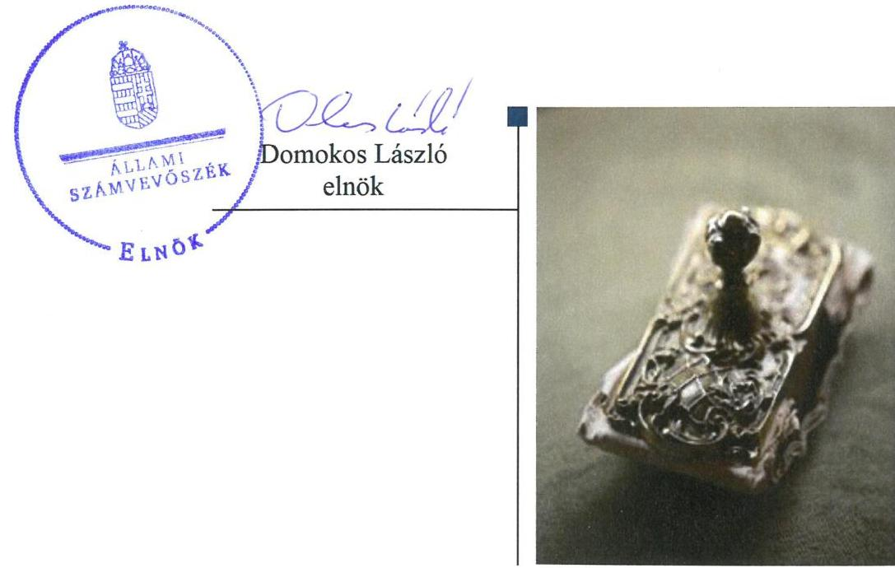
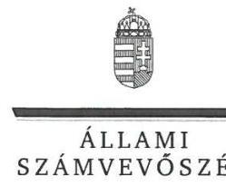
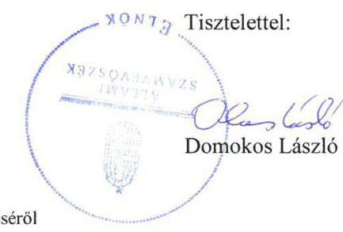

# Jelentés 

## Utóellenőrzések

Az országos nemzetiségi önkormányzatok gazdálkodásának utóellenőrzése Országos Örmény Önkormányzat 2018. november 46. nap

---

# AZ ELLENŐRZÉST FELÜGYELTE: 

VARGA EDIT felügyeleti vezető

## AZ ELLENŐRZÉST VEZETTE ÉS A VÉGREHAJTÁSÁÉRT FELELŐS:

DR. TÓTH VIKTÓRIA ellenőrzésvezető

## A PROGRAM ÖSSZEÁLLÍTÁSÁÉRT FELELŐS:

TÓTPÁL SZABOLCS osztályvezető

## A TÉMÁHOZ KAPCSOLÓDÓ KORÁBBI SZÁMVEVŐSZÉKI JELENTÉSEK:

- címe: Jelentés az Országos Nemzetiségi Önkormányzatok gazdálkodásának ellenőrzéséről
Országos Örmény Önkormányzat
- sorszáma: 15132

IKTATÓSZÁM: EL-1181-001/2018
TÉMASZÁM: 2460
ELLENŐRZÉS-AZONOSÍTÓ SZÁM: V080404

---

# TARTALOMJEGYZÉK 

■ ÖSSZEGZÉS ..... 5
■ AZ ELLENŐRZÉS CÉLJA ..... 6
■ AZ ELLENŐRZÉS TERÜLETE ..... 7
■ AZ ELLENŐRZÉS HÁTTERE, INDOKOLTSÁGA ..... 8
■ A JELENTÉS LÉNYEGES KÉRDÉSKÖRE ..... 9
■ ELLENŐRZÉS HATÓKÖRE ÉS MÓDSZEREI ..... 10
■ MEGÁLLAPÍTÁSOK ..... 12
■ MELLÉKLETEK ..... 15
I. sz. melléklet: Országos Örmény Önkormányzat intézkedési tervének végrehajtása ..... 15
■ FÜGGELÉK: ÉSZREVÉTELEK ..... 21
■ RÖVIDÍTÉSEK JEGYZÉKE ..... 27

---

.

---

# ÖSSZEGZÉS 

Az Állami Számvevőszék az Országos Örmény Önkormányzat pénzügyi és vagyongazdálkodása szabályszerűségének utóellenőrzése során megállapította, hogy az intézkedési tervben meghatározott, a pénzügyi és vagyongazdálkodás szabályozottságát, valamint szabályszerűségét biztosító intézkedések elmaradása továbbra is veszélyezteti a közpénzekkel való felelős, elszámoltatható és átlátható gazdálkodást.

## Az ellenőrzés társadalmi indokoltsága

Az Állami Számvevőszék stratégiájában célul tűzte ki a számvevőszéki munka hasznosulásának javítását. Ezzel összhangban ellenőrzi, hogy az ellenőrzött szervezet megvalósította-e a korábbi ellenőrzései által feltárt hibák, hiányosságok és szabálytalanságok megszüntetése céljából elkészített intézkedési tervében foglaltakat. A rendszeres utóellenőrzések hozzájárulnak a szükséges intézkedések tényleges végrehajtásához, ezáltal a közpénzügyek rendezettségének javulásához.

## Főbb megállapítások, következtetések

Az Országos Örmény Önkormányzat az Állami Számvevőszék által elfogadott intézkedési tervében meghatározott feladatokból egyet sem hajtott végre. A szabályozottság folyamatos hiányossága növeli a működés kockázatát, mivel az Országos Örmény Önkormányzat Hivatala továbbra sem rendelkezett szervezeti és működési szabályzattal, nem készült bizonylati rend, adatvédelmi és adatbiztonsági szabályzat, valamint eljárásrend a kötelezően közzéteendő adatok nyilvánosságra hozataláról.

A költségvetési határozat-tervezeteket nem egyeztették a költségvetési szervek vezetőivel, a költségvetési határozat-tervezetek jogszabályban előírt szerkezetben és tartalommal való elkészítését nem igazolták. A belső kontroll szerinti elszámoltathatóság érdekében a gazdálkodási jogkörök szabályszerű gyakorlását nem támasztották alá. A hivatalvezető nem értékelte a költségvetési szerv belső kontrollrendszerének minőségét.

A szabályszerű vagyongazdálkodás érdekében meghatározott intézkedéseket nem hajtották végre, nem készültek a törvényi előírásnak megfelelő, a mérleg tételeinek alátámasztásához összeállított leltárak, valamint az eszközök értékelését nem végezték el.

Az Országos Örmény Önkormányzat tevékenységére, működésére, gazdálkodására vonatkozó adatokat nem tették közzé.

---

# AZ ELLENŐRZÉS CÉLJA 

Az ellenőrzés célja annak értékelése volt, hogy a számvevőszéki jelentésben foglalt intézkedést igénylő megállapításokkal összhangban készített intézkedési tervben meghatározott feladatokat az ellenőrzött szervezet végrehajtotta-e.

---

# AZ ELLENŐRZÉS TERÜLETE 

## Országos Örmény Önkormányzat utóellenőrzése

Az Önkormányzat ${ }^{1}$ 1995-ben alakult. Az ÁSZ ${ }^{2}$ 2010. január 1. és a 2014. június 30. közötti időszakra vonatkozóan végezte el az Önkormányzat pénzügyi és vagyongazdálkodása szabályszerűségének ellenőrzését, és erről 2015. szeptember 15-én hozta nyilvánosságra a 15132 számú számvevőszéki jelentést.

Az ellenőrzés célja volt annak értékelése, hogy az Önkormányzat pénzügyi gazdálkodása, vagyongazdálkodása, a belső kontrollrendszer kialakítása és működtetése, a költségvetési tervezés, az éves beszámolás, a zárszámadás-készítési folyamat, az adatszolgáltatási kötelezettségek, a gazdasági események elszámolása, a mérleg alátámasztottsága a jogszabályi előírásoknak megfelelő volt-e. Továbbá, hogy az államháztartásból nyújtott támogatás, illetve az államháztartásból meghatározott célra ingyenesen juttatott vagyon felhasználása megfelelt-e a jogszabályi előírásoknak.

A számvevőszéki jelentés az Önkormányzat elnöke részére kettő, a Hivatal ${ }^{3}$ vezetője részére huszonhárom intézkedést igénylő megállapítást tartalmazott. Az Önkormányzat elnöke és a Hivatal vezetője a Közgyűlés ${ }^{4}$ által elfogadott intézkedési tervet ${ }^{5}$ és intézkedési terv kiegészítést ${ }^{6}$ küldött az ÁSZ részére.

Az utóellenőrzés arra irányult, hogy az Önkormányzat 2015. szeptember 15. és 2018. június 27. között a pénzügyi és vagyongazdálkodása szabályszerűségének ellenőrzéséről készült 15132. számú számvevőszéki jelentésben szereplő intézkedést igénylő megállapításokkal és javaslatokkal összhangban készített intézkedési tervben meghatározott feladatokat végrehajtotta-e.

---

# AZ ELLENŐRZÉS HÁTTERE, INDOKOLTSÁGA 

Az ÁSZ tv. ${ }^{7}$ 33. § (1) bekezdése értelmében a számvevőszéki jelentések intézkedést igénylő megállapításaihoz és javaslataihoz kapcsolódóan az ellenőrzött szervezet vezetője intézkedési tervet köteles összeállítani, és az Állami Számvevőszék részére megküldeni.

Az ÁSZ által elfogadott intézkedési tervben foglaltak megvalósítását az ÁSZ törvény 33. § (7) bekezdésében foglaltak alapján - az Állami Számvevőszék utóellenőrzés keretében ellenőrizheti. Az utóellenőrzések keretében - az intézkedések értékelése során - az Állami Számvevőszék figyelembe veszi az ellenőrzött szervezetek működési feltételeiben, valamint a jogszabályi előírásokban bekövetkezett változásokat.

Az utóellenőrzés során az ÁSZ értékeli, hogy az érintett számvevőszéki jelentésben foglalt intézkedést igénylő megállapításokkal és javaslatokkal összhangban, az ellenőrzött szervezet által készített intézkedési tervben meghatározott feladatokat a feladatra kijelöltek végrehajtották-e.

Az intézkedések végrehajtásával az adott terület szabályszerű működése vonatkozásában a kockázatok csökkenhetnek, azonban hosszabb távon az intézkedési tervben foglaltak végrehajtásával önmagában nem szűnnek meg, csak akkor, ha beépülnek az ellenőrzött szervezet működésébe, azokat folyamatosan karban tartják, figyelembe véve, illetve kezelve a változásokat. Emellett az intézkedések végrehajtásáig újabb kockázatok merülhetnek fel a szabályszerű működés vonatkozásában, amelyek kezelése szintén kiemelten fontos az ellenőrzött szervezet számára.

Az ellenőrzött szervezet vezetője által készített intézkedési tervekben foglalt feladatok hiányos, illetve késedelmes végrehajtása, vagy annak elmaradása a szabályszerűség és a felelős vezetői magatartás vonatkozásában kockázatot hordoz, ami azt mutatja, hogy az ellenőrzések során feltárt hibák, hiányosságok és szabálytalanságok kezelése nem kapott kellő hangsúlyt. Az utóellenőrzés során is fennálló szabálytalanságok esetén a közpénz, közvagyon veszélyeztetettségi kockázat valószínűsített hatásának értékelése további intézkedéseket vonhat maga után.

Az ellenőrzött szervezet szintjén az utóellenőrzés feltárja, hogy a szervezet az intézkedések végrehajtásával hasznosította-e a korábbi ellenőrzési jelentésben a hiányosságok megszüntetése, illetve a kockázatok kezelése érdekében megfogalmazott javaslatokat, illetve az intézkedések végrehajtása elmaradásának következtében továbbra is fennálló szabálytalanság esetén értékeli a közpénzek, közvagyon veszélyeztetettségét.

Az ÁSZ szintjén az utóellenőrzés visszacsatolást ad az ellenőrzési jelentések hasznosulásáról, az intézkedések elmaradásának, vagy részleges megvalósulásának a közpénzek, közvagyon veszélyeztetettségére gyakorolt valószínűsített hatásának értékelése, további intézkedéseket vonhat maga után.

---

# A JELENTÉS LÉNYEGES KÉRDÉSKÖRE 

Az Önkormányzat az intézkedési tervben foglaltakat az előírt határidőben végrehajtotta-e?

---

# ELLENŐRZÉS HATÓKÖRE ÉS MÓDSZEREI 

## Az ellenőrzés típusa

Megfelelőségi ellenőrzés.

## Az ellenőrzött időszak

Az utóellenőrzés alapját képező ÁSZ jelentés közzétételének napjától (2015. szeptember 15.) az ellenőrzésről szóló kiértesítő levél keltének napjáig (2018. június 27.) tartó időszak.

## Az ellenőrzés tárgya

Az ÁSZ tv. 2011. július 1-jei hatálybalépését követően a számvevőszéki jelentésben foglalt intézkedést igénylő megállapításokkal összhangban - az Önkormányzat által - készített intézkedési tervben foglaltak végrehajtásának ellenőrzése.

## Az ellenőrzött szervezet

Országos Örmény Önkormányzat és az Országos Örmény Önkormányzat Hivatala

## Az ellenőrzés jogalapja

Az ellenőrzés jogszabályi alapját az ÁSZ tv. 33. § (7) bekezdése képezi.

## Az ellenőrzés módszerei

Az ellenőrzést az ellenőrzött időszakban hatályos jogszabályok, az ellenőrzés szakmai szabályai, a jelen ellenőrzésre irányadó ÁSZ módszertanok, az ellenőrzési programban foglalt értékelési szempontok szerint végeztük.

Az ellenőrzés ideje alatt az ellenőrzött szervezettel történő kapcsolattartást az ÁSZ SZMSZ-ének vonatkozó előírásai alapján biztosítottuk.

Az utóellenőrzés megállapításait az ÁSZ adatbekérése szerint, az ellenőrzött szervezet által rendelkezésre bocsátott dokumentumok alapján fogalmaztuk meg.

Az ellenőrzési bizonyítékként felhasználható adatforrások közé tartoztak egyrészt az ellenőrzési program részletes szempontjainál felsorolt

---

adatforrások, másrészt minden - az ellenőrzés folyamán feltárt, az ellenőrzés szempontjából információt tartalmazó - dokumentum.

Az intézkedési tervekben előírt feladatokat azok végrehajthatósága, illetve végrehajtása szempontjából az alábbiak szerint értékeltük:
"határidőben végrehajtott" a feladat, ha a teljesítés dokumentáltan, az intézkedési tervben előírt határidőben és tartalommal megtörtént;
"határidőn túl végrehajtott" a feladat, ha annak teljesítése az intézkedési tervben meghatározott módon, de az abban előírt határidőn túl történt meg;
"részben végrehajtott" a feladat, ha annak végrehajtása nem teljes körűen az intézkedési tervben előírt módon történt meg;
"nem végrehajtott" a feladat, ha a végrehajtás nem történt meg, dokumentumokkal nem igazolt annak teljesítése;
"okafogyottá vált" a feladat, ha végrehajtására - meghatározott esemény bekövetkezése, továbbá külső körülmény, a működést érintő feltétel változása miatt - már nincs szükség, illetve lehetőség, és egyértelműen megállapítható, hogy az intézkedést szükségessé tevő körülmény a jövőben nem fordulhat elő;
"nem időszerű" az a feladat, amelynek ellenőrzési időszakon belüli végrehajtására azért nem került (kerülhetett) sor, mert az intézkedés alapjául szolgáló esemény nem következett be, de annak jövőbeni előfordulása lehetséges, a végrehajtása nem volt esedékes, vagy a végrehajtás határideje még nem járt le.

---

# Az Önkormányzat az intézkedési tervben foglaltakat az előírt határidőben végrehajtotta-e? 

Összegző megállapítás

## Az Önkormányzat az intézkedési tervben szereplő feladatokból egyet sem hajtott végre.

A feladatokat, határidőket, megjelölt felelősöket és a feladatok végrehajtását az I. sz. melléklet mutatja be.

Az Önkormányzat az intézkedési tervében és az intézkedési tervének kiegészítésében meghatározott feladatok közül egyet sem hajtott végre. A Bkr. 14. § (1) bekezdése ellenére nem vezettek nyilvántartást az intézkedési tervben rögzített feladatok végrehajtásáról.

A SZABÁLYOZOTTSÁG érdekében meghatározott intézkedéseket nem hajtották végre. A Hivatal továbbra sem rendelkezett SZMSZ ${ }^{8}$ -el, bizonylati rend, adatvédelmi és adatbiztonsági szabályzat, a kötelezően közzéteendő adatok nyilvánosságra hozatalának és megismerésére irányuló igények teljesítésének eljárásrendje (2), illetve belső ellenőrzési kézikönyv nem készült (5).

A PÉNZÜGYI ELSZÁMOLTATHATÓSÁG érdekében meghatározott intézkedéseket nem hajtották végre. A központi költségvetésből nyújtott működési támogatások felhasználásáról nem vezették az előírt elkülönített számviteli nyilvántartást (11). A hivatalvezető az Ávr. ${ }^{9}$ 27. § (1) bekezdése ellenére nem egyeztette a költségvetési szervek vezetőivel a költségvetési határozat-tervezeteket, továbbá, a költségvetési határozat-tervezetek Áht. ${ }^{10}$-ban meghatározott szerkezetben és tartalommal való elkészítését dokumentumokkal nem igazolták (8).

## A BELSŐ KONTROLL SZERINTI ELSZÁMOLTATHATÓSÁG érdekében meghatározott intézkedéseket nem hajtották végre. A gazdálkodási jogkörök szabályszerű gyakorlását nem támasztották alá (2). A hivatalvezető ${ }^{11}$ a Bkr. ${ }^{12} 1$. melléklete szerinti nyilatkozatban nem értékelte a költségvetési szerv belső kontrollrendszerének minőségét (7).

AZ INTEGRITÁS érvényesülése érdekében meghatározott intézkedéseket nem hajtották végre. Az Info tv. ${ }^{13}$ 37. § (1) bekezdése ellenére nem tették közzé a honlapon az Önkormányzat tevékenységére, működésére vonatkozó adatokat, az éves költségvetéseket, zárszámadásokat (4). A hivatalvezető nem alakította ki és nem működtette a Bkr. 3. §-ában és 7. §-ában előírt kockázatkezelési rendszert (2). A beszerzési eljárások során a közbeszerzésekről szóló 2015. évi CXLIII. törvény betartását, vagy e törvény alapján a közbeszerzés alóli mentesülést dokumentumokkal nem támasztották alá (11).

---

A SZABÁLYSZERŰ VAGYONGAZDÁLKODÁS érdekében meghatározott intézkedéseket nem hajtották végre. Nem készültek a Számv. tv. ${ }^{14}$ 69. § (1) bekezdésnek megfelelő, a beszámoló elkészítéséhez, a mérleg tételeinek alátámasztásához összeállított leltárak, amelyek tételesen, ellenőrizhető módon tartalmazzák a mérleg fordulónapján meglévő eszközöket és forrásokat mennyiségben és értékben (9). Az eszközök üzembe helyezését a Számv. tv. 52. § (2) bekezdésében előírtak ellenére nem dokumentálták, az eszközök értékelését a Számv. tv. 16. § (1) bekezdése ellenére nem végezték el.
 (15). A hivatalvezető nem működtette a belső ellenőrzést (5), (6).

---

.

---

# MELLÉKLETEK

- I. SZ. MELLÉKLET: ORSZÁGOS ÖRMÉNY ÖNKORMÁNYZAT INTÉZKEDÉSI TERVÉNEK VÉGREHAJTÁSA

|  1. | Az intézkedési tervben rögzített feladat | Az intézkedési tervben meghatározott határidő | Az intézkedési tervben meghatározott feladat | A feladat végrehajtása  |
| --- | --- | --- | --- | --- |
|   | 1. | 2. | 3. | 4.  |
|  Nem végrehajtott feladatok |  |  |  |   |
|  1. | E1. Intézkedünk, hogy a jövőben a Közgyűlés részére kerüljenek bemutatásra a zárszámadási határozat beterjesztésekor a jogszabályban előírt mérlegek és kimutatások. | Folyamatos, beszámolókhoz igazodó | elnök | Az Önkormányzat 2017. május 23-ai ülésének jegyzőkönyve áll rendelkezésre, amely szerint tárgyalták az „Önkormányzat és intézménye 2016. évi gazdálkodásáról készült beszámolót", azonban az előterjesztést dokumentumokkal nem támasztották alá. Ezért nem igazolták, hogy az Áht. 91. § (2) bekezdésében előírt mérlegek és kimutatások a zárszámadási határozattervezet előterjesztésekor bemutatásra kerültek a Közgyűlésnek.  A Közgyűlés 2016. április 27-én tartott ülésén hoztak egy határozatot, mely szerint elfogadták az „Önkormányzat és intézményének 2015. évi gazdálkodásáról készült beszámolót", azonban az előterjesztést dokumentumokkal nem támasztották alá. Ezért nem igazolták, hogy az Áht. 91. § (2) bekezdésében előírt mérlegek és kimutatások a zárszámadási határozat-tervezet előterjesztésekor bemutatásra kerültek a Közgyűlésnek. A 2017. évről készült zárszámadási határozat-tervezet beterjesztését dokumentumokkal nem támasztották alá.  |
|  2. | H2. a) SZMSZ elkészítése a Hivatal számára, b) a bizonylati rend, c) a gazdasági eseményenként 100.000 Ft-ot el nem érő (kis összegű) előzetes írásbeli kötelezettségvállalást nem igénylő kifizetések rendje, d) az ellenőrzési nyomvonal, | Folyamatos, de 2015. december 31 | hivatalvezető | A hivatalvezető nem készíttette el a Hivatal SZMSZ-ét, amelyet az Áht. 10. § (5) bekezdése írt elő. A Számv. tv. 161. § (2) bekezdés d) pontjában foglaltak ellenére bizonylati rend nem készült. Az előzetes írásbeli kötelezettségvállalást nem igénylő kifizetések rendjét az Ávr. 53. § (2) bekezdése ellenére nem szabályozták. A Bkr. 6. § (3) bekezdésében előírt ellenőrzési nyomvonalat nem készíttették el.  |

---

|  1. | Az intézkedési tervben rögzített feladat | Az intézkedési tervben meghatározott határidő | Az intézkedési tervben meghatározott felelős | A feladat végrehajtása  |
| --- | --- | --- | --- | --- |
|   | 1. | 2. | 3. | 4.  |
|   | a szabálytalanságok kezelésének eljárásrendje elkészítése, f) az etikai elvárások meghatározása, g) a kockázatkezelési rendszer, h) a gazdálkodási jogkörök szabályszerű gyakorlásának érvényesítése, i) a kötelezően közzéteendő adatok nyilvánosságra hozatalának és megismerésére irányuló igények teljesítésének rendje, j) a Hivatal adatvédelmi és adatbiztonsági szabályzatának elkészítése. Intézkedési terv kiegészítés: H3. A kockázati rendszert ki kell alakítani és működtetni kell. A gazdálkodási jogköröket szabályszerűen gyakorolni kell. H4. Kialakítani a közérdekű adatok nyilvánosságra hozatalának, megismertetésének és teljesítésének rendjét és alkalmazni kell. | 60 nap, folyamatos | hivatalvezető | A szabálytalanságok kezelésének eljárásrendjét (2016. október 1-jétől szervezeti integritást sértő események kezelésének eljárásrendjét) a Bkr. 6. § (4) bekezdése ellenére nem szabályozták. A Bkr. 6. § (1) bekezdés c) pontja és a Kttv. 15. 231. § (1) bekezdése ellenére az etikai elvárásokat, hivatásetikai alapelvek részletes tartalmát, valamint az etikai eljárás szabályait nem határozták meg. A gazdálkodási jogkörök Áht.-ban és Ávr.-ben foglaltaknak megfelelő gyakorlását nem támasztották alá. Az Info tv. 24. § (3) bekezdése szerinti adatvédelmi és adatbiztonsági szabályzat nem készült. (2018. VII. 26-tól hatályos Info tv. 25/A. § (3) bekezdés.) A hivatalvezető nem alakította ki és nem működtette a Bkr. 3. § és 7. §-ában előírt kockázatkezelési rendszert (2016. október 1-jétől integrált kockázatkezelési rendszert). Az Info tv. 35. §-a és az Ávr. 13. § (2) bekezdés h) pontja ellenére nem készült eljárási rend a kötelezően közzéteendő adatok nyilvánosságra hozataláról és a közérdekű adatok megismerésére irányuló kérelmek intézéséről.  |
|  3. | Intézkedési terv kiegészítés: H2. Elkészíteni az Országos Örmény Önkormányzat Hivatalának SZMSZ-ét és közgyűlés elé terjeszteni. | 2016. április 30. | hivatalvezető | A hivatalvezető nem készíttette el a Hivatal SZMSZ-ét, így azt nem terjesztette a Közgyűlés elé.  |
|  4. | H3. Biztosítjuk az Önkormányzat tevékenységére, működésére vonatkozó adatok, az éves költségvetések, zárszámadások, költségvetési beszámolók, egyszerűsített éves költségvetési beszámolók, valamint az Önkormányzat által kapott és nyújtott céljellegű támogatások adatainak közzétételét. | folyamatos, a tevékenységhez kapcsolódó | hivatalvezető | Az Info tv. 37. § (1) bekezdése ellenére a honlapon nem tették közzé az Önkormányzat tevékenységére, működésére vonatkozó adatokat, az éves költségvetéseket, zárszámadásokat. A 428/2012. (XII. 19.) Korm. rendelet 13. § (2) bekezdése ellenére a központi költségvetésből nyújtott támogatásokkal kapcsolatos adatokat a honlapon nem tették közzé 2016. december 31-ig. (A 428/2012. (XII. 19.) Korm. rendelet 2017. január 1-jétől hatálytalan.)  |

---

|  Sorszám | Az intézkedési tervben rögzített feladat | Az intézkedési tervben meghatározott határidő | Az intézkedési tervben meghatározott felelős | A feladat végrehajtása  |
| --- | --- | --- | --- | --- |
|   | 1. | 2. | 3. | 4.  |
|  5. | H4. Intézkedünk, hogy készüljön az Önkormányzatnál jóváhagyott belső ellenőrzési kézikönyv, valamint a belső ellenőrzési vezető készítse el az éves ellenőrzési tervet. Továbbá, működtesse a belső ellenőrzést és gondoskodjon a belső ellenőrzés jogállásának, feladatainak meghatározásáról. | 2016. január 31. | hivatalvezető | Nem készült a Bkr. 17. § (1) bekezdésében előírt belső ellenőrzési kézikönyv. A hivatalvezető nem működtette a belső ellenőrzést. A Hivatalnak nem volt belső ellenőre, mert nem írta alá a megbízási szerződést. A Bkr. 29. § (1) bekezdése ellenére nem készítettek éves ellenőrzési terveket (a rendelkezésre bocsájtott ellenőrzési terveket készítő személy nem tekinthető a Hivatal belső ellenőrének, mert nem írta alá a megbízási szerződést). A belső ellenőrzést végző személy feladatait - hivatali SZMSZ hiányában - a költségvetési szerv szervezeti és működési szabályzatában nem írták elő (Bkr. 15. § (2) bekezdés), illetve a Bkr. 16. § (2) és (4) bekezdése szerinti írásbeli megállapodásban sem határozták meg.  |
|  6. | H4. A belső és külső ellenőrzések által feltárt hiányosságokra készüljön intézkedési terv valamint nyilvántartás a belső ellenőrzési jelentésekben tett megállapításokról, javaslatokról és azok végrehajtásának mikéntjéről. | 2016. január 31. | hivatalvezető | Belső, illetve külső ellenőrzések által feltárt hiányosságokra nem készült intézkedési terv a Bkr. 13. § (2)-(3) bekezdése, 28. § c) pontja és 45. §-a ellenére. A belső ellenőrzési jelentésekben tett megállapításokról, javaslatokról és a vonatkozó intézkedési tervek végrehajtásának nyomon követéséről nem vezették a Bkr. 47. §-ában előírt nyilvántartást.  |
|  7. | H5. A belső kontrollrendszer értékelésének pótlása 2010-2013. évre vonatkozóan nyilatkozat formájában. | folyamatos | hivatalvezető | A hivatalvezető sem a 2010-2013. évekre vonatkozóan, sem az ellenőrzött időszak éveire vonatkozóan nem értékelte a Bkr. 1. melléklete szerinti nyilatkozatban a költségvetési szerv belső kontrollrendszerének minőségét, a Bkr. 11. § (1) bekezdése alapján.  |

---

|  Sorszám | Az intézkedési tervben rögzített feladat | Az intézkedési tervben meghatározott határidő | Az intézkedési tervben meghatározott felelős | A feladat végrehajtása  |
| --- | --- | --- | --- | --- |
|   | 1. | 2. | 3. | 4.  |
|  8. | H6. A jövőre vonatkozóan: a) a költségvetési határozat-tervezeteket a költségvetési szerv vezetőjével egyeztetni szükséges és annak eredményét írásban rögzíteni, b) intézkedünk, hogy a költségvetési határozattervezetek a jogszabályban meghatározott szerkezetben és tartalommal készüljenek el, és tartalmazzák az előirányzat felhasználási tervet, c) eljuttatjuk az elemi költségvetéseket, továbbá a beszámolókat az előírásoknak megfelelően a Kincstárnak, d) biztosítjuk az adatszolgáltatást az irányításunk alá tartozó költségvetési szervek tekintetében is, legyen az költségvetési jelentés vagy mérlegjelentés. H9. Elemi költségvetések és beszámolók beküldése a Kincstár számára. | folyamatos | hivatalvezető | A hivatalvezető az Ávr. 27. § (1) bekezdése ellenére nem egyeztette a költségvetési szervek vezetőivel a költségvetési határozat-tervezeteket. A költségvetési határozat-tervezetek Áht. 23. §-ában meghatározott szerkezetben és tartalommal való elkészítését dokumentumokkal nem támasztották alá. Az Önkormányzat és az általa irányított költségvetési szervek elemi költségvetései, és az éves költségvetési beszámolói feltöltését a Kincstár által működtetett elektronikus adatszolgáltató rendszerbe dokumentumokkal nem támasztották alá. (Áht. 108. § (1) bekezdés a) pontja és (2) bekezdése, Áhsz. $^{17}$ 32. §). Az Áht. 108. § (1) bekezdés b) pontja, az Ávr. 169. § és 170. § előírásai ellenére az Önkormányzat és az irányítása alá tartozó költségvetési szervek időközi költségvetési jelentésének és mérlegjelentésének feltöltését a Kincstár által működtetett elektronikus adatszolgáltató rendszerbe dokumentumokkal nem támasztották alá.  |
|  9. | H8. Intézkedünk a 2010-2013. évek mérlegtételeinek alátámasztására szolgáló leltár elkészíttetéséről, amely az eszközök és források állományát tételesen és ellenőrizhető módon tartalmazza. | visszamenőleg már pótlásra kerültek, az esetlegesen fennálló hiányt folyamatosan pótoljuk. | hivatalvezető | Nem készültek a Számv. tv. 69. § (1) bekezdésnek megfelelő leltárak, amely törvényi előírás szerint a beszámoló elkészítéséhez, a mérleg tételeinek alátámasztásához olyan leltárt kell összeállítani és e törvény előírásai szerint megőrizni, amely tételesen, ellenőrizhető módon tartalmazza a mérleg fordulónapján meglévő eszközöket és forrásokat mennyiségben és értékben. Az Njtv. $^{18}$ 113. § c) pontja ellenére működése feltételeinek körében a Közgyűlés nem határozta meg az Önkormányzat vagyonleltárát. A Közgyűlés 2017. évben hozta meg 24/2017. (május 23.) OÖÖ határozatát, mely szerint az Országos Örmény Önkormányzat „képviselő-testülete” elfogadta az  |

---

|  Sorszám | Az intézkedési tervben rögzített feladat | Az intézkedési tervben meghatározott határidő | Az intézkedési tervben meghatározott felelős | A feladat végrehajtása  |
| --- | --- | --- | --- | --- |
|   | 1. | 2. | 3. | 4.  |
|   |  |  |  | „Országos Örmény Önkormányzat és intézményének a 2016. évi vagyonkimutatását a mellékelt táblázat alapján", azonban a határozathoz nem csatoltak mellékletet. Külön dokumentumként bocsátottak rendelkezésre egy, „Az Országos Örmény Önkormányzat vagyonkimutatása 2016 év végén" című táblázatot, amely táblázatban rögzített adatokat nem támaszt alá Számv. tv. szerinti leltár.  |
|  11. | H10. A jövőben a) a közbeszerzési értékhatár elérése esetén közbeszerzési eljárás figyelembe vételével szükséges eljárni, b) a támogatások megítélése esetén szükséges az átláthatóságról szóló törvény alkalmazása, c) a működési támogatások felhasználásáról elkülönített nyilvántartást szükséges vezetni, és ellenőrizni. | folyamatos | hivatalvezető | A beszerzési

 eljárások során a közbeszerzésekről szóló 2015. évi CXLIII. törvény betartását, vagy e törvény alapján a közbeszerzés alóli mentesülést dokumentumokkal nem támasztották alá.
Dokumentumokkal nem támasztották alá a közpénzekből nyújtott támogatások átláthatóságáról szóló 2007. évi CLXXXI. törvény alkalmazását. A működési támogatások felhasználásáról nem vezették a 428/2012. (XII. 29.) Korm. rendelet 10. § (4) bekezdésében, majd 2017. január 1-jétől Magyarország 2017. évi központi költségvetéséről szóló 2016. évi XC. törvény 9. mellékletének III.3. i) pontjában előírt elkülönített számviteli nyilvántartást.  |
|  12. | Intézkedési terv kiegészítés
H5. Ki kell alakítani az ügyintézési folyamatok nyomon követését, az adatok védelmét és azt gyakorolni kell. | 60 nap, folyamatos | hivatalvezető | Az Ikr. ${ }^{19}$ 8. § (1)-(2) bekezdése és 14. § (4) bekezdése ellenére az iratkezelési és iktatási rendszer nem biztosította az ügyintézési folyamatok nyomon követését, az adatok védelmét.  |
|  13. | Intézkedési terv kiegészítés
H.6. Szabályzatba kell foglalni az Önkormányzat és intézményei adatszolgáltatási kötelezettségeit és eleget kell tenni az abban foglaltaknak. | 60 nap, folyamatos | hivatalvezető | Az Önkormányzat és intézményei adatszolgáltatási kötelezettségeit nem szabályozták.  |
|  14. | Intézkedési terv kiegészítés
H.8. Ki kell alakítani a tevékenységek, a célok megvalósításának nyomon követését biztosító rendszert, és folyamatosan működtetni kell. | 90 nap, folyamatos | hivatalvezető | A hivatalvezető a Bkr. 3. § e) pontja és 10. §-a ellenére nem alakította ki a szervezet tevékenységének, a célok megvalósításának nyomon követését biztosító rendszert.  |

---

|  15. | Intézkedési terv kiegészítés
H.10. Meg kell határozni a tárgyi eszközök leltára, az immateriális javak leltára és a vagyonleltár elkészítésének módját, el kell készíteni az üzembe helyezést és az értékelést, a feltárt adatokat a közgyűlés elé kell terjeszteni. | 60 nap, folyamatos | hivatalvezető | A hivatalvezető nem határozta meg a tárgyi eszközök leltára, az immateriális javak leltára és a vagyonleltár elkészítésének módját. Az eszközök üzembe helyezését a Számv. tv. 52. (2) bekezdésében előírtak ellenére nem dokumentálták, az eszközök értékelését a Számv. tv. 16. § (1) bekezdése ellenére nem végezték el.  |
| --- | --- | --- | --- | --- |
|  16. | Intézkedési terv kiegészítés
H.11. Szabályozni kell az előző pontban feltárt eszközök kiértékelésének módját, és a kiértékelést el kell végezni. | 90 nap, folyamatos | hivatalvezető | Az eszközök kiértékelésének módját a hivatalvezető nem szabályozta, és az értékelést nem végezték el.  |

---

# FÜGGELÉK: ÉSZREVÉTELEK 

A jelentéstervezetet a Számvevőszék 15 napos észrevételezésre megküldte az ellenőrzött szervezetek vezetőinek az ÁSZ tv. 29. § (1) bekezdése előírásának megfelelően.

Az ÁSZ a jelentéstervezetet észrevételezésre megküldte az Országos Örmény Önkormányzat elnökének, valamint az Országos Örmény Önkormányzat Hivatala hivatalvezetőjének.
Az Országos Örmény Önkormányzat elnöke az ÁSZ tv. 29. § (2) bekezdésében foglalt észrevételezési jogával nem élt, a jelentéstervezet megállapításaira a törvényes határidőn belül észrevételt nem tett. Az Országos Örmény Önkormányzat Hivatala hivatalvezetőjének észrevételeit és az arra adott választ a függelék tartalmazza.

[^0]
[^0]:    * 29. § (1) Az Állami Számvevőszék az ellenőrzési megállapításait megküldi az ellenőrzött szervezet vezetőjének vagy az általa megbízott személynek, és annak, akinek személyes felelősségét állapította meg.
    (2) Az ellenőrzött szervezet vezetője és a felelősként megjelölt személy az ellenőrzés megállapításaira tizenöt napon belül írásban észrevételt tehet.
    (3) Az Állami Számvevőszék az észrevételre a beérkezésétől számított harminc napon belül írásban válaszol. A figyelembe nem vett észrevételeket köteles a jelentésben feltüntetni, és megindokolni, hogy azokat miért nem fogadta el.

---

# ORSZÁGOS ÖRMÉNY ÖNKORMÁNYZAT   4NPOQUPNGSA 4US UGGUSNU NUOQUQUQNPOGNNG 141.14 .45 1025 Budapest, Palatinus u. 4.   Tel.: 00-361-332-4970, Mobil: 00-3670-944-1618   országosormeny@email.com, www.orszagosormeny.atw.hu 

Állami Számvevőszék
Domokos László
Elnök Úr

Tisztelt Cím!

Postai úton megérkezett az „utóellenőrzések- Az országos nemzetiségi önkormányzatok gazdálkodásának utóellenőrzése - Országos Örmény Önkormányzat" címmel készített számvevőszéki jelentéstervezete. Továbbá az elnök úrnak írt levelet is, amelyben meglepődve olvastuk, hogy az intézkedési tervben meghatározott 30 feladatból egyet sem hajtottunk végre.

Az intézkedési tervben foglaltaknak megfelelően végeztük a megjelölt hiányosságok pótlását, amit lehetőségünkhöz képest az Önök rendelkezésére átadtunk.

Az ellenőrzés során többször jeleztük munkatársainak, hogy a kijelölt 5 munkanap helyett 2 nap 8 óra állt összesen a rendelkezésünkre. Az önkormányzat székhelyéről a NAV minden iratot és számítógépeinket lefoglalta, erről a jegyzőkönyvet csatoltuk, és arról is, hogy 2017. októberében a lezárt irodát ismeretlenek felnyitották, és iratokat vittek el.

Ilyen körülmények között nem álltak rendelkezésre az iratok, főleg nem eredeti példányban. Erről az elnök úr tett egy nyilatkozatot, hogy a beküldött adatok több esetben aláírás nélkül kerülnek bemutatásra, és kérjük tekintsék aláírtnak. A székhelyünkön az eredeti aláírt nyomtatványokat be tudjuk mutatni.
2018.06.05.-én helyszíni adatbetekintésre jelentek meg az ellenőrzés számvevői. Az összes iratot eredetiben előkészítettük, de elutasították a megtekintését, mondván csak a feltöltött anyaggal foglalkoznak.

Az ellenőrzés célja az volt, hogy beazonosítsák az általunk feltöltött iratanyagot, mert a számvevőszék munkatársai felől nem tudták a címek alapján beazonosítani az adatszolgáltatásunkat, amelyre megállapítható, hogy nagy számú iratanyagot adtunk át. Az egyeztetés során világossá vált, hogy az információs szolgáltatásnak szinte haladéktalanul eleget tettünk. Benyomásunk szerint úgy gondoltuk, hogy a számvevők ezen anyag után értesítést kapunk esetleges hiánypótlásra.

Ezek után lényegében mindent elutasítottak a jelentéstervezetben.
Az I. számú melléklet „A feladat végrehajtása" során nagyon sok ellentmondást fogalmaztak meg.
Sajnos segítőkészség, és megértést nem kaptunk az ellenőrzés elvégzésére kijelölt számvevőktől.

---

Domokos László Elnök Úrtól 2018. október 2-án e-mailben kértünk időpontot személyes megbeszélésre, sajnos a mai napig választ nem kaptunk.

Tájékoztatom továbbá az Állami Számvevőszéket, hogy a NAV nyomozóhatósága által lefoglalt iratanyagból 4 zsákot 2018.09.20-án visszakaptunk (a lefoglalt 6 zsák helyett) - bűncselekmény hiányában az eljárást megszüntették az Országos Örmény Önkormányzat ellen.

Kérem, a fent felsorolt- önhibánkon kívüli - körülményeket vegyék figyelembe a végleges jelentés elkészítésekor.

Budapest, 2018. október 08.

Tisztelettel:

Zárainé Gressai Éva
hivatalvezető

---

# Zárainé Gressai Éva úrhölgy 

hivatalvezető
Országos Örmény Önkormányzat Hivatala

## Budapest

## Tisztelt Hivatalvezető Úrhölgy!

„Utóellenőrzések - Az országos nemzetiségi önkormányzatok gazdálkodásának utóellenőrzése Országos Örmény Önkormányzat" címmel készített számvevőszéki jelentéstervezetre tett észrevételét köszönettel megkaptam.
Az Állami Számvevőszék észrevételre vonatkozó álláspontjáról a felügyeleti vezető által készített részletes tájékoztatást csatoltan megküldöm.
Tájékoztatom Hivatalvezető úrhölgyet, hogy a számvevőszéki jelentésben - az Állami Számvevőszékről szóló 2011. évi LXVI. törvény 29. § (3) bekezdése alapján - a figyelembe nem vett észrevételeket szerepeltetjük, annak indoklásával, hogy azokat az Állami Számvevőszék miért nem fogadta el.

Budapest, 2018. 10. hó 34. nap

Melléklet: Tájékoztatás az észrevételek kezeléséről

---

# Tájékoztatás az észrevételek kezeléséről 

„Utóellenőrzések - Az országos nemzetiségi önkormányzatok gazdálkodásának utóellenőrzése Országos Örmény Önkormányzat" című jelentéstervezetre az ellenőrzött szervezet hivatalvezetője 2018. október 08-án kelt levelében tett észrevételeket, továbbá 2018. október 09-i dátummal dokumentumokat küldött meg. Az észrevételek kezeléséről az alábbi tájékoztatást adom:
Az Állami Számvevőszékről szóló 2011. évi LXVI. törvény (továbbiakban: ÁSZ tv.) 28. § (2) bekezdésében előírtak szerint a közreműködésre felhívott szervezet az ÁSZ részére - annak kérésére soron kívül, de legkésőbb öt munkanapon belül - az ellenőrzés tervezhetősége, meghatározása, illetve lefolytatása érdekében szükséges adatokat és dokumentumokat rendelkezésre bocsátja, illetve a kapcsolódó tájékoztatást köteles megadni. Az ÁSZ 2018. április 11-én kelt adatbekérő levelének 2. számú mellékletében felsorolta azon dokumentumokat, amelyeket jelen ellenőrzés lefolytatásához szükségesnek tartott, és amelyeket az adatbekérő levél kézhezvételét követő öt munkanapon belül az ellenőrzött az ÁSZ tv. 28. § (2) bekezdése alapján köteles volt az ÁSZ részére megküldeni. Ellenőrzési dokumentumként csak az ÁSZ felhívására az ÁSZ által - az ÁSZ tv. 28. § (2) bekezdésben meghatározott adatszolgáltatási időszakon belül megküldött és a teljességi és hitelességi nyilatkozatban szereplő dokumentumok vehetők figyelembe. Mindezek alapján a 2018. október 09-én postára adott dokumentumokat az ÁSZ nem veszi figyelembe.

## Az ellenőrzött észrevétele a jelentéstervezet megállapításait nem cáfolta.

Mindezek alapján az észrevételt nem fogadjuk el, az Állami Számvevőszék megállapítása helytálló, a jelentéstervezet módosítása nem indokolt.

Budapest, 2018. 10. hó 31. nap

Varga Edit
felügyeleti vezető

---

.

---

# RÖVIDÍTÉSEK JEGYZÉKE 

${ }^{1}$ Önkormányzat
${ }^{2}$ ÁSZ
${ }^{3}$ Hivatal
${ }^{4}$ Közgyűlés
${ }^{5}$ intézkedési terv
${ }^{6}$ intézkedési terv kiegészítés
${ }^{7}$ ÁSZ tv.
${ }^{8}$ SZMSZ
${ }^{9}$ Ávr.
${ }^{10}$ Áht.
${ }^{11}$ hivatalvezető
${ }^{12}$ Bkr.
${ }^{13}$ Info tv.
${ }^{14}$ Számv. tv.
${ }^{15}$ Kttv.
${ }^{16} 428 / 2012$. (XII. 19.) Korm. rendelet
${ }^{17}$ Áhsz.
${ }^{18}$ Njtv.
${ }^{19}$ Ikr.

Országos Örmény Önkormányzat
Állami Számvevőszék
az Országos Örmény Önkormányzat Hivatala
az Országos Örmény Önkormányzat testülete
az Országos Örmény Önkormányzat Közgyűlése által a 11/2016. (február 25.)
OÖÖ határozattal elfogadott, 2015. november 3-án kelt intézkedési terv
a 2015. november 3-án kelt intézkedési terv 2016. február 25-én kelt
kiegészítése, amelyet az Országos Örmény Önkormányzat Közgyűlése a 11/2016.
(február 25.) OÖÖ határozattal elfogadott
az Állami Számvevőszékről szóló 2011. évi LXVI. törvény
Szervezeti és Működési Szabályzat
368/2011. (XII. 31.) Korm. rendelet az államháztartásról szóló törvény végrehajtásáról
2011. évi CXCV. törvény az államháztartásról
az Országos Örmény Önkormányzat Hivatalának vezetője
370/2011. (XII. 31.) Korm. rendelet a költségvetési szervek belső
kontrollrendszeréről és belső ellenőrzéséről
2011. évi CXII. törvény az információs önrendelkezési jogról és az információszabadságról
2000. évi C. törvény a számvitelről
2011. évi CXCIX. törvény a közszolgálati tisztviselőkről
a nemzetiségi célú előirányzatokból nyújtott támogatások feltételrendszeréről és elszámolásának rendjéről szóló 428/2012. (XII. 19.) Korm. rendelet
4/2013. (I. 11.) Korm. rendelet az államháztartás számviteléről
2011. évi CLXXIX. törvény a nemzetiségek jogairól
335/2005. (XII. 29.) Korm. rendelet a közfeladatot ellátó szervek iratkezelésének általános követelményeiről

---

# ÁLLAMI SZÁMVEVŐSZÉK 

1052 Budapest, Apáczai Csere János utca 10.
Levélcím: 1364 Budapest 4. Pf. 54
Telefon: +36 14849100 Telefax: +36 14849200
www.asz.hu

