# Jelentés 

## A központi alrendszer intézményei

A központi alrendszer egyes intézményei pénzügyi és vagyongazdálkodásának ellenőrzése - Európai Támogatásokat Auditáló Főigazgatóság 2018.

---

# Jelentés 

## A központi alrendszer intézményei

A központi alrendszer egyes intézményei pénzügyi és vagyongazdálkodásának ellenőrzése - Európai Támogatásokat Auditáló Főigazgatóság
2018. 11. hó 07. nap
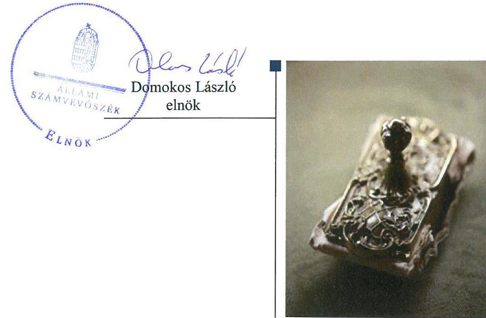

---

# AZ ELLENŐRZÉST FELÜGYELTE: 

SALAMON ILDIKÓ felügyeleti vezető

## AZ ELLENŐRZÉST VEZETTE ÉS A VÉGREHAJTÁSÁÉRT FELELŐS:

ÓDOR ZOLTÁN TAMÁS ellenőrzésvezető

## A PROGRAM ÖSSZEÁLLÍTÁSÁÉRT FELELŐS:

TÓTPÁL SZABOLCS osztályvezető

## A TÉMÁHOZ KAPCSOLÓDÓ KORÁBBI SZÁMVEVŐSZÉKI JELENTÉSEK:

- címe: Jelentés az Európai Támogatásokat Auditáló Föigazgatóság működésének és gazdálkodásának ellenőrzéséről
- sorszáma: 14019

Jelentéseink az Országgyúlés számítógépes hálózatán és az Interneten a www.asz.hu címen is olvashatóak.

IKTATÓSZÁM: EL-0316-030/2018
TÉMASZÁM: 2450
ELLENŐRZÉS-AZONOSÍTÓ SZÁM: V079111

---

# TARTALOMJEGYZÉK 

- ÖSSZEGZÉS ..... 5
- AZ ELLENŐRZÉS CÉLJA ..... 6
- AZ ELLENŐRZÉS TERÜLETE ..... 7
- AZ ELLENŐRZÉS HÁTTERE, INDOKOLTSÁGA ..... 8
- A JELENTÉS LÉNYEGES KÉRDÉSKÖREI ..... 9
- AZ ELLENŐRZÉS HATÓKÖRE ÉS MÓDSZEREI ..... 10
- MEGÁLLAPÍTÁSOK ..... 12
- JAVASLATOK ..... 17
- MELLÉKLETEK ..... 21
I. sz. melléklet: Értelmező szótár ..... 21
- FÜGGELÉK: ÉSZREVÉTELEK ..... 23
- RÖVIDÍTÉSEK JEGYZÉKE ..... 47

---

.

---

# ÖSSZEGZÉS 

Az Európai Támogatásokat Auditáló Főigazgatóság belső kontrollrendszerének kialakítása és müködtetése nem biztositotta a szabályszerü, átlátható és elszámoltatható közpénzfelhasználás feltételeit. Az Európai Támogatásokat Auditáló Főigazgatóság pénzügyi és vagyongazdálkodása nem felelt meg a jogszabályi előírásoknak. Az Európai Támogatásokat Auditáló Főigazgatóság nem a kockázatokkal arányosan alakította ki az integritás kontrollokat.

## Az ellenőrzés társadalmi indokoltsága

Az államháztartás központi alrendszerének közpénz felhasználása, az intézmények által ellátott közfeladatok sokrétűsége, valamint a feladatellátásához rendelt vagyon nagyságrendje indokolja, hogy az Állami Számvevőszék ellenőrzéseket folytasson a pénzügyi és vagyongazdálkodás területén. Az Állami Számvevőszék az ellenőrzései során feltárja a gazdálkodást, a központi alrendszer intézményeinek átalakulását, átszervezését érintő szabályozások esetleges hiányosságait, a szabályozással nem érintett gazdálkodási területeket, rámutathat a vagyongazdálkodási tevékenység - ezen belül a tulajdonosi joggyakorlás és vagyonkezelés - esetleges szabálytalanságaira, értékeli az állami vagyon nyilvántartására és elszámolására vonatkozó eljárásokat. Az ellenőrzésünkkel hozzá kívánunk járulni a központi intézmények pénzügyi helyzetének pontosabb megítéléséhez, a jó gyakorlat kialakításán és terjesztésén keresztül az ellenőrzéseink elősegíthetik a gazdálkodás szabályszerűségének javítását.

## Főbb megállapítások, következtetések, javaslatok

A Nemzetgazdasági Minisztérium Európai Támogatásokat Auditáló Főigazgatóságra vonatkozó irányító szervi feladatellátása megfelelt a jogszabályi előírásoknak.

Az Európai Támogatásokat Auditáló Főigazgatóság 2015. február 19-ig hatályos szervezeti és múködési szabályzata nem felelt meg a jogszabályi előírásoknak.

Az Európai Támogatásokat Auditáló Főigazgatóság belső kontrollrendszerének kialakítása és múködtetése, ezen belül a kontrollkörnyezet kialakítása, a kontrolltevékenység, az információs és kommunikációs folyamatok kialakítása és múködtetése, valamint a belső ellenőrzés múködtetése egyik évben sem, a kockázatkezelési rendszer kialakítása és múködtetése 2016. október 1-től nem felelt meg a jogszabályi előírásoknak, emiatt nem voltak biztosítottak a szabályszerű, átlátható és elszámoltatható közpénzfelhasználás feltételei.

Az Európai Támogatásokat Auditáló Főigazgatóságnál a bevételek elszámolása szabályszerű volt. A kiadási előirányzatok felhasználásánál a gazdálkodási jogkörök gyakorlása az ellenőrzött időszakban nem volt szabályszerű.

Az Európai Támogatásokat Auditáló Főigazgatóság a 2015. évben vagyonkezelési szerződést kötött az MNV Zrt.vel mint tulajdonosi jogkörgyakorlóval, vagyonkezelt eszközökre. A mérlegben kimutatott követelések egyedi minősítését, értékelését elmulasztotta. Éves költségvetési beszámolóinak mérlegtételeit leltárral nem támasztotta alá.

Az Európai Támogatásokat Auditáló Főigazgatóság nem a kockázatokkal arányosan alakította ki az integritás kontrollokat. Belső kontrollrendszere - kialakításában és múködtetésében feltárt hiányosságok és hibák miatt - nem támogatta a közpénzek átlátható felhasználását, az integritás kultúra kialakítását.

Az Állami Számvevőszék a pénzügyminiszternek egy, az Európai Támogatásokat Auditáló Főigazgatóság főigazgatójának tizennyolc javaslatot tett.

---

# AZ ELLENŐRZÉS CÉLJA 

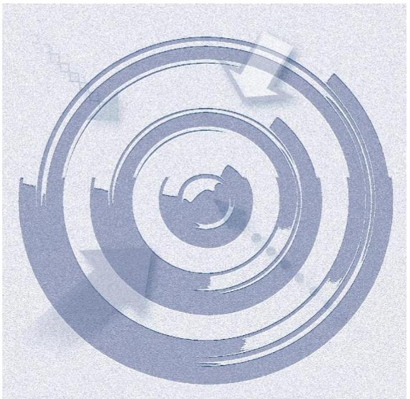
vényesülését.

Az ellenőrzés célja annak megítélése volt, hogy az ellenőrzött intézményre vonatkozó irányító szervi feladatellátás a jogszabályi előírások betartásával történt-e; az intézménynél a belső kontrollrendszer kialakítása és múködtetése szabályszerű volt-e; az intézmény pénzügyi és vagyongazdálkodása megfelelt-e a jogszabályi előírásoknak és belső szabályzatainak; az intézmény átalakításának vagy átszervezésének lebonyolítása szabályszerűen tör-tént-e. Az ellenőrzés keretében az ÁSZ értékelte az intézmény korrupciós kockázatainak kezelését szolgáló integritás kontrollok kiépítettségét és az integritás szemlélet érvényesülését.

---

# **A2 ELLENŐRZÉS TERÜLETE**

## **Európai Támogatásokat Auditáló Főigazgatóság**

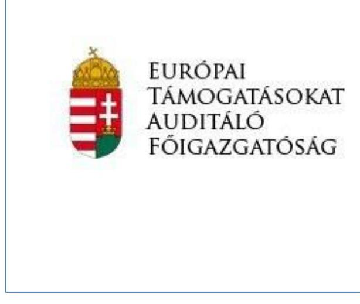

A Kormány1 2010. július 1-jén, a 210/2010. (VI. 30.) Korm. rendeletben2 – a KEHI-ből3 való kiválással – megalapította a központi költségvetési szervként, önállóan működő Európai Támogatásokat Auditáló Főigazgatóságot. Az ellenőrzött időszakban az irányító szervi jogkört az NGM4 gyakorolta.

Az EUTAF5 közfeladata az EU6 pénzügyi alapok tekintetében az ellenőrzési hatósági, az egyéb uniós és nemzetközi támogatások Kormány által meghatározott ellenőrzési feladatai ellátása, uniós támogatások hatékony és szabályszerű felhasználásának elősegítése.

A KEF7, 2013. december 31-étől, szolgáltatási megállapodás keretében biztosította a KEHI-ből kivált EUTAF-nak az ingóságok használatát és további eszközök beszerzését.

A feladatellátását szolgáló ingó vagyon az MNV Zrt.-vel8 2015. márciusában megkötött Vagyonkezelési szerződéssel9, a KEF-fel, 2016. február 11-én megkötött Megállapodással10 az EUTAF vagyonkezelésébe került.

Az éves költségvetési beszámolók alapján, az EUTAF által teljesített költségvetési kiadás a 2014. évi 1 323,5 M Ft-ról a 2016. évre 1 107,9 M Ft-tal 83,7 %-kal, 2 431,4 M Ft-ra nőtt. A teljesített összes bevétel összege a 2014. évben 1 451,3 M Ft volt, 2016. évre 1 179,3 M Ft-tal, 81,3 %-kal, 2 630,6 M Ft-ra nőtt.

Az EUTAF mérlegfőösszege az ellenőrzött években, 2014. január 1-jei 93,9 M Ft-ról, 2016. év végére, 1 237,1 M Ft-tal, 1317 %-kal 1 331,0 M Ft-ra nőtt. A növekmény 70%-a követelésállomány emelkedéséből adódott.

2010. június 1-jei hatállyal határozatlan időre kinevezett főigazgató11 felett a munkáltatói jogokat az NGM minisztere gyakorolta, az ellenőrzés időszakában a főigazgató személye nem változott.

Az EUTAF titkársága egyben az EUTAF gazdasági szervezete volt, a gazdasági vezetői feladatokat ideiglenesen – a főigazgató kijelölése és NGM miniszter egyetértése alapján – 2014. január 20-ától az EUTAF titkárságvezetője látta el. Az alkalmazott kormánytisztviselők száma a 2014. évi 94 főről, a feladatbővülések következtében 2016. év végére 169 főre növekedett.

Az ellenőrzött időszakban az EUTAF-nál szervezeti, szerkezeti átalakítás nem volt.

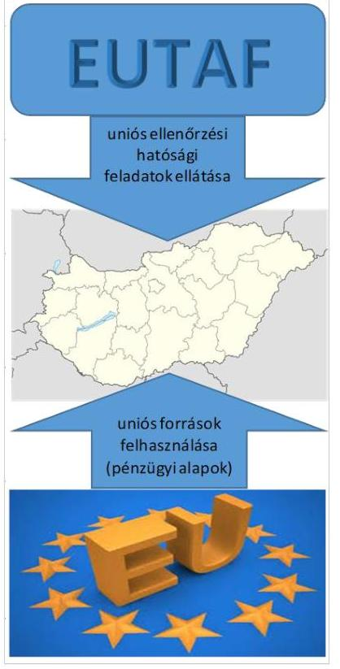

---

# AZ ELLENŐRZÉS HÁTTERE, INDOKOLTSÁGA 

Az államháztartás központi alrendszerének közpénz felhasználása, az intézmények által ellátott közfeladatok sokrétűsége, valamint a feladatellátásához rendelt vagyon nagyságrendje indokolja, hogy az ÁSZ ${ }^{12}$ ellenőrzéseket folytasson a pénzügyi és vagyongazdálkodás területén. Az ÁSZ az ellenőrzései során feltárja a gazdálkodást, a központi alrendszer intézményei átalakulását, átszervezését érintő szabályozások esetleges hiányosságait, a szabályozással nem érintett gazdálkodási területeket, rámutathat a vagyongazdálkodási tevékenység - ezen belül a tulajdonosi joggyakorlás és vagyonkezelés - esetleges szabálytalanságaira, értékeli az állami vagyon nyilvántartására és elszámolására vonatkozó eljárásokat.

Az ellenőrzés várhatóan hozzájárul a központi intézmények pénzügyi helyzetének pontosabb megítéléséhez, és a jó gyakorlat kialakításán és terjesztésén keresztül az ellenőrzések elősegíthetik a gazdálkodás szabályszerűségének javítását.

---

# A JELENTÉS LÉNYEGES KÉRDÉSKÖREI 

1. Az irányító szerv ellenőrzött költségvetési szervre vonatkozó feladatellátása szabályszerű volt-e?
2. A belső kontrollrendszer kialakítása és müködtetése biztosította-e a közpénzekkel és a nemzeti vagyonnal történő átlátható, szabályszerű, gazdaságos, hatékony és eredményes gazdálkodást, illetve a beszámolási és adatszolgáltatási kötelezettségek szabályszerű teljesítését?
3. Az EUTAF pénzügyi gazdálkodása szabályszerű volt-e?
4. Az EUTAF vagyongazdálkodása szabályszerű volt-e?

---

# AZ ELLENŐRZÉS HATÓKÖRE ÉS MÓDSZEREI 

## Az ellenőrzés típusa

Megfelelőségi ellenőrzés.

## Az ellenőrzött időszak

Az ellenőrzött időszak 2014. január 1-jétől 2016. december 31-ig terjedő időszak volt.

## Az ellenőrzés tárgya

Az ellenőrzött szervezetre vonatkozó irányító szervi feladatok ellátása. Az intézmény belső kontroll rendszerének kialakítása és működtetése. Az intézmény pénzügyi és vagyongazdálkodása. Az intézménynél az integritáskontrollok kiépítettsége, az integritás szemlélet érvényesülése.

Az ellenőrzés kiterjedt minden olyan körülményre és adatra, amely az ÁSZ jogszabályban meghatározott feladatainak teljesítéséhez, valamint a program végrehajtása folyamán felmerült újabb összefüggések feltárásához szükséges.

## Az ellenőrzött szervezet

- Európai Támogatásokat Auditáló Főigazgatóság
- Nemzetgazdasági Minisztérium, mint irányítószerv

## Az ellenőrzés jogalapja

Az ellenőrzés jogszabályi alapját az ÁSZ tv. 1. § (3) bekezdés, 5. § (2)-(4) és (6) bekezdései, valamint az Áht. ${ }^{13}$ 61. § (2) bekezdésének előírásai képezik.

## Az ellenőrzés módszerei

Az EUTAF ellenőrzését a szakmai program szempontjai, az ellenőrzött időszakban hatályos jogszabályok, az ellenőrzés szakmai szabályai, a jelen ellenőrzésre irányadó ÁSZ módszertanok figyelembevételével végezte.

Az ellenőrzés ideje alatt az EUTAF-fal történő kapcsolattartást az ÁSZ SZMSZ ${ }^{14}$-ének vonatkozó előírásai alapján biztosította.

---

Az ellenőrzési kérdések megválaszolásához szükséges bizonyítékok megszerzése az ellenőrzött által rendelkezésre bocsátott dokumentumokra, adatokra alapozva mintavételezés, valamint elemző eljárás útján történt. Az ellenőrzési bizonyítékként felhasználható adatforrások közé tartoznak egyrészt a szakmai program részletes szempontjainál felsorolt adatforrások, másrészt minden egyéb - az ellenőrzés folyamán feltárt, az ellenőrzés szempontjából információt tartalmazó - dokumentum.

Az ellenőrzés lefolytatásához az ellenőrzött szervezetek tanúsítványok kitöltésével, valamint az ÁSZ által kért dokumentumok megküldésével szolgáltattak adatokat. A rendelkezésre bocsátott adatok, információk kontrollja az ellenőrzés keretében történt.

Az EUTAF belső kontrollrendszere jogszabályi előírások szerinti kialakítása és működtetése szabályszerűségének értékelése az erre irányuló kérdésekre adott válaszok összesítése alapján, évente pillérenként (kontrollkörnyezet, kockázatkezelési rendszer, kontrolltevékenységek, információs és kommunikációs rendszer, monitoring rendszer) és összesítetten történt. A belső kontrollrendszer egyes pilléreinek kialakítása „szabályszerű", amennyiben az értékelt területen az elért és az elérhető pontok \%-ban kifejezett, egész számra kerekített hányadosa meghaladta a $85 \%$-ot, „nem szabályszerű", ha nem érte el a $85 \%$-ot. A kontrollrendszer egésze esetében a „szabályszerű" értékelésnek a \%-os értéken felül további feltétele volt, hogy egyik kontrollterület sem kaphatott „nem szabályszerű" értékelést. Az összesített értékelés a \%-os értéktől függetlenül „nem szabályszerű" volt, ha az ellenőrzött kontrollterületek közül több mint egynek „nem szabályszerű" volt az értékelése.

Az EUTAF-nál a bevételek (tárgyi eszközök bérbeadásából és értékesítéséből) beszedése szabályszerűségének, valamint a kiadási előirányzatok (külső személyi juttatások, dologi kiadások, felhalmozási kiadások) felhasználása szabályszerűségének mintavételes ellenőrzéssel történt. A bevételek beszedése, valamint a kiadási előirányzatok felhasználása „szabályszerű", ha a minta ellenőrzésének eredménye alapján 95\%-os bizonyossággal a teljes sokaságban a hibás tételek aránya kisebb volt, mint 10\%, „nem szabályszerű", ha a hibás tételek aránya a 10\%-ot meghaladta.

Az integritás szemlélet érvényesülésének értékelése az EUTAF által kitöltött tanúsítvány alapján történt.

---

# 1. Az irányító szerv ellenőrzött költségvetési szervre vonatkozó feladatellátása szabályszerű volt-e? 

Összegző megállapítás Az intézményre vonatkozó irányítószervi feladatellátás megfelelt a jogszabályi előírásoknak.

Az Irányító szerv ${ }^{15}$ az EUTAF Alapító okiratát ${ }^{16}{ }_{1-3}$ kiadta, a módosításokat az Ávr.-ben előírtaknak megfelelően elvégezte.

Az ellenőrzött időszakban az Irányító szerv meghatározta az EUTAF-ra vonatkozó általános és kötelezően érvényesítendő tervezési követelményeket. A jogszabályi előírásoknak megfelelően jóváhagyta az EUTAF 20142016. évi éves elemi költségvetését, éves létszám-előirányzatát, éves költségvetési beszámolóját.

## 2. A belső kontrollrendszer kialakítása és múködtetése biztosí-totta-e a közpénzekkel és a nemzeti vagyonnal történő átlátható, szabályszerű, gazdaságos, hatékony és eredményes gazdálkodást, illetve a beszámolási és adatszolgáltatási kötelezettségek szabályszerű teljesítését?

Összegző megállapítás

A belső kontrollrendszer kialakítása és múködtetése nem biztosította a közpénzekkel és a nemzeti vagyonnal történő átlátható, szabályszerű gazdálkodás, illetve a beszámolási és adatszolgáltatási kötelezettségek szabályszerű teljesítésének feltételeit.

Az EUTAF kontrollkörnyezetének kialakítása az ellenőrzött időszakban nem volt szabályszerű.

Az EUTAF rendelkezett az NGM által kiadott SZMSZ ${ }^{17}{ }_{1,2,3}$-szel. A 2015. február 19-ig hatályos SZMSZ ${ }_{1}$ az Ávr ${ }^{18}$. 13. § (1) bekezdés e) pontja előírásának nem felelt meg, mert nem tartalmazta a gazdasági szervezet megnevezését, feladatait, továbbá 2014. december 31-ig az engedélyezett létszámát.

A számviteli politikában ${ }^{19}$ rögzítették, mit tekintenek a számviteli elszámolás és az értékelés szempontjából lényegesnek, nem lényegesnek, jelentősnek, nem jelentősnek, a törvényben biztosított választási, minősítési lehetőségekhez kapcsolódóan melyeket, milyen feltételek fennállása esetén alkalmaztak, ugyanakkor nem határozták meg a Számv. tv. 14. § (4) bekezdése rendelkezésének ellenére, hogy a választott gyakorlatot milyen

---

okok miatt kell megváltoztatni. A Számv. tv. ${ }^{20}$ 14. § (11) bekezdését megsértve, számviteli politikájukban a Számv. tv. 2015. július 4-én hatályba lépett módosítását követően, a Számv. tv. 14. § (4) bekezdésének előírása ellenére nem határozták meg, hogy mit tekintenek kivételes nagyságú vagy előfordulású bevételnek, költségnek, ráfordításnak.

A számlarend ${ }^{21}$ a Számv. tv. 161. § (2) bekezdés b) pontjában, és az Áhsz. ${ }^{22}$ 51. § (2) bekezdésében előírtak ellenére nem tartalmazta a könyvviteli számlák értéke növekedésének, csökkenésének jogcímeit, valamint az Áhsz. 51. § (3) bekezdésében előírtak ellenére a pénzügyi könyvvezetéshez készült összesítő bizonylatok elkészítésének rendjét.

Az EUTAF 2014. január 1-jétől rendelkezett gazdasági szervezettel, amely ügyrendjében ${ }^{23}$ és gazdálkodási szabályzatban ${ }^{24}$ szabályozta a gazdálkodással kapcsolatos munkafolyamatokat, valamint a gazdálkodási jogkörök gyakorlásával kapcsolatos részletszabályokat.

Az EUTAF rendelkezett múködési folyamatainak megfelelő ellenőrzési nyomvonallal ${ }^{25}$, valamint a Bkr. ${ }^{26}$ 2016. szeptember 30 -áig hatályos előírása szerinti szabálytalanság kezelésének eljárásrendjével ${ }^{27}$. Rendelkezett továbbá Integritásra vonatkozó eljárásrenddel ${ }^{28}$.

# 2.2. számú megállapítás 

A kockázatkezelési rendszer kialakítása és múködtetése 2016. szeptember 30-ig megfelelt, 2016. október 1-től nem felelt meg a jogszabályi előírásoknak.

Az EUTAF az ellenőrzött időszakban rendelkezett kockázatkezelési szabályzattal ${ }^{29}$, kialakította és múködtetette a Bkr. előírásának megfelelő kockázatkezelési rendszert, azonban 2016. október 1-től hatályos, a Bkr. 3. § b) pontjának és a Bkr. 7. § (1) bekezdésének előírása ellenére nem alakította ki és nem működtette az integrált kockázatkezelési rendszert, valamint a Bkr. 6. § (4) bekezdése ellenére az EUTAF nem szabályozta az integrált kockázatkezelés eljárásrendjét.

### 2.3. számú megállapítás

## A kontrolltevékenység nem volt szabályszerű.

Az EUTAF az ellenőrzött időszakban hatályos gazdálkodási szabályzatban az Ávr. előírásai szerint rögzítette a kötelezettségvállalás, ellenjegyzés, teljesítés igazolása, érvényesítés, utalványozás gyakorlásának módját és eljárási szabályait, azonban

- A 2014. január 17-én adott, az ellenőrzés időszakában érvényben levő kijelölések a pénzügyi ellenjegyzői jogkör gyakorlására vonatkozóan kettő, az érvényesítői jogkör gyakorlására vonatkozóan négy esetben nem voltak szabályszerűek, mert arra jogosulatlan személy adott kijelölést, megsértve ezzel az Ávr. 58. § (4) bekezdésében foglaltakat;
- 2014-2016. években kijelölt kettő személynek nem volt pénzügyi ellenjegyzői, illetve az érvényesítői jogkör gyakorlásához, az Ávr. 55. § (3) bekezdésében és az Ávr. 58. § (4) bekezdésében előírt végzettsége;
- Az EUTAF az Ávr. 60. § (3) bekezdése ellenére gazdálkodási jogkörök gyakorlására jogosult személyekről és aláírás mintájukról naprakész nyilvántartást nem vezetett.

---

A kötelezettségvállalásokról vezetett nyilvántartások nem voltak szabályszerűek 2014-2016. években, mert nem tartalmazták az Áhsz. 14. melléklet II. 4. pont
a) pontjában előírtak ellenére a kötelezettségvállalást tanúsító dokumentum megnevezését, iktatószámát;
e) pontjában előírtak ellenére a költségvetési évben a pénzügyi teljesítési határidőket dátum szerint, hogy abból az Áht. és Ávr. szerinti finanszírozási, likviditási terv összeállítható legyen;
g) pontjában előírtak ellenére a pénzügyi teljesítések dátumát, öszszegét, egységes rovatrend szerint besorolását, az utalványozás Ávr. 59. § (2) bekezdése szerinti dokumentumának azonosításához szükséges adatokat.

# 2.4. számú megállapítás 

## Az információs és kommunikációs folyamatok kialakítása és múködtetése nem volt szabályszerű.

Az EUTAF a belső és a külső információ áramlás rendjét a kommunikációs szabályzatban ${ }^{30}$ határozta meg, azonban a Bkr. 9. § (1)-(2) bekezdésének rendelkezése ellenére nem határozta meg a beszámolási szinteket, határidőket és módokat, nem alakított ki és nem működtetett olyan rendszereket, amelyek biztosítják, hogy a megfelelő információk a megfelelő időben eljutnak az illetékes szervezethez, szervezeti egységhez, illetve személyhez.

A főigazgató az Info tv ${ }^{31}$. 24. § (3) bekezdése rendelkezése ellenére nem készítette el az adatvédelmi és adatbiztonsági szabályzatot.

Az EUTAF az Info. tv. 37.§ (1) bekezdés szerinti közzétételi kötelezettségének - az Info tv. 1. melléklet II. 1. pontjában előírt - SZMSZ ${ }_{3}$ vonatkozásában nem tett eleget.

## 2.5. számú megállapítás

## A monitoring rendszer részét képező belső ellenőrzést az EUTAF főigazgatója nem a jogszabályi előírásoknak megfelelően múködtette.

A belső ellenőrzés elvégzésére a főigazgató az SZMSZ ${ }_{1-2}$-ben és a Bkr-ben előírtak szerint, NGM jóváhagyásával külső ellenőrt bízott meg.

A főigazgató a 2016. évre vonatkozó éves ellenőrzési tervet az irányító szerv belső ellenőrzési vezetője részére a Bkr. 32. § (2) bekezdésében foglaltak ellenére nem küldte meg.

Az EUTAF-nál a belső ellenőrzésekről évenkénti bontásban vezetett nyilvántartás nem felelt meg a Bkr. 47. § (1) és (2) bekezdés előírásának, mert nem tartalmazta a belső ellenőrzési jelentések megállapításaira tett, elkészült intézkedési terveket és a tervek alapján végrehajtott intézkedések rövid leírását.

Az EUTAF a külső ellenőrzések nyilvántartását nem a Bkr. 47. § (2) bekezdése szerinti tartalommal készítette el, mert a nyilvántartás az ellenőrzési jelentésben szereplő javaslatokat nem tartalmazta. A főigazgató a Bkr. 14. § (2) bekezdése előírásának ellenére nem számolt be az irányító szerv vezetőjének, a külső ellenőrzés megállapításaira készült intézkedési tervek végrehajtásáról.

A főigazgató a 2014-2016. évekre vonatkozóan, Bkr. 1. melléklet szerinti nyilatkozatban értékelte a belső kontrollrendszer minőségét. A 2016.

---

évre vonatkozó nyilatkozat nem tartalmazta a 2016. október 1-jétől hatályos Bkr. 1. számú mellékletében előírtak ellenére, hogy a főigazgató gondoskodott olyan szervezeti kultúra kialakításáról, amely biztosítja az elkötelezettséget a szervezeti célok és értékek iránt, valamint alkalmas az integritás érvényesítésének biztosítására.

Az EUTAF belső kontrollrendszere - kialakításában és múködtetésében feltárt hiányosságok és hibák miatt - nem támogatja az átlátható közpénz felhasználást, az integritás kultúra kialakítását. Az EUTAF múködtetett nem kötelezően előírt kontrollokat, azonban a Bkr. 7. § (2) bekezdésben foglaltak ellenére a tevékenységében, gazdálkodásában rejlő kockázatokat, valamint - 2016. október 1-jétől - a tevékenységében rejlő és a szervezeti célokkal összefüggő kockázatokat nem mérte fel.

# 3. Az EUTAF pénzügyi gazdálkodása szabályszerű volt-e? 

## Összegző megállapítás

### 3.1. számú megállapítás

Az EUTAF pénzügyi gazdálkodása nem volt szabályszerű.
A bevételek elszámolása szabályszerű volt. A kiadási előirányzatok felhasználásánál a gazdálkodási jogkörök gyakorlása nem volt szabályszerű.

Az EUTAF tárgyi eszközök értékesítéséből származó bevételei elszámolása az Áht. és az Áhsz. vonatkozó rendelkezései szerint történt.

A kiadási előirányzatok felhasználásánál az ellenőrzött években a gazdálkodási jogkörök gyakorlása nem volt szabályszerű, mert:
$\longrightarrow$ az Ávr. 56. § (3) bekezdés ellenére a pénzügyi ellenjegyző nem győződött meg a szabad előirányzatról;
$\longrightarrow$ a pénzügyi ellenjegyzést, az Ávr. 55. § (2) bekezdés a) pont előírása ellenére nem az arra jogosult személy végezte;
$\longrightarrow$ az Ávr. 57. § (3) bekezdés előírása ellenére nem történt teljesítésigazolás;
$\longrightarrow$ az érvényesítést az Ávr. 58. § (4) bekezdés előírása ellenére nem az arra jogosult végezte;
$\longrightarrow$ az Áht. 38.§ (1) bekezdés előírása ellenére az Ávr. 59. § (1) bekezdése szerinti utalványozás nem történt meg.
3.2. számú megállapítás

Az ellenőrzött időszakban az EUTAF teljesítette fizetési kötelezettségeit, az előirányzat-maradvány megállapítása nem volt szabályszerű.

Az EUTAF fizetési kötelezettségeit teljesítette, év végén lejárt számlatartozása nem volt.

EUTAF az éves költségvetési beszámoló részeként elkészített maradvány kimutatását az Áhsz. 39. § (3) bekezdése ellenére, az Áhsz. 14. melléklet II/4. pontjában foglalt tartalmú részletező nyilvántartással nem támasztotta alá. Az EUTAF 2014-2016. évek tárgyévi kötelezettségvállalással terhelt költségvetési maradványának meghatározása az Ávr. 150. § (1) bekezdés b) pontjában foglaltaknak nem felelt meg.

---

# 4. Az EUTAF vagyongazdálkodása szabályszerű volt-e? 

## Összegző megállapítás

### 4.1. számú megállapítás

Az EUTAF vagyongazdálkodása nem volt szabályszerű.

## A vagyongazdálkodás feltételeinek kialakítása nem volt szabályszerű.

Az EUTAF 2015. évig vagyonkezelésbe vett vagyonnal nem rendelkezett. 2015. évben az EUTAF vagyonkezelési szerződést kötött az MNV Zrt.-vel mint tulajdonosi jogkörgyakorlóval az általa használt 1. táblázat szerinti ingóságokra. A vagyonkezelési szerződés tartalma a Vtv. ${ }^{32}$, az Nvtv. ${ }^{33}$ és a Vtvr ${ }^{34}$. rendelkezéseinek megfelelt.

1. táblázat

## AZ EUTAF ÁLTAL 2015. ÉVBEN VAGYONKEZELÉSBE VETT ESZKÖZÖK BEMUTATÁSA (EZER FT, BRUTTÓ)

| Vagyonkezelésbe vett eszközök megnevezése | 2015. |
| :-- | --: |
| Immateriális javak beszerzése (vagyoni értékú jogok) | 1805 |
| Tárgyi eszközök | 16375 |
| - ebből: gépek, berendezések, felszerelések, jármúvek | 15440 |
| - beruházás, felújítás (gépjármúvekhez kötődő) | 935 |
| Nemzeti vagyonba tartozó befektetett eszközök összesen | 18180 |

Forrás: MNV Zrt. és EUTAF vagyonkezelési szerződés 2. melléklete
2016. február 11-én az EUTAF és a KEF az Nvtv. 11. § (9) bekezdése alapján Megállapodást kötött, a korábban szolgáltatási szerződés keretében, az EUTAF által használt, 3366 E Ft értékű a KEF vagyonkezelésében lévő, ingóságok vagyonkezelői jogának átruházásáról. A Megállapodás megkötését követően az EUTAF a vagyonkezelésbe vett eszközöket az Áhsz.-nek megfelelően nyilvántartotta, azonban a Vtvr. 11. § (2) bekezdésben és a Megállapodás III/2. pontjában foglaltak ellenére elmulasztotta írásban értesíteni a tulajdonosi jogokat gyakorló MNV Zrt.-t a jogutódlásról.
4.2. számú megállapítás

Az ellenőrzött években az EUTAF a követelések egyedi minősítését, értékelését elmulasztotta. Beszámolóit leltárral nem támasztotta alá.

Az ellenőrzött években az EUTAF az Eszközök és a források értékeléséről szóló szabályzata ${ }^{35}$ 17. § (4) és (9) bekezdéseiben foglaltak ellenére a követelések egyedi minősítését, értékelését nem végezte el.

A Leltározási szabályzat ${ }^{36}$ a leltárról és a leltározásról szóló 5. § (1) bekezdésében foglaltak és az Áhsz. 22. §-ában, valamint a Számv. tv. 69.§ (1) bekezdésében előírtak ellenére az EUTAF az éves költségvetési beszámolóinak mérlegtételeit leltárral nem támasztotta alá, nem készített olyan leltárt, amely tételesen és ellenőrizhető módon tartalmazza a mérleg fordulónapján meglévő eszközeit és forrásait mennyiségben és értékben.

---

# JAVASLATOK 

Az ÁSZ tv. 33. § (1) bekezdésében foglaltak értelmében az ellenőrzött szervezet vezetője köteles a jelentésben foglalt megállapításokhoz kapcsolódó intézkedési tervet összeállítani és azt a jelentés kézhezvételétől számított 30 napon belül az ÁSZ részére megküldeni. Amennyiben az ellenőrzött szervezet vezetője nem küldi meg határidőben az intézkedési tervet, vagy továbbra sem elfogadható intézkedési tervet küld, az Állami Számvevőszék elnöke az ÁSZ tv. 33. § (3) bekezdése a) és b) pontjaiban foglaltakat érvényesítheti.

## a pénzügyminiszternek

1. Intézkedjen a feltárt hiányosságok és szabálytalanságok tekintetében a munkajogi felelősség tisztázására irányuló eljárás megindításáról, és ennek eredménye ismeretében tegye meg a szükséges intézkedéseket.
(2.2. számú megállapítás 1. bekezdése, 2.3. számú megállapítás 1. bekezdés 3. pontja, 2.4. számú megállapítás 1-2. bekezdése, 2.5. számú megállapítás 5. bekezdés 2. mondata, 4.1. számú megállapítás 1. bekezdés 4. mondata, 2. bekezdés 2. mondata, 4.2. számú megállapítás 2. bekezdése alapján

## az Európai Támogatásokat Auditáló Főigazgatóság főigazgatójának

1. Intézkedjen a jogszabályi előirásokkal összhangban a számviteli politika módosítására annak érdekében, hogy tartalmazza
a) a választott gyakorlatot milyen okok miatt kell megváltoztatni,
b) a számviteli elszámolás, értékelés szempontjából mit tekint kivételes nagyságú vagy elöfordulású bevételnek, költségnek, ráfordításnak.
(2.1. számú megállapítás 2. bekezdése alapján)
2. Intézkedjen a számlarend jogszabályi előírásoknak megfelelő módosítására annak érdekében, hogy tartalmazza
a) a könyvviteli számlák értéke növekedésének, csökkenésének jogcímeit,
b) a pénzügyi könyvvezetéshez készült összesítő bizonylatok (feladások) elkészítésének rendjét.
(2.1. számú megállapítás 3. bekezdése alapján)

---

3. Intézkedjen a jogszabályi előírásoknak megfelelően
a) az integrált kockázatkezelés eljárásrendjének szabályozására,
b) az integrált kockázatkezelési rendszer kialakítására és müködtetésére.
(2.2. számú megállapítás 1. bekezdése alapján)
4. Intézkedjen, hogy a pénzügyi ellenjegyzésre és az érvényesitésre jogosultak kijelölése megfeleljen a jogszabályi előírásoknak.
(2.3. számú megállapítás 1. bekezdés 1-2. pontja alapján)
5. Intézkedjen, hogy az EUTAF, mint kötelezettséget vállaló szerv a jogszabályban elöirtaknak megfelelően a gazdálkodási jogkörök gyakorlására jogosult személyekröl és aláírás mintájukról naprakész nyilvántartást vezessen.
(2.3. számú megállapítás 1. bekezdés 3. pontja alapján)
6. t Intézkedjen a kötelezettségvállalások nyilvántartásának jogszabályi előírások szerinti vezetésére
(2.3. számú megállapítás 2. bekezdése alapján)
7. Intézkedjen az információs és kommunikációs rendszer jogszabályi előírásnak megfelelő kialakítására és müködtetésére.
(2.4. számú megállapítás 1. bekezdése alapján)
8. Intézkedjen a jogszabályi előírásoknak megfelelően az adatvédelmi és adatbiztonsági szabályzat elkészitésére.
(2.4. számú megállapítás 2. bekezdése alapján)
9. Intézkedjen a hatályos SZMSZ jogszabályi előírásoknak megfelelő közzétételére.
(2.4. számú megállapítás 3. bekezdése alapján)
10. Intézkedjen a jogszabályi előírással összhangban a tárgyévre vonatkozó éves ellenőrzési terv irányító szerv belső ellenőrzési vezetője részére történő megküldésére.
(2.5. számú megállapítás 2. bekezdése alapján)

---

11. Intézkedjen a belső és külső ellenőrzések jogszabályi előírásoknak megfelelő nyilvántartására.
(2.5. számú megállapítás 3. bekezdése, 4. bekezdés 1. mondata alapján)
12. Intézkedjen a jogszabályi előírásokkal összhangban a külső ellenőrzésekkel kapcsolatos beszámolási kötelezettség teljesítésére.
(2.5. számú megállapítás 4. bekezdés 2. mondata alapján)
13. Intézkedjen, hogy a belső kontrollrendszer müködéséről szóló nyilatkozat tartalma megfeleljen a jogszabályi előírásoknak.
(2.5. számú megállapítás 5. bekezdés 2. mondata alapján)
14. Intézkedjen, hogy a jogszabályi előírásoknak megfelelően történjen meg a teljesités igazolása.
(3.1. számú megállapítás 2. bekezdés 3. pontja alapján)
15. Intézkedjen, hogy
a) az éves költségvetési beszámoló részeként elkészített maradvány kimutatását a jogszabályi előírásoknak megfelelő tartalmú részletező nyilvántartással támasszák alá;
b) a kötelezettségvállalással terhelt költségvetési maradvány meghatározása feleljen meg a jogszabályi előírásoknak.
(3.2. számú megállapítás 2. bekezdése alapján)
16. Intézkedjen az átvett ingóságokra vonatkozóan a vagyonkezelési szerződés módosítása érdekében a tulajdonosi joggyakorló MNV Zrt. írásbeli értesítésére.
(4.1. számú megállapítás 2. bekezdés 2. mondata
17. Intézkedjen a belső szabályozás előírásainak megfelelően a követelések egyedi minősitésére, értékelésére.
(4.2. számú megállapítás 1. bekezdése alapján)
18. Intézkedjen a jogszabályi és belső szabályozás előírásainak megfelelően a mérleg tételeinek alátámasztásához olyan leltár összeállítására, amely tételesen, ellenőrizhető módon tartalmazza a mérleg fordulónapján meglévő eszközöket és forrásokat mennyiségben és értékben.
(4.2. számú megállapítás 2. bekezdése alapján)

---

.

---

# MELLÉKLETEK 

- I. SZ. MELLÉKLET: ÉRTELMEZŐ SZÓTÁR
állami vagyon
állami vagyonnak minősül:
a) az állam tulajdonában lévő dolog, valamint a dolog módjára hasznosítható természeti erő,
b) az a) pont hatálya alá nem tartozó mindazon vagyon, amely vonatkozásában törvény az állam kizárólagos tulajdonjogát nevesíti,
c) az állam tulajdonában lévő tagsági jogviszonyt megtestesítő értékpapír, illetve az államot megillető egyéb társasági részesedés,
d) az államot megillető olyan immateriális, vagyoni értékkel rendelkező jogosultság, amelyet jogszabály vagyoni értékű jogként nevesít. (Forrás: Vtv. 1. § (2) bekezdése)
állami vagyon kezelője /vagyonkezelő
belső ellenőrzés
belső kontrollrendszer
belső kontrollrendszer területei
felújítás
információs és kommunikációs rendszer
integritás
irányító szerv

Az állami vagyont az MNV Zrt. maga kezeli, vagy szerződés - így különösen bérlet, haszonbérlet, megbízás - alapján központi költségvetési szervnek, természetes vagy jogi személynek, vagy jogi személyiséggel nem rendelkező gazdálkodó szervezetnek hasznosításra átengedi. Az állami vagyonra vonatkozóan az MNV Zrt. kizárólag az Nvtv-ben meghatározott személyekkel köthet vagyonkezelési szerződést. (Forrás: Vtv. 27. § (1) bekezdése, hatályos 2012. január 1-jétől)
Független, tárgyilagos bizonyosságot adó és tanácsadó tevékenység, amelynek célja, hogy az ellenőrzött szervezet működését fejlessze és eredményességét növelje, az ellenőrzött szervezet céljai elérése érdekében rendszerszemléletű megközelítéssel és módszeresen értékeli, illetve fejleszti az ellenőrzött szervezet irányítási és belső kontrollrendszerének hatékonyságát. (Forrás: Bkr. 2. § b) pontja)
A belső kontrollrendszer a kockázatok kezelése és tárgyilagos bizonyosság megszerzése érdekében kialakított folyamatrendszer, amely azt a célt szolgálja, hogy a működés és gazdálkodás során a tevékenységeket szabályszerűen, gazdaságosan, hatékonyan, eredményesen hajtsák végre, az elszámolási kötelezettségeket teljesítsék, megvédjék az erőforrásokat a veszteségektől, károktól és nem rendeltetésszerű használattól. (Forrás: Áht. 69. § (1) bekezdése)
A kontrollkörnyezet, a kockázatkezelési rendszer, a kontrolltevékenységek, az információs és kommunikációs rendszer, valamint a nyomon követési (monitoring) rendszer. (Forrás: Bkr. 3. §-a)
Az elhasználódott tárgyi eszköz eredeti állaga (kapacitása, pontossága) helyreállítását szolgáló időszakonként visszatérő olyan tevékenység, melynek során az eszköz élettartama megnövekszik, minősége, használata jelentősen javul, így a pótlólagos ráfordításból a jövőben gazdasági előnyök származnak. (Forrás: Számv. tv. 3. § (4) bekezdés 8. pontja)

A költségvetési szerv vezetője által kialakított és működtetett olyan rendszer, mely biztosítja, hogy a megfelelő információk a megfelelő időben eljutnak az illetékes szervezethez, szervezeti egységhez, illetve személyhez. (Forrás: Bkr. 9. § (1) bekezdés)
Az integritás az elvek, értékek, cselekvések, módszerek, intézkedések konzisztenciáját jelenti, vagyis olyan magatartásmódot, amely meghatározott értékeknek megfelel. (Forrás: Nemzetgazdasági Minisztérium: Magyarországi államháztartási belső kontroll standardok Útmutató 1.6.1. pontja, 2012. december)
A költségvetési szerv tekintetében az Áht-ban meghatározott irányítási hatáskört gyakorló szerv. (Forrás: Áht. 1. § 9. pontja)

---

kockázat

kockázatkezelési rendszer
integrált kockázatkezelési rendszer
kontrollkörnyezet
kontrolltevékenységek
kommunikáció
közfeladat
monitoring
monitoring-rendszer
vagyongazdálkodás

A kockázat annak a valószínűségét jelenti, hogy egy vagy több esemény vagy intézkedés nem kívánt módon befolyásolja a rendszer múködését, céljainak megvalósulását. (Forrás: Javaslatok a korrupciós kockázatok kezelésére - Kockázatkezelési és ellenőrzési módszertan 35. oldal, ÁSZ)
Olyan irányítási eszközök és módszerek összessége, melynek elemei a szervezeti célok elérését veszélyeztető tényezők (kockázatok) azonosítása, elemzése, csoportosítása, nyomon követése, valamint szükség esetén a kockázati kitettség mérséklése.(Forrás: Bkr. 2. § m) pontja)
Olyan folyamatalapú kockázatkezelési rendszer, amely a szervezet minden tevékenységére kiterjed, egységes módszertan és eljárások alkalmazásával, a szervezet célkitűzéseinek és értékeinek figyelembevételével biztosítja a szervezet kockázatainak teljes körű azonosítását, azok meghatározott kritériumok szerinti értékelését, valamint a kockázatok kezelésére vonatkozó intézkedési terv elkészítését és az abban foglaltak nyomon követését. (Forrás: Bkr. 2. § m) pontja, 2016. október 1-jétől)
A költségvetési szerv vezetője által kialakított olyan elvek, eljárások, belső szabályzatok összessége, amelyben világos a szervezeti struktúra, a folyamatok átláthatók, egyértelmúek a felelősségi, hatásköri viszonyok és feladatok, meghatározottak, ismertek és elfogadottak az etikai elvárások a szervezet minden szintjén, átlátható a humánerőforrás-kezelés. (Forrás: Bkr. 6. § (1) bekezdés)
A költségvetési szerv vezetője által kialakított (kontroll) tevékenységek, melyek biztosítják a kockázatok kezelését, hozzájárulnak a szervezet céljainak eléréséhez és erősítik a szervezet integritását. (Forrás: Bkr. 8. § (1) bekezdés)
Az a tevékenység, melynek során információ továbbítása valósul meg. A kommunikációs folyamat résztvevői között tájékoztatás történik, mely során tényeket, ezek magyarázatát közlik.
Jogszabályban meghatározott állami vagy önkormányzati feladat, amit az arra kötelezett közérdekből, a jogszabályban meghatározott követelményeknek és feltételeknek megfelelve végez, ideértve a lakosság közszolgáltatásokkal való ellátását, továbbá az állam nemzetközi szerződésekben vállalt kötelezettségeiből adódó közérdekú feladatokat, valamint e feladatok ellátásakor szükséges infrastruktúra biztosítását is. (Forrás: Nvtv. 3. § (1) bekezdés 7. pontja)
A monitoring általánosságban a különböző szintű szervezeti célok megvalósításának folyamatát kíséri figyelemmel, melynek során a releváns eseményekről és tevékenységekről (együtt: folyamatokról) rendszeres jelleggel, strukturált, döntéstámogató információkhoz jutnak a szervezet vezetői. (Forrás: NGM Útmutató a költségvetési szervek monitoring rendszeréhez 2011. november)
A költségvetési szerv vezetője köteles kialakítani a szervezet tevékenységének a célok megvalósításának nyomon követését biztosító rendszert, amely az operatív tevékenységek keretében megvalósuló folyamatos és eseti nyomon követésből, valamint az operatív tevékenységektől függetlenül múködő belső ellenőrzésből áll. (Forrás: Bkr. 10. §)
A nemzeti vagyongazdálkodás feladata a nemzeti vagyon rendeltetésének megfelelő, az állam, az önkormányzat mindenkori teherbíró képességéhez igazodó, elsődlegesen a közfeladatok ellátásához és a mindenkori társadalmi szükségletek kielégítéséhez szükséges, egységes elveken alapuló, átlátható, hatékony és költségtakarékos múködtetése, értékének megőrzése, állagának védelme, értéknövelő használata, hasznosítása, gyarapítása, továbbá az állam vagy a helyi önkormányzat feladatának ellátása szempontjából feleslegessé váló vagyontárgyak elidegenítése. (Forrás: Nvtv. 7. § (2) bekezdése)

---

# FÜGGELÉK: ÉSZREVÉTELEK 

A jelentéstervezetet a Számvevőszék 15 napos észrevételezésre megküldte az ellenőrzött szervezetek vezetőinek az ÁSZ tv. 29. §* (1) bekezdése előírásának megfelelően.

A Pénzügyminisztérium és az Európai Támogatásokat Auditáló Főigazgatóság a jelentéstervezet megállapításaira írásban észrevételt tett.
A függelék tartalmazza a pénzügyminiszter és az Európai Támogatásokat Auditáló Főigazgatóság föigazgatója által megküldött észrevételeket, illetve az el nem fogadott észrevételek elutasításának indoklását.

[^0]
[^0]:    * 29. § (1) Az Állami Számvevőszék az ellenőrzési megállapításait megküldi az ellenőrzött szervezet vezetőjének vagy az általa megbízott személynek, és annak, akinek személyes felelősségét állapította meg.
    (2) Az ellenőrzött szervezet vezetője és a felelősként megjelölt személy az ellenőrzés megállapításaira tizenöt napon belül írásban észrevételt tehet.
    (3) Az Állami Számvevőszék az észrevételre a beérkezésétől számított harminc napon belül írásban válaszol. A figyelembe nem vett észrevételeket köteles a jelentésben feltüntetni, és megindokolni, hogy azokat miért nem fogadta el.

---

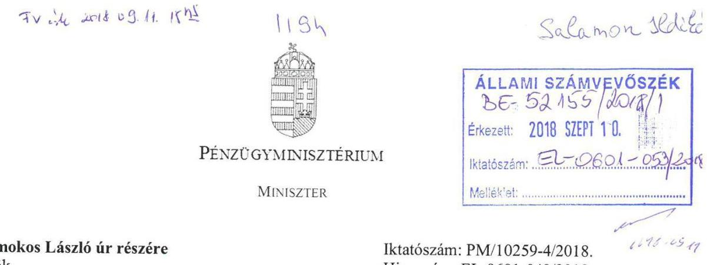

# Budapest 

## Tisztelt Elnök Úr!

Köszönettel megkaptam „A központi alrendszer intézményei - A központi alrendszer egyes intézményei pénzügyi és vagyongazdálkodásának ellenőrzése - Európai Támogatásokat Auditáló Föigazgatóság" címmel készített jelentés-tervezetet, amellyel kapcsolatban az alábbi észrevételeket teszem.

A Pénzügyminisztérium (a továbbiakban: PM) Ellenőrzési Főosztálya a 2017. évi ellenőrzési terve szerint 2017. első felében ellenőrzést folytatott „az Európai Támogatásokat Auditáló Főigazgatóság feladatellátásának vizsgálata" tárgyában, amelynek célja annak értékelése volt, hogy az irányított szerv közfeladatának ellátása, továbbá az erőforrásokkal való gazdálkodása szabályszerűen és eredményesen valósult-e meg. A vizsgálat a 2016. január 1-je és a 2017. július 14-e közötti időszakot érintette.

A levelem mellékleteként megküldöm a PM Ellenőrzési Főosztálya jelentésének kivonatát, amely az Európai Támogatásokat Auditáló Főigazgatóság főigazgatója részére tett javaslatokat tartalmazza. Megvizsgálva a számvevőszéki és a belső ellenőrzési javaslatokat, megjegyzem, hogy az irányító szerv a belső ellenőrzési tevékenysége keretében az Állami Számvevőszék által jelzett hiányosságok jelentős részét már feltárta.

A javaslatok hasznosulása érdekében intézkedési terv készült, amelynek jóváhagyása az irányító szerv részéről megtörtént, az intézkedési terv megvalósítása a jelentéstervezet véleményezésének időpontjában folyamatban van.

A fentiekre tekintettel kérem Elnök Urat, hogy a végleges jelentést kiegészíteni, valamint a tervezetben szereplő, az ellenőrzött szerv részére készített javaslatokat felülvizsgálni szíveskedjen.

Budapest, 2018. szeptember „b "
Melléklet: ellenőrzési jelentés kivonata
Üdvözlettel:
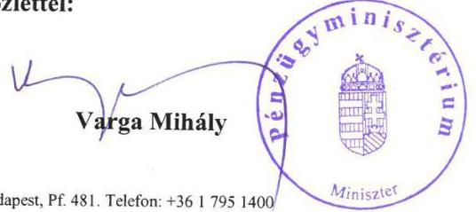

---

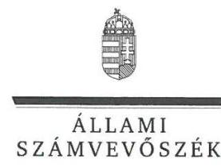

ELNÖK

Ikt. szám: EL-0601-054/2018.

# Varga Mihály Úr 

miniszter
Pénzügyminisztérium

## Budapest

## Tisztelt Miniszter Úr!

Köszönettel megkaptam „A központi alrendszer intézményei - A központi alrendszer egyes intézményei pénzügyi és vagyongazdálkodásának ellenörzése - Európai Támogatásokat Auditáló Föigazgatóság" című számvevőszéki jelentéstervezetben foglalt megállapításokra írásban tett, PM/10259-4/2018. iktatószámú levelében megküldött észrevételét.

Tájékoztatom miniszter urat, hogy a jelentésben - az Állami Számvevőszékről szóló 2011. évi LXVI. törvény 29. § (3) bekezdése alapján - a figyelembe nem vett észrevételeket szerepeltetjük az el nem fogadás indokának feltüntetésével együtt.

Az Állami Számvevőszék észrevételekre vonatkozó álláspontjáról a felügyeleti vezető által készített részletes tájékoztatást mellékelten megküldöm.

Budapest, 2018. 5477 hó 28 nap

Tisztelettel:
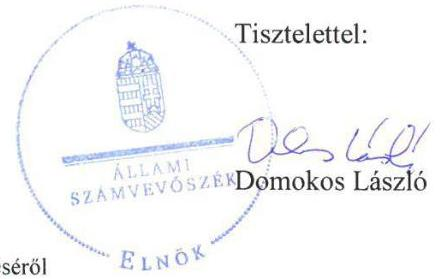

Melléklet: Tájékoztatás az észrevételek kezeléséről

---

1. számú melléklet az EL-0601-054/2018. ikt. számú levélhez

# Tájékoztatás   az észrevételek kezeléséről 

„A központi alrendszer intézményei - A központi alrendszer egyes intézményei pénzügyi és vagyongazdálkodásának ellenörzése - Európai Támogatásokat Auditáló Föigazgatóság" címủ számvevőszéki jelentéstervezetre a PM/10259-4/2018. iktatószámú levelében tett észrevételét áttekintettük, azok kezeléséről az alábbi tájékoztatást adom.

Köszönettel vettük arra vonatkozó tájékoztatását, hogy a Pénzügyminisztérium Ellenőrzési Főosztálya által „az Európai Támogatásokat Auditáló Föigazgatóság feladatellátásának vizsgálata" tárgyában 2017. első félévében lefolytatott ellenőrzése során ,,az irányító szerv a belső ellenőrzési tevékenysége keretében az Állami Számvevőszék által jelzett hiányosságok jelentős részét már feltárta. " Tájékoztatása kitért továbbá az intézkedési terv elkészülésének, jóváhagyásának, valamint a folyamatban lévő végrehajtásának a tényére.

Észrevételében az Állami Számvevőszék ellenőrzési megállapításait nem cáfolta, az irányító szervi ellenőrzési megállapítások hasonlóságára vonatkozó tájékoztatása azt megerősítette.

Az Állami Számvevőszékről szóló 2011. évi LXVI. törvény (ÁSZ tv.) 32. § (1) bekezdése szerint „Az Állami Számvevőszék az általa végzett ellenőrzésekről jelentést készít. A jelentés tartalmazza a feltárt tényeket, az ezeken alapuló megállapításokat, következtetéseket. " Az ellenőrzés megállapításai az ÁSZ tv. 28. § (2) bekezdése alapján az ellenőrzött szervezet által az ellenőrzéséhez kapcsolódóan, az ellenőrzés lefolytatásához a törvényi határidőben rendelkezésre bocsátott, a teljességi és hitelességi nyilatkozatban feltüntetett dokumentumokon alapulnak. További dokumentum az ellenőrzött időszakra vonatkozó ellenőrzési megállapításokat nem módosítja, így azt nem vettük figyelembe.

Fentiek következtében az észrevétele alapján a megállapítások - és így a megállapítások alapján megfogalmazott javaslatok - módosítása nem indokolt.

Budapest, 2018. GxF1 hó 36 nap
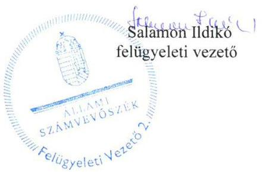

---

# 1232 

## EURÓPAI TÁMOGATÁSOKAT AUDITÁLÓ FÓIGAZGATÓSÁG FÓIGAZGATÓ

iktatószám: EUTAF-I/00921/005/2018. ügyintéző neve, elérhetőségei:
dr. Tamás László, 06-1/896-0914, laszlo.tamas@eutaf.gov.hu

Tárgy: Észrevételek EL-0601-048/2018 számú jelentéstervezetre

## Domokos László úr részére

elnök

## Állami Számvevőszék

1364
Budapest 4.
Pf. 54.

Tisztelt Elnök Úr!

Az Állami Számvevőszék (a továbbiakban: Számvevőszék) által 2018. augusztus 29-én EL-0601048/2018 iktatószámmal megküldött, ,,A központi alrendszer intézményei - A központi alrendszer egyes intézményei pénzügyi és vagyongazdálkodásának ellenörzése - Európai Támogatásokat Auditáló Föigazgatóság" címmel készített jelentéstervezetre vonatkozóan az Európai Támogatásokat Auditáló Főigazgatóság (a továbbiakban: Főigazgatóság) nevében az alábbi észrevételeket terjesztem elő.

A jelentéstervezetre vonatkozóan általános észrevételként kívánom megfogalmazni, hogy álláspontom szerint a megállapított hibák súlya és a levont következtetések több esetben túlzóak, nem minden esetben állnak összhangban. A megállapítások jelentős része formai, dokumentálási hiányosságokból fakad, mindeközben nem hangsúlyozza, hogy a müködés, a gazdálkodás alapvetően szabályszerű volt. Az ellenőrzött időszakban és jelenleg is biztosított a Főigazgatóságnál a szabályszerű, átlátható és elszámoltatható közpénzfelhasználás. A pénzügyi és vagyongazdálkodás során visszaélésre, szabálytalan pénzfelhasználásra nem került sor.

A jelentéstervezetből számos esetben nem derül ki pontosan, hogy a megállapítások bizonyos esetekben 1-1 hibából, adminisztratív jellegű hiányosságból adódnak és az alapján von le következtetést az adott rendszer szabályszerű vagy nem szabályszerű működéséről. Ez több esetben olyan általánosan megfogalmazott megállapítást és következtetést eredményez, amely félreérthető.

---

A jelentéstervezet nem számol be arról, hogy a Számvevőszék az összes mintatételt figyelembe véve milyen arányban állapít meg hiányosságot, pontosan mennyi és melyik mintatételek esetében tárt fel hibát vagy hiányosságot, a tervezetből nem ismerhető meg ezáltal a hibaarány.

# Részletes észrevételeink a következők: 

Főbb megállapítások, következtetések, javaslatok:
Kérjük az alfejezetben foglaltak felülvizsgálatát az általános és részletes észrevételeink figyelembe vételével.

## Az ellenőrzés területe:

A szövegben szereplő 2014. éves bevétel összege nem egyezik a beszámolóban szereplő adattal. A mondat helyesen: a teljesített összes bevétel összege a 2014. évben 1451,3 M Ft volt, 2016. évre 1179,3 M Ft-tal, 81,3\%-kal, 2630,6 M Ft-ra nőtt. (7. oldal 5. bekezdés második mondat)

## 2.1. sz. megállapítás:

„Az EUTAF rendelkezett az NGM által kiadott SZMSZ-szel. A 2015. február 19-ig hatályos SZMSZ az Ávr18. 13. § (1) bekezdése) pontja elöirásának nem felelt meg, mert nem tartalmazta a gazdasági szervezet megnevezését, feladatait, továbbá 2014. december 31-ig az engedélyezett létszámát."
A Főigazgatóság gazdasági önállóságának kialakítása után, az irányító szervvel való egyeztetéseket követően került sor az SZMSZ módosítására, amely módosítást a Főigazgatóság még 2014-ben kezdeményezett, a kiadására azonban csak 2015-ben került sor.
A Főigazgatóság 2015. február 19-ig hatályos SZMSZ-e, majd az ezt követően hatályba lépett módosítása is tartalmazott létszámadatokat az összes szervezeti egységre vonatkozóan. A megállapításban foglaltak ezért nem helytállóak, kérjük a létszámadatra vonatkozó rész törlését és a gazdasági szervezet megnevezésére vonatkozó rész pontosítását, miszerint a Főigazgatóság kezdeményezte az SZMSZ módosítását, de arra adminisztratív okokból 2015-ben került csak sor.
„A számviteli politikában rögzítették, mit tekintenek a számviteli elszámolás és az értékelés szempontjából lényegesnek, nem lényegesnek, jelentősnek, nem jelentősnek, a törvényben biztositott választási, minősitési lehetőségekhez kapcsolódóan melyeket, milyen feltételek fennállása esetén alkalmaztak, ugyanakkor nem határozták meg a Számv.tv. 14. § (4) bekezdése rendelkezésének ellenére, hogy a választott gyakorlatot milyen okok miatt kell megváltoztatni. A Számv.tv. 14. § (11) bekezdését megsértve, számviteli politikájukban a Számv.tv. 2015. július 4-én hatályba lépett módosítását követően, a Számv.tv. 14. § (4) bekezdésének elöírása ellenére nem határozták meg, hogy mit tekintenek kivételes nagyságú vagy elöfordulású bevételnek, költségnek, ráfordításnak."
A számviteli politika az ellenőrzött időszak óta felülvizsgálatra és módosításra került, amely már tartalmazza a javaslatban megfogalmazottakat.
„A számlarend a Számv.tv. 161. § (2) bekezdés b) pontjában, és az Áhsz. 51. § (2) bekezdésében elöírtak ellenére nem tartalmazta a könyvviteli számlák értéke növekedésének, csökkenésének jogcímeit, valamint az Áhsz.51. § (3) bekezdésében elöírtak ellenére a pénzügyi könyvvezetéshez készült összesitő bizonylatok elkészitésének rendjét."
A Számv.tv. 161. § (2) bekezdése alapján a számlarend a következőket tartalmazza: b) a számla tartalmát, ha az a számla megnevezéséből egyértelműen nem következik, továbbá a számla értéke növekedésének, csökkenésének jogcímeit, a számlát érintő gazdasági eseményeket, azok más számlákkal való kapcsolatát.

---

Az Áhsz. 51. § (2) bekezdése szerint az egységes számlakeret alapján számlarendet kell készíteni a Számv.tv. 161. §-a szerinti tartalommal és azzal az eltéréssel, hogy a 161. § (2) bekezdés b) pontjában foglaltakat csak akkor lehet szabályozni, ha azokról a rendelet nem rendelkezik. Tekintettel arra, hogy a Főigazgatóság az Áhsz. 51. (1) bekezdése alapján kötelezően az egységes számlakeretet, illetve 38/2013. (IX.19.) NGM rendeletében rögzített, kötelező könyvelési tételeket alkalmazza könyvvezetése során - összhangban a Számlarend 4. § d) bekezdésében foglaltakkal - nem köteles a Számv.tv. 161. § (2) bekezdés szerinti tartalom szerepeltetésére a Számlarendjében.

További észrevételünk, hogy a Számlarend tartalmaz utalást a vezetett analitikus nyilvántartásokra, azok egyeztetési feladataira a főkönyvvel, ezek határidejéről. Az analitikus nyilvántartások szabályozottak, a gyakorlatban az egyeztetési folyamatok megvalósulnak.
A szabályzat felülvizsgálata folyamatban van.
A fentiek figyelembe vételével kérjük a 2.1. sz. megállapítás, az összegző megállapítás és a kapcsolódó javaslat felülvizsgálatát.

# 2.2. sz. megállapítás: 

,,Az EUTAF az ellenőrzött időszakban rendelkezett kockázatkezelési szabályzattal, kialakította és müködtetette a Bkr. elöirásának megfelelő kockázatkezelési rendszert, azonban 2016. október l-től hatályos, a Bkr. 3. § b) pontjának és a Bkr. 7. § (1) bekezdésének elöirása ellenére nem alakította ki és nem müködtette az integrált kockázatkezelési rendszert, valamint a Bkr. 6. § (4) bekezdése ellenére az EUTAF nem szabályozta az integrált kockázatkezelés eljárásrendjét."
Álláspontunk szerint a megállapítás nem helytálló, mivel a Bkr. 3. § b) pontjának és a 7. § (1) bekezdésének rendelkezései szerint integrált kockázatkezelési rendszert kell müködtetni, ami alapvetően nem jelent egyet egy eljárásrend kiadásával. A Főigazgatóság a gyakorlatban, mindennapi müködése, szakmai feladatellátása során a különböző folyamataiba, eljárásaiba integrált kockázatkezelési rendszert müködtet, ami megfelelően állapítja meg, követi nyomon és kezeli a tevékenységet és szervezeti célokat érintő kockázatokat. Rendszeresen elvégezzük a kockázatelemzéseket, a szakmai és gazdasági müködés irányítása, tervezése és monitoringja legalább heti rendszerességgel megtörténik.

A Főigazgatóság 2014. május 28. óta rendelkezik kijelölt integritás tanácsadóval is. Az ellenőrzött időszakon kívül az integrált kockázatkezelés eljárásrendje szabályzat is kiadásra került. Ezen kívül a Főigazgatóság minden évben kitölti és beküldi a Számvevőszék integritás kérdőívét is. Álláspontunk szerint a fentiek kellőképpen alátámasztják, hogy a Főigazgatóságon a kockázatkezelési rendszer kialakítása és müködtetése a teljes ellenőrzött időszakban megfelelt a követelményeknek.

A fentiek figyelembe vételével kérjük a 2.2. sz. megállapítás és az összegző megállapítás, valamint a kapcsolódó javaslat felülvizsgálatát.

### 2.3. sz. megállapítás:

„A 2014. január 17-én adott, az ellenőrzés időszakában érvényben levő kijelölések a pénzügyi ellenjegyzői jogkör gyakorlására vonatkozóan kettő, az érvényesitői jogkör gyakorlására vonatkozóan négy esetben nem voltak szabályszerüek,mert arra jogosulatlan személy adott kijelölést, megsértve ezzel az Ávr. 58. § (4) bekezdésében foglaltakat; "

Vizsgálatunk szerint a fenti sajnálatos esetet egyszerű dátumelírás okozta, a kijelölést adó személy általi kijelölésen adminisztratív tévedés miatt korábbi dátum szerepelt, mint a saját kijelölésén.

---

„2014-2016. években kijelölt három személynek nem volt pénzügyi ellenjegyzői, illetve az érvényesitői jogkör gyakorlásához, az Ávr. 55. §(3) bekezdésében és az Ávr. 58. §(4) bekezdésében elöirt végzettsége"
Az EUTAF felülvizsgálta a végzettségeket igazoló dokumentumokat és álláspontunk szerint két fö esetében helytálló a megállapítás, amelynek ugyanakkor módosítását és kiegészítését kérjük. Két főnek valóban nem volt megfelelő végzettsége a jogosultságok gyakorlásához, ennek következtében az ellenőrzött időszak után is alkalmazásban lévő közszolgálati jogviszonyban álló kollégának a jogosultsága visszavonásra került. A másik személy az ellenőrzött időszak óta nem dolgozik a gazdasági szervezetben, felhatalmazása szintén visszavonásra került.
A harmadik személy esetében fennállnak a jogszabályban előírt végzettségi feltételek: középiskolai érettségi bizonyítványa szerint képesített könyvelő, vállalati tervező és statisztikus végzettsége van. Ez megfelel a „vagy legalább középfokú iskolai végzettséggel és emellett pénzügyi-számviteli képesítéssel kell rendelkeznie" jogszabályi előírásnak.
„Az EUTAF az Ávr. 60. § (3) bekezdése ellenére gazdálkodási jogkörök gyakorlására jogosult személyekröl és aláírás mintájukról naprakész nyilvántartást nem vezetett. "
Az aláírás minták naprakészen nyilvántartottak, változásuk nyomon követhető. Valamennyi felhatalmazás tartalmaz aláírás mintát, amely egyben a felhatalmazást elfogadó aláírás is. A felhatalmazás életbe lépésének ténye az aláírásnál rögzítésre kerül. A gazdasági szervezetnél minden felhatalmazásból egy eredeti példány rendelkezésre áll, visszavonás esetén vagy a felhatalmazás iratra kerül rávezetésre a jogosultság megszűnése, vagy a visszavonás dokumentuma csatolásra kerül az eredeti, felhatalmazó dokumentumhoz. Az aláírás minták rendezetten elérhetők, a jogosultságokban bekövetkező változások nyomonkövethetőek, ezért kérjük a megállapítás módosítását, illetve kiegészítését, miszerint az aláírás minták naprakészen rendelkezésre állnak, változásuk nyomon követhetősége biztosított.
„A kötelezettségvállalásokról vezetett nyilvántartások nem voltak szabályszerüek 2014-2016. években, mert nem tartalmazták az Áhsz. 14. melléklet II. 4. pont
a) pontjában elöirtak ellenére a kötelezettségvállalást tanúsitó dokumentum megnevezését, iktatószámát, keltét;
e) pontjában elöirtak ellenére a költségvetési évben a pénzügyi teljesitési határidőket dátum szerint, hogy abból az Áht. és Ávr. szerinti finanszírozási, likviditási terv összeállitható legyen;
g) pontjában elöirtak ellenére a pénzügyi teljesitések dátumát, összegét, egységes rovatrend szerint besorolását, az utalványozás Ávr. 59. § (2) bekezdése szerinti dokumentumának azonosításához szükséges adatokat."
A Főigazgatóság által benyújtott, a Forrás könyvelési rendszerből legyűjtött és adatszolgáltatásként megküldött nyilvántartás tartalmazza az Áhsz. 14. melléklet II. 4 pont a) pontjában előírtaknak megfelelően a kötelezettségvállalást tanúsító dokumentum megnevezését („Megjegyzés" elnevezéssel), iktatószámát („külső bizonylatszám" megnevezéssel) és keltét („aláírás dátuma" megnevezéssel).
Az Áhsz 14. melléklet II. 4. pont e) és g) pontjában felsorolt adatok a Forrás könyvelési rendszerben rendelkezésre állnak, így az Áhsz. 14. melléklet II.4. pontja szerinti nyilvántartásokkal a Főigazgatóság rendelkezik.
Mivel a könyvelési rendszerben megtörténik a kötelezettségek nyilvántartása, kérjük a megállapítás módosítását, kiegészítését.

A fentiek figyelembe vételével kérjük a 2.3. sz. megállapítás, az összegző megállapítás, valamint a kapcsolódó javaslat felülvizsgálatát.

---

# 2.4. sz. megállapítás: 

„Az EUTAF a belső és a külső információ áramlás rendjét a kommunikációs szabályzatban határozta meg, azonban a Bkr. 9. § (1)-(2) bekezdésének rendelkezése ellenére nem határozta meg a beszámolási szinteket, határidőket és módokat, nem alakitott ki és nem müködtetett olyan rendszereket, amelyek biztositják, hogy a megfelelő információk a megfelelő időben eljutnak az illetékes szervezethez, szervezeti egységhez, illetve személyhez. "
A Bkr. 9. § (1)-(2) bekezdései nem írnak elő tételes szabályt arra vonatkozóan, hogy milyen módon teljesíthetőek a hivatkozott rendelkezések. A Főigazgatóság szervezetén belül az SZMSZ-ben meghatározott szolgálati út, az Ellenőrzési kézikönyvben, a Gazdasági szervezet ügyrendjében, az Ellenőrzési nyomvonalban és az Iratkezelési szabályzatban meghatározott eljárási és ügyintézési szabályok megfelelően biztosítják a beszámolási szintek meghatározását, a határidőket és módokat, tartalmazzák a rendszerek müködésére vonatkozó rendelkezéseket. A fenti szabályzatokban meghatározott kontrollpontok mellett a feladatok végrehajtása során folyamatosan vezetett és aktualizált monitoring táblázatokat alkalmazunk. Rendszeresek a vezetői értekezletek, az ott elhangzottakról a vezetők megbeszéléseken tájékoztatják a szervezeti egységükhöz tartozó személyeket mind az aktuális, mind pedig a jövőre vonatkozó célokról, feladatokról, eseményekről. A szabályozókat, információs és szakmai anyagokat, képzések és konferenciák ismeretanyagát és a közleményeket elektronikus úton, e-mailben küldjük meg a kollégák részére, valamint ezen anyagok elérhetőek a Főigazgatóság közös belső meghajtóján. A Főigazgatóság szakmai munkáját, feladatait széles körben elismert színvonalon és határidőre teljesíti, mely nem lenne lehetséges nem megfelelő kommunikáció és információáramlás esetén. Mindezekre tekintettel kérjük a megállapítás és a javaslat törlését.
„A föigazgató az Info tv". 24. § (3) bekezdése rendelkezése ellenére nem készítette el az adatvédelmi és adatbiztonsági szabályzatot."
Az adatvédelmi szabályzat az ellenőrzött időszakon kívül kiadásra került, így a megállapításban megfogalmazott hiányosság már nem áll fenn. Az aktuális adatvédelmi szabályzat megtalálható a Főigazgatóság honlapján az Adatvédelem menüpont alatt. Kérjük a megállapítás kiegészítését.
„Az EUTAF az Info. tv. 37.§ (1) bekezdés szerinti közzététel i kötelezettségének - az Info tv. 1. melléklet II. 1. pontjában elöirt - SZMSZ3 vonatkozásában nem tett eleget."
A Főigazgatóság szervezeti és müködési rendjét - figyelemmel a központi államigazgatási szervekről, valamint a Kormány tagjai és az államtitkárok jogállásáról szóló 2010. évi XLIII. törvény 73. § (1) bekezdésében, továbbá a jogalkotásról szóló 2010. évi CXXX. törvény 23. § (4) bekezdés c) pontjára - az államháztartásért felelős miniszter normatív utasításban szabályozza. Ezáltal a Főigazgatóság SZMSZ-e és annak módosításai megjelennek a Magyar Közlönyben. A hatályos SZMSZ megtalálható továbbá a Főigazgatóság honlapján a Szervezeti felépítés menüpontban.

A fentiek figyelembe vételével kérjük a 2.4. sz. megállapítás, az összegző megállapítás, valamint a kapcsolódó javaslat felülvizsgálatát.

### 2.5. sz. megállapítás:

„A föigazgató a 2016. évre vonatkozó éves ellenőrzési tervet az irányitó szerv belső ellenőrzési vezetője részére a Bkr. 32. § (2) bekezdésében foglaltak ellenére nem küldte meg."
Az ellenőrzött időszakban, a 2016-os évben a Főigazgatóság nem tudott eleget tenni a belső ellenőrzési terv határidőben történő beküldését illetően. Ennek oka az volt, hogy az akkor megbízással rendelkező belső ellenőr nem tudta tovább vállalni a feladatot és a Főigazgatóságnak gondoskodnia

---

kellett új belső ellenőr beszerzéséről. A kiválasztási eljárás lezárultával a tervezés felülvizsgálatra került és a belső ellenőrzési tervet elküldtük az irányító szervnek.
A tárgyévre vonatkozó belső ellenőrzési terv minden más alkalommal határidőben megküldésre került az irányító szerv részére mind az ellenőrzött időszakban, mind pedig azután.
,,Az EUTAF-nál a belső ellenörzésekröl évenkénti bontásban vezetett nyilvántartás nem felelt meg a Bkr. 47. § (1) és (2) bekezdés elöirásának, mert nem tartalmazta a belső ellenörzési jelentések megállapításaira tett, elkészült intézkedési terveket és a tervek alapján végrehajtott intézkedések rövid leírását."
A belső ellenőrzések nyilvántartására az ellenőrzött időszakban alkalmazott táblázat valóban nem tartalmazta az intézkedési terveket és a teljesülésüket. A belső és külső ellenőrzések nyilvántartására az ellenőrzött időszak után új folyamatok kerültek kialakításra, kontrollpontok kerültek beépítésre, amelyek biztosítják, hogy a jogszabályi előírásoknak megfelelő nyilvántartásokkal rendelkezzünk.
,,Az EUTAF a külső ellenörzések nyilvántartását nem a Bkr. 47. § (2) bekezdése szerinti tartalommal készítette el, mert a nyilvántartás az ellenörzési jelentésben szereplő javaslatokat nem tartalmazta. A föigazgató a Bkr. 14. § (2) bekezdése elöírásának ellenére nem számolt be az irányító szerv vezetőjének, a külső ellenőrzés megállapításaira készült intézkedési tervek végrehajtásáról."
Az ellenőrzött időszakban a külső ellenőrzések nyilvántartására alkalmazott táblázatok vonatkozó oszlopának elnevezése nem „javaslat", hanem az "Ellenőrzés eredménye/Intézkedési terv", ami tartalmilag javaslatokat tartalmaz, így a fenti megállapítás - a megfogalmazásával ellentétben - nem tartalmi hiányosságra vonatkozik, csupán formaira.
,,A föigazgató a 2014-2016. évekre vonatkozóan, Bkr. 1. melléklet szerinti nyilatkozatban értékelte a belső kontrollrendszer minőségét. A 2016. évre vonatkozó nyilatkozat nem tartalmazta a 2016. október l-jétől hatályos Bkr. 1. számú mellékletében elöirtak ellenére, hogy a föigazgató gondoskodott olyan szervezeti kultúra kialakításáról, amely biztosítja az elkötelezettséget a szervezeti célok és értékek iránt, valamint alkalmas az integritás érvényesitésének biztositására."
Bár a föigazgató 2016. évre vonatkozó nyilatkozata nem az akkor hatályos Bkr. 1. számú melléklete szerint készült, véleményünk szerint a megállapításból levont következtetés nem helytálló a fentebb részletezett észrevételek miatt.
,,Az EUTAF belső kontrollrendszere - kialakításában és müködtetésében feltárt hiányosságok és hibák miatt - nem támogatja az átlátható közpénz felhasználást, az integritás kultúra kialakítását. Az EUTAF müködtetett nem kötelezően elöirt kontrollokat, azonban a Bkr. 7. § (2) bekezdésben foglaltak ellenére a tevékenységében, gazdálkodásában rejlő kockázatokat, valamint - 2016. október l-jétől - a tevékenységében rejlő és a szervezeti célokkal összefüggő kockázatokat nem mérte fel."
A 2.2. sz. megállapításra, valamint a 2.5. sz. megállapításra a fentiekben tett észrevételeinkre tekintettel kérjük a megállapítás ezen részének pontosítását. Kérjük továbbá azon tényezők szerepeltetését, amelyek alapján az idézett következtetésre jutott az ellenőrzés, hogy amennyiben szükséges, megtehessük a szükséges javító intézkedéseket.

A fentiek figyelembe vételével kérjük a 2.5. sz. megállapítás, az összegző megállapítás, valamint a kapcsolódó javaslat felülvizsgálatát.

# 3.1. sz. megállapítás: 

A megállapítással kapcsolatos általános észrevételünk, hogy a módszertan bemutatásából (11. oldal, utolsó előtti bekezdés), illetve a megállapítás részletezéséből nem derül ki, hogy pontosan milyen

---

ellenőrzési eredmény vezetett az egyes megállapításokhoz, tehát, hogy mi volt az egyes területeken a hibaarány, a teljes minta nagysága, a mintában talált hibás tételek száma, típusa, súlya. Mivel így a megállapítások félreérthetőek, kérjük az ellenőrzési eredmények részletezésével kiegészíteni, pontosítani a megállapítást.
„A kiadási elöirányzatok felhasználásánál az ellenörzött években a gazdálkodási jogkörök gyakorlása nem volt szabályszerü, mert:

- az Ávr. 56. § (3) bekezdés ellenére a pénzügyi ellenjegyzö nem gyözödött meg a szabad elöirányzatról;"
A jelentéstervezet részletes megállapításából nem derül ki, hogy az ellenőrzés mi alapján tette ezt a megállapítást, kérjük ezért annak kiegészítését, pontosítását. Amennyiben erre a kötelezettségvállalás nyilvántartásának hiányosságaiból következtetett, akkor kérjük a 2.3 megállapításhoz tett észrevételünk figyelembe vételét.
- „a pénzügyi ellenjegyzést, az Ávr. 55. § (2) bekezdés a) pont elöirása ellenére nem az arra jogosult személy végezte;"
Figyelembe véve a 2.3. sz. megállapításra tett első észrevételünket, kérjük a megállapítás felülvizsgálatát, ugyanis nem három, hanem két fő esetében nem teljesültek a szakképzettségre vonatkozó jogszabályi előírások. Az ellenőrzött időszakon túl a hiányosság megszünt.
- „az Ávr. 57. § (3) bekezdés elöirása ellenére nem történt teljesitésigazolás;"

A részletes megállapításból nem derül ki, hogy mekkora elemszámú minta ellenőrzéséből, hány tétellel kapcsolatosan született a megállapítás. A hivatkozott mondat utalhat arra is, hogy az ellenőrzött időszakban egyáltalán nem történt teljesitésigazolás, ami egyértelműen nem helytálló; 1-2 hiba nem alapozhat meg sommás véleményt.

- „az érvényesitést az Ávr. 58. § (4) bekezdés elöirása ellenére nem az arra jogosult végezte;"
Figyelembe véve a 2.3. sz. megállapításra tett első észrevételünket, kérem a megállapítás felülvizsgálatát, ugyanis nem három, hanem két fő esetében nem teljesültek a szakképzettségre vonatkozó jogszabályi előírások. Az ellenőrzött időszakon túl a hiányosság megszünt.
- „az Áht. 38.§ (1) bekezdés elöirása ellenére az Ávr. 59. § (1) bekezdése szerinti utalványozás nem történt meg."
A részletes megállapításból nem derül ki, hogy mekkora elemszámú minta ellenőrzéséből, hány tétellel kapcsolatosan született a megállapítás. A hivatkozott mondat utalhat arra is, hogy az ellenőrzött időszakban egyáltalán nem történt utalványozás, ami egyértelműen nem helytálló; 1-2 hiba nem alapozhat meg sommás véleményt.

A fentiek figyelembe vételével kérjük a 3.1. sz. megállapítás, az összegző megállapítás, valamint a kapcsolódó javaslat felülvizsgálatát.

# 3.2. sz. megállapítás: 

„EUTAF az éves költségvetési beszámoló részeként elkészitett maradvány kimutatását az Áhsz. 39. § (3) bekezdése ellenére, az Ahsz. 14. melléklet II/4. pontjában foglalt tartalmú részletezö nyilvántartással nem támasztotta alá. Az EUTAF 2014-2016. évek tárgyévi kötelezettségvállalással terhelt költségvetési maradványának meghatározása az Ávr. 150. § (1) bekezdés b) pontjában foglaltaknak nem felelt meg."

---

Figyelembe véve a 2.3. számú megállapításhoz tett észrevételünket, amely szerint a Főigazgatóság könyvelési programja teljes körűen tartalmazza az Áhsz.14. melléklet II.4. pontjában előírt, a kötelezettségvállalásokra vonatkozó részletező nyilvántartás adatait, kérjük a megállapítás felülvizsgálatát.

A fentiek figyelembe vételével kérjük a 3.2. sz. megállapítás, az összegző megállapítás, valamint a kapcsolódó javaslat felülvizsgálatát.

# 4.1. sz. megállapítás: 

„Az EUTAF vagyonkezelésbe vett eszközöket - az Áhsz. 10. § (1) bekezdése és a vagyonkezelési szerzödés 4.8. pontja ellenére - az éves beszámolói mérlegében nem mutatta ki."
A megállapítás véleményünk szerint nem helytálló, kérjük annak törlését.
Az MNV Zrt.-vel 2015. évben megkötött vagyonkezelői szerződés alapján a szerződés 1. és 2. számú mellékletében kimutatott vagyon elemek már szerepeltek a Főigazgatóság korábbi mérlegében, a vagyonkezelői szerződés létrejöttével csak a tulajdonosi joggyakorló személye változott, a Főigazgatóság, mint vagyonkezelő a szerződés létrejötte előtt és után is kimutatta a mérlegében a vagyonelemeket. Ezt támasztja alá a Vagyonkezelési szerződés 2. számú mellékletét képező 2014. II. negyedéves mérlegjelentés $1 /$ A ürlapja is.
„2016. február 11-én az EUTAF és a KEF az Nvtv. 11. § (9) bekezdése alapján Megállapodást kötött, a korábban szolgáltatási szerződés keretében, az EUTAF által használt, 3366 E Ft értékủ a KEF vagyonkezelésében lévő, ingóságok vagyonkezelői jogának átruházásáról. A Megállapodás megkötését követően az EUTAF a vagyonkezelésbe vett eszközöket az Áhsz-nek megfelelően nyilvántartotta, azonban a Vtvr. 11. § (2) bekezdésben és a Megállapodás III/2. pontjában foglaltak ellenére elmulasztotta írásban értesíteni a tulajdonosi jogokat gyakorló MNV Zrt.-t a jogutódlásról."
A megállapítás nem helytálló. A Főigazgatóság az MNV Zrt-t 2016. február 16-án kelt EUTAF-I/74/1/2016 iktatószámú levelével értesítette a Megállapodás megkötéséről és megküldte részére a szerződést. A Számvevőszék által megküldött Bekérendő dokumentumok jegyzéke mellékletből nem tudtuk egyértelműen megállapítani, hogy az értesítést is csatolni kell, ezért ennek beküldésére az ellenőrzés ideje alatt nem került sor.

A fentiek figyelembe vételével kérjük a 4.1. sz. megállapítás, az összegző megállapítás, valamint a kapcsolódó javaslat felülvizsgálatát.

### 4.2. sz. megállapítás:

„A Leltározási szabályzat" a leltárról és a leltározásról szóló 5. § (1) bekezdésében foglaltak és az Áhsz.22. §-ában, valamint a Számv.tv. 69.§ (1) bekezdésében elöirtak ellenére az EUTAF az éves költségvetési beszámolóinak mérlegtételeit leltárral nem támasztotta alá, nem készített olyan leltárt, amely tételesen és ellenőrizhető módon tartalmazza a mérleg fordulónapján meglévő eszközeit és forrásait mennyiségben és értékben."
A Főigazgatóság készített alátámasztó leltárakat, azonban azok nem minden esetben voltak kellően részletezettek, ezért kérjük a megállapítás módosítását.
Megjegyezzük, hogy ez a mérleg valódiságát nem befolyásolja, mert a főkönyv és analitika egyeztetése megtörtént, csak az adminisztrációja nem kellően részletezett.

A fentiek figyelembe vételével kérjük a 4.2. sz. megállapítás, az összegző megállapítás, valamint a kapcsolódó javaslat felülvizsgálatát.

---

# Észrevételek az EUTAF föigazgatójának megfogalmazott javaslatokkal kapcsolatban: 

A fenti észrevételek alapján kérjük a megállapításokhoz tartozó javaslatok felülvizsgálatát és szükség esetén azok törlését.

Ellenőrzési munkájukat köszönöm!

Budapest, 2018. szeptember 12.

Üdvözlettel:
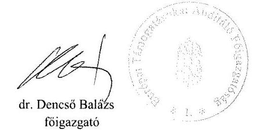

---

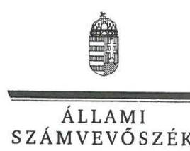

ELMÖK

Ikt.szám: EL-0601-056/2018.

# Dr. Dencső Balázs Úr   föigazgató 

Európai Támogatásokat Auditáló Föigazgatóság

## Budapest

## Tisztelt Föigazgató Úr!

Köszönettel megkaptam „A központi alrendszer intézményei - A központi alrendszer egyes intézményei pénzügyi és vagyongazdálkodásának ellenörzése - Európai Támogatásokat Auditáló Föigazgatóság" című számvevőszéki jelentéstervezetben foglalt megállapításokra írásban tett, EUTAF-I/00921/005/2018. iktatószámú levelében megküldött észrevételeit.
Tájékoztatom föigazgató urat, hogy a jelentésben - az Állami Számvevőszékről szóló 2011. évi LXVI. törvény 29. § (3) bekezdése alapján - a figyelembe nem vett észrevételeket szerepeltetjük az el nem fogadás indokának feltüntetésével együtt.

Az Állami Számvevőszék észrevételekre vonatkozó álláspontjáról a felügyeleti vezető által készített részletes tájékoztatást mellékelten megküldöm.

Budapest, 2018. 10 hó 70 nap
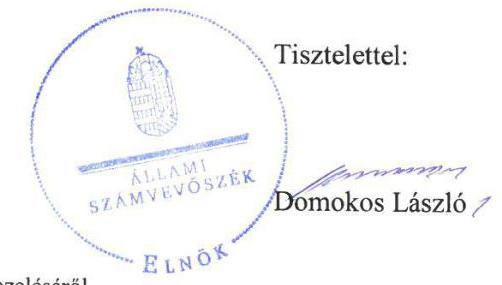

Melléklet: Tájékoztatás az észrevételek kezeléséről

---

# Tájékoztatás   az észrevételek kezeléséről 

„A központi alrendszer intézményei - A központi alrendszer egyes intézményei pénzügyi és vagyongazdálkodásának ellenörzése - Európai Támogatásokat Auditáló Föigazgatóság" című számvevőszéki jelentéstervezetre EUTAF-I/00921/005/2018. iktatószámú levelében tett észrevételeit áttekintettük, azok kezeléséről az alábbi tájékoztatást adom.

1. Jelentéstervezet 7. oldal 5. bekezdés 2. mondatára, az ellenőrzés területéhez tett észrevétel

Az észrevételt elfogadtuk. A jelentéstervezet 7. oldal 5. bekezdés 2. mondatát pontosítjuk.
2. Jelentéstervezet 12. oldal 2.1. számú megállapítás 1. bekezdésére tett észrevétel

Az észrevételt nem fogadtuk el. Köszönettel vettük tájékoztatását arra vonatkozóan, hogy az Európai Támogatásokat Auditáló Föigazgatóság (továbbiakban EUTAF) szervezeti és működési szabályzatának (továbbiakban SZMSZ) módosítására miért csak a 2015. évben került sor. A 2015. február 19-ig hatályos SZMSZ 1. függeléke tartalmazta a szervezeti egységek megnevezését, létszámát, azonban nem tartalmazta a gazdasági szervezet megjelölését, létszámát. Az SZMSZ 24. §-a azt rögzítette, hogy ,,az intézmény pénzügyi-gazdasági ... feladatainak ellátását az államháztartásért felelös miniszter által vezetett minisztériummal kötött külön megállapodás szabályozza." Az SZMSZ-ben foglaltakkal ellentétben 2014. év elejétől a gazdasági feladatokat az intézmény maga látta el. Előzőek alátámasztják az ellenőrzési megállapítást, amely szerint „A 2015. február 19-ig hatályos SZMSZ ${ }_{l}$ az Avr. 13. § (1) bekezdés e) pontja elöirásának nem felelt meg, mert nem tartalmazta a gazdasági szervezet megnevezését, feladatait, továbbá 2014. december 31-ig az engedélyezett létszámát." Ennek következtében a megállapítás módosítása nem indokolt.
3. Jelentéstervezet 12-13. oldal 2.1. számú megállapítás 2. bekezdésére tett észrevétel

Az észrevételt nem fogadtuk el. Köszönettel vettük tájékoztatását az ellenőrzött időszakot követően megtett intézkedésről. Az ellenőrzés megállapításai az Állami Számvevőszékről szóló 2011. évi LXVI. törvény (továbbiakban ÁSZ tv.) 28. § (2) bekezdése alapján az ellenőrzött szervezet által az ellenőrzéséhez kapcsolódóan, az ellenőrzés lefolytatásához a törvényi határidőben rendelkezésre bocsátott, a teljességi és hitelességi nyilatkozatban feltüntetett dokumentumokon alapulnak. Ennek következtében az ellenőrzött időszakra vonatkozó megállapítás és a kapcsolódó javaslat módosítása nem indokolt.
4. Jelentéstervezet 13. oldal 2.1. számú megállapítás 3. bekezdésre tett észrevétel

Az észrevételt nem fogadtuk el. A számvitelről szóló 2000. évi C. törvény

---

(továbbiakban Számv. tv.) 161. § (2) bekezdés b) pontja értelmében a számlarendnek tartalmazni kell: „a számla tartalmát, ha az a számla megnevezéséből egyértelmüen nem következik, továbbá a számla értéke növekedésének, csökkenésének jogcímeit, a számlát érintő gazdasági eseményeket, azok más számlákkal való kapcsolatát". Az államháztartás számviteléről szóló 4/2013. (I. 11.) Korm. rendelet (továbbiakban Áhsz.) 51. § (2) bekezdésében előírtak értelmében: „Az egységes számlakeret alapján számlarendet kell készíteni. A számlarend az Szt. 161. §-a szerinti tartalommal készül azzal az eltéréssel, hogy annak (2) bekezdés b) pontjában foglaltakat csak akkor lehet szabályozni, ha azokról e rendelet nem rendelkezik." Az Áhsz. nem szabályozta a Számv. tv. 161. § (2) bekezdés b) pontjában foglaltakat, így a szabályozási kötelezettség az ellenőrzött időszakban fennállt.

Az államháztartásban felmerülő egyes gyakoribb gazdasági események kötelező elszámolási módjáról szóló 38/2013. (IX. 19.) NGM rendelet (továbbiakban NGM rendelet) 1. § (1) bekezdése értelmében „az államháztartásban felmeriülő egyes gyakoribb gazdasági elszámolások könyvelési tételeit, elszámolás módját e rendelet 1. melléklete tartalmazza. " Az NGM rendelet szabályozása nem teljes körü.

Az EUTAF az Áhsz. 51. § (2) bekezdésének előirása értelmében az egységes számlakeret alapján elkészítette Számlarendjét, amelynek 4. § d) pontjában az NGM rendeletre hivatkozott. Az NGM rendelet 1. mellékletében nem szereplő, az egyes gyakoribb gazdasági elszámolások közé nem tartozó, EUTAF-nál előforduló gazdasági elszámolások könyvelési tételeire, elszámolás módjára azonban a Számlarend nem tartalmazott szabályozást, így az Áhsz. 51. § (2) bekezdésének előírásának ellenére a Számv. tv. 161. § (2) bekezdés b) pontjában foglaltakat nem szabályozta.

Mindezek következtében a megállapítás és a kapcsolódó javaslat módosítása nem indokolt.

# 5. Jelentéstervezet 13. oldal 2.2. számú megállapításra tett észrevétel 

Az észrevételt nem fogadtuk el. Észrevételében foglaltakkal ellentétben, a költségvetési szervek belső kontrollrendszeréről és belső ellenőrzéséről szóló 370/2011. (XII. 31.) Korm. rendelet (továbbiakban Bkr.) 3. § b) pontja nemcsak az integrált kockázatkezelési rendszer müködtetését, hanem annak kialakítását, fejlesztését is előírta, a költségvetési szerv vezetőjének felelősségi körében. A 2016. október 1-jétől hatályos Bkr. 6. § (4) bekezdése az integrált kockázatkezelés eljárásrendjének a szabályozását is előírta. Az EUTAF nem bocsátott az ellenőrzés rendelkezésére az integrált kockázatkezelési rendszer kialakítására vonatkozó szabályzatot, eljárásrendet. Továbbá dokumentumokkal nem igazolta, hogy az észrevételében jelzettek szerint a „Föigazgatóság a gyakorlatban, mindennapi müködése, szakmai feladatellátása során a különböző folyamataiba, eljárásaiba integrált kockázatkezelési rendszert müködtet, ami megfelelően állapítja meg, követi nyomon és kezeli a tevékenységet és szervezeti célokat érintő kockázatokat." Dokumentumokkal nem igazolta, hogy rendszeresen végzett kockázatelemzéseket, a szakmai és gazdasági müködés irányítása, tervezése és monitoringja legalább heti rendszerességgel megtörtént. Mindezek következtében az EUTAF dokumentumokkal nem támasztotta alá, hogy 2016. október 1-jétől az

---

ellenőrzött időszak végéig az integrált kockázatkezelési rendszert kialakította és müködtette.

Az ellenőrzés megállapításai az ÁSZ tv. 28. § (2) bekezdése alapján az ellenőrzött szervezet által az ellenőrzéséhez kapcsolódóan, az ellenőrzés lefolytatásához a törvényi határidőben rendelkezésre bocsátott, a teljességi és hitelességi nyilatkozatban feltüntetett dokumentumokon alapulnak. Ennek következtében a megállapítás és a kapcsolódó javaslat módosítása nem indokolt.
6. Jelentéstervezet 13. oldal 2.3. számú megállapítás 1. bekezdés 1. pontjára tett észrevétel

Az észrevételt nem fogadtuk el. Az észrevételében a hibát adminisztratív tévedéssel indokolta, ezzel nem cáfolta az ellenőrzési megállapítást, amely szerint a kijelölések nem feleltek meg az Ávr. 58. § (4) bekezdésében foglaltaknak. Ennek következtében a megállapítás és a kapcsolódó javaslat módosítása nem indokolt.
7. Jelentéstervezet 13. oldal 2.3. számú megállapítás 1. bekezdés 2. pontjára tett észrevétel

Az észrevételt elfogadtuk. A jelentéstervezet 13. oldal 2.3. számú megállapítás 1. bekezdés 2. pontjában a személyek számát kettőre pontosítjuk.
8. Jelentéstervezet 13. oldal 2.3. számú megállapítás 1. bekezdés 3. pontjára tett észrevétel

Az észrevételt nem fogadtuk el. Az ellenőrzés megállapításai az ÁSZ tv. 28. § (2) bekezdése alapján az ellenőrzött szervezet által az ellenőrzéséhez kapcsolódóan, az ellenőrzés lefolytatásához a törvényi határidőben rendelkezésre bocsátott, a teljességi és hitelességi nyilatkozatban feltüntetett dokumentumokon alapulnak. Az EUTAF dokumentummal nem igazolta, hogy az Ávr. 60. § (3) bekezdésének előirása szerint a kötelezettségvállalásra, a pénzügyi ellenjegyzésre, a teljesítés igazolására, az érvényesítésre, az utalványozásra jogosult személyekről és aláírás-mintájukról naprakész nyilvántartást vezetett, ilyen nyilvántartást nem bocsátott az ellenőrzés rendelkezésére. Ennek következtében a megállapítás és a kapcsolódó javaslat módosítása nem indokolt.
9. Jelentéstervezet 14. oldal 2.3. számú megállapítás 2. bekezdésére tett észrevétel

Az észrevételt részben fogadtuk el. Az észrevételből elfogadtuk a kötelezettségvállalás keltére vonatkozó részt, a Jelentéstervezet 14. oldal 2.3. számú megállapítás 2. bekezdés 1. pontjából töröljük a „keltét" szót. Az észrevétel többi részét nem fogadtuk el.

Az ellenőrzött időszakra az ellenőrzés rendelkezésére bocsátott, évenként kettő kötelezettségvállalás nyilvántartás (pdf és excel formátumú) egyike sem tartalmazott arra vonatkozó információt, hogy a kötelezettségvállalási nyilvántartás fejlécének „megiegyzés" megjelölése a kötelezettségvállalást tartalmazó dokumentum megnevezését, „külső bizonylatszám" megjelölés az iktatószámot jelenti. A fejléc

---

megnevezésétől eltérő tartalomra vonatkozó szabályozást az ellenőrzés rendelkezésére bocsátott szabályzatok sem tartalmaztak, így - az Áhsz. 14. melléklet II. 4. pont a) pontjában foglaltakra hivatkozással tett -, a kötelezettségvállalást tanúsító dokumentum megnevezésére, iktatószámára vonatkozó ellenőrzési megállapítás helytálló.

Az észrevételben elismerte, hogy az Áhsz. 14. melléklet II. 4. pont e) és g) pontjában felsorolt adatokra vonatkozóan nem bocsátott az ellenőrzés rendelkezésére dokumentumot.

Az ellenőrzés megállapításai az ÁSZ tv. 28. § (2) bekezdése alapján az ellenőrzött szervezet által az ellenőrzéséhez kapcsolódóan, az ellenőrzés lefolytatásához a törvényi határidőben rendelkezésre bocsátott, a teljességi és hitelességi nyilatkozatban feltüntetett dokumentumokon alapulnak.

A fentiekre tekintettel a megállapítások, a kapcsolódó javaslat, valamint a 2.3. számú összegző megállapítás módosítása nem indokolt.

# 10. Jelentéstervezet 14. oldal 2.4. számú megállapítás 1. bekezdésére tett észrevétel 

Az észrevételt nem fogadtuk el. Az észrevételben felsorolt, az ellenőrzés rendelkezésére bocsátott szabályozásokban (Gazdasági szervezet ügyrendje, Ellenőrzési nyomvonal, Iratkezelési szabályzat) meghatározott eljárási és ügyintézési szabályok nem fedik le az EUTAF teljes szervezeti felépítését, a szervezet egyes részeire, illetve az azokban meghatározott feladatok tekintetében, azok elvégzésére tartalmaznak előírásokat. Azonban sem ezekben a szabályozásokban, sem - a fentieken túl - az ellenőrzés rendelkezésére bocsátott Kommunikációs szabályzatban nem határozták meg a beszámolási szinteket, határidőket és módokat. Az információs és kommunikációs folyamatok - észrevételben foglaltak szerinti - müködtetésére vonatkozóan nem bocsátott az ellenőrzés rendelkezésére dokumentumokat. Az észrevételben hivatkozott Ellenőrzési kézikönyvet nem bocsátották az ellenőrzés rendelkezésére. Mindezek következtében, az EUTAF dokumentummal nem igazolta, hogy a Bkr. 9. § (1)-(2) bekezdésének rendelkezése alapján a beszámolási szinteket, határidőket és módokat kialakította, és müködtetett olyan rendszereket, amelyek biztosították, hogy a megfelelő információk a megfelelő időben eljutnak az illetékes szervezethez, szervezeti egységhez, illetve személyhez.

Az ellenőrzés megállapításai az ÁSZ tv. 28. § (2) bekezdése alapján az ellenőrzött szervezet által az ellenőrzéséhez kapcsolódóan, az ellenőrzés lefolytatásához a törvényi határidőben rendelkezésre bocsátott, a teljességi és hitelességi nyilatkozatban feltüntetett dokumentumokon alapulnak. A fentiekben leírtakra tekintettel a megállapítás és a kapcsolódó javaslat módosítása nem indokolt.

## 11. Jelentéstervezet 14. oldal 2.4. számú megállapítás 2. bekezdésére tett észrevétel

Az észrevételt nem fogadtuk el. Az észrevételben jelzettek szerint az adatvédelmi szabályzat az ellenőrzött időszakot követően került kiadásra és közzétételre. Az ellenőrzött időszakon kívüli intézkedés nem módosítja az ellenőrzött időszakra

---

vonatkozó ellenőrzési megállapítást. Ennek következtében a megállapítás és a kapcsolódó javaslat módosítása nem indokolt.

# 12. Jelentéstervezet 14. oldal 2.4. számú megállapítás 3. bekezdésére tett észrevétel 

Az észrevételt nem fogadtuk el. Az információs önrendelkezési jogról és az információszabadságról szóló 2011. évi CXII. törvény (továbbiakban Info tv.) 37. § (1) bekezdése szerint a közzétételre kötelezetteknek az Info tv. 1. melléklet szerinti általános közzétételi listában meghatározott adatokat az 1. mellékletben foglaltak szerint kell közzétenniük. Az EUTAF-nak - mint a 210/2010. (VI. 30.) Korm. rendelet 1. § (1) bekezdése szerinti központi hivatalnak - az Info tv. 33. § (2) bekezdés c) pontja szerint saját honlapján kellett eleget tennie közzétételi kötelezettségének. Ennek következtében a Magyar Közlönyben történő közzététel a saját honlapon történő közzététel alól nem ad felmentést. Az EUTAF dokumentummal nem igazolta, hogy az ellenőrzött időszakban Info. tv. 37. § (1) bekezdés szerinti közzétételi kötelezettségének - az Info tv. 1. melléklet II. I. pontjában előírt - SZMSZ3 vonatkozásában, az Info tv. 33. § (2) bekezdés c) pontjában előírtak szerint honlapján eleget tett.

Az ellenőrzés megállapításai az ÁSZ tv. 28. § (2) bekezdése alapján az ellenőrzött szervezet által az ellenőrzéséhez kapcsolódóan, az ellenőrzés lefolytatásához a törvényi határidőben rendelkezésre bocsátott, a teljességi és hitelességi nyilatkozatban feltüntetett dokumentumokon alapulnak. A fentiekben leírtakra tekintettel a megállapítás és a kapcsolódó javaslat módosítása nem indokolt.

## 13. Jelentéstervezet 14. oldal 2.5. számú megállapítás 2. bekezdésére tett észrevétel

Az észrevételt nem fogadtuk el. Az észrevétel nem cáfolta, hanem magyarázatot adott a feladat végrehajtásának elmaradására. Erre tekintettel a megállapítás és a kapcsolódó javaslat módosítása nem indokolt.

## 14. Jelentéstervezet 14. oldal 2.5. számú megállapítás 3. bekezdésére tett észrevétel

Az észrevételt nem fogadtuk el. Az észrevételében az ellenőrzési megállapításban jelzett hiányosságot elismerte. Köszönettel vettük az ellenőrzött időszakot követően megtett intézkedésről adott tájékoztatását, az ellenőrzött időszakot követő intézkedés nem módosítja az ellenőrzött időszakra vonatkozó ellenőrzési megállapítást. Ennek következtében a megállapítás és a kapcsolódó javaslat módosítása nem indokolt.

## 15. Jelentéstervezet 14. oldal 2.5. számú megállapítás 4. bekezdésére tett észrevétel

Az észrevételt nem fogadtuk el. Az ellenőrzés rendelkezésére bocsátott, a „7_1_nyilvantart.pdf", valamint a „7_1_nyilvant_2.pdf"elnevezésű dokumentumok a külső ellenőrzések nyilvántartásait tartalmazták. A nyilvántartások (táblázatok) csak s.sz., ellenőrzés száma, ellenőrző szerv, ellenőrzött OP, ellenőrzés célja/címe, helyszíni ellenőrzés éve, státusz oszlopokat tartalmaztak. A nyilvántartások nem tartalmazták a Bkr. 47. § (2) bekezdésében előírt „az ellenőrzési jelentésben szereplő javaslat"-okat. Ennek következtében a megállapítás és a kapcsolódó javaslat módosítása nem indokolt.

---

# 16. Jelentéstervezet 14-15. oldal 2.5. számú megállapítás 5. bekezdésére tett észrevétel 

Az észrevételt nem fogadtuk el. Az észrevételében elismerte, hogy a 2016. évre vonatkozó nyilatkozat nem az akkor hatályos Bkr. 1. melléklete szerint készült. Tekintettel a jogszabályi változásra, az ellenőrzési megállapítás a nyilatkozat tartalmában bekövetkezett változásra, az új nyilatkozat elemre tekintettel fogalmazta meg a nyilatkozat tartalmi hiányosságát. Az EUTAF a Bkr. hatálya alá tartozik, az előírásai a szervezetre nézve kötelezőek. Ennek következtében a megállapítás és kapcsolódó javaslat módosítása nem indokolt.

## 17. Jelentéstervezet 15. oldal 2.5. számú megállapítás 6. bekezdésére tett észrevétel

Az észrevételt nem fogadtuk el. A 2.5. számú megállapítás 6. bekezdésére tett észrevétel a 2.2. és a 2.5 . számú megállapításra tett észrevételekre tekintettel kérte a megállapítás pontosítását. A jelentéstervezet 2.2. számú és 2.5. számú megállapításaira tett észrevételeket nem fogadtuk el, az érintett megállapítások nem módosultak, így az integritás kultúra kialakítására, a kockázatok kezelésére vonatkozó megállapítások módosítása sem indokolt. Az ellenőrzési megállapítások az ÁSZ tv. 28. § (2) bekezdése alapján az ellenőrzött szervezet által az ellenőrzéséhez kapcsolódóan, az ellenőrzés lefolytatásához a törvényi határidőben rendelkezésre bocsátott, a teljességi és hitelességi nyilatkozatban feltüntetett dokumentumokon alapulva, az érintett jogszabályi hivatkozással alátámasztva kerültek megfogalmazásra. Mindezek következtében a megállapítás (amelyhez javaslat nem kapcsolódott), továbbá a 2.5. számú összegző megállapítás módosítása nem indokolt.

## 18. Jelentéstervezet 15. oldal 3.1. számú megállapítás 2. bekezdés 1-5. pontjaira tett észrevételek

Az észrevételeket nem fogadtuk el. Az ellenőrzés megállapításai az ÁSZ tv. 28. § (2) bekezdése alapján az ellenőrzött szervezet által az ellenőrzéséhez kapcsolódóan, az ellenőrzés lefolytatásához a törvényi határidőben rendelkezésre bocsátott, a teljességi és hitelességi nyilatkozatban feltüntetett dokumentumokon alapulnak.
A 2014-2016. évi kiadási előirányzatok (külső személyi juttatások, dologi kiadások, felhalmozási kiadások) felhasználása szabályszerűségének ellenőrzése mintavételes ellenőrzéssel történt. A mintavétel az EUTAF által beküldött adatbázisokból történt, továbbá az ÁSZ által kiválasztott mintatételeket alátámasztó dokumentumokat az adatszolgáltatás folyamatában szintén az EUTAF bocsátotta az ellenőrzés rendelkezésére. Az ellenőrzés mintavételi és adatszolgáltatási eljárásából következően az EUTAF részére ismert volt a minta teljes nagysága és a teljes sokaság.
A gazdálkodási jogkörök gyakorlásának szabályszerűségét a mintatételekhez beküldött dokumentumok alapján értékeltük. Ennek során egyedileg, mintatételenként ellenőriztük a mintatételhez kapcsolódó, az ellenőrzött időszakban hatályos jogszabályi előírások, valamint a pénzügyi ellenjegyzésre, teljesítés igazolására, érvényesítésre, utalványozásra jogosult személyek részére adott írásbeli kijelölések, a kötelezettségvállalásra jogosult személyek részére adott írásbeli felhatalmazások alapján. A szabályszerűség megítélésére az ellenőrzés szakmai szabályok, valamint az

---

ellenőrzésre irányadó ÁSZ módszertanok figyelembevételével került sor. A jelentéstervezet „Az ellenörzés módszerei" fejezet 11. oldal 4. bekezdésében leírt módszertan alkalmazásával jártunk el, amely szerint „A bevételek beszedése, valamint a kiadási elöirányzatok felhasználása ,,szabályszerü", ha a minta ellenörzésének eredménye alapján $95 \%$-os bizonyossággal a teljes sokaságban a hibás tételek aránya kisebb volt, mint $10 \%$, „nem szabályszerü", ha a hibás tételek aránya a $10 \%$-ot meghaladta."

A 3.1. számú megállapítás 2 . bekezdés $1-5$. pontjaiban rögzített esetekben a hibás tételek aránya minden esetben meghaladta a fenti módszertani eljárásban rögzített $10 \%$ ot, így a hiba megállapítása - a statisztikai mintavétel és kiértékelés alapján - a sokaságra történt. Az EUTAF a mintatételekhez az ellenőrzés rendelkezésére bocsátott dokumentumokkal nem igazolta, hogy az Ávr. 56. § (3) bekezdésének megfelelően a pénzügyi ellenjegyző meggyőződött a szabad előirányzatról. Ennek keretében a kötelezettségvállalást követően nem gondoskodott annak az Áhsz. szerinti nyilvántartásba vételéről, a kötelezettségvállalás értékeként meghatározott összegéből a költségvetési év és a 2014-2015. években az Áht. 36. § (4) bekezdés a) pontja, a 2016. évben az Áht. 36. § (4) bekezdés ba)-bb) pontja szerinti évek szabad előirányzatainak vizsgálatáról, és ennek igazolására a kötelezettségvállalások nyilvántartása sem volt alkalmas.

Az Ávr. 55. § (2) bekezdés a) pontja a kötelezettségvállalás pénzügyi ellenjegyzésére, az Ávr. 58. § (4) bekezdése - amely visszautal az Ávr. 55. § (2) bekezdés a) pontjára az érvényesítésre jogosult személyekre és azok kijelölésére - és nem az azt végző személyek végzettségi követelményeire - tartalmaz előírást. Az Ávr. 55. § (2) bekezdés a) pontjára és az 58. § (4) bekezdésére alapozott, a pénzügyi ellenjegyzésre és az érvényesítésre vonatkozó megállapításokat a szakképzettségi előírások megsértésére vonatkozó, az Ávr. 55. § (3) bekezdésére és 58. § (4) bekezdésére alapozott megállapításoknak a 2.3. számú megállapítás 1. bekezdés 2. pontjában történt - három föről kettő főre - módosítása nem befolyásolja, a szabályszerű kijelölések hiányából eredő hibák továbbra is fennállnak.

A fentiek következtében a megállapítások és a 3.1. számú összegző megállapítás, valamint a részletes megállapításokhoz kapcsolódó javaslat módosítása nem indokolt.

# 19. Jelentéstervezet 15. oldal 3.2. számú megállapítás 2. bekezdésére tett észrevétel 

Az észrevételt nem fogadtuk el. Az ellenőrzés megállapításai az ÁSZ tv. 28. § (2) bekezdése alapján az ellenőrzött szervezet által az ellenőrzéséhez kapcsolódóan, az ellenőrzés lefolytatásához a törvényi határidőben rendelkezésre bocsátott, a teljességi és hitelességi nyilatkozatban feltüntetett dokumentumokon alapulnak.
Az ellenőrzés lefolytatásához rendelkezésre bocsátott dokumentumok nem tartalmazták az Áhsz. 14. melléklet II. 4. pontjában a kötelezettségvállalások nyilvántartására előírt adatokat. Az EUTAF az ellenőrzés során dokumentummal nem támasztotta alá, hogy könyvelési programja teljes körűen tartalmazza az Áhsz. 14. melléklet II.4. pontjában előírt, a kötelezettségvállalásokra vonatkozó részletező nyilvántartás adatait. A 2014-

---

2016. évek kötelezettségvállalással terhelt maradványát a 2014-2016. évi előirányzatnyilvántartások, továbbá a 2014-2016. évi kötelezettségvállalási nyilvántartások nem támasztották alá. Ennek következtében a megállapítás és a kapcsolódó javaslat, valamint a 3.2. számú összegző megállapítás módosítása nem indokolt.

# 20. Jelentéstervezet 16. oldal 4.1. számú megállapítás 1. bekezdés 4. mondatára tett észrevétel 

Az észrevételt elfogadtuk. A Jelentéstervezet 16. oldal 4.1. számú megállapítás 1. bekezdés 4. mondatát és a kapcsolódó 16. számú javaslatot töröljük, továbbá a „Főbb megállapítások, következtetések, javaslatok" fejezet 5. bekezdését módosítjuk.

## 21. Jelentéstervezet 16. oldal 4.1. számú megállapítás 2. bekezdésre tett észrevétel

Az észrevételt nem fogadtuk el. Az ÁSZ EL-0316-005/2017. iktatószámú, 2017. október 9 -én kelt adatbekérő levele Vagyongazdálkodásra vonatkozó rész 8. pontja egyértelműen tartalmazta, hogy az ellenőrzés rendelkezésére kell bocsátani a „tulajdonosi joggyakorló felé történő bejelentési kötelezettség teljesitését igazoló dokumentumok"-at. Ennek ellenére a tulajdonosi joggyakorló felé történt értesítésről dokumentumot nem bocsátott az ellenőrzés rendelkezésére.
Az ellenőrzés megállapításai az ÁSZ tv. 28. § (2) bekezdése alapján az ellenőrzött szervezet által az ellenőrzéséhez kapcsolódóan, az ellenőrzés lefolytatásához a törvényi határidőben rendelkezésre bocsátott, a teljességi és hitelességi nyilatkozatban feltüntetett dokumentumokon alapulnak. Ennek következtében a megállapítás és a kapcsolódó javaslat módosítása nem indokolt.

## 22. Jelentéstervezet 16. oldal 4.2. számú megállapítás 2. bekezdésre tett észrevétel

Az észrevételt nem fogadtuk el. Az észrevételében elismerte, hogy a leltárak „nem minden esetben voltak kellően részletezettek", amely az ellenőrzési megállapítást alátámasztja.
Az észrevételében foglaltakkal ellentétben, a leltárak hiánya, vagy nem megfelelő részletezettsége - a vonatkozó jogszabályi előírások alapján - nem minősül „adminisztratív hibának", a mérleg alátámasztását szolgálja, a jogszabályi előírásoknak megfelelő leltár elkészítését a „főkönyv és az analitika egyeztetése" nem pótolja. A Számv. tv. 69. § (1) bekezdése szerint „A könyvek üzleti év végi zárásához, a beszámoló elkészitéséhez, a mérleg tételeinek alátámasztásához olyan leltárt kell összeállítani és e törvény elöirásai szerint megőrizni, amely tételesen, ellenörizhető módon tartalmazza az (5) bekezdés figyelembevételével - a vállalkozónak a mérleg fordulónapján meglévő eszközeit és forrásait mennyiségben és értékben." Az Áhsz. 22. § (1) bekezdése szerint „Az éves költségvetési beszámoló elkészitéséhez, a mérleg tételeinek alátámasztásához olyan leltárt kell összeállítani és megőrizni, amely tételesen, ellenörizhető módon tartalmazza a mérlegben szereplő eszközöket és forrásokat." A jogszabályi előírásoknak megfelelő leltárt az EUTAF nem bocsátott az ellenőrzés rendelkezésére. Ennek következtében a megállapítás és a kapcsolódó javaslat, továbbá a 4.2. számú összegző megállapítás módosítása nem indokolt.

---

# 23. Észrevételek az EUTAF föigazgatójának megfogalmazott javaslatokkal kapcsolatban 

Az észrevételt nem értékeltük, mivel az ÁSZ tv. 29. § (2) bekezdése értelmében az ellenőrzött szervezet vezetője az ellenőrzés megállapításaira tehet észrevételt. Az egyes megállapításokra vonatkozó észrevételekre adott válaszokban a javaslatok kezelésére vonatkozó tájékoztatást is szerepeltettük.

A jelentéstervezetre vonatkozó általános észrevételére (1. oldal 2-3. bekezdés, 2. oldal 1. bekezdés) vonatkozóan tájékoztatom, hogy az ÁSZ - amint „Az ellenörzés módszerei" fejezetben is szerepel - „ellenörzését a szakmai program szempontjai, az ellenörzött időszakban hatályos jogszabályok, az ellenőrzés szakmai szabályai, a jelen ellenőrzésre irányadó ÁSZ módszertanok figyelembevételével végezte." A jelentéstervezetben tett megállapításokra, a szabályszerűség megítélésére - így a megállapított hibák súlya és a levont következtetésekre - valamennyi ellenőrzött szervezetre azonosan alkalmazott ellenőrzés szakmai szabályok, valamint az ellenőrzésre irányadó ÁSZ módszertanok figyelembevételével került sor.

Az ellenőrzés során az ÁSZ tv. 28. § (2) bekezdésében foglaltak szerint jártunk el, az ellenőrzési megállapítások az adatszolgáltatási időszakon belül, az ellenőrzött szervezet által rendelkezésre bocsátott és a teljességi és hitelességi nyilatkozatban szereplő dokumentumokon alapulnak, ezért a dokumentálási hiányosságok nem minősíthetők formai hiányosságnak. A jelentéstervezet a részletes ellenőrzési megállapítások alapján tartalmaz összegző megállapítást a közpénzfelhasználás szabályszerűségéről, átláthatóságáról, valamint elszámoltathatóságáról.
Az ellenőrzés módszerei alapján, az ellenőrzési megállapítások nem a hibák egyedi rögzítését tartalmazzák, hanem a kontrollrendszer és annak egyes pillérei, valamint a pénzügyi és vagyongazdálkodás szabályszerűségének az értékelését.

A belső kontrollrendszer jogszabályi előírások szerinti kialakítása és müködtetése szabályszerűségének értékelése az erre irányuló kérdésekre adott válaszok összesítése alapján, évente pillérenként és összesítetten történt. A belső kontrollrendszer egyes pilléreinek kialakítása „szabályszerü", amennyiben az értékelt területen az elért és az elérhető pontok \%ban kifejezett, egész számra kerekített hányadosa meghaladta a $85 \%$-ot, „nem szabályszerű", ha nem érte el a $85 \%$-ot. A kontrollrendszer egésze esetében a „szabályszerű" értékelésnek a \%-os értéken felül további feltétele volt, hogy egyik kontrollterület sem kaphatott „nem szabályszerű" értékelést. Az összesített értékelés a \%-os értéktől függetlenül „nem szabályszerű" volt, ha az ellenőrzött kontrollterületek közül több mint egynek „nem szabályszerű" volt az értékelése.

A bevételek beszedésének szabályszerűségét és a kiadási előirányzatok felhasználása szabályszerűségét statisztikai mintavételes ellenőrzéssel ellenőrizte az ÁSZ, és ennek megfelelően értékelte. „A bevételek beszedése, valamint a kiadási elöirányzatok felhasználása ,,szabályszerü", ha a minta ellenörzésének eredménye alapján 95\%-os bizonyossággal a teljes sokaságban a hibás tételek aránya kisebb volt, mint 10\%, „nem szabályszerű", ha a hibás tételek aránya a $10 \%$-ot meghaladta."

---

Az ellenőrzés során feltárt hibák, hiányosságok kijavítására vonatkozó tájékoztatását köszönettel vettük.

Budapest, 2018. 10 hó 10 nap
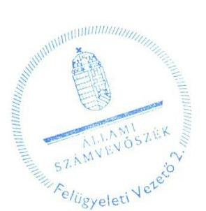

Salamon Ildikó
felügyeleti vezető

---

# RÖVIDÍTÉSEK JEGYZÉKE 

${ }^{1}$ Kormány
${ }^{2}$ 210/2010. (VI. 30.) Korm. rendelet
${ }^{3}$ KEHI
${ }^{4}$ NGM
${ }^{5}$ EUTAF
${ }^{6}$ EU
${ }^{7}$ KEF
${ }^{8}$ MNV Zrt.
${ }^{9}$ Vagyonkezelési szerződés
${ }^{10}$ Megállapodás
${ }^{11}$ főigazgató
${ }^{12}$ ÁSZ
${ }^{13}$ Áht.
${ }^{14}$ ÁSZ SZMSZ
${ }^{15}$ Irányító szerv
${ }^{16}$ Alapító okirat ${ }_{1}$
Alapító okirat ${ }_{2}$
Alapító okirat ${ }_{3}$
${ }^{17}$ SZMSZ ${ }_{1}$

SZMSZ ${ }_{2}$

SZMSZ ${ }_{3}$
${ }^{18}$ Ávr.
${ }^{19}$ Számviteli politika
${ }^{20}$ Számv. tv.

Magyarország Kormánya
az Európai Támogatásokat Auditáló Főigazgatóságról szóló 210/2010. (VI. 30.) Korm. rendelet (hatályos: 2010. június 1-től)
Kormányzati Ellenőrzési Hivatal
Nemzetgazdasági Minisztérium
Európai Támogatásokat Auditáló Főigazgatóság
Európai Unió
Központi Ellátási Főigazgatóság
Magyar Nemzeti Vagyonkezelő Zártkörűen Működő Részvénytársaság
Magyar Nemzeti Vagyonkezelő Zártkörűen Múködő
Részvénytársaság és az Európai Támogatásokat Auditáló
Főigazgatóság között 2015. márciusában a kezelt eszközökre és
szoftverekre létrejött Vagyonkezelési szerződés
Közbeszerzési és Ellátási Főigazgatóság és az Európai Támogatásokat Auditáló Főigazgatóság között 2016. február 11-én létrejött Megállapodás az ingóságok vagyonkezelői jogának központi költségvetési szervek közötti átruházásáról
Európai Támogatásokat Auditáló Főigazgatóság főigazgatója
Állami Számvevőszék
Az államháztartásról szóló 2011. évi CXCV. törvény
(hatályos: 2012. január 1-jétől)
Az Állami Számvevőszék elnökének 4/2017. (XII.29.) ÁSZ utasítása az Állami Számvevőszék Szervezeti és Múködési Szabályzatáról
Nemzetgazdasági Minisztérium
Európai Támogatásokat Auditáló Főigazgatóság Alapító okirata
(hatályos: 2012. június 16-ától 2014. február 9-éig)
Európai Támogatásokat Auditáló Főigazgatóság Alapító okirata
(hatályos: 2014. február 10-étől 2014. november 24-éig)
Európai Támogatásokat Auditáló Főigazgatóság Alapító okirat
(hatályos: 2014. november 25-étől)
25/2012. (VIII.31.) NGM utasítás az Európai Támogatásokat
Auditáló Főigazgatóság Szervezeti és Múködési Szabályzatáról,
(hatályos: 2015. február 19-ig)
3/2015. (II.20.) NGM utasítás az Európai Támogatásokat Auditáló
Főigazgatóság Szervezeti és Múködési Szabályzatáról,
(hatályos: 2015. február 20-tól 2016. július 7-ig)
3/2015. (II.20.) NGM utasítás az Európai Támogatásokat Auditáló
Főigazgatóság Szervezeti és Múködési Szabályzatáról módosítása
(hatályos: 2016. július 8-tól)
368/2011. (XII. 31.) Korm. rendelet az államháztartásról szóló
2011. évi CXCV. törvény végrehajtásáról (hatályos: 2012. január 1-től)

10/2013. számú szabályzat az Európai Támogatásokat Auditáló
Főigazgatóság Számviteli politikájáról (hatályos: 2013. december 4-től, módosítva a 7/2014. számú szabályzattal 2014. december 15-től)
2000. évi C. törvény a számvitelről (hatályos 2001. január 1-jétől)

---

${ }^{21}$ Számlarend
${ }^{22}$ Áhsz.
${ }^{23}$ Ügyrend
${ }^{24}$ Gazdálkodási szabályzat
${ }^{25}$ Ellenőrzési nyomvonal
${ }^{26} \mathrm{Bkr}$.
${ }^{27}$ Szabálytalanság kezelésének eljárásrend
${ }^{28}$ Integritásra vonatkozó eljárásrend
${ }^{29}$ Kockázatkezelési szabályzat
${ }^{30}$ Kommunikációs szabályzat
${ }^{31}$ Info tv.
${ }^{32} \mathrm{Vtv}$
${ }^{33} \mathrm{Nvtv}$.
${ }^{34} \mathrm{Vtvr}$.
${ }^{35}$ Eszközök és a források értékeléséről szóló szabályzat
${ }^{36}$ Leltározási és leltárkészítési szabályzat
az Európai Támogatásokat Auditáló Főigazgatóság Számlarend 11/2013. számú szabályzat (hatályos: 2013. december 4-től)
4/2013. (I. 11.) Korm. rendelet az államháztartás számviteléről
19/2013. számú Szabályzat az Európai Támogatásokat Auditáló Főigazgatóság gazdasági szervezetének ügyrendjéről (hatályos: 2014. január 1-jétől)
az Európai Támogatásokat Auditáló Főigazgatóság Gazdálkodási szabályairól szóló 8/2013. számú szabályzat (hatályos: 2014. január 1-jétől)
az Európai Támogatásokat Auditáló Főigazgatóság 17/2013. (12. 04.) számú szabályzata az Európai Támogatásokat Auditáló Főigazgatóság Ellenőrzési nyomvonaláról
370/2011. (XII. 31.) Korm. rendelet a költségvetési szervek belső kontrollrendszeréről és belső ellenőrzéséről
A szabálytalanságok feltárása esetén követendő Eljárásrend, Melléklet a 9/2010. számú, főigazgatói utasításhoz
A szervezet működésével összefüggő visszaélésekre, integritási és korrupciós kockázatokra vonatkozó bejelentésekkel kapcsolatos eljárás (A közérdekú adatok megismerésének és közzétételének, valamint a panaszok és közérdekú-, valamint a szervezet múködésével összefüggő visszaélésekre, integritási és korrupciós kockázatokra vonatkozó bejelentések fogadásával és kivizsgálásával kapcsolatos eljárások, továbbá az érdekérvényesítőkkel való kapcsolattartás rendjéről, V. Fejezet, hatályos 2015. január 1-jétől)
18/2013. számú szabályzat az Európai Támogatásokat Auditáló Főigazgatóság Kockázatkezelési Szabályzatról (hatályos: 2013. december 4-től)
7/2010. (VII. 15.) számú utasítás a Főigazgatóság kommunikációs tevékenységéről szóló szabályzat kiadásáról (hatályos: 2010. július 15-től) az információs önrendelkezési jogról és az információs szabadságról szóló 2011. évi CXII. törvény (hatályos: 2011. augusztus 27-étől)
2007. évi CVI. törvény az állami vagyonról
2011. évi CXCVI. törvény a nemzeti vagyonról

254/2007. (X.4.) Korm. rendelet az állami vagyonnal való gazdálkodásról
az Európai Támogatásokat Auditáló Főigazgatóság Értékelési szabályzatáról 14/2013. számú szabályzat (hatályos: 2013. december 4-től)
az Európai Támogatásokat Auditáló Főigazgatóság Leltározási szabályzatáról 16/2013. számú szabályzat (hatályos: 2013. december 4-től)

---

# ÁLLAMI SZÁMVEVŐSZÉK 

1052 Budapest, Apáczai Csere János utca 10.
Levélcím: 1364 Budapest 4. Pf. 54
Telefon: +36 14849100 Telefax: +36 14849200
www.asz.hu