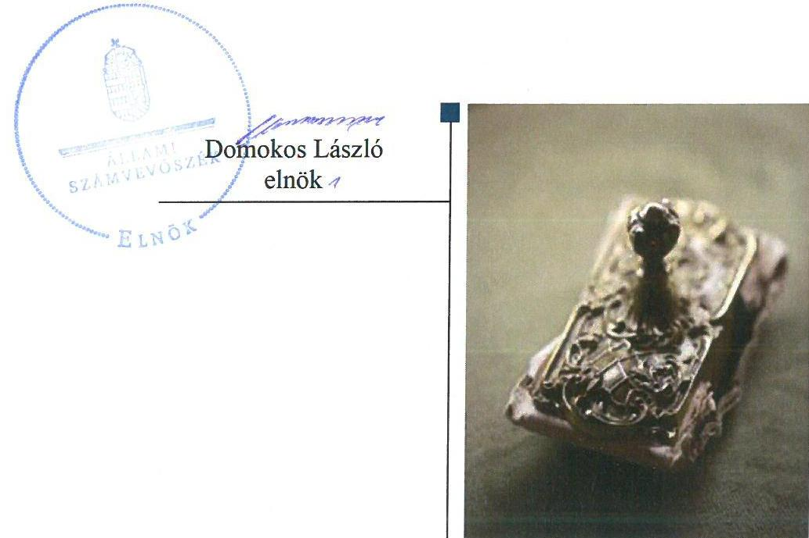
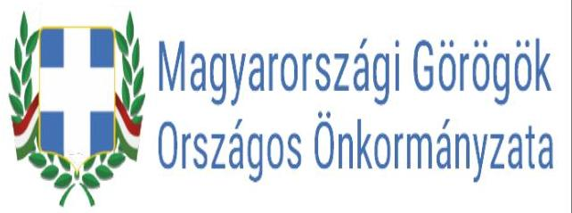
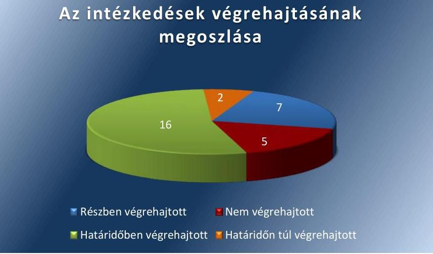
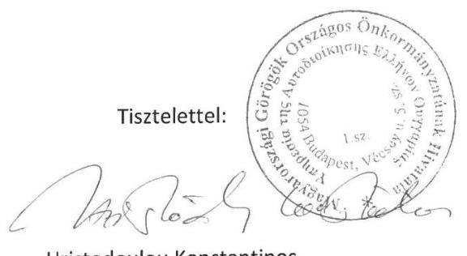
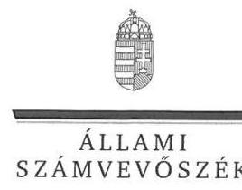
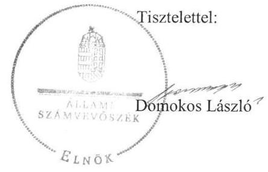
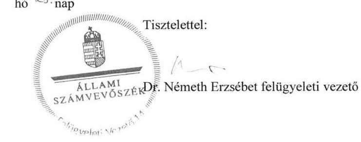

# Jelentés 

## Utóellenőrzések

Az Országos Nemzetiségi Önkormányzatok gazdálkodásának utóellenőrzése - Magyarországi Görögök Országos Önkormányzata 2018.

---

# Jelentés 

## Utóellenőrzések

Az Országos Nemzetiségi Önkormányzatok gazdálkodásának utóellenőrzése - Magyarországi Görögök Országos Önkormányzata 2018. 10. hó 25. nap

---

# AZ ELLENŐRZÉST FELÜGYELTE: 

DR. NÉMETH ERZSÉBET felügyeleti vezető

## AZ ELLENŐRZÉST VEZETTE ÉS A VÉGREHAJTÁSÁÉRT FELELŐS:

DR. JAKAB KORNÉL ellenőrzésvezető

## A PROGRAM ÖSSZEÁLLÍTÁSÁÉRT FELELŐS:

TÓTPÁL SZABOLCS osztályvezető

## A TÉMÁHOZ KAPCSOLÓDÓ KORÁBBI SZÁMVEVŐSZÉKI JELENTÉSEK:

- címe: Jelentés - Az Országos Nemzetiségi Önkormányzatok gazdálkodásának ellenőrzéséről - Magyarországi Görögök Országos Önkormányzata
- sorszáma: 15155

IKTATÓSZÁM: EL-1184-001/2018.
TÉMASZÁM: 6/2
ELLENŐRZÉS-AZONOSÍTÓ SZÁM: V080402

---

# TARTALOMJEGYZÉK 

■ ÖSSZEGZÉS ..... 5
■ AZ ELLENŐRZÉS CÉLJA ..... 6
■ AZ ELLENŐRZÉS TERÜLETE ..... 7
■ AZ ELLENŐRZÉS HÁTTERE, INDOKOLTSÁGA ..... 8
■ A JELENTÉS LÉNYEGES KÉRDÉSKÖRE ..... 10
■ AZ ELLENŐRZÉS HATÓKÖRE ÉS MÓDSZEREI ..... 11
■ MEGÁLLAPÍTÁSOK ..... 13
■ MELLÉKLETEK ..... 17
I. sz. melléklet: Az ÁSZ 15155. számú jelentéséhez kapcsolódóan a Magyarországi Görögök Országos Önkormányzata intézkedési terve végrehajtásának értékelése ..... 17
■ FÜGGELÉK: ÉSZREVÉTELEK ..... 22
■ RÖVIDÍTÉSEK JEGYZÉKE ..... 29

---

.

---

# ÖSSZEGZÉS 

Az Állami Számvevőszék a Magyarországi Görögök Országos Önkormányzata gazdálkodásának utóellenőrzése során megállapította, hogy az intézkedési tervben foglalt végrehajtott feladatok javították a müködési folyamatok szabályozottságát. A pénzügyi és vagyongazdálkodás és a belső kontrollok müködtetése terén a végre nem hajtott intézkedések miatt a közpénzzel való szabályszerű gazdálkodás nem valósult meg. A vagyongazdálkodás terén a müködési kockázatok nem csökkentek.

## Az ellenőrzés társadalmi indokoltsága

Az Állami Számvevőszék stratégiájában célul tűzte ki a számvevőszéki munka hasznosulásának javítását. Ezzel összhangban ellenőrzi, hogy az ellenőrzött szervezetek megvalósították-e a korábbi ellenőrzései által feltárt hibák, hiányosságok és szabálytalanságok megszüntetése céljából kialakított intézkedési terveikben foglaltakat. Az intézkedések végrehajtásával az adott terület szabályszerű múködése vonatkozásában a kockázatok csökkenhetnek, ugyanakkor a nem végrehajtott intézkedések következtében újabb kockázatok merülhetnek fel, amelyek kezelése kiemelten fontos. A rendszeres utóellenőrzések hozzájárulnak a szükséges intézkedések tényleges végrehajtásához, ezáltal a közpénzügyek rendezettségének javulásához, a szabálytalan közpénzfelhasználás kockázatának a csökkentéséhez.

## Főbb megállapítások, következtetések

A Magyarországi Görögök Országos Önkormányzata az Állami Számvevőszék által elfogadott intézkedési tervében meghatározott 30 feladatból tizenhatot határidőben, kettőt határidőn túl, hetet részben, ötöt nem hajtott végre.

Az intézkedési tervben foglaltaknak megfelelően kiegészült a hivatal Szervezeti és Múködési Szabályzata, elkészültek a számviteli szabályzatok, és a hiányzó belső eljárásrendek. Az Önkormányzat elvégezte a költségvetési határozattervezet egyeztetését, valamint elkészítette az éves konszolidált beszámolót. Az Önkormányzat kivizsgálta az elmaradt leltározás okait, valamint megnevezte a felelősöket.

Az intézkedési tervben meghatározott feladatok közül az Önkormányzat részben hajtotta végre az információáramlással, a kockázatkezelési rendszerrel, a vagyongazdálkodás szabályszerűségével kapcsolatos feladatokat.

Az intézkedési tervben foglaltak ellenére az Önkormányzat nem hajtotta végre a gazdálkodási jogkörök szabályszerű gyakorlásának érvényesítését, a szakszerű és hatékony múködés ellenőrzését, továbbá a zárszámadás, a költségvetési jelentéskészítés, és a vagyongazdálkodás szabályszerűségéhez, valamint a közérdekű adatok megismerésére irányuló igények teljesítésének rendjéhez kapcsolódó feladatokat. A vagyongazdálkodás terén a múködési kockázatok nem csökkentek.

---

# AZ ELLENŐRZÉS CÉLJA 

Az ellenőrzés célja annak értékelése volt, hogy a számvevőszéki jelentésben foglalt intézkedést igénylő megállapításokkal összhangban készített intézkedési tervben meghatározott feladatokat az ellenőrzött szervezet végrehajtotta-e.

---

# AZ ELLENŐRZÉS TERÜLETE 

## Magyarországi Görögök Országos Önkormányzata

Az Önkormányzat ${ }^{1}$ jogi személyiséggel rendelkező, az Njtv. ${ }^{2}$ alapján létrehozott nemzetiségi önkormányzat, amely 1995. évben alakult. Alapvető feladata a magyarországi görögök egyéni és kollektív jogainak, érdekeinek védelme és képviselete az önkormányzati feladat- és hatáskörök gyakorlásával. Az Önkormányzat közfeladatai ellátásához állami támogatást kap, valamint hazai és uniós pályázati forrásokat szerezhet. Az Önkormányzatot az Elnök ${ }^{3}$ képviseli, a jelenlegi Elnök a 2014. évi országos nemzetiségi választások óta látja el feladatát. Az Önkormányzat gazdálkodási feladatait az önállóan múködő Hivatal látja el, melynek élén a Hivatalvezető ${ }^{4}$ áll. A nemzetiségi önkormányzati feladat- és hatáskörök a közgyűlést illetik meg.

Az ÁSZ ${ }^{5}$ 2010. január 1. és 2014. június 30. közötti időszakra vonatkozóan végezte el az Önkormányzat gazdálkodása szabályszerűségének ellenőrzését és erről 2015. szeptember 17-én hozta nyilvánosságra a 15155. számú ÁSZ jelentést. Az ellenőrzés célja annak értékelése volt, hogy az Önkormányzat gazdálkodása, a belső kontrollrendszer kialakítása és múködése, az államháztartásból nyújtott támogatás, illetve az államháztartásból meghatározott célra ingyenesen juttatott vagyon felhasználása a jogszabályi előírásoknak megfelelően történt-e; az önkormányzat az Njtv.-ben előírt feladat-és hatásköröket ellátta-e; intézkedett-e az ÁSZ által a 2008-2010. évek között végzett ellenőrzések javaslatainak végrehajtásáról.

Az ÁSZ jelentés az Önkormányzat Elnöke részére kettő, a Hivatalvezető részére 20 intézkedést igénylő megállapítást fogalmazott meg. A Hivatalvezető az ÁSZ Elnökének megküldte a Közgyűlés ${ }^{6}$ által, a 26/2016. (II. 3.) számú közgyűlési határozattal elfogadott intézkedési tervet. Az intézkedési terv az Elnök részére kettő, a Hivatalvezető részére 28 intézkedési kötelezettséggel járó feladatot írt elő.

---

# AZ ELLENŐRZÉS HÁTTERE, INDOKOLTSÁGA 

Az ÁSZ tv7. 33. § (1) bekezdése értelmében a számvevőszéki jelentések intézkedést igénylő megállapításaihoz és javaslataihoz kapcsolódóan az ellenőrzött szervezet vezetője intézkedési tervet köteles összeállítani, és az Állami Számvevőszék részére megküldeni. Az ÁSZ tv. 33. § (6) bekezdése értelmében, amennyiben az ÁSZ elnöke az ellenőrzés során feltárt jogszabálysértő gyakorlat, illetve a vagyon rendeltetésellenes vagy pazarló felhasználásának megszüntetése érdekében figyelemfelhívó levéllel fordult az ellenőrzött szerv vezetőjéhez, az abban foglaltakat az ellenőrzött szerv vezetője köteles elbírálni, a megfelelő intézkedést megtenni és erről az ÁSZ elnökét értesíteni.

Az ÁSZ által befogadott intézkedési tervben foglaltak megvalósítását az ÁSZ törvény 33. § (7) be-kezdésében foglaltak alapján - az Állami Számvevőszék utóellenőrzés keretében ellenőrizheti. Az utóellenőrzések keretében - az intézkedések értékelése során - az Állami Számvevőszék figyelembe veszi az ellenőrzött szervezetek működési feltételeiben, valamint a jogszabályi előírásokban bekövetkezett változásokat. Az utóellenőrzés során az ÁSZ értékeli, hogy az érintett számvevőszéki jelentésben foglalt intézkedést igénylő megállapításokkal és javaslatokkal összhangban, az ellenőrzött szervezet által készített intézkedési tervben meghatározott feladatokat a feladatra kijelöltek végrehajtották-e.

Az intézkedések végrehajtásával az adott terület szabályszerű múködése vonatkozásában a kockázatok csökkenhetnek, azonban hosszabb távon az intézkedési tervben foglaltak végrehajtásával önmagában nem szűnnek meg, csak akkor, ha beépülnek az ellenőrzött szervezet múködésébe, azokat folyamatosan azonosítják, értékelik és kezelik, figyelembe véve, illetve kezelve a változásokat. Emellett az intézkedések végrehajtásáig újabb kockázatok merülhetnek fel a szabályszerű múködés vonatkozásában, amelyek kezelése szintén kiemelten fontos az ellenőrzött szervezet számára.

Az ellenőrzött szervezet vezetője által készített intézkedési tervekben foglalt feladatok hiányos, illetve késedelmes végrehajtása, vagy annak elmaradása a szabályszerűség és a felelős vezetői magatartás vonatkozásában kockázatot hordoz, ami azt mutatja, hogy az ellenőrzések során feltárt hibák, hiányosságok és szabálytalanságok kezelése nem kapott kellő hangsúlyt. Az utóellenőrzés során is fenn-álló szabálytalanságok esetén a közpénz, közvagyon veszélyeztetettségi kockázat valószínűsített hatásának értékelése további intézkedéseket vonhat maga után.

Az ellenőrzött szervezet szintjén az utóellenőrzés feltárja, hogy a szervezet az intézkedések végrehajtásával hasznosította-e a korábbi ellenőrzési jelentésben a hiányosságok megszüntetése, illetve a kockázatok kezelése érdekében megfogalmazott javaslatokat, illetve az intézkedések végrehajtása elmaradásának következtében továbbra is fennálló szabálytalanság esetén értékeli a közpénzek, közvagyon veszélyeztetettségét. Az ÁSZ szintjén az utóellenőrzés visszacsatolást ad az ellenőrzési jelentések hasz-

---

nosulásáról, az intézkedések elmaradásának, vagy részleges megvalósulásának a közpénzek, közvagyon veszélyeztetettségére gyakorolt valószínűsített hatásának értékelése, további intézkedéseket vonhat maga után.

---

# A JELENTÉS LÉNYEGES KÉRDÉSKÖRE 

Az Önkormányzat az intézkedési tervben foglaltakat az elöirt határidőben végrehajtotta-e?

---

# AZ ELLENŐRZÉS HATÓKÖRE ÉS MÓDSZEREI 

## Az ellenőrzés típusa

Megfelelőségi ellenőrzés.

## Az ellenőrzött időszak

Az utóellenőrzés alapját képező számvevőszéki jelentés közzétételének napjától (2015. szeptember 17.) az ellenőrzésről szóló kiértesítő levél keltének napjáig (2018. május 23.) tartó időszak.

## Az ellenőrzés tárgya

Az ÁSZ tv. 2011. július 1-jei hatálybalépését követően a számvevőszéki jelentésben foglalt intézkedést igénylő megállapításokkal és javaslatokkal összhangban - az Önkormányzat által - készített intézkedési tervben foglaltak végrehajtásának ellenőrzése volt.

## Az ellenőrzött szervezet

Magyarországi Görögök Országos Önkormányzata, Magyarországi Görögök Országos Önkormányzata Hivatala.

## Az ellenőrzés jogalapja

Az utóellenőrzés jogszabályi alapját az ÁSZ tv. 33. § (7) bekezdése képezi.

## Az ellenőrzés módszerei

Az ellenőrzést az ellenőrzött időszakban hatályos jogszabályok, az ellenőrzés szakmai szabályai, a jelen ellenőrzésre irányadó ÁSZ módszertanok, az ellenőrzési programban foglalt értékelési szempontok szerint, önállóan végezte az ÁSZ.

Az ÁSZ az ellenőrzés ideje alatt az ellenőrzött szervezettel történő kapcsolattartást az ÁSZ SZMSZ²-ének vonatkozó előírásai alapján biztosította.

Az utóellenőrzés megállapításait az ÁSZ rendelkezésére álló dokumentumok, valamint az ÁSZ adatbekérése szerint, az ellenőrzött szervezetek által rendelkezésre bocsátott dokumentumok, adatok alapján fogalmazta meg, amely kiegészült az ellenőrzött szervezet székhelyén történő adatbetekintéssel.

---

Az ellenőrzési kérdések megválaszolásához szükséges bizonyítékok megszerzése az ellenőrzött által rendelkezésre bocsátott dokumentumokra, adatokra alapozva megfigyelés, szemle (szemrevételezés), kérdésfeltevés (információkérés), alkalmazásával történt. Az ellenőrzési bizonyítékként felhasználható adatforrások közé tartoztak egyrészt az ellenőrzési program részletes szempontjainál felsorolt adatforrások, másrészt minden - az ellenőrzés folyamán feltárt, az ellenőrzés szempontjából információt tartalmazó - dokumentum.

Az intézkedési tervekben előírt feladatokat azok végrehajthatósága, illetve végrehajtása szempontjából az alábbiak szerint értékelte az ÁSZ:
$\longrightarrow$ „határidőben végrehajtott" a feladat, ha a teljesítés dokumentáltan, az intézkedési tervben előírt határidőben és tartalommal megtörtént;
$\longrightarrow$ „határidőn túl végrehajtott" a feladat, ha annak teljesítése az intézkedési tervben meghatározott módon, de az abban előírt határidőn túl történt meg;
$\longrightarrow$ „részben végrehajtott" a feladat, ha annak végrehajtása nem teljes körűen az intézkedési tervben előírt módon történt meg;
$\longrightarrow$ „nem végrehajtott" a feladat, ha a végrehajtás nem történt meg, dokumentumokkal nem igazolt annak teljesítése;
$\longrightarrow$ „okafogyottá vált" a feladat, ha végrehajtására - meghatározott esemény bekövetkezése, továbbá külső körülmény, a működést érintő feltétel változása miatt - már nincs szükség, illetve lehetőség, és egyértelműen megállapítható, hogy az intézkedést szükségessé tevő körülmény a jövőben nem fordulhat elő;
$\longrightarrow$ „nem időszerü" az a feladat, amelynek ellenőrzési időszakon belüli végrehajtására azért nem került (kerülhetett) sor, mert az intézkedés alapjául szolgáló esemény nem következett be, de annak jövőbeni előfordulása lehetséges, a végrehajtása nem volt esedékes, vagy a végrehajtás határideje még nem járt le.
Az ellenőrzés lefolytatásához az ellenőrzött szervezet a tanúsítványok elektronikus kitöltésével, valamint az ÁSZ által kért dokumentumok elektronikus megküldésével szolgáltatott adatokat, amelyek valódiságát és teljes körűségét az ellenőrzött szervezet vezetője által tett teljességi és hitelességi nyilatkozat igazolta. Az így rendelkezésre bocsátott adatok, információk kontrollja az ellenőrzés keretében történt.

---

# MEGÁLLAPÍTÁSOK 

## Az Önkormányzat az intézkedési tervben foglaltakat az előírt határidőben végrehajtotta-e?

Összegző megállapítás

Az Önkormányzat az intézkedési tervében meghatározott 30 feladat közül tizenhatot határidőben, kettőt határidőn túl, hetet részben és ötöt nem hajtott végre. Az intézkedési tervben meghatározott feladatok végrehajtásáról nem vezették az előírásoknak megfelelően a nyilvántartást.

Az Önkormányzat az általa elkészített, és az ÁSZ által elfogadott intézkedési tervben meghatározott feladatok közül tizenhatot határidőben, kettőt határidőn túl, hetet részben és ötöt nem hajtott végre.

A feladatokat, határidőket, megjelölt felelősöket és a feladatok végrehajtását az I. sz. melléklet mutatja be.

A Hivatalvezető nem gondoskodott az intézkedési tervben meghatározott feladatok végrehajtásának Bkr. ${ }^{9}$ 14. § (1) bekezdés előírása szerinti nyilvántartásáról.

AZ ÖNKORMÁNYZAT ÁLTAL az intézkedési tervében vállalt feladatok végrehajtását az 1. ábra szemlélteti.
1. ábra

## Az intézkedések végrehajtásának megoszlása

A MÜKÖDÉSI ÉS A GAZDÁLKODÁSI FOLYAMATOK szabályozottsága az Önkormányzatnál javult. Az Önkormányzat Közgyűlése módosította az Önkormányzat Hivatala SZMSZ ${ }^{10}$-ét, amely így a jogszabály előírásának megfelelően tartalmazta a szervezeti ábrát, és az Önkormányzat Hivatala alá rendelt más költségvetési szervek ${ }^{11}$ felsorolását.

---

A Hivatalvezető elkészítette a Leltározási szabályzatot ${ }^{12}$, az Értékelési szabályzatot ${ }^{13}$ a Pénzkezelési szabályzatot ${ }^{14}$, Számlarendet ${ }^{15}$, a Bizonylati rendet ${ }^{16}$, és Önköltség-számítási szabályzatot ${ }^{17}$.

A gazdálkodási és munkaügyi feladatok munkamegosztásának, és a felelősségvállalás rendjére vonatkozóan az Önkormányzat Hivatala Munkamegosztási Megállapodást ${ }^{18}$ kötött az Önkormányzat Hivatala alá tartozó költségvetési szervekkel.

Az Önkormányzat Hivatalának Ügyrendje ${ }_{1-2}{ }^{19}$ a jogszabály előírásainak megfelelően tartalmazta az előzetes írásbeli kötelezettségvállaláshoz nem kötött 100 ezer Ft alatti kifizetések eljárásrendjét, valamint a gazdálkodási jogkörök gyakorlására jogosult személyekről és aláírás-mintájukról vezetett nyilvántartást.

A Hivatalvezető elkészítette az Önkormányzat Hivatalának Kockázatkezelési szabályzatát ${ }^{20}$, valamint a Szabálytalanságok kezelésének eljárásrendjét ${ }^{21}$. A kontrolltevékenységeket az Ügyrend ${ }_{1-2}$-ben, és a Munkamegosztási Megállapodás ${ }_{1-2}$-ban is rögzítették.

A Hivatalvezető által elkészített Adatvédelmi szabályzatban, és az Iratkezelési szabályzatban rendelkeztek a dokumentumokhoz, információkhoz való hozzáféréssel kapcsolatos jogosultságokról, felelősségi körökről. Az Adatvédelmi szabályzatban rögzítették a kötelezően közzéteendő adatok nyilvánosságra hozatalának rendjét, azonban a közérdekú adatok megismerésére irányuló igények teljesítésének rendjét az Ávr. ${ }^{22}$ rendelkezésének ellenére nem szabályozták.

A Hivatalvezető elkészítette a Közbeszerzési Szabályzatot, de az Ávr. előírásával ellentétben nem szabályozta a beszerzések lebonyolításával kapcsolatos eljárásrendet.

# A SZABÁLYSZERŰ PÉNZÜGYI GAZDÁLKODÁST 

támogató tervezett intézkedéseket részben hajtották végre az Önkormányzatnál és a Hivatalnál. A Hivatalvezető az éves költségvetési határozattervezet költségvetési szervek vezetőivel való egyeztetési és írásba foglalási kötelezettségének a jogszabály előírásainak megfelelően eleget tett.

Az Önkormányzat 2015. évi összevont konszolidált beszámolóját a jogszabályban előírtaknak megfelelően elkészítették.

Az Önkormányzat éves zárszámadás előterjesztései nem feleltek meg az Áht.-ben foglalt előírásoknak. A Hivatalvezető az időközi költségvetési jelentéskészítési kötelezettségének, továbbá az időközi mérlegjelentés készítési kötelezettségének az Ávr.-ben meghatározott határidőben nem tett eleget. Az Ávr. vonatkozó előírásait megsértve, nem szabályszerűen gyakorolták a gazdálkodási jogköröket, az érvényesítő kijelölése nem szabályszerűen történt.

A VAGYONGAZDÁLKODÁS terén a múködési kockázatok nem csökkentek. A vagyon használatának, hasznosításának szabályait az elfogadott vagyongazdálkodási szabályzatban rögzítették, de a Hivatalvezető az Njtv. vonatkozó rendelkezését megsértve, nem készítette el és nem terjesztette a Közgyűlés elé az Önkormányzat vagyonleltárát, a törzsvagyona körének meghatározását.

---

Az Önkormányzat 2015. évi mérlegében szereplő eszközök és források mérlegtételeit 2015. december 31-i fordulónappal leltárral alátámasztották, de a leltár dokumentumok nem tartalmazták tételesen és utólag ellenőrizhető módon a befektetett eszközök állományát, mellyel megsértették a Számv. tv. ${ }^{23}$ rendelkezéseit.

A Hivatalvezető az üzembe helyezéseket nem dokumentálta, nem készített állományba vételi bizonylatokat és a beruházásokhoz aktiválási jegyzőkönyveket, mellyel megsértette a Számv. tv. vonatkozó rendelkezéseit.

A Közgyűlés által alakított ad hoc bizottság kivizsgálta a leltározás elmaradásának okait. A Közgyűlés által jóváhagyott jelentés megállapította a gazdasági vezető, és a könyvvizsgáló felelősségét a leltározás elmaradásával kapcsolatban.

AZ INTEGRITÁS szemlélet érvényesítése során az Önkormányzat átláthatóságának biztosítása érdekében a Hivatalvezető és az Önkormányzat eleget tett a vonatkozó jogszabály előírásainak, az Önkormányzat honlapján közzétette az általános közzétételi listában előírt adatokat, és a kapott céljellegú támogatásokat.

# A BELSŐ KONTROLLOK ÉS A BELSŐ ELLENŐR- 

ZÉS nem működött az ellenőrzött időszakban a jogszabályoknak megfelelően. A Hivatalvezető a Bkr. előírását megsértve nem alakította ki a Hivatal tevékenységének, a célok megvalósításának nyomon követését biztosító rendszert. A Hivatalvezető nem működtetett kockázatkezelési rendszert, a meghatározott egyes kockázatokkal kapcsolatos szükséges intézkedések teljesítésének folyamatos nyomon követését nem végezte.

A 2015. és a 2016. években lefolytatott ellenőrzésekről vezetett nyilvántartás a Bkr. előírásai ellenére nem tartalmazta az ellenőrzési jelentésben szereplő javaslatokat.

A Hivatalvezető elkészítette az Önkormányzat Hivatala Ellenőrzési nyomvonalát ${ }^{24}$, és a jogszabályi előírásnak megfelelően jóváhagyta a Belső ellenőrzési kézikönyvet ${ }^{25}$.

---

.

---

# MELLÉKLETEK

- I. SZ. MELLÉKLET: AZ ÁSZ 15155. SZÁMÚ JELENTÉSÉHEZ KAPCSOLÓDÓAN A MAGYARORSZÁGI GÖRÖGÖK ORSZÁGOS ÖNKORMÁNYZATA INTÉZKEDÉSI TERVE VÉGREHAJTÁSÁNAK ÉRTÉKELÉSE

|  1. | Intézkedési terv alapján elvégzendő feladat | Az intézkedési tervben meghatározott határidő | Az intézkedési tervben meghatározott felelős | Az intézkedési tervben meghatározott feladat végrehajtása  |
| --- | --- | --- | --- | --- |
|   | 1. | 2. | 3. | 4.  |
|  Határidőben végrehajtott feladatok |  |  |  |   |
|  1. | MGOÓ hivatala SZMSZ-ének kiegészítése. | 2015.12.31. | Hivatalvezető | Az Önkormányzat Hivatala SZMSZ-ének kiegészítése 2015. november 10-én elkészült, melyet a Közgyűlés a 195/2015 (XII.16.) számú határozatával határidőben hatályba helyeztek.  |
|  2. | Számlarend elkészítése. | 2015.12.31. | Hivatalvezető | A Számlarendet a Hivatalvezető elkészítette, a Közgyűlés a 195/2015 (XII.16.) számú határozatával 2015. december 17-én határidőben hatályba helyeztek.  |
|  3. | Bizonylati rend elkészítése. | 2015.12.31. | Hivatalvezető | A Hivatalvezető a Bizonylati rendet elkészítette, a Közgyűlés 195/2015 (XII.16.) számú határozatával 2015. december 17-én határidőben hatályba helyezték a Bizonylati rendet.  |
|  4. | Önköltség-számítási szabályzat elkészítése. | 2016.03.31. | Hivatalvezető | A Hivatalvezető elkészítette az Önköltség-számítási szabályzatot, melyet a Közgyűlés 30/2016 (II.03.) számú határozatával határidőben hatályba helyeztek.  |
|  5. | Szabálytalanságok kezelése eljárásrendjének elkészítése. | 2016.03.31. | Hivatalvezető | A Hivatalvezető elkészítette a Szabálytalanságok kezelésének eljárásrendjét, melyet a Közgyűlés 31/2016. (II. 03.) számú határozata alapján az intézkedési tervben vállalt határidőben hatályba helyeztek.  |
|  6. | Az Önkormányzat által alapított önállóan működő intézmények és a Hivatal közötti munkamegosztás és felelősségvállalás rendjét szabályozó megállapodás elkészítése. | 2015.10.15. | Hivatalvezető | A gazdálkodási és munkaügyi feladatok munkamegosztásának rendjére vonatkozóan az Önkormányzat Hivatala az Önkormányzat gazdálkodása szabályszerűségének ellenőrzését követően (15155. számú ÁSZ jelentés), 2015. február 3-án Munkamegosztási Megállapodást kötött az Önkormányzat Hivatala alá tartozó költségvetési szervekkel. A Munkamegosztási Megállapodásokat a MGOÓ közgyűlési határozatokkal hagyta jóvá. A Munkamegosztási Megállapodások tartalmazták a költségvetés tervezésével, az előirányzatok módosításával, átcsoportosításával, felhasználásával, az adatszolgáltatással, a pénzügyi, számviteli rend betartásával, a vagyon használatával, védelmével kapcsolatos feladatok megosztását  |

---

|  1. | Intézkedési terv alapján elvégzendő feladat | Az intézkedési tervben meghatározott határidő | Az intézkedési tervben meghatározott felelős | Az intézkedési tervben meghatározott feladat végrehajtása  |
| --- | --- | --- | --- | --- |
|  2. | 1. | 2. | 3. | 4.  |
|  7. | A Gazdasági szervezet ügyrendje1-2, a gazdálkodási jogkörök gyakorlására jogosult személyekről vezetett nyilvántartás jogszabályoknak megfelelő kiegészítése, valamint az előzetes írásbeli kötelezettségvállaláshoz nem kötött 100 ezer Ft alatti kifizetések eljárásrendjének meghatározása. | 2015.10.15. | Hivatalvezető | Az Önkormányzat Hivatala az Önkormányzat gazdálkodása szabályszerűségének ellenőrzését követően (15155. számú ÁSZ jelentés), elkészítette a gazdasági szervezet ügyrendjeit1-2, mely tartalmazta a gazdálkodással kapcsolatos feladatok munkafolyamatainak leírását, a gazdasági szervezet vezetőinek feladat- és hatáskörét, a gazdasági szervezet alkalmazottainak feladat- és hatáskörét, a helyettesítés rendjét, továbbá az előzetes írásbeli kötelezettségvállaláshoz nem kötött 100 ezer Ft alatti kifizetések eljárásrendjét. Az ügyrendek1-2 melléklete tartalmazta a gazdálkodási jogkörök gyakorlására jogosult személyekről és aláírás-mintájukról vezetett nyilvántartást.  |
|  8. | A dokumentumokhoz és információkhoz való hozzáféréssel és a beszámolási eljárásokkal kapcsolatos felelősségi körök meghatározása. | 2016.01.31. | Hivatalvezető | A Hivatalvezető által elkészített, és a Közgyűlés által határidőben hatályba helyezett Iratkezelési szabályzatban, valamint az Adatvédelmi szabályzatban rendelkeztek a dokumentumokhoz, információkhoz való hozzáféréssel kapcsolatos jogosultságokról, felelősségi körökről.  |
|  9. | A Hivatal adatvédelmi és adatbiztonsági szabályzatának elkészítése. | 2015.12.31. | Hivatalvezető | A Hivatalvezető határidőben elkészítette az Adatvédelmi szabályzatot, melyet a Közgyűlés a 203/2015. (XII. 16.) számú határozatával elfogadott.  |
|  10. | Az általános közzétételi listában előírt adatok, valamint az Önkormányzat által kapott céljellegű támogatások honlapon történő közzététele. | 2015.10.15. | Hivatalvezető | A Hivatalvezető és az Önkormányzat közzétette az általános közzétételi listában előírt adatokat, és a kapott céljellegű támogatásokat.  |
|  11. | Az Iratkezelési szabályzat elkészítése, az iratok megőrzésének biztosítása, az ügyintézési folyamatok nyomon követése, az adatok védelme. | 2016.03.31. | Hivatalvezető | Az Önkormányzat Hivatala az Iratkezelési szabályzatot a 29/2016. (II. 3.) Közgyűlési határozattal hatályba helyezte. Az Iratkezelési szabályzatban rögzítették a beérkező iratok, dokumentumok iktatási, és az irattározás rendjét, szabályozták az ügyintézési folyamatok nyomon követését és az adatok védelmét. Az adatok védelme érdekében a Hivatalvezető határidőben elkészítette az Adatvédelmi szabályzatot.  |
|  12. | A Belső Ellenőrzési Kézikönyv hivatalvezető általi jóváhagyása | Az ellenőrzési időszakot követően a Belső Ellenőrzési Kézikönyv hivatalvezető általi jóváhagyása megvalósult. | Hivatalvezető | A belső ellenőrzés működtetéséhez a Hivatal rendelkezett a Hivatalvezető által jóváhagyott belső ellenőrzési kézikönyvvel.  |
|  13. | A költségvetési tervezés és az éves költségvetési határozat-tervezet költségvetési szervek vezetőivel történő egyeztetése és eredményének írásba foglalása | 2016.02.10. (A költségvetés készítése során folyamatosan) | Hivatalvezető | A Hivatalvezető az éves költségvetési határozattervezet költségvetési szervek vezetőivel való egyeztetési és írásba foglalási kötelezettségének az intézkedési tervben előírt határidőben eleget tett.  |

---

|  1. | Intézkedési terv alapján elvégzendő feladat | Az intézkedési tervben meghatározott határidő | Az intézkedési tervben meghatározott felelős | Az intézkedési tervben meghatározott feladat végrehajtása  |
| --- | --- | --- | --- | --- |
|  1. |  | 2. | 3. | 4.  |
|  14. | Az összevont (konszolidált) egyszerűsített éves költségvetési beszámoló elkészítése. | 2016.04.30. | Hivatalvezető | Az Önkormányzat 2015. évi összevont konszolidált beszámolóját az az intézkedési tervben előírt határidőben elkészítették.  |
|  15. | Az elnök gondoskodjon, hogy a 2010., 2012. és a 2013. költségvetési évben, mire vezethető vissza, hogy nem támasztották alá leltárral a könyvviteli mérleg megfelelő sorait. A vizsgálat során tisztázza az elkövetett hiányosságokkal kapcsolatos felelősségeket, szükség szerint nevesítse azokat és gondoskodjon az esetleges felelősség érvényesítéséről. | 2016.03.31. | Elnök | A Közgyűlés 27/2016. (II. 03.) számú határozatával 3 fős ad hoc bizottságot alakított az intézkedési tervben foglaltak kivizsgálására, a felelősség érvényesítésére. Az ad hoc bizottság jelentése alapján megállapították a gazdasági vezető, és a könyvvizsgáló felelősségét. Továbbá a Közgyűlés és az Elnök közvetett felelősségét is megállapította azáltal, hogy nem rendelkezett a Hivatal feladatairól, nem ismerte meg a belső ellenőrzés jelentéseit, nem ellenőrizte annak végrehajtását. A Közgyűlés a jelentés megállapításait a 89/2016.(IV.26.) számú határozatával elfogadta. Az érintett gazdasági vezető és a könyvvizsgáló az ad hoc bizottság jelentése készítésekor már nem állt az Önkormányzat alkalmazásában, ezért a Közgyűlés 90/2016.(IV.26.) számú határozata alapján az egyéni felelősség megállapításától elállt.  |
|  16. | Az elnök biztosítsa az Önkormányzat véleménynyilvánítási, egyetértési és közreműködési jogának szabályszerű ellátása érdekében azt, hogy a feladatellátással összefüggő hatáskört - beszámolási kötelezettség előírásával - Közgyűlési felhatalmazás alapján lássa el. | 2015.12.15. | Elnök | A Közgyűlés a 206/2015. (XII. 16.) számú határozatával a szükséges felhatalmazást az Elnök részére megadta.  |
|  17. | Határidőn túl végrehajtott feladatok |  |  |   |
|  18. | Ellenőrzési nyomvonal készítése. | 2016.03.31. | Hivatalvezető | A Hivatalvezető a Bkr. 6. § (3) bekezdés előírásainak megfelelően elkészítette az Önkormányzat Hivatala Ellenőrzési nyomvonalát, azonban annak hatálybalépésére és alkalmazására az intézkedési tervben vállalt határidőn túl került sor.  |
|  19. | Számviteli szabályzatok aktualizálásának elkészítése. | 2016.03.31. | Hivatalvezető | A Hivatalvezető a Leltározási szabályzatot és az Értékelési szabályzatot határidőn túl, míg a Pénzkezelési szabályzatot, valamint az Önköltség-számítási szabályzatot határidőben készítette el.  |
|  19. | A kötelezően közzéteendő adatok nyilvánosságra hozatalának, és megismerésére irányuló igények teljesítési rendjének kialakítása. | 2015.12.31. | Hivatalvezető | A Hivatalvezető elkészítette, az Önkormányzat Közgyűlése a 203/2015. (XII. 16.) számú határozatával hatályba helyezte az Adatvédelmi szabályzatot, melyben rögzítették a kötelezően közzéteendő adatok nyilvánosságra hozatalának rendjét, azonban a közérdekű adatok megismerésére irányuló igények teljesítésének rendjét az Ávr. 13. § (2) bekezdés h) pont előírása ellenére nem szabályozták.  |

---

|  1. | 2. | 3. | 4.  |
| --- | --- | --- | --- |
|  20. | Az Önkormányzaton, illetve a Hivatalon belül olyan kontrolltevékenységeket kell kialakítani, amely biztosítja a kockázatok kezelését. A kontrolltevékenység belső szabályozására el kell készíteni a kockázatkezelési szabályzatot, valamint a kontrolltevékenységeket a belső szabályzatokban és ügyrendekben is meg kell jeleníteni. A Hivatal kockázatkezelési rendszerét az azonosított kockázatokra alapulóan alakítsa ki és működtesse. | 2016.05.31. | Hivatalvezető | A Hivatalvezető határidőben elkészítette az Önkormányzat Hivatalának Kockázatkezelési szabályzatát. A kontrolltevékenységeket az ügyrends,-ben, és a Munkamegosztási Megállapodásokban is rögzítették. A Hivatalvezető a Bkr. 7. § (1)-(2) bekezdéseiben előírtak ellenére kockázatkezelési rendszert nem müködtetett, a meghatározott egyes kockázatokkal kapcsolatos szükséges intézkedések teljesítésének folyamatos nyomon követését nem végezte.  |
|  21. | A Belső ellenőrzési jelentésekben tett megállapítások kezelésére, a jogszabályokban előírt határidőn belül, kötelező intézkedési terv készítése felelős és határidő megjelölésével. | folyamatos | Hivatalvezető | A 2015. évben végzett 5, és a 2016. évben lefolytatott 4 ellenőrzésről felelős és határidő megjelölésével a Hivatalvezető intézkedési tervet készített, de két kivétellel a Bkr. 45. § (3) bekezdésében előírt 8 napon túl.  |
|  22. | Az intézkedési tervekben megfogalmazott szükséges intézkedések végrehajtásairól szóló nyilvántartás naprakész vezetése, a Hivatal által működtetett monitoring rendszer részeként. A nyilvántartás éves bontásban tartalmazza a belső ellenőrzési jelentésekben tett megállapításokat, javaslatokat, a vonatkozó intézkedéseket és azok végrehajtásának nyomon követését. | folyamatos | Hivatalvezető | A 2015. és a 2016. években lefolytatott ellenőrzésekről nyilvántartást vezettek, de a nyilvántartás a Bkr. 47. § (2) bekezdésében foglaltak ellenére nem tartalmazza az ellenőrzési jelentésben szereplő javaslatokat.  |
|  23. | A törzsvagyonba tartozó vagyonelemek körének, a vagyon használatának és hasznosítás szabályainak meghatározása, vagyonleltári jogszabályok előírásainak megfelelő elkészítése és Közgyűlés elé terjesztése. | 2016.04.30. | Hivatalvezető | A vagyon használatának, hasznosításának szabályait az intézkedési tervben előírt határidőn túl a 158/2016. (X. 26.) számú határozattal elfogadott vagyongazdálkodási szabályzatban rögzítették. A Hivatalvezető nem intézkedett az Önkormányzat a törzsvagyona körének meghatározása, valamint a vagyonleltárának elkészítése érdekében, így az Önkormányzat megsértette az Njtv. 113.§ c) pontjában foglaltakat.  |
|  24. | Az eszközök és források állományát, tételesen és utólag ellenőrizhető módon tartalmazó mérlegtételek alátámasztására szolgáló leltár elkészíttetése. | 2015.12.31-i fordulónappal, 2016.04.30. | Hivatalvezető | Az Önkormányzat 2015. évi mérlegében szereplő eszközök és források mérlegtételeit 2015. december 31-i fordulónappal leltárral alátámasztották, de a leltár dokumentumok a Számv. tv. 69. § (1) bekezdésében és az Áhsz. ${ }^{26}$ 22. § (1) bekezdésében foglaltakat megsértve nem tartalmazták tételesen és utólag ellenőrizhető módon a befektetett eszközök állományát.  |

---

|  24. | Intézkedési terv alapján elvégzendő feladat | Az intézkedési tervben meghatározott határidő | Az intézkedési tervben meghatározott felelős | Az intézkedési tervben meghatározott feladat végrehajtása  |
| --- | --- | --- | --- | --- |
|  25. | Önkormányzat és intézményei vonatkozásában, a kapcsolódó jogszabályi környezettel teljes mértékben, összhangban lévő Beszerzési Szabályzat és Közbeszerzési Szabályzat készül annak érdekében, hogy a jövőben mind az ún. értékhatár alatti beszerzések, mind a közbeszerzések a jogszabályi előírások maradéktalan betartásával kerüljenek lefolytatásra. | 2016.02.28. | Hivatalvezető | A Közbeszerzési Szabályzatot határidőben elkészítették, amelyet a Közgyűlés a 34/2016. (II. 3.) számú határozattal elfogadott, de a Hivatalvezető az intézkedési tervben előírtak ellenére, megsértve az Ávr. 13. § (2) bekezdés b) pontjának előírásait nem szabályozta a beszerzések lebonyolításával kapcsolatos eljárásrendet.  |
|  26. | A kontrolltevékenységek és gazdálkodási jogkörök szabályszerű gyakorlásának kialakítása és gyakorlati érvényesítése. | 2016.03.31. | Hivatalvezető | A Hivatalvezető elkészítette, a Közgyűlés a 156/2016. (X. 26.) számú határozatával, határidőn túl jóváhagyta az ügyrend;-t, melyben rögzítették a gazdálkodással - így különösen a kötelezettségvállalás, ellenjegyzés, teljesítés igazolása, érvényesítés, utalványozás gyakorlásának módjával, eljárási és dokumentációs részletszabályaival, valamint az ezeket végző személyek kijelölésének rendjével - kapcsolatos belső előírásokat, feltételeket. Az érvényesítési feladatra az Ávr. 55. § (2) bekezdése a) pontjában és az 58 § (4) bekezdésében foglaltakat megsértve a Gazdasági vezető helyett a Hivatalvezető jelölte ki az érvényesítőt az ügyrend;-ben.  |
|  27. | A Hivatal tevékenységének, a célok megvalósításának nyomon követését biztosító rendszer kialakítása. | 2015.12.31. | Hivatalvezető | A Hivatalvezető a Bkr. 3. § e) pontjában, és a 10. §-ában előírtakat megsértve nem alakította ki a Hivatal tevékenységének, a célok megvalósításának nyomon követését biztosító rendszert.  |
|  28. | Az Önkormányzati éves zárszámadás előterjesztésének megfeleltetése a jogszabályi előírásoknak. | 2016.04.30. | Hivatalvezető | Az Önkormányzat éves zárszámadás előterjesztései nem feleltek meg az Áht. ${ }^{27}$ 91. § (2) bekezdésében foglalt előírásoknak.  |
|  29. | A költségvetés jelentéskészítési és a mérlegjelentési kötelezettség határidőben történő teljesítése. | költségvetési jelentésnél minden hónapot követő hó 15-ig. mérlegjelentésnél minden negyedévet követő hó 15ig. | Hivatalvezető | A Hivatalvezető az Ávr. 169. § (1) és (3) bekezdéseiben előírt időközi költségvetési jelentéskészítési kötelezettségének, továbbá az Ávr. 170. § (1)-(2) bekezdésében előírt időközi mérlegjelentés készítési kötelezettségének határidőben nem tett eleget.  |
|  30. | Az állományba vételi bizonylatok és a beruházásokhoz aktiválási jegyzőkönyvek elkészítése és megőrzése. | használatbavételt követően azonnal | Hivatalvezető | A Hivatalvezető a Számv. tv. 52. § (2) bekezdésében foglaltakat megsértve az üzembe helyezéseket nem dokumentálta, nem készített állományba vételi bizonylatokat és a beruházásokhoz aktiválási jegyzőkönyveket.  |

---

# FÜGGELÉK: ÉSZREVÉTELEK 

A jelentéstervezetet a Számvevőszék 15 napos észrevételezésre megküldte az ellenőrzött szervezet vezetőjének az ÁSZ tv. 29. §* (1) bekezdése előírásának megfelelően.
A Magyarországi Görögök Országos Önkormányzata Hivatalának hivatalvezetője a jelentéstervezet megállapításaira észrevételt tett. A függelék tartalmazza az ellenőrzöttek észrevételeit, illetve az el nem fogadott észrevételek elutasításának indoklását

* 29. § (1) Az Állami Számvevőszék az ellenőrzési megállapításait megküldi az ellenőrzött szervezet vezetőjének vagy az általa megbízott személynek, és annak, akinek személyes felelősségét állapította meg.
(2) Az ellenőrzött szervezet vezetője és a felelősként megjelölt személy az ellenőrzés megállapításaira tizenöt napon belül írásban észrevételt tehet.
(3) Az Állami Számvevőszék az észrevételre a beérkezésétől számított harminc napon belül írásban válaszol. A figyelembe nem vett észrevételeket köteles a jelentésben feltüntetni, és megindokolni, hogy azokat miért nem fogadta el.

---

AYTO\&IOIKHZH EAAHHON OYГГAPIAZ
MAGYARORSZÁGI GÖRÖGÖK ORSZÁGOS ÖNKORMÁNYZATA

1054 Budapest, Vécsey u. 5.

Domokos László Elnök Úr!
Állami Számvevőszék
1052 Budapest, Apáczai Csere János u. 10

Tárgy: Hivatalvezetői észrevétel a jelentéstervezet megállapításaihoz

## Tisztelt Elnök úr!

Az Állami Számvevőszék 2018. augusztus 24-i keltezésű jelentéstervezetének (iktatószám: EL-0609-020/2018) megállapításaihoz, a Magyarországi Görögök Országos Önkormányzatának Hivatala az alábbiakban kíván észrevételt tenni.

A Magyarországi Görögök Országos Önkormányzatának ellenőrzése során 2018. augusztus 30-án kézhez kapott dokumentumban „Utóellenőrzések címmel" az Állami Számvevőszék megállapította, hogy a Hivatal által készített „intézkedési tervben foglalt végrehajtott feladatok javították a müködési folyamatok szabályozottságát."

Ugyanakkor hozzátette, hogy „a pénzügyi és vagyongazdálkodási és a belső kontrollok müködtetése terén a végre nem hajtott intézkedések miatt a közpénzzel való szabályszerű gazdálkodás nem valósult meg. A vagyongazdálkodás terén a müködési kockázatok nem csökkentek."

Ez utóbbi megállapításhoz szeretnék hozzáfűzni néhány megjegyzést.
Részben végrehajtott feladatok témaköre:

- 19. pontjának második mondatrészéhez „a közérdekü adatok megismerésére irányuló igények teljesítésének rendjét az Ávr. 13. § (2) bekezdés h) pont elöírásai ellenére nem szabályozták." kapcsolódóan a Hivatal az Adatvédelmi Szabályzat III. 20., valamint IV. pont 23., 24., és 25. pontjaiban szabályozza a közérdekú adatok megismerésének rendjét.

---

# AYTOAIOIKHEH EAAHNGN OYГГAPIAE   MAGYARORSZÁGI GÖRÖGÖK ORSZÁGOS ÖNKORMÁNYZATA 

- A feladatcsoport 22. pontja szerint a „nyilvántartás nem tartalmazta az ellenőrzésben szereplő javaslatokat."
A Hivatal az általa készített, a belső ellenőrzési jelentések intézkedéseihez tartozó végrehajtások nyilvántartásának 2. oszlopában tüntette fel a belső ellenőrzések megállapításait, javaslatait.
- A Számvevőszék megállapítása a 23-as pontra vonatkozólag a törzsvagyon körének meghatározása és a vagyonleltár elkészitésének hiányát vetette fel. A 2015-ös év előtt alapított intézményeknél a törzsvagyon a 2013-2014. évi rendező mérleggel meghatározásra került, azonban a 2015-ös év után alapított intézmények esetében a Közgyűlés valóban nem határozta meg törzsvagyont.
- A 24. pontban leírtakkal kapcsolatban tájékozatom, hogy a 2015. évi mérlegben az eszközök és források tekintetében a leltár tételesen és utólag ellenőrizhető módon tartalmazta a befektetett eszközök állományát. Az analitikus nyilvántartások és ehhez kapcsolódó dokumentumok a gazdasági osztály irattárában őrződnek.
- 25-ös pontban megfogalmazottakkal kapcsolatban megjegyzem, hogy a Közbeszerzési Szabályzat volt az egyedüli szabályzat, melyet nem a Hivatal készített. Az Elnök Úr megbízásából egy Közbeszerzési szakértő végezte el a feladatot. A Belső Ellenőrzés kritikákat fogalmazott meg a szabályzattal kapcsolatban, melyet a 2017. évi 1. számú jelentésében leírt. Ezt követően a Hivatalvezető elkészítette és beterjesztette a Közbeszerzési és beszerzési Szabályzatot, melynek tárgyalását a közgyűlés - a hivatalvezető ellenállása ellenére - a következő évre halasztotta!

## Nem végrehajtott feladatok témaköre:

- A 28. pont szerint „az önkormányzat éves zárszámadás előterjesztései nem feleltek meg az Áht. 91.§ (2) bekezdésben foglalt előirásoknak" vonatkozásában szeretném megjegyezni, hogy az Önkormányzat éves zárszámadás előterjesztései - a Magyarországi Görögök Országos Önkormányzatának Hivatalában található dokumentumok alapján - az Áht. 91.§ (2) bekezdésben foglaltak szerint lettek végrehajtva.

29. pont tekintetében, a „mérlegjelentés-tételi kötelezettség határidőben történő teljesítése" kapcsán a hivatal, valamint a gazdasági osztály legtöbbször határidőben készítette el a mérlegjelentési kötelezettségét, esetenként azonban előfordult, hogy a határidő lejárta után küldte el azokat. Természetesen a mérlegjelentést megelőz egy közgyűlési határozat, melyet nem minden esetben hívtak össze, emiatt a leadást tekintve előfordultak időbeli csúszások. Tehát a mérlegjelentés leadásának határidejéhez viszonyítva a hozzá szorosan kapcsolódó átcsoportosításról és előirányzat-módosításról olykor később születtek határozatok.

---

# AYTOДIOIKHZH EЛAHNDN OYГГAPIAZ   MAGYARORSZÁGI GÖRÖGÖK ORSZÁGOS ÖNKORMÁNYZATA 

30. ponthoz kapcsolódóan „A Hivatalvezető a Számv. tv. 52. § (2) bekezdésében foglaltakat megsértve az üzembe helyezéseket nem dokumentálta, nem készített állományba vételi bizonylatokat és a beruházásokhoz aktiválási jegyzőkönyvet" elfogadom a Számvevőszék kifogását, hogy a Hivatal az üzembe helyezéseket nem dokumentálta, ellenben az állományba vételi bizonylatokat elkészítette és az irattárában őrzi. Elmondható még, hogy az aktiválási jegyzőkönyvet csak nagy beruházás (pl. tornatermi sátor építése) során készített. A gazdasági osztály 2016-os évtől egy, a korábbitól teljesen eltérő tárgyi eszköz-nyilvántartást használ, melyben az aktiválási jegyzőkönyvek rögzítve vannak.

Kérem a Tisztelt Elnök Urat, hogy a Számvevőszék megállapításaival kapcsolatos hivatalvezetői észrevételeket, álláspontokat a végleges jelentés megfogalmazásánál figyelembe venni szíveskedjenek.

Segítő együttműködésüket és intézkedésüket megköszönve,

Budapest, 2018. szeptember 06.

Hristodoulou Konstantinos
Hivatalvezető
Magyarországi Görögök Országos Önkormányzatának hivatala

---

ELNÖK

Ikt.szám: EL-0609-023/2018.

# Hristodoulou Konstantinos Úr 

hivatalvezető
Magyarországi Görögök Országos Önkormányzatának Hivatala

## Budapest

## Tisztelt Hivatalvezető Úr!

Az „Utóellenörzések - Az Országos Nemzetiségi Önkormányzatok gazdálkodásának utóellenörzése - Magyarországi Görögök Országos Önkormányzata" címü jelentéstervezetre tett észrevételét köszönettel megkaptam.

Az ellenőrzési megállapításokra vonatkozó észrevételét az Állami Számvevőszékről szóló 2011. évi LXVI. törvény (a továbbiakban: ÁSZ tv.) 29. § (2) bekezdésében meghatározott tizenöt napos határidőn belül küldte meg. Az Állami Számvevőszék észrevétellel kapcsolatos álláspontját a mellékletként csatolt, a felügyeleti vezető által készített indokolás tartalmazza.

Tájékoztatom, hogy az Állami Számvevőszék a figyelembe nem vett észrevételeket az ÁSZ tv. 29. § (3) bekezdésében előírtak szerint köteles a jelentésében feltüntetni és megindokolni, hogy azokat miért nem fogadta el.

Budapest, 2018. ๑) hó ๑ nap

Melléklet: Észrevételre adott válasz

---

Az „Utóellenörzések - Az Országos Nemzetiségi Önkormányzatok gazdálkodásának utóellenörzése - Magyarországi Görögök Országos Önkormányzata" címü jelentéstervezethez tett észrevételre adott válasz
Magyarországi Görögök Országos Önkormányzatának Hivatala

A jelentéstervezetre tett észrevételeket áttekintettem, annak kezelésével kapcsolatban a következő tájékoztatást adom.

- Az 1. észrevételében Hivatalvezető úr jelzi, hogy a Hivatal az Adatvédelmi Szabályzat III. 20., valamint IV. pont 23., 24., és 25 .pontjaiban szabályozza a közérdekủ adatok megismerésének rendjét.
Az észrevétel kapcsán ismételten áttekintettük az ellenőrzés során rendelkezésére bocsátott dokumentumokat. Ennek során megállapítottuk, hogy az Önkormányzat Közgyülése 203/2015. (XII. 16.) számú határozatával hatályba helyezett, 2015. november 18-i keltezésű Adatvédelmi Szabályzat hivatkozott pontjaiban a kötelezően közzéteendő adatok nyilvánosságra hozatalának rendjét rögzítették, abban azonban nem szabályozták a közérdekủ adatok megismerésére irányuló igények teljesítésének rendjét. A fentiekre való tekintettel a jelentéstervezet módosítása nem indokolt.
- A jelentéstervezet mellékletének 22. pontjában szereplő megállapítást vitatja Hivatalvezető úr 2. észrevétele, melyben arról tájékoztat, hogy a Hivatal az általa készített, a belső ellenőrzési jelentések intézkedéseihez tartozó végrehajtások nyilvántartásának 2. oszlopában tüntette fel a belső ellenőrzések megállapításait, javaslatait.
Az észrevétel kapcsán ismételten áttekintettük az ellenőrzés során rendelkezésre bocsátott dokumentumokat. Megállapítottuk, hogy a 2015. és a 2016. években lefolytatott ellenőrzésekről vezettek nyilvántartást, de a nyilvántartás a Bkr. 47. § (2) bekezdésében foglaltak ellenére nem tartalmazta az ellenőrzési jelentésben szereplő javaslatokat. Az észrevételében hivatkozott nyilvántartás 2. oszlopa az intézkedési terv alapján elvégzendő feladatot tartalmazza, ezért a jelentéstervezet kapcsolódó megállapításának módosítása nem indokolt.
- A 3. észrevételében Hivatalvezető úr jelzi, hogy a 2015-ös év előtt alapított intézményeknél a törzsvagyon a 2013-2014. évi rendező mérleggel meghatározásra került, azonban a 2015-ös év után alapított intézmények esetében a Közgyűlés valóban nem határozta meg a törzsvagyont.
Az észrevétel kapcsán ismételten áttekintettük az ellenőrzés során rendelkezésre bocsátott dokumentumokat. Megállapítottuk, hogy az intézkedési terv 17. tervpontjában szereplő feladat végrehajtását - a vagyon használatának, hasznosításának szabályait - a 178/2016. (X. 26.) számú közgyűlési határozattal az intézkedési tervben előírt határidőn túl elfogadott vagyongazdálkodási szabályzatban rögzítették, de a vagyonleltárról, a törzsvagyon körének meghatározásáról és azok Közgyűlés elé terjesztéséről nem küldtek be dokumentumot az Állami Számvevőszék (ÁSZ) részére.
A fentiekre való tekintettel a jelentéstervezet módosítása nem indokolt.
- A 4. észrevételében Hivatalvezető úr a jelentéstervezet mellékletének 24. pontjában foglaltakkal kapcsolatban tájékoztat, hogy a 2015. évi mérlegben az eszközök és források tekintetében a leltár tételesen és utólag ellenőrizhető módon tartalmazta a befektetett

---

eszközök állományát. Az analitikus nyilvántartások és ehhez kapcsolódó dokumentumok a gazdasági osztály irattárában őrződnek.
Az Önkormányzat 2015. évi mérlegében szereplő eszközök és források mérlegtételeit 2015. december 31-i fordulónappal leltárral alátámasztották, de az ÁSZ ellenőrzés rendelkezésére bocsátott leltár dokumentumok nem tartalmazták tételesen és utólag ellenőrizhető módon a befektetett eszközök állományát, így a kapcsolódó megállapítás módosítása nem indokolt.

- Az 5. észrevétel nem vitatja a jelentéstervezet megállapítását. A Közbeszerzési Szabályzatot Hivatalvezető úr határidőben elkészítette, amelyet a Közgyűlés a 34/2016. (II. 3.) számú határozattal elfogadott, de az intézkedési tervben feladatként előírt Beszerzési Szabályzatot az adatszolgáltatás során nem bocsátották az ÁSZ ellenőrzés részére, ezért a jelentéstervezet módosítása nem indokolt.
- A 6. észrevételében a jelentéstervezet mellékletének 28. pontjában foglaltakkal kapcsolatban Hivatalvezető úr jelzi, hogy az Önkormányzat éves zárszámadás előterjesztései a Magyarországi Görögök Országos Önkormányzatának Hivatalában található dokumentumok alapján - az Áht. 91. § (2) bekezdésében foglaltak szerint lettek végrehajtva. Az Önkormányzat az adatszolgáltatása során nem bocsátotta az ÁSZ ellenőrzés részére az intézkedési tervben meghatározott feladat végrehajtását alátámasztó dokumentumokat, ezért a jelentéstervezet módosítása nem indokolt.
- A 7. észrevétel nem vitatja a jelentéstervezet megállapítását. Mivel Hivatalvezető úr a költségvetés jelentéskészítési és a mérlegjelentési kötelezettség teljesítéséről nem szolgáltatott dokumentumokat az ÁSZ ellenőrzés részére, ezért a jelentéstervezet módosítása nem indokolt.
- Az észrevétel 8. pontjában Hivatalvezető úr elfogadja a jelentéstervezet megállapítását és tájékoztatja az ÁSZ-t, hogy a Hivatal az üzembe helyezéseket nem dokumentálta, ellenben az állományba vételi bizonylatokat elkészítette és az irattárban őrzi. Mivel Hivatalvezető úr az adatszolgáltatás során nem bocsátott az ÁSZ részére az intézkedési tervben meghatározott feladat végrehajtását alátámasztó állományba vételi bizonylatokat és a beruházásokhoz készített aktiválási jegyzőkönyveket, ezért a nem végrehajtott feladatra vonatkozóan számvevőszéki jelentéstervezet kapcsolódó megállapításának módosítása nem indokolt.

Budapest, 2018.

---

# RÖVIDÍTÉSEK JEGYZÉKE 

${ }^{1}$ Önkormányzat
${ }^{2}$ Nttv.
${ }^{3}$ Elnök
${ }^{4}$ Hivatalvezető
${ }^{5}$ ÁSZ
${ }^{6}$ Közgyűlés
${ }^{7}$ ÁSZ tv.
${ }^{8}$ ÁSZ SZMSZ
${ }^{9}$ Bkr.
${ }^{10}$ SZMSZ
${ }^{11}$ költségvetési szervek
${ }^{12}$ Leltározási szabályzat
${ }^{13}$ Értékelési szabályzat
${ }^{14}$ Pénzkezelési szabályzat ${ }_{1}$
${ }^{15}$ Számlarend
${ }^{16}$ Bizonylati rend
${ }^{17}$ Önköltség-számítási szabályzat
${ }^{18}$ Munkamegosztási Megállapodás ${ }_{1}$

Munkamegosztási Megállapodás ${ }_{2}$
${ }^{19}$ ügyrend ${ }_{1}$
ügyrend ${ }_{2}$
${ }^{20}$ Kockázatkezelési szabályzat
${ }^{21}$ Szabálytalanságok kezelésének eljárásrendje

Magyarországi Görögök Országos Önkormányzata
a 2011. évi CLXXIX. törvény a nemzetiségek jogairól (hatályos 2011. december 20-tól)
Magyarországi Görögök Országos Önkormányzatának Elnöke
Magyarországi Görögök Országos Önkormányzatának Hivatala Hivatalvezetője
Állami Számvevőszék
Magyarországi Görögök Országos Önkormányzatának Közgyűlése
az Állami Számvevőszékről szóló 2011. évi LXVI. törvény
Az Állami Számvevőszék elnökének 4/2017. (XII. 29.) ÁSZ utasítása az Állami Számvevőszék Szervezeti és Működési Szabályzatáról (hatályos 2018. január 1-jétől)
a 370/2011. (XII. 31.) Korm. rendelet a költségvetési szervek belső kontrollrendszeréről és belső ellenőrzéséről
Magyarországi Görögök Országos Önkormányzata Szervezeti és Működési Szabályzata (hatályos 2015. december 16-tól)
Magyarországi Görögök Kutatóintézete, Magyarországi Görög Kulturális Intézete, Manolisz Glezosz 12. Évfolyam Kiegészítő Görög Nyelvoktató Iskola, Nikosz Beloiannisz ÁMK
A Magyarországi Görögök Országos Önkormányzata
Hivatalának Eszközök és források Leltározási és leltárkészítési szabályzata (hatályos 2016. május 27-től)
A Magyarországi Görögök Országos Önkormányzata
Hivatalának Eszközök és Források értékelési szabályzata (hatályos 2016. május 27-től)
A Magyarországi Görögök Országos Önkormányzata Hivatala Pénzkezelési Szabályzata (hatályos 2016. április 27-től)
A Magyarországi Görögök Országos Önkormányzata
Hivatalának Számlarendje (hatályos 2015. december 17-től)
A Magyarországi Görögök Országos Önkormányzata
Hivatalának Bizonylati Rendje (hatályos 2015. december 17-től)
A Magyarországi Görögök Országos Önkormányzata Hivatala Önköltségszámítási szabályzata (hatályos 2016. február 3-ától)
2015. február 3-án kelt Munkamegosztási Megállapodás az

Önkormányzat és intézményei között
2016. október 10-én kelt Munkamegosztási Megállapodás az Önkormányzat és intézményei között
A Magyarországi Görögök Országos Önkormányzata Hivatalának ügyrendje (hatályos 2015. október 8-tól)
A Magyarországi Görögök Országos Önkormányzata Hivatalának ügyrendje (hatályos 2016. október 27-től)
A Magyarországi Görögök Országos Önkormányzata Hivatalának Kockázatkezelési szabályzata (hatályos 2016. március 17-től)
A Magyarországi Görögök Országos Önkormányzata Hivatalának Szabálytalanságok kezelésének eljárásrendje (hatályos 2016. február 4-től)

---

${ }^{22}$ Ávr.
${ }^{23}$ Számv. tv.
${ }^{24}$ ellenőrzési nyomvonal
${ }^{25}$ Belső ellenőrzési kézikönyv
${ }^{26}$ Áhsz.
${ }^{27}$ Áht.
a 368/2011. (XII. 31.) Korm. rendelet az államháztartásról szóló törvény végrehajtásáról (hatályos 2012. január 1-től)
a 2000. évi C. törvény a számvitelről
A Magyarországi Görögök Országos Önkormányzata
Hivatala Ellenőrzési és Beszámoltatási nyomvonala (hatályos 2016. május 27-től)
A Hivatalvezető által kiadott Magyarországi Görögök Országos Önkormányzatának belső ellenőrzési kézikönyve (hatályos 2013. november 1-jétől, felülvizsgálva 2015.március, 2017. február)
4/2013. (I. 11.) Korm. rendelet az államháztartás számviteléről (hatályos 2014. január 1-jétől)
a 2011. évi CXCV. törvény az államháztartásról

---

# ÁLLAMI SZÁMVEVŐSZÉK 

1052 Budapest, Apáczai Csere János utca 10.
Levélcím: 1364 Budapest 4. Pf. 54
Telefon: +36 14849100 Telefax: +36 14849200
www.asz.hu