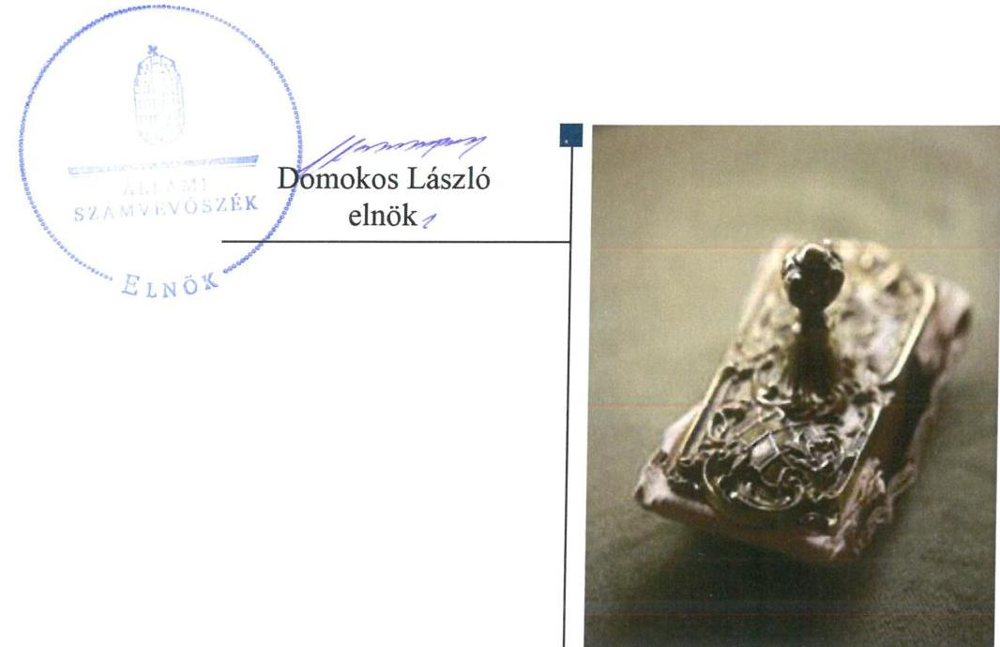
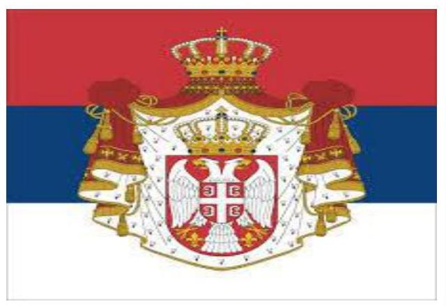
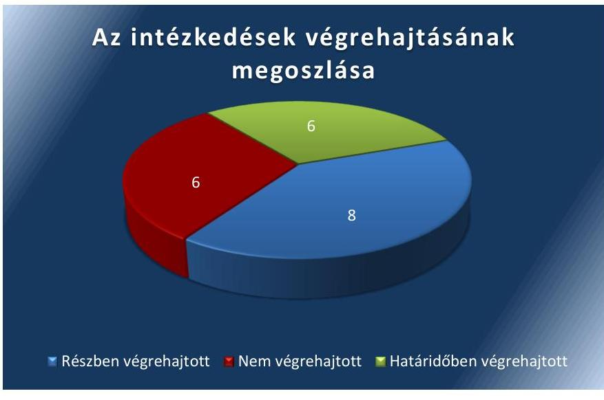
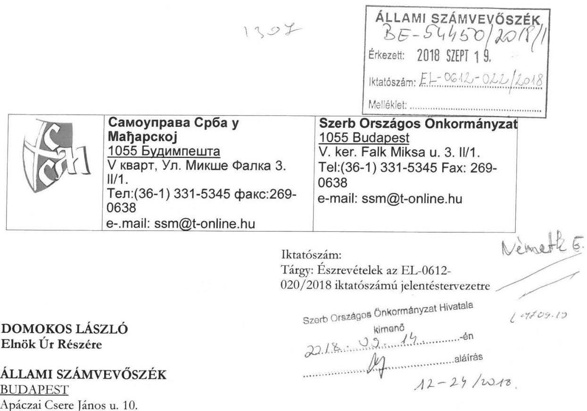
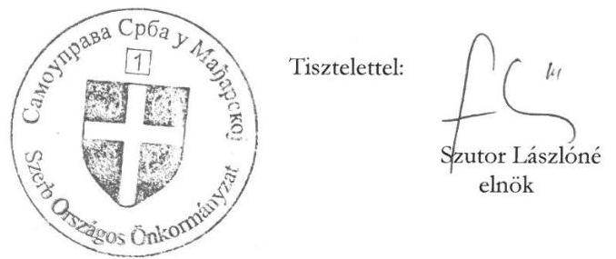
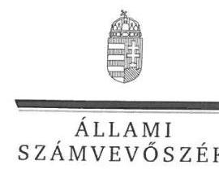
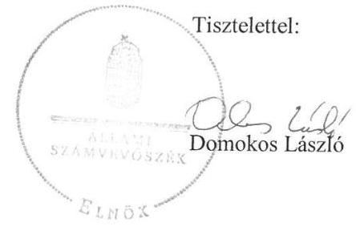
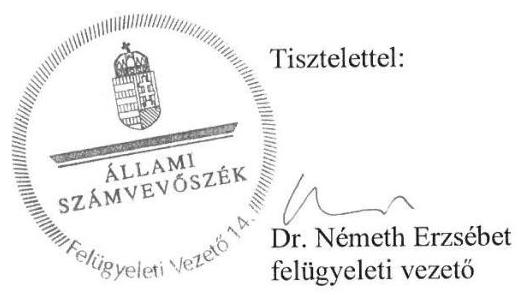

# Jelentés 

## Utóellenőrzések

Az Országos Nemzetiségi Önkormányzatok gazdálkodásának utóellenőrzése - Szerb Országos Önkormányzat
2018.

---

# Jelenetés 

## Utóellenőrzések

Az Országos Nemzetiségi Önkormányzatok gazdálkodásának utóellenőrzése - Szerb Országos Önkormányzat
2018. 10. hó 25. nap

---

# AZ ELLENŐRZÉST FELÜGYELTE: 

DR. NÉMETH ERZSÉBET felügyeleti vezető

## AZ ELLENŐRZÉST VEZETTE ÉS A VÉGREHAJTÁSÁÉRT FELELŐS:

DR. JAKAB KORNÉL ellenőrzésvezető

## A PROGRAM ÖSSZEÁLLÍTÁSÁÉRT FELELŐS:

TÓTPÁL SZABOLCS osztályvezető

## A TÉMÁHOZ KAPCSOLÓDÓ KORÁBBI SZÁMVEVŐSZÉKI JELENTÉSEK:

- címe: Jelentés - Az Országos Nemzetiségi Önkormányzatok gazdálkodásának ellenőrzéséről - Szerb Országos Önkormányzat
- sorszáma: 15157

IKTATÓSZÁM: EL-1185-001/2018.
TÉMASZÁM: 6/2
ELLENŐRZÉS-AZONOSÍTÓ SZÁM: V080405

---

# TARTALOMJEGYZÉK 

■ ÖSSZEGZÉS ..... 5
■ AZ ELLENŐRZÉS CÉLJA ..... 6
■ AZ ELLENŐRZÉS TERÜLETE ..... 7
■ AZ ELLENŐRZÉS HÁTTERE, INDOKOLTSÁGA ..... 8
■ A JELENTÉS LÉNYEGES KÉRDÉSKÖRE ..... 9
■ AZ ELLENŐRZÉS HATÓKÖRE ÉS MÓDSZEREI ..... 10
■ MEGÁLLAPÍTÁSOK ..... 12
■ MELLÉKLETEK ..... 15
I. sz. melléklet: A Szerb Országos Önkormányzat intézkedési tervének végrehajtása ..... 15
■ FÜGGELÉK: ÉSZREVÉTELEK ..... 21
■ RÖVIDÍTÉSEK JEGYZÉKE ..... 29

---

.

---

# ÖSSZEGZÉS 

Az Állami Számvevőszék a Szerb Országos Önkormányzat gazdálkodásának utóellenőrzése során megállapította, hogy az intézkedési tervben foglalt végrehajtott feladatok javították a müködési folyamatok szabályozottságát. A pénzügyi gazdálkodás és a belső kontrollok müködtetése terén a végre nem hajtott intézkedések miatt a közpénzzel való szabályszerű gazdálkodás nem valósult meg.

## Az ellenőrzés társadalmi indokoltsága

Az Állami Számvevőszék stratégiájában célul tűzte ki a számvevőszéki munka hasznosulásának javítását. Ezzel összhangban ellenőrzi, hogy az ellenőrzött szervezet megvalósította-e a korábbi ellenőrzései által feltárt hibák, hiányosságok és szabálytalanságok megszüntetése céljából elkészített intézkedési tervében foglaltakat. A rendszeres utóellenőrzések hozzájárulnak a szükséges intézkedések tényleges végrehajtásához, ezáltal a közpénzügyek rendezettségének javulásához.

## Főbb megállapítások, következtetések

A Szerb Országos Önkormányzat az Állami Számvevőszék által elfogadott intézkedési tervében meghatározott húsz feladatból hatot határidőben, nyolcat részben hajtott végre, hat feladatot nem hajtott végre.

Az intézkedési tervnek megfelelően gondoskodtak az adatvédelmi és adatbiztonsági szabályzat elkészítéséről. Az Önkormányzat a költségvetési határozat-tervezeteket a költségvetési szervek vezetőivel egyeztette, annak eredményét jegyzőkönyvbe rögzítették. Gondoskodtak az előirányzattal nem rendelkező várható kiadások előirányzatosításáról, betartották a jóváhagyott kiadási előirányzaton belüli gazdálkodásra vonatkozó jogszabályi előírásokat. Az Önkormányzat gondoskodott továbbá a vagyonhasznosítás versenyeztetés útján történő értékhatárának meghatározásáról és szabályozásáról.

Az intézkedési tervben lévő feladatok közül az Önkormányzat nem hajtotta végre a gazdálkodási jogkörök szabályszerű gyakorlásának érvényesítését, nem határozták meg a dokumentumokhoz és információkhoz való hozzáféréssel kapcsolatos felelősségi köröket. A jogszabályi előírások ellenére nem alakították ki és nem működtették a Szerb Országos Önkormányzat Hivatala tevékenységének, a célok megvalósításának nyomon követését biztosító rendszert, továbbá a belső ellenőr nem a Szerb Országos Önkormányzat Hivatala vezetőjének alárendelten látta el feladatait.

---

# AZ ELLENŐRZÉS CÉLJA 

Az ellenőrzés célja annak értékelése volt, hogy a számvevőszéki jelentésben foglalt intézkedést igénylő megállapításokkal összhangban készített intézkedési tervben meghatározott feladatokat az ellenőrzött szervezet végrehajtotta-e.

---

# AZ ELLENŐRZÉS TERÜLETE 

## Szerb Országos Önkormányzat

Az Önkormányzat ${ }^{1}$ jogi személyiséggel rendelkező, az Njtv. ${ }^{2}$ alapján létrehozott nemzetiségi önkormányzat, amely 1995. évben alakult. Alapvető feladata a magyarországi szerbek egyéni és kollektív jogainak, érdekeinek védelme és képviselete az önkormányzati feladat- és hatáskörök gyakorlásával. Az Önkormányzat közfeladatai ellátásához állami támogatást kap, valamint hazai és uniós pályázati forrásokat szerezhet. Az Önkormányzatot az Elnök ${ }^{3}$ képviseli, a jelenlegi Elnök a 2014. évi országos nemzetiségi választások óta látja el feladatát. Az Önkormányzat gazdálkodási feladatait az önállóan működő és gazdálkodó költségvetési szerve a Hivatal ${ }^{4}$ látja el. A nemzetiségi önkormányzati feladat- és hatáskörök a Közgyűlést ${ }^{5}$ illetik meg.
Az ÁSZ ${ }^{6}$ 2010. január 1. és 2014. június 30. közötti időszakra vonatkozóan végezte el az Önkormányzat gazdálkodása szabályszerűségének ellenőrzését és erről 2015. szeptember 10-én hozta nyilvánosságra a 15157. számú ÁSZ jelentést. Az ellenőrzés célja annak értékelése volt, hogy az Önkormányzat gazdálkodása, a belső kontrollrendszer kialakítása és működése, az államháztartásból nyújtott támogatás, illetve az államháztartásból meghatározott célra ingyenesen juttatott vagyon felhasználása a jogszabályi előírásoknak megfelelően történt-e; az önkormányzat az Njtv.-ben előírt feladat-és hatásköröket ellátta-e; intézkedett-e az ÁSZ által a 2008-2010. évek között végzett ellenőrzések javaslatainak végrehajtásáról.

Az ÁSZ jelentés a Hivatalvezető ${ }^{7}$ részére tizenkettő intézkedést igénylő megállapítást fogalmazott meg. A Hivatalvezető az ÁSZ Elnökének 2015. október 14-én küldte meg az Önkormányzat Közgyűlése által, a 140/2015. (X. 14.) számú közgyűlési határozattal elfogadott intézkedési tervet, amelyet az ÁSZ által kért módosítások alapján 2015. december 21-én és 2016. január 11-én az Önkormányzat kiegészített. Az Önkormányzat Közgyűlése által, a 4/2016. (I. 26.) számú határozottal elfogadott kiegészített intézkedési terv a Hivatalvezető részére tizenhárom, a Gazdasági vezető ${ }^{8}$ részére hét intézkedési kötelezettséggel járó feladatot tartalmazott.

---

# AZ ELLENŐRZÉS HÁTTERE, INDOKOLTSÁGA 

Az ÁSZ tv. ${ }^{9}$ 33. § (1) bekezdése értelmében a számvevőszéki jelentések intézkedést igénylő megállapításaihoz és javaslataihoz kapcsolódóan az ellenőrzött szervezet vezetője intézkedési tervet köteles összeállítani, és az Állami Számvevőszék részére megküldeni.

Az ÁSZ által befogadott intézkedési tervben foglaltak megvalósítását az ÁSZ tv. 33. § (7) bekezdésében foglaltak alapján - az Állami Számvevőszék utóellenőrzés keretében ellenőrizheti. Az utóellenőrzések keretében - az intézkedések értékelése során - az Állami Számvevőszék figyelembe veszi az ellenőrzött szervezetek működési feltételeiben, valamint a jogszabályi előírásokban bekövetkezett változásokat.

Az utóellenőrzés során az ÁSZ értékeli, hogy az érintett számvevőszéki jelentésben foglalt intézkedést igénylő megállapításokkal és javaslatokkal összhangban, az ellenőrzött szervezet által készített intézkedési tervben meghatározott feladatokat a feladatra kijelöltek végrehajtották-e.

Az intézkedések végrehajtásával az adott terület szabályszerű múködése vonatkozásában a kockázatok csökkenhetnek, azonban hosszabb távon az intézkedési tervben foglaltak végrehajtásával önmagában nem szűnnek meg, csak akkor, ha beépülnek az ellenőrzött szervezet működésébe, azokat folyamatosan azonosítják, értékelik és kezelik, figyelembe véve, illetve kezelve a változásokat. Emellett az intézkedések végrehajtásáig újabb kockázatok merülhetnek fel a szabályszerű múködés vonatkozásában, amelyek kezelése szintén kiemelten fontos az ellenőrzött szervezet számára.

Az ellenőrzött szervezet vezetője által készített intézkedési tervekben foglalt feladatok hiányos, illetve késedelmes végrehajtása, vagy annak elmaradása a szabályszerűség és a felelős vezetői magatartás vonatkozásában kockázatot hordoz, ami azt mutatja, hogy az ellenőrzések során feltárt hibák, hiányosságok és szabálytalanságok kezelése nem kapott kellő hangsúlyt. Az utóellenőrzés során is fennálló szabálytalanságok esetén a közpénz, közvagyon veszélyeztetettségi kockázat valószínűsített hatásának értékelése további intézkedéseket vonhat maga után.

Az ellenőrzött szervezet szintjén az utóellenőrzés feltárja, hogy a szervezet az intézkedések végrehajtásával hasznosította-e a korábbi ellenőrzési jelentésben a hiányosságok megszüntetése, illetve a kockázatok kezelése érdekében megfogalmazott javaslatokat, illetve az intézkedések végrehajtása elmaradásának következtében továbbra is fennálló szabálytalanság esetén értékeli a közpénzek, közvagyon veszélyeztetettségét.

Az ÁSZ szintjén az utóellenőrzés visszacsatolást ad az ellenőrzési jelentések hasznosulásáról, az intézkedések elmaradásának, vagy részleges megvalósulásának a közpénzek, közvagyon veszélyeztetettségére gyakorolt valószínűsített hatásának értékelése, további intézkedéseket vonhat maga után.

---

# A JELENTÉS LÉNYEGES KÉRDÉSKÖRE 

Az Önkormányzat az intézkedési tervben foglaltakat az elöirt határidőben végrehajtotta-e?

---

# AZ ELLENŐRZÉS HATÓKÖRE ÉS MÓDSZEREI 

## Az ellenőrzés típusa

Megfelelőségi ellenőrzés.

## Az ellenőrzött időszak

Az utóellenőrzés alapját képező ÁSZ jelentés közzétételének napjától (2015. szeptember 10.) az ellenőrzésről szóló kiértesítő levél keltének napjáig (2018. március 23.) tartó időszak.

## Az ellenőrzés tárgya

Az ÁSZ tv. 2011. július 1-jei hatálybalépését követően a számvevőszéki jelentésben foglalt intézkedést igénylő megállapításokkal összhangban - az Önkormányzat által - készített Intézkedési tervben foglaltak végrehajtásának ellenőrzése.

## Az ellenőrzött szervezet

Szerb Országos Önkormányzat, Szerb Országos Önkormányzat Hivatala.

## Az ellenőrzés jogalapja

Az ellenőrzés jogszabályi alapját az ÁSZ tv. 33. § (7) bekezdése képezte.

## Az ellenőrzés módszerei

Az ellenőrzést az ellenőrzött időszakban hatályos jogszabályok, az ellenőrzés szakmai szabályai, a jelen ellenőrzésre irányadó ÁSZ módszertanok, az ellenőrzési programban foglalt értékelési szempontok szerint végeztük.

Az ellenőrzés ideje alatt az Önkormányzattal történő kapcsolattartást az ÁSZ SZMSZ-ének vonatkozó előírásai alapján biztosítottuk.

Az utóellenőrzés megállapításait az ÁSZ rendelkezésére álló, valamint az ÁSZ adatbekérése szerint, az Önkormányzat által rendelkezésre bocsátott dokumentumok alapozták meg.

Az ellenőrzési bizonyítékként felhasználható adatforrások közé tartoztak egyrészt az ellenőrzési program részletes szempontjainál felsorolt adatforrások, másrészt minden - az ellenőrzés folyamán feltárt, az ellenőrzés szempontjából információt tartalmazó dokumentum.

---

Az intézkedési tervekben előírt feladatokat azok végrehajthatósága, illetve végrehajtása szempontjából az alábbiak szerint értékeltük:
$\longrightarrow$ „határidőben végrehajtott" a feladat, ha a teljesítés dokumentáltan, az intézkedési tervben előírt határidőben és tartalommal megtörtént;
$\longrightarrow$ „határidőn túl végrehajtott" a feladat, ha annak teljesítése az intézkedési tervben meghatározott módon, de az előírt határidőn túl történt meg;
$\longrightarrow$ „részben végrehajtott" a feladat, ha végrehajtása teljes körűen az intézkedési tervben előírt módon nem történt meg;
$\longrightarrow$ „nem végrehajtott" a feladat, ha a végrehajtás nem történt meg, vagy amennyiben a teljesítést nem dokumentálták;
$\longrightarrow$ „okafogyottá vált" a feladat, ha végrehajtására - meghatározott esemény bekövetkezése, továbbá külső körülmény, a működést érintő feltétel változása miatt - már nincs szükség, illetve lehetőség, és egyértelműen megállapítható, hogy az intézkedést szükségessé tevő körülmény a jövőben nem fordulhat elő;
$\longrightarrow$ „nem időszerű" az a feladat, amelynek ellenőrzési időszakon belüli végrehajtására azért nem került (kerülhetett) sor, mert az intézkedés alapjául szolgáló esemény nem következett be, de annak jövőbeni előfordulása lehetséges, a végrehajtása nem volt esedékes, vagy a végrehajtás határideje még nem járt le.
Az ellenőrzés lefolytatásához az Önkormányzat a tanúsítványok elektronikus kitöltésével, valamint az ÁSZ által kért dokumentumok elektronikus megküldésével szolgáltatott adatokat, amelyek valódiságát és teljes körűségét az ellenőrzött szervezet vezetője által tett teljességi és hitelességi nyilatkozat igazolja. Az így rendelkezésre bocsátott adatok, információk kontrollja az ellenőrzés keretében megtörtént.

---

# MEGÁLLAPÍTÁSOK 

## Az Önkormányzat az intézkedési tervben foglaltakat az előírt határidőben végrehajtotta-e?

Összegző megállapítás

Az Önkormányzat az intézkedési tervben szereplő húsz feladatból hatot határidőben, nyolcat részben hajtott végre, hat feladatot nem hajtott végre. Az intézkedési tervben meghatározott feladatok végrehajtásáról az előírásoknak megfelelően vezették a nyilvántartást.

Az Önkormányzat az általa elkészített, és az ÁSZ által elfogadott intézkedési tervben meghatározott feladatok közül hatot határidőben, nyolcat részben hajtott végre, hat feladatot nem hajtott végre.

A feladatokat, határidőket, megjelölt felelősöket és a feladatok végrehajtását az I. sz. melléklet mutatja be.

A Hivatalvezető gondoskodott az intézkedési tervben meghatározott feladatok végrehajtásának Bkr. ${ }^{10}$ szerinti nyilvántartásáról.

AZ ÖNKORMÁNYZAT ÁLTAL az intézkedési tervében vállalt feladatok végrehajtását az 1. ábra szemlélteti.

1. ábra

A MÜKÖDÉSI ÉS A GAZDÁLKODÁSI FOLYAMATOK SZABÁLYOZOTTSÁGA az Önkormányzatnál javult. A Hivatalvezető gondoskodott a Hivatal adatvédelmi és adatbiztonsági szabályzatának ${ }^{11}$ elkészítéséről. Az ellenőrzött Önkormányzat elkészítette a Hivatal számlarendjét ${ }^{12}$, az abban foglaltakat alátámasztó bizonylati ren-

---

det ${ }^{13}$, valamint a Hivatal reprezentációs szabályzatát ${ }^{14}$. Az Önkormányzatnál gondoskodtak a leltározási szabályzat ${ }^{15}$ módosításáról. A Hivatalvezető ${ }^{16}$ az Önkormányzat számviteli politikáját ${ }^{17}$ és az annak részét képező leltározási szabályzatot, a gazdálkodási szabályzatot és a selejtezési szabályzatot ${ }^{18}$ szabályszerűen kiadmányozta. Az Önkormányzat az Ávr. ${ }^{19}$ szerinti beszerzések lebonyolításával kapcsolatos eljárásrendet nem készítette el. A Hivatalvezető gondoskodott a Hivatal kockázatkezelési rendszerének és a szabálytalanságok kezelésének eljárásrendje kialakításáról, de azt nem működtette.

# A PÉNZÜGYI ELSZÁMOLTATHATÓSÁG JAVÍ- 

TÁSA érdekében a Hivatalvezető a költségvetési határozat-tervezeteket a jogszabályi előírásoknak megfelelően a költségvetési szervek ${ }^{20}$ vezetőivel egyeztette és annak eredményét rögzítette. Az Önkormányzatnál intézkedtek a kötelezettségvállalások nyilvántartásának vezetéséről, gondoskodtak az előirányzattal nem rendelkező várható kiadások előirányzatosításáról, valamint biztosították a jóváhagyott kiadási előirányzaton belüli gazdálkodásra vonatkozó jogszabályi előírásokat. A jogszabály előírásának megfelelően a 2016. évi költségvetési határozat-tervezetek és költségvetési határozatok 9. számú melléklete tartalmazta a költségvetési év várható bevételeinek és kiadási előirányzatának teljesüléséről az előirányzat-felhasználási ütemtervet, azonban az Áht. ${ }^{21}$ szerint előírt kötelező feladatok, önként vállalt feladatok és államigazgatási feladatok szerinti megbontását nem. Az Önkormányzatnál nem gondoskodtak az időközi költségvetési jelentésre vonatkozó adatszolgáltatási kötelezettség valamennyi hónapban történő teljesítéséről, mellyel megsértették az Ávr. vonatkozó rendelkezését. A Hivatalvezető nem intézkedett az Ávr. rendelkezései szerinti gazdálkodási jogkörök szabályszerű gyakorlásának érvényesítéséről.

AZ INTEGRITÁS szemlélet érvényesítése során az önkormányzat átláthatóságának biztosítása érdekében a Hivatalvezető a 2015. és a 2016. évi céljelleggel nyújtott támogatások adatait az Önkormányzat honlapján közzétette, azonban az Info tv. ${ }^{22}$ előírása ellenére a 2017. évi céljelleggel nyújtott támogatások adatainak közzétételéről nem intézkedett. Az Önkormányzatnál az Info. tv. előírása ellenére nem gondoskodtak az éves költségvetések közzétételéről. A Hivatalvezető a közérdekű adatok nyilvánosságra hozatalának rendjét az adatvédelmi és adatbiztonsági szabályzat keretein belül elkészítette, azonban a közérdekú adatok nyilvánosságra hozatalának rendje nem felelt meg az Info tv. előírásának. Mindezek alapján megállapítható, hogy nem volt biztosított a közpénzek felhasználásának átláthatósága.

## A BELSŐ KONTROLLOK ÉS A BELSŐ ELLENŐR-

ZÉS nem múködött az ellenőrzött időszakban a jogszabályoknak megfelelően. Az ellenőrzött Önkormányzat a Bkr. által előírt ellenőrzési nyomvonalat nem készítette el. A Hivatalvezető a Bkr. szerinti a Hivatal tevékenységének, a célok megvalósításának nyomon követését biztosító rendszert nem alakította ki és nem működtette. A Hivatalvezető a Bkr. rendelkezései ellenére nem határozta meg a dokumentumokhoz és információkhoz való hozzáféréssel kapcsolatos felelősségi köröket. Az

---

SZMSZ ${ }^{23}$ szerint a belső ellenőr a Bkr. rendelkezése ellenére nem a Hivatalvezetőnek alárendelten látta el feladatait. A Bkr. előírása ellenére továbbra sem történt meg a belső ellenőrzési kézikönyv szabályszerű kiadmányozása.

---

# MELLÉKLETEK

- I. SZ. MELLÉKLET: A SZERB ORSZÁGOS ÖNKORMÁNYZAT INTÉZKEDÉSI TERVÉNEK VÉGREHAJTÁSA

|  Sorszám | Intézkedési terv alapján elvégzendő feladat | Az intézkedési tervben meghatározott határidő | Az intézkedési tervben meghatározott felelős | Az intézkedési tervben meghatározott feladat végrehajtása  |
| --- | --- | --- | --- | --- |
|   | 1. | 2. | 3. | 4.  |
|  Határidőben végrehajtott feladatok |  |  |  |   |
|  1. | A Szerb Országos Önkormányzat Hivatala adatvédelmi és adatbiztonsági szabályzatának elkészítése az 1992. évi LXIII. törvény 31/A. § (3) bekezdése és az Info tv. 24. §. § (3) bekezdésében foglaltak szerint. | 2016. április 30. | Hivatalvezető | A Hivatalvezető gondoskodott a Hivatal adatvédelmi és adatbiztonsági szabályzatának elkészítéséről.  |
|  2. | A költségvetési határozat-tervezetek költségvetési szervek vezetőivel történő egyeztetése és eredményének írásos formában való rögzítése. | 2016. február 15. | Hivatalvezető | A Hivatalvezető a költségvetési határozat-tervezeteket a költségvetési szervek vezetőivel egyeztette és annak eredményét rögzítette.  |
|  3. | Az előirányzattal nem rendelkező várható kiadások előirányzatosítása, a jóváhagyott kiadási előirányzatokon belüli gazdálkodásra vonatkozó jogszabályi előírások betartása. | 2016. február 15. | Gazdasági vezető | A Gazdasági vezető gondoskodott az előirányzattal nem rendelkező várható kiadások előirányzatosításáról, biztosította a jóváhagyott kiadási előirányzaton belüli gazdálkodásra vonatkozó jogszabályi előírásokat. Az Önkormányzat tárgyévi kiadásainak teljesítése a módosított költségvetési kiadási előirányzat mértékéig történt.  |
|  4. | A vagyonhasznosítás versenyeztetés útján történő értékhatárának meghatározása és szabályozása a Szerb Országos Önkormányzat Közgyűlése által. | 2016. április 30. | Hivatalvezető | A Hivatalvezető gondoskodott a vagyonhasznosítás versenyeztetés útján történő értékhatárának meghatározásáról és szabályozásáról, valamint a versenyeztetés lefolytatása nélkül hasznosítható vagyoni kör meghatározásáról.  |
|  5. | A kötelezettségvállalások nyilvántartásának vezetése az Ávr. 56. §(1) bekezdése szerint. | 2014. január 01. (az EPER program bevezetése) óta folyamatosan működik | Gazdasági vezető | A Gazdasági vezető intézkedett a kötelezettségvállalások nyilvántartásának vezetéséről.  |

---

|  5. | Intézkedési terv alapján elvégzendő feladat | Az intézkedési tervben meghatározott határidő | Az intézkedési tervben meghatározott felelős | Az intézkedési tervben meghatározott feladat végrehajtása  |
| --- | --- | --- | --- | --- |
|   | 1. | 2. | 3. | 4.  |
|  6. | A jövőben az Ávr. 33. § (1)-(2) bekezdésében előírtak szerinti adatszolgáltatás határidőben történő teljesítése a Magyar Államkincstár területileg illetékes szervének. | A jogszabályban foglaltak szerint | Gazdasági vezető | A Gazdasági vezető gondoskodott az adatszolgáltatás határidőben történő teljesítéséről.  |
|   |  | Részben végrehajtott feladatok |  |   |
|  7. | Elkészíteni a Számv. tv. 161. § (1), az Áhsz. 49. § (1) és a 4/2013. (I.11.) Korm. Rendelet 51.§ (2) bekezdése alapján a Hivatal számlarendjének, a Számv tv. 161. § (2) bekezdés d) pontjában foglaltak szerinti bizonylati rend, az Ámr. 20. § (3) bekezdés b) és f) pontjainak megfelelően és az Ávr. 13. § (2) bekezdés b) és e) pontjainak megfelelően a beszerzések lebonyolításának, a reprezentációs kiadások felosztásának, teljesítésének, elszámolásának rendjére vonatkozó szabályzatokat. Továbbá az Ámr. 156. § (2) bekezdése és a Bkr. 6. § (3) bekezdése alapján a Hivatal felelősségi és információs szintjeit és kapcsolatait, az irányítási és ellenőrzési folyamatokat leíró ellenőrzési nyomvonal elkészítése, valamint a leltározási szabályzat módosítása az Áhsz. 37. § (1) és (7) bekezdése alapján. | 2016. április 30. | Gazdasági vezető | A Gazdasági vezető a Számv. tv. ${ }^{24}$ 161. § (1) bekezdése és (2) bekezdésének d) pontja szerint, valamint az Áhsz. ${ }^{25}$ 51. § (2) bekezdése alapján elkészítette a Hivatal számlarendjét és az abban foglaltakat alátámasztó bizonylati rendet. A gazdasági vezető az Ávr. 13. § (2) bekezdésének e) pontja szerint elkészítette a Hivatal reprezentációs kiadások felosztásának, teljesítésének, elszámolásának rendjére vonatkozó szabályozását. A gazdasági vezető a Számv. tv. 69. § (3) bekezdésében foglaltaknak megfelelően, gondoskodott a leltározási szabályzat módosításáról.
A Gazdasági vezető az Ávr. 13. § (2) bekezdésének b) pontja szerinti a beszerzések lebonyolításával kapcsolatos eljárásrendet, valamint a Bkr. 6. § (3) bekezdése szerinti felelősségi és információs szintjeit és kapcsolatait, az irányítási és ellenőrzési folyamatokat leíró ellenőrzési nyomvonalat nem készítette el.  |
|  8. | Intézkedni a Hivatal számviteli politikájának, gazdálkodási, leltározási, értékelési, pénzkezelési, valamint selejtezési | 2016. április 30. | Hivatalvezető | A Hivatalvezető az Önkormányzat számviteli politikáját és az annak részét képező leltározási szabályzatot az intézkedési tervben foglalt határidőben szabályszerűen kiadmányozta. A pénzkezelési szabályzat és az eszközök és források értékelési szabályzatának kiadmányozása továbbra  |

---

|  8
8
8 | Intézkedési terv alapján elvégrendő feladat | Az intézkedési tervben meghatározott határidő | Az intézkedési tervben meghatározott felelős | Az intézkedési tervben meghatározott feladat végrehajtása  |
| --- | --- | --- | --- | --- |
|   | 1. | 2. | 3. | 4.  |
|   | szabályzatának szabályszerű kiadmányozásáról |  |  | sem szabályszerű tekintettel arra, hogy azt nem a Hivatalvezető, hanem az Önkormányzat elnöke írta alá, megsértve ezzel az Áhsz. 50. § (1) bekezdésében foglaltakat.
A Hivatalvezető a gazdálkodási szabályzatot szabályszerűen kiadmányozta, azonban arra több mint egy évvel az intézkedési tervben meghatározott határidőn túl került sor. A Hivatalvezető a selejtezési szabályzatot szabályszerűen kiadmányozta, azonban arra 2 hónappal az intézkedési tervben meghatározott határidőn túl került sor.  |
|  9. | A Hivatal kockázatkezelési rendszerének kialakítása és működtetése. | 2016. április 30. azt követően folyamatosan működteti | Hivatalvezető | A Hivatalvezető gondoskodott a Hivatal kockázatkezelési rendszerének kialakításáról, valamint szabályozta a szabálytalanságok kezelésének eljárásrendjét.
A Hivatalvezető a Bkr. 7. § (1) bekezdése ellenére nem működtette a kockázatkezelési rendszert.  |
|  10. | A kötelezően közzéteendő adatok nyilvánosságra hozatala rendjének elkészítése az Info tv. 35. § (3) bekezdése, az Ámr. 20. § (3) bekezdés i) pontjában és az Ávr. 13. § (2) bekezdésének h) pontjában meghatározottak szerint. | 2016. április 30. | Hivatalvezető | A Hivatalvezető elkészítette a közérdekű adatok nyilvánosságra hozatalának rendjét, amit az adatvédelmi és adatbiztonsági szabályzat III. pontja tartalmazott. Az adatvédelmi és adatbiztonsági szabályzat III. pontja szerint az Önkormányzat a közérdekű adatokat a honlapján teszi közzé.
A közérdekű adatok nyilvánosságra hozatalának rendje azonban nem felelt meg az Info tv. 35. § (3) bekezdésének, mivel nem tartalmazta az adatfelelős Info tv. 35. § (1) bekezdése szerinti kötelezettségeinek részletes szabályait.  |
|  11. | A Szerb Országos Önkormányzat tevékenységére, működésére vonatkozó adatok teljes körű közzététele az Eisztv. 6. § (1) bekezdése, illetve az Info tv. 37. § (1) bekezdésében meghatározottak szerint. | Folyamatos az Info tv.
1. sz. melléklete szerint | Hivatalvezető | A Hivatalvezető részben tett eleget, az Info. tv. 37. § (1) bekezdésében előírt közzétételi kötelezettségének. A Közgyűlés elérhetősége és az Önkormányzat nyilvános kiadványainak adatai megtalálhatóak az Önkormányzat honlapján, azonban az archivált dokumentumok köre továbbra is hiányosan szerepelt.  |
|  12. | A költségvetési határozat-tervezetek és a költségvetési határozatok jogszabályi | 2016.február 15. | Gazdasági vezető | A Gazdasági vezető 2016. évi költségvetési határozat-tervezetek és a költségvetési határozatok jogszabályi előírásoknak megfelelő módon és  |

---

|  1. | Intézkedési terv alapján elvégzendő feladat | Az intézkedési tervben meghatározott határidő | Az intézkedési tervben meghatározott felelős | Az intézkedési tervben meghatározott feladat végrehajtása  |
| --- | --- | --- | --- | --- |
|  2. |  | 2. | 3. | 4.  |
|   | előírásoknak megfelelő módon és tartalommal való elkészítése. |  |  | tartalommal való elkészítéséről részben intézkedett. A 2016. évi költségvetési határozat-tervezet és költségvetési határozat 9. számú melléklete tartalmazta a költségvetési év várható bevételei és kiadási előirányzatának teljesüléséről az előirányzat-felhasználási ütemtervet. Az Áht. 23. § (2) bekezdés ab) pontjában előírt kötelező feladatok, önként vállalt feladatok és államigazgatási feladatok szerinti megbontást nem tartalmazták a költségvetési határozat-tervezetek és költségvetési határozatok. Az önkormányzat Közgyűlése a 18/2016. SZOÓ Közgyűlési (2016. II.27.) számú határozatával elfogadta a Szerb Országos Önkormányzat 2016. évi költségvetését.  |
|  13. | A céljellegű támogatások adatainak közzététele. | 2016. április 30. napjáig, azt követően folyamatosan működteti, az Info tv. 1. sz. melléklet III./3. pont szerinti határidőben | Hivatalvezető | A Hivatalvezető a 2016. december 31-éig hatályos 428/2012. (XII. 29.) Korm. rendelet 13. § (2) bekezdés előírásának megfelelően intézkedett a 2015. és 2016. években kapott céljellegű támogatások adatainak honlapján történő közzétételéről. A Hivatalvezető az Info tv. előírásának megfelelően a 2015. és a 2016. évi céljelleggel nyújtott támogatások adatait honlapján közzétette, azonban az Info tv. 37. § (1) bekezdés előírásától eltérően a 2017. évi céljelleggel nyújtott támogatások adatainak közzétételéről nem intézkedett.  |
|  14. | Az időközi költségvetési jelentések jogszabályi előírásoknak megfelelő adatszolgáltatási kötelezettség teljesítése. | 2016. április 30. | Gazdasági vezető | Az Önkormányzat az időközi adatszolgáltatási kötelezettségének a 2016. április 30-ig tartó időszakban a 2015. év 11 hónap vonatkozásában tett eleget, a további hónapok esetében a Gazdasági vezető az Ávr. 169. § (3) bekezdés előírásától eltérően, nem gondoskodott az időközi költségvetési jelentésre vonatkozó adatszolgáltatási kötelezettség teljesítéséről.  |
|   |  |  | Nem végrehajtott feladatok |   |
|  15. | A dokumentumokhoz és információkhoz való hozzáféréssel kapcsolatos felelősségi körök meghatározása. | Az intézkedési terv jóváhagyása napjától folyamatosan | Hivatalvezető | A Hivatalvezető a Bkr. 8. § (4) bekezdés b) pontjában foglaltak ellenére nem határozta meg a dokumentumokhoz és információkhoz való hozzáféréssel kapcsolatos felelősségi köröket.  |
|  16. | Az Ámr. 76. § (1) és (3) bekezdései, a 79. §(2) bekezdése, továbbá az Ávr. 57. §(1) | Az intézkedési terv jóváhagyása napjától folyamatosan | Hivatalvezető | A Hivatalvezető nem intézkedett az Ávr. 58. § (1)-(2) bekezdései szerinti gazdálkodási jogkörök szabályszerű gyakorlásának érvényesítéséről. Az aláírók jogosultsága továbbra sem igazolható.  |

---

|  1. | Intézkedési terv alapján elvégzendő feladat | Az intézkedési tervben meghatározott határidő | Az intézkedési tervben meghatározott felelős | Az intézkedési tervben meghatározott feladat végrehajtása  |
| --- | --- | --- | --- | --- |
|   | 1. | 2. | 3. | 4.  |
|   | és (3) bekezdései és az 58. § (I)-(2) bekezdései szerinti gazdálkodási jogkörök szabályszerű gyakorlásának érvényesítése. |  |  |   |
|  17. | A Hivatal tevékenységének, a célok megvalósításának nyomon követését biztosító rendszer kialakítása és működtetése az Áht.; 121. § (2) bekezdés e) pontjában, az Ámr. 160. §-ában és a Bkr. 3. § e) pontjában és 10. §-ában leírtaknak megfelelően. | 2016. április 30, azt követően folyamatosan működteti | Hivatalvezető | A Hivatalvezető a Bkr. 3. § e) pontjában és 10. §-ában meghatározott, a Hivatal tevékenységének, a célok megvalósításának nyomon követését biztosító rendszert nem alakított ki és nem működtetett.  |
|  18. | A belső ellenőr 2014. január 01. napjától megbízási szerződés keretében a hivatalvezetőnek alárendelve látja el a feladatát. | Az intézkedési terv elkészítéséig | Hivatalvezető | A Hivatalvezető nem intézkedett annak érdekében, hogy a belső ellenőr a Hivatalvezetőnek alárendelten lássa el feladatait, mellyel megsértették a Bkr. 18. §-ának rendelkezését.  |
|  19. | A 2013. október 01. napjától hatályos belső ellenőrzési kézikönyv hivatalvezető általi jóváhagyása a 2015. év március havában történt belső ellenőri felülvizsgálat keretében megtörtént a Ber. 5. § (1) bekezdése és a Bkr. 17. § (1) bekezdésében foglaltak tudomásulvételével | Az intézkedési terv elkészítéséig | Hivatalvezető | A Hivatalvezető a Bkr. 17. § (1) bekezdésében foglaltak ellenére nem gondoskodott a belső ellenőrzési kézikönyv szabályszerű kiadmányozásáról.  |
|  20. | Az éves költségvetés jogszabályi előírásoknak megfelelő közzététele. | 2016. március 15. napjáig, azt követően folyamatosan működteti, az Info tv 1. sz. melléklet III./1. pont szerint | Gazdasági vezető | A Gazdasági vezető nem gondoskodott az éves költségvetések Info. tv. 37. § (1) bekezdésében foglalt közzétételi kötelezettség teljesítéséről.  |

---

.

---

# FÜGGELÉK: ÉSZREVÉTELEK 

A jelentéstervezetet a Számvevőszék 15 napos észrevételezésre megküldte az ellenőrzött szervezet vezetőjének az ÁSZ tv. 29. §* (1) bekezdése előírásának megfelelően.

A Szerb Országos Önkormányzat elnöke a jelentéstervezet megállapításaira észrevételt tett. A függelék tartalmazza az ellenőrzöttek észrevételeit, illetve az el nem fogadott észrevételek elutasításának indoklását.

[^0]
[^0]:    * 29. § (1) Az Állami Számvevőszék az ellenőrzési megállapításait megküldi az ellenőrzött szervezet vezetőjének vagy az általa megbízott személynek, és annak, akinek személyes felelősségét állapította meg.
    (2) Az ellenőrzött szervezet vezetője és a felelősként megjelölt személy az ellenőrzés megállapításaira tizenöt napon belül írásban észrevételt tehet.
    (3) Az Állami Számvevőszék az észrevételre a beérkezésétől számított harminc napon belül írásban válaszol. A figyelembe nem vett észrevételeket köteles a jelentésben feltüntetni, és megindokolni, hogy azokat miért nem fogadta el.

---

# Tisztelt Elnök Úr! 

A fenti iktatószámon érkezett, „Utóellenőrzések - Az Országos Nemzetiségi Önkormányzatok gazdálkodásának utóellenőrzése - Szerb Országos Önkormányzat 2018." tárgyú jelentéstervezetben (a továbbiakban: „jelentéstervezet") megfogalmazott javaslatokra a Szerb Országos Önkormányzat képviseletében az alábbi

## észrevételeket

teszem:
Nem tényszerủ a jelentéstervezet 13. oldal első bekezdésében, illetve az 1. számú melléklet 7. pontjában az a megállapítás, hogy a gazdasági vezető nem készítette el az Ávr. 13. § (2) bekezdésének b) pontja szerinti beszerzések lebonyolításával kapcsolatos eljárásrendet.

A gazdasági vezető elkészítette, és a Szerb Országos Önkormányzat Közgyűlése 29/2016.(2016.II.27.) számú határozatával az intézkedési tervben meghatározott határidőben elfogadta a Szerb Országos Önkormányzat, a Szerb Országos Önkormányzat Hivatala, valamint a gazdasági szervezettel nem rendelkező intézmények beszerzésének rendjéről szóló szabályzatát. A szabályzatot az ellenőrzés során rendelkezésükre bocsátottuk, illetve a jelen észrevételekhez is csatoljuk, az elfogadását igazoló 29/2016.(2016.II.27.) számú határozat kivonatával együtt.

Az időközi költségvetési jelentések jogszabályi előírásoknak megfelelő adatszolgáltatási kötelezettség teljesítése tekintetében csak részben felel meg a tényeknek a jelentéstervezet 1. számú melléklet

---

14. pontjában következő megállapítás: „Az Önkormányzat az időközi adatszolgáltatási kötelezettségének a 2016. április 30-ig tartó időszakban a 2015. év 11 hónap vonatkozásában tett eleget, a további hónapok esetében a Gazdasági vezető az Ávr. 169.§(3) bekezdés előírásaitól eltérően, nem gondoskodott az időközi költségvetési jelentésre vonatkozó adatszolgáltatási kötelezettség teljesítéséről."

A Szerb Országos Önkormányzat Hivatalában 2014. decemberében, illetve a szintén önállóan gazdálkodó Nikola Tesla Szerb Tanítási Nyelvű Óvoda, Általános Iskola, Gimnázium és Kollégiumban 2015. júliusában hivatalba lépett gazdasági vezetőknek - az államháztartási számvitel 2014. január 1-i gyökeres változására is tekintettel -újra kellett paraméterezniük a 2014-es évet, hogy el tudják készíteni és hiba nélkül feladni a 2013-2014 évi rendezőmérleget és a 2014. évi beszámolót, ezután tudtak hozzákezdeni a 2015. évi KGR jelentések feladásához. A 2015. 01-09. hónapokra vonatkozó adatszolgáltatási kötelezettségek pótlása 2015.10.27-ig megtörtént.

A 2015.10.27-2016.04.30. közötti időszakra a Magyar Államkincstár bírságot nem állapított meg a Szerb Országos Önkormányzat terhére, mivel minden adatszolgáltatási kötelezettségünket határidőn belül teljesítettük a következők szerint:

|  Jelentés neve: | Jogszabály   határidő: | szerinti | Feladás dátuma: | Határidőben   eleget tett  |
| --- | --- | --- | --- | --- |
|  2015. évi jelentések |  |  |  |   |
|  PMINFO III. | 2015.10 .20 . |  | 2015.11 .02 . |   |
|  Mérleg III. | 2015.10 .20 . |  | 2015.11 .02 . |   |
|  PMINFO 201510 | 2015.11 .20 . |  | 2015.11 .20 . | IGEN  |
|  PMINFO 201511 | 2015.12 .21 . |  | 2015.12 .23 . |   |
|  Mérleg IV. Gyorsjelentés | 2016.02 .05 . |  | 2016.02 .05 . | IGEN  |
|  PMINFO IV. | 2016.02 .05 . |  | 2016.02 .05 . | IGEN  |
|  Mérleg IV. éves elsz. | 2016.03 .21 . |  | 2016.03 .30 . |   |
|  Beszámoló 2015. | 2016.03 .21 . |  | 2016.03 .30 . |   |
|  2016.évi jelentések |  |  |  |   |
|  Elemi költségvetés | 2016.03 .16 . |  | 2016.03 .14 . | IGEN  |
|  PMINFO I. | 2016.04 .20 . |  | 2016.04 .27 . |   |
|  MÉRLEG I. | 2016.04 .20 . |  | 2016.04 .27 . |   |

Amely hónapokban a feladás dátuma a jogszabály szerinti határidőt meghaladta, annak a KGR rendszer múködéséből adódó oka volt, azaz a technikai feltételek nem álltak rendelkezésre a KGR rendszerben. Pl. program módosítást végeztek, vagy késéssel publikálták a rendszerben a jelentéseket, valamint többször maga a KGR is összeomlott, és napokig nem volt használható, amely akadályozta az adatszolgáltatás teljesítését. A KGR rendszer múködéséből adódó problémák miatt a technikai feltételek biztosításától számított 3 munkanapon belül beadott jelentéseket kell határidőben beadottnak tekintetni, függetlenül az Ávr. 169.§(3) bekezdésében foglalt előírástól. A Magyar Államkincstár erre vonatkozó tájékoztatását mellékelem
A Szerb Országos Önkormányzat az Ávr. 169.§ (3) bekezdés előírásai szerinti adatszolgáltatási kötelezettségének a 2017. 10.27-e utáni időszaktól kezdődően maradéktalanul eleget tett.

Mindezek alapján megállapítható, hogy az ellenőrzési jelentés tervezetben tévesen szerepel, hogy a 2016. április 30 -ig tartó időszakban kizárólag a 2015. év 11. hónap vonatkozásában teljesítettük a jogszabályi határidőben az adatszolgáltatást. Tényszerủen az állapítható meg, hogy a 2016. év 02. és a 2016. 03. hó vonatkozásában is a jogszabályi határidőben nyújtottuk be az adatszolgáltatást. A többi hónapban a KGR rendszer nem megfelelő múködése miatt rajtunk kívül álló okból nem tudtuk

---

teljesíteni a jogszabályi határidőt, de ezekben az esetekben is benyújtottuk az adatszolgáltatást a Magyar Államkincstár által megadott határidőben, azaz a KGR rendszer működésének biztosításától számított 3 munkanapon belül.

Szintén nem felel meg a tényeknek a jelentéstervezet 14. oldal első és az 1. számú melléklet 18. pontjában az a megállapítás, amely szerint a hivatalvezető nem intézkedett annak érdekében, hogy a belső ellenőr a hivatalvezetőnek alárendelten lássa el a feladatait. Ugyanitt tévesen, nem a valóságnak megfelelően szerepel az a megállapítás, hogy a Bkr. 17. § (1) bekezdésében foglaltak ellenére nem történt meg a belső ellenőrzési kézikönyv szabályszerű kiadmányozása.

A Bkr. 17. § (1) bekezdése értelmében a belső ellenőrzési kézikönyvet a hivatalvezetőnek kell jóváhagynia. Az ellenőrzéssel érintett intézkedési tervben is szerepelt, hogy a 2013. október 01. napjától hatályos belső ellenőrzési kézikönyv hivatalvezető általi jóváhagyása már 2015. márciusában megtörtént. A belső ellenőrzési kézikönyv felülvizsgálata 2017. februárjában ismét megtörtént, ezt a hivatalvezető a Bkr. 17. § (1) bekezdésében foglaltak szerint jóváhagyta, azaz szabályszerűen kiadmányozta, és közzétette a Szerb Országos Önkormányzat hivatalos honlapján. A 2017. februárjában jóváhagyott belső ellenőrzési kézikönyvet az Állami Számvevőszék ellenőrzéséhez rendelkezésükre bocsátottuk.

A belső ellenőr 2015. január 01. napja óta a Szerb Országos Önkormányzat Hivatalával kötött megbízási szerződés szerint, a hivatalvezetőnek alárendelten látja el belső ellenőrzési tevékenységét. Az ellenőrzési időszakra vonatkozó megbízási szerződéseket csatolom.

Minderre tekintettel kérem, a Tisztelt Állami Számvevőszéket, hogy az „Utóellenőrzések - Az Országos Nemzetiségi Önkormányzatok gazdálkodásának utóellenőrzése tárgyú jelentést a fenti észrevételeink figyelembevételével szíveskedjen pontosítani és kiadni!

Budapest, 2018. szeptember 13.

---

ELNÖK

Ikt.szám: EL-0612-023/2018

# Szutor Lászlóné 

elnök

Szerb Országos Önkormányzat

## Budapest

## Tisztelt Elnök Asszony!

„Utóellenörzések - Az Országos Nemzetiségi Önkormányzatok gazdálkodásának utóellenörzése - Szerb Országos Önkormányzat" címủ jelentéstervezetre tett észrevételét köszönettel megkaptam.

Az ellenőrzési megállapításokra vonatkozó észrevételét az Állami Számvevőszékről szóló 2011. évi LXVI. törvény (a továbbiakban: ÁSZ tv.) 29. § (2) bekezdésében meghatározott tizenöt napos határidőn belül küldte meg. Az Állami Számvevőszék észrevétellel kapcsolatos álláspontját a mellékletként csatolt, a felügyeleti vezető által készített indokolás tartalmazza.

Tájékoztatom, hogy az Állami Számvevőszék a figyelembe nem vett észrevételeket az ÁSZ tv. 29. § (3) bekezdésében előírtak szerint köteles a jelentésében feltüntetni és megindokolni, hogy azokat miért nem fogadta el.

Budapest, 2018. Ac. hó 01 nap

Melléklet: Észrevételre adott válasz

---

# „Utóellenörzések - Az Országos Nemzetiségi Önkormányzatok gazdálkodásának utóellenörzése   - Szerb Országos Önkormányzat" című jelentéstervezethez tett észrevételre adott válasz   Szerb Országos Önkormányzat 

A jelentéstervezetre tett észrevételeket áttekintettem, annak kezelésével kapcsolatban a következő tájékoztatást adom.

1. A jelentéstervezet az Önkormányzat intézkedési tervében meghatározott feladatok végrehajtásával kapcsolatban a Mellékletek 7. pontjában megállapítja, hogy a Gazdasági vezető az Ávr. 13. § (2) bekezdésének b) pontja szerinti a beszerzések lebonyolításával kapcsolatos eljárásrendet nem készítette el.

Elnök asszony észrevételében arról tájékoztatja az Állami Számvevőszéket, hogy a Gazdasági vezető elkészítette, és a Szerb Országos Önkormányzat Közgyülése 29/2016. (2016.II.27) számú határozatával az intézkedési tervben meghatározott határidőben elfogadta a Szerb Országos Önkormányzat, a Szerb Országos Önkormányzat Hivatala, valamint a gazdasági szervezettel nem rendelkező intézmények beszerzésének rendjéről szóló szabályzatát.

Az észrevétel során ismételten áttekintettük az ellenőrzési dokumentumokat, amely során megállapítást nyert, hogy a szabályzatot az Önkormányzat nem bocsátotta az ellenőrzés rendelkezésére. A megállapítás módosítása a fentiekkel összhangban nem indokolt.
2. A jelentéstervezet az Önkormányzat intézkedési tervében meghatározott feladatok végrehajtásával kapcsolatban a Mellékletek 14. pontjában megállapítja, hogy az Önkormányzat az időközi adatszolgáltatási kötelezettségének 2016. április 30-ig tartó időszakban a 2015. év 11 hónap vonatkozásában tett eleget, a további hónapok esetében a Gazdasági vezető az Ávr. 169. § (3) bekezdés előírásától eltérően, nem gondoskodott az időközi költségvetési jelentésre vonatkozó adatszolgáltatási kötelezettség teljesítéséről.

Elnök asszony észrevételében jelzi, hogy az Önkormányzat a 2016. év 02. és 03. hónapjának vonatkozásában is a jogszabályi határidőben nyújtotta be az adatszolgáltatást. A többi hónapban a Magyar Államkincstár által megadott határidőben, a KGR rendszer müködésének biztositásától számított 3 munkanapon belül nyújtotta be az adatszolgáltatást.

Az észrevétel során ismételten áttekintettük az ellenőrzési dokumentumokat. Megállapítottuk, hogy az Önkormányzat intézkedési tervében, a feladat végrehajtásával kapcsolatban meghatározott, 2015. szeptember 10. - 2016. április 30. közötti időszakra vonatkozóan két dokumentumot, a 2015. év 11. hónapi, illetve a 2015. IV. negyedévi adatszolgáltatások igazolását bocsátott az ellenőrzés rendelkezésére. Az intézkedés végrehajtása ezért a teljes, 2016. április 30 -ig terjedő időszakra vonatkozóan nem volt értékelhető. A megállapítás módosítása a fentiekkel összhangban nem indokolt.

---

3. A jelentéstervezet az Önkormányzat intézkedési tervében meghatározott feladatok végrehajtásával kapcsolatban a Mellékletek 18. pontjában megállapítja, hogy a Hivatalvezető nem intézkedett annak érdekében, hogy a belső ellenőr a Hivatalvezetőnek alárendelten lássa el feladatait, mellyel megsértették a Bkr. 18. §-ának rendelkezését.

Elnök asszony észrevételében jelzi, hogy a belső ellenőr 2015. január 01. napja óta a Szerb Országos Önkormányzat Hivatalával kötött megbizási szerződés szerint, a Hivatalvezetőnek alárendelten látja el első ellenőrzési tevékenységét.

Az észrevétel során ismételten áttekintettük az ellenőrzési dokumentumokat, amely során megállapítást nyert, hogy az Önkormányzat a megbízási szerződéseket nem bocsátotta az ellenőrzés rendelkezésére. A megállapítás módosítása a fentiekkel összhangban nem indokolt.
4. A jelentéstervezet az Önkormányzat intézkedési tervében meghatározott feladatok végrehajtásával kapcsolatban a Mellékletek 19. pontjában megállapítja, hogy a Hivatalvezető a Bkr. 17. § (1) bekezdésében foglaltak ellenére nem gondoskodott a belső ellenőrzési kézikönyv szabályszerű kiadmányozásáról.

Elnök asszony észrevételében jelzi, hogy az ellenőrzéssel érintett intézkedési tervben is szerepelt, hogy a 2013. október 01. napjától hatályos belső ellenőrzési kézikönyv hivatalvezető általi jóváhagyása már 2015. márciusában megtörtént. A belső ellenőrzési kézikönyv felülvizsgálata 2017. februárjában ismét megtörtént, ezt a Hivatalvezető a Bkr. 17. § (1) bekezdésében foglaltak szerint jóváhagyta, kiadmányozta, és közzétette a Szerb Országos Önkormányzat hivatalos honlapján.
Az észrevétel során ismételten áttekintettük az ellenőrzési dokumentumokat, amely során megállapítást nyert, hogy az Önkormányzat a belső ellenőrzési kézikönyvet nem bocsátotta az ellenőrzés rendelkezésére. A megállapítás módosítása a fentiekkel összhangban nem indokolt

Budapest, 2018. október " t4 ".

---

.

---

# RÖVIDÍTÉSEK JEGYZÉKE 

${ }^{1}$ Önkormányzat
${ }^{2}$ Nttv.
${ }^{3}$ Elnök
${ }^{4}$ Hivatal
${ }^{5}$ Közgyűlés
${ }^{6}$ ÁsZ
${ }^{7}$ Hivatalvezető
${ }^{8}$ Gazdasági vezető
${ }^{9}$ ÁsZ tv.
${ }^{10}$ Bkr.
${ }^{11}$ Adatvédelmi és adatbiztonsági szabályzat
${ }^{12}$ Számlarend
${ }^{13}$ Bizonylati rend
${ }^{14}$ Reprezentációs szabályzat
${ }^{15}$ Leltározási szabályzat
${ }^{16}$ Gazdálkodási Szabályzat
${ }^{17}$ Számviteli Politika
${ }^{18}$ Selejtezési Szabályzat
${ }^{19}$ Ávr.

Szerb Országos Önkormányzat
A 2011. évi CLXXIX. törvény a nemzetiségek jogairól (hatályos: 2011. december 20.)
Szerb Országos Önkormányzat Elnöke
Szerb Országos Önkormányzat Hivatala
Szerb Országos Önkormányzat Közgyűlése
Állami Számvevőszék
Szerb Országos Önkormányzat Hivatalának vezetője
Szerb Országos Önkormányzat Hivatalának gazdasági vezetője
Az Állami Számvevőszékről szóló 2011. évi LXVI. törvény (hatályos: 2011. július 1.)
A 370/2011. (XII. 31.) Korm. rendelet a költségvetési szervek belső kontrollrendszeréről és belső ellenőrzéséről (hatályos: 2012. január 1.)
A Szerb Országos Önkormányzat Hivatalának Adatvédelmi és Adatbiztonsági Szabályzata (hatályos: 2016. április 22.)
A Szerb Országos Önkormányzat, a Szerb Országos Önkormányzat Hivatala, valamint a gazdasági szervezettel nem rendelkező intézmények összevont szabályzata/Számlarend (hatályos: 2016. április 25.)
A Szerb Országos Önkormányzat, a Szerb Országos Önkormányzat Hivatala, valamint a gazdasági szervezettel nem rendelkező intézmények összevont szabályzata/Bizonylati rend (hatályos: 2016. április 25.)
A Szerb Országos Önkormányzat, a Szerb Országos Önkormányzat Hivatala, valamint a gazdasági szervezettel nem rendelkező intézmények összevont szabályzata/A Reprezentációs kiadások felosztásának, teljesítésének, elszámolásának rendjéről (hatályos: 2016. április 25.)
A Szerb Országos Önkormányzat és a Battonyai Két Tanítási Nyelvű Szerb Általános Iskola és Óvoda, Szerb Pedagógiai és Módszertani Központ, Szerb Intézet, Magyarországi Szerb Kulturális és Dokumentációs Központ, Szerb Országos Önkormányzat Hivatala, Magyarországi Szerb Színház Leltárkészítési és Leltározási Szabályzata (hatályos: 2016. április 25.)
A Szerb Országos Önkormányzat, a Szerb Országos Önkormányzat Hivatala, és a Szerb Országos Önkormányzat gazdasági szervezettel nem rendelkező intézményeinek kötelezettségvállalás, pénzügyi ellenjegyzés, teljesítésigazolás, érvényesítés és utalványozás rendjéről szóló szabályzata (hatályos: 2017. november 24.)
A Szerb Országos Önkormányzat, a Szerb Országos Önkormányzat Hivatala, valamint a gazdasági szervezettel nem rendelkező intézmények összevont szabályzata/Számviteli Politika (hatályos: 2016. április 22.)
A Szerb Országos Önkormányzat, a Szerb Országos Önkormányzat Hivatala, és a Szerb Országos Önkormányzat gazdasági szervezettel nem rendelkező intézmények összevont szabályzata/Felesleges vagyontárgyak hasznosításának és selejtezésének szabályzata (hatályos: 2016. április 29.)
A 368/2011. (XII. 31.) Korm. rendelet az államháztartásról szóló törvény végrehajtásáról (hatályos: 2012. január 1.)

---

${ }^{20}$ költségvetési szervek
${ }^{21}$ Áht.
${ }^{22}$ Info tv.
${ }^{23}$ SZMSZ
${ }^{24}$ Számv. tv.
${ }^{25}$ Áhsz.

Magyarországi Szerb Kulturális és Dokumentációs Központ, Szerb Pedagógiai és Módszertani Központ, Szerb Intézet, Battonyai Két Tanítási Nyelvű Szerb Általános Iskola és Óvoda, Magyarországi Szerb Színház
Az államháztartásról szóló 2011. évi CXCV. törvény (hatályos: 2011. december 31.)
Az információs önrendelkezési jogról és az információszabadságról szóló 2011. évi CXII. törvény (hatályos: 2012. január 1.)

A Szerb Országos Önkormányzat Hivatalának Szervezeti és Müködési Szabályzata (hatályos: 2014. június 7.)
A számvitelről szóló 2000. évi C. törvény (hatályos: 2001. január 1.)
Az államháztartás számviteléről szóló 4/2013. (I.11.) Korm. rendelet (hatályos: 2014. január 1.)

---

ÁLLAMI SZÁMVEVŐSZÉK
1052 Budapest, Apáczai Csere János utca 10.
Levélcím: 1364 Budapest 4. Pf. 54
Telefon: +36 14849100 Telefax: +36 14849200
www.asz.hu