# Jelentés

## Utóellenőrzések – Az Országos Nemzetiségi Önkormányzatok gazdálkodásának utóellenőrzése

Magyarországi Németek Országos Önkormányzata

2018.

18288 www.asz.hu

---

# Jelentés 

## Utóellenőrzések - Az Országos Nemzetiségi Önkormányzatok gazdálkodásának utóellenőrzése

Magyarországi Németek Országos Önkormányzata
2018. 10. hó 25. nap
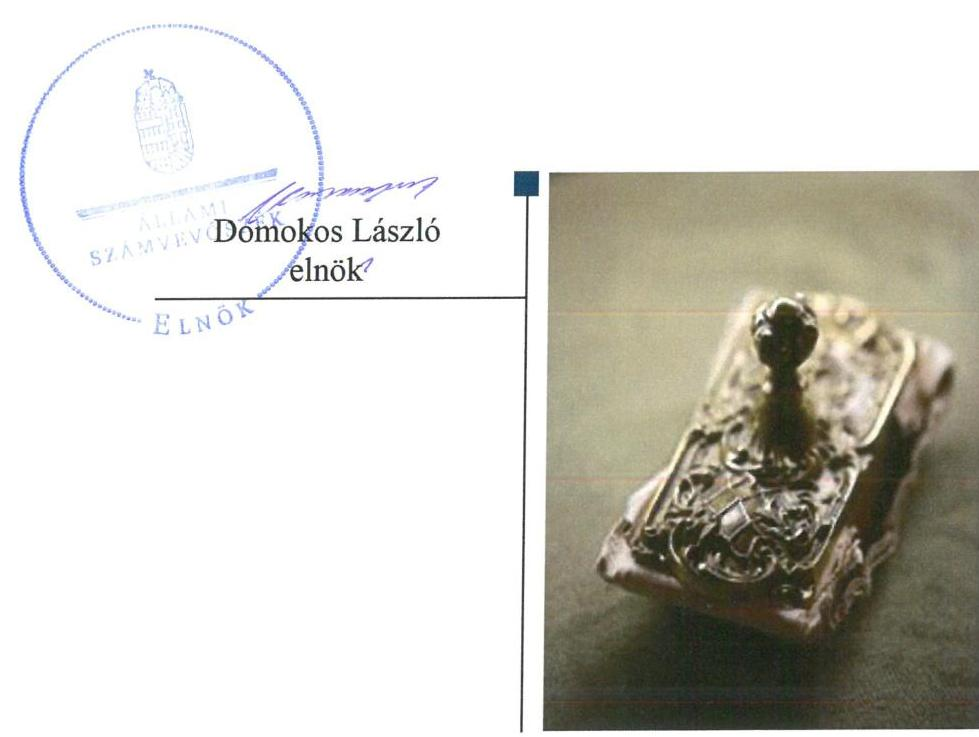

---

# AZ ELLENŐRZÉST FELÜGYELTE:

DR. NÉMETH ERZSÉBET felügyeleti vezető

## AZ ELLENŐRZÉST VEZETTE ÉS A VÉGREHAJTÁSÁÉRT FELELŐS:

- **ÓDOR ZOLTÁN TAMÁS** ellenőrzésvezető
- **A PROGRAM ÖSSZEÁLLÍTÁSÁÉRT FELELŐS:**
  - **TÓTPÁL SZABOLCS** osztályvezető

**IKTATÓSZÁM:** EL-1183-001/2018

**TÉMASZÁM:** 2460

**ELLENŐRZÉS-AZONOSÍTÓ SZÁM:** V080412

Jelentéseink az Országgyűlés számítógépes hálózatán és az Interneta a www.asz.hu címen is olvashatóak.

---

# TARTALOMJEGYZÉK 

■ ÖSSZEGZÉS ..... 5
■ AZ ELLENŐRZÉS CÉLJA ..... 6
■ AZ ELLENŐRZÉS TERÜLETE ..... 7
■ AZ ELLENŐRZÉS HÁTTERE, INDOKOLTSÁGA ..... 8
■ A JELENTÉS LÉNYEGES KÉRDÉSKÖRE ..... 9
■ AZ ELLENŐRZÉS HATÓKÖRE ÉS MÓDSZEREI ..... 10
■ MEGÁLLAPÍTÁSOK ..... 12
■ MELLÉKLETEK ..... 15
I. sz. melléklet: Magyarországi Németek Országos Önkormányzata intézkedési tervének végrehajtása ..... 15
■ FÜGGELÉK: ÉSZREVÉTELEK ..... 19
■ RÖVIDÍTÉSEK JEGYZÉKE ..... 25

---

.

---

# ÖSSZEGZÉS 

Az Állami Számvevőszék a Magyarországi Németek Országos Önkormányzata gazdálkodásának utóellenőrzése során megállapította, hogy az intézkedési tervben foglalt feladatok végrehajtása következtében a belső kontrollrendszer müködtetésének és az önkormányzati vagyonnal való felelős gazdálkodás szabályszerűsége javult. A végre nem hajtott intézkedések miatt az átláthatóság követelményei nem teljesülnek maradéktalanul.

## Az ellenőrzés társadalmi indokoltsága

Az Állami Számvevőszék stratégiájában célul tűzte ki a számvevőszéki munka hasznosulásának javítását. Ezzel összhangban ellenőrzi, hogy az ellenőrzött szervezetek megvalósították-e a korábbi ellenőrzései által feltárt hibák, hiányosságok és szabálytalanságok megszüntetése céljából kialakított intézkedési terveikben foglaltakat. Az intézkedések végrehajtásával az adott terület szabályszerű múködése vonatkozásában a kockázatok csökkenhetnek, ugyanakkor a nem végrehajtott intézkedések következtében újabb kockázatok merülhetnek fel, amelyek kezelése kiemelten fontos. A rendszeres utóellenőrzések hozzájárulnak a szükséges intézkedések tényleges végrehajtásához, ezáltal a közpénzügyek rendezettségének javulásához, a szabálytalan közpénzfelhasználás kockázatának a csökkentéséhez.

## Főbb megállapítások, következtetések

A Magyarországi Németek Országos Önkormányzata az Állami Számvevőszék intézkedést igénylő megállapításai alapján tett javaslataira készített intézkedési tervében 13 végrehajtandó feladatot határozott meg, amelyből kilencet határidőben, egyet részben és hármat nem hajtott végre.

A belső kontrollrendszer kialakításának és múködtetésének szabályszerűsége javult az Önkormányzatnál. Az Önkormányzat elkészítette önköltségszámítási, illetve adatvédelmi és adatbiztonsági szabályzatát. A kialakított ellenőrzési nyomvonal részletes szabályozás tartalmazott a gazdálkodási jogkörök megfelelő gyakorlására.

A Magyarországi Németek Országos Önkormányzata elkészítette a Közérdekű adatok megismerésére irányuló kérelmek intézésére és kötelezően közzéteendő adatok nyilvánosságra hozatalának rendjét tartalmazó szabályzatot, honlapján közzétette az Önkormányzat részére adott, valamint az általa nyújtott céljellegú támogatások adatait.

Az Önkormányzat ${ }^{1}$ honlapján nem tette közzé a foglalkoztatottak létszámára, személyi juttatásaira, valamint beszerzésivel kapcsolatos szerződések adatait.

A kockázatkezelési rendszer múködtetésével kapcsolatos szabályokat a kockázatkezelési szabályzatban rögzítették, azonban a kockázatkezelési rendszert nem múködtették, nem alakították ki a kockázatokkal kapcsolatos intézkedések folyamatos nyomon követés módját.

A vagyongazdálkodás szabályszerűsége érdekében módosították a vagyongazdálkodási szabályzatot melyben a jogszabályi előírásokkal összhangban meghatározták a vagyonhasznosítással kapcsolatos döntéshozatalok szabályait.

Vagyonhasznosításra kötött szerződéseiben nem biztosította az átláthatósági követelmény teljes körű érvényesítését.

---

# AZ ELLENŐRZÉS CÉLJA 

Az ellenőrzés célja annak értékelése volt, hogy a számvevőszéki jelentésben² foglalt intézkedést igénylő megállapításokkal összhangban készített intézkedési tervben meghatározott feladatokat az ellenőrzött szervezet vég-rehajtotta-e.

---

# **AZ ELLENŐRZÉS TERÜLETE**

## **Magyarországi Németek Országos Önkormányzata**

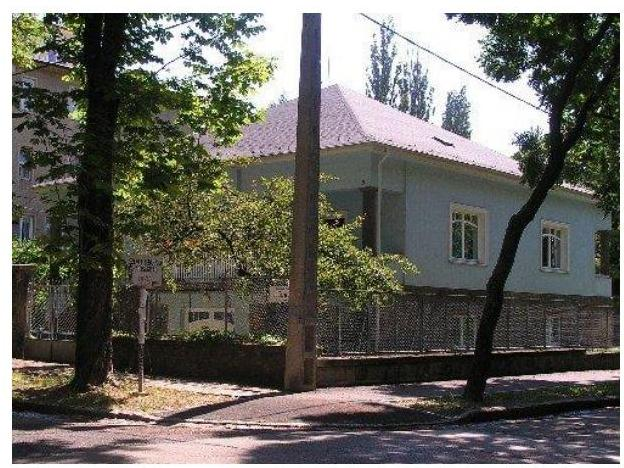

**A MAGYARORSZÁGI NÉMETEK ORSZÁGOS ÖNKORMÁNYZATA** 1995. évben alakult, képviseli a német nemzetiség politikai, kulturális és gazdasági érdekeit, a rendelkezésére álló eszközökkel fellép annak fennmaradása érdekében. Az Önkormányzat elnöke³ az 1999. évi országos nemzetiségi választások óta látja el feladatát. Az országos önkormányzat 406 helyi nemzetiségi önkormányzat, valamint több mint 500 kulturális csoport és magyarországi német egyesület ernyőszervezete.

**AZ ÖNKORMÁNYZAT HIVATALÁT** 4 1995. évben hozta létre az Önkormányzat, feladata az Önkormányzat és intézményei gazdálkodásával kapcsolatos feladatok ellátása. A Hivatalvezető5 2013. október 14-étől látja el feladatát.

**AZ ÁSZ6** 2015. évben ellenőrizte az Önkormányzat gazdálkodását 2010. január 1. – 2014. június 30. közötti időszak vonatkozásában. Az ellenőrzés célja annak értékelése volt, hogy az Önkormányzat gazdálkodása, a belső kontrollrendszer kialakítása és működtetése, az államháztartásból nyújtott támogatás, illetve az államháztartásból meghatározott célra ingyenesen juttatott vagyon felhasználása a jogszabályi előírásoknak megfelelően történt-e. Az ÁSZ az ellenőrzésről szóló 15158 sorszámú jelentését 2015. szeptember 24-én hozta nyilvánosságra.

Az ÁSZ jelentésében szereplő javaslatokra az Önkormányzat intézkedési tervet készített, melyet az ÁSZ elnöke 2016. február 20-án hagyott jóvá.

Az utóellenőrzés az Önkormányzat ellenőrzéséről készült 15158. számú ÁSZ jelentés intézkedést igénylő megállapításai és javaslatai hasznosítására elfogadott intézkedési tervben foglalt feladatok 2015. szeptember 24. - 2018. május 22. közötti végrehajtására irányult.

---

# AZ ELLENŐRZÉS HÁTTERE, INDOKOLTSÁGA 

Az ÁSZ tv7. 33. § (1) bekezdése értelmében a számvevőszéki jelentések intézkedést igénylő megállapításaihoz és javaslataihoz kapcsolódóan az ellenőrzött szervezet vezetője intézkedési tervet köteles összeállítani, és az Állami Számvevőszék részére megküldeni.

Az ÁSZ által befogadott intézkedési tervben foglaltak megvalósítását az ÁSZ törvény 33. § (7) bekezdésében foglaltak alapján - az Állami Számvevőszék utóellenőrzés keretében ellenőrizheti. Az utóellenőrzések keretében - az intézkedések értékelése során - az Állami Számvevőszék figyelembe veszi az ellenőrzött szervezetek működési feltételeiben, valamint a jogszabályi előírásokban bekövetkezett változásokat. Az utóellenőrzés során az ÁSZ értékeli, hogy az érintett számvevőszéki jelentésben foglalt intézkedést igénylő megállapításokkal és javaslatokkal összhangban, az ellenőrzött szervezet által készített intézkedési tervben meghatározott feladatokat a feladatra kijelöltek végrehajtották-e.

Az intézkedések végrehajtásával az adott terület szabályszerű múködése vonatkozásában a kockázatok csökkenhetnek, azonban hosszabb távon az intézkedési tervben foglaltak végrehajtásával önmagában nem szűnnek meg, csak akkor, ha beépülnek az ellenőrzött szervezet működésébe, azokat folyamatosan karban tartják, figyelembe véve, illetve kezelve a változásokat. Emellett az intézkedések végrehajtásáig újabb kockázatok merülhetnek fel a szabályszerű múködés vonatkozásában, amelyek kezelése szintén kiemelten fontos az ellenőrzött szervezet számára.

Az ellenőrzött szervezet vezetője által készített intézkedési tervekben foglalt feladatok hiányos, illetve késedelmes végrehajtása, vagy annak elmaradása a szabályszerűség és a felelős vezetői magatartás vonatkozásában kockázatot hordoz, ami azt mutatja, hogy az ellenőrzések során feltárt hibák, hiányosságok és szabálytalanságok kezelése nem kapott kellő hangsúlyt. Az utóellenőrzés során is fennálló szabálytalanságok esetén a közpénz, közvagyon veszélyeztetettségi kockázat valószínűsített hatásának értékelése további intézkedéseket vonhat maga után.

Az ellenőrzött szervezet szintjén az utóellenőrzés feltárja, hogy a szervezet az intézkedések végrehajtásával hasznosította-e a korábbi ellenőrzési jelentésben a hiányosságok megszüntetése, illetve a kockázatok kezelése érdekében megfogalmazott javaslatokat, illetve az intézkedések végrehajtása elmaradásának következtében továbbra is fennálló szabálytalanság esetén értékeli a közpénzek, közvagyon veszélyeztetettségét. Az ÁSZ szintjén az utóellenőrzés visszacsatolást ad az ellenőrzési jelentések hasznosulásáról, az intézkedések elmaradásának, vagy részleges megvalósulásának a közpénzek, közvagyon veszélyeztetettségére gyakorolt valószínűsített hatásának értékelése, további intézkedéseket vonhat maga után.

---

# A JELENTÉS LÉNYEGES KÉRDÉSKÖRE 

Az Önkormányzat az intézkedési tervben foglaltakat az elöirt határidőben végrehajtotta-e?

---

# AZ ELLENŐRZÉS HATÓKÖRE ÉS MÓDSZEREI 

## Az ellenőrzés típusa

Megfelelőségi ellenőrzés.

## Az ellenőrzött időszak

Az utóellenőrzés alapját képező számvevőszéki jelentés közzétételének napjától (2015. szeptember 24.) az ellenőrzésről szóló kiértesítő levél keltének napjáig (2018. május 22.) tartó időszak.

## Az ellenőrzés tárgya

Az ÁSZ tv. 2011. július 1-jei hatálybalépését követően a számvevőszéki jelentésben foglalt intézkedést igénylő megállapításokkal és javaslatokkal összhangban - az Önkormányzat által - készített intézkedési tervben foglaltak végrehajtásának ellenőrzése volt.

## Az ellenőrzött szervezet

Magyarországi Németek Országos Önkormányzata és a Magyarországi Németek Országos Önkormányzata Hivatala.

## Az ellenőrzés jogalapja

Az utóellenőrzés jogszabályi alapját az ÁSZ tv. 33. § (7) bekezdése előírásai képezik.

## Az ellenőrzés módszerei

Az ellenőrzést az ellenőrzött időszakban hatályos jogszabályok, az ellenőrzés szakmai szabályai, a jelen ellenőrzésre irányadó ÁSZ módszertanok, az ellenőrzési programban foglalt értékelési szempontok szerint, önállóan végezte az ÁSZ.

Az ÁSZ az ellenőrzés ideje alatt az ellenőrzött szervezettel történő kapcsolattartást az ÁSZ SZMSZ ${ }^{6}$-ének vonatkozó előírásai alapján biztosította.

Az utóellenőrzés megállapításait az ÁSZ rendelkezésére álló dokumentumok, valamint az ÁSZ adatbekérése szerint, az ellenőrzött szervezetek által rendelkezésre bocsátott dokumentumok, adatok alapján fogalmazta

---

meg, amely kiegészült az ellenőrzött szervezet székhelyén történő adatbetekintéssel.

Az ellenőrzési kérdések megválaszolásához szükséges bizonyítékok megszerzése az ellenőrzött által rendelkezésre bocsátott dokumentumokra, adatokra alapozva megfigyelés, szemle (szemrevételezés), kérdésfeltevés (információkérés), alkalmazásával történt. Az ellenőrzési bizonyítékként felhasználható adatforrások közé tartoztak egyrészt az ellenőrzési program részletes szempontjainál felsorolt adatforrások, másrészt minden - az ellenőrzés folyamán feltárt, az ellenőrzés szempontjából információt tartalmazó - dokumentum.

Az intézkedési tervekben előírt feladatokat azok végrehajthatósága, illetve végrehajtása szempontjából az alábbiak szerint értékelte az ÁSZ:
$\longrightarrow$ „határidőben végrehajtott" a feladat, ha a teljesítés dokumentáltan, az intézkedési tervben előírt határidőben és tartalommal megtörtént;
$\longrightarrow$ „határidőn túl végrehajtott" a feladat, ha annak teljesítése az intézkedési tervben meghatározott módon, de az abban előírt határidőn túl történt meg;
$\longrightarrow$ „részben végrehajtott" a feladat, ha annak végrehajtása nem teljes körűen az intézkedési tervben előírt módon történt meg;
$\longrightarrow$ „nem végrehajtott" a feladat, ha a végrehajtás nem történt meg, dokumentumokkal nem igazolt annak teljesítése;
$\longrightarrow$ „okafogyottá vált" a feladat, ha végrehajtására - meghatározott esemény bekövetkezése, továbbá külső körülmény, a működést érintő feltétel változása miatt - már nincs szükség, illetve lehetőség, és egyértelműen megállapítható, hogy az intézkedést szükségessé tevő körülmény a jövőben nem fordulhat elő;
$\longrightarrow$ „nem időszerü" az a feladat, amelynek ellenőrzési időszakon belüli végrehajtására azért nem került (kerülhetett) sor, mert az intézkedés alapjául szolgáló esemény nem következett be, de annak jövőbeni előfordulása lehetséges, a végrehajtása nem volt esedékes, vagy a végrehajtás határideje még nem járt le.
Az ellenőrzés lefolytatásához az ellenőrzött szervezet a tanúsítványok elektronikus kitöltésével, valamint az ÁSZ által kért dokumentumok elektronikus megküldésével szolgáltatott adatokat, amelyek valódiságát és teljes körűségét az ellenőrzött szervezet vezetője által tett teljességi és hitelességi nyilatkozat igazolta. Az így rendelkezésre bocsátott adatok, információk kontrollja az ellenőrzés keretében történt.

---

# MEGÁLLAPÍTÁSOK 

## Az Önkormányzat az intézkedési tervben foglaltakat az előírt határidőben végrehajtotta-e?

Összegző megállapítás

Az Önkormányzat az intézkedési tervében meghatározott 13 feladat közül kilencet határidőben, egyet részben hajtott végre, továbbá három feladatot nem hajtott végre.

Az ÁSZ 15158. számú jelentésében megfogalmazott javaslatok kezelésére, a szabálytalanságok megszüntetésére az Elnök és a Hivatalvezető összesen 13 intézkedésből álló intézkedési tervet küldött az ÁSZ részére.

Az Önkormányzat intézkedési tervében meghatározott feladatokat, határidőket, a feladatok végrehajtásáért felelős személyeket, a feladatok végrehajtását az 1. melléklet mutatja be.

Az ÁSZ javaslatai alapján összeállított intézkedési tervet a Hivatalvezető a Bkr. ${ }^{9}$ 14. § (1) bekezdésében foglalt előírás ellenére nem rögzítette feladatok végrehajtásáról szóló nyilvántartásban.

Az intézkedési tervben meghatározott feladatok végrehajtásának értékelési kategóriák szerinti megoszlását az 1. ábra szemlélteti.

1. ábra

A feladatok végrehajtásának értékelési kategóriák szerinti megoszlása
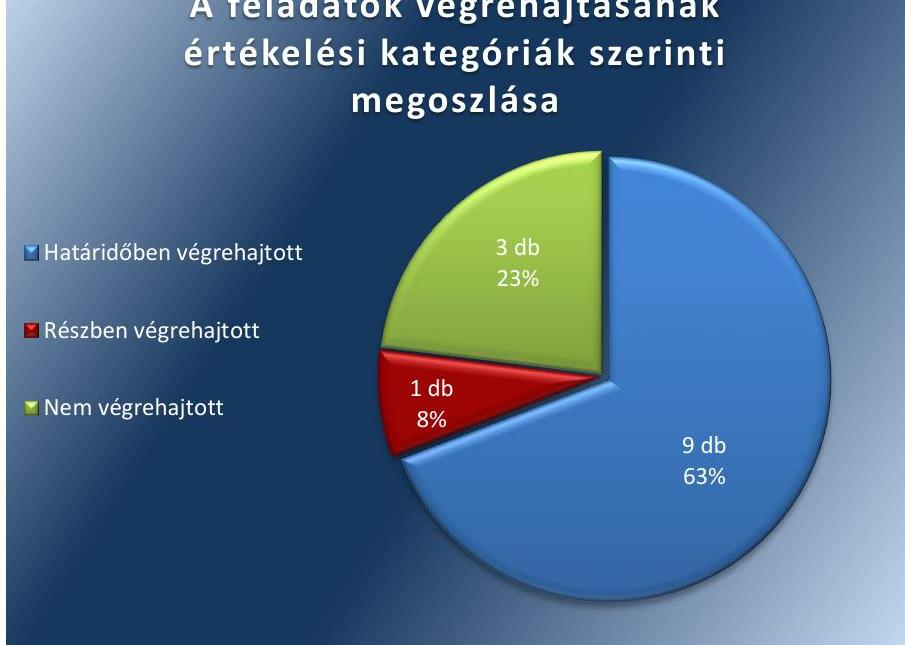

A BELSŐ KONTROLLRENDSZER kialakításának és müködésének szabályszerűsége javult az Önkormányzatnál.
A Hivatalvezető elkészítette az Önkormányzat önköltségszámítási szabályzatát ${ }^{10}$ és adatvédelmi és adatbiztonsági szabályzatát ${ }^{11}$.

---

Az ellenőrzési nyomvonal ${ }^{12}$ kialakításával és az abban szereplő részletes szabályozással biztosították a gazdálkodási jogkörök megfelelő gyakorlását.

A Hivatalvezető elkészítette a kockázatkezelési szabályzatot ${ }^{13}$, amelyben a Bkr. előírásaival összhangban meghatározták a kockázatkezelési rendszer működtetésével kapcsolatos szabályokat, azonban a kockázatkezelés rendszert a Bkr.7.§ (2) bekezdése ellenére nem működtette.

A Hivatalvezető gondoskodott a Közérdekű adatok megismerésére irányuló kérelmek intézésére és kötelezően közzéteendő adatok nyilvánosságra hozatalának szabályzata ${ }^{14}$ elkészítéséről, azonban a közzétételi kötelezettség teljesítésével kapcsolatos intézkedés nem került végrehajtásra, mivel az Info tv. ${ }^{15} 37 . \S$ (1) bekezdésében foglaltak és a közzétételi szabályzat előírása ellenére a honlapon foglalkoztatottak létszámára, személyi juttatásaira, valamint ötmillió forintot elérő vagy meghaladó beszerzésivel kapcsolatos szerződéseket nem tette közzé.

A Hivatalvezető gondoskodott az Önkormányzat részére adott, valamint az általa nyújtott céljellegú támogatások adatainak honlapján történő közzétételéről.

A VAGYONGAZDÁLKODÁS szabályszerűségének biztosítása érdekében az Önkormányzat módosította vagyongazdálkodási szabályzatát ${ }^{16}$, melyben részletesen meghatározta a vagyonhasznosításra vonatkozó döntéshozatal szabályait, valamint meghatározta azon értékhatárt, amely felett csak versenyeztetés útján lehet a vagyont hasznosítani.

Önkormányzat az Nvtv. ${ }^{17}$ 11. § (10) bekezdése ellenére nem gondoskodott arról, hogy az általa megkötött vagyonhasznosítás - bérbeadás - tárgyú szerződései esetében érvényesüljenek az átláthatósági követelmények.

---

.

---

# MELLÉKLETEK

■ I. SZ. MELLÉKLET: MAGYARORSZÁGI NÉMETEK ORSZÁGOS ÖNKORMÁNYZATA INTÉZKEDÉSI TERVÉNEK VÉGREHAJTÁSA

|  ㅁ
2
3 | intézkedési tervben meghatározott feladat | Az intézkedési tervben meghatározott határidő | Az intézkedési tervben meghatározott feladat felelése | A feladat végrehajtása  |
| --- | --- | --- | --- | --- |
|  1. | 1./a-1* El kell készíteni az Önkormányzat és az Önkormányzat Hivatala ellenőrzési nyomvonalait valamennyi működési folyamatra. | 2016. január 31. | elnök, hivatalvezető | A Hivatalvezető elkészítette mind az Önkormányzat, mind az Önkormányzat Hivatala működési folyamatait leíró ellenőrzési nyomvonalat, amely 2016. január 1-jén lépett hatályba.  |
|  2 | 1./a-2 El kell készíteni az Önkormányzat Hivatala önköltségszámitási szabályzatát. | 2015. december 20. | elnök, hivatalvezető | A Hivatalvezető határidőre elkészítette az Önkormányzat Hivatalának önköltségszámitási szabályzatát, amely 2015. december 1-jén lépett hatályba.  |
|  3. | 1./c A jelentés a múltra vonatkozóan állapított meg hiányosságot. A kulcskontrollok megfelelő müködtetése érdekében a jövőben is kiemelten fontos a gazdálkodási jogkörök jogszabályi előírásoknak megfelelő gyakorlása. | folyamatos | elnök, hivatalvezető | A gazdálkodási jogkörök jogszabályi előírásoknak megfelelő gyakorlását biztosítja a 2016. január 1-jén hatályba lépett ellenőrzési nyomvonal, amely részletes szabályozást tartalmaz az egyes folyamatok esetében a kötelezettségvállalás, ellenjegyzés, teljesítésigazolás, érvényesítés, utalványozás gyakorlása vonatkozásában.  |
|  4 | 1./d-1 El kell készíteni az Önkormányzat Hivatala Közérdekű adatok megismerésére irányuló kérelmek intézése eljárásrendjének szabályzatát. | 2015. december 20. | hivatalvezető | A Hivatalvezető elkészítette a közérdekű adatok megismerésére irányuló kérelmek intézésére és kötelezően közzéteendő adatok nyilvánosságra hozatalának szabályzatát, amely 2015. december 1-jétől lépett hatályba.  |
|  5 | 1./d -2 El kell készíteni az Önkormányzat Hivatala Kötelezően közzéteendő adatok nyilvánosságra hozatala eljárásrendjének szabályzatát. | 2015. december 20. | hivatalvezető | A Hivatalvezető elkészítette a közérdekű adatok megismerésére irányuló kérelmek intézésére és kötelezően közzéteendő adatok nyilvánosságra hozatalának szabályzatát, amely 2015. december 1-jétől lépett hatályba.  |
|  6. | 2. El kell készíteni az Önkormányzat Hivatala adatvédelmi és adat-biztonsági szabályzatát | 2016. január 31. | hivatalvezető | A Hivatalvezető elkészítette az Önkormányzat Hivatala adatvédelmi és adatbiztonsági szabályzatát, amely 2015. december 1-én lépett hatályba.  |
|  7. | 3. Gondoskodni kell az Önkormányzat részére adott, valamint az általa nyújtott céljellegú támogatások adatainak pótlólagos közzétételéről 2010-2014 évekre vonatkozóan az önkormányzat www.ldu.hu honlapján. | 2015. november 30. | elnök, hivatalvezető | A 2010-2014. évekre vonatkozóan, a kapott és az adott céljellegú támogatások közzététele az Önkormányzat honlapján (www.ldu.hu) megtörtént. A nyújtott céljellegú támogatások közzététele 2015.12.03-án, a kapott céljellegú támogatások közzététele 2015.12.04-én valósult meg.  |

---

|  8. | 4. El kell készíteni az Önkormányzat Vagyongazdálkodási Szabályzatának módosítását, amelyben meg kell határozni a nemzeti vagyonról szóló 2011. évi CXCVI. törvény 11. § (16) bekezdése szerinti értékhatárt. | Soron következő közgyűlés | elnök | Az Önkormányzat elnöke gondoskodott arról, hogy az intézkedés által előírt, értékhatárt érintő vagyongazdálkodási szabályzat módosítás megtörténjen.
Az Önkormányzat Közgyűlése 2015.11.28-án elfogadta a szabályzat módosítását.  |
| --- | --- | --- | --- | --- |
|  9. | 5./a El kell készíteni az Önkormányzat Vagyongazdálkodási Szabályzatának módosítását, amelyben részletesen meg kell határozni a vagyonhasznosításra vonatkozó döntéshozatalok szabályait. | Soron következő közgyűlés | elnök | Az Önkormányzat elnöke biztosította, hogy az intézkedés által előírt, Önkormányzat vagyongazdálkodási szabályzatára irányuló módosítás megtörténjen.
Az Önkormányzat Közgyűlése 2015.11.28-án elfogadta a szabályzat módosítását.  |
|   |  | Részben végrehajtott feladatok |  |   |
|  10. | 1./b-1 El kell készíteni és működtetni kell az Önkormányzat Hivatala Kockázatkezelési szabályzatát. | kialakításra:
2015. december 20.
működtetésre:
folyamatos | hivatalvezető | Végrehajtott intézkedés:
A Hivatalvezető elkészítette az Önkormányzat Hivatala kockázatkezelési szabályzatát, amely 2015. december 1-jétől lépett hatályba.
Nem végrehajtott intézkedés:
Az Önkormányzat a kockázatkezelési szabályzatban foglaltakat nem valósította meg. A Bkr. 7. § (1) bekezdése ellenére kockázatkezelési rendszert nem működtetett. A kockázatkezelési szabályzat 1. és 2. sz. melléklet szerinti kockázatelemzést nem végezte el.  |
|   |  | Nem végrehajtott feladatok |  |   |
|  11. | 1./b-2 Ki kell alakítani a kockázatokkal kapcsolatos intézkedések folyamatos nyomon követési módját. | 2015. december 20. | hivatalvezető | A Hivatalvezető a Bkr. 7. § (2) bekezdése illetve a kockázatkezelési szabályzata előírásai ellenére nem alakította ki a kockázatokkal kapcsolatos intézkedések folyamatos nyomon követés módját. A kockázatkezelési szabályzat 3. sz. mellékletét képező kockázatok és intézkedések nyilvántartásával nem rendelkezett.  |
|  12. | 1./d -3 Eleget kell tenni a jogszabályban meghatározott közzétételi kötelezettségnek. | 2016. március 31. | hivatalvezető | A közzétételi kötelezettséget előíró intézkedés nem került végrehajtásra, mert az Önkormányzat az Info tv. 37.§ (1) bekezdés szerinti közzétételi kötelezettségének, valamint Közzétételi szabályzata 11. oldal 6. bekezdése ellenére honlapján nem tette közzé az Info tv.:
- 1. melléklet III. 2.) pontjában előírt a közfeladatot ellátó szervnél foglalkoztatottak létszámára és személyi juttatásaira vonatkozó összesített adatokat, illetve összesítve a vezetők és vezető tiszt-  |

---

|  12. | Intézkedési
tervben
meghatározott
feladat | Az intézkedési
tervben
meghatározott
határidő | Az intézkedési
tervben meghatározott feladat felelőse | A feladat végrehajtása  |
| --- | --- | --- | --- | --- |
|   |  |  |  | ségviselők illetményét, munkabérét, és rendszeres juttatásait, valamint költségtérítést, az egyéb alkalmazottaknak nyújtott juttatások fajtája és mértékét összesítve,
1. melléklet III. 4.) pontjában előírt az 5,0 millió Ft-ot elérő vagy azt meghaladó értékű árubeszerzésre, építési beruházásra, szolgáltatás megrendelésre vonatkozó szerződések adatait.  |
|  13. | 5./b A jövőben az átláthatóság követelményeinek érvényesülését minden esetben biztosítani kell. | folyamatos | elnök, hivatalvezető | Az Önkormányzat nem biztosította az ellenőrzött időszakban természetes személlyel vagy átlátható szervezettel megkötött vagyonhasznosítás tárgyú szerződések esetében az Nvtv. 11. § (10) bekezdés, 3. § (2) bekezdés előírásainak betartását.  |

- Az Önkormányzat által megküldött és az ÁSZ által elfogadott intézkedése terv 1./a pontjának első feladata

---

.

---

# FÜGGELÉK: ÉSZREVÉTELEK 

A jelentéstervezetet a Számvevőszék 15 napos észrevételezésre megküldte az ellenőrzött szervezet vezetőjének az ÁSZ tv. 29. §* (1) bekezdése előírásának megfelelően.

A Magyarországi Németek Országos Önkormányzatának elnöke, illetve a Magyarországi Németek Országos Önkormányzata Hivatalának hivatalvezetője a jelentéstervezet megállapításaira észrevételt tett.
A függelék tartalmazza az ellenőrzöttek észrevételeit, illetve az el nem fogadott észrevételek elutasításának indoklását.

[^0]
[^0]:    * 29. § (1) Az Állami Számvevőszék az ellenőrzési megállapításait megküldi az ellenőrzött szervezet vezetőjének vagy az általa megbízott személynek, és annak, akinek személyes felelősségét állapította meg.
    (2) Az ellenőrzött szervezet vezetője és a felelősként megjelölt személy az ellenőrzés megállapításaira tizenöt napon belül írásban észrevételt tehet.
    (3) Az Állami Számvevőszék az észrevételre a beérkezésétől számított harminc napon belül írásban válaszol. A figyelembe nem vett észrevételeket köteles a jelentésben feltüntetni, és megindokolni, hogy azokat miért nem fogadta el.

---

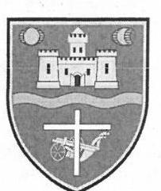

Landesselbstverwaltung der Ungarndeutschen Magyarországi Németek Országos Önkormányzata Budapest II., Júlia u. 9 / Postanschrift: H-1537 Budapest, Pf. 348 Telefon: (36-1) 212-9151, (36-1) 212-9152 / Fax: (36-1) 212-9153 www.ldu.hu / E-Mail: ldu@ldu.hu

# ÁLLAMI SZÁMVEVÖSZÉK 3E-54087/2018/1 

Bilazati: 2018 SZPT 18.
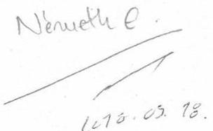

Unser Zeichen / Ikt. szám: 368-16/2018
Sachbearbeiter / Úgyintéző: dr. Gutai
Durchwahl / Melléklet: 1 db

## Tárgy: észrevétel

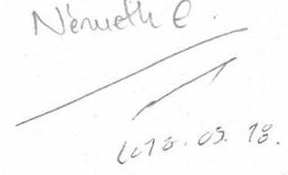

## Állami Számvevőszék

Domokos László
elnők úr részére

## Budapest

Apáczai Cseres János utca 10.
Pf. 54
1364

## Tisztelt Elnök Úr!

Megkaptuk az EL-0619-029/2018. számú, az „Utóellenőrzések - az Országos Nemzetiségi Önkormányzatok gazdálkodásának utóellenőrzése - Magyarországi Németek Országos Önkormányzata" címủ jelentéstervezetet, amelyhez az alábbi észrevételeket tesszük.

- Az országos önkormányzat elnökének címzett jelentéstervezet 7. oldalán hivatkoznak arra, hogy ,,az Önkormányzat elnöke az 1999. évi országos nemzetségi választások óta látja el feladatát."
Sajnos nagyra becsült és szeretett elnökünk, Heinek Ottó még a jelentéstervezet kiadását megelőzően - 2018. augusztus 20-án - elhunyt. Kérjük, hogy a jelentésben szíveskedjenek a pontosítást elvégezni.
- Az intézkedési tervek vizsgálatánál a 13. számú intézkedést - 5/b. A jövőben az átláthatóság követelményeinek érvényesülését minden esetben biztositani kell - a nem végrehajtott intézkedések közé sorolták, holott azt a jövőre nézve és folyamatos határidővel határoztuk meg. Az utóellenőrzés során sem kértek be Önkormányzatunktól vagyonhasznosítás tárgyában megkötött szerződéseket. Úgy ítéljük meg, hogy ezt a pontot nem lehetne a nem végrehajtott intézkedések között felsorolni.

A jelentéstervezetben felsorolt további nem végrehajtott illetve részben végrehajtott intézkedések megállapításait elfogadjuk. A hivatalvezető új intézkedési terv kiadásával elrendelte az elmulasztott intézkedések végrehajtását.
Jelen levelünkhöz mellékeljük a kiadott intézkedési tervet.
Budapest, 2018. szeptember 14.

Tisztelettel:
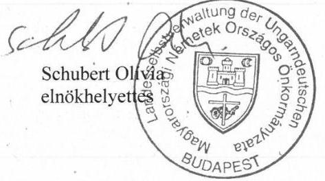

Schubert Ollyla
elnökhelyettes
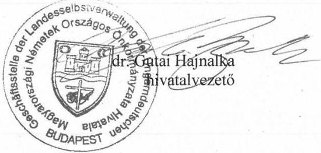

---

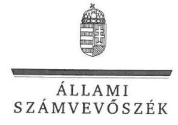

ELNÖK

Ikt.szám: EL-0619-032/2018

# Schubert Olivia úrhölgy 

elnök
Magyarországi Németek Országos Önkormányzata

## Budapest

## Tisztelt Elnök Asszony!

Az „Utóellenörzések - Az Országos Nemzetiségi Önkormányzatok gazdálkodásának utóellenörzése - Magyarországi Németek Országos Önkormányzata" címú jelentéstervezetre tett észrevételüket köszönettel megkaptam.

Az ellenőrzési megállapításokra vonatkozó észrevételét az Állami Számvevőszékről szóló 2011. évi LXVI. törvény (a továbbiakban: ÁSZ tv.) 29. § (2) bekezdésében meghatározott tizenöt napos határidőn belül küldte meg. Az Állami Számvevőszék észrevétellel kapcsolatos álláspontját a mellékletként csatolt, a felügyeleti vezető által készített indokolás tartalmazza.

Tájékoztatom, hogy az Állami Számvevőszék a figyelembe nem vett észrevételeket az ÁSZ tv. 29. § (3) bekezdésében előírtak szerint köteles a jelentésében feltüntetni és megindokolni, hogy azokat miért nem fogadta el.

Budapest, 2018. 40
hó ${ }^{\text {c4 }}$ nap
Tisztelettel:
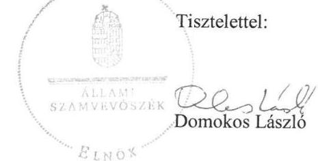

Melléklet: Észrevételre adott válasz

---

Az „Utóellenörzések - Az Országos Nemzetiségi Önkormányzatok gazdálkodásának utóellenörzése - Magyarországi Németek Országos Önkormányzata" címü jelentéstervezethez tett észrevételre adott válasz
Magyarországi Németek Országos Önkormányzata

A jelentéstervezetre tett észrevételeket áttekintettem, annak kezelésével kapcsolatban a következő tájékoztatást adom.

- Az Ellenőrzés területe c. fejezetben, az Önkormányzat elnökére vonatkozó mondatot észrevételük alapján módosítjuk.
- A jelentéstervezet alapján az Önkormányzat nem hajtotta végre azt a feladatot, mely szerint minden esetben biztosítani kell a jövőben az átláthatóság követelményeinek érvényesülését. Elnök asszony és Hivatalvezető asszony észrevételükben jelzik, hogy tekintettel az intézkedés folyamatos határidejére és jövőbeli teljesítésére, illetve arra, hogy az utóellenőrzés nem kért be az Önkormányzattól vagyonhasznosítás tárgyában megkötött szerződéseket, nem tartják indokoltnak a pontot a nem végrehajtott intézkedések közé sorolni.
Az észrevétel kapcsán áttekintettük az ellenőrzés rendelkezésére bocsátott dokumentumokat. Az Önkormányzat Közgyűlésének 26/2016 (02.20.) sz. határozatával elfogadott intézkedési terv 5. pontja a vagyonhasznosítással kapcsolatos döntéshozatal tekintetében fogalmazta meg azt a feladatot, hogy a jövőben az átláthatóság követelményeinek érvényesülését minden esetben biztosítani kell. Az Állami Számvevőszék EL-0619-003/2018 számú, adatszolgáltatásra felhívó levelének 2. sz. melléklete tartalmazza az ellenőrzött által szolgáltatandó dokumentumok jegyzékét. Ebben az ÁSZ kérte az intézkedési tervben meghatározott feladatok végrehajtását alátámasztó, valamint azok teljesülésének eredményét bemutató dokumentumokat.
Tekintettel arra, hogy a kérdéses intézkedési tervpont végrehajtására vonatkozóan dokumentumot nem bocsátottak az ÁSZ rendelkezésére, a megállapítás módosítása nem indokolt.

Budapest, 2018.
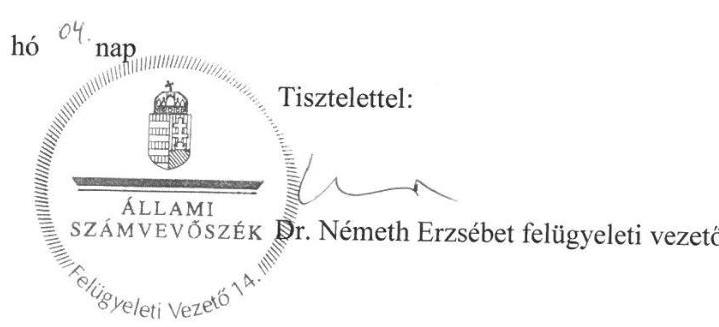

---

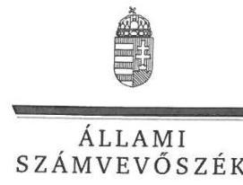

ELNÖK

Ikt.szám: EL-0619-033/2018

# Dr. Gutaí Hajnalka úrhölgy 

hivatalvezető
Magyarországi Németek Országos Önkormányzata Hivatala

## Budapest

## Tisztelt Hivatalvezető Asszony!

Az „Utóellenörzések - Az Országos Nemzetiségi Önkormányzatok gazdálkodásának utóellenörzése - Magyarországi Németek Országos Önkormányzata" címü jelentéstervezetre tett észrevételüket köszönettel megkaptam.

Az ellenőrzési megállapításokra vonatkozó észrevételét az Állami Számvevőszékről szóló 2011. évi LXVI. törvény (a továbbiakban: ÁSZ tv.) 29. § (2) bekezdésében meghatározott tizenöt napos határidőn belül küldte meg. Az Állami Számvevőszék észrevétellel kapcsolatos álláspontját a mellékletként csatolt, a felügyeleti vezető által készített indokolás tartalmazza.

Tájékoztatom, hogy az Állami Számvevőszék a figyelembe nem vett észrevételeket az ÁSZ tv. 29. § (3) bekezdésében előírtak szerint köteles a jelentésében feltüntetni és megindokolni, hogy azokat miért nem fogadta el.

Budapest, 2018.
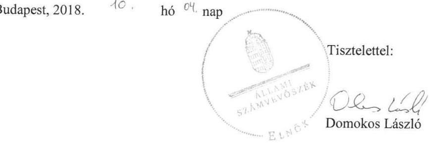

Melléklet: Észrevételre adott válasz

---

Az „Utóellenörzések - Az Országos Nemzetiségi Önkormányzatok gazdálkodásának utóellenörzése - Magyarországi Németek Országos Önkormányzata" címü jelentéstervezethez tett észrevételre adott válasz
Magyarországi Németek Országos Önkormányzata Hivatala

A jelentéstervezetre tett észrevételeket áttekintettem, annak kezelésével kapcsolatban a következő tájékoztatást adom.

- Az Ellenőrzés területe c. fejezetben, az Önkormányzat elnökére vonatkozó mondatot észrevételük alapján módosítjuk.
- A jelentéstervezet alapján az Önkormányzat nem hajtotta végre azt a feladatot, mely szerint minden esetben biztosítani kell a jövőben az átláthatóság követelményeinek érvényesülését. Elnök asszony és Hivatalvezető asszony észrevételükben jelzik, hogy tekintettel az intézkedés folyamatos határidejére és jövőbeli teljesitésére, illetve arra, hogy az utóellenőrzés nem kért be az Önkormányzattól vagyonhasznosítás tárgyában megkötött szerződéseket, nem tartják indokoltnak a pontot a nem végrehajtott intézkedések közé sorolni.
Az észrevétel kapcsán áttekintettük az ellenőrzés rendelkezésére bocsátott dokumentumokat. Az Önkormányzat Közgyűlésének 26/2016 (02.20.) sz. határozatával elfogadott intézkedési terv 5. pontja a vagyonhasznosítással kapcsolatos döntéshozatal tekintetében fogalmazta meg azt a feladatot, hogy a jövőben az átláthatóság követelményeinek érvényesülését minden esetben biztosítani kell. Az Állami Számvevőszék EL-0619-003/2018 számú, adatszolgáltatásra felhívó levelének 2. sz. melléklete tartalmazza az ellenőrzött által szolgáltatandó dokumentumok jegyzékét. Ebben az ÁSZ kérte az intézkedési tervben meghatározott feladatok végrehajtását alátámasztó, valamint azok teljesülésének eredményét bemutató dokumentumokat.
Tekintettel arra, hogy a kérdéses intézkedési tervpont végrehajtására vonatkozóan dokumentumot nem bocsátottak az ÁSZ rendelkezésére, a megállapítás módosítása nem indokolt.

Budapest, 2018.
(c.
hó $C^{2}$, nap
Tisztelettel:

ÁLLAMI
SzÁMVEVÓSZÉK
Dr. Németh Erzsébet felügyeleti vezető

---

# RÖVIDÍTÉSEK JEGYZÉKE 

${ }^{1}$ Önkormányzat
${ }^{2}$ számvevőszéki jelentés
${ }^{3}$ Önkormányzat elnöke
${ }^{4}$ Önkormányzat Hivatala
${ }^{5}$ Hivatalvezető
${ }^{6}$ ÁSZ
${ }^{7}$ ÁSZ tv.
${ }^{8}$ ÁSZ SZMSZ
${ }^{9}$ Bkr.
${ }^{10}$ önköltségszámítási szabályzat
${ }^{11}$ adatvédelmi és adatbiztonsági szabályzat
${ }^{12}$ ellenőrzési nyomvonal
${ }^{13}$ kockázatkezelési szabályzat
${ }^{14}$ közérdekú adatok megismerésére irányuló kérelmek intézésére és kötelezően közzéteendő adatok nyilvánosságra hozatalának szabályzata
${ }^{15}$ Info tv.
${ }^{16}$ vagyongazdálkodási szabályzat
${ }^{17}$ Nvtv.

Magyarországi Németek Országos Önkormányzata
„Az Országos Nemzetiségi Önkormányzatok gazdálkodásának ellenőrzése Magyarországi Németek Országos Önkormányzata" című, 15158. számú jelentés
Magyarországi Németek Országos Önkormányzata elnöke
Magyarországi Németek Országos Önkormányzata Hivatala
Magyarországi Németek Országos Önkormányzata Hivatala vezetője
Állami Számvevőszék
az Állami Számvevőszékről szóló 2011. évi LXVI. törvény
Az Állami Számvevőszék elnökének 4/2017. (XII. 29.) ÁSZ utasítása az Állami Számvevőszék Szervezeti és Müködési Szabályzatáról (hatályos 2018. január 1-jétől)
370/2011. (XII. 31.) Kormányrendelet a költségvetési szervek belső kontrollrendszeréről és belső ellenőrzéséről (hatályos: 2012. január 1-jétől)
Magyarországi Németek Országos Önkormányzata Önköltségszámítási szabályzat (hatályos: 2015. december 1-jétől
Magyarországi Németek Országos Önkormányzata Adatvédelmi és adatbiztonsági szabályzata (hatályos: 2015. december 1-jétől)
Magyarországi Németek Országos Önkormányzata Ellenőrzési Nyomvonal (hatályos 2016. január 1-jétől)
Magyarországi Németek Országos Önkormányzata Kockázatkezelési szabályzat (hatályos: 2015. december 1-jétől)
Magyarországi Németek Országos Önkormányzata Közérdekú adatok megismerésére irányuló kérelmek intézésének és a kötelezően közzéteendő adatok nyilvánosságra hozatalának szabályzatát (hatályos: 2015. december 1jétől
az információs önrendelkezési jogról és az információs szabadságról szóló 2011. évi CXII. törvény (hatályos: 2011. augusztus 27-étől)
Szabályzat a Magyarországi Németek Országos Önkormányzata vagyonáról, a vagyonhasznosítás rendjéről és a vagyontárgyak feletti tulajdonosi jogok gyakorlásáról (hatályos 2013.06.29-től)
2011. évi CXCVI. törvény a nemzeti vagyonról

---

ÁLLAMI SZÁMVEVŐSZÉK
1052 Budapest, Apáczai Csere János utca 10.
Levélcím: 1364 Budapest 4. Pf. 54
Telefon: +36 14849100 Telefax: +36 14849200
www.asz.hu