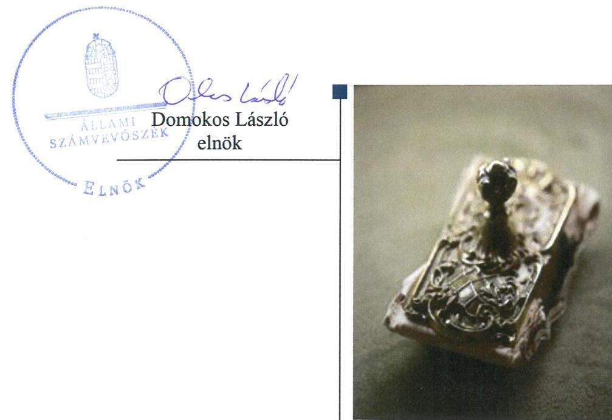
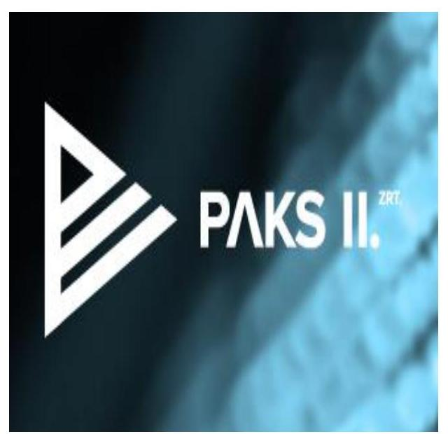

# Jelenetés 

## Az állami tulajdonú gazdasági társaságok ellenőrzése

Paks II. Atomerőmú Zrt.
2018.

---

# Jelentés 

## Az állami tulajdonú gazdasági társaságok ellenőrzése

Paks II. Atomerőmú Zrt.
2018. 12. hó 21. nap

---

# AZ ELLENŐRZÉST FELÜGYELTE:

- PETŐ KRISZTINA felügyeleti vezető
- AZ ELLENŐRZÉST VEZETTE ÉS A VÉGREHAJTÁSÁÉRT FELELŐS:
  - SALAMIN VIKTOR ellenőrzésvezető
  - A PROGRAM ÖSSZEÁLLÍTÁSÁÉRT FELELŐS:
    - TÓTPÁL SZABOLCS osztályvezető

**IKTATÓSZÁM:** EL-0380-026/2018.

**TÉMASZÁM:** 2469

**ELLENŐRZÉS-AZONOSÍTÓ SZÁM:** V081401

Jelentéseink az Országgyűlés számítógépes hálózatán és az Interneten a www.asz.hu címen is olvashatóak.

---

# TARTALOMJEGYZÉK 

■ ÖSSZEGZÉS ..... 5
■ AZ ELLENŐRZÉS CÉLJA ..... 6
■ AZ ELLENŐRZÉS TERÜLETE ..... 7
■ AZ ELLENŐRZÉS HÁTTERE, INDOKOLTSÁGA ..... 8
■ A JELENTÉS LÉNYEGES KÉRDÉSKÖREI ..... 9
■ AZ ELLENŐRZÉS HATÓKÖRE ÉS MÓDSZEREI ..... 10
■ MEGÁLLAPÍTÁSOK ..... 12
■ JAVASLATOK ..... 16
■ MELLÉKLETEK ..... 17
I. sz. melléklet: Értelmező szótár ..... 17
■ FÜGGELÉK: ÉSZREVÉTELEK ..... 19
■ RÖVIDÍTÉSEK JEGYZÉKE ..... 23

---

.

---

# ÖSSZEGZÉS 

A Paks II. Atomerőmú Zrt. gazdálkodásának szabályozottsága 2013-ban és 2016-ban megfelelt a jogszabályi előírásoknak. A Társaság gazdálkodása 2013-ban és 2016-ban nem volt szabályszerű. 2013-2015. években a mérleg tartalmának valódisága nem volt biztosított, ami veszélyeztette a vagyon megőrzését, az elszámoltathatóságot és az átláthatóságot. 2016. évben a vagyongazdálkodás már szabályszerű volt. A Miniszterelnökség a tulajdonosi jogait szabályszerűen gyakorolta, 2016-ban biztosított volt a Társaság elszámoltathatósága és átláthatósága.

## Az ellenőrzés társadalmi indokoltsága

Az állami tulajdonú gazdálkodó szervezetek ellenőrzése kiemelten fontos a vagyon megőrzése, megóvása érdekében, amelyekkel szemben alapvető követelmény, hogy gazdálkodásuk, működésük szabályszerű, az általuk szolgáltatott adatok minél megbízhatóbbak legyenek. Az állami tulajdonban álló gazdálkodó szervezetek államot megillető társasági részesedése a nemzeti vagyon részét képezi és legfőbb rendeltetése szerint a közfeladatok ellátását szolgálja.

Az Állami Számvevőszék stratégiájában megfogalmazta, hogy az államháztartáson kívül működő közfeladat-ellátó rendszerek ellenőrzéseivel hozzájárul ahhoz, hogy a közpénzeket az államháztartáson kívül működő szervezetek is átlátható, rendezett módon használják fel a közfeladatok szerződésben vállalt ellátása érdekében. Ellenőrzésünk eredményeképpen javaslatainkkal, megállapításainkkal hozzájárulhatunk a nemzeti vagyonnal való gazdálkodás átláthatóságának, elszámoltathatóságának javításához.

Az Állami Számvevőszék céljaival és a társadalmi igénnyel összhangban, valamint a gazdasági társaságok kiemelt fontosságú szerepe miatt került sor a Paks II. Atomerőmú Zrt. ellenőrzésére. Az ellenőrzést a Társaság a feladatellátásából adódó további társadalmi elvárás is indokolta.

## Főbb megállapítások, következtetések, javaslatok

A Paks II. Atomerőmú Zrt. a 2013. és 2016. években elkészítette a jogszabályban előírt szabályzatait.
A Társaság gazdálkodása sem 2013-ban, sem 2016-ban nem volt szabályszerű. A bevételek és ráfordítások elszámolása 2013-ban nem felelt meg a belső szabályzatban foglaltaknak. Míg a bevételek és az anyagjellegű ráfordítások elszámolása a 2013. évvel ellentétben a 2016. évben már szabályszerűen történt, addig a személyi jellegű ráfordítások elszámolása továbbra sem volt szabályszerű. A könyvviteli elszámolást közvetlenül alátámasztó bizonylatok alakilag és tartalmilag nem feleltek meg a jogszabályban rögzített követelményeknek, továbbá 2013-ban egyes számfejtett bérek összegét bizonylat nem támasztotta alá.

A Társaság vagyongazdálkodása 2013. évben nem volt szabályszerű. A 2013-2015. évi beszámolók mérlegtételeit leltár nem támasztotta alá, így az elszámoltathatóság és a nemzeti vagyon védelme nem volt biztosított. A vagyongazdálkodás szabályszerűsége 2016-ra javult, megfelelt a jogszabályi előírásoknak. A 2016. évi beszámoló mérlegtételeit a Társaság leltárral alátámasztotta, így az elszámoltathatóság biztosított volt.

A Társaság a kormányzati szektorba sorolt szervezetként fennálló adatszolgáltatási kötelezettségének 2016-ban nem tett eleget. Továbbá a 2013-2015. évekre vonatkozóan olyan beszámolót tett közzé a Társaság, amelynek mérlegtételeit leltár nem támasztotta alá. Mindezek alapján az átláthatóság nem volt biztosított.

Az MVM Magyar Villamos Művek Zrt.-nél és a Miniszterelnökségnél a tulajdonosi joggyakorlás kereteinek kialakítása és a Társaság feletti tulajdonosi jogok gyakorlása 2013. és 2016. években szabályszerű volt.

A megállapítások alapján az Állami Számvevőszék a Paks II. Atomerőmú Zrt. vezérigazgatójának egy javaslatot fogalmazott meg, amelyre 30 napon belül intézkedési tervet kell készíteni.

---

# AZ ELLENŐRZÉS CÉLJA 

AZ ELLENŐRZÉS CÉLJA annak értékelése, volt-e, hogy a tulajdonosi jogok gyakorlása szabályszerű volt-e. A gazdálkodó szervezet szabályozottsága, gazdálkodása és vagyongazdálkodási tevékenysége megfelelt-e a jogszabályi és a tulajdonosi előírásoknak; biztosítva volt-e a közfeladatok átláthatósága és elszámoltathatósága érdekében a közszolgáltatás díjának megalapozottsága szabályszerű önköltségszámítással. A vagyonváltozást eredményező döntések esetében a tulajdonosi jogok gyakorlója és a gazdálkodó szervezet szabályszerűen jártak-e el. Az ellenőrzés célja továbbá annak megítélése, hogy a kormányzati szektorba sorolt állami tulajdonban lévő gazdálkodó szervezetek gazdálkodásának a kormányzati szektor hiányára és az államadósságra befolyással bíró elemei a jogszabályi előírásoknak megfeleltek-e.

---

# AZ ELLENŐRZÉS TERÜLETE 

## Paks II. Atomerőmú Zrt.

A Magyar Kormány a Paksi Atomerőmú kapacitás-fenntartására irányuló beruházás megvalósítását a nemzetgazdaság szempontjából kiemelt fontosságú és az energiaellátás biztonsága szempontjából alapvetően szükséges beruházásnak tartja. Az MVM Magyar Villamos Művek Zrt. a projekt energiastratégiai jelentősége miatt 2012. július 26-án megalapította az MVM Paks II. Atomerőmú Fejlesztő Zrt.-t. A Társaság ${ }^{1}$ feladata a Paksi Atomerőmú kapacitásának fenntartásával kapcsolatos két új atomerőmúvi blokk tervezésére, beszerzésére, létesítésére, üzembe helyezésére és üzemeltetésre történő előkészítésre irányuló beruházás megkezdése volt. A Társaság elnevezése 2017. októberétől Paks II. Atomerőmú Zrt.-re változott.

A Társaság 2012. december 19-től 2014. november 10-ig az elismert vállalatcsoportként bejegyzett MVM Csoport Ellenőrzött Társaságaként működött. Az MVM Zrt. ${ }^{2}$ Közgyűlése 2014. október 15. napján hozott határozatában a Társaság részvényeinek a Magyar Állam részére történő átruházásáról döntött. 2014. november 6-án a Magyar Állam és az MVM Zrt. között létrejött adásvételi szerződés alapján a Társaság alaptőkéjének 100%-át kitevő részvények a Magyar Állam tulajdonába kerültek. A 45/2014. (XI. 14.) NFM rendelet ${ }^{3}$ alapján a Társaság feletti tulajdonosi jogok és kötelezettségek összességét 2014. november 15-től a Miniszterelnökség gyakorolta. 2017. május 3-tól a 15/2017. NFM rendelet ${ }^{4}$ alapján a Társaság feletti tulajdonosi jogok és kötelezettségek gyakorlója a Paksi Atomerőmű két új blokkja tervezéséért, megépítéséért és üzembe helyezéséért felelős tárca nélküli miniszter volt.

A Társaság jegyzett tőkéje 2012. július 26-án 9,0 Mrd Ft volt, amely 2014. december 22-én 16,0 Mrd Ft-ra, 2016. május 11-én 35,7 Mrd Ft-ra emelkedett az állami tőkeemelések következtében. A Társaság vagyonkezelésbe vett állami vagyonnal nem rendelkezett. A Társaság a Magyar Közlöny 2015/66. számú Hivatalos Értesítőjében megjelent $\mathrm{NGM}^{5}$ közlemény alapján 2015. december 30-tól tartozott a kormányzati szektorba sorolt egyéb szervezetek körébe. Az ellenőrzött időszakban adósságot keletkeztető ügyletet nem kötött.

A Társaságot 2012. július 26-tól 2014. szeptember 8-ig, valamint 2015. augusztus 3-tól három fős igazgatóság, 2014. szeptember 9-től 2015. augusztus 2-ig egyszemélyes igazgatóság (vezérigazgató) irányította. A vezérigazgató személyében egy alkalommal, 2015. június 15-én történt változás. A Társaság a Számv. tv. előírása alapján könyvvizsgálatra volt kötelezett. A kijelölt könyvvizsgáló személye az ellenőrzött időszakban nem változott. A foglalkoztatottak létszáma 2013. évben 59 fő, 2016. évben 253 fő volt.

A Társaság az ellenőrzött időszakban villamosenergia-termelést nem folytatott, szolgáltatást, közszolgáltatást nem nyújtott, így ehhez kapcsolódó árbevétellel nem rendelkezett.

---

# AZ ELLENŐRZÉS HÁTTERE, INDOKOLTSÁGA 

Az Európai Unióban 1994. év óta hatályos túlzott hiány eljárás mindig kihívást jelentett a tagállamok számára. Az állami tulajdonú gazdálkodó szervezetek ellenőrzése kiemelten fontos a vagyon megőrzése, megóvása érdekében, valamint a kormányzati szektor elszámolásaiban megjelenő állami tulajdonú gazdálkodó szervezetek esetében, amelyekkel szemben alapvető követelmény, hogy gazdálkodásuk, működésük szabályszerű, az általuk szolgáltatott adatok minél megbízhatóbbak legyenek. Gazdálkodásuk jellemzően a közérdeklődés és a média figyelmének középpontjában áll, amihez hozzájárul a gazdálkodásuk körébe tartozó - közvetlen vagy közvetett állami tulajdonú, tehát végső soron a nemzeti vagyon részét képező - vagyon nagysága, illetve az általuk ellátott közszolgáltatások/közfeladatok minősége és hatékonysága.

Az ellenőrzés rámutathat az állami tulajdonú gazdálkodó szervezetek gazdálkodási tevékenységével jó gyakorlatokra és szabálytalanságokra. Felhívhatja a figyelmet a jogszabályi követelmények teljesítéséhez szükséges feltételek hiányosságaira, hozzájárulhat az államháztartáson kívüli, de (közvetlenül vagy közvetve) állami vagyont használó gazdálkodó szervezetek tevékenységének átláthatóságához. Ellenőrzésünk eredményeképpen javaslatainkkal, megállapításainkkal hozzájárulhatunk a nemzeti vagyonnal való gazdálkodás átláthatóságának, elszámoltathatóságának javításához.

---

# A JELENTÉS LÉNYEGES KÉRDÉSKÖREI 

1. A tulajdonosi jogok gyakorlása szabályszerű volt-e?
2. A Társaság szabályozottsága megfelelt-e a jogszabályi előírásoknak, a gazdálkodási, vagyongazdálkodási és adatszolgáltatási feladatok ellátása szabályszerű volt-e?

---

# AZ ELLENŐRZÉS HATÓKÖRE ÉS MÓDSZEREI 

## Az ellenőrzés típusa

Megfelelőségi ellenőrzés.

## Az ellenőrzött időszak

2013-2016. évek, a 2016. évi beszámoló jóváhagyásáig tartó időszak.

## Az ellenőrzés tárgya

Állami tulajdonban lévő gazdasági társaság gazdálkodása, kiemelten vagyongazdálkodási tevékenysége, a tulajdonosi jogok gyakorlása.

## Az ellenőrzött szervezet

Paks II. Atomerőmű Zrt., továbbá a tulajdonosi jogokat gyakorló MVM Magyar Villamos Művek Zrt., a Miniszterelnökség. A Paks II. Atomerőmű Zrt. 2016. évi beszámolója jóváhagyása tekintetében a Paksi Atomerőmű két új blokkja tervezéséért, megépítéséért és üzembe helyezéséért felelős tárca nélküli miniszter.

## Az ellenőrzés jogalapja

Az ellenőrzés jogszabályi alapját az az Állami Számvevőszékről szóló 2011. évi LXVI. törvény 1. § (3) bekezdése és 5. § (3)-(5) bekezdései képezték.

## Az ellenőrzés módszerei

Az ellenőrzést a nemzetközi standardokat irányadónak tekintve az ellenőrzési program ellenőrzési kérdései, az ellenőrzött időszakban hatályos jogszabályok, az ellenőrzés szakmai szabályok és módszertanok figyelembe vételével végeztük.

Az ellenőrzés ideje alatt az ellenőrzött szervezettel történő kapcsolattartást az ÁSZ ${ }^{6}$ Szervezeti és Működési Szabályzatának vonatkozó előírásai alapján biztosítottuk.

Az ellenőrzésre a nemzetgazdasági szempontból kiemelt jelentőségű nemzeti vagyon körébe tartozó gazdálkodó szervezeteknél és a többségi állami tulajdonban álló gazdálkodó szervezeteknél került sor. A program

---

szerinti feladatokat a kiválasztott gazdálkodó szervezeteknél (társaságoknál) és azok többségi tulajdonban lévő leányvállalatainál, valamint a tulajdonosi jogok gyakorlójánál kellett végrehajtani. Az ellenőrzés szempontjai és az ellenőrzés alá vont gazdálkodó szervezetek köre az ellenőrzés tapasztalatai alapján - indokolt esetben - változhatott.

A személyi jellegű ráfordítások esetében az ellenőrzött tételek kijelölése véletlen mintavételi eljárás alkalmazásával történt a teljes sokaságból.

A bevételek és a ráfordítások valamint az immateriális javak, tárgyi eszközök esetében az ellenőrzés azokra a legnagyobb értékű tételekre - a lényeges sokaságra - terjedt ki, melyek összértéke eléri a teljes sokaság összértékének 50%-át.

A 2013. évi ráfordítások elszámolásának szabályszerűségét a lényeges sokaságból véletlen mintavételi eljárással kiválasztott tételek alapján ellenőriztük.

A mintavétellel ellenőrzött területek esetében minden egyes tétel vonatkozásában a szabályszerűségre vonatkozó kérdéseket tettünk fel, amelyek eredménye összesítésre került. „Szabályszerűnek" értékeltünk egy ellenőrzött területet, amennyiben 95%-os bizonyossággal az ellenőrzött sokaságban az átlagos hibaarány legfeljebb 10%, "nem szabályszerűnek", amennyiben 10%-nál magasabb arányt képviselt.

Az ellenőrzési kérdések megválaszolásához szükséges bizonyítékok megszerzése a következő ellenőrzési eljárások alkalmazásával történt: megfigyelés, kérdésfeltevés (információkérés), összehasonlítás, valamint elemző eljárás. Az ellenőrzési bizonyítékként felhasználható adatforrások közé tartoztak egyrészt az ellenőrzési programban felsorolt adatforrások, másrészt adatforrás lehet még minden - az ellenőrzés folyamán - feltárt, az ellenőrzés szempontjából információkat tartalmazó dokumentum.

A teljes ellenőrzött időszakra vonatkozóan került ellenőrzésre a gazdasági társaság tervezési, beszámolási, közzétételi, adatszolgáltatási kötelezettségének, valamint belső ellenőrzési tevékenységének szabályszerűsége. A 2013. és 2016. évekre vonatkozóan a tulajdonosi joggyakorlást, a gazdasági társaság működésének szabályozottságát, a bevételei
 és ráfordításai elszámolását, illetve vagyongazdálkodásának szabályszerűségét is ellenőriztük.

Az ellenőrzést a kérdésekre adott válaszok kiértékelésével, valamint a megjelölt adatforrások, a csatolt tanúsítványok felhasználásával, továbbá az adott időszakban hatályos jogszabályok figyelembe vételével folytattuk le.

---

# MEGÁLLAPÍTÁSOK 

## 1. A tulajdonosi jogok gyakorlása szabályszerű volt-e?

Összegző megállapítás

2013-ban az MVM Magyar Villamos Művek Zrt., 2016-ban a Miniszterelnökség tulajdonosi joggyakorlása szabályszerű volt.

A TULAJDONOSI JOGGYAKORLÁS KERETEIT az MVM Zrt. és a Miniszterelnökség kialakította. A tulajdonosi joggyakorlás rendjét 2013-ban az MVM Zrt. a Társaság Alapító okirat$_{1-6}$-ban$^7$ és a Vagyongazdálkodási szabályzat$_{1,2}$-ben$^8$, 2016-ban a Miniszterelnökség a Társaság Alapszabály$_{7-10}$-ben$^9$ a Gt.-ben$^{10}$, illetve a Ptk.-ban$^{11}$ foglalt előírásoknak megfelelően rögzítette. A Tulajdonosi joggyakorló$^{12}$ gondoskodott a Társaság 2013. és 2016. évi Üzleti tervének jóváhagyásáról.

A TULAJDONOSI JOGGYAKORLÁS 2013. és 2016. években szabályszerű volt. Az Alapító okirat$_{1-6}$-ban, valamint az Alapszabály$_{7-10}$-ben foglaltak szerint a Társaság három főből álló felügyelőbizottságának elnökét és tagjait, valamint a könyvvizsgálót a Taktv.$^{13}$, a Gt., illetve a Ptk. előírásainak megfelelően választották meg.

A Társaság 2013. évi beszámolóját az MVM Zrt., 2016. évi beszámolóját a Tárca nélküli miniszter$^{14}$ a Gt. és a Ptk. előírásainak megfelelően, a felügyelőbizottság jelentése birtokában jóváhagyta. Az MVM Zrt. és a Miniszterelnökség a Társaság működésének nyomon követését biztosító monitoring rendszert az Alapító okirat$_{1-6}$-ban, az Alapszabály$_{7-10}$-ben, a Vagyongazdálkodási szabályzat$_{1,2}$-ben, valamint a Társaság SZMSZ$_{1-3,7,8}$-ban$^{15}$ kialakította és működtette.

Az MVM Zrt. és a Miniszterelnökség a Társaság Javadalmazási szabályzatát$_{1-5}$$^{16}$ a Taktv.-ben foglaltaknak megfelelően megalkotta.

---

# 2. A Társaság szabályozottsága megfelelt-e a jogszabályi előírásoknak, a gazdálkodási, vagyongazdálkodási és adatszolgáltatási feladatok ellátása szabályszerű volt-e? 

Összegző megállapítás

2.1. számú megállapítás

2.2. számú megállapítás

A Társaság szabályozottsága 2013. és 2016. években megfelelt a jogszabályi előírásoknak. A Társaság gazdálkodása sem 2013-ban, sem 2016-ban nem volt szabályszerű. A Társaság vagyongazdálkodása 2013-ban nem volt szabályszerű, 2016-ban azonban már szabályszerű volt. A Társaság kormányzati szektorba sorolt szervezetként 2016-tól fennálló adatszolgáltatási kötelezettségének nem tett eleget.

A Társaság 2013-ban és 2016-ban a jogszabályokban előírt szabályzatokkal rendelkezett.

A TÁRSASÁG JOGSZABÁLYOK ÁLTAL ELŐÍRT SZABÁLYZATAIT 2013. és 2016. évre vonatkozóan elkészítette. Az Alapító okirat$_{1-6}$, az Alapszabály$_{1-4}$, valamint a Társaság SZMSZ$_{1-8}$ rögzítette a működés alapvető szabályait, felelősségi viszonyokat.

A Társaság rendelkezett Számviteli politikával$_{1-3}$$^{17}$, elkészítette Leltározási szabályzatát$_{1,2}$$^{18}$, Értékelési szabályzatát$_{1-3}$$^{19}$, Pénzkezelési szabályzatát$_{1-4}$$^{20}$, valamint Számlarendjét$_{1,2}$$^{21}$. A selejtezés szabályait a Számviteli és adózási szabályzatban$_{1-3}$$^{22}$ rögzítették. A szabályzatok megfeleltek a Számv. tv. előírásainak.

A Társaság a Számv. tv. előírásai szerint elkészítette Önköltségszámítási szabályzatát$_{1,2}$$^{23}$, az egyes tevékenységek költségeinek elkülönült nyilvántartását biztosították.

A bevételek és ráfordítások elszámolása 2013-ban nem felelt meg a jogszabályok és a belső szabályzatok előírásainak. A 2013-2015. évi beszámolók megalapozottsága nem volt biztosított. 2016-ban a pénzügyi bevételek és anyagjellegű ráfordítások elszámolása megfelelő volt, a személyi jellegű ráfordítások elszámolása azonban továbbra sem volt szabályszerű. A vagyongazdálkodás 2016-ban szabályszerű volt.

A PÉNZÜGYI BEVÉTELEK, AZ ANYAGJELLEGŰ RÁFORDÍTÁSOK, valamint a beruházások, felújítások elszámolása 2013-ban nem volt szabályszerű, mert az elszámolások során alkalmazott főkönyvi számlaszámok nem feleltek meg a Számlarend$_{1}$ mellékletét képező számlatükörben rögzített főkönyvi számnak. 2016. évben a pénzügyi bevételek, az anyagjellegű ráfordítások és a beruházások, felújítások elszámolása szabályszerű volt. Az elszámolások megfeleltek Számv. tv. és a belső szabályzatok előírásainak.

A SZEMÉLYI JELLEGŰ RÁFORDÍTÁSOK ELSZÁMOLÁSA sem 2013-ban, sem 2016-ban nem volt szabályszerű. A

---

#### Abstract

könyvviteli elszámolást közvetlenül alátámasztó bizonylatok alaki és tartalmi kellékei egyik évben sem feleltek meg a Számv. tv. 167. § (1) bekezdés a), b), c), d), e) rögzített követelményeknek, mert azokon nem szerepelt a bizonylatok elnevezése, sorszáma vagy egyéb más azonosítója, a bizonylatot kiállító gazdálkodó megjelölése, az elszámolást elrendelő személy (szervezet) megjelölése, a végrehajtást igazoló személy aláírása, a bizonylat kiállításának időpontja, a gazdasági művelet tartalmának leírása. 2013-ban a számfejtett bérek összegét alátámasztó bizonylat a Számv. tv. 165. § (1)(2) bekezdése előírása ellenére több esetben nem állt rendelkezésre, továbbá egyes esetekben a jutalmak kifizetéséről, a prémiumok kifizetésének engedélyezéséről szóló vezérigazgatói döntések az SZMSZ 1 3.2.1 pontja, az SZMSZ 2 1.13.1 pontja, valamint az SZMSZ 3 3.5.1 pontja előírásai ellenére nem álltak rendelkezésre.

A VAGYONGAZDÁLKODÁS feltételeit a Társaság 2013. és 2016. évekre vonatkozóan kialakította. A feladat- és hatásköröket, felelősségi viszonyokat az Alapító okirat$_{1-6}$-ban, az Alapszabály$_{7-10}$-ben, a Társaság SZMSZ$_{1-3,7,8}$-ban, valamint belső szabályzatokban (Gazdálkodási szabályzat$_{1-3}$$^{24}$ és Beszerzési szabályzat$_{1-4}$$^{25}$) rögzítették.

AZ ÉRTÉKCSÖKKENÉS elszámolása 2013. és 2016. évben szabályszerű volt, megfelelt a Számv. tv. és az Értékelési szabályzat$_{1-3}$ előírásainak.

AZ ÉVES BESZÁMOLÓIT a Társaság elkészítette. 2013-2015. években a Társaság a Számv. tv. 69. § (1) bekezdésének előírása ellenére mérlegtételeit leltárral nem támasztotta alá, így nem érvényesült a Számv. tv. 15. § (3) bekezdésben rögzített valódiság elve. A leltár hiánya ellenére a könyvvizsgáló az ellenőrzött időszakban az éves beszámolókat korlátozás nélküli hitelesítő záradékkal látta el.

A 2016. évi beszámoló mérlegtételeit a Társaság leltárral alátámasztotta, az megfelelt a Számv. tv. előírásainak.

A Társaság közzétételi, valamint a tulajdonosi joggyakorló felé teljesítendő adatszolgáltatási kötelezettségének eleget tett, kormányzati szektorba sorolt szervezetként fennálló adatszolgáltatási kötelezettségét azonban nem teljesítette.

# A TERVEZÉSI ÉS ADATSZOLGÁLTATÁSI KÖTELE-

ZETTSÉGÉT a Társaság 2013-2016. években az MVM Zrt. és a Miniszterelnökség felé az Alapító okirat$_{1-6}$-ban, az Alapszabály$_{1-10}$-ben, a Vagyongazdálkodási szabályzat$_{1,2}$-ben, valamint a Társaság SZMSZ$_{1-8}$-ban foglaltaknak megfelelően teljesítette. A Társaság üzleti terveit az Alapító Okirat$_{1-6}$ és az Alapszabály$_{1-10}$ előírásai szerint elkészítette, azokat a felügyelőbizottság jóváhagyta, azok összhangban voltak a tulajdonosi joggyakorló céljaival. Az éves beszámolóit a Társaság az előírásoknak megfelelően letétbe helyezte és közzétette.

KÖZZÉTÉTELI KÖTELEZETTSÉGÉNEK a Társaság 2013-2016. években a Taktv. és az Info tv.$^{26}$ előírásainak megfelelően honlapján eleget tett.

---

A Társaság, mint 2015. december 30-tól kormányzati szektorba sorolt egyéb szervezet az Áht.$^{27}$ 13. § (3) bekezdésében, valamint az Áht. 107. § (1) bekezdésében előírtak ellenére nem tett eleget az Ávr.$^{28}$ 5. melléklet 23-24. pontjában nevesített, államháztartásért felelős miniszter felé teljesítendő adatszolgáltatási kötelezettségének.

A Társaság a Bkr.$^{29}$ előírásainak megfelelve 2015. évtől működtetett független belső ellenőrzést. A külső és belső ellenőrzések javaslatainak végrehajtására a Társaság intézkedett.

---

# JAVASLATOK 

Az ÁSZ tv. 33. § (1) bekezdésében foglaltak értelmében az ellenőrzött szervezet vezetője köteles a jelentésben foglalt megállapításokhoz kapcsolódó intézkedési tervet összeállítani és azt a jelentés kézhezvételétől számított 30 napon belül az ÁSZ részére megküldeni. Amennyiben az ellenőrzött szervezet vezetője nem küldi meg határidőben az intézkedési tervet, vagy továbbra sem elfogadható intézkedési tervet küld, az Állami Számvevőszék elnöke az ÁSZ tv. 33. § (3) bekezdés a) és b) pontjaiban foglaltakat érvényesítheti.

## Paks II. Atomerőmű Zrt. vezérigazgatójának

1. Intézkedjen, hogy a könyvviteli elszámolást közvetlenül alátámasztó bizonylatok alaki és tartalmi kellékei megfeleljenek a jogszabályi előírásoknak.
(2.2. sz. megállapítás 2. bekezdésének második mondata alapján)

---

# MELLÉKLETEK 

- I. SZ. MELLÉKLET: ÉRTELMEZŐ SZÓTÁR
gazdasági társaság
gazdálkodó szervezet
kormányzati szektorba sorolt egyéb szervezet
közszolgáltatás
nemzeti vagyon

Ptk. 3:88. § (1) bekezdése szerint „a gazdasági társaságok üzletszerű közös gazdasági tevékenység folytatására, a tagok vagyoni hozzájárulásával létrehozott, jogi személyiséggel rendelkező vállalkozások, amelyekben a tagok a nyereségből közösen részesednek, és a veszteséget közösen viselik".
A Ptk. 685. § c) pontja szerint gazdálkodó szervezet: „az állami vállalat, az egyéb állami gazdálkodó szerv, a szövetkezet, a lakásszövetkezet, az európai szövetkezet, a gazdasági társaság, az európai részvénytársaság, az egyesülés, az európai gazdasági egyesülés, az európai területi együttműködési csoportosulás, az egyes jogi személyek vállalata, a leányvállalat, a vízgazdálkodási társulat, az erdő birtokossági társulat, a végrehajtói iroda, az egyéni cég, továbbá az egyéni vállalkozó." (2014. 03.15-ig hatályos)
az Áht. 3. § (2) és (3) bekezdésében foglaltakon kívül az Európai Közösséget létrehozó szerződéshez csatolt, a túlzott hiány esetén követendő eljárásról szóló jegyzőkönyv alkalmazásáról szóló 2009. május 25-i 479/2009/EK rendelet (a továbbiakban: 479/2009/EK rendelet) szerint a kormányzati szektorba sorolt szervezet (Áht. 1. § (12))
Az Ebktv.$^{30}$ 3. § d) pontja a következőképpen határozza meg a közszolgáltatást: „szerződéskötési kötelezettség alapján a lakosság alapvető szükségleteinek ellátására irányuló szolgáltatás, így különösen a villamos energia-, gáz-, hő-, víz-, szennyvíz- és hulladékkezelési, köztisztasági, postai és távközlési szolgáltatás, továbbá a menetrend alapján közlekedő járművekkel végzett közforgalmú személyszállítás". Nvtv.$^{31}$ 1. § (2) bekezdése szerint többek között:
„az állam vagy a helyi önkormányzat kizárólagos tulajdonában álló dolgok, az a) pont hatálya alá nem tartozó, állam vagy a helyi önkormányzat tulajdonában lévő dolog,
az állam vagy a helyi önkormányzat tulajdonában lévő pénzügyi eszközök, továbbá az államot vagy a helyi önkormányzatot megillető társasági részesedések, az államot vagy a helyi önkormányzatot megillető bármely vagyoni értékkel rendelkező jogosultság, amelyet jogszabály vagyoni értékű jogként nevesít."

---

.

---

# FÜGGELÉK: ÉSZREVÉTELEK 

A jelentéstervezetet a Számvevőszék 15 napos észrevételezésre megküldte az ellenőrzött szervezet vezetőjének az ÁSZ tv. 29. § (1) bekezdése előírásának megfelelően.

A Paksi Atomerőmű két új blokkjának tervezéséért, megépítéséért és üzembe helyezéséért felelős tárca nélküli miniszter és a Paks II. Atomerőmű Zrt. vezérigazgatója a jelentéstervezet megállapításaira írásban észrevételt tettek.
Az ÁSZ tv. 29. (3) bekezdésével összhangban az ÁSZ a Függelékben feltünteti az ellenőrzés megállapításaival kapcsolatban tett, figyelembe nem vett észrevételeket, és megindokolja, hogy azokat miért nem fogadta el.

A Paksi Atomerőmű két új blokkjának tervezéséért, megépítéséért és üzembe helyezéséért felelős tárca nélküli miniszternek az ellenőrzés megállapításaival kapcsolatban, írásban tett, figyelembe nem vett észrevételei és azok indoklása.

1. A jelentéstervezetben a 2014-2015. évekre vonatkozó megállapításokhoz füzött észrevételek kapcsán

A tárca nélküli miniszter észrevételében jelezte, hogy az ellenőrzés az EL-0380-019/2018. iktatószámú levél alapján a 2013. és 2016. éveket fedi le, erre az időszakra kellett dokumentumokat benyújtani. A jelentéstervezet azonban olyan megállapításokat is tartalmaz, amelyek a 2014-2015. évekre vonatkoznak.

Az ellenőrzési program értelmében - ahogy azt a jelentéstervezet 10. oldalán „Az ellenőrzés hatóköre és módszerei" fejezetben be is mutatjuk - a teljes 2013-2016. közötti időszakra vonatkozóan került ellenőrzésre a gazdasági társaság tervezési, beszámolási, közzétételi, adatszolgáltatási kötelezettségének, valamint belső ellenőrzési tevékenységének szabályszerűsége. A 2013. és 2016. évekre vonatkozóan a tulajdonosi joggyakorlást, a gazdasági társaság működésének szabályozottságát, a bevételei és ráfordításai elszámolását, illetve vagyongazdálkodásának szabályszerűségét is ellenőriztük. A Paks II. Atomerőmű Zrt. részére megküldött adatbekérő levélben a 2014-2015. közötti
 időszakra vonatkozó dokumentumok bekérésre kerültek.

A fent leírtakra tekintettel megalapozottak az Állami Számvevőszék azon megállapításai, amelyek a fent ismertetett témakörökben a 2013-2016. közötti időszakra vonatkoznak.

Fentiekre tekintettel az észrevételt nem fogadtuk el, a jelentéstervezet módosítása nem volt indokolt.

[^0]
[^0]:    * 29. § (1) Az Állami Számvevőszék az ellenőrzési megállapításait megküldi az ellenőrzött szervezet vezetőjének vagy az általa megbízott személynek, és annak, akinek személyes felelősségét állapította meg.
    (2) Az ellenőrzött szervezet vezetője és a felelősként megjelölt személy az ellenőrzés megállapításaira tizenöt napon belül írásban észrevételt tehet.
    (3) Az Állami Számvevőszék az észrevételre a beérkezésétől számított harminc napon belül írásban válaszol. A figyelembe nem vett észrevételeket köteles a jelentésben feltüntetni, és megindokolni, hogy azokat miért nem fogadta el.

---

# 2. A jelentéstervezet 2.3. megállapításának 3. bekezdéséhez fűzött észrevétel kapcsán 

A tárca nélküli miniszter észrevételében kérte azoknak a megállapításoknak az elhagyását a jelentéstervezetből, amelyek a kormányzati szektorba sorolt szervezet adatszolgáltatási kötelezettségére vonatkoznak, tekintettel arra, hogy „A Kormányzati szektorba besorolt nem államháztartási szervezetek jegyzéke 2018. április" kimutatás szerint a Paks II. Atomerőmű Zrt.-t 2016-tól visszamenőleges hatállyal kisorolták e körből.

Az ellenőrzés során a kormányzati szektorba sorolt szervezetekkel kapcsolatos hivatalos tájékoztatásnak az Állami Számvevőszék az adott évben a Hivatalos Értesítőben megjelent nemzetgazdasági miniszter által jegyzett tájékoztatást tekinti. E szerint a Paks II. Atomerőmű Zrt. 2015. december 30-tól tartozott az érintett körbe, így megalapozottak az Állami Számvevőszék e témában tett megállapításai. Fentiekre tekintettel az észrevételt nem fogadtuk el, a jelentéstervezet módosítása nem volt indokolt.

A Paksi II. Atomerőmű Zrt. vezérigazgatójának az ellenőrzés megállapításaival kapcsolatban, írásban tett, figyelembe nem vett észrevételei és azok indoklása.

## 1. Észrevételt a 2.2. számú megállapítás 2. bekezdésére tett észrevételek kapcsán

Vezérigazgató úr észrevételében a személyi jellegű ráfordítások elszámolása kapcsán jelezte, hogy a 2013. évben a Paks II. Zrt.-nél a keresetfejlesztést az MVM Elismert Vállalatcsoportnál (továbbiakban: MVM Csoport) működő érdekképviseletek és az MVM Zrt. képviselői által aláírt, az MVM Zrt. Igazgatósága által jóváhagyott megállapodás alapján hajtották végre. Jelezte továbbá, hogy a magasabb munkabérek bérszámfejtésére és kifizetésre történő feladására az ügyviteli tevékenységet ellátó szolgáltató felé elektronikus levél útján került sor.

Az észrevételt nem fogadtuk el. Az Állami Számvevőszék az ellenőrzési megállapításait az adatszolgáltatás során rendelkezésre bocsátott dokumentumokra alapozva fogalmazza meg. Vezérigazgató úr 2018. március 29-én kelt teljességi és hitelességi nyilatkozata szerint az Állami Számvevőszék részére átadott dokumentumok, adatok megbízhatóak, és a bekért adatokra, dokumentumokra vonatkozóan teljes körű információt tartalmaznak. Továbbá Vezérigazgató úr a nyilatkozataiban az átadott dokumentumok, adatok hiteleségéért, valódiságáért, hiánytalanságáért és hatályosságáért teljes felelősséget vállalt. A dokumentumok ismételt felülvizsgálatát követően megállapítást nyert, hogy az ellenőrzés részére átadott, a 2013. évre vonatkozó munkaszerződések a számfejtett bérek összegét nem támasztották alá. A jelentéstervezetben szereplő megállapítást Vezérigazgató úr is megerősítette észrevételében azzal, hogy a munkaszerződéseknek a módosult munkabérekkel történő, „kizárólag adminisztratív jellegű" módosítására a 2013. évet követően került sor. Az észrevételben hivatkozott, az MVM Csoport tagvállalataira vonatkozó megállapodás a keresetfejlesztést megalapozhatja, de a munkaszerződések módosítását nem pótolja. A munka törvénykönyvéről szóló 2012. évi I. törvény 42. § (2) bekezdés b) pontja alapján a munkáltató munkaszerződés alapján köteles munkabért fizetni.

A jutalmak és a prémiumok kifizetésének engedélyezéséről szóló döntések rendelkezésre állására vonatkozó észrevételt nem fogadtuk el. Az Állami Számvevőszék részére átadott ún. ösztönző-értékelő lapok és a prémiumok esetében a 2013. évi prémium célkitűzés értékelő lapok - az észrevételben megfogalmazottak alapján - a döntési folyamat részét képezték. Az Állami Számvevőszék az ellenőrzési megállapításait az adatszolgáltatás során rendelkezésre bocsátott dokumentumokra alapozva fogalmazza meg. Vezérigazgató úr 2017. december 15-én kelt teljességi és hitelességi nyilatkozata szerint az Állami Számvevőszék részére átadott dokumentumok, adatok megbízhatóak, és a bekért adatokra, dokumentumokra vonatkozóan teljes körű információt tartalmaznak. Továbbá Vezérigazgató úr a nyilatkozataiban az átadott dokumentumok, adatok hiteleségéért, valódiságáért, hiánytalanságáért és hatályosságáért teljes felelősséget vállalt. A Paks II. Atomerőmű Zrt. szervezeti és működési szabályzatának vonatkozó előírásai alapján a jutalmak és a prémiumok kifizetések engedélyezéséhez vezérigazgatói döntés szükséges. A 2013. évre vonatkozóan a Paks II. Zrt. az ellenőrzés lefolytatásához nem bocsátott olyan dokumentumokat az Állami Számvevőszék részére, amely a kifizetéseket jóváhagyó vezérigazgatói döntést tartalmazták volna. Vezérigazgató úr észrevétele, amely szerint az ellenőrzéssel érintett munkavállaló esetében a 2013. májusában kifizetett, előző évhez kapcsolódó prémium célkitűzést és annak értékelését a Paks II. Zrt. nem végezte el, a jelentéstervezetben foglalt megállapítást megerősítette.

A fent leírtak alapján a jelentéstervezetben megfogalmazott megállapítások módosítása nem volt indokolt.

---

# 2. A 2.2. számú megállapítás 1. és 5. bekezdésére tett észrevételek kapcsán. 

Vezérigazgató úr észrevételében a Paks II. Zrt.-nél alkalmazott számlatükör vonatkozásában jelezte, hogy a 2013. évi MVM csoportszintű vállalatirányítási rendszer bevezetésével a csoportszintű számlatükör módosításra került. Az Állami Számvevőszék az ellenőrzés során a részére átadott dokumentumokhoz (bizonyítékokhoz) kapcsolódó, 2017. december 15-i keltezésű teljességi és hitelességi nyilatkozat 92. pontja szerinti számlarend mellékletét képező - 2013. évben hatályos - számlatükör alapján végezte el az értékelést. A jelentéstervezetben szereplő megállapítást, amely szerint a 2013. évi elszámolások során alkalmazott főkönyvi számlaszámok nem feleltek meg a számlatükörben rögzített főkönyvi számoknak, az észrevétel alátámasztotta, tekintettel arra, hogy a vállalatcsoportnál alkalmazott csoportszintű számlatükör módosításoknak a Paks II. Zrt. belső szabályzatain történő átvezetése a 2014. évben valósult meg. Fentiek alapján a megállapítás módosítása nem volt indokolt.

A mérleg leltárral való alátámasztására vonatkozó észrevételt nem fogadtuk el. Az ellenőrzés során az Állami Számvevőszék rendelkezésére bocsátott dokumentumok nem tartalmaztak olyan, a Számv. tv. 69. § (1) bekezdésében előírtaknak megfelelő leltárt, amely a 2013. évi mérleg tételeit alátámasztotta volna. Az ÁSZ az ellenőrzés részére átadott dokumentumokhoz (bizonyítékokhoz) kapcsolódó, 2017. december 15-i keltezésű teljességi és hitelességi nyilatkozat 117-118. pontjaiban szerepeltetett dokumentumok nem tartalmazták a 2014. és 2015. évi mérlegtételek Számv. tv. 69. § (1) bekezdésben előírt alátámasztását. Fentiekre tekintettel a jelentéstervezetben a 2013-2015. évre vonatkozó megállapítás módosítása nem volt indokolt. A főkönyvi és analitikus nyilvántartások Számv. tv. 69. § (2) bekezdés szerinti egyeztetésére vonatkozón a jelentéstervezet nem tartalmaz megállapítást, ezért az észrevétel figyelembe vétele nem volt indokolt.

## 3. A 2.3. számú megállapítás 3. bekezdésére tett észrevétel kapcsán

Vezérigazgató úr észrevételében kérte azoknak a megállapításoknak a felülvizsgálatát, amelyek a Paks II. Zrt., mint kormányzati szektorba sorolt szervezet adatszolgáltatási kötelezettségére vonatkoznak, mert „A Kormányzati szektorba besorolt nem államháztartási szervezetek jegyzéke 2018. április" kimutatás szerint a Paks II. Atomerőmű Zrt.-t 2016-tól visszamenőleges hatállyal kisorolták e körből.

Az ellenőrzés során a kormányzati szektorba sorolt szervezetekkel kapcsolatos hivatalos tájékoztatásnak az Állami Számvevőszék az adott évben a Hivatalos Értesítőben megjelent nemzetgazdasági miniszter által jegyzett tájékoztatást tekinti. E szerint a Paks II. Atomerőmű Zrt. 2015. december 30-tól az ellenőrzött időszak végéig, 2016. december 31-ig tartozott az érintett körbe, így az ezzel kapcsolatos adatszolgáltatási kötelezettségeknek eleget kellett tennie mindaddig, ameddig a kisorolásról döntés nem születik. Ezért megalapozott az Állami Számvevőszék azon megállapítása, amely szerint a Paks II. Atomerőmű, mint 2015. december 30-tól 2016. december 31-ig kormányzati szektorba sorolt egyéb szervezet az államháztartásról szóló 2011. évi CXCV. törvény (a továbbiakban Áht.) 13. § (3) bekezdésében, valamint az Áht. 107. § (1) bekezdésében előírtak ellenére nem tett eleget az az államháztartásról szóló törvény végrehajtásáról szóló 368/2011. (XII. 31.) Korm. rendelet 5. melléklet 23-24. pontjában nevesített, államháztartásért felelős miniszter felé teljesítendő adatszolgáltatási kötelezettségének. Fentiekre tekintettel az észrevételt nem fogadtuk el, a jelentéstervezet módosítása nem volt indokolt.

---

.

---

# RÖVIDÍTÉSEK JEGYZÉKE 

${ }^{1}$ Társaság
${ }^{2}$ MVM Zrt.
${ }^{3}$ 45/2014. (XI. 14.) NFM rendelet
${ }^{4}$ 15/2017. NFM rendelet
${ }^{5}$ NGM
${ }^{6}$ ÁSZ
${ }^{7}$ Alapító okirat ${ }_{1}$

Alapító okirat ${ }_{2}$

Alapító okirat ${ }_{3}$

Alapító okirat ${ }_{4}$

Alapító okirat ${ }_{5}$

Alapító okirat ${ }_{6}$
${ }^{8}$ Vagyongazdálkodási szabályzat ${ }_{1}$

Vagyongazdálkodási szabályzat ${ }_{2}$
${ }^{9}$ Alapszabály ${ }_{1}$

Alapszabály ${ }_{2}$

Alapszabály ${ }_{3}$

Alapszabály ${ }_{4}$

Alapszabály ${ }_{5}$

Alapszabály ${ }_{6}$

Alapszabály ${ }_{7}$

Alapszabály ${ }_{8}$

Alapszabály ${ }_{9}$

Paks II. Atomerőmű Zrt.
MVM Magyar Villamos Művek Zrt.
45/2014. (XI. 14.) NFM rendelet az MVM Paks II. Atomerőmű Fejlesztő Zártkörűen Működő Részvénytársaság felett az államot megillető tulajdonosi jogok és kötelezettségek összességét gyakorló szervezet kijelöléséről
15/2017. NFM rendelet az MVM Paks II. Atomerőmű Fejlesztő Zártkörűen Működő Részvénytársaság felett az államot megillető tulajdonosi jogok és kötelezettségek összességének gyakorlójának kijelöléséről

Nemzetgazdasági Minisztérium
Állami Számvevőszék
Az MVM Paks II. Atomerőmű Fejlesztő Zrt. Alapító Okirata (hatályos 2012. december 19-től 2013. május 14-ig);
Az MVM Paks II. Atomerőmű Fejlesztő Zrt. Alapító Okirata (hatályos 2013. május 15-től 2013. július 11-ig);
Az MVM Paks II. Atomerőmű Fejlesztő Zrt. Alapító Okirata (hatályos 2013. július 12-től 2013. szeptember 1-ig);
Az MVM Paks II. Atomerőmű Fejlesztő Zrt. Alapító Okirata (hatályos 2013. szeptember 2-től 2013. október 29-ig);
Az MVM Paks II. Atomerőmű Fejlesztő Zrt. Alapító Okirata (hatályos 2013. október 30-tól 2013. november 17-ig);
Az MVM Paks II. Atomerőmű Fejlesztő Zrt. Alapító Okirata (hatályos: 2013. november 18-tól 2014. július 7-ig);
Az MVM Csoport vagyongazdálkodási szabályzata (hatályos 2012. január 10-től 2013. november 27-ig);
Az MVM Csoport vagyongazdálkodási szabályzata (hatályos 2013. november 28-tól 2015. november 18-ig)
Az MVM Paks II. Atomerőmű Fejlesztő Zrt. Alapszabálya (hatályos 2014. július 7-től 2014. szeptember 8-ig);
Az MVM Paks II. Atomerőmű Fejlesztő Zrt. Alapszabálya (hatályos 2014. szeptember 9-től 2014. december 7-ig);
Az MVM Paks II. Atomerőmű Fejlesztő Zrt. Alapszabálya (hatályos 2014. december 8-tól 2014. december 21-ig);
Az MVM Paks II. Atomerőmű Fejlesztő Zrt. Alapszabálya (hatályos 2014. december 22-től 2015. június 14-ig);
Az MVM Paks II. Atomerőmű Fejlesztő Zrt. Alapszabálya (hatályos 2015. június 15-től 2015. július 20-ig);
Az MVM Paks II. Atomerőmű Fejlesztő Zrt. Alapszabálya (hatályos 2015. július 21-től 2015. október 25-ig);
Az MVM Paks II. Atomerőmű Fejlesztő Zrt. Alapszabálya (hatályos 2015. október 26-tól 2016. március 30-ig);
Az MVM Paks II. Atomerőmű Fejlesztő Zrt. Alapszabálya (hatályos 2016. március 31-től 2016. május 10-ig);
Az MVM Paks II. Atomerőmű Fejlesztő Zrt. Alapszabálya (hatályos 2016. május 11-től 2016. június 29-ig);

---

| Alapszabály ${ }_{10}$ | Az MVM Paks II. Atomerőmű Fejlesztő Zrt. Alapszabálya (hatályos 2016. június 29-től) |
| :--: | :--: |
| ${ }^{10}$ Gt. | 2006. évi IV. törvény a gazdasági társaságokról (hatálytalan 2014. március 15-től) |
| ${ }^{11}$ Ptk. | 2013. évi V. törvény a Polgári Törvénykönyvről (hatályos 2014. március 15-től) |
| ${ }^{12}$ Tulajdonosi joggyakorló | MVM Magyar Villamos Művek Zrt. 2014. november 14-ig, Miniszterelnökség 2014. november 15-től |
| ${ }^{13}$ Taktv. | 2009. évi CXXII. törvény a köztulajdonban álló gazdasági társaságok takarékosabb működéséről (hatályos 2009. december
 4-től) |
| ${ }^{14}$ Tárca nélküli miniszter | Paksi Atomerőmű két új blokkja tervezéséért, megépítéséért és üzembe helyezéséért felelős tárca nélküli miniszter |
| ${ }^{15}$ SZMSZ: | Az MVM Paks II. Atomerőmű Fejlesztő Zrt. Szervezeti és Működési Szabályzata (hatályos 2012. október 11-től 2013. június 4-ig); |
| SZMSZ: | Az MVM Paks II. Atomerőmű Fejlesztő Zrt. Szervezeti és Működési Szabályzata (hatályos 2013. június 5-től 2013. október 29-ig); |
| SZMSZ: | Az MVM Paks II. Atomerőmű Fejlesztő Zrt. Szervezeti és Működési Szabályzata (hatályos 2013. október 30-tól 2014. szeptember 15-ig); |
| SZMSZ: | Az MVM Paks II. Atomerőmű Fejlesztő Zrt. Szervezeti és Működési Szabályzata (hatályos 2014. szeptember 16-tól 2014. október 5-ig); |
| SZMSZ: | Az MVM Paks II. Atomerőmű Fejlesztő Zrt. Szervezeti és Működési Szabályzata (hatályos 2014. október 6-tól 2015. október 2-ig); |
| SZMSZ: | Az MVM Paks II. Atomerőmű Fejlesztő Zrt. Szervezeti és Működési Szabályzata (hatályos 2015. október 3-tól 2015. október 31-ig); |
| SZMSZ: | Az MVM Paks II. Atomerőmű Fejlesztő Zrt. Szervezeti és Működési Szabályzata (hatályos 2015. november 1-től 2016. június 30-ig); |
| SZMSZ: | Az MVM Paks II. Atomerőmű Fejlesztő Zrt. Szervezeti és Működési Szabályzata (hatályos 2016. július 1-től) |
| ${ }^{16}$ Javadalmazási szabályzat: | MVM Paks II. Zrt. Mt. 208. § hatálya alá tartozó munkavállalóira, tisztségviselőire és könyvvizsgálójára vonatkozó javadalmazási belső szabályzata (hatályos 2013. február 6-tól 2013. május 14-ig); |
| Javadalmazási szabályzat: | MVM Paks II. Zrt. Mt. 208. § hatálya alá tartozó munkavállalóira, tisztségviselőire és könyvvizsgálójára vonatkozó javadalmazási belső szabályzata (hatályos 2013. május 15-tól 2015. május 25-ig); |
| Javadalmazási szabályzat: | MVM Paks II. Zrt. Mt. 208. § hatálya alá tartozó munkavállalóira, tisztségviselőire és könyvvizsgálójára vonatkozó javadalmazási belső szabályzata (hatályos 2015. május 26-tól 2016. január 6-ig); |
| Javadalmazási szabályzat: | MVM Paks II. Zrt. Mt. 208. § hatálya alá tartozó munkavállalóira, tisztségviselőire és könyvvizsgálójára vonatkozó javadalmazási belső szabályzata (hatályos 2016. január 7-től 2016. június 30-ig); |
| Javadalmazási szabályzat: | MVM Paks II. Zrt. javadalmazási szabályzata (hatályos 2016. július 1-től 2017. február 22-ig) |
| ${ }^{17}$ Számviteli politika: | MVM Paks II. Zrt. Számviteli politikája (hatályos 2012. augusztus 10-től 2014. január 23-ig); |
| Számviteli politika: | MVM Paks II. Zrt. Számviteli politikája (hatályos 2015. február 28-tól 2016. március 30-ig); |
| Számviteli politika: | MVM Paks II. Zrt. Számviteli politikája (hatályos 2016. március 31-től 2017. január 1-ig) |
| ${ }^{18}$ Leltározási szabályzat: | MVM Paks II. Zrt. Leltározási szabályzata (hatályos 2012. augusztus 10-től 2014. szeptember 15-ig); |
| Leltározási szabályzat: | MVM Paks II. Zrt. Leltározási szabályzata (hatályos 2015. február 28-tól 2017. szeptember 2-ig) |

---

${ }^{19}$ Értékelési szabályzat ${ }_{1}$

Értékelési szabályzat ${ }_{2}$

Értékelési szabályzat ${ }_{3}$
${ }^{20}$ Pénzkezelési szabályzat ${ }_{1}$

Pénzkezelési szabályzat ${ }_{2}$

Pénzkezelési szabályzat ${ }_{3}$

Pénzkezelési szabályzat ${ }_{4}$
${ }^{21}$ Számlarend ${ }_{1}$

Számlarend ${ }_{2}$
${ }^{22}$ Számviteli és adózási szabályzat ${ }_{1}$
Számviteli és adózási szabályzat ${ }_{2}$
Számviteli és adózási szabályzat ${ }_{3}$
${ }^{23}$ Önköltség számítási szabályzat ${ }_{1}$
Önköltség számítási szabályzat ${ }_{2}$
${ }^{24}$ Gazdálkodási szabályzat ${ }_{1}$

Gazdálkodási szabályzat ${ }_{2}$
${ }^{26}$ Info tv.
${ }^{27}$ Áht.
${ }^{28}$ Ávr.
${ }^{29}$ Bkr.
${ }^{30}$ Ebktv.
${ }^{31}$ Nvtv.

MVM Paks II. Zrt. Eszközök és források értékelési szabályzata (hatályos 2012. augusztus 10-től 2014. szeptember 15-ig);
MVM Paks II. Zrt. Eszközök és források értékelési szabályzata (hatályos 2015. február 28-tól 2016. március 30-ig);
MVM Paks II. Zrt. Eszközök és források értékelési szabályzata (hatályos 2016. március 31-től 2017. január 1-ig)
MVM Paks II. Zrt. Pénzeszköz kezelési és pénzgazdálkodási belső szabályzata (hatályos 2012. augusztus 10-től 2014. május 9-ig);
MVM Paks II. Zrt. Pénzeszköz kezelési és pénzgazdálkodási belső szabályzata (hatályos 2015. február 28-tól 2016. március 30-ig);
MVM Paks II. Zrt. Pénzeszköz kezelési és pénzgazdálkodási belső szabályzata (hatályos 2016. március 31-től 2016. május 12-ig);
MVM Paks II. Zrt. Pénzeszköz kezelési és pénzgazdálkodási belső szabályzata (hatályos 2016. május 13-tól 2017. január 1-ig)
MVM Paks II. Zrt. Számlarendje (hatályos 2012. augusztus 10-től 2014. szeptember 15-ig);
MVM Paks II. Zrt. Számlarendje (hatályos 2015. március 27-től 2017. március 8-ig)
MVM Paks II. Zrt. számviteli és adózási belső szabályzata (hatályos 2013. június 6-tól 2014. január 22-ig);
MVM Paks II. Zrt. számviteli és adózási belső szabályzata (hatályos 2015. március 10-től 2016. február 22-ig);
MVM Paks II. Zrt. számviteli és adózási belső szabályzata (hatályos 2016. február 23-tól 2017. március 2-ig)
MVM Paks II. Zrt. Önköltség számítási belső szabályzata (hatályos 2012. augusztus 10-től 2014. szeptember 15-ig);
MVM Paks II. Zrt. Önköltség számítási belső szabályzata (hatályos 2015. február 28-tól 2017. március 8-ig)
MVM Paks II. Zrt. szabályzata a cégjegyzési, aláírási és utalványozási jogosultságokról, hatályos 2012. október 1-jétől 2014. október 5-ig
MVM Paks II. Zrt. Gazdálkodási belső szabályzata (hatályos 2015. december 22-től 2016. február 22-ig);
MVM Paks II. Zrt. Gazdálkodási belső szabályzata (hatályos 2016. február 23-tól)
MNV Paks II. Zrt. Beszerzési szabályzata (hatályos 2012. október 11-től 2013. szeptember 4-ig);
MNV Paks II. Zrt. Beszerzési szabályzata (hatályos 2013. szeptember 5-től 2014. május 9-ig);
MNV Paks II. Zrt. Beszerzési szabályzata (hatályos 2015. április 2-től 2016. március 30-ig);
MNV Paks II. Zrt. Beszerzési szabályzata (hatályos 2016. március 31-től)
2011. évi CXII. törvény az információs önrendelkezési jogról és az információszabadságról
2011. évi CXCV. törvény az államháztartásról (hatályos 2011. december 31-től) 368/2011. (XII.31.) Korm. rendelet az államháztartásról szóló törvény végrehajtásáról
370/2011. (XII. 31.) Korm. rendelet a költségvetési szervek belső kontrollrendszeréről és belső ellenőrzéséről
2003. évi CXXV. törvény az egyenlő bánásmódról és az esélyegyenlőség előmozdításáról (hatályos 2004. január 27-től)
2011. évi CXCVI. törvény a nemzeti vagyonról (hatályos 2011. december 31-től)

---

# ÁLLAMI SZÁMVEVŐSZÉK 

1052 Budapest, Apáczai Csere János utca 10.
Levélcím: 1364 Budapest 4. Pf. 54
Telefon: +36 14849100 Telefax: +36 14849200
www.asz.hu
