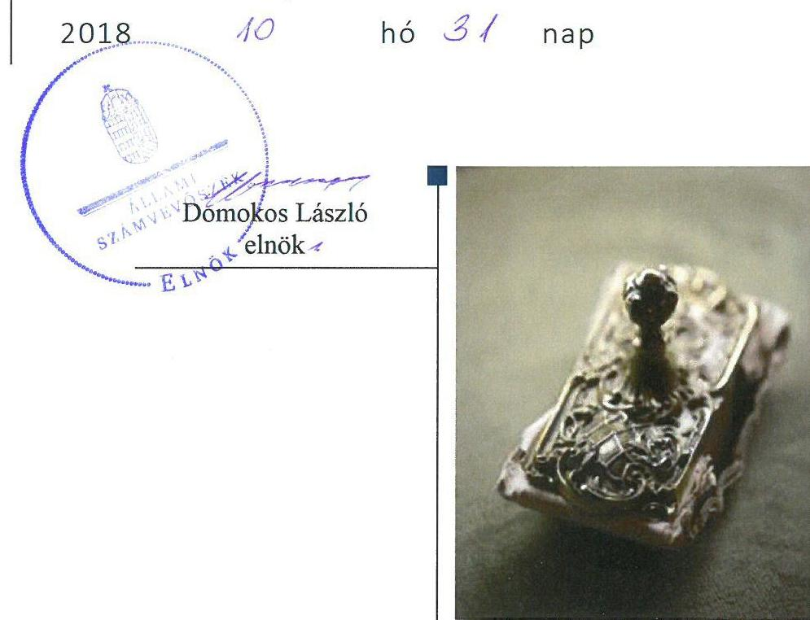
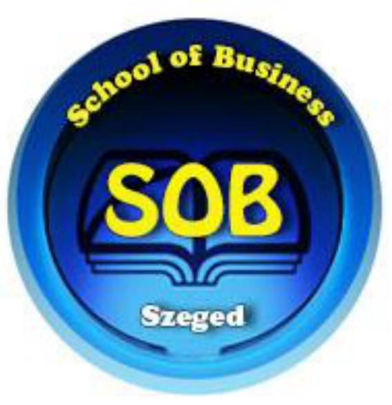
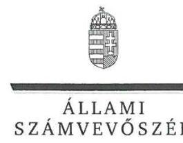
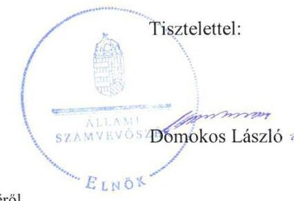

# Jelentés 

## Nem állami humánszolgáltatók ellenőrzése

A humánszolgáltatást nyújtó államháztartáson kívüli köznevelési és szociális intézmények, szolgáltatók fenntartói központi költségvetésből kapott támogatásai felhasználásának ellenőrzése - School of Business Vezetőképző és Tanácsadó Közhasznú Nonprofit Kft.
2018.

---

# Jelentés 

## Nem állami humánszolgáltatók ellenőrzése

A humánszolgáltatást nyújtó államháztartáson kívüli köznevelési és szociális intézmények, szolgáltatók fenntartói központi költségvetésből kapott támogatásai felhasználásának ellenőrzése - School of Business Vezetőképző és Tanácsadó Közhasznú Nonprofit Kft.

---

# AZ ELLENŐRZÉST FELÜGYELTE:

- **SALAMON ILDIKÓ** felügyeleti vezető
- **DR. NAGY IMRE** felügyeleti vezető

# AZ ELLENŐRZÉST VEZETTE ÉS A VÉGREHAJTÁSÁÉRT FELELŐS:

- **DR. KOVÁCS DIÁNA** ellenőrzésvezető

# A PROGRAM ÖSSZEÁLLÍTÁSÁÉRT FELELŐS:

- **TÓTPÁL SZABOLCS** osztályvezető

**IKTATÓSZÁM:** EL-0440-014/2018.

**TÉMASZÁM:** 2448

**ELLENŐRZÉS-AZONOSÍTÓ SZÁM:** V079414

Jelentéseink az Országgyűlés számítógépes hálózatán és az Interneta a www.asz.hu címen is olvashatóak.

---

# TARTALOMJEGYZÉK 

■ ÖSSZEGZÉS ..... 5
■ AZ ELLENŐRZÉS CÉLJA ..... 6
■ AZ ELLENŐRZÉS TERÜLETE ..... 7
■ AZ ELLENŐRZÉS HÁTTERE, INDOKOLTSÁGA ..... 8
■ A JELENTÉS LÉNYEGES KÉRDÉSKÖREI ..... 9
■ AZ ELLENŐRZÉS HATÓKÖRE ÉS MÓDSZEREI ..... 10
■ MEGÁLLAPÍTÁSOK ..... 12
■ JAVASLATOK ..... 15
■ MELLÉKLETEK ..... 17
I. sz. melléklet: Értelmező szótár ..... 17
II. sz. melléklet: A központi költségvetési támogatások alakulása ..... 19
■ FÜGGELÉK: ÉSZREVÉTELEK ..... 21
■ RÖVIDÍTÉSEK JEGYZÉKE ..... 27

---

.

---

# ÖSSZEGZÉS 

A School of Business Vezetőképző és Tanácsadó Közhasznú Nonprofit Kft. a köznevelési közfeladathoz biztositott központi költségvetési támogatásokat nem szabályszerüen tartotta nyilván, az átláthatóságot és az elszámoltathatóságot nem biztositotta. A köznevelési intézmények müködtetéséhez felhasznált közpénzekre vonatkozó elszámolása nem volt átlátható. Egy köznevelési intézmény vonatkozásában a bizonylat-megőrzési kötelezettségének nem tett eleget, a közpénzfelhasználás ellenőrizhetőségét nem biztositotta.

## Az ellenőrzés társadalmi indokoltsága

Az Állami Számvevőszék stratégiájában hangsúlyos szerepet szán annak, hogy szilárd szakmai alapon álló, értékteremtő ellenőrzéseivel előmozdítsa a közpénzügyek átláthatóságát, rendezettségét és javaslataival a közpénzek és a közvagyon szabályos, gazdaságos, hatékony és eredményes felhasználását segítse. Az Állami Számvevőszék a stratégiájában célul tűzte ki, hogy az államháztartáson kívülre nyújtott költségvetési támogatások ellenőrzésével hozzájárul ahhoz, hogy a közpénzeket az államháztartáson kívüli szervezetek is átlátható módon használják fel a közfeladatok szerződésben vállalt ellátása érdekében. Az Állami Számvevőszék e stratégiai céljaival összhangban - az Állami Számvevőszékről szóló 2011. évi LXVI. törvény felhatalmazása alapján - végzi a központi költségvetésből származó források, nyújtott támogatások - kedvezményezett szervezetek közfeladat ellátásához való - felhasználásának az ellenőrzését. Hozzájárul ezzel ahhoz is, hogy a nyilvánosság és az igénybevevők megfelelő tájékoztatást kapjanak az államháztartáson kívüli közfeladatot ellátók múködéséről.

## Főbb megállapítások, következtetések, javaslatok

A School of Business Vezetőképző és Tanácsadó Közhasznú Nonprofit Kft. a köznevelési intézményei múködésének feltételeit nem szabályszerűen biztosította. Nem biztosította a központi költségvetési támogatások elkülönített nyilvántartását és nem gondoskodott arról, hogy a támogatások cél szerinti felhasználása alapfeladatonként megállapítható legyen.

A School of Business Vezetőképző és Tanácsadó Közhasznú Nonprofit Kft. a köznevelési intézményei müködtetéséhez felhasznált közpénzekkel a nyilvánosság előtt nem számolt el szabályszerűen, az átláthatóságot nem biztosította. Az ellenőrzési feladatait nem szabályszerűen látta el, a külső ellenőrzésekkel kapcsolatos kötelezettségeit szabályszerűen teljesítette.

A School of Business Vezetőképző és Tanácsadó Közhasznú Nonprofit Kft. egy köznevelési intézmény vonatkozásában a bizonylat-megőrzési kötelezettségét nem teljesítette, így a 2014-2016. között igénybe vett költségvetési támogatások felhasználásának ellenőrizhetőségét nem biztosította.

Az Állami Számvevőszék a School of Business Vezetőképző és Tanácsadó Közhasznú Nonprofit Kft. ügyvezetőjének hat javaslatot fogalmazott meg a köznevelési intézmények könyvvezetési, beszámoló készítési kötelezettségének megállapításával, a létrehozott szervezetek besorolásával, a köznevelési intézmények vezetőinek kinevezésével, megbízásával, a költségvetési támogatások felhasználásának nyilvántartásával, a támogatások felhasználására vonatkozó adatok valódiságának a megfelelő nyilvántartással, szakmai és pénzügyi dokumentációval való alátámasztásával, a kötelezően közzéteendő adatokra vonatkozó kötelezettség teljesítésének részletes szabályozásával kapcsolatban és a közzétételi kötelezettség teljesítésére vonatkozóan.

---

# AZ ELLENŐRZÉS CÉLJA

**AZ ELLENŐRZÉS CÉLJA** annak értékelése, hogy a School of Business Vezetőképző és Tanácsadó Közhasznú Nonprofit Kft. mint Fenntartó¹ központi költségvetésből kapott támogatásainak felhasználása szabályszerű volt-e, a támogatások igénylése, évközi módosítása és év végi elszámolása megfelelte-e a jogszabályi előírásoknak.

---

# AZ ELLENŐRZÉS TERÜLETE 

## School of Business Vezetőképző és Tanácsadó Közhasznú Nonprofit Kft.

A szegedi székhelyű Fenntartót School of Business Vezetőképző és Tanácsadó Közhasznú Társaság néven 2009. január 23-án két magánszemély alapította. A Fenntartó tulajdonosi szerkezetében az ellenőrzött időszakban nem történt változás.

A Fenntartó az ellenőrzött időszakban a szakmai középfokú oktatási tevékenységét az általa múködtetett szegedi, nagykállói, székesfehérvári és zalaegerszegi köznevelési intézményekben és azok tagintézményeiben végezte. A köznevelési intézmények alapfeladatai közé szakgimnáziumi nevelés-oktatás, szakközépiskolai nevelés-oktatás és felnőttoktatás tartozott. A Fenntartó az ellenőrzött időszakban közhasznú szervezetként múködött.

A Fenntartó képviseletére két ügyvezető önállóan volt jogosult, a munkáltatói jogokat az egyik ügyvezető gyakorolta.

A Fenntartó a köznevelési intézmények számára részleges gazdálkodási önállóságot biztosított, a költségvetésüket a Fenntartó jóváhagyta. A köznevelési intézmények számára a könyvvezetést a Fenntartó végezte.

A Fenntartó köznevelési célra átlagbéralapú normatív köznevelési támogatás és tankönyvtámogatás igénybevételére volt jogosult.

A Fenntartó Magyarország éves központi költségvetéséből a Kincstár ${ }^{2}$ elszámolási határozatai alapján 2014-ben 345,0 M Ft, 2015-ben 333,5 M Ft, 2016-ban 297,2 M Ft támogatást kapott. A II. melléklet tartalmazza az ellenőrzött központi költségvetési támogatások alakulását.

A Fenntartó beszámolójának könyvvizsgáló általi felülvizsgálata nem volt jogszabályi előírás, de a beszámoló hitelesítésével könyvvizsgálót bíztak meg.

A Fenntartó 2013/2014. tanévre szakképzési megállapodásokat kötött az illetékes kormányhivatalokkal, melyeket az ellenőrzött időszakban több alkalommal kiegészítettek és módosítottak.

A szakmai irányító szervi feladatokat az ellenőrzött időszakban az $\mathrm{EMMI}^{3}$ látta el, a törvényességi ellenőrzési feladatokat a területileg illetékes kormányhivatal végezte. A Fenntartó a köznevelési közfeladat ellátására tekintettel kapott közpénzekkel való gazdálkodásával a nyilvánosság előtt köteles volt elszámolni.

---

# AZ ELLENŐRZÉS HÁTTERE, INDOKOLTSÁGA 

A köznevelési feladatokat ellátó nem állami intézményfenntartók részére közfeladataik ellátására 2014-2016. években jelentős összegű pénzügyi támogatást biztosítottak a mindenkori költségvetési törvények a bennük megfogalmazott feltételek mellett.

A 2013. évben jelentős változások következtek be a normatív finanszírozás rendszerében. Az Országgyűlés elfogadta a nemzeti köznevelésről szóló 2011. évi CXC. törvényt, amely jelentősen átalakította a korábbi finanszírozási rendszert 2013 szeptemberétől. Új feladatfinanszírozási forma (átlagbéralapú támogatás) jelent meg, amely az államháztartáson kívüli intézményfenntartókra is vonatkozik. Az ellenőrzés a finanszírozási rendszerben 2011-2015 között bekövetkezett változásokra, azok közfeladat ellátásra gyakorolt hatására fókuszál a költségvetési támogatásokat felhasználó államháztartáson kívüli szervezetek körében. Az ellenőrzések indokoltságát az is alátámasztja, hogy az ÁSZ ${ }^{4}$ még nem ellenőrizte átfogóan e területet.

Az ÁSZ stratégiájában foglaltak alapján is indokolt az ellenőrzés, ami a társadalom számára jelzi, hogy a közpénz államháztartáson kívüli felhasználása sem maradhat ellenőrizetlenül. Az államháztartáson kívülre nyújtott költségvetési támogatások ellenőrzésével az ÁSZ hozzájárul ahhoz, hogy a közpénzeket a nem állami humán fenntartók átlátható módon használják fel a közfeladatok ellátására kötött szerződésekben vállalt kötelezettségek teljesítése érdekében. Az ellenőrzés javaslataival hozzájárul az említett rendszerek szabályszerű támogatás felhasználásához, javítja a társadalmigazdasági döntések megalapozottságát, ami a „jó kormányzás" feltétele.

---

# A JELENTÉS LÉNYEGES KÉRDÉSKÖREI 

1. A köznevelési közfeladatot ellátó Fenntartó szabályszerű müködési és gazdálkodási környezet kialakításával megteremtette-e a költségvetési támogatások átlátható, elszámoltatható igénybevételének, felhasználásának feltételeit?
2. A Fenntartó az átvállalt köznevelési közfeladathoz biztositott költségvetési támogatásokat szabályszerűen fordította-e a humánszolgáltató intézményei müködtetésére?
3. A Fenntartó a köznevelési intézményei müködtetéséhez felhasznált közpénzekre vonatkozó gazdálkodásával a nyilvánosság előtt elszámolt-e, ennek megalapozása érdekében ellenőrzési, értékelési és a külső ellenőrzésekkel kapcsolatos intézkedési feladatait szabályszerűen látta-e el?

---

# AZ ELLENŐRZÉS HATÓKÖRE ÉS MÓDSZEREI 

## Az ellenőrzés típusa

Megfelelőségi ellenőrzés.

## Az ellenőrzött időszak

A 2014. január 1-je és 2016. december 31-e közötti időszak.

## Az ellenőrzés tárgya

Az ellenőrzés a köznevelési közfeladatokat ellátó Fenntartó humánszolgáltatási közfeladatai ellátásához a költségvetési törvényekben biztosított központi költségvetési támogatások igénylése, évközi módosítása és év végi elszámolása Fenntartói feladatainak ellátása, illetve e központi költségvetésből kapott támogatások humánszolgáltatási közfeladatokra való Fenntartó általi felhasználása szabályszerűségének értékelésére terjedt ki.

Az ellenőrzés kiterjedt minden olyan körülményre és adatra, amely az ÁSZ jogszabályban meghatározott feladatainak teljesítéséhez, valamint a program végrehajtása folyamán felmerült újabb összefüggések feltárásához szükséges volt.

## Az ellenőrzött szervezet

School of Business Vezetőképző és Tanácsadó Közhasznú Nonprofit Kft.

## Az ellenőrzés jogalapja

Az ellenőrzés jogszabályi alapját az ÁSZ tv. ${ }^{5}$ 1. § (3) bekezdése, valamint az 5. § (3) bekezdésében foglalt előírások adták.

## Az ellenőrzés módszerei

Az ellenőrzést az ellenőrzési program szempontjai, kérdései, az ellenőrzött időszakban hatályos jogszabályok, a nemzetközi standardokat irányadónak tekintve, az ellenőrzés szakmai szabályok és módszertanok figyelembevételével végezte az ÁSZ. A közpénzekkel való felelős gazdálkodás segítésére irányuló javaslatok kidolgozásakor a hatályos jogszabályok voltak az irányadóak.

---

Az ellenőrzés ideje alatt az ellenőrzött szervezettel történő kapcsolattartást az ÁSZ SZMSZ ${ }^{6}$-ének vonatkozó előírásai alapján biztosította az ÁSZ.

Az ellenőrzési kérdések megválaszolásához szükséges bizonyítékok megszerzése az ellenőrzött által rendelkezésre bocsátott dokumentumokra, adatokra alapozva elemző eljárással történt.

Az ellenőrzési bizonyítékként felhasználható adatforrások közé tartoztak egyrészt a szakmai program részletes szempontjainál felsorolt adatforrások, másrészt minden - az ellenőrzés folyamán feltárt, az ellenőrzés szempontjából információt tartalmazó - dokumentum.

Az ellenőrzés lefolytatásához az ellenőrzött szervezet a kitöltött tanúsítványok, valamint az ÁSZ által kért dokumentumok elektronikus úton való megküldésével szolgáltatott adatokat, információkat. Az így rendelkezésre bocsátott adatok, információk és a tanúsítványok adatai valódiságának kontrollja az ellenőrzés keretében történt.

A fenntartott intézménynél helyszíni szemle keretében győződött meg az ÁSZ a tényleges feladatellátásról (verifikáció).

A köznevelési humánszolgáltatások központi költségvetési támogatásai igénylésével, módosításával, elszámolásával kapcsolatos, államháztartáson kívüli Fenntartó jogszabályokban előírt feladatai betartását, továbbá a központi költségvetési támogatások szabályszerű kezelését, nyilvántartását ellenőrizte az ÁSZ a Fenntartónál határozatok, nyilvántartások, beszámolók és egyéb dokumentumok alapján. Az ellenőrzés nem terjedt ki a köznevelési humánszolgáltatások központi költségvetési támogatásai igénylése, módosítása, elszámolása valódiságának, megalapozottságának, helyességének - sem a Fenntartónál, sem az intézményeknél való - értékelésére. Továbbá nem terjedt ki az ellenőrzés e források intézmény általi szabályszerű felhasználásának értékelésére. A szabályosság megítélésének alapját képezte, hogy a központi költségvetési támogatások Fenntartó általi igénylése, módosítása és elszámolása a Kincstár felé megtörtént.

---

# MEGÁLLAPÍTÁSOK 

## 1. A köznevelési közfeladatot ellátó Fenntartó szabályszerű múködési és gazdálkodási környezet kialakításával megterem-tette-e a költségvetési támogatások átlátható, elszámoltatható igénybevételének, felhasználásának feltételeit?

Összegző megállapítás A Fenntartó a szabályszerű múködési és gazdálkodási környezet kialakításával megteremtette a költségvetési támogatások igénybevételének, felhasználásának feltételeit.

A Fenntartó által a köznevelési közfeladat ellátásának megszervezése és a belső szabályozottságának kialakítása a jogszabályi előírások betartásával történt.

## 2. A Fenntartó az átvállalt köznevelési közfeladathoz biztosított költségvetési támogatásokat szabályszerűen fordította-e a humánszolgáltató intézményei múködtetésére?

Összegző megállapítás A Fenntartó az átvállalt köznevelési közfeladathoz biztosított költségvetési támogatásokat nem szabályszerűen fordította a köznevelési intézményei múködtetésére.
2.1. számú megállapítás

A Fenntartó a köznevelési intézmények működtetésének feltételeit nem szabályszerűen biztosította.

A Fenntartó egy intézménye vonatkozásában a pénzügyi, személyi és szervezeti feltételek meglétét nem igazolta, azok ellenőrizhetőségét nem biztosította, a Számv. tv. ${ }^{7}$ 169. § (2) bekezdésében foglalt iratmegőrzési kötelezettségének nem tett eleget.

A Fenntartó a köznevelési intézmények könyvvezetési, beszámoló készítési kötelezettségét a Számv. tv. 6. § (3) bekezdése ellenére nem állapította meg, a létrehozott szervezeteket a Számv. tv. 3. § (1) bekezdés 4. r) pontja szerinti szervezetek közé nem sorolta be.

A Fenntartó a Nkt. ${ }^{8}$ 83. § (2) bekezdés f) pontja ellenére nem gondoskodott 2014. január 1-től 2014. szeptember 1-ig tartó időtartamra a School of Business Zalaegerszeg Üzleti Szakképző Iskola vezetőjének és 2016. július 1-től a Teller Ede Szakközépiskola (2016. szeptember 1-től Teller Ede Szakgimnázium és Szakközépiskola) vezetőjének kinevezéséről, megbízásáról.

A Fenntartó valamennyi iskolára és tagintézményre, ezek tanulóira illetve a szolgáltatást igénybe vevőkre kiterjedő szabályzatot alkotott, a térítési díjak és a tandíj fizetéséről ${ }_{1,2,3}{ }^{9}$.

---

2.2. számú megállapítás

A Fenntartó az átvállalt köznevelési közfeladathoz kapott költségvetési támogatást nem szabályszerűen kezelte, felhasználását nem a jogszabály előírása szerint tartotta nyilván és intézményei nyilvántartásra vonatkozó dokumentumaival nem rendelkezett.

A Fenntartó az ellenőrzött időszakban a költségvetési támogatások felhasználását - a Nkt.vhr. ${ }^{10}$ 37/G. § (1) bekezdésben foglaltak ellenére - nem alapfeladatonkénti bontásban, elkülönítetten tartotta nyilván, továbbá nem gondoskodott olyan nyilvántartás kialakításáról, hogy abból megállapítható legyen, hogy a költségvetési támogatásokat milyen célra használta fel.

A Fenntartó megsértette a Nkt.vhr. 37/G. § (1) bekezdésében előírtakat, mert a támogatások felhasználására vonatkozó adatok valódiságát megfelelő nyilvántartással, szakmai és pénzügyi dokumentációval nem támasztotta alá.

# 3. A Fenntartó a köznevelési intézményei múködtetéséhez felhasznált közpénzekre vonatkozó gazdálkodásával a nyilvánosság előtt elszámolt-e, ennek megalapozása érdekében ellenőrzési, értékelési és a külső ellenőrzésekkel kapcsolatos intézkedési feladatait szabályszerűen látta-e el? 

Összegző megállapítás

### 3.1. számú megállapítás

A Fenntartó a köznevelési intézményei múködtetéséhez felhasznált közpénzekre vonatkozó gazdálkodásával a nyilvánosság előtt nem számolt el, az ellenőrzési, értékelési feladatait nem szabályszerűen látta el. A külső ellenőrzésekkel kapcsolatos intézkedési feladatait szabályszerűen ellátta.

A Fenntartó ellenőrzési, értékelési feladatait nem szabályszerűen látta el.

A Fenntartó az ellenőrzési, értékelési feladatok elvégzését egy köznevelési intézménynél nem igazolta, annak ellenőrizhetőségét nem biztosította, a Számv. tv. 169. § (2) bekezdésében foglalt bizonylat-megőrzési kötelezettségének nem tett eleget.

A Fenntartó a köznevelési intézményei múködtetéséhez felhasznált közpénzekre vonatkozó gazdálkodásával a nyilvánosság előtt nem számolt el.

A Fenntartó az Info. tv. ${ }^{11}$-ben előírtaknak megfelelően az általa kezelt adatok biztonságának, védelmének érvényre juttatásához szükséges eljárási szabályokat az IBSZ ${ }^{12}$-ben rögzítette.

A Fenntartó az Info tv. 35. § (3) bekezdés előírása ellenére belső szabályzatban nem állapította meg a kötelezően közzéteendő adatokra vonatkozó kötelezettség teljesítésének részletes szabályait, továbbá az Info. tv. 37. § (1) bekezdésében előírtak ellenére az Info. tv. 1. melléklete szerinti általános közzétételi listában meghatározott adatok közül az I. 6., II. 6.,

---

II. 13-17., valamint a III. 4.pontban meghatározott adatokat nem tette közzé.

A Fenntartó a Számv. tv. előírásainak megfelelően minden évben egyszerűsített éves beszámolókat készített, amelyek közzétételéről honlapján gondoskodott.

# 3.3. számú megállapítás 

## A Fenntartó a külső ellenőrzésekkel kapcsolatos intézkedési feladatait szabályszerűen ellátta.

A Fenntartónál és a zalaegerszegi, nagykállói, székesfehérvári intézményeinél a - Szabolcs-Szatmár-Bereg Megyei, Fejér Megyei, Zala Megyei, Békés Megyei - Kormányhivatal 2014. és 2016. évben törvényességi, 2014. évben hatósági ellenőrzéseket végzett. A Fenntartó az intézkedési kötelezettségének eleget tett. A Kincstár az évenkénti elszámolással kapcsolatos finanszírozási felülvizsgálatát elvégezte, az Nkt. vhr. 37/O. § (1) bekezdésében előírt négyévenkénti helyszíni ellenőrzésre az ellenőrzött időszakban nem került sor.

A Fenntartó egy köznevelési intézménye vonatkozásában a működtetéséhez felhasznált közpénzekre vonatkozó gazdálkodásának nyilvánosság előtti elszámolásához szükséges feltételek meglétét, továbbá a külső ellenőrzésekkel kapcsolatos intézkedési feladatok elvégzését nem igazolta, annak ellenőrizhetőségét nem biztosította, a Számv. tv. 169. § (2) bekezdésében foglalt bizonylat-megőrzési kötelezettségének nem tett eleget.

---

# JAVASLATOK 

Az ÁSZ tv. 33. § (1) bekezdésében foglaltak értelmében az ellenőrzött szervezet vezetője köteles a jelentésben foglalt megállapításokhoz kapcsolódó intézkedési tervet összeállítani és azt a jelentés kézhezvételétől számított 30 napon belül az ÁSZ részére megküldeni. Amennyiben az ellenőrzött szervezet vezetője nem küldi meg határidőben az intézkedési tervet, vagy továbbra sem elfogadható intézkedési tervet küld, az Állami Számvevőszék elnöke az ÁSZ tv. 33. § (3) bekezdése a) és b) pontjaiban foglaltakat érvényesítheti.

## A School of Business Vezetőképző és Tanácsadó Közhasznú Nonprofit Kft. ügyvezetőjének

1. Intézkedjen a Számv. tv. szerint a köznevelési intézmények könyvvezetési, beszámoló készittési kötelezettségének megállapításáról, a létrehozott szervezetek besorolásáról.
(2.1. sz. megállapítás 2. bekezdése alapján)
2. Gondoskodjon a köznevelési intézmények vezetőinek kinevezéséről, megbizásáról.
(2.1. sz. megállapítás 3. bekezdése alapján)
3. Intézkedjen, hogy a költségvetési támogatások felhasználásának nyilvántartása feleljen meg a jogszabályokban elöirtaknak.
(2.2. sz. megállapítás 1. bekezdése alapján)
4. Intézkedjen a támogatások felhasználására vonatkozó adatok valódiságának a megfelelő nyilvántartással, szakmai és pénzügyi dokumentációval való alátámasztásáról.
(2.2. sz. megállapítás 2. bekezdése alapján)
5. Belső szabályzatban állapítsa meg az Info tv. előírásai alapján a kötelezően közzéteendő adatokra vonatkozó kötelezettség teljesítésének részletes szabályait.
(3.2. sz. megállapítás 2. bekezdés 1. tagmondata alapján)
6. Tegyen eleget az Info tv.-ben elöirt közzétételi kötelezettségnek.
(3.2. sz. megállapítás 2. bekezdés 2. tagmondata alapján)

---

.

---

# MELLÉKLETEK 

- I. SZ. MELLÉKLET: ÉRTELMEZŐ SZÓTÁR
civil szervezet
humánszolgáltatás
költségvetési támogatás
köznevelési közfeladat

A Civil tv. 2. § 6. pontja szerint civil szervezet a civil társaság, a Magyarországon nyilvántartásba vett egyesület (a párt, a szakszervezet és a kölcsönös biztosító egyesület kivételével), a közalapítvány és a pártalapítvány kivételével az alapítvány.
Külön törvényben meghatározott szociális, gyermekjóléti, gyermekvédelmi, közoktatási, felsőoktatási, kulturális közfeladatok (2014. évi Kvtv. 34. § (1), (4) bekezdés, 1. számú melléklet XX/20/2. alcím, 19. alcím, 2015. évi Kvtv. 43. § (1), (4) bekezdés, 1. számú melléklet XX/20/2/3. jogcím csoport, 19. alcím, 2016. évi Kvtv. 41. § (1), (4) bekezdés, 1. számú melléklet XX/20/2/3. jogcím csoport, 19. alcím).
a társadalombiztosítás pénzügyi alapjai kivételével az államháztartás központi alrendszeréből ellenérték nélkül, pénzben nyújtott támogatások (Áht. ${ }^{13}$ 1. § 14. pont)
A költségvetési törvényekben (2013. évi CCXXX. törvény 33-34. §, 2014. évi C. törvény 4243. §, 2015. évi C. törvény 40-41. §) megállapított támogatás. A 2015. évi C. törvény 4041. § szerint többek között: Az Országgyűlés a köznevelési feladat ellátására átlagbéralapú támogatást állapít meg. A nevelési-oktatási, valamint pedagógiai szakszolgálati intézményt Fenntartó nemzetiségi önkormányzat, az egyházi és magán köznevelési intézmény Fenntartója részére az általuk fenntartott nevelési-oktatási intézményben, továbbá pedagógiai szakszolgálati intézményben pedagógus és - a b) pont kivételével - nevelőoktató munkát közvetlenül segítő munkakörben foglalkoztatottak után a 7. melléklet I. pontja, valamint az óvoda, egységes óvoda-bölcsőde esetében a 2. melléklet II. pont 1. alpontja szerint és az 5. alpontjában meghatározott jogosultak után, az őket ott megillető mértékek szerint. Múködési támogatást állapít meg a nemzetiségi önkormányzat vagy az egyházi jogi személy által fenntartott nevelési-oktatási intézményekben ellátott, továbbá a pedagógiai szakszolgálati intézményekben gyógypedagógiai tanácsadásban, korai fejlesztésben, oktatásban és gondozásban, valamint a fejlesztő nevelésben részt vevő gyermekekre, tanulókra tekintettel a nemzetiségi önkormányzat és a b----evett egyház részére a 7. melléklet II. pontja szerint.
Az Országgyűlés a szociális, gyermekjóléti, gyermekvédelmi közfeladatot ellátó intézményt, szolgáltatást Fenntartó egyházi jogi személy, civil szervezet, közalapítvány, országos nemzetiségi önkormányzat, települési vagy területi nemzetiségi önkormányzat, gazdasági társaság, és a humánszolgáltatást alaptevékenységként végző, az Szja tv. hatálya alá tartozó egyéni vállalkozó (a továbbiakban együtt: nem állami szociális Fenntartó) részére támogatást állapít meg a következők szerint: a támogatás a nem állami szociális Fenntartót a települési önkormányzatok 2. melléklet III. pont 3. alpont c)-k) pontjában és III. pont 5. alpont a) pontjában meghatározott támogatásaival azonos jogcímeken, öszszegben és feltételek mellett illeti meg.
A köznevelési intézmény alapító okiratában foglalt feladat: óvodai nevelés, nemzetiséghez tartozók óvodai nevelése, általános iskolai nevelés-oktatás, nemzetiséghez tartozók általános iskolai nevelése-oktatása, kollégiumi ellátás, nemzetiségi kollégiumi ellátás, gimnáziumi nevelés-oktatás, szakközépiskolai nevelés-oktatás, szakiskolai nevelés-oktatás, nemzetiség gimnáziumi nevelés-oktatása, nemzetiség szakközépiskolai nevelés-oktatása, nemzetiség szakiskolai nevelés-oktatása, Köznevelési Hidprogramok keretében folyó nevelés-oktatás, felnőttoktatás, alapfokú múvészetoktatás, fejlesztő nevelés, fejlesztő nevelés-oktatás, pedagógiai szakszolgálati feladat, a többi gyermekkel, tanulóval együtt nevelhető, oktatható sajátos nevelési igényű gyermekek, tanulók óvodai nevelése és iskolai nevelése-oktatása, azoknak a sajátos nevelési igényű gyermekeknek, tanulóknak az óvodai, iskolai, kollégiumi ellátása, akik a többi gyermekkel, tanulóval nem foglalkoztathatók együtt, a gyermekgyógyüdülőkben, egészségügyi intézményekben, rehabilitációs

---

## köznevelési intézmény

nem állami, nem önkormányzati (államháztartáson kívüli) intézmény Fenntartó
intézményekben tartós gyógykezelés alatt álló gyermekek tankötelezettségének teljesítéséhez szükséges oktatás, pedagógiai-szakmai szolgáltatás.
A nevelési- oktatási intézmény, pedagógiai szakszolgálati intézmény, pedagógiai-szakmai szolgáltatást nyújtó intézmény.
A köznevelési és szociális, gyermekjóléti és gyermekvédelmi közfeladatokat/humánszolgáltatásokat ellátó intézményt Fenntartó egyházi jogi személy, társadalmi szervezet, alapítvány, közalapítvány, civil szervezet, országos nemzetiségi önkormányzat, nonprofit gazdasági társaság, gazdasági társaság és a humánszolgáltatást alaptevékenységként végző, Szja tv. hatálya alá tartozó egyéni vállalkozó. (2013. évi Kvtv. 35. § (1), (3) bekezdés, 2014. évi Kvtv. 33. §, 34. § (1), (4) bekezdés, 2015. évi Kvtv. 42. §, 43. § (1), (4) bekezdés, 2016. évi Kvtv. 40. §, 41. § (1), (4) bekezdés)

---

II. SZ. MELLÉKLET: A KÖZPONTI KÖLTSÉGVETÉSI TÁMOGATÁSOK ALAKULÁSA

# A FENNTARTÓ ÁLTAL A KÖZNEVELÉSI FELADATHOZ KAPOTT KÖZPONTI KÖLTSÉGVETÉSI TÁMOGATÁS JOGCÍMENKÉNTI ALAKULÁSA (M FT)

|  Megnevezés | 2014. év | 2015. év | 2016. év  |
| --- | --- | --- | --- |
|  pedagógusok átlagbér alapú támogatása | 312,9 | 305,3 | 270,3  |
|  pedagógusok munkáját közvetlen segitők átlagbér
alapú támogatása | 31,4 | 27,7 | 26,6  |
|  tanulók ingyenes tankönyvellátásának támogatása | 0,7 | 0,5 | 0,3  |
|  Összesen | 345 | 333,5 | 297,2  |

Forrás: 2014-2016. évi költségvetési támogatás elszámolások kincstári határozatai

---

.

---

# FÜGGELÉK: ÉSZREVÉTELEK 

A jelentéstervezetet a Számvevőszék 15 napos észrevételezésre megküldte az ellenőrzött szervezet vezetőjének az ÁSZ tv. 29. §* (1) bekezdése előírásának megfelelően.

A School of Business Vezetőképző és Tanácsadó Közhasznú Nonprofit Kft. ügyvezetője élt az ÁSZ tv. 29. § (2) bekezdésében foglalt észrevételezési jogával, a törvényes határidőn belül észrevételt tett.
A függelék tartalmazza az ellenőrzött észrevételeit, illetve az el nem fogadott észrevételek elutasításának indoklását.

[^0]
[^0]:    * 29. § (1) Az Állami Számvevőszék az ellenőrzési megállapításait megküldi az ellenőrzött szervezet vezetőjének vagy az általa megbízott személynek, és annak, akinek személyes felelősségét állapította meg.
    (2) Az ellenőrzött szervezet vezetője és a felelősként megjelölt személy az ellenőrzés megállapításaira tizenöt napon belül írásban észrevételt tehet.
    (3) Az Állami Számvevőszék az észrevételre a beérkezésétől számított harminc napon belül írásban válaszol. A figyelembe nem vett észrevételeket köteles a jelentésben feltüntetni, és megindokolni, hogy azokat miért nem fogadta el.

---

# School of Business Nonprofit Kft. 

5600 Békéscsaba, Szabó Dezső u. 54. Telefon: (66) 443-282; Fax: (66) 549-140 E-mail: schoolbu@mail.globonet.hu Internet: http://www.sob.hu

Állami Számvevőszék
1052 Budapest, Apácai Csere János utca 10.
Elnökének
ikt.sz.: 60/2018
Domokos László Úr
Tárgy: észrevétel

Tisztelt Elnök Úr!
Hivatkozva az Állami Számvevőszék 2448 témaszámú EL-0727-133/2018 iktatószámú a „Nem állami humánszolgáltatók ellenőrzése - A humánszolgáltatást nyújtó államháztartáson kívüli köznevelési és szociális intézmények, szolgáltatók, fenntartói központi költségvetésböl kapott támogatási felhasználásának ellenőrzése - School of Business Vezetőképző és Tanácsadó Közhasznú Nonprofit Kft. " jelentéstervezetéhez az alábbi észrevételt kívánom tenni.

## A 2.1. és 3.1 számú megállapítás tévedés.

Nem nekünk kell az iratokat megőrizni. Az egy intézmény tekintetében a jogutódlás tényét igazoltuk, minden dokumentum átadásra került a jogutód Magyar Bencés Kongregáció Pannonhalmi Főapátságnak. A Számviteli törvény 169.§ (2) bekezdésében foglalt iratmegőrzés helye: Pannonhalma, Vár 1. Feltételezhető eleget fognak tenni az iratmegőrzési kötelezettségnek.

A hatályos Számviteli törvény 3.§ (1) bekezdés 4. pontja r) pontja alapján intézkedni fogok a hiánypótlásról. A korábban hatályos pont a jogszabályból törlésre került.

A Fenntartó gondoskodott a School of Business Zalaegerszeg Üzleti Szakképző Iskola vezetőjének és a Teller Ede Szakgimnázium és Szakközépiskola vezetőjének kinevezéséről, megbízásáról. Az erről szóló dokumentumok rendelkezésre állnak.

## A 2.2. számú megállapítás nem pontos

A Fenntartó a jogszabályban előirtaknak megfelelően - igazoltan -átadta az Intézményeknek a költségvetési támogatást. Így egyértelműen megállapítható, hogy a költségvetési támogatás milyen nappal került átadásra és milyen célból a köznevelési intézményeknek.

A fenntartó a támogatások felhasználását, az ingyenesség, tandíj, térítési díj megállapításával, beszedésével kapcsolatos rendelkezéseket elkülönítetten és naprakészen nyilvántartotta az intézményeinél.

School of Business Szakgimnázium és Szakközépiskola Zalaegerszeg alapfeladatai közül a 2014/2015-ös és 2015/2016-os tanévben a szakközépiskolai nevelés-oktatást, 2016. 09. 01.-től a szakgimnáziumi nevelésoktatást végezte. Életkora miatt egy-egy osztályban előfordult Felnőttoktatás Esti munkarendbe besorolt tanuló, aki szakgimnáziumi nevelés-oktatásban részesült. A könyvelésben, a főkönyvben az alapfaladatokérdi bontásban történő számítás elvégzéséről intézkedtem. Az Intézmény már megszűnt.

---

# School of Business Nonprofit Kft. 

5600 Békéscsaba, Szabó Dezső u. 54.
Telefon: (66) 443-282; Fax: (66) 549-140
E-mail: schoolbu@mail.globonet.hu
Internet: http://www.sob.hu

School of Business Szakgimnázium és Szakközépiskola alapfeladatai közül a 2014/2015-ös és 2015/2016-os tanévben a szakközépiskolai nevelés-oktatást, 2016. 09. 01.-től a szakgimnáziumi nevelésoktatást végezte, Életkora miatt egy-egy osztályban előfordult néhány Felnőttoktatás Esti munkarendbe besorolt tanuló, akik szakgimnáziumi nevelés-oktatásban részesültek.. A könyvelésben, a főkönyvben az alapfeladatonkénti bontásban történő számítás elvégzéséről intézkedtem. A tagintézmény már megszűnt.

Teller Ede Szakgimnázium a 2014/2015-ös és 2015/2016-os tanévben a szakközépiskolai nevelés-oktatást és a felnőttoktatást végezte, 2016. 09. 01.-től a szakgimnáziumi nevelés-oktatást végezte, a második alapfeladatra nem iskolázott be. Életkora miatt egy-egy osztályban előfordult néhány Felnőttoktatás Esti munkarendbe besorolt tanuló, akik szakgimnáziumi nevelés-oktatásban részesültek.. A könyvelésben, a főkönyvben az alapfeladatonkénti bontásban történő számítás elvégzéséről intézkedtem. Az iskola 2017-es nyilvántartások adatai alapján egyetlen alapfeladat maradt: szakgimnáziumi nevelés-oktatás. A két tagintézménye már megszűnt.

A 3.2. és 3.3 számú megállapítást elfogadjuk.

Kérem a fentieket figyelembe venni a jegyzőkönyvük végső értékelésében!
Békéscsaba, 2018. szeptember 18.

Tisztelettel:
Bokor József
ügyvezető

Mellékletek:

1) Átadás-átvételi megállapodás School of Business Vezetőképző és Tanácsadó Közhasznú Nonprofit Kft. (6720 Szeged, Tisza Lajos krt 12.) és Magyar Bencés Kongregáció Pannonhalmi Föapátság (9090 Pannonhalma, Vár 1.) között
2) Csongrád Megyei Kormányhivatal Szegedi Járási Hivatala Cs-06B/01/4781-10/2017. határozata az Intézmény jogutóddal való megszünéséről.
3) Mihályi Gyula igazgató kinevezése (Teller Ede Szakgimnázium..)
4) Tarjánné. Dr. Szabó Zsuzsanna kinevezése ( School of Business...Zalaegerszeg)

---

ELNÖK

# Bokor József úr 

ügyvezető

School of Business Vezetőképző és Tanácsadó Közhasznú Nonprofit Kft.

## Szeged

## Tisztelt Ügyvezető Úr!

A ,,Nem állami humánszolgáltatók ellenörzése - A humánszolgáltatást nyújtó államháztartáson ki-vüli köznevelési és szociális intézmények, szolgáltatók fenntartói központi költségvetésböl kapott támogatásai felhasználásának ellenörzése - School of Business Vezetőképzö és Tanácsadó Közhasznú Nonprofit Kft." címmel készített számvevőszéki jelentéstervezetre tett észrevételeit köszönettel megkaptam.
Az Állami Számvevőszék észrevételekre vonatkozó álláspontjáról a felügyeleti vezető által készített részletes tájékoztatást csatoltan megküldöm.
Tájékoztatom Ügyvezető urat, hogy a számvevőszéki jelentésben - az Állami Számvevőszékről szóló 2011. évi LXVI. törvény 29. § (3) bekezdése alapján - a figyelembe nem vett észrevételeket szerepeltetjük annak megindoklásával, hogy azokat miért nem fogadtuk el.

Budapest, 2018. 40. hó 43 nap

Melléklet: Tájékoztatás az észrevételek kezeléséről

---

# Tájékoztatás   az észrevételek kezeléséről 

A ,,Nem állami humánszolgáltatók ellenőrzése - A humánszolgáltatást nyújtó államháztartáson ki-vüli köznevelési és szociális intézmények, szolgáltatók fenntartói központi költségvetésböl kapott támogatásai felhasználásának ellenőrzése - School of Business Vezetőképzö és Tanácsadó Közhasznú Nonprofit Kft." címú jelentéstervezetre 2018. szeptember 18-án tett (az Állami Számvevőszékhez 2018. szeptember 25-én érkezett) észrevételét áttekintettük, annak kezelésével kapcsolatban a következő tájékoztatást adom.

1. A jelentéstervezet 2.1. számú megállapítás 1. bekezdésére, valamint a 3.1. számú megállapításra vonatkozó észrevétel:
Az észrevételben leírtak szerint az íratmegőrzési kötelezettségre tett megállapítás téves, mivel a School of Business Vezetőképző és Tanácsadó Közhasznú Nonprofit Kft. (Fenntartó) egy köznevelési intézményét és annak minden dokumentumát jogutódlással átadta a Magyar Bencés Kongregáció Pannonhalmi Fóapátságnak, így az íratmegőrzési kötelezettségnek a jogutód feltehetően eleget fog tenni.
Az észrevételt nem fogadjuk el. A Fenntartó az észrevételéhez csatolt dokumentumokat nem adta át az ellenőrzés részére, az adatszolgáltatásra rendelkezésre álló időben nem jelezte a köznevelési intézményének és a kapcsolódó bizonylatoknak időközbeni átadását. Az ügyvezető az ÁSZ adatbekéréseihez megküldött, 2018. február 14-én, illetve 2018. március 19-én kelt Teljességi és hitelességi nyilatkozataiban kijelentette, hogy az ÁSZ részére átadott dokumentumok, adatok a bekért adatokra, dokumentumokra vonatkozóan teljes körü információt tartalmaznak. Az észrevételhez benyújtott dokumentumokat az Állami Számvevőszék az ellenőrzés ezen szakaszában nem veszi figyelembe. Ellenőrzési dokumentumként csak az ÁSZ felhívására, az Állami Számvevőszékről szóló 2011. évi LXVI. törvény (ÁSZ tv.) 28. § (2) bekezdésében meghatározott adatszolgáltatási időszakon belül megküldött és a teljességi és hitelességi nyilatkozatban szereplő dokumentumok vehetők figyelembe.
Az észrevétel alapján a jelentéstervezet módosítása nem indokolt.

## 2. A jelentéstervezet 2.1. számú megállapítás 2. bekezdésére vonatkozó észrevétel:

Az észrevétel szerint a megállapításban feltárt intézményi besorolási hiányosságok pótlásáról intézkedni fognak.
Az észrevétel a megállapítást nem vitatja, a jelentéstervezet módosítása nem indokolt.

## 3. A jelentéstervezet 2.1. számú megállapítás 3. bekezdésére vonatkozó észrevétel:

Az észrevétel szerint a Fenntartó a két intézmény vezetőinek kinevezéséről gondoskodott, a kinevezésről szóló dokumentumok rendelkezésre állnak.

---

Az észrevételt nem fogadjuk el. Az észrevételhez benyújtott kinevezési dokumentumokat a 2018. március 19-én kelt Teljességi és hitelességi nyilatkozat 2.1.22. sorában az ,,ig kinevezések_2018031310051700.pdf" megnevezésủ, az ellenőrzés rendelkezésére bocsátott dokumentum nem tartalmazta. Az Állami Számvevőszék ellenőrzési megállapításait az adatbekérés folyamán bekért és az ellenőrzött által az ÁSZ rendelkezésére bocsátott adatok és dokumentumok alapján teszi meg, az ellenőrzése során a teljességi és hitelességi nyilatkozatban szereplő dokumentumokat használja fel. Az ÁSZ tv. 28. § (2) bekezdése értelmében a közremüködésre felhívott szervezet az Állami Számvevőszék részére - annak kérésére soron kívül, de legkésőbb öt munkanapon belül az ellenőrzés tervezhetősége, meghatározása, illetve lefolytatása érdekében szükséges adatokat és dokumentumokat rendelkezésre bocsátja, illetve a kapcsolódó tájékoztatást köteles megadni.
Az észrevétel alapján a jelentéstervezet módosítása nem indokolt.

# 4. A jelentéstervezet 2.2. számú megállapítására vonatkozó észrevétel: 

Az észrevételben leírtak szerint a megállapítás nem pontos, mert a Fenntartó igazoltan átadta az intézményeknek a költségvetési támogatást, továbbá annak felhasználását, az ingyenesség, tandíj, térítési díj megállapításával, beszedésével kapcsolatos rendelkezéseket elkülönítetten és naprakészen nyilvántartotta az intézményeknél. Az ügyvezető három, már megszűnt tagintézménye esetén a könyvelésben, a főkönyvben az alapfeladatonkénti bontásban történő számítás elvégzéséről intézkedett.
Az észrevételeket nem fogadjuk el. A Fenntartó a nemzeti köznevelésről szóló törvény végrehajtásáról szóló 229/2012. (VIII. 28.) Korm. rendelet 37/G. § (1) bekezdésének rendelkezését megsértve nem gondoskodott saját nyilvántartásai olyan kialakításáról, hogy abból megállapítható legyen, hogy a költségvetési támogatásokat milyen célra használta fel. A költségvetési támogatások felhasználására elkülönített nyilvántartás vezetési kötelezettséget nem írt elő, annak alapfeladatonkénti (gimnáziumi nevelés-oktatás, szakgimnáziumi nevelés-oktatás, kollégiumi ellátás, felnöttoktatás, különleges oktatást igénylő gyermekek nevelése-oktatása) naprakész, elkülönített megbontását nem tartotta nyilván, azt dokumentumokkal nem tudta alátámasztani. A támogatások cél szerinti felhasználása szabályszerű nyilvántartás hiányában nem volt megállapítható.
Az észrevétel alapján a jelentéstervezet módosítása nem indokolt.
Budapest, 2018. 10. hó 12. nap
Dr. Nagy Imre
felügyeleti vezető

---

# RÖVIDÍTÉSEK JEGYZÉKE 

${ }^{1}$ Fenntartó
${ }^{2}$ Kincstár
${ }^{3}$ EMMI
${ }^{4}$ ÁSZ
${ }^{5}$ ÁSZ tv.
${ }^{6}$ ÁSZ SZMSZ
${ }^{7}$ Számv. tv.
${ }^{8} \mathrm{Nkt}$.
${ }^{9}$ szabályzat a térítési díjak és a tandíj fizetéséről ${ }_{1,2,3}$
${ }^{10}$ Nkt. vhr.
${ }^{11}$ Info. tv.
${ }^{12}$ IBSZ
${ }^{13}$ Áht.

School of Business Vezetőképző és Tanácsadó Közhasznú Nonprofit Korlátolt Felelősségű Társaság (School of Business Vezetőképző és Tanácsadó Közhasznú Társaság)
Magyar Államkincstár
Emberi Erőforrások Minisztériuma
Állami Számvevőszék
az Állami Számvevőszékről szóló 2011. évi LXVI. törvény (hatályos: 2011. július 1-jétől)
az Állami Számvevőszék Szervezeti és Múködési Szabályzata
a számvitelről szóló 2000. évi C. törvény (hatályos: 2001. január 1-jétől)
a nemzeti köznevelésről szóló 2011. évi CXC. törvény (hatályos: 2012. szeptember 1-jétől)
School of Business Vezetőképző és Tanácsadó Közhasznú Nonprofit Kft szabályzat a térítési díjak és a tandíj fizetéséről ${ }_{1,2,3}$ (hatályosak: 2013. szeptember 1-től és 2015. július 1-től, 2016. július 1-től)
a nemzeti köznevelési törvény végrehajtásáról szóló 229/2012. (VIII. 28.) Korm. rendelet (hatályos: 2012. szeptember 1-jétől)
az információs önrendelkezési jogról és az információszabadságról szóló 2011. évi CXII. törvény (hatályos: 2011. július 27-től)
Informatikai és Biztonsági Szabályzat (hatályos 2013. szeptember 1-jétől)
az államháztartásról szóló 2011. évi CXCV. törvény (hatályos: 2012. január 1-jétől)

---

ÁLLAMI SZÁMVEVŐSZÉK
1052 Budapest, Apáczai Csere János utca 10.
Levélcím: 1364 Budapest 4. Pf. 54
Telefon: +36 14849100 Telefax: +36 14849200
www.asz.hu