# Jelentés

**Az országos nemzetiségi önkormányzatok fenntartásában levő intézmények gazdálkodásának ellenőrzése**

Miroslav Krleža Horvát Óvoda, Általános Iskola, Gimnázium és Kollégium

2018.

18291 www.asz.hu

---

# Jelentés 

## Az országos nemzetiségi önkormányzatok fenntartásában levő intézmények gazdálkodásának ellenőrzése

Miroslav Krleža Horvát Óvoda, Általános Iskola, Gimnázium és Kollégium
2018. 11. hó 06. nap
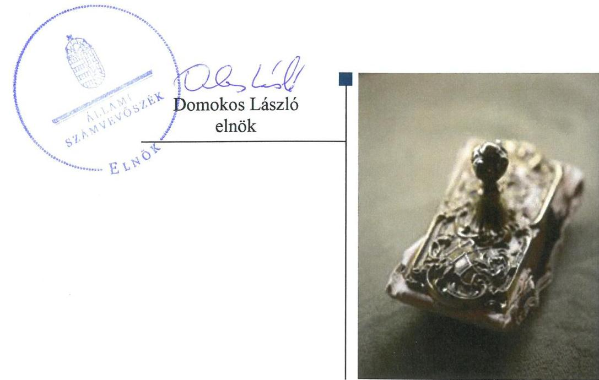

---

# AZ ELLENŐRZÉST FELÜGYELTE:

DR. NÉMETH ERZSÉBET felügyeleti vezető

## AZ ELLENŐRZÉST VEZETTE ÉS A VÉGREHAJTÁSÁÉRT FELELŐS:

DR. JAKAB KORNÉL ellenőrzésvezető

## A PROGRAM ÖSSZEÁLLÍTÁSÁÉRT FELELŐS:

TÓTPÁL SZABOLCS osztályvezető

IKTATÓSZÁM: EL-0364-021/2018.

TÉMASZÁM: 22

ELLENŐRZÉS-AZONOSÍTÓ SZÁM: V080604

Jelentéseink az Országgyűlés számítógépes hálózatán és az Interneta a www.asz.hu címen is olvashatóak.

---

# TARTALOMJEGYZÉK 

■ ÖSSZEGZÉS ..... 5
■ AZ ELLENŐRZÉS CÉLJA ..... 6
■ AZ ELLENŐRZÉS TERÜLETE ..... 7
■ AZ ELLENŐRZÉS HÁTTERE, INDOKOLTSÁGA ..... 8
■ A JELENTÉS LÉNYEGES KÉRDÉSKÖREI ..... 9
■ AZ ELLENŐRZÉS HATÓKÖRE ÉS MÓDSZEREI ..... 10
■ MEGÁLLAPÍTÁSOK ..... 12
■ JAVASLATOK ..... 17
■ MELLÉKLETEK ..... 19
I. sz. melléklet: Értelmező szótár ..... 19
■ FÜGGELÉK: ÉSZREVÉTELEK ..... 21
■ RÖVIDÍTÉSEK JEGYZÉKE ..... 37

---

.

---

# ÖSSZEGZÉS 

Az Országos Horvát Önkormányzat alapitási, irányitási és ellenőrzési jogkörgyakorlása a Miroslav Krleža Horvát Óvoda, Általános Iskola, Gimnázium és Kollégium felett szabályszerű volt. A Miroslav Krleža Horvát Óvoda, Általános Iskola, Gimnázium és Kollégium müködésének, gazdálkodásának szabályozottsága megfelelő volt. A pénzügyi gazdálkodás és a vagyongazdálkodás nem volt szabályszerű.

## Az ellenőrzés társadalmi indokoltsága

Magyarország Alaptörvényének XXIX. cikke kimondja, hogy a magyarországi nemzetiségek államalkotó tényezők. Joguk van anyanyelvük használatához, a sajátnyelven való névhasználathoz, saját kultúrájuk ápolásához és az anyanyelvű oktatáshoz. A nemzetiségek létrehozhatnak helyi és országos önkormányzatokat. A nemzetiségek jogaira vonatkozó részletes szabályokat Magyarországon sarkalatos törvény határozza meg. A nemzetiségi közfeladatok ellátásához az állami központi költségvetés támogatást nyújt, melyet a nemzetiségi önkormányzatok kizárólag e feladataik ellátására használhatnak fel.

## Főbb megállapítások, következtetések, javaslatok

Az Országos Horvát Önkormányzat a Miroslav Krleža Horvát Óvoda, Általános Iskola, Gimnázium és Kollégiummal kapcsolatos alapítási, irányítási, ellenőrzési és munkáltatói jogosultságokat szabályszerűen gyakorolta.

Az Intézmény ${ }^{1}$ működése és gazdálkodása szabályozási környezetének kialakítása szabályszerű volt. A kockázatkezelési rendszer kialakítása és múködtetése 2016. szeptember 30-ig szabályszerű volt, ezt követően nem volt szabályszerű, mert a jogszabályi előírás ellenére nem alakították ki a szervezeti integritást sértő események kezelésének eljárásrendjét, valamint az integrált kockázatkezelés eljárásrendjét. A kontrolltevékenység gyakorlása nem a jogszabályi előírásoknak megfelelően történt. Az információs és kommunikációs rendszer, a tevékenység és a célok megvalósításának folyamatos és eseti nyomon követését biztosító rendszer, valamint a belső ellenőrzés kialakítása és múködtetése szabályszerű volt.

A pénzügyi gazdálkodás, a bevételek beszedése és elszámolása, a kiadási előirányzatok felhasználása nem volt szabályszerű. Az Intézmény a bérbeadási folyamatok során a törvényi előírással ellentétben nem győződött meg az át-láthatóság követelményének érvényesüléséről. A dologi kiadásoknál a kötelezettségvállalás dokumentuma nem minden esetben állt rendelkezésre. A felhalmozási kiadásoknál a kötelezettségvállalás dokumentumán nem minden esetben szerepelt a pénzügyi ellenjegyzés, továbbá a jogi személlyel, jogi személyiséggel nem rendelkező szervezettel kötött visszterhes szerződések, a jogszabályi előírásokkal ellentétben nem tartalmazták a szervezet képviselőjének nyilatkozatát arra vonatkozóan, hogy átlátható szervezetnek minősül. A Kbt. ${ }^{2}$ előírásait az Intézmény betartotta.

Az előirányzat-maradvány megállapítása és elszámolása szabályszerű volt. Az Intézmény a jogszabályi előírásoknak megfelelően készítette el a költségvetési beszámolóit és teljesítette beszámolási kötelezettségét.

A vagyongazdálkodás nem volt szabályszerű. Az Intézmény a használatában lévő ingatlan(ok), illetve használt tárgyi eszközök vonatkozásában vagyonkezelési szerződéssel, vagy más megállapodással, vagy átadás-átvételi jegyzőkönyvvel nem rendelkezett.

---

# AZ ELLENŐRZÉS CÉLJA 

AZ ELLENŐRZÉS CÉLJA annak értékelése volt, hogy az országos nemzetiségi önkormányzatok által alapított és fenntartott intézmények gazdálkodása, a belső kontrollrendszer kialakítása és múködése, a fenntartó önkormányzat által nyújtott támogatás, illetve az államháztartásból meghatározott célra ingyenesen juttatott vagyon felhasználása a jogszabályi előírásoknak megfelelően történt-e.

---

# **AZ ELLENŐRZÉS TERÜLETE**

## **Miroslav Krleža Horvát Óvoda, Általános Iskola, Gimnázium és Kollégium**

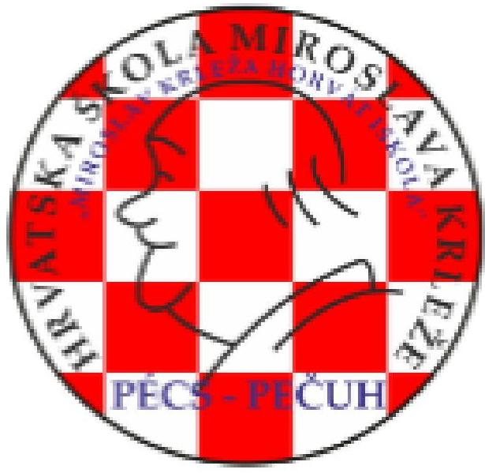

A pécsi székhelyű Miroslav Krleža Horvát Óvoda, Általános Iskola, Gimnázium és Kollégium fenntartói, alapítói és irányítói jogát Pécs Megyei Jogú Város Önkormányzata 2012. július 1-jével átadta az Országos Horvát Önkormányzatnak. Az Intézmény által használt ingatlanokat Pécs Megyei Jogú Város Önkormányzata 2012. november 16-án ellenérték nélkül az Önkormányzat kizárólagos tulajdonába adta.

Az Intézmény tekintetében az irányító szervi hatásköröket az Önkormányzat gyakorolta.

Az Intézmény az Njt.4 és a Nektv.5 szerinti közfeladata a horvát nemzetiségi köznevelési feladatok ellátása volt. A felvehető maximális tanuló létszáma 550 fő volt, ezen túl maximum 95 fő számára kollégiumi ellátást biztosított. A Miroslav Krleža Horvát Óvoda, Általános Iskola, Gimnázium és Kollégium Szombathelyi Tagóvodája 2016. szeptember 1-től kezdte meg működését egy óvodai csoporttal, 14 fős gyermeklétszámmal.

Az Intézmény gazdasági szervezettel rendelkezett, mely ellátta a pénzügyi-gazdálkodási feladatokat.

Az Iskolában a foglalkoztatott közalkalmazottak száma a 2014. évi 68 főről 2016-ra 74 főre emelkedett. A Miroslav Krleža Horvát Óvoda, Általános Iskola, Gimnázium és Kollégium intézményvezető igazgatója, valamint a gazdasági vezető személye az ellenőrzött időszakban nem változott. Az Intézmény ellenőrzött időszakban teljesített bevételeinek és kiadásainak alakulását az 1. ábra mutatja be.

1. ábra

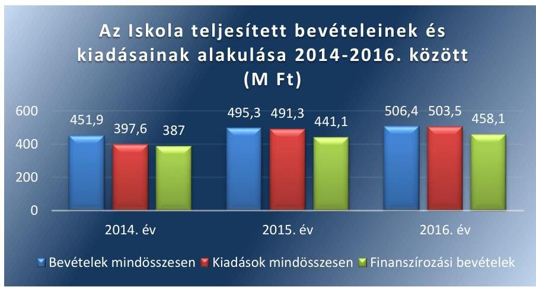

*Forrás: Az Iskola 2014-2016. évi éves költségvetési beszámolói*

Az Intézménynek az Áht.6 11. § szerinti átalakítására az ellenőrzött időszakban nem került sor.

---

# AZ ELLENŐRZÉS HÁTTERE, INDOKOLTSÁGA 

Az Alaptörvény ${ }^{7}$ XXIX. cikke kimondja, hogy a magyarországi nemzetiségek államalkotó tényezők. Joguk van anyanyelvük használatához, a saját nyelven való névhasználathoz, saját kultúrájuk ápolásához és az anyanyelvű oktatáshoz. A nemzetiségek létrehozhatnak helyi és országos önkormányzatokat. A nemzetiségek jogaira vonatkozó részletes szabályokat Magyarországon sarkalatos törvény határozza meg. A nemzetiségi közfeladatok ellátásához az állami központi költségvetés támogatást nyújt, melyet a nemzetiségi önkormányzatok kizárólag e feladataik ellátására használhatnak fel.

Az országos nemzetiségi önkormányzatok az általuk képviselt nemzetiség kulturális autonómiájának megteremtése érdekében intézményeket hozhatnak létre és vehetnek át. Az éves költségvetési törvények közvetlenül az intézményfenntartó országos nemzetiségi önkormányzatokhoz rendelik az általuk fenntartott intézmények működési támogatását. A nemzetiségi önkormányzati intézmények költségvetési gazdálkodásának, belső kontrollrendszerének kialakítása és működtetése ellenőrzésével biztosítjuk a közpénzfelhasználás minél szélesebb körének ellenőrzését, ennek során azonos szempontok szerint értékeljük az egyes országos nemzetiségi önkormányzatok fenntartásában levő intézmények gazdálkodási tevékenységét.

Az ellenőrzés eredményeként az ellenőrzött költségvetési szervek gazdálkodása javulhat, átfogó képet kaphatunk az országos nemzetiségi önkormányzatok által fenntartott intézmények gazdálkodásának sajátosságairól, hiányosságairól és az alkalmazott jó gyakorlatokról, erősítve a társadalmi bizalmat. Az ellenőrzés tapasztalatai alapján, hiányosságok feltárásával, azok megszüntetésére vonatkozó javaslatokkal hozzájárulunk a közpénzek átlátható, szabályszerű felhasználásához.

---

# A JELENTÉS LÉNYEGES KÉRDÉSKÖREI 

1. Az Önkormányzat szabályszerűen gyakorolta-e az Iskolával kapcsolatos feladatait?
2. Az Intézmény müködése és gazdálkodása során szabályszerűen alakította-e ki a szabályozási környezetet, belső kontrollrendszere megvédte-e a veszteségektől és nem rendeltetésszerü használattól az Intézmény erőforrásait?
3. Az Intézmény pénzügyi gazdálkodása szabályszerű volt-e?
4. Az Intézmény vagyongazdálkodása szabályszerű volt-e?

---

# AZ ELLENŐRZÉS HATÓKÖRE ÉS MÓDSZEREI 

## Az ellenőrzés típusa

Megfelelőségi ellenőrzés.

## Az ellenőrzött időszak

2014. január 1. - 2016. december 31.

## Az ellenőrzés tárgya

Az Állami Számvevőszék ellenőrzése tárgya az országos horvát önkormányzat által alapított és fenntartott intézmény gazdálkodása, a belső kontrollrendszer kialakítása és múködése, a fenntartó önkormányzat által nyújtott támogatás, illetve az államháztartásból meghatározott célra ingyenesen juttatott vagyon felhasználása jogszabályi előírásoknak való megfelelőségének értékelése volt. Az ellenőrzés feltárhatta a gazdálkodást, az átalakulását, átszervezését érintő szabályozások esetleges hiányosságait, a szabályozással nem érintett gazdálkodási területeket, rámutathatott a vagyongazdálkodási tevékenység - ezen belül kiemelten a tulajdonosi joggyakorlás és vagyonkezelés - esetleges szabálytalanságaira, illetve értékelte a nemzeti vagyon nyilvántartására és elszámolására vonatkozó eljárásokat.

## Az ellenőrzött szervezet

Miroslav Krleža Horvát Óvoda, Általános Iskola, Gimnázium és Kollégium és az Országos Horvát Önkormányzat.

## Az ellenőrzés jogalapja

Az ellenőrzés jogszabályi alapját az ÁSZ tv. ${ }^{8}$ 1. § (3) bekezdés, 5. § (2)-(6) bekezdései, valamint az Áht. 61. § (2) bekezdésének előírásai képezték.

## Az ellenőrzés módszerei

Az ellenőrzést az ellenőrzési program szempontjai, az ellenőrzött időszakban hatályos jogszabályok, az ellenőrzés szakmai szabályai, a jelen ellenőrzésre irányadó ÁSZ ${ }^{9}$ módszertanok figyelembevételével végeztük. Az ellenőrzési kérdések megválaszolásához szükséges bizonyítékok megszerzése az ellenőrzött által rendelkezésre bocsátott dokumentumokra, adatokra

---

alapozva, a kockázat alapú mintavételezés, valamint elemző eljárás útján történt.

Az országos nemzetiségi önkormányzatok által alapított és fenntartott intézmények gazdálkodása, a fenntartó önkormányzat által nyújtott támogatás, illetve az államháztartásból meghatározott célra ingyenesen juttatott vagyon felhasználása jogszabályi előírásoknak való megfelelőségét a 2014-2016. évek vonatkozásában értékeltük. Az intézmény belső kontrollrendszerének kialakítása és múködése szabályszerűségét, a gazdálkodási jogkörök gyakorlását a 2016. év vonatkozásában ítéljük meg.

A 2016. évi bevételek és a kiadások esetében az ellenőrzés azokra a legnagyobb értékű tételekre - a lényeges sokaságra - terjedt ki, melyek összértéke eléri a teljes sokaság összértékének 50\%-át. A kockázat alapú mintavételezés alapja, a gazdasági események értéknek nagysága volt. Az ellenőrzési bizonyítékként felhasználható adatforrások közé tartoztak egyrészt az ellenőrzési program részletes szempontjainál felsorolt adatforrások, másrészt minden egyéb - az ellenőrzés folyamán feltárt, az ellenőrzés szempontjából információt tartalmazó - dokumentum. Az ellenőrzés lefolytatásához az ellenőrzött szervezet a tanúsítványok kitöltésével, valamint az ÁSZ által kért dokumentumok megküldésével szolgáltatott adatokat.

Az ellenőrzés ideje alatt az ellenőrzött szervezettel történő kapcsolattartást az ÁSZ SZMSZ ${ }^{10}$-ének vonatkozó előírásai alapján biztosítottuk.

---

# 1. Az Önkormányzat szabályszerűen gyakorolta-e az Iskolával kapcsolatos feladatait? 

Összegző megállapítás

Az Iskolával kapcsolatos alapítási, egyéb irányítási és ellenőrzési jogosultságok gyakorlása szabályszerű volt. Az Önkormányzat a munkáltatói jogokat a jogszabályoknak megfelelően gyakorolta.

Az Intézmény Alapító Okirat ${ }_{1-2}{ }^{11}$-át az Önkormányzat az ellenőrzött időszakban az Ávr. ${ }^{12}$ előírásainak megfelelően módosította.

Az Intézmény SZMSZ ${ }_{13}{ }^{13}$-e a jogszabályi előírásoknak megfelelően került elfogadásra.

Az ellenőrzött időszakban az Országos Horvát Önkormányzat Közgyűlése az Áhsz. ${ }^{14}$-nek és az Ávr.-nek megfelelően jóváhagyta az Intézmény éves költségvetési beszámolóit és előirányzat-maradványát. Az Intézmény éves szakmai beszámolóit az Önkormányzat Közgyűlése ${ }^{15}$ minden esetben jóváhagyta.

Az irányító szerv az Intézmény igazgató ${ }^{16}$-ját beszámoltatta az éves szakmai feladatellátásról.

Az Önkormányzat mint irányító szerv, törvényességi, szakszerűségi és hatékonysági ellenőrzést végzett az Iskolánál.

Az Önkormányzat az Intézmény tekintetében a munkáltatói jogokat a jogszabályi előírásoknak megfelelően gyakorolta.

## 2. Az Intézmény müködése és gazdálkodása során szabályszerűen alakította-e ki a szabályozási környezetet, belső kontrollrendszere megvédte-e a veszteségektől és nem rendeltetésszerű használattól az Intézmény erőforrásait?

Összegző megállapítás

Az Intézmény müködése és gazdálkodása szabályozási környezetének kialakítása szabályszerű volt. Az Intézmény belső kontrollrendszere megvédte a veszteségektől és nem rendeltetésszerű használattól annak erőforrásait.
2.1. számú megállapítás

A kontrollkörnyezet kialakítása és müködtetése szabályszerű volt.
Az Intézmény Alapító Okirata ${ }_{1-2}$ megfelelő az Ávr. előírásainak. Az Intézmény SZMSZ-ében a Vnytv. ${ }^{17}$ 4. § a) pont előírásai ellenére nem határozták meg a vagyonnyilatkozat-tételi kötelezettséggel járó munkaköröket, azonban a Vagyonnyilatkozat-tételi Szabályzata ${ }^{18}$ a Vnytv. előírásainak megfelelően tartalmazta a vagyonnyilatkozat-tételi kötelezettséggel járó munkaköröket

---

és a vagyonnyilatkozat átadására, nyilvántartására, a vagyonnyilatkozatban foglalt személyes adatok védelmére vonatkozó szabályokat.

A gazdasági szervezet tevékenységét az Ávr.-ben előírt végzettséggel, szakképesítéssel rendelkező gazdasági vezető vezette. A gazdasági szervezet a jogszabályi előírásoknak megfelelő Ügyrend ${ }^{19}$-del rendelkezett.

Az Intézmény Gazdálkodási Szabályzatában a jogszabályi előírásoknak megfelelően szabályozta a kötelezettségvállalás, az utalványozás, a kötelezettségvállalás pénzügyi ellenjegyzése, az érvényesítés és a teljesítés igazolás rendjét, a szabályozás szintjén biztosította a tevékenységek feladatköri elkülönülését. A gazdálkodási jogkörök gyakorlóinak kijelölése megfelel az Ávr. előírásainak.

Az Intézmény rendelkezett a Bkr. ${ }^{20}$ előírásainak megfelelő Etikai Kó-dex ${ }^{21}$-el, amelyben megfogalmazták az Intézmény valamennyi közalkalmazottja számára az etikai elvárásokat.

Az Intézmény rendelkezett a gazdálkodás részletes rendjét és kontrollját meghatározó Gazdálkodási szabályzat ${ }^{22}$-tal, valamint a jogszabályi előírásoknak megfelelő Számviteli Politiká:II ${ }^{23}$-val és annak keretében elkészítendő szabályzatokkal.

Az Intézmény a Számlarendet alátámasztó Bizonylati renddel nem rendelkezett, mellyel megsértette a Számv. tv. ${ }^{24}$ 161. § (2) bekezdés d) pont előírását.

# 2.2. számú megállapítás 

## A kockázatkezelési rendszer kialakítása és múködtetése szabályszerű volt.

Az Igazgató 2016. szeptember 30-ig a Bkr. elő-írásának megfelelően múködtette az Intézmény kockázatkezelési rendszerét, valamint rendelkezett a szabálytalanságok kezelésének eljárásrendjével. 2016. október 1-jétől a Bkr. 6. § (4) bekezdése előírása ellenére nem szabályozta a szervezeti integritást sértő események kezelésének eljárásrendjét, valamint az integrált kockázatkezelés eljárásrendjét.

### 2.3. számú megállapítás

## Az integritás kontrollok megfelelően múködtek az Iskolánál.

Az Intézmény a jogszabályok által előírt kontrollokat kiépítette és múködtette, nyilvánossá tette az integritás elősegítése érdekében felállított céljait. Az Intézmény végzett kockázatelemzéseket, de ezek nem terjednek ki a korrupciós, integritási kockázatokra. Az Intézmény integritását a jogszabályok által előírt, a kockázatokkal arányosan kialakított kontrollok kiépítettsége támogatta. Az Intézmény múködtetett az integritást erősítő, nem kötelezően előírt kontrollokat.

### 2.4. számú megállapítás

## A kontrolltevékenység kialakítása szabályszerű volt, múködtetése nem volt szabályszerű

Az Intézmény vezetője kijelölte a gazdálkodási jogkörök gyakorlóit. A kontrolltevékenység gyakorlása nem a jogszabályi előírásoknak megfelelően történt. A kontrolltevékenység gyakorlásával kapcsolatos további részletes megállapítások a 3. pontban kerülnek bemutatásra.

---

# 2.5. számú megállapítás 

Az információs és kommunikációs folyamatok kialakítása és múködtetése az Iskolánál szabályszerű volt.

Az Igazgató a Bkr. előírásainak megfelelően kialakította az Intézmény információs és kommunikációs rendszerét, meghatározta a beszámolási szinteket, határidőket és módokat. Az Info tv. ${ }^{25}$ előírásának megfelelően az Igazgató a Közzétételi szabályzat ${ }^{26}$-ban és a Kommunikációs szabályzat ${ }^{27}$-ban kialakította a közzétételi listákon szereplő adatok közzétételének szabályait.

A kötelezően közzéteendő közérdekű adatok kezelési rendjének kialakítása és múködtetése nem felelt meg a 305/2005. (XII. 25.) Korm. rendelet ${ }^{28} 7$. § (1)-(2) bekezdéseinek, mert nem gondoskodtak az adatok közzétételével, helyesbítésével, frissítésével vagy eltávolításával kapcsolatos események (dátum, időpont, a közremúködő felhasználó neve) naplózásáról, a naplózott adatállomány megsemmisítése, illetéktelen személy általi módosítása, bejegyzések törlése vagy sorrendjének megváltoztatása elleni védelméről, a napló biztonsági mentéséről.

A Nektv. előírása szerint a köznevelési intézményben nyilvántartott és kezelt személyes és különleges adatok kezelésének és továbbításának rendjét az Intézmény Iratkezelési szabályzat ${ }^{29}$-ában határozták meg.

Az Intézmény az Áht. szerinti, az elemi költségvetésről és az éves költségvetési beszámolóról előírt adatszolgáltatási kötelezettségét teljesítette.
2.6. számú megállapítás

Az Igazgató a jogszabályi előírásoknak megfelelően alakította ki az Intézmény tevékenységének, a célok megvalósításának folyama-tos- és eseti nyomon követését biztosító rendszerét és a belső ellenőrzést.

Az Iskolában folytatott tevékenységek alapelveit, céljait, feladatait középtávon a Nevelési és Pedagógiai Program ${ }^{30}$-ban, rövidtávon a tanévekre vonatkozó Munkaterv ${ }_{i, 0}{ }^{31}$-ében határozták meg. Az Igazgató kialakította az Intézményben az operatív tevékenységek keretében megvalósuló folyamatos és eseti nyomon követés rendszerét.

A független belső ellenőrzés kialakítása és múködtetése a jogszabályi előírásoknak megfelelő volt.

Az Igazgató a Bkr. 14. § (1) bekezdése előírásai ellenére nem gondoskodott nyilvántartás vezetéséről a külső ellenőrzések javaslatai alapján készült intézkedési tervek végrehajtásáról.

Az Igazgató a Bkr. előírásainak megfelelően nyilatkozatban értékelte az Intézmény belső kontrollrendszerének minőségét, a nyilatkozatot a Bkr. előírásának megfelelő határidőn belül megküldte az Önkormányzatnak.

## 3. Az Intézmény pénzügyi gazdálkodása szabályszerű volt-e?

## Összegző megállapítás

Az Intézmény pénzügyi gazdálkodása nem volt szabályszerű.
A BEVÉTELEK beszedése és elszámolása, valamint a kiadási előirányzatok felhasználása nem felelt meg a jogszabályi előírásoknak.

---

Az Intézmény a bérbeadási folyamatok során a Nvtv. ${ }^{32}$ 11. § (10) bekezdés és (11) bekezdés a) pontjával ellentétben nem győződött meg az átláthatóság követelményének érvényesüléséről és nem írta elő a beszámolási, nyilvántartási, adatszolgáltatási kötelezettséget a bérbevevő számára.

A bérbeadáshoz és az értékesítéshez kapcsolódóan az utalványon az Ávr. 59. § (3) bekezdés e) pontjával ellentétben, egy esetben sem tüntették fel a bevétel egységes rovatrend és a kormányzati funkció szerinti számát és az Áhsz. szerinti könyvviteli számlájának számát.

A DOLOGI KIADÁSOK esetében az Áht. 37. § (1) bekezdésével ellentétben 10 esetben nem állt rendelkezésre a kötelezettségvállalás dokumentuma. Az Ávr. 50. § (1) bekezdés b) és c) pontjai ellenére négy esetben a kötelezettségvállalás dokumentuma nem tartalmazta a pénzügyi teljesítés módját és feltételeit, valamint a kifizetés határidejét.

A FELHALMOZÁSI KIADÁSOKNÁL kötelezettségvállalás pénzügyi ellenjegyzésénél egy mintatétel esetében az Áht. 37. § (1) bekezdésével és az Ávr. 55. § (1) bekezdésével ellentétben a kötelezettségvállalás dokumentuma nem tartalmazta a pénzügyi ellenjegyző aláírását. A felhalmozási kiadásoknál az Ávr. 50. § (1) bekezdése b) és c) pontjával ellentétben három mintatétel esetében a kötelezettségvállalás dokumentuma nem tartalmazta a pénzügyi teljesítés módját és feltételeit, valamint a kifizetés határidejét. A központi költségvetési kiadási előirányzatok terhére jogi személlyel, jogi személyiséggel nem rendelkező szervezettel kötött visszterhes szerződések az Ávr. 50. § (1a) bekezdésével ellentétben, egy esetben sem tartalmazták a szervezet képviselőjének nyilatkozatát arra vonatkozóan, hogy átlátható szervezetnek minősül.

AZ ELŐIRÁNYZAT-MARADVÁNY megállapítása és elszámolása szabályszerű volt. Az Áhsz. előírásának megfelelően az Intézmény részletező nyilvántartást vezetett a kötelezettségvállalással terhelt maradvány alátámasztásához.

Az Áhsz. előírásának megfelelően az éves költségvetési beszámoló minden ellenőrzött évben tartalmazta a maradvány kimutatást.

AZ INTÉZMÉNY a jogszabályi előírásoknak megfelelően készítette el a költségvetési beszámolóit és teljesítette beszámolási kötelezettségét.

# 4. Az Intézmény vagyongazdálkodása szabályszerű volt-e? 

## Összegző megállapítás Az Intézmény vagyongazdálkodása nem volt szabályszerű.

AZ INTÉZMÉNY a használatában lévő ingatlan(ok), illetve tárgyi eszközök vonatkozásában vagyonkezelési szerződéssel, vagy más megállapodással, vagy átadás-átvételi jegyzőkönyvvel nem rendelkezett, ezzel megsértette a Számv. tv. 165. § (2) bekezdésében foglaltakat, mivel a számviteli nyilvántartásban szabályszerű bizonylat hiányában rögzített adatokat.

A mérleg tételeinek alátámasztására az Intézmény a jogszabályoknak és a Leltározási és leltárkészítési szabályzat ${ }_{105}$ nak $^{33}$ megfelelően olyan leltárt

---

állított össze, amely tételesen, ellenőrizhető módon tartalmazta, a mérlegforduló napján meglévő eszközöket és forrásokat mennyiségben és értékben.

Az Intézmény az értékelési kötelezettségének eleget tett, az év végi értékelést az ellenőrzött időszakban elvégezte. A követelések, valamint a kötelezettségek analitikus nyilvántartását a jogszabályi előírásnak megfelelő tartalommal vezette.

---

# JAVASLATOK 

Az ÁSZ tv. 33. § (1) bekezdésében foglaltak értelmében az ellenőrzött szervezet vezetője köteles a jelentésben foglalt megállapításokhoz kapcsolódó intézkedési tervet összeállítani és azt a jelentés kézhezvételétől számított 30 napon belül az ÁSZ részére megküldeni. Amennyiben az ellenőrzött szervezet vezetője nem küldi meg határidőben az intézkedési tervet, vagy továbbra sem elfogadható intézkedési tervet küld, az Állami Számvevőszék elnöke az ÁSZ tv. 33. § (3) bekezdése a) és b) pontjaiban foglaltakat érvényesítheti.

## a Miroslav Krleza Horvát Óvoda, Általános Iskola, Gimnázium és Kollégium igazgatójának

1. Intézkedjen bizonylati rend elkészítéséről a Számv. tv. előírásainak megfelelően.
(2.1. sz. megállapítás 6. bekezdése alapján)
2. Szabályozza a Bkr. előírásainak megfelelően a szervezeti integritást sértő események kezelésének eljárásrendjét, valamint az integrált kockázatkezelés eljárásrendjét.
(2.2. sz. megállapítás 2. mondata alapján)
3. Gondoskodjon nyilvántartás vezetéséről a külső ellenőrzések javaslatai alapján készült intézkedési tervek végrehajtására vonatkozóan a Bkr. előírásainak megfelelően.
(2.6. sz. megállapítás 3. bekezdése alapján)
4. Gondoskodjon arról, hogy az Iskola bérbeadásra vonatkozó szerződést az Nvtv. előírásainak megfelelően csak természetes személlyel vagy átlátható szervezettel kössön, valamint hogy a szerződésben rögzítésre kerüljenek a beszámolási, nyilvántartási, adatszolgáltatási kötelezettségek.
(3. sz. megállapítás 2. bekezdése alapján)
5. Gondoskodjon a gazdálkodási jogkörök Ávr. előírásai szerinti gyakorlásáról.
(3. sz. megállapítás 3., 4. és 5. bekezdés 1-2. mondata alapján)

---

6. Gondoskodjon arról, hogy jogi személlyel, jogi személyiséggel nem rendelkező szervezettel kötött visszterhes szerződés az Avr. előírásainak megfelelően tartalmazza a szervezet képviselőjének nyilatkozatát arra vonatkozóan, hogy átlátható szervezetnek minősül..
(3. sz. megállapítás 5. bekezdésének 3. mondata alapján)
7. Intézkedjen arról, hogy a Számv. tv. előírásainak megfelelően, a számviteli nyilvántartásokba csak szabályszerűen kiállított bizonylat alapján történjen meg adatok bejegyzése.
(4. sz. megállapítás 1. bekezdése alapján)

---

# MELLÉKLETEK 

- I. SZ. MELLÉKLET: ÉRTELMEZŐ SZÓTÁR
irányító szerv
közfeladat
működtetés
nemzetiségi önkormányzat
nemzetiségi köznevelési intézmény
nemzetiségi többcélú intézmény
tulajdonosi joggyakorló
vagyongazdálkodás

A költségvetési szerv tekintetében az e törvényben meghatározott irányítási hatáskört gyakorló szerv. (Forrás: Áht. 1. § 9. pontja)
Jogszabályban meghatározott állami vagy önkormányzati feladat, amit az arra kötelezett közérdekből, a jogszabályban meghatározott követelményeknek és feltételeknek megfelelve végez, ideértve a lakosság közszolgáltatásokkal való ellátását, továbbá az állam nemzetközi szerződésekben vállalt kötelezettségeiből adódó közérdekű feladatokat, valamint e feladatok ellátásakor szükséges infrastruktúra biztosítását is. (Forrás: Nvtv. 3. § (1) bekezdés 7. pontja, hatálytalan: 2015. január 1-jétől)
„Közfeladat a jogszabályban meghatározott állami vagy önkormányzati feladat". A közfeladatok ellátása költségvetési szervek alapításával és múködtetésével, vagy azok ellátásához szükséges pénzügyi fedezet törvényben meghatározott eszközökkel, részben, vagy egészben történő biztosításával valósul meg. (Forrás: Áht. 3/A. § (1) bekezdés, hatályos 2015. január 1-jétől)
A nemzeti vagyon birtoklásából, használatából, hasznai szedéséből, a nemzeti vagyon fenntartásából és üzemeltetéséből álló tevékenységek együttese, amely - jogszabály vagy szerződés alapján - a nemzeti vagyon felújítására, fejlesztésére, a birtoklásának, használatának hasznai szedése jogának továbbengedésére is kiterjed. (Forrás: Nvtv. 3. § 10. pontja)

A nemzetiségek jogairól szóló törvényben meghatározott nemzetiségi közszolgáltatási feladatokat ellátó, testületi formában múködő, jogi személyiséggel rendelkező, demokratikus választások útján e törvény alapján létrehozott szervezet, amely a nemzetiségi közösséget megillető jogosultságok érvényesítésére, a nemzetiségek érdekeinek védelmére és képviseletére, a feladat- és hatáskörébe tartozó nemzetiségi közügyek települési, területi vagy országos szinten történő önálló intézésére jön létre. (Forrás: a nemzetiségek jogairól szóló 2011. évi CLXXIX. törvény, 2. § 2. pont) Az a köznevelési intézmény, amelynek alapító okirata a nemzeti köznevelésről szóló törvényben foglaltak szerint tartalmazza a nemzetiségi feladatok ellátását, feltéve, hogy e feladatokat a köznevelési intézmény ténylegesen ellátja, továbbá óvoda, iskola és kollégium esetén a tanulók legalább huszonöt százaléka részt vesz a nemzetiségi óvodai nevelésben, illetve a nemzetiségi iskolai nevelésben-oktatásban.
nemzetiségi többcélú intézményen, nemzetiségi tagintézményen és nemzetiségi köznevelési intézmény intézményegységén a köznevelési törvény szerinti többcélú intézmény, tagintézmény és intézményegység értendő (Forrás: Nemzetiségi tv. 2. § 4. pont b,)

Aki a nemzeti vagyon felett az államot vagy a helyi önkormányzatot megillető tulajdonosi jogok és kötelezettségek összességének gyakorlására jogosult. (Forrás: Nvtv. 3. § (1) bekezdés 17. pontja)

A nemzeti vagyongazdálkodás feladata a nemzeti vagyon rendeltetésének megfelelő, az állam, az önkormányzat mindenkori teherbíró képességéhez igazodó, elsődlegesen a közfeladatok ellátásához és a mindenkori társadalmi szükségletek kielégítéséhez szükséges, egységes elveken alapuló, átlátható, hatékony és költségtakarékos múködtetése, értékének megőrzése, állagának védelme, értéknövelő használata, hasznosítása, gyarapítása, továbbá az állam vagy a helyi önkormányzat feladatának ellátása szempontjából feleslegessé váló vagyontárgyak elidegenítése. (Forrás: Nvtv. 7. § (2) bekezdése)

---

nemzeti vagyon a) az állam vagy a helyi önkormányzat kizárólagos tulajdonában álló dolgok,
b) az a) pont hatálya alá nem tartozó, az állam vagy a helyi önkormányzat tulajdonában lévő dolog,
c) az állam vagy a helyi önkormányzat tulajdonában lévő pénzügyi eszközök, továbbá az államot vagy a helyi önkormányzatot megillető társasági részesedések,
d) az államot vagy a helyi önkormányzatot megillető bármely vagyoni értékkel rendelkező jogosultság, amelyet jogszabály vagyoni értékű jogként nevesít,
e) Magyarország határa által körbezárt terület feletti légtér,
f) az üvegházhatású gázok kibocsátási egységeinek kereskedelméről szóló törvény szerinti kibocsátási egység és légiközlekedési kibocsátási egység, valamint az ENSZ Éghajlatváltozási Keretegyezménye és annak Kiotói Jegyzőkönyv végrehajtási keretrendszeréről szóló törvény szerinti kiotói egység,
g) állami vagy helyi önkormányzati fenntartású közgyűjtemény (muzeális intézmény, levéltár, közgyűjteményként működő kép- és hangarchívum, valamint könyvtár) saját gyűjteményében nyilvántartott kulturális javak körébe tartozó dolog, kivéve, ha az állami vagy önkormányzati tulajdon jogszerű létrejötte kétséget kizáró módon nem bizonyítható és a dologra nézve más a tulajdonjogát bizonyítja vagy a kulturális javakra vonatkozó jogszabályokban meghatározott eljárás keretében valószínűsíti,
h) a régészeti lelet,
i) a nemzeti adatvagyon körébe tartozó állami nyilvántartások fokozottabb védelméről szóló törvény szerinti nemzeti adatvagyon.
(Forrás: Nvtv. 1.§ (2) bekezdés)

---

# FÜGGELÉK: ÉSZREVÉTELEK 

A jelentéstervezetet a Számvevőszék 15 napos észrevételezésre megküldte az ellenőrzött szervezet vezetőjének az ÁSZ tv. 29. §* (1) bekezdése előírásának megfelelően.

A Miroslav Krleža Horvát Óvoda, Általános Iskola, Gimnázium és Kollégium igazgatója, valamint Országos Horvát Önkormányzat elnöke a jelentéstervezet megállapításaira észrevételt tett.
A függelék tartalmazza az ellenőrzöttek észrevételeit, illetve az el nem fogadott észrevételek elutasításának indoklását.

[^0]
[^0]:    * 29. § (1) Az Állami Számvevőszék az ellenőrzési megállapításait megküldi az ellenőrzött szervezet vezetőjének vagy az általa megbízott személynek, és annak, akinek személyes felelősségét állapította meg.
    (2) Az ellenőrzött szervezet vezetője és a felelősként megjelölt személy az ellenőrzés megállapításaira tizenöt napon belül írásban észrevételt tehet.
    (3) Az Állami Számvevőszék az észrevételre a beérkezésétől számított harminc napon belül írásban válaszol. A figyelembe nem vett észrevételeket köteles a jelentésben feltüntetni, és megindokolni, hogy azokat miért nem fogadta el.

---

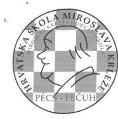

Hrvatski vrtić, osnovna škola, gimnazija i učenički dom Miroslava Krleže H-7624 Pečuh, Ulica Szigeti 97. Miroslav Krleža Horvát Óvoda, Általános Iskola, Gimnázium és Kollégium 7624 Pécs, Szigeti út 97. Tel\&fax: +36-72-252-657; 251-283; 256-283 Internet honlap: www.krleza.hu ; E-mail: info@krleza.hu

|  |   |
| --- | --- |
|  Iktatószám: 137-6/2018. | ÁLLAMI SZÁMVEVŐSZÉK  |
|   | ÚGYVITELI IRODA  |
|   | 2018 09 24  |
|   | iktatéden  |
|   | 2018-03-020/2018  |

Tárgy: Észrevétel az EL-0713-027/2018 a Számvevőszéki jelentés tervezethéź

Állami Számvevőszék

# Domokos László elnök úr

Budapest 4. Pf.: 54.

## Tisztelt Elnök Úr!

Köszönettel megkaptuk "Az országos nemzetiségi önkormányzatok fenntartásában lévő intézmények gazdálkodásának ellenőrzése - Miroslav Krleža Horvát Óvoda, Általános Iskola, Gimnázium és Kollégium" című ellenőrzésről készült EL-0713-027/2018 iktatószámú jelentéstervezet.

A jelentéstervezet megállapításainak és javaslataink a következő részével egyetértünk. A javaslatok között szereplő 1.-2. javaslatot, illetve az ahhoz szükséges megállapításokat elfogadjuk és mielőbbi kijavításáról Intézkedési terv alapján gondoskodunk. Az Állami Számvevőszékről szóló 2011. évi LXVI. törvény 29. § (2) bekezdése alapján az ellenőrzési jelentés megállapításaira az alábbi észrevételeket tesszünk:

1. A jelentés tervezet 15. oldal 1. bekezdéséhez: "Az intézmény a bérbeadási folyamatok során az Nvtv. 11. § (10) bekezdés és (11) bekezdés a) pontjával ellentétben nem győződött meg az átláthatóság követelményének az érvényesüléséről és nem írta elő a beszámolási, nyilvántartási, adatszolgáltatási kötelezettséget a bérbe vevő számára."

Az adatbekérés (EL-0713-005/2018) során nem került a 4. számú mellékletben külön rögzítésre a mintatételekhez az átláthatósági nyilatkozatok feltöltésének a szükségessége (ezeket - kellő információ hiánya miatt - nem töltöttük fel az előzetes adatszolgáltatás során ÁSZ Elektronikus Adatszolgáltatási Rendszerébe). Az ellenőrzéshez szükséges nyilatkozatokat a levelünkben az észrevételeinkkel együtt visszamenőlegesen pótoljuk (kivéve: a PSN Zrt.-t mert az 100\%-os önkormányzati tulajdonú - Pécs Megyei Jogú Város Önkormányzata) átlátható cég).

---

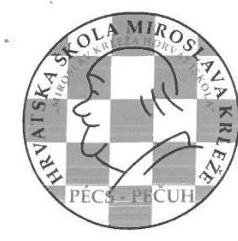

Hrvatski vrtić, osnovna škola, gimnazija i učenički dom Miroslava Krleže H-7624 Pečuh, Ulica Szigeti 97. Miroslav Krleža Horvát Óvoda, Általános Iskola, Gimnázium és Kollégium 7624 Pécs, Szigeti út 97. Tel\&fax: +36-72-252-657; 251-283; 256-283 Internet honlap: www.klleza.hu ; E-mail: info@krleza.hu
2. A jelentés tervezet 15. oldal 2. bekezdéséhez: "A bérbeadáshoz és az értékesítéshez kapcsolódóan az utalványon az Ávr. 59. § (3) bekezdés e) pontjával ellentétben, egy esetben sem tüntették fel a bevétel egységes rovatrend és a kormányzati funkció szerinti számát és az Áhsz. szerinti könyvviteli számlájának számát."

Az ellenőrzés alá vont dokumentumok feltöltése során lemaradt a bevételi utalványrendeletek 2. oldalainak a feltöltése (dokumentum behúzóval történt 1 oldalas scannalés miatt), amin a hiányolt adatok szerepelnek, de az ÁSZ Elektronikus Adatszolgáltatási Rendszerében a Mintavételezéshez szükséges adatállományok (11.3) -11.93 bérbeadás és 11.96 értékesítés - alatt a Dologi Kettős Könyvviteli rendszerünkből kimentve feltöltésre kerül és így, az ellenőrzéshez rendelkezésre áll minden esetben a lekönyvelt helyes:

- bevétel rovat száma,
- a kormányzati funkció
- és az Áhsz. szerinti könyvviteli számla száma.

Ennél a megállapításnál, illetve ennek a javaslatánál az ellenőrzés előkészítése során adatfeltöltési - és nem szabályszerűtlen gazdálkodási - hiba történt a vizsgált 2014-2016. évek során. A vizsgált 2014-2016. időszakban minden banki és pénztári tételnél teljes körűen - 2 oldalas - kiállított az Ávr. 59. (3) bekezdése előírásait tartalmazó bevételi (és kiadási) utalványrendelet alapján történt a gazdasági események főkönyvi könyvelési rendszerben történő rögzítése.

A mintavételezés 1 tételéhez tartozó - Kozármisleny Sportegyesület - bérleti díj bevételhez tartozó 2 oldalas utalványrendeletet mintául mellékeljük, (ugyanúgy a mintavételezéshez kiválasztott első kiadási - Gasztró-Terni - tétel két oldalas utalványrendeletét is).
3. A jelentés tervezet 15. oldal 3. bekezdéséhez: "A DOLOGI KIADÁSOK esetében az Áht. 37. § (1) bekezdésével ellentétben 11 esetben nem állt rendelkezésre a kötelezettségvállalás dokumentuma."

A dologi kiadások tekintetében 27 fájl került feltöltésre. A mintavételnél a Gasztro Terni Kft. két számlával szerepel - K1_Gasztro Terni_fuszertaru.pdf, K15_Gasztro Terni_fuszertaru.pdf az első fájl-ban került feltöltésre az egész 2016 évre vonatkozó Kötelezettségvállalás (adásvételi szerződés), így a K15_Gasztro Terni_fuszertaru.pdf-ben szereplő számlához a kötelezettségvállást tartalmazó szerződést még egyszer nem töltöttük fel. A Gasztro Terni Kft. összes 2016. évi számláira vonatkozó adásvételi szerződés a 12.99. a mintatételekhez kapcsolódóan a közbeszerzési eljárás(ok) lefolytatását igazoló dokumentumok, (kötelezettségvállalás analitika annak alátámasztására, hogy a szerződés részekre történő bontása nem történt meg, ajánlatok elbírálásának írásbeli összegzése, nyertessel megkötött szerződés pont alatt is megtalálható.
A mintavételben 9 db Dráva $Q$ vásárolt élelmezés számla szerepel. A feltöltés alkalmával a K6_Drava Q_elelmezes.pdf-ben szereplő 2016. áprilisi számla adatfeltöltés hiba miatt még egyszer feltöltésre került K4 Drava Q elelmezes.pdf-be, és így egy számla a 2016. júliusí viszont hiányzik, amelynek elején szerepel a 9 db Dráva Q számlára vonatkozó kötelezettségvállalás. Ezt a hiányzó dokumentumot az észrevételünkhez mellékeljük.

---

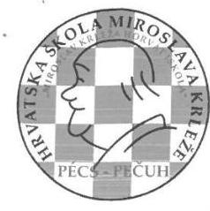

Hrvatski vrtić, osnovna škola, gimnazija i učeníčki dom Miroslava Krleže H-7624 Pečuh, Ulica Szigeti 97. Miroslav Krleža Horvát Ovoda, Általános Iskola, Gimnázium és Kollégium 7624 Pécs, Szigeti út 97. Tel\&fax: +36-72-252-657; 251-283; 256-283 Internet honlap: www.krleza.hu ; E-mail: info@krleza.hu

A Hungast Mecsek Kft. balatoni nyári táborra vonatkozó megrendelője (kötelezettségvállalása) a feltöltés során lemaradt, ezt utólag pótoljuk.
4. A jelentés tervezet 15. oldal 4. bekezdéséhez: "A FELHALMOZÁSI KIADÁSOKNÁL kötelezettségvállalás pénzügyi ellenjegyzésénél egy mintavétel esetében az Áht. 37. § (1) bekezdésével és az Ávr. 55. § (1) bekezdésével ellentétben a kötelezettségvállalás dokumentuma nem tartalmazta a pénzügyi ellenjegyző aláírását."

Az intézménynél megvalósított felhalmozási kiadások esetében az ÁSZ Elektronikus Adatszolgáltatási Rendszerében a Mintavételezéshez szükséges adatállományok 12.4 a 12.101. a felhalmozási kiadások elszámolásához kapcsolódó számviteli bizonylatok, az eszközök állományba vételével, értékcsökkenés elszámolásával kapcsolatos dokumentumok (üzembe helyezési okmány, eszköz karton), tulajdonosi joggyakorló engedélye dokumentumok:

K10_Alex Fembutor_oltozoszekeny.pdf
K13_Pecsi Gasztroker_mosogatogep_tart.pdf
K22_ASS_butor_iskolai.pdf
K23_Vasi_Raja_Felujitas_SZH.pdf
K24_Dligstar_sztech_eszkozok.pdf
K26_Mischl_szgk_vasarlas.pdf
K27_O es R_Pihenoudvar_letesites.pdf
K28_Unibau_felujitas.pdf
minden kiválasztott tétel tekintetében feltöltésre került a kötelezettségvállalás - szerződés, vagy megrendelő formájában (első példány) - és minden tétel esetében szerepel a pénzügyi ellenjegyzó aláírása.
5. A jelentés tervezet 15. oldal 4. bekezdéséhez: "A központi költségvetési kiadási elöirányzatok terhére jogi személlyel, jogi személyiséggel nem rendelkező szervezettel kötött visszterhes szerződések az Ávr, 50. § (1a) bekezdésével ellentétben, egy esetben sem tartalmazták a szervezet képviselőjének a nyilatkozatát arra vonatkozóan, hogy átlátható szervezetnek minősül."

Az adatbekérés során (EL-0713-005/2018) nem került a 4. számú mellékletben külön rögzítésre a mintatételekhez az átláthatósági nyilatkozatok feltöltésének a szükségessége (ezeket - kellő információ hiánya miatt - nem töltöttük fel az előzetes adatszolgáltatás során ÁSZ Elektronikus Adatszolgáltatási Rendszerébe). Az ellenőrzéshez szükséges nyilatkozatokat a levelünkben az észrevételeinkkel együtt pótoljuk (kivéve: a KELLO Könyvtárellátó Nonprofit Kft.-t, mert az 100\% állami tulajdonú átlátható cég).

---

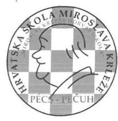

Hrvatski vrtić, osnovna škola, gimnazija i učenički dom Miroslava Krleže H-7624 Pečuh, Ulica Szigeti 97. Miroslav Krleža Horvát Óvoda, Általános Iskola, Gimnázium és Kollégium 7624 Pécs, Szigeti út 97.
Tel\&fax: +36-72-252-657; 251-283; 256-283
Internet honlap: www.krleza.hu ; E-mail: info@krleza.hu
6. A jelentés tervezet 15. oldal utolsó előtti bekezdéséhez: "AZ INTÉZMÉNY a használatában lévő ingatlan(ok), illetve tárgyi eszközök vonatkozásában vagyonkezelési szerződéssel, vagy más megállapodással, vagy átadás-átvételi jegyzőkönyvvel nem rendelkezett, ezzel megsértette a Számv.tv. 165. § (2) bekezdésében foglaltakat, mivel a számviteli nyilvántartásban szabályszerű bizonylat hiányában rögzített adatokat."

Az ÁSZ Elektronikus Adatszolgáltatási Rendszerében az Intézmények által beküldendő sarkalatos dokumentumok jegyzéke 5 alpontjához a Vagyonkezelési szerződés és/vagy vagyon használatba adási szerződés menüpontjában lettek feltöltve a vagyonnal kapcsolatos döntések és bizonylatok (Vagyonkezelesi_vagyonhasznalatbaadasi_szerz.pdf).

A vizsgált 2014-2016 időszak alatt két esetben kapott az intézmény fenntartójától vagyon elemeket;
2015. november 1-vel a Pécsi Iskolaközpont sportudvara vonatkozásában: nettó 14477 952,Ft ingatlanfelújítást lett Országos Horvát Önkormányzat Közgyülési 151/2015. (XII. 19.) határozata (a feltöltött bizonylat - Vagyonkezelesi_vagyonhasznalatbaadasi_szerz.pdf - 2830. oldala) és átadás-átvételi jegyzőkönyv (a feltöltött bizonylat Vagyonkezelesi_vagyonhasznalatbaadasi_szerz.pdf - 31-32. oldala) alapján az intézmény számára átadva.
2016. december 31-vel a Szombathelyi Tagóvoda vonatkozásában: nettó 12199 887,- Ft ingatlanfelújítást és 1120 479,- Ft tárgyi eszközt (továbbá 0-ra leírt tárgyi eszköz) lett Országos Horvát Önkormányzat Közgyülési 154/2016. (XII. 17.) határozata (a feltöltött -

Vagyonkezelesi_vagyonhasznalatbaadasi_szerz.pdf - bizonylat 40-42. oldala) és átadásátvételi jegyzőkönyv (a feltöltött bizonylat Vagyonkezelesi_vagyonhasznalatbaadasi_szerz.pdf - 43-45. oldala) alapján az intézmény számára átadva.

Az intézmény által megvalósított felhalmozási kiadások esetében az ÁSZ Elektronikus Adatszolgáltatási Rendszerében a Mintavételezéshez szükséges adatállományok 12.4 a 12.101. a felhalmozási kiadások elszámolásához kapcsolódó számviteli bizonylatok, az eszközök állományba vételével, értékcsökkenés elszámolásával kapcsolatos dokumentumok (üzembe helyezési okmány, eszköz karton), tulajdonosi joggyakorló engedélye dokumentumok mindegyike tekintetében feltöltésre került:

- a pénzügyileg ellenjegyzett szerződés, vagy megrendelő,
- a számla,
- az utalványrendelet,
- a tárgyi eszköz karton (nagy értékűek tekintetében állományba-vételi bizonylat is) 09_67_epuletek_20120701-tol.pdf; 09_67_egy_gep_20120701-tol.pdf; 09_67_ugyv_gep_20120701-tol.pdf; 09_67 0-taleirtugyv_gep_20180701tol.pdf;09_67 0-ra leirt_egy_geo_20170701-tol.pdf feltöltött bizonylataiban.

---

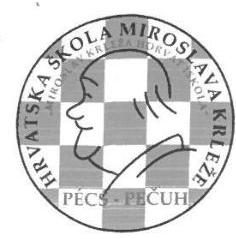

Hrvatski vrtić, osnovna škola, gimnazija i učeníčki dom Miroslava Krleže H-7624 Pečuh, Ulica Szigeti 97. Miroslav Krleža Horvát Óvoda, Általános Iskola, Gimnázium és Kollégium 7624 Pécs, Szigeti út 97.
Tel\&fax: +36-72-252-657; 251-283; 256-283
Internet honlap: www.krleza.hu ; E-mail: info@krleza.hu

Az intézmény minden gazdasági eseménye vonatkozásában, így a vagyonváltozással kapcsolatos (az ingatlanok és a tárgyi eszközök tekintetében is) a fökönyvi és az analitikus rendszerében, minden esetben külső, vagy belső bizonylat alapján - a Számv. tv . 165. § (2) bekezdése szerint - történt (illetve történik) csak könyvelés, adatrögzités.
Az Állami Számvevőszék ellenőrzési jelentésének 15. oldal 8. bekezdése megállapítása szerint: "Az intézmény a jogszabályi elöírásoknak megfelelően készítette el a költségvetési beszámolóit és teljesítette beszámolási kötelezettségét".
Ez azt jelenti az intézmény értelmezésében: hogy a Számv tv., az Áhsz, az Áht. az Ávr., a 38/2013. NGM rendelet, a Kbt., a Bkr., és további most az észrevételezés során fel nem sorolt és az ellenőrzési program II. mellékletében (rövidítések jegyzéke) rögzített jogszabályokban foglalt több száz szabállyal (§-sal, bekezdéssel és azok alpontjaival szemben a számvevői jelentés megállapítások 3. és 4. pontjában - a 14. és a 15 oldalon - 4 db jogszabály (az Áht., az Ávr., a Nntv.és a Számv. tv.) egy-egy bekezdése előirásaiknak 8 esetben (ebből 5 db esetben éltünk az észrevételezés lehetőségével, (a megállapítások és a javaslatok módosítás érdekében) nem felelt meg az intézmény pénzügyi és vagyongazdálkodása.
A fentiekben közölt aránytalanság miatt kérjük, hogy a megküldött számvevői jelentés 3. pontban szereplő főmegállapítást: "Az intézmény pénzügyi gazdálkodása nem volt szabályszerű" és a 4. pontban szereplő megállapítást "Az intézmény vagyongazdálkodása nem volt szabályszerű" korrigálni szíveskedjenek.
Tisztelt Elnök Úr! A leírtak alapján kérjük az észrevételeink figyelembevételét, illetve elfogadását és a végleges ellenőrzési jelentésen - annak az összegző és részletező megállapításaiban és a javaslataiban (5.-6.-7.) - történő átvezetését.

Pécs, 2018. szeptember 17.
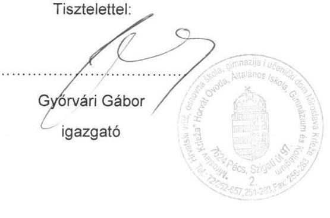

---

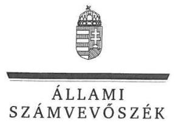

ELNÖK

Ikt.szám: EL-0713-031/2018

# Győrvári Gábor úr 

igazgató
Miroslav Krleža Horvát Óvoda, Általános Iskola, Gimnázium és Kollégium

## Pécs

## Tisztelt Igazgató Úr!

Köszönettel megkaptam „Az országos nemzetiségi önkormányzatok fenntartásában lévő intézmények gazdálkodásának ellenőrzése - Miroslav Krleža Horvát Óvoda, Általános Iskola, Gimnázium és Kollégium" címü jelentéstervezetre tett észrevételét.

Az ellenőrzési megállapításokra vonatkozó észrevételét az Állami Számvevőszékről szóló 2011. évi LXVI. törvény (a továbbiakban: ÁSZ tv.) 29. § (2) bekezdésében meghatározott tizenöt napos határidőn belül küldte meg. Az Állami Számvevőszék észrevétellel kapcsolatos álláspontját a mellékletként csatolt, a felügyeleti vezető által készített indokolás tartalmazza.

Tájékoztatom, hogy az Állami Számvevőszék a figyelembe nem vett észrevételeket az ÁSZ tv. 29. § (3) bekezdésében előírtak szerint köteles a jelentésében feltüntetni és megindokolni, hogy azokat miért nem fogadta el.

Budapest, 2018. (c) hó (.) nap

Melléklet: Észrevételre adott válasz
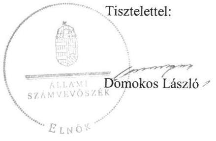

---

# „Az országos nemzetiségi önkormányzatok fenntartásában lévő intézmények gazdálkodásának ellenörzése - Miroslav Krleža Horvát Óvoda, Általános Iskola, Gimnázium és Kollégium" című jelentéstervezethez tett észrevételre adott válasz   Miroslav Krleža Horvát Óvoda, Általános Iskola, Gimnázium és Kollégium 

Igazgató úr jelentéstervezetre tett észrevételeit áttekintettem, annak kezelésével kapcsolatban a következő tájékoztatást adom.

1. A nemzeti vagyonról szóló 2011. évi CXCVL törvény (Nvtv.) 11. § (10) bekezdése alapján a nemzeti vagyon hasznosítására vonatkozó szerződés csak természetes személlyel vagy átlátható szervezettel köthető. A jelentéstervezet 3. összegző megállapításának 2. bekezdése szerint a Miroslav Krleža Horvát Óvoda, Általános Iskola, Gimnázium és Kollégium (Intézmény) a bérbeadási folyamatok során a Nvtv. előírásaival ellentétben nem győződött meg az átláthatóság követelményének érvényesüléséről.
Igazgató úr észrevételében jelzi, hogy az adatbekérés során nem került rögzítésre a mintatételekhez az átláthatósági nyilatkozatok feltöltésének szükségessége, így azokat nem töltötték fel az adatszolgáltatási rendszerbe. A levelükben a nyilatkozatokat pótlólagosan megküldték.
Az észrevétel kapcsán áttekintettük az ellenőrzés rendelkezésére bocsátott dokumentumokat. Ennek során megállapítottuk, hogy az Nvtv. átláthatóságra vonatkozó előírásainak teljesítését az adatszolgáltatásra biztosított határidőn belül rendelkezésre bocsátott dokumentumok nem igazolták. Felhívjuk továbbá a figyelmet arra, hogy az észrevétel mellékleteként megküldött dokumentumokat az Állami Számvevőszéknek már nem áll módjában figyelembe venni.
A fentiekre való tekintettel a megállapítás módosítása nem indokolt.
2. Az államháztartásról szóló törvény végrehajtásáról szóló 368/2011. (XII. 31.) Korm. rendelet (Ávr.) 59. § (3) bekezdés alapján utalványozáskor, a külön írásbeli rendelkezésen fel kell tüntetni többek között a bevétel, kiadás egységes rovatrend és kormányzati funkció szerinti számát, a terheléssel, jóváírással érintett pénzeszköz államháztartási számviteli kormányrendelet szerinti könyvviteli számlájának számát. A jelentéstervezet 3. összegző megállapítás 3. bekezdése szerint a bérbeadáshoz és az értékesítéshez kapcsolódóan az utalványon az előírásokkal ellentétben, egy esetben sem tüntették fel a bevétel egységes rovatrend és a kormányzati funkció szerinti számát és az Áhsz. szerinti könyvviteli számlájának számát. Igazgató úr a megállapítás kapcsán jelzi, hogy a bevételi utalványrendeletek 2. oldala lemaradt a feltöltés során, így az utalványrendeletek esetében feltöltési hiba történt. A levélhez csatolt mintaként egy kétoldalas utalványrendeletet.
Az észrevétel kapcsán áttekintettük az ellenőrzés rendelkezésére bocsátott dokumentumokat. A 2018. április 21 -én kelt teljességi és hitelességi nyilatkozatban Igazgató úr nyilatkozott arról, hogy az ott felsorolt dokumentumok a bekért adatokra vonatkozóan teljes körű információt tartalmaznak. Tekintettel arra, hogy az ellenőrzés rendelkezésére bocsátott utalványrendeleteken nem szerepelt a bevétel egységes rovatrend és a kormányzati funkció szerinti száma és az Áhsz. szerinti könyvviteli számlájának száma, a megállapítás módosítása nem indokolt. Az észrevétel mellékleteként megküldött dokumentumokat az Állami Számvevőszéknek már nem áll módjában figyelembe venni.

---

3. A jelentéstervezet 3. összegző megállapítás 4. bekezdése szerint a dologi kiadások esetében 11 esetben nem állt rendelkezésre a kötelezettségvállalás dokumentuma. Igazgató úr jelzi, hogy a dologi kiadások tekintetében 10 mintatételhez hiányosan kerültek feltöltésre dokumentumok, ezért azokat utólagosan megküldi.
Az adatszolgáltatásra biztosított határidőn belül az ellenőrzés rendelkezésére bocsátott dokumentumok ismételt áttekintését követően az észrevételt 1 mintatétel vonatkozásában elfogadjuk. Ugyanakkor felhívjuk a figyelmet, hogy az észrevétel mellékleteként megküldött dokumentumokat az Állami Számvevőszéknek nem áll módjában figyelembe venni.
Tekintettel arra, hogy az adatszolgáltatásra biztosított határidőn belül rendelkezésre bocsátott dokumentumok nem tartalmazták a kötelezettségvállalás dokumentumait az érintett 10 mintatétel esetében, a megállapítás módosítása ezen tételek esetében nem indokolt.
4. Az Ávr. 55. § (1) bekezdése alapján a pénzügyi ellenjegyzést a kötelezettségvállalás dokumentumán a pénzügyi ellenjegyzés dátumának és a pénzügyi ellenjegyzés tényére történő utalás megjelölésével, az arra jogosult személy aláírásával kell igazolni. A jelentéstervezet 3. összegző megállapításának 5. bekezdésében megállapítja, hogy a felhalmozási kiadásoknál, a kötelezettségvállalás pénzügyi ellenjegyzésénél egy mintatétel esetében a kötelezettségvállalás dokumentuma nem tartalmazta a pénzügyi ellenjegyző aláírását.
Igazgató úr álláspontja szerint minden kiválasztott tétel esetében szerepel a pénzügyi ellenjegyzö aláírása.
A dokumentumok ismételt áttekintése során megállapítottuk, hogy a K23 sz. tétel esetében, a 2016. július 30 -án megkötött vállalkozási szerződésen a pénzügyi ellenjegyzést az arra jogosult személy aláírásával nem igazolta, ezért a megállapítás módosítása nem indokolt.
5. Az Ávr. 50. § (1a) bekezdése szerint a jogi személlyel, jogi személyiséggel nem rendelkező szervezettel kötött visszterhes szerződés esetén az 50. § (1) bekezdés szerinti okiratnak az ott meghatározottakon túl tartalmaznia kell a szervezet képviselőjének nyilatkozatát arra vonatkozóan, hogy átlátható szervezetnek minősül. A jelentéstervezet 3. összegző megállapításának 5. bekezdésében foglaltak alapján a központi költségvetési kiadási előirányzatok terhére jogi személlyel, jogi személyiséggel nem rendelkező szervezettel kötött visszterhes szerződések egy esetben sem tartalmazták a szervezet képviselőjének átláthatósági nyilatkozatát.
Igazgató úr észrevételében jelzi, hogy az adatbekérés során nem került rögzítésre a mintatételekhez az átláthatósági nyilatkozatok feltöltésének szükségessége, így azokat nem töltötték fel az adatszolgáltatási rendszerbe. A levelükben a nyilatkozatokat pótlólagosan megküldték.
Az észrevétel kapcsán áttekintettük az ellenőrzés rendelkezésére bocsátott dokumentumokat. Megállapítottuk, hogy az adatbekérő levél 4. melléklete tartalmazta a mintatételek ellenőrzéséhez szükséges dokumentumok jegyzékét. Ennek 3. pontjában az ÁSZ többek között kérte megküldeni a mintatételekhez kapcsolódóan a megkötött értékesítési, bérleti szerződéseket. Tekintettel arra, hogy az ellenőrzés rendelkezésére bocsátott szerződések a jogszabályi előírással ellentétben nem tartalmazták a szükséges átláthatósági nyilatkozatokat, illetve az észrevételezés során megküldött dokumentumokat az Állami Számvevőszéknek nem áll módjában figyelembe venni, a megállapítás módosítása nem indokolt.
6. Igazgató úr észrevételében jelzi, hogy az adatszolgáltatás során feltöltésre kerültek a vagyonnal kapcsolatos mindazon döntések és bizonylatok, amelyek az ellenőrzött időszak eseményeire vonatkoznak, valamint minden gazdasági esemény vonatkozásában a fökönyvi és

---

az analitikus rendszerében, minden esetben bizonylat alapján, a törvényi előírások szerint történik.
Az ellenőrzés rendelkezésére bocsátott dokumentumok alapján a vagyonelemekkel kapcsolatos események (ingatlanfelújítások és tárgyi eszköz átadás) olyan ingatlanokhoz kapcsolódtak, amelyek nyilvántartása az Intézmény könyveiben, az 1. számlaosztályban történt. Tekintettel azonban arra, hogy ezen ingatlanok, illetve tárgyi eszközök vonatkozásában nem állt rendelkezésre olyan dokumentum (pl. korábbi vagyonkezelési szerződés, más megállapodás), amely a számviteli nyilvántartásban való rögzítést megalapozta volna, a megállapítás módosítása nem indokolt.

Budapest, 2018. 16 hó 15 nap
Tisztelettel:
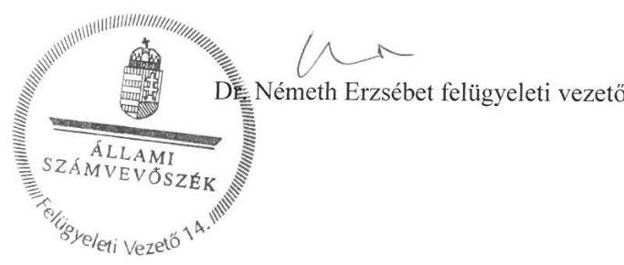

---

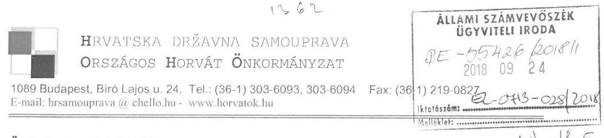

Ügyiratszám: 63-2/19-2018.

Tárgy: Önkormányzat fenntartásában lévő intézmények gazdálkodásának ellenőrzése

Domokos László
elnök

Állami Számvevőszék

Budapest

Tisztelt Elnök Úr!

Hivatkozva az Állami Számvevőszék EL-0713-026/2018. iktatószámú „Az országos nemzetiségi önkormányzatok fenntartásában lévő intézmények gazdálkodásának ellenőrzése - Miroslav Krleža Horvát Óvoda, Általános Iskola, Gimmázium és Kollégium" című jelentéstervezettel kapcsolatos megkeresésére az Országos Horvát Önkormányzat részéről alábbi véleményt fogalmazom meg:

A Számvevőszékij jelentéstervezetnek:

- az Országos Horvát Önkormányzatra vonatkozó intézmény alapítási, egyéb irányítási és ellenőrzései jogosultságok gyakorlásával kapcsolatos megállapításait tudomásul veszem, észrevételt nem kívánok tenni;
- az intézmény gazdálkodásának ellenőrzésére vonatkozó megállapításaival kapcsolatban támogatom a költségvetési szerv által megfogalmazott észrevételeket.

Kérem tájékoztatásom szíves elfogadását.

Budapest, 2018. szeptember 19.

Tisztelettel:

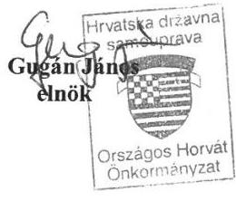

---

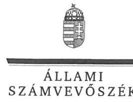

ELNÖK

Ikt.szám: EL-0713-030/2018

# Gugán János úr 

elnök
Országos Horvát Önkormányzat

## Budapest

## Tisztelt Elnök Úr!

Köszönettel megkaptam „Az országos nemzetiségi önkormányzatok fenntartásában lévő intézmények gazdálkodásának ellenőrzése - Miroslav Krleža Horvát Óvoda, Általános Iskola, Gimnázium és Kollégium" címủ jelentéstervezetre tett észrevételét.

Az ellenőrzési megállapításokra vonatkozó észrevételét az Állami Számvevőszékről szóló 2011. évi LXVI. törvény (a továbbiakban: ÁSZ tv.) 29. § (2) bekezdésében meghatározott tizenöt napos határidőn belül küldte meg. Az Állami Számvevőszék észrevétellel kapcsolatos álláspontját a mellékletként csatolt, a felügyeleti vezető által készített indokolás tartalmazza.

Tájékoztatom, hogy az Állami Számvevőszék a figyelembe nem vett észrevételeket az ÁSZ tv. 29. § (3) bekezdésében előírtak szerint köteles a jelentésében feltüntetni és megindokolni, hogy azokat miért nem fogadta el.

Budapest, 2018. 10 hó 11 nap
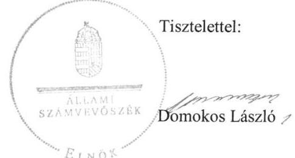

Melléklet: Észrevételre adott válasz

---

Az „Utóellenörzések - Országos Nemzetiségi Önkormányzatok gazdálkodásának utóellenörzése - Miroslav Krleža Horvát Óvoda, Általános Iskola, Gimnázium és Kollégium" című jelentéstervezethez tett észrevételre adott válasz Országos Horvát Önkormányzat

Elnök úr észrevételében jelzi, hogy támogatja a Miroslav Krleža Horvát Óvoda, Általános Iskola, Gimnázium és Kollégium igazgatója által megfogalmazott észrevételeket. Az alábbiakban ezért tájékoztatom az igazgató észrevételeinek kezeléséről.

1. A nemzeti vagyonról szóló 2011. évi CXCVI. törvény (Nvtv.) 11. § (10) bekezdése alapján a nemzeti vagyon hasznosítására vonatkozó szerződés csak természetes személlyel vagy átlátható szervezettel köthető. A jelentéstervezet 3. összegző megállapításának 2. bekezdése szerint a Miroslav Krleža Horvát Óvoda, Általános Iskola, Gimnázium és Kollégium (Intézmény) a bérbeadási folyamatok során a Nvtv. előírásaival ellentétben nem győződött meg az átláthatóság követelményének érvényesüléséről.
Igazgató úr észrevételében jelzi, hogy az adatbekérés során nem került rögzítésre a mintatételekhez az átláthatósági nyilatkozatok feltöltésének szükségessége, így azokat nem töltötték fel az adatszolgáltatási rendszerbe. A levelükben a nyilatkozatokat pótlólagosan megküldték.
Az észrevétel kapcsán áttekintettük az ellenőrzés rendelkezésére bocsátott dokumentumokat. Ennek során megállapítottuk, hogy az Nvtv. átláthatóságra vonatkozó előírásainak teljesítését az adatszolgáltatásra biztosított határidőn belül rendelkezésre bocsátott dokumentumok nem igazolták. Felhívjuk továbbá a figyelmet arra, hogy az észrevétel mellékleteként megküldött dokumentumokat az Állami Számvevőszéknek már nem áll módjában figyelembe venni.
A fentiekre való tekintettel a megállapítás módosítása nem indokolt.
2. Az államháztartásról szóló törvény végrehajtásáról szóló 368/2011. (XII. 31.) Korm. rendelet (Ávr.) 59. § (3) bekezdés alapján utalványozáskor, a külön írásbeli rendelkezésen fel kell tüntetni többek között a bevétel, kiadás egységes rovatrend és kormányzati funkció szerinti számát, a terheléssel, jóváírással érintett pénzeszköz államháztartási számviteli kormányrendelet szerinti könyvviteli számlájának számát. A jelentéstervezet 3. összegző megállapítás 3. bekezdése szerint a bérbeadáshoz és az értékesítéshez kapcsolódóan az utalványon az előírásokkal ellentétben, egy esetben sem tüntették fel a bevétel egységes rovatrend és a kormányzati funkció szerinti számát és az Áhsz. szerinti könyvviteli számlájának számát. Igazgató úr a megállapítás kapcsán jelzi, hogy a bevételi utalványrendeletek 2. oldala lemaradt a feltöltés során, így az utalványrendeletek esetében feltöltési hiba történt. A levélhez csatolt mintaként egy kétoldalas utalványrendeletet.
Az észrevétel kapcsán áttekintettük az ellenőrzés rendelkezésére bocsátott dokumentumokat. A 2018. április 21-én kelt teljességi és hitelességi nyilatkozatban Igazgató úr nyilatkozott arról, hogy az ott felsorolt dokumentumok a bekért adatokra vonatkozóan teljes körű információt tartalmaznak. Tekintettel arra, hogy az ellenőrzés rendelkezésére bocsátott utalványrendeleteken nem szerepelt a bevétel egységes rovatrend és a kormányzati funkció szerinti száma és az Áhsz. szerinti könyvviteli számlájának száma, a megállapítás módosítása nem indokolt. Az észrevétel mellékleteként megküldött dokumentumokat az Állami Számvevőszéknek már nem áll módjában figyelembe venni.

---

3. A jelentéstervezet 3. összegző megállapítás 4. bekezdése szerint a dologi kiadások esetében 11 esetben nem állt rendelkezésre a kötelezettségvállalás dokumentuma. Igazgató úr jelzi, hogy a dologi kiadások tekintetében 10 mintatételhez hiányosan kerültek feltöltésre dokumentumok, ezért azokat utólagosan megküldi.
Az adatszolgáltatásra biztosított határidőn belül az ellenőrzés rendelkezésére bocsátott dokumentumok ismételt áttekintését követően az észrevételt 1 mintatétel vonatkozásában elfogadjuk. Ugyanakkor felhívjuk a figyelmet, hogy az észrevétel mellékleteként megküldött dokumentumokat az Állami Számvevőszéknek nem áll módjában figyelembe venni.
Tekintettel arra, hogy az adatszolgáltatásra biztosított határidőn belül rendelkezésre bocsátott dokumentumok nem tartalmazták a kötelezettségvállalás dokumentumait az érintett 10 mintatétel esetében, a megállapítás módosítása ezen tételek esetében nem indokolt.
4. Az Ávr. 55. § (1) bekezdése alapján a pénzügyi ellenjegyzést a kötelezettségvállalás dokumentumán a pénzügyi ellenjegyzés dátumának és a pénzügyi ellenjegyzés tényére történő utalás megjelölésével, az arra jogosult személy aláírásával kell igazolni. A jelentéstervezet 3. összegző megállapításának 5. bekezdésében megállapítja, hogy a felhalmozási kiadásoknál, a kötelezettségvállalás pénzügyi ellenjegyzésénél egy mintatétel esetében a kötelezettségvállalás dokumentuma nem tartalmazta a pénzügyi ellenjegyző aláírását.
Igazgató úr álláspontja szerint minden kiválasztott tétel esetében szerepel a pénzügyi ellenjegyző aláírása.
A dokumentumok ismételt áttekintése során megállapítottuk, hogy a K23 sz. tétel esetében, a 2016. július 30 -án megkötött vállalkozási szerződésen a pénzügyi ellenjegyzést az arra jogosult személy aláírásával nem igazolta, ezért a megállapítás módosítása nem indokolt.
5. Az Ávr. 50. § (1a) bekezdése szerint a jogi személlyel, jogi személyiséggel nem rendelkező szervezettel kötött visszterhes szerződés esetén az 50. § (1) bekezdés szerinti okiratnak az ott meghatározottakon túl tartalmaznia kell a szervezet képviselőjének nyilatkozatát arra vonatkozóan, hogy átlátható szervezetnek minősül. A jelentéstervezet 3. összegző megállapításának 5. bekezdésében foglaltak alapján a központi költségvetési kiadási előirányzatok terhére jogi személlyel, jogi személyiséggel nem rendelkező szervezettel kötött visszterhes szerződések egy esetben sem tartalmazták a szervezet képviselőjének átláthatósági nyilatkozatát.
Igazgató úr észrevételében jelzi, hogy az adatbekérés során nem került rögzítésre a mintatételekhez az átláthatósági nyilatkozatok feltöltésének szükségessége, így azokat nem töltötték fel az adatszolgáltatási rendszerbe. A levelükben a nyilatkozatokat pótlólagosan megküldték.
Az észrevétel kapcsán áttekintettük az ellenőrzés rendelkezésére bocsátott dokumentumokat. Megállapítottuk, hogy az adatbekérő levél 4. melléklete tartalmazta a mintatételek ellenőrzéséhez szükséges dokumentumok jegyzékét. Ennek 3. pontjában az ÁSZ többek között kérte megküldeni a mintatételekhez kapcsolódóan a megkötött értékesítési, bérleti szerződéseket. Tekintettel arra, hogy az ellenőrzés rendelkezésére bocsátott szerződések a jogszabályi előírással ellentétben nem tartalmazták a szükséges átláthatósági nyilatkozatokat, illetve az észrevételezés során megküldött dokumentumokat az Állami Számvevőszéknek nem áll módjában figyelembe venni, a megállapítás módosítása nem indokolt.
6. Igazgató úr észrevételében jelzi, hogy az adatszolgáltatás során feltöltésre kerültek a vagyonnal kapcsolatos mindazon döntések és bizonylatok, amelyek az ellenőrzött időszak eseményeire vonatkoznak, valamint minden gazdasági esemény vonatkozásában a fókönyvi és

---

az analitikus rendszerében, minden esetben bizonylat alapján, a törvényi előírások szerint történik.
Az ellenőrzés rendelkezésére bocsátott dokumentumok alapján a vagyonelemekkel kapcsolatos események (ingatlanfelújítások és tárgyi eszköz átadás) olyan ingatlanokhoz kapcsolódtak, amelyek nyilvántartása az Intézmény könyveiben, az 1. számlaosztályban történt. Tekintettel azonban arra, hogy ezen ingatlanok, illetve tárgyi eszközök vonatkozásában nem állt rendelkezésre olyan dokumentum (pl. korábbi vagyonkezelési szerződés, más megállapodás), amely a számviteli nyilvántartásban való rögzítést megalapozta volna, a megállapítás módosítása nem indokolt.

Budapest, 2018. 4. hó 15. nap
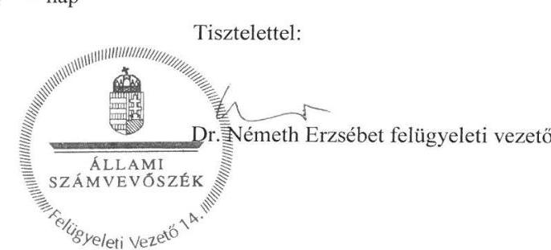

---

.

---

# RÖVIDÍTÉSEK JEGYZÉKE 

${ }^{1}$ Intézmény
${ }^{2}$ Kbt.
${ }^{3}$ Önkormányzat
${ }^{4}$ Njt.
${ }^{5}$ Nektv.
${ }^{6}$ Áht.
${ }^{7}$ Alaptörvény
${ }^{8}$ ÁSZ tv.
${ }^{9}$ ÁSZ
${ }^{10}$ ÁSZ SZMSZ
${ }^{11}$ Alapító Okirat:

Alapító Okirat ${ }_{11}$
Alapító Okirat ${ }_{12}$
Alapító Okirat ${ }_{13}$
${ }^{12}$ Ávr.
${ }^{13}$ Intézmény SZMSZ:

Intézmény SZMSZ:
${ }^{14}$ Áhsz.
${ }^{15}$ Önkormányzat Közgyűlése
${ }^{16}$ igazgató
${ }^{17}$ Vnytv.
${ }^{18}$ Vagyonnyilatkozat-tételi Szabályzat
${ }^{19}$ Ügyrend
${ }^{20}$ Bkr.
${ }^{21}$ Etikai Kódex

Miroslav Krleža Horvát Óvoda, Általános Iskola, Gimnázium és Kollégium (rövid neve: Miroslav Krleža Horvát Iskola)
2015 évi. CXLIII. törvény a közbeszerzésekről
Országos Horvát Önkormányzat
2011. évi CLXXIX. törvény a nemzetiségek jogairól (hatályos 2011. december 20-tól)
2011. évi CXC. törvény a nemzeti köznevelésről (hatályos 2012. szeptember 1-jétől)
2011. évi CXCV. törvény az államháztartásról (hatályos 2011. december 31-től)

Magyarország Alaptörvénye (hatályos 2012. január 1-jétől)
2011. évi LXVI. törvény az Állami Számvevőszékről (hatályos 2011. július 1-jétől)

Állami Számvevőszék
Az Állami Számvevőszék elnökének 4/2017. (XII.29.) ÁSZ utasítása az Állami Számvevőszék Szervezeti és Működési Szabályzatáról
Miroslav Krleža Horvát Óvoda, Általános Iskola, Gimnázium és Kollégium Alapító Okirata (hatályos 2012. december 19-étől)
Miroslav Krleža Horvát Óvoda, Általános Iskola, Gimnázium és Kollégium Alapító Okirata (hatályos 2014. február 25-étől)
Miroslav Krleža Horvát Óvoda, Általános Iskola, Gimnázium és Kollégium Alapító Okirata (hatályos 2014. május 30-átől)
Miroslav Krleža Horvát Óvoda, Általános Iskola, Gimnázium és Kollégium Alapító Okirata (hatályos 2015. május 16-átől)
Miroslav Krleža Horvát Óvoda, Általános Iskola, Gimnázium és Kollégium Alapító Okirata (hatályos 2015. június 13-átől)
368/2011. (XII. 31.) Korm. rendelet az államháztartásról szóló törvény végrehajtásáról (hatályos 2012. január 1-jétől)
„Miroslav Krleža" Horvát Óvoda, Általános Iskola, Gimnázium és Kollégium Szervezeti és Múködési Szabályzata (hatályos 2013. március 30-tól)
„Miroslav Krleža" Horvát Óvoda, Általános Iskola, Gimnázium és Kollégium Szervezeti és Múködési Szabályzata (hatályos 2016. augusztus 29-től)
4/2013. (I. 11.) Korm. rendelet az államháztartás számviteléről (hatályos 2014. január 1-jétől)
Országos Horvát Önkormányzat Közgyűlése
A Miroslav Krleža Horvát Óvoda, Általános Iskola, Gimnázium és Kollégium intézményvezető igazgatója
2007. évi CLII. törvény egyes vagyonnyilatkozat-tételi kötelezettségekről (hatályos: 2007. december 6-tól)
Szabályzat az egyes vagyonnyilatkozat-tételi kötelezettségekről szóló 2007. évi CLII. tv. 3. § hatálya alá tartozó kötelezettek vagyonnyilatkozatának kezelésével összefüggő feladatok végrehajtására (hatályos 2012. július 1-jétől)
A gazdasági szervezet ügyrendje (hatályos 2014. január 1-jétől)
370/2011. (XII. 31.) Korm. rendelet a költségvetési szervek belső
kontrollrendszeréről és belső ellenőrzéséről (hatályos 2012. január 1-jétől)
Etikai Kódex (hatályos 2012. július 1-jétől)

---

${ }^{22}$ Gazdálkodási Szabályzat
${ }^{23}$ Számviteli Politika
Számviteli Politika ${ }_{11}$
${ }^{24}$ Számv. tv.
${ }^{25}$ Info tv.
${ }^{26}$ Közzétételi szabályzat
${ }^{27}$ Kommunikációs szabályzat
${ }^{28}$ 305/2005. (XII. 25.) Korm. rendelet
${ }^{29}$ Iratkezelési szabályzat
${ }^{30}$ Nevelési és Pedagógiai Program
${ }^{31}$ Munkatervı

Munkatervı
${ }^{32}$ Nvtv.
${ }^{33}$ Leltározási és leltárkészítési szabályzatı Leltározási és leltárkészítési szabályzatı Leltározási és leltárkészítési szabályzatı

Gazdálkodási Szabályzat (a kötelezettségvállalás, az utalványozás, a pénzügyi ellenjegyzés, az érvényesítés és teljesítésigazolás rendje) (hatályos 2014. január 1-jétől)
Számviteli politika (hatályos 2012. július 1-jétől)
Számviteli politika (hatályos 2014. február 1-jétől)
2000. évi C. törvény a számvitelről (hatályos 2001. január 1-jétől)
2011. évi CXII. törvény az információs önrendelkezési jogról és az információszabadságról (hatályos 2011. július 27-től)
Szabályzat a közérdekú adatok megismerésére irányuló kérelmek, intézkedések, továbbá a kötelezően közzéteendő adatok nyilvánosságra hozatalának rendjéről (hatályos 2012. december 3-tól)
Kommunikációs szabályzat (hatályos 2014. január 2-tól)
305/2005. (XII. 25.) Korm. rendelet a közérdekú adatok elektronikus közzétételére, az egységes közadatkereső rendszerre, valamint a központi jegyzék adattartalmára, az adatintegrációra vonatkozó részletes szabályokról (hatályos 2006. január 1-jétől)
Iratkezelési szabályzat (hatályos 2012. szeptember 1-jétől)
A Miroslav Krleža Horvát Óvoda, Általános Iskola, Gimnázium és Kollégium Nevelési és Pedagógiai Programja (hatályos 2013. március 28-tól)
A Miroslav Krleža Horvát Óvoda, Általános Iskola, Gimnázium és Kollégium 2014/2015-os tanév Munkaterve
A Miroslav Krleža Horvát Óvoda, Általános Iskola, Gimnázium és Kollégium 2015/2016-os tanév Munkaterve
2011. évi CXCVI. törvény a nemzeti vagyonról (hatályos 2011. december 31-től) Leltározási és leltárkészítési szabályzat (hatályos 2013. február 1-jétől) Leltározási és leltárkészítési szabályzat (hatályos 2015. november 1-jétől) Leltározási és leltárkészítési szabályzat (hatályos 2016. szeptember 1-jétől)

---

# ÁLLAMI SZÁMVEVŐSZÉK 

1052 Budapest, Apáczai Csere János utca 10.
Levélcím: 1364 Budapest 4. Pf. 54
Telefon: +36 14849100 Telefax: +36 14849200
www.asz.hu