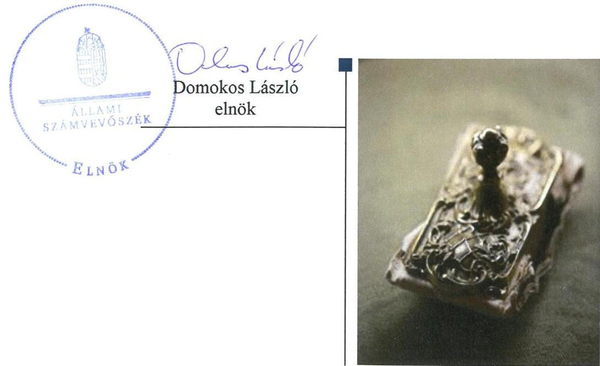

ÁLLAMI
SZÁMVEVŐSZÉK

# Jelentés 

## Nem állami humánszolgáltatók ellenőrzése

A humánszolgáltatást nyújtó államháztartáson kívüli köznevelési és szociális intézmények, szolgáltatók fenntartói központi költségvetésből kapott támogatásai felhasználásának ellenőrzése - Kodolányi János Főiskola
2018.

---

# Jelentés 

## Nem állami humánszolgáltatók ellenőrzése

A humánszolgáltatást nyújtó államháztartáson kívüli köznevelési és szociális intézmények, szolgáltatók fenntartói központi költségvetésből kapott támogatásai felhasználásának ellenőrzése - Kodolányi János Főiskola
2018. 11. hó 11. nap

---

# AZ ELLENŐRZÉST FELÜGYELTE:

- **SALAMON ILDIKÓ** felügyeleti vezető
- **DR. NAGY IMRE** felügyeleti vezető

# AZ ELLENŐRZÉST VEZETTE ÉS A VÉGREHAJTÁSÁÉRT FELELŐS:

- **DR. KOVÁCS DIÁNA** ellenőrzésvezető

# A PROGRAM ÖSSZEÁLLÍTÁSÁÉRT FELELŐS:

- **TÓTPÁL SZABOLCS** osztályvezető

**IKTATÓSZÁM:** EL-0441-022/2018.

**TÉMASZÁM:** 2448

**ELLENŐRZÉS-AZONOSÍTÓ SZÁM:** V079415

Jelentéseink az Országgyűlés számítógépes hálózatán és az Interneta a www.asz.hu címen is olvashatóak.

---

# TARTALOMJEGYZÉK 

■ ÖSSZEGZÉS ..... 5
■ AZ ELLENŐRZÉS CÉLJA ..... 6
■ AZ ELLENŐRZÉS TERÜLETE ..... 7
■ AZ ELLENŐRZÉS HÁTTERE, INDOKOLTSÁGA ..... 8
■ A JELENTÉS LÉNYEGES KÉRDÉSKÖREI ..... 9
■ AZ ELLENŐRZÉS HATÓKÖRE ÉS MÓDSZEREI ..... 10
■ MEGÁLLAPÍTÁSOK ..... 12
■ JAVASLATOK ..... 16
■ MELLÉKLETEK ..... 17
I. sz. melléklet: Értelmező szótár ..... 17
II. sz. melléklet: A központi költségvetési támogatások alakulása ..... 19
■ FÜGGELÉK: ÉSZREVÉTELEK ..... 21
■ RÖVIDÍTÉSEK JEGYZÉKE ..... 23

---

.

---

# ÖSSZEGZÉS 

A Kodolányi János Főiskola intézményfenntartóként a köznevelési közfeladat ellátásához kapott központi költségvetési támogatásokkal elszámolt. A köznevelési intézménye fenntartása során a közpénzfelhasználás átláthatóságát nem biztositotta.

## Az ellenőrzés társadalmi indokoltsága

Az Állami Számvevőszék stratégiájában hangsúlyos szerepet szán annak, hogy szilárd szakmai alapon álló, értékteremtő ellenőrzéseivel előmozdítsa a közpénzügyek átláthatóságát, rendezettségét és javaslataival a közpénzek és a közvagyon szabályos, gazdaságos, hatékony és eredményes felhasználását segítse. Az Állami Számvevőszék a stratégiájában célul tűzte ki, hogy az államháztartáson kívülre nyújtott költségvetési támogatások ellenőrzésével hozzájárul ahhoz, hogy a közpénzeket az államháztartáson kívüli szervezetek is átlátható módon használják fel a közfeladatok szerződésben vállalt ellátása érdekében. Az Állami Számvevőszék e stratégiai céljaival összhangban - az Állami Számvevőszékről szóló 2011. évi LXVI. törvény felhatalmazása alapján - végzi a központi költségvetésből származó források, nyújtott támogatások - kedvezményezett szervezetek közfeladat ellátásához való - felhasználásának az ellenőrzését. Az Állami Számvevőszék hozzájárul ezzel ahhoz is, hogy a nyilvánosság és az igénybevevők megfelelő tájékoztatást kapjanak az államháztartáson kívüli közfeladatot ellátók múködéséről.

## Főbb megállapítások, következtetések, javaslatok

A Kodolányi János Főiskola, mint intézményfenntartó a jogszabályi előírásoknak megfelelően kialakította a köznevelési humánszolgáltatási közfeladat ellátásának szervezeti kereteit. Beszámolási formája a jogszabályi előírásoknak megfelelő volt. A költségvetési támogatások igénylési, módosítási és elszámolási feladatait szabályszerűen látta el.

A Kodolányi János Főiskola biztosította a köznevelési intézménye múködésének feltételeit, a központi költségvetési támogatásokat szabályszerűen továbbutalta az intézménynek. A központi költségvetési támogatások elkülönített nyilvántartásáról nem gondoskodott.

A külső ellenőrzésekkel kapcsolatos kötelezettségeit nem teljesítette, az intézmény tevékenységét, szakmai munkáját értékelte, ellenőrzési feladatainak szabályszerűen eleget tett. A köznevelési közfeladat ellátásából adódó közzétételi kötelezettségének nem tett eleget, a kötelezően közzéteendő adatok nyilvánosságra hozatalának rendjét nem szabályozta.

Az Állami Számvevőszék az ellenőrzött szervezet vezetőjének négy javaslatot fogalmazott meg költségvetési támogatások felhasználásának nyilvántartása jogszabályi előírásoknak való megfelelőségére, a közzétételi listákon szereplő adatok pontos, naprakész és folyamatos közzétételi kötelezettség teljesítése részletes szabályainak meghatározására, a közérdekú adatok megismerésére irányuló igények teljesítésének rendjét rögzítő szabályzat készítésére, és az Info tv.-ben előírt közzétételi kötelezettség teljesítésére vonatkozóan.

---

# AZ ELLENŐRZÉS CÉLJA 

AZ ELLENŐRZÉS CÉLJA annak értékelése, hogy a Kodolányi János Főiskola, mint Fenntartó ${ }^{1}$ központi költségvetésből kapott támogatásainak felhasználása szabályszerű volt-e, a támogatások igénylése, évközi módosítása és év végi elszámolása megfelelt-e a jogszabályi előírásoknak.

---

# **AZ ELLENŐRZÉS TERÜLETE**

## **Kodolányi János Főiskola**

Az orosházi székhelyű Kodolányi János Főiskolát az Önálló Főiskolai Közalapítvány alapította 1992-ben nem állami felsőoktatási intézményként.

A Fenntartó a köznevelési feladatok ellátására 2014-ben 329,7 millió Ft, 2015-ben 301,0 millió Ft, 2016-ban pedig 317,1 millió Ft központi költségvetési támogatást kapott. A támogatások alakulását a II. sz. melléklet mutatja be.

A 2014-2016. években a Fenntartó egy köznevelési intézmény2 kettő feladat-ellátási helyén látott el köznevelési feladatokat, általános iskolai, gimnáziumi, szakközépiskolai nevelésoktatást, felnőttoktatást és kollégiumi ellátást nyújtott. A köznevelési intézményben a 2014/2015-ös és a 2015/2016-os tanévben nappali tagozaton 1300 fő engedélyezett létszám mellett lehetőség volt 630 fő esti és 330 fő levelező tagozaton történő felvételére. A 2016/2017-es tanévre nappali tagozaton 1050 fő, esti tagozaton 400 fő felvételére volt engedély. A levelező tagozat 2016. szeptember 1-jétől megszűnt.

A Fenntartó köznevelési célra átlagbéralapú támogatás igénybevételére volt jogosult, továbbá támogatás illette meg gyermekétkeztetési- és tankönyv-támogatási jogcímeken a központi költségvetési törvényben meghatározottak szerint.

A Fenntartó által alapított köznevelési intézmény esetében a köznevelési feladatok ellátásával kapcsolatos szakmai irányító szervi feladatokat az ellenőrzött időszakban az EMMI3 látta el, törvényességi ellenőrzési feladatokat a területileg illetékes kormányhivatal végezte.

---

# AZ ELLENŐRZÉS HÁTTERE, INDOKOLTSÁGA 

A köznevelési feladatokat ellátó nem állami intézményfenntartók részére közfeladataik ellátására a 2014. - 2016. években jelentős összegű pénzügyi támogatást biztosítottak a mindenkori költségvetési törvények a bennük megfogalmazott feltételek mellett.

A 2013. évben jelentős változások következtek be a normatív finanszírozás rendszerében. Az Országgyűlés elfogadta a nemzeti köznevelésről szóló 2011. évi CXC. törvényt, amely jelentősen átalakította a korábbi finanszírozási rendszert 2013 szeptemberétől. Új feladatfinanszírozási forma (átlagbéralapú támogatás) jelent meg, amely az államháztartáson kívüli intézményfenntartókra is vonatkozik. Az ellenőrzés a finanszírozási rendszerben 2011-2015 között bekövetkezett változásokra, azok közfeladat ellátásra gyakorolt hatására fókuszál a költségvetési támogatásokat felhasználó államháztartáson kívüli szervezetek körében. Az ellenőrzések indokoltságát az is alátámasztja, hogy az ÁSZ ${ }^{4}$ még nem ellenőrizte átfogóan e területet.

Az ÁSZ stratégiájában foglaltak alapján is indokolt az ellenőrzés, ami a társadalom számára jelzi, hogy a közpénz államháztartáson kívüli felhasználása sem maradhat ellenőrizetlenül. Az államháztartáson kívülre nyújtott költségvetési támogatások ellenőrzésével az ÁSZ hozzájárul ahhoz, hogy a közpénzeket a nem állami humán fenntartók átlátható módon használják fel a közfeladatok ellátására kötött szerződésekben vállalt kötelezettségek teljesítése érdekében. Az ellenőrzés javaslataival hozzájárul az említett rendszerek szabályszerű támogatás felhasználásához, javítja a társadalmigazdasági döntések megalapozottságát, ami a „jó kormányzás" feltétele.

A Fenntartó a köznevelési feladatellátáshoz kapott közpénz felhasználását a nyilvánosság előtt köteles volt bemutatni.

---

# A JELENTÉS LÉNYEGES KÉRDÉSKÖREI 

1. A köznevelési közfeladatot ellátó Fenntartó szabályszerű müködési és gazdálkodási környezet kialakításával megteremtette-e a költségvetési támogatások átlátható, elszámoltatható igénybevételének, felhasználásának feltételeit?
2. A Fenntartó az átvállalt köznevelési közfeladathoz biztositott költségvetési támogatásokat szabályszerűen fordította-e a köznevelési intézménye müködtetésére?
3. A Fenntartó a köznevelési intézménye müködtetéséhez felhasznált közpénzekre vonatkozó gazdálkodásával a nyilvánosság elött elszámolt-e, ennek megalapozása érdekében ellenőrzési, értékelési feladatait szabályszerűen látta-e el?

---

# AZ ELLENŐRZÉS HATÓKÖRE ÉS MÓDSZEREI 

## Az ellenőrzés típusa

Megfelelőségi ellenőrzés.

## Az ellenőrzött időszak

A 2014. január 1-je és 2016. december 31-e közötti időszak.

## Az ellenőrzés tárgya

Az ellenőrzés a köznevelési közfeladatokat ellátó Fenntartó humánszolgáltatási közfeladatai ellátásához a költségvetési törvényekben biztosított központi költségvetési támogatások igénylése, évközi módosítása és év végi elszámolása fenntartói feladatainak ellátása, illetve e központi költségvetésből kapott támogatások humánszolgáltatási közfeladatokra való fenntartó általi felhasználása szabályszerűségének értékelésére terjedt ki. Az ellenőrzés kiterjedt minden olyan körülményre és adatra, amely az ÁSZ jogszabályban meghatározott feladatainak teljesítéséhez, valamint a program végrehajtása folyamán felmerült újabb összefüggések feltárásához szükséges volt.

## Az ellenőrzött szervezet

Kodolányi János Főiskola mint intézményfenntartó

## Az ellenőrzés jogalapja

Az ellenőrzés jogszabályi alapját az ÁSZ tv. ${ }^{5} 1 . \S$ (3) bekezdése, valamint az 5. § (3) bekezdésében foglalt előírások adták.

## Az ellenőrzés módszerei

Az ellenőrzést az ellenőrzési program szempontjai, kérdései, az ellenőrzött időszakban hatályos jogszabályok, a nemzetközi standardokat irányadónak tekintve, az ellenőrzés szakmai szabályok és módszertanok figyelembevételével végezte az ÁSZ. A közpénzekkel való felelős gazdálkodás segítésére irányuló javaslatok kidolgozásakor a hatályos jogszabályok voltak az irányadóak.

---

Az ellenőrzés ideje alatt az ellenőrzött szervezettel történő kapcsolattartást az ÁSZ SZMSZ ${ }^{6}$-ének vonatkozó előírásai alapján biztosította az ÁSZ.

Az ellenőrzési kérdések megválaszolásához szükséges bizonyítékok megszerzése az ellenőrzött által rendelkezésre bocsátott dokumentumokra, adatokra alapozva elemző eljárással történt.

Az ellenőrzési bizonyítékként felhasználható adatforrások közé tartoztak egyrészt a szakmai program részletes szempontjainál felsorolt adatforrások, másrészt minden - az ellenőrzés folyamán feltárt, az ellenőrzés szempontjából információt tartalmazó - dokumentum.

Az ellenőrzés lefolytatásához az ellenőrzött szervezet a kitöltött tanúsítványok, valamint az ÁSZ által kért dokumentumok elektronikus úton való megküldésével szolgáltatott adatokat, információkat. Az így rendelkezésre bocsátott adatok, információk és a tanúsítványok adatai valódiságának kontrollja az ellenőrzés keretében történt.

A fenntartott intézménynél helyszíni szemle keretében győződött meg az ÁSZ a tényleges feladatellátásról (verifikáció).

A köznevelési humánszolgáltatások központi költségvetési támogatásai igénylésével, módosításával, elszámolásával kapcsolatos, államháztartáson kívüli fenntartó jogszabályokban előírt feladatai betartását, továbbá a központi költségvetési támogatások szabályszerű kezelését, nyilvántartását ellenőrizte az ÁSZ a Fenntartónál határozatok, nyilvántartások, beszámolók és egyéb dokumentumok alapján. Az ellenőrzés nem terjedt ki a köznevelési humánszolgáltatások központi költségvetési támogatásai igénylése, módosítása, elszámolása valódiságának, megalapozottságának, helyességének - sem a Fenntartónál, sem az intézménynél való - értékelésére. Továbbá nem terjedt ki az ellenőrzés e források köznevelési intézmény általi szabályszerű felhasználásának értékelésére. A szabályosság megítélésének alapját képezte, hogy a központi költségvetési támogatások Fenntartó általi igénylése, módosítása és elszámolása a Kincstár ${ }^{7}$ felé megtörtént.

---

# 1. A köznevelési közfeladatot ellátó Fenntartó szabályszerű müködési és gazdálkodási környezet kialakításával megterem-tette-e a költségvetési támogatások átlátható, elszámoltatható igénybevételének, felhasználásának feltételeit? 

Összegző megállapítás

### 1.1. számú megállapítás

A Fenntartó köznevelési közfeladatát ellátta, belső szabályozottságát szabályszerűen kialakította.

A Fenntartó köznevelési közfeladatát ellátta, belső szabályozottságának kialakítása szabályszerű volt.

A Fenntartó rendelkezett alapító okirat ${ }^{8}$-tal, melynek tartalma megfelelt az Nftv. ${ }^{9}$-ben előírtaknak.

A Fenntartó szervezeti és működési szabályzata ${ }^{10}$ megfelelő volt, szabályozták a szervezeti felépítést, a működési rendet, az ellátott alap- és vállalkozási tevékenységet, illetve az ezekhez kapcsolódó felelősségi- és hatásköröket, valamint ezek gyakorlásának módját.

A Fenntartó kötelezett volt kettős könyvvitellel alátámasztott egyszerűsített éves beszámoló, valamint közhasznúsági melléklet készítésére, amelynek eleget tett. A számviteli beszámolók mérlegének és eredmény kimutatásának tagolása megfelelt a Civilszr. ${ }^{11}$ előírásainak.

A Fenntartó az ellenőrzött időszakra vonatkozóan rendelkezett a Számv. tv. ${ }^{12}$ szerinti számviteli politikával ${ }^{13}$, valamint a számviteli politika keretében elkészítendő szabályzatokkal.

A költségvetési támogatások igénylési, módosítási és elszámolási feladatait a Fenntartó ellátta.

A Fenntartó a támogatásokra vonatkozó kérelmeit minden évben a jogvesztő határidőig az Nkt. vhr. ${ }^{14}$ rendelkezéseinek megfelelően a Kincstárhoz benyújtotta.

A Fenntartó rendelkezett az őt megillető költségvetési támogatást megállapító kincstári határozatokkal, melyekben meghatározták a megállapított támogatások körét, mértékét jogcímenként a köznevelési intézményre vonatkozóan, a folyósítás ütemezését, a támogatások elszámolásának határidejét.

A változás bejelentési kötelezettségének a Fenntartó eleget tett, indokolt esetben kezdeményezte a kérelmekben szereplő létszámadatok módosítását az Nkt. vhr. előírásai szerint.

A Fenntartó szabályszerűen elszámolt a központi költségvetésből juttatott támogatásokkal, fenntartói szinten összesített módon. A költségvetési támogatás elszámolásáról minden évben rendelkezett a Kincstár elfogadó

---

határozatával. A tárgyévben kiutalt összeg és az elszámolás alapján ténylegesen járó támogatás eltérése miatt két évben visszafizetési kötelezettsége, egy évben többlettámogatási jogosultsága keletkezett a Fenntartónak. A visszafizetési kötelezettségének az ellenőrzött időszakban eleget tett.

# 2. A Fenntartó az átvállalt köznevelési közfeladathoz biztosított költségvetési támogatásokat szabályszerűen fordította-e a köznevelési intézménye múködtetésére? 

Összegző megállapítás

## 2.1. számú megállapítás

2.2. számú megállapítás

A Fenntartó az átvállalt köznevelési közfeladatokhoz biztosított költségvetési támogatásokat nem szabályszerűen fordította a köznevelési intézménye múködtetésére.

A Fenntartó a köznevelési intézménye múködtetésének szervezeti, tárgyi és pénzügyi feltételeit biztosította.

A Fenntartó a köznevelési intézménye alapító okiratát kiadta, annak módosításáról szükség esetén gondoskodott.

A Fenntartó feladatai körében gondoskodott a köznevelési intézménye Nkt. ${ }^{15}$ szerinti nyilvántartásba vételéről, meghatározta a köznevelési intézmény költségvetését, gondoskodott a térítési díj és tandíj megállapítás szabályainak meghatározásáról.

A Fenntartó az Nkt. előírásainak megfelelően gyakorolta a köznevelési intézmény vezetője tekintetében a munkáltatói jogokat, biztosította az intézmény számára a feladat ellátásához szükséges vagyon feletti rendelkezési jogot, állandó saját székhelyet.

A kincstári határozatokkal jóváhagyott központi költségvetési támogatások a Fenntartó rendelkezésére álltak. A Fenntartó biztosította a köznevelési intézménye múködésének pénzügyi feltételeit, a központi költségvetési támogatásokat szabályszerűen továbbutalta az intézményének.

A Fenntartó a köznevelési feladathoz biztosított költségvetési támogatást nem kezelte szabályszerűen, nem tartotta elkülönítetten nyilván.

A Fenntartó a támogatás felhasználásáról, az intézménynek történt átadásáról vezetett nyilvántartást, azonban a kapott támogatás esetében az Nkt. vhr. 37/G. § (1) bekezdésében előírtak ellenére nem gondoskodott a felhasználások alapfeladatonkénti bontásáról.

---

# 3. A Fenntartó a köznevelési intézménye múködtetéséhez felhasznált közpénzekre vonatkozó gazdálkodásával a nyilvánosság előtt elszámolt-e, ennek megalapozása érdekében ellenőrzési, értékelési feladatait szabályszerűen látta-e el? 

## Összegző megállapítás

### 3.1. számú megállapítás

### 3.2. számú megállapítás

A Fenntartó a beszámolási, az értékelési és az ellenőrzéssel kapcsolatos feladatait szabályszerűen ellátta, a közzétételi kötelezettségének nem szabályszerűen tett eleget.

A Fenntartó ellenőrzési, értékelési feladatainak szabályszerűen eleget tett.

A Fenntartó - az Nkt. által biztosított lehetőséggel élve - ellenőrizte a ne-velési-oktatási intézménye gazdálkodását, múködésének törvényességét, valamint a szakmai munka eredményességét.

A Szenátus beszámoltatta a köznevelési intézményt a gazdálkodásáról, számviteli beszámolóját elfogadta, a költségvetési támogatások felhasználását a beszámolókon keresztül vizsgálta.

Az Nkt.-ban foglaltaknak megfelelően a Fenntartó az Intézmény szervezeti és múködési szabályzatát annak módosításakor ellenőrizte.

A Fenntartó a köznevelési intézménye szakmai munkájával összefüggő értékelési kötelezettségének az Nkt.-ban előírtak szerint eleget tett.

A Fenntartó a közzétételi kötelezettségét nem szabályszerűen teljesítette. A köznevelési intézménye múködtetéséhez felhasznált közpénzekre vonatkozóan a beszámolási kötelezettségének eleget tett.

A Fenntartó a közzétételi listákon szereplő adatok pontos, naprakész és folyamatos közzétételi kötelezettség teljesítésének részletes szabályait - az Info. tv. ${ }^{18}$ 35. § (3) bekezdésében foglaltak ellenére - nem állapította meg belső szabályzatban.

A Fenntartó, mint közfeladatot ellátó szerv az Info. tv. 30. § (6) bekezdésének előírása ellenére nem készített a közérdekú adatok megismerésére irányuló igények teljesítésének rendjét rögzítő szabályzatot.

A Fenntartó a 2014-2016. években az Info tv. 37. § (1) bekezdésében előírtak ellenére nem gondoskodott az Info tv. 1. melléklet általános közzétételi listában meghatározott adatok közül a II. 1., II. 8., II. 12-13., valamint a III. 1.pontban megjelöltek közzétételéről.

A Fenntartó a köznevelési intézmény szakmai beszámolóival, valamint az egyszerűsített éves beszámolóival rendelkezett, utóbbiak megfeleltek a Számv. tv. és a Civilszr. előírásainak. Az intézményi beszámolók elfogadásáról szenátusi határozatokban döntött a Fenntartó.

A Fenntartó mindhárom évre vonatkozóan, határidőben elkészítette a múködéséről, vagyoni, pénzügyi és jövedelmi helyzetéről az egyszerűsített éves beszámolóját és a közhasznúsági mellékletét, amit szenátusi jóváhagyás után a Civilszr. előírásai szerint letétbe helyezett és közzétett honlapján.

---

# 3.3. számú megállapítás 

A Fenntartó a külső ellenőrzésekkel kapcsolatos intézkedési feladatait nem szabályszerűen látta el.

A Kormányhivatal ${ }^{17}$ 2014-ben és 2016-ban törvényességi ellenőrzést végzett a Fenntartónál. A Kormányhivatal mindkét esetben kötelezte Fenntartót a szükséges intézkedések megtételére és az ezeket igazoló dokumentumok megküldésére. Fenntartó az intézkedési kötelezettségének egyik esetben sem tett eleget.

---

# JAVASLATOK 

Az ÁSZ tv. 33. § (1) bekezdésében foglaltak értelmében az ellenőrzött szervezet vezetője köteles a jelentésben foglalt megállapításokhoz kapcsolódó intézkedési tervet összeállítani és azt a jelentés kézhezvételétől számított 30 napon belül az ÁSZ részére megküldeni. Amennyiben az ellenőrzött szervezet vezetője nem küldi meg határidőben az intézkedési tervet, vagy továbbra sem elfogadható intézkedési tervet küld, az Állami Számvevőszék elnöke az ÁSZ tv. 33. § (3) bekezdése a) és b) pontjaiban foglaltakat érvényesítheti.

## A Kodolányi János Egyetem rektorának

1. Intézkedjen, hogy a költségvetési támogatások felhasználásának nyilvántartása feleljen meg a jogszabályban elöírtaknak.
(2.2. sz. megállapítás 1. bekezdés 1. mondata alapján)
2. Belső szabályzatban állapítsa meg az Info tv. előírásai alapján, a közzétételi listákon szereplő adatok pontos, naprakész és folyamatos közzétételi kötelezettség teljesitésének részletes szabályait.
(3.2. sz. megállapítás 1. bekezdése alapján)
3. Intézkedjen az Info tv. előírásai alapján a közérdekü adatok megismerésére irányuló igények teljesitésének rendjét rögzítő szabályzat készítéséről.
(3.2. sz. megállapítás 2. bekezdése alapján)
4. Tegyen eleget az Info tv.-ben elöírt közzétételi kötelezettségnek.
(3.2. sz. megállapítás 3. bekezdése alapján)

---

# MELLÉKLETEK 

- I. SZ. MELLÉKLET: ÉRTELMEZŐ SZÓTÁR
civil szervezet
humánszolgáltatás
költségvetési támogatás
köznevelési közfeladat

A Civil tv. 2. § 6. pontja szerint civil szervezet a civil társaság, a Magyarországon nyilvántartásba vett egyesület (a párt, a szakszervezet és a kölcsönös biztosító egyesület kivételével), a közalapítvány és a pártalapítvány kivételével az alapítvány.
Külön törvényben meghatározott szociális, gyermekjóléti, gyermekvédelmi, közoktatási, felsőoktatási, kulturális közfeladatok (2014. évi Kvtv. 34. § (1), (4) bekezdés, 1. számú melléklet XX/20/2. alcím, 19. alcím, 2015. évi Kvtv. 43. § (1), (4) bekezdés, 1. számú melléklet XX/20/2/3. jogcím csoport, 19. alcím, 2016. évi Kvtv. 41. § (1), (4) bekezdés, 1. számú melléklet XX/20/2/3. jogcím csoport, 19. alcím).
a társadalombiztosítás pénzügyi alapjai kivételével az államháztartás központi alrendszeréből ellenérték nélkül, pénzben nyújtott támogatások (Áht. ${ }^{18}$ 1. § 14. pont)
A költségvetési törvényekben (2013. évi CCXXX. törvény 33-34. §, 2014. évi C. törvény 4243. §, 2015. évi C. törvény 40-41. §) megállapított támogatás. A 2015. évi C. törvény 4041. § szerint többek között: Az Országgyűlés a köznevelési feladat ellátására átlagbéralapú támogatást állapít meg. A nevelési-oktatási, valamint pedagógiai szakszolgálati intézményt fenntartó nemzetiségi önkormányzat, az egyházi és magán köznevelési intézmény fenntartója részére az általuk fenntartott nevelési-oktatási intézményben, továbbá pedagógiai szakszolgálati intézményben pedagógus és - a b) pont kivételével - nevelőoktató munkát közvetlenül segítő munkakörben foglalkoztatottak után a 7. melléklet I. pontja, valamint az óvoda, egységes óvoda-bölcsőde esetében a 2. melléklet II. pont 1. alpontja szerint és az 5. alpontjában meghatározott jogosultak után, az őket ott megillető mértékek szerint. Múködési támogatást állapít meg a nemzetiségi önkormányzat vagy az egyházi jogi személy által fenntartott nevelési-oktatási intézményekben ellátott, továbbá a pedagógiai szakszolgálati intézményekben gyógypedagógiai tanácsadásban, korai fejlesztésben, oktatásban és gondozásban, valamint a fejlesztő nevelésben részt vevő gyermekekre, tanulókra tekintettel a nemzetiségi önkormányzat és a b----evett egyház részére a 7. melléklet II. pontja szerint.
Az Országgyűlés a szociális, gyermekjóléti, gyermekvédelmi közfeladatot ellátó intézményt, szolgáltatást fenntartó egyházi jogi személy, civil szervezet, közalapítvány, országos nemzetiségi önkormányzat, települési vagy területi nemzetiségi önkormányzat, gazdasági társaság, és a humánszolgáltatást alaptevékenységként végző, az Szja tv. hatálya alá tartozó egyéni vállalkozó (a továbbiakban együtt: nem állami szociális fenntartó) részére támogatást állapít meg a következők szerint: a támogatás a nem állami szociális fenntartót a települési önkormányzatok 2. melléklet III. pont 3. alpont c)-k) pontjában és III. pont 5. alpont o) pontjában meghatározott támogatásaival azonos jogcímeken, öszszegben és feltételek mellett illeti meg.
A köznevelési intézmény alapító okiratában foglalt feladat: óvodai nevelés, nemzetiséghez tartozók óvodai nevelése, általános iskolai nevelés-oktatás, nemzetiséghez tartozók általános iskolai nevelése-oktatása, kollégiumi ellátás, nemzetiségi kollégiumi ellátás, gimnáziumi nevelés-oktatás, szakközépiskolai nevelés-oktatás, szakiskolai nevelés-oktatás, nemzetiség gimnáziumi nevelés-oktatása, nemzetiség szakközépiskolai nevelés-oktatása, nemzetiség szakiskolai nevelés-oktatása, Köznevelési Hidprogramok keretében folyó nevelés-oktatás, felnőttoktatás, alapfokú múvészetoktatás, fejlesztő nevelés, fejlesztő nevelés-oktatás, pedagógiai szakszolgálati feladat, a többi gyermekkel, tanulóval együtt nevelhető, oktatható sajátos nevelési igényű gyermekek, tanulók óvodai nevelése és iskolai nevelése-oktatása, azoknak a sajátos nevelési igényű gyermekeknek, tanulóknak az óvodai, iskolai, kollégiumi ellátása, akik a többi gyermekkel, tanulóval nem foglalkoztathatók együtt, a gyermekgyógyüdülőkben, egészségügyi intézményekben, rehabilitációs

---

## köznevelési intézmény

nem állami, nem önkormányzati (államháztartáson kívüli) intézmény fenntartó
intézményekben tartós gyógykezelés alatt álló gyermekek tankötelezettségének teljesítéséhez szükséges oktatás, pedagógiai-szakmai szolgáltatás.
A nevelési- oktatási intézmény, pedagógiai szakszolgálati intézmény, pedagógiai-szakmai szolgáltatást nyújtó intézmény.
A köznevelési és szociális, gyermekjóléti és gyermekvédelmi közfeladatokat/humánszolgáltatásokat ellátó intézményt fenntartó egyházi jogi személy, társadalmi szervezet, alapítvány, közalapítvány, civil szervezet, országos nemzetiségi önkormányzat, nonprofit gazdasági társaság, gazdasági társaság és a humánszolgáltatást alaptevékenységként végző, Szja tv. hatálya alá tartozó egyéni vállalkozó. (2013. évi Kvtv. 35. § (1), (3) bekezdés, 2014. évi Kvtv. 33. §, 34. § (1), (4) bekezdés, 2015. évi Kvtv. 42. §, 43. § (1), (4) bekezdés, 2016. évi Kvtv. 40. §, 41. § (1), (4) bekezdés)

---

II. SZ. MELLÉKLET: A KÖZPONTI KÖLTSÉGVETÉSI TÁMOGATÁSOK ALAKULÁSA

# A FENNTARTÓ ÁLTAL A KÖZNEVELÉSI FELADATHOZ KAPOTT KÖZPONTI KÖLTSÉGVETÉSI TÁMOGATÁS JOGCÍMENKÉNTI ALAKULÁSA (EZER FT)

|  Megnevezés | 2014. év | 2015. év | 2016. év  |
| --- | --- | --- | --- |
|  gyermekétkeztetés támogatása | 5973 | 6544 | 6822  |
|  pedagógusok átlagbér alapú támogatása | 302084 | 274442 | 290985  |
|  pedagógusok munkáját közvetlen segítők átlagbér | 19716 | 18256 | 17800  |
|  alapú támogatása |  |  |   |
|  tanulók ingyenes tankönyvellátásának támogatása | 2004 | 1800 | 1560  |
|  Összesen | 329777 | 301042 | 317167  |

Forrás: 2014-2016. évi költségvetési támogatás elszámolások kincstári határozatai

---

.

---

# FÜGGELÉK: ÉSZREVÉTELEK 

A jelentéstervezetet a Számvevőszék 15 napos észrevételezésre megküldte az ellenőrzött szervezet vezetőjének az ÁSZ tv. 29. §* (1) bekezdése előírásának megfelelően.
Az ellenőrzött szervezet vezetője az ÁSZ tv. 29. § (2) bekezdésében előírt határidőn belül nem élt észrevételezési jogával.

[^0]
[^0]:    * 29. § (1) Az Állami Számvevőszék az ellenőrzési megállapításait megküldi az ellenőrzött szervezet vezetőjének vagy az általa megbízott személynek, és annak, akinek személyes felelősségét állapította meg.
    (2) Az ellenőrzött szervezet vezetője és a felelősként megjelölt személy az ellenőrzés megállapításaira tizenöt napon belül írásban észrevételt tehet.
    (3) Az Állami Számvevőszék az észrevételre a beérkezésétől számított harminc napon belül írásban válaszol. A figyelembe nem vett észrevételeket köteles a jelentésben feltüntetni, és megindokolni, hogy azokat miért nem fogadta el.

---

.

---

# RÖVIDÍTÉSEK JEGYZÉKE 

${ }^{1}$ Fenntartó
${ }^{2}$ köznevelési intézmény
${ }^{3}$ EMMI
${ }^{4}$ ÁSZ
${ }^{5}$ ÁSZ tv.
${ }^{6}$ ÁSZ SZMSZ
${ }^{7}$ Kincstár
${ }^{8}$ Alapító okirat ${ }_{1}$
Alapító okirat ${ }_{2}$
Alapító okirat ${ }_{3}$
${ }^{9} \mathrm{Nftv}$.
${ }^{10}$ szervezeti és múködési szabályzat ${ }_{1}$
szervezeti és múködési szabályzat ${ }_{2}$
szervezeti és múködési szabályzat ${ }_{3}$
szervezeti és múködési szabályzat ${ }_{4}$
${ }^{11}$ Civilszr.
${ }^{12}$ Számv.tv.
${ }^{13}$ számviteli politika ${ }_{1}$
számviteli politika 2
${ }^{14}$ Nkt. vhr.
${ }^{15} \mathrm{Nkt}$.
${ }^{16}$ Info. tv.
${ }^{17}$ Kormányhivatal
${ }^{18}$ Áht.

Kodolányi János Főiskola, 2018. augusztus 1-jétől Kodolányi János Egyetem Kodolányi János Középiskola és Kollégium, 2016. augusztus 26-tól Kodolányi János Gimnázium és Szakgimnázium
Emberi Erőforrások Minisztériuma
Állami Számvevőszék
az Állami Számvevőszékről szóló 2011. évi LXVI. törvény (hatályos: 2011. július 1-jétől)
az Állami Számvevőszék Szervezeti és Múködési Szabályzata
Magyar Államkincstár
A Kodolányi János Főiskola 2012.09.20-tól hatályos alapító okirata
A Kodolányi János Főiskola 2014.05.22-től hatályos alapító okirata
A Kodolányi János Főiskola 2016.08.09-től hatályos alapító okirata
(egyetemi elnevezés, intézmény székhelye és telephely tekintetében a hatályba lépés időpontja: 2017.02.01)
a nemzeti felsőoktatásról szóló 2011. évi CCIV. törvény (hatályos: 2012. január 1-jétől)
A Kodolányi János Főiskola 2013.12.22-től hatályos Szervezeti és Múködési Szabályzata
A Kodolányi János Főiskola 2014.11.27-től hatályos Szervezeti és Múködési Szabályzata
A Kodolányi János Főiskola 2016.01.14-től hatályos Szervezeti és Múködési Szabályzata
A Kodolányi János Főiskola 2016.11.01-től hatályos Szervezeti és Múködési Szabályzata
a számviteli törvény szerinti egyes egyéb szervezetek beszámoló készítési és könyvvezetési kötelezettségének sajátosságairól szóló 224/2000. (XII. 19.) Korm. rendelet (hatályos: 2001. január 1. és 2016. december 31. között)
a számvitelről szóló 2000. évi C. törvény (hatályos: 2001. január 1-jétől)
A Kodolányi János Főiskola számviteli politikája, hatályos 2014. január 1-jétől
A Kodolányi János Főiskola számviteli politikája, hatályos 2016. január 1-jétől
a nemzeti köznevelésről szóló törvény végrehajtásáról szóló 229/2012. (VIII. 28.)
Korm. rendelet (hatályos: 2012. szeptember 1-jétől)
a nemzeti köznevelésről szóló 2011. évi CXC. törvény (hatályos: 2012. szeptember 1-jétől)
az információs és önrendelkezési jogról és az információ szabadságról szóló 2011. évi CXII. törvény (hatályos: 2011. július 27-től)

Fejér Megyei Kormányhivatal
az államháztartásról szóló 2011. évi CXCV. törvény (hatályos: 2012. január 1-jétől)

---

# ÁLLAMI SZÁMVEVŐSZÉK 

1052 Budapest, Apáczai Csere János utca 10.
Levélcím: 1364 Budapest 4. Pf. 54
Telefon: +36 14849100 Telefax: +36 14849200
www.asz.hu