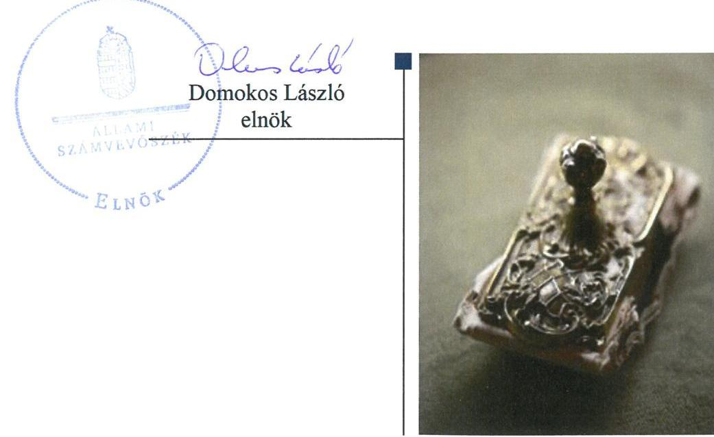
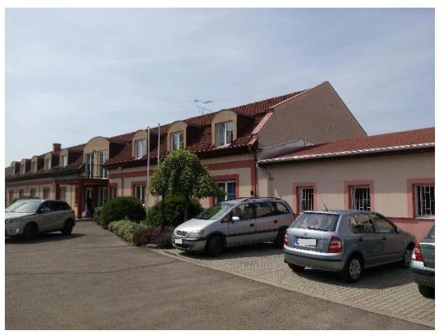
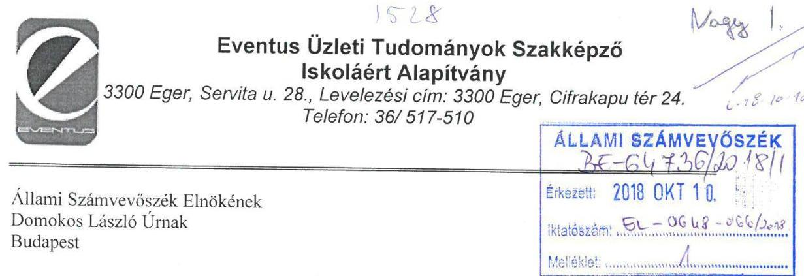
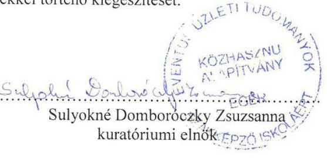
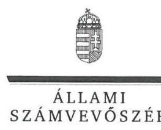
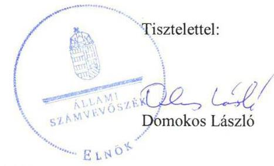

# Jelentés 

## Nem állami humánszolgáltatók ellenőrzése

A humánszolgáltatást nyújtó államháztartáson kívüli köznevelési és szociális intézmények, szolgáltatók fenntartói központi költségvetésből kapott támogatásai felhasználásának ellenőrzése - EVENTUS Üzleti Tudományok Szakképző Iskoláért Alapítvány
2018.

---

# Jelenetés 

## Nem állami humánszolgáltatók ellenőrzése

A humánszolgáltatást nyújtó államháztartáson kívüli köznevelési és szociális intézmények, szolgáltatók fenntartói központi költségvetésből kapott támogatásai felhasználásának ellenőrzése - EVENTUS Üzleti Tudományok Szakképző Iskoláért Alapítvány
2018. 11. hó 24 nap

---

# AZ ELLENŐRZÉST FELÜGYELTE:

DR. NAGY IMRE felügyeleti vezető

# AZ ELLENŐRZÉST VEZETTE ÉS A VÉGREHAJTÁSÁÉRT FELELŐS:

MOLNÁR ZSUZSANNA ellenőrzésvezető

# A PROGRAM ÖSSZEÁLLÍTÁSÁÉRT FELELŐS:

TÓTPÁL SZABOLCS osztályvezető

---

**IKTATÓSZÁM:** EL-0648-069/2018.

**TÉMASZÁM:** 2448

**ELLENŐRZÉS-AZONOSÍTÓ SZÁM:** V079417

---

Jelentéseink az Országgyűlés számítógépes hálózatán és az Interneta a www.asz.hu címen is olvashatóak.

---

# TARTALOMJEGYZÉK 

■ ÖSSZEGZÉS ..... 5
■ AZ ELLENŐRZÉS CÉLJA ..... 6
■ AZ ELLENŐRZÉS TERÜLETE ..... 7
■ AZ ELLENŐRZÉS HÁTTERE, INDOKOLTSÁGA ..... 8
■ A JELENTÉS LÉNYEGES KÉRDÉSKÖREI ..... 9
■ AZ ELLENŐRZÉS HATÓKÖRE ÉS MÓDSZEREI ..... 10
■ MEGÁLLAPÍTÁSOK ..... 12
■ JAVASLATOK ..... 16
■ MELLÉKLETEK ..... 17
I. sz. melléklet: Értelmező szótár ..... 17
■ FÜGGELÉK: ÉSZREVÉTELEK ..... 19
■ RÖVIDÍTÉSEK JEGYZÉKE ..... 25

---

.

---

# ÖSSZEGZÉS 

Az Eventus Üzleti Tudományok Szakképző Iskoláért Alapítvány - mint intézményfenntartó - a költségvetési támogatások átlátható, elszámoltatható felhasználásának feltételeit nem teremtette meg. A köznevelési feladathoz rendelt költségvetési támogatások cél szerinti felhasználása nem volt elszámoltatható. A közérdekü adatok közzétételi kötelezettségének nem tett eleget, a közpénzekkel való gazdálkodásának átláthatóságát a nyilvánosság előtt nem biztositotta.

## Az ellenőrzés társadalmi indokoltsága

Az Állami Számvevőszék stratégiájában hangsúlyos szerepet szán annak, hogy szilárd szakmai alapon álló, értékteremtő ellenőrzéseivel előmozdítsa a közpénzügyek átláthatóságát, rendezettségét, javaslataival a közpénzek és a közvagyon szabályos, gazdaságos, hatékony és eredményes felhasználását segítse. Stratégiájában az Állami Számvevőszék célul tűzte ki, hogy az államháztartáson kívülre nyújtott költségvetési támogatások ellenőrzésével hozzájárul ahhoz, hogy a közpénzeket az államháztartáson kívüli szervezetek is átlátható módon használják fel a közfeladatok szerződésben vállalt ellátása érdekében. Tekintettel az elmúlt években a köznevelés finanszírozását és a köznevelési intézmények fenntartását érintően végbement változásokra, a társadalom fokozott érdeklődéssel figyeli a köznevelési feladatok ellátására fordított források felhasználását. Fontos ezért az Állami Számvevőszéknek a közvéleményt biztosítani arról, hogy a közpénz államháztartáson kívüli felhasználása ezen a területen sem marad ellenőrizetlenül. Az ellenőrzés hozzájárul ezzel ahhoz is, hogy a nyilvánosság és a közszolgáltatást igénybevevők megfelelő tájékoztatást kapjanak az államháztartáson kívüli közfeladatot ellátók müködéséről. Az Állami Számvevőszék által az Eventus Üzleti Tudományok Szakképző Iskoláért Alapítványnál végzett ellenőrzést további társadalmi elvárás is indokolja tevékenységéből adódóan, mivel köznevelési közfeladat ellátására több, mint 800 M Ft központi költségvetési támogatásban részesült az Alapítvány az ellenőrzött időszakban.

## Főbb megállapítások, következtetések, javaslatok

Az Eventus Üzleti Tudományok Szakképző Iskoláért Alapítvány belső szabályozásának tartalma nem felelt meg a jogszabályi előírásoknak, a költségvetési támogatások átlátható, elszámoltatható felhasználásának feltételeit nem teremtette meg. A költségvetési támogatásokkal kapcsolatos igénylési, módosítási, elszámolási kötelezettségnek a Magyar Államkincstár felé a jogszabályi előírásoknak megfelelően eleget tett.

Az Eventus Üzleti Tudományok Szakképző Iskoláért Alapítvány a humánszolgáltató intézménye közfeladat ellátásának múködési kereteit szabályszerűen kialakította. Az intézmény szervezeti, személyi és tárgyi feltételeinek megteremtéséről gondoskodott. A köznevelési közfeladat ellátására kapott támogatások felhasználását nem a jogszabályi előírásoknak megfelelően tartotta nyilván, abból nem volt megállapítható a támogatások cél szerinti felhasználása.

Az Eventus Üzleti Tudományok Szakképző Iskoláért Alapítvány ellenőrizte intézményét és élt a jogszabály által számára biztosított intézmény értékelési jogával. A beszámolóra vonatkozó közzétételi kötelezettségét nem szabályszerűen teljesítette, a beszámoló hitelességét megtévesztően növelte. A közérdekű adatok közzétételi kötelezettségének nem tett eleget, ezáltal a humánszolgáltatási közfeladatot ellátó intézménye múködtetéséhez felhasznált közpénzekre vonatkozó gazdálkodásának átláthatóságát a nyilvánosság előtt nem biztosította.

Az Állami Számvevőszék a jelentésben foglalt megállapítások alapján az Eventus Üzleti Tudományok Szakképző Iskoláért Alapítvány kuratóriumi elnökének a szabályozottsággal, a nyilvántartási és közzétételi kötelezettségek teljesítésével kapcsolatban 6 javaslatot fogalmazott meg. A javaslatokat megalapozó megállapításokra az érintettnek 30 napon belül intézkedési tervet kell készítenie.

---

# AZ ELLENŐRZÉS CÉLJA 

AZ ELLENŐRZÉS CÉLJA annak értékelése volt, hogy az Eventus Üzleti Tudományok Szakképző Iskoláért Alapítvány, mint köznevelési intézményfenntartó központi költségvetésből kapott támogatásainak felhasználása szabályszerű volt-e, a támogatások igénylése, évközi módosítása és év végi elszámolása megfelelt-e a jogszabályi előírásoknak.

---

# AZ ELLENŐRZÉS TERÜLETE 

## Az Eventus Üzleti Tudományok Szakképző Iskoláért Alapítvány, mint intézményfenntartó

Az Eventus Üzleti Tudományok Szakképző Iskoláért Alapítványt 1994-ben a „SZOMA-EVENTUS" Oktatási és Vállalkozásszervező Korlátolt Felelősségű Társaság alapította - többek között - azzal a céllal, hogy az EVENTUS Üzleti, Művészeti Középiskola, Alapfokú Művészeti Iskola és Kollégium egykori jogelőd intézményének-fenntartásához, müködéséhez hozzájáruljon.

A Fenntartó ${ }^{1}$ nyílt, közhasznú jogállású szervezet volt. Vállalkozási tevékenységet az ellenőrzött időszakban nem folytatott.

Ügyvezető szerve a három főből álló kuratórium volt. A Fenntartó képviseletét a kuratóriumi tagok önállóan gyakorolták. Az ellenőrzött időszakban egy kuratóriumi tag személyében volt változás.

A Fenntartó 1994-ben megalapított intézménye ${ }^{2}$ Egerben hat, majd 2016. szeptember 1-től öt telephelyen müködött és az egész országból fogadott diákokat. Az intézmény engedélyezett tanulói létszáma meghaladta a 2500 föt.

A Fenntartó gimnáziumi, szakközépiskolai, szakiskolai nevelés-oktatási, alapfokú művészetoktatási, felnőttoktatási és kollégiumi ellátási feladatain túl, ahhoz kapcsolódóan közhasznú és egyéb tevékenységeket is folytatott az alapítványi célok megvalósítása érdekében.

A Fenntartó összes bevétele a 2014. évi 254,4 M Ft-ról 2016. évre 20,1\%-kal 305,4 M Ft-ra nőtt. A költségvetési támogatások összes bevételhez viszonyított aránya 2014. évben 99,2\%, 2016. évben 98,8\% volt. 2014. évi 45,6 M Ft-os saját tőkéje 2016-ra 35,3 M Ft-ra csökkent. Befektetett eszközállománya 2014-ben 45,9 M Ft volt, ami 2016-ra 22,5\%-kal csökkent, 35,5 M Ft-ra. 2014. évi rövid lejáratú kötelezettsége 0,3 M Ft volt, ami 2016-ra 0,5 M Ft-ra nőtt, hosszú lejáratú kötelezettsége nem volt.

---

# AZ ELLENŐRZÉS HÁTTERE, INDOKOLTSÁGA 

A köznevelési feladatokat ellátó nem állami intézményfenntartók részére közfeladataik ellátására évente jelentős összegű pénzügyi támogatást biztosítottak a mindenkori költségvetési törvények a bennük megfogalmazott feltételek mellett.

Az Országgyűlés elfogadta a nemzeti köznevelésről szóló 2011. évi CXC. törvényt, amely jelentősen átalakította a korábbi finanszírozási rendszert 2013 szeptemberétől. Új feladatfinanszírozási forma (átlagbéralapú támogatás) jelent meg, amely az államháztartáson kívüli intézményfenntartókra is vonatkozik. Az ellenőrzés a finanszírozási rendszerben bekövetkezett változásokra, azok közfeladat ellátásra gyakorolt hatására fókuszált a költségvetési támogatásokat felhasználó államháztartáson kívüli szervezetek körében. Az ellenőrzés indokoltságát az is alátámasztotta, hogy az ÁSZ ${ }^{3}$ még nem ellenőrizte átfogóan e területet.

Az ÁSZ stratégiájában foglaltak alapján is indokolt az ellenőrzés, amely a társadalom számára jelzi, hogy a közpénz államháztartáson kívüli felhasználása sem maradhat ellenőrizetlenül. Az államháztartáson kívülre nyújtott költségvetési támogatások ellenőrzésével az ÁSZ hozzájárul ahhoz, hogy a közpénzeket a nem állami fenntartók átlátható módon használják fel a közfeladatok ellátására kötött szerződésekben vállalt kötelezettségek teljesítése érdekében. Az ÁSZ az ellenőrzés javaslataival hozzájárulhat az említett rendszerek szabályszerű támogatás-felhasználásához, javíthatja a társa-dalmi-gazdasági döntések megalapozottságát, amely a „jó kormányzás" feltétele.

---

# A JELENTÉS LÉNYEGES KÉRDÉSKÖREI 

1. A köznevelési humánszolgáltatási közfeladatot ellátó Fenntartó szabályszerű müködési - és gazdálkodási környezet kialakításával megteremtette-e a költségvetési támogatások átlátható, elszámoltatható igénybevételének, felhasználásának feltételeit?
2. Az államháztartáson kívüli Fenntartó az átvállalt köznevelési közfeladathoz biztosított költségvetési támogatásokat szabályszerűen fordította-e a humánszolgáltató intézménye müködtetésére?
3. Az államháztartáson kívüli Fenntartó a köznevelési intézménye müködtetéséhez felhasznált közpénzekre vonatkozó gazdálkodásával a nyilvánosság előtt elszámolt-e, ennek megalapozása érdekében ellenőrzési, értékelési és a külső ellenőrzésekkel kapcsolatos intézkedési feladatait szabályszerűen látta-e el?

---

# AZ ELLENŐRZÉS HATÓKÖRE ÉS MÓDSZEREI 

## Az ellenőrzés típusa

Megfelelőségi ellenőrzés.

## Az ellenőrzött időszak

A 2014. január 1-je és 2016. december 31-e közötti időszak.

## Az ellenőrzés tárgya

Az ellenőrzés a köznevelési közfeladatokat ellátó államháztartáson kívüli fenntartó közfeladatai ellátásához a költségvetési törvényekben biztosított központi költségvetési támogatások igénylése, évközi módosítása és év végi elszámolása fenntartói feladatainak ellátása, illetve a központi költségvetésből kapott támogatásaik közfeladatokra való fenntartó általi felhasználása szabályszerűségének értékelésére terjedt ki.

Az ellenőrzés nem terjedt ki a költségvetési támogatás igénylése, módosítása, elszámolása valódiságának, megalapozottságának, helyességének értékelésére, valamint a források intézmény általi felhasználásának értékelésére.

## Az ellenőrzött szervezet

Az Eventus Üzleti Tudományok Szakképző Iskoláért Alapítvány, mint intézményfenntartó.

## Az ellenőrzés jogalapja

Az ellenőrzés jogszabályi alapját az ÁSZ tv. 1. § (3) bekezdésében, valamint az 5. § (3) bekezdésében foglalt előírások adták.

## Az ellenőrzés módszerei

Az ellenőrzést az ellenőrzési program kérdései, az adott időszakban hatályos jogszabályok, az ellenőrzés szakmai szabályok és módszertanok, valamint a nemzetközi standardok figyelembevételével végezte az ÁSZ.

A közpénzekkel való felelős gazdálkodás segítésére irányuló javaslatok kidolgozásakor a hatályos jogszabályok voltak az irányadóak.

---

Az ellenőrzés ideje alatt az ÁSZ a Fenntartóval történő kapcsolattartást az ÁSZ SZMSZ ${ }^{4}$-ének vonatkozó előírásai alapján biztosította.

Az ellenőrzési kérdések megválaszolásához szükséges bizonyítékok megszerzése az ellenőrzött által rendelkezésre bocsátott dokumentumokra, adatokra alapozva történt.

Az ellenőrzési bizonyítékként felhasznált adatforrások közé tartoztak egyrészt a szakmai program részletes szempontjainál felsorolt adatforrások, másrészt minden - az ellenőrzés folyamán feltárt, az ellenőrzés szempontjából információt tartalmazó - dokumentum.

Az ellenőrzés lefolytatásához a Fenntartó a kitöltött tanúsítványok, valamint az ÁSZ által kért dokumentumok átadásával szolgáltatott adatokat, információkat. Az így rendelkezésre bocsátott adatok, információk és a tanúsítványok adatai valódiságának kontrollja az ellenőrzés keretében történt.

A fenntartott intézménynél helyszíni szemle keretében győződtünk meg a tényleges feladatellátásról. A köznevelési humánszolgáltatások központi költségvetési támogatásai igénylésével, módosításával, elszámolásával kapcsolatos, államháztartáson kívüli fenntartó jogszabályokban előírt feladatai betartását, továbbá a központi költségvetési támogatások szabályszerű kezelését, nyilvántartását ellenőriztük a Fenntartónál, az ott rendelkezésre álló határozatok, nyilvántartások, beszámolók és egyéb dokumentumok alapján.

---

# 1. A köznevelési humánszolgáltatási közfeladatot ellátó Fenntartó szabályszerű múködési - és gazdálkodási környezet kialakításával megteremtette-e a költségvetési támogatások átlátható, elszámoltatható igénybevételének, felhasználásának feltételeit? 

Összegző megállapítás

A Fenntartó nem teremtette meg a költségvetési támogatások átlátható, elszámoltatható felhasználásának feltételeit.
1.1. számú megállapítás

A támogatások elkülönített nyilvántartására kiadott fenntartói szabályozás tartalma nem felelt meg a jogszabályi előírásoknak.

A támogatások elkülönített nyilvántartására kiadott utasításában ${ }^{5}$ a Fenntartó - az Nkt. vhr. ${ }^{6}$ 37/G. § (1) bekezdésében előírtak ellenére - nem olyan nyilvántartás kialakításáról rendelkezett, amelyből megállapítható lett volna, hogy a támogatások milyen célra kerültek felhasználásra.

A Fenntartót az illetékes Bíróság nyilvántartásba vette és rendelkezett a Ptk. ${ }^{7}$ előírásainak megfelelő alapító okirattal ${ }^{8}$, melyben meghatározta szervezetét és múködési szabályait is. A Fenntartó alapító okiratában szabályozta az engedélyezési, jóváhagyási, kontrolleljárásokat, valamint meghatározta a dokumentumokhoz való hozzáférés szabályait. A Fenntartó kiadta számviteli politikáját ${ }^{9}$, annak keretében az eszközök és a források leltárkészítési és leltározási szabályzatát ${ }^{10}$, az eszközök és a források értékelési szabályzatát ${ }^{11}$ és a pénzkezelési szabályzatot ${ }^{12}$.

A Fenntartó a költségvetési támogatások igénylési, módosítási és elszámolási feladatait szabályszerűen látta el.

A költségvetési támogatások iránti igényét a Fenntartó az Nkt. vhr.-ben előírt nyilatkozatokkal a 2014-2016. évekre vonatkozóan határidőre benyújtotta a Kincstárhoz ${ }^{13}$. A Fenntartó rendelkezett a költségvetési támogatásokat megállapító kincstári határozatokkal.

A Fenntartó minden évben eleget tett a Kincstár felé az Nkt. vhr.-ben előírt határidőre a költségvetési támogatás igényléshez kötődő létszám adatokban bekövetkezett változással kapcsolatos bejelentési kötelezettségének.

A Fenntartó a központi költségvetésből kapott támogatásokra vonatkozó elszámolását minden évben benyújtotta az Nkt. vhr.-ben foglaltak szerint, határidőben a Kincstár felé.

---

# 2. Az államháztartáson kívüli Fenntartó az átvállalt köznevelési közfeladathoz biztosított költségvetési támogatásokat szabályszerűen fordította-e a humánszolgáltató intézménye múködtetésére? 

Összegző megállapítás

## 2.1. számú megállapítás

2.2. számú megállapítás

A köznevelési közfeladathoz biztosított költségvetési támogatások cél szerinti felhasználása szabályszerű nyilvántartás hiányában nem volt megállapítható.

A Fenntartó biztosította intézménye múködtetésének szervezeti, személyi és tárgyi feltételeit.

A Fenntartó meghatározta intézménye alapfeladatait, múködési kereteit. Az intézmény alapító okiratát a Fenntartó kiadta. Az intézményt a Kormányhivatal ${ }^{14}$ nyilvántartásba vette, az Nkt. vhr.-ben meghatározott OM azonosítóval ${ }^{15}$ rendelkezett.

A Fenntartó az Nkt. ${ }^{16}$ rendelkezésének megfelelően kinevezte az intézmény vezetőjét, meghatározta az intézmény költségvetéseit, a kérhető térítési díj és tandíj megállapításának szabályait, a szociális alapon adható kedvezmények feltételeit.

A közfeladat ellátásához szükséges, Nkt.-ban előírt feltételeket - állandó székhelyet, telephelyet a feladatellátáshoz szükséges helyiségekkel - a Fenntartó biztosította. Az intézmény alapító okirata az Nkt.-ban foglaltak szerint tartalmazta a feladatellátást szolgáló vagyont, valamint az intézmény vagyon feletti rendelkezési jogát.

A Fenntartó rendelkezett az intézmény - a közfeladat ellátáshoz szükséges személyi és tárgyi feltételek meglétét igazoló - múködési engedélyével.

A Fenntartó a köznevelési közfeladat ellátására szolgáló támogatások felhasználását nem a jogszabályi előírásnak megfelelően tartotta nyilván.

A köznevelési közfeladat ellátására kapott támogatások felhasználásának nyilvántartása nem felelt meg az Nkt. vhr.-ben előírtaknak, mert a Fenntartó a támogatások felhasználásáról - az Nkt. vhr. 37/G. § (1) bekezdésében foglaltak ellenére - nem vezetett alapfeladatonkénti bontásban elkülönített nyilvántartást és nem gondoskodott a nyilvántartás kialakításáról akként, hogy abból megállapítható legyen, hogy a támogatások milyen célra kerültek felhasználásra.

---

# 3. Az államháztartáson kívüli Fenntartó a köznevelési intézménye múködtetéséhez felhasznált közpénzekre vonatkozó gazdálkodásával a nyilvánosság előtt elszámolt-e, ennek megalapozása érdekében ellenőrzési, értékelési és a külső ellenőrzésekkel kapcsolatos intézkedési feladatait szabályszerűen látta-e el? 

Összegző megállapítás

A Fenntartó a köznevelési intézménye múködtetéséhez felhasznált közpénzekre vonatkozó gazdálkodásával a nyilvánosság előtt nem számolt el. Intézménye vonatkozásában ellenőrzési és értékelési feladatait ellátta.

A Fenntartó ellenőrzésének szervezeti kereteit megteremtette. Intézménye vonatkozásában ellenőrzési és értékelési feladatait szabályszerűen ellátta.

Az alapító a Fenntartó múködésének és gazdálkodásának ellenőrzéséről az alapító okiratban - a Civil tv. ${ }^{17}$ előírásának megfelelően - felügyelő bizottság ${ }^{18}$ létrehozásával gondoskodott.

A Fenntartó az Nkt.-ban foglaltaknak megfelelően ellenőrizte intézménye SZMSZ-ét, házirendjét, pedagógiai programját, gazdálkodását, múködésének törvényességét és hatékonyságát, valamint értékelte a szakmai munka eredményességét.

A Fenntartó az átlagbéralapú, normatív támogatások igénybevétele jogosságának és felhasználásának ellenőrzéséről az ellenőrzött időszak mind három évében külső szakértő megbízásával gondoskodott.

A Kormányhivatal által lefolytatott törvényességi ellenőrzés eredményeként keletkezett intézkedési kötelezettségének a Fenntartó eleget tett.

## A Fenntartó a beszámoló közzétételi kötelezettségének nem a jogszabályi előírásnak megfelelően tett eleget, a felhasznált közpénzekre vonatkozó közzétételi kötelezettségét nem teljesítette.

A Fenntartó nem a jogszabályi előírásoknak megfelelően tett eleget a beszámoló közzétételi kötelezettségének, mert annak ellenére, hogy a beszámolójában közzétett adatok könyvvizsgálattal nem voltak alátámasztva,-a Számv. tv. 154. § (3) bekezdésének előírása ellenére - közzétett beszámolóin megtévesztő módon azt jelölte, hogy azok könyvvizsgálattal alátámasztottak.

A Fenntartó a jogszabályi előírásoknak megfelelően egyszerűsített éves beszámolót készített a Civil tv., illetve a Civilszr. ${ }^{19}$ előírásainak megfelelő közhasznúsági melléklettel és eredmény-kimutatással.

A Fenntartó a közérdekú adatok megismerésére irányuló igények teljesítésének rendjét az alapító okirat ${ }_{1}$-ben szabályozta. Az alapító okirat ${ }_{1}$ 2015. december 17-ei módosítását követően az Info tv. ${ }^{20}$ 30. § (6) bekezdésében előírtak ellenére nem gondoskodott a közérdekú adatok megismerésére irányuló igények teljesítése rendjének szabályozásáról.

---

Az adatok biztonságának, védelmének, valamint az egyéb adat- és titokvédelmi szabályok érvényre juttatásához szükséges eljárási szabályokat az Info tv. 7. § (2) bekezdésben foglalt előírások ellenére nem alakították ki.

A beszámoló - Cnytv. ${ }^{21}$-ben foglalt - letétbe helyezési és közzétételi kötelezettségének a Fenntartó nem szabályszerűen tett eleget, mert a 2014. évre vonatkozó beszámolóját a Civil tv. 30. § (1) bekezdésében meghatározott határidőn túl, 2015. augusztus 6. napján küldte meg az $\mathrm{OBH}^{22}$ részére.

Az Info tv.-ben meghatározott közzétételi listákon szereplő adatok pontos, naprakész és folyamatos közzétételének a részletes szabályait az Info tv. 35. § (3) bekezdésben foglalt előírások ellenére nem alakították ki.

Nem gondoskodott a Fenntartó az Info tv. 37. § (1) bekezdésében foglaltak ellenére az 1. melléklet általános közzétételi listában felsorolt adatok közzétételéről.

---

# JAVASLATOK 

Az ÁSZ tv. 33. § (1) bekezdésében foglaltak értelmében az ellenőrzött szervezet vezetője köteles a jelentésben foglalt megállapításokhoz kapcsolódó intézkedési tervet összeállítani és azt a jelentés kézhezvételétől számított 30 napon belül az ÁSZ részére megküldeni. Amennyiben az ellenőrzött szervezet vezetője nem küldi meg határidőben az intézkedési tervet, vagy továbbra sem elfogadható intézkedési tervet küld, az Állami Számvevőszék elnöke az ÁSZ tv. 33. § (3) bekezdése a) és b) pontjaiban foglaltakat érvényesítheti.

## Az Eventus Üzleti Tudományok Szakképző Iskoláért Alapítvány kuratóriumi elnökének

1. Intézkedjen, hogy a költségvetési támogatások felhasználása elkülönített nyilvántartásának szabályozása és a nyilvántartás feleljen meg a jogszabályokban elöirtaknak.
(2.2. sz. megállapítás 1. bekezdése alapján)
2. Intézkedjen a beszámolási kötelezettség jogszabályban elöirt teljesitéséről.
(3.2. sz. megállapítás 1. bekezdése alapján)
3. Belső szabályzatban állapítsa meg az Info tv. elöírásai alapján a közérdekü adatok megismerésére irányuló igények teljesitésének rendjét rögzitő szabályzatot.
(3.2. sz. megállapítás 3. bekezdés 2. mondata alapján)
4. Intézkedjen az Info tv. előírásai alapján a szükséges intézkedések megtételéről.
(3.2. sz. megállapítás 4. bekezdése alapján)
5. Belső szabályzatban állapítsa meg az Info tv. előírásai alapján a közzétételi listákon szereplő adatok pontos, naprakész és folyamatos közzétételének részletes szabályait.
(3.2. sz. megállapítás 6. bekezdése alapján)
6. Tegyen eleget az Info tv.-ben elöirt közzétételi kötelezettségnek.
(3.2. sz. megállapítás 7. bekezdése alapján)

---

# MELLÉKLETEK 

## I. SZ. MELLÉKLET: ÉRTELMEZŐ SZÓTÁR

humánszolgáltatás
költségvetési támogatás
köznevelési közfeladat
köznevelési intézmény

Külön törvényben meghatározott szociális, gyermekjóléti, gyermekvédelmi, közoktatási, felsőoktatási, kulturális közfeladatok (2014. évi Kvtv. 34. § (1), (4) bekezdés, 1. számú melléklet XX/20/2. alcím, 19. alcím, 2015. évi Kvtv. 43. § (1), (4) bekezdés, 1. számú melléklet XX/20/2/3. jogcím csoport, 19. alcím, 2016. évi Kvtv. 41. § (1), (4) bekezdés, 1. számú melléklet XX/20/2/3. jogcím csoport, 19. alcím).
a társadalombiztosítás pénzügyi alapjai kivételével az államháztartás központi alrendszeréből ellenérték nélkül, pénzben nyújtott támogatások (Áht. 1. § 14. pont)
A Kvtv-ekben (2013. évi CCXXX. törvény 33-34. §, 2014. évi C. törvény 42-43. §, 2015. évi C. törvény 40-41. §) megállapított támogatás. Például a 2015. évi C. törvény 40-41. § szerint többek között: Az Országgyűlés a köznevelési feladat ellátására átlagbéralapú támogatást állapít meg. A nevelési-oktatási, valamint pedagógiai szakszolgálati intézményt fenntartó nemzetiségi önkormányzat, az egyházi és magán köznevelési intézményfenntartója részére az általuk fenntartott nevelési-oktatási intézményben, továbbá pedagógiai szakszolgálati intézményben pedagógus és - a b) pont kivételével -nevelő-oktató munkát közvetlenül segítő munkakörben foglalkoztatottak után a 7. melléklet I. pontja, valamint az óvoda, egységes óvoda-bölcsőde esetében a 2. melléklet II. pont 1. alpontja szerint és az 5. alpontjában meghatározott jogosultak után, az őket ott megillető mértékek szerint. Múködési támogatást állapít meg a nemzetiségi önkormányzat vagy az egyházi jogi személy által fenntartott nevelési-oktatási intézményekben ellátott, továbbá a pedagógiai szakszolgálati intézményekben gyógypedagógiai tanácsadásban, korai fejlesztésben, oktatásban és gondozásban, valamint a fejlesztő nevelésben részt vevő gyermekekre, tanulókra tekintettel a nemzetiségi önkormányzat és a bevett egyház részére a 7. melléklet II. pontja szerint.
Az Országgyűlés a szociális, gyermekjóléti, gyermekvédelmi közfeladatot ellátó intézményt, szolgáltatást fenntartó egyházi jogi személy, civil szervezet, közalapítvány, országos nemzetiségi önkormányzat, települési vagy területi nemzetiségi önkormányzat, gazdasági társaság, és a humánszolgáltatást alaptevékenységként végző, az Szja tv. hatálya alá tartozó egyéni vállalkozó (a továbbiakban együtt: nem állami szociális fenntartó) részére támogatást állapít meg a következők szerint: a támogatás a nem állami szociális fenntartót a települési önkormányzatok 2. melléklet III. pont 3. alpont c)-k) pontjában és III. pont 5. alpont a) pontjában meghatározott támogatásaival azonos jogcímeken, összegben és feltételek mellett illeti meg.
A köznevelési intézmény alapító okiratában foglalt feladat: óvodai nevelés, nemzetiséghez tartozók óvodai nevelése, általános iskolai nevelés-oktatás, nemzetiséghez tartozók általános iskolai nevelése-oktatása, kollégiumi ellátás, nemzetiségi kollégiumi ellátás, gimnáziumi nevelés-oktatás, szakközépiskolai nevelés-oktatás, szakiskolai nevelés-oktatás, nemzetiség gimnáziumi nevelés-oktatása, nemzetiség szakközépiskolai nevelésoktatása, nemzetiség szakiskolai nevelés-oktatása, Köznevelési Hídprogramok keretében folyó nevelés-oktatás, felnőttoktatás, alapfokú művészetoktatás, fejlesztő nevelés, fejlesztő nevelés-oktatás, pedagógiai szakszolgálati feladat, a többi gyermekkel, tanulóval együtt nevelhető, oktatható sajátos nevelési igényű gyermekek, tanulók óvodai nevelése és iskolai nevelése-oktatása, azoknak a sajátos nevelési igényű gyermekeknek, tanulóknak az óvodai, iskolai, kollégiumi ellátása, akik a többi gyermekkel, tanulóval nem foglalkoztathatók együtt, a gyermekgyógyüdülőkben, egészségügyi intézményekben, rehabilitációs intézményekben tartós gyógykezelés alatt álló gyermekek tankötelezettségének teljesítéséhez szükséges oktatás, pedagógiai-szakmai szolgáltatás.
A nevelési- oktatási intézmény, pedagógiai szakszolgálati intézmény, pedagógiai-szakmai szolgáltatást nyújtó intézmény.

---

nem állami, nem önkormányzati (államháztartáson kívüli) intézményfenntartó

A köznevelési és szociális, gyermekjóléti és gyermekvédelmi közfeladatokat/humánszolgáltatásokat ellátó intézményt fenntartó egyházi jogi személy, társadalmi szervezet, alapítvány, közalapítvány, civil szervezet, országos nemzetiségi önkormányzat, nonprofit gazdasági társaság, gazdasági társaság és a humánszolgáltatást alaptevékenységként végző, Szja tv. hatálya alá tartozó egyéni vállalkozó. (2013. évi Kvtv. 35. § (1), (3) bekezdés, 2014. évi Kvtv. 33. §, 34. § (1), (4) bekezdés, 2015. évi Kvtv. 42. §, 43. § (1), (4) bekezdés, 2016. évi Kvtv. 40. §, 41. § (1), (4) bekezdés)

---

# FÜGGELÉK: ÉSZREVÉTELEK 

A jelentéstervezetet a Számvevőszék 15 napos észrevételezésre megküldte az ellenőrzött szervezet vezetőjének az ÁSZ tv. 29. §* (1) bekezdése előírásának megfelelően.

Az Eventus Üzleti Tudományok Szakképző Iskoláért Alapítvány kuratóriumi elnöke élt az ÁSZ tv. 29. § (2) bekezdésében foglalt észrevételezési jogával, a törvényes határidőn belül észrevételt tett.
A függelék tartalmazza az ellenőrzött észrevételeit, illetve az el nem fogadott észrevételek elutasításának indoklását.

[^0]
[^0]:    * 29. § (1) Az Állami Számvevőszék az ellenőrzési megállapításait megküldi az ellenőrzött szervezet vezetőjének vagy az általa megbízott személynek, és annak, akinek személyes felelősségét állapította meg.
    (2) Az ellenőrzött szervezet vezetője és a felelősként megjelölt személy az ellenőrzés megállapításaira tizenöt napon belül írásban észrevételt tehet.
    (3) Az Állami Számvevőszék az észrevételre a beérkezésétől számított harminc napon belül írásban válaszol. A figyelembe nem vett észrevételeket köteles a jelentésben feltüntetni, és megindokolni, hogy azokat miért nem fogadta el.

---

Tárgy: Számvevőszéki jelentéstervezethez észrevétel

Tisztelt Elnök Úr!

Köszönettel vettük, 2018/09/24-én kézhez vett a EL-0648-064/2018 iktatószámú „A humánszolgáltatást nyújtó államháztartáson kívüli köznevelési és szociális intézmények, szolgáltatók fenntartói központi költségvetésből kapott támogatásai felhasználásának ellenőrzése — EVENTUS Üzleti Tudományok Szakképző Iskoláért Alapítvány 2018.” című ellenőrzési jelentéstervezetet.

A tervezethez az alábbi észrevételeket kívánjuk tenni:

1.1. számú megállapítás: A támogatások elkülönített nyilvántartására kiadott fenntartói szabályozás tartalma nem felelt meg a jogszabályi előírásoknak.

A támogatások elkülönített nyilvántartására kiadott utasításában a Fenntartó — az Nkt. Vhr. 37/G. § (1) bekezdésében előírtak ellenére — nem olyan nyilvántartás kialakításáról rendelkezett, amelyből megállapítható lett volna, hogy a támogatások milyen célra kerültek felhasználásra.

Az Alapítvány a vizsgált időszakban elkészítette a támogatások elkülönített nyilvántartását, azonban nem megfelelő részletezettséggel, ennek megfelelően a Főkönyvi nyilvántartásokban csak az összesített adatok jelennek meg. A szakmai bontást tartalmazó nyilvántartás csak a statisztikai adatszolgáltatás elkészítését szolgálta.

1.2. számú megállapítás: A Fenntartó a köznevelési közfeladat ellátására szolgáló támogatások felhasználását nem a jogszabályi előírásnak megfelelően tartotta nyilván.

A vizsgált időszakban egy egyszerűsített adatnyilvántartás alapján a statisztikai adatszolgáltatáshoz szakfeladatonkénti nyilvántartások készültek. Ez a táblázat statisztikai (Oktatási Hivatal részére megküldendő gazdasági statisztika) célt szolgált és a főkönyvi könyvelésbe nem került rögzítésre, de tartalmazza, az egyes szakfeladatok (nappali iskolarendszer, szakmai élet, szakmai gyakorlat, kollégium) ráfordításait költségnemenkénti bontásban.

Tájékoztatjuk a Hatóságot, hogy 2017/01/01-től már kódszámos, szakfeladatokra bontott költségfelosztást vezettünk be a főkönyvi könyvelési rendszerünkbe.

3.2. számú 1. bekezdés megállapítás: A Fenntartó nem a jogszabályi előírásoknak megfelelően tett eleget a beszámoló közzétételi kötelezettségének, mert annak ellenére, hogy a beszámolójában közzétett adatok könyvvizsgálattal nem voltak alátámasztva,— a Számv. tv 154. (3) bekezdésének előírása ellenére — közzétett beszámolóin megtévesztő módon azt jelölte, hogy azok könyvvizsgálattal alátámasztottak.

Az Alapítvány könyvvizsgálatra jogszabály, illetve az Alapítói Okirat alapján a beszámoló tekintetében nem kötelezett. A civil szervezetek bírósági nyilvántartásáról és az ezzel összefüggő eljárási szabályokról szóló 2011. évi CLXXXI. törvény szerint a beszámolóhoz kötelező könyvvizsgálat esetén mellékelni kell - a független könyvvizsgálói jelentést is. Az Alapítvány az OBH részére a beszámolóval együtt könyvvizsgálói jelentést nem helyezett

---

letétbe. PK42 nyomtatványon tévesen, adminisztratív hibaként jelölte meg a könyvvizsgálattal való alátámasztást.
2017. évi egyszerűsített beszámolóban ez a hiba már nem fordult elő.

A korábbi évekre beadott beszámolók javítására jogszabály alapján nincs lehetőség, az OBHnál letétbehelyezett beszámolót cserélni nem lehet.
3.2. számú 3. bekezdés megállapítás: A Fenntartó a közérdekú adatok megismerésére irányuló igények teljesítésének rendjét az alapító okiratban szabályozta. Az alapító okirati 2015. december 17-ei módosítását követően az Info tv. 30. (6) bekezdésében előírtak ellenére nem gondoskodott a közérdekú adatok megismerésére irányuló igények teljesítése rendjének szabályozásáról.
Az Alapítvány közérdekú adatok megismerésének rendjének szabályozása a vizsgálati megállapítás szerint nem készült el.
3.2. számú 4. bekezdés megállapítás: Az adatok biztonságának, védelmének, valamint az egyéb adat- és titokvédelmi szabályok érvényre juttatásához szükséges eljárási szabályokat az Info. tv. 7.§ (2) bekezdésben foglalt előírások ellenére nem alakították ki. A vizsgált időszakra vonatkozó SZMSZ 6. számú melléklete tartalmazza az Adat és iratkezelési szabályzatot, mely a 2011. évi CXII. törvény alapján készült és a fenntartó határozatban jóváhagyta és Önök részére a 2.1.7 kérdéskörhöz kapcsolódóan megküldtük. Megítélésünk szerint a jelentés tervezett ezen megállapításával a fent részletezett miatt nem értünk egyet.
3.2. számú 5. bekezdés megállapítás: A beszámoló - Cnytv. 21-ben foglalt - letétbe helyezési és közzétételi kötelezettségének a Fenntartó nem szabályszerűen tett eleget, mert a 2014. évre vonatkozó beszámolóját a Civil tv. 30. § (1) bekezdésében meghatározott határidőn túl, 2015. augusztus 6. napján küldte meg az OBH részére.
Az Alapítvány az egyszerűsített beszámoló papíralapon határidőre, 05.30.-ig megküldte, de jogszabálymódosítás miatt, az OBH elektronikusan, a beszámoló beadását követően kérte az elektronikus letétbe helyezést, ami 2015.08.03.-án megtörtént.
3.2. számú 6. bekezdés megállapítás: Az Info. tv.-ben meghatározott közzétételi listákon szereplő adatok pontos, naprakész és folyamatos közzétételének a részletes szabályait az Info. tv. 35. § (3) bekezdésben foglalt előírások ellenére nem alakították ki.
Az Alapítvány a leírt megállapítással egyetért.
3.2. számú 7. bekezdés megállapítás: Nem gondoskodott a Fenntartó az Info tv. 37. § (1) bekezdésében foglaltak ellenére az 1. melléklet általános közzétételi listában felsorolt adatok közzétételéről.
A jelentés tervezet ezen megállapításával az Alapítvány részben ért egyet, mivel a www.eventus.hu hivatkozáson üzemeltetett honlapon megtalálhatók a következők:

- Alapító Okirat,
- SZMSZ,
- Adatvédelmi szabályzat stb.

Az adatok fenti honlap, hasznos, letöltések link alatt található.
Kérjük a jelentés fentiekkel történő kiegészítését.
Üdvözlettel:

---

ELNÖK

# Sulyokné Domboroczky Zsuzsanna úrhölgy 

kuratóriumi elnök

Eventus Üzleti Tudományok Szakképző Iskoláért Alapítvány

## Eger

## Tisztelt Elnök Úrhölgy!

A ,,Nem állami humánszolgáltatók ellenörzése - A humánszolgáltatást nyújtó államháztartáson ki-vüli köznevelési és szociális intézmények, szolgáltatók fenntartói központi költségvetésböl kapott támogatásai felhasználásának ellenörzése - Eventus Üzleti Tudományok Szakképzö Iskoláért Alapítvány" címmel készített számvevőszéki jelentéstervezetre tett észrevételeit köszönettel megkaptam.
Az Állami Számvevőszék észrevételekre vonatkozó álláspontjáról a felügyeleti vezető által készített részletes tájékoztatást csatoltan megküldöm.
Tájékoztatom Elnök úrhölgyet, hogy a számvevőszéki jelentésben - az Állami Számvevőszékről szóló 2011. évi LXVI. törvény 29. § (3) bekezdése alapján - a figyelembe nem vett észrevételeket szerepeltetjük annak megindoklásával, hogy azokat miért nem fogadtuk el.

Budapest, 2018. 11. hó 2. nap

Melléklet: Tájékoztatás az észrevételek kezeléséről

---

# Tájékoztatás   az észrevételek kezeléséről 

A „Nem állami humánszolgáltatók ellenőrzése - A humánszolgáltatást nyújtó államháztartáson ki-vüli köznevelési és szociális intézmények, szolgáltatók fenntartói központi költségvetésböl kapott támogatásai felhasználásának ellenőrzése - Eventus Üzleti Tudományok Szakképzö Iskoláért Alapitvány" címủ jelentéstervezetre 2018. október 5-én tett (az Állami Számvevőszékhez 2018. október 10-én érkezett) észrevételét áttekintettük, annak kezelésével kapcsolatban a következő tájékoztatást adom.

1. A jelentéstervezet 1.1. számú megállapítás 1. bekezdésére vonatkozó észrevétel:

Az észrevételben leírtak szerint az Alapítvány elkészítette a támogatások elkülönített nyilvántartását, azonban nem megfelelő részletezettséggel, így a fökönyvi nyilvántartásokban csak összesített adatok jelennek meg. A szakmai bontást tartalmazó nyilvántartás csak a statisztikai adatszolgáltatás elkészítését szolgálta.
Az észrevétel a megállapítást nem vitatja, a jelentéstervezet módosítása nem indokolt.
2. A jelentéstervezet 2.2. számú megállapítására és az 1. számú javaslatra vonatkozó észrevétel:
Az észrevétel szerint egyszerüsített adatnyilvántartás alapján, statisztikai adatszolgáltatáshoz szakfeladatonként nyilvántartások készültek, az egyes szakfeladatok költségnemenkénti bontásában, amelynek adatai a fökönyvi könyvelésben nem kerültek rögzítésre. Az Alapítvány 2017. január 1étől kódszámos, szakfeladatra bontott költségfelosztást vezetett be a fökönyvi könyvelésében.
Az észrevétel a megállapítást nem vitatja, a jelentéstervezet módosítása nem indokolt.
3. A jelentéstervezet 3.2. számú megállapítás 1. bekezdésére és a 2. számú javaslatra vonatkozó észrevétel:
Az észrevétel szerint az Alapítvány könyvvizsgálatra nem kötelezett. Az OBH részére letétbe helyezett beszámolón az Alapítvány tévesen, adminisztratív hibaként jelölte meg a könyvvizsgálattal való alátámasztást.
Az észrevétel a megállapítást nem vitatja, a jelentéstervezet módosítása nem indokolt.
4. A jelentéstervezet 3.2. számú megállapítás 3. bekezdésére és a 3. számú javaslatra vonatkozó észrevétel:
Az észrevételben leírtak szerint az Alapítványnál a közérdekủ adatok megismerési rendjének szabályozása nem készült el.
Az észrevétel a megállapítást nem vitatja, a jelentéstervezet módosítása nem indokolt.

---

# 5. A jelentéstervezet 3.2. számú megállapítás 4. bekezdésére és a 4. számú javaslatra vonatkozó észrevétel: 

Az észrevételben leírtak szerint az Alapítvány SZMSZ-ének 6. számú melléklete tartalmazza az Adat és iratkezelési szabályzatot, amelyet az ellenőrzés részére megküldtek.
Az észrevételt nem fogadjuk el. Az ellenőrzés rendelkezésére bocsátott SZMSZ 6. számú mellékletének, az Adat- és iratkezelési szabályzatnak a tartalma nem felel meg az információs önrendelkezési jogról és az információszabadságról szóló 2011. évi CXII. törvény (Info tv.) 7. §-ában foglalt előírásoknak, mivel nem tartalmaz az adatok védelmére vonatkozó intézkedéseket, adatbiztonsági eljárási szabályokat. Az Alapítvány szabályzatában az adatokra vonatkozó, az Info tv.-ből, valamint a nemzeti köznevelésről szóló 2011. évi CXC. törvényből kiemelt definíciók, továbbá az iratkezeléssel kapcsolatos előírások találhatók.
Az észrevétel alapján a jelentéstervezet módosítása nem indokolt.

## 6. A jelentéstervezet 3.2. számú megállapítás 5. bekezdésére vonatkozó észrevétel:

Az észrevételben leírtak szerint az Alapítvány az egyszerüsített beszámolót papír alapon határidőben megküldte, azonban a jogszabály-módosításnak megfelelő elektronikus letétbe helyezés 2015. augusztus 3 -án történt meg.
Az észrevétel a megállapítást nem vitatja, a jelentéstervezet módosítása nem indokolt.

## 7. A jelentéstervezet 3.2. számú megállapítás 6. bekezdésére és az 5. számú javaslatra vonatkozó észrevétel:

Az észrevételben leírtak szerint az Alapítvány a megállapításban leírtakkal egyetért.
Az észrevétel a megállapítást nem vitatja, a jelentéstervezet módosítása nem indokolt.

## 8. A jelentéstervezet 3.2. számú megállapítás 7. bekezdésére és a 6. számú javaslatra vonatkozó észrevétel:

Az észrevételben leírtak szerint az Alapítvány a megállapítással részben ért egyetért, mivel a honlapján az Alapító Okirat, SZMSZ, Adatvédelmi szabályzat megtalálható.
Az észrevételt nem fogadjuk el. Az Alapítvány a honlapján nem tett eleget az Info tv. 35. § (1) bekezdésének előírása ellenére az Info tv. 37. § (1) bekezdésében foglaltak szerinti, az 1. melléklet általános közzétételi listában felsorolt adatok közzétételi kötelezettségének. Az észrevételben hivatkozott, közzétett szabályzatok nem tartalmazták teljes körüen a hivatkozott jogszabály alapján közzétételre előírt adatokat.
Az észrevétel alapján a jelentéstervezet módosítása nem indokolt.
Budapest, 2018. 11 hó ๑ nap
Dr. Nagy Imre
felügyeleti vezető

---

# RÖVIDÍTÉSEK JEGYZÉKE 

${ }^{1}$ Alapítvány
${ }^{2}$ intézmény
${ }^{3}$ ÁSZ
${ }^{4}$ ÁSZ SZMSZ
${ }^{5}$ fenntartói utasítás
${ }^{6}$ Nkt. vhr.
${ }^{7}$ Ptk.
${ }^{8}$ alapító okirat
${ }^{9}$ számviteli politika
${ }^{10}$ leltározási szabályzat
${ }^{11}$ értékelési szabályzat
${ }^{12}$ pénzkezelési szabályzat
${ }^{13}$ Kincstár
${ }^{14}$ Kormányhivatal
${ }^{15}$ OM azonosító
${ }^{16} \mathrm{Nkt}$.
${ }^{17}$ Civil tv.
${ }^{18}$ Felügyelő Bizottság
${ }^{19}$ Civilszr.
${ }^{20}$ Info tv.
${ }^{21}$ Cnytv.
${ }^{22} \mathrm{OBH}$

EVENTUS Üzleti Tudományok Szakképző Iskoláért Alapítvány
EVENTUS Üzleti, Művészeti Középiskola, Alapfokú Iskola és Kollégium
Állami Számvevőszék
az Állami Számvevőszék elnökének 4/2017. (XII. 29.) ÁSZ utasítása az Állami Számvevőszék Szervezeti és Múködési Szabályzatáról (hatályos: 2017. január 1jétől)
Utasítás a közfeladatokhoz rendelt költségvetési támogatások igényléséről, elszámolásáról és nyilvántartásáról (hatályos: 2013. szeptember 1-jétől) 229/2012. (VIII. 28.) Korm. rendelet a nemzeti köznevelésről szóló törvény végrehajtásáról (hatályos 2012. szeptember 1-jétől)
2013. évi V. törvény a Polgári Törvénykönyvről (hatályos: 2014. március 15-től)
1: Eventus Üzleti Tudományok Szakképző Iskoláért Alapítvány módosításokkal egységes szerkezetbe foglalt Alapító okirata (hatályos: 2012. február 3-tól)
2: Eventus Üzleti Tudományok Szakképző Iskoláért Alapítvány módosításokkal egységes szerkezetbe foglalt Alapító okirata (hatályos: 2015. december 17-től)
1: Eventus Üzleti Tudományok Szakképző Iskoláért Alapítvány - Számviteli Politika 2010. (hatályos 2010. március 31-től)
2: Eventus Üzleti Tudományok Szakképző Iskoláért Alapítvány - Számviteli Politika 2016. (hatályos 2016. január 1-jétől)
1: Eventus Üzleti Tudományok Szakképző Iskoláért Alapítvány - Leltározási Szabályzat 2010. (hatályos 2010. március 31-től)
2: Eventus Üzleti Tudományok Szakképző Iskoláért Alapítvány - Leltározási Szabályzat 2016. (hatályos 2016. január 1-jétől)
1: Eventus Üzleti Tudományok Szakképző Iskoláért Alapítvány - Értékelési Szabályzat 2010. (hatályos 2010. március 31-től)
2: Eventus Üzleti Tudományok Szakképző Iskoláért Alapítvány - Értékelési Szabályzat 2016. (hatályos 2016. január 1-jétől)
Eventus Üzleti Tudományok Szakképző Iskoláért Alapítvány - Pénzkezelési Szabályzat (hatályos 2010. március 31-től)
Magyar Államkincstár
Heves Megyei Kormányhivatal
oktatási azonosító szám
2011. évi CXC. törvény a nemzeti köznevelésről (hatályos: 2012. szeptember 1-től)
2011. évi CLXXV. törvény az egyesülési jogról, a közhasznú jogállásról, valamint a civil szervezetek múködéséről és támogatásáról (hatályos: 2011. december 22-től)
Eventus Üzleti Tudományok Szakképző Iskoláért Alapítvány Felügyelő Bizottsága 224/2000. (XII. 19.) Korm. rendelet az egyes egyéb szervezetek beszámoló készítési és könyvvezetési kötelezettségének sajátosságairól (hatályos 2001. január 1-jétől 2016. december 31-ig)
2011. évi CXII. törvény az információs önrendelkezési jogról és az információszabadságról (hatályos: 2011. július 27-től)
2011. évi CLXXXI. törvény a civil szervezetek bírósági nyilvántartásáról és az ezzel összefüggő eljárási szabályokról (hatályos: 2011. december 23-tól)
Országos Bírósági Hivatal

---

# ÁLLAMI SZÁMVEVŐSZÉK 

1052 Budapest, Apáczai Csere János utca 10.
Levélcím: 1364 Budapest 4. Pf. 54
Telefon: +36 14849100 Telefax: +36 14849200
www.asz.hu