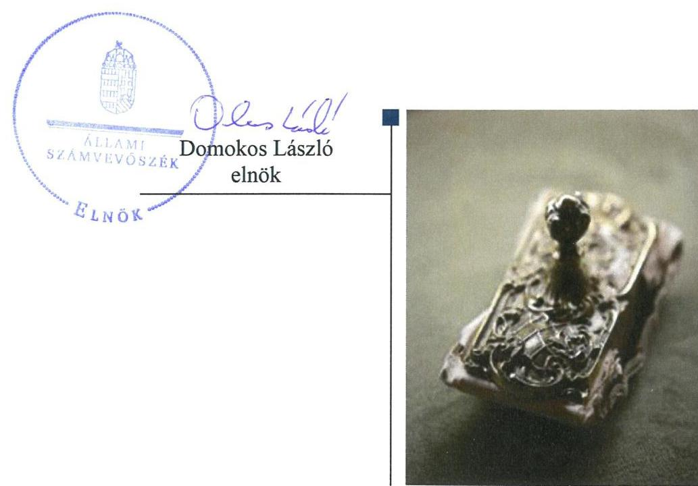
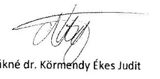
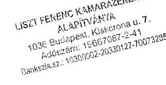
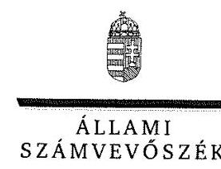
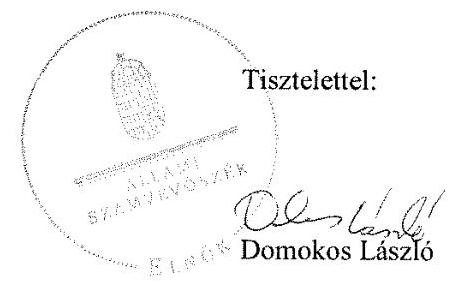
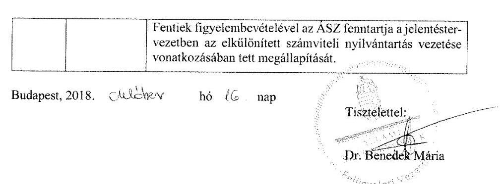

# Jelenetés 

## Alapítványok ellenőrzése

Alapítványok gazdálkodásának ellenőrzése Liszt Ferenc Kamarazenekar Alapítvány 2018. M. hó 20. nap

---

# AZ ELLENŐRZÉST FELÜGYELTE:

DR. BENEDEK MÁRIA felügyeleti vezető

## AZ ELLENŐRZÉST VEZETTE ÉS A VÉGREHAJTÁSÁÉRT FELELŐS:

- KLINGER ZOLTÁN ellenőrzésvezető
- A PROGRAM ÖSSZEÁLLÍTÁSÁÉRT FELELŐS:
  - TÓTPÁL SZABOLCS osztályvezető

**IKTATÓSZÁM:** EL-0749-041/2018.

**TÉMASZÁM:** 2449

**ELLENŐRZÉS-AZONOSÍTÓ SZÁM:** V077513

Jelentéseink az Országgyűlés számítógépes hálózatán és az Interneten a www.asz.hu címen is olvashatóak.

---

# TARTALOMJEGYZÉK 

■ ÖSSZEGZÉS ..... 5
■ AZ ELLENŐRZÉS CÉLJA ..... 7
■ AZ ELLENŐRZÉS TERÜLETE ..... 8
■ AZ ELLENŐRZÉS HÁTTERE, INDOKOLTSÁGA ..... 9
■ A JELENTÉS LÉNYEGES KÉRDÉSKÖREI ..... 10
■ AZ ELLENŐRZÉS HATÓKÖRE ÉS MÓDSZEREI ..... 11
■ MEGÁLLAPÍTÁSOK ..... 13
■ JAVASLATOK ..... 17
■ MELLÉKLETEK ..... 19
I. sz. melléklet: Értelmező szótár ..... 19
II. sz. melléklet: A Liszt Ferenc Kamarazenekar Alapítvány főbb mérleg adatai ..... 21
■ FÜGGELÉK: ÉSZREVÉTELEK ..... 23
■ RÖVIDÍTÉSEK JEGYZÉKE ..... 33

---

.

---

# ÖSSZEGZÉS 

Az Állami Számvevőszék a Liszt Ferenc Kamarazenekar Alapítvány gazdálkodásának ellenőrzése során megállapította, hogy a szervezeti kereteit, gazdálkodási szabályzatait a jogszabályok szerint alakította ki. Bevételeit és kiadásait minden évre egymással egyensúlyban tervezte meg, így biztosította a tervezhető gazdálkodás kereteit. A költségvetési támogatások felhasználása, elszámolása 2014-2015 években szabályszerű volt, míg a 2016. évben nem volt szabályszerű. Gazdálkodása a kiadások elszámolási hiányosságai, közbeszerzési eljárás elmulasztása valamint adatvédelmi szabályozási hiányosságok miatt nem volt szabályszerű, ezáltal a közpénzek felhasználásának átláthatóságát nem biztosította. A beszámoló közzétételét 2016. évre határidőben nem teljesítette.

## Az ellenőrzés társadalmi indokoltsága

Az alapítványok, mint az alapító által az alapító okiratban meghatározott tartós cél megvalósítására létrehozott jogi személyek tevékenységüket az alapító által juttatott vagyon kezelésével, felhasználásával látják el. Az alapítványok működésükre és szakmai tevékenységük ellátására költségvetési támogatásban vagy ingyenes vagyonjuttatásban részesülhetnek. Az Állami Számvevőszék stratégiájában megfogalmazta, hogy az államháztartáson kívülre nyújtott költségvetési támogatások és ingyenes vagyonjuttatások, valamint az államháztartáson kívül működő közfeladat-ellátó rendszerek ellenőrzéseivel hozzájárul ahhoz, hogy a közpénzeket az államháztartáson kívül működő szervezetek is átlátható, rendezett módon használják fel a közvagyon átlátható, hatékony, költségtakarékos működtetése, értékének megőrzése, állagának védelme, értéknövelő használata, hasznosítása és gyarapítása érdekében.

## Főbb megállapítások, következtetések, javaslatok

A Liszt Ferenc Kamarazenekar Alapítvány 2014-2016. években hatályos alapító okirattal rendelkezett, ami a jogszabályi előírások szerint készült el. A gazdálkodás szervezeti kereteit a jogszabályokban megfogalmazott előírások szerint alakította ki, létrehozta legfőbb szervét a Kuratóriumot, valamint FB-t működtetett.

A gazdálkodásra vonatkozóan, a jogszabályi előírások alapján a számviteli politika keretén belül elkészítette belső szabályzatait. Megállapította a kötelezettségvállalási és utalványozási jogkörök gyakorlásának rendjét, szabályozta a pénzgazdálkodással kapcsolatos folyamatokat, feladat és hatásköröket, amivel megteremtette a közpénzekkel való átlátható és ellenőrizhető gazdálkodás kereteit.

A jogszabályi előírások ellenére az adatok biztonságának, védelmének érvényre juttatásához szükséges eljárási szabályokat nem állapította meg, továbbá nem állapította meg belső szabályzatban a kötelezően közzéteendő közérdekű adatok elektronikus közzétételi kötelezettség teljesítésének részletes szabályait.

A Liszt Ferenc Kamarazenekar Alapítvány 2014-2016. évekre vonatkozóan elkészítette a költségvetési terveit, a bevételeket és a kiadásokat egymással egyensúlyban, a jogszabály által előírt tartalommal tervezte meg, ezáltal biztosította a tervezhető, kiszámítható gazdálkodás feltételeit.

A kapott költségvetési és egyéb támogatásokat a jogszabályokban előírtak szerint szabályosan tartotta nyilván, azonban a támogatások 2016-óta hatályos törvényi előírás szerinti felhasználása elszámolásának alátámasztása nem volt szabályszerű. A Liszt Ferenc Kamarazenekar Alapítvány gazdálkodása nem volt szabályszerű, mivel az anyagjellegű ráfordítások kifizetése és elszámolása során a 2014-2016. években a gazdasági eseményeket a Számv. tv. előírásai ellenére alapbizonylatok hiányában rögzítette, beruházásai esetében az utalványozást és a teljesítés igazolását elmulasztotta, valamint két esetben a jogszabályi előírások ellenére a közbeszerzési eljárást nem folytatta le.

---

A 2016. üzleti évről szóló egyszerűsített éves beszámolót határidőben nem tette közzé, valamint a jogszabályi előírások ellenére az adatok védelmével és a közérdekű adatok nyilvánosságra hozatalával kapcsolatos kötelezettségének nem teljes körűen tett eleget, így e hiányosságok miatt nem biztosította a közpénzek felhasználásának átláthatóságát és ellenőrizhetőségét.

Az ÁSZ az ellenőrzés megállapításai alapján a Liszt Ferenc Kamarazenekar Alapítvány Kuratórium elnökének hét javaslatot fogalmazott meg.

---

# AZ ELLENŐRZÉS CÉLJA 

Az ellenőrzés célja annak megállapítása volt, hogy az alapítvány gazdálkodása során betartotta-e a vonatkozó jogszabályi előírásokat, szabályszerűen használta-e fel a kapott költségvetési támogatásokat, az államháztartásból meghatározott célra ingyenesen juttatott vagyon használata, hasznosítása a jogszabályi előírásoknak megfelelően történt-e, az alapítvány működését szolgáló ellenőrzési és nyilvántartási rendszerek szabályszerűen működtek-e.

---

# **AZ ELLENŐRZÉS TERÜLETE**

### **Liszt Ferenc Kamarazenekar Alapítvány**

A közhasznú jogállású Liszt Ferenc Kamarazenekar Alapítványt 1991-ben magánszemélyek alapították 0,18 MFt induló vagyonnal.

A Liszt Ferenc Kamarazenekar Alapítvány egyszemélyi felelős vezetője az ellenőrzött időszakban az alapítvány Kuratóriumának elnöke volt, gazdálkodásával kapcsolatos felügyeleti jogkört a három tagú felügyelő bizottság gyakorolta.

Az Alapítvány alapító okirat szerinti célja:

- a magyar zenei kultúra bel- és külföldi terjesztése
- a zenekar működési feltételeinek hazai és külföldi tevékenységének támogatása
- a zenekar saját művészi színvonalának emelése

A Liszt Ferenc Kamarazenekar Alapítvány közhasznú tevékenysége keretében 2014-2016. években hangversenyeket, zenei rendezvényeket, szakmai találkozókat szervezett, amely 30 ezer zeneszerető emberhez jutott el.

2014-2016. évben a Liszt Ferenc Kamarazenekar Alapítvány az államháztartásból ingyenesen juttatott vagyont nem kapott, gazdálkodása veszteséges volt. A Liszt Ferenc Kamarazenekar Alapítvány 2014-2016. években az Ectv.-ben meghatározott közhasznú tevékenységet végzett, közhasznú minősítéssel rendelkezett, gazdasági-vállalkozási tevékenységet nem folytatott. Az Alapítvány munkavállalóinak létszáma 2014-ben 18, 2015-ben 20, 2016-ban 18 fő volt.

A Liszt Ferenc Kamarazenekar Alapítvány államháztartási és azon kívüli forrásból összesen a három év alatt 271,7 MFt támogatást kapott közfeladata ellátásához, harmadik fél részére 2014-2016. között támogatást nem nyújtott. Az államháztartásból és egyéb forrásból kapott támogatásokat az 1. ábra szemlélteti.

1. ábra

|  AZ ALAPÍTVÁNY AZ ÁLLAMHÁZTARTÁSBÓL ÉS EGYÉB FORRÁSBÓL KAPOTT TÁMOGATÁSAI 2014-2016. ÉVEKBEN (MFT) |  |  |  |  |   |
| --- | --- | --- | --- | --- | --- |
|  Év | Költségvetési
támogatás
(EMMI) | Központi költségvetési TÁO támogatás | SZIA 1 % | NKA, Gazdálkodók, Egyház támogatása, egyéb | Összes támogatás  |
|  2014. | 46,00 | 33,25 | 0,13 | 7,04 | 86,42  |
|  2015. | 46,00 | 54,63 | 0,15 | 8,2 | 109,07  |
|  2016. | 46,00 | 28,32 | 0,12 | 1,81 | 76,25  |

*Forrás: Az Alapítvány egyszerűsített éves beszámoló*

---

# AZ ELLENŐRZÉS HÁTTERE, INDOKOLTSÁGA 

Társadalmi elvárás a közpénzek értékelvű, rendeltetésszerű felhasználása, a közpénzekből nyújtott támogatások átláthatóságának megteremtése, amelyhez az Állami Számvevőszék az államháztartásból nyújtott támogatások ellenőrzésével kíván hozzájárulni. Az ÁSZ Stratégiájában rögzített célkitűzése, hogy az államháztartáson kívülre nyújtott költségvetési támogatások és az ingyenes vagyonjuttatás ellenőrzésével hozzájáruljon ahhoz, hogy a közpénzeket a civil szervezetek is átlátható módon használják fel. Továbbá az alapítványok és közalapítványok gazdálkodása szabályszerűségének bemutatásával hozzájárul ahhoz, hogy a társadalom objektív képet alkothasson az alapítványok, a közalapítványok működéséről.

Az ellenőrzés eredményeinek célzott felhasználói a nyilvánosság, a jogalkotó, továbbá az alapítványok alapítói és szervei. Az ellenőrzés eredményeképp a törvényalkotás számára tapasztalatok állnak rendelkezésre az alapítványok gazdálkodása szabályozásához. Az ellenőrzött szervezetek szintjén gazdálkodásuk vonatkozásában a hiányosságok, szabálytalanságok feltárása, az ennek kapcsán megfogalmazott megállapítások elősegíthetik az alapítványok szabályszerű gazdálkodását, míg a társadalom számára információt szolgáltat arról, hogy az alapítványok a közpénzeket szabályszerűen használták-e fel. Az alapítványok és a közalapítványok gazdálkodása szabályszerűségének bemutatásával az ellenőrzés értékteremtő módon járul hozzá az ÁSZ stratégiai céljainak megvalósításához, a nyilvánosság megfelelő tájékoztatásához.

---

# A JELENTÉS LÉNYEGES KÉRDÉSKÖREI 

1. Az alapítvány gazdálkodása szabályszerű volt-e?
2. Az alapítvány szabályszerűen használta-e fel a kapott támogatásokat?
3. Az alapítvány működését szolgáló nyilvántartási valamint a beszámolási kötelezettségét teljesítette-e?

---

# AZ ELLENŐRZÉS HATÓKÖRE ÉS MÓDSZEREI 

## Az ellenőrzés típusa

Szabályszerűségi ellenőrzés

## Az ellenőrzött időszak

2014-2016. évek. Az ellenőrzés kiterjedt az ellenőrzött éveket érintő, de az azt megelőzően a költségvetéssel, valamint az ellenőrzött időszakot követően a beszámolással kapcsolatban hozott döntések dokumentumaira is. Amennyiben az ellenőrzött időszakon belül történt támogatás felhasználás, azonban annak elszámolására 2016. évet követően került sor, az elszámolást - tekintettel arra, hogy az az ellenőrzött időszakra vonatkozik - is ellenőrizni kellett.

## Az ellenőrzés tárgya

Az ellenőrzés tárgya az alapítvány vonatkozó jogszabályi előírások szerinti gazdálkodási tevékenysége volt. Ezen belül az alapítvány a gazdálkodásához kapcsolódó szervezeti és szabályozási kereteinek a jogszabályi előírásoknak megfelelő kialakítása, a kapott költségvetési és egyéb támogatások, szabályszerű felhasználására irányuló tevékenysége. Az ellenőrzés kiterjedt továbbá az alapítvány működését, gazdálkodását szolgáló nyilvántartási és ellenőrzési tevékenységére.

## Az ellenőrzött szervezet

Liszt Ferenc Kamarazenekar Alapítvány

## Az ellenőrzés jogalapja

Az ÁSZ tv¹. 1. § (3) bekezdése, 5. § (3) bekezdése, továbbá az Ectv ${ }_{1,2}{ }^{2}$. 47. $\S$-a.

## Az ellenőrzés módszerei

Az ÁSZ az ellenőrzést a szakmai program szempontjai, az ellenőrzött időszakban hatályos jogszabályok, a jelen ellenőrzésre irányadó ÁSZ módszertan figyelembe vételével és a nemzetközi standardokat irányadónak tekintve végezte el.

---

Az ellenőrzés ideje alatt az ellenőrzött szervezettel történő kapcsolattartás az ÁSZ SZMSZ³-ének vonatkozó előírásai alapján történt.

Az ellenőrzési kérdések megválaszolásához szükséges bizonyítékok megszerzése az ellenőrzött által rendelkezésre bocsátott dokumentumokra, adatokra alapozva megfigyelés, szemle (szemrevételezés), kérdésfeltevés (információkérés), mintavételezés, valamint elemző eljárás útján történt. A mintavételezés véletlen mintavételi eljárással történt.

Az ellenőrzési bizonyítékként felhasználható adatforrások közé tartoztak egyrészt a szakmai program részletes szempontjainál felsorolt adatforrások, másrészt minden egyéb -az ellenőrzés folyamán - feltárt, az ellenőrzés szempontjából információt tartalmazó dokumentum.

Az ellenőrzés lefolytatásához az ellenőrzött a tanúsítványok kitöltésével, hitelesítésével és azok, valamint az ÁSZ által kért dokumentumok megküldésével szolgáltatott adatokat. Az így rendelkezésre bocsátott adatok, információk, a tanúsítványok adatai valódiságának kontrollja az ellenőrzés keretében történt.

Mintavétellel ellenőriztük a beruházások, felújítások; az alapcélra fordított kiadások és ráfordítások, valamint az alapítvány által nyújtott támogatások elszámolásának szabályszerűségét a legalább 100.000 Ft értékű tételek esetében. Mintavétellel ellenőriztük továbbá az alapítvány beszámolóinál a mérlegtételek besorolását, év végi értékelését, azok leltárral való alátámasztottságát. A minta alapján a sokaságban előforduló hibaarányt becsültük. „Szabályszerűnek" értékeltünk egy ellenőrzött területet, amennyiben 95\%-os bizonyossággal a teljes sokaságban a hibaarány legfeljebb 10\%, „nem szabályszerűnek", amennyiben 10\%-nál magasabb arányt képviselt.

Abban az esetben, ha a teljes sokaság tekintetében a 10\%-os hibaarányhoz való viszony megítélésének megbízhatósága nem érte el a 95\%-ot, annak elérése érdekében értékelésünket további szempontokkal egészítettük ki, és figyelembe vettük a feltárt hibák értékét.

---

# 1. Az alapítvány gazdálkodása szabályszerű volt-e? 

## Összegző megállapítás

### 1.1. számú megállapítás

Az Alapítvány gazdálkodása nem volt szabályszerű.

Az Alapítvány gazdálkodása szervezeti kereteinek kialakítása szabályszerű volt.

Az Alapítvány a 2014-2016. években rendelkezett hatályos, aktuális Alapító okirattal, amelyeket a Ptk., a Ptk., valamint az Ectv-ben előírtak szerint készített el.

Az Alapító a Ptk. és a Ptk.-ben foglalt előírások
 szerint az Alapító okirat ${ }_{1,2}$-ben az Alapítvány legfőbb szervének a Kuratóriumot ${ }^{9}$ jelölte ki, meghatározva annak feladatait. Az Alapító a Közhasznú tv., Ptk. ${ }_{2}$ és az Ectv ${ }_{1,2}$ ben foglalt előírások szerint az Alapító okirat ${ }_{1,2}$-vel létrehozta a FB-t. ${ }^{10}$.

A 2014-2016. üzleti években a Kuratórium az Alapítvány egyszerűsített éves számviteli beszámolóit Független könyvvizsgálóval ${ }^{11}$ ellenőriztette.

### 1.2. számú megállapítás

Az Alapítvány gazdálkodására vonatkozó belső szabályozás szabályszerű volt.

A Kuratórium elnöke a Számv. tv. ${ }^{12}$-ben foglalt előírások szerint elkészítette a számviteli politika ${ }^{13}{ }_{1,2}$ keretén belül kötelezően előírt szabályzatokat ${ }^{14}$. A Kuratórium elnöke utasítás formájában szabályozta a kötelezettségvállalási és utalványozási jogkörök gyakorlásának rendjét ${ }^{15}$, kialakította a pénzgazdálkodással kapcsolatos folyamatokat, feladat- és hatásköröket.

Az adatbiztonság és közzétételi kötelezettségek szabályozása vonatkozásában feltárt hiányosságokat a 1. táblázat tartalmazza.

## AZ ADATBIZTONSÁG ÉS A KÖZZÉTÉTELI KÖTELEZETTSÉGEK SZABÁLYOZÁSA VONATKOZÁSÁBAN FELTÁRT HIÁNYOSSÁGOK

Sorszám Részmegállapítás
Megjegyzés

1. Az Alapítvány az Info. tv. ${ }^{16}$ 7. § (2) bekezdésében foglalt előírás ellenére 2014-2016. években nem állapította meg az Info.tv., valamint az egyéb adat- és titokvédelmi szabályok érvényre juttatásához szükséges eljárási szabályokat,
2. Az Alapítvány az Info tv. 30. § (6) bekezdése ellenére nem készítette el 2014-2016. évekre vonatkozóan közérdekű adatok megismerésére irányuló igények teljesítésének rendjét rögzítő szabályzatot.
3. Az Alapítvány az Info tv. 35. § (3) bekezdésének előírása ellenére a 2014-2016. évekre a kötelezően közzéteendő közérdekű adatok elektronikus közzétételi kötelezettségének teljesítéséről szóló részletes szabályokat belső szabályzatban nem állapította meg.

---

# 1.3. számú megállapítás 

Az Alapítvány költségvetése tervezése során szabályszerűen járt el.
Az Alapítvány a 2014-2016. években rendelkezett a Kuratórium által jóváhagyott költségvetési tervekkel, a költségvetése tervezése során betartotta az Ecvhr. ${ }^{17}$-ben előírtakat, mert a kiadásokat és a bevételeket egymással egyensúlyban tervezte meg, valamint a költségvetési terveket a Civilszr. ${ }^{18}$ előírása szerint a beszámoló tartalmi elemeinek megfelelően készítette el.

### 1.4. számú megállapítás

Az Alapítvány kiadásainak elszámolása nem volt szabályszerű.
Az Alapítvány a kiadásait alapcél szerinti tevékenységére használta fel.
A kiadásokkal kapcsolatosan a 2014-2016. évek vonatkozásában feltárt hiányosságokat a 2. táblázat mutatja.
2. táblázat

## A KIADÁSOK ELSZÁMOLÁSA VONATKOZÁSÁBAN FELTÁRT HIÁNYOSSÁGOK

| Sorszám | Részmegállapítás | Megjegyzés |
| :--: | :--: | :--: |
| 1. | Az Alapítvány a Számv. tv. 167. § (1) bekezdés c) pontja ellenére a beruházásra és felújításra fordított összegek felhasználása bizonylatain a 2014-2015. évben az utalványozó és a rendelkezés végrehajtását igazoló személy aláírását nem szerepeltette. | 2016. évben az Alapítvány beruházást, felújítást nem végzett. |
| 2. | Az Alapítvány a Számv. tv. 165.§ (1)-(2) bekezdésben foglaltak ellenére 2014-2016. években az anyagjellegű kiadások gazdasági eseményeit szabályszerűen kiállított bizonylatok nélkül rögzítette. |  |
| 3. | Az Alapítvány a Kbt ${ }^{19}$; 5. § alapján fennálló, a Kbt 119. § (1) bekezdésében előírt közbeszerzési eljárás lefolytatási kötelezettségét megszegte, két határozatlan időre szóló szolgáltatási szerződés esetében. | Az Alapítvány a szerződéseket könyvviteli szolgáltatás igénybevételére, illetve koncertek kulturális feladatainak szervezésére kötötte. |

Forrás: ÁSZ

## 2. Az alapítvány szabályszerűen használta-e fel a kapott támogatásokat?

## Összegző megállapítás

Az Alapítvány a kapott költségvetési és egyéb támogatásokat 2014-2015. években szabályszerűen használta fel, míg a 2016. évben a támogatások felhasználása elszámolása, nyilvántartása nem volt szabályszerű.
2.1. számú megállapítás

A költségvetési támogatások felhasználása, elszámolása 2014-2015. években szabályszerű volt, míg a 2016. évben nem volt szabályszerű.

A bevételként elszámolt, kapott költségvetési támogatások számviteli nyilvántartásait az Alapítvány az Ectv ${ }_{1,2}$-ben, a Számv. tv-ben és Civilszr.-ben valamint a Számviteli politika ${ }_{1,2}$-ben előírtak szerint vezette. Az Alapítvány bevételi és ráfordítás adatait a 2. ábra mutatja.

Az Alapítvány az EMMI ${ }^{20}$-vel és Önkormányzattal ${ }^{21}$ közszolgáltatási, továbbá az Önkormányzattal támogatási szerződést kötött, amelynek keretében részt vett az önkormányzati és kulturális közfeladat ellátásában. Az

---

2. ábra

A LISZT FERENC KAMARAZENEKAR ALAPÍTVÁNY BEVÉTELEI ÉS RÁFORDÍTÁSAI (MFT)

|   | 2014 | 2015 | 2016  |
| --- | --- | --- | --- |
|   | év | év | év  |
|  Összes bevétel | 184,4 | 181,4 | 122,7  |
|  Összes ráfordítás | 189,9 | 184,7 | 134,2  |
|  Tárgyévi eredmény | $-5,5$ | $-3,3$ | $-11,6$  |

Forrás: az Alapítvány egyszerűsített éves beszámolói

EMMI, az NKA ${ }^{22}$ és az MMA ${ }^{23}$ támogatási szerződések alapján az ellenőrzött időszakban az Alapítvány hazai és külföldi hangversenyeinek megvalósításához nyújtott támogatást.

A civil szervezetnek költségeit és ráfordításait az Ectv 1 20.§ szerint 2015. november 27-ig a 19. § (2) a)-d) pontjaiban előírtak alapján az alapcél szerinti, gazdálkodási vállalkozási tevékenység, működési költségek, értékcsökkenési leírás és egyéb költség szerint megbontva kellett nyilvántartani. Az Ectv. 2015. november 28-tól a korábbi előírásoktól eltérő szabályokat állapított meg, melynek alapján a civil szervezetnek az Ectv. 2 20. § (4) bekezdése szerint olyan nyilvántartást kellett vezetni, amiből támogatásonként megállapítható és ellenőrizhető a kapott támogatás felhasználása.

Az Alapítvány közhasznú tevékenysége költségei, ráfordításai ellentételezésére kapott támogatások felhasználása vonatkozásában feltárt hiányosságot a 3. táblázat mutatja.
3. táblázat

# AZ ALAPÍTVÁNY CÉL SZERINTI (KÖZHASZNÚ) TEVÉKENYSÉGE KÖLTSÉGEI, RÁFORDÍTÁSAI ELLENTÉTELEZÉSÉRE KAPOTT TÁMOGATÁSOK FELHASZNÁLÁSA VONATKOZÁSÁBAN FELTÁRT HIÁNYOSSÁGOK

|  Sorszám |  |  |  |  |  |  |  |  |  |  |  | Megjegyzés  |
| --- | --- | --- | --- | --- | --- | --- | --- | --- | --- | --- | --- | --- | --- |
|  1. |  | Az Alapítvány az Ectv. 2 20. § (4) bekezdésében foglaltak ellenére a 2016. évben olyan elkülönített számviteli nyilvántartást nem vezetett, mely alapján támogatásonként megállapítható és ellenőrizhető a kapott támogatás felhasználása. |  |  |  |  |  |  |  |  |  |  |   |

Forrás: ÁSZ 2.2. számú megállapítás

Az Alapítványnál az alapcélhoz adott egyéb támogatás felhasználása, elszámolása, nyilvántartása a jogszabályi és az alapítói előírások alapján a 2016. évben nem volt szabályszerű.

Az Alapítvány a 2014-2015. években az egyéb támogatások ${ }^{24}$ felhasználását, számviteli nyilvántartását és elszámolását az Ectv 1,2. előírásai szerint végezte.

Az Alapítvány az egyéb - civil szervezetektől, egyháztól - kapott támogatásokhoz kapcsolódó számviteli elszámolási kötelezettségének 2014-2015. évben eleget tett.

Az egyéb támogatások felhasználása, elszámolása, nyilvántartása vonatkozásában feltárt hiányosságot a fenti 3. táblázat mutatja.

---

# 3. Az alapítvány működését szolgáló nyilvántartási valamint a beszámolási kötelezettségét teljesítette-e? 

Összegző megállapítás

Az Alapítvány a működését szolgáló nyilvántartási rendszereket szabályszerűen működtette, azonban beszámolási kötelezettségét 2016. évben nem teljesítette.
3.1. számú megállapítás

Az Alapítvány 2016. év kivételével a beszámolási kötelezettségének eleget tett, nyilvántartásai vezetését szabályszerűen teljesítette, azonban a közérdekű adatok nyilvánosságra hozatalával kapcsolatos törvényi kötelezettségének 2014-2016. években nem teljes körűen tett eleget.

Az Alapítvány a számviteli beszámolási kötelezettségének az Ectv ${ }_{1,2}$. és a Civilszr. előírásai szerint egyszerűsített éves beszámoló készítésével tett eleget. Az Alapítvány Kuratóriuma a 2014-2016. évekre vonatkozó egyszerűsített éves beszámolóit az Ectv ${ }_{1,2}$ előírásai szerint határozatban elfogadta. Az Alapítvány a beszámolót és mellékleteit a Civilsz. előírásainak szerint meghatározott formában a 2014. és 2015. évben határidőben letétbe helyezte és közzétette. A kapott támogatások cél szerinti felhasználását az Alapítvány az Ectv ${ }_{1,2}$-ben előírtaknak megfelelően az egyszerűsített éves beszámolókban bemutatta.

Az egyszerűsített éves beszámolók közzétételével és letétbe helyezésével kapcsolatosan feltárt hiányosságokat az 4. táblázat mutatja be.
4. táblázat

EGYSZERŰSÍTETT ÉVES BESZÁMOLÓK KÖZZÉTÉTELE ÉS LETÉTBE HELYEZÉSE VONATKOZÁSÁBAN FELTÁRT HIÁNYOSSÁGOK

| Sorszám | Részmegállapítás | Megjegyzés |
| :--: | :--: | :--: |
| 1. | Az Alapítvány az Ectv. 30. § (1) bekezdésében foglalt előírás ellenére   a 2016. évi a Kuratórium által elfogadott beszámolóját, valamint köz hasznúsági mellékletét határidőben nem helyezte letétbe és nem   tette közzé. | Az Alapítvány az Ectv. 30. § (1) bekezdésében előírt   határidőben benyújtott 2016. évi egyszerűsített éves   beszámolóját, az $\mathrm{OBH}^{25}$ formai hiba miatt nem fo gadta be, ennek következtében az Alapítvány a közzé tételt határidőn túl teljesítette. |

Forrás: ÁSZ
Az Alapítvány a Számv. tv. előírásai szerint beszámolóinak mérlegtételeit a 2014-2016. évekre vonatkozóan leltárral támasztotta alá. Az Alapítvány számviteli nyilvántartásaiban eleget tett a Számv. tv. és az Ectv ${ }_{1,2}$ által előírt költségvetési támogatások szétválasztása, elkülönített nyilvántartása, valamint bemutatása kötelezettségének. A könyvvizsgáló az Alapítvány éves beszámolóit 2014-2016. évekre hitelesítő záradékkal látta el. Az Alapítvány mérlegének főbb adatait a II. melléklet mutatja be.

A közérdekű adatok közzétételével kapcsolatban feltárt hiányosságokat az 5. táblázat tartalmazza.
5. táblázat

A KÖZÉRDEKŰ ADATOK KÖZZÉTÉTELÉVEL KAPCSOLATOS FELTÁRT HIÁNYOSSÁGOK

| Sorszám | Részmegállapítás | Megjegyzés |
| :--: | :--: | :--: |
| 1. | Az Alapítvány az Info. tv. 37. § (1) bekezdésben hivatkozott 1. melléklet I/11. a II/1.   valamint a III/2. pontjában foglalt adatokat a 2014-2016. évre nem tette közzé,   ezáltal közzétételi kötelezettségének nem teljes körűen tett eleget. |  |

---

# JAVASLATOK 

Az ÁSZ tv. 33. § (1) bekezdésében foglaltak értelmében az ellenőrzött szervezet vezetője köteles a jelentésben foglalt megállapításokhoz kapcsolódó intézkedési tervet összeállítani és azt a jelentés kézhezvételétől számított 30 napon belül az ÁSZ részére megküldeni. Amennyiben az ellenőrzött szervezet vezetője nem küldi meg határidőben az intézkedési tervet, vagy továbbra sem elfogadható intézkedési tervet küld, az Állami Számvevőszék elnöke az ÁSZ tv. 33. § (3) bekezdés a) és b) pontjaiban foglaltakat érvényesítheti.

## A Kuratórium elnökének:

1. Intézkedjen az Info. tv.-ben foglalt előírások szerint
a) a közérdekű adatok megismerésére irányuló igények teljesítésének rendjét rögzítő szabályzat elkészítéséről,
b) a kötelezően közzéteendő közérdekű adatok elektronikus közzétételi kötelezettség teljesítésének részletes szabályai belső szabályzatban történő megállapításáról.
(1. táblázat 2-3. sz. megállapítás alapján)
2. Intézkedjen a beruházási, felújítási ráfordítások könyvviteli elszámolását közvetlenül alátámasztó bizonylatok esetében - az utalványozó és a rendelkezés végrehajtását igazoló személy aláírására vonatkozóan - a Számv. tv.-ben foglalt előírások betartásáról.
(2. táblázat 1. sz. megállapítás alapján)
3. Intézkedjen a Számv. tv.-ben foglalt előírás szerint arról, hogy minden gazdasági műveletről, eseményről, - különösen az anyagjellegű kiadások gazdasági eseményei vonatkozásában - amely az eszközök, illetve az eszközök forrásainak állományát megváltoztatja bizonylat készüljön, továbbá a könyvviteli nyilvántartásokba csak szabályszerűen kiállított bizonylatok alapján kerüljenek az adatok bejegyzésre.
(2. táblázat 2. sz. megállapítás alapján)
4. Intézkedjen a Kbt.-ben foglalt előírás alapján a közbeszerzési értékhatárokat elérő értékű beszerzések esetében közbeszerzési eljárás lefolytatásáról.
(2. táblázat 3. sz. megállapítás alapján)

---

5. Intézkedjen az Ectv. előírása szerint olyan elkülönített számviteli nyilvántartás vezetéséről, amelynek alapján támogatásonként megállapítható és ellenőrizhető a kapott támogatás felhasználása.
(3. táblázat 1. sz. megállapítás alapján)
6. Intézkedjen az
 Ectv. előírása szerint az Alapítvány Kuratórium által elfogadott beszámolója, valamint közhasznúsági melléklete határidőben történő közzétételéről.
(4. táblázat 1. sz. megállapítás alapján)
7. Intézkedjen az Info tv. 1. melléklete szerinti általános közzétételi lista I/11., II/1., valamint a III/2. pontjaiban meghatározott adatok jogszabályi előírásoknak megfelelő közzétételéről.
(5. táblázat 1. sz. megállapítás alapján)

---

# MELLÉKLETEK 

- I. SZ. MELLÉKLET: ÉRTELMEZŐ SZÓTÁR
alapító
alapítvány
adomány
államháztartás

Az alapítványt, mint jogi személyt az alapító okiratban meghatározott tartós cél folyamatos megvalósítására létrehozó, az alapítvány részére az alapító okiratban meghatározott, az alapítványi cél megvalósításához szükséges pénzbeli és nem pénzbeli vagyoni hozzájárulást teljesítő személy(ek)/jogi személy(ek). (Forrás: Ptk. 2 3:378. §, 3:382. § (2) bek.)
Magánszemély, jogi személy és jogi személyiséggel nem rendelkező gazdasági társaság (a továbbiakban együtt: alapító) - tartós közérdekű célra - alapító okiratban alapítványt hozhat létre. Alapítvány elsődlegesen gazdasági tevékenység folytatása céljából nem alapítható. Az alapítvány javára a célja megvalósításához szükséges vagyont kell rendelni. Az alapítvány jogi személy. Az alapítvány a bírósági nyilvántartásba vételével jön létre. (Forrás: Ptk. 1 74/A. § (1) - (2) bekezdés)
Az alapítvány az alapító által az alapító okiratban meghatározott tartós cél folyamatos megvalósítására létrehozott jogi személy. Az alapító az alapító okiratban meghatározza az alapítványnak juttatott vagyont és az alapítvány szervezetét. Alapítvány nem alapítható gazdasági-vállalkozási tevékenység folytatására. Az alapítvány az alapítványi cél megvalósításával közvetlenül összefüggő gazdasági tevékenység végzésére jogosult. Alapítvány nem lehet korlátlan felelősségű tagja más jogalanynak, nem létesíthet alapítványt és nem csatlakozhat alapítványhoz. (Forrás: Ptk. 3 :378§, 3:379. § (1) - (3) bekezdés)
a civil szervezetnek - létesítő/alapító okiratban rögzített céljaira - ellenszolgáltatás nélkül juttatott eszköz, illetve nyújtott szolgáltatás (Forrás: Ectv. 2. § 1. pont)
az a pénzbeli vagy természetbeni juttatás, amelyet az adományozó az adományozott civil szervezet alapcéljának, illetve közhasznú céljának elérésére ellenszolgáltatás nélkül juttat (Forrás: Ecvhr. 1. § (5) bekezdés a) pont)
a közhasznú szervezet részére törvényben meghatározott közhasznú tevékenysége támogatására, valamint az egyházi jogi személy részére törvényben meghatározott tevékenysége támogatására, továbbá a közérdekű kötelezettségvállalás céljára az adóévben visszafizetési kötelezettség nélkül adott támogatás, juttatás, térítés nélkül átadott eszköz könyv szerinti értéke, térítés nélkül nyújtott szolgáltatás bekerülési értéke, feltéve hogy az nem jelent az e törvényben meghatározottakon túl vagyoni előnyt az adományozónak, az adományozó tagjának vagy részvényesének, vezető tisztségviselőjének, felügyelőbizottsága vagy igazgatósága tagjának, könyvvizsgálójának, illetve ezen személyek vagy a természetes személy tag vagy részvényes közeli hozzátartozójának, azzal, hogy nem minősül vagyoni előnynek az adományozó nevére, tevékenységére történő utalás (Forrás: a társasági adóról és az osztalékadóról szóló 1996. évi LXXXI. törvény 4. § 1/a. pont) az államháztartás a közfeladatok ellátásának egységes szervezeti, tervezési, gazdálkodási, ellenőrzési, finanszírozási, adatszolgáltatási és beszámolási szabályok szerint működő rendszere, amely központi és önkormányzati alrendszerből áll.
Az államháztartás központi alrendszerébe tartozik az állam, a központi költségvetési szerv, a törvény által az államháztartás központi alrendszerébe sorolt köztestület, és ezen köztestület által irányított köztestületi költségvetési szerv.
Az államháztartás önkormányzati alrendszerébe tartozik a helyi önkormányzat, a helyi nemzetiségi önkormányzat és az országos nemzetiségi önkormányzat, a Mötv. és a nemzetiségek jogairól szóló 2011. évi CLXXIX. törvény szerint létrehozott társulás, valamint a területfejlesztésről és a területrendezésről szóló törvény alapján létrejött területfejlesztési önkormányzati társulás, a térségi fejlesztési tanács, és a megnevezett szervezetek által irányított költségvetési szerv. (Forrás: Áht. 2-3. §)

---

államháztartásból származó forrás
beruházás
civil szervezet

Felügyelőbizottság
felújítás
gazdálkodó tevékenység
gazdasági-vállalkozási tevékenység
költségvetési támogatás
közhasznú tevékenység
vagyoni hozzájárulás
az államháztartás központi és önkormányzati alrendszeréből származó forrás
A tárgyi eszköz beszerzése, létesítése, saját vállalkozásban történő előállítása, a beszerzett tárgyi eszköz üzembe helyezése. A beruházás a meglévő tárgyi eszköz bővítését, rendeltetésének megváltoztatását, átalakítását, élettartamának, teljesítőképességének közvetlen növelését eredményező tevékenység. (Forrás: Számv. tv. 3. § (4) bekezdés 7. pont)
2014. március 15-ig: a civil társaság, illetve a Magyarországon nyilvántartásba vett egyesület - a párt kivételével -, valamint az alapítvány. Civil szervezet alatt az e törvény II-VI. és VIII-X. fejezetében a civil társaságot, továbbá a VII-X. fejezetében a kölcsönös biztosító egyesületet és a szakszervezetet nem kell érteni. (Forrás: Ectv. 2. § 6. pont)
2014. március 15-től: a civil társaság; a Magyarországon nyilvántartásba vett egyesület a párt, a szakszervezet és a kölcsönös biztosító egyesület kivételével és - a közalapítvány és a pártalapítvány kivételével - az alapítvány. (Forrás: Ectv. 2. § 6. pont)
Az alapítók a létesítő okiratban három tagból álló felügyelőbizottságot hozhatnak létre, azzal a feladattal, hogy az ügyvezetést a jogi személy érdekeinek megóvása céljából ellenőrizze. (Forrás: Ptk. 3:36-3:28 §)
Az elhasználódott tárgyi eszköz eredeti állaga (kapacitása, pontossága) helyreállítását szolgáló időszakonként visszatérő olyan tevékenység, melynek során az eszköz élettartama megnövekszik, minősége, használata jelentősen javul, így a pótlólagos ráfordításból a jövőben gazdasági előnyök származnak. (Forrás: Számv. tv. 3. § (4) 8. pont)
azon tevékenységek összessége, amelyek a civil szervezet vagyoni, pénzügyi, jövedelmi helyzetére kiható gazdasági eseményt eredményeznek. (Forrás: Ectv. 2. § 10. pont)
A jövedelem- és vagyonszerzésre irányuló vagy azt eredményező, üzletszerűen végzett gazdasági tevékenység, kivéve az adomány (ajándék) elfogadását, a létesítő okiratban meghatározott cél szerinti tevékenységet (ideértve a közhasznú tevékenységet is), 2015. november 28-tól - a pénzeszközök betétbe, értékpapírba, társasági részesedésbe történő elhelyezését és az ingatlan megszerzését, használatának átengedését és átruházását. (Forrás: Ectv. 2. § 11. pont)
az államháztartás alrendszerei terhére nyújtott pénzbeli vagy nem pénzbeli juttatás, amelyet a támogató nem elsősorban ellenszolgáltatás ellenében, de konkrét program megvalósítása vagy meghatározott időszakban a támogatott szervezet működtetése érdekében nyújt. Költségvetési támogatás különösen: a pályázat útján, valamint egyedi döntéssel kapott költségvetési támogatás; az Európai Unió strukturális alapjaiból, illetve a Kohéziós Alapból származó, a költségvetésből juttatott támogatás; az Európai Unió költségvetéséből vagy más államtól, nemzetközi szervezettől származó támogatás és a személyi jövedelemadó meghatározott részének az adózó rendelkezése szerint felajánlott összege. (Forrás: Ectv. 2. § 15. pont)
minden olyan tevékenység, amely a létesítő okiratban megjelölt közfeladat teljesítését közvetlenül vagy közvetve szolgálja, ezzel hozzájárulva a társadalom és az egyén közös szükségleteinek kielégítéséhez. (Forrás: Ectv. 2. § 20. pont)
Az alapítvány alapítója által az alapításkor az alapítvány részére teljesítendő olyan hozzájárulás, amelynek értékét nem lehet visszakövetelni. Az alapító által az alapítvány rendelkezésére bocsátott vagyon pénzből és nem pénzbeli vagyoni hozzájárulásból állhat. Az alapítónak legalább az alapítvány működésének megkezdéséhez szükséges vagyont a nyilvántartásba-vételi kérelem benyújtásáig át kell ruháznia az alapítványra. Az alapítónak a teljes juttatott vagyont legkésőbb az alapítvány nyilvántartásba vételétől számított egy éven belül kell átruháznia az alapítványra. (Forrás: Ptk. 3:9. § (1) bek., 3:10. § (1) bek., 3:382. § (2)-(3) bek.)

---

II. SZ. MELLÉKLET: A LISZT FERENC KAMARAZENEKAR ALAPÍTVÁNY FŐBB MÉRLEG ADATAI

|  AZ LISZT FERENC KAMARAZENEKAR ALAPÍTVÁNY MÉRLEGADATAI (EZER FT) |  |  |  |  |  |   |
| --- | --- | --- | --- | --- | --- | --- |
|  ESZKÖZÖK | 2014. | 2015. | 2016. | FORRÁSOK | 2014. | 2015.  |
|  Befektetett eszközök | 153 | 616 | 212 | Saját tőke | 72450 | 69145  |
|  Forgóeszközök | 83428 | 80852 | 66785 | Jegyzett tőke | 180 | 180  |
|  Készletek | 1337 | 1136 | 1110 | Tőkeváltozás | 77812 | 72270  |
|  Követelések | 5096 | 16192 | 5580 | Tárgyévi eredmény alapte-
vékenységből | $-5542$ | $-3305$  |
|  Pénzeszközök | 76995 | 63524 | 60095 | Kötelezettségek | 5010 | 10666  |
|  AIE $^{26}$ | 809 | 3885 | 2224 | PIE $^{27}$ | 6930 | 5542  |
|  Mérlegfőösszeg | 84390 | 85353 | 69221 | Mérlegfőösszeg | 84390 | 85353  |

Forrás: az Alapítvány 2014-2016. évi egyszerűsített éves beszámolói

---

.

---

# FÜGGELÉK: ÉSZREVÉTELEK 

A jelentéstervezetet a Számvevőszék 15 napos észrevételezésre megküldte az ellenőrzött szervezet vezetőjének az ÁSZ tv. 29. § (1) bekezdése előírásának megfelelően.
A függelék tartalmazza az ellenőrzött észrevételeit, illetve a figyelembe nem vett észrevételek elutasításának indoklását.

[^0]
[^0]:    * 29. § (1) Az Állami Számvevőszék az ellenőrzési megállapításait megküldi az ellenőrzött szervezet vezetőjének vagy az általa megbízott személynek, és annak, akinek személyes felelősségét állapította meg.
    (2) Az ellenőrzött szervezet vezetője és a felelősként megjelölt személy az ellenőrzés megállapításaira tizenöt napon belül írásban észrevételt tehet.
    (3) Az Állami Számvevőszék az észrevételre a beérkezésétől számított harminc napon belül írásban válaszol. A figyelembe nem vett észrevételeket köteles a jelentésben feltüntetni, és megindokolni, hogy azokat miért nem fogadta el.

---

# LISZT FERENC KAMARAZENEKAR ALAPÍTVÁNYA 

Cím: 1036 Budapest, Kiskorona u. 7. Telefon: 0612504938 , E-mail: Hka@Hka.hu www.Hka.hu

## Domokos László

Elnök

Állami Számvevőszék

Tárgy: észrevétel jelentéstervezetre

Tisztelt Elnök Úr!

A 2018. szeptember 07-én kelt EL-0749-037/2018, iktatószámú, V077513 ellenőrzésazonosítószámú az „Alapítványok/közalapítványok gazdálkodásának ellenőrzése Liszt Ferenc Kamarazenekar Alapítvány" számvevőszéki jelentéstervezetet köszönettel megkaptuk.

Összességében megállapíthatjuk, hogy az elvégzett ellenőrzés hasznos tapasztalatokkal szolgált számunkra. A tett javaslatokat átgondoljuk, a szükséges intézkedési tervet - a végleges jelentés átvételét követően - elkészítjük, a megállapított hiányosságokat megszüntetjük.

A jelentéstervezethez kapcsolódó konkrét észrevételeink a következők:

- 14. oldal 2. táblázat 1. pont: „Az Alapítvány a Számv. tv. 167. §. (1) bekezdés c) pontja ellenére a beruházásra és felújításra fordított összegek felhasználása bizonylatain a 2014-2015 évben az utalványozó és a rendelkezés végrehajtását igazoló személy aláírását nem szerepeltette". Kérjük, szíveskedjenek módosítani, hogy részben nem szerepeltette, mivel az átutalással kiegyenlített számlák esetében a számlán, a készpénzben kiegyenlített tételek esetében a kiadási pénztárbizonylaton szerepel az utalványozó aláírása (utóbbi esetben az utalványozó rovatban). Egy beszerzés esetén a kiadási pénztárbizonylat nem került csatolásra, amely több kisértékű eszköz beszerzését mutatja be, így az már nem releváns észrevétel.
- 14. oldal 2. táblázat 2. pont: „Az Alapítvány a Számv. tv. 165. § (1)-(2) bekezdésben foglaltak ellenére 2014-2016. években az anyagjellegű kiadások gazdasági eseményeket szabályszerűen kiállított bizonylatok nélkül rögzítette". Kérjük, szíveskedjenek törölni,

---

mivel valamennyi a könyvelésben szereplő tétel rögzítése szabályosan kiállított bizonylat alapján történt. Áttekintve a mintában beküldött bizonylatokat, azok alaki, formai kellékei teljesek, utalványozás, főkönyvi számlakijelölés stb. szerepel rajtuk. Ezen pont értelmezése tekintetében nagy segítségünkre lett volna egy személyes konzultáció, de a hatályos jogszabály szakmai egyeztetésre nem ad lehetőséget, ezért azt nem tudtuk megtenni.

- 15. oldal 3. táblázat 1. pont: „Az Alapítvány az Ectv. 20. §. (4) bekezdésében foglaltak ellenére a 2016. évben olyan elkülönített számviteli nyilvántartást nem vezetett, mely alapján támogatásonként megállapítható és ellenőrizhető a kapott támogatás felhasználása". A tett észrevételt kérjük, szíveskedjenek törölni, mert hasonlóan a 2014-2015 évekhez, az Alapítvány a bevételeket a
 főkönyvi könyvelésben külön főkönyvi számlán, a kiadásokat külön az elszámoláshoz kapcsolódó nem főkönyvi könyvelésben lévő analitikus nyilvántartásokban, a támogatás terhére elszámolt egyes tételek tételes felsorolásával különítette el. Ez - megítélésünk szerint - áttekinthető módon biztosította a kapott támogatásonként történő felhasználás jogszabályban meghatározott elkülönítését. Ezen nyilvántartások hiánya nélkül a közhasznúsági melléklet tárgyévben kapott támogatások és azok felhasználását érintő része sem lett volna kitölthető.

Végezetül megerősítjük, hogy az ellenőrzés hasznos volt számunkra, a tett észrevételeket további munkánk során hasznosítjuk. Megköszönjük, ha észrevételeinket szíveskednek megfontolni, és végleges jelentésben azokat annak megfelelően szerepeltetni.

Budapest, 2018. szeptember 28-án

Tisztelettel:

Dr. Lissákné dr. Körmendy Ékes Judit

---

ELNÖK

Ikt.szám: EL-0749-040/2018

# Dr. Lissákné Dr. Körmendy Ékes Judit úrhölgy   Kuratórium elnöke   Liszt Ferenc Kamarazenekar Alapítvány 

## Budapest

## Tisztelt Elnök Úrhölgy!

Köszönettel megkaptam az Állami Számvevőszékhez 2018. október 2. napján érkezett „Alapítványok ellenőrzése - Alapítványok/kizalapítványok gazdálkodásának ellenőrzése - Liszt Ferenc Kamarazenekar Alapítvány" című számvevőszéki jelentéstervezetben foglalt megállapításokra tett észrevételét.

Tájékoztatom Elnök Úrhölgyet, hogy a figyelembe nem vett észrevételeket - az Állami Számvevőszékről szóló 2011. évi LXVI. törvény 29. § (3) bekezdése alapján - az Állami Számvevőszék a jelentésben szerepelteti azok elutasítása indokolásának feltüntetésével együtt.

Az Állami Számvevőszék észrevételekre vonatkozó álláspontjáról a felügyeleti vezető által készített részletes tájékoztatást csatoltan megküldöm.

Budapest, 2018. 2422. hó 6. nap

Melléklet: Tájékoztatás a figyelembe nem vett észrevételekről, azok indokairól

---

# FELÜGYELETI VEZETŐ 

1. számú melléklet
az EL-0749-040/2018. ikt. számú levélhez

## Tájékoztatás

a figyelembe nem vett észrevételekről, azok indokairól

| 1. | Észrevétel: | Az észrevétel 1. oldalán az ÁSZ jelentéstervezet 14. oldal 2. táblázat 1. számú megállapítására „Az Alapítvány a Számv. tv. 167. § (1) bekezdés c) pontja ellenére a beruházásra és felújításra fordított összegek felhasználása bizonylatain a 2014-2015. évben az utalványozó és a rendelkezés végrehajtását igazoló személy aláírását nem szerepeltette" tett észrevétel:   14. oldal 2. táblázat 1. pont: „Az Alapítvány a Számv. tv. 167. §. (1) bekezdés c) pontja ellenére a beruházásra és felújításra fordított összegek felhasználása bizonylatain a 2014-2015. évben az utalványozó és a rendelkezés végrehajtását igazoló személy aláírását nem szerepeltette". Kérjük, szíveskedjenek módosítani, hogy részben nem szerepeltette, mivel az átutalással kiegyenlített számlák esetében a számlán, a készpénzben kiegyenlített tételek esetében a kiadási pénztárbizonylaton szerepel az utalványozó aláírása (utóbbi esetben az utalványozó rovatban). Egy beszerzés esetén a kiadási pénztárbizonylat nem került csatolásra, amely több kisértékű eszköz beszerzését mutatja be, így az már nem releváns észrevétel." |
| :--: | :--: | :--: |
|  | Válasz: | Az ÁSZ az észrevételt nem veszi figyelembe. |
|  | Indoklás: | Az észrevétel nem megalapozott. Az EL-0091-001/2017. iktatószámú ellenőrzési program alapján lefolytatott ellenőrzés során az ÁSZ a vonatkozó megállapítását az ellenőrzött szervezet által rendelkezésre bocsátott dokumentumok alapján tette meg. Az ellenőrzés végrehajtása során az ÁSZ a jogszabályok, az ellenőrzési program, az ellenőrzési szakmai szabályok, módszerek és az etikai normák szerint járt el, az ellenőrzés eredményei, az ellenőrzési megállapítások |

---

|  |  | dokumentumokkal alátámasztottak, adatokkal megalapozottak.   A 2018. április 17-én az Alapítvány részére megküldött ellenőrzés megkezdéséről szóló kiértesítő levélben foglaltak alapján az Alapítvány tájékoztatást kapott arról, hogy az ellenőrzés a mellékelt ellenőrzési program szerint kerül lefolytatásra. A levél mellékletét képező EL-0091-001/2017. számú ellenőrzési programban foglalt ellenőrzés módszere szerint az ellenőrzési kérdések megválaszolásához szükséges bizonyítékok megszerzése az ellenőrzött által rendelkezésre bocsátott dokumentumokra, adatokra alapoz, a minták kiválasztása véletlen mintavételi eljárással történik. A számvevőszéki ellenőrzés általános alapelvei szerint a mintavétel az ellenőrzés speciális eszköze, eljárása. Segítségével az ellenőrzést végző személy egy adatállomány, statisztikai sokaság összes tételének vizsgálata helyett a kiválasztott tételek meghatározott jellemzőinek elemzése és kiértékelése útján szerezhet - a teljes állományra vonatkozó következtetések levonására alkalmas - ellenőrzési bizonyítékokat. Az ellenőrzési munka hatékonyságának és eredményességének biztosítása érdekében az ellenőrzést végző személynek mintavételt kell alkalmaznia. Az észrevétel alapján az ellenőrzött által az ellenőrzés rendelkezésére bocsátott mintatételek dokumentumainak felülvizsgálata során az ÁSZ megállapította, hogy az Alapítvány által megküldött mintatétel dokumentumok fenti módszertan szerint elvégzett értékelése eredményeképp a jelentéstervezetben tett megállapítás helytálló, tényszerű és objektív, mivel az Alapítvány dokumentumokkal azt igazolta, hogy a Számv. tv. 167.§ (1) bekezdés c) pontjában foglalt előírás ellenére a beruházásra és felújításra fordított összegek felhasználása bizonylatain az utalványozó és a rendelkezés végrehajtását igazoló személy aláírását nem szerepeltette.   Fentiek figyelembevételével az ÁSZ fenntartja a beruházásra és felújításra fordított összegek felhasználása bizonylataira vonatkozóan tett megállapítását. |
| :--: | :--: | :--: |
| 2. | Észrevétel: | Az észrevétel 2. oldal 1. pontja az ÁSZ jelentéstervezet 14. oldal 2. táblázat 2. sorszámú: „Az Alapítvány a Számv. tv. 165.§ (1)-(2) bekezdésben foglaltak ellenére 2014-2016. években az anyagjellegű kiadások gazdasági eseményeit szabályszerűen kiállított bizonylatok nélkül rögzítette" megállapításra tett észrevétel:   „14. oldal 2. táblázat 2. pont: „Az Alapítvány a Számv. tv. 165. § (1)-(2) bekezdésben foglaltak ellenére 2014-2016. években az anyagjellegű kiadások gazdasági eseményeit szabályszerűen kiállított bizonylatok nélkül rögzítette". Kérjük, szíveskedjenek törölni, mivel valamennyi a könyvelésben szereplő tétel rögzítése szabályosan kiállított bizonylat |

---

|  | alapján történt. Áttekintve a mintában beküldött bizonylatokat, azok alaki, formai kellékei teljesek, utalványozás, főkönyvi számlakijelölés stb. szerepel rajtuk. Ezen pont értelmezése tekintetében nagy segítségünkre lett volna egy személyes konzultáció, de a hatályos jogszabály szakmai egyeztetésre nem ad lehetőséget, ezért azt nem tudtuk megtenni." |
| :--: | :--: |
| Válasz: | Az ÁSZ az észrevételt nem veszi figyelembe. |
| Indoklás: | Az észrevétel nem megalapozott. Az EL-0091-001/2017. iktatószámú ellenőrzési program alapján lefolytatott ellenőrzés során az ÁSZ a vonatkozó megállapítását az ellenőrzött szervezet által rendelkezésre bocsátott dokumentumok alapján tette meg. Az ellenőrzés végrehajtása során az ÁSZ a jogszabályok, az ellenőrzési program, az ellenőrzési szakmai szabályok, módszerek és az etikai normák szerint járt el, az ellenőrzés eredményei, az ellenőrzési megállapítások dokumentumokkal alátámasztottak, adatokkal megalapozottak.   A 2018. április 17-én az Alapítvány részére megküldött ellenőrzés megkezdéséről szóló kiértesítő levélben foglaltak alapján az Alapítvány tájékoztatást kapott arról, hogy az ellenőrzés a mellékelt ellenőrzési program szerint kerül lefolytatásra. A levél mellékletét képező EL-0091-001/2017. számú ellenőrzési programban foglalt ellenőrzés módszere szerint az ellenőrzési kérdések megválaszolásához szükséges bizonyítékok megszerzése az ellenőrzött által rendelkezésre bocsátott dokumentumokra, adatokra alapoz, a minták kiválasztása véletlen mintavételi eljárással történik. A számvevőszéki ellenőrzés általános alapelvei szerint a mintavétel az ellenőrzés speciális eszköze, eljárása. Segítségével az ellenőrzést végző személy egy adatállomány, statisztikai sokaság összes tételének vizsgálata helyett a kiválasztott tételek meghatározott jellemzőinek elemzése és kiértékelése útján szerezhet - a teljes állományra vonatkozó következtetések levonására alkalmas - ellenőrzési bizonyítékokat. Az ellenőrzési munka hatékonyságának és eredményességének biztosítása érdekében az ellenőrzést végző személynek mintavételt kell alkalmaznia. Az észrevétel alapján az ellenőrzött által az ellenőrzés rendelkezésére bocsátott mintatételek dokumentumainak felülvizsgálata során az ÁSZ megállapította, hogy az Alapítvány által megküldött mintatétel dokumentumok fenti módszertan szerint elvégzett értékelése eredményeképp a jelentéstervezetben tett megállapítás helytálló, tényszerű és objektív, mivel az Alapítvány dokumentumokkal azt igazolta, hogy a Számv. tv. 165.§ (1)-(2) bekezdéseiben foglalt előírás ellenére az anyagjellegű kiadások gazdasági eseményeit szabályszerűen kiállított bizonylatok nélkül rögzítette. |

---

|  |  | Fentiek figyelembevételével az ÁSZ fenntartja az anyagjellegű kiadások gazdasági eseményei rögzítése vonatkozásában tett megállapítását. |
| :--: | :--: | :--: |
| 3. |  | Az észrevétel 2. oldal 3. pont az ÁSZ jelentéstervezet 13. oldal 1. táblázat 2. sorszámú megállapításra: „Az Alapítvány az Ectv. 20. § (4) bekezdésében foglaltak ellenére a 2016. évben olyan elkülönített számviteli nyilvántartást nem vezetett, mely alapján támogatásonként megállapítható és ellenőrizhető a kapott támogatás felhasználása" tett észrevétel:   15. oldal 3. táblázat 1. pont: „Az Alapítvány az Ectv. 20. §. (4) bekezdésében foglaltak ellenére a 2016. évben olyan elkülönített számviteli nyilvántartást nem vezetett, mely alapján támogatásonként megállapítható és ellenőrizhető a kapott támogatás felhasználása". A tett észrevételt kérjük, szíveskedjenek törölni, mert hasonlóan a 2014-2015. évekhez, az Alapítvány a bevételeket a főkönyvi könyvelésben külön főkönyvi számlán, a kiadásokat külön az elszámoláshoz kapcsolódó nem főkönyvi könyvelésben lévő analitikus nyilvántartásokban, a támogatás terhére elszámolt egyes tételek tételes felsorolásával különítette el. Ez - megítélésünk szerint - áttekinthető módon biztosította a kapott támogatásonként történő felhasználás jogszabályban meghatározott elkülönítését. Ezen nyilvántartások hiánya nélkül a közhasznúsági melléklet tárgyévben kapott támogatások és azok felhasználását érintő része sem lett volna kitölthető." |
|  | Válasz: | Az ÁSZ az észrevételt nem veszi figyelembe. |
|  | Indoklás: | Az észrevétel nem megalapozott. Az EL-0091-001/2017. iktatószámú ellenőrzési program alapján lefolytatott ellenőrzés során az ÁSZ a vonatkozó megállapítását az ellenőrzött szervezet által rendelkezésre bocsátott dokumentumok alapján tette meg. Az ellenőrzés végrehajtása során az ÁSZ a jogszabályok, az ellenőrzési program, az ellenőrzési szakmai szabályok, módszerek és az etikai normák szerint járt el, az ellenőrzés eredményei, az ellenőrzési megállapítások dokumentumokkal alátámasztottak, adatokkal megalapozottak. Az észrevétel alapján az ellenőrzött által beküldött dokumentumok felülvizsgálata során az ÁSZ megállapította, hogy az Alapítvány az adatszolgáltatásra biztosított határidőben dokumentumokkal nem igazolta, hogy az Ectv. 20. § (4) bekezdése szerint olyan elkülönített számviteli nyilvántartást vezet, amiből támogatásonként megállapítható és ellenőrizhető a kapott támogatás felhasználása. |

---

Budapest, 2018. (1) 12. 1. 10. nap

Tisztelettel:
Dr. Benedek Mária

---

.

---

# RÖVIDÍTÉSEK JEGYZÉKE 

${ }^{1}$ Ász. tv.
${ }^{2}$ Ectv $_{1,2}$

## ${ }^{3}$ ÁSZ SZMSZ

${ }^{4}$ Alapítvány
${ }^{5}$ Alapító okirat ${ }_{1,2}$

## ${ }^{6}$ Ptk. $_{1}$

${ }^{7}$ Ptk. 2
${ }^{8}$ Alapítók
${ }^{9}$ Kuratórium
${ }^{10}$ Felügyelő Bizottság
${ }^{11}$ Könyvvizsgáló
${ }^{12}$ Számv. tv.
${ }^{13}$ Számviteli politika
${ }^{14}$ kötelezően előírt szabályzatok
${ }^{15}$ Kötelezettségvállalás rendje
${ }^{16}$ Info. tv.
${ }^{17}$ Ecvhr.
${ }^{18}$ Civilszr.
${ }^{19} \mathrm{Kbt}_{1}$
${ }^{20}$ EMMI
2011. évi LXVI. törvény az Állami Számvevőszékről

Ectv1: 2011. évi CLXXV. törvény az egyesülési jogról, a közhasznú jogállásról, valamint a civil szervezetek működéséről és támogatásáról szóló (hatályos 2011. december 22-étől 2015. november 27-ig)
Ectv2: 2011. évi CLXXV. törvény az egyesülési jogról, a közhasznú jogállásról, valamint a civil szervezetek működéséről és támogatásáról szóló (hatályos: 2015. november 28-tól)
Az Állami Számvevőszék Szervezeti és Működési Szabályzata
a Liszt Ferenc Kamarazenekar Alapítványa (alapítva 1991-ben)
Alapító okirat1: az Alapítvány alapító okirata, hatályos 2011. március 2-től 2014. november 17-ig
Alapító okirat2: 2014. november 17-ei keltezéssel módosítottak hatályos 2016. 12. 31-ig
a Polgári törvénykönyvről szóló 1959. évi IV. törvény (hatálytalan 2014. március 15-től)
a Polgári törvénykönyvről szóló 2013. évi V. törvény
az Alapítványt 18 magánszemély alapította
A Liszt Ferenc Kamarazenekar Alapítvány Kuratóriuma
A Liszt Ferenc Kamarazenekar Alapítvány Felügyelő Bizottsága
A Liszt Ferenc Kamrazenekar Alapítvány könyvvizsgálója
a számvitelről szóló
 2000. évi C. törvény
az Alapítvány 2014.01.01-jétől 2015.12.31-ig hatályos számviteli politikája (Számviteli politika1) és 2016.01.01-jétől 2016.12.31-ig hatályos számviteli politikája (Számviteli politika2)
az Alapítvány 2014.01.01-jétől 2015.12.31-ig hatályos számviteli politikája (Számviteli politika1) és 2016. január 1-jétől hatályos számviteli politikája (Számviteli politika3)
Eszközök és a források leltárkészítési és leltározási szabályzatának hatályos 2012.01.01-től 2016.12.31-ig.
Eszközök és a források értékelési szabályzata hatályos 2014.01.01-től 2016.12.31-ig
A LFKA Pénzkezelési szabályzata hatályos 2014.01.01-től 2016.12.31-ig
A LFKA Számlarendje hatályos 2014.01.01-től 2016.12.31-ig
A LFKA bizonylati rendje hatályos 2013.01.01-től 2016.12.31-ig
1/2013 elnöki utasítás a kötelezettségvállalás és utalványozás rendjéről hatályos 2014.01.01-től 2016.12.31-ig
az információs önrendelkezési jogról és az információszabadságról szóló 2011. évi CXII. törvény
a civil szervezetek gazdálkodásáról, az adománygyűjtésről, és a közhasznúságról szóló 350/2011. (XII. 30.) Korm. rendelet (hatályos 2012. január 1-jétől) a számviteli törvény szerinti egyes egyéb szervezetek beszámoló-készítési és könyvvezetési kötelezettségének sajátosságairól szóló 224/2000. (XII. 19.) Korm. rendelet
2011. évi CVIII. törvény a közbeszerzésekről

Emberi Erőforrások Minisztériuma

---

${ }^{21}$ Önkormányzat
${ }^{22}$ NKA
${ }^{23}$ MMA
${ }^{24}$ Egyéb támogatások
${ }^{25} \mathrm{OBH}$
${ }^{26}$ AIE
${ }^{27} \mathrm{PIE}$

Budapest Főváros XIII. Kerületi Önkormányzata
Nemzeti Kulturális Alap
Magyar Művészeti Akadémia
más gazdálkodóktól, egyháztól kapott támogatások
Országos Bírósági Hivatal
aktív időbeli elhatárolás
passzív időbeli elhatárolás

---

# ÁLLAMI SZÁMVEVŐSZÉK 

1052 Budapest, Apáczai Csere János utca 10.
Levélcím: 1364 Budapest 4. Pf. 54
Telefon: +36 14849100 Telefax: +36 14849200
www.asz.hu
