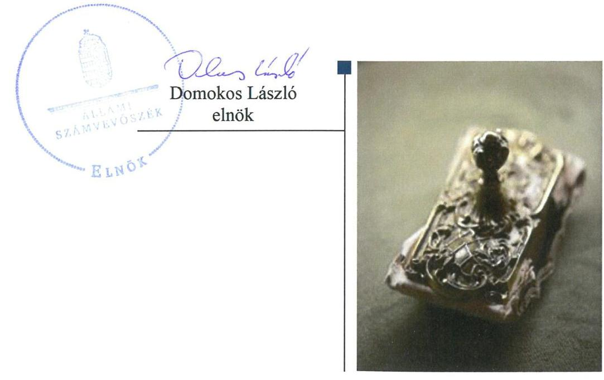
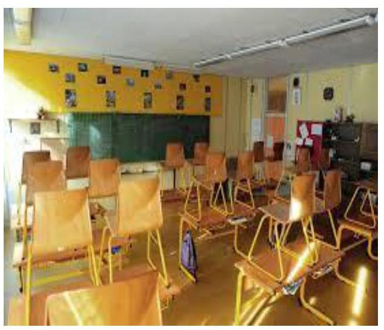
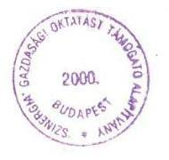
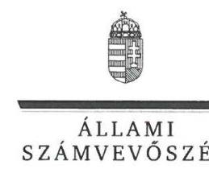
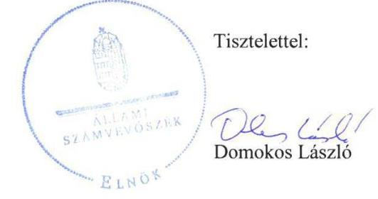
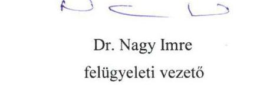

# Jelenetés 

## Nem állami humánszolgáltatók ellenőrzése

A humánszolgáltatást nyújtó államháztartáson kívüli köznevelési intézmények fenntartói központi költségvetésből kapott támogatásai felhasználásának ellenőrzése - Szinergia Gazdasági Oktatást Támogató Alapítvány 2018.

---

# Jelentés 

## Nem állami humánszolgáltatók ellenőrzése

A humánszolgáltatást nyújtó államháztartáson kívüli köznevelési intézmények fenntartói központi költségvetésből kapott támogatásai felhasználásának ellenőrzése - Szinergia Gazdasági Oktatást Támogató Alapítvány 2018. 11. hó 24. nap

---

# AZ ELLENŐRZÉST FELÜGYELTE:

- **SALAMON ILDIKÓ** felügyeleti vezető
- **DR. NAGY IMRE** felügyeleti vezető

# AZ ELLENŐRZÉST VEZETTE ÉS A VÉGREHAJTÁSÁÉRT FELELŐS:

- **MAROZSÁN LÁSZLÓNÉ** ellenőrzésvezető
- **A PROGRAM ÖSSZEÁLLÍTÁSÁÉRT FELELŐS:**
- **TÓTPÁL SZABOLCS** osztályvezető

**IKTATÓSZÁM:** EL-0332-021/2018.

**TÉMASZÁM:** 2448

**ELLENŐRZÉS-AZONOSÍTÓ SZÁM:** V079408

Jelentéseink az Országgyűlés számítógépes hálózatán és az Interneta a www.asz.hu címen is olvashatóak.

---

# TARTALOMJEGYZÉK 

■ ÖSSZEGZÉS ..... 5
■ AZ ELLENŐRZÉS CÉLJA ..... 6
■ AZ ELLENŐRZÉS TERÜLETE ..... 7
■ AZ ELLENŐRZÉS HÁTTERE, INDOKOLTSÁGA ..... 8
■ A JELENTÉS LÉNYEGES KÉRDÉSKÖREI ..... 9
■ AZ ELLENŐRZÉS HATÓKÖRE ÉS MÓDSZEREI ..... 10
■ MEGÁLLAPÍTÁSOK ..... 12
■ JAVASLATOK ..... 14
■ MELLÉKLETEK ..... 17
I. sz. melléklet: Értelmező szótár ..... 17
II. sz. melléklet: A támogatás jogcímenkénti alakulása ..... 18
■ FÜGGELÉK: ÉSZREVÉTELEK ..... 19
■ RÖVIDÍTÉSEK JEGYZÉKE ..... 33

---

.

---

# ÖSSZEGZÉS 

A Szinergia Gazdasági Oktatást Támogató Alapítvány, mint intézményfenntartó a költségvetési támogatások átlátható, elszámoltatható igénybevételének, felhasználásának feltételeit nem teremtette meg. Beszámolási kötelezettségét nem teljesítette, a köznevelési feladatellátásához kapott költségvetési támogatásokat nem szabályszerűen használta fel, azzal a nyilvánosság előtt nem számolt el.

## Az ellenőrzés társadalmi indokoltsága

Az Állami Számvevőszék stratégiájában hangsúlyos szerepet szán annak, hogy szilárd szakmai alapon álló, értékteremtő ellenőrzéseivel előmozdítsa a közpénzügyek átláthatóságát, rendezettségét és javaslataival a közpénzek és a közvagyon szabályos, gazdaságos, hatékony és eredményes felhasználását segítse. Stratégiájában az Állami Számvevőszék célul tűzte ki, hogy az államháztartáson kívülre nyújtott költségvetési támogatások ellenőrzésével hozzájárul ahhoz, hogy a közpénzeket az államháztartáson kívüli szervezetek is átlátható módon használják fel a közfeladatok szerződésben vállalt ellátása érdekében. Tekintettel az elmúlt években a köznevelés finanszírozását és a köznevelési intézmények fenntartását érintően végbement változásokra, a társadalom fokozott érdeklődéssel figyeli a köznevelési feladatok ellátására fordított források felhasználását. Fontos ezért az Állami Számvevőszéknek a közvéleményt biztosítani arról, hogy a közpénz államháztartáson kívüli felhasználása ezen a területen sem marad ellenőrizetlenül. Hozzájárul ezzel ahhoz is, hogy a nyilvánosság és az igénybevevők megfelelő tájékoztatást kapjanak az államháztartáson kívüli közfeladatot ellátók múködéséről.

## Főbb megállapítások, következtetések, javaslatok

A Szinergia Gazdasági Oktatást Támogató Alapítvány, mint intézményfenntartó a költségvetési támogatások átlátható, elszámoltatható igénybevételének és felhasználásának feltételeit szabályszerű működési és gazdálkodási környezet kialakításával nem teremtette meg. A 2015-2016. évekre vonatkozóan beszámoló készítési kötelezettségét a Szinergia Gazdasági Oktatást Támogató Alapítvány nem teljesítette, a 2014. évi számviteli beszámolóját a kuratóriuma nem hagyta jóvá. A támogatás felhasználásáról a jogszabályokban előírt nyilvántartást nem vezették, továbbá nem határozta meg a kérhető térítési díj és tandíj megállapításának szabályait, a szociális alapon adható kedvezmények feltételeit a fenntartott Szinergia Üzleti Szakképző Iskolára vonatkozóan.

A Szinergia Gazdasági Oktatást Támogató Alapítvány a kapott költségvetési támogatás felhasználásának pénzügyi bizonylatait teljes körűen nem őrizte meg. A támogatást a fenntartott intézményének 2016. évben teljes összegben nem adta át, ugyanakkor az át nem adott költségvetési támogatás cél szerinti felhasználását nyilvántartással nem igazolta.

A fenntartott köznevelési intézménye múködtetéséhez felhasznált közpénzekkel a nyilvánosság előtt a Szinergia Gazdasági Oktatást Támogató Alapítvány nem számolt el, nem érvényesült a közpénzek felhasználására vonatkozóan az átláthatóság elve.

Az ellenőrzési megállapítások alapján az Állami Számvevőszék a Szinergia Gazdasági Oktatást Támogató Alapítvány kuratóriuma elnökének hét intézkedést igénylő javaslatot fogalmazott meg a számviteli politika tartalmával, az éves számviteli beszámoló elkészítésével, az intézményi szabályok meghatározásával, a támogatások nyilvántartásával és a számviteli, pénzügyi bizonylatok megőrzésével kapcsolatosan. A javaslatokat megalapozó megállapításokra az érintettnek 30 napon belül intézkedési tervet kell készíteni.

---

# AZ ELLENŐRZÉS CÉLJA 

AZ ELLENŐRZÉS CÉLJA annak értékelése volt, hogy a Szinergia Gazdasági Oktatást Támogató Alapítvány a központi költségvetésből kapott támogatásainak felhasználása szabályszerű volt-e, a támogatások igénylése, évközi módosítása és év végi elszámolása meg-felelt-e a jogszabályi előírásoknak.

---

# **AZ ELLENŐRZÉS TERÜLETE**

## **Szinergia Gazdasági Oktatást Támogató Alapítvány**

A Szinergia Gazdasági Oktatást Támogató Alapítványt egy magánszemély alapította, célja alapítványi szakiskola működtetése, a szociálisan rászoruló diákok, a pedagógusi tudományos munka támogatása, a tehetséggondozás, az iskola nemzetközi tapasztalatcseréjének segítése, hagyományápolás. Az Alapítványt1 2000. október 5-én a Fővárosi Bíróság vette nyilvántartásba, legfőbb döntést hozó, ügyintéző, képviseleti testületi szerve a magánszemélyekből álló kuratórium2.

A Fenntartó3 által alapított budapesti székhelyű szakképző iskolának Budapesten, Miskolcon, Pécsen, Szegeden és Egerben összesen hét tagintézménye volt az ellenőrzött időszakban. Az Intézmény4 feletti fenntartói jogot a Szinergia Gazdasági Oktatást Támogató Alapítvány 2016. évben augusztus 31-ig gyakorolta. Az ellenőrzés idején ismét az Alapítvány volt az Intézmény fenntartója.

A Fenntartó az ellenőrzött években köznevelési feladatellátására tekintettel Magyarország éves költségvetéséből két jogcímen támogatást kapott.

A Fenntartó által a köznevelési feladatellátásához igényelt és a Kincstár5 által elszámolásként elfogadott költségvetési támogatás a 2014. évben 456 809 ezer Ft, a 2015. évben 488 912 ezer Ft, a 2016. évben 317 310 ezer Ft volt, mely támogatás jogcímenkénti alakulását a II. sz. melléklet tartalmazza.

A közfeladat ellátásával kapcsolatos szakmai irányítószervi feladatokat az ellenőrzött időszakban az EMMI6 látta el, a törvényességi ellenőrzési feladatokat pedig a területileg illetékes kormányhivatalok végezték. A Fenntartó a köznevelési közfeladat ellátására tekintettel kapott közpénzekre vonatkozó gazdálkodásával a nyilvánosság előtt köteles volt elszámolni.

---

# AZ ELLENŐRZÉS HÁTTERE, INDOKOLTSÁGA 

A köznevelési feladatokat ellátó nem állami intézményfenntartók részére közfeladataik ellátására évente jelentős összegű pénzügyi támogatást biztosítottak a mindenkori költségvetési törvények a bennük megfogalmazott feltételek mellett.

A köznevelési feladatokra felhasználható állami támogatások előirányzata 2014-2016. években együtt 504 Mrd Ft volt. A 2013. évben jelentős változások következtek be a normatív finanszírozás rendszerében. Az Országgyűlés elfogadta a nemzeti köznevelésről szóló 2011. évi CXC. törvényt, amely jelentősen átalakította a korábbi finanszírozási rendszert 2013 szeptemberétől. Új feladatfinanszírozási forma (átlagbéralapú támogatás) jelent meg, amely az államháztartáson kívüli intézményfenntartókra is vonatkozik. Az ellenőrzés a finanszírozási rendszerben bekövetkezett változásokra, azok közfeladat ellátásra gyakorolt hatására fókuszált a költségvetési támogatásokat felhasználó államháztartáson kívüli szervezetek körében. Az ellenőrzés indokoltságát az is alátámasztotta, hogy az ÁSZ ${ }^{7}$ még nem ellenőrizte átfogóan e területet.

Az ÁSZ stratégiájában foglaltak alapján is indokolt az ellenőrzés, amely a társadalom számára jelzi, hogy a közpénz államháztartáson kívüli felhasználása sem maradhat ellenőrizetlenül. Az államháztartáson kívülre nyújtott költségvetési támogatások ellenőrzésével az ÁSZ hozzájárul ahhoz, hogy a közpénzeket a nem állami fenntartók átlátható módon használják fel a közfeladatok ellátására kötött szerződésekben vállalt kötelezettségek teljesítése érdekében. Az ÁSZ az ellenőrzés javaslataival hozzájárulhat az említett rendszerek szabályszerű támogatás-felhasználásához, javíthatja a társa-dalmi-gazdasági döntések megalapozottságát, amely a „jó kormányzás" feltétele.

---

# A JELENTÉS LÉNYEGES KÉRDÉSKÖREI 

1. A köznevelési közfeladatot ellátó Fenntartó szabályszerű müködési és gazdálkodási környezet kialakításával megteremtette-e a költségvetési támogatások átlátható, elszámoltatható igénybevételének, felhasználásának feltételeit?
2. A Fenntartó az átvállalt köznevelési közfeladathoz biztositott költségvetési támogatásokat szabályszerűen fordította-e a humánszolgáltató intézménye müködtetésére?
3. A Fenntartó a köznevelési intézménye müködtetéséhez felhasznált közpénzekre vonatkozó gazdálkodásával a nyilvánosság előtt elszámolt-e, ennek megalapozása érdekében ellenőrzési, értékelési és a külső ellenőrzésekkel kapcsolatos intézkedési feladatait szabályszerűen látta-e el?

---

# AZ ELLENŐRZÉS HATÓKÖRE ÉS MÓDSZEREI 

## Az ellenőrzés típusa

Megfelelőségi ellenőrzés.

## Az ellenőrzött időszak

A 2014. január 1-je és 2016. augusztus 31. közötti időszak.

## Az ellenőrzés tárgya

Az ellenőrzés a közfeladatot ellátó államháztartáson kívüli Fenntartó közfeladata ellátásához a költségvetési törvényekben biztosított központi költségvetési támogatások igénylése, évközi módosítása és év végi elszámolása fenntartói feladatainak ellátása, illetve a központi költségvetésből kapott támogatások közfeladatra való Fenntartó általi felhasználása szabályszerűségének értékelésére terjedt ki.

Az ellenőrzés kiterjedt minden olyan körülményre és adatra, amely az ÁSZ jogszabályban meghatározott feladatainak teljesítéséhez, valamint a program végrehajtása folyamán felmerült újabb összefüggések feltárásához szükséges volt.

## Az ellenőrzött szervezet

Szinergia Gazdasági Oktatást Támogató Alapítvány.

## Az ellenőrzés jogalapja

Az ellenőrzés jogszabályi alapját az ÁSZ tv. ${ }^{8}$ 1. § (3) bekezdésében, valamint az 5. § (3) bekezdésében foglalt előírások adták.

## Az ellenőrzés módszerei

Az ellenőrzést az ellenőrzési program kérdései, az adott időszakban hatályos jogszabályok, az ellenőrzés szakmai szabályok és módszertanok, valamint a nemzetközi standardok figyelembevételével végezte az ÁSZ. A közpénzekkel való felelős gazdálkodás segítésére irányuló javaslatok kidolgozásakor a hatályos jogszabályok voltak az irányadóak. Az ellenőrzés ideje alatt az ÁSZ a Fenntartóval történő kapcsolattartást az ÁSZ SZMSZ²-ének vonatkozó előírásai alapján biztosította.

---

Az ellenőrzési kérdések megválaszolásához szükséges bizonyítékok megszerzése az ellenőrzött által rendelkezésre bocsátott dokumentumokra, adatokra alapozva történt.

Az ellenőrzési bizonyítékként felhasznált adatforrások közé tartoztak egyrészt a szakmai program részletes szempontjainál felsorolt adatforrások, másrészt minden - az ellenőrzés folyamán feltárt, az ellenőrzés szempontjából információt tartalmazó - dokumentum.

Az ellenőrzés lefolytatásához a Fenntartó a kitöltött tanúsítványok, valamint az ÁSZ által kért dokumentumok átadásával szolgáltatott adatokat, információkat. Az így rendelkezésre bocsátott adatok, információk és a tanúsítványok adatai valódiságának kontrollja az ellenőrzés keretében történt.

Helyszíni szemlékre a fenntartott Intézmény egyes feladat ellátási helyein került sor, a tényleges feladat-ellátás végzésére vonatkozóan.

A központi költségvetési támogatás igénylésével, módosításával, elszámolásával kapcsolatos, államháztartáson kívüli fenntartó jogszabályokban előírt feladatai betartását, továbbá a központi költségvetési támogatások szabályszerű kezelését, nyilvántartását ellenőrizte az ÁSZ a Fenntartónál, az ott rendelkezésre álló határozatok, nyilvántartások, beszámolók és egyéb dokumentumok alapján.

Az ellenőrzés nem terjedt ki a köznevelési feladatok ellátásához kapcsolódó központi költségvetési támogatás igénylése, módosítása, elszámolása valódiságának, megalapozottságának, helyességének - sem a Fenntartónál, sem a székhely intézményénél való - értékelésére. Továbbá nem terjedt ki az ellenőrzés e források Intézmény általi szabályszerű felhasználásának értékelésére. A szabályosság megítélésének alapját képezte, hogy a központi költségvetési támogatások Fenntartó általi igénylése, módosítása és elszámolása a Kincstár felé megtörtént.

---

# MEGÁLLAPÍTÁSOK 

## 1. A köznevelési közfeladatot ellátó Fenntartó szabályszerű múködési és gazdálkodási környezet kialakításával megteremtette-e a költségvetési támogatások átlátható, elszámoltatható igénybevételének, felhasználásának feltételeit?

Összegző megállapítás

A Fenntartó szabályszerű múködési és gazdálkodási kereteit nem alakította ki, a kapott költségvetési támogatások felhasználása nem volt átlátható, elszámoltatható.

A Fenntartó létrehozásáról az alapító magánszemély alapító okiratban rendelkezett, amely alapján a Fővárosi Bíróság 2000. évben nyilvántartásba vette.

A Fenntartó képviselője a Számv. tv. ${ }^{10}$ 14. § (4) bekezdésében foglaltak ellenére Számviteli politikában nem rögzítette az Alapítványra jellemző szabályokat, előírásokat, módszereket, amelyekkel meghatározza, hogy mit tekint kivételes nagyságú vagy előfordulású bevételnek, költségnek, ráfordításnak. Továbbá a Számv. tv. 14. § (12) bekezdésében előírtak ellenére nem gondoskodott a Számviteli politika módosításáról az Alapítvány közhasznú jogállásának változását követően.

A Fenntartó 2014. évi beszámolóját az alapító okiratában előírtak ellenére a kuratórium nem hagyta jóvá, míg a Számv. tv. 4. § (1) bekezdésében előírtak ellenére a 2015. évi és a 2016. évi pénzügyi és jövedelmi helyzetéről a Fenntartó nem készített beszámolót.

Változás bejelentési kötelezettségének a Fenntartó a Kincstár felé az Intézmény 2014. évi adataiban bekövetkezett változás (feladatellátás, címváltozás) miatt az Nkt. vhr. ${ }^{11}$ 37/H. § (1) bekezdésében előírtak ellenére nem tett eleget.

A Fenntartó a Kincstárhoz benyújtott támogatási kérelmek, azok módosításai alapján két köznevelési jogcímen - átlagbéralapú támogatás és tankönyvtámogatás - részesült a központi költségvetésből támogatásban. A Civilszr. ${ }^{12}$ 17. § (8) bekezdésében előírtak ellenére nyilvántartási rendszeréből a közpénzek felhasználásával, a továbbutalási céllal kapott támogatásokkal kapcsolatos információk nem álltak rendelkezésre.

---

# 2. A Fenntartó az átvállalt köznevelési közfeladathoz biztosított költségvetési támogatásokat szabályszerűen fordította-e a humánszolgáltató intézménye múködtetésére? 

Összegző megállapítás

A Fenntartó a köznevelési közfeladathoz biztosított költségvetési támogatásokat nem szabályszerűen fordította az intézménye múködtetésére.

A Fenntartó kiadta az Intézmény Nkt. ${ }^{13}$-nak megfelelő tartalmú alapító okiratát, jóváhagyta az alapdokumentumait ${ }^{14}$, azonban az Nkt. 83. (2) bekezdés c) pontjában rögzítettek ellenére nem határozta meg az Intézmény költségvetését, a kérhető térítési díj és tandíj megállapításának szabályait, a szociális alapon adható kedvezmények feltételeit. Az Nkt. 83. § (2) bekezdés f) pontjában előírtak ellenére nem bízta meg az Intézmény vezetőjét. A Számv. tv. 6. § (3) bekezdésében foglaltakkal szemben, az általa alapított Intézmény könyvvezetési, beszámoló-készítési kötelezettségét nem állapította meg.

A kapott költségvetési támogatásról készített fenntartói nyilvántartás és annak alátámasztása nem felelt meg az Nkt. vhr. 37/G.§ (1) bekezdésében előírtaknak, a nyilvántartás a támogatás felhasználását alapfeladatonkénti bontásban elkülönítetten és naprakészen nem tartalmazta. A nyilvántartásban szereplő adatok valódiságát pénzügyi dokumentáció teljes körűen nem támasztotta alá, mivel a központi költségvetési támogatások elszámolását, felhasználását alátámasztó számviteli bizonylatait a Fenntartó a Számv. tv. 169. § (2) bekezdésében előírtak ellenére a 2014-2016. években nem őrizte meg teljes körűen.

A 2016. évben a Fenntartó a köznevelési közfeladatra kapott költségvetési támogatást nem adta át teljes összegben az Intézménynek, ugyanakkor a támogatásról az Nkt. vhr. 37/G.§ (1) bekezdésében foglaltak ellenére nem vezetett olyan nyilvántartást, amelyből megállapítható volt, hogy az át nem adott támogatást milyen célra használta fel.

## 3. A Fenntartó a köznevelési intézménye múködtetéséhez felhasznált közpénzekre vonatkozó gazdálkodásával a nyilvánosság előtt elszámolt-e, ennek megalapozása érdekében ellenőrzési, értékelési és a külső ellenőrzésekkel kapcsolatos intézkedési feladatait szabályszerűen látta-e el?

## Összegző megállapítás

A Fenntartó a közfeladatot ellátó köznevelési intézménye múködtetéséhez felhasznált közpénzekre vonatkozó gazdálkodásával a nyilvánosság előtt nem számolt el.

A Fenntartó az ellenőrzött időszakban a Számv. tv. 4. § (1) bekezdésében előírt beszámolási kötelezettségének nem tett eleget, nem biztosította a közpénzek törvényes felhasználásának ellenőrizhetőségét és az Alaptörvényben ${ }^{15}$ előírt átláthatóság elvének érvényesülését.

---

# JAVASLATOK 

Az ÁSZ tv. 33. § (1) bekezdésében foglaltak értelmében az ellenőrzött szervezet vezetője köteles a jelentésben foglalt megállapításokhoz kapcsolódó intézkedési tervet összeállítani és azt a jelentés kézhezvételétől számított 30 napon belül az ÁSZ részére megküldeni. Amennyiben az ellenőrzött szervezet vezetője nem küldi meg határidőben az intézkedési tervet, vagy továbbra sem elfogadható intézkedési tervet küld, az Állami Számvevőszék elnöke az ÁSZ tv. 33. § (3) bekezdése a) és b) pontjaiban foglaltakat érvényesítheti.

## A Szinergia Gazdasági Oktatást Támogató Alapítvány kuratóriuma elnökének

1. Intézkedjen arról, hogy a számviteli politika a jogszabályi előírásoknak megfelelően tartalmazza a gazdálkodóra jellemző szabályokat, előírásokat, módszereket, valamint hogy az megfeleljen az Alapítvány jogállására vonatkozó jogszabályi előírásoknak.
(1. sz. megállapítás 2. bekezdése alapján)
2. Intézkedjen az alapítvány pénzügyi-jövedelmi helyzetéről készített 2014. évi beszámoló jóváhagyásáról, a 2015-2016. évek a jogszabályban előírt beszámolóinak elkészítéséről, jóváhagyásáról, az éves beszámolók közzétételéről.
(1. sz. megállapítás 3. bekezdése alapján)
3. Tegyen eleget a Kincstár felé az intézménynél bekövetkezett adatváltozások jogszabályban elöírt bejelentési kötelezettségének.
(1. sz. megállapítás 4. bekezdése alapján)
4. Intézkedjen a kérhető térítési dij és tandíj megállapítás szabályainak, a szociális alapon adható kedvezmények feltételeinek a jogszabályok szerinti meghatározásáról.
(2. sz. megállapítás 1. bekezdés első mondata alapján)
5. Gondoskodjon arról, hogy az intézmény müködtetési feltételeit a jogszabályban foglaltaknak megfelelően alakítsa ki.
(2. sz. megállapítás 1. bekezdés 2.-3. mondatai alapján)

---

6. | Intézkedjen a jogszabályban előírt nyilvántartás vezetéséről.
(2. sz. megállapítás 2. bekezdés 1. mondata alapján)
7. | Intézkedjen a számviteli bizonylatok jogszabályban elöirt megőrzési kötelezettségének teljesitéséről.
(2. sz. megállapítás 2. bekezdés 2. mondata alapján)

---

.

---

# MELLÉKLETEK 

- I. SZ. MELLÉKLET: ÉRTELMEZŐ SZÓTÁR
civil szervezet
feladatfinanszírozás
köznevelési közfeladat
költségvetési támogatás
köznevelési intézmény
nem állami, nem önkormányzati (államháztartáson kívüli) intézmény fenntartó

Az Ectv. 2. § 6. pontja szerint civil szervezet a civil társaság, a Magyarországon nyilvántartásba vett egyesület (a párt, a szakszervezet és a kölcsönös biztosító egyesület kivételével), a közalapítvány és a pártalapítvány kivételével az alapítvány.
A közfeladat államháztartáson kívüli szervezet által történő ellátásához közvetlenül kapcsolódó, arányos müködési költségeket finanszírozó költségvetési támogatás.
A köznevelési intézmény alapító okiratában foglalt feladat: óvodai nevelés, nemzetiséghez tartozók óvodai nevelése, általános iskolai nevelés-oktatás, nemzetiséghez tartozók általános iskolai nevelése-oktatása, kollégiumi ellátás, nemzetiségi kollégiumi ellátás, gimnáziumi nevelés-oktatás, szakközépiskolai nevelés-oktatás, szakiskolai nevelés-oktatás, nemzetiség gimnáziumi nevelés-oktatása, nemzetiség szakközépiskolai nevelés-oktatása, nemzetiség szakiskolai nevelés-oktatása, Köznevelési Hidprogramok keretében folyó nevelés-oktatás, felnőttoktatás, alapfokú művészetoktatás, fejlesztő nevelés, fejlesztő nevelés-oktatás, pedagógiai szakszolgálati feladat, a többi gyermekkel, tanulóval együtt nevelhető, oktatható sajátos nevelési igényű gyermekek, tanulók óvodai nevelése és iskolai nevelése-oktatása, azoknak a sajátos nevelési igényű gyermekeknek, tanulóknak az óvodai, iskolai, kollégiumi ellátása, akik a többi gyermekkel, tanulóval nem foglalkoztathatók együtt, a gyermekgyógyüdülőkben, egészségügyi intézményekben, rehabilitációs intézményekben tartós gyógykezelés alatt álló gyermekek tankötelezettségének teljesítéséhez szükséges oktatás, pedagógiai-szakmai szolgáltatás.
a társadalombiztosítás pénzügyi alapjai kivételével az államháztartás központi alrendszeréből ellenérték nélkül, pénzben nyújtott, a jogszabály által kivételként fel nem sorolt formákat. (Áht. ${ }^{16}$ 1. § 14. pont)
A nevelési- oktatási intézmény, pedagógiai szakszolgálati intézmény, pedagógiai-szakmai szolgáltatást nyújtó intézmény.
A köznevelési és szociális, gyermekjóléti és gyermekvédelmi közfeladatokat/humánszolgáltatásokat ellátó intézményt fenntartó egyházi jogi személy, társadalmi szervezet, alapítvány, közalapítvány, civil szervezet, országos nemzetiségi önkormányzat, nonprofit gazdasági társaság, gazdasági társaság és a humánszolgáltatást alaptevékenységként végző, Szja tv. hatálya alá tartozó egyéni vállalkozó. (2013. évi Kvtv. ${ }^{17} 35 . \S$ (1), (3) bekezdés, 2014. évi Kvtv. ${ }^{18} 33 . \S, 34 . \S$ (1), (4) bekezdés, 2015. évi Kvtv. ${ }^{19} 42 . \S, 43 . \S$ (1), (4) bekezdés, 2016. évi Kvtv. ${ }^{20} 40 . \S, 41 . \S$ (1), (4) bekezdés)

---

II. SZ. MELLÉKLET: A TÁMOGATÁS JOGCÍMENKÉNTI ALAKULÁSA

# A FENNTARTÓ SZÁMÁRA A KÖZNEVELÉSI FELADATHOZ NYÚJTOTT KÖZPONTI KÖLTSÉGVETÉSI TÁMOGATÁS JOGCÍMENKÉNTI ALAKULÁSA (EZER FT)

|  Megnevezés | 2014. év | 2015. év | 2016. év  |
| --- | --- | --- | --- |
|  Átlagbéralapú támogatás | 457637 | 487280 | 317310  |
|  Tankönyvtámogatás | 2172 | 1632 | -  |
|  Összesen | 456809 | 488912 | 317310  |

Forrás: 2014-2016. évi költségvetési támogatás elszámolásainak Kincstári határozatai.

---

# FÜGGELÉK: ÉSZREVÉTELEK 

A jelentéstervezetet a Számvevőszék 15 napos észrevételezésre megküldte az ellenőrzött szervezet vezetőjének az ÁSZ tv. 29. §* (1) bekezdése előírásának megfelelően.

Az ÁSZ a jelentéstervezetet észrevételezésre megküldte Szinergia Gazdasági Oktatást Támogató Alapítvány kuratóriuma elnöke részére.
A Szinergia Gazdasági Oktatást Támogató Alapítvány kuratóriuma elnöke élt az ÁSZ tv. 29. § (2) bekezdésében foglalt észrevételezési jogával, a törvényes határidőn belül észrevételt tett.
A függelék tartalmazza az ellenőrzött észrevételeit mellékletek nélkül, illetve az el nem fogadott észrevételek elutasításának indoklását.

[^0]
[^0]:    * 29. § (1) Az Állami Számvevőszék az ellenőrzési megállapításait megküldi az ellenőrzött szervezet vezetőjének vagy az általa megbízott személynek, és annak, akinek személyes felelősségét állapította meg.
    (2) Az ellenőrzött szervezet vezetője és a felelősként megjelölt személy az ellenőrzés megállapításaira tizenöt napon belül írásban észrevételt tehet.
    (3) Az Állami Számvevőszék az észrevételre a beérkezésétől számított harminc napon belül írásban válaszol. A figyelembe nem vett észrevételeket köteles a jelentésben feltüntetni, és megindokolni, hogy azokat miért nem fogadta el.

---

# SZINERGIA GAZDASÁGI OKTATÁST TÁMOGATÓ ALAPÍTVÁNY 

1073 Budapest, Erzsébet krt. 39.
Telefon: 479-0040 Fax: 321-9070

## Domokos László   Elnök

Állami Számvevőszék
Apáczai Csere János utca 10.
Budapest
1052
Hivatkozási szám: Ikt. szám: EL-0699-069/2018

Tisztelt Állami Számvevőszék!
Tisztelt Elnök Úr!
Alulírott Naderi Zsuzsanna a Szinergia Gazdasági Oktatást Támogató Alapítvány képviseletében a Szinergia Gazdasági Oktatást Támogató Alapítvány kuratóriumának elnökeként és közhiteles nyilvántartásba vett képviselőjeként „A bumanzzolgaltatást nyújtó allambázżartáson kivüli köznevelési és szociális intézmények, szolgáltatók, fenntartói közfunti költségeztésböl kapott támogatásai felhasználásának ellenöryése - Szinergia Gazdasági Oktatást Támogató Alaptitvány" címmel készült számvevőszéki jelentéstervezetet vonatkozásában, hivatkozva T. Elnök Úr 2018.09.28-án kelt, EL-0699-069/2018. iktatószámú levelére, az alábbi észrevételeket teszem:

## Megállapítások

1. A Fenntartó szabályszerű múködési és gazdálkodási kereteire, illetve a kapott költségvetési támogatások felhasználásának átláthatósága és elszámoltathatósága vonatkozásában tett megállapítások
a. Észrevételezett megállapítás:
„A fenntartó nem hagyta jóvá a 2014. évi számviteli beszámolóját, a 2015. és 2016. évi pénzügyi és jövedelmi helyzetéről a Fenntartó nem készített beszámolót."
2. óta vagyok a Szinergia Gazdasági Oktatást Támogató Alapítvány kuratóriumának elnöke és egyben a szervezet törvényes képviselője.

Az Alapítványnak a vonatkozó jogszabályok értelmében évente szükséges számviteli beszámolót készítenie, s a kuratórium által elfogadott beszámoló letétbe helyezéséről és nyilvánosságra hozataláról a jogszabályok által előírt határidőig gondoskodnia.

Az Alapítvány közhasznúsági jogállása a Fővárosi Törvényszék 14.Pk.60.384/2000/15. számú végzése alapján 2014. június 1-i hatállyal megszűnt, s az a közhiteles nyilvántartásban is törlésre került. A vonatkozó jogszabályok értelmében az Alapítvány a 2014. évre vonatkozóan közhasznú egyszerűsített éves beszámoló, a 2015. évtől kezdődően egyszerűsített éves beszámoló készítésére és közzétételére kötelezett.

---

A 2014., 2015. és 2016. évi beszámolók elfogadására vonatkozó napirendi pont, illetve előterjesztés 2015. májusa és 2017. októbere között több alkalommal kitűzésre került, azonban a kuratórium határozatképtelensége miatt a beszámolók elfogadására a mai napig nem került sor. (Ezekről az ellenőrzés során részletesen beszámoltam a T. Számvevőszék felé.)

Az Alapítvány – a kuratóriumi ülés több alkalommal történt összehívása és a téma napirendre felvétele ellenére – a mai napig nem tett eleget jogszabályban előírt kötelezettségének, az Alapítványnak nincs a 2014. évre vonatkozó kuratórium által elfogadott beszámolója, melynek oka, hogy a kuratórium egyes tagjai, köztük az Alapítvány alapítója kifejezetten bojkottálják az erre vonatkozó döntéshozatát.

Egyebekben tájékoztatom a T. Állami Számvevőszéket, hogy a 2014-es éves beszámoló elfogadása hiányában az ezt követő évekre vonatkozó beszámolók nem készülhettek a megelőzően elfogadott alapadatok nélkül, továbbá a 2015. és 2016. évekre vonatkozó beszámolók elkészítésének további akadályául szolgáltak a következő események is:

### Az Alapítvány képviselete, az álképviselő eljárása

Az Ellenőrzés során részletesen ismertettem a T. Számvevőszékkel, hogy 2015. szeptemberes óta az Alapítvány alapítója különböző változásbejegyzési eljárások kezdeményezésével és alapító okirat változatok benyújtásával igyekszik személyemet a kuratórium elnöki tisztségből elmozdítani, s azt a látszatot kelteni, hogy az Alapítvány kuratóriumi elnöke. Az alapító eljárásai a vonatkozó jogszabályoknak nem feleltek meg, ezért több bíróság is kimondta, illetve helyben hagyta ezen eljárások megszüntetését. Az alapítónak az elmúlt három évben több alkalommal volt lehetősége peres eljárást kezdeményezni a személyem – jogszabályokon alapuló – visszahívására, azonban ezt az alapító mindig elkerülte, s e helyett átláthatatlan módosításokkal, s a személyemet illető igen negatív kampánnyal igyekezett elérni a tisztségemről való lemondást, illetve a tisztségből való elmozdítást.

Az alapító aktív közreműködésével és támogatásával az Alapítvány képviseletében nevű magánszemély járt/jár el képviselőként, jelentős fennakadásokat okozva a közigazgatási hivatalok, bíróságok munkájában, az Alapítvány egyéb partnerei körében. Az álképviselő tevékenységével 2015. szeptemberes óta akadályozza az Alapítvány jogszabályban előírt kötelezettségeinek teljesítését.

Az Ellenőrzés folyamán részletesen tájékoztattam a T. Számvevőszéket az Alapítvány képviselete vonatkozásában kialakult bírósági gyakorlatról és született döntésekről.

Tájékoztattam továbbá a T. Számvevőszéket, hogy mind Fővárosi Ítélőtábla, mind a Kúria alapos vizsgálat alá vette az Alapítvány képviseleti jogára, a kuratórium visszahívására, kijelölésére vonatkozó speciális anyagi jogi és eljárásjogi rendelkezéseket, és ezek alapján hozta meg jogerős határozatait, amelyben egyértelműen megállapításra került, hogy az Alapítvány esetében a közhiteles nyilvántartásba bejegyzett tények irányadók – így a képviselet vonatkozásában. Ugyanis a közhiteles nyilvántartás adatainak megdöntésére kizárólag a nyilvántartó bíróság jogosult, ugyanis a közhiteles nyilvántartásra és annak megdönthetőségére vonatkozó szabályok csakis az alapítványokra vonatkozó speciális jogszabályi rendelkezésekre tekintettel érvényesülhetnek.

A T. Számvevőszékhez eljuttatott levelemben szintén részletesen kifejtett jogi indoklás alapján megállapítható, hogy és a meghatalmazása alapján az Alapítvány nevében és képviseletében esetlegesen eljáró személyek álképviselőként járnak el, a jognyilatkozataikhoz pedig semmilyen joghatás nem fűződhet, a cselekményeiket, jognyilatkozataikat az alapítványtól származónak tekinteni nem lehet.

### Könyvvezetési kötelezettség

Az Alapítvány megbízott könyvviteli szolgáltatója, a képviselője 2016. májusában arról tájékoztatott, hogy a Szinergia Alapítvány összes bizonyítást, főkönyvet, főkönyvi kartonokat, beszámolókat, így a 2015. évi beszámolót is 2016. május 23-án átadta: aki magát „kuratórium elnökének”, jelölte meg. Tájékoztatott továbbá, hogy a továbbiakban nem végeznek semmiféle könyvelési, számviteli tevékenységet a Szinergia Alapítvány részére, mert 2016. május 23-án felmondta könyvelési szerződésüket.

---

- álképviselő́t, illetve a kuratórium tagjait az elmúlt időszakban több alkalommal tájékoztattam arról, hogy az Alapítvány nem tett eleget beszámolókészittési kötelezettségének, illetve kértem, hogy a nála lévő könyvelési anyagokat bocsássa rendelkezésemre annak érdekében, hogy az Alapítvány eleget tudjon tenni beszámolókészítési, könyvvezetési, nyilvántartásvezetési és iratmegőrzési kötelezettségének. Ezen kérésnek a mai napig nem tett eleget.

A fentiekből következően 2016. májusa óta nem rendelkezem információval az Alapítvány könyvelési anyagainak hollétéről.

# Bankszámla feletti rendelkezés 

2015. október 15-én észleltem, hogy az Alapítvány bankszámlája feletti rendelkezési jogom megszűnt, s ezért még aznap panasszal éltem a , Bank Zrt. alapítványi kapcsolattartója felé telefonon. Mivel érdemi választ nem kaptam, ezért 2015. oktober 20-án e-mailben jeleztem panaszomat a Bank Zrt. Panaszkezelési és Minőségbiztosítási Osztálya felé. Mivel továbbra sem érkezett válasz, 2015. november 19-én az Alapítvány ügyvédi levélben kereste meg: Bank Zrt.-t. A pénzintézettől csak 2015. december 21-én érkezett válasz, melyben a Bank Zrt. leszögezte egyrészről, hogy „Úgyfele a nyilvántartásaink szerint nem minősül a megkeresésben jelzett intézmény képviselőjének", másrészről, hogy a bejelentő jogosultsága nem vitatott, ezért nem alkalmazható a pénzforgalmi szolgáltatás nyújtásáról szóló 2009. évi LXXXV. törvény (Pft.) 20. § (4). Ezen álláspontját a Bank 2018. július 3. napjáig (!) fenntartotta annak ellenére, hogy részletesen tájékoztatta a Bankot az Alapítvány a képviselet tekintetében kialakult bírósági gyakorlatról, illetve e tárgyban született bírósági döntésekről.

2015 októbere óta a Zrt.-t számtalanszor megkerestem és tájékoztattam a folyamatban lévő bírósági eljárásokról, azokban - a képviselet vonatkozásában hozott - jogerős határozatokról, továbbá egy másik pénzintézet által megkért - az adott élethelyzetre vonatkozó - MNB állásfoglalásról, de a : iBank Zrt. 2018. július 3. napjáig kitartott a 2015. októberében kialakított álláspontja mellett, miszerint az Alapítvány vonatkozásában a képviseleti jogomat nem ismerte el, s , eljárása alapján kerültek felhatalmazásra az Alapítvány bankszámlái felett rendelkező személy(ek) is.

Az Alapítvány 2016. július 6-án keresetet nyújtott be a Bank Zrt. ellen a bankszámlához fűződő jogai helyreállítása érdekében, ezen eljárás jelenleg is folyamatban van.

A bankszámlák feletti jogok gyakorlásának korlátozása miatt a 2015 októberétől 2018. július 3. napjáig vonatkozó időszakra az Alapítvány bankszámla kivonatai sem álltak rendelkezésemre, így ezek hiányában sem az Alapítvány könyvvezetési kötelezettsége, sem beszámolókészittési kötelezettsége nem volt teljesíthető.

A fentiekben meghatározott okokból s Bank Zrt. által csupán 2018. július 3. napja után rendelkezésre bocsátott bankszámlakivonatok alapján megállapítható, hogy a 2015. október - 2018. június időszakban olyan pénzmozgások történtek az Alapítvány pénzforgalmi számláin, amely nem cél szerinti felhasználást valószínủsítenek, illetve amelyekre vonatkozóan - tudomásom szerint - a rendelkezőknek (akik illetéktelenül rendelkeztek a bankszámlák felett) felhatalmazása, jogalapja nem volt, nem lehetett.

E tárgykörben, illetve - többek között - a beszámolási, illetve könyvvezetési kötelezettségekre vonatkozó kötelezettségek tárgyában a következő kuratóriumi ülést 2018. október 24. napjára hívtam össze. A T. Számvevőszéket tájékoztatni fogom a kuratóriumi ülés kimeneteléről.

A kuratóriumi ülést követően, amennyiben megerősitést nyer vagy az ülés kételyt nem oszlat el abban a tekintetben, hogy a pénzforgalmi számlákon észlelt gyanús pénzmozgások vonatkozásában fennáll a jogellenesség, esetleg bűncselekmény gyanúja, akkor meg fogom tenni a szükséges polgári és büntetőjogi intézkedéseket.

---

# b. Észrevételezett megállapítás: 

„Változásbejegyzési kötelezettségének a Fenntartó a Kincstár felé az Intézmény 2014. évi adataiban bekövetkezett változás (feladatellátás, címváltozás) miatt az Nkt. vhr. 37/H. § (1) bekezdésében előírtak ellenére nem tett eleget."
(Kapcsolódóan észrevételezett megállapítás a Jelentéstervezet 7. oldalának megállapításához: „Az ellenőrzés idején ismét az Alapítvány volt az Intézmény fenntartója.")

Mint arról 2018. október 09-én kelt levelemben tájékoztattam a T. Állami Számvevőszéket, a Szinergia Gazdasági Oktatást Támogató Alapítvány, mint átadó fenntartó 2016. augusztus 31. napjával hatályosan szerződéses kötelmi úton a nemzeti köznevelésről szóló 2011. évi CXC. törvény rendelkezéseinek megfelelően a Szinergia Szakgimnázium és Szakközépiskola feletti fenntartói jogát de facto és de iure átruházta az
-re, mint átvevő fenntartóra. Erre tekintettel 2016. augusztus 31. napjától kezdődően a Szinergia Szakgimnázium és Szakközépiskola felett a Szinergia Gazdasági Oktatást Támogató Alapítvány fenntartói jogokat nem gyakorol.

A fenntartóváltás a Magyar Államkincstár felé bejelentésre került. A fenntartóváltásra vonatkozó eljárás a Magyar Államkincstár előtt BPM-ÁHI/1324-46/2016 úgyszámon volt folyamatban. Ezen eljárás alapja, hogy a Szinergia Gazdasági Oktatást Támogató Alapítvány, mint a Szinergia Szakgimnázium és Szakközépiskola vonatkozásában 2016. augusztus 31. napjáig az Nkt. szerinti fenntartói jogok gyakorlója és jogosultja 2016. szeptember 14. napján évközi elszámolási kérelmet nyújtott be a nemzeti köznevelésről szóló törvény végrehajtásáról szóló 229/2012. (VIII. 28.) Korm. rendeletet (Rendelet) alapján. Ezen eljárásban a Magyar Államkincstár jogerős határozatot hozott 2016. december 8-án, amelyben megállapította, hogy a fenntartóváltás megtörtént, amelynek okán fennállnak a Rendelet 37/I.§ -ában meghatározott feltételek, így az évközi elszámolás alapján megállapította, hogy a volt fenntartón keresztül a Szinergia Szakgimnázium és Szakközépiskolát a 2016. január 01. - 2016. augusztus 31-i időszakra vonatozóan mennyi költségvetési támogatás illeti meg a közfeladat ellátása okán.

A fenntartóváltáshoz kapcsolódóan az alábbiakról tájékoztattam T. Elnök Urat:
Budapest Főváros Kormányhivatala, mint a köznevelési intézmények nyilvántartását vezető hatóság, a 2016. augusztus 25. napján kelt BP/1009/13889-43/2016. számú, megismételt eljárásban hozott végzésével megszüntette a köznevelési intézménnyel kapcsolatos változásbejegyzési kérelem tárgyában indult közigazgatási eljárást.

Az új fenntartó fellebbezése folytán a másodfokú eljárásban eljáró Oktatási Hivatal a 2016. december 9. napján kelt HJO/94-21/2016. számú határozatával az elsőfokú hatóság végzését megsemmisítette, egyúttal a köznevelési intézmény nyilvántartásba vett adatait és müködési engedélyét módosította.
, a Szinergia Gazdasági Oktatást Támogató Alapítvány alapítójaként, és kuratóriumának tagjaként a másodfokú közigazgatási határozat bírósági felülvizsgálata iránt keresetet terjesztett elő, melynek eredményeképpen az eljárt Fővárosi Közigazgatási és Munkaügyi Bíróság 12.K.30.685/2017/28. számú ítéletével az Oktatási Hivatal határozatát hatályon kívül helyezte.

A bíróság ítéletével szemben mind az új fenntartó, mind a fenntartói jogot átadó Szinergia Gazdasági Oktatást Támogató Alapítvány felülvizsgálati kérelmet terjesztettek elő.

Újra kiemelem, hogy a Szinergia Gazdasági Oktatást Támogató Alapítvány, mint átadó fenntartó 2016. augusztus 31. napjával hatályosan szerződéses kötelmi úton a nemzeti köznevelésről szóló 2011. évi CXC. törvény rendelkezéseinek megfelelően a Szinergia Szakgimnázium és Szakközépiskola feletti fenntartói jogát de facto és de iure átruházta az
, mint átvevő fenntartóra.
Erre tekintettel 2016. augusztus 31. napjától kezdődően a Szinergia Szakgimnázium és Szakközépiskola felett a Szinergia Gazdasági Oktatást Támogató Alapítvány fenntartói jogokat nem gyakorol.

---

A Kúria elé felterjesztett felülvizsgálati kérelmében az Alapítvány is kérte a Fővárosi Közigazgatási és Munkaügyi Bíróság 12.K.30.685/2017/28. számú jogerős bírósági ítélet végrehajtásának felfüggesztését.

Kérelmét az Alapítvány azzal indokolta, hogy az ítélet teljes jogbizonytalanságot eredményezett a Szinergia Szakgimnázium és Szakközépiskola fenntartója személyét, a fenntartói jogosítványok gyakorlását illetően. Fenntartó hiányában, illetve a fenntartó kérdésessége okán a köznevelési intézmény nem tud a jogszabályoknak megfelelően müködni, továbbá a müködéshez szükséges állami normatíva összegét sem tudja megkapni. Állami normatíva hiányában az iskola müködése ellehetetlenül, több száz tanuló tanulmányainak befejezése válik bizonytalanná, az oktatók bére, valamint az iskola egyéb kötelezettségei nem kerültek kifizetésre, ezáltal az iskolát a bezárás fenyegeti.

A két felülvizsgálati kérelemben foglaltakra tekintettel a Kúria a Kfv.III.37.127/2018/3. végzésében (1. számú melléklet) a jogerős bírósági ítélet végrehajtását a felülvizsgálati eljárás befejezéséig felfüggesztette.

Sajnálatos - és számomra jogilag megmagyarázhatatlan - tény, hogy mindeközben a Pest Megyei Kormányhivatal PE/045/03216-6/2017. számú határozatában - párhuzamosan a Fővárosi Közigazgatási és Munkaügyi Bíróság ugyanazon közigazgatási határozatára vonatkozó bírósági felülvizsgálati eljárással (!) - szintén megsemmisítette az Oktatási Hivatal HJO/94-21/2016. számú határozatát.

A Pest Megyei Kormányhivatal határozata ellen is mind az Alapítvány, mind az új fenntartó bírósági felülvizsgálati eljárást kezdeményezett. Az Alapítvány által indított eljárásban született jogerős 23.K.30.849/2018/6. illetve az azt kijavító 15. számú végzésében a bíróság a Pest Megyei Kormányhivatal hivatkozott határozatának végrehajtását felfüggesztette. (2. számú melléklet)

Jelen pillanatban az új fenntartó nyilvántartásba vételére vonatkozóan tehát az Oktatási Hivatal által hozott, a változásbejegyzési eljárásban a fenntartóváltást bejegyzó HJO/94-21/2016. számú határozat érvényes és hatályos.

Az általa is ismert fenti tényállás ellenére a köznevelési intézmények közhiteles nyilvántartását vezető Budapest Fővárosi Kormányhivatal az új fenntartót a Fővárosi Közigazgatási és Munkaügyi Bíróság, illetve a Pest Megyei Kormányhivatal döntései után törölte a nyilvántartásból, azonban ugyanezen döntések végrehajtásának felfüggesztésekor az új fenntartót nem vezette vissza a közhiteles nyilvántartásba.

Az Alapítvány a fenntartói jogokat szerződéses úton átadta az új fenntartónak, amelyet az iskola elismert pedagógusainak közössége hozott létre, s amelynek létrejöttét nagymértékben indokolta, hogy - mint az az ellenőrzés során is feltárásra került - az Alapítvány nem látta el jogszerűen a köznevelési intézmény fenntartásával kapcsolatos feladatait.

Az Alapítványnak 2016. május 13-a óta nem volt határozatképes kuratóriumi ülése, így a kuratóriumi tagok egy része - álláspontom alapján - nem gondoskodott a helyzet rendezéséről, kezeléséről, a köznevelési feladat új fenntartóval történő együttes biztosításáról.

Kijelenthető a fenti tények alapján, hogy a Szinergia Gazdasági Oktatást Támogató Alapítvány nem tekinthető a Szinergia Szakgimnázium és Szakközépiskola fenntartójának, továbbá 2016. augusztus 31-ét követően fenntartói feladatokat, tevékenységeket nem lát el, azokat teljes mértékben az új fenntartó látja el.

Az Alapítvány fenntartóként mind a Magyar Államkincstár, mind a területileg illetékes kormányhivatalok felé eljárrt a müködési engedélyek jogszabály szerinti módosítását, illetve az Intézmény, illetve a Fenntartó nyilvántartott adatainak változását illetően. Azonban mivel az Alapítvány átruházta a fenntartói jogait, azért 2016. augusztus 31. óta nincs jogalapja eljárni fenntartóként a köznevelési intézmény adatainak módosítását illetően, fenntartói jogok hiányában.

Tudomásom szerint az új Fenntartó eljárásait viszont az akadályozza, hogy a közhiteles nyilvántartás adataiban a fenntartói jogokkal már nem rendelkező (ti. polgári jogi jogügylet útján az új Fenntartóra azokat átruházta) Alapítvány szerepel, mivel a nyilvántartást vezető kormányhivatal az általa ismert, az előzőekben ismertetett bírósági döntések ellenére - amelyeknek célja éppen a kialakult jogbizonytalanság megszüntetése volt - a közhiteles nyilvántartásba a mai napig nem vezette vissza az átvevő új Fenntartót.

---

# 2. A Fenntartó a köznevelési közfeladathoz biztosított költségvetési támogatások humánszolgáltató intézménye müködtetésére fordítottságának szabályszerűsége vonatkozásában tett megállapítások 

## a. Észrevételezett megállapítás:

A fenntartó nem határozta meg a „kérhető térítési díj és tandíj megállapításának szabályait, a szociális alapon adható kedvezmények feltételeit."

Az Nkt. 83. (2) bekezdés c) pontja szerint kérhető térítési díj és tandíj megállapítás szabályainak, szociális alapon adható kedvezmények feltételeinek meghatározását az Alapítvány által 2016. augusztus 31-ig fenntartott Szinergia Szakgimnázium és Szakközépiskola tekintetében a fenntartó akként szabályozta, hogy a nevelési-oktatási intézmények működéséről és a köznevelési intézmények névhasználatáról szóló 20/2012. (VIII.31.) rendelet 5. § (1) b) és c) pontjának megfelelően a fenntartott köznevelési intézmény a Házirendjében állapította meg a térítési díj, tandíj befizetésére, visszafizetésére vonatkozó rendelkezéseket, továbbá a tanuló által előállított termék, dolog, alkotás vagyoni jogára vonatkozó díjazás szabályait, illetve a szociális ösztöndíj, a szociális támogatás megállapításának és felosztásának elveit, a nem alanyi jogon járó tankönyvtámogatás elvét, az elosztás rendjét.

A fenntartó a köznevelési intézmény Házirendjét véleményezte és elfogadta.
Budapest Főváros Kormányhivatala hatósági ellenőrzés keretében - többek között - ellenőrizte a köznevelési intézmény térítési díjakra és a tandíjakra vonatkozó szabályozását.
Az ellenőrzést lezáró BP/1009/03440-6/2016. számú (5. számú melléklet) végzésben a Kormányhivatal a következő megállapításokat tette:
„A térítési díjra és a tandíjra vonatkozó rendelkezések a jogszabálynak megfelelően rögzítésre kerültek az Intézmény házirendjében, a díjazáshoz kapcsolódó iratok, nyomtatványok az Intézmény minőségirányítási dokumentációjának része (pl. képzési megállapodás, tájékoztató a tanév során fizetendő költségekről tandíjmentes, illetve tandíjas tanulók részére, költségtájékoztató átvételi ív a költségtájékoztató megismeréséről és annak átvételéről, nyilatkozat a költségtérítés módjáról, tájékoztatók vizsgadíjakról a 2014/2015. tanév, valamint a 2016. január 1. - december 31. között időszakra vonatkozóan).
A képzési megállapodás részletesen taglalja a különböző jogcímeken (regisztrációs díj, tankönyvcsomag, tandíj, illetve képzési hozzájárulás, vizsgadíj) az intézmény részére befizetendő díjakat, és azok módját.
A képzési megállapodás a szakképzésről szóló 2011. évi CLXXXVI. törvény (továbbiakban Szt.) 84. § (12) bekezdése alapján a tanuló beiratkozáskor kerül megkötésre és mindkét fél részéről aláírásra. A képzési megállapodás megkötésével, valamint a tájékoztató tudomásul vételét szolgáló átvételi ív aláírásával a tanuló kötelezi magát a díjfizetés betartására."

Az Alapítvány utoljára 2013. december 05-én véleményezte és fogadta el az akkor még fenntartott köznevelési intézmény Házirendjét.
Az Alapítvány utoljára 2013. október 08-án hagyta jóvá a köznevelési intézmény Minőségirányítási rendszerét, illetve az azt képező Dokumentációs Albumot.
(A fentiek rögzítésre kerültek az Állami Számvevőszék részére átadott dokumentumokban.)

## b. Észrevételezett megállapítás:

A fenntartó „az Nkt. 83. § (2) bekezdés f) pontjában előírtak ellenére nem bízta meg az Intézmény vezetőjét."

Az Alapítvány fenntartásában 2016. augusztus 31-ig müködő Szinergia Szakgimnázium és Szakközépiskola intézményvezetőjét az Alapítvány 2013. augusztus 30. napjától bízta meg intézményvezetőként öt évre.

Az Alapítvány az oktatási miniszterhez fordult annak érdekében, hogy a miniszter az Nkt. 68. § (2) bekezdése értelmében a benyújtott dokumentumok alapján gyakorolhassa az egyetértési jogát.

---

A miniszternek címzett levelet, a miniszter jóváhagyását, valamint a kinevezési dokumentumot 2018. október 09. kelt T. Elnök Úrnak címzett levelem mellékleteként továbbítottam a T. Számvevőszék részére.

A köznevelési intézmények vonatkozásában a müködési engedélyeket kiadó kormányhivatalok két évente törvényességi ellenőrzést végeznek, mely ellenőrzéseknek egyik témája az intézményvezetői kinevezés szabályosságának ellenőrzése.

Mivel az Alapítvány által 2016. augusztus 31-ig fenntartott intézménynek a fővároson kívül további négy megyében volt feladatellátási helye, így az intézményvezető 2013. évi kinevezése óta több törvényességi ellenőrzés is vizsgálta a vezetői kinevezést. Ezen ellenőrzések e témában semmilyen eltérést, nem megfelelőséget nem állapítottak meg.

A fenntartói jogok átadásakor (2016. augusztus 31.) a Szinergia Szakgimnázium és Szakközépiskola intézményvezetője a 2013. augusztus 30. napjától e tisztséget betöltő : volt.

# c. Észrevételezett megállapítás: 

„A kapott költségvetési támogatásról készített fenntartói nyilvántartás és annak alátámasztása nem felelt meg az Nkft. vhr. 37/G. § (1) bekezdésében előírtaknak, a nyilvántartás a támogatás alapfeladatonkénti bontását elkülönítetten és naprakészen nem tartalmazta. A nyilvántartásban szereplő adatok valódiságát pénzügyi dokumentáció teljes körűen nem támasztotta alá, mivel a központi költségvetési támogatások elszámolását, felhasználását alátámasztó számviteli bizonylatait a Fenntartó a Számv. tv. 169. § (2) bekezdésben előírtak ellenére a 2014-2016. évben nem őrizte meg teljes körűen."

Az 1. a) pontban Könyvvezetési kötelezettség és Bankszámla feletti rendelkezés alcímek alatt tett észrevételekben részletesen ismertettem, hogy a nem-megfelelőségre vonatkozó megállapítás oka az, hogy az Alapítvány képviseletében 2015 szeptembere óta eljáró álképviselő birtokában van az Alapítvány teljes számviteli, könyvviteli és pénzügyi dokumentációja, aki azt a mai napig többszörös felszólítás ellenére nem juttatta el a törvényes képviselő részére. A vizsgált időszakban az Alapítvány Bank Zrt.-nél vezetett pénzforgalmi számlái felett az álképviselő rendelkezett, s a vizsgált időszakban semmilyen rálátásom nem volt sem az Alapítvány pénzmozgásaira, sem a bankkivonatokra.

Az Alapítvány képviselőjeként e tárgyban több polgári és büntetőjogi eljárást is kezdeményeztem.

## d. Észrevételezett megállapítás:

„A 2016. évben a Fenntartó a köznevelési feladatokra kapott költségvetési támogatást nem adta át teljes összegben az Intézménynek, ugyanakkor a támogatásról az Nkt. vhr. 37/G.§ (1) bekezdésben foglaltak ellenére nem vezetett olyan nyilvántartást, amelyből megállapítható volt, hogy az át nem adott támogatást milyen célra használta fel."

Ismételten hivatkoznék az 1. a) pontban Könyvvezetési kötelezettség és Bankszámla feletti rendelkezés alcímek alatt tett észrevételekre, melyekben részletesen ismertettem, hogy az Alapítvány képviseletében 2015 szeptembere óta eljáró álképviselő birtokában van az Alapítvány teljes számviteli, könyvviteli és pénzügyi dokumentációja, aki azt a mai napig többszörös felszólítás ellenére nem juttatta el a törvényes képviselő részére. A vizsgált időszakban az Alapítvány Bank Zrt.-nél vezetett pénzforgalmi számlái felett az álképviselő rendelkezett.

Tájékoztatom továbbá a T. Állami Számvevőszéket, hogy tekintettel arra, hogy az Alapítvány bankszámlája felett a Bank jogellenes eljárása okán az Alapítvány törvényes képviselőjeként rendelkezési jogomat nem gyakorolhattam, és arra, hogy az Alapítvány képviseletében álképviselőként járt el, így a 2016. évi normatíva Iskola részére történő átutalása iránt intézkedni nem tudtam, a normatíva Iskola részére történő átadása iránt azon személyek tudtak volna, és lett volna kötelességük intézkedni, akik a Magyar

---

Államkincstár részéről az Alapítvány bankszámlájára átutalt normatíva összegek felett diszponáltak, akik a bankszámla felett de facto rendelkezési joggal rendelkeztek. Tekintettel arra, hogy ezen személyek a jogszabályi kötelezettségek ellenére nem adták át az Iskola részére az állami támogatást, az Iskola kénytelen volt jogai megóvása érdekében jogi eljárások útján érvényesíteni igényeit, mely okán végrehajtási eljárások indultak az Alapítvány ellen az át nem adott és Iskolát megillető normatíva behajtása érdekében.

Az Iskola fizetési meghagyás és végrehajtás útján csupán részben tudta érvényesíteni - és csak utólag - a 2015. és 2016. évekre vonatkozó állami támogatásra vonatkozó követeléseit, azonban jelentős összegű ezen eljárások tranzakciós költségei. Emellett az Iskola működését is közvetlenül veszélyeztette a Fenntartó Alapítvány törvényellenes müködésének ténye.

A 2016 márciusáig az Alapítvány részben, majd 2016. áprilisától egyáltalán nem tett eleget a költségvetési törvényben foglalt kötelezettségének, miszerint a Magyar Államkincstár által folyósított, köznevelési tevékenység finanszírozására szolgáló állami hozzájárulást 15 napon belül a Fenntartónak át kell adnia a fenntartott köznevelési intézmény részére.

Az Iskolában ekkor több mint 1500 tanuló végezte tanulmányait, s közel 700 tanuló állt a képzését lezáró szakmai vizsga előtt!

Természetesen mind az Alapítvány, mind az Iskola a körülötte történő eseményeket azonnal jelezte a Fenntartó szakmai törvényességi felügyeletét gyakorló székhely szerinti kormányhivatalnak, illetve az Alapítvány törvényességi felügyeletét ellátó ügyészségnek.
2016. május 13 -i kuratóriumi ülésen az Alapítvány kuratóriuma a fenntartóváltásról döntött. A fenntartóváltást az ülésen nem támogatta az Alapítvány alapítója és egyik kuratóriumi tagja.

Az ügyészség által - még 2015. évben, az Alapítvány törvényes képviselőjének bejelentésére - indított törvényességi felügyeleti eljárásban sokáig az Alapítvány nem kapott jelzést, megkeresését, majd amikor az eljárásba - vélhetően - az Alapítvány alapítója - aki a fenntartóváltást sem szavazta meg a kuratórium vonatkozó ülésén - is bekapcsolódott, az Ügyészség végül jelzéssel élt az Alapítvány felé.
Az Ügyészség jelzésére az Alapítvány észrevételeket tett azonban az Ügyészség azokat nem vette figyelembe.
Ezt követően az Alapító indított pert a fenntartóváltásról rendelkező kuratóriumi határozat hatályon kívül helyezése iránt, majd amikor ezt az eljárást a Fővárosi Törvényszék a kereset elutasítása mellett megszüntette, az Ügyészség felperesként szintén keresetet indított e tárgyban.

Az Ügyészség perinditásának körülményeként feltárandó, hogy az Ügyészség által 2017 februárjában indított per megindításáról az Alapítvány nem tudott, s az Alapítvány törvényességi felügyeletét ellátó ügyészség a kereset benyújtása, majd a perben való eljáráskor az Alapítvány álképviselőjét tekintette, ismerte el az Alapítvány képviselőjeként, (!) óriási káoszt okozva ezzel a bíróságok, a közigazgatási hivatalok, illetve az Alapítvány és a köznevelési Intézmény működésében. Természetesen az alapító és az Alapítvány álképviselőjeként eljáró magánszemély az ügyész keresetét nem ellenezte, a fellebbezési jogáról azonnal lemondott, így bírósági ítélet született a fenntartóváltásra vonatkozó kuratóriumi határozatok ettől az időponttól történő hatályon kívül helyezéséről, melyet természetesen az Alapítvány jogorvoslati eljárásban megtámadott

Jogorvoslati eljárásban az ítéletet az Ítélőtábla hatályon kívül helyezte az eljárás szabálytalansága okán (ti. az Alapítvány képviseletében nem arra jogosultak jártak el) és az első fokú bíróságot új eljárásra utasította, mely új eljárásban követően az ügyész is módosította álláspontját az Alapítvány képviselőjének személyére vonatkozóan. Most is bíróság előtt folyik az eljárás a fenntartóváltásra vonatkozó kuratóriumi határozatok törvényességéről, illetve annak megítéléséről, hogy - a vonatkozó jogszabályok értelmében - a jövőre vonatkozóan a határozatokat hatályon kívül kell-e helyezni.

---

3. A Fenntartó a köznevelési intézménye múködtetéséhez felhasznált közpénzekre vonatkozó gazdálkodásával a nyilvánosság előtt való elszámolás vonatkozásában tett megállapítások
a. Észrevételezett megállapítás:
„A fenntartó az ellenőrzött időszakban a Számv. tv. 4. $\$ \mathbf{( 1 )}$ bekezdésében előírt beszámolási kötelezettségének nem tett eleget, nem biztosította a közpénzek törvényes felhasználásának ellenőrizhetőségét és az Alaptörvényben elöírt átláthatóság elvének érvényesülését."

A 2014., 2015. és 2016. évi beszámolók elfogadására vonatkozó napirendi pont 2015 májusa és 2017 októbere között több alkalommal kitűzésre került, azonban a kuratórium határozatképtelensége miatt ezen beszámolók elfogadására a mai napig nem került sor. (Ezekről az ellenőrzés során részletesen beszámoltam a T. Számvevőszék felé.)

Az Alapítvány - a kuratóriumi ülés több alkalommal történt összehívása és a téma napirendre felvétele ellenére - a mai napig nem tett eleget jogszabályban elöírt kötelezettségének, az Alapítványnak nincs a 2014. évre vonatkozó kuratórium által elfogadott beszámolója, melynek oka, hogy a kuratórium egyes tagjai, köztük az Alapítvány alapítója kifejezetten bojkottálják az erre vonatkozó döntéshozatalt.

Egyebekben tájékoztatom a T. Állami Számvevőszéket, hogy a 2014-es éves beszámoló elfogadása hiányában az ezt követő évekre vonatkozó beszámolók nem készülhettek - többek között - a megelőzően elfogadott alapadatok nélkül, továbbá ezen 2015 és 2016 évekre vonatkozó beszámolók elkészitésének további akadályául szolgált, hogy az Alapítvány könyvelési anyagai az álképviselőként eljáró kerültek (akinek személyéről, illetve eljárásairól korábbi levelemben tájékoztattam Tisztelt Elnök Urat), akı azokat többszöri felszólítás ellenére sem adta át a törvényes képviselő részére a mai napig, akadályozva így az Alapítvány törvényes múködését.

Az Alapítványnak soron következő kuratóriumi ülése 2018. október 24-re került összehívásra, ahol a beszámolókészítési, -közzétételi kötelezettség teljesítése képezi az egyik napirendi pontot.

Egyidejűleg ezúton köszönöm az ellenőrzésben közreműködő munkatársainak munkáját.

Budapest, 2018. október 18.

Tisztelettel:

Naderi Zsuzsanna kuratórium elnöke
Szinergia Gazdasági Oktatást Támogató Alapítvány

---

ELNÖK

Ikt.szám: EL-0699-075/2018.

# Naderi Zsuzsanna úrhölgy 

kuratórium elnöke

Szinergia Gazdasági Oktatást Támogató Alapítvány

## Budapest

## Tisztelt Elnök Úrhölgy!

A ,,Nem állami humánszolgáltatók ellenőrzése - A humánszolgáltatást nyújtó államháztartáson kivüli köznevelési és szociális intézmények, szolgáltatók fenntartói központi költségvetésböl kapott támogatásai felhasználásának ellenörzése - Szinergia Gazdasági Oktatást Támogató Alapítvány" címmel készített számvevőszéki jelentéstervezetre tett észrevételeit köszönettel megkaptam.
Az Állami Számvevőszék észrevételekre vonatkozó álláspontjáról a felügyeleti vezető által készített részletes tájékoztatást csatoltan megküldöm.
Tájékoztatom Elnök úrhölgyet, hogy a számvevőszéki jelentésben - az Állami Számvevőszékről szóló 2011. évi LXVI. törvény 29. § (3) bekezdése alapján - a figyelembe nem vett észrevételeket szerepeltetjük, annak megindoklásával, hogy azokat miért nem fogadtuk el.

Budapest, 2018. 11. hó 10 . nap

Melléklet: Tájékoztatás az észrevételek kezeléséről

---

# Tájékoztatás   az észrevételek kezeléséről 

A „Nem állami humánszolgáltatók ellenőrzése - A humánszolgáltatást nyújtó államháztartáson kivüli köznevelési és szociális intézmények, szolgáltatók fenntartói központi költségvetésböl kapott támogatásai felhasználásának ellenőrzése - Szinergia Gazdasági Oktatást Támogató Alapítvány" című jelentéstervezetre 2018. október 18-án tett (az Állami Számvevőszékhez 2018. október 29én érkezett) észrevételét áttekintettük, annak kezelésével kapcsolatban a következő tájékoztatást adom.

## 1. A jelentéstervezet 1. összegző megállapítást alátámasztó 3. bekezdésében foglalt megállapításra vonatkozó 1. a) észrevétel:

Az észrevételben a kuratórium elnöke a jelentéstervezet „A Fenntartó 2014. évi beszámolóját az alapító okiratában elöirtak ellenére a kuratórium nem hagyta jóvá, míg a Számv. tv. 4. § (1) bekezdésében elöirtak ellenére a 2015. évi és a 2016. évi pénzügyi és jövedelmi helyzetéről a Fenntartó nem készített beszámolót. " megállapítására vonatkozóan rögzíti, hogy a Szinergia Gazdasági Oktatást Támogató Alapítvány (továbbiakban: Fenntartó) kuratóriumát a 2014-2016. évi beszámolók elfogadása érdekében 2015. májusa és 2017. októbere között több alkalommal összehívta, azonban annak határozatképtelensége miatt érvényes kuratóriumi döntés az éves beszámolókról nem született.
Az észrevételben az ellenőrzött szervezet vezetője nem cáfolta, hanem megerősítette a jelentéstervezet megállapítását, a jelentéstervezet módosítása nem indokolt.
2. A jelentéstervezet 1. összegző megállapítást alátámasztó 4. bekezdésében foglalt megállapításra, valamint Az ellenőrzés területe fejezet 1. bekezdés utolsó mondatára vonatkozó 1. b) észrevétel:

Az észrevétel a „Változás bejelentési kötelezettségének a Fenntartó a Kincstár felé az Intézmény 2014. évi adataiban bekövetkezett változás (feladatellátás, címváltozás) miatt az Nkt. vhr. 37/H. § (1) bekezdésében elöirtak ellenére nem tett eleget. " megállapításhoz, kapcsolódóan a Fenntartó a 2014. évi adataiban bekövetkezett változások bejelentésének elmulasztását nem cáfolta. Az észrevétel a 2014. január 1-je és 2016. augusztus 31. közötti ellenőrzött időszakon kívüli eseményekre vonatkozik, amely a számvevőszéki jelentésben foglalt megállapítás tekintetében nem releváns.
A számvevőszéki jelentéstervezet „Az ellenőrzés területe" fejezet 1. bekezdés „,Az ellenőrzés idején ismét az Alapitvány volt az Intézmény fenntartója" utolsó mondatához tett észrevétele, mely szerint 2016. augusztus 31-től kezdődően az Intézmény felett a Fenntartó fenntartói jogokat nem gyakorol, nem megalapozott. A Fenntartó az Oktatási Hivatal nyilvántartása alapján az ellenőrzés

---

időszakában a Szinergia Szakgimnázium és Szakközépiskola (továbbiakban: Intézmény) fenntartójaként volt bejegyezve.
Az észrevételek nem megalapozottak, a jelentéstervezet módosítása nem indokolt.

# 3. A jelentéstervezet 2. összegző megállapítást alátámasztó 1. bekezdés 1. mondatának második részében foglalt megállapításra vonatkozó 2. a) észrevétel: 

Az észrevétel a számvevőszéki jelentés „,.. az Nkt. 83. (2) bekezdés c) pontjában rögzítettek ellenére nem határozta meg az Intézmény költségvetését, a kérhető térítési dij és tandij megállapításának szabályait, a szociális alapon adható kedvezmények feltételeit." megállapítására vonatkozóan azt tartalmazza, hogy az Intézmény Házirendjében rögzített módon állapította meg a térítési dij, tandíj megállapítás szabályainak, a szociális alapon adható kedvezmények feltételeinek meghatározását. A Fenntartó a nevelési-oktatási intézmények működéséről és a köznevelési intézmények névhasználatáról szóló 20/2012. (VIII.31.) EMMI rendelet (EMMI rendelet) 5. § (1) bekezdés b)-c) pontjában foglalt előírásra alapozta álláspontját.
Az észrevétel nem megalapozott, azt nem fogadjuk el. Az ellenőrzéshez az intézmény Házirendje nem került átadásra. Az Oktatási Hivatal nyilvántartási rendszerében (honlapján) elérhető, a Fenntartó által a Szinergia Szakközépiskola és Szakgimnázium 2013. évben jóváhagyott Házirendje. A Házirend II. fejezete - összhangban a hivatkozott EMMI rendelet előírásával - „A térítési dij, tandij befizetésére, visszafizetésére vonatkozó rendelkezések, továbbá a tanuló által elöállított termék, dolog, alkotás vagyoni jogára vonatkozó dijazás szabályai" keretében a térítési dij, a tandíj fizetésére vonatkozóan a fizetési módokat (csekken, vagy átutalással), határidőket (október és február hónap elején) rögzíti. A Házirend az Nkt. 82. § (2) bekezdés c) pontjában foglalt előírásokkal ellentétben nem tartalmazza a fenntartó által meghatározott, a kérhető térítési díjak, tandíjak megállapításának szabályait, a szociális alapon adható kedvezmények feltételeit. Az ellenőrzött szervezet az ellenőrzés során nem támasztotta alá dokumentumokkal a kérhető térítési dij, tandíj megállapítása szabályainak megalkotását, a szociális alapon adható kedvezmények feltételeit rögzítő szabályozás elkészítését, döntéseinek meghozatalát.
Az észrevétel nem megalapozott, a jelentéstervezet megállapításának módosítása nem indokolt.

## 4. A jelentéstervezet 2. összegző megállapítást alátámasztó 1. bekezdésének 2. mondatában foglalt megállapításra vonatkozó 2. b) észrevétel:

Az észrevétel „Az Nkt. 83. § (2) bekezdés f) pontjában elöirtak ellenére nem bízta meg az Intézmény vezetöjét." megállapításra vonatkozóan azt tartalmazza, hogy az Fenntartó a fenntartásában müködő Intézmény vezetőjét 2013. augusztus 30. napjától öt évre bízta meg, az oktatási miniszter egyetértési jogának megkérésével.

Az észrevétel nem megalapozott, azt nem fogadjuk el. Az ellenőrzést az Állami Számvevőszék az ellenőrzött szervezet által megküldött dokumentumok alapján végzi. Az Fenntartó képviseletében a kuratórium elnöke által aláirt Teljességi és hitelességi nyilatkozat nem tartalmazott az Intézmény vezetőjének megbízására, kinevezésére vonatkozó dokumentumokat.

---

Az észrevétel alapján a jelentéstervezet megállapításának módosítása nem indokolt.

# 5. A jelentéstervezet 2. összegző megállapítást alátámasztó 2. bekezdésében foglalt megállapításra vonatkozó 2. c) észrevétel: 

Az észrevétel, amely ,, A kapott költségvetési támogatásról készitett fenntartói nyilvántartás és annak alátámasztása nem felelt meg az Nkt. vhr. 37/G.§ (1) bekezdésében elöirtaknak, a nyilvántartás a támogatás felhasználását alapfeladatonkénti bontásban elkülönitetten és naprakészen nem tartalmazta. A nyilvántartásban szereplő adatok valódiságát pénzügyi dokumentáció teljes körüen nem támasztotta alá, mivel a központi költségvetési támogatások elszámolását, felhasználását alátámasztó számviteli bizonylatait a Fenntartó a Számv. tv. 169. § (2) bekezdésében elöirtak ellenére a 2014-2016. években nem örizte meg teljes körüen. " megállapításra vonatkozik, az Fenntartó kuratóriumának elnöke a képviseleti jogának, a pénzügyi, számviteli dokumentumokhoz történő hozzáférésének, valamint az Fenntartó számlavezető bankjánál a pénzforgalmi számlák feletti rendelkezési, betekintési jogának korlátozását tartalmazza.
Az észrevétel a számvevőszéki jelentéstervezet megállapítását nem vitatta, azt megerősítette. A jelentéstervezet módosítása az észrevétel alapján nem indokolt.

## 6. A jelentéstervezet 2. összegző megállapítást alátámasztó 3. bekezdésében foglalt megállapításra vonatkozó 2. d) észrevétel:

Az észrevétel a jelentéstervezet ,, A 2016. évben a Fenntartó a köznevelési közfeladatra kapott költségvetési támogatást nem adta át teljes összegben az Intézménynek, ugyanakkor a támogatásról az Nkt. vhr. 37/G.§ (1) bekezdésében foglaltak ellenére nem vezetett olyan nyilvántartást, amelyböl megállapitható volt, hogy az át nem adott támogatást milyen célra használta fel. " megállapítására vonatkozóan a korlátozott képviseleti jogkörgyakorlás körülményeit rögzíti.
Az észrevétel a jelentéstervezet megállapítását nem vitatta, azt alátámasztotta. A számvevőszéki jelentéstervezet megállapításának módosítása nem indokolt.

## 7. A jelentéstervezet 3. összegző megállapításában foglaltak alátámasztásába foglaltakra tett 3. a) észrevétel:

Az észrevétel, amely ,, A Fenntartó az ellenörzött időszakban a Számv. tv. 4. § (1) bekezdésében elöirt beszámolási kötelezettségének nem tett eleget, nem biztositotta a közpénzek törvényes felhasználásának ellenörizhetőségét és az Alaptörvényben elöirt átláthatóság elvének érvényesülését. " a jelentéstervezet megállapítására vonatkozott, a számvevőszéki megállapítást nem cáfolja, azt alátámasztja. A számvevőszéki jelentéstervezet megállapításának módosítása nem indokolt.
Budapest, 2018. 11. hó 10 nap

---

# RÖVIDÍTÉSEK JEGYZÉKE 

${ }^{1}$ Alapítvány
${ }^{2}$ kuratórium
${ }^{3}$ Fenntartó
${ }^{4}$ Intézmény
${ }^{5}$ Kincstár
${ }^{6}$ EMMI
${ }^{7}$ ÁSZ
${ }^{8}$ ÁSZ tv.
${ }^{9}$ ÁSZ SZMSZ
${ }^{10}$ Számv. tv.
${ }^{11}$ Nkt. vhr.
${ }^{12}$ Civilszr.
${ }^{13} \mathrm{Nkt}$.
${ }^{14}$ alapdokumentumok
${ }^{15}$ Alaptörvény
${ }^{16}$ Áht.
${ }^{17}$ 2013. évi Kvtv.
${ }^{18}$ 2014. évi Kvtv.
${ }^{19}$ 2015. évi Kvtv.
${ }^{20}$ 2016. évi Kvtv.

Szinergia Gazdasági Oktatást Támogató Alapítvány
Szinergia Gazdasági Oktatást Támogató Alapítvány kuratóriuma
Szinergia Gazdasági Oktatást Támogató Alapítvány
Szinergia Üzleti Szakképző Iskola (jelenleg: Szinergia Szakközépiskola és Szakgimnázium)
Magyar Államkincstár
Emberi Erőforrások Minisztériuma
Állami Számvevőszék
2011. évi LXVI. törvény az Állami Számvevőszékről (hatályos 2011. július 1jétől)
az Állami Számvevőszék szervezeti és működési szabályzata
2000. évi C törvény a számvitelről

229/2012. (VIII. 28.) Korm. rendelet a nemzeti köznevelési törvény végrehajtásáról (hatályos 2012. szeptember 1-jétől)
224/2000. (XII. 19.) Korm. rendelet a számviteli törvény szerinti egyes egyéb szervezetek beszámoló készítési és könyvvezetési kötelezettségének sajátosságairól (hatálytalan 2017. január 1-jétől)
2011. évi CXC. törvény a nemzeti köznevelésről (hatályos 2012. szeptember 1-jétől)
a Szinergia Üzleti Szakképző Iskola szervezeti és működési szabályzata, pedagógiai programja, házirendje
Magyarország Alaptörvénye (Országgyúlés által elfogadva 2011. április 18-án, kihirdetve április 25-én)
2011. évi CXCV. törvény az államháztartásról (hatályos 2012.január 1-jétől)
2012. évi CCIV. törvény Magyarország 2013. évi központi költségvetéséről
2013. évi CCXXX. törvény Magyarország 2014. évi központi költségvetéséről
2014. évi C. törvény Magyarország 2015. évi központi költségvetéséről
2015. évi C. törvény Magyarország 2016. évi központi költségvetéséről

---

# ÁLLAMI SZÁMVEVŐSZÉK 

1052 Budapest, Apáczai Csere János utca 10.
Levélcím: 1364 Budapest 4. Pf. 54
Telefon: +36 14849100 Telefax: +36 14849200
www.asz.hu