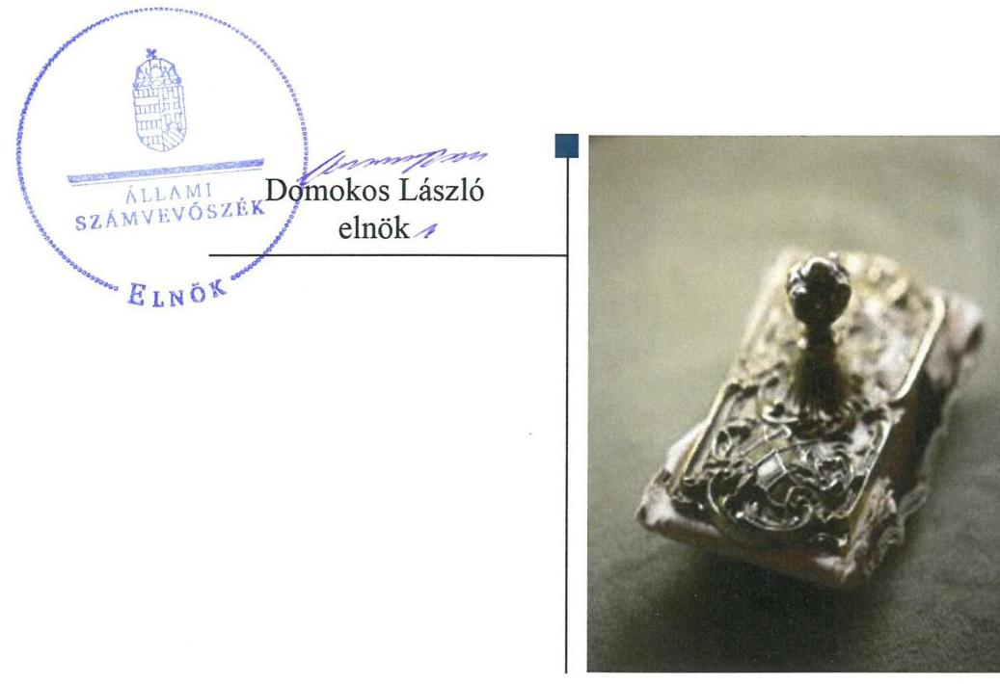

# Jelentés 

## Utóellenőrzések

Az Országos Nemzetiségi Önkormányzatok gazdálkodásának utóellenőrzése -
Országos Szlovén Önkormányzat 2018. 11. hó 29. nap

---

# AZ ELLENŐRZÉST FELÜGYELTE: 

DR. NÉMETH ERZSÉBET felügyeleti vezető

## AZ ELLENŐRZÉST VEZETTE ÉS A VÉGREHAJTÁSÁÉRT FELELŐS:

DR. KOVÁCS DIÁNA ellenőrzésvezető

## A PROGRAM ÖSSZEÁLLÍTÁSÁÉRT FELELŐS:

TÓTPÁL SZABOLCS osztályvezető

## A TÉMÁHOZ KAPCSOLÓDÓ KORÁBBI SZÁMVEVŐSZÉKI JELENTÉSEK:

- címe: Az Országos Nemzetiségi Önkormányzatok gazdálkodásának ellenőrzéséről - Országos Szlovén Önkormányzat
- sorszáma: 15156

Jelentéseink az Országgyúlés számítógépes hálózatán és az Interneten a www.asz.hu címen is olvashatóak.

IKTATÓSZÁM: EL-1248-001/2018.
TÉMASZÁM: 2460
ELLENŐRZÉS-AZONOSÍTÓ SZÁM: V080410

---

# TARTALOMJEGYZÉK 

■ ÖSSZEGZÉS ..... 5
■ AZ ELLENŐRZÉS CÉLJA ..... 6
■ AZ ELLENŐRZÉS TERÜLETE ..... 7
■ AZ ELLENŐRZÉS HÁTTERE, INDOKOLTSÁGA ..... 8
■ A JELENTÉS LÉNYEGES KÉRDÉSKÖRE ..... 9
■ ELLENŐRZÉS HATÓKÖRE ÉS MÓDSZEREI ..... 10
■ MEGÁLLAPÍTÁSOK ..... 12
■ MELLÉKLETEK ..... 15
I. sz. melléklet: Az ÁSZ 15156. számú jelentéséhez kapcsolódó intézkedési terv végrehajtása ..... 15
■ FÜGGELÉK: ÉSZREVÉTELEK ..... 19
■ RÖVIDÍTÉSEK JEGYZÉKE ..... 21

---

.

---

# ÖSSZEGZÉS 

Az Országos Szlovén Önkormányzat az intézkedési tervben foglalt feladatok jelentős részét végrehajtotta, ezáltal szabályozottsága javult, azonban a költségvetési és a zárszámadási határozatok jogszabályoknak való megfelelősége továbbra sem biztosított.

## Az ellenőrzés társadalmi indokoltsága

Az Állami Számvevőszék stratégiájában célul tűzte ki a számvevőszéki munka hasznosulásának javítását. Ezzel összhangban ellenőrzi, hogy az ellenőrzött szervezetek megvalósították-e a korábbi ellenőrzései által feltárt hibák, hiányosságok és szabálytalanságok megszüntetése céljából elkészített intézkedési terveikben foglaltakat. A rendszeres utóellenőrzések hozzájárulnak a szükséges intézkedések tényleges végrehajtásához, ezáltal a közpénzügyek rendezettségének javulásához.

## Főbb megállapítások, következtetések

Az Országos Szlovén Önkormányzat az intézkedési tervében meghatározott 12 feladatból határidőre végrehajtott kilenc feladatot. Két feladatot részben végrehajtott az Önkormányzat és egy feladatot nem hajtott végre.

A Hivatalvezető az ÁSZ javaslatai alapján készített intézkedési terv végrehajtásáról nyilvántartást nem vezetett.
Az Országos Szlovén Önkormányzat vagyongazdálkodási tevékenységének szabályozottsága és annak működése javult, azonban a szabályszerű, átlátható és elszámoltatható közpénzfelhasználás érdekében a költségvetési és zárszámadási határozatok jogszabályi előírásoknak való megfelelősége biztosításához további intézkedésre van szükség.

---

# AZ ELLENŐRZÉS CÉLJA 

Az ellenőrzés célja annak értékelése volt, hogy a számvevőszéki jelentésben ${ }^{1}$ foglalt intézkedést igénylő megállapításokkal összhangban készített intézkedési tervben meghatározott feladatokat az Országos Szlovén Önkormányzat végrehajtotta-e.

---

# AZ ELLENŐRZÉS TERÜLETE

## Országos Szlovén Önkormányzat

Az Országos Szlovén Önkormányzat önállóan működő és gazdálkodó jogi személy, amely az 1995. évben alakult. Az Önkormányzat² gazdálkodási feladatait a Hivatal³ látta el. Az ellenőrzött időszakban az Önkormányzat elnökének személyében nem történt változás. A Hivatal vezetője 2016. november 15. óta látja el feladatát.

Az ÁSZ 2015. évben ellenőrizte gazdálkodását, a belső kontrollrendszer kialakítását és működését, az államháztartásból nyújtott támogatást, illetve az államháztartásból meghatározott célra ingyenesen juttatott vagyon felhasználását a 2010. január 1. és 2014. június 30. közötti időszak tekintetében.

Az ÁSZ 2015. szeptember 10-én hozta nyilvánosságra az erről szóló 15156-os számú jelentését. A számvevőszéki jelentésben feltárt szabálytalanságok, működésbeli hiányosságok kiküszöbölése érdekében az Önkormányzat intézkedési tervet készített.

---

# AZ ELLENŐRZÉS HÁTTERE, INDOKOLTSÁGA 

Az ÁSZ tv. ${ }^{4}$ 33. § (1) bekezdése értelmében a számvevőszéki jelentések intézkedést igénylő megállapításaihoz kapcsolódóan az ellenőrzött szervezet vezetője intézkedési tervet köteles összeállítani, és az ÁSZ részére megküldeni.

Az ÁSZ által befogadott intézkedési tervben foglaltak megvalósítását az ÁSZ tv. 33. § (7) bekezdésében foglaltak alapján - az ÁSZ utóellenőrzés keretében ellenőrizheti. Az utóellenőrzések keretében - az intézkedések értékelése során - az Állami Számvevőszék figyelembe veszi az ellenőrzött szervezetek működési feltételeiben, valamint a jogszabályi előírásokban bekövetkezett változásokat.

Az utóellenőrzés során az ÁSZ értékeli, hogy az érintett számvevőszéki jelentésben foglalt intézkedést igénylő megállapításokkal és javaslatokkal összhangban, az ellenőrzött szervezet által készített intézkedési tervben meghatározott feladatokat a feladatra kijelöltek végrehajtották-e.

Az intézkedések végrehajtásával az adott terület szabályszerű működése vonatkozásában a kockázatok csökkenhetnek, azonban hosszabb távon az intézkedési tervben foglaltak végrehajtásával önmagában nem szűnnek meg, csak akkor, ha beépülnek az ellenőrzött szervezet működésébe, azokat folyamatosan karban tartják, figyelembe véve, illetve kezelve a változásokat. Emellett az intézkedések végrehajtásáig újabb kockázatok merülhetnek fel a szabályszerű működés vonatkozásában, amelyek kezelése szintén kiemelten fontos az ellenőrzött szervezet számára.

Az ellenőrzött szervezet vezetője által készített intézkedési tervben foglalt feladatok hiányos, illetve késedelmes végrehajtása, vagy annak elmaradása a szabályszerűség és a felelős vezetői magatartás vonatkozásában kockázatot hordoz, ami azt mutatja, hogy az ellenőrzések során feltárt hibák, hiányosságok és szabálytalanságok kezelése nem kapott kellő hangsúlyt. Az utóellenőrzés során is fennálló szabálytalanságok esetén a közpénz, közvagyon veszélyeztetettségi kockázat valószínűsített hatásának értékelése további intézkedéseket vonhat maga után.

Az ellenőrzött szervezet szintjén az utóellenőrzés feltárja, hogy a szervezet az intézkedések végrehajtásával hasznosította-e a korábbi ellenőrzési jelentésben a hiányosságok megszüntetése, illetve a kockázatok kezelése érdekében megfogalmazott javaslatokat, illetve az intézkedések végrehajtása elmaradásának következtében továbbra is fennálló szabálytalanság esetén értékeli a közpénzek, közvagyon veszélyeztetettségét.

Az ÁSZ szintjén az utóellenőrzés visszacsatolást ad az ellenőrzési jelentések hasznosulásáról, az intézkedések elmaradásának, vagy részleges megvalósulásának a közpénzek, közvagyon veszélyeztetettségére gyakorolt valószínűsített hatásának értékelése, további intézkedéseket vonhat maga után.

---

# A JELENTÉS LÉNYEGES KÉRDÉSKÖRE 

Az Önkormányzat az intézkedési tervben foglaltakat az előírt határidőben végrehajtotta-e?

---

# ELLENŐRZÉS HATÓKÖRE ÉS MÓDSZEREI 

## Az ellenőrzés típusa

Megfelelőségi ellenőrzés.

## Az ellenőrzött időszak

Az utóellenőrzés alapját képező ÁSZ jelentés közzétételének napjától (2015. szeptember 10.) az ellenőrzésről szóló kiértesítő levél keltének napjáig (2018. április 16.) tartó időszak.

## Az ellenőrzés tárgya

A számvevőszéki jelentésben foglalt intézkedést igénylő megállapításokkal és javaslatokkal összhangban az Önkormányzat által készített intézkedési tervben foglaltak végrehajtásának ellenőrzése.

Az ellenőrzés kiterjedt minden olyan körülményre és adatra, amely az ÁSZ jogszabályban meghatározott feladatainak teljesítéséhez, valamint a program végrehajtása folyamán felmerült újabb összefüggések feltárásához szükséges volt.

## Az ellenőrzött szervezet

Országos Szlovén Önkormányzat, Országos Szlovén Önkormányzat Hivatala

## Az ellenőrzés jogalapja

Az ellenőrzés jogszabályi alapját az ÁSZ tv. 33. § (7) bekezdése, illetve a 33. § (1)-(2) és (6) bekezdéseinek előírásai képezték.

## Az ellenőrzés módszerei

Az ÁSZ az ellenőrzést az ellenőrzött időszakban hatályos jogszabályok, az ellenőrzés szakmai szabályai, a jelen ellenőrzésre irányadó ÁSZ módszertanok, az ellenőrzési programban foglalt értékelési szempontok szerint végezte.

Az ÁSZ az ellenőrzés ideje alatt az Önkormányzattal történő kapcsolattartást az ÁSZ SZMSZ⁵-ének vonatkozó előírásai alapján biztosította.

---

Az utóellenőrzés megállapításait az ÁSZ rendelkezésére álló dokumentumok, valamint az ÁSZ adatbekérése szerint, az ellenőrzött szervezetek által rendelkezésre bocsátott dokumentumok, adatok alapozták meg.

Az ellenőrzési kérdések megválaszolásához szükséges bizonyítékok megszerzése az ellenőrzött szervezetek által rendelkezésre bocsátott dokumentumokra, adatokra alapozva megfigyelés, valamint elemző eljárás alkalmazásával történt. Az ellenőrzési bizonyítékként felhasználható adatforrások közé tartoztak egyrészt az ellenőrzési program részletes szempontjainál felsorolt adatforrások, másrészt minden - az ellenőrzés folyamán feltárt, az ellenőrzés szempontjából információt tartalmazó - dokumentum.

Az intézkedési tervekben előírt feladatokat azok végrehajthatósága, illetve végrehajtása szempontjából az alábbiak szerint értékeli az ÁSZ:
$\longrightarrow$ „határidőben végrehajtott" a feladat, ha a teljesítés dokumentáltan, az intézkedési tervben előírt határidőben és tartalommal megtörtént;
$\longrightarrow$ „határidőn túl végrehajtott" a feladat, ha annak teljesítése az intézkedési tervben meghatározott módon, de az abban előírt határidőn túl történt meg;
$\longrightarrow$ „részben végrehajtott" a feladat, ha annak végrehajtása nem teljes körűen az intézkedési tervben előírt módon történt meg;
$\longrightarrow$ „nem végrehajtott" a feladat, ha a végrehajtás nem történt meg, dokumentumokkal nem igazolt annak teljesítése;
$\longrightarrow$ „okafogyottá vált" a feladat, ha végrehajtására - meghatározott esemény bekövetkezése, továbbá külső körülmény, a működést érintő feltétel változása miatt - már nincs szükség, illetve lehetőség, és egyértelműen megállapítható, hogy az intézkedést szükségessé tevő körülmény a jövőben nem fordulhat elő;
$\longrightarrow$ „nem időszerű" az a feladat, amelynek ellenőrzési időszakon belüli végrehajtására azért nem került (kerülhetett) sor, mert az intézkedés alapjául szolgáló esemény nem következett be, de annak jövőbeni előfordulása lehetséges, a végrehajtása nem volt esedékes, vagy a végrehajtás határideje még nem járt le.
Az ellenőrzés lefolytatásához az ellenőrzött szervezet a tanúsítványok elektronikus kitöltésével, valamint az ÁSZ által kért dokumentumok elektronikus megküldésével szolgáltatott adatokat, amelyek valódiságát és teljes körűségét az ellenőrzött szervezet vezetője által tett teljességi és hitelességi nyilatkozat igazolta. Az így rendelkezésre bocsátott adatok, információk kontrollja az ellenőrzés keretében történt.

---

# MEGÁLLAPÍTÁSOK 

## Az Önkormányzat az intézkedési tervben foglaltakat az előírt határidőben végrehajtotta-e?

Összegző megállapítás

Az Önkormányzat az intézkedési tervben foglalt 12 feladatból kilenc feladatot határidőben végrehajtott, két feladatot részben hajtott végre, egy feladatot pedig nem hajtott végre.

Az ÁSZ jelentése az Önkormányzat elnöke részére egy feladatot, míg a Hivatalvezető⁶ részére hét pontban tizenegy feladatot határozott meg, amelyek intézkedési tervkészítési kötelezettséget vontak maguk után. Az Önkormányzat az intézkedési tervet elkészítette.

Az intézkedési tervben meghatározott feladatokat, határidőket, felelősöket és a feladatok végrehajtását az I. számú melléklet mutatja be.

A Hivatalvezető az ÁSZ javaslatai alapján készített intézkedési terv végrehajtásáról a Bkr.⁷ 14. § (1) bekezdése szerinti nyilvántartást nem vezette.

Az intézkedési tervben felsorolt feladatok végrehajtásának értékelési kategóriák szerinti megoszlását az 1. ábra szemlélteti:

1. ábra

## A feladatok végrehajtásának értékelési kategóriák szerinti megoszlása

- határidőben végrehajtott
- Nem végrehajtott
- Részben végrehajtott

Forrás: ÁSZ
A MŰKÖDÉSI ÉS GAZDÁLKODÁSI FOLYAMATOK SZABÁLYOZOTTSÁGA javult az Önkormányzatnál. A Közgyűlés⁸ elfogadta az Önkormányzat SZMSZ-ét, a Hivatalvezető a Szabálytalanságok kezelésének eljárásrendjét elkészítette. A Hivatal kiegészített SZMSZ-ét a Közgyűlés elfogadta. (1-2.)

---

# A BELSŐ KONTROLLRENDSZER SZERINTI ELSZÁ- 

MOLTATHATÓSÁG javult az Önkormányzatnál. A Hivatalvezető az Önkormányzat és költségvetési szervei vonatkozásában a pénzgazdálkodási jogkörök gyakorlásának szabályszerűsége érdekében a teljesítésigazolás, érvényesítés és utalványozás gyakorlatát az Ávr. előírásai szerint kialakította. A Hivatalvezető a belső ellenőrzési kézikönyvet jóváhagyta, intézkedett az elvégzett belső ellenőrzésekről szóló nyilvántartás vezetéséről, a belső ellenőrzési jelentésekben tett megállapításokra, javaslatokra, a vonatkozó intézkedési tervekről és azok végrehajtásának nyomon követéséről. (4., 7-8.)

## A PÉNZÜGYI ELSZÁMOLTAHATÓSÁG ÉRDEKÉ-

BEN a Hivatalvezető intézkedett a költségvetési határozatokra vonatkozó előterjesztések megfelelősége érdekében. A költségvetési határozatok tartalmazzák a Hivatal költségvetését, a hiány összegét. A 2016. évi költségvetési határozat tartalmazza a bevételek között elkülönítetten az EU-s forrásból finanszírozott támogatással megvalósuló projekt bevételeit. A Hivatalvezető azonban nem biztosította, hogy a költségvetés előterjesztésekor bemutatásra kerüljön az Önkormányzat költségvetési mérlege közgazdasági tagolásban, valamint az előirányzat felhasználási terve. Továbbá nem intézkedett a zárszámadási határozat-tervezethez kapcsolódó kimutatások jogszabályi előírásoknak megfelelő elkészítéséről. (11-12.)

---

.

---

# MELLÉKLETEK

- I. SZ. MELLÉKLET: AZ ÁSZ 15156. SZÁMÚ JELENTÉSÉHEZ KAPCSOLÓDÓ INTÉZKEDÉSI TERV VÉGREHAJTÁSA

|  Sorszám | Az intézkedési terv alapján elvégzendő feladat | Az intézkedési tervben meghatározott határidő | Az intézkedési tervben megjelölt felelős | A feladat végrehajtása  |
| --- | --- | --- | --- | --- |
|  1. | „Az Országos Szlovén Önkormányzat Közgyűlése a nemzetiségek jogairól szóló 2011. évi CLXXIX. törvény (a továbbiakban: Nj. tv.) 117. §. (1) bekezdésében kapott felhatalmazás alapján a 100/2014. (XI.08.) OSZÖ határozattal elfogadta a hivatalvezető által előkészített, az Önkormányzatra vonatkozó hatályos jogszabályoknak

 megfelelően aktualizált SzMSz-ét, amely 2014. november 10-én lépett hatályba."
2. „A belső kontrollrendszer tekintetében a Szabálytalanságok kezelésének eljárásrendje a Hivatalvezető által előkészítésre került, kiadása 2015. június 1-i hatállyal megtörtént. Az OSZÖ Hivatala Szervezeti és Működési Szabályzatának a szakfeladat szerinti besorolással, a Hivatal szervezeti ábrájával, munkakörökhöz tartozó feladat- és hatáskörök gyakorlásának módjával történő módosításának előterjesztése a hivatalvezető által előkészítésre került, melyet az OSZÖ Közgyűlése 81/2015. (VIII. 27.) OSZÖ határozattal elfogadott, a módosított, egységes szerkezetű szabályzat 2015. szeptember 1-jén hatályba lépett."
3. „Az Informatikai biztonsági szabályzat és a Közérdekű bejelentések, panaszok kezelésének szabályzata a Hivatalvezető által elkészítésre került, kiadásuk 2015. június 15-i hatállyal megtörtént. A szabályzatokban érintettek vonatkozásában a végrehajtás kapcsán megismerési nyilatkozat, illetve szerződés/munkaköri leírás került módosításra." | az intézkedési terv nem tartalmazott határidőt | Hivatalvezető | A Hivatalvezető a Szabálytalanságok kezelésének eljárásrendjét előkészítette, ami 2015. június 1-jén hatályba lépett.
A Hivatalvezető a Hivatal SZMSZ-ét a szakfeladat szerinti besorolással, a Hivatal szervezeti ábrájával, munkakörökhöz tartozó feladat- és hatáskörök gyakorlásának módjával kiegészítette. A kiegészített SZMSZ-t a Közgyűlés a 81/2015. (VIII. 27.) OSZÖ határozattal elfogadta, az 2015. szeptember 1-jén hatályba lépett.  |
|   |  | az intézkedési terv nem tartalmazott határidőt | Hivatalvezető | A Hivatalvezető az Informatikai biztonsági szabályzatot és a Közérdekű bejelentések, panaszok kezelésének szabályzatát elkészítette, mindkét szabályzat 2015. június 15-én lépett hatályba. A szabályzatok alkalmazásában érintett gazdasági vezető, pénzügyi előadók a szabályzatokat megismerték, az abban foglaltak végrehajtását vállalták.  |

---

|  4. | „Az Országos Szlovén Önkormányzat és költségvetési szervei vonatkozásában a pénzgazdálkodási jogkörök gyakorlásának szabályszerűsége érdekében a szakmai teljesítés, az utalvány ellenjegyzés, teljesítésigazolás és érvényesítés gyakorlata az Ámr., illetve az Ávr. előírásaihoz lett igazítva, ennek kapcsán 2015.03.01-i hatállyal a következő intézkedések születtek:
- alkalmazott bevételi és kiadási pénztárbizonylat cseréje, mely a pénzgazdálkodási jogkörök gyakorlásának megfelel. A nevezett bizonylattípus, mint szigorú számadású bizonylat a bizonylati szabályzat alapján nyilvántartásba vételre került.
- "szakmai teljesítést igazolom" bélyegző (keltezéssel, aláírással) használata a pénztárbizonylatok esetében.
- a banki bizonylatok esetében a pénzgazdálkodási jogkörök gyakorlása a hatályos pénzgazdálkodással kapcsolatos kötelezettségvállalás, utalványozás, érvényesítés és ellenjegyzés hatásköri rendjéről szóló szabályzat alapján történik." | az intézkedési terv nem tartalmazott határidőt | Hivatalvezető | A Hivatalvezető az Önkormányzat és költségvetési szervei vonatkozásában a pénzgazdálkodási jogkörök gyakorlásának szabályszerűsége, az Ávr. ${ }^{9}$ előírásai betartásának érdekében intézkedett. A bevételi és kiadási pénztárbizonylat megfelelt a jogszabályi előírásoknak és mint szigorú számadású bizonylat a bizonylati szabályzat alapján nyilvántartásba vételre került. Az Önkormányzat használja a keltezést, aláírást tartalmazó, a „szakmai teljesítést igazolom" feliratú bélyegzőt a pénztárbizonylatok esetében. A banki bizonylatok esetében a pénzgazdálkodási jogkörök gyakorlása a pénzgazdálkodással kapcsolatos kötelezettségvállalás, utalványozás, érvényesítés és ellenjegyzés hatásköri rendjéről szóló szabályzat alapján történt.  |
| --- | --- | --- | --- |
|  5. | „Az adatvédelmi és adatbiztonsági szabályzat a Hivatalvezető által elkészítésre került, kiadása 2015. július 1-i hatállyal megtörtént.
Az OSZÖ és Hivatala Kötelezően közzéteendő adatok nyilvánosságra hozatalának rendjéről szóló szabályzatának elfogadása a 82/2015. (VIII.27.) OSZÖ határozattal megtörtént, hatályba lépésével egyidejűleg hatályát vesztette a korábban tárgyban alkalmazott szabályozás. A szabályzatokban érintettek vonatkozásában a végrehajtás kapcsán megismerési nyilatkozat, illetve szerződés/munkaköri leírás került módosításra." | az intézkedési terv nem tartalmazott határidőt | Hivatalvezető | A Hivatalvezető elkészítette az adatvédelmi és adatbiztonsági szabályzatot, ami 2015. július 1-jén lépett hatályba.
Az Önkormányzat és Hivatala kötelezően közzéteendő adatok nyilvánosságra hozatalának rendjéről szóló szabályzat elkészült, a Közgyűlés a 82/2015. (VIII.27.) OSZÖ határozattal elfogadta és 2015. szeptember 1-jén hatályba lépett. A szabályzat alkalmazójaként az elnök, a hivatalvezető, a gazdasági vezető, az adminisztrációs munkatárs, valamint a honlap karbantartásáért felelős megbízottak a szabályzat tartalmát megismerték, az abban foglaltak betartását vállalták.  |
|  6. | „Az iratkezelési Szabályzat egyeztetése az OSZÖ Hivatala és az Országos - majd - Magyar Nemzeti Levéltár között évekkel ezelőtt megkezdődött, a MNL 2014. 06. 12-i levelében közölte, hogy a Magyar Nemzeti Levéltár az OSZÖ Hivatala | az intézkedési terv nem tartalmazott határidőt | Hivatalvezető | A Hivatalvezető az iratkezelési szabályzatot az Ltv. ${ }^{10}$-ben, valamint a 335/2005. (XII. 29.) Korm. rendeletben ${ }^{11}$ foglaltakkal alapján készítette el, ami 2015. január 1-jén lépett hatályba.  |

---

|  5 | Az intézkedési terv alapján elvégzendő feladat | Az intézkedési tervben meghatározott határidő | Az intézkedési tervben megjelölt felelős | A feladat végrehajtása  |
| --- | --- | --- | --- | --- |
|   | által ellenőrzésre megküldött iratkezelési szabályzat ellenőrizte és megállapította, hogy az OSZÓ Hivatala iratkezelési szabályzatát a közokiratokról, közlevéltárakról és a magánlevéltári anyag védelméről szóló 1995. évi LXVI. törvényben, valamint a közfeladatot ellátó szervek iratkezelésének általános szabályairól szóló 335/2005. (XII. 29.) Korm. rendeletben foglaltakkal összhangban készítette el. A Levéltár további észrevételt nem tett. Az OSZÓ a vonatkozó szabályzatot az új irattári év kezdetétől alkalmazza és Közgyűlése jóváhagyta. (47/2015. (III. 26.) OSZÓ határozat)." |  |  |   |
|  7. | „A belső ellenőrzési kézikönyv jóváhagyása a hivatalvezető által 2015. június 1-i hatállyal megtörtént." | az intézkedési terv nem tartalmazott határidőt. | Hivatalvezető | A Hivatalvezető elfogadta és aláírta a 211/2015. iktatószámú belső ellenőrzési kézikönyvet.  |
|  8. | „Az intézkedés a belső ellenőrzés vonatkozásában a nyilvántartás vezetése kapcsán 2015. július 21-én megtörtént." | az intézkedési terv nem tartalmazott határidőt | Hivatalvezető | A Hivatalvezető a Bkr. szerint gondoskodott az elvégzett belső ellenőrzésekről, a belső ellenőrzési jelentésekben tett megállapításokról, javaslatokról, a vonatkozó intézkedési tervekről és azok végrehajtásának nyomon követéséről szóló nyilvántartás vezetéséről. A nyilvántartás tartalma a tervezett ellenőrzéseket tekintve megegyezett a vonatkozó évek ellenőrzési terveivel, és tartalmazta a nem tervezett eseti ellenőrzéseket is.  |
|  9. | „A Kockázatkezelési szabályzat a Hivatalvezető által elkészítésre került, kiadása 2015. július 1-i hatállyal megtörtént. Az egyes kockázatokkal kapcsolatban felmerült intézkedések és azok teljesítésének nyomon követése - a belső ellenőr bevonásával - folyamatos." | 2015. december 31. és minden év december 31. a felülvizsgálatért | Hivatalvezető | A Hivatalvezető a Kockázatkezelési szabályzatot az intézkedési terv 2015. szeptember 24-i elfogadása előtt elkészítette, az 2015. július 1-jén hatályba lépett. A Hivatalvezető gondoskodott az egyes kockázatokkal kapcsolatban felmerült intézkedések és azok teljesítésének folyamatos nyomon követéséről.  |
|  10. | „Az ellenőrzési nyomvonal kialakítása a kockázatkezelési szabályzat részeként szabályozásra került; a szükséges nyomon követési rendszer felülvizsgálata - a belső ellenőr bevonásával - folyamatos." | 2015. december 31. és minden év december 31. a felülvizsgálatért. | Hivatalvezető | Az intézkedési terv 2015. szeptember 24-i elfogadása előtt, 2015. július 1-jén lépett hatályba a Kockázatkezelési Szabályzat, melynek 1. számú melléklete, az Ellenőrzési nyomvonal rendelkezett a folyamatos és eseti nyomon követési rendszerről. A Hivatalvezető nem vizsgálta felül évente a Kockázatkezelési szabályzatot, illetve ennek vonatkozó részét, megsértve a Bkr. 6. § (3) bekezdésében foglaltakat.  |

---

|  11. | „A költségvetési határozatra vonatkozó előterjesztések megfelelőségére - a gazdasági vezető bevonásával - kiemelt figyelmet fordít a hivatalvezető a jövőben." | minden évben a központi költségvetésről szóló törvény hatályba lépését követő 45 napon belül. |  |   |
| --- | --- | --- | --- | --- |
|  |   |   |   |   |
|  12. | „A zárszámadási határozattervezettel bemutatandó jogszabályi előírásoknak megfelelő kimutatások elkészítése a jogszabályi előírások mentén kerül összeállításra." | folyamatos illetve minden évben az Áht.: 91. § alapján |  |   |

|  13. | „A zárszámadási határozattervezettel bemutatandó jogszabályi előírásoknak megfelelő kimutatások elkészítése a jogszabályi előírások mentén kerül összeállításra." |  |  |   |
| --- | --- | --- | --- | --- |
|  |   |   |   |   |
|  |   |   |   |   |
|  |   |   |   |   |
|  |   |   |   |   |
|  |   |   |   |   |
|  |   |   |   |   |
|  |   |   |   |   |
|  |   |   |   |   |
|  |   |   |   |   |
|  |   |   |   |   |
|  |   |   |   |   |
|  |   |   |   |   |
|  |   |   |   |   |
|  |   |   |   |   |
|  |   |   |   |   |
|  |   |   |   |   |
|  |   |   |   |   |
|  |   |   |   |   |
|  |   |   |   |   |
|  |   |   |   |   |
|  |   |   |   |   |
|  |   |   |   |   |
|  |   |   |   |   |
|  |   |   |   |   |
|  |   |   |   |   |
|  |   |   |   |   |
|  |   |   |   |   |
|  |   |   |   |   |
|  |   |

   |   |   |
|  |   |   |   |   |
|  |   |   |   |   |

---

# FÜGGELÉK: ÉSZREVÉTELEK 

A jelentéstervezetet a Számvevőszék 15 napos észrevételezésre megküldte az ellenőrzött szervezet vezetőjének az ÁSZ tv. 29. § (1) bekezdése előírásának megfelelően.

Az ellenőrzött szervezetek vezetői a jelentéstervezet megállapításaira nem tettek észrevételt.

[^0]
[^0]:    * 29. § (1) Az Állami Számvevőszék az ellenőrzési megállapításait megküldi az ellenőrzött szervezet vezetőjének vagy az általa megbízott személynek, és annak, akinek személyes felelősségét állapította meg.
    (2) Az ellenőrzött szervezet vezetője és a felelősként megjelölt személy az ellenőrzés megállapításaira tizenöt napon belül írásban észrevételt tehet.
    (3) Az Állami Számvevőszék az észrevételre a beérkezésétől számított harminc napon belül írásban válaszol. A figyelembe nem vett észrevételeket köteles a jelentésben feltüntetni, és megindokolni, hogy azokat miért nem fogadta el.

---

.

---

# RÖVIDÍTÉSEK JEGYZÉKE 

[^0]
[^0]:    ${ }^{1}$ Számvevőszéki jelentés
    ${ }^{2}$ Önkormányzat
    ${ }^{3}$ Hivatal
    ${ }^{4}$ ÁSZ tv.
    ${ }^{5}$ ÁSZ SZMSZ
    ${ }^{6}$ Hivatalvezető
    ${ }^{7}$ Bkr.
    ${ }^{8}$ Közgyűlés
    ${ }^{9}$ Ávr.
    ${ }^{10}$ Ltv.
    ${ }^{11}$ 335/2005. (XII. 29.) Korm. rendelet

    Jelentés az Országos Nemzetiségi Önkormányzatok gazdálkodásának ellenőrzéséről - Országos Szlovén Önkormányzat (az ÁSZ 15156. számú jelentése) Országos Szlovén Önkormányzat
    Országos Szlovén Önkormányzat Hivatala
    az Állami Számvevőszékről szóló 2011. évi LXVI. törvény (hatályos: 2011. július 1-jétől)
    Az Állami Számvevőszék elnökének 4/2017. (XII. 29.) ÁSZ utasítása az Állami Számvevőszék Szervezeti és Működési Szabályzatáról (hatályos: 2018. január 1-jétől)
    az Országos Szlovén Önkormányzat Hivatalának vezetője
    a költségvetési szervek belső kontrollrendszeréről és belső ellenőrzéséről szóló 370/2011. (XII. 31.) Korm. rendelet (hatályos: 2012. január 1-jétől)
    Országos Szlovén Önkormányzat Közgyűlése
    az államháztartásról szóló törvény végrehajtásáról szóló 368/2011. (XII.31.) Korm. rendelet (hatályos: 2012. január 1-jétől)
    a közokiratokról, közlevéltárakról és a magánlevéltári anyag védelméről szóló 1995. évi LXVI. törvény (hatályos: 1995. július 1-jétől)
    a közfeladatot ellátó szervek iratkezelésének általános szabályairól szóló 335/2005. (XII. 29.) Korm. rendelet

---

# ÁLLAMI SZÁMVEVŐSZÉK 

1052 Budapest, Apáczai Csere János utca 10.
Levélcím: 1364 Budapest 4. Pf. 54
Telefon: +36 14849100 Telefax: +36 14849200
www.asz.hu

