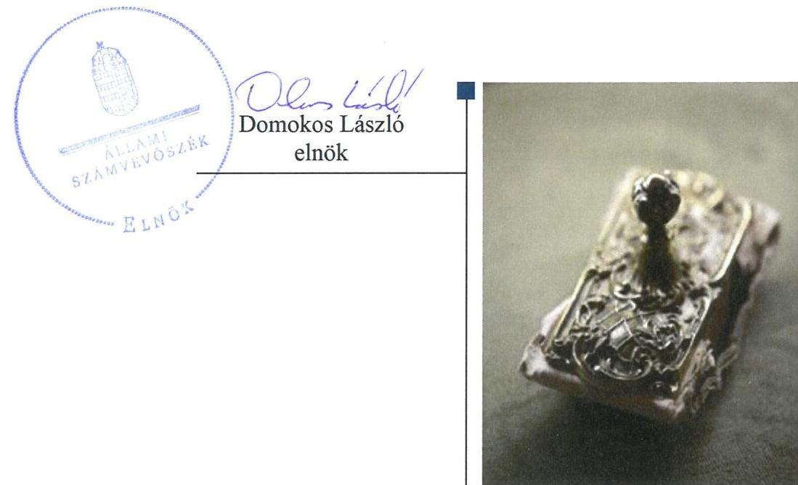
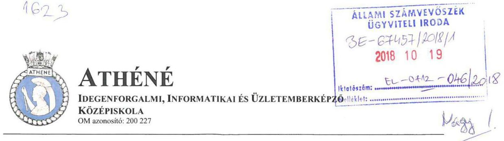

# Jelentés 

## Nem állami humánszolgáltatók ellenőrzése

A humánszolgáltatást nyújtó államháztartáson kívüli köznevelési és szociális intézmények, szolgáltatók fenntartói központi költségvetésből kapott támogatásai felhasználásának ellenőrzése - Az Útban Európához Alapítvány 2018.

---

# Jelentés 

## Nem állami humánszolgáltatók ellenőrzése

A humánszolgáltatást nyújtó államháztartáson kívüli köznevelési és szociális intézmények, szolgáltatók fenntartói központi költségvetésből kapott támogatásai felhasználásának ellenőrzése - Az Útban Európához Alapítvány
2018. 11. hó 23. nap

---

# AZ ELLENŐRZÉST FELÜGYELTE:

DR. NAGY IMRE felügyeleti vezető

# AZ ELLENŐRZÉST VEZETTE ÉS A VÉGREHAJTÁSÁÉRT FELELŐS:

MOLNÁR ZSUZSANNA ellenőrzésvezető

# A PROGRAM ÖSSZEÁLLÍTÁSÁÉRT FELELŐS:

TÓTPÁL SZABOLCS osztályvezető

---

IKTATÓSZÁM: EL-0439-014/2018.

TÉMASZÁM: 2448

ELLENŐRZÉS-AZONOSÍTÓ SZÁM: V079413

---

Jelentéseink az Országgyűlés számítógépes hálózatán és az Interneta a www.asz.hu címen is olvashatóak.

---

# TARTALOMJEGYZÉK 

■ ÖSSZEGZÉS ..... 5
■ AZ ELLENŐRZÉS CÉLJA ..... 6
■ AZ ELLENŐRZÉS TERÜLETE ..... 7
■ AZ ELLENŐRZÉS HÁTTERE, INDOKOLTSÁGA ..... 8
■ A JELENTÉS LÉNYEGES KÉRDÉSKÖREI ..... 9
■ AZ ELLENŐRZÉS HATÓKÖRE ÉS MÓDSZEREI ..... 10
■ MEGÁLLAPÍTÁSOK ..... 12
■ JAVASLATOK ..... 15
■ MELLÉKLETEK ..... 17
I. sz. melléklet: Értelmező szótár ..... 17
■ FÜGGELÉK: ÉSZREVÉTELEK ..... 19
■ RÖVIDÍTÉSEK JEGYZÉKE ..... 21

---

.

---

# ÖSSZEGZÉS 

Az Útban Európához Alapítvány - mint intézményfenntartó - a szabályszerű gazdálkodás alapját képező számviteli szabályozás hiánya miatt a költségvetési támogatások átlátható, elszámoltatható igénybevételének és felhasználásának feltételeit nem teremtette meg. A köznevelési feladathoz rendelt költségvetési támogatásokat szabályszerűen fordította intézménye müködtetésére, a közszolgáltatás igénybevételének feltételeit azonban nem határozta meg. A közérdekü adatok közzétételi kötelezettségének nem tett eleget, ezáltal közpénzekkel való gazdálkodásának átláthatóságát a nyilvánosság előtt nem biztositotta.

## Az ellenőrzés társadalmi indokoltsága

Az Állami Számvevőszék stratégiájában hangsúlyos szerepet szán annak, hogy szilárd szakmai alapon álló, értékteremtő ellenőrzéseivel előmozdítsa a közpénzügyek átláthatóságát, rendezettségét, javaslataival a közpénzek és a közvagyon szabályos, gazdaságos, hatékony és eredményes felhasználását segítse. Stratégiájában az Állami Számvevőszék célul tűzte ki, hogy az államháztartáson kívülre nyújtott költségvetési támogatások ellenőrzésével hozzájárul ahhoz, hogy a közpénzeket az államháztartáson kívüli szervezetek is átlátható módon használják fel a közfeladatok szerződésben vállalt ellátása érdekében. Tekintettel az elmúlt években a köznevelés finanszírozását és a köznevelési intézmények fenntartását érintően végbement változásokra, a társadalom fokozott érdeklődéssel figyeli a köznevelési feladatok ellátására fordított források felhasználását. Fontos ezért az Állami Számvevőszéknek a közvéleményt biztosítani arról, hogy a közpénz államháztartáson kívüli felhasználása ezen a területen sem marad ellenőrizetlenül. Az ellenőrzés hozzájárul ahhoz is, hogy a nyilvánosság és a közszolgáltatást igénybevevők megfelelő tájékoztatást kapjanak az államháztartáson kívüli közfeladatot ellátók müködéséről. Az Útban Európához Alapítványnál végzett ellenőrzést indokolja, hogy az alapítvány döntően közpénzekből biztosítja a középfokú képzés, illetve szakképzés lehetőségét az igénybevevők számára.

## Főbb megállapítások, következtetések, javaslatok

Az Útban Európához Alapítvány, mint intézményfenntartó a szabályszerű gazdálkodás alapját képező számviteli politika és az annak keretében elkészítendő szabályzatok hiánya miatt a költségvetési támogatások átlátható, elszámoltatható igénybevételének és felhasználásának feltételeit nem teremtette meg.

A költségvetési támogatásokkal kapcsolatos igénylési, módosítási, elszámolási kötelezettségnek a Magyar Államkincstár felé a jogszabály előírásai szerint eleget tett.

Az Útban Európához Alapítvány nem szabályozta a közfeladatot ellátó intézmény által kérhető térítési díj és tandíj megállapításának szabályait, valamint a szociális alapon adható kedvezmények feltételeit, ezzel nem határozta meg intézménye szabályszerű müködtetésének kereteit, illetve a közszolgáltatás igénybevételének feltételeit. Az intézmény személyi és tárgyi feltételeinek megteremtéséről gondoskodott. A köznevelési közfeladat ellátására kapott támogatást szabályszerűen fordította intézménye müködtetésére, felhasználását nem a jogszabály előírása szerint tartotta nyilván.

Az Útban Európához Alapítvány ellenőrzési feladatait szabályszerűen látta el, a pedagógiai-szakmai feladatok végrehajtásával és eredményességével kapcsolatban értékelési feladatokat nem végzett. A közérdekű adatok közzétételi kötelezettségének nem tett eleget, ezáltal a humánszolgáltatási közfeladatot ellátó intézménye müködtetéséhez felhasznált közpénzekre vonatkozó gazdálkodásának átláthatóságát a nyilvánosság előtt nem biztosította.

---

# AZ ELLENŐRZÉS CÉLJA 

AZ ELLENŐRZÉS CÉLJA annak értékelése volt, hogy Az Útban Európához Alapítvány, mint köznevelési intézményfenntartó központi költségvetésből kapott támogatásainak felhasználása szabályszerű volt-e, a támogatások igénylése, évközi módosítása és év végi elszámolása megfelelte a jogszabályi előírásoknak.

---

# **AZ ELLENŐRZÉS TERÜLETE**

## **Az Útban Európához Alapítvány, mint intézményfenntartó**

Az Útban Európához Alapítványt 1997-ben a **SOTER-LINE** Oktatási Továbbképző és Szolgáltató Korlátolt Felelősségű Társaság alapította – többek között – azzal a céllal, hogy létrehozza és működtesse az Athéné Idegenforgalmi, Informatikai és Üzletemberképző Szakgimnázium és Szakközépiskola egykori jogelőd intézményét.

A Fenntartó1 nyílt, 2014. június 1-jétől nem közhasznú jogállású szervezet volt. Vállalkozási tevékenységet az ellenőrzött időszakban nem folytatott.

Úgyvezető szerve a három főből álló kuratórium volt. A Fenntartó képviseletére a kuratórium elnöke volt jogosult, akinek személye az ellenőrzött időszakban nem változott.

A Fenntartó 1997-ben megalapított intézménye2 az ellenőrzött időszakban budapesti székhelyén kívül egy fővárosi telephelyen működött. Tevékenysége szakközépiskola, szakiskolai, szakgimnáziumi nevelés-oktatás és felnőttoktatási feladatok ellátása volt nappali és esti munkarendben. Az intézmény engedélyezett tanulólétszáma 2440 fő volt.

A Fenntartó összes bevétele 2014-ben 435,5 M Ft, 2016-ban 305,0 M Ft volt, mindkét évi összes bevételének 100%-át a központi költségvetési támogatás tette ki. Befektetett eszközállománya mindkét évben 0,2 M Ft volt, 2014. évi rövid lejáratú kötelezettsége 2,7 M Ft volt, ami 2016-ra nullára csökkent, hosszú lejáratú kötelezettsége nem volt.

---

# AZ ELLENŐRZÉS HÁTTERE, INDOKOLTSÁGA 

A köznevelési feladatokat ellátó nem állami intézményfenntartók részére közfeladataik ellátására évente jelentős összegű pénzügyi támogatást biztosítottak a mindenkori költségvetési törvények a bennük megfogalmazott feltételek mellett.

Az Országgyűlés elfogadta a nemzeti köznevelésről szóló 2011. évi CXC. törvényt, amely jelentősen átalakította a korábbi finanszírozási rendszert 2013 szeptemberétől. Új feladatfinanszírozási forma (átlagbéralapú támogatás) jelent meg, amely az államháztartáson kívüli intézményfenntartókra is vonatkozik. Az ellenőrzés a finanszírozási rendszerben bekövetkezett változásokra, azok közfeladat ellátásra gyakorolt hatására fókuszált a költségvetési támogatásokat felhasználó államháztartáson kívüli szervezetek körében. Az ellenőrzés indokoltságát az is alátámasztotta, hogy az ÁSZ ${ }^{3}$ még nem ellenőrizte átfogóan e területet.

Az ÁSZ stratégiájában foglaltak alapján is indokolt az ellenőrzés, amely a társadalom számára jelzi, hogy a közpénz államháztartáson kívüli felhasználása sem maradhat ellenőrizetlenül. Az államháztartáson kívülre nyújtott költségvetési támogatások ellenőrzésével az ÁSZ hozzájárul ahhoz, hogy a közpénzeket a nem állami fenntartók átlátható módon használják fel a közfeladatok ellátására kötött szerződésekben vállalt kötelezettségek teljesítése érdekében. Az ÁSZ az ellenőrzés javaslataival hozzájárulhat az említett rendszerek szabályszerű támogatás-felhasználásához, javíthatja a társa-dalmi-gazdasági döntések megalapozottságát, amely a „jó kormányzás" feltétele.

---

# A JELENTÉS LÉNYEGES KÉRDÉSKÖREI 

1. A köznevelési humánszolgáltatási közfeladatot ellátó Fenntartó szabályszerű müködési - és gazdálkodási környezet kialakításával megteremtette-e a költségvetési támogatások átlátható, elszámoltatható igénybevételének, felhasználásának feltételeit?
2. Az államháztartáson kívüli Fenntartó az átvállalt köznevelési közfeladathoz biztosított költségvetési támogatásokat szabályszerűen fordította-e a humánszolgáltató intézménye müködtetésére?
3. Az államháztartáson kívüli Fenntartó a köznevelési intézménye müködtetéséhez felhasznált közpénzekre vonatkozó gazdálkodásával a nyilvánosság előtt elszámolt-e, ennek megalapozása érdekében ellenőrzési, értékelési és a külső ellenőrzésekkel kapcsolatos intézkedési feladatait szabályszerűen látta-e el?

---

# AZ ELLENŐRZÉS HATÓKÖRE ÉS MÓDSZEREI 

## Az ellenőrzés típusa

Megfelelőségi ellenőrzés.

## Az ellenőrzött időszak

A 2014. január 1-je és 2016. december 31-e közötti időszak.

## Az ellenőrzés tárgya

Az ellenőrzés a köznevelési közfeladatokat ellátó államháztartáson kívüli fenntartó közfeladatai ellátásához a költségvetési törvényekben biztosított központi költségvetési támogatások igénylése, évközi módosítása és év végi elszámolása fenntartói feladatainak ellátása, illetve e központi költségvetésből kapott támogatásaik közfeladatokra való fenntartó általi felhasználása szabályszerűségének értékelésére terjedt ki.

Az ellenőrzés nem terjedt ki a költségvetési támogatás igénylése, módosítása, elszámolása valódiságának, megalapozottságának, helyességének értékelésére, valamint a források intézmény általi felhasználásának értékelésére.

## Az ellenőrzött szervezet

Az Útban Európához Alapítvány, mint intézményfenntartó.

## Az ellenőrzés jogalapja

Az ellenőrzés jogszabályi alapját az ÁSZ tv. 1. § (3) bekezdésében, valamint az 5. § (3) bekezdésében foglalt előírások adták.

## Az ellenőrzés módszerei

Az ellenőrzést az ellenőrzési program kérdései, az adott időszakban hatályos jogszabályok, az ellenőrzés szakmai szabályok és módszertanok, valamint a nemzetközi standardok figyelembevételével végezte az ÁSZ.

A közpénzekkel való felelős gazdálkodás segítésére irányuló javaslatok kidolgozásakor a hatályos jogszabályok voltak az irányadóak.

Az ellenőrzés ideje alatt az ÁSZ a Fenntartóval történő kapcsolattartást az ÁSZ SZMSZ4-ének vonatkozó előírásai alapján biztosította.

---

Az ellenőrzési kérdések megválaszolásához szükséges bizonyítékok megszerzése az ellenőrzött által rendelkezésre bocsátott dokumentumokra, adatokra alapozva történt.

Az ellenőrzési bizonyítékként felhasznált adatforrások közé tartoztak egyrészt a szakmai program részletes szempontjainál felsorolt adatforrások, másrészt minden - az ellenőrzés folyamán feltárt, az ellenőrzés szempontjából információt tartalmazó - dokumentum.

Az ellenőrzés lefolytatásához a Fenntartó a kitöltött tanúsítványok, valamint az ÁSZ által kért dokumentumok átadásával szolgáltatott adatokat, információkat. Az így rendelkezésre bocsátott adatok, információk és a tanúsítványok adatai valódiságának kontrollja az ellenőrzés keretében történt.

A fenntartott intézménynél helyszíni szemle keretében győződtünk meg a tényleges feladatellátásról. A köznevelési humánszolgáltatások központi költségvetési támogatásai igénylésével, módosításával, elszámolásával kapcsolatos, államháztartáson kívüli fenntartó jogszabályokban előírt feladatai betartását, továbbá a központi költségvetési támogatások szabályszerű kezelését, nyilvántartását ellenőriztük a Fenntartónál, az ott rendelkezésre álló határozatok, nyilvántartások, beszámolók és egyéb dokumentumok alapján.

---

# 1. A köznevelési humánszolgáltatási közfeladatot ellátó Fenntartó szabályszerű múködési - és gazdálkodási környezet kialakításával megteremtette-e a költségvetési támogatások átlátható, elszámoltatható igénybevételének, felhasználásának feltételeit? 

Összegző megállapítás

A Fenntartó nem alakította ki a szabályszerű gazdálkodási környezetet, a költségvetési támogatások átlátható, elszámoltatható igénybevételének, felhasználásának feltételeit.
1.1. számú megállapítás

A Fenntartó a szabályszerű gazdálkodás alapját képező számviteli szabályozásról nem gondoskodott.

A Fenntartó a Számv. tv. ${ }^{5}$ 14. § (3) bekezdésében és az (5) bekezdés a), b) és d) pontokban foglaltak ellenére nem rendelkezett számviteli politikával és az annak keretében elkészítendő eszközök és a források leltárkészítési és leltározási szabályzatával, az eszközök és a források értékelési szabályzatával és pénzkezelési szabályzattal.

A Fenntartó rendelkezett a Ptk. ${ }^{6}$ előírásainak megfelelő alapító okirat$\mathrm{tal}_{1,2}{ }^{7}$, mely alapján a Bíróság ${ }^{8}$ nyilvántartásba vette. SZMSZ-ében ${ }^{9}$ meghatározta szervezetét és múködési szabályait, szabályozta az engedélyezési, jóváhagyási, kontrolleljárásokat, valamint meghatározta a dokumentumokhoz való hozzáférés szabályait. Rendelkezett a költségvetési támogatások intézménye részére történő átadásának szabályairól.
1.2. számú megállapítás

A Fenntartó a költségvetési támogatások igénylési, módosítási és elszámolási feladatait szabályszerűen látta el.

A költségvetési támogatások iránti igényét a Fenntartó az Nkt. vhr. ${ }^{10}$-ben előírt nyilatkozatokkal a 2014-2016. évekre vonatkozóan határidőre benyújtotta a Kincstárhoz ${ }^{11}$. A Fenntartó rendelkezett a költségvetési támogatásokat megállapító kincstári határozatokkal.

A Fenntartó az Nkt. vhr.-ben előírt határidőre eleget tett a Kincstár felé a költségvetési támogatás igényléséhez kötődő létszám adatokban 2016ban bekövetkezett változással kapcsolatos bejelentési kötelezettségének.

A Fenntartó a központi költségvetésből kapott támogatásokra vonatkozó elszámolását minden évben benyújtotta az Nkt. vhr.
-ben foglaltak szerint, határidőben a Kincstár felé. A 2016. évi elszámolás során a Kincstár hiánypótlási felszólításának a Fenntartó eleget tett.

---

# 2. Az államháztartáson kívüli Fenntartó az átvállalt köznevelési közfeladathoz biztosított költségvetési támogatásokat szabályszerűen fordította-e a humánszolgáltató intézménye múködtetésére? 

Összegző megállapítás

2.1. számú megállapítás

A Fenntartó az intézmény szabályszerű múködtetésének kereteit nem alakította ki. Az átvállalt köznevelési feladathoz biztosított költségvetési támogatásokat szabályszerűen fordította a közfeladatot ellátó intézménye múködtetésére.

A Fenntartó intézménye szabályszerű múködtetésének kereteit nem határozta meg.

Az intézmény által kérhető térítési díj és tandíj megállapításának szabályait, valamint a szociális alapon adható kedvezmények feltételeit az Nkt. ${ }^{12}$ 83. § (2) bekezdés c) pont előírása ellenére nem határozta meg a Fenntartó.

A Fenntartó az - az Nkt. előírásainak megfelelő - intézményi alapító okiratban ${ }_{1-4}{ }^{13}$ meghatározta intézménye alapfeladatait. Az intézményt a Kormányhivatal ${ }^{14}$ nyilvántartásba vette, az Nkt. vhr.-ben meghatározott OM azonosítóval ${ }^{15}$ rendelkezett.

A Fenntartó az Nkt. rendelkezésének megfelelően kinevezte az intézmény vezetőjét, meghatározta az intézmény költségvetéseit. A Fenntartó megállapította intézménye könyvvezetési, beszámoló-készítési kötelezettségét a Számv. tv.-ben foglaltak szerint.

A közfeladat ellátásához szükséges állandó székhelyet, telephelyet a feladatellátáshoz szükséges helyiségekkel a Fenntartó biztosította. Az intézmény alapító okirata tartalmazta a feladatellátást szolgáló vagyont, valamint az intézmény vagyon feletti rendelkezési jogát.

A Fenntartó rendelkezett az intézmény múködéséhez szükséges - Nkt. szerinti feltételek meglétét igazoló - múködési engedélyével.

## 2.2. számú megállapítás

A Fenntartó a köznevelési közfeladat ellátására kapott támogatást szabályszerűen átadta intézményének, felhasználását nem a jogszabályi előírás szerint tartotta nyilván.

A Fenntartó a Kincstár által 2014-2016. években a köznevelési feladat ellátására folyósított központi költségvetési támogatás teljes összegét továbbadta intézményének. A támogatásokat a Kvtv. ${ }_{1-3}{ }^{16}$ által meghatározott határidőben utalta tovább a Fenntartó.

A költségvetési támogatások felhasználásának elkülönített nyilvántartása nem felelt meg a jogszabályban előírtaknak, mert - az Nkt. vhr. 37/G. § (1) bekezdésének előírásai ellenére - nem gondoskodott a Fenntartó olyan nyilvántartás kialakításáról, amelyből megállapítható, hogy a támogatások milyen célra kerültek felhasználásra.

---

# 3. Az államháztartáson kívüli Fenntartó a köznevelési intézménye müködtetéséhez felhasznált közpénzekre vonatkozó gazdálkodásával a nyilvánosság előtt elszámolt-e, ennek megalapozása érdekében ellenőrzési, értékelési és a külső ellenőrzésekkel kapcsolatos intézkedési feladatait szabályszerűen látta-e el? 

Összegző megállapítás

A Fenntartó a köznevelési intézménye müködtetéséhez felhasznált közpénzekkel való gazdálkodását a nyilvánosság számára nem tette átláthatóvá, szakmai értékelési feladatokat nem végzett intézménye vonatkozásában.
3.1. számú megállapítás

A Fenntartó ellenőrzési feladatait szabályszerűen látta el, a peda-gógiai-szakmai feladatok végrehajtásával, a szakmai munka eredményességével kapcsolatban értékelési feladatokat nem végzett.

A Fenntartó alapító okirata szerint működésének és gazdálkodásának ellenőrzésére felügyelő bizottságot ${ }^{17}$ hozott létre.

Az intézmény működését 2014-2015. években, SZMSZ-ét 2014-ben ellenőrizte a Fenntartó. Az intézmény pedagógiai programját, házirendjét nem ellenőrizte - az Nkt. 83. § (2) bekezdés h) és i) pontja alapján - az ellenőrzött időszakban és nem értékelte a nevelési-oktatási intézmény pedagógiai programjában meghatározott feladatok végrehajtását, a pedagó-giai-szakmai munka eredményességét.

A Fenntartónál a 2015. évi költségvetési támogatások igénybevételének jogszerűségére és szabályszerűségére irányuló kincstári hatósági ellenőrzés eredményeként a Fenntartónak intézkedési kötelezettsége nem keletkezett.
3.2. számú megállapítás

A Fenntartó beszámolási kötelezettségének nem a jogszabályi előírás szerint tett eleget, a felhasznált közpénzekre vonatkozó közzétételi kötelezettségét nem teljesítette.

A Fenntartó a jogszabályi előírások szerint egyszerűsített éves beszámolót készített. Az egyszerűsített éves beszámolók - a Civil tv. ${ }^{18} 29$. § (2) bekezdés c) pontjában és a Civilszr. ${ }^{19} 6$. § (6) bekezdésében foglaltak ellenére nem tartalmaztak kiegészítő mellékletet.

A közérdekű adatok megismerésére irányuló igények teljesítésének a rendjét a Fenntartó az Info tv. ${ }^{20} 30$. § (6) bekezdésében előírtak ellenére nem szabályozta.

Az Info tv.-ben meghatározott közzétételi listákon szereplő adatok pontos, naprakész és folyamatos közzétételének, a közzétételi kötelezettség teljesítésének a részletes szabályait az Info tv. 35. § (3) bekezdésben foglalt előírások ellenére nem alakították ki.

Nem gondoskodott a Fenntartó az Info tv. 37. § (1) bekezdésében foglaltak ellenére - az éves beszámolók kivételével - az Info tv. 1. melléklet szerinti általános közzétételi listában felsorolt adatok közzétételéről.

---

# JAVASLATOK 

Az ÁSZ tv. 33. § (1) bekezdésében foglaltak értelmében az ellenőrzött szervezet vezetője köteles a jelentésben foglalt megállapításokhoz kapcsolódó intézkedési tervet összeállítani és azt a jelentés kézhezvételétől számított 30 napon belül az ÁSZ részére megküldeni. Amennyiben az ellenőrzött szervezet vezetője nem küldi meg határidőben az intézkedési tervet, vagy továbbra sem elfogadható intézkedési tervet küld, az Állami Számvevőszék elnöke az ÁSZ tv. 33. § (3) bekezdése a) és b) pontjaiban foglaltakat érvényesítheti.

## Az Útban Európához Alapítvány kuratóriuma elnökének

1. Intézkedjen a számviteli politika, továbbá annak keretében az eszközök és a források leltárkészitési és leltározási szabályzata, az eszközök és a források értékelési szabályzata és pénzkezelési szabályzat hatályos jogszabályi rendelkezések szerinti elkészitéséről.
(1.1. sz. megállapítás 1. bekezdése alapján)
2. Határozza meg a jogszabályban foglalt elöirások szerint a kérhető téritési dij és tandij megállapításának szabályait, a szociális alapon adható kedvezmények feltételeit.
(2.1. sz. megállapítás 1. bekezdése alapján)
3. Intézkedjen, hogy a költségvetési támogatások felhasználásának nyilvántartása feleljen meg a jogszabályokban elöirtaknak.
(2.2. sz. megállapítás 2. bekezdése alapján)
4. Intézkedjen arról, hogy az egyszerüsített éves beszámoló feleljen meg a jogszabályban foglalt követelményeknek.
(3.2. sz. megállapítás 1. bekezdés 2. mondata alapján)
5. Intézkedjen az Info tv. előirásai alapján a közérdekü adatok megismerésére irányuló igények teljesitési rendjének szabályozásáról.
(3.2. sz. megállapítás 2. bekezdése alapján)
6. Alakitsa ki az Info tv. előirásai alapján a közzétételi kötelezettség teljesitésének részletes szabályait.
(3.2. sz. megállapítás 3. bekezdése alapján)
7. Tegyen eleget az Info tv.-ben elöirt közzétételi kötelezettségnek.
(3.2. sz. megállapítás 4. bekezdése alapján)

---

.

---

# MELLÉKLETEK 

## I. SZ. MELLÉKLET: ÉRTELMEZŐ SZÓTÁR

humánszolgáltatás
költségvetési támogatás
köznevelési közfeladat

Külön törvényben meghatározott szociális, gyermekjóléti, gyermekvédelmi, közoktatási, felsőoktatási, kulturális közfeladatok (2014. évi Kvtv. 34. § (1), (4) bekezdés, 1. számú melléklet XX/20/2. alcím, 19. alcím, 2015. évi Kvtv. 43. § (1), (4) bekezdés, 1. számú melléklet XX/20/2/3. jogcím csoport, 19. alcím, 2016. évi Kvtv. 41. § (1), (4) bekezdés, 1. számú melléklet XX/20/2/3. jogcím csoport, 19. alcím).
a társadalombiztosítás pénzügyi alapjai kivételével az államháztartás központi alrendszeréből ellenérték nélkül, pénzben nyújtott támogatások (Áht. 1. § 14. pont)
A Kvtv-ekben (2013. évi CCXXX. törvény 33-34. §, 2014. évi C. törvény 42-43. §, 2015. évi C. törvény 40-41. §) megállapított támogatás. Például a 2015. évi C. törvény 40-41. § szerint többek között: Az Országgyűlés a köznevelési feladat ellátására átlagbéralapú támogatást állapít meg. A nevelési-oktatási, valamint pedagógiai szakszolgálati intézményt fenntartó nemzetiségi önkormányzat, az egyházi és magán köznevelési intézményfenntartója részére az általuk fenntartott nevelési-oktatási intézményben, továbbá pedagógiai szakszolgálati intézményben pedagógus és - a b) pont kivételével -nevelő-oktató munkát közvetlenül segítő munkakörben foglalkoztatottak után a 7. melléklet I. pontja, valamint az óvoda, egységes óvoda-bölcsőde esetében a 2. melléklet II. pont 1. alpontja szerint és az 5. alpontjában meghatározott jogosultak után, az őket ott megillető mértékek szerint. Múködési támogatást állapít meg a nemzetiségi önkormányzat vagy az egyházi jogi személy által fenntartott nevelési-oktatási intézményekben ellátott, továbbá a pedagógiai szakszolgálati intézményekben gyógypedagógiai tanácsadásban, korai fejlesztésben, oktatásban és gondozásban, valamint a fejlesztő nevelésben részt vevő gyermekekre, tanulókra tekintettel a nemzetiségi önkormányzat és a bevett egyház részére a 7. melléklet II. pontja szerint.
Az Országgyűlés a szociális, gyermekjóléti, gyermekvédelmi közfeladatot ellátó intézményt, szolgáltatást fenntartó egyházi jogi személy, civil szervezet, közalapítvány, országos nemzetiségi önkormányzat, települési vagy területi nemzetiségi önkormányzat, gazdasági társaság, és a humánszolgáltatást alaptevékenységként végző, az Szja tv. hatálya alá tartozó egyéni vállalkozó (a továbbiakban együtt: nem állami szociális fenntartó) részére támogatást állapít meg a következők szerint: a támogatás a nem állami szociális fenntartót a települési önkormányzatok 2. melléklet III. pont 3. alpont c)-k) pontjában és III. pont 5. alpont a) pontjában meghatározott támogatásaival azonos jogcímeken, összegben és feltételek mellett illeti meg.
A köznevelési intézmény alapító okiratában foglalt feladat: óvodai nevelés, nemzetiséghez tartozók óvodai nevelése, általános iskolai nevelés-oktatás, nemzetiséghez tartozók általános iskolai nevelése-oktatása, kollégiumi ellátás, nemzetiségi kollégiumi ellátás, gimnáziumi nevelés-oktatás, szakközépiskolai nevelés-oktatás, szakiskolai neve-lés-oktatás, nemzetiség gimnáziumi nevelés-oktatása, nemzetiség szakközépiskolai ne-velés-oktatása, nemzetiség szakiskolai nevelés-oktatása, Köznevelési Hidprogramok keretében folyó nevelés-oktatás, felnőttoktatás, alapfokú művészetoktatás, fejlesztő nevelés, fejlesztő nevelés-oktatás, pedagógiai szakszolgálati feladat, a többi gyermekkel, tanulóval együtt nevelhető, oktatható sajátos nevelési igényű gyermekek, tanulók óvodai nevelése és iskolai nevelése-oktatása, azoknak a sajátos nevelési igényű gyermekeknek, tanulóknak az óvodai, iskolai, kollégiumi ellátása, akik a többi gyermekkel, tanulóval nem foglalkoztathatók együtt, a gyermekgyógyüdülőkben, egészségügyi intézményekben, rehabilitációs intézményekben tartós gyógykezelés alatt álló gyermekek tankötelezettségének teljesítéséhez szükséges oktatás, pedagógiai-szakmai szolgáltatás.

---

# Mellékletek 

köznevelési intézmény
nem állami, nem önkormányzati (államháztartáson kívüli) intézményfenntartó

A nevelési- oktatási intézmény, pedagógiai szakszolgálati intézmény, pedagógiai-szakmai szolgáltatást nyújtó intézmény.
A köznevelési és szociális, gyermekjóléti és gyermekvédelmi közfeladatokat/humánszolgáltatásokat ellátó intézményt fenntartó egyházi jogi személy, társadalmi szervezet, alapítvány, közalapítvány, civil szervezet, országos nemzetiségi önkormányzat, nonprofit gazdasági társaság, gazdasági társaság és a humánszolgáltatást alaptevékenységként végző, Szja tv. hatálya alá tartozó egyéni vállalkozó. (2013. évi Kvtv. 35. § (1), (3) bekezdés, 2014. évi Kvtv. 33. §, 34. § (1), (4) bekezdés, 2015. évi Kvtv. 42. §, 43. § (1), (4) bekezdés, 2016. évi Kvtv. 40. §, 41. § (1), (4) bekezdés)

---

# FÜGGELÉK: ÉSZREVÉTELEK 

A jelentéstervezetet a Számvevőszék 15 napos észrevételezésre megküldte az ellenőrzött szervezet vezetőjének az ÁSZ tv. 29. §* (1) bekezdése előírásának megfelelően.

Az ÁSZ a jelentéstervezetet az Útban Európához Alapítvány kuratóriuma elnökének megküldte.

Az Útban Európához Alapítvány kuratóriuma elnöke a jelentéstervezettel kapcsolatban nemleges észrevételt tett.

[^0]
[^0]:    * 29. § (1) Az Állami Számvevőszék az ellenőrzési megállapításait megküldi az ellenőrzött szervezet vezetőjének vagy az általa megbízott személynek, és annak, akinek személyes felelősségét állapította meg.
    (2) Az ellenőrzött szervezet vezetője és a felelősként megjelölt személy az ellenőrzés megállapításaira tizenöt napon belül írásban észrevételt tehet.
    (3) Az Állami Számvevőszék az észrevételre a beérkezésétől számított harminc napon belül írásban válaszol. A figyelembe nem vett észrevételeket köteles a jelentésben feltüntetni, és megindokolni, hogy azokat miért nem fogadta el.

---

# Állami Számvevőszék 

## Domokos László elnök részére

Tisztelt Elnök Úr!

Megkaptuk a „Nem állami humánszolgáltatók ellenőrzése - A humánszolgáltatást nyújtó államháztartáson kívüli köznevelési és szociális intézmények, szolgáltatók fenntartói központi költségvetésből kapott támogatásai felhasználásának ellenőrzése - Az Útban Európához Alapítvány" címmel készült számvevőszéki jelentéstervezetet (iktatószám: EL-0712045/2018).

Köszönjük a Számvevőszék alapos elemző munkáját, az okmányban megfogalmazott megállapításokkal egyet értünk, azokhoz megjegyzést nem kívánunk füzni. A javasolt változtatásokat meg fogjuk tenni, ehhez az előkészületeket megkezdtük.
Egyéb észrevételt nem kívánunk tenni.

Budapest, 2018. 10. 15.
Tisztelettel:

Stiller Ildikó
kuratóriumi elnök
1073 Budapest, Erzsébet krt. 7.
Bark: 54700075-11000523
Adjazam: 18158490-1-42

---

# RÖVIDÍTÉSEK JEGYZÉKE 

${ }^{1}$ Fenntartó
${ }^{2}$ intézmény
${ }^{3}$ ÁSZ
${ }^{4}$ ÁSZ SZMSZ
${ }^{5}$ Számv. tv.
${ }^{6}$ Ptk.
${ }^{7}$ alapító okirat ${ }_{1,2}$

## ${ }^{8}$ Bíróság   ${ }^{9}$ SZMSZ

${ }^{10}$ Nkt. vhr.
${ }^{11}$ Kincstár
${ }^{12} \mathrm{Nkt}$.
${ }^{13}$ intézmény alapító okirata
${ }^{14}$ Kormányhivatal
${ }^{15}$ OM azonosító
${ }^{16} \mathrm{Kvtv}_{.1-3}$
${ }^{17}$ felügyelő bizottság
${ }^{18}$ Civil tv.
${ }^{19}$ Civilszr.
${ }^{20}$ Info tv.

Az Útban Európához Alapítvány
Athéné Idegenforgalmi, Informatikai és Üzletemberképző Szakgimnázium és Szakközépiskola
Állami Számvevőszék
az Állami Számvevőszék elnökének 4/2017. (XII. 29.) ÁSZ utasítása az Állami Számvevőszék Szervezeti és Működési Szabályzatáról (hatályos: 2017. január 1-jétől) 2000. évi C. törvény a számvitelről (hatályos: 2001. január 1-jétől)
2013. évi V. törvény a Polgári Törvénykönyvről (hatályos: 2014. március 15-től)
1: Az Útban Európához Alapítvány módosításokkal egységes szerkezetbe foglalt Alapító okirata (hatályos: 1999. november 15-től)
2: Az Útban Európához Alapítvány módosításokkal egységes szerkezetbe foglalt Alapító okirata (hatályos: 2015. október 28-tól)
Fővárosi Bíróság
Az Útban Európához Alapítvány Szervezeti és Múködési Szabályzata (hatályos: 2009. október 5-étől)
229/2012. (VIII. 28.) Korm. rendelet a nemzeti köznevelésről szóló törvény végrehajtásáról (hatályos 2012. szeptember 1-jétől)
Magyar Államkincstár
2011. évi CXC. törvény a nemzeti köznevelésről (hatályos: 2012. szeptember 1-jétől)
1: Athéné Idegenforgalmi, Informatikai és Üzletemberképző Szakképző Iskola alapító okirata (hatályos 2013. január 1-jétől 2014. augusztus 30-ig)
2: Athéné Idegenforgalmi, Informatikai és Üzletemberképző Szakképző Iskola alapító okirata (hatályos 2014. augusztus 31-től 2015. augusztus 30-ig)
3: Athéné Idegenforgalmi, Informatikai és Üzletemberképző Szakképző Iskola alapító okirata (hatályos 2015. augusztus 31-től 2016. augusztus 31-ig)
4: Athéné Idegenforgalmi, Informatikai és Üzletemberképző Szakképző Iskola alapító okirata (hatályos 2016. szeptember 1-jétől)
Budapest Főváros Kormányhivatala
oktatási azonosító szám
1: 2013. évi CCXXX. törvény Magyarország 2014. évi központi költségvetéséről (hatályos: 2014. január 1-jétől)
2: 2014. évi C. törvény Magyarország 2015. évi központi költségvetéséről, (hatályos: 2015. január 1-jétől)
3: 2015. évi C. törvény Magyarország 2016. évi központi költségvetéséről (hatályos: 2015. július 4-jétől)
Az Útban Európához Alapítvány Felügyelő Bizottsága
2011. évi CLXXV. törvény az egyesülési jogról, a közhasznú jogállásról, valamint a civil szervezetek múködéséről és támogatásáról (hatályos: 2011. december 22-étől)
224/2000. (XII. 19.) Korm. rendelet az egyes egyéb szervezetek beszámoló készítési és könyvvezetési kötelezettségének sajátosságairól (hatályos 2001. január 1-jétől 2016. december 31-ig)
2011. évi CXII. törvény az információs önrendelkezési jogról és az információszabadságról (hatályos: 2011. július 27-től)

---

# ÁLLAMI SZÁMVEVŐSZÉK 

1052 Budapest, Apáczai Csere János utca 10.
Levélcím: 1364 Budapest 4. Pf. 54
Telefon: +36 14849100 Telefax: +36 14849200
www.asz.hu