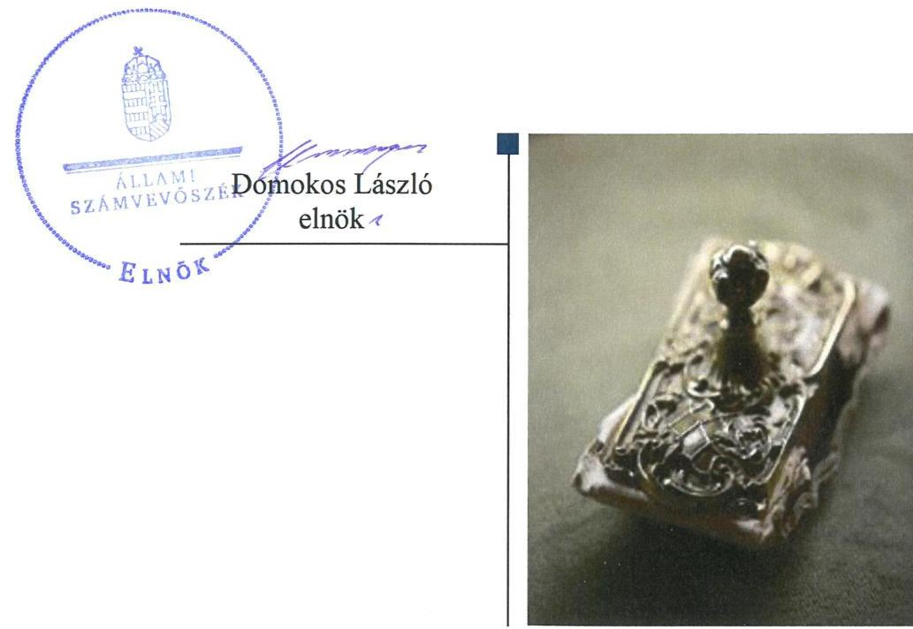
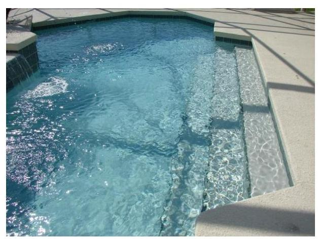

# Jelentés 

## Az önkormányzatok gazdasági társaságai

Az önkormányzatok többségi tulajdonában lévő gazdasági társaságok gazdálkodásának ellenőrzése - GYULAI VÁRFÜRDŐ Fürdő- és Gyógyszolgáltató Kft.
2018.

---

# Jelentés 

## Az önkormányzatok gazdasági társaságai

Az önkormányzatok többségi tulajdonában lévő gazdasági társaságok gazdálkodásának ellenőrzése - GYULAI VÁRFÜRDŐ Fürdő- és Gyógyszolgáltató Kft.
2018. 11. hó 30. nap

---

# AZ ELLENŐRZÉST FELÜGYELTE:

- **KLINGA LÁSZLÓ** felügyeleti vezető
- **AZ ELLENŐRZÉST VEZETTE ÉS A VÉGREHAJTÁSÁÉRT FELELŐS:**
  - **HOFMEISTER LÁSZLÓ** ellenőrzésvezető
  - **A PROGRAM ÖSSZEÁLLÍTÁSÁÉRT FELELŐS:**
    - **TÓTPÁL SZABOLCS** osztályvezető

**IKTATÓSZÁM:** EL-0202-053/2018

**TÉMASZÁM:** 2447

**ELLENŐRZÉS-AZONOSÍTÓ SZÁM:** V-079369

Jelentéseink az Országgyűlés számítógépes hálózatán és az Interneta a www.asz.hu címen is olvashatóak.

---

# TARTALOMJEGYZÉK 

■ ÖSSZEGZÉS ..... 5
■ AZ ELLENŐRZÉS CÉLJA ..... 6
■ AZ ELLENŐRZÉS TERÜLETE ..... 7
■ AZ ELLENŐRZÉS HÁTTERE, INDOKOLTSÁGA ..... 8
■ A JELENTÉS LÉNYEGES KÉRDÉSKÖREI ..... 9
■ AZ ELLENŐRZÉS HATÓKÖRE ÉS MÓDSZEREI ..... 10
■ MEGÁLLAPÍTÁSOK ..... 12
■ JAVASLATOK ..... 14
■ MELLÉKLETEK ..... 17
I. sz. melléklet: Értelmező szótár ..... 17
■ FÜGGELÉK: ÉSZREVÉTELEK ..... 19
■ RÖVIDÍTÉSEK JEGYZÉKE ..... 21

---

.

---

# ÖSSZEGZÉS 

A GYULAI VÁRFÜRDŐ Fürdő- és Gyógyszolgáltató Kft. számviteli szabályozottsága, gazdálkodása, vagyongazdálkodása nem volt szabályszerű. A közzétett beszámolók hiteles és megbizható alátámasztásáról nem gondoskodtak, így nem volt biztositott a gazdálkodás elszámoltathatósága. A Társaság a közérdekú adatokat sem szabályszerűen tette közzé, ezzel a müködés átláthatóságát nem biztositotta.

## Az ellenőrzés társadalmi indokoltsága

Magyarországon az önkormányzatok kötelező és önként vállalt feladataik ellátása során egyre szélesebb körben alkalmazzák a költségvetési szerveken kívüli feladatellátást, ezáltal az önkormányzati tulajdonú gazdasági társaságok is kiemelt fontosságú szerephez jutnak a lakossági szolgáltatások biztosításában. Az önkormányzatok többségi tulajdonában álló gazdasági társaságok ellenőrzése kiemelt jelentőségű, mivel müködésük hatással van a tulajdonos önkormányzat gazdálkodására, gazdálkodásának egyes elemei befolyásolják az önkormányzati alszektor hiányát és az államadósságot.

Az Állami Számvevőszék stratégiájában célul tűzte ki az államháztartáson kívül működő szervezetek ellenőrzését, mely hozzájárul a közpénzek szabályos, átlátható, elszámoltatható és eredményes felhasználásához. A GYULAI VÁRFÜRDŐ Fürdő- és Gyógyszolgáltató Kft.-vel az általa ellátott feladaton keresztül a müködésének területén élő lakosság széles rétege került kapcsolatba.

## Főbb megállapítások, következtetések, javaslatok

Az Önkormányzat a Társaság feletti tulajdonosi joggyakorlásának kereteit a jogszabályoknak megfelelően alakította ki. A tulajdonosi jogok gyakorlása szabályszerű volt.

A Társaság számviteli szabályozottsága az ellenőrzött időszakban nem volt szabályszerű, mivel nem rendelkezett számlarenddel és az önköltségszámítás rendjére vonatkozó belső szabályzattal.

A vagyongazdálkodása nem volt szabályszerű, mert a beszámolók mérlegének leltárral való alátámasztottsága nem volt szabályszerű.

A bevételek és ráfordítások elszámolása nem volt szabályszerű, ezáltal a gazdálkodás szabályosságát és átláthatóságát nem biztosította a Társaság.

A jogszabály által előírt, közérdekú adatok megismerésére irányuló igények teljesítésének rendjét rögzítő szabályzatát nem alkotta meg, közérdekú adatait nem szabályszerűen tette közzé a Társaság, nem biztosította müködésének átláthatóságát.

A megállapítások alapján az Állami Számvevőszék a GYULAI VÁRFÜRDŐ Fürdő- és Gyógyszolgáltató Kft. ügyvezetőjének kilenc javaslatot fogalmazott meg.

---

# AZ ELLENŐRZÉS CÉLJA 

Az ellenőrzés célja annak értékelése volt, hogy az önkormányzat vagyongazdálkodási tevékenysége során szabályszerűen gyakorolta-e tulajdonosi jogait, a gazdasági társaság szabályozottsága, gazdálkodása és vagyongazdálkodási tevékenysége, bevételeinek és ráfordításainak elszámolása megfelelt-e a jogszabályi és tulajdonosi előírásoknak; a gazdasági társaság kötelezettségállománya jelentett-e kockázatot a múködésre, valamint a gazdálkodás átláthatósága és elszámoltathatósága érdekében biztosított volt-e a szolgáltatás dijának megalapozottsága szabályszerű önköltségszámítással.

---

# AZ ELLENŐRZÉS TERÜLETE 

## Gyula Város Önkormányzata és a többségi tulajdonában lévő GYULAI VÁRFÜRDŐ Fürdő- és Gyógyszolgáltató Korlátolt Felelősségű Társaság

A Társaság ${ }^{1}$-ot 1995-ben alapította az Önkormányzat². A Társaság törzstőkéje a 2013. évi 1,5 Mrd Ft-ról az ellenőrzött időszak végére 1,6 Mrd Ft-ra növekedett, az Önkormányzat tulajdoni hányada 93,2\% és 96,1\% között alakult. A Társaságban tulajdonos volt még a Magyar Állam, valamint három gazdasági társaság (a GyulaSzöv Kft., a Gyulai Közüzemi Nonprofit Kft. és az Erkel Hotel Gyógyszálló Kft.). 2014. június 30-án a Magyar Állam és az Önkormányzat között létrejött megállapodás szerint a Magyar Állam az üzletrészének tulajdonjogát - ingyenesen - átruházta az Önkormányzatra.

A Társaság közfeladatot - úszásoktatás - is ellátó gazdasági társaság. A feladatellátás feltételeit a 2011. március 30-án létrejött Feladat-ellátási szerződés ${ }^{3}$ részletezte. A Társaság fő tevékenysége a Gyulai Várfürdő üzemeltetése, mely kiterjedt különböző fürdőprogramok, kezelések szervezésére, valamint vendéglátásra is.

A Társaság nem tartozott a kormányzati szektorba sorolt egyéb szervezetek közé, vagyonkezelt vagyona nem volt, saját vagyonával gazdálkodott.

Az önkormányzati támogatás összege az ellenőrzött időszakban mintegy 0,1 Mrd Ft-ot tett ki, mely a Társaság árbevételének 3\%-át képezte.

Az ellenőrzött időszakban a Társaság vagyona mintegy 3,2 Mrd Ft-ról 50\%-kal nőtt a beszámolók adatai alapján. A Társaság valamennyi ellenőrzött évben nyereségesen múködött, a 2013-2016. években mintegy 0,2 Mrd Ft nyereséget ért el. Az átlagos állományi létszáma a 2013. évi 121 fơről a 2016. évre 144 főre emelkedett.

A polgármester és a jegyző személyében a 2013-2016. évek között nem történt változás. A Társaság ügyvezetőjének személye a 2016. évben két alkalommal változott.

---

# AZ ELLENŐRZÉS HÁTTERE, INDOKOLTSÁGA 

Az önkormányzatok többségi tulajdonában álló gazdasági társaságok ellenőrzése kiemelten fontos a vagyon megőrzése, megóvása érdekében, alapvető követelmény, hogy gazdálkodásuk, működésük szabályszerű, az általuk szolgáltatott adatok minél megbízhatóbbak legyenek.

A feladatellátás költségeinek, ráfordításainak alakulása a lakosság széles rétegét érinti. Az ellenőrzés várható hasznosulásaként ellenőrzéseink feltárhatják, hogy az önkormányzat a feladatellátásához rendelt vagyon működtetését a tulajdonostól elvárható gondossággal végezte-e, a feladatot ellátó gazdasági társaság a létesítő okiratban, szolgáltatási szerződésben foglaltak betartásával biztosította-e a feladat ellátását. Az ellenőrzés rávilágíthat arra, hogy a gazdasági társaság a vagyon használatával biztosította-e a szolgáltatás folytatásának feltételeit, az önkormányzat tulajdonosi felügyelete hozzájárult-e a szabályszerű gazdálkodáshoz és feladatellátáshoz.

A megállapítások alapján megfogalmazott számvevőszéki javaslatok hasznosítása elősegítheti a meglévő hibák megszüntetését. A jó gyakorlatok bemutatásával az ÁSZ hozzájárul a követendő megoldások megismertetéséhez, terjesztéséhez.

---

# A JELENTÉS LÉNYEGES KÉRDÉSKÖREI 

1. A tulajdonosi jogok gyakorlása szabályszerű volt-e?
2. A Társaság szabályozottsága, gazdálkodása és vagyongazdálkodása megfelelt-e az előírásoknak?

---

# AZ ELLENŐRZÉS HATÓKÖRE ÉS MÓDSZEREI 

## Az ellenőrzés típusa

Megfelelőségi ellenőrzés.

## Az ellenőrzött időszak

2013. január 1-jétől 2016. december 31-ig

## Az ellenőrzés tárgya

Az önkormányzatok - többségi tulajdonában lévő gazdasági társaságok feletti - tulajdonosi joggyakorlása, valamint a gazdasági társaságok gazdálkodásának szabályozottsága és szabályszerűsége.

Az ellenőrzés kiterjedt minden olyan körülményre és adatra, amely az ÁSZ ${ }^{4}$ jogszabályban meghatározott feladatainak teljesítéséhez, valamint a program végrehajtása folyamán felmerült újabb összefüggések feltárásához szükséges volt.

## Az ellenőrzött szervezet

Gyula Város Önkormányzata és a GYULAI VÁRFÜRDŐ Fürdő- és Gyógyszolgáltató Korlátolt Felelősségű Társaság

## Az ellenőrzés jogalapja

Az ellenőrzés jogalapját az ÁSZ tv. ${ }^{5}$ 1. § (3) bekezdése és 5. § (3)-(5) bekezdései képezik.

## Az ellenőrzés módszerei

Az ellenőrzést a nemzetközi standardokat irányadónak tekintve az ellenőrzési program ellenőrzési kérdései, az ellenőrzött időszakban hatályos jogszabályok, az ellenőrzés szakmai szabályok és módszertanok figyelembe vételével végeztük.

Az ellenőrzés ideje alatt az ellenőrzött szervezettel történő kapcsolattartást az ÁSZ Szervezeti és Múködési Szabályzatának vonatkozó előírásai alapján biztosítottuk.

Az ellenőrzés a többségi tulajdonosi jogokat gyakorló önkormányzatra, és az ellenőrzött gazdasági társaságra terjedt ki.

---

Az ellenőrzési kérdések megválaszolásához szükséges bizonyítékok megszerzése a következő ellenőrzési eljárások alkalmazásával történt: megfigyelés, kérdésfeltevés (információkérés), összehasonlítás, valamint elemző eljárás. Az ellenőrzési bizonyítékként felhasználható adatforrások közé tartoztak egyrészt az ellenőrzési programban felsorolt adatforrások, másrészt adatforrás lehet még minden - az ellenőrzés folyamán - feltárt, az ellenőrzés szempontjából információkat tartalmazó dokumentum.

Az ellenőrzést a kérdésekre adott válaszok kiértékelésével, valamint a megjelölt adatforrások, a csatolt tanúsítványok felhasználásával, továbbá az adott időszakban hatályos jogszabályok figyelembe vételével folytattuk le.

A bevételek és ráfordítások elszámolását véletlen mintavétellel ellenőriztük. A mintavétellel ellenőrzött területek esetében minden egyes tétel vonatkozásában a szabályszerűségre vonatkozó kérdéseket tettünk fel, amelyek eredménye összesítésre került. Megfelelőnek értékeltünk egy ellenőrzött területet, amennyiben 95\%-os bizonyossággal a teljes sokaságban az átlagos hibaarány legfeljebb 10\%, nem megfelelőnek, amennyiben 10\%-nál magasabb arányt képviselt. Abban az esetben, ha a teljes sokaság tekintetében a 10\%-os hibaarányhoz való viszony megítélésnek megbízhatósága nem érte el a 95\%-ot, annak elérése érdekében értékelésünket további szempontokkal egészítettük ki, és figyelembe vettük a feltárt hibák típusát és súlyát.

---

# 1. A tulajdonosi jogok gyakorlása szabályszerű volt-e? 

## Összegző megállapítás

A tulajdonosi jogok gyakorlása szabályszerű volt.
A TULAJDONOSI JOGOK gyakorlására vonatkozó előírásokat a Vagyongazdálkodási rendelet ${ }_{1-3}{ }^{6}$ tartalmazta. A Társaság létesítő okirata ${ }^{7}$ rögzítette a Társaság vezető tisztségviselője és a Taggyúlés ${ }^{8}$ hatáskörébe tartozó feladatokat, valamint a megválasztott könyvvizsgáló személyét.

Az öttagú $\mathrm{FB}^{9}$-t a Társaságnál a Taktv. ${ }^{10}$-ben előírtak szerint hozták létre.
A Társaság a Taktv.-ben előírt Javadalmazási szabályzat ${ }^{11}$-tal 2013. december 12-étől rendelkezett, mely tartalmilag megfelelt a jogszabályban foglaltaknak.

ÜZLETI TERV készítésének kötelezettségét a létesítő okirat tartalmazta. Az üzleti terveket a Társaság elkészítette, a Taggyúlés minden évben határozatában jóváhagyta.

A TÁRSASÁG SZÁMVITELI BESZÁMOLÓIT a Taggyúlés megtárgyalta a könyvvizsgáló, valamint az FB írásos véleménye birtokában és elfogadásáról határozatot hozott. A döntés értelmében a Társaság a 2013-2016. évi nyereségét eredménytartalékba helyezte.

## 2. A Társaság szabályozottsága, gazdálkodása és vagyongazdálkodása megfelelt-e az előírásoknak?

## Összegző megállapítás

2.1. számú megállapítás

A Társaság szabályozottsága, gazdálkodása és vagyongazdálkodása nem volt szabályszerű.

A Társaság számviteli szabályozottsága nem volt szabályszerű.
A Társaság rendelkezett a Számv. tv. ${ }^{12}$ által előírt Számviteli politika ${ }^{13}$-val, valamint az annak keretében elkészített Leltározási szabályzat ${ }^{14}$-tal, Értékelési szabályzat ${ }^{15}$-tal és Pénzkezelési szabályzat ${ }^{16}$-tal, melyek tartalma megfelelt a jogszabály előírásának.

Számlarenddel a Társaság nem rendelkezett a Számv. tv. 161. § (1) bekezdés előírása ellenére.

A Társaság önköltségszámításra kötelezett volt a Számv. tv. 14. § (7) bekezdés előírása szerint a teljes ellenőrzött időszakban a költségek együttes összege alapján, ennek ellenére önköltségszámítás rendjére vonatkozó belső szabályzattal nem rendelkezett, ezáltal nem tett eleget a Számv. tv. 14. § (5) bekezdés c) pontja előírásának. A szabályzat hiányában a végzett szolgáltatások önköltségét a Számv. tv. 14. § (7) bekezdése előírásai ellenére utókalkuláció módszerével nem állapította meg.

---

### 2.2. számú megállapítás

## A Társaság bevételeinek és ráfordításainak elszámolása nem volt szabályszerű. A Társaság a beszámolót leltárral nem támasztotta alá. A közérdekú adatokra vonatkozó közzétételi kötelezettségnek nem tettek eleget.

A bevételek elszámolása nem volt szabályszerű, mert nem felelt meg a Számv. tv. 165. § (1)-(2) bekezdés előírásának.

A személyi jellegú ráfordítások elszámolása nem volt szabályszerű, mert azok elszámolásánál a Számv. tv. 167. § (1) bekezdés h) pont előírása ellenére a könyvviteli elszámolást közvetlenül alátámasztó bizonylatok nem tartalmazták a könyvelés módjára, az érintett könyvviteli számlákra történő hivatkozást.

Az anyagjellegú, a pénzügyi múveletek és az egyéb ráfordítások, valamint az értékcsökkenési leírás tekintetében a Társaság a Számv. tv. 20. § (1), valamint a 169. § (2) bekezdésében foglaltak ellenére a könyvviteli elszámolást közvetlenül és közvetetten alátámasztó analitikus, illetve részletező nyilvántartásokkal nem rendelkezett, így a Számv. tv. 15. § (3) bekezdés előírásai ellenére a beszámolóban szereplő, a könyvvitelben rögzített tételek a valóságban nem voltak megtalálhatóak, bizonyíthatóak, kívülállók által is megállapíthatóak.

A Társaság úgy tett eleget a beszámoló közzétételi kötelezettségének, hogy a beszámoló nem felelt meg a Számv. tv. 20. § (1), valamint a 69. § (1)(3) bekezdés előírásainak, így a gazdálkodásának, vagyongazdálkodásának elszámoltathatóságát nem biztosította.

A Társaságnál a tárgyi eszközök mérlegben kimutatott értékét a 20132016. évek egyikében sem támasztották alá mennyiségi felvétellel végrehajtott leltározás alapján összeállított leltárral, ezzel nem tettek eleget a Számv. tv. 69. § (3) bekezdésében és a Leltározási szabályzat I.4.01.02. pontjában előírt, legalább háromévente mennyiségi felvétellel történő leltározási kötelezettségének.

A 2013-2016. években nem támasztották alá leltárral az immateriális javak, tárgyi eszközök, az egyéb rövid lejáratú követelések, a saját tőke, a rövid lejáratú hitelek, valamint az egyéb rövid lejáratú kötelezettségek mérlegsorokat a Számv. tv. 69. § (1) bekezdésében előírtak ellenére.

A KÖNYVVIZSGÁLÓ a leltár hiánya ellenére a beszámolót minden évben korlátozás nélküli hitelesítő záradékkal látta el.

A KÖZÉRDEKŰ ADATOK nyilvánosságra hozatalával kapcsolatos kötelezettségeinek a Társaság nem tett eleget. A Társaság az Info tv. ${ }^{17}$ 37. § (1) bekezdésben előírtak ellenére nem teljesítette a kötelező elektronikus közzététel alá eső, az Info tv. 1. mellékletében foglalt II. tevékenységre, müködésre és a III. gazdálkodási adatokra vonatkozó közzétételét.

A Társaság nem készítette el a közérdekú adatok megismerésére irányuló igények teljesítésének rendjét rögzítő szabályzatot, ezzel nem tartotta be az Info tv. 30. § (6) bekezdésében foglaltakat.

---

# JAVASLATOK 

Az ÁSZ tv. 33. § (1) bekezdésében foglaltak értelmében az ellenőrzött szervezet vezetője köteles a jelentésben foglalt megállapításokhoz kapcsolódó intézkedési tervet összeállítani és azt a jelentés kézhezvételétől számított 30 napon belül az ÁSZ részére megküldeni. Amennyiben az ellenőrzött szervezet vezetője nem küldi meg határidőben az intézkedési tervet, vagy továbbra sem elfogadható intézkedési tervet küld, az Állami Számvevőszék elnöke az ÁSZ tv. 33. § (3) bekezdése a) és b) pontjaiban foglaltakat érvényesítheti.

## GYULAI VÁRFÜRDŐ Fürdő- és Gyógyszolgáltató Kft. ügyvezetőjének

1. Intézkedjen a Számv. tv. előírásainak megfelelően a számlarend elkészitéséről.
(2.1. sz. megállapítás 2. bekezdése alapján)
2. Intézkedjen a Számv. tv.-ben elöírtaknak megfelelően az önköltségszámítás rendjére vonatkozó belső szabályzat elkészitéséről.
(2.1. sz. megállapítás 3. bekezdése alapján)
3. Intézkedjen a bevételek Számv. tv.-ben elöírtak szerinti elszámolásáról.
(2.2. sz. megállapítás 1. bekezdése alapján)
4. Intézkedjen annak érdekében, hogy a személyi jellegü ráfordítások könyvviteli elszámolását közvetlenül alátámasztó bizonylatok a Számv. tv.-ben elöírtaknak megfelelően tartalmazzák a könyvelés módjára, az érintett könyvviteli számlákra történő hivatkozást.
(2.2. sz. megállapítás 2. bekezdése alapján)
5. Intézkedjen a Számv. tv. előírásainak megfelelően az anyagjellegú ráfordítások, a pénzügyi müveletek ráfordításai, az egyéb ráfordítások és az értékcsökkenési leírás könyvviteli elszámolását közvetlenül és közvetetten alátámasztó analitikus, illetve részletező nyilvántartások elkészitéséről.
(2.2. sz. megállapítás 3. bekezdés 1. tagmondata alapján)
6. Intézkedjen a tárgyi eszközök mennyiségi felvétellel történő leltározásának Számv. tv.-ben és a Leltározási szabályzatban elöírt gyakorisággal történő elvégzéséről.
(2.2. sz. megállapítás 5. bekezdése alapján)

---

7. Intézkedjen a Számv. tv.-ben elöirtaknak megfelelően az immateriális javak, a tárgvi eszközök, az egyéb rövid lejáratú követelések, a saját tőke, a rövid lejáratú hitelek, valamint az egyéb rövid lejáratú kötelezettségek mérlegsorok leltárral történő alátámasztásáról.
(2.2. sz. megállapítás 6. bekezdése alapján)
8. Intézkedjen az Info tv.-ben elöirt közzétételi kötelezettség teljes körü teljesitéséröl.
(2.2. sz. megállapítás 8. bekezdés 2. mondata alapján)
9. Intézkedjen az Info tv.-ben elöirtaknak megfelelően a közérdekü adatok megismerésére irányuló igények teljesitésének rendjét rögzitő szabályzat elkészitéséről.
(2.2. sz. megállapítás 9. bekezdése alapján)

---

.

---

# MELLÉKLETEK 

- I. SZ. MELLÉKLET: ÉRTELMEZŐ SZÓTÁR
gazdasági társaság
kormányzati szektorba sorolt egyéb szervezet
nemzeti vagyon

A Ptk. 3:88. § (1) bekezdése szerint „a gazdasági társaságok üzletszerű közös gazdasági tevékenység folytatására, a tagok vagyoni hozzájárulásával létrehozott, jogi személyiséggel rendelkező vállalkozások, amelyekben a tagok a nyereségből közösen részesednek, és a veszteséget közösen viselik".
az Áht. 3. § (2) és (3) bekezdésében foglaltakon kívül az Európai Közösséget létrehozó szerződéshez csatolt, a túlzott hiány esetén követendő eljárásról szóló jegyzőkönyv alkalmazásáról szóló 2009. május 25-i 479/2009/EK rendelet (a továbbiakban: 479/2009/EK rendelet) szerint a kormányzati szektorba sorolt szervezet (Áht. 1. § (12))
a) az állam vagy a helyi önkormányzat kizárólagos tulajdonában álló dolgok,
b) az a) pont hatálya alá nem tartozó, állam vagy a helyi önkormányzat tulajdonában lévő dolog,
c) az állam vagy a helyi önkormányzatot tulajdonában lévő pénzügyi eszközök, továbbá az államot vagy a helyi önkormányzatot megillető társasági részesedések,
d) az államot vagy a helyi önkormányzatot megillető bármely vagyoni értékkel rendelkező jogosultság, amelyet jogszabály vagyoni értékű jogként nevesít,
e) Magyarország határa által körbezárt terület feletti légtér,
f) az üvegházhatású gázok kibocsátási egységeinek kereskedelméről szóló törvény szerint kibocsátási egység és légiközlekedési kibocsátási egység, valamint az ENSZ Éghajlatváltozási Keretegyezménye és annak Kiotói Jegyzőkönyv végrehajtási keretrendszeréről szóló törvény szerinti kiotói egység,
g) állami vagy helyi önkormányzati fenntartású közgyűjtemény (muzeális intézmény, levéltár, közgyűjteményként működő kép- és hangarchívum, valamint könyvtár) saját gyűjteményében nyilvántartott kulturális javak körébe tartozó dolog, kivéve, ha az állami vagy önkormányzati tulajdon jogszerű létrejötte kétséget kizáró módon nem bizonyítható és a dologra nézve más a tulajdonjogát bizonyítja vagy a kulturális javakra vonatkozó jogszabályokban meghatározott eljárás keretében valószínűsíti (g. pont módosult 2013. december 7től),
h) a régészeti lelet,
i) a nemzeti adatvagyon körébe tartozó állami nyilvántartások fokozottabb védelméről szóló törvény szerinti nemzeti adatvagyon.
Forrás: Nvtv. 1. § (2)

---

.

---

# FÜGGELÉK: ÉSZREVÉTELEK 

A jelentéstervezetet a Számvevőszék 15 napos észrevételezésre megküldte az ellenőrzött szervezetek vezetőinek az ÁSZ tv. 29. $\left.\int^{\circ}(1)\right)$ bekezdése előírásának megfelelően.

Gyula Város Önkormányzatának polgármestere valamint a GYULAI VÁRFÜRDŐ Fürdőés Gyógyszolgáltató Kft. ügyvezetője az ÁSZ tv. 29. § (2) bekezdésében foglalt észrevételezési jogával nem élt, a jelentéstervezetre észrevételt nem tett.

[^0]
[^0]:    * 29. § (1) Az Állami Számvevőszék az ellenőrzési megállapításait megküldi az ellenőrzött szervezet vezetőjének vagy az általa megbízott személynek, és annak, akinek személyes felelősségét állapította meg.
    (2) Az ellenőrzött szervezet vezetője és a felelősként megjelölt személy az ellenőrzés megállapításaira tizenöt napon belül írásban észrevételt tehet.
    (3) Az Állami Számvevőszék az észrevételre a beérkezésétől számított harminc napon belül írásban válaszol. A figyelembe nem vett észrevételeket köteles a jelentésben feltüntetni, és megindokolni, hogy azokat miért nem fogadta el.

---

.

---

# RÖVIDÍTÉSEK JEGYZÉKE 

${ }^{1}$ Társaság
${ }^{2}$ Önkormányzat
${ }^{3}$ Feladat-ellátási szerződés
${ }^{4}$ ÁSZ
${ }^{5}$ ÁSZ tv.
${ }^{6}$ Vagyongazdálkodási rendelet ${ }_{1-2}$
${ }^{7}$ létesítő okirat
${ }^{8}$ Taggyúlés
${ }^{9} \mathrm{FB}$
${ }^{10}$ Taktv.
${ }^{11}$ Javadalmazási szabályzat
${ }^{12}$ Számv. tv.
${ }^{13}$ Számviteli politika
${ }^{14}$ Leltározási szabályzat
${ }^{15}$ Értékelési szabályzat
${ }^{16}$ Pénzkezelési szabályzat
${ }^{17}$ Info tv.

GYULAI VÁRFÜRDŐ Fürdő- és Gyógyszolgáltató Kft.
Gyula Város Önkormányzata
Gyula Város Önkormányzata és GYULAI VÁRFÜRDŐ Fürdő és Gyógyszolgáltató Kft. között 2011. március 30-án létrejött X.106-1/2011 ügyiratszámú szerződés Állami Számvevőszék
2011. évi LXVI. törvény az Állami Számvevőszékről (hatályos 2011. július 1-jétől) Gyula Város Önkormányzatának Vagyongazdálkodási rendelete 11/2003. (III. 28.) számú rendelete az önkormányzat vagyonáról és a vagyonhasznosítás szabályairól (hatályos: 2003. március 28-tól, módosítások a vizsgált időszakban: 2013. január 25.; 2013 május 31.; 2013. szeptember 30., hatálytalan 2013. december 31-től), 31/2013. (XII.23.) önkormányzati rendelete az önkormányzat vagyonáról és a vagyongazdálkodásról (hatályos 2014. január 1-jétől, módosítva: 2014. január 23.; 2014. augusztus 29.; 2014. november 21.; 2015. március 30.; 2015. április 25.; 2015. november 25.; 2016. április 29.)

GYULAI VÁRFÜRDŐ Fürdő- és Gyógyszolgáltató Kft. Társasági Szerződése GYULAI VÁRFÜRDŐ Fürdő- és Gyógyszolgáltató Kft. Taggyűlése GYULAI VÁRFÜRDŐ Fürdő- és Gyógyszolgáltató Kft. felügyelőbizottsága 2009. évi CXXII. törvény a köztulajdonban álló gazdasági társaságok takarékosabb müködéséről (hatályos 2009. december 4-től)
GYULAI VÁRFÜRDŐ Fürdő- és Gyógyszolgáltató Kft. Javadalmazási szabályzata (hatályos: 2013. december 12-től)
2000. évi C. törvény a számvitelről (hatályos 2001. január 1-jétől) GYULAI VÁRFÜRDŐ Fürdő- és Gyógyszolgáltató Kft. Számviteli politikája (hatályos: 2011. február 1-jétől)
GYULAI VÁRFÜRDŐ Fürdő- és Gyógyszolgáltató Kft. Leltárkészítési és leltározási szabályzata (hatályos: 2011. április 1-jétől)
GYULAI VÁRFÜRDŐ Fürdő- és Gyógyszolgáltató Kft. Értékelési szabályzata (hatályos 2001. január 31-től)
GYULAI VÁRFÜRDŐ Fürdő- és Gyógyszolgáltató Kft. Pénzkezelési szabályzata (hatályos 2011. április 1-től; módosítások: 2013. június 18.; 2013. október 3.; 2013. december 22.; 2014. július 2.; 2014. július 30.; 2014. október 5.; 2014. október 20.; 2015. április 20.; 2015. október 23.; 2016. június 9.; 2016. június 15.)

2011. évi CXII. törvény az információs önrendelkezési jogról és az információszabadságról (hatályos 2011. július 11-től)

---

# ÁLLAMI SZÁMVEVŐSZÉK 

1052 Budapest, Apáczai Csere János utca 10.
Levélcím: 1364 Budapest 4. Pf. 54
Telefon: +36 14849100 Telefax: +36 14849200
www.asz.hu