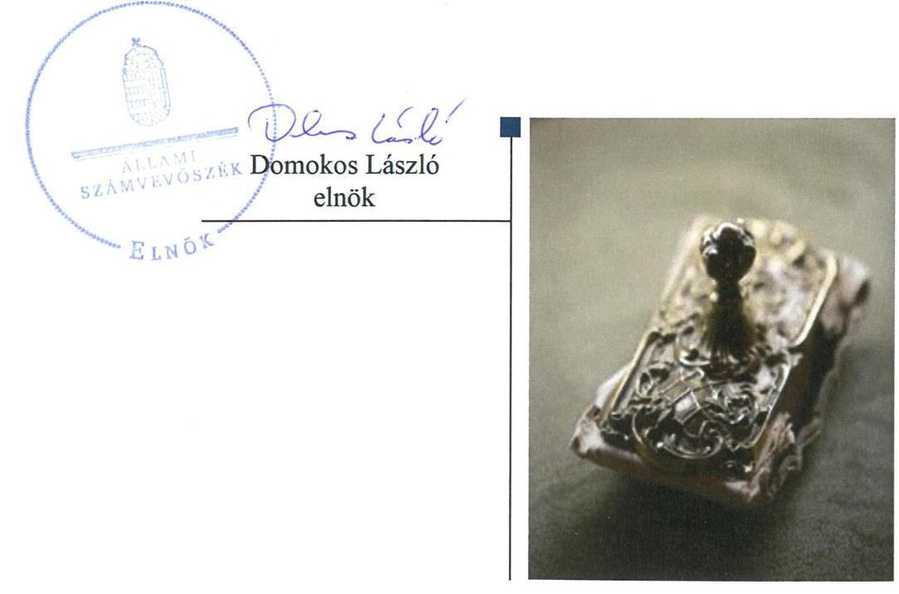
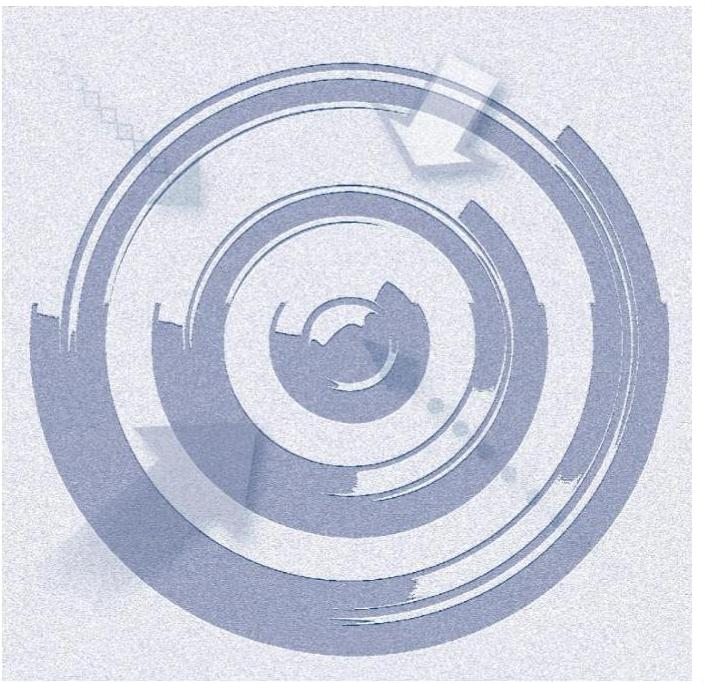
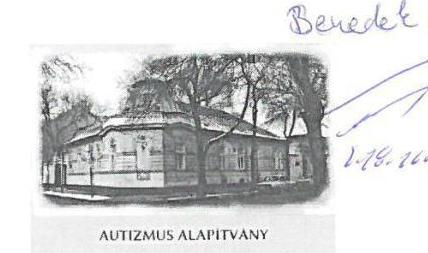
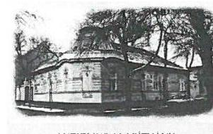
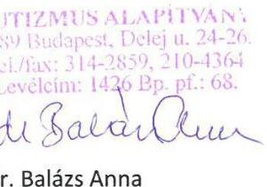
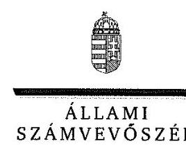
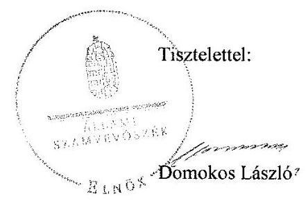

# Jelentés 

## Alapítványok ellenőrzése

Alapítványok gazdálkodásának ellenőrzése - Autizmus Alapítvány 2018. 11. hó 20. nap

---

# AZ ELLENŐRZÉST FELÜGYELTE:

DR. BENEDEK MÁRIA felügyeleti vezető

## AZ ELLENŐRZÉST VEZETTE ÉS A VÉGREHAJTÁSÁÉRT FELELŐS:

KUSZINGER ANDREA ellenőrzésvezető

## A PROGRAM ÖSSZEÁLLÍTÁSÁÉRT FELELŐS:

TÓTPÁL SZABOLCS osztályvezető

IKTATÓSZÁM: EL-0797-022/2018

TÉMASZÁM: 28

ELLENŐRZÉS-AZONOSÍTÓ SZÁM: V077512

Jelentéseink az Országgyűlés számítógépes hálózatán és az Interneten a www.asz.hu címen is olvashatóak.

---

# TARTALOMJEGYZÉK 

■ ÖSSZEGZÉS ..... 5
■ AZ ELLENŐRZÉS CÉLJA ..... 6
■ AZ ELLENŐRZÉS TERÜLETE ..... 7
■ AZ ELLENŐRZÉS HÁTTERE, INDOKOLTSÁGA ..... 8
■ A JELENTÉS LÉNYEGES KÉRDÉSKÖREI ..... 9
■ AZ ELLENŐRZÉS HATÓKÖRE ÉS MÓDSZEREI ..... 10
■ MEGÁLLAPÍTÁSOK ..... 12
■ JAVASLATOK ..... 17
■ MELLÉKLETEK ..... 19
I. sz. melléklet: Értelmező szótár ..... 19
■ FÜGGELÉK: ÉSZREVÉTELEK ..... 23
■ RÖVIDÍTÉSEK JEGYZÉKE ..... 33

---

.

---

# ÖSSZEGZÉS 

Az Állami Számvevőszék az Autizmus Alapítvány gazdálkodásának ellenőrzése során megállapította, hogy a gazdálkodására vonatkozó belső szabályozás nem felelt meg a jogszabályi előírásoknak, így az átlátható gazdálkodás kereteit nem biztosította. A 2014-2016. években az Autizmus Alapítvány a kapott támogatásokat szabályszerűen használta fel és a bevételek nyilvántartása szabályszerű volt. A kiadások elszámolása nem volt szabályszerű, az éves beszámolási kötelezettségét nem szabályszerűen teljesítette, ezáltal elszámoltathatósága nem volt biztosított. A közérdekű adatok jogszabályban előírt közzétételi kötelezettségének nem teljes körűen tett eleget, így a gazdálkodásának, valamint a közpénzek felhasználásának átláthatóságát nem biztosította.

## Az ellenőrzés társadalmi indokoltsága

Az alapítványok, mint az alapító által az alapító okiratban meghatározott tartós cél megvalósítására létrehozott jogi személyek tevékenységüket az alapító által juttatott vagyon kezelésével, felhasználásával látják el. Az alapítványok működésükre és szakmai tevékenységük ellátására költségvetési támogatásban vagy ingyenes vagyonjuttatásban részesülhetnek. Az Állami Számvevőszék stratégiájában megfogalmazta, hogy az államháztartáson kívülre nyújtott költségvetési támogatások és ingyenes vagyonjuttatások, valamint az államháztartáson kívül működő közfeladat-ellátó rendszerek ellenőrzéseivel hozzájárul ahhoz, hogy a közpénzeket az államháztartáson kívül működő szervezetek is átlátható, rendezett módon használják fel a közvagyon átlátható, hatékony, költségtakarékos működtetése, értékének megőrzése, állagának védelme, értéknövelő használata, hasznosítása és gyarapítása érdekében.

## Főbb megállapítások, következtetések, javaslatok

Az Autizmus Alapítvány számviteli politikája nem felelt meg a jogszabályi előírásoknak, számlarendet nem készített, ezáltal nem biztosította a közpénzekkel való átlátható gazdálkodás kereteit.

A jogszabályi előírások ellenére az adatok biztonságának, védelmének érvényre juttatásához szükséges eljárási szabályokat, és a kötelezően közzéteendő közérdekű adatok elektronikus közzétételi kötelezettség teljesítésének részletes szabályait belső szabályzatban nem állapította meg.

Az Autizmus Alapítvány a költségvetési támogatásokkal és egyéb adományokkal a jogszabályokban előírtak szerint szabályosan elszámolt. Kiadásainak elszámolása nem volt szabályszerű, mert a beruházások elszámolása a 2015. évben, az anyagjellegű ráfordítások elszámolása a 2014-2016. években nem felelt meg a jogszabályi előírásoknak.

Az Autizmus Alapítvány éves beszámolási kötelezettségét nem szabályszerűen teljesítette, mivel a 2014-2016. években a beszámolók mérlegtételeit leltárral nem támasztotta alá, eredménykimutatásában a támogatásokat és az adományokat nem mutatta be teljes körűen.

A 2014-2016. évi beszámolók közzétételét határidőben teljesítette, azonban a jogszabályi előírások ellenére az adatok védelmével és a közérdekű adatok nyilvánosságra hozatalával kapcsolatos kötelezettségének nem teljes körűen tett eleget, ezáltal nem biztosította a közpénzek felhasználásának átláthatóságát.

Az ÁSZ az ellenőrzés megállapításai alapján az Autizmus Alapítvány Kuratórium elnökének 11 javaslatot fogalmazott meg.

---

# AZ ELLENŐRZÉS CÉLJA

Az ellenőrzés célja annak megállapítása volt, hogy az alapítvány gazdálkodása során betartotta-e a vonatkozó jogszabályi előírásokat, szabályszerűen használta-e fel a kapott költségvetési támogatásokat, az alapítvány működését szolgáló ellenőrzési és nyilvántartási rendszerek szabályszerűen működtek-e.

---

# AZ ELLENŐRZÉS TERÜLETE

### Autizmus Alapítvány

**AUTIZMUS ALAPÍTVÁNY**

Az Autizmus Alapítványt 1989. február 20-án 1 078 E Ft induló vagyonnal egy magánszemély hozta létre határozatlan időre. Az Autizmus Alapítvány célja az autista gyermekek, serdülők és felnőttek jobb gondozását lehetővé tevő elméleti és gyakorlati feladatok támogatása, az autizmus jobb megértését szolgáló vizsgálatok végzése, szakember képzés, ismeretterjesztés, autista fogyatékos személyek jogai, esélyegyenlősége kialakítása, javítása.

Alapító okirata, illetve Szervezeti és Működési Szabályzata szerint az Autizmus Alapítvány országos hatókörű, kiemelkedően közhasznú feladatokat ellátó nonprofit szervezet, amely közfeladatot látott el. A 2014-2016. években összesen 8519 aktív gondozottat látott el, és az akkreditált pedagógus képző tanfolyamain 863 főt oktatott.

A 2014-2016. években az Autizmus Alapítvány az államháztartásból ingyenesen juttatott vagyont nem kapott, saját tulajdonú ingatlannal rendelkezett. Az Autizmus Alapítvány gazdasági-vállalkozási tevékenységet 2014. évben végzett, gazdasági társaságban részesedéssel nem rendelkezett, továbbá nem tartozott a kormányzati szektorba sorolt egyéb szervezetek közé. Az Autizmus Alapítvány a 2014-2016. évi beszámolói alapján államháztartási és azon kívüli forrásból összesen 443,8 millió Ft támogatást számolt el közfeladatainak ellátásához.

Az államháztartásból és egyéb forrásból kapott támogatásokat az 1. ábra szemlélteti.

1. ábra

| AZ ALAPÍTVÁNY AZ ÁLLAMHÁZTARTÁSBÓL ÉS EGYÉB FORRÁSBÓL KAPOTT TÁMOGATÁSAI 2014-2016. ÉVEKBEN (M FT) |  |  |   |
|---|---|---|---|
|   | 2014. | 2015. | 2016.  |
|  Normatív támogatás - köznevelési feladatok ellátása | 30,7 | 34,3 | 41,4  |
|  Normatív támogatás - nappali intézményi ellátás | 3,8 | 3,6 | 6  |
|  Országos Egészségbiztosítási Pénztár – gondozó intézeti feladatok ellátása | 50,6 | 54,6 | 53,5  |
|  EMMI ¹ - működési támogatás | 35,0 | 30,8 | 30,8  |
|  EMMI – kiegészítő támogatás pályázat útján | 1,2 | 2,6 | 2,8  |
|  Személyi jövedelemadó meghatározott részének az adózó rendelkezése szerint felajánlott összegekből származó bevétel | 2,5 | 2,8 | 3,1  |
|  Egyéb adományok | 1,5 | 0,4 | 0,4  |
|  Gazdálkodó szervezetektől, magánszemélyektől származó adomány | 17,0 | 17,4 | 17,0  |
|  Összesen: | 142,3 | 146,5 | 155,0  |

*Forrás: 2014-2016. évi beszámolók*

---

# AZ ELLENŐRZÉS HÁTTERE, INDOKOLTSÁGA 

Társadalmi elvárás a közpénzek értékelvű, rendeltetésszerű felhasználása, a közpénzekből nyújtott támogatások átláthatóságának megteremtése, amelyhez az Állami Számvevőszék az államháztartásból nyújtott támogatások ellenőrzésével kíván hozzájárulni. Az ÁSZ ² Stratégiájában rögzített célkitűzése, hogy az államháztartáson kívülre nyújtott költségvetési támogatások és az ingyenes vagyonjuttatás ellenőrzésével hozzájáruljon ahhoz, hogy a közpénzeket a civil szervezetek is átlátható módon használják fel. Továbbá az alapítványok és közalapítványok gazdálkodása szabályszerűségének bemutatásával hozzájárul ahhoz, hogy a társadalom objektív képet alkothasson az alapítványok, a közalapítványok működéséről.

Az ellenőrzés eredményeinek célzott felhasználói a nyilvánosság, a jogalkotó, továbbá az alapítványok alapítói és szervei. Az ellenőrzés eredményeképp a törvényalkotás számára tapasztalatok állnak rendelkezésre az alapítványok gazdálkodása szabályozásához. Az ellenőrzött szervezetek szintjén gazdálkodásuk vonatkozásában a hiányosságok, szabálytalanságok feltárása, az ennek kapcsán megfogalmazott megállapítások elősegíthetik az alapítványok szabályszerű gazdálkodását, míg a társadalom számára információt szolgáltat arról, hogy az alapítványok a közpénzeket szabályszerűen használták-e fel. Az alapítványok és a közalapítványok gazdálkodása szabályszerűségének bemutatásával az ellenőrzés értékteremtő módon járul hozzá az ÁSZ stratégiai céljainak megvalósításához, a nyilvánosság megfelelő tájékoztatásához.

---

# A JELENTÉS LÉNYEGES KÉRDÉSKÖREI 

1. Az Alapítvány gazdálkodása szabályszerű volt-e?
2. Az Alapítvány szabályszerűen használta-e fel a kapott támogatásokat?
3. Az Alapítvány működését szolgáló nyilvántartási és ellenőrzési rendszereket szabályszerűen működtette-e, valamint a beszámolási kötelezettségét teljesítette-e?

---

# AZ ELLENŐRZÉS HATÓKÖRE ÉS MÓDSZEREI 

## Az ellenőrzés típusa

Szabályszerűségi ellenőrzés

## Az ellenőrzött időszak

2014-2016. évek. Az ellenőrzés kiterjedt az ellenőrzött éveket érintő, de az azt megelőzően a költségvetéssel, valamint az ellenőrzött időszakot követően a beszámolással kapcsolatban hozott döntések dokumentumaira is. Amennyiben az ellenőrzött időszakon belül történt támogatás felhasználás, azonban annak elszámolására 2016. évet követően került sor, az elszámolást - tekintettel arra, hogy az az ellenőrzött időszakra vonatkozik - is ellenőrizni kellett.

## Az ellenőrzés tárgya

Az ellenőrzés tárgya az alapítvány vonatkozó jogszabályi előírások szerinti gazdálkodási tevékenysége volt. Ezen belül az alapítvány a gazdálkodásához kapcsolódó szervezeti és szabályozási kereteinek a jogszabályi előírásoknak megfelelő kialakítása, a kapott költségvetési és egyéb támogatások, szabályszerű felhasználására irányuló tevékenysége. Az ellenőrzés kiterjedt továbbá az alapítvány működését, gazdálkodását szolgáló nyilvántartási és ellenőrzési tevékenységére.

## Az ellenőrzött szervezet

Autizmus Alapítvány

## Az ellenőrzés jogalapja

Az ÁSZ tv³. 1. § (3) bekezdése, 5. § (3) bekezdése, továbbá az Ectv⁴. 47. §-a.

## Az ellenőrzés módszerei

Az ÁSZ az ellenőrzést a szakmai program szempontjai, az ellenőrzött időszakban hatályos jogszabályok, a jelen ellenőrzésre irányadó ÁSZ módszertan figyelembe vételével és a nemzetközi standardokat irányadónak tekintve végezte el.

---

Az ellenőrzés ideje alatt az ellenőrzött szervezettel történő kapcsolattartás az ÁSZ SZMSZ⁵-ének vonatkozó előírásai alapján történt.

Az ellenőrzési kérdések megválaszolásához szükséges bizonyítékok megszerzése az ellenőrzött által rendelkezésre bocsátott dokumentumokra, adatokra alapozva megfigyelés, szemle (szemrevételezés), kérdésfeltevés (információkérés), mintavételezés, valamint elemző eljárás útján történt. A mintavételezés véletlen mintavételi eljárással történt.

Az ellenőrzési bizonyítékként felhasználható adatforrások közé tartoztak egyrészt a szakmai program részletes szempontjainál felsorolt adatforrások, másrészt minden egyéb -az ellenőrzés folyamán - feltárt, az ellenőrzés szempontjából információt tartalmazó dokumentum.

Az ellenőrzés lefolytatásához az ellenőrzött a tanúsítványok kitöltésével, hitelesítésével és azok, valamint az ÁSZ által kért dokumentumok megküldésével szolgáltatott adatokat. Az így rendelkezésre bocsátott adatok, információk, a tanúsítványok adatai valódiságának kontrollja az ellenőrzés keretében történt.

Mintavétellel ellenőriztük a beruházások és felújítások; az alapcélra fordított kiadások és ráfordítások elszámolásának szabályszerűségét a legalább 100 E Ft értékű tételek esetében. Mintavétellel ellenőriztük továbbá az alapítvány beszámolóinál a mérlegtételek besorolását, év végi értékelését, azok leltárral való alátámasztottságát. A minta alapján a sokaságban előforduló hibaarányt becsültük. „Szabályszerűnek" értékeltünk egy ellenőrzött területet, amennyiben 95\%-os bizonyossággal a teljes sokaságban a hibaarány legfeljebb 10\%, „nem szabályszerűnek", amennyiben 10\%-nál magasabb arányt képviselt.

---

# 1. Az Alapítvány gazdálkodása szabályszerű volt-e? 

## Összegző megállapítás

### 1.1. számú megállapítás

Az Alapítvány gazdálkodása nem volt szabályszerű.

Az Alapítvány gazdálkodása szervezeti kereteinek kialakítása szabályszerű volt.

Az Alapítvány⁶ a 2014-2016. években rendelkezett a jogszabályi előírásoknak megfelelő Alapító okirat₁₂⁷-vel.

Az Alapítvány SZMSZ⁸-ében rendelkezett a munkaszervezetének szervezeti rendjéről, meghatározta a szervezeti egységek tevékenységi körét. Az Alapítvány a Civilszr.⁹-ben foglalt előírások szerint alakította ki a könyvvezetési és beszámolási rendszerét. Az Alapító okirat₁₂-ben foglalt előírás szerint létrehozta az FB¹⁰-t.

Az FB működésével kapcsolatban feltárt hiányosságot az 1. táblázat mutatja.

## AZ FB MŰKÖDÉSÉVEL KAPCSOLATBAN FELTÁRT HIÁNYOSSÁG

Sorszám Részmegállapítás
Megjegyzés

1. Az FB az Ectv.₁₂ 40. § (2) bekezdése ellenére a 2014-2016. években működési rendjét nem állapította meg.

Forrás: ÁSZ
1.2. számú megállapítás

Az Alapítvány gazdálkodására vonatkozó belső szabályozás nem volt szabályszerű.

Az Alapítvány elkészítette a Számv. tv.¹¹-ben előírt számviteli politika¹²₁₂-t és annak keretében kötelezően előírt szabályzatokat¹³. Az Alapító az Alapító okirat₁₂-ben, valamint az SZMSZ-ben meghatározta a gazdálkodási jogköröket.

Az Alapítvány gazdálkodására vonatkozó belső szabályozással kapcsolatosan feltárt hiányosságokat a 2. táblázat mutatja.
2. táblázat

## AZ ALAPÍTVÁNY GAZDÁLKODÁSÁRA VONATKOZÓ BELSŐ SZABÁLYOZÁSSAL KAPCSOLATOSAN FELTÁRT HIÁNYOSSÁGOK

Sorszám Részmegállapítás
Megjegyzés

1. Az Alapítvány a
 Számv. tv. 14. § (4) bekezdésében foglaltak ellenére a Számviteli politika ${ }_{1}$-ben nem határozta meg, hogy a választási, minősítési lehetőségek esetében alkalmazott gyakorlatot milyen okok miatt kell megváltoztatni.
2. Az Alapítvány a Számv. tv. 14. § (11) bekezdésével ellentétesen a Számviteli politika ${ }_{1}$ben a jelentős összegű hiba fogalmával kapcsolatos törvénymódosításokból adódó változásokat, annak hatálybalépését követő 90 napon belül nem vezette át.
3. Az Alapítvány a Számv. tv. 161. § (1) bekezdésében foglaltak ellenére a 2014-2016. években nem készített számlarendet.

---

Az adatbiztonság és a közzétételi kötelezettségek szabályozása vonatkozásában feltárt hiányosságokat a 3. táblázat tartalmazza.
3. táblázat

# AZ ADATBIZTONSÁG ÉS A KÖZZÉTÉTELI KÖTELEZETTSÉGEK SZABÁLYOZÁSA VONATKOZÁSÁBAN FELTÁRT HIÁNYOSSÁGOK 

| Sorszám | Részmegállapítás | Megjegyzés |
| :--: | :--: | :--: |
| 1. | Az Alapítvány az Info. tv. ${ }^{14}$ 7. § (2) bekezdésében foglalt előírás ellenére 2014-2016. években nem alakította ki az Info. tv., valamint az egyéb adat- és titokvédelmi szabályok érvényre juttatásához szükséges eljárási szabályokat. |  |
| 2. | Az Alapítvány az Info. tv. 30. § (6) bekezdése ellenére nem készítette el 2014-2016. évekre vonatkozóan a közérdekű adatok megismerésére irányuló igények teljesítésének rendjét rögzítő szabályzatot. |  |
| 3. | Az Alapítvány az Info. tv. 35. § (3) bekezdésének előírása ellenére a 2014-2016. évekre a kötelezően közzéteendő közérdekű adatok elektronikus közzétételi kötelezettségének teljesítéséről szóló részletes szabályokat belső szabályzatban nem állapította meg. |  |

Forrás: ÁSZ

## 1.3. számú megállapítás

A költségvetés tervezése során az Alapítvány szabályszerűen járt el.
Az Alapítvány a 2014-2016. években rendelkezett költségvetési tervekkel, betartotta az Ecvhr. ${ }^{15}$-ben előírtakat, mivel a kiadásokat és a bevételeket egymással egyensúlyban tervezte meg. A költségvetési terveket a Civilszr. alapján készített beszámoló tartalmi elemeinek megfelelően készítette el.

### 1.4. számú megállapítás

Az Alapítvány kiadásainak elszámolása nem volt szabályszerű.
Az Alapítvány gazdasági, vállalkozási tevékenységet a 2014. év kivételével nem végzett, befektetésekkel nem rendelkezett.

A kiadások elszámolásával kapcsolatban feltárt hiányosságokat az 4. táblázat mutatja be.
4. táblázat

## A KIADÁSOK ELSZÁMOLÁSÁVAL KAPCSOLATBAN FELTÁRT HIÁNYOSSÁGOK

| Sorszám | Részmegállapítás | Megjegyzés |
| :--: | :--: | :--: |
| 1. | Az Alapítvány a Számv. tv. 165. § (1) és (2) bekezdésében foglaltak ellenére a 2015. évben a 100 E Ft feletti tárgyi eszköz beszerzés adatait szabályszerűen kiállított bizonylat nélkül jegyezte be könyvviteli nyilvántartásába. | Az Alapítványnál a 2014. és a 2016. évben 100 E Ft feletti tárgyi eszköz beszerzés nem volt. |
| 2. | Az Alapítvány a Számv. tv. 52. § (2) bekezdésében előírtak ellenére a 2015. évben hitelt érdemlő módon nem dokumentálta a 100 E Ft feletti tárgyi eszközeinek üzembe helyezését. | Az Alapítványnál a 2014. és a 2016. évben 100 E Ft feletti tárgyi eszköz beszerzés nem volt. |
| 3. | Az Alapítvány a Számv. tv. 167. § (1) bekezdés c) pontjában előírtak ellenére a 2014-2016. években az anyagjellegű ráfordítások könyvviteli elszámolását közvetlenül alátámasztó bizonylatai nem tartalmazták a gazdasági műveletet elrendelő személy, szervezet megjelölését, az utalványozó, és a végrehajtást igazoló személy aláírását, továbbá az SZMSZ B. fejezet 1. pontja által előírt ellenjegyző igazolását. |  |
| 4. | Az Alapítvány a Számv. tv. 167. § (1) bekezdés h) pontja ellenére a 2014-2016. években a számviteli bizonylatokon nem szerepeltette a könyvelés módjára, az érintett könyvviteli számlákra történő hivatkozást. |  |
| 5. | Az Alapítvány az Ectv. 1. 20. §-ában foglaltak ellenére a 2014. évben költségeit és ráfordításait elkülönítetten, a számviteli előírások szerint nem tartotta nyilván. | Az Alapítvány az Ectv ${ }_{1,2}$ előírásainak megfelelően a 2015-2016. években költségeit és ráfordításait elkülönítetten, a számviteli előírások szerint tartotta nyilván. |

---

# 2. Az Alapítvány szabályszerűen használta-e fel a kapott támogatásokat? 

## Összegző megállapítás

### 2.1. számú megállapítás

## Az Alapítvány a kapott támogatásokat szabályszerűen használta fel.

## A költségvetési támogatások felhasználása, elszámolása szabályszerű volt.

Az Alapítvány az alapcél szerinti bevételeit az Ectv ${ }_{1,2}$. előírásai szerint elkülönítette.

Elszámolási kötelezettségének az Alapítvány 2014-2016. években a támogatókkal kötött közszolgáltatási szerződésekben, támogatási szerződésekben előírtaknak megfelelően határidőben eleget tett, a pénzügyi elszámolásokat és szakmai beszámolókat a támogatók elfogadták. Az Alapítvány bevételi és ráfordítás adatait a 2. ábra mutatja.

A kapott támogatások cél szerinti felhasználását az Alapítvány az Ectv. ${ }_{1,2}$-ben előírtaknak megfelelően a 2014-2016. évi beszámolóiban bemutatta.
2.2. számú megállapítás

Az Alapítványnál az alapcélhoz kapott egyéb adomány felhasználása, elszámolása, nyilvántartása a jogszabályi és az alapítói előírások alapján szabályszerű volt.

A 2014-2016. években kapott adományok ${ }^{16}$ számviteli nyilvántartása és elszámolása az Alapítványnál megfelelt az Ectv ${ }_{1,2}$. előírásainak.

Az Alapítvány a 2014-2016. években a kapott adományokat a Számv. tv., valamint a Civilszr. előírásai szerint az egyéb bevételek között számolta el. Az Alapítvány egy adományozó felé a 600 E Ft értékű szerződésben vállalt jelentéstételi kötelezettségének 2015-ben nem tett eleget. Más adományozó felé szerződésben, illetve jogszabályban előírt elszámolási kötelezettsége nem volt.

---

# 3. Az Alapítvány működését szolgáló nyilvántartási és ellenőrzési rendszereket szabályszerűen működtette-e, valamint a beszámolási kötelezettségét teljesítette-e? 

Összegző megállapítás

Az Alapítvány a működését szolgáló nyilvántartási rendszereket nem szabályszerűen működtette, valamint a beszámolási kötelezettségét nem szabályszerűen teljesítette.

### 3.1. számú megállapítás

Az Alapítvány a 2014-2016. évi beszámolóit közzétette, azonban a beszámolók mérlegtételeit leltárral nem támasztotta alá. A közérdekű adatok nyilvánosságra hozatalával kapcsolatos törvényi kötelezettségének a 2014-2016. években nem teljes körűen tett eleget.

Az Alapítvány a számviteli beszámolási kötelezettségét az Ectv. 1,2 és a Civilszr.-ben foglaltak szerint teljesítette. Az FB az Alapítvány 2014-2016. évi beszámolóit megtárgyalta, azokat a Kuratóriumnak ${ }^{17}$ elfogadásra javasolta. A Kuratórium az Alapítvány 2014-2016. évi beszámolóit, valamint közhasznúsági mellékleteit az előírt határidőig határozataiban ${ }^{18}$ elfogadta, annak ellenére, hogy a beszámolók mérlegtételeit leltárral nem támasztotta alá.

Az Alapítvány a 2014-2016. évi beszámolóit és mellékleteit a Civilszr. előírásai szerint meghatározott formában, határidőben letétbe helyezte és közzétette.

Az Alapítvány az Ecvhr. 2. § (2) bekezdésében foglalt előírások szerint a honlapján tájékoztatást adott a működéséről, az adományok felhasználásáról.

A számviteli beszámolók összeállítása és a közérdekű adatok közzétételével kapcsolatosan feltárt hiányosságokat az 5. táblázat tartalmazza.
5. táblázat

## A SZÁMVITELI BESZÁMOLÓK ÖSSZEÁLLÍTÁSA ÉS A KÖZÉRDEKŰ ADATOK KÖZZÉTÉTELÉVEL KAPCSOLATOSAN FELTÁRT HIÁNYOSSÁGOK

| Sorszám | Részmegállapítás | Megjegyzés |
| :--: | :--: | :--: |
| 1. | Az Alapítvány a Számv. tv. 69. § (1) és (2) bekezdésében foglaltak ellenére a 2014-2016. évi beszámolók mérlegtételeit leltárral nem támasztotta alá, a főkönyvi könyvelés és az analitikus nyilvántartások adatai közötti egyeztetést az üzleti év mérlegfordulónapjára vonatkozóan nem végezte el, ezáltal megsértette a Számv. tv. 15. § (3) bekezdése szerinti valódiság elvét. |  |
| 2. | Az Alapítvány a könyvviteli elszámolást alátámasztó 2014-2015. évi bizonylatai a Számv. tv. 167. § 1) bekezdés a)-d) pontjában, továbbá a 2016. évi bizonylatai a Számv. tv. 167. § 1) bekezdés a), c)-d) pontjában előírt általános alaki és tartalmi kellékeket nem tartalmazták. |  |
| 3. | Az Alapítvány a Civilszr. 16. § (7) bekezdésében foglaltak ellenére a 2014-2016. években a továbbutalási céllal kapott támogatásokat eredménykimutatásában elkülönítetten nem mutatta be. |  |
| 4. | Az Alapítvány az Ectv. 1,2 29. § (2) bekezdés c) pontja és a 29. § (4) bekezdésében foglaltak ellenére a 2014-2016. évi beszámolók kiegészítő mellékleteiben támogatásonként nem mutatta be a gazdálkodó szervezetektől kapott adományokat, illetve azok felhasználását. |  |
| 5. | Az Alapítvány az Info. tv. 33. § (3) bekezdés alapján az Info. tv. 37. § (1) bekezdésében hivatkozott Info. tv. 1. melléklete szerinti általános közzétételi lista I/11., II/1., II/13., III/2 pontjaiban meghatározott adatokat nem tette közzé. |  |

---

# 3.2. számú megállapítás Az Alapítványt érintő külső ellenőrzések szabálytalanságot nem tártak fel. 

2015. évben az EMMI ellenőrizte a 2014-ben megkötött támogatási szerződés alapján kiutalt támogatás cél szerinti felhasználását, az ellenőrzés alapján javaslattételre nem volt szükség.

2015-ben és 2016-ban a Kincstár ${ }^{19}$ ellenőrizte az Alapítványt, mint egy köznevelési intézmény és egy szociális intézmény fenntartóját, az ellenőrzések hiányosságot nem állapítottak meg.

---

# JAVASLATOK 

Az ÁSZ tv. 33. § (1) bekezdésében foglaltak értelmében az ellenőrzött szervezet vezetője köteles a jelentésben foglalt megállapításokhoz kapcsolódó intézkedési tervet összeállítani és azt a jelentés kézhezvételétől számított 30 napon belül az ÁSZ részére megküldeni. Amennyiben az ellenőrzött szervezet vezetője nem küldi meg határidőben az intézkedési tervet, vagy továbbra sem elfogadható intézkedési tervet küld, az Állami Számvevőszék elnöke az ÁSZ tv. 33. § (3) bekezdése a) és b) pontjaiban foglaltakat érvényesítheti.

## A Kuratórium elnökéhez

1. Intézkedjen arról, hogy Ectv.-ben előírtaknak megfelelően az FB ügyrendjét állapítsa meg.
(1. táblázat 1. sz. megállapítás alapján)
2. Intézkedjen a Számv. tv. előírásának megfelelően számlarend készítéséről.
(2. táblázat 3. sz. megállapítás alapján)
3. Intézkedjen az Info. tv.-ben foglaltaknak megfelelően,
a) a közérdekű adatok megismerésére irányuló igények teljesítésének rendjét rögzítő szabályzat elkészítéséről,
b) a kötelezően közzéteendő közérdekű adatok elektronikus közzétételi kötelezettségének teljesítése részletes szabályainak belső szabályzatban történő megállapításáról.
(3. táblázat 2-3. sz. megállapítások alapján)
4. Intézkedjen a Számv. tv. előírásának megfelelően arról, hogy minden gazdasági eseményről bizonylat készüljön és ezen bizonylatok adatai kerüljenek a könyvviteli nyilvántartásokban rögzítésre, továbbá a számviteli nyilvántartásokba csak szabályszerűen kiállított bizonylatok alapján jegyezzenek be adatokat.
(4. táblázat 1. sz. megállapítás alapján)
5. Intézkedjen a Számv. tv. előírásának megfelelően a 100 E Ft feletti tárgyi eszközök üzembe helyezése hitelt érdemlő módon történő dokumentálásáról.
(4. táblázat 2. sz. megállapítás alapján)

---

6. Intézkedjen arról, hogy a Számv. tv. előírásának megfelelően
a) az anyagjellegű ráfordítások könyvviteli elszámolását közvetlenül alátámasztó bizonylatok tartalmazzák a gazdasági műveletet elrendelő személy, szervezet megjelölését, az utalványozó, és a végrehajtást igazoló személy aláírását, továbbá az SZMSZ-ben előírtak szerint az ellenjegyző igazolását.
b) a könyvviteli elszámolást közvetlenül alátámasztó bizonylatokon szerepeljen a könyvelés módjára, az érintett könyvviteli számlákra történő hivatkozás.
(4. táblázat 3-4. sz. megállapítás alapján)
7. Intézkedjen a Számv. tv. előírásának megfelelően
a) a beszámoló mérlegtételeinek alátámasztásához leltár összeállításáról,
b) a főkönyvi könyvelés és az analitikus nyilvántartások adatai közötti egyeztetés az üzleti év mérlegfordulónapjára vonatkozó elvégzéséről,
c) a valódiság elvének érvényesítéséről.
(5. táblázat 1. sz. megállapítás alapján)
8. Intézkedjen arról, hogy a könyvviteli elszámolást alátámasztó bizonylatok a Számv. tv. előírásának megfelelően teljes körűen tartalmazzák az általános alaki és tartalmi kellékeket.
(5. táblázat 2. sz. megállapítás alapján)
9. Intézkedjen arról, hogy a Civilszr. előírásának megfelelően az Alapítvány a továbbutalási céllal kapott támogatásokat eredménykimutatásában elkülönítetten mutassa be.
(5. táblázat 3. sz. megállapítás alapján)
10. Intézkedjen arról, hogy az Ectv. előírásának megfelelően az Alapítvány beszámolója kiegészítő mellékletében mutassa be támogatásonként a gazdálkodó szervezetektől kapott adományokat, illetve azok felhasználását.
(5. táblázat 4. sz. megállapítás alapján)
11. Intézkedjen
 az Info tv. 1. melléklete szerinti általános közzétételi lista I/11., II/1., II/13., és III/2. pontjaiban meghatározott adatok jogszabályi előírásoknak megfelelő közzétételéről.
(5. táblázat 5. sz. megállapítás alapján)

---

# MELLÉKLETEK 

- I. SZ. MELLÉKLET: ÉRTELMEZŐ SZÓTÁR
alapító
alapítvány
adomány
államháztartás

Az alapítványt, mint jogi személyt az alapító okiratban meghatározott tartós cél folyamatos megvalósítására létrehozó, az alapítvány részére az alapító okiratban meghatározott, az alapítványi cél megvalósításához szükséges pénzbeli és nem pénzbeli vagyoni hozzájárulást teljesítő személy(ek)/jogi személy(ek). (Forrás: Ptk. 2 3:378. §, 3:382. § (2) bek.)
Magánszemély, jogi személy és jogi személyiséggel nem rendelkező gazdasági társaság (a továbbiakban együtt: alapító) - tartós közérdekű célra - alapító okiratban alapítványt hozhat létre. Alapítvány elsődlegesen gazdasági tevékenység folytatása céljából nem alapítható. Az alapítvány javára a célja megvalósításához szükséges vagyont kell rendelni. Az alapítvány jogi személy. Az alapítvány a bírósági nyilvántartásba vételével jön létre. (Forrás: Ptk. 2 74/A. § (1) - (2) bekezdés)
Az alapítvány az alapító által az alapító okiratban meghatározott tartós cél folyamatos megvalósítására létrehozott jogi személy. Az alapító az alapító okiratban meghatározza az alapítványnak juttatott vagyont és az alapítvány szervezetét. Alapítvány nem alapítható gazdasági-vállalkozási tevékenység folytatására. Az alapítvány az alapítványi cél megvalósításával közvetlenül összefüggő gazdasági tevékenység végzésére jogosult. Alapítvány nem lehet korlátlan felelősségű tagja más jogalanynak, nem létesíthet alapítványt és nem csatlakozhat alapítványhoz. (Forrás: Ptk. 3 3:378§, 3:379. § (1) - (3) bekezdés)
a civil szervezetnek - létesítő/alapító okiratban rögzített céljaira - ellenszolgáltatás nélkül juttatott eszköz, illetve nyújtott szolgáltatás (Forrás: Ectv. 2. § 1. pont)
az a pénzbeli vagy természetbeni juttatás, amelyet az adományozó az adományozott civil szervezet alapcéljának, illetve közhasznú céljának elérésére ellenszolgáltatás nélkül juttat (Forrás: Ecvhr. 1. § (5) bekezdés a) pont)
a közhasznú szervezet részére törvényben meghatározott közhasznú tevékenysége támogatására, valamint az egyházi jogi személy részére törvényben meghatározott tevékenysége támogatására, továbbá a közérdekű kötelezettségvállalás céljára az adóévben visszafizetési kötelezettség nélkül adott támogatás, juttatás, térítés nélkül átadott eszköz könyv szerinti értéke, térítés nélkül nyújtott szolgáltatás bekerülési értéke, feltéve hogy az nem jelent az e törvényben meghatározottakon túl vagyoni előnyt az adományozónak, az adományozó tagjának vagy részvényesének, vezető tisztségviselőjének, felügyelőbizottsága vagy igazgatósága tagjának, könyvvizsgálójának, illetve ezen személyek vagy a természetes személy tag vagy részvényes közeli hozzátartozójának azzal, hogy nem minősül vagyoni előnynek az adományozó nevére, tevékenységére történő utalás (Forrás: a társasági adóról és az osztalékadóról szóló 1996. évi LXXXI. törvény 4. § 1/a. pont)
az államháztartás a közfeladatok ellátásának egységes szervezeti, tervezési, gazdálkodási, ellenőrzési, finanszírozási, adatszolgáltatási és beszámolási szabályok szerint működő rendszere, amely központi és önkormányzati alrendszerből áll.
Az államháztartás központi alrendszerébe tartozik az állam, a központi költségvetési szerv, a törvény által az államháztartás központi alrendszerébe sorolt köztestület, és ezen köztestület által irányított köztestületi költségvetési szerv.
Az államháztartás önkormányzati alrendszerébe tartozik a helyi önkormányzat, a helyi nemzetiségi önkormányzat és az országos nemzetiségi önkormányzat, a Mötv. és a nemzetiségek jogairól szóló 2011. évi CLXXIX. törvény szerint létrehozott társulás, valamint a területfejlesztésről és a területrendezésről szóló törvény alapján létrejött

---

államháztartásból származó forrás
beruházás
civil szervezet

Felügyelőbizottság
felújítás
gazdálkodó tevékenység
gazdasági-vállalkozási tevékenység
területfejlesztési önkormányzati társulás, a térségi fejlesztési tanács, és a megnevezett szervezetek által irányított költségvetési szerv. (Forrás: Áht. 2-3. §)
az államháztartás központi és önkormányzati alrendszeréből származó forrás
A tárgyi eszköz beszerzése, létesítése, saját vállalkozásban történő előállítása, a beszerzett tárgyi eszköz üzembe helyezése. A beruházás a meglévő tárgyi eszköz bővítését, rendeltetésének megváltoztatását, átalakítását, élettartamának, teljesítőképességének közvetlen növelését eredményező tevékenység. (Forrás: Számv. tv. 3. § (4) bekezdés 7. pont)

2014. március 15-ig: a civil társaság, illetve a Magyarországon nyilvántartásba vett egyesület - a párt kivételével -, valamint az alapítvány. Civil szervezet alatt az e törvény II-VI. és VIII-X. fejezetében a civil társaságot, továbbá a VII-X. fejezetében a kölcsönös biztosító egyesületet és a szakszervezetet nem kell érteni. (Forrás: Ectv. 2. § 6. pont)

2014. március 15-től: a civil társaság; a Magyarországon nyilvántartásba vett egyesület - a párt, a szakszervezet és a kölcsönös biztosító egyesület kivételével és - a közalapítvány és a pártalapítvány kivételével - az alapítvány. (Forrás: Ectv. 2. § 6. pont)
Az alapítók a létesítő okiratban három tagból álló felügyelőbizottságot hozhatnak létre, azzal a feladattal, hogy az ügyvezetést a jogi személy érdekeinek megóvása céljából ellenőrizze. (Forrás: Ptk. 3 :36-3:28 §)
Az elhasználódott tárgyi eszköz eredeti állaga (kapacitása, pontossága) helyreállítását szolgáló időszakonként visszatérő olyan tevékenység, melynek során az eszköz élettartama megnövekszik, minősége, használata jelentősen javul, így a pótlólagos ráfordításból a jövőben gazdasági előnyök származnak. (Forrás: Számv. tv. 3. § (4) 8. pont) azon tevékenységek összessége, amelyek a civil szervezet vagyoni, pénzügyi, jövedelmi helyzetére kiható gazdasági eseményt eredményeznek. (Forrás: Ectv. 2. § 10. pont)
A jövedelem- és vagyonszerzésre irányuló vagy azt eredményező, üzletszerűen végzett gazdasági tevékenység, kivéve az adomány (ajándék) elfogadását, a létesítő okiratban meghatározott cél szerinti tevékenységet (ideértve a közhasznú tevékenységet is), - 2015. november 28-tól - a pénzeszközök betétbe, értékpapírba, társasági részesedésbe történő elhelyezését és az ingatlan megszerzését, használatának átengedését és átruházását. (Forrás: Ectv. 2. § 11. pont)
Az Autizmus Alapítvány által fenntartott: Autizmus Alapítvány Általános Iskolája, Az Autizmus Alapítvány Nappali Ellátást Nyújtó Intézménye valamint Az Autizmus Alapítvány Ambulanciája gondozói intézete
az államháztartás alrendszerei terhére nyújtott pénzbeli vagy nem pénzbeli juttatás, amelyet a támogató nem elsősorban ellenszolgáltatás ellenében, de konkrét program megvalósítása vagy meghatározott időszakban a támogatott szervezet működtetése érdekében nyújt. Költségvetési támogatás különösen: a pályázat útján, valamint egyedi döntéssel kapott költségvetési támogatás; az Európai Unió strukturális alapjaiból, illetve a Kohéziós Alapból származó, a költségvetésből juttatott támogatás; az Európai Unió költségvetéséből vagy más államtól, nemzetközi szervezettől származó támogatás és a személyi jövedelemadó meghatározott részének az adózó rendelkezése szerint felajánlott összege. (Forrás: Ectv. 2. § 15. pont)
minden olyan tevékenység, amely a létesítő okiratban megjelölt közfeladat teljesítését közvetlenül vagy közvetve szolgálja, ezzel hozzájárulva a társadalom és az egyén közös szükségleteinek kielégítéséhez. (Forrás: Ectv. 2. § 20. pont)

---

vagyoni hozzájárulás

Az alapítvány alapítója által az alapításkor az alapítvány részére teljesítendő olyan hozzájárulás, amelynek értékét nem lehet visszakövetelni. Az alapító által az alapítvány rendelkezésére bocsátott vagyon pénzből és nem pénzbeli vagyoni hozzájárulásból állhat. Az alapítónak legalább az alapítvány működésének megkezdéséhez szükséges vagyont a nyilvántartásba-vételi kérelem benyújtásáig át kell ruháznia az alapítványra. Az alapítónak a teljes juttatott vagyont legkésőbb az alapítvány nyilvántartásba vételétől számított egy éven belül kell átruháznia az alapítványra. (Forrás: Ptk. 3:9. § (1) bek., 3:10. § (1) bek., 3:382. § (2)-(3) bek.)

---

.

---

# FÜGGELÉK: ÉSZREVÉTELEK 

A jelentéstervezetet a Számvevőszék 15 napos észrevételezésre megküldte az ellenőrzött szervezet vezetőjének az ÁSZ tv. 29. § (1) bekezdése előírásának megfelelően.

A függelék tartalmazza az ellenőrzött észrevételeit, illetve a figyelembe nem vett észrevételek elutasításának indoklását.

[^0]
[^0]:    * 29. § (1) Az Állami Számvevőszék az ellenőrzési megállapításait megküldi az ellenőrzött szervezet vezetőjének vagy az általa megbízott személynek, és annak, akinek személyes felelősségét állapította meg.
    (2) Az ellenőrzött szervezet vezetője és a felelősként megjelölt személy az ellenőrzés megállapításaira tizenöt napon belül írásban észrevételt tehet.
    (3) Az Állami Számvevőszék az észrevételre a beérkezésétől számított harminc napon belül írásban válaszol. A figyelembe nem vett észrevételeket köteles a jelentésben feltüntetni, és megindokolni, hogy azokat miért nem fogadta el.

---

# Autizmus Alapítvány 

1089 Budapest, Delej u. 24-26.; Levélcím: 1426 Budapest, Pf. 68. Tel./fax: 210-4364; 314-2859
Web: www.autizmus.hu; E-mail: autizmus@autizmus.hu

## Domokos László   elnök   Állami Számvevőszék

Tisztelt Elnök Úr!

Autizmus alapítvány

## ÁLLAMI SZÁMVEVŐSZÉK ÜGYVITELI IRODA

$3 E \frac{0,034}{10} \frac{\text { R011/11111111111111111111111111111111111111111111111111111111111111111111111111111111111111111111111111111111111111111111111111111111111111111111111111111111111111111111111111111111111111111111111111111111$

---

# Autizmus Alapítvány 

1089 Budapest, Delej u. 24-26.; Levélcím: 1426 Budapest, Pf. 68. Tel./fax: 210-4364; 314-2859
Web: www.autizmus.hu; E-mail: autizmus@autizmus.hu

Hasonlóan szinte lehetetlen elvárás a gazdálkodó szervezetek támogatásának teljeskörű bemutatása. A jogszabály a főbb támogatások bemutatását írja elő. Azokat a célzott támogatásokat be is mutatjuk, amelyekkel elszámolási kötelezettségünk van, ezek felhasználását a könyveinkben külön gyűjtőkkel látjuk el. Meg kellene határozni azt, hogy milyen összeghatár feletti támogatásokról kell részletes bemutatást készíteni, mert azokat az adományokat, amelyeket az alapítvány céljainak megismerése tudatában nyújtanak (akár kisebb összegeket is, 5-10 eFt-ot) lehetetlenség külön-külön gyűjtőzni és bemutatni. Ez áttekinthetetlenné tenné a beszámolót, nem beszélve arról, hogy el is lehetetlenítené a szervezetet.
Megköszönjük, ha ezekben a nem egyértelmű elvárásokban a jogalkotók felé is jelzik a végrehajtó non-profit szervezetek gondjait.

Budapest, 2018. október 9.

Köszönettel és üdvözlettel:

dr. Balázs Anna
kuratórium elnöke

Mellékletek:

1. Autizmus Alapítvány Felügyelő Bizottságának ügyrendje
2. Minta - számlarendből
3. Minta - vevő adatrögzítési bizonylat
4. Minta - szállító adatrögzítési bizonylat
5. Minta - üzembe helyezési okmány

---

ELNÖK

# Dr. Balázs Anna úrhölgy 

Kuratórium elnöke
Autizmus Alapítvány

## Budapest

## Tisztelt Elnök Úrhölgy!

Köszönettel megkaptam az Állami Számvevőszékhez 2018. október 13. napján érkezett „Alapítványok ellenőrzése - Alapítványok gazdálkodásának ellenőrzése - Autizmus Alapítvány" című számvevőszéki jelentéstervezetben foglalt megállapításokra tett észrevételét.

Tájékoztatom Elnök úrhölgyet, hogy a figyelembe nem vett észrevételeket - az Állami Számvevőszékről szóló 2011. évi LXVI. törvény 29. § (3) bekezdése alapján - az Állami Számvevőszék a jelentésben szerepelteti azok elutasítása indoklásának feltüntetésével együtt.

Az Állami Számvevőszék észrevételekre vonatkozó álláspontjáról a felügyeleti vezető által készített részletes tájékoztatást csatoltan megküldöm.

Budapest, 2018. október 17. nap

Melléklet: Tájékoztatás a figyelembe nem vett észrevételekről, azok elutasításának indokairól

---

# Tájékoztatás 

a figyelembe nem vett észrevételekről, azok indokairól

| 1. | Észrevétel: | Az észrevétel 1. oldalán az ÁSZ jelentéstervezet 12. oldal 1. táblázat 1. számú megállapítására „Az FB az Ectv. 1. 40.§ (2) bekezdése ellenére a 2014-2016. években ügyrendjét nem állapította meg" tett észrevétel:   1. „Az Autizmus Alapítvány Felügyelő Bizottsága megalakulása óta rendelkezik ügyrenddel, de az anyagok feltöltésére rendelkezésre álló rövid idő miatt sajnos ezt nem bocsájtottuk az ellenőrzés rendelkezésére, amit most pótolunk." |
| :--: | :--: | :--: |
|  | Válasz: | Az ÁSZ az észrevételt nem veszi figyelembe. |
| 1. | Indoklás: | Az észrevétel nem megalapozott. A 2018. május 8-án az ÁSZ által az Alapítvány részére megküldött ellenőrzés megkezdéséről szóló kiértesítő levélben foglaltak alapján az Alapítvány tájékoztatást kapott arról, hogy az ellenőrzés a mellékelt EL-0091-001/2017. iktatószámú ellenőrzési program szerint kerül lefolytatásra. A levél mellékletét képező ellenőrzési programban foglalt ellenőrzés módszere szerint az ellenőrzési kérdések megválaszolásához szükséges bizonyítékok megszerzése az ellenőrzött által az adatszolgáltatásra biztosított határidőben az ÁSZ rendelkezésre bocsátott dokumentumokra, adatokra alapoz. Az ÁSZ a vonatkozó megállapítását az ellenőrzött szervezet által az adatszolgáltatásra biztosított határidőben az ÁSZ rendelkezésére bocsátott dokumentumok alapján tette meg. Az ellenőrzés végrehajtása során az ÁSZ a jogszabályok, az ellenőrzési program, az ellenőrzési szakmai szabályok, módszerek és az etikai normák szerint járt el.
 el, az ellenőrzés eredményei, az ellenőrzési megállapítások dokumentumokkal alátámasztottak, adatokkal megalapozottak. |

---

|  |  | Az észrevétel alapján az ellenőrzött által beküldött dokumentumok felülvizsgálata során az ÁSZ megállapította, hogy az Alapítvány az adatszolgáltatásra biztosított határidőben dokumentumokkal nem igazolta, hogy a 2014-2016. években a Felügyelő Bizottság az Ectv. 1.3 40.§ (2) bekezdésben foglaltak szerint az Alapítvány ügyrendjét megállapította, melyet az Alapítvány észrevételében megerősített.   Fentiek figyelembevételével az ÁSZ fenntartja az ügyrend vonatkozásában tett megállapítását. |
| :--: | :--: | :--: |
| 2. | Észrevétel: | Az észrevétel 1. oldal 2. pontja az ÁSZ jelentéstervezet   12. oldal 2. táblázat 3. sorszámú: „Az Alapítvány a Számv.   tv 161. § (1) bekezdésében foglaltak ellenére a 2014-2016.   években nem készített számlarendet"   megállapításra tett észrevétel:   2. „Autizmus Alapítvány évek óta a Tax Center 2000 Kft-vel végezteti a könyvelést, a Contorg Kft által készített programmal. A program biztosít számlarendet, amit mi is használunk, s minden évben az igényeknek és követelményeknek megfelelően egyeztetünk, és módosítunk. Mintaként csatolunk 10 oldalt a 2016-os évre vonatkozó számlarendből (A teljes dokumentum 222 oldal)." |
|  | Válasz: | Az ÁSZ az észrevételt nem veszi figyelembe. |
|  | Indoklás: | Az észrevétel nem megalapozott. A 2018. május 8-án az ÁSZ által az Alapítvány részére megküldött ellenőrzés megkezdéséről szóló kiértesítő levélben foglaltak alapján az Alapítvány tájékoztatást kapott arról, hogy az ellenőrzés a mellékelt EL-0091-001/2017. iktatószámú ellenőrzési program szerint kerül lefolytatásra. A levél mellékletét képező ellenőrzési programban foglalt ellenőrzés módszere szerint az ellenőrzési kérdések megválaszolásához szükséges bizonyítékok megszerzése az ellenőrzött által az adatszolgáltatásra biztosított határidőben az ÁSZ rendelkezésre bocsátott dokumentumokra, adatokra alapoz. Az ÁSZ a vonatkozó megállapítását az ellenőrzött szervezet által az adatszolgáltatásra biztosított határidőben az ÁSZ rendelkezésére bocsátott dokumentumok alapján tette meg. Az ellenőrzés végrehajtása során az ÁSZ a jogszabályok, az ellenőrzési program, az ellenőrzési szakmai szabályok, módszerek és az etikai normák szerint járt el, az ellenőrzés eredményei, az ellenőrzési megállapítások dokumentumokkal alátámasztottak, adatokkal megalapozottak. Az ÁSZ által az EL-0325006/2018. iktatószámú adatbekérő levél 2. számú melléklete 1.7.2. pontjában kért számlarendet az Alapítvány nem bocsátotta az ÁSZ rendelkezésére.   Az észrevétel alapján az ellenőrzött által az ellenőrzés rendelkezésére bocsátott dokumentumok felülvizsgálata során |

---

|  |  | az ÁSZ megállapította, hogy Alapítvány dokumentumokkal   nem igazolta, hogy a Számv. tv 161. § (1) bekezdésében fog-   lalt előírás szerint a 2014-2016. években számlarendet ké-   szített.   Fentiek figyelembevételével az ÁSZ fenntartja a számlarend   vonatkozásában tett megállapítását. |
| :--: | :--: | :--: |
| 3. | Észrevétel: | Az észrevétel 1. oldal 3. pont az ÁSZ jelentéstervezet 13.   oldal 4. táblázat 3. sorszámú megállapításra: „Az Alapít-   vány a Számv. tv. 167. § (1) bekezdés h) pontja ellenére a   2014-2016. években a számviteli bizonylatokon nem szerepeltette a könyvelés módjára, az érintett könyvviteli száml-   lákra történő hivatkozást" tett észrevétel:   3. „Ugyancsak használjuk a könyvelési rendszernek azt az elemét, ami a lekönyvelt számlák mellé iktatási bizonylatot készít. Ezen fel van tüntetve az, hogy milyen számlákra történt a rögzítés. (A kézi kontirozás nem jelentett garanciát arra, hogy a rögzítés során arra a számlára lett könyvelve a tétel.) Az iktatási bizonylat minden olyan adatot tartalmaz, amit a jogszabályok előírnak. (Mellékelünk 1 vevő és 1 szállító adatrögzítési bizonylatot.)" |
|  | Válasz: | Az ÁSZ az észrevételt nem veszi figyelembe. |
|  | Indoklás: | Az észrevétel nem megalapozott. Az EL-0091-001/2017. iktatószámú ellenőrzési program alapján lefolytatott ellenőrzés során az ÁSZ a vonatkozó megállapítását az ellenőrzött szervezet által az adatszolgáltatásra biztosított határidőben az ÁSZ rendelkezésre bocsátott dokumentumok alapján tette meg. Az ellenőrzés végrehajtása során az ÁSZ a jogszabályok, az ellenőrzési program, az ellenőrzési szakmai szabályok, módszerek és az etikai normák szerint járt el, az ellenőrzés eredményei, az ellenőrzési megállapítások dokumentumokkal alátámasztottak, adatokkal megalapozottak. A számvevőszéki ellenőrzés általános alapelvei szerint a mintavétel az ellenőrzés speciális eszköze, eljárása. Segítségével az ellenőrzést végző személy egy adatállomány, statisztikai sokaság összes tételének vizsgálata helyett a kiválasztott tételek meghatározott jellemzőinek elemzése és kiértékelése útján szerezhet - a teljes állományra vonatkozó következtetések levonására alkalmas - ellenőrzési bizonyítékokat. Az ellenőrzési munka hatékonyságának és eredményességének biztosítása érdekében az ellenőrzést végző személynek mintavételt kell alkalmaznia. Az észrevétel alapján az ellenőrzött által az adatszolgáltatásra biztosított határidőben az ellenőrzés rendelkezésére bocsátott mintatételek dokumentumainak felülvizsgálata során az ÁSZ megállapította, hogy az Alapítvány által megküldött |

---

|  |  | mintatétel dokumentumok fentiekben ismertetett módszertan szerint elvégzett értékelése eredményeképp a jelentéstervezetben tett megállapítás helytálló, tényszerű és objektív, mivel az Alapítvány dokumentumokkal azt igazolta, hogy a számviteli bizonylatokon nem szerepeltette a könyvelés módjára, az érintett könyvviteli számlákra történő hivatkozást.   Fentiek figyelembevételével az ÁSZ fenntartja a jelentéstervezetben a számviteli bizonylatok vonatkozásában tett megállapítását. |
| :--: | :--: | :--: |
| 4. | Észrevétel: | Az észrevétel 1. oldal 4. pont az ÁSZ jelentéstervezet 13. oldal 4. táblázat 2. sorszámú megállapításra: „Az Alapítvány a Számv. tv 52. § (2) bekezdésében előírtak ellenére a 2015. évben hitelt érdemlő módon nem dokumentálta a 100 E Ft feletti tárgyi eszközeinek üzembe helyezését" tett észrevétel:   4. „A tárgyi eszközök beszerzését igazoló számviteli bizonylat könyvelés részére történő átadásakor egyeztetjük a könyvelővel a felhasználás módját, élettartamát, esetleges maradványértékét, ami alapján a könyvelők el tudják készíteni a főkönyvi és az analitikus nyilvántartást. Az üzembe helyezés dátumának közlésével a program szintén előállítja az üzembehelyezési bizonylatot. (Minta mellékelve.)" |
|  | Válasz: | Az ÁSZ az észrevételt nem veszi figyelembe |
|  | Indoklás | Az észrevétel nem megalapozott. Az EL-0091-001/2017. iktatószámú ellenőrzési program alapján lefolytatott ellenőrzés során az ÁSZ a vonatkozó megállapítását az ellenőrzött szervezet által az adatszolgáltatásra biztosított határidőben az ÁSZ rendelkezésre bocsátott dokumentumok alapján tette meg. Az ellenőrzés végrehajtása során az ÁSZ a jogszabályok, az ellenőrzési program, az ellenőrzési szakmai szabályok, módszerek és az etikai normák szerint járt el, az ellenőrzés eredményei, az ellenőrzési megállapítások dokumentumokkal alátámasztottak, adatokkal megalapozottak. Az észrevétel alapján az ellenőrzött által az adatszolgáltatásra biztosított határidőben beküldött dokumentumok felülvizsgálata során az ÁSZ megállapította, hogy az Alapítvány az adatszolgáltatásra biztosított határidőben dokumentumokkal nem igazolta a 100 E Ft feletti tárgyi eszközeinek üzembe helyezése hitelt érdemlő módon történő dokumentálását. |

---

|  |  | Fentiek figyelembevételével az ÁSZ fenntartja a jelentéstervezetben a tárgyi eszközök üzembe helyezése dokumentálása vonatkozásában tett megállapítását |
| :--: | :--: | :--: |
| 5. | Észrevétel: | Az észrevétel 1. oldal 5. pont az ÁSZ jelentéstervezet 15. oldal 5. táblázat 1. sorszámú megállapításra: „Az Alapítvány a Számv. tv. 69. § (1) és (2) bekezdésében foglaltak ellenére a 2014-2016. évi beszámolók mérlegtételeit leltárral nem támasztotta alá, a főkönyvi könyvelés és az analitikus nyilvántartások adatai közötti egyeztetést az üzleti év mérlegfordulónapjára vonatkozóan nem végezte el, ezáltal megsértette a Számv. tv. 15. § (3) bekezdése szerinti valódiság elvét" tett észrevétel:   5. „A könyvelőkkel év közben is folyamatosan egyeztetünk, de az év zárása során hosszú folyamattal tisztázzuk az analitikus nyilvántartásban szereplő tételeket, s ezt követően kerülnek a mérlegbe az adatok." |
|  | Válasz: | Az ÁSZ az észrevételt nem veszi figyelembe |
|  | Indoklás | Az észrevétel nem megalapozott. Az EL-0091-001/2017. iktatószámú ellenőrzési program alapján lefolytatott ellenőrzés során az ÁSZ a vonatkozó megállapítását az ellenőrzött szervezet által az adatszolgáltatásra biztosított határidőben az ÁSZ rendelkezésre bocsátott dokumentumok alapján tette meg. Az ellenőrzés végrehajtása során az ÁSZ a jogszabályok, az ellenőrzési program, az ellenőrzési szakmai szabályok, módszerek és az etikai normák szerint járt el, az ellenőrzés eredményei, az ellenőrzési megállapítások dokumentumokkal alátámasztottak, adatokkal megalapozottak. Az észrevétel alapján az ellenőrzött által beküldött dokumentumok felülvizsgálata során az ÁSZ megállapította, hogy az Alapítvány az adatszolgáltatásra biztosított határidőben dokumentumokkal nem igazolta a 2014-2016. évi beszámolók mérlegtételei leltárral történő alátámasztását, a főkönyvi könyvelés és az analitikus nyilvántartások adatai közötti - az üzleti év mérlegfordulónapjára vonatkozó egyeztetését.   Fentiek figyelembevételével az ÁSZ fenntartja a leltár és a főkönyvi könyvelés és analitikus nyilvántartások adatai közötti egyeztetés vonatkozásában tett megállapítását. |
| 6. | Észrevétel: | A Kuratórium elnöke által az ÁSZ részére megküldött 2018. október 9-én kelt levél 1-2. oldal 2-3. bekezdései: „A vizsgálat nagyon sok hasznos információval látott el minket, amit ezúton is köszönünk. Sajnos az idő rövidsége és a |

---

|  | személyes egyeztetés lehetőségének a hiánya miatt sok nyilvántartás nem a megfelelő formában került feltöltésre (szkennelés helyett a program pdf állományát használtuk).   A könyvelőiroda évek óta használ olyan beszámoló készítési programot, ami a jogszabályok által meghatározott kereteket tartalmazza. A Kormányrendelet valóban rögzíti azt, hogy az eredménykimutatásban be kell mutatni a továbbutalási célú támogatásokat, de a jogalkotó a beszámoló struktúrájába már nem építette ezt be. A beszámolót az ÁNYK rendszerén keresztül kell átadni, ami nem teszi lehetővé a sorokat megbontani és bővíteni.   Hasonlóan szinte lehetetlen elvárás a gazdálkodó szervezetek támogatásának teljeskörű bemutatása. A jogszabály a főbb támogatások bemutatását írja elő. Azokat a célzott támogatásokat be is mutatjuk, amelyekkel elszámolási kötelezettségünk van, ezek felhasználását a könyveinkben külön gyűjtőkkel látjuk el. Meg kellene határozni azt, hogy milyen összeghatár feletti támogatásokról kell részletes bemutatást készíteni, mert azokat az adományokat, amelyeket az alapítvány céljainak megismerése tudatában nyújtanak (akár kisebb összegeket is, 5-10 eFt-ot) lehetetlenség külön-külön gyűjtözni és bemutatni. Ez áttekinthetetlenné tenné a beszámolót, nem beszélve arról, hogy el is lehetetlenítené a szervezetet. Megköszönjük, ha ezekben a nem egyértelmű elvárásokban a jogalkotók felé is jelzik a végrehajtó non-profit szervezetek gondjait." |
| :--: | :--: |
| Válasz: | Az ÁSZ a fentiekben foglaltakat nem tekinti észrevételnek. |
| Indoklás: | Az ÁSZ nem tekinti észrevételnek a fentieket, abban az Alapítvány Kuratóriumának elnöke a tárgyi megállapítások vonatkozásában megköszönte a hasznos információkat, valamint a feladatok végrehajtásáról, a kapcsolódó jogszabályi előírásokról írta le véleményét. |

Budapest, 2018. november 4. nap

Tisztelettel:

Dr. Benedek Mária

---

# RÖVIDÍTÉSEK JEGYZÉKE 

${ }^{1}$ EMMI
${ }^{2}$ ÁSZ
${ }^{3}$ ÁSZ. tv.
${ }^{4}$ Ectv $_{1,2}$

Emberi Erőforrások Minisztériuma
Állami Számvevőszék
2011. évi LXVI. törvény az Állami Számvevőszékről

Ectv1: 2011. évi CLXXV. törvény az egyesülési jogról, a közhasznú jogállásról, valamint a civil szervezetek működéséről

 és támogatásáról szóló (hatályos 2011. december 22-étől 2015. november 27-ig)
Ectv2: 2011. évi CLXXV. törvény az egyesülési jogról, a közhasznú jogállásról, valamint a civil szervezetek működéséről és támogatásáról szóló (hatályos: 2015. november 28-tól)
Az Állami Számvevőszék Szervezeti és Működési Szabályzata
Autizmus Alapítvány
Alapító okirat1: az Autizmus Alapítvány Alapító okirata (jogerős 2011. január 31-étől)
Alapító okirat2: Autizmus Alapítvány Alapító okirata (jogerős 2014. december 3-ától)
Kuratórium 2001. december 13-ai ülésén a 8/2001. számú határozatával elfogadott Szervezeti és Működési Szabályzat
a számviteli törvény szerinti egyes egyéb szervezetek beszámoló készítési és könyvvezetési kötelezettségének sajátosságairól szóló 224/2000. (XII. 19.) Korm. rendelet
az Alapítvány felügyelőbizottsága
a számvitelről szóló 2000. évi C. törvény
Számviteli politika1 (hatályos 2007. július 2-től 2016. október 31-ig), Számviteli politika2 (hatályos 2016. november 1-jétől)
Az eszközök és a források leltárkészítési és leltározási szabályzata: (hatályos 2007. július 2-től 2016. október 31-ig),
Az eszközök és a források leltárkészítési és leltározási szabályzata2 (hatályos 2016. november 1-jétől)
Eszközök és a források értékelési szabályzata: (hatályos 2007. július 2-től 2016. október 31-ig),
Eszközök és a források értékelési szabályzata2 (hatályos 2016. november 1-jétől)
Pénzkezelési szabályzat1, (hatályos 2007. július 2-től 2016. október 31-ig)
Pénzkezelési szabályzat2 (hatályos 2016. november 1-jétől)
az információs önrendelkezési jogról és az információszabadságról szóló 2011. évi CXII. törvény
a civil szervezetek gazdálkodása, az adománygyűjtés, és a közhasznúság egyes kérdéseiről szóló 350/2011. (XII. 30.) Korm. rendelet (hatályos 2012. január 1-jétől) magánszemélyektől, gazdálkodóktól (belföldi vállalkozásoktól, szervezetektől) kapott adományok
Az Autizmus Alapítvány kuratóriuma
2014. évi: 2/2015. (05.13.) Határozat, 2015. évi: 2/2016. (05.23.) Határozat, 2016. évi: 3/2016. (05.23.) Határozat
Magyar Államkincstár

---

ÁLLAMI SZÁMVEVŐSZÉK
1052 Budapest, Apáczai Csere János utca 10.
Levélcím: 1364 Budapest 4. Pf. 54
Telefon: +36 14849100 Telefax: +36 14849200
www.asz.hu
