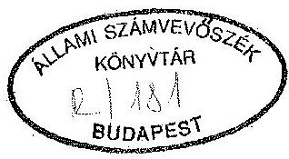
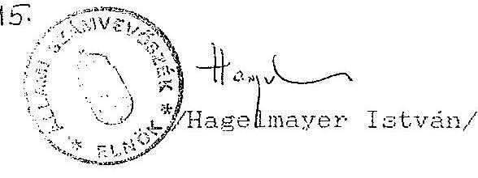
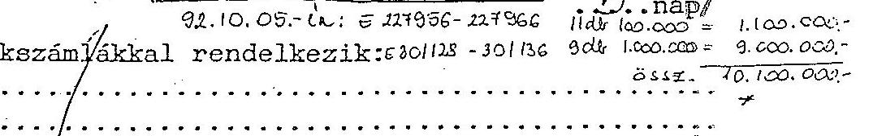

# Állami Számvevőszék

## JELENTÉS

a Magyarországi Szociáldemokrata Párt
1991-1993. évi gazdálkodása törvényességének ellenőrzéséről

---

A vizsgálatot vezette:
dr. Elek János osztályvezető főtanácsos

A vizsgálatot végezte:
Berzétey Attiláné számvevő tanácsos
Ecsy Lajosné számvevő

---

# ÁLLAMI SZÁMVEVŐSZÉK

IV. VAGYONELLENŐRZÉSI IGAZGATÓSÁG
$\mathrm{V}-1007-11 / 1993$

## JELENTÉS

A Magyarországi Szociáldemokrata Párt
1991-1992-1993. évi gazdálkodása törvényességének ellenőrzéséről

## I.

## 1. A vizsgálat célja, időszaka, módszere

A pártok működéséről és gazdálkodásáról szóló - többször módosított 1989. évi XXXIII. törvény (továbbiakban: párttörvény) 10. § (1) bekezdése, valamint az Állami Számvevőszékről szóló 1989. évi XXXVIII. törvény 5. §-a alapján a pártok gazdálkodása törvényességének ellenőrzésére az Állami Számvevőszék (továbbiakban: ASZ) jogosult. Az ASZ a törvény felhatalmazása alapján kétévenként ellenőrzi azoknak a pártoknak a gazdálkodását, amelyek rendszeres állami költségvetési támogatásban részesültek.

A Magyarországi Szociáldemokrata Párt (továbbiakban: MSZDP. vagy párt) az 1990. évi országgyűlési választásokon elért eredménye alapján a párttörvényben előírt elosztási szabályok szerint - rendszeres állami költségvetési támogatásban részesül. Ennek megfelelően a párt 1991. évben $15 \quad 900 \quad 000 .-$ Ft, 1992. évben $20 \quad 199 \quad 000 .-$ Ft állami támogatást kapott. Az 1993. évre jóváhagyott támogatás összege $24 \quad 800 \quad 000 .-$ Ft.

A törvényességi vizsgálat célja annak ellenőrzése volt, hogy a párt gazdálkodása mennyiben felelt meg a párttörvény előírásainak, továbbá betartották-e a gazdálkodással összefüggő egyéb hatályos rendelkezések, 1992. évtől a számvitelről szóló 1991. évi XVIII. törvény (továbbiakban Szt) előírásait, továbbá

---

milyen intézkedéseket tettek az 1991. évben készült ASZ vizsgálati jelentésben megállapított szabálytalanságok kiküszöbölésére. Az ellenőrzött időszak 1991. január 1-től december 31-ig, az 1992. január 1-től december 31-ig tartó, továbbá a folyamatban lévő 1993. gazdasági év volt.

A párt alapszervezetei (kerületi, helyi és megyei) nem rendelkeznek önálló jogi személyiséggel. Pénzforgalmi adataik könyvelése a központban történik, ezért alapszervezetnél nem volt célszerű vizsgálatot tartani.

A párt központjában lefolytatott helyszíni ellenőrzés 1993. augusztus 23-tól október 11-ig tartott.

Az ellenőrzés módszere szúrópróbaszerű vizsgálat volt, a helyszínen rendelkezésre bocsátott iratok, dokumentumok alapján, figyelemmel a Magyar Közlöny 1991. évi 28. számában közzétett vizsgálati programra is.

Az ellenőrzés végrehajtása során figyelemmel kellett lenni magas szintű jogszabályi változásokra:

- a számvitelről szóló 1991. évi XVIII. törvény módosította a számvitellel szemben támasztott jogszabályi követelményeket;
- a párttörvényt módosító 1992. évi LXXXI. törvény módosította az előző évi gazdálkodásról a Magyar Közlönyben közzéteendő beszámoló tartalmát.

# 2. A vizsgálat körülményei

Az egyidejűleg három gazdasági évet (1991, 1992, 1993) érintő ellenőrzésnek a rendelkezésre álló idő alatt történt lefolytatására az alábbi előzmények miatt került sor:

- Az ASZ a párt 1990. évi gazdálkodásáról 1991. évben készült jelentésében több, a személyes felelősséget is megállapító észrevételt tett. A tapasztalt szabálytalanságok miatt az ASZ elnöke kezdeményezte a Fővárosi Főügyészségnél a bírósági eljárás megindítását.
- Az ASZ jóváhagyott 1992. II. félévi munkaterve szerint a: MSZDP 1991. évi gazdálkodása törvényességének ellenőrzésére 1992. augusztus 31.- szeptember 25. között került volna sor. A helyszíni ellenőrzés lefolytatása meghiúsult, amelynek

---

egyik alapvető oka, hogy a párt törvényes képviselete 1991. november 7. napjától vitatott volt, a tervezett vizsgálat idején nem volt a pártnak jogerősen bejegyzett képviselője. E vita eredményeként a pártnál egyidejűleg két helyen folyt gazdálkodási tevékenység. Ebből kifolyólag nem állt egyik fél rendelkezésére sem az 1991. évi teljes körű pénzügyi dokumentáció. Továbbá gondot okozott, hogy a párt alapszervezetei nem számoltak el a részükre kiutalt állami támogatással, a pénzügyi zárómérleghez nem teljesítették adatszolgáltatási kötelezettségeiket. Mindezen okok miatt nem készült el a párt 1991. évi pénzügyi zárómérlege, továbbá az 1990. évi helyesbített pénzügyi zárómérleg. Nem történt érdemi intézkedés az ASZ 1991. évi vizsgálati jelentésében megállapított - személyes felelősséget is érintő - súlyos szabálytalanságok kiküszöbölésére sem.

Az ASZ a vizsgálat meghiúsulását eredményező körülményekről a párt mindkét képviseleténél jegyzőkönyvet vett fel, amelyeket - a folyamatban lévő bírósági eljárás miatt - megküldött a Fővárosi Főügyészségnek azzal, hogy az ASZ elnöke változatlanul szükségesnek tartja a felügyelőbiztos kirendelése tárgyában kezdeményezett bírósági eljárás folytatását.

- A Legfelsőbb Bíróság döntésének eredményeként 1992. szeptember 14-ével rendeződött a párt képviseleti jogosultsága.
- A fenti előzmények után került sor - az ASZ jóváhagyott 1993. II. félévi munkatervének megfelelően - a jelenlegi, 3. évet átfogó ellenőrzés lefolytatására.

A tapasztalt szabálytalanságok reális rögzítése mellett a vizsgálat során elsősorban arra kellett helyezni a hangsúlyt, hogy a párt által eddig megtett intézkedések elégségesek voltak-e arra, hogy a jövőre nézve garantálják a gazdálkodás törvényes keretek között történő, szabályszerű folytatását, és milyen további intézkedések szükségesek a törvényes gazdálkodási rend kialakítása érdekében. Ennek a jelentőségét két lényeges eseménysorozat is alátámasztja:

- Az ASZ ellenőrzés lezárta előtt, 1993. október 3-án zajlott le három szociáldemokrata párt, a Magyarországi Szociáldemokrata Párt (MSZDP), a Szociáldemokrata Néppárt (SZDNP) és

---

a Független Szociáldemokrata Párt (FSZDP) egyesülési kongresszusa. A kongresszus által elfogadottak szerint megszűnt és az MSZDP-be integrálódott az SZDNP és az FSZDP.

- A vizsgálat idejéig még nem zárult le a párt gazdálkodását felügyelőbiztos kinevezésével összefüggő bírósági eljárás, az ASZ ellenőrzése ideje alatt igazságügyi szakértői vizsgálat volt folyamatban.

# II.

A párt gazdálkodásáról szóló éves beszámolók ellenőrzésének tapasztalatai

## 1. Általános megállapítások

A párt az 1991. évi pénzügyi zárómérleg (továbbiakban: beszámoló) készítési kötelezettségének 1993. január 15-én a Magyar Közlöny 4. számában, az 1992. évi beszámolóját 1993. április 22-én a Magyar Közlöny 47. számában jelentette meg (1. sz. és 2. sz. melléklet). A beszámolókat a párttörvény 1. sz. mellékletében előírt formában és tartalommal, de az 1991. évi mérleg vonatkozásában a párttörvény 9. § (1) bekezdésében megjelölt határidőn túl hozták nyilvánosságra.

A párt gazdálkodásáról közzétett beszámolók a párt központjának, továbbá budapesti és vidéki alapszervezeteinek adatait tartalmazzák. Az ellenőrzés megállapítása szerint a pénzügyi kimutatások részleteikben és főösszegeikben egyaránt pontatlanok, nem teljeskörűek, nem tükrözik a párt adott évi tényleges pénzügyi helyzetét, nem felelnek meg az 1991. évben hatályos számviteli rendelkezéseknek, 1992. évtől pedig a számviteli törvényben konkrétan megfogalmazott alapelveknek.

Az ellenőrzés során tett megállapítások szerint a beszámolók tartalmát illetően a következő alapelvek nem teljesültek:

- A teljesség elve nem érvényesül, mert a beszámolók nem tartalmazzák a párt valamennyi helyi és regionális szer-

---

vezetének gazdálkodási adatait. A bizonylatolási hiányosságok következtében nem könyvelték el teljeskörűen a gazdasági eseményeknek az eszközökre és forrásokra gyakorolt hatását.

- A világosság és következetesség elvét sérti, hogy nem biztosították a beszámoló, valamint az azt megalapozó könyvvezetés kapcsolódását. A beszámoló - utólag, az ellenőrzés ideje alatt összeállított - számítási anyaga nem biztosítja a könyvelés és a beszámoló közötti összefüggések teljeskörű áttekinthetőségét.
- A valódiság elvét sérti, hogy a beszámolók egyes sorai nem felelnek meg a tényleges állapotnak, továbbá a könyvelési tételek egy részénél hiányzik a tételes bizonylat alátámasztás.

2. Az 1991. és 1992. évi pénzügyi zárómérlegekhez kapcsolódó részletes megállapítások
2.1. Az 1991. évi beszámolók ellenőrzése

- A beszámoló nem tartalmazza teljeskörűen a párt tagdíjbevételeit, mivel a területi szervezetek jelentős része sem az 1991. évi pénzforgalmáról, sem a teljes évi tagdíjbevételeinek összegéről nem számolt el az országos központ részére.
- A párt részére 1991. évben átutalt állami költségvetési támogatás összegét ($15.900.000 Ft$) a beszámoló nem a valóságnak megfelelően tartalmazza; az 1991. december hó 16-án átutalásra került $1.325.000 Ft$-ot nem könyvelték le csak a következő év januárjában. Emiatt az 1991. évi zárómérlegben nem szerepeltették.
- Az egyéb bevételek között szerepeltetnek nem a párt saját bevételét képező összegeket is (pl., letiltás, gyerektartás).
- A párt által adott nyilatkozat szerinti elszámolásból és a könyvelés adatainak összevetéséből nem állapítható meg a párt helyi szervei számára juttatott $383.841.- Ft$ összeg számszerű helyessége.

---

- Az általános költségek között az adó, illeték soron szerepeltetett $993.663.- Ft$-ból $715.044.- Ft$ személyi jövedelemadó. Ezt az összeget a mérleg munkabérek soron kellett volna feltüntetni. A könyvelésben a fenti összeggel szemben csak $239.464.- Ft$ jövedelemadó befizetését könyvelték el.
- A beszámolóban helyiségbérletre kiadott összeg nem egyezik meg a könyvelés szerinti összeggel.
- Az adminisztrációs és postaköltségekre teljesített kiadás összege a számítási anyag és a könyvelés alapján is ellenőrizhetetlen.
- A különféle egyéb költségek $3.575.028.- Ft$-os összege a számítási anyag és a könyvelés alapján is ellenőrizhetetlen.
- Az egyéb tevékenységgel kapcsolatos $1.544.097.- Ft$ kiadás tartalma és összege - számítási anyag hiányában - ellenőrizhetetlen.

# 2.2. Az 1992. évi pénzügyi zárómérleg ellenőrzése

A párttörvény 1992. december 28-án kihirdetett módosítása alapvetően érintette a pártok beszámolójának tartalmát. Egyrészt a módosítás, másrészt az 1992. évtől hatályos számviteli törvény előírásaival összhangban lévő beszámoló összeállítása fokozottan megkövetelte volna, hogy a beszámoló tartalma és a számvitel közötti összehasonlíthatóságot biztosító számítási (módszertani) anyag készüljön. Számítási anyag nem volt, azt az ellenőrzés ideje alatt készítette el a párt könyvelése.

- A helyi szervezetek gazdálkodását, a tagdíjelszámolást érintő problémák miatt az 1992. évi zárszámadásban közölt tagdíjbevétel összegének valódisága sem regisztrálható. A könyvelés már az előző évben is feltüntetett $33.950.- Ft$ tagdíjat 1992. évi tagdíjbevételként ismét elszámol.

---

- A párt részére átutalt 1992. évi költségvetési támogatás - $20 \quad 199 \quad 000.- Ft$ - összegét az előző évről átkönyvelt $1 \quad 325 \quad 000.- Ft$ támogatás összegével növelten szerepeltetik.
- Az egyéb hozzájárulások, adományok között nem tüntetnek fel külföldiektől kapott hozzájárulásnak minősülő $1430 \text{ NLG}$-nak megfelelő $67 \quad 720.- Ft$ bevételt.
- Az egyéb bevételek között kimutatott $30 \quad 730.- Ft$ összegű devizabevétellel szemben a bankbizonylatok szerint csak $20 \quad 121.- Ft$ az 1992. évi deviza-kamattöbblet összege.
- A beszámolóban feltüntetett $9 \quad 163 \quad 948.- Ft$ működési kiadás összetétele, tartalma, a könyvelés adataival való egyezősége nem volt ellenőrizhető.
- Ellenőrizhetetlen volt az egyéb kiadásként szerepeltetett $3 \quad 601 \quad 438.- Ft$ is. E két tétel a könyvelő által utólag összeállított számítási anyagban szereplő összege nem egyezik meg a beszámolóban megjelentett összegekkel sem.
- Számítási anyag hiányában, valamint a könyvelési és bizonylatolási hiányosságok miatt a párt mérleg szerinti tényleges pénzügyi helyzetének valószerűsége egyik évben sem állapítható meg.

# III.

Az 1991. és 1992. évi beszámolók megalapozottságát alátámasztó könyvvizsgálati megállapítások

## 1. Könyvvezetés

### 1.1 Általános megállapítások

Az MSZDP központja 1991-ben és 1992-ben is az egyszerűsített kettős könyvviteli rendszerben látta el könyvvezetési feladatait, annak ellenére, hogy az Szt. előírásainak meg-

---

felelően 1992. évtől választania kellett volna az egyszeres és a kettős könyvvitel között.

A párt országos központjában 1991. és 1992. években az állami támogatások összegét négy különböző banknál vezetett elszámolási számlán és 5 db OTP csekkszámlán kezelték. A működéssel kapcsolatos pénzforgalmat kizárólag a házipénztáron keresztül bonyolították le.

A központi könyvelést 1991. és 1992. években - a jelentés I. fejezetében ismertetett körülmények, a párt képviseletében történt változások miatt - két helyen végezték. A Petrasovits Anna vezette párt könyvelését a Dohány u. 76. sz. alatti központi épületben, a Borbély
 Endre által képviselt párt könyvelését pedig a Városligeti fasorban lévő párthelyiségben, majd 1992. október 19-től a Dohány utcai központban. A kétféle könyvelési nyilvántartás utólag összesített adataiból készítették el az évenkénti könyvelési zárlatot, illetőleg az 1991. és 1992. évi pénzügyi beszámolókat.
A párt központi könyvvezetése sem 1991-ben, sem 1992-ben nem tükrözte a párt egészének gazdálkodását. Nem érvényesítették könyvvezetésükben az 1991-ben hatályos számviteli előírások túlnyomó részét, 1992-ben pedig az Szt. szabályait. Szabálytalan bizonylatok alapján, gyakran bizonylatok nélkül könyveltek. A területi szervezetek késve és hiányosan küldték be elszámolásaikat a központba, egy részük pedig egyáltalán nem tett eleget elszámolási kötelezettségeinek.

# 1.2. Részletes megállapítások 

Az Országos Takarékpénztárnál a párt nevére nyitott csekkszámla 1992. és 1993. évi forgalmi adatairól készített banki kivonatok adatai alapján a könyvelés és a beszámoló teljeskörűségének hiányát állapította meg az ellenőrzés.
A csekkszámla terhelési és jóváírási adatait, valamint a záró pénzállomány adatait nem könyvelték el, emiatt az 1992. évi beszámoló sem tartalmazza azokat.

1990-től folyamatosan az "Egy évnél rövidebb lejáratú hitelek" főkönyvi számlán 3000000 Ft összegű, nem létező hiteltartozást tartanak nyilván. (Ezt a megállapítást már az előző ASZ vizsgálati jelentés is tartalmazta.) 1992-ben többségében pénztári bizonylatok nélkül elkönyveltek összesen 41000 Ft összegű - a párt számára 6 fő által nyújtott - kölcsönt. A 41000 Ft kölcsöntartozással szemben 7 fő részére, összesen 161600 Ft-ot könyveltek el a kölcsön visszafizetése címén. A teljes körű könyvelés és bizonylatok hiányában nem állapítható meg a kölcsönadás ténye és a visszafizetés jogossága.

Evek óta nem rendezték a "389 Függő kiadások és bevételek" főkönyvi számlán kimutatott nagy összegű tisztázatlan kiadást:

1991. december 31-én
$5026903,48 \mathrm{Ft}$
1992. december 31-én
$5020505,38 \quad \mathrm{Ft}$
volt a főkönyvi számlán szereplő függő kiadások összege.

Leltár és analitikus nyilvántartások hiányában nem állapítható meg az 1. és 2. számlaosztályokban kimutatott álló- és fogyóeszközök könyvelésének teljeskörűsége.

Az Szt. 21. § (2) bekezdésében foglaltaktól eltérően az eszközöket 1992-ben rendeltetésük, használatuk szerint nem sorolták be a befektetett eszközök, illetve a forgóeszközök közé. Nem tartották be az Szt. azon előírását sem, hogy a forgóeszközök között csak az új készletek értékét lehet kimutatni.

A bérelszámolás teljeskörűségének hiányában és a szabálytalan könyvelések miatt nem ellenőrizhető a munkabérek, valamint a bérek után fizetendő adók és járulékok, valamint egyéb levonások megállapításának és elszámolásának helyessége. Bizonylat nélkül elkönyveltek bérkiadás jogcímén 290585 Ft nyugdíjjárulékot. 664509 Ft Szja előleget és 28202 Ft "szolidaritási hozzájárulást". Emellett az 1992. évi pénzügyi beszámolóban kiadásként szerepeltették a ki nem fizetett, 290585 Ft nyugdíjjárulékot és a 664 509 Ft Szja előleget.

A párt gazdálkodása során évek óta felhalmozódott jelentős mértékű adósságállomány pontos összegét - a könyvelési adatok alapján, a szabálytalan könyvelések és elszámolások miatt - az ellenőrzés nem tudta megállapítani. Ezért felkérte a Fővárosi és Pest megyei Egészségbiztosítási Pénztárt a párt társadalombiztosítási járulék tartozásaival kapcsolatos adatközlésre. Továbbá nyilatkozatot kért a párt elnökétől az egyéb tartozások összegéről. Ezek szerint a párt fennálló tartozásai az alábbiak:

- Tb járulék tartozás 1993.07.31-ig 6356342 Ft
- késedelmi pótlék 1993.09.30-ig 2295649 Ft

1. Tb járulék és késedelmi pótlék
összesen:
8651991 Ft
2. Szja tartozás 1992.12.31-ig 1857272 Ft
3. Állammal szembeni tartozás
összesen:
10509263 Ft
4. Szállító tartozás
23990165 Ft
5. összes tartozás:
34499428 Ft

Az utólagos elszámolásra kifizetett előlegek főkönyvi nyilvántartása az elszámoltatás, az előlegek visszafizetésének rendje az alábbiak miatt nem felel meg az előírásoknak.

- A kifizetett elszámolási előlegekről 1991-től analitikus nyilvántartást nem vezetnek. A főkönyvi könyvelés adataiból - 1991. december 31-én 917976,30 Ft és 1992. december 31-én pedig 994038,30 Ft tartozást mutattak ki - pedig nem állapítható meg, hogy kinek, milyen összegű tartozása áll fenn.
A jelentős mértékű elszámolási előleg tartozás behajtása érdekében mindössze öt esetben összesen 102100 Ft összegben történt intézkedés.

2. Az analitikus nyilvántartások és a bizonylati rend ellenőrzése
2.1. Az 1991. évi gazdálkodás során a kötelezően előírt analitikus nyilvántartásokat nem vezették. 1992-ben pedig saját hatáskörben nem alakították ki a szükséges analitikus

nyilvántartások körét - ideértve az egyéb kiegészítő és részletező számviteli nyilvántartásokat is. Ezek hiányában a főkönyvi könyvelés összevont adataiból nem állapítható meg

- az álló és tartós fogyóeszközök egyedenkénti mennyisége, értéke;
- a különféle, elszámolási kötelezettséggel kifizetett előlegek visszafizetése, a személyenkénti tartozások összege;
- a személyi jövedelemadó alapjául szolgáló, jogcímenként kifizetett jövedelmek és a levont adóelőlegek teljeskörű személyenkénti összege;
- a szállítók követelése.
2.2. A bizonylati elv és a bizonylati fegyelem érvényesülése

1991. és 1992. évben a párt bizonylati rendje és fegyelme nem felelt meg a jogszabályi előírásoknak. A bizonylatok legfontosabb tartalmi és alaki kellékei hiányoznak, esetenként bizonylat nélkül könyveltek. Emiatt a könyvelt adatok hitelessége nem biztosított, a gazdasági események és a beszámoló adatainak valódisága nem kellően alátámasztott.

A párt törvényes képviseletének rendeződése után nem készített a gazdálkodási tevékenységgel összefüggésben fellelhető dokumentációról jegyzőkönyvet, következésképp a korábbi időszakban, különösen pedig az 1991. november 7-e és 1993. január 1-je közötti időszakban folytatott gazdálkodási tevékenység dokumentumait rendkívül hiányosan vagy egyáltalán nem tudták az ellenőrzés rendelkezésére bocsátani. A székházban fellelt, illetőleg utólag összeállított bizonylatok könyvelését utólag végezték el, de a vizsgálat ideje alatt is előkerültek addig le nem könyvelt, fel nem dolgozott bizonylatok.
Így például a párt OTP-nél vezetett csekkszámlájáról 1991. november 15-én felvett, és a házipénztárba 2563. sz. bevételi pénztárbizonylat alapján bevételezett 900000 Ft pénztári ellátmány felhasználásának elszámolása, bizonylatolása és könyvelése nem fogadható el, mert a bizonylatok alapján nem állapítható meg, hogy az elszámolt összeg a 900000 Ft részbeni felhasználása-e. Így a

tartozás és az elszámolási kötelezettség továbbra is fennáll.

Az előző pártvezetés által a Magyar Takarékszövetkezeti Bank Rt.-nél nyitott elszámolási bankszámla bizonylatai és az ellenőrzés rendelkezésére bocsátott házipénztári bizonylatok alapján az ellenőrzés megállapította, hogy az 1992. május 12-én felvett 1600000 Ft és 1992. június 10-én felvett 1750000 Ft, összesen 3350000 Ft összegű állami támogatás házipénztári befizetése a pénzfelvétel napján nem történt meg.

Az összegből csak 3100000 Ft házipénztári befizetése állapítható meg. Ezt az összeget is csak hosszú késedelemmel - az 1992. május 13. - szeptember 12. között időszak alatt - és több részletben több személy fizette be, két esetben pedig a befizető személye sem állapítható meg.

Fentiekkel kapcsolatban a párt gazdasági vezetője 1993. augusztus 6-án írásban felszólította a pénzfelvételi bizonylatot aláíró 3 személyt a 250000 Ft összegű hiány pénztári befizetésére. Ezt követően 1993. augusztus 30-án a párt bírói fizetési meghagyást bocsátott ki részükre.

# 2.3. Szigorú számadási kötelezettségű nyomtatványok 

A párt nem határozta meg a szigorú számadási kötelezettség alá vont nyomtatványok körét, azokról nyilvántartást nem vezetett. A bizonylattömböket (pl. a házipénztári kiadási és bevételi bizonylattömbök) nem hitelesítették használatba vétel előtt. A párt területi szervei által használt nyomtatványok körét nem jelölték ki, az általuk alkalmazott nyomtatványokról információval nem rendelkeztek.

### 2.4. A házipénztár kezelése és bizonylatai

Az 1991. évi november hónapban, a párt vezetésében lekövetkezett változás után házipénztár is két helyen működött. Mindkettő működésében jelentős hiányosságok tapasztalhatók. A párt Dohány utcai székházában lényegében nem

volt szabályos pénzkezelés; 1991. évtől több, zömében a gazdasági vezető, valamint a könyvelő által utólag kiállított pénztárjelentés és pénztárbizonylat állt az ellenőrzés rendelkezésére:

- a Petrasovits Anna által vezetett MSZDP részéről 1992. május 13-tól október 15-ig,
- a Borbély Endre által vezetett MSZDP részéről 1991. november 21-től 1992. május 11-ig, illetőleg 1992. június 3-tól december 31-ig. Ezen idő alatt a pénztárkönyveket, valamint a bevételi és kiadási pénztárbizonylatokat - pénztáros hiányában - egyaránt a gazdasági vezető vezette, töltötte ki, emellett rendszeresen utalványozta és ellenőrizte is a saját maga által kifizetett összegeket.

A pénztárbizonylatok szabályszerű kiállítását a párt házipénztári pénzkezelési szabályzatban írta elő. (Az ellenőrzés rendelkezésére állt az 1992. június 12-én Petrasovits Anna által kiadott szabályzat.) Ennek ellenére sem a szabályzat előírásait, sem a bizonylatok tartalmi követelményeit rögzítő számviteli előírásokat nem tartották be.

Az ismert körülmények miatt a pénztárbizonylatok nagy részét a legális párt által a székházban megtalált számlák, feljegyzések, egyéb alapbizonylatok alapján utólag töltötték ki, más részükét alapbizonylat nélkül állították ki.
2.5. Az utazási költségtérítések kifizetésénél számos szabálytalanságot észlelt az ellenőrzés, nemcsak a bizonylatok alaki és tartalmi, de a jogszabályok be nem tartása vonatkozásában is. A legjellemzőbb szabálytalanságok:

- Általában kiküldetési rendelvény nélkül fizetnek ki útiköltségtérítést. Ha kiküldetési rendelvény van is, azon az utazás elrendelése, a feladat meghatározása, a teljesítés igazolása hiányzik.
- A saját gépjármű üzemi célú használata esetén általában nem tartják be a gépjárművek üzemanyag-felhasználásának elszámolásáról rendelkező 60/1992. (IV.1.) Kormányrendelet előírásait. Rendszeresen benzin készpénzfizetési-számlák alapján számolják el az üzemanyag költségtérítéseket.

A párt által üzemeltetett személygépkocsik 1991. és 1992. évi menetlevelei nem álltak az ellenőrzés rendelkezésére.
2.6. A területi szervezetek elszámolási rendje

A párt területi alapszervezetei működési költségeire 1991. évben 1570377 Ft-ot, 1992. évben 1347374 Ft-ot adott át elszámolási kötelezettséggel. Az elszámolás rendjének szabályozása híján a szervezetek 1991. évben 975546,70 Ft-tal, 1992. évben csak 62758,40 Ft-tal számoltak el. 1992. év végén az elszámolatlan összeg 2,3 millió Ft volt: Ennek a szabályozási hiányosságokon túl a párt központi vezetésében lezajlott események voltak az alapvető okai.
3. A devizaszámlák forgalmának könyvelése és a devizák felhasználásának bizonylatolása

A párt az 1991-92. években az évenkénti költségvetési támogatásból devizaként igénybevehető 4%-os keret felhasználási lehetőségével nem élt. Külföldi utazásaik deviza költségeit az előző évek deviza maradványából és egy esetben útiköltség-térítés címén kapott devizából fedezték. Ennek során az alábbi szabálytalanságokat állapította meg az ellenőrzés:
3.1. 1991-ben nem vételeztek be és nem mutattak ki adományként 1600 USD útiköltség térítést. Az összeg felhasználását hiteles bizonylatokkal teljeskörűen nem igazolták.

A párt tisztségviselői által útiköltségtérítés címén befizetett 1600 USD-t a pénztárban szabálytalanul tárolták. A párt egyik alkalmazottja írásban elismerte, hogy 1991. november 26-án az MSZDP pénztárából 1610 USA dollárt kivett.

Az összeget, az 1991. december 13-án készített elszámolás szerint a chilei SZOCINTERN - 1991. november 25-27. között rendezett - tanácsülésén történt részvétel alkalmával vették igénybe.

Az 1610 USD felhasználásáról készített 1404 USD összegű elszámolás hiteles bizonylatok hiányában nem fogadható el. Kiküldetési rendelvényt nem készítettek, így nem állapítható meg a napidíjak elszámolásának jogossága. A csatolt szállodaszámlákon kívül egyéb bizonylat nem állt rendelkezésre. Aláírásokkal nem igazolt a napidíjak átvétele és az egyéb devizafelhasználások ténye. Nem igazolt a rendelkezésre álló 1610 USD és a felhasználásként elszámolt 1404 USD között mutatkozó 206 USD különbözet oka sem.
3.2. Az 1992. évi devizaforgalom nyilvántartásával és elszámolásával kapcsolatban az ellenőrzés az alábbi hiányosságokat állapította meg:

- A főkönyvi könyvelésben a bankbizonylatok alapján nem könyvelték el a devizaszámlán elhelyezett külföldi pénzek
 forgalmát.

A párt éves beszámolójában az "Egyéb bevételek" és az "Egyéb kiadások" soron feltüntetett deviza Ft bevételi és kiadási adatokat könyvelésen kívüli nyilvántartásokból történt kigyűjtéssel állapították meg. A bankforgalmi adatokkal szemben 57111 Ft-tal kevesebb bevételt és 61185 Ft-tal több kiadást tüntettek fel a beszámolóban.

- A devizabevételek elszámolásával kapcsolatos további hiányosság, hogy 67720 Ft összegű utazási költséget, amelyet a holland párt térített meg a párt részére 1430 NLG összegben, adományként nem könyvelték el és ilyen címen a beszámolóban sem mutatták ki.

A felvett útielőlegből visszahozott 432 NLG-ot, összesen 1912 NLG-ot a párt gazdasági vezetője - a 18. sz. mellékletben részletezett okok miatt a párt devizaszámlájára történő befizetés helyett 1992. november 12-én -

---

saját névre szóló devizaszámlán helyezett el. Fenti deviza összeget 1993. február 22-én a párt B 101730 sz. OTP-nél vezetett devizaszámlájára befizette.
4. Az adózásra, illetőleg járulékfizetésre vonatkozó jogszabályok betartása

A pártnak - munkáltatói és kifizetői státusából adódóan személyi jövedelemadó, társadalombiztosítási járulék, nyugdíj- és egészségbiztosítási járulék, valamint a munkaadói és munkáltatói járulék bizonylatolási, nyilvántartási, levonási és befizetési kötelezettségei vannak.

Az MSZDP a vizsgált 2 évben nem vezetett olyan nyilvántartásokat, amelyek alkalmasak lennének az adó (járulék) alapjának, összegének megállapítására, és amelyek alapján a kötelezettség és annak teljesítése teljes körűen ellenőrizhető lenne. Így pl.:

- A párt figyelmen kívül hagyta, hogy 1993. évtől megváltoztak a devizaellátmányokra vonatkozó adózási szabályok. Az ideiglenesen külföldi kiküldetést teljesítők devizaellátmányát a párt esetében adóköteles bevételnek kell tekinteni. A devizaellátmány nem költségtérítést, hanem munkaviszonyból származó bevételt jelent. Az érintett személyek esetében ezért ezt a bevételt a személyi jövedelemadó nyilvántartásban szerepeltetni kell.
- A párt alkalmazottaival kötött munkaszerződések nem egyértelműek; a szerződésben a dolgozó havi munkabére vagy nettó összegben van feltüntetve, vagy megjelölés nélkül. Ettől függetlenül a járandóságokat nettó összegként számolják el. Egy esetben 1992. szeptember 1-én kötött munkaszerződés szerint a dolgozó munkabére havi bruttó 17 200.- Ft; ennek ellenére következetesen a bruttó összegben megállapított munkabért nettó munkabérként fizetik ki.
- Az 1990. évi XC. törvény szerint a személyi jövedelemadó alapja a magánszemély összes - azaz bruttó - jövedelme. A nettó módon történő munkabér-megállapítás és az ennek alapján történő bruttó bér, adóelőleg kiszámítása nem felel meg a törvény 46. § (2) és (3) bekezdése szerinti előírásoknak.

---

- A bérek a bérszámolásnak leadott bérkifizetési jegyzékeken nettó módon szerepelnek. 1992. évtől számos esetben a jegyzékeken fel sincs tüntetve, hogy nettó vagy bruttó a kifizethető összeg. A jegyzékek csak a Borbély Endre által vezetett párt által kifizetett járandóságokat tartalmazzák.
- A bérkifizetési jegyzékekről nem állapítható meg, hogy melyik járandóság munkabér, megbízási díj vagy költségtérítést.
- A bérkifizetési jegyzékek általában utalványozás és ellenőrzés nélkül kerülnek a pénztároshoz kifizetésre; a gazdasági vezető a kiadási pénztárbizonylaton csak a kifizetett nettó összeget utalványozza.
- A bérjegyzékeken számos bizonylat nélküli javítás található, az összesítések és a megállapított járulékok ceruzával vannak feljegyezve.
- Az MSZDP az ellenőrzésnek bemutatott bérnyilvántartó lapokat ceruzával vezette. E nyilvántartó lapok nem tartalmazzák teljeskörűen a kifizetett béreket és bérjellegű juttatásokat; alkalmatlanok arra, hogy teljeskörűen megállapítható legyen az SZJA, TB és egyéb járulékfizetési kötelezettség. Ez csak tételes hatósági ellenőrzés keretében lehetséges.
- 1991. évre vonatkozó adóbevallást bemutatni nem tudtak. A TB járulékok összesítő elszámolásai csak 1991. november hótól lelhetők fel, ezek azonban a Petrasovits Anna által vezetett párt adatait nem tartalmazzák.
- 1992. évre vonatkozó adóbevallási kötelezettségét csak a dr. Borbély Endre vezetésével működő párt teljesítette. Ehhez bekérte az alkalmazottak nyilatkozatait is. Petrasovits Anna vezetésével működő párt számos esetben bizonylat nélkül fizetett ki bért, bérelőleget. Nem állapítható meg, hogy e kifizetések után az adót és egyéb járulékokat elszámolták-e.

# IV. 

A párt bevételszerző gazdálkodási tevékenysége
A párt elnökének 3. sz. mellékletben csatolt nyilatkozatában foglaltak szerint az MSZDP 1991. és 1992. években a párt törvényben felsorolt tiltott pénzforrásokat nem fogadott el, nem folytatott meg nem engedett gazdálkodó tevékenységet. Az ellenőrzés rendelkezésére bocsátott dokumentumok ezt alátámasztják. A párt bevételt a pártot propagáló termékek és tagkönyv értékesítéséből ért el. Az ebből származó, könyvelésben nyilvántartott bevételt a mérlegek megfelelő sorában is szerepeltetik.

# V. 

Az 1991. évi ASZ vizsgálat észrevételei alapján és a folyó évben megtett intézkedések

Az ASZ 1991. évi vizsgálati jelentésében feltárt szabálytalanságok kijavítására, a párt törvényes felügyelete vonatkozásában lezajlott peres eljárások lezárulásáig a párt semmiféle intézkedést nem tett.

A képviseleti jog rendezése után a dr. Borbély Endre által vezetett párt 1992. október 19-e után kezdte meg gazdálkodási rendjének helyreállítását, a számvitellel, bizonylatrenddel és egyéb, a gazdálkodással összefüggő jogszabályok előírásai betartására alkalmas szabályozás kialakítását. Ehhez szakértők közreműködését is igénybe vette. A szakértők közreműködésével elkészítették az 1990. évi módosított, az 1991. évi és az 1992. évi beszámolót is. A beszámolók elkészítésével összefüggő, valamint a gazdálkodással kapcsolatban a kritikus időszakban (1991. november - 1992. szeptember) felmerült problémákról, a - nagyrészt a korábbi pártvezetést terhelő - szabálytalanságokról, bizonylathiányosságokról, két ízben - 1993. január 12-én és 1993. április 19-én - jegyzőkönyvet vettek fel.

Az Országos Pártvezetőség 1993. március 17. napján tartott ülésén 1993. május 1-jei hatállyal elfogadta a párt Szervezeti és Működési Szabályzatát, Gazdálkodási Rendjét, Házipénztári Pénzkezelési Szabályzatát és Bizonylatkezelési Szabályzatát.
A területi szervezetek támogatásával és elszámoltatásával kapcsolatban az Országos Pártvezetőség határozatának megfelelő intézkedéseket tettek. A szabályozás értelmében 1993. évtől csak az a területi szervezet kaphat működéséhez támogatást, amelyik az előző ellátmány felhasználásáról - eredeti bizonylatok becsatolásával - a tárgynegyedévet követő hó 15-ig elszámol.

A számvitel korszerűsítése érdekében bevezették a számvitel számítástechnikai feldolgozását.
Az 1993. április 19-én felvett jegyzőkönyv megállapítja, hogy mind a gazdálkodás, mind a számviteli rend kialakításának vonatkozásában előírt feladatokat végrehajtották, a gazdálkodás rendezett és ellenőrizhetővé vált, a pénzkezelés a pénzügyi fegyelem betartásával történik. (Az ASZ vizsgálat ezzel kapcsolatos észrevételeit a párt 1993. évi gazdálkodási tevékenységének vizsgálatát részletező fejezetben teszi meg.)

A párt kezdeményezésére a Fővárosi Főügyészség 1993. január 14-én kelt határozatában megállapította, hogy az érintett személyek a párt pénzével kötelesek elszámolni, az elszámoltatásra a párt vezetőségének polgári peres eljárás útján van jogköre.

Ezek után a párt gazdasági vezetése 1993. augusztus 6-án  személy részére felszólító levelet küldött ki, majd 1993. augusztus 30-i keltezéssel 7 személy vonatkozásában a Fővárosi Központi Kerületi Bíróságnál fizetési meghagyás kibocsátása iránti kérelmet nyújtott be. A polgári peres eljárást ezzel - ha késedelmesen is - de megindították.

Az ellenőrzés megállapítása szerint az Ellenőrző Bizottság belső ellenőrzési tevékenysége nem működött kellő hatékonysággal. Az általuk felvett jegyzőkönyvek tanúsága szerint már 1991. év elejétől ismeretesek voltak azok a szabálytalanságok, amelyeket az 1991. szeptemberében készült ASZ jegyzőkönyv is részletezett. Ésrevételeik alapján tett javaslataikat azonban nem valósították meg, sőt, az 1992. év folyamán bekövetkezett események hatására a párt számviteli rendszere még jobban szétzilálódott.

# VI. 

A Párt 1993. évi gazdálkodásának ellenőrzése

- A párt az 1993. évi gazdálkodása során könyvvezetési kötelezettségének az Szt. 12. §-ában foglaltak szerint, kettős

---

könyvviteli rendszer alkalmazásával tesz eleget. Mivel azonban ez évtől tervezték a számítógépes könyvelés bevezetését, hagyományos könyvelést már nem vezettek, a számítógépes könyvelés pedig gyakorlatilag most, az ASZ ellenőrzés befejezése idején sem működött az alkalmazott programnak megfelelően.

- Következésképp az 1993. évi könyvvezetés ellenőrzése lehetetlen volt, a kért adatokat nem tudták az ellenőrzés rendelkezésére bocsátani, így pl. az egyes főkönyvi számlák forgalmát összesítő adatokat tartalmazó listákat. Ellenőrizhetetlen volt a párt 1993. évi költségvetéséről készült terv teljesítése is.
- A párt által kiadott Gazdálkodási Rend és mellékletei általában összefoglalva tartalmaznak minden, a gazdálkodás során alkalmazásra ajánlott és kötelezően előírt szabályozást. Gyakorlati alkalmazásukra eddig nem került sor: a párt könyvelője és pénztárosa az ellenőrzés idején még nem rendelkezett a szabályzatokkal. Az Szt. 79. §-a szerinti - a könyvvezetés belső szabályait tartalmazó - számlarendet az Szt.-ben előírt, a törvény hatálybalépését követő 90 napos határidőn túl készítették el. A Gazdálkodási Rend IV. fejezetében "számlatükör"-nek nevezett számlarend lényegében tartalmazza az alkalmazásra kijelölt számlák számjelét, megnevezését, tartalmát, de nem tartalmazza az analitikus nyilvántartások körét, tartalmát, vezetésének módját.
- A párt gazdálkodási tevékenységét végző gazdasági szervezet 1 fő gazdasági vezetőből, 1 fő képesített könyvelőből és 1 fő pénztárosból áll. A bérelszámolást és az adónyilvántartást megbízásos jogviszonyban külső dolgozó foglalkoztatásával oldják meg. A gazdasági vezető más pártfunkciókat is ellát. Munkájukat 1 fő gazdasági szakértő segíti. A könyvelő és a pénztáros munkaköri feladatai munkaszerződésben, illetőleg munkaköri leírásban nem kellően elhatároltak és részletezettek. A főkönyvi könyvelést, a pénzügyi zárómérlegeket, azokhoz a számítási anyagokat gyakorlatilag a képesített könyvelő egy személyben végzi, illetőleg készítette el.
- A 10/1993. (IV. 9.) PM. sz. rendelet 26. § (2) bekezdés b. pontjában megfogalmazott követelmény szerint "kettős könyvvitelt vezetők számlarendjének kialakítása, főkönyvi könyvelésének végrehajtása, éves beszámolójának elkészítése mérlegképes könyvelői szakképesítést, vagy okleveles könyvvizsgálói szakképesítést igényel. A párt jelenlegi gazdasági apparátusában foglalkoztatottak e követelményeknek nem felelnek meg. Az ellenőrzés megállapítása szerint a pénzügyi, gazdasági munka követelményeknek megfelelő végzéséhez a pártnál sem a személyi, sem a tárgyi feltételek jelenleg nem adottak.

---

- Nem készült el a szigorú számadás alá vont nyomtatványaik nyilvántartása. A házipénztárban nincs kifüggesztve az utalványozási joggal rendelkezők aláírása.
- Az 1993. évi devizaforgalom főkönyvi és analitikus nyilvántartásának hiányában a devizaforgalom szabályszerűségét csak a bizonylatok alapján lehetett megvizsgálni. Ezekből megállapítható volt, hogy a külföldi kiküldetésben résztvevők által felvett devizaellátmányok felhasználásáról teljeskörűen elszámoltak.
- A gyakorlatban nem alkalmazzák rendszeresen a belföldi kiküldetési rendelvény nyomtatványt; különösen feltűnő ennek hiánya a vidéki alapszervezeteknél.
- A saját tulajdonú, valamint az üzemi gépjármű üzemanyagköltségének elszámolásánál nem a 60/1992. (IV. 1.) Korm. rendelet előírásai szerinti költségtérítést alkalmazzák; gyakran készpénzfizetési számla alapján (vagy egyszerű, kézzel írott levélre) benzinköltséget térítenek. Nincs írásbeli megállapodása a pártnak a saját tulajdonú gépjárművet használókkal az üzemanyag-felhasználás adóévben használatos módjáról.
- Nem vezetik rendszeresen és pontosan az üzemi gépjármű menetleveleit, elszámolás nélkül, készpénzfizetési számla alapján térítik az üzemanyagköltséget.
- Nem alkalmazzák a külföldi kiküldetési utasítás és költségelszámolás céljára előírt nyomtatványokat.
- Alapbizonylat nélkül teljesítenek kifizetéseket a házipénztárból.
- A munkabéreket 1993. évben is nettó módon adják meg, a bérszámoló ebből visszafelé számolva állapítja meg az összes bruttó jövedelmet, az Szja-t és munkáltatói járulékot. Ebből kifolyólag ezek kiszámítása nem a vonatkozó rendeleteknek megfelelő.
- Az alapszervezetek a tagdíjakat összesítve, a befizető tag nevét és aláírását tartalmazó bizonylat nélkül fizetik be a központnak.

---

- Az alapszervezetek elszámolásukat általában a központ által kiadott elszámolási űrlapon nyújtják be, és mellékelik a kiadásaikat igazoló számlákat is. Azonban a bizonylatok között nagyon gyakran kiküldetési rendelvény nélkül, saját gépkocsihasználat költséget is elszámolnak, készpénzfizetési számla
 alapján, amelyet a párt elfogad és lekönyvel.
- A párt 1993. évben sem vezet a személyi jövedelemadó alapjának, az adó összegének, a mentességnek, a kedvezménynek megállapítására, ellenőrzésére alkalmas nyilvántartást. A bemutatott nyilvántartást ceruzával vezetik, amely nem teljeskörű.
- A párt gazdasági vezetője - a párttörvény 6. §-ában foglaltakat figyelmen kívül hagyva - meg nem engedett vállalkozási tevékenységet kezdeményezett, amelyet a párt elnöke jóváhagyott. A vállalkozási tevékenység beindítására azonban már nem került sor.

# VII. 

## Felhívás a szükséges intézkedések megtételére

A vizsgálat tapasztalatai alapján, a pártvezetés által már megtett intézkedések figyelembevételével, a párttörvény 10. par. (4) bekezdésében kapott felhatalmazás alapján felhívom a párt elnökét, hogy:

1. A törvényes állapot helyreállítása érdekében - a vizsgálat megállapításainak megfelelően - helyesbítse könyvelését. Ennek alapján az 1991. és 1992. évi pénzügyi zárómérlegeket ismételten készíttesse el és a Magyar Közlönyben tegye közzé.
2. Gondoskodjon az elkészített és hatályos gazdálkodási szabályzatok gyakorlati alkalmazásáról, a beolvadt két párttal kibővült MSZDP egészére vonatkozó számítógépes könyvelési rendszer előírás szerinti működtetéséről, a bizonylati fegyelem helyreállításáról.
3. Rendezze a társadalombiztosítási járulék és személyi jövedelemadó tartozást.

---

4. Tegyen intézkedéseket a személyi jövedelemadó nyilvántartás előírásoknak megfelelő vezetésére, az 1993. évben a magánszemélyek jövedelemadójáról szóló törvény által adóköteles kifizetésnek nyilvánított külföldi kiküldetési ellátmányoknak, az érintett személyekre vonatkozó nyilvántartásban való szerepeltetésére.
5. Gondoskodjon arról, hogy az elszámolási kötelezettség mellett kiadott pénzeszközökkel az érintett személyeket elszámoltassák.

Budapest, 1993. december 15.

Melléklet: 3 db

---

A Magyarországi Szociáldemokrata Párt 1991. évi pénzügyi zárómérlege

Forintban

# A) Tényleges bevételek 

1. Tagdijak ..... 159563
2. Állami támogatás ..... 14575000
3. Egyéb hozzájárulások

- magánszemélytől ..... 62465

4. A párt propagandatevékenységéből ..... 9060
5. A párt gazdálkodó tevékenységéből
6. A párt által alapított vállalat bevételéből
7. Egyéb bevételek

- kamat ..... 149517
- egyéb ..... 27244
- hitel ..... 1200000
Összes pénzbevétel a gazdasági évben ..... 16182849
B) Tényleges kiadások

1. Hozzájárulások juttatása
a) a párt helyi szervei számára ..... 383841
b) más társadalmi szervezetek számára ..... 17000
2. Személyzeti költségek
a) munkabérek ..... 3432568
b) költségtérítések ..... 730628
c) tb-járulék ..... 1131574
3. Általános költségek
a) adók, illetékek ..... 993663
b) épületek fenntartása, karbantartása, közüzemi díjak ..... 752865
c) helyiségek bérlete ..... 989704
d) adminisztrációs- és postaköltség ..... 1565275
e) különféle egyéb költségek ..... 3575028
4. Sajtó- és propagandaköltségek ..... 1315985
5. Egyéb tevékenységgel kapcsolatos költségek ..... 1544097
Összes kiadás a gazdasági évben ..... 16432228
C) Tényleges pénzügyi helyzet a gazdasági év zárásakor
Bevételek a gazdasági évben ..... 16182849
Kiadások a gazdasági évben ..... 16432228
Hiány a gazdasági évben ..... 249379
Halmozott hiány az előző gazdasági évről ..... 629749
Halmozott hiány a gazdasági év végén ..... 879128
Dr. Borbély Endre s. k., Sásdi Ernő s. k., ..... elnök
gazdasági vezető

---

A Magyarországi Szociáldemokrata Párt
1992. évi beszámolója
A) Tényleges bevételek

1. Tagdijak :
2. Állami költségvetésből származó támogatás
3. Képviselői csoportnak nyújtott állami támogatás
4. Egyéb hozzájárulások, adományok
4.1. Jogi személyektől
4.1.1. Belföldiektől (az 500000 Ft feletti hozzájárulás nevesítve)
4.1.2. Külföldiektől (a 100000 Ft feletti hozzájárulás nevesítve)
4.2. Jogi személynek nem minősülő gazdasági társaságtól
4.2.1. Belföldiektől (az 500000 Ft feletti hozzájárulás nevesítve)
4.2.2. Külföldiektől (a 100000 Ft feletti hozzájárulás nevesítve)
4.3. Magánszemélyektől
4.3.1. Belföldiektől (az 500000 Ft feletti hozzájárulás nevesítve)
4.3.2. Külföldiektől (a 100000 Ft feletti hozzájárulás nevesítve)
5. A párt által alapított vállalat és korlátolt felelősségű társaság nyereségéből származó bevétel
6. Egyéb bevétel

Összes bevétel a gazdasági évben
B) Tényleges kiadások

1. Támogatás a párt országgyűlési csoportja számára
2. Támogatás egyéb szervezeteknek 1284616
3. Vállalkozások alapítására fordított összegek
4. Működési kiadások 9163948
5. Eszközbeszerzés
6. Politikai tevékenység kiadása 16639
7. Egyéb kiadások 3601438

Összes kiadás a gazdasági évben 14066641
C) Tényleges pénzügyi helyzet a gazdasági év zárásakor

Bevételek 22560164
Kiadások 14066641
Saldó
8493523

---

$$
\begin{array}{ll}
1991, & 1992, 1993 \\
\text { 3. sz. melléklet a }
\end{array}
$$

# NYILATKOZAT 

Alulírott dr. Borbély Endre elnök, Sásdi Ernő gazd.-vez. a Magyarországi Szociáldemokrata Párt ................................. -je az Állami Számvevőszék törvényességi vizsgálatát végző munkatársai részére kijelentem, hogy a nyilatkozatra jogosult személyek párt az 1989. évi XXXIII. tv. (párttörvény)

- 4. § (2) és (3) bekezdésében felsorolt tiltott pénzforrásokat nem fogadott el (illetve elfogadott, azok tételes felsorolása);
- tárgyi adományt nem kapott (illetve kapott, annak felsorolása és értéke);
- a 6. § (1) bekezdésének megfelelően az alábbi gazdálkodó tevékenységet folytatott (illetve semmilyen gazdálkodó tevékenységet nem végzett);
- a 6. § (3) bekezdésében engedélyezett egyszemélyes kft-t, vállalatot nem alapított (illetve alapított, ezek felsorolása, „cégbíróság” bejegyzés feltüntetésével);
- a 6. § (3) bekezdésében felsoroltakon kívül más, tiltott gazdasági társaságot nem alapított, ilyenben részesedést nem szerzett (illetve alapított, részesedést szerzett és azok felsorolása);
- a 6. § (4) bekezdésének megfelelően részvényt nem vásárolt (illetve vásárolt, azok felsorolása, értéke);

---

- a 6. § (4) bekezdésének megfelelően pénzeszközeit az alább felsorolt értékpapírokba fektette (illetve semmilyen értékpapírral nem rendelkezik);
Reál-lízing kötvény-2-7 millió forint értékben /1992, 08\%...hó

- az alábbi bankszámjával rendelkezik: £ 301125 - 301136 90th 1.000 .000 = 9.600 .000 .000 .000 .000 .000 .000 .000 .000 .000 .000 .000 .000 .000 .000 .000 .000 .000 .000 .000 .000 .000 .000 .000 .000 .000 .000 .000 .000 .000 .000 .000 .000 .000 .000 .000 .000 .000 .000 .000 .000 .000 .000 .000 .000 .000 .000 .000 .000 .000 .0
