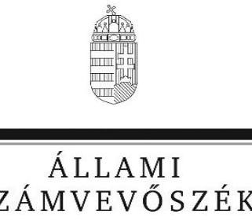
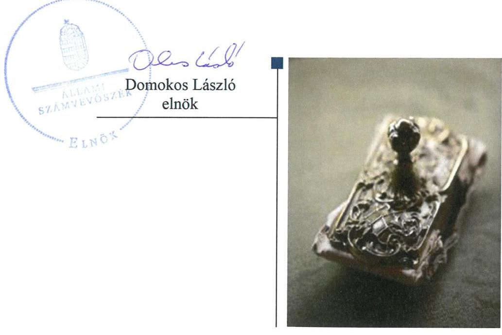
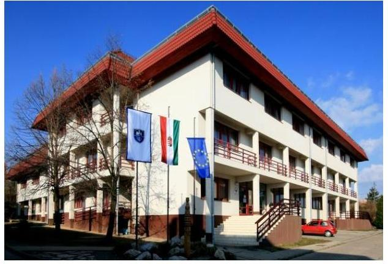

# Jelentés

**Az országos nemzetiségi önkormányzatok fenntartásában levő intézmények gazdálkodásának ellenőrzése**

Koch Valéria Gimnázium, Általános Iskola, Óvoda, Kollégium és Pedagógiai Intézet 2018.

---

# Jelentés 

## Az országos nemzetiségi önkormányzatok fenntartásában levő intézmények gazdálkodásának ellenőrzése

Koch Valéria Gimnázium, Általános Iskola, Óvoda, Kollégium és Pedagógiai Intézet 2018. 12. hó 04. nap

---

# AZ ELLENŐRZÉST FELÜGYELTE:

DR. NÉMETH ERZSÉBET felügyeleti vezető

## AZ ELLENŐRZÉST VEZETTE ÉS A VÉGREHAJTÁSÁÉRT FELELŐS:

- **ÓDOR ZOLTÁN TAMÁS** ellenőrzésvezető
- **A PROGRAM ÖSSZEÁLLÍTÁSÁÉRT FELELŐS:**
  - **TÓTPÁL SZABOLCS** osztályvezető

**IKTATÓSZÁM:** EL-0361-024/2018

**TÉMASZÁM:** 22

**ELLENŐRZÉS-AZONOSÍTÓ SZÁM:** V080601

Jelentéseink az Országgyűlés számítógépes hálózatán és az Interneten a www.asz.hu címen is olvashatóak.

---

# TARTALOMJEGYZÉK 

■ ÖSSZEGZÉS ..... 5
■ AZ ELLENŐRZÉS CÉLJA ..... 6
■ AZ ELLENŐRZÉS TERÜLETE ..... 7
■ AZ ELLENŐRZÉS HÁTTERE, INDOKOLTSÁGA ..... 8
■ A JELENTÉS LÉNYEGES KÉRDÉSKÖREI ..... 9
■ AZ ELLENŐRZÉS HATÓKÖRE ÉS MÓDSZEREI ..... 10
■ MEGÁLLAPÍTÁSOK ..... 12
■ JAVASLATOK ..... 17
■ MELLÉKLETEK ..... 19
I. sz. melléklet: Értelmező szótár ..... 19
■ FÜGGELÉKEK ..... 21
I. sz. függelék a Megállapítások fejezethez ..... 21
II. sz. függelék: Észrevételek ..... 22
■ RÖVIDÍTÉSEK JEGYZÉKE ..... 23

---

.

---

# ÖSSZEGZÉS 

A Magyarországi Németek Országos Önkormányzata az alapítói jogait szabályszerűen gyakorolta, a Koch Valéria Gimnázium, Általános Iskola, Óvoda, Kollégium és Pedagógiai Intézethez kapcsolódó egyéb szabályozási, irányítói, munkáltatói feladatait szabályszerűen látta el. Az Iskolaközpont belső kontrollrendszere nem teremtette meg az átlátható, elszámoltatható és ellenőrizhető közpénzfelhasználás feltételeit. A pénzügyi és vagyongazdálkodása nem volt szabályszerű.

## Az ellenőrzés társadalmi indokoltsága

Magyarország Alaptörvényének XXIX. cikke kimondja, hogy a magyarországi nemzetiségek államalkotó tényezők. Joguk van anyanyelvük használatához, a sajátnyelven való névhasználathoz, saját kultúrájuk ápolásához és az anyanyelvű oktatáshoz. A nemzetiségek létrehozhatnak helyi és országos önkormányzatokat. A nemzetiségek jogaira vonatkozó részletes szabályokat Magyarországon sarkalatos törvény határozza meg. A nemzetiségi közfeladatok ellátásához az állami központi költségvetés támogatást nyújt, melyet a nemzetiségi önkormányzatok kizárólag e feladataik ellátására használhatnak fel. Az Állami Számvevőszék nemzetiségi önkormányzatok intézményeinél eddig ellenőrzést nem végzett.

## Főbb megállapítások, következtetések, javaslatok

A Magyarországi Németek Országos Önkormányzata a jogszabályi előírásoknak megfelelően gondoskodott a Koch Valéria Gimnázium, Általános Iskola, Óvoda, Kollégium és Pedagógiai Intézettel kapcsolatos alapítói és fenntartói feladatainak megszervezéséről; biztosította a szabályszerű működés személyi és tárgyi feltételeit; munkáltatói jogait megfelelően gyakorolta; továbbá egyéb, a feladatellátáshoz kapcsolódó szabályozási, irányítói, döntési és jóváhagyási jogkörét szabályszerűen látta el.

Az Intézménynél a kontrollkörnyezet kialakítása és működtetése nem volt szabályszerű. Nem mérték fel a tevékenységben, gazdálkodásban rejlő kockázatokat, nem alakítottak ki és nem működtettek kockázatkezelési rendszert. A kontrolltevékenységek működtetése nem felelt meg a jogszabályokban foglaltaknak. Az Intézmény 2016. szeptember 1-től alakította ki a szervezet információs rendszerét. A monitoring rendszer kialakítása szabályszerű volt.

Az Intézmény pénzügyi gazdálkodása és vagyongazdálkodása nem felelt meg a jogszabályi előírásoknak, előirányzat-maradvány megállapítása nem volt szabályszerű. Nem történt meg a követelések év végi értékelése és a kötelezettségvállalások szabályszerű nyilvántartása. Éves költségvetési beszámolójának mérlegtételeit szabályos leltárral nem támasztotta alá. A feladatellátást szolgáló vagyon elkülönített nyilvántartását az Intézmény nem biztosította.

Magyarországi Németek Országos Önkormányzata által az Intézmény szervezeti átalakításának előkészítése és végrehajtása szabályszerű volt. A Koch Valéria Gimnázium, Általános Iskola, Óvoda, Kollégium és Pedagógiai Intézet az átalakításához kapcsolódó feladatait nem szabályszerűen látta el, mert nem készítette el a megszűnő intézmény záró dokumentumait.

---

# AZ ELLENŐRZÉS CÉLJA 

Az ellenőrzés célja annak értékelése, hogy az országos nemzetiségi önkormányzatok által alapított és fenntartott intézmények gazdálkodása, a belső kontrollrendszer kialakítása és működése, a fenntartó önkormányzat által nyújtott támogatás, illetve az államháztartásból meghatározott célra ingyenesen juttatott vagyon felhasználása a jogszabályi előírásoknak megfelelően történt-e.

---

# **AZ ELLENŐRZÉS TERÜLETE**

## **Koch Valéria Gimnázium, Általános Iskola, Óvoda, Kollégium és Pedagógiai Intézet**

A Koch Valéria Gimnázium, Általános Iskola, Óvoda és Kollégiumot a 2004. évben a Koch Valéria Kollégium és a Koch Valéria Óvoda Általános Iskola és Középiskola jogutódjaként hozták létre. A pécsi székhelyű intézmény fenntartója a Magyarországi Németek Országos Önkormányzata.

Az Intézmény¹ jelenlegi Koch Valéria Gimnázium, Általános Iskola, Óvoda, Kollégium és Pedagógiai Intézet elnevezését 2014. évben a Magyarországi Német Pedagógiai Intézet beolvadásával történő átszervezésekor kapta.

Az Intézmény olyan többcélú, közös igazgatású köznevelési intézmény, amelynek négy intézményegysége van: óvodai, általános iskolai és gimnáziumi intézményegység, kollégium és pedagógiai intézet. Alaptevékenysége a nemzetiségi óvodai nevelés, általános iskolai és gimnáziumi nevelés-oktatás, valamint kollégiumi ellátás.

Az Intézmény rendelkezik gazdasági szervezettel. Az Intézmény vezetője és a gazdálkodási vezető személye az ellenőrzött időszak alatt nem változott. Az alkalmazottak száma az ellenőrzött időszakban 134-ről 148-ra, az ellátottak száma 757 főről 773 főre emelkedett.

Az Intézmény főbb gazdálkodási adatait a következő táblázat mutatja be:

1. táblázat

|  KOCH VALÉRIA INTÉZMÉNY FŐBB GAZDÁLKODÁSI ADATAI (EFT) |  |  |   |
| --- | --- | --- | --- |
|   | 2014 12 31 | 2015 12 31 | 2016 12 31  |
|  Költségvetési kiadás | 1 059 923 | 974 878 | 1 143 579  |
|  Költségvetési bevétel | 1 122 581 | 1 186 213 | 1 222 524  |
|  Maradvány | 62 658 | 211 335 | 78 945  |
|  ebből kötelezettségvállalással terhelt | 57 186 | 9 570 | 11 026  |
|  Mérlegfőösszeg | 141 831 | 294 604 | 204 045  |
|  Követelések | 9 649 | 6 850 | 9 985  |
|  Kötelezettségek | 5 479 | 2 729 | 1 644  |

*Forrás: Az Intézmény 2014-2016. évi beszámolói*

---

# AZ ELLENŐRZÉS HÁTTERE, INDOKOLTSÁGA 

Az országos nemzetiségi önkormányzatok az általuk képviselt nemzetiség kulturális autonómiájának megteremtése érdekében intézményeket hozhatnak létre és vehetnek át. Az éves költségvetési törvények közvetlenül az intézményfenntartó országos nemzetiségi önkormányzatokhoz rendelik az általuk fenntartott intézmények működési támogatását. A nemzetiségi önkormányzati intézmények költségvetési gazdálkodásának, belső kontrollrendszerének kialakítása és működtetése ellenőrzésével az ÁSZ² biztosítja a közpénzfelhasználás minél szélesebb körének ellenőrzését, ennek során azonos szempontok szerint értékeli az egyes országos nemzetiségi önkormányzatok fenntartásában levő intézmények gazdálkodási tevékenységét.

Az ellenőrzés eredményeként az ellenőrzött költségvetési szervek gazdálkodása javulhat, átfogó képet kaphatunk az országos nemzetiségi önkormányzatok által fenntartott intézmények gazdálkodásának sajátosságairól, hiányosságairól és az alkalmazott jó gyakorlatokról, erősítve a társadalmi bizalmat. Az ellenőrzés tapasztalatai alapján, hiányosságok feltárásával, azok megszüntetésére vonatkozó javaslatokkal az ÁSZ hozzájárul a közpénzek átlátható, szabályszerű felhasználásához.

---

# A JELENTÉS LÉNYEGES KÉRDÉSKÖREI 

1.     - A fenntartó szabályszerűen gyakorolta-e az ellenőrzött intézménnyel kapcsolatos feladatait?
2. Az intézmény működése és gazdálkodása során belső kontrollrendszere megvédte-e a veszteségektől és nem rendeltetésszerű használattól az intézmény erőforrásait?
3. Az intézmény pénzügyi gazdálkodása szabályszerű volt-e?
4. Az intézmény vagyongazdálkodása szabályszerű volt-e?
5. Szabályszerűen történt-e az ellenőrzött időszakban az intézményt érintő szervezeti, szerkezeti átalakítások lebonyolítása?

---

# AZ ELLENŐRZÉS HATÓKÖRE ÉS MÓDSZEREI 

## Az ellenőrzés típusa

Megfelelőségi ellenőrzés.

## Az ellenőrzött időszak

2014-2016. évek

## Az ellenőrzés tárgya

Az ÁSZ ellenőrzésének tárgya az országos nemzetiségi önkormányzatok által alapított és fenntartott intézmények gazdálkodása, a belső kontrollrendszer kialakítása és működése, a fenntartó önkormányzat által nyújtott támogatás, illetve az államháztartásból meghatározott célra ingyenesen juttatott vagyon felhasználása jogszabályi előírásoknak való megfelelőségének értékelése.

## Az ellenőrzött szervezet

- Koch Valéria Gimnázium, Általános Iskola, Óvoda, Kollégium és Pedagógiai Intézet,
- Magyarországi Németek Országos Önkormányzata

## Az ellenőrzés jogalapja

Az ellenőrzés jogszabályi alapját az ÁSZ tv. 1. § (3) bekezdés, 5. § (2)-(6) bekezdései, valamint Áht. 61. § (2) bekezdésének előírásai képezik.

## Az ellenőrzés módszerei

Az ellenőrzést az ellenőrzési program szempontjai, az ellenőrzött időszakban hatályos jogszabályok, az ellenőrzés szakmai szabályai, a jelen ellenőrzésre irányadó ÁSZ módszertanok figyelembevételével végeztük. Az ellenőrzési kérdések megválaszolásához szükséges bizonyítékok megszerzése az ellenőrzött által rendelkezésre bocsátott dokumentumokra, adatokra alapozva megfigyelés, szemle (szemrevételezés), kérdésfeltevés (információkérés), kockázat alapú mintavételezés, valamint elemző eljárás útján történt.

---

A teljes ellenőrzött időszakra vonatkozóan ellenőriztük a fenntartó tevékenységét, a fizetési kötelezettségek teljesítését, az előirányzat-maradvány megállapítását és elszámolását, a beszámolási kötelezettség teljesítését, a vagyongazdálkodást és a szervezeti, szerkezeti átalakításokat. A 2016. évre ellenőriztük az intézmény működését és gazdálkodását, ennek keretében az elszámolási kötelezettségek teljesítését, a belső kontrollrendszert, a bevételek beszedését, elszámolását, a kiadási előirányzatok felhasználását

A bevételek és a kiadások - külső személyi juttatások, dologi és felhalmozási kiadások - esetében az ellenőrzés azokra a legnagyobb értékű tételekre - a lényeges sokaságra - terjedt ki, melyek összértéke eléri a teljes sokaság összértékének 50%-át.

A bevételek esetében a lényeges sokaságot tételesen ellenőriztük. A kiadások elszámolása, valamint a vagyongazdálkodás esetében a szabályszerű működést a lényeges sokaságból véletlen mintavételi eljárással kiválasztott tételek alapján ellenőriztük.

A mintavétellel ellenőrzött területek esetében minden egyes tétel vonatkozásában a szabályszerűségre vonatkozó kérdéseket tettünk fel, amelyek eredménye összesítésre került. „Szabályszerűnek" értékeltünk egy ellenőrzött területet, amennyiben 95%-os bizonyossággal a lényeges sokaságban az átlagos hibaarány legfeljebb 10%, "nem szabályszerűnek", amennyiben 10%-nál magasabb arányt képviselt.

Az ellenőrzés ideje alatt az ellenőrzött szervezettel történő kapcsolattartást az ÁSZ SZMSZ³-ének vonatkozó előírásai alapján biztosítottuk.

---

# 1. A fenntartó szabályszerűen gyakorolta-e az ellenőrzött intézménnyel kapcsolatos feladatait? 

Összegző megállapítás Az Önkormányzat alapítási, irányítási, ellenőrzési és munkáltatói jogait szabályszerűen gyakorolta.

Az Önkormányzat⁴ mint az alapítói jogok gyakorlója kiadta az Intézmény Alapító okirat₁₋₃⁵-át az Áht.⁶-ban előírtaknak megfelelően, valamint biztosította az Intézmény működésének tárgyi és személyi feltételeit, munkáltatói jogait megfelelően gyakorolta.

Az Intézmény elemi költségvetését a közgyűlés⁷ minden évben jóváhagyta az Áht. előírásának megfelelően. Az Intézmény költségvetési beszámolóját és költségvetési maradványát az Áhsz⁸ és az Ávr. előírásaival összhangban az Önkormányzat minden évben jóváhagyta, szakmai feladatellátásáról beszámoltatta.

Az Önkormányzat a munkáltatói jogokat az ellenőrzött időszakban az Njtv.⁹ és az Alapító okirat₁₋₃ 11. pontjában meghatározottaknak megfelelően gyakorolta.

## 2. Az intézmény működése és gazdálkodása során belső kontrollrendszere megvédte-e a veszteségektől és nem rendeltetésszerű használattól az intézmény erőforrásait?

Összegző megállapítás

A belső kontrollrendszer nem védte meg a veszteségektől és a nem rendeltetésszerű használattól az Intézmény erőforrásait a 2016. évben.
2.1. számú megállapítás

A kontrollkörnyezet kialakítása és működtetése nem volt szabályszerű.

Az Intézmény SZMSZ¹⁰-e megfelelt a Nktv.¹¹ követelményeinek.
Az Intézmény az Áht.-nek megfelelően rendelkezett a gazdálkodás részletes rendjét meghatározó Gazdálkodási szabályzattal¹².

Az Intézményvezető¹³ az Ávr. 13. § (2) bekezdés a) pontja ellenére 2016. január 1-jétől 2016. június 30-ai időszakban nem szabályozta a tervezéssel kapcsolatos belső előírásokat, feltételeket. 2016. július 1-jétől az Ügyrendben¹⁴ már szabályozták az Ávr. által előírtakat.

Az Intézmény rendelkezett hatályos, a gazdálkodás részletes rendjét meghatározó szabályzatokkal, valamint a Számv. tv. előírásainak megfelelően rendelkezett Számviteli politika₁₂¹⁵-val, azonban nem rendelkezett, — az Számv. 161. § (1) bekezdése ellenére számlarenddel;

---

- Számv. tv. 14.
 § (5) bekezdés c) pontja ellenére 2016. január 1-jétől 2016. július 13-áig tartó időszakban önköltségszámítás rendjére vonatkozó szabályzattal.

2.2. számú megállapítás

A kockázatkezelési, és 2016. október 1-et követően az integrált kockázatkezelési rendszer kialakítása és működtetése nem valósult meg.

Az Intézmény vezetője nem alakította ki és nem működtetett a Bkr ${ }^{16}$. 3. § (b) pontjának és a 7. § (1) bekezdésének 2016. szeptember 30-ig hatályos előírása ellenére kockázatkezelési rendszert, valamint a Bkr. 3. § b) pontjának és a Bkr. 7. § (1) bekezdésének 2016. október 1-től hatályos előírása ellenére integrált kockázatkezelési rendszert.

A Bkr. 6. § (4) bekezdése ellenére nem szabályozta a szervezeti integritást sértő események kezelésének eljárásrendjét.
2.3. számú megállapítás

A kontrolltevékenység gyakorlása, működtetése nem volt szabályszerű.

Gazdálkodási szabályzat tartalmazta a kötelezettségvállalás, a pénzügyi ellenjegyzés, a teljesítésigazolás, az érvényesítés és az utalványozás gyakorlásának módjával kapcsolatos belső előírásokat, feltételeket, eljárási és dokumentációs részletszabályokat. A gazdálkodási jogkörök gyakorlása nem volt szabályszerű, mert
$\longrightarrow$ az Ávr. 57. § (3) bekezdése ellenére a teljesítésigazolás nem tartalmazott dátumot;
$\longrightarrow$ az Ávr. 57. § (4) bekezdése ellenére a teljesítésigazolást nem az arra jogosult személy végezte.
2.4. számú megállapítás

Az információs és kommunikációs folyamatok kialakítása és működtetése a közérdekű adatok közzétételét és az iratkezelési szabályzat hiányát kivéve, 2016. szeptember 1-től szabályszerű volt.

Az Intézmény SZMSZ-e, az Ügyrendje és 2016. szeptember 1-től az adatkezelési szabályzatának ${ }^{17}$ rendelkezései biztosították, hogy a megfelelő információk a megfelelő időben eljussanak az illetékes szervezethez, szervezeti egységhez, illetve személyhez, a Bkr. rendelkezéseinek megfelelően.

Az Intézmény az Info tv. 24. § (3) bekezdése rendelkezése ellenére 2016. szeptember 1. előtt nem alakította ki az adatvédelmi és adatbiztonsági szabályzatot. Az Intézmény 2016. szeptember 1-től rendelkezett informatikai szabályzattal ${ }^{18}$ és adatkezelési szabályzattal.

Az Intézmény vezetője az Info. tv. ${ }^{19}$ 37. § (1) bekezdés szerinti közzétételi kötelezettségének az éves költségvetés és az éves beszámoló vonatkozásában nem tett eleget.

Az intézmény az Ltv. ${ }^{20}$ 9. § (4) bekezdés előírása ellenére nem rendelkezett iratkezelési szabályzattal.

---

# 2.5. számú megállapítás 

A monitoring rendszer kialakítása és a belső ellenőrzési rendszer kialakítása és működtetése szabályszerű volt.

A Bkr. rendelkezésével összhangban az Intézmény vezetője meghatározta a szervezet tevékenységének, a célok megvalósításának folyamatos- és eseti nyomon követési feladatait.

A független belső ellenőrzés kialakítása és működtetése megfelelt a Bkr. előírásainak, az Intézmény belső ellenőrzési feladatait az Önkormányzat látta el az írásbeli megállapodás ${ }^{21}$ alapján.

A Bkr. 11. § (1) bekezdés előírása ellenére az Intézmény vezetője nem értékelte a belső kontrollrendszer minőségét a Bkr. 1. sz. melléklete szerinti nyilatkozatban.

## 3. Az intézmény pénzügyi gazdálkodása szabályszerű volt-e?

## Összegző megállapítás

### 3.1. számú megállapítás

### 3.2. számú megállapítás

Az Intézmény pénzügyi gazdálkodása nem volt szabályszerű.
A bevételek beszedése és elszámolása megfelelt, a kiadási előirányzatok felhasználása nem felelt meg a jogszabályi előírásoknak.

Az Intézmény ingatlanait esetenként bérbeadással hasznosította, az ebből származó bevételek elszámolása szabályszerű volt.

Az Intézmény nem szabályszerűen használta fel a kiadási előirányzatait, mert a gazdálkodási jogkörök gyakorlása nem volt szabályszerű.

Az Intézmény előirányzat-maradvány megállapítása nem volt szabályszerű.

Az Intézmény fizetési kötelezettségeit 2015-2016. évben az előírásoknak megfelelően a fizetési határidőig teljesítette.

Az Áhsz. 39. § (3) bekezdésében előírtakkal ellentétben az Intézmény a 2014-2016. évek tárgyévi kötelezettségvállalással terhelt maradványát nem szabályszerűen állapította meg, mutatta ki, mert azt az Áhsz. 14. melléklet szerinti részletező nyilvántartás vezetésével nem támasztotta alá.

Az Intézmény a beszámolási kötelezettségét a jogszabályi előírásoknak megfelelően teljesítette.

Az Intézménynél a főkönyvi adatok és az analitikus nyilvántartások adatai közötti egyezőség biztosított volt, költségvetési beszámolóit határidőben elkészítette a Számv. tv.-ben és az Áhsz.-ben előírtaknak megfelelően.

---

# 4. Az intézmény vagyongazdálkodása szabályszerű volt-e? 

## Összegző megállapítás

### 4.1. számú megállapítás

Az Intézmény vagyongazdálkodása nem volt szabályszerű.
Az Intézménynél 2014-2016. években nem történt meg a mérlegben kimutatott követelések év végi értékelése és a kötelezettségvállalások szabályszerű nyilvántartása, valamint éves beszámolói szabályos leltárral való alátámasztása.

Az Áhsz. 20. § (1) és a 21. § (8) bekezdése ellenére a követelések év végi értékelését az Intézmény nem végezte el.

Az Intézmény a 2014-2016. években a követelésekről a könyvviteli számlákhoz kapcsolódó analitikus nyilvántartást vezette, azonban az nem felelt meg az Áhsz. 14. sz. melléklet előírásainak, mert nem tartalmazta a melléklet III. 4. a)-b), d)-i) pontjaiban előírtakat.

A kötelezettségvállalásokról vezetett éves nyilvántartások tartalma nem felelt meg az Áhsz. 14. sz. melléklet előírásainak, mert nem tartalmazta a melléklet II. 4. a), d), e) pontjaiban előírtakat.

Az Intézmény a 2014. évben a Számv. tv. 14. § (5) bekezdés a) pont ellenére nem rendelkezett hatályos leltározási szabályzattal.

Az Intézmény beszámolói mérlegtételeinek alátámasztottsága nem volt biztosított, mert
—2014. évben mérleg tételeinek alátámasztásához Áhsz. 22. §-ában, valamint a Számv. tv. 69. § (1) bekezdésében előírtak ellenére leltárt nem állított össze;
—2015. évben az Áhsz. 53. § (8) bekezdés b) pont), valamint leltározási szabályzatuk ${ }^{22} 2.7$ pontja ellenére a leltár kiértékelését nem végezték el;
—2016. évi beszámoló vonatkozásában megsértették a Számv. tv. 15. § (3) bekezdésének előírását, mely szerint a könyvvitelben rögzített és a beszámolóban szereplő tételeknek a valóságban is megtalálhatóknak, bizonyíthatóknak, kívülállók számára is megállapíthatóknak kell lenniük.

## 4.2. számú megállapítás

A feladatellátásra szolgáló vagyon nyilvántartását az intézmény nem biztosította.

A feladatellátást szolgáló vagyon körét és a vagyon feletti rendelkezés kereteit az Önkormányzat az Intézmény Alapító okiratában szabályozta.

Az Intézmény az Áhsz. 47. § (2) bekezdése ellenére az Önkormányzattól használatba vett ingatlanokat nem a 0-ás számlaosztály 01. Befektetett eszközök számlacsoporton belül tartotta nyilván.

---

# 5. Szabályszerűen történt-e az ellenőrzött időszakban az intézményt érintő szervezeti, szerkezeti átalakítások lebonyolítása? 

Összegző megállapítás

Az Intézményt érintő 2014. évi szervezeti átalakítás során nem tartották be a jogszabályi előírásokat.
5.1. számú megállapítás

Az Önkormányzat Intézmény átalakítására vonatkozó döntése szabályszerű volt.

Magyarországi Német Pedagógiai Intézet az Intézménybe való integrálását jelentő átalakítás előkészítése az Önkormányzat részéről szabályszerűen, az Áht. előírásainak megfelelően történt. Az átszervezés végrehajtásáról az Önkormányzat Közgyűlése 38-44/2014.(04.12.) határozataiban döntött. Az Önkormányzat az Áht. előírásainak megfelelően kiadta az Alapító okirat ${ }_{3}$ módosított változatát, amely az intézményi változásokat tartalmazta.
5.2. számú megállapítás

Az intézmény az átalakításához kapcsolódó feladatait nem szabályszerűen látta el.

Az Áhsz. 7. § (3) bekezdése ellenére az Intézmény mint jogutód költségvetési szerv nem készítette el a megszűnő költségvetési szerv éves költségvetési beszámolóját és az Áhsz. 5. § (1) bekezdése ellenére nem készítette el erre vonatkozóan a leltárt és záró főkönyvi kivonatot.

Az Áhsz. 34. § (3) bekezdése ellenére a megszűnt intézmény vagyon át-adásáról-átvételéről készített jegyzőkönyv aláírt példányát az Intézmény nem őrizte meg.

---

# JAVASLATOK 

Az ÁSZ tv. 33. § (1) bekezdésében foglaltak értelmében az ellenőrzött szervezet vezetője köteles a jelentésben foglalt megállapításokhoz kapcsolódó intézkedési tervet összeállítani és azt a jelentés kézhezvételétől számított 30 napon belül az ÁSZ részére megküldeni. Amennyiben az ellenőrzött szervezet vezetője nem küldi meg határidőben az intézkedési tervet, vagy továbbra sem elfogadható intézkedési tervet küld, az Állami Számvevőszék elnöke az ÁSZ tv. 33. § (3) bekezdés a) és b) pontjaiban foglaltakat érvényesítheti.

## Koch Valéria Gimnázium, Általános Iskola, Óvoda, Kollégium és Pedagógiai Intézet igazgatójának

1. Intézkedjen a Számv. tv. előírásainak megfelelő számlarend elkészítéséről.
(2.1. sz. megállapítás 3. bekezdésének 1. franciabekezdése alapján)
2. Intézkedjen integrált kockázatkezelési rendszer kialakításáról és működtetéséről a Bkr. rendelkezéseinek megfelelően, továbbá szabályozza a szervezeti integritást sértő események kezelésének eljárásrendjét.
(2.2. sz. megállapítás alapján)
3. Gondoskodjon az Info tv. előírásainak megfelelően az Intézmény éves költségvetéseinek és éves beszámolóinak közzétételéről.
(2.4. sz. megállapítás 3. bekezdése alapján)
4. Gondoskodjon az Ltv. előírásainak megfelelően iratkezelési szabályzat elkészítéséről.
(2.4. sz. megállapítás 4. bekezdése alapján)
5. Értékelje az Intézmény belső kontrollrendszerének minőségét a Bkr. rendelkezéseinek megfelelő nyilatkozatban.
(2.5. sz. megállapítás 3. bekezdése alapján)
6. Intézkedjen a gazdálkodási jogkörök Ávr. előírásainak megfelelő gyakorlásáról.
(2.3. sz. megállapítás 2. mondata és 3.1. sz. megállapítás 2. bekezdése alapján)

---

7. Gondoskodjon a maradvány kimutatás alátámasztásáról az Áhsz. rendelkezéseinek megfelelő részletező nyilvántartás vezetésével.
(3.2. sz. megállapítás 2. bekezdése alapján)
8. Gondoskodjon a követelések és kötelezettségek nyilvántartásának Áhsz. előírásai szerinti vezetéséről, valamint a követelések év végi értékeléséről.
(4.1. sz. megállapítás 1-3. bekezdései alapján)
9. Gondoskodjon a beszámolók mérlegtételeinek Számv. tv. és Áhsz. rendelkezéseinek megfelelő alátámasztásáról.
(4.1. sz. megállapítás 5. bekezdése alapján)
10. Intézkedjen az Önkormányzattól használatba vett vagyon Áhsz. előírásainak megfelelő nyilvántartásáról.
(4.2. sz. megállapítás 2. bekezdése alapján)

---

# MELLÉKLETEK 

- I. SZ. MELLÉKLET: ÉRTELMEZŐ SZÓTÁR
irányító szerv
közfeladat
működtetés
nemzetiségi önkormányzat
nemzetiségi többcélú intézmény
vagyongazdálkodás

Nemzeti vagyon

A költségvetési szerv tekintetében az e törvényben meghatározott irányítási hatáskört gyakorló szerv. (Forrás: Áht. 1. § 9. pontja)
Jogszabályban meghatározott állami vagy önkormányzati feladat, amit az arra kötelezett közérdekből, a jogszabályban meghatározott követelményeknek és feltételeknek megfelelve végez, ideértve a lakosság közszolgáltatásokkal való ellátását, továbbá az állam nemzetközi szerződésekben vállalt kötelezettségeiből adódó közérdekű feladatokat, valamint e feladatok ellátásakor szükséges infrastruktúra biztosítását is. (Forrás: Nvtv. 3. § (1) bekezdés 7. pontja, hatálytalan: 2015. január 1-jétől) „Közfeladat a jogszabályban meghatározott állami vagy önkormányzati feladat". A közfeladatok ellátása költségvetési szervek alapításával és működtetésével, vagy azok ellátásához szükséges pénzügyi fedezet törvényben meghatározott eszközökkel, részben, vagy egészben történő biztosításával valósul meg. (Forrás: Áht. 3/A. § (1) bekezdés, hatályos 2015. január 1-jétől)
A nemzeti vagyon birtoklásából, használatából, hasznai szedéséből, a nemzeti vagyon fenntartásából és üzemeltetéséből álló tevékenységek együttese, amely - jogszabály vagy szerződés alapján - a nemzeti vagyon felújítására, fejlesztésére, a birtoklásának, használatának hasznai szedése jogának továbbengedésére is kiterjed. (Forrás: Nvtv. 3. § 10. pontja)
A nemzetiségek jogairól szóló törvényben meghatározott nemzetiségi közszolgáltatási feladatokat ellátó, testületi formában működő, jogi személyiséggel rendelkező, demokratikus választások útján e törvény alapján létrehozott szervezet, amely a nemzetiségi közösséget megillető jogosultságok érvényesítésére, a nemzetiségek érdekeinek védelmére és képviseletére, a feladat- és hatáskörébe tartozó nemzetiségi közügyek települési, területi vagy országos szinten történő önálló intézésére jön létre. (Forrás: a nemzetiségek jogairól szóló 2011. évi CLXXIX. törvény, 2. § 2. pont)
nemzetiségi többcélú intézményen, nemzetiségi tagintézményen és nemzetiségi köznevelési intézmény intézményegységén a köznevelési törvény szerinti többcélú intézmény, tagintézmény és intézményegység értendő (Forrás: Nemzetiségi tv. 2. § 4. pont b,)

A nemzeti vagyongazdálkodás feladata a nemzeti vagyon rendeltetésének megfelelő, az állam, az önkormányzat mindenkori teherbíró képességéhez igazodó, elsődlegesen a közfeladatok ellátásához és a mindenkori társadalmi szükségletek kielégítéséhez szükséges, egységes elveken alapuló, átlátható, hatékony és költségtakarékos működtetése, értékének megőrzése, állagának védelme, értéknövelő használata, hasznosítása, gyarapítása, továbbá az állam vagy a helyi önkormányzat feladatának ellátása szempontjából feleslegessé váló vagyontárgyak elidegenítése. (Forrás: Nvtv. 7. § (2) bekezdése)
a) az állam vagy a helyi önkormányzat kizárólagos tulajdonában álló dolgok,
b) az a) pont hatálya alá nem tartozó, az állam vagy a helyi önkormányzat tulajdonában lévő dolog,
c) az állam vagy a helyi önkormányzat tulajdonában lévő pénzügyi eszközök, továbbá az államot vagy a helyi önkormányzatot megillető társasági részesedések, d) az államot vagy a helyi

 önkormányzatot megillető bármely vagyoni értékkel rendelkező jogosultság, amelyet jogszabály vagyoni értékű jogként nevesít,

---

e) Magyarország határa által körbezárt terület feletti légtér,
f) az üvegházhatású gázok kibocsátási egységeinek kereskedelméről szóló törvény szerinti kibocsátási egység és légiközlekedési kibocsátási egység, valamint az ENSZ Éghajlatváltozási Keretegyezménye és annak Kiotói Jegyzőkönyve végrehajtási keretrendszeréről szóló törvény szerinti kiotói egység,
g) állami vagy helyi önkormányzati fenntartású közgyűjtemény (muzeális intézmény, levéltár, közgyűjteményként működő kép- és hangarchívum, valamint könyvtár) saját gyűjteményében nyilvántartott kulturális javak körébe tartozó dolog, kivéve, ha az állami vagy önkormányzati tulajdon jogszerű létrejötte kétséget kizáró módon nem bizonyítható és a dologra nézve más a tulajdonjogát bizonyítja vagy a kulturális javakra vonatkozó jogszabályokban meghatározott eljárás keretében valószínűsíti,
h) a régészeti lelet,
i) a nemzeti adatvagyon körébe tartozó állami nyilvántartások fokozottabb védelméről szóló törvény szerinti nemzeti adatvagyon.
(Forrás: Nvtv. 1.§ (2) bekezdés)

---

# FÜGGELÉKEK 

- I. SZ. FÜGGELÉK A MEGÁLLAPÍTÁSOK FEJEZETHEZ

Az ellenőrzés megállapította, hogy az Iskolaközpont 2016. évi leltárkiértékelés dokumentumán szereplő összesen nettó érték (92 754,3 E Ft) nem egyezik sem a mérleg értékével, sem az azt alátámasztó főkönyvi kivonat és analitikus nyilvántartás értékével (105 482,6 E Ft). Az eltérés 12 728,3 E Ft.
A Számv. tv. 69. § (1) bekezdése, valamint a 4/2013. (I.11.) Korm. rendelet 22. § (1) bekezdése szerint a könyvek üzleti év végi zárásához, a beszámoló elkészítéséhez, a mérleg tételeinek alátámasztásához olyan leltárt kell összeállítani és e törvény előírásai szerint megőrizni, amely tételesen, ellenőrizhető módon tartalmazza a vállalkozónak a mérleg fordulónapján meglévő eszközeit és forrásait mennyiségben és értékben. A Számv. tv. 69. § (2) bekezdése szerint az (1) bekezdés szerinti kötelezettség teljesítése keretében a vállalkozónak a főkönyvi könyvelés és az analitikus nyilvántartások adatai közötti egyeztetést az üzleti év mérlegfordulónapjára vonatkozóan el kell végeznie.
Az ellenőrzött nem adott át olyan dokumentumot, amely az eltérés mibenlétét magyarázza, tehát az eltérés kivizsgálását, a hiány megállapítását, és a felelősök megtérítési kötelezettségének érvényesítését nem hajtották végre.
A feltárt tények szerint az ellenőrzött szervezet mérlegében szereplő érték 12,7 millió Ft-tal magasabb, mint ami a 2016. évi leltárkiértékelő dokumentumok alapján az ellenőrzött szervezetnél fellelhető.
A hiány ténye felveti annak gyanúját, hogy az ellenőrzött szervezetnél vagyoni hátrány keletkezett, továbbá sérti a Számv. tv. 15.§ (3) bekezdésének előírását, mely szerint a könyvvitelben rögzített és a beszámolóban szereplő tételeknek a valóságban is megtalálhatóknak, bizonyíthatóknak, kívülállók számára is megállapíthatóknak kell lennie.

---

A jelentéstervezetet a Számvevőszék 15 napos észrevételezésre megküldte az ellenőrzött szervezetek vezetőinek az ÁSZ tv. 29. § (1) bekezdése előírása szerint.

Az ellenőrzött szervezetek vezetői a jelentéstervezet megállapításaira nem tettek észrevételt.

[^0]
[^0]:    * 29. § (1) Az Állami Számvevőszék az ellenőrzési megállapításait megküldi az ellenőrzött szervezet vezetőjének vagy az általa megbízott személynek, és annak, akinek személyes felelősségét állapította meg.
    (2) Az ellenőrzött szervezet vezetője és a felelősként megjelölt személy az ellenőrzés megállapításaira tizenöt napon belül írásban észrevételt tehet.
    (3) Az Állami Számvevőszék az észrevételre a beérkezésétől számított harminc napon belül írásban válaszol. A figyelembe nem vett észrevételeket köteles a jelentésben feltüntetni, és megindokolni, hogy azokat miért nem fogadta el.

---

# RÖVIDÍTÉSEK JEGYZÉKE 

${ }^{1}$ Intézmény
${ }^{2}$ ÁSZ
${ }^{3}$ ÁSZ SZMSZ
${ }^{4}$ Önkormányzat
${ }^{5}$ Alapító okirat ${ }_{1}$
Alapító okirat ${ }_{2}$
Alapító okirat ${ }_{3}$
${ }^{6}$ Áht.
${ }^{7}$ közgyűlés
${ }^{8}$ Áhsz.
${ }^{9}$ Njtv.
${ }^{10} \mathrm{SZMSZ}_{1}$

SZMSZ ${ }_{2}$
SZMSZ ${ }_{3}$
${ }^{11}$ Nktv.
${ }^{12}$ Gazdálkodási szabályzat
${ }^{13}$ Intézményvezető
${ }^{14}$ Ügyrend
${ }^{15}$ Számviteli politika ${ }_{1}$
Számviteli politika ${ }_{2}$
${ }^{16}$ Bkr.
${ }^{17}$ adatkezelési szabályzat
${ }^{18}$ Informatikai Szabályzat
${ }^{19}$ Info. tv.
${ }^{20}$ Ltv.
${ }^{21}$ Megállapodás
${ }^{22}$ leltározási szabályzat

Koch Valéria Gimnázium, Általános Iskola, Óvoda, Kollégium és Pedagógiai Intézet Állami Számvevőszék
Az Állami Számvevőszék elnökének 4/2017. (XII.29.) ÁSZ utasítása az Állami Számvevőszék Szervezeti és Működési Szabályzatáról
Magyarországi Németek Országos Önkormányzata
Intézmény 2014. 03.09-ig hatályos Alapító okirata
Intézmény 2014. 03.10-től 2014. 06. 30-ig hatályos Alapító okirata
Intézmény 2014. 07. 01-jétől hatályos Alapító okirata
2011. évi CXCV. törvény az államháztartásról

Magyarországi Németek Országos Önkormányzata közgyűlése
4/2013. (I. 11.) Korm. rendelet az államháztartás számviteléről
2011. évi CLXXIX. törvény a nemzetiségek jogairól

18/2013. (04.20.) számú közgyűlési határozattal jóváhagyott Szervezeti és Működési Szabályzata az Intézménynek (hatályos 2014. 01.21-től 2014.09.19-ig) 72/2014. (09.20.) számú közgyűlési határozattal jóváhagyott Szervezeti és Működési Szabályzata az Intézménynek (hatályos: 2014. 09.20-tól 2015.09.25-ig) 105/2015. (09.26.) számú közgyűlési határozattal jóváhagyott Szervezeti és Működési Szabályzata az Intézménynek (hatályos: 2015. szeptember 26-től) 2011. évi CXC. törvény a nemzeti köznevelésről (hatályos 2012. szeptember 1-jétől)
Az Intézmény Gazdálkodási szabályzata a kötelezettségvállalás, ellenjegyzés, teljesítés igazolása, érvényesítés és az adatszolgáltatás rendjéről (hatályos: 2013. január 1-jétől)
Koch Valéria Gimnázium, Általános Iskola, Óvoda, Kollégium és Pedagógiai Intézet intézményvezetője
Ügyrend a Koch Valéria Gimnázium, Általános Iskola, Óvoda, Kollégium és Pedagógiai Intézet gazdasági szervezetének gazdálkodással összefüggő feladataira (hatályos 2016. július 1-jétől)
az Intézmény Számviteli politikája (hatályos 2013. május 1-től
2016. augusztus 31-ig)
az Intézmény Számviteli politikája (hatályos 2016. szeptember 1-jétől)
370/2011. (XII. 31.) Korm. rendelet a költségvetési szervek belső
kontrollrendszeréről és belső ellenőrzéséről (Hatályos: 2012. január 1-től)
Adatkezelési, közérdekű adatok közzétételére és a megismerésére irányuló igények teljesítésének rendjét rögzítő és Titokvédelmi Szabályzat
Informatikai Szabályzat (hatályos 2016. szeptember 1-jétől)
2011. évi CXII. törvény az információs önrendelkezési jogról és az információszabadságról (hatályos: 2012. január 1-jétől)
1995. évi LXVI. törvény a köziratokról, a közlevéltárakról és a magánlevéltári anyag védelméről (hatályos 1996. január 1-jétől)
Megállapodás a belső ellenőrzési feladatok ellátására (hatályos 2013. december 16-tól)
Az Intézmény Leltározási és leltárkészítési szabályzata (hatályos: 2016. január 1-jétől)

---

# ÁLLAMI SZÁMVEVŐSZÉK 

1052 Budapest, Apáczai Csere János utca 10.
Levélcím: 1364 Budapest 4. Pf. 54
Telefon: +36 14849100 Telefax: +36 14849200
www.asz.hu
