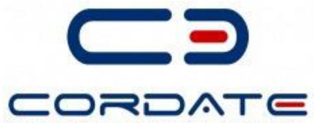

# Jellentés 

## Az állami tulajdonú gazdasági társaságok ellenőrzése

CORDATE Gazdaságfejlesztő és Ellátó Központ Zrt.
2018.

---

# Jellentés 

## Az állami tulajdonú gazdasági társaságok ellenőrzése

CORDATE Gazdaságfejlesztő és Ellátó Központ Zrt.
2018. 41. hó 22. nap

---

# AZ ELLENŐRZÉST FELÜGYELTE: 

PETŐ KRISZTINA felügyeleti vezető

## AZ ELLENŐRZÉST VEZETTE ÉS A VÉGREHAJTÁSÁÉRT FELELŐS:

VALASTYÁNNÉ DR. VÍZHÁNYÓ JÚLIA ellenőrzésvezető

## A PROGRAM ÖSSZEÁLLÍTÁSÁÉRT FELELŐS:

TÓTPÁL SZABOLCS osztályvezető

IKTATÓSZÁM: EL-0420-031/2018.
TÉMASZÁM: 2469
ELLENŐRZÉS-AZONOSÍTÓ SZÁM: V081438

---

# TARTALOMJEGYZÉK 

■ ÖSSZEGZÉS ..... 5
■ AZ ELLENŐRZÉS CÉLJA ..... 6
■ AZ ELLENŐRZÉS TERÜLETE ..... 7
■ AZ ELLENŐRZÉS HÁTTERE, INDOKOLTSÁGA ..... 8
■ A JELENTÉS LÉNYEGES KÉRDÉSKÖREI ..... 9
■ AZ ELLENŐRZÉS HATÓKÖRE ÉS MÓDSZEREI ..... 10
■ MEGÁLLAPÍTÁSOK ..... 12
■ JAVASLATOK ..... 16
■ MELLÉKLETEK ..... 19
I. sz. melléklet: Értelmező szótár ..... 19
■ FÜGGELÉK: ÉSZREVÉTELEK ..... 25
■ RÖVIDÍTÉSEK JEGYZÉKE ..... 29

---

.

---

# ÖSSZEGZÉS 

A Magyar Nemzeti Vagyonkezelő Zrt. a CORDATE Gazdaságfejlesztő és Ellátó Központ Zrt. felett a tulajdonosi jogokat nem gyakorolta szabályszerűen. A CORDATE Gazdaságfejlesztő és Ellátó Központ Zrt. szabályozottsága, gazdálkodása, vagyongazdálkodása nem volt szabályszerű, így az elszámoltathatóságot és az átláthatóságot nem biztositották.

## Az ellenőrzés társadalmi indokoltsága

Az állami vagyonnal való gazdálkodás alapvető célja az állami vagyon átlátható, rendeltetésszerű és felelős felhasználásának biztosítása. Az állami tulajdonban álló gazdálkodó szervezetek államot megillető társasági részesedése a nemzeti vagyon részét képezi és legfőbb rendeltetése szerint a közfeladatok ellátását szolgálja.

Az Állami Számvevőszék stratégiájában megfogalmazta, hogy az államháztartáson kívülre nyújtott költségvetési támogatások és ingyenes vagyonjuttatások, valamint az államháztartáson kívül múködő közfeladat-ellátó rendszerek ellenőrzéseivel hozzájárul ahhoz, hogy a közpénzeket az államháztartáson kívül múködő szervezetek is átlátható, rendezett módon használják fel a közfeladatok szerződésben vállalt ellátása érdekében.

Az Állami Számvevőszék céljaival és a társadalmi igénnyel összhangban, valamint a gazdasági társaságok kiemelt fontosságú szerepe miatt került sor a CORDATE Gazdaságfejlesztő és Ellátó Központ Zrt. ellenőrzésére.

## Főbb megállapítások, következtetések, javaslatok

A Magyar Nemzeti Vagyonkezelő Zrt. a jogszabályi előírások ellenére a Társaság tőkehelyzetének rendezéséről nem gondoskodott.

A CORDATE Zrt. 2013. és 2016. években nem rendelkezett a jogszabály által előírt, a számviteli politika keretében elkészítendő az eszközök és források értékelési szabályzatával, továbbá számlarenddel. A leltározási és leltárkészítési szabályzat nem feleltek meg a jogszabályi előírásnak. Mindezek alapján nem volt biztosított gazdálkodási és vagyongazdálkodási feladatok szabályszerű ellátása.

A jogszabályi előírás ellenére a Cordate Zrt. éves beszámolóit leltárral nem támasztották alá, ezért a beszámolók nem nyújtottak megbízható és valós képet a Társaság vagyoni, pénzügyi és jövedelmi helyzetéről és azok változásáról.

A megállapítások alapján az Állami Számvevőszék a CORDATE Gazdaságfejlesztő és Ellátó Központ Zrt. vezérigazgatójának 9 javaslatot fogalmazott meg.

---

# AZ ELLENŐRZÉS CÉLJA 

Az ellenőrzés célja annak értékelése volt, hogy a tulajdonosi jogok gyakorlása szabályszerű volt-e. A gazdálkodó szervezet szabályozottsága, gazdálkodása és vagyongazdálkodási tevékenysége megfelelt-e a jogszabályi és a tulajdonosi előírásoknak; biztosítva volt-e a közfeladatok átláthatósága és elszámoltathatósága érdekében a közszolgáltatás díjának megalapozottsága szabályszerű önköltségszámítással. A vagyonváltozást eredményező döntések esetében a tulajdonosi jogok gyakorlója és a gazdálkodó szervezet szabályszerűen jártak-e el.

---

# AZ ELLENŐRZÉS TERÜLETE 

## CORDATE Gazdaságfejlesztő és Ellátó Központ Zártkörüen Müködő Részvénytársaság

A miskolci székhelyű, 100\%-os állami tulajdonban lévő Társaságot ${ }^{1}$ Gazdaságfejlesztő és Ellátó Központ Zárkörüen Müködő Részvénytársaság néven (GEK Zrt.) a 2011. évben a Borsod-Abaúj-Zemplén Megyei Önkormányzat alapította. A Társaság elnevezése 2012. augusztus 1-jétől CORDATE Gazdaságfejlesztő és Ellátó Központ Zrt.-re változott.
2012. január 1-jétől a konszolidációs tv². alapján a Társaság tulajdonjoga a magyar államra szállt. A Társaság felett a tulajdonosi jogokat 2012. január 1-jétől a B-A-Z Megyei IK³, majd 2013. március 29-től az ellenőrzött időszak végéig az MNV Zrt. ${ }^{4}$ gyakorolta.

A Társaság fő tevékenysége alapításától kezdődően 2013. november 4éig általános közigazgatás, majd ezt követően építményüzemeltetés volt. Feladata a Borsod-Abaúj-Zemplén megye területén müködő szociális, oktatási, közművelődési és közgyűjteményi intézményekben a higiéniai, takarítási, épületüzemeltetési és karbantartási, kertészeti, étkeztetési, gépjármú üzemeltetési, rendészeti és vagyonőri feladatok ellátása volt. Közfeladatot a Társaság nem látott el, vagyonkezelésbe vett vagyonnal és saját ingatlannal nem rendelkezett.

A Társaság 2013. január 1-jén 12 leányvállalattal ${ }^{5}$ rendelkezett, melyekben 100\%-os tulajdonosi részesedése volt. A Társaság szolgáltatásainak ellátását a leányvállalatok, mint alvállalkozók végezték.

Az átlagos állományi létszám a 2013. évi 14 főről a 2016. évre 228 főre változott. A létszám növekedését az átszervezési folyamat eredményezte, mely során a leányvállalatok tevékenységét és dolgozóit a Társaság átvette. 2016. év április 30-át követően már a leányvállalatok egyike sem végzett gazdasági tevékenységet.

A Társaság az ellenőrzött időszakban - 2016. év kivételével - veszteségesen gazdálkodott. A nettó árbevétel a 2013. évi 1199,9 M Ft-ról 575,2 M Ft-ra csökkent a 2016. évre. Az árbevétel folyamatos csökkenését az okozta, hogy az átszervezések következtében a Társaság által ellátott intézményi kör egy része más fenntartókhoz került át, melyek a továbbiakban nem szerződtek a Társasággal a korábbi szolgáltatások elvégzésére.

A Társaság vezérigazgatójának személye az ellenőrzött időszakban egy alkalommal változott, a jelenlegi vezérigazgató a tevékenységét 2014. december 16-tól látta el. A Társaság könyvvizsgálatát az MNV Zrt. írta elő, éves beszámolóit könyvvizsgáló ${ }^{6}$ auditálta. A könyvvizsgáló személye az ellenőrzött időszakban háromszor változott.

A Társaság az ellenőrzött időszakban nem tartozott a kormányzati szektorba sorolt társaságok közé, és nem minősült közhasznú jogállású szervezetnek. A Társaság a Számv. tv. ${ }^{7}$ alapján mentesült az önköltségszámítás rendjére vonatkozó belső szabályzat készítésének kötelezettsége alól.

---

# AZ ELLENŐRZÉS HÁTTERE, INDOKOLTSÁGA 

Az Európai Unióban 1994. év óta hatályos túlzott hiány eljárás mindig kihívást jelentett a tagállamok számára. Az állami tulajdonú gazdálkodó szervezetek ellenőrzése kiemelten fontos a vagyon megőrzése, megóvása érdekében, valamint a kormányzati szektor elszámolásaiban megjelenő állami tulajdonú gazdálkodó szervezetek esetében, amelyekkel szemben alapvető követelmény, hogy gazdálkodásuk, működésük szabályszerű, az általuk szolgáltatott adatok minél megbízhatóbbak legyenek. Gazdálkodásuk jellemzően a közérdeklődés és a média figyelmének középpontjában áll, amihez hozzájárul a gazdálkodásuk körébe tartozó - közvetlen vagy közvetett állami tulajdonú, tehát végső soron a nemzeti vagyon részét képező - vagyon nagysága, illetve az általuk ellátott közszolgáltatások/közfeladatok minősége és hatékonysága. A közszolgáltatási árképzés megalapozottsága és a rendszeres elszámoltatás feltételeinek kialakítása az ellenőrzése során nagy hangsúlyt kap. A közszolgáltatás árában és annak támogatásában meg kell jelennie az önköltségszámítás szempontjainak, amely biztosítja a működés fenntarthatóságát (eszközpótlást) is.

Az ellenőrzés rámutathat az állami tulajdonú gazdálkodó szervezetek gazdálkodási tevékenységével jó gyakorlatokra és szabálytalanságokra. Felhívhatja a figyelmet a jogszabályi követelmények teljesítéséhez szükséges feltételek hiányosságaira, hozzájárulhat az államháztartáson kívüli, de (közvetlenül vagy közvetve) állami vagyont használó gazdálkodó szervezetek tevékenységének átláthatóságához. Ellenőrzésünk eredményeképpen javaslatainkkal, megállapításainkkal hozzájárulhatunk a nemzeti vagyonnal való gazdálkodás átláthatóságának, elszámoltathatóságának javításához.

---

# A JELENTÉS LÉNYEGES KÉRDÉSKÖREI 

1. A tulajdonosi jogok gyakorlása szabályszerű volt-e?
2. A társaság müködésének szabályozottsága megfelelt-e az előírásoknak? A társaságnál a gazdálkodási, vagyongazdálkodási és adatszolgáltatási feladatok ellátása szabályszerű volt-e?

---

# AZ ELLENŐRZÉS HATÓKÖRE ÉS MÓDSZEREI 

## Az ellenőrzés típusa

Megfelelőségi ellenőrzés.

## Az ellenőrzött időszak

A 2013. - 2016. évek, a 2016. évi beszámoló jóváhagyásáig tartó időszak.

## Az ellenőrzés tárgya

Állami tulajdonban lévő gazdasági társaság gazdálkodása, kiemelten vagyongazdálkodási tevékenysége, a tulajdonosi jogok gyakorlása, továbbá a kormányzati szektorba sorolt gazdasági társaság gazdálkodásának a kormányzati szektor hiányára és az államadósságra befolyással bíró elemei.

## Az ellenőrzött szervezet

A CORDATE Gazdaságfejlesztő és Ellátó Központ Zrt., valamint a Magyar Nemzeti Vagyonkezelő Zrt.

## Az ellenőrzés jogalapja

Az ellenőrzés jogalapját az ÁSZ tv. ${ }^{8}$ 1. § (3) bekezdése és 5. § (3)-(5) bekezdése képezi.

## Az ellenőrzés módszerei

Az ellenőrzést az ellenőrzési program ellenőrzési kérdései, az ellenőrzött időszakban hatályos jogszabályok, az ÁSZ ${ }^{9}$ ellenőrzés szakmai szabályok és módszertanok figyelembevételével végeztük.

Az ellenőrzés ideje alatt az ellenőrzött szervezettel történő kapcsolattartást az ÁSZ Szervezeti és Múködési Szabályzatának vonatkozó előírásai alapján biztosítottuk.

A teljes ellenőrzött időszakra vonatkozóan került ellenőrzésre a gazdasági társaság tervezési, beszámolási, közzétételi, adatszolgáltatási kötelezettségének, valamint belső ellenőrzési tevékenységének szabályszerűsége. A 2013. és 2016. évekre vonatkozóan a tulajdonosi joggyakorlást, a

---

gazdasági társaság múködésének szabályozottságát, a bevételei és ráfordításai elszámolását, illetve vagyongazdálkodásának szabályszerűségét is ellenőriztük.

Az ellenőrzésre a nemzetgazdasági szempontból kiemelt jelentőségú nemzeti vagyon körébe tartozó gazdálkodó szervezeteknél és a többségi állami tulajdonban álló gazdálkodó szervezeteknél került sor. A program szerinti feladatokat a kiválasztott gazdálkodó szervezeteknél (társaságoknál) és azok többségi tulajdonban lévő leányvállalatainál, valamint a tulajdonosi jogok gyakorlójánál kellett végrehajtani.

A személyi jellegú ráfordítások esetében az ellenőrzött tételek kijelölése véletlen mintavételi eljárás alkalmazásával történt a teljes sokaságból.

A bevételek és a ráfordítások valamint az immateriális javak, tárgyi eszközök esetében az ellenőrzés azokra a legnagyobb értékű tételekre - a lényeges sokaságra - terjedt ki, melyek összértéke eléri a teljes sokaság összértékének 50\%-át.

A bevételek és a ráfordítások elszámolásának szabályszerűségét a lényeges sokaságból véletlen mintavételi eljárással kiválasztott tételek alapján ellenőriztük.

A mintavétellel ellenőrzött területek esetében minden egyes tétel vonatkozásában a szabályszerűségre vonatkozó kérdéseket tettünk fel, amelyek eredménye összesítésre került. „Szabályszerűnek" értékeltünk egy ellenőrzött területet, amennyiben 95\%-os bizonyossággal az ellenőrzött sokaságban az átlagos hibaarány legfeljebb 10\%, „nem szabályszerűnek", amennyiben 10\%-nál magasabb arányt képviselt.

Az ellenőrzési kérdések megválaszolásához szükséges bizonyítékok megszerzése a következő ellenőrzési eljárások alkalmazásával történik: megfigyelés, kérdésfeltevés (információkérés), összehasonlítás, valamint elemző eljárás. Az ellenőrzési bizonyítékként felhasználható adatforrások közé tartoznak egyrészt az ellenőrzési programban felsorolt adatforrások, másrészt adatforrás lehet még minden - az ellenőrzés folyamán - feltárt, az ellenőrzés szempontjából információkat tartalmazó dokumentum.

Az ellenőrzést a kérdésekre adott válaszok kiértékelésével, valamint a megjelölt adatforrások felhasználásával, továbbá az adott időszakban hatályos jogszabályok figyelembevételével kellett lefolytatni.

A program ellenőrzési szempontjait a szabályszerűségi szempontok szerinti ellenőrzésben a jogszabályi előírások, belső utasítások, belső szabályozók, a helyénvalósági szempontok szerinti ellenőrzésben a tulajdonosi joggyakorlók általánosan elfogadott jó gyakorlat szerinti teljesítmény előírásai, ajánlásai, értékelési kritériumai mentén határoztuk meg.

---

# 1. A tulajdonosi jogok gyakorlása szabályszerű volt-e? 

Összegző megállapítás

Az MNV Zrt. Társaság feletti tulajdonosi joggyakorlása nem volt szabályszerű.

A TULAJDONOSI JOGOK GYAKORLÁSÁNAK RENDJÉT az MNV Zrt., a Gt. ${ }^{10}$, a Ptk. ${ }^{11}$, a Vtv. ${ }^{12}$, az Nvtv. ${ }^{13}$ előírásainak megfelelően, az Alapító okirat ${ }_{2,3,4}{ }^{14}$-ben, és az Alapszabály ${ }_{1,2}{ }^{15}$-ben határozta meg. A Társaság feletti tulajdonosi joggyakorlás részleteit az MNV Zrt. SZMSZ ${ }_{1.6}{ }^{16}$-e határozta meg. Az MNV Zrt. a Gt.-ben, valamint a Ptk. ${ }_{2}$-ben foglaltaknak megfelelően meghatározta a tulajdonosi joggyakorló képviseletét a Társaság felügyelőbizottság ${ }^{17}$-ban. A felügyelőbizottság a 2013. november 4-éig terjedő időszakban a Taktv. ${ }^{18} 4$. § (2) bekezdését megsértve három helyett négy tagból állt. 2013. november 5-ét megelőzően a Gt. 34. § (4) bekezdése ellenére a felügyelőbizottság ügyrenddel nem rendelkezett.

A 2013. ÉS 2016. ÉVEK BESZÁMOLÓINAK elfogadásáról, jóváhagyásáról az MNV Zrt. a Gt. és a Ptk. ${ }_{2}$ előírásai szerint a felügyelőbizottság írásbeli jelentésének birtokában döntött. A Társaság 2013. évi éves beszámolóját 2015. évben a 263/2015. (VII. 30.) számú alapítói határozattal, a 2016. évi éves beszámolóját a 611/2017. (XII. 12.) számú alapítói határozattal fogadta el az MNV Zrt.

VESZTESÉG MIATT a Társaság saját tőkéje az ellenőrzött időszakban mindvégig negatív volt. A felügyelőbizottság, valamint a könyvvizsgálók jelentéseikben figyelemfelhívást fogalmaztak meg az MNV Zrt. részére a saját tőke rendezése érdekében. Az MNV Zrt. a Gt. 51. § (1) és a Ptk. 2 3:133. § (2) bekezdésében előírt döntési és intézkedési kötelezettségének. nem tett eleget. Az MNV Zrt. 2016. december 21-én a 832/2016. (XII. 21.) Igazgatósági határozattal 500 M Ft összegű tőkeemelésről döntött a saját tőke jogszabályi előírásnak megfelelő biztosítása érdekében.

A TÁRSASÁG JAVADALMAZÁSI SZABÁLYZATÁT ${ }_{1,2}{ }^{19}$ az MNV Zrt. a Taktv.-ben előírtak szerint megalkotta.

---

# 2. A társaság múködésének szabályozottsága megfelelt-e az előírásoknak? A társaságnál a gazdálkodási, vagyongazdálkodási és adatszolgáltatási feladatok ellátása szabályszerű volt-e? 

Összegző megállapítás

A Társaság múködésének szabályozottsága nem felelt meg a jogszabályi előírásoknak. A Társaságnál a gazdálkodási, vagyongazdálkodási és adatszolgáltatási feladatok ellátása nem volt szabályszerű.
2.1. számú megállapítás

A Társaság múködésének szabályozottsága a 2013. és 2016. években nem felelt meg a jogszabályi előírásoknak.

A SZÁMVITELI POLITIKA ${ }^{20}$ a 2013. és 2016. években nem felelt meg a Számv. tv.-ben foglalt előírásoknak. A Számviteli politikán a Társaság a törvényi változásokat nem vezette át, ezzel megsértette a Számv. tv. 14. § (11) bekezdésében foglaltakat. A Számviteli politikában nem határozták meg, hogy a Társaság mit tekint kivételes nagyságú vagy előfordulású bevételnek, költségnek, ráfordításnak; nem vezették át rajta a rendkívüli eredmény és a mérleg szerinti eredmény megszűnését; valamint a jelentős, nem jelentős hiba fogalmának módosulását.

AZ ESZKÖZÖK ÉS FORRÁSOK ÉRTÉKELÉSI SZABÁLYZATÁVAL a Társaság a 2013. és 2016. években nem rendelkezett, megsértve a Számv. tv. 14. § (5) bekezdés b) pontját.

## LELTÁROZÁSI SZABÁLYZATTAL ${ }^{21}$ ÉS PÉNZKEZELÉSI SZABÁLYZATTAL ${ }^{22}$ a Társaság a Számv. tv. 14. § (5) bekezdés a) és d) pontjában előírtaknak megfelelően rendelkezett. A Leltározási szabályzat 5. 1. pontja az ingatlanokra vonatkozóan öt évenkénti mennyiségi leltárfelvételt írt elő, mely nem felelt meg a Számv. tv. 69. § (3) bekezdésében előírt legalább három évenkénti kötelező leltározásnak.

SZÁMLARENDDEL a 2013. és 2016. években a Társaság nem rendelkezett, megsértve a Számv. tv. 161. § (1) bekezdését. A Társaság az ellenőrzött években nem készítette el a bizonylati rendjét, figyelmen kívül hagyva a Számv. tv. 161. § (2) bekezdés d) pontjában előírtakat.
2.2. számú megállapítás

A 2013. és 2016. évben a Társaság gazdálkodása és vagyongazdálkodása nem volt szabályszerű.

A 2013. évben a Társaság szabályozottsága nem felelt meg a Számv. tv.ben foglalt előírásoknak, ezáltal nem volt biztosított a pénzügyi-számviteli feladatok szabályszerű ellátása. A Társaság gazdálkodási tevékenysége a 2013. évben nem volt szabályszerű.

AZ ÉRTÉKESÍTÉS NETTÓ ÁRBEVÉTELÉNEK és az egyéb bevételek, pénzügyi műveletek bevételeinek elszámolása a 2016. évben a Számv. tv. előírásainak megfelelően, szabályszerűen történt. Az értékcsökkenés elszámolása a 2016. évben szabályszerű volt.

---

AZ ANYAGJELLEGŰ ÉS EGYÉB RÁFORDÍTÁSOK, valamint a pénzügyi műveletek ráfordításainak elszámolása a 2016. évben nem volt szabályszerű. A mintatételek vonatkozásában jellemző hiányosság volt, hogy a ráfordítás elszámolását a Számv. tv. 165. § (2) bekezdésben foglaltak ellenére nem támasztotta alá a Számv. tv. 166. § (1) bekezdésében előírt számviteli bizonylat.

A SZEMÉLYI JELLEGŰ RÁFORDÍTÁSOK elszámolása a 2016. évben nem volt szabályszerű, mert a Számv. tv. 165. § (1)-(2) bekezdésében előírtak ellenére a számviteli elszámolásait munkaszerződéssel nem támasztotta alá.

A VAGYON NYILVÁNTARTÁSA nem volt szabályszerű. A Társaság a 2013. - 2016. évi beszámolók mérlegtételeit mennyiségben és értékben alátámasztó leltárt nem készített a Számv. tv. 69. § (1)-(3) bekezdésében foglaltak ellenére. A Társaság megsértette a Számv. tv. 15. § (3) bekezdésében meghatározott valódiság elvét. A 2013. évi és a 2016. évi éves beszámolót a könyvvizsgáló a Számv. tv. 3. § (13) bekezdése 1. pontja szerinti hitelesítő záradékkal látta el. A könyvvizsgáló a 2014. évi éves beszámolót a Számv. tv. 3. § (13) bekezdése 4. pontja szerint a záradék megadását elutasította. A 2015. évi éves beszámolót a könyvvizsgáló a Számv. tv. 3. § (13) bekezdése 2. pontja szerinti korlátozott záradékkal látta el.

A BEFEKTETETT PÉNZÜGYI ESZKÖZÖK értékvesztésének elszámolásánál a Társaság a 2016. évben megsértette Számv. tv. 54. § (1) bekezdése és a 3. § (9) bekezdés 12. pontját, mert a Társaságnak 100\%-os értékvesztést kellett volna elszámolnia a kapcsolt vállalkozásban lévő részesedések után, mivel minden leányvállalatának negatív összegű volt a saját tőkéje. A 2016. évben az el nem számolt értékvesztés összege 27,5 M Ft volt.
2.3. számú megállapítás

A Társaság beszámolási és adatszolgáltatási kötelezettségét nem a törvényi előírások szerint teljesítette, közzétételi kötelezettségének nem tett eleget.

BESZÁMOLÁSI KÖTELEZETTSÉGÉT a Társaság megsértette, mert az ellenőrzött évek éves beszámolóit a Számv. tv. 4. § (1) bekezdése szerint és a Számv. tv. 153. § (1) bekezdésében előírt határidőre nem készítette el. A Társaság a Számv. tv. 153. § (1) bekezdésében foglalt előírásokat megsértve az éves beszámolókat a jogszabályban meghatározott határidőben nem helyezte letétbe. A Számv. tv. 154. § (1) bekezdésében foglaltak ellenére éves beszámolóit határidőben nem tette közzé. A Társaság a Taktv. 2. § (3) bekezdésében előírt adatokat a szerződéseiről nem tette közzé.

ADATSZOLGÁLTATÁSI KÖTELEZETTSÉGET a Társaság részére az MNV Zrt. Monitoring szabályzat ${ }_{1,2}{ }^{23}$-a 2013. december 19től írt elő. Meghatározásra került a Társaság által szolgáltatandó adatok köre, az adatszolgáltatás gyakorisága, formája, folyamata.

---

A Monitoring szabályzat ${ }_{1}$ 2. sz. mellékletében foglalt kötelezettségének a Társaság a 2014-2015. években nem tett eleget. A 2016. évben a Monitoring szabályzat ${ }_{2}$-ben előírt adatszolgáltatási kötelezettségének a Társaság eleget tett.

---

# JAVASLATOK 

Az ÁSZ tv. 33. § (1) bekezdésében foglaltak értelmében az ellenőrzött szervezet vezetője köteles a jelentésben foglalt megállapításokhoz kapcsolódó intézkedési tervet összeállítani és azt a jelentés kézhezvételétől számított 30 napon belül az ÁSZ részére megküldeni. Amennyiben az ellenőrzött szervezet vezetője nem küldi meg határidőben az intézkedési tervet, vagy továbbra sem elfogadható intézkedési tervet küld, az Állami Számvevőszék elnöke az ÁSZ tv. 33. § (3) bekezdése a) és b) pontjaiban foglaltakat érvényesítheti.

## A CORDATE Gazdaságfejlesztő és Ellátó Központ Zrt. vezérigazgatójának

1. Intézkedjen annak érdekében, hogy a számviteli politikán törvénymódosítás esetén a változásokat a jogszabályi előírásnak megfelelően vezessék keresztül.
(2.1. számú megállapítás 1. bekezdése alapján)
2. Intézkedjen a jogszabályban előírt eszközök és források értékelési szabályzatának számviteli politika keretében történő elkészítéséről.
(2.1. számú megállapítás 2. bekezdése alapján)
3. Intézkedjen annak érdekében, hogy az eszközök és források leltárkészítési és leltározási szabályzatának tartalma összhangban legyen a jogszabályi előírással.
(2.1. számú megállapítás 3. bekezdésének 2. mondata alapján)
4. Intézkedjen a jogszabályi előírásoknak megfelelő tartalmú számlarend elkészítése iránt.
(2.1. számú megállapítás 4. bekezdése alapján)
5. Intézkedjen annak érdekében, hogy a ráfordítások esetében a számviteli (könyvviteli) nyilvántartásokba csak szabályszerűen kiállított bizonylat alapján jegyezzenek be adatokat.
(2.2. számú megállapítás 3. bekezdésének 2. mondata és a 4. bekezdése alapján)
6. Intézkedjen a jogszabályi előírásnak megfelelő leltár összeállítása iránt.
(2.2. számú megállapítás 5. bekezdésének 1. és 2. mondata alapján)

---

7. Intézkedjen a kapcsolt vállalkozásban lévő részesedések utáni értékvesztés jogszabályi előírásnak megfelelő elszámolása érdekében.
(2.2. számú megállapítás 6. bekezdése alapján)
8. Intézkedjen a beszámolási, valamint a kapcsolódó letétbe helyezési és közzétételi kötelezettséggel kapcsolatos határidők betartása érdekében.
(2.3. számú megállapítás 1. bekezdésének 1-3. mondatai alapján)
9. Intézkedjen a Taktv. szerinti közzétételi kötelezettségének teljesítése iránt.
(2.3. számú megállapítás 1. bekezdésének 4. mondata alapján)

---

.

---

# MELLÉKLETEK 

## I. SZ. MELLÉKLET: ÉRTELMEZŐ SZÓTÁR

állami vagyon
a) Az állam tulajdonában lévő dolog, valamint a dolog módjára hasznosítható természeti erő,
b) az a) pont hatálya alá nem tartozó mindazon vagyon, amely vonatkozásában törvény az állam kizárólagos tulajdonjogát nevesíti,
c) az állam tulajdonában lévő tagsági jogviszonyt megtestesítő értékpapír, illetve az államot megillető egyéb társasági részesedés,
d) az államot megillető olyan immateriális, vagyoni értékkel rendelkező jogosultság, amelyet jogszabály vagyoni értékű jogként nevesít.
Forrás: Vtv. 1. § (2) bekezdése
e) az állam tulajdonában lévő pénzügyi eszközök

Forrás: Vtv. 1. § (2) bekezdése
állami vagyon hasznosítása 2013. június 27-ig:
Az állami vagyont az MNV Zrt. maga kezeli, vagy szerződés - így különösen bérlet, haszonbérlet, megbízás - alapján központi költségvetési szervnek, természetes vagy jogi személynek, vagy jogi személyiséggel nem rendelkező gazdálkodó szervezetnek hasznosításra átengedi.
Forrás: Vtv. 23. § (1) bekezdése
2013. június 28-ától:
Az állami vagyonnal az MNV Zrt. maga gazdálkodik, vagy szerződés - így különösen bérlet, haszonbérlet, megbízás - alapján központi költségvetési szervnek, természetes vagy jogi személynek, vagy jogi személyiséggel nem rendelkező gazdálkodó szervezetnek hasznosításra átengedi, illetőleg vagyonkezelésbe, haszonélvezetbe adja.
Forrás: Vtv. 23. § (1) bekezdése
anyavállalat
Az a vállalkozó, amely egy másik vállalkozónál (a továbbiakban: leányvállalat) közvetlenül vagy leányvállalatán keresztül közvetetten meghatározó befolyást képes gyakorolni, mert az alábbi feltételek közül legalább eggyel rendelkezik:
a) a tulajdonosok (a részvényesek) szavazatának többségével (50 százalékot meghaladóval) tulajdoni hányada alapján egyedül rendelkezik, vagy
b) más tulajdonosokkal (részvényesekkel) kötött megállapodás alapján a szavazatok többségét egyedül birtokolja, vagy
c) a Társaság tulajdonosaként (részvényeseként) jogosult arra, hogy a vezető tisztségviselők vagy a felügyelő bizottság tagjai többségét megválassza vagy visszahívja, vagy
d) a tulajdonosokkal (a részvényesekkel) kötött szerződés (vagy a létesítő okirat rendelkezése) alapján - függetlenül a tulajdoni hányadtól, a szavazati aránytól, a megválasztási és visszahívási jogtól - döntő irányítást, ellenőrzést gyakorol.
Forrás: Számv. tv. 3. § (2) 1. pont
gazdasági társaság
A Ptk. 2 3:88. § (1) bekezdése szerint „a gazdasági társaságok üzletszerű közös gazdasági tevékenység folytatására, a tagok vagyoni hozzájárulásával létrehozott, jogi személyiséggel rendelkező vállalkozások, amelyekben a tagok a nyereségből közösen részesednek, és a veszteséget közösen viselik".
állami vagyon hasznosítására kötött szerződés
Az állami vagyon hasznosítására kötött szerződések elsődleges célja az állami vagyon hatékony működtetése, állagának védelme, értékének megőrzése, illetve gyarapítása, az állami és közfeladatok ellátásának elősegítése.
Forrás: Vtv. 23. § (2) bekezdése

---

állami vagyon használója
állami vagyon kezelője/vagyonkezelő
állami vagyon kezelője/vagyonkezelő
állami vagyon értékesítése
gazdálkodó szervezet
2014. március 14-ig:
A $\quad$ Ptk. ${ }^{25} 685 . \quad$ § c) pontja szerint gazdálkodó szervezet: „az állami vállalat, az egyéb állami gazdálkodó szerv, a szövetkezet, a lakásszövetkezet, az európai szövetkezet, a gazdasági társaság, az európai részvénytársaság, az egyesülés, az európai gazdasági egyesülés, az európai területi együttmüködési csoportosulás, az egyes jogi személyek vállalata, a leányvállalat, a vízgazdálkodási társulat, az erdő birtokossági társulat, a végrehajtói iroda, az egyéni cég, továbbá az egyéni vállalkozó." 2014. március 15-től:

A gazdasági társaság, az európai részvénytársaság, az egyesülés, az európai gazdasági egyesülés, az európai területi együttműködési csoportosulás, a szövetkezet, a lakásszövetkezet, az európai szövetkezet, a vízgazdálkodási társulat, az erdőbirtokossági társulat, az állami vállalat, az egyéb állami gazdálkodó szerv, az egyes jogi személyek vállalata, a közös vállalat, a végrehajtói iroda, a közjegyzői iroda, az ügyvédi iroda, a szabadalmi ügyvivői iroda, az önkéntes kölcsönös biztosító pénztár, a magánnyugdíjpénztár, az egyéni cég, továbbá az egyéni vállalkozó. Az állam, a helyi önkormányzat, a költségvetési szerv, az egyesület, a köztestület, valamint az alapítvány gazdálkodó tevékenységével összefüggő polgári jogi kapcsolataira is a gazdálkodó szervezetre vonatkozó rendelkezéseket kell alkalmazni.
Forrás: Ppt. ${ }^{26} 396$. §
Kapcsolt vállalkozás
kormányzati szektorba sorolt egyéb szervezet

Az a természetes vagy jogi személy, jogi személyiséggel nem rendelkező szervezet, aki, vagy amely törvény vagy szerződés alapján, bármely jogcímen (bérlet, haszonbérlet, használat stb.) állami vagyont birtokol, használ, szedi annak hasznait, hasznosít, ide nem értve a haszonélvezőt, a vagyonkezelőt és a tulajdonosi jogok gyakorlóját.
Forrás: Vtv.vhr. ${ }^{24}$ 1. § (7) a. pontja

## 2013. június 27-ig:

Az állami vagyont az MNV Zrt. maga kezeli, vagy szerződés - így különösen bérlet, haszonbérlet, megbízás - alapján központi költségvetési szervnek, természetes vagy jogi személynek, vagy jogi személyiséggel nem rendelkező gazdálkodó szervezetnek hasznosításra átengedi. Az állami vagyonra vonatkozóan az MNV Zrt. kizárólag az Nvtv-ben meghatározott személyekkel köthet vagyonkezelési szerződést.
Forrás: Vtv. 23. § (1), 27. § (1)
Állami vagyonnal az MNV Zrt. maga gazdálkodik, vagy szerződés - így különösen bérlet, haszonbérlet, megbízás - alapján központi költségvetési szervnek, természetes vagy jogi személynek, vagy jogi személyiséggel nem rendelkező gazdálkodó szervezetnek hasznosításra átengedi, illetőleg vagyonkezelésbe, haszonélvezetbe adja. Az állami vagyonra vonatkozóan az MNV Zrt. kizárólag az Nvtv-ben meghatározott személyekkel köthet vagyonkezelési szerződést.
Forrás: Vtv. 23. § (1), 27. § (1)
Állami vagyon tulajdonjogának bármely jogcímen történő, visszterhes átruházása.
Forrás: Vtv.vhr. 1. § (7) d) pont
2014. március 14-ig:

A $\quad$ Ptk. ${ }^{25} 685 . \quad$ § c) pontja szerint gazdálkodó szervezet: „az állami vállalat, az egyéb állami gazdálkodó szerv, a szövetkezet, a lakásszövetkezet, az európai szövetkezet, a gazdasági társaság, az európai részvénytársaság, az egyesülés, az európai gazdasági egyesülés, az európai területi együttműködési csoportosulás, az egyes jogi személyek vállalata, a leányvállalat, a vízgazdálkodási társulat, az erdő birtokossági társulat, a végrehajtói iroda, az egyéni cég, továbbá az egyéni vállalkozó." 2014. március 15-től:

A gazdasági társaság, az európai részvénytársaság, az egyesülés, az európai gazdasági egyesülés, az európai területi együttműködési csoportosulás, a szövetkezet, a lakásszövetkezet, az európai szövetkezet, a vízgazdálkodási társulat, az erdőbirtokossági társulat, az állami vállalat, az egyéb állami gazdálkodó szerv, az egyes jogi személyek vállalata, a közös vállalat, a végrehajtói iroda, a közjegyzői iroda, az ügyvédi iroda, a szabadalmi ügyvivői iroda, az önkéntes kölcsönös biztosító pénztár, a magánnyugdíjpénztár, az egyéni cég, továbbá az egyéni vállalkozó. Az állam, a helyi önkormányzat, a költségvetési szerv, az egyesület, a köztestület, valamint az alapítvány gazdálkodó tevékenységével összefüggő polgári jogi kapcsolataira is a gazdálkodó szervezetre vonatkozó rendelkezéseket kell alkalmazni.
Forrás: Ppt. ${ }^{26} 396$. §
Az anyavállalat és a leányvállalat és a közös vezetésű vállalkozások (fölérendelt anyavállalat esetében a minősítést a fölérendelt anyavállalat szempontjából kell elvégezni) Forrás: Számv. tv. 3. § (2) 7. pont
Az a szervezet, amely az Áht. alapján nem része az államháztartásnak, azonban az Európai Közösséget létrehozó szerződéshez csatolt, a túlzott hiány esetén követendő eljárásról szóló jegyzőkönyv alkalmazásáról szóló 2009. május 25-i 479/2009/EK rendelet szerint a kormányzati szektorba tartozik. A nemzetgazdasági miniszter 2013. június 26-án megjelent Közleményben tette közé ezen szervezetek listáját

---

közszolgáltatás
leányvállalat
meghatározó befolyás
minősített többséget biztositó részesedés

MNV Zrt.
nemzeti vagyon

Az Ebktv. ${ }^{27}$ 3. § d) pontja a következőképpen határozza meg a közszolgáltatást: „szerződéskötési kötelezettség alapján a lakosság alapvető szükségleteinek ellátására irányuló szolgáltatás, így különösen a villamos energia-, gáz-, hő-, víz-, szennyvíz- és hulladékkezelési, köztisztasági, postai és távközlési szolgáltatás, továbbá a menetrend alapján közlekedő járművekkel végzett közforgalmú személyszállítás".
Az a gazdasági társaság, amelyre az anyavállalat meghatározó befolyást képes gyakorolni
Forrás: Számv. tv. 3. § (2) 2. pont
2014. március 14-ig:

A befolyással rendelkező akkor rendelkezik egy jogi személyben meghatározó befolyással, ha annak tagja, illetve részvényese és
a) jogosult e jogi személy vezető tisztségviselői vagy felügyelőbizottsága tagjai többségének megválasztására, illetve visszahívására, vagy
b) a jogi személy más tagjaival, illetve részvényeseivel kötött megállapodás alapján egyedül rendelkezik a szavazatok több mint ötven százalékával.
A meghatározó befolyás akkor is fennáll, ha a befolyással rendelkező számára az előzőek szerinti jogosultságok közvetett módon biztosítottak. A befolyással rendelkezőnek egy jogi személyben a szavazatok több mint ötven százalékával közvetett módon való rendelkezése vagy egy jogi személyben közvetetten fennálló meghatározó befolyása megállapítása során a jogi személyben szavazati joggal rendelkező más jogi személyt (köztes vállalkozást) megillető szavazatokat meg kell szorozni a befolyással rendelkezőnek a köztes vállalkozásban, illetve vállalkozásokban fennálló szavazatával. Ha a köztes vállalkozásban fennálló szavazatok mértéke az ötven százalékot meghaladja, akkor azt egy egészként kell figyelembe venni.
Forrás: Ptk. 685/B. § (2)-(3) bekezdések
2014. március 15-től:

A befolyással rendelkező akkor rendelkezik egy jogi személyben meghatározó befolyással, ha annak tagja vagy részvényese, és
a) jogosult e jogi személy vezető tisztségviselői vagy felügyelőbizottsága tagjai többségének megválasztására, illetve visszahívására; vagy
b) a jogi személy más tagjai, illetve részvényesei a befolyással rendelkezővel kötött megállapodás alapján a befolyással rendelkezővel azonos tartalommal szavaznak, vagy a befolyással rendelkezőn keresztül gyakorolják szavazati jogukat, feltéve, hogy együtt a szavazatok több mint felével rendelkeznek.
Forrás: Ptk. 8:2. § (2) bekezdés
A minősített befolyásszerző az ellenőrzött társaságban a szavazatok legalább hetvenöt százalékával rendelkezik. (2014. március 14-ig: Gt. 52. § (2), 2014. március 15-től: Ptk. ${ }_{2}$ 3:324. §)
Az állami vagyon felett, a magyar államot megillető tulajdonosi jogok és kötelezettségek összességét - a hatályos szabályozás szerint - az állami vagyon felügyeletéért felelős miniszter (jelenleg a nemzeti fejlesztési miniszter) gyakorolja. A miniszter feladatát nagy részben az MNV Zrt., mint tulajdonosi joggyakorló szervezet útján látja el.
a) az állam vagy a helyi önkormányzat kizárólagos tulajdonában álló dolgok,
b) az a) pont hatálya alá nem tartozó, állam vagy a helyi önkormányzat tulajdonában lévő dolog,
c) az állam vagy a helyi önkormányzatot tulajdonában lévő pénzügyi eszközök, továbbá az államot vagy a helyi önkormányzatot megillető társasági részesedések,
d) az államot vagy a helyi önkormányzatot megillető bármely vagyoni értékkel rendelkező jogosultság, amelyet jogszabály vagyoni értékű jogként nevesít,

---

e) Magyarország határa által körbezárt terület feletti légtér,
f) az üvegházhatású gázok kibocsátási egységeinek kereskedelméről szóló törvény szerint kibocsátási egység és légiközlekedési kibocsátási egység, valamint az ENSZ Éghajlatváltozási Keretegyezménye és annak Kiotói Jegyzőkönyve végrehajtási keretrendszeréről szóló törvény szerinti kiotói egység,
g) állami vagy helyi önkormányzati fenntartású közgyűjtemény (muzeális intézmény, levéltár, közgyűjteményként működő kép- és hangarchívum, valamint könyvtár) saját gyűjteményében nyilvántartott kulturális javak körébe tartozó dolog, kivéve, ha az állami vagy önkormányzati tulajdon jogszerű létrejötte kétséget kizáró módon nem bizonyítható és a dologra nézve más a tulajdonjogát bizonyítja vagy a kulturális javakra vonatkozó jogszabályokban meghatározott eljárás keretében valószínűsíti (g. pont módosult 2013. december 7-től),
h) a régészeti lelet,
i) a nemzeti adatvagyon körébe tartozó állami nyilvántartások fokozottabb védelméről szóló törvény szerinti nemzeti adatvagyon.
Forrás: Nvtv. 1. § (2)
nemzeti vagyon hasznosítása

A tulajdonosi joggyakorló vagy a nemzeti vagyon használója által a nemzeti vagyon birtoklásának, használatának, hasznok szedése jogának bármely - a tulajdonjog átruházását nem eredményező - jogcímen történő átengedése, ide nem értve a vagyonkezelésbe adást, valamint a haszonélvezeti jog alapítását.
Forrás: Nvtv. 3. § (1) 4. pont
rábízott vagyon

Egyrészt minden a Vtv. alkalmazásában állami vagyonnak minősülő vagyon, amit az MNV Zrt. kezel és nyilvántart.
Másrészt az a vagyon, amely felett a magyar állam nevében az MFB Zrt. gyakorolja a tulajdonosi jogokat.
Forrás: MFB tv. ${ }^{28}$ 3. § (9)
A rábízott vagyon a tulajdonosi jogokat gyakorló szervezetek saját vagyonától elkülönítendő.
Forrás: Vtv. 22. § (6)
többségi befolyást biztosító részesedés
2014. március 14-ig: Többségi befolyás: az olyan kapcsolat, amelynek révén természetes személy, jogi személy vagy jogi személyiség nélküli gazdasági társaság (a továbbiakban együtt: befolyással rendelkező) egy jogi személyben a szavazatok több mint ötven százalékával vagy meghatározó befolyással rendelkezik.
Forrás: Ptk. ${ }_{1}$ 685/B. § (1)
2014. március 15-től: Többségi befolyás az olyan kapcsolat, amelynek révén természetes személy vagy jogi személy (befolyással rendelkező) egy jogi személyben a szavazatok több mint felével vagy meghatározó befolyással rendelkezik.
Forrás: Ptk. ${ }_{2}$ 8:2. § (1)
2014. március 14-ig:

Az állami vagyon kezelőjét, haszonélvezőjét, használóját megillető jogok gyakorlását, annak szabályszerűségét, célszerűségét az MNV Zrt. - szükség szerint területi szervei útján - ellenőrzi.

# 2014. március 15 -től: 

Az állami vagyon használóját, vagyonkezelőjét és haszonélvezőjét megillető jogok gyakorlását, annak szabályszerűségét, a kötelezettségek teljesítését, valamint a vagyon rendeltetése szerinti célszerűségét a tulajdonosi joggyakorló rendszeresen ellenőrzi.
Forrás: Vtv.vhr. 20. § (1)

---

tulajdonosi jogok gyakor- 1. lója

# 2013. június 27-ig: 

Az állami vagyon felett a magyar államot megillető tulajdonosi jogok és kötelezettségek összességét - ha törvény eltérően nem rendelkezik - az állami vagyon felügyeletéért felelős miniszter (a továbbiakban: miniszter) gyakorolja, aki e feladatát a Magyar Nemzeti Vagyonkezelő Zártkörűen Működő Részvénytársaság (a továbbiakban: MNV Zrt.), a Magyar Fejlesztési Bank, illetve a tulajdonosi joggyakorló szervezet útján látja el. A miniszter miniszteri rendeletben, a törvényben meghatározott állami vagyoni kör tekintetében, meghatározott időtartamra, a joggyakorlás egyes szabályainak meghatározásával - az őt megillető tulajdonosi jogok és kötelezettségek összességének, illetve azok meghatározott részének gyakorlóját az Áht. szerinti központi költségvetési szervek, ezek intézménye, továbbá a 100\%-ban állami tulajdonban álló gazdasági társaságok közül kijelölheti.
Forrás: Vtv. 3. § (1) és (2)

## 2013. június 28-ától:

A rábízott állami vagyon felett az államot megillető tulajdonosi jogok és kötelezettségek összességét tulajdonosi joggyakorlóként:
a) ha törvény vagy miniszteri rendelet eltérően nem rendelkezik, a Magyar Nemzeti Vagyonkezelő Zártkörűen Működő Részvénytársaság (a továbbiakban: MNV Zrt.),
b) törvényben kijelölt személy vagy
c) az állami vagyon felügyeletéért felelős miniszter (a továbbiakban: miniszter) által rendeletben kijelölt személy gyakorolja.
[...] A miniszter e törvény felhatalmazása alapján - a meghatározott célok hatékonyabb elérése érdekében, miniszteri rendeletben, az ott meghatározott állami vagyoni kör tekintetében, meghatározott időtartamra - e törvény keretei között, a joggyakorlás egyes szabályainak meghatározásával - az államot megillető tulajdonosi jogok és kötelezettségek összességének, illetve azok meghatározott részének gyakorlóját az Áht. szerinti központi költségvetési szervek, ezek intézménye, továbbá a 100\%-ban állami tulajdonban álló gazdasági társaságok közül kijelölheti.
Forrás: Vtv. 3. § (1) és (2)
2.

Aki a nemzeti vagyon felett az államot vagy a helyi önkormányzatot megillető tulajdonosi jogok és kötelezettségek összességének gyakorlására jogosult
Forrás: Nvtv. 3. § (1) 17. pontja
vagyonkezelői jog

## 2013. június 27-től:

A vagyonkezelő köteles a vagyontárgy értékét megőrizni, állagának megóvásáról, jó karban tartásáról, működtetéséről gondoskodni, továbbá - a központi költségvetési szervek kivételével - díjat fizetni vagy a szerződésben előírt más kötelezettséget teljesíteni.
Forrás: Vtv. 27. § (2)

## 2013. június 28-ától december 31-ig:

A vagyonkezelő köteles a vagyontárgy állagának megóvásáról, jó karbantartásáról, működtetéséről gondoskodni, továbbá - a központi költségvetési szervek kivételével díjat fizetni, jogszabályban és szerződésben előírt más kötelezettségét teljesíteni, valamint a vagyontárgyat jogszabályban vagy szerződésben meghatározott célnak megfelelően használni. Amennyiben a vagyonkezelő ezen kötelezettségének nem tesz eleget, a tulajdonosi joggyakorló jogosult a szerződést azonnali hatállyal felmondani.
Forrás: Vtv. 27. § (2)

---

# 2014. január 1-jétől: 

A vagyonkezelő köteles a vagyontárgy állagának megóvásáról, jó karbantartásáról, működtetéséről gondoskodni, jogszabályban és szerződésben előírt más kötelezettségét teljesíteni, valamint a vagyontárgyat jogszabályban vagy szerződésben meghatározott célnak megfelelően használni.
A vagyonkezelő - a központi költségvetési szervek és a kizárólag közfeladatot ellátó nem központi költségvetési szerv vagyonkezelők kivételével - köteles díjat fizetni, jogszabályban és szerződésben előírt más kötelezettségét teljesíteni, valamint a vagyontárgyat jogszabályban vagy szerződésben meghatározott célnak megfelelően használni. Amennyiben a vagyonkezelő ezen kötelezettségeinek nem tesz eleget, a tulajdonosi joggyakorló jogosult a szerződést azonnali hatállyal felmondani.
Forrás: Vtv. 27. § (2), (2a)

---

# FÜGGELÉK: ÉSZREVÉTELEK 

A jelentéstervezetet a Számvevőszék 15 napos észrevételezésre megküldte az ellenőrzött szervezetek vezetőinek az ÁSZ tv. 29. $\left.\int^{\circ}\right(1)$ bekezdése előírásának megfelelően.

A CORDATE Gazdaságfejlesztő és Ellátó Központ Zrt. vezérigazgatója a jelentéstervezet megállapításaira írásban észrevételt tett, a Magyar Nemzeti Vagyonkezelő Zrt. vezérigazgatója a jelentéstervezet megállapításaira nem tett észrevételt.
Az ÁSZ tv. 29. § (3) bekezdésével összhangban az ÁSZ a Függelékben feltünteti az ellenőrzés megállapításaival kapcsolatban tett, figyelembe nem vett észrevételeket, és megindokolja, hogy azokat miért nem fogadta el.
I. A 2.1. számú megállapításra („A Társaság müködésének szabályozottsága a 2013. és 2016. években nem felelt meg a jogszabályi elöírásoknak.") tett észrevétel.
A vezérigazgató észrevételében jelezte, hogy a CORDATE Gazdaságfejlesztő és Ellátó Központ Zrt. (továbbiakban: társaság) a 2016. évi beszámoló összeállítását - a 2014-2015. évi gazdasági események újrakönyvelését követően - csak a 2015. évi beszámoló 2017. május 24-ei elfogadása után tudta megkezdeni. Az újrakönyvelésről a - tulajdonosi jogokat gyakorló - Magyar Nemzeti Vagyonkezelő Zrt. (továbbiakban: MNV Zrt.) döntött a 2014. évi beszámoló auditálása során a társaság könyvvizsgálója által feltárt hibákra tekintettel. A társaság a számviteli politikáját, az eszközök és források értékelési szabályzatát és a számlarendet a 2017. október 1. napjától azzal a kiegészítéssel léptette hatályba, hogy a szabályzatokban foglaltakat a 2016. évi beszámoló elkészítése során is alkalmazni kell. A 2017. október 1. napjától hatályos számviteli politikában a társaság szabályozta, hogy mit tekint kivételes nagyságú vagy előfordulású bevételnek, költségnek, ráfordításnak, definiálta a jelentős hiba fogalmát, továbbá a számviteli politikán és a számlarenden átvezetésre került a rendkívüli eredmény és a mérleg szerinti eredmény megszűnése. A 2016. évi beszámolót a társaság 2017. november 14. napján fogadta el.
A vezérigazgató az észrevételében a 2013. évre vonatkozó megállapítást nem vitatta. A 2016. évet érintő megállapítást az észrevételben foglaltak megerősítik, tekintettel arra, hogy a megállapítással érintett szabályzatokat a társaság az ellenőrzött 2013-2016. közötti időszakot követően, 2017. október 1. napjától léptette hatályba. Az EL-0292-003/2017. iktatószámú ellenőrzési programban meghatározottak szerint az ellenőrzött időszak a 20132016. évek, valamint a 2016. évi beszámoló jóváhagyásáig tartó időszak. A számvitelről szóló 2000. évi C. törvény 153. § (1) bekezdés szerint az elfogadott beszámolót az adott üzleti év mérleg fordulónapját követő ötödik hónap utolsó napjáig kell letétbe helyezni. Az észrevételben foglaltak alapján a társaság a 2016. évi beszámolót - a törvényben meghatározott határidőn túl - 2017. november 14. napján fogadta el. A társaság a jogszabályban meghatározott határidőn túl elkészített beszámoló összeállítása során az ellenőrzött időszakot követő időponttól

[^0]
[^0]:    * 29. § (1) Az Állami Számvevőszék az ellenőrzési megállapításait megküldi az ellenőrzött szervezet vezetőjének vagy az általa megbízott személynek, és annak, akinek személyes felelősségét állapította meg.
    (2) Az ellenőrzött szervezet vezetője és a felelősként megjelölt személy az ellenőrzés megállapításaira tizenöt napon belül írásban észrevételt tehet.
    (3) Az Állami Számvevőszék az észrevételre a beérkezésétől számított harminc napon belül írásban válaszol. A figyelembe nem vett észrevételeket köteles a jelentésben feltüntetni, és megindokolni, hogy azokat miért nem fogadta el.

---

- 2017. október 1. napjától — hatályos számviteli politikát (visszamenőleg) alkalmazta. Fentiekből következik, hogy a társaság a 2016. évre vonatkozóan a számviteli politikáját nem aktualizálta, továbbá az eszközök és források értékelési szabályzatával, valamint számlarenddel nem rendelkezett az ellenőrzött időszakban, ezért a jelentéstervezet módosítása nem indokolt.

# II. A 2.2. számú megállapításon belül a 3. bekezdésre tett észrevétel. 

A vezérigazgató észrevételében jelezte, hogy a költségek és ráfordítások elszámolása a 2016. évben minden esetben külső és belső számviteli bizonylaton alapult. Külső számviteli bizonylatként számla, szerződés, bíróság előtt kötött egyezségről készült jegyzőkönyv alapozta meg a költség-, ráfordítás elszámolást, belső bizonylatként pedig a társaság által készített ún. vegyes bizonylatok szolgálták a költségek és ráfordítások számviteli elszámolását. A vezérigazgató észrevételében az ellenőrzésre kiválasztott mintatételek vonatkozásában részletezte az ÁSZ részére - törvényes határidőn belül - megküldött bizonylatok tartalmát.

Az ÁSZ a ráfordítások elszámolásának szabályszerűségét a jelentéstervezet „Az ellenőrzés módszerei" fejezetben meghatározottak szerint a lényeges sokaságból véletlen mintavételi eljárással kiválasztott tételek alapján ellenőrizte. A ráfordítások esetében az ellenőrzés azokra a legnagyobb értékű tételekre - a lényeges sokaságra - terjedt ki, amelyek összértéke elérte a teljes sokaság összértékének 50\%-át. A mintatételek vonatkozásában a szabályszerűségre vonatkozó kérdésekre adott válaszok eredményét értékeltük. „Szabályszerűnek" értékeltünk egy ellenőrzött területet, amennyiben 95\%-os bizonyossággal az ellenőrzött sokaságban az átlagos hibaarány legfeljebb 10\%, „nem szabályszerűnek", amennyiben 10\%-nál magasabb arányt képviselt.

Az EL-0638-018/2018. iktatószámú adatbekérő levél 2. sz. melléklete tartalmazta a társaság által feltöltendő dokumentumokat az anyagjellegű ráfordítások, egyéb ráfordítások és pénzügyi műveletek ráfordításai kiválasztott tételeinek vonatkozásában, többek között a ráfordítás elszámolását megalapozó szerződéseket. A bekért dokumentumok között a 2016. évi ráfordítások elszámolása mintatételeit érintően például nem került feltöltésre a fizetendő kamat elszámolását és elhatárolását alátámasztó kölcsönszerződés, amelynek hiányában a kölcsön folyósítás időpontja, a kamat mértéke, illetve a kamatfizetés feltételei nem voltak megállapíthatók, így a kamat elszámolását a számvitelről szóló 2000. évi C. törvény (továbbiakban: Számv. tv.) 166. § (1) bekezdése szerinti számviteli bizonylat nem támasztotta alá. Nem került becsatolásra továbbá az általános jogi tanácsadói szolgáltatásra nyújtására létrejött, 2016. évben hatályos megbízási szerződés, a társaság csak a 2016. évi szerződés meghosszabbítására vonatkozó szerződés módosítást csatolta. Az ÁSZ részére megküldött ellenőrzési dokumentumok között megtalálható, a 2018. március 27-én kelt teljességi és hitelességi nyilatkozatban a 152., 157., 161., 165., 174., 181. és 185. sorszám alatt megnevezett szerződés kelte 2017. január 7. volt, hatálya 2017. június 30ig tartott, így a 2016. évi költségek elszámolását nem támasztotta alá. A beszerzett munkaruhák esetében az anyagköltségként történő számviteli elszámolás alapját képező bizonylat nem felelt meg a Számv. tv. 167. § (1) bekezdés h) és i) pontjában foglalt tartalmi követelményeknek.

Fentiekre tekintettel észrevételeit nem fogadtuk el, a jelentéstervezet módosítása nem indokolt.

## III. A 2.2. számú megállapításon belül a 4. bekezdésre tett észrevétel.

A vezérigazgató észrevételében kifejtett álláspontja szerint a társaságnál a személyi jellegű ráfordítások elszámolása a 2016. évben szabályszerű volt. A társaság a számviteli elszámolásait munkaszerződéssel támasztotta alá, tekintettel arra, hogy az érintett munkavállalók vonatkozásában nem merült fel a munkaszerződés módosítását igénylő körülmény vagy a felek közös megegyezésükkel a munkaszerződés feltételeit módosították. A társaság azon munkavállalóinak esetében, akiknek alapbére 2016. január 1. napján nem érte el a kötelező legkisebb munkabér (minimálbér) és a garantált bérminimum megállapításáról szóló 454/2015. (XII. 29.) Korm. rendeletben a munkakörükre vonatkozóan előírt legkisebb kötelező mértéket, a munkaszerződésben meghatározott havi alapbérük - a munkaszerződés módosítása nélkül, annak jogszabályban alapuló módosulásával - a jogszabályi előírás szerinti mértéknek megfelelően módosításra került és ezen módosított alapbér képezte a továbbiakban a személyi ráfordítások elszámolásának alapját. A személyi alapbér továbbá a pótlék köteles munkakörben dolgozó munkavállalók esetében pótlékokkal egészült ki. Álláspontja szerint a jogszabályban meghatározott minimálbérés garantált bérminimum emelése a jogszabály erejénél fogva módosítja a munkaszerződés alapbérre vonatkozó kitételét, nem igényli a munkaszerződés módosítását.

---

Az észrevétel alapján az adatszolgáltatás időszakában megküldött dokumentumokat ismételten felülvizsgáltuk és megállapítottuk, hogy az ÁSZ részére átadott, 2016. évre vonatkozó munkaszerződések a számfejtett bérek öszszegét nem támasztották alá. A személyi jellegű ráfordítások elszámolása során több esetben a számfejtett bruttó bér összege nem felelt meg a kinevezési okiratban, munkaszerződésben foglaltaknak. A kötelező legkisebb munkabér (minimálbér) és a garantált bérminimum megállapításáról szóló 454/2015. (XII. 29.) Korm. rendeletben meghatározott garantált bérminimum összegét a munkaszerződésekben nem vezették át. A jelentéstervezetben szereplő megállapítást a vezérigazgató is megerősítette az észrevételében azzal, hogy a társaság munkavállalói esetében a személyi jellegű ráfordítások elszámolásának alapját a munkaszerződésben meghatározott havi alapbér „munkaszerződés módosítása nélkül, annak jogszabályban alapuló módosulásával" a jogszabályi előírás szerinti mértéknek megfelelően képezte, illetve az a munkakörtől függően különböző pótlékokkal egészült ki. A hivatkozott a 454/2015. (XII.29.) Korm. rendelet vonatkozó rendelkezései a keresetfejlesztést megalapozhatják, de a munkaszerződések módosítását nem pótolják. A munka törvénykönyvéről szóló 2012. évi I. törvény 42. § (2) bekezdés b) pontja alapján a munkáltató munkaszerződés alapján köteles munkabért fizetni.

Fentiekre tekintettel az észrevételt nem fogadjuk el, a jelentéstervezet módosítása nem indokolt.

# IV. A 2.2. számú megállapításon belül az 5. bekezdésre tett észrevétel. 

A vezérigazgató észrevételében a 2013. évre vonatkozó megállapítást nem vitatta, a készletek vonatkozásában a 2016. évi számvevőszéki megállapítást kifogásolta. Álláspontja szerint a társaság a 2016. évben a készleteit menynyiségben és értékben leltározta. Az immateriális javak és a tárgyi eszközök esetében a mennyiségen alapuló leltározásra a 2013. és a 2015. évben került sor, a leltárak kiértékeléséről azonban bizonylat nem állt rendelkezésre.

Észrevételében jelezte továbbá, hogy a 2016. évben az immateriális javak és a tárgyi eszközök esetében mennyiségi felvételen alapuló leltározás nem történt, a főkönyvi és az analitikus nyilvántartás adatainak egyeztetésére került sor, amelyről jegyzőkönyv készült. Az észrevétel tartalmazta továbbá, hogy a Nemzeti Adó- és Vámhivatal által a 2013-2016. közötti időszakra vonatkozóan lefolytatott ellenőrzés kiterjedt a beszámolókat alátámasztó készlet leltárak ellenőrzésére is, és a 2016. évi készlet leltárak vonatkozásában a hatóság megállapítást nem tett.

Az észrevétel alapján az adatszolgáltatás időszakában megküldött dokumentumokat ismételten felülvizsgáltuk és a társaság nem rendelkezett a 2016. évi éves beszámoló mérlegének alátámasztásához a Számv. tv. 69. § (1) bekezdésében előírt olyan leltárral, amely a társaságnak a mérleg fordulónapján meglévő eszközeit és forrásait mennyiségben és értékben tételesen és ellenőrizhető módon tartalmazta volna. Az ÁSZ az ellenőrzés során a részére átadott dokumentumokhoz (bizonyítékokhoz) kapcsolódó, 2017. december 13-i keltezésű teljességi és hitelességi nyilatkozat 58-63. pontjaiban felsorolt dokumentumok alapján végezte el az értékelést. A dokumentumok között megtalálható 2016. évi leltár összesítő c. dokumentum az egyes főkönyvi számlák - főkönyvi kivonatban is szereplő és azzal megegyező - értékét, valamint az egyezőség tényét („igen") tartalmazta, azonban a mérleg fordulónapon meglévő eszközök és források mennyiségi adatait nem. A társaság a „2016. évi leltár öszszesítő" c. dokumentumban megnevezett analitikákat és dokumentumokat (pl. folyószámla kivonat, egyenlegközlők, cégkivonat, adófolyószámla kivonat, „főkönyvi leltár", tételes analitikák) nem csatolta. Az észrevételben jelzett eszközökre (készletek, immateriális javak, tárgyi eszközök és pénzeszközök) dokumentáltan elvégzett leltározások illetve egyeztetések nem pótolják a Számv. tv. 69. § (1) bekezdésében, a meglévő eszközök és források teljes körére előírt leltár készítési kötelezettséget. A jelentéstervezet nem tartalmaz megállapítást a beszámolót alátámasztó készlet leltárak szabályszerűségére vonatkozóan, ezért az erre vonatkozó észrevétel figyelembe vétele nem volt indokolt.

Fentiekre tekintettel az észrevételt nem fogadjuk el, a jelentéstervezet módosítása nem indokolt.

## V. A 2.2. számú megállapításon belül a 6. bekezdésre tett észrevétel.

A vezérigazgató észrevételében jelezte, hogy a 2016. évi éves beszámoló elkészítésekor a leányvállalatok esetében még csak a 2014. december 31. napjára vonatkozó saját tőke adatok álltak rendelkezésre. A 2015. november 17-től hatályos, Magyarország 2014. évi központi költségvetéséről szóló 2013. évi CCXXX. törvény végrehajtásáról szóló 2015. évi CLXXII. törvény 8. § (3) bekezdésben foglaltak értelmében az Országgyűlés elengedte a CORDATE

---

cégcsoportnak az állammal szemben 2015. november 17. napjáig fennálló, adótartozásból és az ahhoz kapcsolódó késedelmi pótlékból, önellenőrzési pótlékból és adóbírságból eredő, együttesen legfeljebb 1322,6 millió forint összegű fizetési kötelezettségének teljesítését. Az elengedést a leányvállalatoknak rendkívüli bevételként a 2015. évben kellett elszámolniuk, amely jelentősen módosíthatja a leányvállalatok 2014. évi saját tőkéjének negatív összegét. A kapcsolt vállalkozásokban lévő részesedések után ezért nem került sor a 2016. évben további értékvesztés elszámolására.

A társaság a 2016. évi éves beszámolójában a befektetett pénzügyi eszközök között, kapcsolt vállalkozásokban meglévő 27,5 millió forint értékű tartós részesedést mutatott ki. A 2016. évi éves beszámoló kiegészítő melléklete és a 2016. évi főkönyvi kivonat alapján a tartós részesedésekre a korábbi években - a Számv. tv. 54. § (1) bekezdés szerint - elszámolt értékvesztés összege 6 millió Ft volt. A 2016. évi éves beszámoló kiegészítő melléklete tartalmazta továbbá a leányvállalatok 2014. december 31-én meglévő saját tőkéjét, amelynek összege mind a 12 leányvállalat esetében negatív volt. Az MNV Zrt. 611/2017. (XII. 12.) Alapítói határozatában foglaltak szerint a „2015. évi CLXXII. törvény (a továbbiakban Zárszámadási törvény) 8. § (3) bekezdése szerinti adók elengedésének a cégcsoporton belüli, 2017. üzleti évben rendezésre kerülő könyvelési hatásai is javítják majd a társaság tőkéjét." A tulajdonosi joggyakorló MNV Zrt. alapítói határozata alapján a Zárszámadási törvény - 2015. november 17-től hatályos - 8. § (3) bekezdése szerinti adókötelezettség elengedésének könyvviteli nyilvántartásba vétele a 2016. üzleti évről készített éves beszámoló elfogadásáig, azaz 2017. december 12-ig nem történt meg. A Számv. tv. 15. § (2) bekezdése értelmében a gazdálkodónak könyvelnie kell mindazon gazdasági eseményeket, amelyeknek az eszközökre és a forrásokra, illetve a tárgyévi eredményre gyakorolt hatását a beszámolóban ki kell mutatni, ideértve azokat a gazdasági eseményeket is, amelyek az adott üzleti évre vonatkoznak (teljesség elve). A Számv. tv. 15. § (3) bekezdése kimondja, hogy a könyvvitelben rögzített és a beszámolóban szereplő tételeknek a valóságban is megtalálhatóknak, bizonyíthatóknak, kívülállók által is megállapíthatóknak kell lenniük. Értékelésük meg kell, hogy feleljen a Számv. tv-ben előírt értékelési elveknek és az azokhoz kapcsolódó értékelési eljárásoknak (a valódiság elve). A Számv. tv. 4. § (2) bekezdése értelmében a beszámolónak megbízható és valós összképet kell adnia a gazdálkodó vagyonáról, annak összetételéről (eszközeiről és forrásairól), pénzügyi helyzetéről és tevékenysége eredményéről. Megjegyezni kívánom, hogy a 2015. évben elengedett adókötelezettség 2015. évben történő elszámolásának eredményre gyakorolt hatása a saját tőkében a 2015. évben jelenhet meg, a 2014. évi saját tőkét nem módosítja. Tekintettel arra, hogy a társaság 2015. és 2016. évi beszámolói alapján a leányvállalatok 2015. és 2016. években számviteli beszámolóikat nem tették közzé, az adókötelezettség elengedéséből eredő, saját tőkére gyakorolt pozitív hatás nem számszerűsíthető.

Az előzőekben leírtakra tekintettel az észrevételt nem fogadjuk el, a jelentéstervezet módosítása nem indokolt.

---

# RÖVIDÍTÉSEK JEGYZÉKE 

${ }^{1}$ Társaság
${ }^{2}$ konszolidációs tv.
${ }^{3}$ B-A-Z Megyei IK
${ }^{4}$ MNV Zrt.
${ }^{5}$ leányvállalat
${ }^{6}$ A Társaság könyvvizsgálói:
${ }^{7}$ Számv. tv.
${ }^{8}$ ÁSZ tv.
${ }^{9}$ ÁSZ
${ }^{10} \mathrm{Gt}$.
${ }^{11}$ Ptk. 2
${ }^{12}$ Vtv.
${ }^{13} \mathrm{Nvtv}$.
${ }^{14}$ Alapító okirat ${ }_{1}$
Alapító okirat ${ }_{2}$
Alapító okirat ${ }_{3}$
Alapító okirat ${ }_{4}$
${ }^{15}$ Alapszabály ${ }_{1}$
Alapszabály ${ }_{2}$
${ }^{16}$ MNV Zrt. SZMSZ ${ }_{1}$

MNV Zrt. SZMSZ ${ }_{2}$

MNV Zrt. SZMSZ ${ }_{3}$

CORDATE Gazdaságfejlesztő és Ellátó Központ Zrt.
2011.évi CLIV. törvény a megyei önkormányzatok konszolidációjáról, a megyei önkormányzati intézmények és a Fővárosi Önkormányzat egyes egészségügyi intézményeinek átvételéről, hatályos: 2012. január 2-ától
Borsod-Abaúj-Zemplén Megyei Intézményfenntartó Központ tulajdonosi joggyakorló 2013. január 1-jétől 2013. március 28-ig
Magyar Nemzeti Vagyonkezelő Zártkörűen Működő Részvénytársaság, mint tulajdonosi joggyakorló 2013. március 29-től 2016. december 31-ig
Cordate Higiénia Kft.
Központ Higiénia Kft.
Észak Higiénia Kft.
Cordate Rendész Kft.
Központ Rendész Kft.
Kelet Rendész Kft.
Cordate Üzemeltető Kft.
Központ Üzemeltető Kft.
GEK-Üzemeltető Kft.
GEK-Kelet Kft.
Center Flotta Kft.
Cordate Catering Kft.
Prime Audit Kft., 2012.08.01. - 2014.03.13
Even Balance Kft., 2014.03.13. - 2015.11.24.
Kalkulus Kft. 2015.05.18. - 2015.11.24
CONSULTATIO Kft. 2016.05.31. - 2017.09.27
2000. évi C. törvény a számvitelről, hatályos: 2001. január 1-jétől
2011. évi LXVI. törvény az Állami Számvevőszékről, hatályos: 2011. július 1-jétől

Állami Számvevőszék
2006. évi IV. törvény a gazdasági társaságokról, hatályos: 2006. január 4-étől 2014. március 15 -éig
2013. évi V. törvény a Polgári Törvénykönyvről, hatályos: 2013. február 26-ától
2007. évi CVI. törvény az állami vagyonról, hatályos: 2007. szeptember 25-étől
2011. évi CXCVI. törvény a nemzeti vagyonról, hatályos: 2012. január 1-jétől
A CORDATE Zrt. Alapító okirata, hatályos: 2012. augusztus 1-jétől
A CORDATE Zrt. Alapító okirata, hatályos: 2013. október 10-étől
A CORDATE Zrt. Alapító okirata, hatályos: 2013. november 5-étől
A CORDATE Zrt. Alapító okirata, hatályos: 2014. március 13-ától
A CORDATE Zrt. Alapszabálya, hatályos: 2015. november 24-étől
A CORDATE Zrt. Alapszabálya, hatályos: 2016. június 30-ától
508/2012. (X. 08.) Igazgatósági határozat az MNV Zrt. Szervezeti és Működési Szabályzatáról, hatályos: 2012. október 8-ától
123/2013. (III. 07.) Igazgatósági határozat az MNV Zrt. Szervezeti és Müködési Szabályzatáról, hatályos: 2013. március 16-ától
246/2013. (IV. 22.) Igazgatósági határozat az MNV Zrt. Szervezeti és Müködési Szabályzatáról, hatályos: 2013. április 25-étől

---

| MNV Zrt. SZMSZ ${ }_{4}$ | 287/2013. (V. 06.) Igazgatósági határozat az MNV Zrt. Szervezeti és Müködési |
| :--: | :--: |
| MNV Zrt. SZMSZ ${ }_{5}$ | Szabályzatáról, hatályos: 2013. július 1-jétől |
| MNV Zrt. SZMSZ ${ }_{6}$ | 430/2013. (VI. 17.) Igazgatósági határozat az MNV Zrt. Szervezeti és Müködési Szabályzatáról, hatályos: 2013. július 1-jétől |
| ${ }^{17}$ felügyelőbizottság | 158/2016. (IV. 06.) Igazgatósági határozat az MNV Zrt. Szervezeti és Müködési |
| ${ }^{18}$ Taktv. | Szabályzatáról, hatályos: 2016. április 15-étől |
| ${ }^{19}$ Javadalmazási szabályzat ${ }_{1}$ | CORDATE Gazdaságfejlesztő és Ellátó Központ Zrt. felügyelőbizottsága |
| Javadalmazási szabályzat ${ }_{2}$ | 2009. évi CXXII. törvény a köztulajdonban álló gazdasági társaságok takarékosabb müködéséről, hatályos: 2009. december 4-étől |
| ${ }^{20}$ Számviteli politika | CORDATE Gazdaságfejlesztő és Ellátó Központ Zrt. Javadalmazási szabályzata, hatályos: 2013. november 5-étől |
| ${ }^{21}$ Leltározási szabályzat | CORDATE Gazdaságfejlesztő és Ellátó Központ Zrt. Javadalmazási szabályzata, hatályos: 2016. február 25-étől |
| ${ }^{22}$ Pénzkezelési szabályzat | CORDATE Gazdaságfejlesztő és Ellátó Központ Zrt. Számviteli politikája, hatályos: 2011. szeptember 1-jétől |
| ${ }^{23}$ Monitoring szabályzat ${ }_{1}$ | CORDATE Gazdaságfejlesztő és Ellátó Központ Zrt. leltározási szabályzata, hatályos: 2012. szeptember 26-ától |
| Monitoring Szabályzat ${ }_{2}$ | CORDATE Gazdaságfejlesztő és Ellátó Központ Zrt pénzkezelési szabályzata, hatályos: 1-2012. december 1., 2-2016. április 30. |
| ${ }^{24}$ Vtv.vhr. | 51/2013. (XII. 19.) vezérigazgatói utasítás a Társasági Monitoring Szabályzatról, hatályos: 2013. december 19-étől |
| ${ }^{25}$ Ptk. 1 | 34/2016. (VIII. 16.) vezérigazgatói utasítás a Társasági Monitoring Szabályzatról, hatályos: 2016. augusztus 16-ától |
| ${ }^{26}$ Ppt. | 254/2007. (X. 4.) Korm. rendelet az állami vagyonnal való gazdálkodásról, hatályos: 2007. október 4-étől |
| ${ }^{27}$ Ebktv. | 1959. évi IV. törvény a Polgári Törvénykönyvről, hatálytalan: 2014. március 15-étől |
| ${ }^{28}$ MFB tv. | 1952. évi III. törvény a polgári perrendtartásról, hatályos: 1953. január 1-jétől 2017. december 31-éig |
| ${ }^{29}$ MFB tv. | 2003. évi CXXV. törvény az egyenlő bánásmódról és az esélyegyenlőség előmozdításáról, hatályos: 2004. január 27-étől |
| ${ }^{30}$ | 2011. évi XX. törvény a Magyar Fejlesztési Bank Részvénytársaságról, hatályos: 2001. június 15-étől |

---

ÁLLAMI SZÁMVEVŐSZÉK
1052 Budapest, Apáczai Csere János utca 10.
Levélcím: 1364 Budapest 4. Pf. 54
Telefon: +36 14849100 Telefax: +36 14849200
www.asz.hu