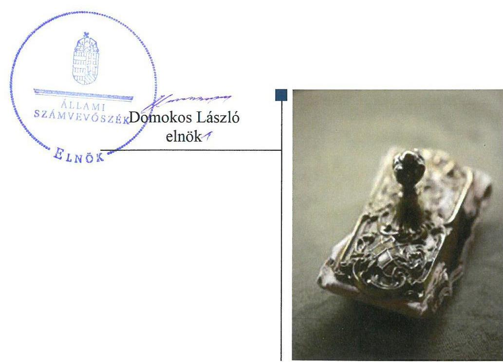

# Jelenetés 

## Az önkormányzatok pénzügyi és vagyongazdálkodása megfelelőségének ellenőrzése

Kazincbarcika Város Önkormányzata 2018.

---

# Jelenetés 

## Az önkormányzatok pénzügyi és vagyongazdálkodása megfelelőségének ellenőrzése

Kazincbarcika Város Önkormányzata 2018. M. hó 29. nap

---

# AZ ELLENŐRZÉST FELÜGYELTE: 

PETŐ KRISZTINA felügyeleti vezető

## AZ ELLENŐRZÉST VEZETTE ÉS A VÉGREHAJTÁSÁÉRT FELELŐS:

DR. TIMÁR BALÁZS ellenőrzésvezető

## A PROGRAM ÖSSZEÁLLÍTÁSÁÉRT FELELŐS:

TÓTPÁL SZABOLCS osztályvezető

IKTATÓSZÁM: EL-0309-023/2018

TÉMASZÁM: 2451

## ELLENŐRZÉS-AZONOSÍTÓ SZÁM: V079605

Jelentéseink az Országgyűlés számítógépes hálózatán és az Interneten a www.asz.hu címen is olvashatóak.

---

# TARTALOMJEGYZÉK 

■ ÖSSZEGZÉS ..... 5
■ AZ ELLENŐRZÉS CÉLJA ..... 7
■ AZ ELLENŐRZÉS TERÜLETE ..... 8
■ AZ ELLENŐRZÉS HÁTTERE, INDOKOLTSÁGA ..... 9
■ A JELENTÉS LÉNYEGES KÉRDÉSKÖREI ..... 10
■ AZ ELLENŐRZÉS HATÓKÖRE ÉS MÓDSZEREI ..... 11
■ MEGÁLLAPÍTÁSOK ..... 13
■ JAVASLATOK ..... 16
■ MELLÉKLETEK ..... 19
I. sz. melléklet: Értelmező szótár ..... 19
■ FÜGGELÉK: ÉSZREVÉTELEK ..... 23
■ RÖVIDÍTÉSEK JEGYZÉKE ..... 29

---

.

---

# ÖSSZEGZÉS 

Kazincbarcika Város Önkormányzata gazdálkodásának szabályozottsága, pénzügyi és vagyongazdálkodása nem volt szabályszerű a 2014-2016. években, ezáltal a közpénzekkel való szabályszerű, átlátható és elszámoltatható gazdálkodást, valamint a vagyon védelmét nem biztosította.

## Az ellenőrzés társadalmi indokoltsága

Az Állami Számvevőszék stratégiájában hangsúlyos szerepet szán annak, hogy szilárd szakmai alapon álló, értékteremtő ellenőrzéseivel előmozdítsa a közpénzügyek átláthatóságát, rendezettségét és javaslataival a közpénzek és a közvagyon szabályos, gazdaságos, hatékony és eredményes felhasználását segítse. Az Állami Számvevőszék stratégiájában célul tűzte ki, hogy az önkormányzatok ellenőrzése során értékeli azok pénzügyi-gazdasági helyzetét, a kockázatokat feltárja, és az ellenőrzések helyszíneit kockázatelemzés alapján választja ki. Az Állami Számvevőszék szerepet vállal a korrupció és a csalás elleni küzdelemben. Közreműködik a korrupciós kockázatok és a korrupció elleni fellépés hatékony és eredményes eszközeinek beazonosításában, alkalmazásában, továbbá használatuk elterjesztésében, az integritás alapú közigazgatási kultúra kialakításában.

## Főbb megállapítások, következtetések, javaslatok

Kazincbarcika Város Önkormányzata a 2014-2016. években a pénzügyi gazdálkodás végrehajtását biztosító belső szabályozást nem szabályszerűen alakította ki, a számlarendben foglaltakat alátámasztó bizonylati rend hiánya következtében a pénzügyi műveletek számviteli nyilvántartásokban történő rögzítése során az átláthatóságot és az elszámoltathatóságot nem biztosították. A vagyongazdálkodás legfontosabb szabályzatait a jogszabályi előírásoknak megfelelően kialakították.

Kazincbarcika Város Önkormányzatánál a 2014-2016. években a mérlegeket alátámasztó leltár nem készült. Ennek következtében Kazincbarcika Város Önkormányzatának beszámolói és a 2016. évi zárszámadási rendeletéhez csatolt vagyonkimutatás nem mutattak megbízható és valós képet a vagyonról.

A vagyonkezelői jog létesítését követően a vagyonkezelői jog gyakorlása és a vagyonkezelési jogviszonyból eredő kötelezettségek teljesítése nem volt szabályszerű. Kazincbarcika Város Önkormányzata a Klebelsberg Intézményfenntartó Központtal, mint vagyonkezelővel szemben annak a vagyonkezelt eszközök értékcsökkenésének megfelelő, jogszabályban előírt pótlási, tartalékképzési kötelezettségének teljesítését nem ellenőrizte. A vagyonkezelésbe adott vagyonelemek átsorolásáról a jegyző számviteli bizonylat kiállításáról nem gondoskodott. Mindezek következtében a Kazincbarcika Város Önkormányzat által vagyonkezelésbe adott vagyon átláthatósága, állagának megőrzése nem volt biztosított.

A vagyon bérbeadás útján való hasznosítása nem szabályszerűen történt. A vagyonváltozást eredményező döntések szabálytalan végrehajtása miatt a forgalomképes vagyonnal való felelős gazdálkodás nem érvényesült.

A többségi tulajdonú gazdasági társaságokban fennálló részesedések feletti tulajdonosi joggyakorlás a Barcika Szolg Vagyonkezelő és Szolgáltató Kft. 2014. évi beszámolójáról szabálytalanul meghozott döntés, továbbá a Barcika Centrum Vagyonkezelő és Szolgáltató Kft. felügyelőbizottságában az ellenőrzött időszakban fennálló személyi összeférhetetlenség miatt nem volt szabályszerű.

A hiányosságok következtében fokozott volt Kazincbarcika Város Önkormányzata és a Kazincbarcikai Polgármesteri Hivatal korrupciós veszélyeztetettsége, mely csak a korrupció elleni védelmi rendszer tudatos kiépítése esetén csökkenthető. Az Állami Számvevőszék ellenőrzésének tapasztalatai megerősítették, hogy a hiányosan kiépített integritás rendszer nem nyújt biztosítékot az Önkormányzat vagyonának megvédésére.

---

A megállapítások alapján az Állami Számvevőszék a polgármesternek 3 javaslatot, a jegyzőnek 12 javaslatot fogalmazott meg, amelyre 30 napon belül intézkedési tervet kell készíteni.

---

# AZ ELLENŐRZÉS CÉLJA 

Az ellenőrzés célja az önkormányzat pénzügyi és vagyoni helyzetének, a gazdálkodás szabályosságának értékelése volt, a pénzügyi egyensúly megteremtése, a vagyongazdálkodás, a vagyon számbavétele, a gazdasági események elszámolása és a pénzgazdálkodás szabályszerűsége alapján. Az ellenőrzés keretében az Állami Számvevőszék értékelte az önkormányzat korrupciós kockázatainak kezelését szolgáló integritás kontrollok kiépítettségét és az integritás szemlélet érvényesülését.

---

# AZ ELLENŐRZÉS TERÜLETE 

## Kazincbarcika Város Önkormányzata

Kazincbarcika város az Észak-magyarországi régióban, Borsod-Abaúj-Zemplén megyében, a Kazincbarcikai járásban található, állandó lakosainak száma a Központi Statisztikai Hivatal Magyarország Helységnévtára alapján 2016. január 1-jén 27078 fő volt.

A polgármester ${ }^{1}$ és a jegyző ${ }^{2}$ személyében nem történt változás a 2014-2016-os években. Az Önkormányzat ${ }^{3}$ képviselőtestülete ${ }^{4} 15$ fővel (polgármester és 14 képviselő) valamint négy állandó bizottsággal (Gazdasági és Pénzügyi Bizottság; Működési, Oktatási és Sport Bizottság; Egészségügyi és Szociális Bizottság; Ügyrendi, Jogi és Közbiztonsági Bizottság) működött az ellenőrzött időszakban.

Az ellenőrzött időszakban az Önkormányzat hivatali feladatait a Polgármesteri Hivatal ${ }^{5}$ látta el, mely önálló gazdasági szervezettel rendelkezett. A Polgármesteri Hivatalban foglalkoztatott köztisztviselők és közalkalmazottak száma a feladatok bővülése (közmunka-program, uniós pályázatok) miatt 74 főről 113 főre emelkedett.

Az Önkormányzat 2014. január 1-jén négy költségvetési intézményt (Kazincbarcikai Összevont Óvodák, Kazincbarcikai Szociális Szolgáltató Központ, Egressy Béni Városi Könyvtár, Kazincbarcikai Intézmények Gazdasági Ellátó Szervezete) tartott fenn. Ugyanezen időpontban négy, fő tevékenysége alapján közfeladatot ellátó gazdasági társaságban rendelkezett többségi, de nem kizárólagos részesedéssel. Az ellenőrzött időszakban az Önkormányzat a társaságokban fennálló részesedéseit - egyebek mellett 2014. december 15-én a Barcika Prima Kft. ${ }^{6}$-ben, 2015. augusztus 31-én a Barcika Szolg Kft. ${ }^{7}$-ben meglévő részesedését - apportként bevitte az általa még az ellenőrzési időszakot megelőzően létrehozott Holding társaság ${ }^{8}$-ba. A Holding társaság főtevékenysége „Üzletviteli, egyéb vezetési tanácsadás", a holdingba szervezett társaságok láttak el közfeladatot (többek között szennyvízkezeléssel, hulladékkezeléssel kapcsolatos feladatokat).

Az Önkormányzat az ellenőrzött időszakban két vagyonkezelési szerződés ${ }_{1,2}{ }^{9}$-vel - a KLIK ${ }^{10}$-kel létesített vagyonkezelési szerződés ${ }_{1}$-gyel és az Őzdi Szakképzési Centrummal megkötött vagyonkezelési szerződés ${ }_{2}$-vel - rendelkezett.

Az Önkormányzat a 2014-2016. években üzemeltetési szerződések keretében látott el víziközmű szolgáltatási (ÉRV Zrt. ${ }^{11}$ ), városüzemeltetési és köztemető fenntartási (Barcika Park Nkft. ${ }^{12}$ ), valamint sport (Common Fountain Nkft. ${ }^{13}$ ) közfeladatokat.

Az Önkormányzat a 2016. évi zárszámadási rendelete ${ }^{14}$ szerint 6 619,1 millió Ft költségvetési bevételt ért el, valamint 6 514,8 millió Ft költségvetési kiadást teljesített.

A 2014-2016. években adósságot keletkeztető ügyletet az Önkormányzat nem vállalt.

---

# AZ ELLENŐRZÉS HÁTTERE, INDOKOLTSÁGA 

Az államháztartás önkormányzati alrendszerének közpénz felhasználása, az önkormányzatok által ellátott közfeladatok és önként vállalt feladatok sokrétűsége, valamint a feladat ellátásához rendelt vagyon nagyságrendje indokolja, hogy az ÁSZ ${ }^{15}$ ellenőrzéseket folytasson a pénzügyi és vagyongazdálkodás területén. Az ÁSZ folyamatosan végzi az önkormányzatok pénzügyi és vagyongazdálkodásának ellenőrzését. Az elmúlt időszakban az önkormányzati gazdálkodás kockázatai beépítésre kerültek az ellenőrzött önkormányzatok kiválasztási rendszerébe. Az ellenőrzések tapasztalatai megmutatták, hogy továbbra is indokolt az egyrészt elemző, értékelő, a pénzügyi helyzet kockázatát is minősítő, másrészt a pénzügyi és vagyongazdálkodási tevékenység szabályszerűségét értékelő ÁSZ ellenőrzések folytatása.

Az ÁSZ ellenőrzései hozzájárulnak az önkormányzatok felelős és fenntartható gazdálkodásához, pénzügyi helyzetének pontosabb megítéléséhez azáltal, hogy a pénzügyi helyzetet a vagyoni helyzettel együtt értékeljük. Feltárjuk az önkormányzati gazdálkodást meghatározó szabályozások hiányosságait, a szabályozással nem érintett gazdálkodási területeket, valamint a pénzügyi és vagyongazdálkodás esetleges szabálytalanságait. Beazonosítjuk a pénzügyi egyensúlyi helyzet megbomlásának kockázatait. Értékeljük a pénzügyi egyensúly érvényesülését, az adósságállomány alakulását.

A pénzügyi és vagyongazdálkodás szabályszerűségének ellenőrzése eredményeként tett megállapítások, javaslatok hasznosításával javul az önkormányzat gazdálkodásának szabályozottsága, valamint a „jó gyakorlatok" terjesztésén keresztül azok az önkormányzatok is átvehetik a pozitív példákat, ahol nem végez ellenőrzést az ÁSZ. Ellenőrzéseink eredményeképpen javaslatokat fogalmazhatunk meg az önkormányzatok pénzügyi egyensúlya fenntartásával kapcsolatos problémák rendszerszemléletű kezelésére, felszámolására.

---

# A JELENTÉS LÉNYEGES KÉRDÉSKÖREI 

1.     - A pénzügyi és vagyongazdálkodás szabályainak kialakítása szabályszerű volt-e?
2.     - A vagyonnyilvántartás, a költségvetési beszámoló mérlegének alátámasztottsága szabályszerű volt-e?
3.     - A vagyonváltozást eredményező döntések és azok végrehajtása, a gazdálkodási jogkörök gyakorlása szabályszerű volt-e?
4.     - Felelősen gazdálkodott-e az önkormányzat a tartós részesedéseivel, élt-e tulajdonosi jogaival, teljesítette-e tulajdonosi kötelezettségeit?
5.     - Az önkormányzat az integritás kontrollokat kialakította-e?

---

# AZ ELLENŐRZÉS HATÓKÖRE ÉS MÓDSZEREI 

## Az ellenőrzés típusa

Megfelelőségi ellenőrzés.

## Az ellenőrzött időszak

A 2014-2016. évek.

## Az ellenőrzés tárgya

A helyi önkormányzat pénzügyi és vagyongazdálkodása, a pénzügyi egyensúly megteremtése, a tulajdonosi és irányító szervi feladatok ellátása, az integritás szemlélet érvényesülése.

Az ellenőrzés kiterjedt minden olyan körülményre és adatra, amely az ÁSZ jogszabályban meghatározott feladatainak teljesítéséhez, valamint a program végrehajtása folyamán felmerült újabb összefüggések feltárásához szükséges.

## Az ellenőrzött szervezet

Kazincbarcika Város Önkormányzata

## Az ellenőrzés jogalapja

Az ellenőrzés jogszabályi alapját az ÁSZ tv. ${ }^{16} 1 . \S$ (3) bekezdésének, az 5. § (2)-(6) bekezdéseinek, valamint az Áht. ${ }^{17} 61 . \S$ (2) bekezdésének előírásai képezték.

## Az ellenőrzés módszerei

Az ÁSZ az ellenőrzést az ellenőrzési program ellenőrzési kérdései, az ellenőrzött időszakban hatályos jogszabályok, az ellenőrzés szakmai szabályok és az ÁSZ módszertanok figyelembevételével végezte.

A gazdálkodás hibáinak kijavítására, a közpénzekkel való felelős gazdálkodás segítésére irányuló javaslatok kidolgozásakor a hatályos jogszabályok voltak irányadóak.

Az ÁSZ az ellenőrzés ideje alatt az ellenőrzött szervezettel történő kapcsolattartást az ÁSZ SZMSZ ${ }^{18}$-ének vonatkozó előírásai alapján biztosította.

---

Az ellenőrzési kérdések megválaszolásához szükséges bizonyítékok megszerzése az ellenőrzött által rendelkezésre bocsátott dokumentumokra, adatokra alapozva megfigyelés, szemle (szemrevételezés), kérdésfeltevés (információkérés), mintavételezés, valamint elemző eljárással történt.

Az ellenőrzés lefolytatásához az önkormányzat a tanúsítványok kitöltésével, valamint az ÁSZ által kért dokumentumok megküldésével szolgáltatott adatokat. Az így rendelkezésre bocsátott adatok, információk, a tanúsítványok adatai valódiságának kontrollja az ellenőrzés keretében történt.

Az ÁSZ az ellenőrzést az önkormányzat működésével kapcsolatos feladatokat ellátó polgármesteri hivatalnál végezte. Az önkormányzat az intézményei és gazdasági társaságai ellenőrzéssel érintett dokumentumait, tanúsítványait a polgármesteri hivatal útján bocsátotta az ellenőrzés rendelkezésére.

A pénzügyi és vagyongazdálkodás szabályozottságát az ÁSZ az önkormányzat rendeletei, határozatai, illetve az önkormányzat (mint önálló éves költségvetési beszámolót készítő szerv) és a polgármesteri hivatal belső szabályozásai alapján értékelte. A pénzügyi egyensúly az önkormányzat összevont adatai alapján, a vagyonnyilvántartás, a mérleg alátámasztottságának megítélése az önkormányzat és a polgármesteri hivatal adatai alapján történt. A leltározási, értékelési folyamat szabályszerűségére a polgármesteri hivatal által végzett 2016. évi leltározási folyamat ellenőrzése alapján tett megállapításokat az ÁSZ.

Az önkormányzat vagyonváltozást eredményező döntéseinek és azok végrehajtásának ellenőrzésére irányított, valamint véletlen mintavételi eljárással és tételes ellenőrzéssel került sor. A beruházások és felújítások, valamint a vagyonértékesítés és bérbeadás útján történő vagyonhasznosítás ellenőrzése véletlen mintavételi eljárással - a polgármesteri hivatal (mint önálló éves költségvetési beszámolót készítő költségvetési szerv) és az önkormányzat főkönyvi állományából - kiválasztott minta alapján történt.

A véletlen mintavétellel ellenőrzött területek esetében minden egyes tétel vonatkozásában a szabályszerűségre vonatkozó
 kérdéseket tettünk fel, amelyek eredménye összesítésre került. Szabályszerűnek értékeltünk egy ellenőrzött területet, amennyiben 95%-os bizonyossággal a lényeges sokaságban az átlagos hibaarány legfeljebb 10%, nem szabályszerűnek, amennyiben 10%-nál magasabb arányt képviselt.

Az ellenőrzési kérdésekre adott válaszok alapján értékelte az ÁSZ, hogy az önkormányzat pénzügyi gazdálkodása szabályszerű volt-e, biztosított volt-e a pénzügyi egyensúly. Értékelte a vagyongazdálkodás szabályszerűségét, a vagyonváltozást eredményező döntések és a tulajdonosi jogok gyakorlása szabályszerűségét. Értékelte továbbá az integritás érvényesülését.

---

# 1. A pénzügyi és vagyongazdálkodás szabályainak kialakítása szabályszerű volt-e? 

Összegző megállapítás

A pénzügyi gazdálkodás szabályainak kialakítása nem volt szabályszerű, a vagyongazdálkodás szabályainak kialakítása szabályszerű volt.

A Számv. tv. ${ }^{19}$ 161. § (2) bekezdése d) pontjának előírása ellenére a jegyző nem gondoskodott a számlarend ${ }_{1,2}{ }^{20}$-ben foglaltakat alátámasztó bizonylati rend elkészítéséről. Továbbá az Áhsz. ${ }^{21}$ 51. § (3) bekezdésének előírása ellenére a számlarend ${ }_{1,2}$-ben nem szabályozta a részletező nyilvántartások és az egységes rovatrend rovataihoz kapcsolódóan vezetett nyilvántartási számlák adataiból a pénzügyi könyvvezetéshez készült összesítő bizonylatok (feladások) elkészítésének rendjét, tartalmi és formai követelményeit.

A vagyongazdálkodás szabályozási hátterének kialakítása szabályszerű volt, mert a leltározási szabályzat ${ }_{1,2}{ }^{22}$ és az értékelési szabályzat ${ }_{1-3}{ }^{23}$ rendelkezései összhangban álltak a Számv. tv. és az Áhsz. előírásaival. A vagyonrendelet ${ }_{1,2}{ }^{24}$ tartalmazták az Mötv. ${ }^{25}$-ben és az Nvtv. ${ }^{26}$-ben előírtakat.

## 2. A vagyonnyilvántartás, a költségvetési beszámoló mérlegének alátámasztottsága szabályszerű volt-e?

## Összegző megállapítás

A vagyonnyilvántartás, a költségvetési beszámoló alátámasztottsága nem volt szabályszerű.

A vagyonnyilvántartás az Nvtv. 10. § (1) bekezdésének előírása ellenére nem tartalmazta a vagyon elsődleges rendeltetése szerinti közfeladat megjelölését.

A jegyző az Áhsz. 39. § (3) bekezdésének előírása ellenére nem gondoskodott a költségvetési jelentés és a maradvány kimutatás Áhsz 39. § (2) bekezdése szerinti nyilvántartási számlákon nem szereplő adatainak alátámasztásáról, továbbá a Számv. tv. 20. § szerinti beszámolót az Áhsz. 5. (1) bekezdésében előírt részletező nyilvántartásokkal nem támasztotta alá.

A jegyző az Áhsz. 30. § (4) bekezdésének előírása ellenére a vagyonkimutatásban szereplő ingatlanvagyon számviteli nyilvántartás szerinti bruttó értékének és az ingatlanvagyon-kataszteri nyilvántartásban szereplő ingatlanvagyon bruttó értékének egyezőségét nem biztosította.

Az Önkormányzatnál és a Polgármesteri Hivatalnál a Számv. tv. 69. § (1) bekezdésének és az Áhsz. 22. § (1) bekezdésének előírásai ellenére a 2014-2016. években az éves beszámolók mérlegeiben szereplő eszközöket és forrásokat leltár nem támasztotta alá.

---

# 3. A vagyonváltozást eredményező döntések és azok végrehajtása, a gazdálkodási jogkörök gyakorlása szabályszerű volt-e? 

## Összegző megállapítás

### 3.1. számú megállapítás

### 3.2. számú megállapítás

A vagyonváltozást eredményező döntések és azok végrehajtása nem volt szabályszerű.

A vagyonkezelői jog létesítése, gyakorlásának ellenőrzése és a térítésmentes vagyonátadás nem volt szabályszerű.

A polgármester az Nvtv. 10. § (2) bekezdésében előírt tulajdonosi joggyakorlói kötelezettsége körében nem ellenőrizte, hogy a KLIK az Mötv. 109. § (6) bekezdésében rögzített eszközpótlási és tartalékképzési kötelezettségének megfelelő mértékben eleget tesz-e.

A vagyonkezelési szerződés megkötését követően a vagyonkezelésbe adott eszközöknek az Áhsz. 47. § (3) bekezdésének előírása szerinti, 0. számlaosztály befektetett eszközei közé történő átvezetéséről az Önkormányzat - megsértve a Számv. tv. 165. § (1) bekezdését - számviteli bizonylatot nem állított ki.

Az Önkormányzat a vagyonkezelési szerződés ${ }_{1,2}$ közzétételi lista szerinti adatait az Info. tv. ${ }^{27} 37$ § (1) bekezdésének és 1. melléklet III. Gazdálkodási adatok 4. sorában foglaltak ellenére nem tette közzé.

Az ellenőrzött időszakban térítésmentes vagyonátadás négy alkalommal történt, 2015. október 1-jén a magyar állam, 2014. június 27-én és 2015. december 21-én egy államháztartáson belüli szervezet, továbbá 2016. november 30-án a Barcika Prima Kft. részére. A magyar állam részére történt vagyonátadásra a 2012. évi XXXVIII. törvény ${ }^{28}$ 2. § (1) bekezdése alapján került sor. A további vagyonátadásokra a vagyonrendelet; 13. § (1) és (3) bekezdéseinek és a vagyonrendelet; 13. § (1)-(2) bekezdéseinek előírása ellenére képviselő-testületi döntés nélkül került sor.

A beruházásokkal, felújításokkal kapcsolatos döntéshozatal szabályszerű volt, a döntések végrehajtása nem volt szabályszerű. Az ingatlanvagyon hasznosítása nem szabályszerűen történt.

Az ellenőrzött időszakban a beruházásokra vonatkozó döntéseket az Mötv.-ben foglaltakkal összhangban a Képviselő-testület hozta meg.

A jegyző a beszerzett eszközök üzembe helyezését a 2014-2016. években a Számv. tv. 52. § (2) bekezdésének előírása ellenére nem dokumentálta. Ingatlan vásárlása, létesítése esetén az ingatlanvagyon-kataszter módosítását elmulasztották, ezáltal a jegyző az Mötv 110. § (1) bekezdésében foglalt felelőssége körében a kataszteri rendelet ${ }^{29}$ 1. § (1) bekezdésének előírása ellenére az ingatlanvagyon-kataszter folyamatos vezetését nem biztosította.

Az Önkormányzat az általa bérbe adott vagyon tekintetében a bérleti díjaknak a bérlők általi késedelmes megfizetése esetén a Ptk. 6:48. § (1) bekezdésében foglaltak szerinti, a késedelembe esés időpontjától kezdődően a késedelemmel érintett naptári félév első napján érvényes jegybanki alapkamatnak megfelelő, az Önkormányzatot, mint bérbeadót megillető kamatkövetelését nem érvényesítette.

---

# 4. Felelősen gazdálkodott-e az önkormányzat a tartós részesedéseivel, élt-e tulajdonosi jogaival, teljesítette-e tulajdonosi kötelezettségeit? 

## Összegző megállapítás

A többségi tulajdonú gazdasági társaságok feletti tulajdonosi joggyakorlás nem volt szabályszerű.

Az ellenőrzött időszakban Holding társaság felügyelő-bizottságának elnöki tisztét az Mötv. 72. § (2) bekezdésében rögzített összeférhetetlenségi előírás ellenére a polgármesteri feladatait az Önkormányzati SZMSZ ${ }^{30} 48$. § (4) bekezdése alapján főállásban ellátó polgármester töltötte be.

Az Alapító ${ }^{31}$ a Barcika Szolg Kft. 2014. évi beszámolójáról a Ptk. ${ }^{32}$ 3:120. § (2) bekezdésének előírása ellenére nem a felügyelő-bizottság ${ }^{33}$ írásbeli jelentésének birtokában döntött.

## 5. Az önkormányzat az integritás kontrollokat kialakította-e?

## Összegző megállapítás

A 2016. évben a kiépített integritás kontrollok nem biztosítottak megfelelő védelmet a korrupciós kockázatokkal szemben.

A jegyző a Bkr. ${ }^{34}$ 2016. október 1-jei hatállyal történt módosításait nem vette figyelembe és a Bkr. 6. § (4) bekezdésének előírása ellenére nem adta ki ettől az időponttól a Polgármesteri Hivatal szervezeti integritását sértő események kezelésének eljárásrendjét, továbbá az integrált kockázatkezelés eljárásrendjét. Szintén 2016. október 1-jét követően fennálló hiányosság volt, hogy a jegyző a Polgármesteri Hivatalnál a Bkr. 7. § (1) bekezdésének előírása ellenére nem működtette az integrált kockázatkezelési rendszert.

A Polgármesteri Hivatal rendelkezett a köztisztviselőkre irányadó etikai szabályzat ${ }^{35}$ tal, azonban sem ez, sem más szabályzat nem tért ki az üzleti ajándékok, meghívások, az utaztatás elfogadásának feltételeire. Nem írták elő összeférhetetlenség fennállása esetén a követendő eljárásrendet, és nem hívták fel munkatársaikat, hogy nyilatkozzanak gazdasági érdekeltségeikről vagy az Önkormányzat tevékenysége szempontjából releváns összeférhetetlenségről. A szervezeten belülről érkező közérdekű bejelentések, valamint a külső személyekkel való kapcsolattartás eljárásrendjét nem alakították ki. A „négy szem elvét" nem alkalmazták.

---

# JAVASLATOK 

Az ÁSZ tv. 33. § (1) bekezdésében foglaltak értelmében az ellenőrzött szervezet vezetője köteles a jelentésben foglalt megállapításokhoz kapcsolódó intézkedési tervet összeállítani és azt a jelentés kézhezvételétől számított 30 napon belül az ÁSZ részére megküldeni. Amennyiben az ellenőrzött szervezet vezetője nem küldi meg határidőben az intézkedési tervet, vagy továbbra sem elfogadható intézkedési tervet küld, az Állami Számvevőszék elnöke az ÁSZ tv. 33. § (3) bekezdése a) és b) pontjaiban foglaltakat érvényesítheti.

## Kazincbarcika Város Önkormányzata polgármesterének

1. Intézkedjen az ellenőrzési kötelezettségének jogszabályi előírásoknak megfelelő teljesítése érdekében.
(3.1. sz. megállapítás 1. bekezdése alapján)
2. Intézkedjen annak érdekében, hogy a térítésmentes vagyonátadásokra a jogszabályi előírások betartásával kerüljön sor.
(3.1. sz. megállapítás 4. bekezdésének 3. mondata alapján)
3. Intézkedjen az összeférhetetlenségre vonatkozó jogszabályi előírás betartása érdekében.
(4. összegző megállapítás 1. bekezdése alapján)

## Kazincbarcika Város Önkormányzata jegyzőjének

1. Intézkedjen annak érdekében, hogy a számlarend tartalma megfeleljen a jogszabályi előírásoknak.
(1. összegző megállapítás 1. bekezdése alapján)
2. Intézkedjen annak érdekében, hogy a vagyonnyilvántartás tartalma megfeleljen a jogszabályi előírásnak.
(2. összegző megállapítás 1. bekezdése alapján)
3. Intézkedjen a jogszabályi előírásoknak megfelelő részletező nyilvántartások vezetéséről.
(2. összegző megállapítás 2. bekezdése alapján)

---

4. Intézkedjen a vagyonkimutatásban szereplő ingatlanvagyon számviteli nyilvántartás szerinti bruttó értéke és az ingatlan vagyonkataszteri nyilvántartásban szereplő ingatlanvagyon bruttó értéke egyezőségének biztosítása érdekében.
(2. összegző megállapítás 3. bekezdése alapján)
5. Intézkedjen a jogszabályi előírásnak megfelelő leltár összeállítása érdekében.
(2. összegző megállapítás 4. bekezdése alapján)
6. Intézkedjen minden gazdasági művelet esetében bizonylat kiállításáról.
(3.1. sz. megállapítás 2. bekezdése alapján)
7. Intézkedjen a jogszabályban előírt közzétételi kötelezettség teljesítése érdekében.
(3.1. sz. megállapítás 3. bekezdése alapján)
8. Intézkedjen a beszerzett eszközök üzembe helyezésének jogszabályi előírásnak megfelelő dokumentálása érdekében.
(3.2. sz. megállapítás 3. bekezdésének 1. mondata alapján)
9. Intézkedjen a jogszabályi előírásnak megfelelően az ingatlanvagyon-kataszter folyamatos vezetéséről.
(3.2. sz. megállapítás 3. bekezdésének 2. mondata alapján)
10. Intézkedjen a bérbe adott vagyon bérleti díj késedelmes megfizetése esetén a bérbeadót megillető kamatkövetelés érvényesítése érdekében.
(3.2. sz. megállapítás 4. bekezdése alapján)
11. Intézkedjen a szervezeti integritást sértő események kezelése eljárásrendjének, valamint az integrált kockázatkezelés eljárásrendjének szabályozása érdekében.
(5. összegző megállapítás 1. bekezdésének 1. mondata alapján)
12. Intézkedjen az integrált kockázatkezelési rendszer jogszabályi előírásnak megfelelő működtetése érdekében.
(5. összegző megállapítás 1. bekezdésének 2. mondata alapján)

---

.

---

# MELLÉKLETEK 

- I. SZ. MELLÉKLET: ÉRTELMEZŐ SZÓTÁR
beruházás
felújítás
integritás
kötelező közszolgáltatás (az önkormányzati feladatokat érintően)
közfeladat

A tárgyi eszköz beszerzése, létesítése, saját vállalkozásban történő előállítása, a beszerzett tárgyi eszköz üzembe helyezése, rendeltetésszerű használatbavétele érdekében az üzembe helyezésig, a rendeltetésszerű használatbavételig végzett tevékenység (szállítás, vámkezelés, közvetítés, alapozás, üzembe helyezés, továbbá mindaz a tevékenység, amely a tárgyi eszköz beszerzéséhez hozzákapcsolható, ideértve a tervezést, az előkészítést, a lebonyolítást, a hiteligénybevételt, a biztosítást is); beruházás a meglévő tárgyi eszköz bővítését, rendeltetésének megváltoztatását, átalakítását, élettartamának, teljesítőképességének közvetlen növelését eredményező tevékenység is, az előbbiekben felsorolt, e tevékenységhez hozzákapcsolható egyéb tevékenységekkel együtt. (Forrás: Számv. tv. 3. § (4) bekezdés 7. pontja)
Az elhasználódott tárgyi eszköz eredeti állaga (kapacitása, pontossága) helyreállítását szolgáló, időszakonként visszatérő olyan tevékenység, amely mindenképpen azzal jár, hogy az adott eszköz élettartama megnövekszik, eredeti műszaki állapota, teljesítőképessége megközelítőleg vagy teljesen visszaáll, az előállított termékek minősége vagy az adott eszköz használata jelentősen javul és így a felújítás pótlólagos ráfordításából a jövőben gazdasági előnyök származnak; felújítás a korszerűsítés is, ha az a korszerű technika alkalmazásával a tárgyi eszköz egyes részeinek az eredetitől eltérő megoldásával vagy kicserélésével a tárgyi eszköz üzembiztonságát, teljesítőképességét, használhatóságát vagy gazdaságosságát növeli; a tárgyi eszközt akkor kell felújítani, amikor a folyamatosan, rendszeresen elvégzett karbantartás mellett a tárgyi eszköz oly mértékben elhasználódott (szerkezeti elemei elöregedtek), amely elhasználódottság már a rendeltetésszerű használatot veszélyezteti; nem felújítás az elmaradt és felhalmozódó karbantartás egyidőben való elvégzése, függetlenül a költségek nagyságától. (Forrás: Számv. tv. 3. § (4) bekezdés 8. pontja)
Az „integritás" - egyik gyakran használt jelentése szerint - az elvek, értékek, cselekvések, módszerek, intézkedések konzisztenciáját jelenti, vagyis olyan magatartásmódot, amely meghatározott értékeknek megfelel. Integritás-irányítási rendszer bevezetése a szervezetben a szervezethez rendelt közfeladatok integritás szempontú ellátását, az érték alapú működéssel (integritással) összefüggő szervezeti követelmények következetes érvényesítését jelenti. (Forrás: „Magyarországi államháztartási
 belső kontroll standardok Útmutató", kiadta az NGM 2012. decemberében)
Az önkormányzat kötelezően vállalt feladatkörébe tartozó egyes - közszolgáltatás útján megvalósuló - közfeladatok ellátása, amelyeket külön jogszabály (törvény, helyi önkormányzati rendelet) határoz meg.
Jogszabályban meghatározott állami vagy önkormányzati feladat, amit az arra kötelezett közérdekből, a jogszabályban meghatározott követelményeknek és feltételeknek megfelelve végez, ideértve a lakosság közszolgáltatásokkal való ellátását, továbbá az állam nemzetközi szerződésekben vállalt kötelezettségeiből adódó közérdekű feladatokat, valamint e feladatok ellátásakor szükséges infrastruktúra biztosítását is.
(Forrás: Nvtv. 3. § (1) bekezdés 7. pontja, hatálytalan 2015. január 1-jétől)

Közfeladat a jogszabályban meghatározott állami vagy önkormányzati feladat. A közfeladatok ellátása költségvetési szervek alapításával és működtetésével vagy az azok ellátásához szükséges pénzügyi fedezet e törvényben meghatározott eszközökkel, részben vagy egészben történő biztosításával valósul meg. A közfeladatok ellátásában

---

önkormányzat
önkormányzat többségi tulajdonában lévő gazdasági társaságok
polgármesteri hivatal
tulajdonosi joggyakorló
üzemeltetésre átadott eszközök az önkormányzatnál
vagyongazdálkodás
államháztartáson kívüli szervezet jogszabályban meghatározott rendben közreműködhet. A közfeladatot meghatározó jogszabályban meg kell határozni a közfeladat ellátásának módját és egyidejűleg rendelkezni kell az annak ellátásához szükséges pénzügyi fedezet biztosításáról. Új közfeladat kizárólag az annak ellátásához megfelelő pénzügyi fedezet rendelkezésre állása esetén írható elő vagy vállalható. Ha a pénzügyi fedezet már nem áll rendelkezésre, intézkedni kell a pénzügyi fedezet biztosításáról vagy a közfeladat megszüntetéséről. (Forrás: Áht. 3/A. § hatályos 2015. január 1-jétől)
A helyi önkormányzat jogi személy. Az önkormányzati feladatok ellátását a képviselőtestület és szervei biztosítják. A képviselőtestület szervei: a polgármester, a főpolgármester, a megyei közgyűlés elnöke, a képviselő-testület bizottságai, a részönkormányzat testülete, a polgármesteri hivatal, a megyei önkormányzati hivatal, a közös önkormányzati hivatal, a jegyző, továbbá a társulás. A képviselő-testület a feladatkörébe tartozó közszolgáltatások ellátására - jogszabályban meghatározottak szerint költségvetési szervet, a Polgári perrendtartásról szóló 2016. évi CXXX. törvény szerinti gazdálkodó szervezetet (a továbbiakban: gazdálkodó szervezet), nonprofit szervezetet és egyéb szervezetet (a továbbiakban együtt: intézmény) alapíthat, továbbá szerződést köthet természetes és jogi személlyel vagy jogi személyiséggel nem rendelkező szervezettel. (Forrás: Mötv. 41. § (1), (2), (6) bekezdései)
Azok a gazdasági társaságok, amelyekben az önkormányzat a szavazatok több mint ötven százalékával vagy a Ptk. 685/B. § (2)-(3) bekezdéseiben rögzített meghatározó befolyással rendelkezik. A befolyással rendelkező akkor rendelkezik egy jogi személyben meghatározó befolyással, ha annak tagja, illetve részvényese, és jogosult e jogi személy vezető tisztségviselői vagy felügyelő-bizottsága tagjainak többségének megválasztására, illetve visszahívására, vagy a jogi személy más tagjaival, illetve részvényeseivel kötött megállapodás alapján egyedül rendelkezik a szavazatok több mint ötven százalékával. A meghatározó befolyás akkor is fennáll, ha a befolyással rendelkező számára e jogosultságok közvetett módon (köztes vállalkozásain keresztül) biztosítottak.
[Forrás: Ptk. 1 685/B. § (2)-(3), Ptk. 2 8:2.§ (1)-(3) bekezdései]
A programban a polgármesteri hivatal megnevezés alatt értjük a polgármesteri hivatalt, a főpolgármesteri hivatalt, a megyei önkormányzati hivatalt, a közös önkormányzati hivatalt.
Aki a nemzeti vagyon felett az államot vagy a helyi önkormányzatot megillető tulajdonosi jogok és kötelezettségek összességének gyakorlására jogosult. (Forrás: Nvtv. 3. § (1) bekezdés 17. pontja)

Az önkormányzat tulajdonában lévő azon eszközök, amelyeket nem saját maga, vagy felügyelete alatt álló költségvetési szervei üzemeltetnek, hanem az üzemeltetését, működtetését más szervekre bízta. Az önkormányzat számviteli nyilvántartásában elkülönítetten kell nyilvántartani ezen eszközök bruttó értékét és értékcsökkenését.
A nemzeti vagyongazdálkodás feladata a nemzeti vagyon rendeltetésének megfelelő, az állam, az önkormányzat mindenkori teherbíró képességéhez igazodó, elsődlegesen a közfeladatok ellátásához és a mindenkori társadalmi szükségletek kielégítéséhez szükséges, egységes elveken alapuló, átlátható, hatékony és költségtakarékos működtetése, értékének megőrzése, állagának védelme, értéknövelő használata, hasznosítása, gyarapítása, továbbá az állam vagy a helyi önkormányzat feladatának ellátása szempontjából feleslegessé váló vagyontárgyak elidegenítése. (Forrás: Nvtv. 7. § (2) bekezdése)

---

vagyonkezelői jog

A képviselő-testület a helyi önkormányzat tulajdonában lévő nemzeti vagyonra a nemzeti vagyonról szóló törvény rendelkezései szerint az önkormányzati közfeladat átadásához kapcsolódva vagyonkezelői jogot létesíthet. Vagyonkezelői jog önkormányzati lakóépületre és vegyes rendeltetésű épületre, társasházban lévő önkormányzati lakásra és nem lakás céljára szolgáló helyiségre kizárólag a helyi önkormányzat 100%-os tulajdonában álló gazdálkodó szervezettel, vagy annak 100%-os tulajdonában álló gazdálkodó szervezettel létesíthető, és kizárólag általuk gyakorolható. A vagyonkezelési szerződésnek a gazdálkodó szervezet tulajdonosi szerkezetében történő tulajdonos változás miatti megszűnésének esetére a nemzeti vagyonról szóló törvényben meghatározottak az irányadók. (Forrás: Mötv. 109. § (1) bekezdése)

---

.

---

# FÜGGELÉK: ÉSZREVÉTELEK 

A jelentéstervezetet a Számvevőszék 15 napos észrevételezésre megküldte az ellenőrzött szervezet vezetőjének az ÁSZ tv. 29. § (1) bekezdése előírásának megfelelően.

Kazincbarcika Város Polgármestere a jelentéstervezet megállapításaira írásban észrevételt tett.
Az elfogadott észrevételek alapján a Számvevőszék módosította a jelentést. A Függelék tartalmazza a polgármester figyelembe nem vett észrevételeit és annak indoklását, hogy azokat a Számvevőszék miért nem fogadta el.

## 1. A számlarend tartalmához fűzött észrevétel kapcsán

Az észrevétel szerint Az önkormányzatok belső kontrollrendszere kialakításának és működésének ellenőrzése, továbbá Az önkormányzatok egyes befektetési tevékenységének ellenőrzése kapcsán megjelent V-1076-145/2016. ikt. számú jelentésben foglalt megállapításokhoz kapcsolódóan összeállított, és a 43/2017. (III. 30.) önkormányzati határozattal elfogadott módosított intézkedési terv alapján a szabályozás megtörtént.
A jelentéstervezet 11. oldalán feltüntetésre került az ellenőrzött időszak, amely a 2014-2016. években került meghatározásra. Tekintettel arra, hogy a számlarendet az észrevételben foglaltak szerint 2017-ben módosították, az az ellenőrzött időszakra vonatkozó megállapítások helytállóságát nem érinti, hanem a tervezett vagy megtett intézkedésekről - a kiadmányozott jelentés megállapításaira az ÁSZ tv. 33. § (1) bekezdése alapján összeállított - intézkedési tervben indokolt számot adni. A fentiekre tekintettel az észrevételt nem fogadjuk el, a jelentéstervezet módosítása nem indokolt.
2. A nemzeti vagyon nyilvántartásának tartalmához fűzött észrevétele kapcsán

Az észrevétel szerint a nemzeti vagyonról szóló 2011. évi CXCVI. törvény (továbbiakban: Nvtv.) 5. § (2) bekezdése szerint a helyi önkormányzat tulajdonában álló nemzeti vagyon külön része a törzsvagyon, amely közvetlenül a kötelező önkormányzati feladatkör ellátását vagy hatáskör gyakorlását szolgálja. A törzsvagyont forgalomképtelen és korlátozottan forgalomképes vagyonelemek körébe rendeli, amely azt jelenti, hogy a törvény értelmében ezen vagyon közfeladat ellátását szolgálja. Az észrevétel szerint az Önkormányzat vagyona mind a számviteli nyilvántartásban, mind az ingatlan-vagyonkataszterben a fent hivatkozott jogszabályi helyeknek megfelelően van besorolva.

Az Nvtv. 5. § (2) bekezdése valóban kimondja, hogy a helyi önkormányzat tulajdonában álló nemzeti vagyon külön része a törzsvagyon, amely közvetlenül a kötelező önkormányzati feladatkör ellátását vagy hatáskör gyakorlását

[^0]
[^0]:    * 29. § (1) Az Állami Számvevőszék az ellenőrzési megállapításait megküldi az ellenőrzött szervezet vezetőjének vagy az általa megbízott személynek, és annak, akinek személyes felelősségét állapította meg.
    (2) Az ellenőrzött szervezet vezetője és a felelősként megjelölt személy az ellenőrzés megállapításaira tizenöt napon belül írásban észrevételt tehet.
    (3) Az Állami Számvevőszék az észrevételre a beérkezésétől számított harminc napon belül írásban válaszol. A figyelembe nem vett észrevételeket köteles a jelentésben feltüntetni, és megindokolni, hogy azokat miért nem fogadta el.

---

szolgálja. Ez azonban nincs összefüggésben azzal, hogy az ÁSZ az Nvtv. 10. § (1) [és nem az Nvtv. 5. § (2)] bekezdésének betartását ellenőrizte, vagyis azt, hogy a vagyonnyilvántartás tartalmazta-e - az Nvtv. 10. § (1) bekezdésének megfelelően - a vagyon elsődleges rendeltetése szerinti közfeladat megjelölését. Az Nvtv. 5. (2) bekezdése általánosságban kimondja ugyan, hogy a törzsvagyon milyen célt szolgál, de az Nvtv. 10. § (1) bekezdése alapján a nyilvántartásban azt is szükséges konkrétan megjelölni, hogy mi a vagyon elsődleges rendeltetése szerinti közfeladat. A fentiekre tekintettel az észrevételt nem fogadjuk el, a jelentéstervezet módosítása nem indokolt.
3. A költségvetési jelentés és a maradvány kimutatás nyilvántartási számlákon nem szereplő adatainak részletező nyilvántartások vezetésével történő alátámasztásához fűzött észrevétele kapcsán
A Polgármester az észrevételében összefoglalta az államháztartás számviteléről szóló 4/2013. (I. 11.) Korm. rendelet (továbbiakban: Áhsz.) 39. § (3) bekezdésének tartalmát. Ezt követően az észrevételben rögzítésre került, hogy az Önkormányzat az Áhsz. előírásainak megfelelően részletező nyilvántartást vezet, valamint az, hogy a költségvetési jelentés és a maradványkimutatás, negyedévi mérlegek és éves beszámoló Magyar Államkincstár részére történő megküldése során kötelező az adatszolgáltatás főkönyvi kivonattal történő alátámasztása, ennek értelmében olyan adat, amely nyilvántartási számlákon nem szerepel, nem kerülhet az adatszolgáltatásban feltüntetésre.

Az Áhsz. 39. § (3) bekezdése alapján részletező nyilvántartással a költségvetési jelentés és a maradvány kimutatás (2) bekezdés szerinti nyilvántartási számlákon nem szereplő adatait, továbbá a jogszabály által előírt adatszolgáltatási kötelezettséget kell alátámasztani. Az észrevétellel érintett megállapítás nem vonatkozik a jogszabály által előírt adatszolgáltatási kötelezettségre, ezért az észrevételnek az adatszolgáltatásra vonatkozó része nincs összefüggésben a megállapításban foglaltakkal. A Polgármester 2017. október 27-én kelt (és 2018. január 15-én pontosított) teljességi és hitelességi nyilatkozata szerint az átadott dokumentumok, adatok megbízhatóak, és a bekért adatokra, dokumentumokra vonatkozóan teljes körű információt tartalmaznak. A teljességi és hitelességi nyilatkozatában a Polgármester az átadott dokumentumok, adatok hitelességéért, valódiságáért, hiánytalanságáért teljes felelősséget vállalt. A nyilvántartási számlákon nem szereplő adatokat alátámasztó részletező nyilvántartás az adatszolgáltatás során nem került megküldésre, amelynek hiányában nem megalapozott az észrevétel azon része, hogy az Önkormányzat analitikus, részletező nyilvántartást vezet a hivatkozott kormányrendelet - Áhsz. - előírásainak megfelelően. A fentiekre tekintettel az észrevételt nem fogadjuk el, a jelentéstervezet módosítása nem indokolt.
4. A számviteli nyilvántartás és az ingatlanvagyon-kataszteri nyilvántartás adatai közötti egyezőség biztosításához füzött észrevétele kapcsán
Az észrevétel szerint az adatszolgáltatás során bekért, megküldött, valamint teljességi és hitelességi nyilatkozattal alátámasztott dokumentumok alapján egyértelmű, hogy az ingatlanvagyon kataszterben önkormányzati tulajdonú ingatlanként szerepel az érintett vagyon (értéke összesen 230460 E Ft). Ez a vagyoni érték a 15/A űrlapon nem került feltüntetésre, az egyezőség azonban biztosított volt, amelyet az Önkormányzat által vezetett analitikus nyilvántartás is alátámaszt.

Az EL-0309-006/2017. ikt. számú adatbekérő levél 2. mellékletének 5.4. pontjában a következő dokumentumok kerültek bekérésre: „a nyilvántartások egyeztetésének, rendezésének dokumentumai”. A 2017. október 27-én kelt és 2018. január 15-én pontosított teljességi és hitelességi nyilatkozatban csak a bekért dokumentum tartalom szerinti megnevezése került feltüntetésre, azonban az ÁSZ részére megküldött dokumentum nem került nevesítésre. A beküldött dokumentumokat áttekintettük, és adatleltárt készítettünk, amelynek eredménye szerint nyilvántartások egyeztetésével kapcsolatos dokumentumok nem kerültek feltüntetésre. A fentiekre tekintettel az észrevételt nem fogadjuk el, a jelentéstervezet módosítása nem indokolt.
5. A leltári alátámasztottsághoz füzött észrevétele kapcsán

Az észrevétel szerint az ÁSZ által kért dokumentumok elektronikusan feltöltésre, valamint teljességi és hitelességi nyilatkozattal alátámasztásra kerültek. A 2015. és 2016. évi mérlegben szereplő eszközök és források leltárral alátámasztottak, és az ezt igazoló dokumentumok az 5. pont alatt feltöltésre kerültek. A 2014. évi mérlegbeszámolóval kapcsolatos leltárkimutatásokat és nyilatkozatot az észrevételhez mellékelték.

---

A számvitelről szóló 2000. évi C. törvény (továbbiakban: Számv. tv.) 69. § (1) bekezdése alapján a mérleg tételeinek alátámasztásához
 olyan leltárt kell összeállítani és a Számv. tv. előírásai szerint megőrizni, amely tételesen, ellenőrizhető módon tartalmazza a mérleg fordulónapján meglévő eszközöket és forrásokat mennyiségben és értékben. Az észrevételben hivatkozott, 2015-2016. évre vonatkozó dokumentumokat ismételten áttekintettük. A dokumentumok alapján a Számv. tv. 69. § (3) bekezdése szerinti leltározás elvégzése megállapítható, azonban nem került megküldésre olyan dokumentum, amely a mérleg fordulónapjáig meglévő eszközöket és forrásokat a Számv. tv. 69. § (1) bekezdésének megfelelően tételesen, ellenőrizhető módon, mennyiségben és értékben tartalmazná. A 2014. év vonatkozásában pedig a Polgármester a 2017. október 27-én kelt dokumentumban nyilatkozott arról, hogy a 2014. évi beszámolóban szereplő adatok leltárral történő alátámasztását nem tudták teljes körűen biztosítani. A fentiekre tekintettel az észrevételt nem fogadjuk el, a jelentéstervezet módosítása nem indokolt.

# 6. A vagyonkezelésbe adott eszközök átvezetéséhez fűzött észrevétele kapcsán 

Az észrevétel szerint a 2016. évben a vagyonkezelésbe adott eszközök a 0-s számlaosztályban könyvelésre kerültek, amelyről számviteli bizonylat készült.

A számviteli bizonylat kiállításáról szóló tájékoztatás az adatszolgáltatás keretében rendelkezésre bocsátandó számviteli bizonylatot nem pótolja, amelynek hiányában az észrevételben foglaltak nem megalapozottak. Polgármester úr 2017. október 27-én kelt (és 2018. január 15-én pontosított) teljességi és hitelességi nyilatkozata szerint az átadott dokumentumok, adatok megbízhatóak, és a bekért adatokra, dokumentumokra vonatkozóan teljes körű információt tartalmaznak. A Polgármester a teljességi és hitelességi nyilatkozatában az átadott dokumentumok, adatok hitelességéért, valódiságáért, hiánytalanságáért teljes felelősséget vállalt. Erre tekintettel az adatszolgáltatás keretében rendelkezésre bocsátott számviteli bizonylat hiányában - az észrevételt nem fogadjuk el, a jelentéstervezet módosítása nem indokolt.

## 7. A térítésmentes vagyonátadáshoz fűzött észrevétele kapcsán

Az észrevétel szerint a további - nem a magyar állam részére történő - vagyonátadásokhoz kapcsolódó képviselőtestületi határozatok rendelkezésre álltak, és mellékelten meg is küldték azokat.

A vagyonátadásokra vonatkozó észrevételét nem fogadjuk el. A Polgármester 2017. október 27-én kelt (és 2018. január 15-én pontosított) teljességi és hitelességi nyilatkozata szerint az átadott dokumentumok, adatok megbízhatóak, és a bekért adatokra, dokumentumokra vonatkozóan teljes körű információt tartalmaznak. A teljességi és hitelességi nyilatkozatában a Polgármester az átadott dokumentumok, adatok hitelességéért, valódiságáért, hiánytalanságáért teljes felelősséget vállalt. Ezért az adatszolgáltatáson kívül, utólag rendelkezésre bocsátott dokumentumokat nem értékeljük. A fentiekre tekintettel az észrevételt nem fogadjuk el, a jelentéstervezet módosítása nem indokolt.
8. Az ingatlanvagyon-kataszter folyamatos vezetésével kapcsolatos megállapításhoz fűzött észrevétele kapcsán Az észrevétel szerint a feltöltésre került mintavételekből megállapítható, hogy az Önkormányzat által vezetett ingatlanvagyon-kataszterben minden esetben megtörtént az adat rögzítése, és a hozzá kapcsolódó dokumentálás.

Az önkormányzatok tulajdonában lévő ingatlanvagyon nyilvántartási és adatszolgáltatási rendjéről szóló 147/1992. (XI. 6.) Korm. rendelet 1. § (1) bekezdése szerint az önkormányzat tulajdonában lévő ingatlanvagyonról ingatlanvagyon-katasztert kell felfektetni és folyamatosan vezetni. Az Önkormányzat több esetben (kisajátítás, beruházás eredményeként létrejött építmények) elmulasztotta módosítani az ingatlankatasztert, vagyis az ingatlanvagyon-kataszternek - az önkormányzatok tulajdonában lévő ingatlanvagyon nyilvántartási és adatszolgáltatási rendjéről szóló 147/1992. (XI. 6.) Korm. rendelet 1. § (1) bekezdése szerinti - folyamatos vezetését nem biztosította. A fentiekre tekintettel az észrevételt nem fogadjuk el, a jelentéstervezet módosítása nem indokolt.

## 9. A polgármesteri összeférhetetlenséghez fűzött észrevétele kapcsán

Az észrevétel tartalmazza, hogy a Magyarország helyi önkormányzatairól szóló 2011. évi CLXXXIX. törvény (továbbiakban: Mötv.) 72. § (2) bekezdése a 2016. év végén hogyan módosult, illetve hogy az Mötv. 79. § (2) bekezdése szerint a polgármester jogállására vonatkozó szabályokat megfelelően alkalmazni kell az alpolgármesterre

---

is. Az észrevétel továbbá kitér arra, hogy a Mötv. 72. § (4) bekezdése utaló rendelkezésként rögzíti, hogy a polgármesterre megfelelően alkalmazni kell az önkormányzati képviselőkre vonatkozó összeférhetetlenségi, méltatlansági, vagyonnyilatkozat-tételi szabályokat. Az észrevétel szerint továbbá a Mötv. 36. § (1) bekezdésének h) pontja a polgármester tekintetében a felügyelő bizottsági tagságot nem zárja ki. Az észrevétel továbbá meghivatkozza a közszolgálati tisztviselőkről szóló 2011. évi CXCIX. törvény (továbbiakban: Kttv.) 85. § (4) bekezdésének c) pontját, és a munka törvénykönyvéről szóló 2012. évi I. törvény (továbbiakban: Mt.) 294. § (1) bekezdés f) pontját.

Az érintett megállapítás szempontjából irreleváns, hogy az ellenőrzött időszak végére hogyan módosult a Mötv. 72. § (2) bekezdése, ugyanis a megállapításokat az ellenőrzött időszakra vonatkozóan fogalmazzuk meg. Ahogyan irreleváns az is, hogy milyen szabályok vonatkoznak az alpolgármesterre, ugyanis a megállapításban a polgármester került feltüntetésre. A Mötv. - észrevételben hivatkozott - 72. § (4) bekezdése valóban rögzíti, hogy a polgármesterre megfelelően alkalmazni kell az önkormányzati képviselőkre vonatkozó összeférhetetlenségi szabályokat, amelyeket valóban a Mötv. 36. §-a tartalmaz, azonban a megállapítást nem a Mötv. 72. §(4) bekezdésére, illetve a 36. §-ban felsorolt összeférhetetlenségi okokra alapoztuk, hanem az 1500 fő feletti lakosságszámú település főállású polgármesterével szembeni, vagyis a Mötv. 72. § (2) bekezdésében szabályozott összeférhetetlenségi okra, amely alapján a polgármester nemcsak egyéb, munkavégzésre irányuló jogviszonyt nem létesíthet, hanem más keresőfoglalkozást sem folytathat. A fentiekre tekintettel az észrevételt nem fogadjuk el, a jelentéstervezet módosítása nem indokolt.
10. A felügyelőbizottság írásbeli jelentésének hiányával kapcsolatos megállapításhoz fűzött észrevétele kapcsán

Az észrevétel szerint a Barcika Szolg Kft. 2014. évi beszámolójáról szóló felügyelőbizottsági jelentést az adatszolgáltatás keretében rendelkezésre bocsátották, és az észrevételben megjelölésre kerültek pontosan a dokumentumok (a 2014. évi beszámolóról szóló jelentés: BSZ_FE_20150528 pdf, képviselő-testületi határozat: BSZ_122_2015_öh pdf) is.

Az észrevételben hivatkozott képviselő-testületi határozat önmagában nem bizonyítja azt, hogy annak meghozatala során a felügyelőbizottság írásbeli jelentése rendelkezésre állt. A felügyelőbizottság írásbeli jelentéseként meghivatkozott dokumentum pedig a felügyelőbizottság beszámoló elfogadására vonatkozó döntését tartalmazta, nem pedig annak írásbeli jelentését. A fentiekre tekintettel az észrevételt nem fogadjuk el, a jelentéstervezet módosítása nem indokolt.
11. A szervezeti integritást sértő események kezelésének és az integrált kockázatkezelés eljárásrendjével, illetve az integrált kockázatkezelési rendszer működtetésével kapcsolatos megállapításhoz fűzött észrevétele kapcsán
Az észrevétel szerint Az önkormányzatok belső kontrollrendszere kialakításának és működésének ellenőrzése, továbbá Az önkormányzatok egyes befektetési tevékenységének ellenőrzése során az ÁSZ felhívta a figyelmet a belső kontrollrendszer szabályozottságának fontosságára. Ezt követően 2017 májusában kiadásra került a belső kontrollrendszer szabályzata, az integrált kockázatkezelés szabályzata és a szervezeti integritást sértő események szabályzata.

A jelentéstervezet 11. oldalán feltüntetésre került az ellenőrzött időszak, amely a 2014-2016. években került meghatározásra. Tekintettel arra, hogy a megállapítással érintett szabályzatokat az észrevételben foglaltak szerint 2017-ben alkották meg, az az ellenőrzött időszakra vonatkozó megállapítások helytállóságát nem érinti, hanem a tervezett vagy megtett intézkedésekről - a kiadmányozott jelentés megállapításaira az ÁSZ tv. 33. § (1) bekezdése alapján összeállított - intézkedési tervben indokolt számot adni. A fentiekre tekintettel az észrevételt nem fogadjuk el, a jelentéstervezet módosítása nem indokolt.
12. Az összeférhetetlenség fennállása esetén követendő eljárásrendre vonatkozó megállapításhoz fűzött észrevétele kapcsán
Az észrevétel szerint az etikai szabályzat 3.1.10. pontja etikai alapelvként tartalmazza az összeférhetetlenség elvét. Az etikai szabályzat 4. pontja tartalmazza az etikai eljárásra vonatkozó részletes szabályokat, amelyet az összeférhetetlenség - mint etikai alapelv - megsértése esetén is alkalmazni kell. Az észrevétel további részében összefoglalásra kerül a Kttv. 86. § (1) bekezdésének előírása, amely a köztisztviselőkre is vonatkozik. Az észrevétel

---

szerint - tekintettel arra, hogy az összeférhetetlenségi ok bejelentése a jogszabály szerint a köztisztviselő kötelessége, - erre külön nyilatkoztatni nem szükséges. Ezen kötelezettség elmulasztásának következményeit az etikai kódex hivatkozott szakaszai rendezik.

Az etikai szabályzat - észrevételben hivatkozott - 4. pontja az etikai alapelvek megsértése gyanújának felmerülésekor alkalmazandó, a megállapítás viszont azon szabályokat hiányolja, amelyeket az összeférhetetlenség bejelentése esetén (és nem annak megsértésekor) kell alkalmazni. Erre tekintettel az észrevételt nem fogadjuk el, a jelentéstervezet módosítása nem indokolt.

# 13. Az összegző megállapításhoz fűzött észrevétele kapcsán 

Az észrevétel szerint az Önkormányzat nem ért egyet az összegző megállapítással.
Az 1-12. pontokban foglaltakra tekintettel az észrevételt nem fogadjuk el, a jelentéstervezet módosítása nem indokolt.

## 14. A korrupciós veszélyeztetettséggel összefüggő megállapításhoz fűzött észrevétele kapcsán

Az észrevétel szerint az Önkormányzat túlzónak tartja és nem ért egyet azzal a megállapítással, hogy a hiányosságok következtében fokozott volt az Önkormányzat és a Kazincbarcikai Polgármesteri Hivatal korrupciós veszélyeztetettsége, illetve hogy a hiányosan kiépített integritás rendszer nem nyújt biztosítékot az Önkormányzat vagyonának megerősítésére.

A szervezeti integritást sértő események kezelése eljárásrendjének hiányában a nemkívánatos dolgozói magatartással szembeni intézkedések nem kerültek meghatározásra, érvényesítésre. Az integrált kockázatkezelési rendszer kialakítása (integrált kockázatkezelés eljárásrend megalkotása) és működtetése hiányában nem kerültek azonosításra (felmérésre, megállapításra) a szervezet kockázatai, köztük a korrupciós kockázatok, és nem határozták meg a szükséges intézkedéseket, azok teljesítése folyamatos nyomon követésének módját. Ezért az integritás erősítése, annak tudatosítása, valamint a kockázatelemzések alkalmazása fejlesztendő az Önkormányzatnál. A 12. és a jelen pontban foglaltakra tekintettel az észrevételt nem fogadjuk el, a jelentéstervezet módosítása nem indokolt.

---

.

---

# RÖVIDÍTÉSEK JEGYZÉKE 

${ }^{1}$ polgármester
${ }^{2}$ jegyző
${ }^{3}$ Önkormányzat
${ }^{4}$ Képviselő-testület
${ }^{5}$ Polgármesteri Hivatal
${ }^{6}$ Barcika Prima Kft.
${ }^{7}$ Barcika Szolg Kft.
${ }^{8}$ Holding társaság
${ }^{9}$ vagyonkezelési szerződés:
vagyonkezelési szerződés:
${ }^{10}$ KLIK
${ }^{11}$ ÉRV Zrt.
${ }^{12}$ Barcika Park Nkft.
${ }^{13}$ Common Fountain Nkft.
${ }^{14}$ 2016. évi zárszámadási rendelet
${ }^{15}$ ÁSZ
${ }^{16}$ ÁSZ tv.
${ }^{17}$ Áht.
${ }^{18}$ ÁSZ SZMSZ
${ }^{19}$ Számv. tv.
${ }^{20}$ Számlarend:
Számlarend:
${ }^{21}$ Áhsz.
${ }^{22}$ leltározási szabályzat:
leltározási szabályzat:

Kazincbarcika Város Önkormányzatának polgármestere
Kazincbarcika Polgármesteri Hivatal jegyzője
Kazincbarcika Város Önkormányzata
Kazincbarcika Város Önkormányzatának Képviselő-testülete
Kazincbarcikai Polgármesteri Hivatal
BARCIKA PRÍMA Közétkeztetési és Vendéglátási Korlátolt Felelősségű Társaság (cégjegyzékszám: 0509023181)
BARCIKA Szolg Vagyonkezelő és Szolgáltató Korlátolt Felelősségű Társaság (cégjegyzékszám: 0509001817)
BARCIKA CENTRUM Vagyonkezelő és Szolgáltató Korlátolt Felelősségű Társaság (cégjegyzékszám: 0509023129)
50/2013. (III. 04.) sz. Ökt. határozat melléklete (Vagyonkezelési szerződés Kazincbarcika Város Önkormányzata és a Klebelsberg Intézményfenntartó Központ Között)
Vagyonkezelési szerződés Kazincbarcika Város Önkormányzata és a Nemzeti Szakképzési és Felnőttképzési Hivatal valamint az Özdi Szakképzési Centrum között
Klebelsberg Intézményfenntartó Központ (jelenlegi megnevezése: Klebelsberg Központ - KK)
Észak-magyarországi Regionális Vízművek Zártkörű Részvénytársaság
Barcika Park Városüzemeltetési Nonprofit Korlátolt Felelősségű Társaság
Common Fountain Kulturális-, Sport- és Oktató Nonprofit Korlátolt Felelősségű társaság
Kazincbarcika Város Önkormányzat Képviselő-testületének 18/2017. (V. 29.) önkormányzati rendelete az Önkormányzat 2016. évi költségvetésének végrehajtásáról szóló zárszámadás elfogadásáról (hatályos: 2017. május 30-tól)
Állami Számvevőszék
az Állami Számvevőszékről szóló 2011. évi LXVI. törvény (hatályos: 2011. július 1-jétől)
az államháztartásról szóló 2011. évi CXCV. törvény (hatályos: 2011. december 31-től)
Állami Számvevőszék Szervezeti és Működési Szabályzata
a számvitelről szóló 2000. évi C. törvény (hatályos: 2011. január 1-jétől)
16/2013. sz. polgármesteri és jegyzői együttes rendelkezés a számlarendről (hatálytalan: 2015. július 15-től)
12/2015. sz. polgármesteri és jegyzői együttes rendelkezés a számlarendről (hatályos: 2015. július 15-től)
az államháztartás számviteléről szóló 4/2013. (I. 11.) Korm. rendelet (hatályos: 2014. január 1-jétől)

13/2008 sz. polgármesteri és jegyzői együttes rendelkezés a leltározási és leltárkészítési szabályzatról (hatálytalan: 2015. november 1-jétől)
17/2015. sz. polgármesteri és jegyzői együttes rendelkezés a leltározási és leltárkészítési szabályzatról (hatályos: 2015. november 1-jétől)

---

${ }^{23}$ értékelési szabályzat ${ }_{1}$
értékelési szabályzat ${ }$
 }_{2}$
értékelési szabályzat ${ }_{3}$
${ }^{24}$ vagyonrendelet ${ }_{1}$
vagyonrendelet ${ }_{2}$
${ }^{25}$ Mótv.
${ }^{26}$ Nvtv.
${ }^{27}$ Info tv.
${ }^{28}$ 2012. évi XXXVIII. törvény
${ }^{29}$ kataszteri rendelet
${ }^{30}$ Önkormányzati SZMSZ
${ }^{31}$ Alapító
${ }^{32}$ Ptk.
${ }^{33}$ felügyelő-bizottság
${ }^{34}$ Bkr.
${ }^{35}$ etikai szabályzat
8/2013. sz. jegyzői rendelkezés a felesleges vagyontárgyak hasznosításának selejtezési szabályzata (hatálytalan: 2014. augusztus 1-jétől)
9/2014. sz. polgármesteri és jegyzői együttes rendelkezés az eszközök és források értékelési szabályzatáról (hatálytalan: 2015. július 15-től)
14/2015. polgármesteri és jegyzői együttes rendelkezés az eszközök és források értékelési szabályzatáról (hatályos: 2015. július 15-től)
Kazincbarcika Város Önkormányzatának az önkormányzat vagyonáról és a vagyongazdálkodás szabályairól szóló, többször módosított 29/2004. (IX. 03.) sz. rendelete
Kazincbarcika Város Önkormányzatának az önkormányzat vagyonáról, a vagyonhasznosítás rendjéről és a vagyontárgyak feletti tulajdonosi jogok gyakorlásának szabályairól szóló 32/2014. (VI. 27.) rendelete
Magyarország helyi önkormányzatairól szóló 2011. évi CLXXXIX. törvény (hatályos: 2012. január 1-jétől)
a nemzeti vagyonról szóló 2011. évi CXCVI. törvény (hatályos: 2011. december 31-től)
az információs önrendelkezési jogról és az információszabadságról szóló 2011. évi CXII. törvény (hatályos: 2011. július 27-től)
a települési önkormányzatok fekvőbeteg-szakellátó intézményeinek átvételéről és az átvételhez kapcsolódó egyes törvények módosításáról szóló 2012. évi XXXVIII. törvény
az önkormányzatok tulajdonában lévő ingatlanvagyon nyilvántartási és adatszolgáltatási rendjéről szóló 147/1992. (XI. 6.) Korm. rendelet (hatályos: 1993. január 1-jétől)

Kazincbarcika Város Önkormányzat Képviselő-testületének 8/2013. (IV. 19.) önkormányzati rendelete a Képviselő-testület Szervezeti és Működési Szabályzatáról (hatályos: 2013. május 1-jétől)
Kazincbarcika Város Önkormányzatának Képviselő-testülete, mint a Barcika Prima Kft. és a Barcika Szolg Kft. társalapítója
A Polgári Törvénykönyvről szóló 2013. évi V. törvény (hatályos: 2014. március 15-től)
BARCIKA Szolg Vagyonkezelő és Szolgáltató Korlátolt Felelősségű Társaság Felügyelő Bizottsága
a költségvetési szerve belső kontrollrendszeréről és belső ellenőrzéséről szóló 370/2011. (XII. 31.) Korm. rendelet (hatályos: 2012. január 1-jétől)
Kazincbarcika Város Képviselő-testületének a Polgármesteri Hivatal köztisztviselőire vonatkozó hivatásetikai alapelvek és az etikai eljárás szabályainak megalkotásáról szóló 75/2014. (III. 31.) határozatának mellékleteként kiadott, Kazincbarcika Város Polgármesteri Hivatalának szabályzata a Köztisztviselői Hivatásetikai Alapelvekről és az etikai eljárás szabályairól.

---

ÁLLAMI SZÁMVEVŐSZÉK
1052 Budapest, Apáczai Csere János utca 10.
Levélcím: 1364 Budapest 4. Pf. 54
Telefon: +36 14849100 Telefax: +36 14849200
www.asz.hu
