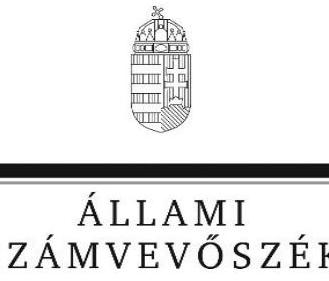
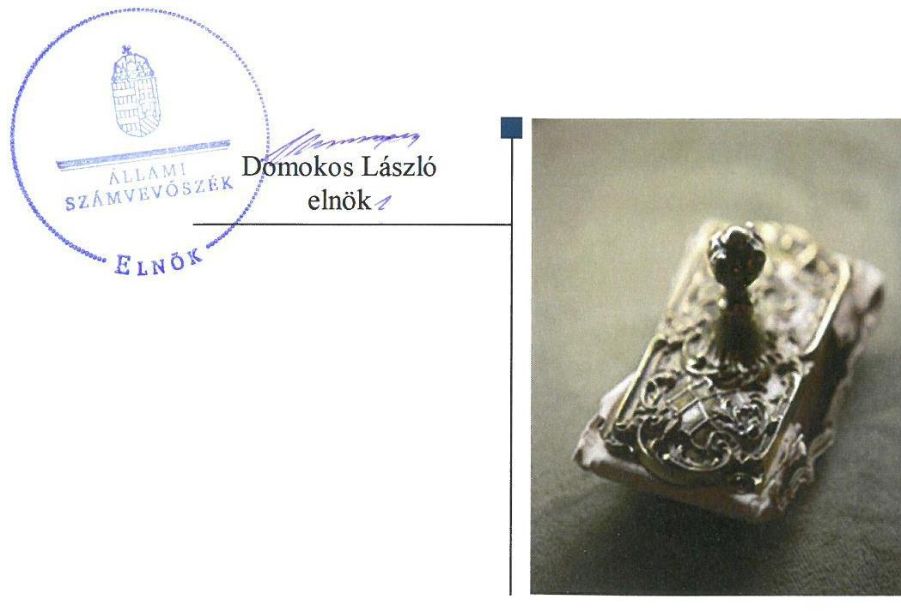
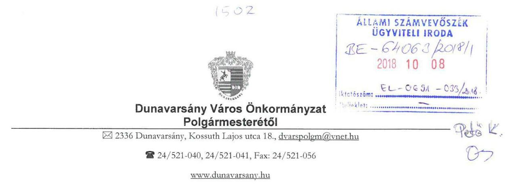
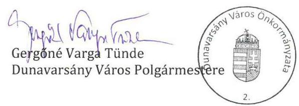
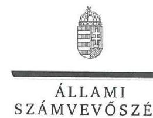
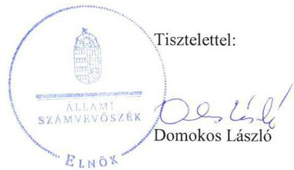
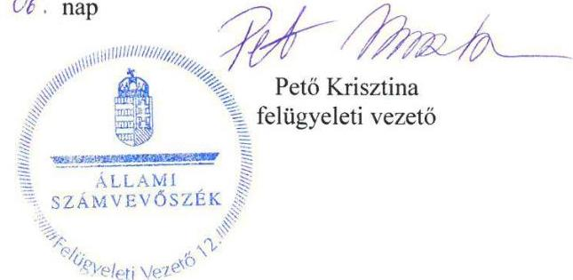

# Jelentés

**Az önkormányzatok pénzügyi és vagyongazdálkodása megfelelőségének ellenőrzése**

Dunavarsány Város Önkormányzata 2018.

18305 www.asz.hu

---

# J elentés 

## Az önkormányzatok pénzügyi és vagyongazdálkodása megfelelőségének ellenőrzése

Dunavarsány Város Önkormányzata 2018. 11. hó 29. nap

---

# AZ ELLENŐRZÉST FELÜGYELTE: 

PETŐ KRISZTINA felügyeleti vezető

## AZ ELLENŐRZÉST VEZETTE ÉS A VÉGREHAJTÁSÁÉRT FELELŐS:

DR. TIMÁR BALÁZS ellenőrzésvezető

## A PROGRAM ÖSSZEÁLLÍTÁSÁÉRT FELELŐS:

TÓTPÁL SZABOLCS osztályvezető

IKTATÓSZÁM: EL-0308-015/2018

TÉMASZÁM: 2451

## ELLENŐRZÉS-AZONOSÍTÓ SZÁM: V079604

Jelentéseink az Országgyúlés számítógépes hálózatán és az Interneten a www.asz.hu címen is olvashatóak.

---

# TARTALOMJEGYZÉK 

■ ÖSSZEGZÉS ..... 5
■ AZ ELLENŐRZÉS CÉLJA ..... 6
■ AZ ELLENŐRZÉS TERÜLETE ..... 7
■ AZ ELLENŐRZÉS HÁTTERE, INDOKOLTSÁGA ..... 8
■ A JELENTÉS LÉNYEGES KÉRDÉSKÖREI ..... 9
■ AZ ELLENŐRZÉS HATÓKÖRE ÉS MÓDSZEREI ..... 10
■ MEGÁLLAPÍTÁSOK ..... 12
■ JAVASLATOK ..... 17
■ MELLÉKLETEK ..... 21
I. sz. melléklet: Értelmező szótár ..... 21
■ FÜGGELÉK: ÉSZREVÉTELEK ..... 25
■ RÖVIDÍTÉSEK JEGYZÉKE ..... 37

---

.

---

# ÖSSZEGZÉS 

Dunavarsány Város Önkormányzata gazdálkodásának szabályozottsága, pénzügyi és vagyongazdálkodása nem volt szabályszerű a 2014-2016. években, ezáltal az Önkormányzatnál nem biztosították a közpénzekkel való szabályszerű, átlátható és elszámoltatható gazdálkodást.

## Az ellenőrzés társadalmi indokoltsága

Az Állami Számvevőszék stratégiájában hangsúlyos szerepet szán annak, hogy szilárd szakmai alapon álló, értékteremtő ellenőrzéseivel előmozdítsa a közpénzügyek átláthatóságát, rendezettségét és javaslataival a közpénzek és a közvagyon szabályos, gazdaságos, hatékony és eredményes felhasználását segítse. Az Állami Számvevőszék stratégiájában célul tűzte ki, hogy az önkormányzatok ellenőrzése során értékeli azok pénzügyi-gazdasági helyzetét, a kockázatokat feltárja, és az ellenőrzések helyszíneit kockázatelemzés alapján választja ki. Az Állami Számvevőszék szerepet vállal a korrupció és a csalás elleni küzdelemben. Közreműködik a korrupciós kockázatok és a korrupció elleni fellépés hatékony és eredményes eszközeinek beazonosításában, alkalmazásában, továbbá használatuk elterjesztésében, az integritás alapú közigazgatási kultúra kialakításában.

## Főbb megállapítások, következtetések, javaslatok

Dunavarsány Város Önkormányzata pénzügyi és vagyongazdálkodása szabályozási kereteit nem alakította ki. Az Önkormányzat bizonylati rendet a jogszabályban előírtak ellenére nem készített, továbbá a 2014-2015. években a számviteli belső szabályzatoknak a hatályos jogszabályokkal való összhangjának megteremtéséről nem gondoskodott. A vagyonkezelői jog gyakorlására vonatkozó részletszabályokat 2016. június 10-ig nem határozták meg. A közpénzekkel és az önkormányzati vagyonnal való felelős, átlátható gazdálkodás feltételeit nem teremtették meg.

Az Önkormányzat pénzügyi és vagyongazdálkodása nem volt szabályszerű. A főkönyvi könyvelés és az analitikus nyilvántartások közötti egyeztetés a jogszabályban előírt részletező nyilvántartások hiányában nem történt meg. A beruházások, felújítások kiadási előirányzatainak felhasználása során a beruházási döntéseket nem az arra jogosult hozta meg, továbbá a döntések végrehajtása során a gazdálkodási jogkörök gyakorlására irányadó jogszabályi előírásokat nem vették figyelembe. A Képviselő-testület egy ingó vagyontárgy értékesítése során a versenyeztetésre vonatkozó jogszabályok és belső szabályzatok előírásait megsértve hozott döntést.

A 2014-2016. évi beszámolók mérlegeiben szereplő eszközöket és forrásokat tételesen és ellenőrizhető módon leltárral nem támasztották alá. A vagyonkezelésbe adott eszközök mérlegben szereplő értékét nem támasztották alá a vagyonkezelő által készített, hitelesített leltárak. A jegyző a jogszabályban előírtak ellenére nem biztosította a vagyonelemek megfelelő nyilvántartását. A 2016. évi zárszámadási rendelethez csatolt vagyonkimutatás nem a jogszabályban előírt tagolásban tartalmazta az Önkormányzat vagyonát. Mindezek alapján a közvagyonnak Magyarország Alaptörvénye által előírt megőrzése és védelme Dunavarsány Város Önkormányzatánál nem volt biztosított.

Dunavarsány Város Önkormányzata a kizárólagos tulajdonában álló, közfeladatot ellátó gazdasági társaságával szemben a tulajdonosi jogokat szabályszerűen gyakorolta.

Az integritás múködést tekintve a 2016. évben a kiépített kontrollok nem védték meg az Önkormányzatot a vagyonvesztés kockázataival szemben.

A megállapítások alapján az Állami Számvevőszék a polgármesternek három javaslatot, a jegyzőnek 16 javaslatot fogalmazott meg, amelyre 30 napon belül intézkedési tervet kell készíteni.

---

# AZ ELLENŐRZÉS CÉLJA 

Az ellenőrzés célja az önkormányzat pénzügyi és vagyoni helyzetének, a gazdálkodás szabályosságának értékelése volt, a pénzügyi egyensúly megteremtése, a vagyongazdálkodás, a vagyon számbavétele, a gazdasági események elszámolása és a pénzgazdálkodás szabályszerűsége alapján. Az ellenőrzés keretében az Állami Számvevőszék értékelte az önkormányzat korrupciós kockázatainak kezelését szolgáló integritás kontrollok kiépítettségét és az integritás szemlélet érvényesülését.

---

# **A Z ELLENŐRZÉS TERÜLETE**

## **Dunavarsány Város Önkormányzata**

Dunavarsány a Közép-magyarországi régióban, Pest megyében, a Szigetszentmiklósi járásban található, állandó lakosainak száma a Központi Statisztikai Hivatal Magyarország Helységnévtára alapján 2016. január 1-jén 7659 fő volt.

A polgármester¹ személye a 2014. évi önkormányzati választások alkalmával változott. A jegyző² 2013. március 1-jétől látta el feladatait. Az Önkormányzati SZMSZL²³ alapján az Önkormányzat⁴ Képviselő-testülete⁵ kilenc fővel, valamint három állandó bizottsággal (Pénzügyi, Jogi és Ügyrendi Bizottság, Fejlesztési és Környezetvédelmi Bizottság, Humánpolitikai Bizottság) működött.

Az ellenőrzött időszakban Dunavarsány város hivatali feladatait az Önkormányzat és Majosháza Község Önkormányzatának Képviselő-testületei által 2013. február 6-án alapított Közös Hivatal⁶ látta el, amely gazdasági szervezettel rendelkezett. A Közös Hivatal szervezetében az ellenőrzött időszakban változás nem történt. Az ellenőrzött időszakban a foglalkoztatott köztisztviselők és közalkalmazottak száma a 2014. és 2016. évi beszámolók alapján 93 főről 94 főre növekedett.

Az Önkormányzat 2014. január 1-jén a Közös Hivatalon kívül négy költségvetési intézményt tartott fenn, az intézmények száma még ebben az évben kettőre csökkent (Weöres Sándor Óvoda, Petőfi Művelődési Ház és Könyvtár). Az Önkormányzat a 2014-2016. években egy kizárólagos tulajdoni hányadú gazdasági társasággal (Városgazdálkodási Kft.⁷) rendelkezett, amely közfeladatokat (gyermekétkeztetés, közterület rendezés) is ellátott. Kisebbségi tulajdoni részesedéssel rendelkezett az Önkormányzat az ellenőrzött időszakban a Dunavarsányi Tiszta Víz Kft.-ben és a Dél Pest-Megyei Víziközmű Zrt.-ben. Az Önkormányzat kettő társulásban volt alapító tag (Dunavarsány Környéki Intézményirányító Önkormányzati Társulás, Dunavarsány és Térsége Önkormányzati Szennyvíz Társulás).

Az Önkormányzat a Dél Pest Megyei Víziközmű Zrt.-vel 2014. január 1-jét megelőzően megkötött – ellenőrzött időszak végéig fennálló – vagyonkezelési szerződés⁸-gyel rendelkezett. 2016-ban a Városgazdálkodási Kft.-vel került sor további egy vagyonkezelési szerződés⁹ megkötésére.

Az Önkormányzat a 2014-2016. években üzemeltetési szerződések keretében látott el szociális étkeztetési (Városgazdálkodási Kft.), sport (DTE¹⁰) és köztemető fenntartási (2014. január 1-től 2015. október 2-ig a Gyertyaláng Kft¹¹, 2015. október 3-tól az ellenőrzött időszak végéig az ELOHIM Kft.¹²) közfeladatokat.

Az Önkormányzat 2016. évi zárszámadásáról szóló rendelete szerint 1 830,3 millió Ft költségvetési bevételt ért el, valamint 1 759,5 millió Ft költségvetési kiadást teljesített.

Önkormányzat a 2014-2016. években adósságot keletkeztető ügyletet nem vállalt.

---

# AZ ELLENŐRZÉS HÁTTERE, INDOKOLTSÁGA 

Az államháztartás önkormányzati alrendszerének közpénz felhasználása, az önkormányzatok által ellátott közfeladatok és önként vállalt feladatok sokrétúsége, valamint a feladat ellátásához rendelt vagyon nagyságrendje indokolja, hogy az ÁSZ ${ }^{13}$ ellenőrzéseket folytasson a pénzügyi és vagyongazdálkodás területén. Az ÁSZ folyamatosan végzi az önkormányzatok pénzügyi és vagyongazdálkodásának ellenőrzését. Az elmúlt időszakban az önkormányzati gazdálkodás kockázatai beépítésre kerültek az ellenőrzött önkormányzatok kiválasztási rendszerébe. Az ellenőrzések tapasztalatai megmutatták, hogy továbbra is indokolt az egyrészt elemző, értékelő, a pénzügyi helyzet kockázatát is minősítő, másrészt a pénzügyi és vagyongazdálkodási tevékenység szabályszerűségét értékelő ÁSZ ellenőrzések folytatása.

Az ÁSZ ellenőrzései hozzájárulnak az önkormányzatok felelős és fenntartható gazdálkodásához, pénzügyi helyzetének pontosabb megítéléséhez azáltal, hogy a pénzügyi helyzetet a vagyoni helyzettel együtt értékeljük. Feltárjuk az önkormányzati gazdálkodást meghatározó szabályozások hiányosságait, a szabályozással nem érintett gazdálkodási területeket, valamint a pénzügyi és vagyongazdálkodás esetleges szabálytalanságait. Beazonosítjuk a pénzügyi egyensúlyi helyzet megbomlásának kockázatait. Értékeljük a pénzügyi egyensúly érvényesülését, az adósságállomány alakulását.

A pénzügyi és vagyongazdálkodás szabályszerűségének ellenőrzése eredményeként tett megállapítások, javaslatok hasznosításával javul az önkormányzat gazdálkodásának szabályozottsága, valamint a „jó gyakorlatok" terjesztésén keresztül azok az önkormányzatok is átvehetik a pozitív példákat, ahol nem végez ellenőrzést az ÁSZ. Ellenőrzéseink eredményeképpen javaslatokat fogalmazhatunk meg az önkormányzatok pénzügyi egyensúlya fenntartásával kapcsolatos problémák rendszerszemléletű kezelésére, felszámolására.

---

# A JELENTÉS LÉNYEGES KÉRDÉSKÖREI 

1. A pénzügyi és vagyongazdálkodás szabályainak kialakítása szabályszerű volt-e?
2. A vagyonnyilvántartás, a költségvetési beszámoló mérlegének alátámasztottsága szabályszerű volt-e?
3. A vagyonváltozást eredményező döntések és azok végrehajtása, a gazdálkodási jogkörök gyakorlása szabályszerű volt-e?
4. Felelősen gazdálkodott-e az önkormányzat a tartós részesedéseivel, élt-e tulajdonosi jogaival, teljesítette-e tulajdonosi kötelezettségeit?
5. Az önkormányzat az integritás müködést kialakította és erősitette-e?

---

# AZ ELLENŐRZÉS HATÓKÖRE ÉS MÓDSZEREI 

## Az ellenőrzés típusa

Megfelelőségi ellenőrzés.

## Az ellenőrzött időszak

A 2014-2016. évek.

## Az ellenőrzés tárgya

A helyi önkormányzat pénzügyi és vagyongazdálkodása, a pénzügyi egyensúly megteremtése, a tulajdonosi és irányító szervi feladatok ellátása, az integritás szemlélet érvényesülése.

Az ellenőrzés kiterjedt minden olyan körülményre és adatra, amely az ÁSZ jogszabályban meghatározott feladatainak teljesítéséhez, valamint a program végrehajtása folyamán felmerült újabb összefüggések feltárásához szükséges.

## Az ellenőrzött szervezet

Dunavarsány Város Önkormányzata

## Az ellenőrzés jogalapja

Az ellenőrzés jogszabályi alapját az ÁSZ tv. 1. § (3) bekezdésének, az 5. § (2)-(6) bekezdéseinek, valamint az Áht. ${ }^{14}$ 61. § (2) bekezdésének előírásai képezték.

## Az ellenőrzés módszerei

Az ÁSZ az ellenőrzést az ellenőrzési program ellenőrzési kérdései, az ellenőrzött időszakban hatályos jogszabályok, az ellenőrzés szakmai szabályok és az ÁSZ módszertanok figyelembevételével végezte.

A gazdálkodás hibáinak kijavítására, a közpénzekkel való felelős gazdálkodás segítésére irányuló javaslatok kidolgozásakor a hatályos jogszabályok voltak irányadóak.

Az ÁSZ az ellenőrzés ideje alatt az ellenőrzött szervezettel történő kapcsolattartást az ÁSZ SZMSZ ${ }^{15}$-ének vonatkozó előírásai alapján biztosította.

---

Az ellenőrzési kérdések megválaszolásához szükséges bizonyítékok megszerzése az ellenőrzött által rendelkezésre bocsátott dokumentumokra, adatokra alapozva megfigyelés, szemle (szemrevételezés), kérdésfeltevés (információkérés), mintavételezés, valamint elemző eljárással történt.

Az ellenőrzés lefolytatásához az önkormányzat a tanúsítványok kitöltésével, valamint az ÁSZ által kért dokumentumok megküldésével szolgáltatott adatokat. Az így rendelkezésre bocsátott adatok, információk, a tanúsítványok adatai valódiságának kontrollja az ellenőrzés keretében történt.

Az ÁSZ az ellenőrzést az önkormányzat működésével kapcsolatos feladatokat ellátó polgármesteri hivatalnál végezte. Az önkormányzat az intézményei és gazdasági társaságai ellenőrzéssel érintett dokumentumait, tanúsítványait a polgármesteri hivatal útján bocsátotta az ellenőrzés rendelkezésére.

A pénzügyi és vagyongazdálkodás szabályozottságát az ÁSZ az önkormányzat rendeletei, határozatai, illetve az önkormányzat (mint önálló éves költségvetési beszámolót készítő szerv) és a polgármesteri hivatal belső szabályozásai alapján értékelte. A pénzügyi egyensúly az önkormányzat összevont adatai alapján, a vagyonnyilvántartás, a mérleg alátámasztottságának megítélése az önkormányzat és a polgármesteri hivatal adatai alapján történt. A leltározási, értékelési folyamat szabályszerűségére a polgármesteri hivatal által végzett 2016. évi leltározási folyamat ellenőrzése alapján tett megállapításokat az ÁSZ.

Az önkormányzat vagyonváltozást eredményező döntéseinek és azok végrehajtásának ellenőrzésére irányított, valamint véletlen mintavételi eljárással és tételes ellenőrzéssel került sor. A beruházások és felújítások, valamint a vagyonértékesítés és bérbeadás útján történő vagyonhasznosítás ellenőrzése véletlen mintavételi eljárással - a polgármesteri hivatal (mint önálló éves költségvetési beszámolót készítő költségvetési szerv) és az önkormányzat főkönyvi állományából - kiválasztott minta alapján történt.

A véletlen mintavétellel ellenőrzött területek esetében minden egyes tétel vonatkozásában a szabályszerűségre vonatkozó kérdéseket tettünk fel, amelyek eredménye összesítésre került. Szabályszerűnek értékeltünk egy ellenőrzött területet, amennyiben 95\%-os bizonyossággal a lényeges sokaságban az átlagos hibaarány legfeljebb 10\%, nem szabályszerűnek, amennyiben 10\%-nál magasabb arányt képviselt.

Az ellenőrzési kérdésekre adott válaszok alapján értékelte az ÁSZ, hogy az önkormányzat pénzügyi gazdálkodása szabályszerű volt-e, biztosított volt-e a pénzügyi egyensúly. Értékelte a vagyongazdálkodás szabályszerűségét, a vagyonváltozást eredményező döntések és a tulajdonosi jogok gyakorlása szabályszerűségét. Értékelte továbbá az integritás érvényesülését.

---

# 1. A pénzügyi és vagyongazdálkodás szabályainak kialakítása szabályszerű volt-e? 

Összegző megállapítás

A pénzügyi és vagyongazdálkodás szabályainak kialakítása nem volt szabályszerű.

A 2014-2016. években a Hivatali SZMSZ ${ }^{16}$ az Ávr. ${ }^{17}$ 13. § (1) bekezdése e) pontjának előírása ellenére nem tartalmazta a gazdasági szervezet megnevezését. A jegyző a gazdasági szervezet részére nem adott ki külön ügyrendet, azonban a gazdasági szervezet feladatait a Hivatali ügyrendben az Ávr. szerint szabályozta.

A jegyző a Számv. tv. ${ }^{18}$ 161. § (2) bekezdése d) pontjának előírása ellenére nem gondoskodott arról, hogy a számlarend ${ }_{1-3}{ }^{19}$ tartalmazza az abban foglaltakat alátámasztó bizonylati rendet. Bizonylati rend hiányban a Számv. tv.-ben előírt beszámolók készítéséhez szükséges adatok bizonylati alátámasztása nem volt biztosított.

A vagyongazdálkodás szabályainak kialakítása nem volt szabályszerű, mert az értékelési szabályzat ${ }_{1}{ }^{20}$ 2014. január 1. és 2015. március 31. között a már hatálytalan $\dot{A} h s z_{1}{ }^{21}$-re vonatkozóan tartalmazott hivatkozást. A jegyző az $\dot{A} h s z_{2}{ }^{22}$ 50. § (2) bekezdése d) pontjának előírása ellenére a 20142015. években nem gondoskodott a vagyonkezelésbe adott eszközök értékelése módszerének az értékelési szabályzat ${ }_{1,2}$-ben történő rögzítéséről. 2016. január 1-jétől az értékelési szabályzat ${ }_{3}$-ban már szerepeltek a vagyonkezelésbe adott vagyon értékelésére vonatkozó előírások, azonban a jegyző $\dot{A} h s z_{2}$ 50. § (2) bekezdése b) pontjának előírása ellenére a kis öszszegű követelések év végi meghatározásának elveit az értékelési szabály-zat ${ }_{3}$-ban nem rögzítette.

A Képviselő-testület az Mötv. ${ }^{23}$ 109. § (4) bekezdésének előírása ellenére 2014. január 1. és 2016. június 10. között rendeletben nem határozta meg a vagyonkezelői jog gyakorlására vonatkozó részletes szabályokat. A 2016. június 11-től hatályos vagyonrendelet ${ }_{2}{ }^{24}$ megfelelt az Mötv. és az Nvtv. ${ }^{25}$ előírásainak.

A Képviselő-testület a vagyonrendelet ${ }_{1}$-ben és a költségvetési rende-let ${ }_{1,2}{ }^{26}$-ben eltérő összegben határozta meg azt az értékhatárt, amely felett önkormányzati vagyon tulajdonjogát átruházni csak versenyeztetés útján lehet. Ezzel a 2014-2015. években megsértették a Jat. ${ }^{27}$ 3. §-ban foglaltakat, amely szerint a szabályozás nem lehet indokolatlanul párhuzamos.

---

# 2. A vagyonnyilvántartás, a költségvetési beszámoló mérlegének alátámasztottsága szabályszerű volt-e? 

Összegző megállapítás

A vagyonnyilvántartás, a költségvetési beszámoló mérlegének alátámasztottsága a 2014-2016. években nem volt szabályszerű.

Az Önkormányzatnak a beruházások, felújítások, a részesedések és a vagyonkezelésbe adott eszközök közé besorolt vagyonelemei esetében jegyző az Mötv. 110. § (2) bekezdésének előírása ellenére nem biztosította a törzsvagyonnak a többi vagyontárgytól elkülönítve történő nyilvántartását.

A jegyző az Áhsz2 30. § (2) bekezdésének előírása ellenére - a tárgyi eszközök és befektetett pénzügyi eszközök kivételével - nem gondoskodott arról, hogy a 2016. évi zárszámadási rendeletéhez ${ }^{28}$ csatolt vagyonkimutatás az Áhsz ${ }_{2} 5$. melléklet szerinti tagolásban készüljön el. A vagyonkimutatás az Áhsz ${ }_{2} 30 . \S$ (3) bekezdésében előírt elemeket nem tartalmazta.

A Városgazdálkodási Kft. részére 2016-ban vagyonkezelésbe adott vagyont az Önkormányzat nem az Áhsz 2 11. § (11) bekezdésében előírt módon tartotta nyilván.

A jegyző - az Mötv. 110. § (1) bekezdésében foglalt felelősségi körében - a kataszteri rendelet ${ }^{29}$ 1. § (2) bekezdésének előírása ellenére nem biztosította az Önkormányzat ingatlanvagyon-katasztere adatainak az illetékes kormányhivatal ingatlanügyi hatóságaként eljáró járási hivatal ingatlannyilvántartásának adataival való egyezőséget.

A 2014-2016. években a Számv. tv. 69. § (1) bekezdésének, az Áhsz ${ }_{2}$. 22. § (1) bekezdésének és a leltározási szabályzat ${ }_{1,2} 2.1$. pontja előírása ellenére nem készült az Önkormányzat mérleg fordulónapján meglévő eszköz és forrás állományát alátámasztó leltár.

A jegyző a Számv. tv. 165. § (4) bekezdésének előírása ellenére az ellenőrzött időszakban nem biztosította a főkönyvi könyvelés, az analitikus nyilvántartások és bizonylatok adatai közötti egyeztetés és ellenőrzés lehetőségét. A jegyző az Áhsz 2 . 39. § (3) bekezdésének előírása ellenére részletező nyilvántartások vezetésével nem gondoskodott
$\longrightarrow$ valamennyi ellenőrzött év vonatkozásában a tartós részesedések, a pénzeszközök, a költségvetési évben esedékes követelések, az adott előlegek, a követelés jellegű sajátos elszámolások mérlegsorainak alátámasztásáról;
$\longrightarrow$ a 2014-2015. években az értékpapírok mérlegsorának alátámasztásáról,
$\longrightarrow$ a 2015-2016. években a vagyonkezelésbe adott eszközök mérlegsorainak alátámasztásáról. Ezáltal nem tett eleget a Számv. tv. 69. § (2) bekezdésében foglalt egyeztetési kötelezettségének sem.
A vagyonkezelésbe adott eszközök mérlegben szereplő értékét 20142016. években - a Számv. tv. 69. § (1) bekezdése, az Áhsz 2 22. § (2) bekezdés a) pontja, a leltározási szabályzat ${ }_{1}{ }^{30} 2.7$ pontja és a leltározási szabályzat ${ }_{2}{ }^{31} 2.9$ pontja előírásainak ellenére - nem támasztották alá a vagyonkezelő ${ }_{1,2}{ }^{32}$ által készített, hitelesített leltárakkal.

---

# 3. A vagyonváltozást eredményező döntések és azok végrehajtása, a gazdálkodási jogkörök gyakorlása szabályszerű volt-e? 

Összegző megállapítás

A vagyonváltozást eredményező döntések és azok végrehajtása, a gazdálkodási jogkörök gyakorlása nem volt szabályszerű.
3.1. számú megállapítás

A vagyonkezelői jog létesítése, gyakorlásának ellenőrzése nem szabályszerűen történt.

A vagyonkezelési szerződés-ben a vagyonrendelet1 14. § (2) bekezdésében foglaltakkal ellentétben - amely szerint vagyonkezelői jog ingyenes átengedésére kizárólag költségvetési szerv vagy önkormányzati intézmény vagyonkezelők esetében kerülhetett sor - a vagyonkezelői jog 2014. december 31-ig a gazdasági társasági formában múködő vagyonkezelő ${ }_{1}$ részére ingyenesen került átruházásra. 2015. január 1-jei hatállyal a szerződést módosították, ettől az időponttól a vagyonkezelő ${ }_{1}$ részére vagyonkezelési díj megfizetését írták elő, ezáltal a vagyonkezelési szerződés ${ }_{1}$ már összhangba került a vagyonrendelet ${ }_{1,2}$ előírásaival.

Az Önkormányzat az Nvtv. 10. § (2) bekezdésében tulajdonosi joggyakorlói kötelezettsége körében, illetve a vagyonrendelet ${ }_{2}$ 17/A. § (2) bekezdésének c) pontjában foglalt előírás ellenére az ellenőrzött időszakban nem ellenőrizte, hogy a vagyonkezelő ${ }_{1,2}$ az Mötv. 109. § (6) bekezdésében rögzített eszközpótlási és tartalékképzési kötelezettségének megfelelő mértékben eleget tett-e.

Az Önkormányzat 2014-2016. években három, az ellenőrzött időszak végéig hatályos üzemeltetési szerződéssel rendelkezett. A szerződések megkötése során betartották az Nvtv. kötelező tartalmi elemekre vonatkozó előírásait.

Az Önkormányzat az Info. tv. ${ }^{33} 37$ § (1) bekezdésének és 1. melléklet III. Gazdálkodási adatok 4. sorában foglaltak ellenére a vagyonkezelési szerződés ${ }_{1,2}$ és az üzemeltetési szerződések közzétételi lista szerinti adatait nem tette közzé.
3.2. számú megállapítás

A beruházások, felújítások kiemelt előirányzatainak felhasználása során a döntéshozatal, a döntések végrehajtása, a gazdálkodási jogkörök gyakorlása, továbbá a vagyonértékesítés nem volt szabályszerű. A behajthatatlan követelések leírása nem volt szabályszerű.

A 2014-2016. években beruházási, felújítási kiadási előirányzatok terhére vállalt kötelezettségek az Mötv. 41. § (3) bekezdésének és a vagyonrendelet ${ }_{1,2} 8$. § (3) bekezdése b) pontjának előírása ellenére képviselő-testületi felhatalmazás nélkül történtek. A közbeszerzési értékhatárt elérő beszerzések esetében betartották a Kbt. ${ }_{1,2}{ }^{34}$-ben foglaltakat. A jegyző a Számv. tv. 165. § (2) bekezdésének előírása ellenére nem gondoskodott arról, hogy a vagyonelemekben bekövetkezett változások számviteli nyilvántartásban való rögzítését szabályszerűen kiállított bizonylattal támasszák alá. Az eszközök üzembe helyezését a Számv. tv. 52. § (2) bekezdésének előírása ellenére hitelt érdemlően nem dokumentálták.

---

A polgármester a beruházási kiadások előirányzatai terhére az Áht. 37. § (1) bekezdésének előírása ellenére pénzügyi ellenjegyzés nélkül, illetve nem írásban vállalt kötelezettséget. A beruházási, felújítási előirányzatok terhére történt kifizetésekre az Ávr. 57. § (3) bekezdésének előírása ellenére teljesítés igazolása nélkül került sor, illetve a teljesítés igazolás dátumának megjelölése nem történt meg, ezáltal nem volt igazolható, hogy a teljesítés igazolás a kifizetést megelőzően megtörtént. Az érvényesítést végző személy az Ávr. 58. § (2) bekezdésének előírása ellenére nem jelezte az utalványozónak, hogy a megelőző ügymenetben - a pénzügyi ellenjegyzés és a teljesítés igazolás során - megsértették az Áht. és az Ávr. előírásait.

Az Önkormányzat és a Közös Hivatal a gazdálkodási jogkörgyakorlók személyéről és aláírás-mintájukról az Ávr.-ben foglaltak szerinti naprakész nyilvántartást vezetett.

A 2014. évben a Képviselő-testület - egy esetben - a vagyonrendelet ${ }_{1}$ 22. § (1) bekezdésének előírása ellenére - figyelemmel az Nvtv. 11. § (16) bekezdésében foglaltakra - egy nettó 3,6 millió Ft könyv szerinti értékű személygépkocsi értékesítése során figyelmen kívül hagyta, hogy a nettó egymillió Ft értékhatárt meghaladó vagyonelemek értékesítése csak versenyeztetés útján történhet. A jegyző az Áfa tv. ${ }^{35}$ 159. § (1) bekezdésének előírása ellenére az értékesített vagyontárgy ellenértékéről számla kibocsátása iránt nem intézkedett.

A 2014. évben 47 471,4 ezer Ft követelés leírása tekintetében a jegyző az Áhsz 1. § (1) bekezdése 1. pontjának és az Áhsz 43. § (2) bekezdésének előírása ellenére nem gondoskodott a behajthatatlanság tényének és mértékének bizonyításáról, ezáltal a követelések behajthatatlanná minősítése és a könyvekből történt kivezetése nem volt szabályszerű.

# 4. Felelősen gazdálkodott-e az önkormányzat a tartós részesedéseivel, élt-e tulajdonosi jogaival, teljesítette-e tulajdonosi kötelezettségeit? 

Összegző megállapítás Az Önkormányzat gazdasági társasága feletti tulajdonosi jog gyakorlása és a tulajdonosi kötelezettségek teljesítése szabályszerűen történt.

Az Önkormányzat az ellenőrzött időszakban egy közfeladatot ellátó, kizárólagos tulajdonú gazdasági társaság, a Városgazdálkodási Kft felett gyakorolt tulajdonosi jogokat.

A Taktv. ${ }^{36}$ 4. § (2) bekezdésének előírása ellenére - amely szerint a köztulajdonban álló gazdasági társaság felügyelőbizottsága három természetes személy tagból áll - az Alapító ${ }^{37}$ öt tagú felügyelőbizottságot hozott létre. A felügyelőbizottság 2016. szeptember 13-tól a Taktv. rendelkezésével összhangban három taggal múködött.

Az Alapító a 2015-2016. években a nyereséget nem osztotta fel, hanem eredménytartalékba helyezte.

---

# 5. Az önkormányzat az integritás múködést kialakította és erősí-tette-e? 

Összegző megállapítás

Az integritás alapú múködést tekintve a 2016. évben a kiépített kontrollok nem biztosították közvagyon védelmét.

A 2016. évben az Önkormányzat és a Közös Hivatal rendelkezett a szervezeti kereteit meghatározó legfontosabb, jogszabályban előírt belső szabályozó eszközökkel (Önkormányzati SZMSZ, Hivatali SZMSZ). A polgármester és a jegyző kiadta a szervezet vagyonának megvédésére szolgáló szabályzatokat.

A jegyző a 2016. évre a Közös Hivatalban foglalkoztatott köztisztviselők részére közszolgálati szabályzat ${ }^{38}$ ot adott ki. A jogszabályban elő nem írt kontrollok közül a Közös Hivatalnál meghatározták az összeférhetetlenség fennállása esetén követendő eljárásokat és a munkavégzésre vonatkozó etikai elvárásokat. Megszabták a különféle ajándékok, meghívások elfogadásának kereteit, valamint a külső szakértők kiválasztására, a velük történő szerződésre vonatkozó feltételeket.

Az integritás szemlélet hiányossága, hogy a mindennapi tevékenység során felmerülő korrupciós kockázatokra a foglalkoztatottak figyelmét nem hívták fel. Az Önkormányzat belső ellenőrzése az elmúlt három évben nem vizsgálta a rendszeres beszállítókkal kötött szerződések szabályosságát, célszerűségét. Az ellenőrzés tapasztalatai megmutatták, hogy az Önkormányzatnál kiépített integritás rendszer a közvagyon megóvása terén nem tudta betölteni a szerepét.

---

# JAVASLATOK 

Az ÁSZ tv. 33. § (1) bekezdésében foglaltak értelmében az ellenőrzött szervezet vezetője köteles a jelentésben foglalt megállapításokhoz kapcsolódó intézkedési tervet összeállítani és azt a jelentés kézhezvételétől számított 30 napon belül az ÁSZ részére megküldeni. Amennyiben az ellenőrzött szervezet vezetője nem küldi meg határidőben az intézkedési tervet, vagy továbbra sem elfogadható intézkedési tervet küld, az Állami Számvevőszék elnöke az ÁSZ tv. 33. § (3) bekezdése a) és b) pontjaiban foglaltakat érvényesítheti.

## Dunavarsány Város Önkormányzata polgármesterének

1. Kezdeményezze az Önkormányzat mint tulajdonosi joggyakorló jogszabályi előirásoknak megfelelő ellenőrzési kötelezettségének teljesitését.
(3.1. sz. megállapítás 2. bekezdése alapján)
2. Intézkedjen a jogszabályban meghatározott hatásköri előírások betartásáról a beruházási, felújítási kiadási előirányzatok terhére történő kötelezettségvállaláskor.
(3.2. sz. megállapítás 1. bekezdésének 1. mondata alapján)
3. Intézkedjen annak érdekében, hogy kötelezettséget a jogszabályi előírások figyelembevételével vállaljon.
(3.2. sz. megállapítás 2. bekezdésének 1. mondata alapján)

## Dunavarsány Város Önkormányzata jegyzőjének

1. Intézkedjen annak érdekében, hogy a hivatal szervezeti és müködési szabályzatának tartalma megfeleljen a jogszabályi előírásnak.
(1. összegző megállapítás 1. bekezdésének 1. mondata alapján)
2. Intézkedjen annak érdekében, hogy a számlarend tartalma megfeleljen a jogszabályi előírásnak.
(1. összegző megállapítás 2. bekezdésének 1. mondata alapján)
3. Intézkedjen annak érdekében, hogy az eszközök és a források értékelési szabályzatának tartalma megfeleljen a jogszabályi előírásnak.
(1. összegző megállapítás 3. bekezdése 3. mondatának utolsó tagmondata alapján)

---

4. Intézkedjen annak érdekében, hogy az önkormányzati törzsvagyont a többi vagyontárgytól elkülönítve tartsák nyilván a jogszabályi előírásnak megfelelően.
(2. összegző megállapítás 1. bekezdése alapján)
5. Intézkedjen a jogszabályi előírásoknak megfelelő tartalmú és tagolású vagyonkimutatás elkészitése érdekében.
(2. összegző megállapítás 2. bekezdése alapján)
6. Intézkedjen a vagyonkezelésbe adott vagyon jogszabályi előírásnak megfelelő nyilvántartása érdekében.
(2. összegző megállapítás 3. bekezdése alapján)
7. Intézkedjen annak érdekében, hogy az Önkormányzat ingatlanvagyon-
katasztere adatai a jogszabályi előírásnak megfelelően megegyezzenek az illetékes kormányhivatal ingatlanügyi hatóságaként eljáró járási hivatal ingatlan-nyilvántartásának adataival.
(2. összegző megállapítás 4. bekezdése alapján)
8. Intézkedjen a jogszabályi előírásoknak megfelelő leltár összeállítása érdekében.
(2. összegző megállapítás 5. bekezdése alapján)
9. Intézkedjen a jogszabályi előírásoknak megfelelő részletező nyilvántartások vezetése érdekében.
(2. összegző megállapítás 6. bekezdésének 2. mondata alapján)
10. Intézkedjen a vagyonkezelésbe adott eszközök mérlegben szereplő értékének - vagyonkezelő által elkészített és hitelesített - leltárral történő alátámasztásáról a jogszabályi előírásnak megfelelően.
(2. összegző megállapítás 7. bekezdése alapján)
11. Intézkedjen a jogszabályi előírásnak megfelelő közzétételi kötelezettség teljesitése érdekében.
(3.1. sz. megállapítás 4. bekezdése alapján)
12. Intézkedjen, hogy a számviteli (könyvviteli) nyilvántartásokba csak szabályszerűen kiállított bizonylat alapján jegyezzenek be adatokat.
(3.2. sz. megállapítás 1. bekezdésének 3. mondata alapján)

---

13. Intézkedjen annak érdekében, hogy az eszközök üzembe helyezését a jogszabályi előírásnak megfelelően hitelt érdemlően dokumentálják.
(3.2. sz. megállapítás 1. bekezdésének 4. mondata alapján)
14. Intézkedjen a gazdálkodási jogkörök jogszabályi előírásnak megfelelő gyakorlása érdekében.
(3.2. sz. megállapítás 2. bekezdése alapján)
15. Intézkedjen annak érdekében, hogy a vagyonelemek értékesítésére a jogszabályi előírásoknak megfelelően kerüljön sor.
(3.2. sz. megállapítás 4. bekezdése alapján)
16. Intézkedjen a behajthatatlan követelések esetében a behajthatatlanság tényének és mértékének bizonyítása érdekében.
(3.2. sz. megállapítás 5. bekezdése alapján)

---

.

---

# MELLÉKLETEK 

- I. SZ. MELLÉKLET: ÉRTELMEZŐ SZÓTÁR
beruházás
felújítás
garanciavállalás
hasznosítás
integritás
kezességvállalás
A tárgyi eszköz beszerzése, létesítése, saját vállalkozásban történő előállítása, a beszerzett tárgyi eszköz üzembe helyezése, rendeltetésszerű használatbavétele érdekében az üzembe helyezésig, a rendeltetésszerű használatbavételig végzett tevékenység (szállítás, vámkezelés, közvetítés, alapozás, üzembe helyezés, továbbá mindaz a tevékenység, amely a tárgyi eszköz beszerzéséhez hozzákapcsolható, ideértve a tervezést, az előkészítést, a lebonyolítást, a hiteligénybevételt, a biztosítást is); beruházás a meglévő tárgyi eszköz bővítését, rendeltetésének megváltoztatását, átalakítását, élettartamának, teljesítőképességének közvetlen növelését eredményező tevékenység is, az előbbiekben felsorolt, e tevékenységhez hozzákapcsolható egyéb tevékenységekkel együtt. (Forrás: Számv. tv. 3. § (4) bekezdés 7. pontja)
Az elhasználódott tárgyi eszköz eredeti állaga (kapacitása, pontossága) helyreállítását szolgáló, időszakonként visszatérő olyan tevékenység, amely mindenképpen azzal jár, hogy az adott eszköz élettartama megnövekszik, eredeti műszaki állapota, teljesítőképessége megközelítően vagy teljesen visszaáll, az előállított termékek minősége vagy az adott eszköz használata jelentősen javul és így a felújítás pótlólagos ráfordításából a jövőben gazdasági előnyök származnak; felújítás a korszerűsítés is, ha az a korszerű technika alkalmazásával a tárgyi eszköz egyes részeinek az eredetitől eltérő megoldásával vagy kicserélésével a tárgyi eszköz üzembiztonságát, teljesítőképességét, használhatóságát vagy gazdaságosságát növeli; a tárgyi eszközt akkor kell felújítani, amikor a folyamatosan, rendszeresen elvégzett karbantartás mellett a tárgyi eszköz oly mértékben elhasználódott (szerkezeti elemei elöregedtek), amely elhasználódottság már a rendeltetésszerű használatot veszélyezteti; nem felújítás az elmaradt és felhalmozódó karbantartás egyidőben való elvégzése, függetlenül a költségek nagyságától. (Forrás: Számv. tv. 3. § (4) bekezdés 8. pontja)
A garanciaszerződés, illetve a garanciavállaló nyilatkozat a garantőr olyan kötelezettségvállalása, amely alapján a nyilatkozatban meghatározott feltételek esetén köteles a jogosultnak fizetést teljesíteni. A szerződést és a garanciavállaló nyilatkozatot írásba kell foglalni. (Forrás: Ptk. 2 6:431. §)
A tulajdonosi joggyakorló vagy a nemzeti vagyon használója által a nemzeti vagyon birtoklásának, használatának, hasznok szedése jogának bármely - a tulajdonjog átruházását nem eredményező - jogcímen történő átengedése, ide nem értve a vagyonkezelésbe adást, valamint a haszonélvezeti jog alapítását. (Forrás: Nvtv. 3. § (1) bekezdés 4. pontja)
Az „integritás" - egyik gyakran használt jelentése szerint - az elvek, értékek, cselekvések, módszerek, intézkedések konzisztenciáját jelenti, vagyis olyan magatartásmódot, amely meghatározott értékeknek megfelel. Integritás-irányítási rendszer bevezetése a szervezetben a szervezethez rendelt közfeladatok integritás szempontú ellátását, az érték alapú működéssel (integritással) összefüggő szervezeti követelmények következetes érvényesítését jelenti. (Forrás: „Magyarországi államháztartási belső kontroll standardok Útmutató", kiadta az NGM 2012. decemberében)
Kezességi szerződéssel a kezes arra vállal kötelezettséget, hogy amennyiben a kötelezett nem teljesít, maga fog helyette a jogosultnak teljesíteni.
Kezességet csak írásban lehet érvényesen vállalni. (Forrás: Ptk. 1 272. § (1)-(2) bekezdései, hatályos 2014. március 15-ig)
Kezességi szerződéssel a kezes kötelezettséget vállal a jogosulttal szemben, hogyha a kötelezett nem teljesít, maga fog helyette a jogosultnak teljesíteni. Kezesség egy

---

kötételezs
kötelező közszolgáltatás (az önkormányzati feladatokat érintően)
közfeladat
önkormányzat
önkormányzat többségi tulajdonában lévő gazdasági társaságok
polgármesteri hivatal
vagy több, fennálló vagy jövőbeli, feltétlen vagy feltételes, meghatározott vagy meghatározható összegű pénzkövetelés vagy pénzben kifejezhető értékkel rendelkező egyéb kötelezettség biztosítására vállalható. A szerződést írásba kell foglalni. (Forrás: Ptk.: 6:416.\$ (1)-(3) bekezdései, hatályos 2014. március 15-től).
Az önkormányzat kötelezően vállalt feladatkörébe tartozó egyes - közszolgáltatás útján megvalósuló - közfeladatok ellátása, amelyeket külön jogszabály (törvény, helyi önkormányzati rendelet) határoz meg.
Jogszabályban meghatározott állami vagy önkormányzati feladat, amit az arra kötelezett közérdekből, a jogszabályban meghatározott követelményeknek és feltételeknek megfelelve végez, ideértve a lakosság közszolgáltatásokkal való ellátását, továbbá az állam nemzetközi szerződésekben vállalt kötelezettségeiből adódó közérdekű feladatokat, valamint e feladatok ellátásakor szükséges infrastruktúra biztosítását is.
(Forrás: Nvtv. 3. § (1) bekezdés 7. pontja, hatálytalan 2015. január 1-jétől)
Közfeladat a jogszabályban meghatározott állami vagy önkormányzati feladat. A közfeladatok ellátása költségvetési szervek alapításával és müködtetésével vagy az azok ellátásához szükséges pénzügyi fedezet e törvényben meghatározott eszközökkel, részben vagy egészben történő biztosításával valósul meg. A közfeladatok ellátásában államháztartáson kívüli szervezet jogszabályban meghatározott rendben közremüködhet. A közfeladatot meghatározó jogszabályban meg kell határozni a közfeladat ellátásának módját és egyidejűleg rendelkezni kell az annak ellátásához szükséges pénzügyi fedezet biztosításáról. Új közfeladat kizárólag az annak ellátásához megfelelő pénzügyi fedezet rendelkezésre állása esetén írható elő vagy vállalható. Ha a pénzügyi fedezet már nem áll rendelkezésre, intézkedni kell a pénzügyi fedezet biztosításáról vagy a közfeladat megszüntetéséről. (Forrás: Áht. 3/A. § hatályos 2015. január 1-jétől)
A helyi önkormányzat jogi személy. Az önkormányzati feladatok ellátását a képviselőtestület és szervei biztosítják. A képviselőtestület szervei: a polgármester, a főpolgármester, a megyei közgyűlés elnöke, a képviselő-testület bizottságai, a részönkormányzat testülete, a polgármesteri hivatal, a megyei önkormányzati hivatal, a közös önkormányzati hivatal, a jegyző, továbbá a társulás. A képviselő-testület a feladatkörébe tartozó közszolgáltatások ellátására - jogszabályban meghatározottak szerint - költségvetési szervet, a Polgári perrendtartásról szóló 2016. évi CXXX. törvény szerinti gazdálkodó szervezetet (a továbbiakban: gazdálkodó szervezet), nonprofit szervezetet és egyéb szervezetet (a továbbiakban együtt: intézmény) alapíthat, továbbá szerződést köthet természetes és jogi személlyel vagy jogi személyiséggel nem rendelkező szervezettel. (Forrás: Mötv. 41. § (1), (2), (6) bekezdései)
Azok a gazdasági társaságok, amelyekben az önkormányzat a szavazatok több mint ötven százalékával vagy a Ptk. 685/B. § (2)-(3) bekezdéseiben rögzített meghatározó befolyással rendelkezik. A befolyással rendelkező akkor rendelkezik egy jogi személyben meghatározó befolyással, ha annak tagja, illetve részvényese, és jogosult e jogi személy vezető tisztségviselői vagy felügyelő-bizottsága tagjai többségének megválasztására, illetve visszahívására, vagy a jogi személy más tagjaival, illetve részvényeseivel kötött megállapodás alapján egyedül rendelkezik a szavazatok több mint ötven százalékával. A meghatározó befolyás akkor is fennáll, ha a befolyással rendelkező számára e jogosultságok közvetett módon (köztes vállalkozásain keresztül) biztosítottak.
[Forrás: Ptk.: 685/B. § (2)-(3), Ptk.: 8:2.§ (1)-(3) bekezdései]
A programban a polgármesteri hivatal megnevezés alatt értjük a polgármesteri hivatalt, a főpolgármesteri hivatalt, a megyei önkormányzati hivatalt, a közös önkormányzati hivatalt.

---

tulajdonosi joggyakorló
üzemeltetésre átadott eszközök az önkormányzatnál
vagyongazdálkodás
vagyonkezelői jog

Aki a nemzeti vagyon felett az államot vagy a helyi önkormányzatot megillető tulajdonosi jogok és kötelezettségek összességének gyakorlására jogosult. (Forrás: Nvtv. 3. § (1) bekezdés 17. pontja)

Az önkormányzat tulajdonában lévő azon eszközök, amelyeket nem saját maga, vagy felügyelete alatt álló költségvetési szervei üzemeltetnek, hanem az üzemeltetését, működtetését más szervekre bízta. Az önkormányzat számviteli nyilvántartásában elkülönítetten kell nyilvántartani ezen eszközök bruttó értékét és értékcsökkenését.
A nemzeti vagyongazdálkodás feladata a nemzeti vagyon rendeltetésének megfelelő, az állam, az önkormányzat mindenkori teherbíró képességéhez igazodó, elsődlegesen a közfeladatok ellátásához és a mindenkori társadalmi szükségletek kielégítéséhez szükséges, egységes elveken alapuló, átlátható, hatékony és költségtakarékos működtetése, értékének megőrzése, állagának védelme, értéknövelő használata, hasznosítása, gyarapítása, továbbá az állam vagy a helyi önkormányzat feladatának ellátása szempontjából feleslegessé váló vagyontárgyak elidegenítése. (Forrás: Nvtv. 7. § (2) bekezdése)

A képviselő-testület a helyi önkormányzat tulajdonában lévő nemzeti vagyonra a nemzeti vagyonról szóló törvény rendelkezései szerint az önkormányzati közfeladat átadásához kapcsolódva vagyonkezelői jogot létesíthet. Vagyonkezelői jog önkormányzati lakóépületre és vegyes rendeltetésű épületre, társasházban lévő önkormányzati lakásra és nem lakás céljára szolgáló helyiségre kizárólag a helyi önkormányzat 100\%-os tulajdonában álló gazdálkodó szervezettel, vagy annak 100\%-os tulajdonában álló gazdálkodó szervezettel létesíthető, és kizárólag általuk gyakorolható. A vagyonkezelési szerződésnek a gazdálkodó szervezet tulajdonosi szerkezetében történő tulajdonos változás miatti megszűnésének esetére a nemzeti vagyonról szóló törvényben meghatározottak az irányadók. (Forrás: Mötv. 109. § (1) bekezdése)

---

.

---

# FÜGGELÉK: ÉSZREVÉTELEK 

A jelentéstervezetet a Számvevőszék 15 napos észrevételezésre megküldte az ellenőrzött szervezet vezetőjének az ÁSZ tv. 29. §* (1) bekezdése előírásának megfelelően.

Dunavarsány Város Önkormányzata polgármestere a jelentéstervezet megállapításaira írásban észrevételt tett.
Az elfogadott észrevétel alapján a Számvevőszék módosította a jelentést. A Függelék tartalmazza a polgármester figyelembe nem vett észrevételeit és annak indoklását, hogy azokat a Számvevőszék miért nem fogadta el.

[^0]
[^0]:    * 29. § (1) Az Állami Számvevőszék az ellenőrzési megállapításait megküldi az ellenőrzött szervezet vezetőjének vagy az általa megbízott személynek, és annak, akinek személyes felelősségét állapította meg.
    (2) Az ellenőrzött szervezet vezetője és a felelősként megjelölt személy az ellenőrzés megállapításaira tizenöt napon belül írásban észrevételt tehet.
    (3) Az Állami Számvevőszék az észrevételre a beérkezésétől számított harminc napon belül írásban válaszol. A figyelembe nem vett észrevételeket köteles a jelentésben feltüntetni, és megindokolni, hogy azokat miért nem fogadta el.

---

Állami Számvevőszék
Budapest
Apáczai Csere János utca 10.
1364 .
Domokos László
Elnök Úr
részére

Iktatószám: 1793-9/2018
Tisztelt Elnök Úr!

Hivatkozással a EL-0691-031/2018. iktatószámú, „az Önkormányzatok pénzügyi és vagyongazdálkodása megfelelősége ellenőrzése - Dunavarsány Város Önkormányzata" tárgyában készült számvevőszéki jelentéstervezetre előzetesen szeretném megköszönni az Állami Számvevőszék munkatársai által elvégzett munkát, mellyel hozzájárultak Önkormányzatunknál is a jó gyakorlat elsajátításához.

A jelentéstervezetben foglalt megállapításokat részben helytállónak tudjuk elfogadni, tekintve, hogy az általánosságban megfogalmazott hibákból/hiányosságokból nem derül ki számunkra a hibaarány/hibaszázalék, különösen a pénzgazdálkodási jogkörök gyakorlására vonatkozó megállapításoknál. A jelentéstervezet nem tartalmaz konkrétumokat, melyet különösen fontosnak tartunk a megküldött nagy mennyiségű dokumentumra tekintettel.

Fentiekre figyelemmel az észrevételeink előtt megtétele szeretném kiemelni, hogy megdöbbenve olvastuk a jelentéstervezet „Főbb megállapítások, észrevételek, javaslatok" pontját, mely konklúzióként azt a látszatot kelti, hogy az Önkormányzatnál a szabályszerű vagyongazdálkodás kialakítása és annak múködtetése teljes egészében hiányzik, amely véleményünk nem fedi a valóságot, nem a tényleges állapotot tükrözi. A ránk bízott közpénzzel legjobb tudásunk szerint, és a jogszabályi előírásoknak megfelelően gazdálkodtunk, pénzügyi helyzetünk stabil, az Önkormányzat vagyona folyamatosan növekvő tendenciát mutat, vagyonvesztés kimutatása nem történt az ellenőrzött időszakban.

Észrevételeinket az alábbiakban foglaljuk össze:

---

1./ Megállapítás:

A jegyző 2015. február 18-tól az Ávr. ezen időponttól hatályos 10/A. §-t megsértve- a gazdasági szervezet részére nem adott ki külön ügyrendet. (1. pont 1. bekezdés)

Észrevétel:
A Dunavarsányi Közös Önkormányzati Hivatal 2014. január 1. napjától és azt megelőzően is folyamatosan rendelkezett évenként aktualizált ügyrenddel, melyek megküldése kerültek az ellenőrzéshez, így a megállapítást nem tudjuk elfogadni.
2./ Megállapítás:

A Jegyző a Számv. tv. 161. § (2) bekezdés d) pontjában foglalt előírás ellenére nem gondoskodott arról, hogy a számlarend tartalmazza az abban foglaltakat alátámasztó bizonylati rendet. (1. pont 2. bekezdés)

Észrevétel:
A Dunavarsányi Közös Önkormányzati Hivatal, továbbá az Önkormányzat és a kapcsolódó költségvetési szervek az ellenőrzött időszakban és azt megelőzően is rendelkezett bizonylati renddel, melyet nem küldtünk meg a Számvevőszék részére, figyelemmel arra, hogy a megküldendő dokumentumok listájában nem szerepeltettek.
3./ Megállapítás:

A Jegyző a Számv. tv. 69. § (1) bekezdésének, az Áhsz. 22. § (1) bekezdésének, a leltározási szabályzatok előírásai ellenére 2014 - 2016. években a mérleg tételeinek alátámasztásához leltárt nem állított össze. (2. pont 5. bekezdés)

Észrevétel:
A mérleget alátámasztó leltárak minden évben elkészülnek, melyet könyvvizsgálat keretében is szigorúan értékelnek - évenként. A Számvevőszék részére az egyes mérlegsorokra vonatkozó dokumentumokat azok nagy mennyiségére tekintettel nem tételesen küldtünk meg figyelemmel arra, hogy az értesítő levélben erre vonatkozó iránymutatás került rögzítésre.
4./ Megállapítás:

A vagyonkezelésbe adott eszközök mérlegben szereplő értékét 2014-2016. években - a Számv. tv. 69. § (1) bekezdése, az Áhsz. 22. § (2) bekezdés a) pontja, a leltározási szabályzatok előírásainak ellenére - nem támasztották alá a vagyonkezelő által készített, hitelesített leltárakkal. (2. pont 7. bekezdés)

Észrevétel:
Évenként tételesen, több alkalommal egyeztetésre került a vizsgált időszakban, és azt követően is a vagyonkezelővel a részére átadott vagyon, melynek eredményeként az éves leltár is megküldésre került Önkormányzatunk részére. A hitelesített évenkénti leltárak jegyzőkönyveit megküldtük a Számvevőszék részére is éves bontásban, így a megállapítást nem tudjuk értelmezni - elfogadni.

---

5./ Megállapítás:
A polgármester a beruházási kiadások előirányzatai terhére az Áht. 37. § (1) bekezdésének előírásai ellenére pénzügyi ellenjegyzés nélkül, illetve nem írásban vállalt kötelezettséget. A beruházási, felújítási előirányzatok terhére történt kifizetésekre az Ávr. 57. § (3) bekezdésének előírása ellenére teljesítés igazolása nélkül került sor, illetve a teljesítés igazolás dátumának megjelölése nem történt meg, ezáltal nem igazolható, hogy a teljesítés igazolás a kifizetést megelőzően megtörtént. Az érvényesítést végző személy az Ávr. 58. § (2) bekezdésének előírása ellenére nem jelezte az utalványozónak, hogy a megelőző ügymenetben a pénzügyi ellenjegyzés és a teljesítés igazolás során - megsértették az Áht. és az Ávr. előírásait. (3.2. pont 2. bekezdés)

Észrevétel:
A megállapítás nem tartalmazza, hogy pontosan melyik esetben nem történt meg a pénzgazdálkodási jogkörök helyes gyakorlása, általánosságban rögzíti a hibát, mely nem fedi a valóságot, így nem áll módunkban megvizsgálni, hogy melyik gazdasági eseményre vonatkozik a megállapítást. Kérjük, pontosan jelöljék meg az érintett gazdasági eseményt, eseményeket.

# 6./ Megállapítás: 

A jegyző a Számv. tv. 165. § (2) bekezdésének előírása ellenére nem gondoskodott arról, hogy a vagyonelemekben bekövetkezett változások számviteli nyilvántartásban való rögzítését szabályszerűen kiállított bizonylattal támasszák alá. Az eszközök üzembe helyezését a Számv. tv. 52. § (2) bekezdésének előírása ellenére hitelt érdemlően nem dokumentálták. (3.2. pont 1. bekezdés)

Észrevétel:
A megállapítást nem tudjuk elfogadni, figyelemmel arra, hogy a vagyonelemekben bekövetkezett változások számviteli nyilvántartásban való rögzítését szabályszerűen kiállított bizonylattal támasztottuk alá, melyet minden évben könyvvizsgálat keretében is értékelnek.
Az eszközök üzembe helyezését valamennyi esetben a mindenkor hatályos számviteli politika mellékletét képező üzembe helyezési jegyzőkönyv alapján dokumentáljuk, így a megállapítás számunkra nem értelmezhető.
7./ Megállapítás:
A 2014. évben 47 471,4 ezer Ft követelés leírása tekintetében a jegyző az Áhsz. 1. § (1) bekezdése 1. pontjának és az Áhsz. 43. § (2) bekezdésének előírása ellenére nem gondoskodott a behajthatatlanság tényének és mértékének bizonyításáról, ezáltal a követelések behajthatatlanná minősítése és a könyvekből történt kivezetése nem volt szabályszerű. (3.2 pont 5. bekezdés)

Észrevétel:
A megállapítást nem tudjuk elfogadni arra tekintettel, hogy a Számvevőszék részére is megküldésre került a behajthatatlan követelések alátámasztását szolgáló részletes dokumentumok, úgy, mint az adós felszámolását tartalmazó cégkivonat, eredménytelen fizetési felszólítások stb. Kérjük arra vonatkozó tájékoztatásukat, hogy milyen jellegű dokumentumot lett volna szükséges a

---

behajthatatlanság tényének dokumentálásra vonatkozásában megküldeni a Számvevőszék részére.

Észrevételeinket követően szeretnénk tájékoztatni továbbá, hogy az egyes megállapításokkal kapcsolatban a szükséges intézkedéseket már 2017. évben, az ÁSZ vizsgálatot megelőzően javítottuk, korrigáltuk, melyeket az alábbiakban foglalok röviden össze.

Az Önkormányzat és a kapcsolódó intézmények vagyonnyilvántartása tételesen felülvizsgálatra került 2016. év végén, melynek hatására a javítások, korrigálások 2017. év elejére rendezésre kerültek.

Az Info tv. 37. § (1) bekezdésében előírtaknak megfelelően a jegyző intézkedést tett a közérdekű anyagok közzétételére vonatkozóan, mely jelenleg is folyamatban van az adatok nagy mennyiségére tekintettel.

Az értékpapírokra és a részesedésekről vezetett analitikus nyilvántartást felülvizsgáltuk, és az Áhsz. 14. mellékletében foglalt előírás szerint kiegészítettük, módosítottuk.

Kérem a T. Elnök urat, az észrevételeinket vizsgálják meg és mérlegeljék, továbbá amennyiben azokat elfogadják, úgy a jelentés-tervezetet ennek megfelelően korrigálni szíveskedjenek.

Dunavarsány, 2018. október 1.

Tisztelettel

---

ELNÖK

Ikt.szám: EL-0691-034/2018.

# Gergőné Varga Tünde úrhölgy 

polgármester

Dunavarsány Város Önkormányzata

## Dunavarsány

## Tisztelt Polgármester Úrhölgy!

Az önkormányzatok pénzügyi és vagyongazdálkodása megfelelőségének ellenörzése - Dunavarsány Város Önkormányzata címmel készített számvevőszéki jelentéstervezetre tett észrevételeit megkaptam.
Az Állami Számvevőszék észrevételekre vonatkozó álláspontjáról a felügyeleti vezető által készített részletes tájékoztatást csatoltan megküldőm.
Tájékoztatom Polgármester úrhölgyet, hogy a számvevőszéki jelentésben - az Állami Számvevőszékről szóló 2011. évi LXVI. törvény 29. § (3) bekezdése alapján - a figyelembe nem vett észrevételeket szerepeltetjük az elutasítás indokának feltüntetésével.

Budapest, 2018. wusclbcr hó $0 €$. nap

Melléklet: Tájékoztatás az észrevételek kezeléséről

---

# Tájékoztatás az észrevételek kezeléséről 

Az önkormányzatok pénzügyi és vagyongazdálkodása megfelelőségének ellenőrzése - Dunavarsány Város Önkormányzata címủ jelentéstervezetre az 1793-9/2018. ikt. számú levélben megküldött észrevételeit áttekintettem. Az észrevételek kezeléséről az alábbi tájékoztatást adom.

## 1.) Az észrevételeket tartalmazó levél második bekezdésében foglalt észrevétele kapcsán

A levél 2. bekezdése szerint az általánosságban megfogalmazott hibákból, hiányosságokból nem derül ki a hibaarány, hibaszázalék, különösen a pénzgazdálkodási jogkörök gyakorlására vonatkozó megállapításoknál. A jelentéstervezet nem tartalmaz konkrétumokat.
Az Állami Számvevőszékről szóló 2011. évi LXVI. törvény (továbbiakban: ÁSZ tv.) 32. § (1) bekezdése alapján a jelentésnek a feltárt tényeket, az ezeken alapuló megállapításokat, következtetéseket kell tartalmaznia. A hibaarányra, hibaszázalékra vonatkozó információkat a jelentéstervezetnek Az ellenörzés módszerei címủ része tartalmazza, amely szerint szabályszerűnek értékeltünk egy ellenőrzött területet, amennyiben $95 \%$-os bizonyossággal a lényeges sokaságban az átlagos hibaarány legfeljebb $10 \%$, nem szabályszerűnek, amennyiben $10 \%$-nál magasabb arányt képviselt. A nem szabályszerű minősítés szempontjából indifferens, hogy 11 vagy $99 \%$ az átlagos hibaarány, amelyre tekintettel az észrevételt nem fogadjuk el, a jelentéstervezet módosítása nem indokolt.

## 2.) Az észrevételeket tartalmazó levél harmadik bekezdésében foglalt észrevétele kapcsán

A levél 3. bekezdése szerint a Főbb megállapítások, következtetések, javaslatok címủ rész megfogalmazása azt a látszatot kelti, hogy az Önkormányzatnál a szabályszerű vagyongazdálkodás kialakítása és annak müködtetése teljes egészében hiányzik, amely nem a tényleges állapotot tükrözi.
Az ellenőrzési kérdésekre adott válaszok alapján értékelte az Állami Számvevőszék (továbbiakban: ÁSZ), hogy az önkormányzat pénzügyi gazdálkodása szabályszerű volt-e, biztosított volt-e a pénzügyi egyensúly. Értékelte a vagyongazdálkodás szabályszerűségét, a vagyonváltozást eredményező döntések és a tulajdonosi jogok gyakorlása szabályszerűségét. Értékelte továbbá az integritás érvényesülését. A jelentéstervezet Főbb megállapítások, következtetések, javaslatok címủ részében az ellenőrzési kérdésekre adott válaszok alapján megfogalmazott értékelések szerepelnek. Az észrevétel egyebekben konkrét megállapítást nem vitatott, ezért azt nem fogadjuk el, a jelentéstervezet módosítása nem indokolt.

---

# 3.) Az észrevételeket tartalmazó levél 1. pontjában részletezett észrevétele kapcsán 

Az észrevétel szerint a gazdasági szervezet rendelkezett ügyrenddel, amelyet az adatszolgáltatás keretében az ÁSZ rendelkezésére bocsátottak.
Az észrevétel alapján a rendelkezésre álló dokumentumokat ismételten felülvizsgáltuk és az észrevételt elfogadtuk. A jelentéstervezetben a gazdasági szervezet ügyrendjére vonatkozó megállapítást pontosítjuk és a hozzá kapcsolódó javaslatot töröljük.

## 4.) Az észrevételeket tartalmazó levél 2. pontjában részletezett észrevétele kapcsán

Az észrevétel szerint rendelkeztek bizonylati renddel, amelyet azért nem küldtek meg az adatszolgáltatás során, mert az nem szerepelt az ÁSZ által bekért dokumentumok listájában.
A számvitelről szóló 2000. évi C. törvény (továbbiakban: Számv. tv.) 161. § (2) bekezdés d) pontja szerint a számlarendnek tartalmaznia kell az azt alátámasztó bizonylati rendet. Az államháztartás számviteléről szóló 4/2013. (I. 11.) Korm. rendelet (továbbiakban: Áhsz.) 51. § (2) bekezdése szerinti a számlarend a Számv. tv. 161. §-a szerinti tartalommal készül. Az Áhsz. 51. § (3) bekezdése szerint továbbá a pénzügyi könyvvezetéshez készült összesítő bizonylatok (feladások) elkészítésének rendjét, az összesítő bizonylat tartalmi és formai követelményeit a számlarendben kell szabályozni. A fentiekre tekintettel az ÁSZ nem kér be külön bizonylati rendet, hanem azt a jogszabályi rendelkezésekkel összhangban a számlarend részének tekinti, amely számlarend az EL-0308-002/2017. ikt. számú adatbekérő levél 2. mellékletének 1.2. pontjában bekérésre került. A fentiekre tekintettel az észrevételt nem fogadjuk el, a jelentéstervezet módosítása nem indokolt.

## 5.) Az észrevételeket tartalmazó levél 3. pontjában részletezett észrevétele kapcsán

Az észrevétel szerint a mérleget alátámasztó leltárak minden évben elkészültek, az ÁSZ-nak az egyes mérlegsorokra vonatkozó dokumentumokat - azok nagy mennyiségére tekintettel - nem tételesen küldték meg figyelemmel arra, hogy az értesítő levélben erre vonatkozó iránymutatás került rögzítésre.
Az észrevételben hivatkozott értesítő levél nem tartalmazott olyan iránymutatást, amely arra vonatkozott volna, hogy az ÁSZ bekér ugyan adatokat, de azt nem kell megküldeni. Az adatbekérő levél mellékletét képező útmutató (az elektronikus adatszolgáltatási rendszerhez) 4. pontja tartalmaz információt arra vonatkozóan, hogy az adatállományok webes felületre történő feltöltésével kapcsolatos kérdéseket, problémákat helpdesken keresztül vagy az adatbekérő levélben szereplő e-mail címen, írásban lehet jelezni, amennyiben a dokumentumok fekete-fehér, illetve alacsony felbontású beolvasása - a fájlok méretének csökkentése érdekében - nem vezetett eredményre. Az észrevétel megerősíti, hogy az adatszolgáltatás során nem küldtek meg valamennyi dokumentumot, amelyet az ÁSZ kért, miközben Polgármester úrhölgynek a 2017. október 26án kelt teljességi és hitelességi nyilatkozata szerint az átadott dokumentumok, adatok megbízhatóak, és a bekért adatokra, dokumentumokra vonatkozóan teljes körű információt tartalmaznak. A teljességi és hitelességi nyilatkozatban Polgármester úrhölgy az átadott dokumentumok, adatok hitelességéért, valódiságáért, hiánytalanságáért teljes felelősséget vállalt. A fentiekre tekintettel az észrevételt nem fogadjuk el, a jelentéstervezet módosítása nem indokolt.

---

# 6.) Az észrevételeket tartalmazó levél 4. pontjában részletezett észrevétele kapcsán 

Az észrevétel szerint a vizsgált időszakban a vagyonkezelővel a részére átadott vagyon tételesen, több alkalommal egyeztetésre került, amelynek eredményeként az éves leltár is megküldésre került az Önkormányzat részére. Az észrevétel szerint a hitelesített évenkénti leltárak jegyzőkönyveit megküldték az ÁSZ részére.
A vagyonkezelésbe adott eszközök esetében az ÁSZ - a 2017. október 17-én kelt, EL-0308004/2017. ikt. számú adatbekérő levél 2. mellékletének (Dokumentumjegyzék) 5.5. pontjában a leltározás eredményeként az Áhsz. 22. § (2) bekezdés a) pontja alapján a vagyonkezelő által összeállított leltárt kérte be, és nem a Számv. tv. 69. § (3) bekezdése szerinti leltározás elvégzését igazoló záró jegyzőkönyvet. Tekintettel arra, hogy a leltározási folyamat befejezését igazoló záró jegyzőkönyv a Számv. tv. 69. § (1) bekezdése alapján összeállítandó leltárt nem pótolja, az észrevételt nem fogadjuk el, a jelentéstervezet módosítása nem indokolt.

## 7.) Az észrevételeket tartalmazó levél 5. pontjában részletezett észrevétele kapcsán

Az észrevétel szerint a polgármester által a beruházási kiadások előirányzatai terhére történt kötelezettségvállalással és a kapcsolódó gazdálkodási jogkörök gyakorlásával kapcsolatos megállapítás (a jelentéstervezet 3.2. sz. megállapítása alatti második bekezdés) nem tartalmazza, hogy pontosan melyik esetben nem történt meg a pénzgazdálkodási jogkörök helyes gyakorlása, csak általánosságban rögzíti a hibát, így nem áll módjukban megvizsgálni, hogy melyik gazdasági eseményre vonatkozik a megállapítás. Kérték pontosan megjelölni az érintett gazdasági esemény(eke)t.
A jelentéstervezet 11. oldalán $A z$ ellenőrzés módszerei címủ részben rögzítésre került, hogy a beruházások és felújítások, valamint a vagyonértékesítés és bérbeadás útján történő vagyonhasznosítás ellenőrzése véletlen mintavételi eljárással - a polgármesteri hivatal (mint önálló éves költségvetési beszámolót készítő költségvetési szerv) és az önkormányzat fökönyvi állományából - kiválasztott minta alapján történt. A véletlen mintavétellel ellenőrzött területek esetében minden egyes tétel vonatkozásában a szabályszerűségre vonatkozó kérdéseket tettünk fel, amelyek eredménye összesítésre került. Szabályszerűnek értékeltünk egy ellenőrzött területet, amennyiben $95 \%$-os bizonyossággal a lényeges sokaságban az átlagos hibaarány legfeljebb $10 \%$, nem szabályszerűnek, amennyiben $10 \%$-nál magasabb arányt képviselt. Tekintettel arra, hogy a mintavétel az ellenőrzött időszak éveire összevontan történik, a kiértékelés alapján is a teljes ellenőrzött időszakra összevontan fogalmaztuk meg a megállapításokat. Az észrevétel egyebekben a vonatkozó megállapítás helytállóságát nem vitatta. A fentiekre tekintettel az észrevételt nem fogadjuk el, a jelentéstervezet módosítása nem indokolt.

---

# 8.) Az észrevételeket tartalmazó levél 6. pontjában részletezett észrevétele kapcsán 

Az észrevétel szerint a vagyonelemekben bekövetkezett változások számviteli nyilvántartásokban való rögzítését alátámasztották szabályszerű bizonylattal, az eszközök üzembe helyezését pedig a számviteli politika mellékletét képező üzembe helyezési jegyzőkönyv alapján valamenynyi esetben dokumentálják.
A 2018. április 18 -án kelt, EL-0691-013/2018. ikt. számú adatbekérő levél 2. mellékletében a beruházások és felújítások esetében a mintatételekhez kapcsolódóan a vagyonelemekben bekövetkezett változások számviteli nyilvántartásban való rögzítése szabályszerűségét igazoló könyvviteli elszámolások dokumentumait, bizonylatait, valamint az üzembe helyezési dokumentumokat, a számviteli elszámolás (aktiválás) bizonylatait is bekérte az ÁSZ. Az adatszolgáltatás keretében rendelkezésre bocsátott, a könyvviteli elszámolást közvetlenül alátámasztó bizonylatok tartalma nem felelt meg a Számv. tv. 167. § (1) bekezdésének, mert azokról hiányzott az érintett könyvviteli számlákra történő hivatkozás és a könyvviteli nyilvántartásokban történt rögzítés időpontja, ezért a könyvviteli nyilvántartásba - a Számv. tv. 165. § (2) bekezdése ellenére - nem szabályszerűen kiállított bizonylat alapján jegyeztek be adatokat. A mintatételekhez kapcsolódóan megküldött üzembe helyezési dokumentumok hiányosságainak hibaaránya szintén meghaladta a $10 \%$-ot, mert az adatszolgáltatás során nem kerültek megküldésre, vagy nem tartalmazták a beruházó szervezet vezetőjének aláirását. Tekintettel arra, hogy a mintavétel az ellenőrzött időszak éveire összevontan történik, a kiértékelés alapján is a teljes ellenőrzött időszakra összevontan fogalmaztuk meg a megállapításokat. Polgármester úrhölgynek a 2018. április 26 -án kelt teljességi és hitelességi nyilatkozata szerint az átadott dokumentumok, adatok megbízhatóak, és a bekért adatokra, dokumentumokra vonatkozóan teljes körű információt tartalmaznak. A teljességi és hitelességi nyilatkozatban Polgármester úrhölgy az átadott dokumentumok, adatok hitelességéért, valódiságáért, hiánytalanságáért teljes felelősséget vállalt. A fentiekre tekintettel az észrevételt nem fogadjuk el, a jelentéstervezet módosítása nem indokolt.

## 9.) Az észrevételeket tartalmazó levél 7. pontjában részletezett észrevétele kapcsán

Az észrevétel szerint az ÁSZ részére is megküldésre kerültek a behajthatatlan követelések alátámasztását szolgáló részletes dokumentumok (adós felszámolását tartalmazó cégkivonat, eredménytelen fizetési felszólítások). Tájékoztatást kértek arra vonatkozóan, hogy milyen jellegű dokumentumot lett volna szükséges a behajthatatlanság tényének dokumentálására vonatkozóan megküldeni.
Ahhoz, hogy a behajthatatlanság tényét milyen bizonyítékokkal kell alátámasztani, szükséges meghatározni, hogy a behajthatatlanságot a Számv. tv. 3. § (4) bekezdés 10. pontján belül melyik alpontra kívánják alapozni, azonban erre vonatkozó információt az észrevétel nem tartalmazott (pl. amennyiben az felszámolási eljárással függ össze, a csődeljárásról és a felszámolási eljárásról szóló 1991. évi XLIX. törvény 46. § (8) bekezdése szerint a jogosult kérésére a felszámoló haladéktalanul köteles kiadni a Számv. tv. 3. § (4) bekezdés 10. pont c) alpontja szerinti, a követelés behajthatatlanságára vonatkozó igazolást). Az ,,adós felszámolását tartalmazó cégkivo$n a t$ " nem tartalmazza, hogy a felszámolási eljárásba az Önkormányzat hitelezőként bejelentke-zett-e, illetve hogy az eljárásba hitelezőként bejelentkezett Önkormányzat nyert-e vagy milyen

---

összegben nyert/nem nyert kielégítést. Ahogyan az pl. elévült követelés behajthatatlansága [Számv. tv. 3. § (4) bekezdés 10. pontjának g) alpontja] esetében sem bír bizonyító erővel.
A 2014. évi fökönyvi kivonatban a 84362 - Behajthatatlan egyéb követelés leírt összege elnevezésű - főkönyvi számlán 52 103,8 ezer Ft behajthatatlan egyéb követelés leírásából származó összeg került kimutatásra. Az önkormányzati adók vonatkozásában 4632,4 ezer Ft behajthatatlan követelés leírása szabályszerűségének megállapításához az Önkormányzat szolgáltatott adatot, azonban a 2014. évben behajthatatlan követelésként leírt összegből 47 471,4 ezer Ft leírásához az adatszolgáltatás során dokumentumok nem kerültek megküldésre az ÁSZ-nak. Polgármester úrhölgynek a 2017. október 26 -án kelt teljességi és hitelességi nyilatkozata szerint az átadott dokumentumok, adatok megbízhatóak, és a bekért adatokra, dokumentumokra vonatkozóan teljes körű információt tartalmaznak. A teljességi és hitelességi nyilatkozatban Polgármester úrhölgy az átadott dokumentumok, adatok hitelességéért, valódiságáért, hiánytalanságáért teljes felelősséget vállalt. A fentiekre tekintettel az észrevételt nem fogadjuk el, a jelentéstervezet módosítása nem indokolt.

# 10.) Az észrevételeket tartalmazó levél utolsó oldalán részletezett tájékoztatása kapcsán 

Polgármester úrhölgy az észrevételei megtétele mellett tájékoztatást adott arról, hogy az egyes megállapításokkal kapcsolatban a szükséges intézkedéseket már 2017. évben javították, korrigálták.
Tekintettel arra, hogy a tájékoztatás nem tartalmazott konkrét megállapításra vonatkozó észrevételt, az alapján a jelentéstervezet módosítása nem indokolt, hanem a tervezett vagy megtett intézkedésekről - a kiadmányozott jelentés megállapításaira az ÁSZ tv. 33. § (1) bekezdése alapján összeállított - intézkedési tervben indokolt számot adni.

Budapest, 2018. 400 cmbr hó $0 \mathrm{~K} . \mathrm{nap}$

---

.

---

# RÖVIDÍTÉSEK JEGYZÉKE 

${ }^{1}$ polgármester
${ }^{2}$ jegyző
${ }^{3}$ Önkormányzati SZMSZ ${ }_{1}$

Önkormányzati SZMSZ ${ }_{2}$
${ }^{4}$ Önkormányzat
${ }^{5}$ Képviselő-testület
${ }^{6}$ Közös Hivatal
${ }^{7}$ Városgazdálkodási Kft.
${ }^{8}$ vagyonkezelési szerződés ${ }_{1}$
${ }^{9}$ vagyonkezelési szerződés ${ }_{2}$
${ }^{10}$ DTE
${ }^{11}$ Gyertyaláng Kft.
${ }^{12}$ ELOHIM Kft.
${ }^{13}$ ÁSZ
${ }^{14}$ Áht.
${ }^{15}$ ÁSZ SZMSZ
${ }^{16}$ Hivatali SZMSZ
${ }^{17}$ Ávr.
${ }^{18}$ Számv. tv.
${ }^{19}$ számlarend $_{1}$
számlarend $_{2}$
számlarend $_{3}$
${ }^{20}$ értékelési szabályzat ${ }_{1}$
értékelési szabályzat ${ }_{2}$

Dunavarsány Város Önkormányzatának polgármestere
Dunavarsányi Közös Önkormányzati Hivatal jegyzője
Dunavarsány Város Önkormányzata Képviselő-testületének 14/2010. (X. 12.) számú rendelete a Szervezeti és Müködési Szabályzatáról (hatálytalan: 2014. október 21-tól)
Dunavarsány Város Önkormányzata Képviselő-testületének 9/2014. (X. 21.) számú rendelete Dunavarsány Város Önkormányzata Szervezeti és Müködési Szabályzatáról (hatályos: 2014. október 21-től)
Dunavarsány Város Önkormányzata
Dunavarsány Város Önkormányzat Képviselő-testülete
Dunavarsányi Közös Önkormányzati Hivatal
Dunavarsányi Városgazdálkodási Korlátolt Felelősségű Társaság (alapítva: 2004. október 15., Cégjegyzékszám: 1309 101130)
Dunavarsány városban 2013. november 5-én a Dél-Pest Megyei Víziközmű Szolgáltató Zártkörűen Müködő Részvénytársaság és több települési önkormányzat között létrejött vagyonkezelési szerződés
Dunavarsány Város Önkormányzata és a Dunavarsányi Városgazdálkodási Korlátolt Felelősségű Társaság között 2016 április 30-án létrejött vagyonkezelési szerződés
Dunavarsányi Torna Egylet (Alapítva: 1926-ban)
GYERTYALÁNG Kegyeleti Szolgálat Temetkezési Korlátolt Felelősségű Társaság (Cégjegyzékszám: 1309 084925)
ELOHIM Kegyeleti és Szolgáltató Korlátolt Felelősségű Társaság (Cégjegyzékszám: 1309 104783)
Állami Számvevőszék
az államháztartásról szóló 2011. évi CXCV. törvény (hatályos: 2011. december 31től)
az Állami Számvevőszék elnökének 4/2017. (XII.29.) ÁSZ utasítása az Állami Számvevőszék Szervezeti és Müködési Szabályzatáról)
Dunavarsány Város Önkormányzata Képviselő-testületének 101/2013. (VI. 18.) számú határozata a Dunavarsányi Közös Önkormányzati Hivatal Szervezeti és Müködési Szabályzatáról (hatályos: 2013. június 19-től)
az államháztartásról szóló 2011. évi CXCV. törvény végrehajtásáról szóló 368/2011. (XII.31.) Korm. rendelet (hatályos: 2012. január 1-jétől)
a számvitelről szóló 2000. évi C: törvény (hatályos 2001. január 1-jétől)
Önkormányzati Számlarend (hatálytalan: 2015. április 1-jétől),
Dunavarsány Város Önkormányzata és intézményei, valamint Dunavarsány Város Német Önkormányzata, továbbá a társulások Majosháza Község Önkormányzat és a kapcsolódó intézmény Számlarend (hatálytalan: 2016. január 1-jétől),
Dunavarsányi Közös Önkormányzati Hivatal Szabályzata Számlarendjéről (hatályos: 2016. január 1-jétől)
Dunavarsányi Közös Önkormányzati Hivatal Szabályzata az Eszközök és Források Értékeléséről (hatálytalan: 2015. április 1-től),
Dunavarsány Város Önkormányzata és intézményei, valamint Dunavarsány Város Német Önkormányzata, továbbá a társulások Majosháza Község Önkormányzat és

---

értékelési szabályzat ${ }_{3}$
${ }^{21}$ Áhsz $_{1}$
${ }^{22}$ Áhsz $_{2}$
${ }^{23}$ Mötv.
${ }^{24}$ vagyonrendelet $_{1}$
vagyonrendelet $_{2}$
${ }^{25}$ Nvtv.
${ }^{26}$ költségvetési rendelet $_{1}$
költségvetési rendelet $_{2}$
${ }^{27}$ Jat.
${ }^{28}$ 2016. évi zárszámadási rendelet
${ }^{29}$ kataszteri rendelet
${ }^{30}$ leltározási szabályzat ${ }_{1}$
${ }^{31}$ leltározási szabályzat $_{2}$
${ }^{32}$ vagyonkezelő $_{1}$
vagyonkezelő $_{2}$
${ }^{33}$ Info. tv.
${ }^{34} \mathrm{Kbt}_{1}$

Kbt $_{2}$
${ }^{35}$ Áfa tv.
${ }^{36}$ Taktv.
a kapcsolódó intézmény Eszközök és források értékelési szabályzata (hatálytalan: 2016. január 1-től),
Dunavarsányi Közös Önkormányzati Hivatal Szabályzata az Eszközök és Források Értékeléséről3 (hatályos: 2016. január 1-től)
az államháztartás szervezetei beszámolási és könyvvezetési kötelezettségének sajátosságairól szóló 249/2000 (XII.24.) Korm. rendelet (hatálytalan: 2014. január 1-jétől)
az államháztartás számviteléről szóló 4/2013 (I.11) Korm. rendelet (hatályos: 2014. január 1-jétől)

Magyarország helyi önkormányzatairól szóló 2011. évi CLXXXIX. törvény (hatályos: 2012. január 1-től)

Dunavarsány Város Önkormányzata Képviselő-testületének 12/2012. (VI. 13.) önkormányzati rendelete Dunavarsány Város Önkormányzatának nemzeti vagyonáról; (hatálytalan: 2016. június 11-tő),
Dunavarsány Város Önkormányzata Képviselő-testületének 10/2016. (VI. 10.) önkormányzati rendelete Dunavarsány Város Önkormányzatának nemzeti vagyonáról szóló 12/2012. (VI. 13.) önkormányzati rendelet módosításáról2 (hatályos: 2016. június 11-től)
a nemzeti vagyonról szóló 2011. évi CXCVI. törvény (hatályos: 2011. december 31től)
Dunavarsány Város Önkormányzat Képviselő-testületének az Önkormányzat 2014. évi költségvetéséről szóló 2/2014. (II.12) önkormányzati rendelete
Dunavarsány Város Önkormányzat Képviselő-testületének az Önkormányzat 2015. évi költségvetéséről szóló 1/2015. (II.11) önkormányzati rendelete
a jogalkotásról szóló 2010. évi CXXX. törvény (hatályos: 2011. január 1-tól)
Dunavarsány Város Önkormányzat Képviselő-testületének Dunavarsány Város Önkormányzat 2016. évi költségvetésének végrehajtásáról szóló 8/2017. (IV.19) önkormányzati rendelete
az önkormányzatok tulajdonában lévő ingatlanvagyon nyilvántartási és adatszolgáltatási rendjéről szóló 147/1992 (XI.6. ) Korm. rendelet (hatályos: 1993. január 01-től)
Dunavarsányi Közös Önkormányzati Hivatal Szabályzata a Leltárkészítésről1 (hatálytalan: 2015. április 1-jétől),
Dunavarsány Város Önkormányzata és intézményei, valamint Dunavarsány Város Német Önkormányzata, továbbá a társulások Majosháza Község Önkormányzat és a kapcsolódó intézmény Leltározási és leltárkészítési szabályzat2 (hatályos: 2015. április 1-től)
Dél-Pest Megyei Víziközmű Szolgáltató Zártkörűen Működő Részvénytársaság, mint az Önkormányzat víziközmű vagyonának kezelője
Dunavarsányi Városgazdálkodási Korlátolt Felelősségű Társaság, mint az önkormányzat egyes ingatlanvagyon elemeinek kezelője
az információs önrendelkezési jogról és az információszabadságról szóló 2011. évi CXII. törvény (hatályos: 2011. július 27-től)
a közbeszerzésekről szóló 2011. évi CVIII. törvény (hatályon kívül helyezve: 2015. november 1-jétől)
a közbeszerzésekről 2015. évi CXLIII. törvény (hatályba lépett 2015. november 1-jétől)
az általános forgalmi adóról szóló 2007. évi CXXVII. törvény
a köztulajdonban álló gazdasági társaságok takarékosabb müködéséről szóló 2009. évi CXXII. törvény (hatályos: 2009. december 4-től)

---

${ }^{37}$ Alapító
${ }^{38}$ közszolgálati szabályzat

Dunavarsány Város Önkormányzatának Képviselő-testülete, mint a Dunavarsányi Városgazdálkodási Kft. egyszemélyi alapítója
Dunavarsányi Közös Önkormányzati Hivatal Egységes Közszolgálati Szabályzata (hatályos 2016. január 1-jétől)

---

# ÁLLAMI SZÁMVEVŐSZÉK 

1052 Budapest, Apáczai Csere János utca 10.
Levélcím: 1364 Budapest 4. Pf. 54
Telefon: +36 14849100 Telefax: +36 14849200
www.asz.hu