# Jelenetés 

## Az állami tulajdonú gazdasági társaságok ellenőrzése

NKE Szolgáltató Nonprofit Kft.
2018.

---

# Jelentés 

## Az állami tulajdonú gazdasági társaságok ellenőrzése

NKE Szolgáltató Nonprofit Kft.
2018. 11. hó 22. nap
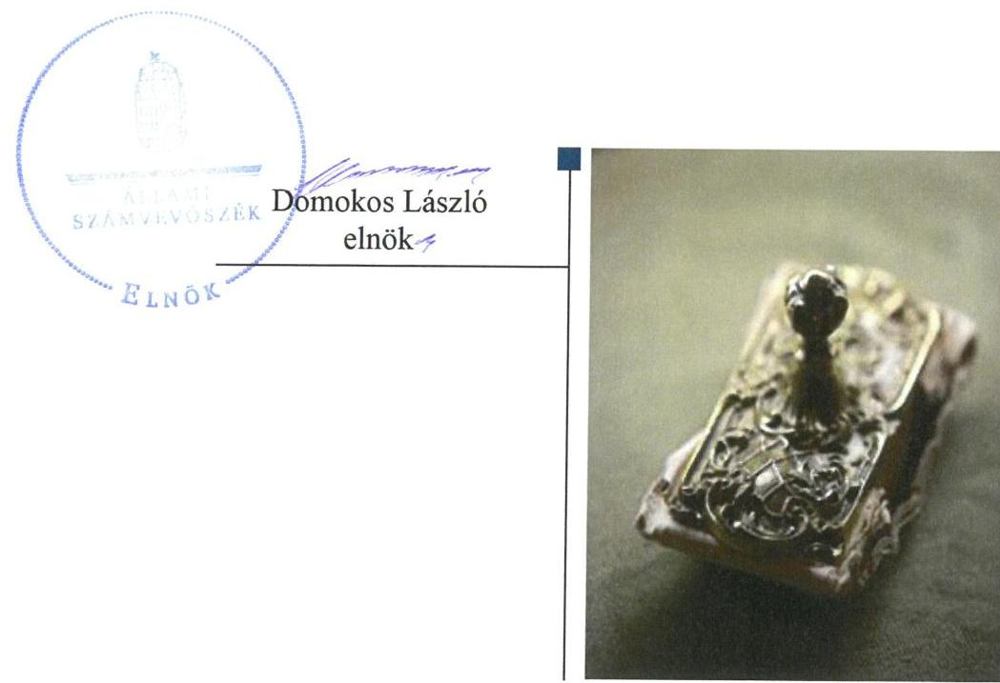

---

# AZ ELLENŐRZÉST FELÜGYELTE:

- **KLINGA LÁSZLÓ** felügyeleti vezető
- **AZ ELLENŐRZÉST VEZETTE ÉS A VÉGREHAJTÁSÁÉRT FELELŐS:**
- **MODER BEATRIX** ellenőrzésvezető
- **A PROGRAM ÖSSZEÁLLÍTÁSÁÉRT FELELŐS:**
- **TÓTPÁL SZABOLCS** osztályvezető
- **IKTATÓSZÁM:** EL-0400-026/2018
- **TÉMASZÁM:** 2469
- **ELLENŐRZÉS-AZONOSÍTÓ SZÁM:** V-081421

Jelentéseink az Országgyűlés számítógépes hálózatán és az Interneten a www.asz.hu címen is olvashatóak.

---

# TARTALOMJEGYZÉK 

■ ÖSSZEGZÉS ..... 5
■ AZ ELLENŐRZÉS CÉLJA ..... 6
■ AZ ELLENŐRZÉS TERÜLETE ..... 7
■ AZ ELLENŐRZÉS HÁTTERE, INDOKOLTSÁGA ..... 8
■ A JELENTÉS LÉNYEGES KÉRDÉSKÖREI ..... 9
■ AZ ELLENŐRZÉS HATÓKÖRE ÉS MÓDSZEREI ..... 10
■ MEGÁLLAPÍTÁSOK ..... 12
■ JAVASLATOK ..... 14
■ MELLÉKLETEK ..... 15
I. sz. melléklet: Értelmező szótár ..... 15
■ FÜGGELÉK: ÉSZREVÉTELEK ..... 17
■ RÖVIDÍTÉSEK JEGYZÉKE ..... 27

---

.

---

# ÖSSZEGZÉS 

Az NKE Szolgáltató Nonprofit Kft. feletti tulajdonosi jogokat a Nemzeti Közszolgálati Egyetem szabályszerűen alakította ki és gyakorolta. A Társaság működése és gazdálkodása szabályozott volt, a vagyongazdálkodási tevékenysége azonban a 2013. és 2016. évben nem volt szabályszerű, az elszámoltathatóságot és átláthatóságot nem biztosította.

## Az ellenőrzés társadalmi indokoltsága

Az Állami Számvevőszék stratégiájában megfogalmazta, hogy az államháztartáson kívülre nyújtott költségvetési támogatások és ingyenes vagyonjuttatások, valamint az államháztartáson kívül működő feladatellátó rendszerek ellenőrzéseivel hozzájárul ahhoz, hogy a közpénzeket az államháztartáson kívül működő szervezetek is átlátható, rendezett módon használják fel.

Minden közpénzt, közvagyont használó szervezettel szemben társadalmi igény, hogy működésük szabályszerű, gazdálkodásuk átlátható és elszámoltatható legyen.

Az Állami Számvevőszék céljaival és a társadalmi igénnyel összhangban, a gazdasági társaságok kiemelt fontosságú szerepe miatt került sor a Nemzeti Közszolgálati Egyetem működését segítő, az oktatóit és hallgatóit kiszolgáló tevékenységeket ellátó gazdasági társaság, az NKE Szolgáltató Nonprofit Kft. ellenőrzésére.

## Főbb megállapítások, következtetések, javaslatok

A Nemzeti Közszolgálati Egyetem tulajdonosi joggyakorlása az NKE Szolgáltató Nonprofit Kft. felett szabályszerű volt.
A Társaság szabályozottsága a 2013. és 2016. években a szabályszerű könyvvezetés és beszámoló készítés feltételeit biztosította, azonban a számlarend nem felelt meg a törvényben előírt tartalmi követelményeknek.

A Társaság gazdálkodása és vagyongazdálkodási tevékenysége a 2013. évben nem volt szabályszerű, mert a 2013. évi számviteli beszámoló mérlegtételeit leltárral nem támasztották alá.

A bevételek és ráfordítások elszámolása a 2016. évben szabályszerű volt. A vagyongazdálkodás azonban nem volt szabályszerű, mert a 2016. évi számviteli beszámoló mérlegtételeit leltárral nem támasztották alá.

A közérdekből nyilvános adatainak közzétételét a Társaság szabályszerűen teljesítette.
A megállapítások alapján az Állami Számvevőszék az NKE Szolgáltató Nonprofit Kft. ügyvezetőjének három javaslatot fogalmazott meg.

---

# AZ ELLENŐRZÉS CÉLJA 

AZ ELLENŐRZÉS CÉLJA annak értékelése, hogy a tulajdonosi jogok gyakorlása szabályszerű volt-e. A gazdálkodó szervezet szabályozottsága, gazdálkodása és vagyongazdálkodási tevékenysége megfelelt-e a jogszabályi és a tulajdonosi előírásoknak; biztosítva volt-e a közfeladatok átláthatósága és elszámoltathatósága érdekében a közszolgáltatás díjának megalapozottsága szabályszerű önköltségszámítással. Értékeltük továbbá, hogy a vagyonváltozást eredményező döntések esetében a tulajdonosi jogok gyakorlója és a gazdálkodó szervezet szabályszerűen jártak-e el. Az ellenőrzés célja továbbá annak megítélése, hogy a kormányzati szektorba sorolt állami tulajdonban (résztulajdonban) lévő gazdálkodó szervezetek gazdálkodásának a kormányzati szektor hiányára és az államadósságra befolyással bíró elemei a jogszabályi előírásoknak megfeleltek-e.

---

# **AZ ELLENŐRZÉS TERÜLETE**

## **NKE Szolgáltató Nonprofit Kft. és a tulajdonosi jogokat gyakorló Nemzeti Közszolgálati Egyetem**

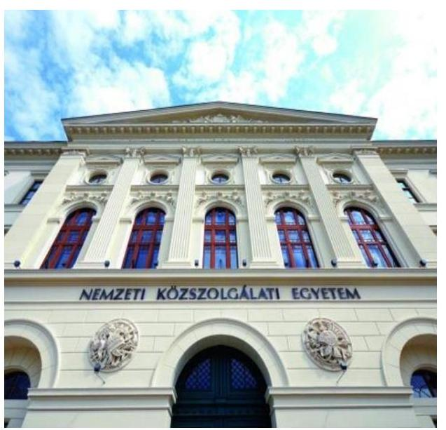

Az NKE1 2013. március 1-jén alapította a kizárólagos tulajdonában álló NKE Szolgáltató Nonprofit Kft-t.

Az Nftv.2 rendelkezései alapján az állami felsőoktatási intézmény gazdasági tevékenysége körében minden olyan – az alapfeladatainak ellátását nem veszélyeztető – döntést meghozhat, amely hozzájárul az alapító okiratában meghatározott feladatainak végrehajtásához.

Az Nftv. rendelkezései szerint az állami felsőoktatási intézmény által alapított gazdasági társaság alapítására, a részesedésszerzésére, a működésére, gazdálkodására, illetve a vezető tisztségviselőjének felelősségére az állami tulajdonban álló gazdasági társaságokra vonatkozó szabályokat kell alkalmazni.

A Társaság3 feletti tulajdonosi jogokat – a Nemzeti Közszolgálati Egyetemről szóló tv.4 rendelkezéseivel összhangban – a rektor5 gyakorolta.

Az NKE a Társaságot nem jövedelemszerzésre irányuló közös gazdasági tevékenység folytatására hozta létre. A Társaság főtevékenysége máshova nem sorolt egyéb kiegészítő üzleti szolgáltatás volt. A Társaság az ellenőrzött időszakban az NKE épületeinek, létesítményeinek üzemeltetését végezte, valamint az NKE működését segítő egyéb szolgáltatásokat – rendezvényszervezés és lebonyolítás, diszpécserszolgálat, gépjármű flotta üzemeltetése, kiadvány szerkesztés, nyomdai szolgáltatás – nyújtott.

A Társaság6 jegyzett tőkéje az alakuláskor 5 M Ft volt, amely – négy alkalommal történő tőkeemelés következtében – az ellenőrzött időszak végére 128,8 M Ft-ra emelkedett.

A Társaság a feladatait saját eszközeivel látta el, vagyonkezelésbe vett vagyonnal nem rendelkezett, tulajdonosi részesedése más gazdasági társaságban nem volt.

A Társaság az NGM közlemények7 alapján 2015. december 30-tól a Kormányzati szektorba sorolt egyéb szervezetek körébe tartozott.

A Társaságnak az ellenőrzött években a Gst.8 szerinti adósságot keletkeztető ügylete nem volt. Az ellenőrzött években elért pozitív eredményeket eredménytartalékba helyezték.

Az ügyvezető9 személye az ellenőrzött években két alkalommal, 2014. március 1-jén, valamint 2016. október 11-én változott.

A foglalkoztatottak átlagos állományi létszámát az 1. ábra mutatja be.

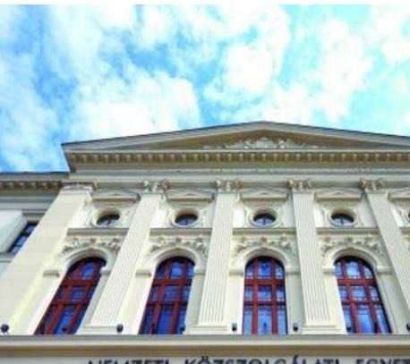

1. ábra

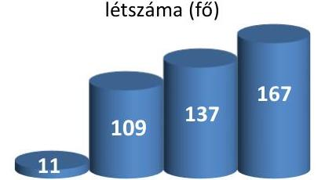

**A foglalkoztatottak átlagos állományi létszáma (fő)**

**2013. 2014. 2015. 2016.** *Forrás: A Társaság 2013-2016. évi kiegészítő mellékletei*

---

# AZ ELLENŐRZÉS HÁTTERE, INDOKOLTSÁGA 

## A KÖZPONTI KÖLTSÉGVETÉSI SZERVEK ÁLTAL ALAPÍTOTT GAZDÁLKODÓ SZERVEZETEK gazdálkodása jellemzően a közérdeklődés és a média figyelmének középpontjában áll, amihez hozzájárul a gazdálkodásuk körébe tartozó - közvetett állami tulajdonú, tehát végső soron a nemzeti vagyon részét képező - vagyon nagysága.

Az ellenőrzés rámutathat a közvetett állami tulajdonú gazdálkodó szervezetek gazdálkodási tevékenységével kapcsolatos jó gyakorlatokra és szabálytalanságokra. Felhívhatja a figyelmet a jogszabályi követelmények teljesítéséhez szükséges feltételek hiányosságaira.

Az éves elszámoltatás feltételeinek kialakítása az ellenőrzés során nagy hangsúlyt kap. Az állami tulajdonban lévő gazdasági társaságokra vonatkozó szabályok szerint működő intézményi társaságok ellenőrzési tapasztalatai hozzájárulhatnak a gazdálkodás átláthatóságának, elszámoltathatóságának javításához.

---

# A JELENTÉS LÉNYEGES KÉRDÉSKÖREI 

1. A tulajdonosi jogok gyakorlása szabályszerű volt-e?
2. A Társaság működésének szabályozottsága, gazdálkodása és vagyongazdálkodása megfelelt-e az előírásoknak?

---

# AZ ELLENŐRZÉS HATÓKÖRE ÉS MÓDSZEREI 

## Az ellenőrzés típusa

Megfelelőségi ellenőrzés.

## Az ellenőrzött időszak

Az ellenőrzött időszak a 2013-2016. évek, a 2016. évi beszámoló jóváhagyásáig tartó időszak.

## Az ellenőrzés tárgya

Az NKE Szolgáltató Nonprofit Kft. gazdálkodása, kiemelten vagyongazdálkodási tevékenysége, valamint a Nemzeti Közszolgálati Egyetem NKE Szolgáltató Nonprofit Kft. feletti tulajdonosi joggyakorlása.

## Az ellenőrzött szervezet

- NKE Szolgáltató Nonprofit Kft.
- Nemzeti Közszolgálati Egyetem, mint a Társaság feletti tulajdonosi joggyakorló.

## Az ellenőrzés jogalapja

Az ellenőrzés jogalapját az ÁSZ tv. 1. § (3) bekezdése és 5. § (3)-(5) bekezdése képezi.

## Az ellenőrzés módszerei

Az ellenőrzést a nemzetközi standardokat irányadónak tekintve az ellenőrzési program ellenőrzési kérdései, az ellenőrzött időszakban hatályos jogszabályok, az ellenőrzés szakmai szabályok és módszertanok figyelembe vételével végeztük.

Az ellenőrzés ideje alatt az ellenőrzött szervezettel történő kapcsolattartást az ÁSZ ${ }^{10}$ Szervezeti és Működési Szabályzatának vonatkozó előírásai alapján biztosítottuk.

Az ellenőrzési kérdések megválaszolásához szükséges bizonyítékok megszerzése a következő ellenőrzési eljárások alkalmazásával történt: megfigyelés, kérdésfeltevés (információkérés), összehasonlítás, valamint elemző eljárás. Az ellenőrzési bizonyítékként felhasználható adatforrások

---

közé tartoznak egyrészt az ellenőrzési programban felsorolt adatforrások, másrészt adatforrás lehet minden - az ellenőrzés során - feltárt, az ellenőrzés szempontjából információkat tartalmazó dokumentum.

Az ellenőrzést a kérdésekre adott válaszok kiértékelésével, valamint a megjelölt adatforrások, a csatolt tanúsítványok felhasználásával, továbbá az adott időszakban hatályos jogszabályok figyelembe vételével folytattuk le. Amennyiben egy alapvető jelentőségű dokumentum hiánya alapján valamely lényeges kérdéskörre vonatkozóan az ÁSZ megállapítása kellően megalapozott lett, az adott kérdéskör és azzal szoros logikai kapcsolatban lévő - ráépülő - kérdéskörök vonatkozásában további részletes ellenőrzési tevékenység nem került végrehajtásra.

A tulajdonosi joggyakorlást a 2013. és 2016. évekre vonatkozóan ellenőriztük. A teljes ellenőrzött időszakra vonatkozóan került ellenőrzésre a gazdasági társaság tervezési, beszámolási, közzétételi, adatszolgáltatási kötelezettségének, valamint belső ellenőrzési tevékenységének szabályszerűsége. A 2013. és 2016. évekre vonatkozóan a gazdasági társaság működésének szabályozottságát, a bevételei és ráfordításai elszámolását, illetve vagyongazdálkodásának szabályszerűségét is ellenőriztük.

A bevételek és ráfordítások elszámolását, valamint a vagyonnyilvántartás szabályszerűségét mintavétellel ellenőriztük. A mintavételezés az értékesítés nettó árbevétele, az egyéb és rendkívüli bevételek, a pénzügyi műveletek bevételei, illetve az anyagjellegű ráfordítások, az egyéb és rendkívüli ráfordítások, a pénzügyi műveletek ráfordításai, valamint a tárgyi eszközök növekedési tételei esetén azokra a legnagyobb értékű tételekre - a lényeges sokaságra - terjedt ki, amelyek összértéke elérte a teljes sokaság összértékének 50%-át. Amennyiben valamely lényeges sokaság elemszáma kisebb volt, mint az előírt mintaelemszám, a lényeges sokaságot tételesen ellenőriztük. A személyi jellegű ráfordítások esetében a mintavétel a teljes sokaságból történt.

A mintavétellel ellenőrzött területek esetében minden egyes tétel vonatkozásában a szabályszerűségre vonatkozó kérdéseket tettünk fel, amelyek eredménye összesítésre került. „Szabályszerűnek" értékeltünk egy ellenőrzött területet, amennyiben 95%-os bizonyossággal az ellenőrzött sokaságban az átlagos hibaarány legfeljebb 10%, "nem szabályszerűnek", amennyiben 10%-nál magasabb arányt képviselt. Abban az esetben, ha az ellenőrzött sokaság tekintetében a 10%-os hibaarányhoz való viszony megítélésének megbízhatósága nem érte el a 95%-ot, annak elérése érdekében értékelésünket további szempontokkal egészítettük ki, és figyelembe vettük a feltárt hibák értékét. A mintavételi eredmények alapján megfogalmazott megállapítások csak a lényeges sokaságra vonatkoznak.

---

# 1. A tulajdonosi jogok gyakorlása szabályszerű volt-e? 

## Összegző megállapítás

A Nemzeti Közszolgálati Egyetem tulajdonosi joggyakorlása szabályszerű volt.

A TULAJDONOSI JOGGYAKORLÁS kereteit az NKE az Alapító Okirat ${ }_{1-10}$-ben ${ }^{11}$ alakította ki. A Gt. ${ }^{12}$ és a Ptk. ${ }^{13}$ előírásai szerint határozta meg az NKE mint alapító kizárólagos hatásköreit, valamint a Taktv. ${ }^{14}$ előírásának megfelelően három tagból álló FB15-t hozott létre, és a Gt. és a Ptk. előírásával összhangban választotta meg a könyvvizsgálót.

A Társaság éves beszámolóit az NKE a Gt. és a Ptk. előírásával összhangban, az FB és a könyvvizsgáló írásbeli jelentésének birtokában hagyta jóvá. A Társaság saját tőkéje a 2016. év végére a jegyzett tőke fele alá csökkent. A Társaság tőkehelyzetének rendezése érdekében szükséges intézkedést a Ptk. előírásának megfelelően az NKE megtette, a 2016. évi beszámoló elfogadásakor pótbefizetésről döntött.

Üzleti terv készítésének kötelezettségét, valamint a Társaság rendszeres beszámoltatását az NKE a 2016. évben írta elő. Tulajdonosi ellenőrzés keretében az NKE belső ellenőrzése a 2016. évben a korábbi évekre vonatkozó rendszerellenőrzést folytatott le a Társaságnál, a feltárt hiányosságok megszüntetésére intézkedési terv készült.

A 2013-2014. évben a Taktv. 5. § (3) bekezdése ellenére az NKE a Társaság vezető tisztségviselői, felügyelőbizottsági tagjai, valamint az Mt. 208. § hatálya alá eső munkavállalói javadalmazása, valamint a jogviszony megszűnése esetére biztosított juttatások módjának, mértékének elveiről, rendszeréről szabályzatot nem alkotott. Az NKE a 2015. évtől a javadalmazási szabályzatot ${ }^{16}$ a Taktv. előírásainak megfelelően megalkotta.

## 2. A Társaság működésének szabályozottsága, gazdálkodása és vagyongazdálkodása megfelelt-e az előírásoknak?

Összegző megállapítás

A Társaság működése szabályozott volt. A gazdálkodás és vagyongazdálkodás a 2013. évben nem volt szabályszerű. A 2016.
 évben a bevételek, ráfordítások elszámolása szabályszerű volt, a vagyongazdálkodás nem volt szabályszerű.
2.1. számú megállapítás

A Társaság működése szabályozott volt.
Az SZMSZ ${ }^{17}$ rögzítette a Társaság szervezeti felépítését, a szervezeti egységek (üzletágak) feladatait, az ügyvezető jogait és kötelezettségeit, valamint a kötelezettségvállalás rendjét.

---

# A SZABÁLYSZERŰ GAZDÁLKODÁS FELTÉTELEIT 

a Társaság kialakította. A Számv. tv. ${ }^{18}$ előírásainak megfelelően - az alapítás időpontjától - rendelkeztek a Társaság sajátosságainak megfelelő Számviteli politikával ${ }^{19}$, Leltározási szabályzattal ${ }_{1,2}$ ${ }^{20}$, Értékelési szabályzattal ${ }_{1,2}$ ${ }^{21}$, Pénzkezelési szabályzattal ${ }_{1,2}$ ${ }^{22}$, valamint Bizonylati szabályzattal${ }^{23}$. Az alkalmazott főkönyvi számlák számát és elnevezését a számlatükör tartalmazta, a Számv. tv. 161. § (2) bekezdés b)-c) pontjában foglalt tartalmi követelményeknek megfelelő számlarend összeállításáról azonban nem gondoskodtak.

A Számv. tv. előírása alapján önköltségszámítási szabályzat készítésére a Társaság nem volt kötelezett, azonban 2016-ban Önköltség-számítási szabályzatot ${ }^{24}$ is készítettek.
2.2. számú megállapítás

A Társaság gazdálkodása és vagyongazdálkodása a 2013. évben nem volt szabályszerű. A bevételek és ráfordítások elszámolása a 2016. évben szabályszerű volt, a vagyongazdálkodás továbbra sem volt szabályszerű.

A 2013. ÉVBEN a gazdálkodás és vagyongazdálkodás nem volt szabályszerű, mert a 2013. évi beszámoló mérlegének alátámasztásához a Számv. tv. 69. § (1) bekezdése ellenére a mérleg fordulónapján meglévő eszközöket és forrásokat mennyiségben és értékben tartalmazó leltárt a Társaság nem állított össze.

## A 2016. ÉVI BEVÉTELEK ÉS RÁFORDÍTÁSOK ELSZÁMOLÁSA szabályszerű volt.

A VAGYONGAZDÁLKODÁS A 2016. ÉVBEN nem volt szabályszerű, a 2016. évi beszámoló mérlegét leltárral nem támasztották alá a Számv. tv. 69. § (2) bekezdésében előírtak ellenére. A leltározás hiánya ellenére a könyvvizsgáló a 2016. évi beszámolót korlátozás nélküli hitelesítő záradékkal látta el.

A Társaság úgy tett eleget a beszámoló közzétételi kötelezettségének, hogy a beszámoló nem felelt meg a Számv. tv. 20. § (1), valamint a 69. § (1)-(3) bekezdés előírásainak, így a gazdálkodás, vagyongazdálkodás átláthatóságát nem biztosította.

A Társaság a Bkr. ${ }^{25}$ 1. § (2) bekezdés d) pontja alapján 2015. december 30-tól fennálló kötelezettsége ellenére, a Bkr. 10. § előírását figyelmen kívül hagyva, a szervezet tevékenységének, a célok megvalósításának nyomon követését biztosító rendszert - az operatív tevékenységek folyamatos nyomon követésével, vagy független belső ellenőrzés működtetésével - nem alakított ki.

A Társaság a Taktv.-ben előírt közzétételi kötelezettségét teljesítette, a közérdekből nyilvános adatai megismerhetőségét biztosította.

---

# JAVASLATOK 

Az ÁSZ tv. 33. § (1) bekezdésében foglaltak értelmében az ellenőrzött szervezet vezetője köteles a jelentésben foglalt megállapításokhoz kapcsolódó intézkedési tervet összeállítani és azt a jelentés kézhezvételétől számított 30 napon belül az ÁSZ részére megküldeni. Amennyiben az ellenőrzött szervezet vezetője nem küldi meg határidőben az intézkedési tervet, vagy továbbra sem elfogadható intézkedési tervet küld, az Állami Számvevőszék elnöke az ÁSZ tv. 33. § (3) bekezdés a) és b) pontjaiban foglaltakat érvényesítheti.

## NKE Szolgáltató Nonprofit Kft. ügyvezetőjének

1. Intézkedjen a Számv. tv.-ben előírtaknak megfelelő számlarend elkészítéséről.
(2.1. sz. megállapítás 2. bekezdés 3. mondat 2. tagmondata alapján)
2. Intézkedjen a beszámoló mérleg tételeinek alátámasztásához Számv. tv.-ben előírtaknak megfelelő leltár összeállításáról.
(2.2. sz. megállapítás 3. bekezdés 1. mondata alapján)
3. Intézkedjen a Bkr.-ben előírtak alapján a szervezet tevékenységének, a célok megvalósításának nyomon követését biztosító rendszer kialakításáról.
(2.2. sz. megállapítás 5. bekezdése alapján)

---

# MELLÉKLETEK 

- I. SZ. MELLÉKLET: ÉRTELMEZŐ SZÓTÁR
gazdasági társaság
intézményi társaság
nonprofit gazdasági társaság
nemzeti vagyon
tulajdonosi ellenőrzés

A Ptk. 3:88. § (1) bekezdése szerint „a gazdasági társaságok üzletszerű közös gazdasági tevékenység folytatására, a tagok vagyoni hozzájárulásával létrehozott, jogi személyiséggel rendelkező vállalkozások, amelyekben a tagok a nyereségből közösen részesednek, és a veszteséget közösen viselik".
„Az állami fenntartású felsőoktatási intézmény kincstárnál vezetett külön fizetési számlájának egyenlege, valamint a (9) bekezdés b) pontjában meghatározott maradvány, illetve az e törvényben meghatározott gazdasági társaságtól kapott osztalék terhére tulajdonosi joggyakorló szervezet engedélyéhez, jóváhagyásához nem kötött döntésével zártkörűen működő részvénytársaságot vagy korlátolt felelősségű társaságot (a továbbiakban együtt: intézményi társaság) alapíthat, illetve ezekben szerezhet részesedést."
Forrás: Nftv. 115. § (10) bekezdése
Civil tv. 9/F. § (2) bekezdése szerint „az a gazdasági társaság minősül nonprofit gazdasági társaságnak és cégnevében az a gazdasági társaság tüntetheti fel a nonprofit jelleget, amelynek létesítő okirata tartalmazza, hogy a gazdasági társaság tevékenységéből származó nyereség a tagok között nem osztható fel, hanem az a gazdasági társaság vagyonát gyarapítja." (hatályos 2014. március 15-től)
a) az állam vagy a helyi önkormányzat kizárólagos tulajdonában álló dolgok,
b) az a) pont hatálya alá nem tartozó, állam vagy a helyi önkormányzat tulajdonában lévő dolog,
c) az állam vagy a helyi önkormányzat tulajdonában lévő pénzügyi eszközök, továbbá az államot vagy a helyi önkormányzatot megillető társasági részesedések,
d) az államot vagy a helyi önkormányzatot megillető bármely vagyoni értékkel rendelkező jogosultság, amelyet jogszabály vagyoni értékű jogként nevesít,
e) Magyarország határa által körbezárt terület feletti légtér,
f) az üvegházhatású gázok kibocsátási egységeinek kereskedelméről szóló törvény szerint kibocsátási egység és légiközlekedési kibocsátási egység, valamint az ENSZ Éghajlatváltozási Keretegyezménye és annak Kiotói Jegyzőkönyve végrehajtási keretrendszeréről szóló törvény szerinti kiotói egység,
g) állami vagy helyi önkormányzati fenntartású közgyűjtemény (muzeális intézmény, levéltár, közgyűjteményként működő kép- és hangarchívum, valamint könyvtár) saját gyűjteményében nyilvántartott kulturális javak körébe tartozó dolog, kivéve, ha az állami vagy önkormányzati tulajdon jogszerű létrejötte kétséget kizáró módon nem bizonyítható és a dologra nézve más a tulajdonjogát bizonyítja vagy a kulturális javakra vonatkozó jogszabályokban meghatározott eljárás keretében valószínűsíti (g. pont módosult 2013. december 7-től),
h) a régészeti lelet,
i) a nemzeti adatvagyon körébe tartozó állami nyilvántartások fokozottabb védelméről szóló törvény szerinti nemzeti adatvagyon.
Forrás: Nvtv. ${ }^{26}$ 1. § (2)
2014. március 14-ig:

Az állami vagyon kezelőjét, haszonélvezőjét, használóját megillető jogok gyakorlását, annak szabályszerűségét, célszerűségét az MNV Zrt. - szükség szerint területi szervei útján - ellenőrzi.

---

# 2014. március 15-től: 

Az állami vagyon használóját, vagyonkezelőjét és haszonélvezőjét megillető jogok gyakorlását, annak szabályszerűségét, a kötelezettségek teljesítését, valamint a vagyon rendeltetése szerinti célszerűségét a tulajdonosi joggyakorló rendszeresen ellenőrzi.
Forrás: Vhr. 20. § (1)
tulajdonosi jogok gyakor-
lója

## 1.

2013. június 27-ig:

Az állami vagyon felett a Magyar Államot megillető tulajdonosi jogok és kötelezettségek összességét - ha törvény eltérően nem rendelkezik - az állami vagyon felügyeletéért felelős miniszter (a továbbiakban: miniszter) gyakorolja, aki e feladatát a Magyar Nemzeti Vagyonkezelő Zártkörűen Működő Részvénytársaság (a továbbiakban: MNV Zrt.), a Magyar Fejlesztési Bank, illetve a tulajdonosi joggyakorló szervezet útján látja el. A miniszter miniszteri rendeletben, a törvényben meghatározott állami vagyoni kör tekintetében, meghatározott időtartamra, a joggyakorlás egyes szabályainak meghatározásával - az őt megillető tulajdonosi jogok és kötelezettségek összességének, illetve azok meghatározott részének gyakorlóját az Áht. szerinti központi költségvetési szervek, ezek intézménye, továbbá a 100%-ban állami tulajdonban álló gazdasági társaságok közül kijelölheti.
Forrás: Vtv. 3. § (1) és (2)

## 2013. június 28-ától:

A rábízott állami vagyon felett az államot megillető tulajdonosi jogok és kötelezettségek összességét tulajdonosi joggyakorlóként:
a) ha törvény vagy miniszteri rendelet eltérően nem rendelkezik, a Magyar Nemzeti Vagyonkezelő Zártkörűen Működő Részvénytársaság (a továbbiakban: MNV Zrt.),
b) törvényben kijelölt személy vagy
c) az állami vagyon felügyeletéért felelős miniszter (a továbbiakban: miniszter) által rendeletben kijelölt személy gyakorolja.
[...] A miniszter e törvény felhatalmazása alapján - a meghatározott célok hatékonyabb elérése érdekében, miniszteri rendeletben, az ott meghatározott állami vagyoni kör tekintetében, meghatározott időtartamra - e törvény keretei között, a joggyakorlás egyes szabályainak meghatározásával - az államot megillető tulajdonosi jogok és kötelezettségek összességének, illetve azok meghatározott részének gyakorlóját az Áht. szerinti központi költségvetési szervek, ezek intézménye, továbbá a 100%-ban állami tulajdonban álló gazdasági társaságok közül kijelölheti.
Forrás: Vtv. 3. § (1) és (2)
2.

Aki a nemzeti vagyon felett az államot vagy a helyi önkormányzatot megillető tulajdonosi jogok és kötelezettségek összességének gyakorlására jogosult
Forrás: Nvtv. 3. § (1) 17. pontja

---

# FÜGGELÉK: ÉSZREVÉTELEK 

A jelentéstervezetet a Számvevőszék 15 napos észrevételezésre megküldte az ellenőrzött szervezetek vezetőinek az ÁSZ tv. 29. § (1) bekezdése előírásának megfelelően.

Az NKE az ÁSZ tv. 29. § (2) bekezdésében foglalt észrevételezési jogával nem élt, írásban jelezte, hogy a jelentéstervezetre észrevételt nem tesz. Az NKE Szolgáltató Nonprofit Kft. ügyvezetőjének észrevételét és az arra adott választ a jelentés függeléke tartalmazza.

[^0]
[^0]:    * 29. § (1) Az Állami Számvevőszék az ellenőrzési megállapításait megküldi az ellenőrzött szervezet vezetőjének vagy az általa megbízott személynek, és annak, akinek személyes felelősségét állapította meg.
    (2) Az ellenőrzött szervezet vezetője és a felelősként megjelölt személy az ellenőrzés megállapításaira tizenöt napon belül írásban észrevételt tehet.
    (3) Az Állami Számvevőszék az észrevételre a beérkezésétől számított harminc napon belül írásban válaszol. A figyelembe nem vett észrevételeket köteles a jelentésben feltüntetni, és megindokolni, hogy azokat miért nem fogadta el.

---

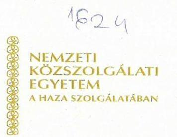

Nyt. szám: 34000/2532-42/2018
Hiv. szám: EL-0668-037/2018

# Domokos László   Állami Számvevőszék elnöke 

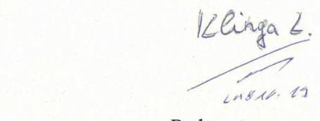

Budapest
1052 Budapest Apáczai Csere János u. 10.

Tisztelt Elnök úr!

## Tárgy: Jelentéstervezet véleményezése

A megküldött „Az állami tulajdonú gazdasági társaságok ellenőrzése - NKE Szolgáltató Nonprofit Kft. " címmel készült számvevőszéki jelentéstervezettel kapcsolatban észrevételt nem kívánunk tenni.

Budapest, 2018. október „. .".

Tisztelettel:
Dr. Koltay András
rektor

---

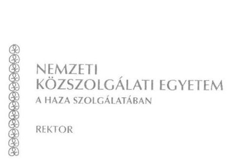

# Domokos László 

elnök úr részére

## Állami Számvevőszék

1052 Budapest,
Apáczai Csere János u. 10.
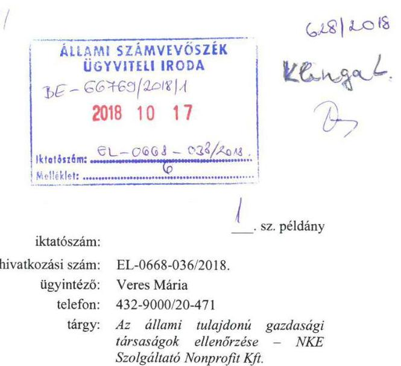

## Tisztelt Elnök Úr!

A fenti hivatkozási szám alatti, illetve tárgy szerinti, 2018. szeptember 25-én kelt levelében, valamint az azzal megküldött „Az állami tulajdonú gazdasági társaságok ellenőrzése - NKE Szolgáltató Nonprofit Kft. " című jelentéstervezetben (továbbiakban: jelentéstervezet) foglaltakkal kapcsolatban az alábbi észrevételeket teszem:

## 1. Megállapítás

„Az alkalmazott főkönyvi számlák számát és elnevezését a számlatükör tartalmazta, a Számv.tv. 161. §. (2) bekezdés b), c) pontjában foglalt tartalmi követelményeknek megfelelő számlarend összeállításáról azonban nem gondoskodtak."

Javaslat:

## „Intézkedjen a Számv. tv.-ben előírtaknak megfelelő számlarend elkészítéséről."

A Társaságunk elfogadja a jelentéstervezetben szereplő megállapítást és pótolja a Számv.tv. 161. §. (2) bekezdés b), c) pontjában foglalt tartalmi követelményeknek megfelelő számlarendet, vagyis a Számlarendünk fogja tartalmazni:

- a számla tartalmát, ha az a számla megnevezéséből egyértelműen nem következik,
- a számla értéke növekedésének, csökkenésének jogcímeit,
- a számlát érintő gazdasági eseményeket, azok más számlákkal való kapcsolatát,
- a főkönyvi számla és az analitikus nyilvántartás kapcsolatát,

2. Megállapítás
„A 2013. évben a gazdálkodás és vagyongazdálkodás nem volt szabályszerű, mert a 2013. évi beszámoló mérlegének alátámasztásához a Számv. tv. 69§ (1) bekezdése ellenére a mérlegben tartalmazó leltárt a Társaság nem állított össze.
A 2016. évi bevételek és ráfordítások elszámolása szabályszerű volt.

---

A vagyongazdálkodás a 2016. évben nem volt szabályszerű, a 2016 évi beszámoló mérlegét leltárral nem támasztották alá a Számv.tv:69.§: (2) bekezdésében előírtak ellenére. A leltározás hiánya ellenére a könyvvizsgáló a 2016. évi beszámolót korlátozás nélküli záradékkal látta el. A Társaság úgy tett eleget a beszámoló közzétételi kötelezettségének, hogy a beszámoló nem felel meg a Számv.tv:20§ (1), valamint
 a 69.§ (1)-(3) bekezdés előírásainak, így a gazdálkodás, vagyongazdálkodás átláthatóságát nem biztosította." "A Társaság gazdálkodása és vagyongazdálkodása a 2013. évben nem volt szabályszerű. A bevételek és ráfordítások elszámolása a 2016. évben szabályszerű volt, a vagyongazdálkodás továbbra sem volt szabályszerű."

Javaslat: „Intézkedjen a beszámoló mérleg tételeinek alátámasztásához Számv. tv.-ben előírtaknak megfelelő leltár összeállításáról."

A Társaságunk csak részben fogadja el a megállapítást. A jelentéstervezet alapján a Társaság vagyongazdálkodása nem volt szabályszerű 2016-ban, mivel a 2016. december 31-i mérleget leltárral nem támasztotta alá. Álláspontunk szerint a megállapítás nem helytálló. Társaságunk a 2016. december 31-i mérlegét leltárral szabályszerűen és teljeskörűen alátámasztotta.

A Társaságunkat az Állami Számvevőszék kétszer kérte adatszolgáltatásra. Az első adatszolgáltatásra 2017. december 4-én utasított az Állami Számvevőszék, mely dokumentumjegyzéknek a 15. pontja a következőket tartalmazta:

- leltárösszesítők, kiértékelések a 2013-2016. évek vonatkozásában

A Társaságunk az adatszolgáltatás keretében a 2016. évi leltárhoz kapcsolódóan - a megküldött dokumentumjegyzék alapján - az alábbi dokumentumokat töltötte fel az adatszolgáltatási rendszerbe:

|  Sorszám | A kért dokumentum tartalom szerinti megnevezése* | Az Állami Számvevőszék részére megküldött dokumentum  |
| --- | --- | --- |
|  74 | Leltározási utasítás 20161219 | lelt utasitas.pdf  |
|  75 | Tárgyi eszköz leltározási körzetek 20170126 | leltar korzetek.pdf  |
|  76 | Leltározási megbízó levelek - 20 oldal 20170124 | lelt megbízolev.pdf  |
|  77 | Leltározási jegyzőkönyvek - 12 db 20170127 | leltar jkvk.pdf  |
|  78 | Tárgyi eszköz leltár felvételi ívek (1) 20170116 | te leltar1.pdf  |
|  79 | Tárgyi eszköz leltár felvételi ívek (2) 20170116 | te leltar2.pdf  |
|  80 | Tárgyi eszköz leltár felvételi ívek (3) 20170116 | te leltar3.pdf  |
|  81 | Tárgyi eszköz leltár felvételi ívek (4) 20170116 | te leltar4.pdf  |
|  82 | Tárgyi eszköz leltár felvételi ívek (5) 20170116 | te leltar5.pdf  |
|  83 | Tárgyi eszköz leltár felvételi ívek (6) 20170116 | te leltar6.pdf  |
|  84 | Készletek leltár felvételi ívei és összesítői 1 -8 oldalig 20170102 | keszlet 01 08.pdf  |
|  85 | Készletek leltár felvételi ívei és összesítői 9-13 oldalig 20170102 | keszlet 09 13.pdf  |
|  86 | Készletek leltár felvételi ívei és összesítői 14-17 oldalig 20170102 | keszlet 14 17.pdf  |
|  87 | Készletek leltár felvételi ívei és összesítői 18-21 oldalig 20170102 | keszlet 18 21.pdf  |
|  88 | Készletek leltár felvételi ívei és összesítői 22-23 oldalig 20170102 | keszlet 22 23.pdf  |
|  89 | Készletek leltár felvételi ívei és összesítői 24-31 oldalig 20170102 | keszlet 24 31.pdf  |
|  90 | Készletek leltár felvételi ívei és összesítői 32-41 oldalig 20170102 | keszlet 32 41.pdf  |
|  91 | Készletek leltár felvételi ívei és összesítői 42-57 oldalig 20170102 | keszlet 42 57.pdf  |
|  92 | Készletek leltár felvételi ívei és összesítői 58 oldal 20170102 | keszlet 58.pdf  |
|  93 | Készletek leltár felvételi ívei és összesítői 59 oldal 20170102 | keszlet 59.pdf  |
|  94 | Készletek leltár felvételi ívei és összesítői 60-68 oldalig 20170102 | keszlet 60 68.pdf  |

---

| Sorszám | A kért dokumentum tartalom szerinti megnevezése* | Az Állami Számvevőszék részére megküldött dokumentum |
| :--: | :-- | :-- |
| 95 | Jegyzőkönyv pénzeszközök leltározásáról (Ft és euro külön) 20170103 | hp_leltar_jan3.pdf |
| 96 | Tárgyi eszköz és immat. javak kivezetése-leltárösszesítő 20160228 | 2016leltar_ossz.pdf |

A második adatszolgáltatásra 2018. január 23-án utasított az Állami Számvevőszék, mely dokumentumjegyzéknek a 2.2.2.2. pontja a következőket tartalmazta:

# 2.2.2.2.Leltározási jegyzőkönyvek, leltárhiány esetén a személyi felelősség megállapítását tartalmazó dokumentum. 

A Társaságunk az adatszolgáltatás keretében a 2016. évi leltárhoz kapcsolódóan - a megküldött dokumentumjegyzék alapján - az alábbi dokumentumokat töltötte fel az adatszolgáltatási rendszerbe:

| Sorszám | Pont | A kért dokumentum tartalom szerinti megnevezése* | Az Állami Számvevőszék részére megküldött dokumentum |
| :--: | :--: | :--: | :--: |
| 76 | 2.2.2.2 | Leltár összesítő 2016 | 2016leltar_ossz.pdf |
| 77 | 2.2.2.2 | Jegyzőkönyv pénzeszközök leltározásáról 2017.01.03 | hp_leltar_jan3.pdf |
| 78 | 2.2.2.2 | Leltározási jegyzőkönyv | leltar_jkvk.pdf |

A megküldött dokumentumok alapján egyértelműen kiderül, hogy a Társaságunknál a pénzeszközök, a tárgyi eszközök és a készletek esetében fizikai leltárfelvétel is történt, mely a Számv. tv. 69. § (3) bekezdése alapján három évente kötelező.
Mivel az adatbekérő levelek kifejezetten a leltározási jegyzőkönyvek, leltározási összesítők, kiértékelések, illetve leltárhiány esetén a személyi felelősség megállapítását tartalmazó dokumentumok feltöltését írta elő a társaság számára, így az ügyvezető - álláspontunk szerint az adatbekérés szerint eljárva - a fizikai leltárfelvétellel alátámasztott mérlegsorok (tárgyi eszközök, készletek és pénzeszközök) leltárait töltötte fel az ellenőrzés számára.
Mint az az okmányokból egyértelműen kiderül, a Társaságunk 2016. december 31-i fordulónapra vonatkozóan valamennyi mérlegsorát felleltározta a Számv. tv. 69. §-ában és saját belső leltározási szabályzatában meghatározott módon.
Természetesen és szabályszerűen a további mérlegsorok leltárai is elkészültek, melyeket szabályszerűen a Számv. tv. és a leltározási utasításnak megfelelően készített el a társaság. Ezen adatok is feltöltésre kerültek a második adatszolgáltatás keretében az alábbiak szerint:

- 2.2.1.12. Szállítók analitikus nyilvántartása
- 2.2.1.15. Határidőn túli vevőkövetelések állománya
- 2.2.1.19. Hosszú lejáratú kötelezettségek listája, kapcsolódó analitikus nyilvántartás

Az adatszolgáltatások keretében közvetett módon az alábbi dokumentumokból is kiderül, hogy a leltározás végrehajtásra került:

| Sorszám | Pont | A kért dokumentum tartalom szerinti megnevezése* | Az Állami Számvevőszék részére megküldött dokumentum |
| :--: | :--: | :--: | :--: |
| 113 | 2.2.2.10 | 2018.01.03. Beszámoló intézkedések végrehajtásáról | besz_int_2018jan3.pdf |
| 114 | 2.2.2.10 | 2016.12.20. Feljegyzés intézkedési tervről | felj_int_20161220.pdf |
| 116 | 2.2.2.10 | 2016.11.08. Jelentés elvégzett feladatokról | jel_2016nov8.pdf |
| 117 | 2.2.2.10 | 2016.10.13. Jelentés azonnali intézkedésekről | jel_int_20161013.pdf |

---

Megjegyezzük, hogy a feltöltött leltárak (valamennyi mérleg sor esetén) egyeznek a beszámoló megfelelő sorával, alátámasztják azt, így biztosítják a mérleg valódiságát, és a Számv. tv. 69. §-ának való megfelelést.

A leltározás megtörténtét a könyvvizsgálat során a megbízott könyvvizsgáló cég ellenőrizte, ezt elfogadta. A jelentéstervezet megküldésre került a könyvvizsgálatot végző szervezet részére, aki a jelentéstervezethez külön észrevételt tett, melyet csatolunk jelen levélhez.

Álláspontunk alapján fenti dokumentumok egyértelműen igazolják, hogy a Társaság három legfőbb mérlegsora esetén fizikai, a további mérlegsorai esetén pedig egyeztetéses leltározással alátámasztotta mérlegét, mely minden kétséget kizárólag valódi, megfelel a Számv. tv. előírásainak.

A főkönyvi könyvelés és az analitikus nyilvántartások adatai közötti egyeztetést az üzleti év mérlegfordulónapjára vonatkozóan a Társaságunk elvégezte, azonban azt az adminisztráció számviteli területen lévő járatlansága miatt a Társaságunk nem töltötte fel az adatszolgáltatások során. Hozzátesszük, a leltárak főkönyvvel való egyeztetésének módját a Számv. tv. nem határozza meg, ezzel együtt, mivel Társaságunk ezt is elkészítette, így a teljes leltározási anyagból a hiányzó dokumentumokat, az összesítő dokumentummal kiegészítve jelen levélhez csatolva másolatban megküldjük. Természetesen az Állami Számvevőszék részéről érkező bármilyen jelzés esetén pótoltuk volna ezen hiányosságot.

# Kérjük a vonatkozó megállapítás törlését a végső jelentésből! 

## 3. Megállapítás

„A Társaság a Bkr. 1.§ (2) bekezdés d) pontja alapján 2015. december 30-tól fennálló kötelezettsége ellenére, a Bkr.10.§ előírását figyelmen kívül hagyva, a szervezet tevékenységének, a célok megvalósításának nyomon követését biztosító rendszert - az operatív tevékenységek folyamatos nyomon követésével, vagy független belső ellenőrzés működtetésével - nem alakított ki."

Javaslat:

## „Intézkedjen a Bkr.-ben előírtak alapján a szervezet tevékenységének, a célok megvalósításának nyomon követését biztosító rendszer kialakításáról."

A Társaság intézkedési tervet dolgoz ki a Bkr. előírásainak megfelelő, a szervezet tevékenységének, a célok megvalósításának nyomon követését biztosító rendszer kialakítására és működtetésére.

## Mellékletek:

Könyvvizsgáló észrevételei
2016. évi leltár fel nem töltött dokumentumai

Budapest, 2018. október 13.
Tisztelettel:
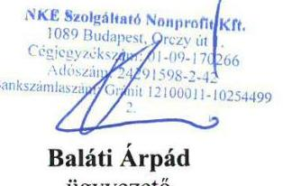

Baláti Árpád
ügyvezető

Készült:
Egy példány:
Kapják:

2 példányban
1 lap, 1 oldal
Címzett
Irattár

---

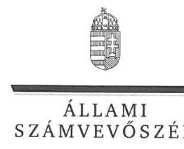

ELNÖK

Ikt.szám: EL-0668-040/2018.

# Baláti Árpád úr 

ügyvezető
NKE Szolgáltató Nonprofit Kft.

## Budapest

## Tisztelt Ügyvezető Úr!

Köszönettel vettem „Az állami tulajdonú gazdasági társaságok ellenőrzése - NKE Szolgáltató Nonprofit Kft." című ellenőrzésről készített számvevőszéki jelentéstervezetre megküldött észrevételeit.
Az Állami Számvevőszék észrevételekre vonatkozó álláspontját a felügyeleti vezető által készített részletes tájékoztatás tartalmazza, amelyet levelemhez mellékeltem.
Tájékoztatom Ügyvezető urat, hogy az Állami Számvevőszék a figyelembe nem vett észrevételeket az Állami Számvevőszékről szóló 2011. évi LXVI. törvény 29. § (3) bekezdésében előírtak szerint köteles a jelentésében feltüntetni és megindokolni, hogy azokat miért nem fogadta el.

Budapest, 2018. 77 hó 68 nap
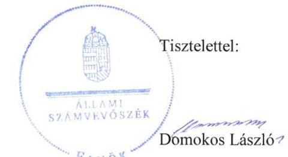

Melléklet: Tájékoztatás az észrevételek kezeléséről

---

# Tájékoztatás az észrevételek kezeléséről 

Megköszönöm Ügyvezető úrnak az „Az állami tulajdonú gazdasági társaságok ellenőrzése - NKE Szolgáltató Nonprofit Kft." címmel készített jelentés-tervezetre tett észrevételeit. Ügyvezető úr három javaslathoz és az azokat megalapozó megállapításokhoz tett észrevételt. Az észrevételek kezeléséről az alábbi tájékoztatást adom:

1. számú észrevétel a 2.1. számú megállapítás 2. bekezdés utolsó mondatát és az 1. javaslatot érinti:

Megállapítás: „Az alkalmazott főkönyvi számlák számát és elnevezését a számlatükör tartalmazta, a Számv. tv. 161. § (2) bekezdés b)-c) pontjában foglalt tartalmi követelményeknek megfelelő számlarend összeállításáról azonban nem gondoskodtak."

Javaslat: „Intézkedjen a Számv. tv.-ben előírtaknak megfelelő számlarend elkészítéséről."
Ügyvezető úr észrevételében a számlarend pótlólagos elkészítéséről adott tájékoztatást. A jelentéstervezetben szereplő megállapítást nem vitatta, így a jelentéstervezet módosítása nem indokolt.
2. számú észrevétel a 2.2. számú megállapítás 3. és 4. bekezdését, és a 2. javaslatot érinti:

Megállapítás: „A vagyongazdálkodás a 2016. évben nem volt szabályszerű, a 2016. évi beszámoló mérlegét leltárral nem támasztották alá a Számv. tv. 69. § (2) bekezdésében előírtak ellenére. A leltározás hiánya ellenére a könyvvizsgáló a 2016. évi beszámolót korlátozás nélküli záradékkal látta el. A Társaság úgy tett eleget a beszámoló közzétételi kötelezettségének, hogy a beszámoló nem felelt meg a Számv. tv. 20. § (1), valamint a 69. § (1)-(3) bekezdés előírásainak, így a gazdálkodás, vagyongazdálkodás átláthatóságát nem biztosította."

Javaslat: „Intézkedjen a beszámoló mérleg tételeinek alátámasztásához Számv. tv.-ben előírtaknak megfelelő leltár összeállításáról."

Ügyvezető úr a megállapításra a következő észrevételt tette:
„A Társaságunk csak részben fogadja el a megállapítást. A jelentéstervezet alapján a Társaság vagyongazdálkodása nem volt szabályszerű 2016-ban, mivel a 2016. december 31-i mérleget leltárral nem támasztotta alá. Álláspontunk szerint a megállapítás nem helytálló. Társaságunk a 2016. december 31-i mérlegét leltárral szabályszerűen és teljeskörűen alátámasztotta."

---

Az észrevétel egyrészt a Számv. tv. 69. § (3) bekezdésében előírt, mennyiségi felvétellel történő leltározással kapcsolatos dokumentumok - adatszolgáltatás keretében történt megküldéséről, a leltározás végrehajtásáról ad tájékoztatást. Másrészt rögzíti a következőket: „A főkönyvi könyvelés és
 az analitikus nyilvántartások adatai közötti egyeztetést az üzleti év mérlegfordulónapjára vonatkozóan a Társaságunk elvégezte, azonban azt az adminisztráció számviteli területen lévő járatlansága miatt a Társaságunk nem töltötte fel az adatszolgáltatás során. Hozzá tesszük, a leltárak főkönyvvel való egyeztetésének módját a Számv. tv. nem határozza meg, ezzel együtt, mivel a Társaságunk ezt is elkészítette, így a teljes leltározási anyagból a hiányzó dokumentumokat, az összesítő dokumentummal kiegészítve jelen levélhez csatolva másolatban megküldjük.

A megállapításban hivatkozott, Számv. tv. 69. § (2) bekezdés szerinti főkönyvi könyvelés és analitikus nyilvántartás adatai közötti egyeztetés dokumentumait - mint azt Ön sem vitatja - nem küldték meg részünkre. Az adatszolgáltatási szakasz a teljességi és hitelességi nyilatkozattal lezárult, ezért az észrevételhez csatolt dokumentumok ellenőrzési bizonyítékként már nem felhasználhatóak, így a megállapítást nem áll módomban módosítani.
3. számú észrevétel a 2.2. számú megállapítás 5. bekezdését és a 3. javaslatot érinti:

Megállapítás: „A Társaság a Bkr. 1. § (2) bekezdés d) pontja alapján 2015. december 30-tól fennálló kötelezettsége ellenére, a Bkr. 10. § előírását figyelmen kívül hagyva, a szervezet tevékenységének, a célok megvalósításának nyomon követését biztosító rendszert - az operatív tevékenységek folyamatos nyomon követésével, vagy független belső ellenőrzés működtetésével - nem alakított ki."

Javaslat: „Intézkedjen a Bkr.-ben előírtak alapján a szervezet tevékenységének, a célok megvalósításának nyomon követését biztosító rendszer kialakításáról."

Ügyvezető úr észrevételében a Bkr. előírásainak megfelelő, a szervezet tevékenységének, a célok megvalósításának nyomon követését biztosító rendszer kialakítására és működtetésére vonatkozó intézkedési terv kidolgozásáról adott tájékoztatást. Az észrevétel a megállapítást nem vitatta, megállapításunkat megerősítette, így a jelentéstervezet módosítása nem indokolt.

Tájékoztatom, hogy az Állami Számvevőszékről szóló 2011. évi LXVI. törvény 33. § (1) bekezdésében foglaltak értelmében az ellenőrzött szervezet vezetője köteles a jelentésben foglalt megállapításokhoz kapcsolódó intézkedési tervet összeállítani és azt a jelentés kézhezvételétől számított 30 napon belül az Állami Számvevőszék részére megküldeni.

Budapest, 2018.

Klinga László felügyeleti vezető

---

.

---

# RÖVIDÍTÉSEK JEGYZÉKE 

${ }^{1}$ NKE
${ }^{2}$ Nftv.
${ }^{3}$ Társaság
${ }^{4}$ Nemzeti Közszolgálati Egyetemről szóló tv.
${ }^{5}$ rektor
${ }^{6}$ Társaság
${ }^{7}$ NGM közlemények
${ }^{8}$ Gst.
${ }^{9}$ ügyvezető
${ }^{10}$ ÁSZ
${ }^{11}$ Alapító okirat ${ }_{1-10}$

## ${ }^{12} \mathrm{Gt}$.

${ }^{13}$ Ptk.
${ }^{14}$ Taktv.
${ }^{15} \mathrm{FB}$
${ }^{16}$ Javadalmazási szabályzat
${ }^{17}$ SZMSZ
${ }^{18}$ Számv. tv.
${ }^{19}$ Számviteli politika
${ }^{20}$ Leltározási szabályzat ${ }_{1-2}$

Nemzeti Közszolgálati Egyetem
2011. évi CCIV. törvény a nemzeti felsőoktatásról (hatályos: 2012. szeptember 1-jétől)

NKE Szolgáltató Nonprofit Korlátolt Felelősségű Társaság
2011. évi CXXXII. törvény a Nemzeti Közszolgálati Egyetemről, valamint a közigazgatási, rendészeti és katonai felsőoktatásról
Nemzeti Közszolgálati Egyetem rektora
NKE Szolgáltató Nonprofit Korlátolt Felelősségű Társaság
Nemzetgazdasági Minisztérium közleményei a kormányzati szektorba sorolt egyéb szervezetekről (hivatalos értesítő 2012/9. hatályos 2012. február 16-ától; hivatalos értesítő 2013/32. hatályos 2013. június 28-ától; hivatalos értesítő 2013/60. hatályos 2013. december 16-ától, valamint hivatalos értesítő 2015/66. hatályos 2015. december 30-ától)
2011. évi CXCIV. törvény Magyarország gazdasági stabilitásáról (hatályos 2011. december 31-től)
NKE Szolgáltató Nonprofit Korlátolt Felelősségű Társaság ügyvezetője
Állami Számvevőszék
Alapító okirat1: NKE Szolgáltató Nonprofit Kft. Alapító Okirata (hatályos 2013. október 1-ig)
Alapító okirat2: NKE Szolgáltató Nonprofit Kft. Alapító Okirata (hatályos 2013. október 2-től 2013. október 23-ig)
Alapító okirat3: NKE Szolgáltató Nonprofit Kft. Alapító Okirata (hatályos 2013. október 24-től 2013. december 4-ig)
Alapító okirat4: NKE Szolgáltató Nonprofit Kft. Alapító Okirata (hatályos 2013. december 5-től 2013. december 11-ig)
Alapító okirat5: NKE Szolgáltató Nonprofit Kft. Alapító Okirata (hatályos 2013. december 12-től 2014. december 22-ig)
Alapító okirat6: NKE Szolgáltató Nonprofit Kft. Alapító Okirata (hatályos 2014. december 23-tól 2015. március 31-ig)
Alapító okirat7: NKE Szolgáltató Nonprofit Kft. Alapító Okirata (hatályos 2015. április 1-jétől 2015. június 1-ig)
Alapító okirat8: NKE Szolgáltató Nonprofit Kft. Alapító Okirata (hatályos 2015. június 2-től 2016. október 10-ig)
Alapító okirat9: NKE Szolgáltató Nonprofit Kft. Alapító Okirata (hatályos 2016. október 11-től 2016. november 16-ig)
Alapító okirat10: NKE Szolgáltató Nonprofit Kft. Alapító Okirata (hatályos 2016. november 17-től)
2006. évi IV. törvény a gazdasági társaságokról (hatályos 2014. március 14-ig)
2013. évi V. törvény a Polgári Törvénykönyvről (hatályos 2014. március 15-étől)
2009. CXXII. törvény a köztulajdonban álló gazdasági társaságok takarékosabb működéséről (hatályos 2009. október 3-tól)
NKE Szolgáltató Nonprofit Kft. felügyelő bizottsága
NKE Szolgáltató Nonprofit Kft. javadalmazási szabályzata (hatályos 2015. január 1-jétől)
NKE Szolgáltató Nonprofit Kft. Szervezeti és Működési Szabályzata (hatályos 2013. április 4-től)
2000. évi C. törvény a számvitelről (hatályos 2001. január 1-jétől)
NKE Szolgáltató Nonprofit Kft. Számviteli politikája (hatályos 2013. március 1-jétől)
Leltározási szabályzat1: NKE Szolgáltató Nonprofit Kft. Leltárkészítési, leltározási és selejtezési szabályzata (hatályos 2013. március 1-jétől 2015. december 31-ig)
Leltározási szabályzat2: NKE Szolgáltató Nonprofit Kft. Leltárkészítési, leltározási és selejtezési szabályzata (hatályos 2016. január 1-jétől)

---

${ }^{21}$ Értékelési szabályzat ${ }_{1-2}$
Értékelési szabályzat ${ }_{1}$ : NKE Szolgáltató Nonprofit Kft. Eszközök és források értékelési szabályzata (hatályos 2013. március 1-jétől 2015. december 31-ig)
Értékelési szabályzat2: NKE Szolgáltató Nonprofit Kft. Eszközök és források értékelési szabályzata (hatályos 2016. január 1-jétől)
${ }^{22}$ Pénzkezelési szabályzat ${ }_{1-2}$
Pénzkezelési szabályzat ${ }_{1}$ : NKE Szolgáltató Nonprofit Kft. Pénzkezelési szabályzata (hatályos 2013. március 1-jétől 2016. szeptember 30-ig)
Pénzkezelési szabályzat2: NKE Szolgáltató Nonprofit Kft. Pénzkezelési szabályzata (hatályos 2016. október 1-jétől)
${ }^{23}$ Bizonylati rend
NKE Szolgáltató Nonprofit Kft. Bizonylati szabályzata (hatályos 2013. március 1-jétől)
${ }^{24}$ Önköltség számítási szabályzat
NKE Szolgáltató Nonprofit Kft. Önköltség számítási szabályzata (hatályos 2016. november 1-jétől)
${ }^{25} \mathrm{Bkr}$.
370/2011. (XII. 31.) Korm. rendelet a költségvetési szervek belső kontrollrendszeréről és belső ellenőrzéséről (hatályos 2012. január 1-jétől)
${ }^{26}$ Nvtv.
2011. évi CXCVI. törvény a nemzeti vagyonról (hatályos 2012. január 1-jétől)

---

ÁLLAMI SZÁMVEVŐSZÉK
1052 Budapest, Apáczai Csere János utca 10.
Levélcím: 1364 Budapest 4. Pf. 54
Telefon: +36 14849100 Telefax: +36 14849200
www.asz.hu
