# Jelentés

**Az országos nemzetiségi önkormányzatok fenntartásában levő intézmények gazdálkodásának ellenőrzése**

Kossics József Kétnyelvű Általános Iskola és Óvoda

2018.

18307 www.asz.hu

---

# Jelentés 

## Az országos nemzetiségi önkormányzatok fenntartásában levő intézmények gazdálkodásának ellenőrzése

Kossics József Kétnyelvű Általános Iskola és Óvoda
2018. 11. hó 28. nap
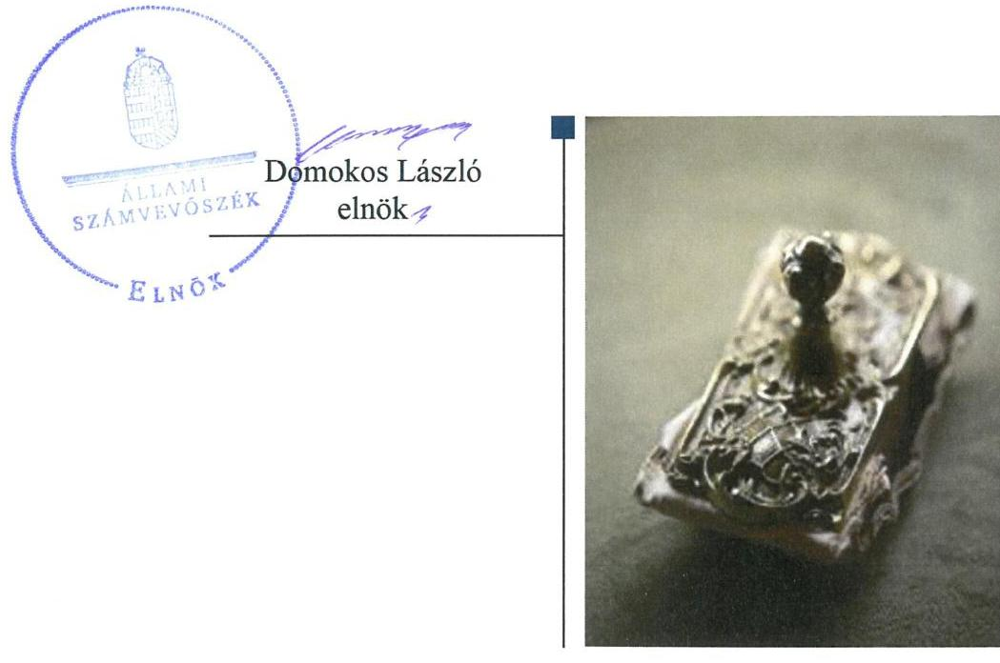

---

# AZ ELLENŐRZÉST FELÜGYELTE:

DR. NÉMETH ERZSÉBET felügyeleti vezető

## AZ ELLENŐRZÉST VEZETTE ÉS A VÉGREHAJTÁSÁÉRT FELELŐS:

DR. KOVÁCS DIÁNA ellenőrzésvezető

## A PROGRAM ÖSSZEÁLLÍTÁSÁÉRT FELELŐS:

TÓTPÁL SZABOLCS osztályvezető

IKTATÓSZÁM: EL-0366-017/2018.

TÉMASZÁM: 2463

ELLENŐRZÉS-AZONOSÍTÓ SZÁM: V080606

Jelentéseink az Országgyűlés számítógépes hálózatán és az Interneten a www.asz.hu címen is olvashatóak.

---

# TARTALOMJEGYZÉK 

■ ÖSSZEGZÉS ..... 5
■ AZ ELLENŐRZÉS CÉLJA ..... 6
■ AZ ELLENŐRZÉS TERÜLETE ..... 7
■ AZ ELLENŐRZÉS HÁTTERE, INDOKOLTSÁGA ..... 8
■ A JELENTÉS LÉNYEGES KÉRDÉSKÖREI ..... 9
■ AZ ELLENŐRZÉS HATÓKÖRE ÉS MÓDSZEREI ..... 10
■ MEGÁLLAPÍTÁSOK ..... 12
■ JAVASLATOK ..... 16
■ MELLÉKLETEK ..... 19
I. sz. melléklet: Értelmező szótár ..... 19
■ FÜGGELÉKEK ..... 21
I. sz. függelék a Megállapítások fejezethez ..... 21
II. sz. függelék: Észrevételek ..... 22
■ RÖVIDÍTÉSEK JEGYZÉKE ..... 37

---

.

---

# ÖSSZEGZÉS 

Az Országos Szlovén Önkormányzat irányítószervi jogkörgyakorlása a Kossics József Kétnyelvű Általános Iskola és Óvoda felett szabályszerű volt. Az oktatási intézmény működése, gazdálkodása nem volt szabályozott, a belső kontrollrendszer nem védte meg az erőforrásokat a veszteségektől és a nem rendeltetésszerű használattól. A pénzügyi gazdálkodás nem volt szabályszerű, a vagyongazdálkodása szabályszerű volt.

## Az ellenőrzés társadalmi indokoltsága

Magyarország Alaptörvényének XXIX. cikke kimondja, hogy a magyarországi nemzetiségek államalkotó tényezők. Joguk van anyanyelvük használatához, a sajátnyelven való névhasználathoz, saját kultúrájuk ápolásához és az anyanyelvű oktatáshoz. A nemzetiségek létrehozhatnak helyi és országos önkormányzatokat. A nemzetiségek jogaira vonatkozó részletes szabályokat Magyarországon sarkalatos törvény határozza meg. A nemzetiségi közfeladatok ellátásához az állami központi költségvetés támogatást nyújt, melyet a nemzetiségi önkormányzatok kizárólag e feladataik ellátására használhatnak fel.

## Főbb megállapítások, következtetések, javaslatok

A Kossics József Kétnyelvű Általános Iskola és Óvodával kapcsolatos alapítási, irányítási és munkáltatói jogosultságokat az Országos Szlovén Önkormányzat szabályszerűen gyakorolta.

A Kossics József Kétnyelvű Általános Iskola és Óvoda működésének, gazdálkodásának szabályozottsága nem volt megfelelő. A kontrollkörnyezet kialakítása, a kockázatkezelési - ezen belül a korrupciós kockázatokat is kezelő - rendszer kialakítása és működtetése, a kontrolltevékenység kialakítása, az információs és kommunikációs folyamatok kialakítása és működtetése, valamint a tevékenységek, a célok megvalósításának folyamatos és eseti nyomon követését biztosító rendszer kialakítása és a belső ellenőrzés működtetése nem volt szabályszerű.

A pénzügyi gazdálkodás nem volt szabályszerű. A bevételek beszedése és könyvelési elszámolása, a kiadási előirányzatok felhasználása a könyvelési elszámolás szempontjából szabályszerű volt, a gazdálkodási jogkörgyakorlás szempontjából nem volt szabályszerű. Az előirányzat-maradvány megállapítása nem volt szabályszerű. A fizetési kötelezettségeket szabályszerűen teljesítették. A Kossics József Kétnyelvű Általános Iskola és Óvoda éves költségvetési beszámolója és beszámolási kötelezettségének teljesítése szabályszerű volt.

A vagyongazdálkodás szabályszerű volt. A 2014-2016. évi beszámolót jogszabály szerinti leltárral alátámasztották.

---

# AZ ELLENŐRZÉS CÉLJA 

AZ ELLENŐRZÉS CÉLJA annak értékelése volt, hogy az Országos Szlovén Önkormányzat által alapított és fenntartott Kossics József Kétnyelvű Általános Iskola és Óvoda gazdálkodása, a belső kontrollrendszer kialakítása és működése, az Országos Szlovén Önkormányzat által nyújtott támogatás, illetve az államháztartásból meghatározott célra ingyenesen juttatott vagyon felhasználása a jogszabályi előírásoknak megfelelően történt-e.

---

# AZ ELLENŐRZÉS TERÜLETE 

## Kossics József Kétnyelvű Általános Iskola és Óvoda

A Felsőszölnökön található Iskola ${ }^{1}$ 1992. január 1-jei alapítása óta látta el a szlovén nemzetiségi óvoda és nappali rendszerű általános iskola feladatait. Működési területe a magyarországi szlovének által lakott területre terjedt ki. 2012. július 1-jétől – így az ellenőrzött időszakban is – az Iskola feletti fenntartói és irányító szervi feladatokat az Önkormányzat ${ }^{2}$ végezte.

A 8 évfolyamos nappali rendszerű általános iskolába a felvehető maximális tanuló létszám 120 fő volt, míg az óvoda-intézményegységben 25 fő volt a maximális gyermeklétszám az ellenőrzött időszakban.

Az Iskola nem rendelkezett gazdasági szervezettel, a pénzügy-számviteli feladatokat az Önkormányzat Hivatala ${ }^{3}$ látta el. Az ellenőrzött időszakban az Iskola igazgatójának személyében nem következett be változás.

Az Iskolánál a foglalkoztatottak száma 2014-2015. évben 18 fő volt, amely 2016. évben 17 főre csökkent.

Az Iskola ellenőrzött időszakban teljesített bevételeinek és kiadásainak alakulását az 1. számú ábra mutatja be. A finanszírozási bevételek jellemzően az irányító szervi támogatásból származtak, míg a költségvetési bevételek nagy részét az ellátási díjak és a működési célú átvett pénzeszközök tették ki. A költségvetési kiadások mintegy felét jelentették a személyi kiadások.

1. ábra
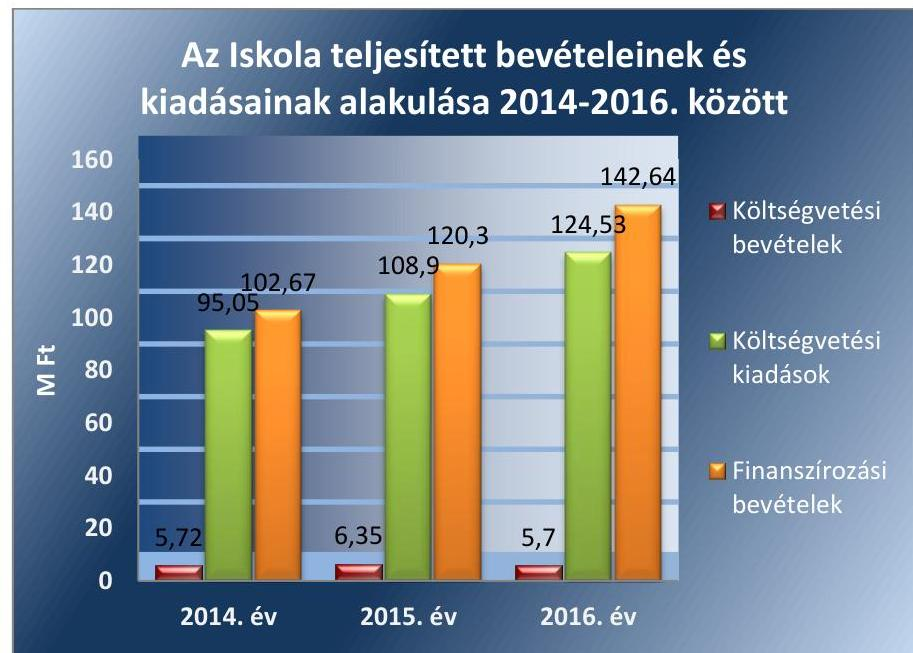

Forrás: Az Iskola 2014-2016. évi éves költségvetési beszámolói

Az Iskolát szervezeti, szerkezeti átalakítás nem érintette az ellenőrzött időszakban.

---

# AZ ELLENŐRZÉS HÁTTERE, INDOKOLTSÁGA 

Az országos nemzetiségi önkormányzatok az általuk képviselt nemzetiség kulturális autonómiájának megteremtése érdekében intézményeket hozhatnak létre és vehetnek át. Az éves költségvetési törvények közvetlenül az intézményfenntartó országos nemzetiségi önkormányzatokhoz rendelik az általuk fenntartott intézmények működési támogatását. A nemzetiségi önkormányzati intézmények költségvetési gazdálkodásának, belső kontrollrendszerének kialakítása és működtetése ellenőrzésével biztosítjuk a közpénzfelhasználás minél szélesebb körének ellenőrzését, ennek során azonos szempontok szerint értékeljük az egyes országos nemzetiségi önkormányzatok fenntartásában levő intézmények gazdálkodási tevékenységét.

Az ellenőrzés eredményeként az ellenőrzött költségvetési szervek gazdálkodása javulhat, átfogó képet kaphatunk az országos nemzetiségi önkormányzatok által fenntartott intézmények gazdálkodásának sajátosságairól, hiányosságairól és az alkalmazott jó gyakorlatokról, erősítve a társadalmi bizalmat. Az ellenőrzés tapasztalatai alapján, hiányosságok feltárásával, azok megszüntetésére vonatkozó javaslatokkal hozzájárulunk a közpénzek átlátható, szabályszerű felhasználásához.

---

# A JELENTÉS LÉNYEGES KÉRDÉSKÖREI 

1. Az Önkormányzat szabályszerűen gyakorolta-e az Iskolával kapcsolatos feladatait?
2. Az Iskola működése és gazdálkodása során tevékenysége szabályszerű volt-e, teljesítette-e az elszámolási kötelezettségeket, belső kontrollrendszere megvédte-e a veszteségektől és nem rendeltetésszerű használattól az Iskola erőforrásait?
3. Az Iskola pénzügyi gazdálkodása szabályszerű volt-e?
4. Az Iskola vagyongazdálkodása szabályszerű volt-e?

---

# AZ ELLENŐRZÉS HATÓKÖRE ÉS MÓDSZEREI 

## Az ellenőrzés típusa

Megfelelőségi ellenőrzés.

## Az ellenőrzött időszak

2014-2016. évek.

## Az ellenőrzés tárgya

Az ellenőrzés tárgya az Önkormányzat által alapított és fenntartott Iskola gazdálkodása, a belső kontrollrendszer kialakítása és működése, az Önkormányzat által nyújtott támogatás, illetve az államháztartásból meghatározott célra ingyenesen juttatott vagyon felhasználása jogszabályi előírásoknak való megfelelőségének értékelése.

## Az ellenőrzött szervezet

Kossics József Kétnyelvű Általános Iskola és Óvoda, Országos Szlovén Önkormányzat, Országos Szlovén Önkormányzat Hivatala

## Az ellenőrzés jogalapja

Az ellenőrzés jogszabályi alapját az ÁSZ tv. ${ }^{4}$ 1. § (3) bekezdés, 5. § (2)-(6) bekezdései, valamint Áht. ${ }^{5}$ 61. § (2) bekezdésének előírásai képezték.

## Az ellenőrzés módszerei

Az ellenőrzést az ellenőrzési program szempontjai, az ellenőrzött időszakban hatályos jogszabályok, az ellenőrzés szakmai szabályai, a jelen ellenőrzésre irányadó ÁSZ módszertanok figyelembevételével végeztük. Az ellenőrzési kérdések megválaszolásához szükséges bizonyítékok megszerzése az Iskola által rendelkezésre bocsátott dokumentumokra, adatokra alapozva megfigyelés, kockázat alapú mintavételezés, valamint elemző eljárás útján történt.

A belső kontrollrendszer kialakítása és működtetése szabályszerűségét csak a 2016. évre vonatkozóan értékelte az ÁSZ.

A kockázat alapú mintavételezés alapja a gazdasági események értékének nagysága volt.

---

A bevételek és a kiadások – külső személyi juttatások, dologi és felhalmozási kiadások – elszámolásának szabályszerűségét mintavétellel ellenőriztük. A vagyongazdálkodás szabályszerűségét a kiadások sokaságából kiválasztott felhalmozási mintatételek alapján ellenőriztük.

A fenti sokaságok esetében a mintavétel azokra a legnagyobb értékű tételekre – a lényeges sokaságra – terjedt ki, melyek összértéke eléri a teljes sokaság összértékének 50%-át. Amennyiben valamely lényeges sokaság elemszáma kisebb volt, mint az előírt mintaelemszám, a lényeges sokaságot tételesen ellenőriztük.

A mintavétellel ellenőrzött területek esetében minden egyes tétel vonatkozásában a szabályszerűségre vonatkozó kérdéseket tettünk fel, amelyek eredménye összesítésre került. „Szabályszerűnek" értékeltünk egy ellenőrzött területet, amennyiben a lényeges sokaságban az átlagos hibaarány legfeljebb 10%, "nem szabályszerűnek", amennyiben 10%-nál magasabb arányt képviselt.

Az ellenőrzési bizonyítékként felhasznált adatforrások közé tartoztak egyrészt az ellenőrzési program részletes szempontjainál felsorolt adatforrások, másrészt minden egyéb – az ellenőrzés folyamán feltárt, az ellenőrzés szempontjából információt tartalmazó – dokumentum. Az ellenőrzés lefolytatásához az Iskola tanúsítványok kitöltésével, valamint az ÁSZ által kért dokumentumok megküldésével szolgáltatott adatokat.

Az ellenőrzés ideje alatt az ellenőrzött szervezettel történő kapcsolattartás az ÁSZ SZMSZ-ének vonatkozó előírásai alapján volt biztosított.

---

# 1. Az Önkormányzat szabályszerűen gyakorolta-e az Iskolával kapcsolatos feladatait? 

Összegző megállapítás

Az Önkormányzat Iskolával kapcsolatos feladatait szabályszerűen gyakorolta.
1.1. számú megállapítás

Az Iskolával kapcsolatos alapítási, irányítási és munkáltatói joggyakorlása szabályszerű volt.

Az Iskola Önkormányzat által kiadott Alapító okiratai ${ }_{1,2,3}{ }^{6}$ tartalmazták az Ávr. ${ }^{7}$ szerinti tartalmi elemeket.

Az Önkormányzat költségvetése tartalmazta az Áht. előírásainak megfelelően az Intézmény költségvetési bevételi előirányzatait és költségvetési kiadási előirányzatait, a kiemelt előirányzatokat és a kötelező feladatokat, önként vállalt feladatok és államigazgatási feladatok bontásban. Az Önkormányzat Közgyűlése az Áhsz. ${ }^{8}$-ben foglaltak szerint az Iskola éves költségvetési beszámolóit jóváhagyta. Az Önkormányzat az Iskola előirányzat-maradványát az ellenőrzött időszakban az Ávr. 155. § (2) bekezdés ellenére a zárszámadási határozataiban nem állapította meg.

Az Önkormányzat munkáltatói joggyakorlása szabályszerű volt.

## 2. Az Iskola működése és gazdálkodása során tevékenysége szabályszerű volt-e, teljesítette-e az elszámolási kötelezettségeket, belső kontrollrendszere megvédte-e a veszteségektől és nem rendeltetésszerű használattól az Iskola erőforrásait?

Összegző megállapítás

Az Iskola működésének, gazdálkodásának szabályozottsága nem volt megfelelő, a belső kontrollrendszer nem védte meg a veszteségektől és a nem rendeltetésszerű használattól az Iskola erőforrásait.
2.1. számú megállapítás

A kontrollkörnyezet kialakítása nem volt szabályszerű.
Az Áht. 10. § (5) bekezdésében előírtak ellenére az Iskola nem rendelkezett az Nkt. ${ }^{9}$ 25. § (4) bekezdésében foglaltak szerinti szervezeti és működési szabályzattal.

Az Ávr 9. § (5) bekezdés a) pontjában előírt munkamegosztás és a felelősségvállalás rendjét tartalmazó megállapodást a Hivatal és az Iskola nem kötött.

Az Igazgató ${ }^{10}$ a Bkr. ${ }^{11}$ 6. § (1) bekezdés c) pontja ellenére nem határozta meg az etikai elvárásokat az Iskolában.

## 2.2. számú megállapítás 

A kockázatkezelési – ezen belül a korrupciós kockázatokat is kezelő – rendszer kialakítása nem volt szabályszerű.
Az Igazgató nem szabályozta 2016. február 1. és 2016. szeptember 30. közötti időszakban a szabálytalanságok kezelésének eljárásrendjét, 2016. október 1. napjától a szervezeti integritást sértő események kezelésének eljárásrendjét, megsértve a Bkr. 6. § (4) bekezdésben foglaltakat.

### 2.3. számú megállapítás

A kontrolltevékenység gyakorlása, működtetése nem volt szabályszerű.
A kontrolltevékenység gyakorlása, működtetése nem volt szabályszerű. A Kötelezettségvállalási szabályzat ${ }^{12}$ 4. számú mellékletében – az Ávr. 55. § (2) bekezdés c) pont ca) alpontja ellenére – nem a Hivatal gazdasági vezetője, hanem az Igazgató jelölt ki a pénzügyi ellenjegyzési és érvényesítői feladatok ellátására ügyintézőt.

A kötelezettségvállalások nyilvántartása nem felelt meg az Áhsz. 14. melléklet II. 4. d), e) g) és h) pontjában foglalt tartalmi elemeknek, mert nem tartalmazta az egységes rovatrend rovatai szerint a kötelezettségvállalás, más fizetési kötelezettség tárgyát, összegét (értékét), a pénzügyi teljesítési határidőket dátum szerint, a pénzügyi teljesítések dátumát, összegét, egységes rovatrend szerint besorolását, valamint a kötelezettségvállalás, más fizetési kötelezettség végleges vagy nem végleges jellegét.

A kontrolltevékenység gyakorlására vonatkozó részletes megállapításokat a 3.1. pont tartalmazza.
2.4. számú megállapítás

Az információs
 és kommunikációs folyamatok kialakítása és működtetése nem volt szabályszerű.
Az Igazgató belső szabályzatban az Ávr. 13. § (2) bekezdés h) pontja ellenére nem rendezte a közérdekű adatok megismerésére irányuló kérelmek intézésének, valamint a kötelezően közzéteendő adatok nyilvánosságra hozatalának rendjét.

Az Iskola az Ltv. ${ }^{13}$ 10. § (1) bekezdés a) pontja ellenére nem rendelkezett iratkezelési szabályzattal.

Az Info tv. ${ }^{14}$ 37. § (1) bekezdésben meghatározottak ellenére az 1. melléklet III/1. szerinti éves költségvetési beszámolót az Iskola nem tette közzé.
2.5. számú megállapítás

Az Iskola tevékenységének, a célok megvalósításának folyamatos és eseti nyomon követését biztosító rendszer kialakítása és a belső ellenőrzés működtetése nem volt szabályszerű.
A Bkr. 10. §-ában foglaltak ellenére az Igazgató nem alakította ki az operatív tevékenységek keretében megvalósítandó folyamatos és eseti nyomon követés rendszerét.

Az Iskola belső ellenőrzési feladatairól az Önkormányzat által, külső szolgáltató bevonásával megkötött megbízási szerződés ${ }^{15}$ útján gondoskodtak. A belső ellenőrzés megtervezéséhez készült kockázatelemzés és az Iskola vonatkozásában tervezett ellenőrzést elvégezték. A Bkr. 55. § (1) bekezdés ellenére a belső ellenőrzési vezető az elkészített 2016. évi ellenőrzési tervet nem küldte meg a Hivatal vezetőjének. A Bkr. 28. § c) pontja

---

ellenére a belső ellenőrzés javaslatainak végrehajtása érdekében intézkedési terv nem készült.

A Bkr. 50. § (1) bekezdésében foglaltak ellenére a belső ellenőrzési vezető nem vezetett az elvégzett ellenőrzésekről nyilvántartást. Az Igazgató a Bkr. 14. § (1) bekezdés ellenére nem gondoskodott a külső ellenőrzések javaslatai alapján készült intézkedési tervek végrehajtásának éves bontásban való nyilvántartás vezetéséről.

# Az Iskola nem a kockázatokkal arányosan alakította ki az integritás kontrollokat. 

Az Iskola csekély mértékben működtette az integritást erősítő kötelezően és nem kötelezően előírt kontrollokat. Az Iskola ezen túl nem határozta meg az általa követendő értékeket, ezek között az integritás erősítését sem. Az Iskola nem végzett kockázatelemzéseket.

## 3. Az Iskola pénzügyi gazdálkodása szabályszerű volt-e?

## Összegző megállapítás

### 3.1. számú megállapítás

Az Iskola pénzügyi gazdálkodása nem volt szabályszerű.
A bevételek beszedése és könyvviteli elszámolása, a kiadási előirányzatok felhasználása a könyvviteli elszámolás szempontjából szabályszerű volt, a gazdálkodási jogkörgyakorlás szempontjából nem volt szabályszerű.

A bevételi és a kiadási mintatételek esetében a gazdálkodási jogkörgyakorlás nem volt szabályszerű, mert az érvényesítést végző személyt az Ávr. 55. § (2) bekezdés c) pont ca) alpontja ellenére nem a Hivatal gazdasági vezetője, hanem az Igazgató jelölte ki. Az érvényesítés emiatt nem felelt meg az Áht. 38. § (1) bekezdés, valamint az Ávr. 58. § (4) bekezdés rendelkezéseinek. A kötelezettségvállalás, pénzügyi ellenjegyzés, teljesítésigazolás és az utalványozás az Ávr. előírásainak megfelelően történt.

A mintatételek esetében a bevételek beszedése és könyvviteli elszámolása szabályszerűen történt. Az Iskola a dologi és a felhalmozási kiadási előirányzatai felhasználása során a mintatételek esetében betartotta az Áhsz. előírásait.

Az Iskola pénzügyi és gazdálkodási feladatait ellátó Hivatal a Számv. tv. ${ }^{16}$ 14. § (3) bekezdésében és az Áhsz. 50. § (1) bekezdés foglaltak ellenére nem alakította ki az Iskola feladatellátásához szükséges számviteli politikáját, a Számv. tv. 14. § (5) bekezdés d) pontjában előírtak ellenére nem készítette el a pénzkezelési szabályzatot. A Hivatal nem készítette el a számlarendet, megsértve a Számv. tv. 161. § (1) bekezdésében foglaltakat.

Az Iskola 2016. január 1. és 2016. március 31. között nem rendelkezett közbeszerzési szabályzattal, megsértve a Kbt. ${ }^{17}$ 27. § (1) és (2) bekezdéseiben foglaltakat. A 2016. április 1-jétől hatályos Közbeszerzési Szabályzat ${ }^{18}$ hatálya kiterjedt az Iskolára, az szabályszerű volt. Az Iskola 2016. január 1. és 2016. március 31. között nem rendelkezett beszerzési szabályzattal, megsértve az Ávr 13. § (2) bekezdés b) pontjában foglaltakat. A 2016. április 1-jétől hatályos beszerzések lebonyolításával kapcsolatos eljárásrend ${ }^{19}$ hatálya kiterjedt az Iskolára, az szabályszerű volt.

---

# 3.2. számú megállapítás 

A fizetési kötelezettségeket teljesítették, az előirányzat-maradvány megállapítása nem volt szabályszerű.
Az Iskola a fizetési kötelezettségeit szabályszerűen teljesítette, lejárt szállítói tartozása nem volt az ellenőrzött időszak éveinek utolsó napján.

A Hivatal az Iskola kötelezettségvállalással terhelt maradványának alátámasztásához az Áhsz. 39. § (3) bekezdés előírásával ellentétben nem vezetett részletező nyilvántartást.
3.3. számú megállapítás

Az Iskola éves költségvetési beszámolója és beszámolási kötelezettségének teljesítése szabályszerű volt.

A Hivatal az Iskola éves költségvetési beszámolóit az ellenőrzött időszakban az Áhsz. szerint elkészítette, és megküldte az irányítószerv részére. Az éves költségvetési beszámolók Kincstárnak történő benyújtása az ellenőrzött időszakban szabályszerűen megtörtént.

A főkönyvi könyvelés és az analitikus nyilvántartás adatai között biztosított volt az egyezőség.

## 4. Az Iskola vagyongazdálkodása szabályszerű volt-e?

## Összegző megállapítás

Az Iskola vagyongazdálkodása szabályszerű volt.
4.1. számú megállapítás

A mérlegben kimutatott eszközök és források értékelése az ellenőrzött időszakban szabályszerű volt.

Az Iskola rendelkezett a Nvtv. ${ }^{20}$ szerinti vagyonnyilvántartással, a feladatot a Hivatal látta el.

Az Iskola az Eszközök és források értékelési szabályzatával ${ }^{21}$ 2015. márciusától rendelkezett. A követelések, valamint a kötelezettségek analitikus nyilvántartását nem az Áhsz. 14. melléklet II., illetve III. fejezete szerinti tartalommal vezette.

Az Iskola 2014. évben nem rendelkezett leltározási és leltárkészítési szabályzattal a Számv. tv. 14. § (5) bekezdés a) pontjában foglaltak ellenére. Az Iskola Leltározási és leltárkészítési szabályzattal ${ }^{22}$ 2015. márciusától rendelkezett. A leltározás a 2015. és 2016. évben szabályszerű volt.

A 2014-2016. évek beszámolóihhoz a mérlegtételek alátámasztására a Hivatal olyan leltárt állított össze, amely tételesen, az Áhsz. 22. §-ában foglalt előírásoknak megfelelően ellenőrizhető módon, a mérlegforduló napján meglévő eszközöket és forrásokat tartalmazta mennyiségben és értékben.
4.2. számú megállapítás

A nemzeti vagyon használatához kapcsolódóan az Iskola teljesítette a jogszabályokban foglalt beszámolási és adatszolgáltatási kötelezettségét.

Az Iskola éves költségvetési beszámolóját az Áhsz. szerinti szerkezetben állították össze.

Az Iskola az ellenőrzött időszak minden évében, az Áht. és az Ávr. rendelkezései szerint teljesítette az éves költségvetési beszámolóról az adatszolgáltatási kötelezettségét az államháztartás információs rendszerébe.

---

# JAVASLATOK 

Az ÁSZ tv. 33. § (1) bekezdésében foglaltak értelmében az ellenőrzött szervezet vezetője köteles a jelentésben foglalt megállapításokhoz kapcsolódó intézkedési tervet összeállítani és azt a jelentés kézhezvételétől számított 30 napon belül az ÁSZ részére megküldeni. Amennyiben az ellenőrzött szervezet vezetője nem küldi meg határidőben az intézkedési tervet, vagy továbbra sem elfogadható intézkedési tervet küld, az Állami Számvevőszék elnöke az ÁSZ tv. 33. § (3) bekezdése a) és b) pontjaiban foglaltakat érvényesítheti.

## az Országos Szlovén Önkormányzat elnökének

1. Gondoskodjon arról, hogy az Ávr. előírásainak megfelelően az OSZÖ állapítsa meg az Iskola költségvetési maradványát a zárszámadási határozatával egy időben.
(1.1. sz. megállapítás 2. bekezdésének 3. mondata alapján)

## az Országos Szlovén Önkormányzat Hivatala vezetőjének és a Kossics József Kétnyelvű Általános Iskola és Óvoda Igazgatójának

1. Gondoskodjon az Ávr. előírásainak megfelelően a Hivatal és az Iskola közötti, a munkamegosztás és felelősségvállalás rendjét tartalmazó megállapodás (munkamegosztási megállapodás) megkötéséről.
(2.1. sz. megállapítás 2. bekezdése alapján)

## az Országos Szlovén Önkormányzat Hivatala vezetőjének

1. Gondoskodjon arról, hogy a kötelezettségvállalások nyilvántartása tartalmazza az Áhsz. által előírt tartalmi elemeket.
(2.3. sz. megállapítás 2. bekezdése alapján)
2. Tegyen intézkedéseket annak érdekében, hogy a belső ellenőrzési vezető az éves ellenőrzési terveket a Bkr. előírásainak megfelelően küldje meg a Hivatal vezetőjének, valamint vezessen nyilvántartást az elvégzett belső ellenőrzésekről a Bkr. által meghatározott tartalommal.
(2.5. sz. megállapítás 2. bekezdésének 3. mondata és a 3. bekezdés
3. mondata alapján)

---

3. Intézkedjen a Számv. tv. és az Áhsz. előírásainak megfelelően az Iskola feladatellátásához szükséges számviteli politika, pénzkezelési szabályzat és számlarend elkészítéséről.
(3.1. sz. megállapítás 3. bekezdése alapján)
4. Vezessen részletező nyilvántartást az Iskola kötelezettségvállalással terhelt maradványának alátámasztásáról az Áhsz. előírásainak megfelelően.
(3.2 sz. megállapítás 2. bekezdése alapján)
5. Gondoskodjon a követelések és a kötelezettségek analitikus nyilvántartásának Áhsz. szerinti vezetéséről.
(4.1. sz. megállapítás 2. bekezdésének 2. mondata alapján)

# a Kossics József Kétnyelvű Általános Iskola és Óvoda Igazgatójának 

1. Gondoskodjon az Iskola szervezeti és működési szabályzatának elkészítéséről az Áht. és az Nkt. előírásainak megfelelően.
(2.1. sz. megállapítás 1. bekezdése alapján)
2. Határozza meg az etikai elvárásokat az Iskolában a Bkr. rendelkezései alapján.
(2.1. sz. megállapítás 3. bekezdése alapján)
3. A Bkr. előírásainak megfelelően szabályozza a szervezeti integritást sértő események kezelésének eljárásrendjét.
(2.2. sz. megállapítás 1. bekezdése alapján)
4. Az Ávr. előírásainak megfelelően intézkedjen a közérdekű adatok megismerésére irányuló kérelmek intézésének, továbbá a kötelezően közzéteendő adatok nyilvánosságra hozatala rendjének kialakításáról.
(2.4. sz. megállapítás 1. bekezdése alapján)
5. Gondoskodjon az Ltv. alapján iratkezelési szabályzat kiadásáról.
(2.4. sz. megállapítás 2. bekezdése alapján)

---

6. Intézkedjen az Info tv. előírásainak megfelelően az éves költségvetési beszámolók közzétételéről.
(2.4. sz. megállapítás 3. bekezdése alapján)
7. Gondoskodjon a belső ellenőrzés megállapításai és javaslatai alapján a Bkr. előírásainak megfelelő intézkedési terv elkészítéséről, valamint a külső ellenőrzések javaslatai alapján készült intézkedési tervek végrehajtására vonatkozó nyilvántartás vezetéséről.
(2.5. sz. megállapítás 2. bekezdésének 4. mondata és a 3. bekezdés 2. mondata alapján)

---

# MELLÉKLETEK 

- I. SZ. MELLÉKLET: ÉRTELMEZŐ SZÓTÁR
hasznosítás
irányító szerv
közfeladat
működtetés
nemzeti vagyon rendeltetése
nemzetiségi önkormányzat
nemzetiségi köznevelési intézmény
nemzetiségi közügy

A nemzeti vagyon birtoklásának, használatának, hasznok szedése jogának bármely a tulajdonjog átruházását nem eredményező - jogcímen történő átengedése, ide nem értve a vagyonkezelésbe adást, valamint a haszonélvezeti jog alapítását. (Forrás: Nvtv. 3. § (1) bekezdés 4. pontja)
A költségvetési szerv tekintetében az e törvényben meghatározott irányítási hatáskört gyakorló szerv. (Forrás: Áht. 1. § 9. pontja)
Jogszabályban meghatározott állami vagy önkormányzati feladat, amit az arra kötelezett közérdekből, a jogszabályban meghatározott követelményeknek és feltételeknek megfelelve végez, ideértve a lakosság közszolgáltatásokkal való ellátását, továbbá az állam nemzetközi szerződésekben vállalt kötelezettségeiből adódó közérdekű feladatokat, valamint e feladatok ellátásakor szükséges infrastruktúra biztosítását is. (Forrás: Nvtv. 3. § (1) bekezdés 7. pontja, hatálytalan: 2015. január 1-jétől)
„Közfeladat a jogszabályban meghatározott állami vagy önkormányzati feladat". A közfeladatok ellátása költségvetési szervek alapításával és működtetésével, vagy azok ellátásához szükséges pénzügyi fedezet törvényben meghatározott eszközökkel, részben, vagy egészben történő biztosításával valósul meg. (Forrás: Áht. 3/A. § (1) bekezdés, hatályos 2015. január 1-jétől)
A nemzeti vagyon birtoklásából, használatából, hasznai szedéséből, a nemzeti vagyon fenntartásából és üzemeltetéséből álló tevékenységek együttese, amely - jogszabály vagy szerződés alapján - a nemzeti vagyon felújítására, fejlesztésére, a birtoklásának, használatának hasznai szedése jogának továbbengedésére is kiterjed. (Forrás: Nvtv. 3. § 10. pontja)

A nemzeti vagyon alapvető rendeltetése a közfeladat ellátásának biztosítása, ideértve a lakosság közszolgáltatásokkal való ellátását és e feladatok ellátásához szükséges infrastruktúra biztosítását. (Forrás: Nvtv. 7. 0 (1) bekezdés, hatályos 2015. január 1-jétől)
A nemzetiségek jogairól szóló törvényben meghatározott nemzetiségi közszolgáltatási feladatokat ellátó, testületi formában működő, jogi személyiséggel rendelkező, demokratikus választások útján e törvény alapján létrehozott szervezet, amely a nemzetiségi közösséget megillető jogosultságok érvényesítésére, a nemzetiségek érdekeinek védelmére és képviseletére, a feladat- és hatáskörébe tartozó nemzetiségi közügyek települési, területi vagy országos szinten történő önálló intézésére jön létre. (Forrás: a nemzetiségek jogairól szóló 2011. évi CLXXIX. törvény, 2. §)

 2. pont)
Az a köznevelési intézmény, amelynek alapító okirata a nemzeti köznevelésről szóló törvényben foglaltak szerint tartalmazza a nemzetiségi feladatok ellátását, feltéve, hogy e feladatokat a köznevelési intézmény ténylegesen ellátja, továbbá óvoda, iskola és kollégium esetén a tanulók legalább huszonöt százaléka részt vesz a nemzetiségi óvodai nevelésben, illetve a nemzetiségi iskolai nevelésben-oktatásban.
a Nemzetiségi tv.-ben biztosított egyéni és közösségi jogok érvényesülése, a nemzetiséghez tartozók érdekeinek kifejezésre juttatása - különösen az anyanyelv ápolása, őrzése és gyarapítása, továbbá a nemzetiségek kulturális autonómiájának a nemzetiségi önkormányzatok által történő megvalósítása és megőrzése - érdekében a nemzetiséghez tartozók meghatározott közszolgáltatásokkal való ellátásával, ezen ügyek önálló vitelével és az ehhez szükséges szervezeti, személyi és anyagi feltételek megteremtésével összefüggő ügy

---

nemzetiségi többcélú intézmény
tulajdonosi joggyakorló
vagyongazdálkodás

Fejezeti kezelésű előirányzat

Nemzeti vagyon
nemzetiségi többcélú intézményen, nemzetiségi tagintézményen és nemzetiségi köznevelési intézmény intézményegységén a köznevelési törvény szerinti többcélú intézmény, tagintézmény és intézményegység értendő (Forrás: Nemzetiségi tv. 2. § 4. pont b,)
Aki a nemzeti vagyon felett az államot vagy a helyi önkormányzatot megillető tulajdonosi jogok és kötelezettségek összességének gyakorlására jogosult. (Forrás: Nvtv. 3. § (1) bekezdés 17. pontja)

A nemzeti vagyongazdálkodás feladata a nemzeti vagyon rendeltetésének megfelelő, az állam, az önkormányzat mindenkori teherbíró képességéhez igazodó, elsődlegesen a közfeladatok ellátásához és a mindenkori társadalmi szükségletek kielégítéséhez szükséges, egységes elveken alapuló, átlátható, hatékony és költségtakarékos működtetése, értékének megőrzése, állagának védelme, értéknövelő használata, hasznosítása, gyarapítása, továbbá az állam vagy a helyi önkormányzat feladatának ellátása szempontjából feleslegessé váló vagyontárgyak elidegenítése. (Forrás: Nvtv. 7. § (2) bekezdése)

Fejezeti kezelésű előirányzat a fejezeti kezelésű előirányzatok a költségvetési fejezet saját kezelésű, nem központi költségvetési szervekhez rendelt olyan előirányzatai, amelyek a fejezetet irányító szerv sajátos szakmai, ágazati feladatainak ellátására vagy a fejezethez tartozó költségvetési szervek tevékenységével kapcsolatban felmerülő, illetve szakmailag ahhoz kapcsolódó sajátos kötelezettségei teljesítése során felmerülő költségvetési bevételek és költségvetési kiadások elszámolására szolgálnak,
a) az állam vagy a helyi önkormányzat kizárólagos tulajdonában álló dolgok,
b) az a) pont hatálya alá nem tartozó, az állam vagy a helyi önkormányzat tulajdonában lévő dolog,
c) az állam vagy a helyi önkormányzat tulajdonában lévő pénzügyi eszközök, továbbá az államot vagy a helyi önkormányzatot megillető társasági részesedések,
d) az államot vagy a helyi önkormányzatot megillető bármely vagyoni értékkel rendelkező jogosultság, amelyet jogszabály vagyoni értékű jogként nevesít,
e) Magyarország határa által körbezárt terület feletti légtér,
f) az üvegházhatású gázok kibocsátási egységeinek kereskedelméről szóló törvény szerinti kibocsátási egység és légiközlekedési kibocsátási egység, valamint az ENSZ Éghajlatváltozási Keretegyezménye és annak Kiotói Jegyzőkönyve végrehajtási keretrendszeréről szóló törvény szerinti kiotói egység,
g) állami vagy helyi önkormányzati fenntartású közgyűjtemény (muzeális intézmény, levéltár, közgyűjteményként működő kép- és hangarchívum, valamint könyvtár) saját gyűjteményében nyilvántartott kulturális javak körébe tartozó dolog, kivéve, ha az állami vagy önkormányzati tulajdon jogszerű létrejötte kétséget kizáró módon nem bizonyítható és a dologra nézve más a tulajdonjogát bizonyítja vagy a kulturális javakra vonatkozó jogszabályokban meghatározott eljárás keretében valószínűsíti,
h) a régészeti lelet,
i) a nemzeti adatvagyon körébe tartozó állami nyilvántartások fokozottabb védelméről szóló törvény szerinti nemzeti adatvagyon.
(Forrás: Nvtv. 1.§ (2) bekezdés)

---

# FÜGGELÉKEK 

- I. SZ. FÜGGELÉK A MEGÁLLAPÍTÁSOK FEJEZETHEZ

Az ellenőrzés során megállapítást nyert, hogy a Kossics József Kétnyelvű Általános Iskola és Óvoda az ellenőrzött időszakban az államháztartásról szóló 2011. évi CXCV. törvény 10. § (5) bekezdésének előírása ellenére nem rendelkezett a tevékenységét és működését meghatározó, a nemzeti köznevelésről szóló 2011. évi CXC. törvény 25. § (4) bekezdésében foglaltak szerinti szervezeti és működési szabályzattal. Az ellenőrzött időszakban nem volt biztosított a szervezeti és működési szabályzat hiánya miatt az Iskola jogszabályoknak megfelelő működése.

---

A jelentéstervezetet a Számvevőszék 15 napos észrevételezésre megküldte az ellenőrzött szervezetek vezetőinek az ÁSZ tv. 29. § (1) bekezdése előírása szerint.

A Kossics József Kétnyelvű Általános Iskola és Óvoda intézményvezetője, az Országos Szlovén Önkormányzat elnöke, valamint az Országos Szlovén Önkormányzat Hivatalának vezetője a jelentéstervezet megállapításaira észrevételt tett.
A függelék tartalmazza az ellenőrzöttek észrevételeit, illetve az el nem fogadott észrevételek elutasításának indoklását.

[^0]
[^0]:    * 29. § (1) Az Állami Számvevőszék az ellenőrzési megállapításait megküldi az ellenőrzött szervezet vezetőjének vagy az általa megbízott személynek, és annak, akinek személyes felelősségét állapította meg.
    (2) Az ellenőrzött szervezet vezetője és a felelősként megjelölt személy az ellenőrzés megállapításaira tizenöt napon belül írásban észrevételt tehet.
    (3) Az Állami Számvevőszék az észrevételre a beérkezésétől számított harminc napon belül írásban válaszol. A figyelembe nem vett észrevételeket köteles a jelentésben feltüntetni, és megindokolni, hogy azokat miért nem fogadta el.

---

# Kossics József Kétnyelvű   Általános Iskola és Óvoda   9985 Felsőszölnök, Templom út 10/1   Dvojezična osnovna šola in vrtec Jožefa Košiča   H-9985 Gornji Senik, Cerkvena pot 10/1   Telefon: +36-94/534016   Fax: +36-94/534017   E-mail: kossicsiskola@gmail.com 

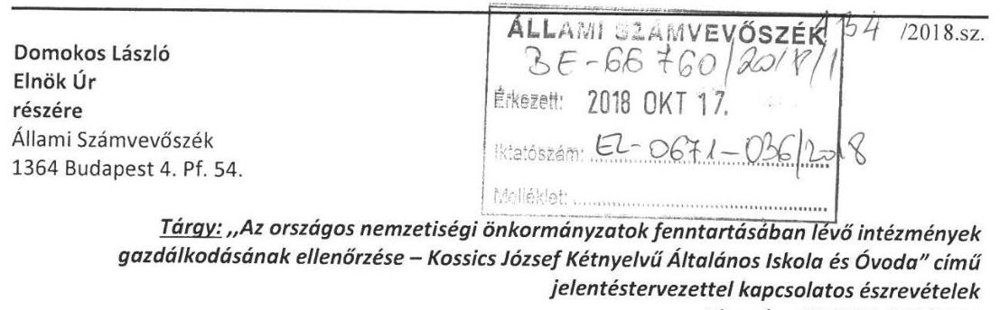

Tárgy: ,,Az országos nemzetiségi önkormányzatok fenntartásában lévő intézmények gazdálkodásának ellenőrzése - Kossics József Kétnyelvű Általános Iskola és Óvoda" című jelentéstervezettel kapcsolatos észrevételek Hiv.szám: EL-0671-032/2018

## Tisztelt Elnök Úr!

A tárgyban jelzett témában és számra hivatkozva a Kossics József Kétnyelvű Általános Iskola és Óvoda nevében a következő észrevételeket teszem, illetve intézkedések történnek és kérem, ennek szíves figyelembe vételét:

Javaslat az Országos Szlovén Önkormányzat Hivatala vezetőjének és a Kossics József Kétnyelvű Általános Iskola és Óvoda Igazgatójának:
„1. Gondoskodjon az Ávr. előírásainak megfelelően a Hivatal és az Iskola közötti, a munkamegosztás és felelősségvállalás rendjét tartalmazó megállapodás (munkamegosztási megállapodás) megkötéséről." (2.1.sz. megállapítás 2. bekezdése alapján)

A javaslattal egyetértek, a Kossics József Kétnyelvű Általános Iskola és Óvoda intézkedik arról, hogy az Ávr. 9. § (5) bekezdés a) pontjában előírt munkamegosztás és a felelősségvállalás rendjét tartalmazó megállapodás a Hivatal és az Iskola között létrejöjjön.

## Javaslat a Kossics József Kétnyelvű Általános Iskola és Óvoda Igazgatójának:

„1. Gondoskodjon az Iskola Szervezeti és Működési Szabályzatának elkészítéséről az Áht. és az Nkt. előírásainak megfelelően." (2.1. sz. megállapítás 1. bekezdése alapján)

A javaslattal nem értek egyet, az Iskola rendelkezik az Nkt. 25. § (4) bekezdésében foglaltak szerinti szervezeti és működési szabályzattal.

---

„2. Határozza meg az etikai elvárásokat az Iskolában a Bkr. rendelkezései alapján." (2.1. sz. megállapítás 3. bekezdése alapján)

A javaslattal egyetértek; mint a Kossics József Kétnyelvű Általános Iskola és Óvoda intézményvezetője köteles vagyok olyan kontrollkörnyezetet kialakítani, amelyben meghatározottak, ismertek és elfogadottak az etikai elvárások a szervezet minden szintjén.
„3. A Bkr. előírásainak megfelelően szabályozza a szervezeti integritást sértő események kezelésének eljárásrendjét." (2.2. sz. megállapítás 1. bekezdése alapján)

A javaslattal egyetértek; mint a Kossics József Kétnyelvű Általános Iskola és Óvoda intézményvezetője köteles vagyok szabályozni a szervezeti integritást sértő események kezelésének eljárásrendjét.
„4. Az Ávr. előírásainak megfelelően intézkedjen a közérdekű adatok megismerésére irányuló kérelmek intézésének, továbbá a kötelezően közzéteendő adatok nyilvánosságra hozatala rendjének kialakításáról." (2.4. sz. megállapítás 1. bekezdése alapján)

A javaslattal egyetértek; mint a Kossics József Kétnyelvű Általános Iskola és Óvoda intézményvezetője köteles vagyok rendezni a közérdekű adatok megismerésére irányuló kérelmek intézésének, valamint a kötelezően közzéteendő adatok nyilvánosságra hozatalának rendjét.
„5. Gondoskodjon az Ltv. alapján iratkezelési szabályzat kiadásáról." (2.4. sz. megállapítás 2. bekezdése alapján)

A javaslattal nem értek egyet; a Kossics József Kétnyelvű Általános Iskola és Óvoda rendelkezik iratkezelési szabályzattal, amely az Ltv. 10. § (1) bekezdés a) pontjának megfelelően az illetékes közlevéltárral (Vas Megyei Levéltár) egyetértésben került kiadásra.
„6. Intézkedjen az Info tv. előírásainak megfelelően az éves költségvetési beszámolók közzétételéről." (2.4. sz. megállapítás 3. bekezdése alapján)

A javaslattal nem értek egyet, az éves költségvetési beszámoló az Info tv. 37. § (1) bekezdésben meghatározottak szerint, a Fenntartó honlapján (www.slovenci.hu) kerül közzétételre.
„7. Gondoskodjon a belső ellenőrzés megállapításai és javaslatai alapján a Bkr. előírásainak megfelelő intézkedési terv elkészítéséről, valamint a külső ellenőrzések javaslatai alapján készült intézkedési tervek végrehajtására vonatkozó nyilvántartás vezetéséről." (2.5. sz. megállapítás 2. bekezdésének 4. mondata és a 3. bekezdés 2. mondata alapján)

A javaslattal egyetértek; mint a Kossics József Kétnyelvű Általános Iskola és Óvoda vezetője köteles vagyok a belső ellenőrzés megállapításai és javaslatai alapján a végrehajtásért felelősöket és a végrehajtás határidejét feltüntető intézkedési tervet készíteni; az intézkedéseket a megadott határidőig végrehajtani, arról a Fenntartót és a belső ellenőrzési

---

vezetőt tájékoztatni. A továbbiakban gondoskodom a külső ellenőrzések javaslatai alapján készült intézkedési tervek végrehajtásának éves bontásban való nyilvántartás vezetéséről.

Tisztelt Elnök Úr!
Munkánkhoz nyújtott segítő támogatásukat és javaslataikat tisztelettel köszönöm, a szükséges további intézkedések végrehajtásáról folyamatosan intézkedem.

Felsőszölnök, 2018. október 15.
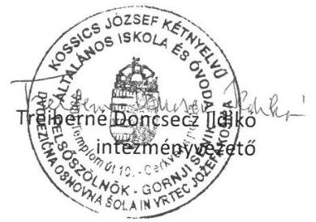

---

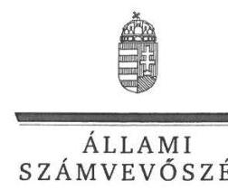

ELNÖK

Ikt.szám: EL-0671-037/2018

# Treiberné Doncsecz Ildikó asszony   intézményvezető 

Kossics József Kétnyelvű Általános Iskola és Óvoda

## Felsőszölnök

## Tisztelt Intézményvezető Asszony!

Köszönettel megkaptam „Az országos nemzetiségi önkormányzatok fenntartásában lévő intézmények gazdálkodásának ellenőrzése - Kossics József Kétnyelvű Általános Iskola és Óvoda" című jelentéstervezetre tett észrevételét.

Az ellenőrzési megállapításokra vonatkozó észrevételét az Állami Számvevőszékről szóló 2011. évi LXVI. törvény (a továbbiakban: ÁSZ tv.) 29. § (2) bekezdésében meghatározott tizenöt napos határidőn belül küldte meg. Az Állami Számvevőszék észrevétellel kapcsolatos álláspontját a mellékletként csatolt, a felügyeleti vezető által készített tájékoztatás tartalmazza.

Tájékoztatom, hogy az Állami Számvevőszék a figyelembe nem vett észrevételeket az ÁSZ tv. 29. § (3) bekezdésében előírtak szerint köteles a jelentésében feltüntetni és megindokolni, hogy azokat miért nem fogadta el.

Budapest, 2018. november 13. nap
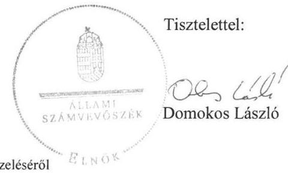

Melléklet: Tájékoztatás az észrevételek kezeléséről

---

# Tájékoztatás az észrevételek kezeléséről 

„Az országos nemzetiségi önkormányzatok fenntartásában lévő intézmények gazdálkodásának ellenőrzése - Kossics József Kétnyelvű Általános Iskola és Óvoda" című
jelentéstervezetre tett észrevételhez kapcsolódóan
Kossics József Kétnyelvű Általános Iskola és Óvoda
Intézményvezető asszony jelentéstervezetre tett észrevételeit áttekintettem, annak kezelésével kapcsolatban a következő tájékoztatást adom.
a) Intézményvezető asszony nyolc pontban fogalmazta meg észrevételeit, melyek közül öt esetben a javaslatokkal egyetértett. Ezért ezen javaslatokat megalapozó, intézkedést igénylő megállapítások (2.1. sz. megállapítás 2. és 3. bekezdése, 2.2. sz. megállapítás 1. bekezdése, 2.4. sz. megállapítás 1. bekezdése, valamint a 2.5. sz. megállapítás 2. bekezdésének 4. mondata és a 3. bekezdés 2. mondata) módosítása nem indokolt.
b) A jelentéstervezet 2.1. megállapításának 1. bekezdése szerint az Iskola nem rendelkezett a nemzeti köznevelésről szóló 2011. évi CXC. törvény (Nkt.) 25. § (4) bekezdésében foglaltak szerinti szervezeti és működési szabályzattal. Intézményvezető asszony észrevételében jelzi, hogy az Iskola rendelkezik a hiányolt szabályzattal.
Az észrevétel kapcsán ismételten áttekintettük az ellenőrzés rendelkezésére bocsátott dokumentumokat. Az EL-0366-007/2018 számon megküldött adatbekérő levélben az Állami Számvevőszék kérte a 2. sz. mellékletben felsorolt dokumentumokat elektronikusan - aláírt és hiteles dokumentumokat pdf formátumban, szkennelve - az ÁSZ ellenőrzést támogató online rendszerébe (web-es felületre) feltölteni. Bár a megküldött Szervezeti és Működési Szabályzat megnevezésű dokumentum záró rendelkezései szerint az SZMSZ-t a diákönkormányzat, a szülői munkaközösség véleményezte, a nevelőtestület megtárgyalta, megvitatta és
 elfogadta, az OSZÖ Közgyűlése elfogadta, valamint az igazgató jóváhagyta, a megküldött dokumentumon nem szerepel a kiadmányozó személy aláírása és az aláírás kelte, így a szabályzat nem tekinthető kiadmányozottnak. Erre való tekintettel a megállapítás módosítása nem indokolt.
c) A jelentéstervezet 2.4. sz. megállapításának 2. bekezdése szerint az Iskola nem rendelkezett iratkezelési szabályzattal. Intézményvezető asszony észrevételében jelzi, hogy rendelkeznek iratkezelési szabályzattal, amely a jogszabályi előírásoknak megfelelően, az illetékes közlevéltárral egyetértésben került kiadásra.
Az észrevétel kapcsán ismételten áttekintettük az ellenőrzés rendelkezésére bocsátott dokumentumokat. Az ellenőrzés számára rendelkezésre bocsátott Iratkezelési Szabályzat a Szervezeti és Működési Szabályzat megnevezésű dokumentum 3. számú melléklete. Tekintettel azonban arra, hogy a dokumentumon nem szerepel a kiadmányozó személy aláírása és az aláírás kelte, a szabályzat nem tekinthető kiadmányozottnak, így a megállapítás módosítása nem indokolt.
d) A jelentéstervezet 2.4. sz. megállapításának 3. bekezdése szerint az információs önrendelkezési jogról és az információszabadságról szóló 2011. év CXII. törvény 37. §

---

(1) bekezdésben meghatározottak ellenére az 1. melléklet III/1. szerinti éves költségvetési beszámolót az Iskola nem tette közzé. Intézményvezető asszony észrevételében jelzi, hogy az éves költségvetési beszámoló a jogszabályi előírásban meghatározottak szerint, a fenntartó honlapján kerül közzétételre.
Az észrevétel kapcsán ismételten áttekintettük az ellenőrzés rendelkezésére bocsátott dokumentumokat. Az EL-0366-007/2018 számon megküldött adatbekérő levélben az ÁSZ kérte a közzétételi kötelezettség teljesítését igazoló dokumentumok megküldését. Az Iskola bár megküldte a 2016. évi költségvetési beszámolóját, annak közzétételét igazoló dokumentumot nem bocsátott az ÁSZ rendelkezésére, illetve a beszámoló sem az Iskola honlapján, sem a fenntartó honlapján nem található. Mindezekre tekintettel a megállapítás módosítása nem indokolt.
Az ellenőrzés során feltárt hibák, hiányosságok kijavítására vonatkozó tájékoztatását köszönettel vettük.

Budapest, 2018. november 13.
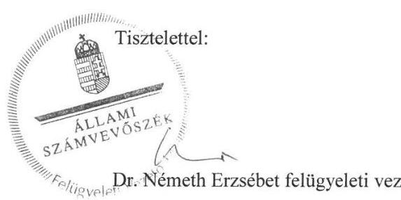

---

DRŽAVNA SLOVENSKA SAMOUPRAVA

# ORSZÁGOS SZLOVÉN ÖNKORMÁNYZAT 

H- 9985 Gornji Senik, Cerkvena pot 8. /9985 Felsőszölnök, Templom u. 8.
Tel.: 0036 94/534-024
Fax.: 0036 94/534-025
E-mail: samouprava@slovenci.hu
www.slovenci.hu

Domokos László
Elnök Úr
részére
Állami Számvevőszék
1364 Budapest 4. Pf. 54.
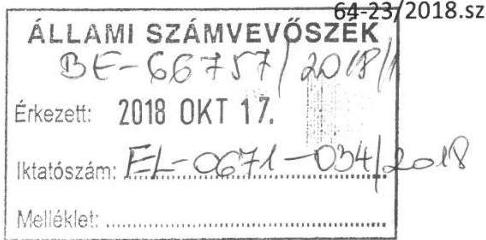

Tárgy: ,,Az országos nemzetiségi önkormányzatok fenntartásában lévő intézmények gazdálkodásának ellenőrzése - Kossics József Kétnyelvű Általános Iskola és Óvoda" címü jelentéstervezettel kapcsolatos észrevételek Hiv.szám: EL-0671-032/2018

## Tisztelt Elnök Úr!

A tárgyban jelzett témában és számra hivatkozva az Országos Szlovén Önkormányzat nevében a következő észrevételeket teszem, illetve intézkedések történnek és kérem, ennek szíves figyelembe vételét:

## Javaslat az Országos Szlovén Önkormányzat elnökének:

„1. Gondoskodjon arról, hogy az Ávr. előírásainak megfelelően az OSZÖ állapítsa meg az Iskola költségvetési maradványát a zárszámadási határozatával egy időben.” (1.1.sz. megállapítás 2. bekezdésének 3. mondata alapján)

A javaslattal egyetértek, az Országos Szlovén Önkormányzat intézkedik arról, hogy az intézmény költségvetési maradványát az irányító szerv a zárszámadási határozatával egy időben állapítsa meg és szükség esetén határozatát módosítsa.

Tisztelt Elnök Úr!
Munkánkhoz nyújtott segítő támogatásukat és javaslataikat tisztelettel köszönöm, a szükséges további intézkedések végrehajtásáról folyamatosan intézkedem.

Felsőszölnök, 2018. október 15.
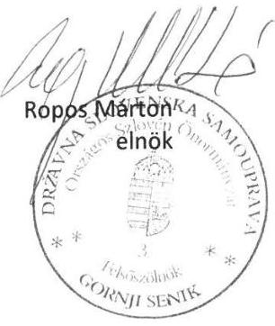

---

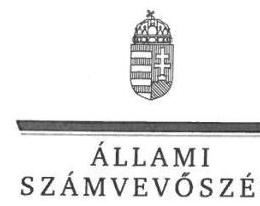

ELNÖK

Ikt.szám: EL-0671-039/2018

# Ropos Márton úr 

elnök

Országos Szlovén Önkormányzat

## Felsőszölnök

## Tisztelt Elnök Úr!

Köszönettel megkaptam „Az országos nemzetiségi önkormányzatok fenntartásában lévő intézmények gazdálkodásának ellenőrzése - Kossics József Kétnyelvű Általános Iskola és Óvoda" című jelentéstervezetre tett észrevételét.

Az ellenőrzési megállapításokra vonatkozó észrevételét az Állami Számvevőszékről szóló 2011. évi LXVI. törvény (a továbbiakban: ÁSZ tv.) 29. § (2) bekezdésében meghatározott tizenöt napos határidőn belül küldte meg. Az Állami Számvevőszék észrevétellel kapcsolatos álláspontját a mellékletként csatolt, a felügyeleti vezető által készített tájékoztatás tartalmazza.

Tájékoztatom, hogy az Állami Számvevőszék a figyelembe nem vett észrevételeket az ÁSZ tv. 29. § (3) bekezdésében előírtak szerint köteles a jelentésében feltüntetni és megindokolni, hogy azokat miért nem fogadta el.

Budapest, 2018. november 13.
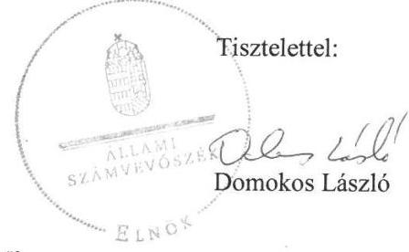

Melléklet: Tájékoztatás az észrevétel kezeléséről

---

# Tájékoztatás az észrevétel kezeléséről 

„Az országos nemzetiségi önkormányzatok fenntartásában lévő intézmények gazdálkodásának ellenőrzése - Kossics József Kétnyelvű Általános Iskola és Óvoda" címü jelentéstervezetre tett észrevételhez kapcsolódóan Országos Szlovén Önkormányzat

Elnök úr a jelentéstervezet 1.1. sz. megállapításának 2. bekezdés 3. mondata alapján megfogalmazott javaslattal egyetért, így a kapcsolódó megállapítás módosítása nem indokolt.
Az ellenőrzés során feltárt hiányosság kijavítására vonatkozó tájékoztatását köszönettel vettük.

Budapest, 2018. november 13.
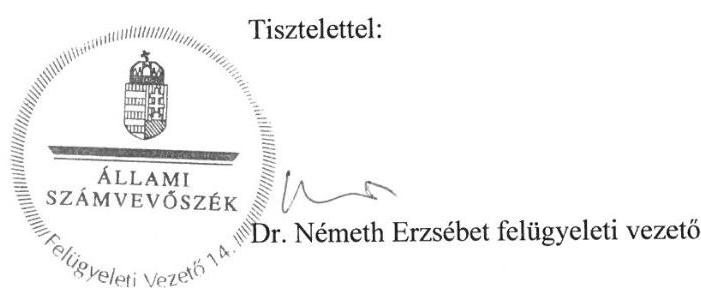

---

URAD DRŽAVNE SLOVENSKE SAMOUPRAVE

URAD DRŽAVNE SLOVENSKE SAMOUPRAVE

ORSZÁGOS SZLOVÉN ÖNKORMÁNYZAT HIVATALA

H- 9985 Gornji Senik, Cerkvena pot 8. /9985 Felsőszölnök, Templom u. 8.
Tel.: 0036 94/534-024
Fax.: 0036 94/534-025
E-mail: samouprava@slovenci.hu
www.slovenci.hu

Domokos László
Elnök Úr
részére
Állami Számvevőszék
1364 Budapest 4. Pf. 54.
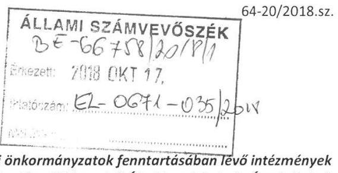

Tárgy: „Az országos nemzetiségi önkormányzatok fenntartásában lévő intézmények gazdálkodásának ellenőrzése - Kossics József Kétnyelvű Általános Iskola és Óvoda" címü jelentéstervezettel kapcsolatos észrevételek Hiv.szám: EL-0671-032/2018

# Tisztelt Elnök Úr! 

A tárgyban jelzett témában és számra hivatkozva az Országos Szlovén Önkormányzat Hivatala nevében a következő észrevételeket teszem, illetve intézkedések történnek és kérem, ennek szíves figyelembe vételét:

Javaslat az Országos Szlovén Önkormányzat Hivatala vezetőjének és a Kossics József Kétnyelvű Általános Iskola és Óvoda Igazgatójának:
„1. Gondoskodjon az Ávr. előírásainak megfelelően a Hivatal és az Iskola közötti, a munkamegosztás és felelősségvállalás rendjét tartalmazó megállapodás (munkamegosztási megállapodás) megkötéséről.” (2.1.sz. megállapítás 2. bekezdése alapján)

A javaslattal egyetértek, az Országos Szlovén Önkormányzat Hivatala intézkedik arról, hogy az Ávr. 9. § (5) bekezdés a) pontjában előírt munkamegosztás és a felelősségvállalás rendjét tartalmazó megállapodás a Hivatal és az Iskola között létrejöjjön.

## Javaslat az Országos Szlovén Önkormányzat Hivatala vezetőjének:

„1. Gondoskodjon arról, hogy a kötelezettségvállalások nyilvántartása tartalmazza az Áhsz. által előírt tartalmi elemeket.” (2.3.sz. megállapítás 2. bekezdése alapján)

A javaslattal nem értek egyet, a kötelezettségvállalások nyilvántartása az Áhsz. 14. melléklet II. 4. d), e), g) és h) pontjában foglalt tartalmi elemeknek megfelelően készül.

---

„2. Tegyen intézkedéseket annak érdekében, hogy a belső ellenőrzési vezető az éves ellenőrzési terveket a Bkr. előírásainak megfelelően küldje meg a Hivatal vezetőjének, valamint vezessen nyilvántartást az elvégzett belső ellenőrzésekről a Bkr. által meghatározott tartalommal.” (2.5. sz. megállapítás 2. bekezdésének 3. mondata és a 3. bekezdés 1. mondata alapján)

A javaslattal egyetértek, az Országos Szlovén Önkormányzat Hivatala intézkedik arról, hogy az országos szlovén nemzetiségi önkormányzat által alapított költségvetési szerv belső ellenőrzési vezetője a tárgyévet követő évre vonatkozó éves ellenőrzési tervét megküldje az Országos Szlovén Önkormányzat Hivatalának vezetője részére minden év október 31-ig, valamint nyilvántartást vezessen az elvégzett belső ellenőrzésekről.
„3. Intézkedjen a Számv. tv. és az Áhsz. előírásainak megfelelően az Iskola feladatellátásához szükséges számviteli politika, pénzkezelési szabályzat és számlarend elkészítéséről.” (3.1. sz. megállapítás 3. bekezdése alapján)

A javaslattal nem értek egyet, az Országos Szlovén Önkormányzat Hivatala rendelkezik az Iskola feladatellátásához szükséges számviteli politikával, pénzkezelési szabályzattal és számlarenddel, azonban az ellenőrzés során az ellenőrzött költségvetési szerv számviteli politikája, pénzkezelési szabályzata és számlarendje került feltöltésre.
„4. Vezessen részletező nyilvántartást az Iskola kötelezettségvállalással terhelt maradványának alátámasztásáról az Áhsz. előírásainak megfelelően.” (3.2. sz. megállapítás 2. bekezdése alapján)

A javaslattal egyetértek, az Országos Szlovén Önkormányzat Hivatala intézkedik arról, hogy a Hivatal az Iskola kötelezettségvállalással terhelt maradványának alátámasztásáról részletező nyilvántartást vezessen.
„5. Gondoskodjon a követelések és a kötelezettségek analitikus nyilvántartásának Áhsz. szerinti vezetéséről.” (4.1. sz. megállapítás 2. bekezdésének 2. mondata alapján)

A javaslattal nem értek egyet, az Országos Szlovén Önkormányzat Hivatala a követelések, valamint a kötelezettségek analitikus nyilvántartását az Áhsz. 14. melléklet II., illetve III. fejezete szerinti tartalommal vezette.

Tisztelt Elnök Úr!
Munkánkhoz nyújtott segítő támogatásukat és javaslataikat tisztelettel köszönöm, a szükséges további intézkedések végrehajtásáról folyamatosan intézkedem.

Felsőszölnök, 2018. október 15.
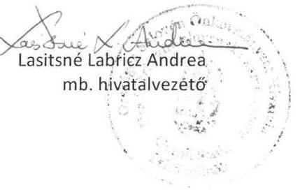

---

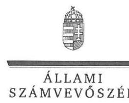

# LASITSné Labricz Andrea asszony 

hivatalvezető

Országos Szlovén Önkormányzat Hivatala

## Felsőszölnök

## Tisztelt Hivatalvezető Asszony!

Köszönettel megkaptam „Az országos nemzetiségi önkormányzatok fenntartásában lévő intézmények gazdálkodásának ellenőrzése - Kossics József Kétnyelvű Általános Iskola és Óvoda" címü jelentéstervezetre tett észrevételét.

Az ellenőrzési megállapításokra vonatkozó észrevételét az Állami Számvevőszékről szóló 2011. évi LXVI. törvény (a továbbiakban: ÁSZ tv.) 29. § (2) bekezdésében meghatározott tizenöt napos határidőn belül küldte meg. Az Állami Számvevőszék észrevétellel kapcsolatos álláspontját a mellékletként csatolt, a felügyeleti vezető által készített tájékoztatás tartalmazza.

Tájékoztatom, hogy az Állami Számvevőszék a figyelembe nem vett észrevételeket az ÁSZ tv. 29. § (3) bekezdésében előírtak szerint köteles a jelentésében feltüntetni és megindokolni, hogy azokat miért nem fogadta el.

Budapest, 2018. november 13.
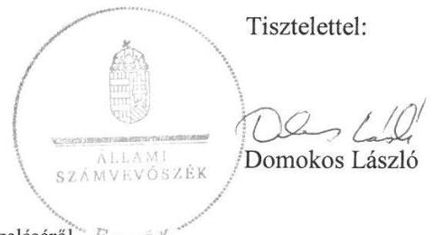

Melléklet: Tájékoztatás az észrevételek kezeléséről ${ }^{2}$ LNO

---

# Tájékoztatás az észrevételek kezeléséről 

„Az országos nemzetiségi önkormányzatok fenntartásában lévő intézmények gazdálkodásának ellenőrzése - Kossics József Kétnyelvű Általános Iskola és Óvoda" című
jelentéstervezetre tett észrevételhez kapcsolódóan
Országos Szlovén Önkormányzat Hivatala
Hivatalvezető asszony jelentéstervezetre tett észrevételeit áttekintettem, annak kezelésével kapcsolatban a következő tájékoztatást adom.
a) Hivatalvezető asszony hat pontban fogalmazta meg észrevételeit, melyek közül három esetben a javaslatokkal egyetértett. Ezért ezen javaslatokat megalapozó, intézkedést igénylő megállapítások (2.1. sz. megállapítás 2. bekezdése, a 2.5. sz. megállapítás 2. bekezdésének 3. mondata és a 3. bekezdés 1. mondata, a 3.2 sz. megállapítás 2. bekezdése) módosítása nem indokolt.
b) A jelentéstervezet 2.3. sz. megállapításának 2. bekezdése szerint a kötelezettségvállalások nyilvántartása nem felelt meg az államháztartás számviteléről szóló 4/2013. (I.11.) Korm. rendelet (Áhsz.) 14. melléklet II. 4. d), e) g) és h) pontjában foglalt tartalmi elemeknek. Hivatalvezető asszony észrevétele szerint a nyilvántartás a jogszabályi előírásoknak megfelelően készül.
Az észrevétel kapcsán az ellenőrzés rendelkezésére álló dokumentumokat ismételten áttekintettük. Az OSZŐ Hivatala által megküldött nyilvántartás (Mintavétel 95.pont 2016.évi kötv.vállalás nyilv.tartása, illetve 9.81.Gazd.ell-hez 2016.évi köt.váll.nyilv.tartás) nem tartalmazza a kötelezettségvállalás, más fizetési kötelezettség tárgyát, összegét (értékét) az egységes rovatrend rovatai szerint, a pénzügyi teljesítési határidőket dátum szerint, a pénzügyi teljesítések dátumát, összegét, egységes rovatrend szerint besorolását, illetve a kötelezettségvállalás, más fizetési kötelezettség végleges vagy nem végleges jellegét. Erre való tekintettel a megállapítás módosítása nem indokolt.
c) A jelentéstervezet 4.1. sz. megállapítása 2. bekezdésének 2. mondata szerint az Iskola a követelések, valamint a kötelezettségek analitikus nyilvántartását nem az Áhsz. 14. melléklet II., illetve III. fejezete szerinti tartalommal vezette. Hivatalvezető asszony észrevétele szerint a Hivatal mindkettő nyilvántartást a jogszabályi előírásoknak megfelelően vezeti.
Az ellenőrzés rendelkezésére álló dokumentumokat ismételten áttekintettük. Az OSZŐ Hivatala által megküldött, kötelezettségvállalásokra vonatkozó nyilvántartás az előző pontban bemutatott indokok miatt nem felelt meg az Áhsz. előírásainak. A követelések nyilvántartása szintén nem felelt meg az Áhsz. előírásainak, mivel nem tartalmazta a követelés tárgyát, összegét az egységes rovatrend rovatai szerint, a teljesítési határidőket dátum szerint, a teljesített befizetések dátumát, összegét, egységes rovatrend szerint besorolását. Erre való tekintettel a megállapítás módosítása nem indokolt.

---

d) A jelentéstervezet 3.1. sz. megállapítás 3 bekezdése szerint az Iskola pénzügyi és gazdálkodási feladatait ellátó Hivatal a számvitelről szóló 2000. évi C. törvény (Számv. tv.) 14. § (3) bekezdésében és az Áhsz. 50. § (1) bekezdés foglaltak ellenére nem alakította ki az Iskola feladatellátásához szükséges számviteli politikáját, a Számv. tv. 14. § (5) bekezdés d) pontjában előírtak ellenére nem készítette el a pénzkezelési szabályzatot, valamint nem készítette el a számlarendet, megsértve a Számv. tv. 161. § (1) bekezdésében foglaltakat. Hivatalvezető asszony észrevételében jelzi, hogy a Hivatal rendelkezik az Iskola feladatellátásához szükséges,
 felsorolt dokumentumokkal.
Az ellenőrzés rendelkezésére álló dokumentumokat ismételten áttekintettük. A Hivatal által megküldött, az Iskolára kiterjedő hatályú „Számviteli politika” megnevezésű dokumentumon nem szerepel a kiadmányozó személy aláírása és az aláírás kelte, emiatt a szabályzat nem tekinthető kiadmányozottnak. A számlarend és a számviteli politika keretein belül elkészítendő pénzkezelési szabályzat nem került megküldésre az ellenőrzés számára.
A fentiekre való tekintettel a megállapítás módosítása nem indokolt.

Az ellenőrzés során feltárt hibák, hiányosságok kijavítására vonatkozó tájékoztatását köszönettel vettük.

Budapest, 2018. november 13.
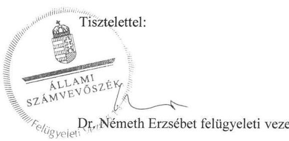

---

# RÖVIDÍTÉSEK JEGYZÉKE 

${ }^{1}$ Iskola
${ }^{2}$ Önkormányzat
${ }^{3}$ Hivatala
${ }^{4}$ ÁSZ tv.
${ }^{5}$ Áht.
${ }^{6}$ Alapító okirat ${ }_{1}$

Alapító okirat ${ }_{2}$
Alapító okirat ${ }_{3}$
${ }^{7}$ Ávr.
${ }^{8}$ Áhsz.
${ }^{9}$ Nkt.
${ }^{10}$ Igazgató
${ }^{11}$ Bkr.
${ }^{12}$ Kötelezettségvállalási szabályzat
${ }^{13}$ Ltv.
${ }^{14}$ Info. tv.
${ }^{15}$ Megbízási szerződés
${ }^{16}$ Számv. tv.
${ }^{17}$ Kbt. ${ }_{2}$
${ }^{18}$ Közbeszerzési Szabályzat
${ }^{19}$ Beszerzések lebonyolításával kapcsolatos eljárásrend
${ }^{20}$ Nvtv.
${ }^{21}$ Eszközök és források értékelési szabályzata
${ }^{22}$ Leltározási és leltárkészítési szabályzat

Kossics József Kétnyelvű Általános Iskola és Óvoda
Országos Szlovén Önkormányzat
Országos Szlovén Önkormányzat Hivatala
az Állami Számvevőszékről szóló 2011. évi LXVI. törvény (hatályos: 2011. július 1-jétől)
az államháztartásról szóló 2011. évi CXCV. törvény (hatályos: 2011. december 31-től)
Kossics József Kétnyelvű Általános Iskola és Óvoda Alapító Okirata (hatályos: 2013. december 4. és 2014. szeptember 9. között)
Kossics József Kétnyelvű Általános Iskola és Óvoda Alapító Okirata (hatályos: 2014. szeptember 10. és 2015. május 3. között)
Kossics József Kétnyelvű Általános Iskola és Óvoda Alapító Okirata (hatályos: 2015. május 4-től)
az államháztartásról szóló törvény végrehajtásáról szóló 368/2011. (XII. 31.) Korm. rendelet
az államháztartás számviteléről szóló 4/2013. (I.11.) Korm. rendelet (hatályos: 2014. január 1-jétől)
a nemzeti köznevelésről szóló 2011. évi CXC. törvény (hatályos: 2012. szeptember 1-jétől)
a Kossics József Kétnyelvű Általános Iskola és Óvoda igazgatója
a költségvetési szervek belső kontrollrendszeréről és belső ellenőrzésről szóló 370/2011. (XII. 31.) Korm. rendelet
Kossics József Kétnyelvű Általános Iskola és Óvoda Szabályzata a pénzgazdálkodással kapcsolatos kötelezettségvállalás, utalványozás, érvényesítés és ellenjegyzés hatásköri rendjéről (hatályos: 2015. március 26-tól)
1995. évi LXVI. törvény a köziratokról, a közlevéltárakról és a magánlevéltári anyag védelméről
2011. évi CXII. törvény az információs önrendelkezési jogról és az információszabadságról (hatályos: 2012. január 1-jétől)
Megbízási keretszerződés belső ellenőri feladatok ellátására
a számvitelről szóló 2000. évi C. törvény (hatályos: 2001. január 1-jétől)
2015. évi CXLIII. törvény a közbeszerzésekről (hatályos: 2015. november 1-jétől)

Az Országos Szlovén Önkormányzat és költségvetési szervei közbeszerzési szabályzata (hatályos: 2016. április 1-jétől)

Az Országos Szlovén Önkormányzat és költségvetési szervei szabályzata a közbeszerzésekről szóló 2015. évi CLXIII. törvény hatálya alá nem tartozó beszerzésekről (hatályos: 2016. április 1-jétől)
a nemzeti vagyonról szóló 2011. évi CXCVI. sz. törvény (hatályos: 2011. december 31-től)
a Kossics József Kétnyelvű Általános Iskola és Óvoda Eszközök és források értékelési szabályzata (hatályos: 2015. március 26-tól)
a Kossics József Kétnyelvű Általános Iskola és Óvoda Leltározási és leltárkészítési szabályzata (hatályos: 2015. március 26-tól)

---

# ÁLLAMI SZÁMVEVŐSZÉK 

1052 Budapest, Apáczai Csere János utca 10.
Levélcím: 1364 Budapest 4. Pf. 54
Telefon: +36 14849100 Telefax: +36 14849200
www.asz.hu
