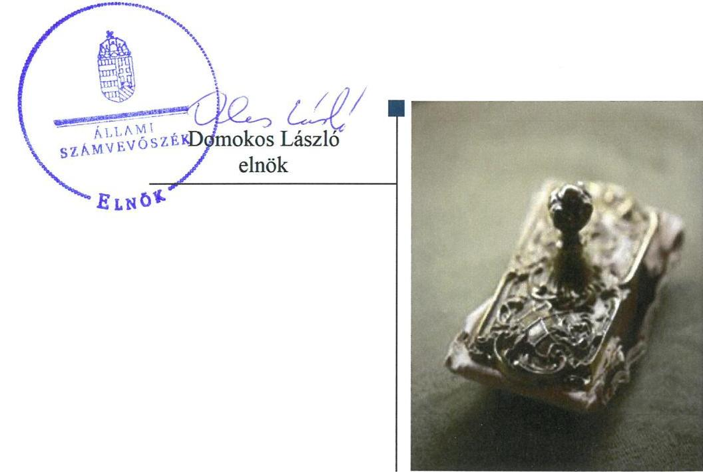
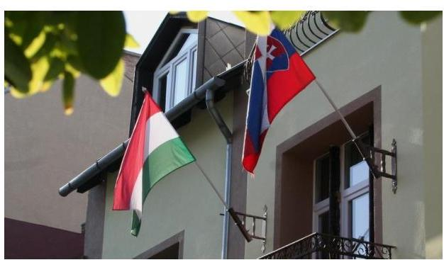
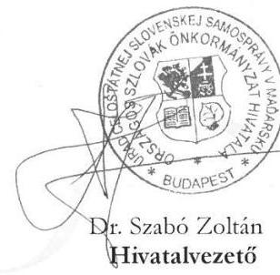
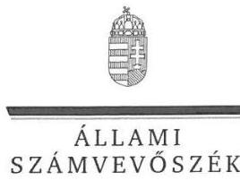
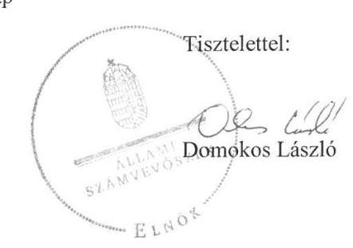
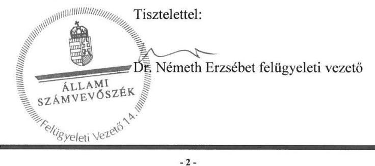

# Jelentés 

## Utóellenőrzések

Az Országos Nemzetiségi Önkormányzatok gazdálkodásának utóellenőrzése - Országos Szlovák Önkormányzat
2018.

---

# Jelentés 

## Utóellenőrzések

Az Országos Nemzetiségi
Önkormányzatok gazdálkodásának utóellenőrzése - Országos Szlovák Önkormányzat
2018. 11. hó 26. nap

---

# AZ ELLENŐRZÉST FELÜGYELTE: 

DR. NÉMETH ERZSÉBET felügyeleti vezető

## AZ ELLENŐRZÉST VEZETTE ÉS A VÉGREHAJTÁSÁÉRT FELELŐS:

DR. KOVÁCS DIÁNA ellenőrzésvezető

## A PROGRAM ÖSSZEÁLLÍTÁSÁÉRT FELELŐS:

TÓTPÁL SZABOLCS osztályvezető

## A TÉMÁHOZ KAPCSOLÓDÓ KORÁBBI SZÁMVEVŐSZÉKI JELENTÉSEK:

- címe: Az Országos Nemzetiségi Önkormányzatok gazdálkodásának ellenőrzéséről - Országos Szlovák Önkormányzat
- sorszáma: 15159

IKTATÓSZÁM: EL-0610-037/2018.
TÉMASZÁM: 2460
ELLENŐRZÉS-AZONOSÍTÓ SZÁM: V080403

---

# TARTALOMJEGYZÉK 

■ ÖSSZEGZÉS ..... 5
■ AZ ELLENŐRZÉS CÉLJA ..... 6
■ AZ ELLENŐRZÉS TERÜLETE ..... 7
■ AZ ELLENŐRZÉS HÁTTERE, INDOKOLTSÁGA ..... 8
■ A JELENTÉS LÉNYEGES KÉRDÉSKÖRE ..... 9
■ AZ ELLENŐRZÉS HATÓKÖRE ÉS MÓDSZEREI ..... 10
■ MEGÁLLAPÍTÁSOK ..... 12
■ MELLÉKLETEK ..... 15
I. sz. melléklet: Az ÁSZ 15159. számú jelentéséhez kapcsolódó intézkedési terv végrehajtása ..... 15
■ FÜGGELÉK: ÉSZREVÉTELEK ..... 21
■ RÖVIDÍTÉSEK JEGYZÉKE ..... 27

---

.

---

# ÖSSZEGZÉS 

Az Országos Szlovák Önkormányzat az intézkedési tervben foglalt feladatok egy részét végrehajtotta, amelynek következtében a múködési és a gazdálkodási folyamatok szabályozottsága javult, azonban a vagyon védelme érdekében további intézkedések szükségesek.

## Az ellenőrzés társadalmi indokoltsága

Az Állami Számvevőszék stratégiájában célul tűzte ki a számvevőszéki munka hasznosulásának javítását. Ezzel összhangban ellenőrzi, hogy az ellenőrzött szervezetek megvalósították-e a korábbi ellenőrzései által feltárt hibák, hiányosságok és szabálytalanságok megszüntetése céljából elkészített intézkedési terveikben foglaltakat. A rendszeres utóellenőrzések hozzájárulnak a szükséges intézkedések tényleges végrehajtáshoz, ezáltal a közpénzügyek rendezettségének javulásához.

## Főbb megállapítások, következtetések

Az Országos Szlovák Önkormányzat az intézkedési tervében meghatározott 26 feladatból határidőre tizenegyet hajtott végre, négy feladat végrehajtására határidőn túl került sor, öt intézkedési tervhez kapcsolódó feladat pedig nem került megvalósításra. Öt feladatot részben hajtott végre az Önkormányzat, egy feladat végrehajtása okafogyottá vált. A Hivatalvezető az ÁSZ javaslatai alapján készített intézkedési terv végrehajtásáról nyilvántartást vezetett.

Az Önkormányzatnál javult a múködési és a gazdálkodási folyamatok szabályozottsága, azonban a pénzügyi és a belső kontrollrendszer szerinti elszámoltathatóság továbbra is kockázatokat hordoz.

A szabályszerű, átlátható és elszámoltatható közpénzfelhasználás biztosítása érdekében az Országos Szlovák Önkormányzat vagyongazdálkodási tevékenységének szabályozottsága és annak múködése területén további intézkedések szükségesek.

---

# AZ ELLENŐRZÉS CÉLJA 

Az ellenőrzés célja annak értékelése volt, hogy a számvevőszéki jelentésben ${ }^{1}$ foglalt intézkedést igénylő megállapításokkal összhangban készített intézkedési tervben meghatározott feladatokat az Országos Szlovák Önkormányzat végrehajtotta-e.

---

# **AZ ELLENŐRZÉS TERÜLETE**

## **Országos Szlovák Önkormányzat**

Az Országos Szlovák Önkormányzat 1995. április 12-én alakult. Az Önkormányzat2 gazdálkodási feladatait a Hivatal3 látta el. Az ellenőrzött időszakban az Önkormányzat elnökének és a Hivatal vezetőjének személyében nem történt változás.

Az ÁSZ 2015. évben ellenőrizte az Önkormányzat gazdálkodását, a belső kontrollrendszer kialakítását és működését, az államháztartásból nyújtott támogatást, illetve az államháztartásból meghatározott célra ingyenesen juttatott vagyon felhasználását a 2010. január 1. és 2014. június 30. közötti időszak tekintetében.

Az erről szóló 15159. számú jelentését az ÁSZ 2015. szeptember 10-én tette közzé. A számvevőszéki jelentésben feltárt szabálytalanságok, működésbeli hiányosságok kiküszöbölése érdekében az Önkormányzat intézkedési tervet készített.

---

# AZ ELLENŐRZÉS HÁTTERE, INDOKOLTSÁGA 

Az ÁSZ tv. ${ }^{4}$ 33. § (1) bekezdése értelmében a számvevőszéki jelentések intézkedést igénylő megállapításaihoz kapcsolódóan az ellenőrzött szervezet vezetője intézkedési tervet köteles összeállítani, és az ÁSZ részére megküldeni.

Az ÁSZ által befogadott intézkedési tervben foglaltak megvalósítását az ÁSZ tv. 33. § (7) bekezdésében foglaltak alapján - az ÁSZ utóellenőrzés keretében ellenőrizheti. Az utóellenőrzések keretében - az intézkedések értékelése során - az Állami Számvevőszék figyelembe veszi az ellenőrzött szervezetek működési feltételeiben, valamint a jogszabályi előírásokban bekövetkezett változásokat.

Az utóellenőrzés során az ÁSZ értékeli, hogy az érintett számvevőszéki jelentésben foglalt intézkedést igénylő megállapításokkal és javaslatokkal összhangban, az ellenőrzött szervezet által készített intézkedési tervben meghatározott feladatokat a feladatra kijelöltek végrehajtották-e.

Az intézkedések végrehajtásával az adott terület szabályszerű múködése vonatkozásában a kockázatok csökkenhetnek, azonban hosszabb távon az intézkedési tervben foglaltak végrehajtásával önmagában nem szűnnek meg, csak akkor, ha beépülnek az ellenőrzött szervezet múködésébe, azokat folyamatosan karban tartják, figyelembe véve, illetve kezelve a változásokat. Emellett az intézkedések végrehajtásáig újabb kockázatok merülhetnek fel a szabályszerű múködés vonatkozásában, amelyek kezelése szintén kiemelten fontos az ellenőrzött szervezet számára.

Az ellenőrzött szervezet vezetője által készített intézkedési tervben foglalt feladatok hiányos, illetve késedelmes végrehajtása, vagy annak elmaradása a szabályszerűség és a felelős vezetői magatartás vonatkozásában kockázatot hordoz, ami azt mutatja, hogy az ellenőrzések során feltárt hibák, hiányosságok és szabálytalanságok kezelése nem kapott kellő hangsúlyt. Az utóellenőrzés során is fennálló szabálytalanságok esetén a közpénz, közvagyon veszélyeztetettségi kockázat valószínűsített hatásának értékelése további intézkedéseket vonhat maga után.

Az ellenőrzött szervezet szintjén az utóellenőrzés feltárja, hogy a szervezet az intézkedések végrehajtásával hasznosította-e a korábbi ellenőrzési jelentésben a hiányosságok megszüntetése, illetve a kockázatok kezelése érdekében megfogalmazott javaslatokat, illetve az intézkedések végrehajtása elmaradásának következtében továbbra is fennálló szabálytalanság esetén értékeli a közpénzek, közvagyon veszélyeztetettségét.

Az ÁSZ szintjén az utóellenőrzés visszacsatolást ad az ellenőrzési jelentések hasznosulásáról, az intézkedések elmaradásának, vagy részleges megvalósulásának a közpénzek, közvagyon veszélyeztetettségére gyakorolt valószínűsített hatásának értékelése, további intézkedéseket vonhat maga után.

---

# A JELENTÉS LÉNYEGES KÉRDÉSKÖRE 

Az Önkormányzat az intézkedési tervben foglaltakat az elöirt határidőben végrehajtotta-e?

---

# AZ ELLENŐRZÉS HATÓKÖRE ÉS MÓDSZEREI 

## Az ellenőrzés típusa

Megfelelőségi ellenőrzés

## Az ellenőrzött időszak

Az utóellenőrzés alapját képező ÁSZ jelentés közzétételének napjától (2015. szeptember 10.) az ellenőrzésről szóló kiértesítő levél keltének napjáig (2018. április 16.) tartó időszak.

## Az ellenőrzés tárgya

A számvevőszéki jelentésben foglalt intézkedést igénylő megállapításokkal és javaslatokkal összhangban az Önkormányzat által készített intézkedési tervben foglaltak végrehajtásának ellenőrzése.

Az ellenőrzés kiterjedt minden olyan körülményre és adatra, amely az ÁSZ jogszabályban meghatározott feladatainak teljesítéséhez, valamint a program végrehajtása folyamán felmerült újabb összefüggések feltárásához szükséges volt.

## Az ellenőrzött szervezet

Országos Szlovák Önkormányzat, Országos Szlovák Önkormányzat Hivatala

## Az ellenőrzés jogalapja

Az ellenőrzés jogszabályi alapját az ÁSZ tv. 33. § (7) bekezdése, illetve a 33. § (1)-(2) és (6) bekezdéseinek előírásai képezték.

## Az ellenőrzés módszerei

Az ÁSZ az ellenőrzést az ellenőrzött időszakban hatályos jogszabályok, az ellenőrzés szakmai szabályai, a jelen ellenőrzésre irányadó ÁSZ módszertanok, az ellenőrzési programban foglalt értékelési szempontok szerint végeztük.

Az ÁSZ az ellenőrzés ideje alatt az Önkormányzattal történő kapcsolattartást az ÁSZ SZMSZ5-ének vonatkozó előírásai alapján biztosította.

---

Az utóellenőrzés megállapításait az ÁSZ rendelkezésére álló dokumentumok, valamint az ÁSZ adatbekérése szerint, az ellenőrzött szervezetek által rendelkezésre bocsátott dokumentumok, adatok alapozták meg.

Az ellenőrzési kérdések megválaszolásához szükséges bizonyítékok megszerzése az ellenőrzött szervezetek által rendelkezésre bocsátott dokumentumokra, adatokra alapozva megfigyelés, valamint elemző eljárás alkalmazásával történt. Az ellenőrzési bizonyítékként felhasználható adatforrások közé tartoztak egyrészt az ellenőrzési program részletes szempontjainál felsorolt adatforrások, másrészt minden - az ellenőrzés folyamán feltárt, az ellenőrzés szempontjából információt tartalmazó - dokumentum.

Az intézkedési tervekben előírt feladatokat azok végrehajthatósága, illetve végrehajtása szempontjából az alábbiak szerint értékel az ÁSZ:
$\longrightarrow$ „határidőben végrehajtott" a feladat, ha a teljesítés dokumentáltan, az intézkedési tervben előírt határidőben és tartalommal megtörtént;
$\longrightarrow$ „határidőn túl végrehajtott" a feladat, ha annak teljesítése az intézkedési tervben meghatározott módon, de az abban előírt határidőn túl történt meg;
$\longrightarrow$ „részben végrehajtott" a feladat, ha annak végrehajtása nem teljes körűen az intézkedési tervben előírt módon történt meg;
$\longrightarrow$ „nem végrehajtott" a feladat, ha a végrehajtás nem történt meg, dokumentumokkal nem igazolt annak teljesítése;
$\longrightarrow$ „okafogyottá vált" a feladat, ha végrehajtására - meghatározott esemény bekövetkezése, továbbá külső körülmény, a működést érintő feltétel változása miatt - már nincs szükség, illetve lehetőség, és egyértelműen megállapítható, hogy az intézkedést szükségessé tevő körülmény a jövőben nem fordulhat elő;
$\longrightarrow$ „nem időszerü" az a feladat, amelynek ellenőrzési időszakon belüli végrehajtására azért nem került (kerülhetett) sor, mert az intézkedés alapjául szolgáló esemény nem következett be, de annak jövőbeni előfordulása lehetséges, a végrehajtása nem volt esedékes, vagy a végrehajtás határideje még nem járt le.
Az ellenőrzés lefolytatásához az ellenőrzött szervezet a tanúsítványok elektronikus kitöltésével, valamint az ÁSZ által kért dokumentumok elektronikus megküldésével szolgáltatott adatokat, amelyek valódiságát és teljes körűségét az ellenőrzött szervezet vezetője által tett teljességi és hitelességi nyilatkozat igazolta. Az így rendelkezésre bocsátott adatok, információk kontrollja az ellenőrzés keretében történt.

---

# MEGÁLLAPÍTÁSOK 

## Az Önkormányzat az intézkedési tervben foglaltakat az előírt határidőben végrehajtotta-e?

Összegző megállapítás

Az Önkormányzat az intézkedési tervben foglalt 26 feladatból 11 feladatot határidőben végrehajtott, 4 feladatot határidőn túl teljesített. Öt feladatot részben hajtott végre, öt feladatot pedig nem hajtott végre. Egy feladat végrehajtása okafogyottá vált.

Az ÁSZ jelentése az Önkormányzat elnöke részére egy feladatot, míg a Hi vatalvezető ${ }^{6}$ részére 16 pontban 25 feladatot határozott meg, amelyek intézkedési tervkészítési kötelezettséget vontak maguk után. Az Önkormányzat az intézkedési tervet elkészítette.

Az intézkedési tervben meghatározott feladatokat, határidőket, felelősöket és a feladatok végrehajtását az I. számú melléklet mutatja be.

A Hivatalvezető az ÁSZ javaslatai alapján készített intézkedési terv végrehajtásáról a Bkr. ${ }^{7} 14 . \S$ (1) bekezdése szerinti nyilvántartást vezette.

Az intézkedési tervben felsorolt feladatok végrehajtásának értékelési kategóriák szerinti megoszlását az 1. ábra szemlélteti:

1. ábra

A feladatok végrehajtásának
értékelési kategóriák szerinti
megoszlása

* Határidőben végrehajtott
* Nem végrehajtott
* Részben végrehajtott
* Határidőn túl végrehajtott
* Okafogyottá vált

Forrás: ÁSZ
A MŰKÖDÉSI ÉS GAZDÁLKODÁSI FOLYAMATOK SZABÁLYOZOTTSÁGA javult az Önkormányzatnál. A Közgyűlés ${ }^{8}$ elfogadta az Önkormányzat SZMSZ-ét, amely tartalmazta a vagyonnyilat-kozat-tételre kötelezettek körét. A Közgyűlés elfogadta a Hivatal SZMSZ-ét.

---

A Hivatal SZMSZ-e és a gazdasági szervezet ügyrendje tartalmazza a gazdasági szervezet vezetője és alkalmazottai feladat- és hatáskörét, a helyettesítésük rendjének, valamint a gazdasági szervezet belső és külső kapcsolattartása szabályait. (1-3.)

A PÉNZÜGYI ELSZÁMOLTAHATÓSÁG továbbra is kockázatokat hordoz. A Hivatalvezető a számviteli elszámolások során a jogszabályi előírások betartását, illetve az elemi költségvetésekben és beszámolókban szereplő adatok költségvetési és a zárszámadási határozatokkal való egyezőségét nem biztosította. (24-25.) A 2016-2018. évi költségvetési és 2015-2016. évi zárszámadás határozat-tervezetek nem teljes körűen tartalmazták a jogszabályokban előírt tartalmi elemeket. (18.) A pénzügyi elszámoltathatóság érdekében az Önkormányzat a szlovákiai banknál vezetett devizaszámlát megszüntette. (11.)

A VAGYONGAZDÁLKODÁS javítása céljából a Hivatalvezető a törzsvagyonba tartozó vagyonelemek besorolását és a kapcsolódó szabályzatok elfogadását végrehajtotta, a vagyongazdálkodási tervet elkészítette. A Hivatalvezető a Leltározási szabályzatot határidőn túl felülvizsgálta, de a leltározás szabályszerű végrehajtása nem történt meg. (14-15., 20.)

# A BELSŐ KONTROLLRENDSZER SZERINTI ELSZÁ- 

MOLTATHATÓSÁG továbbra sem biztosított az Önkormányzatnál, a Hivatalvezető nem intézkedett a gazdálkodási jogkörök Ávr. szerinti gyakorlásának érvényesítéséről, az Info tv. ${ }^{9}$-ben előírt adatok honlapon történő közzétételéről. (21-22.)

---

.

---

# MELLÉKLETEK

I. SZ. MELLÉKLET: AZ ÁSZ 15159. SZÁMÚ JELENTÉSÉHEZ KAPCSOLÓDÓ INTÉZKEDÉSI TERV VÉGREHAJTÁSA

|  ㅁ | Az intézkedési terv alapján elvégzendő feladat | Az intézkedési tervben az Önkormányzat által meghatározott határidő | Az intézkedési tervben megjelölt felelős | A feladat végrehajtása  |
| --- | --- | --- | --- | --- |
|  1. | „OSZÓ SZMSZ módosítása, a vagyonnyilatkozat-tételre kötelezettek körének feltüntetése." | 2015. december 31. | Elnök | A Közgyűlés 2015. november 24-én a 162/2015. (XI.24.) KGY számú határozattal elfogadta az Önkormányzat SZMSZ-t, amely tartalmazta a Vnytv. ${ }^{10} 4 . \S$ a) és d) pontjaiban foglaltaknak megfelelően a vagyonnyilatkozat-tételre kötelezettek körét.  |
|  2. | „OSZÓ Hivatala SZMSZ-ének elkészítése." | 2015. december 31. | Hivatalvezető | A Közgyűlés 2015. november 24-én a 163/2015. (XI.24.) KGY számú határozattal elfogadta a Hivatal SZMSZ-ét.  |
|  3. | „OSZÓ Hivatala SZMSZ-ben kerül szabályozásra." | 2015. december 31. | Hivatalvezető | A Hivatal Közgyűlés által 2015. november 24-én elfogadott SZMSZ-ében és a gazdasági szervezet ügyrendjében az Ávr. 13. § (5) bekezdésében meghatározottaknak megfelelően meghatározásra került a gazdasági szervezet vezetője és alkalmazottai feladat- és hatáskörének, a helyettesítésük rendjének, valamint a gazdasági szervezet belső és külső kapcsolattartásának szabályai.  |
|  4. | „a szabálytalanságok kezelése eljárásrend elkészítése." | 2016. március 15. | Hivatalvezető | Az Önkormányzat a Bkr. 6. § (4) bekezdésben foglaltaknak megfelelően elkészítette a Szabálytalanságok kezelésének eljárásrendjét, ami 2016. március 15-én hatályba lépett.  |
|  5. | „etikai elvárások meghatározása." | 2016. május 31. | Hivatalvezető | A Bkr. 6. § (1) bekezdés c) pontjában meghatározottaknak megfelelően a Hivatalvezető meghatározta a Hivatal Etikai Elvárásait, ami 2016. május 16-án hatályba lépett.  |
|  6. | „ellenőrzési nyomvonal elkészítése." | 2016. március 15. | Hivatalvezető | A Bkr. 6. § (3) bekezdésben meghatározottaknak megfelelően a Hivatalvezető elkészítette a Hivatal Ellenőrzési nyomvonalát, ami 2016. március 11-én hatályba lépett.  |
|  7. | „a Hivatal kockázatkezelési rendszerének kialakítása és müködtetése." | az ellenőrzés időszakát követően, az ASZ jelentés elkészítéséig már megvalósult | Hivatalvezető | A Hivatalvezető intézkedett a Hivatal kockázatkezelési rendszerének kialakításáról és müködtetéséről a Bkr. 7. § (1) bekezdésben előírtaknak megfelelően.  |

---

|  Sorszám | Az intézkedési terv alapján elvégzendő feladat | Az intézkedési tervben az Önkormányzat által meghatározott határidő | Az intézkedési tervben megjelölt felelős | A feladat végrehajtása  |
| --- | --- | --- | --- | --- |
|  8. | „a kötelezően közzéteendő adatok nyilvánosságra hozatalának és megismerésére irányuló igények teljesítési rendjének kialakítása." | 2015. december 31. | Hivatalvezető | A Hivatalvezető kialakította a kötelezően közzéteendő adatok nyilvánosságra hozatalának és megismerésére irányuló igények teljesítési rendjét az Info tv. 30. § (6) és a 35. § (3) bekezdésében, valamint az Ávr. 13. § (2) bekezdés h) pontjában foglalt előírásoknak megfelelően.  |
|  9. | „a Hivatal adatvédelmi és adatbiztonsági szabályzatának elkészítése." | 2016. március 15. | Hivatalvezető | A Hivatalvezető - az Info tv. 24. § (3) bekezdésében foglalt előírásoknak megfelelően - elkészítette a Hivatal adatvédelmi és adatbiztonsági szabályzatát, ami 2016. március 1-jén hatályba lépett.  |
|  10. | „iratkezelési szabályzat kiegészítése, az iratok elküldésének időpontja az iratkezelés során teljes körűen rögzítésre kerül." | 2016. május 31., folyamatos | Hivatalvezető | Az Önkormányzat eleget tett az intézkedési tervben vállalt, az lkr. ${ }^{11}$ 8. § (1)-(2) bekezdései, valamint a 14. § (4) bekezdés, továbbá a Bkr. 8. § (4) bekezdés b) pontjában foglalt előírásoknak. A Hivatalvezető az iratkezelési szabályzatot 2016. május 16. napján kiegészítette, abban meghatározta a dokumentumokhoz és információkhoz való hozzáférésre vonatkozóan a felelősségi köröket és biztosította, hogy az iratok elküldésének időpontja az iratkezelés során teljes körűen rögzítésre kerüljön.  |
|  11. | „a szlovákiai banknál vezetett deviza számla megszüntetése." | 2015. december 31. | Hivatalvezető | Az Önkormányzat a szlovákiai bankszámláját megszüntette, ezzel az Önkormányzat eleget tett az Áht. ${ }^{12}$ 84. § (1) bekezdésében foglaltaknak.  |
|  Határidőn túl végrehajtott feladatok |  |  |  |   |
|  12. | „a számviteli politika és az értékelési szabályzat kiegészítése, | 2015. december 31. | Hivatalvezető | A Hivatalvezető két hónapos késedelemmel, 2016. március 1-jén egészítette ki a Számviteli Politikát, amely megfelelt a Számv. tv. ${ }^{13} 14 .$ § (4) bekezdésében meghatározottaknak.
A Hivatalvezető 2016. január 1-jei hatállyal kiegészítette Értékelési Szabályzatát az Áhsz. ${ }^{14}$ 50. § (2) bekezdés b) pontjában foglaltaknak megfelelően és szintén 2016. január 1-jei hatállyal elkészítette a Reprezentációs kiadások szabályzatát, továbbá 2014. november 2-án az Önköltség-számítási szabályzatát.  |
|   | reprezentációs szabályzat készítése, | 2016. március 15., |  |   |
|   | az önkormányzat és intézményei részére önköltségszámítási szabályzat készítése" | az ellenőrzés időszakát követően, az ASZ jelentés elkészítéséig már megvalósult. |  |   |
|  13. | „a Hivatal tevékenységének, a célok megvalósításának nyomon követését biztosító rendszer kialakítása, működtetése." | 2015. december 31. | Hivatalvezető | A Hivatalvezető határidőn túl intézkedett a Bkr. 3. § e) pontjában előírt, a Hivatal tevékenységének, a célok megvalósításának nyomon követését biztosító rendszer kialakításáról és működtetéséről, ami 2016. március 11-én került kialakításra.  |
|  14. | „a törzsvagyonba tartozó vagyonelemek besorolása, kapcsolódó szabályzatok felülvizsgálata, vagyongazdálkodási terv (közép- és hosszú távú) elkészítése, a vagyon használatának, | 2016. május 31. | Hivatalvezető | Az Önkormányzat a 110/2016. (XI.29.) OSZÖ KGY határozattal hagyta jóvá az Országos Szlovák Önkormányzat Vagyongazdálkodási és Vagyonhasznosítási Szabályzatát,  |

---

|  Sorszám | Az intézkedési terv alapján elvégzendő feladat | Az intézkedési tervben az Önkormányzat által meghatározott határidő | Az intézkedési tervben megjelölt felelős | A feladat végrehajtása  |
| --- | --- | --- | --- | --- |
|   | és hasznosításának szabályainak elkészítése és ezek közgyűlés elé terjesztése" |  |  | mely 2016. november 29-vel lépett hatályba. A szabályzat 1. számú melléklete tartalmazta az Önkormányzat törzsvagyonába tartozó forgalomképtelen vagyonelemeket, a 2. számú melléklet a törzsvagyonba tartozó korlátozottan forgalomképes vagyonelemeket.
Az Önkormányzat a 30/2017 (II.28.) OSZÖ KGY határozattal hagyta jóvá az Országos Szlovák Önkormányzatnak Vagyongazdálkodási tervét.  |
|  15. | „a vagyongazdálkodási szabályzat felülvizsgálata és az abban foglaltak betartása, a Hivatalvezető intézkedik, hogy a vagyonhasznosítási tevékenység során a jogszabályoknak és belső szabályoknak megfelelően az arra jogosult hozzon döntést." | 2016. május 31., folyamatos | Hivatalvezető | Az Önkormányzat a 110/2016. (XI.29.) OSZÖ KGY határozattal hagyta jóvá az Országos Szlovák Önkormányzat Vagyongazdálkodási és Vagyonhasznosítási Szabályzatát, mely 2016. november 29-vel lépett hatályba. Ezt követően a tárgyi eszközök értékesítéséről az előírásoknak megfelelően a Közgyűlés döntött.  |
|   |  | Részben végrehajtott feladatok |  |   |
|  16. | „a belső ellenőrzések nyilvántartásának, valamint a belső ellenőrzési jelentések alapján tett intézkedések nyomon követéséhez szükséges nyilvántartás vezetése." | 2015. december 31. | Hivatalvezető | A Hivatalvezető a belső ellenőrzések nyilvántartásának, valamint a belső ellenőrzési jelentések alapján tett intézkedések nyomon követéséhez szükséges nyilvántartás vezetéséről gondoskodott, azonban a belső ellenőrzések nyilvántartása nem tartalmazta a Bkr. 50. § (2) bekezdés d) pontja szerint az ellenőrzés kezdetének és lezárásának időpontját, az e) pontja szerint az ellenőrzés lefolytatásában részt vett vizsgálatvezető, a belső ellenőr és a szakértő nevét, továbbá az f) pontja szerint a vizsgált időszakot.  |
|  17. | „az önállóan működő költségvetési szervek vezetőinek nyilatkozata az intézményi belső kontrollrendszer minőségének értékeléséről." | az ellenőrzés időszakát követően, az ÁSZ jelentés elkészítéséig már megvalósult. | Hivatalvezető | Az Önkormányzat nyolc, önállón működő költségvetési szervének - a Bkr. 11. § (1) bekezdésben előírtaknak megfelelő - vezetői nyilatkozata a 2015. és 2016. évekre vonatkozóan rendelkezésre állt, azonban a Hivatalvezető nem intézkedett négy, a Hivatalhoz rendelt költségvetési szerv Bkr. 1. sz. melléklet szerinti nyilatkozata elkészítéséről.  |
|  18. | „a Közgyűlés elé terjesztendő költségvetés és zárszámadás határozat-tervezet teljes körűen tartalmazza a jogszabályokban előírt tartalmi elemeket." | 2016. február 15., folyamatos | Hivatalvezető | A Közgyűlés elé terjesztendő 2016-2018. évi költségvetési és 2015-2016. évi zárszámadás határozat-tervezetek részben tartalmazták a jogszabályokban előírt tartalmi elemeket. Az Önkormányzat a 2017-2018. évi költségvetési előterjesztései az Áht. 24. § (4) bekezdés b)-c) pontjaiban foglaltaknak megfelelően tartalmazták a többéves kihatással járó döntések számszerűsítését, valamint a közvetett támogatásokat tartalmazó kimutatást, azonban az Áht. 23. § (2) bekezdés a)-b) pontjában előírtak szerint az Önkormányzat és az általa irányított költségvetési szervek kiadásait,  |

---

|  19. | „a kisebbségpolitikáért felelős miniszter és a Kincstár részére szolgáltatandó adatok határidőben való megküldése" | folyamatos | Hivatalvezető | A kisebbségpolitikáért felelős miniszter részére történő adatszolgáltatást az Ávr. 33. § (2) bekezdése írta elő, ami a 397/2014 (XII.31.) Kormányrendelet 15. §ban foglaltaknak megfelelően 2015. január 1-jétől nem szerepelt az Ávr-ben, így a feladat ezen részének teljesítése okafogyottá vált. Az időközi költségvetési jelentésekről az Ávr. 169. § (3) bekezdése szerinti, valamint a negyedéves mérlegjelentésekről az Ávr. 170. § (2) bekezdése szerinti adatszolgáltatást 2015. és 2016. évben az Önkormányzat nem tette meg. Az Önkormányzat a 2017-2018. évi, a Kincstár felé történő adatszolgáltatási kötelezettségének eleget tett.  |
| --- | --- | --- | --- | --- |
|  20. | „a leltározási szabályzat felülvizsgálata a leltározás szabályszerű végrehajtása érdekében, a vagyonkezelésbe adott eszköz leltározását a vagyonkezelésbe vevő intézmény elvégzi, a Hivatalvezető intézkedik, hogy a leltározást szabályszerűen hajtsák végre." | 2016. május 31., folyamatos | Hivatalvezető | A Hivatal felülvizsgált Leltárkészítési és leltározási szabályzata 2017. március 1-jén hatályba lépett, II.2.1. pontja tartalmazta a vagyonkezelésbe adott eszközökre vonatkozó leltározási szabályokat. A Hivatal az Áhsz. 22. § (2) bekezdés a) pontja szerinti leltározási kötelezettségének, valamint a Leltározási szabályzatban előírtaknak továbbra sem tett eleget, mivel nem a szabályzatban előírt formában történt meg a leltározási jegyzőkönyv elkészítése, a jegyzőkönyvről hiányzik a leltárfelelős aláírása, és a leltározás szabályszerű végrehajtására, valamint a felleltározott eszközök valóságban való megtalálhatóságára vonatkozó nyilatkozat.  |
|   |  |  | Nem végrehajtott feladatok |   |
|  21. | „gazdálkodási jogkörök szabályszerű gyakorlásának érvényesítése." | az ellenőrzés időszakát követően, az ASZ jelentés elkészítéséig már megvalósult. | Hivatalvezető | A Hivatalvezető nem intézkedett a gazdálkodási jogkörök szabályszerű gyakorlásának érvényesítéséről. Az Önkormányzat az Ávr. 57. § (1) bekezdésben a teljesítésigazolásra és az Ávr. 58. § (1) bekezdésében az érvényesítésre vonatkozó előírásokat és az intézkedési tervben vállalt kötelezettségeit nem teljesítette.  |
|  22. | „a jogszabályban előírt adatok honlapon történő közzététele." | 2015. december 31. | Hivatalvezető | A Hivatalvezető nem intézkedett az Info tv. 37. § (1) bekezdésben előírt adatoknak az Önkormányzat honlapján történő közzétételéről.  |
|  23. | „jelenléti ívek alkalmazása minden intézményre vonatkozóan." | 2015. december 31. | Hivatalvezető | Az Önkormányzat és az intézmények alkalmazottai nem vezették a jogszabályban előírt munkaidő nyilvántartásokat, ezáltal az Mt. 134. § (1)-(2) bekezdéseiben foglalt  |

---

|  24. | „az elemi költségvetésben és költségvetési beszámolóban feltüntetett adatok egyezősége biztosított legyen a Közgyűlés által elfogadott költségvetéssel, illetve zárszámadással." | az ellenőrzés időszakát követően, az ÁSZ jelentés elkészítéséig már megvalósult. | Hivatalvezető | nyilvántartási kötelezettségüket az Önkormányzat és az intézményei nem teljesítették.  |
| --- | --- | --- | --- | --- |
|  25. | „a számviteli elszámolások során biztosítjuk a jogszabályi előírások betartását és betartatását." | folyamatos | Hivatalvezető | A Hivatalvezető nem intézkedett, hogy az elemi költségvetésekben és beszámolókban szereplő adatok a költségvetési és a zárszámadási határozatokkal összehasonlíthatóak legyenek. Így az Áht. 87. § (b) pontjában foglaltakat a továbbra sem teljesítette a Hivatal.  |
|   |  |  | Az Önkormányzat továbbra sem tett eleget az Áhsz. 14. § (8) bekezdése és 14. mellékletének II. pontja szerinti nyilvántartási kötelezettségének a szállítók analitikus nyilvántartása vonatkozásában, valamint az Áhsz. 11. § (2) bekezdésében foglalt kimutatási kötelezettségének a szakmai nyilvántartásban nem szereplő képzőművészeti alkotás felhasználói jogának mérlegben való kimutatására vonatkozóan. Az Önkormányzat az Áhsz. 20. § (1) bekezdése szerinti értékelési kötelezettségét nem teljesítette, mert a részesedések esetében nem vizsgálta az értékvesztés elszámolásának szükségességét, azokat nem értékelte, illetve az Áhsz. 18. § (2) bekezdésében leírt értékvesztés elszámolási kötelezettségének sem tett eleget. Az Önkormányzat a követelések Áhsz. 13. § (5) bekezdésének, valamint az Áhsz. 39. § (3) bekezdésének megfelelő részletező nyilvántartás vezetési kötelezettségének sem tett eleget.  |
|   |  |  | **Okafogyotta vált feladat** |   |
|  26. | „a fejezeti kezelésű előirányzatokból kapott önkormányzati és intézményi, illetve médiatámogatások felhasználásával kapcsolatos elkülönített számviteli nyilvántartás vezetése." | 2016. január 1-től folyamatosan. | Hivatalvezető | A javaslatot megalapozó 428/2012. (XII. 29.) Kormányrendeletet15 2016. december 31-én hatályon kívül helyezte a 264/2016. (VIII. 31.) Kormányrendelet16 27. § 2. pontja. A 264/2016. (VIII. 31.) Kormányrendelet nem tartalmaz olyan módosítást, ami az elkülönített nyilvántartást továbbra is előírná, így a feladat végrehajtása okafogyotta vált.  |

*Forrás: ÁSZ által készített táblázat*

---

.

---

# FÜGGELÉK: ÉSZREVÉTELEK 

A jelentéstervezetet a Számvevőszék 15 napos észrevételezésre megküldte az ellenőrzött szervezet vezetőjének az ÁSZ tv. 29. §* (1) bekezdése előírásának megfelelően.

Az Országos Szlovák Önkormányzat Hivatalának hivatalvezetője a jelentéstervezet megállapításaira észrevételt tett.

[^0]
[^0]:    * 29. § (1) Az Állami Számvevőszék az ellenőrzési megállapításait megküldi az ellenőrzött szervezet vezetőjének vagy az általa megbízott személynek, és annak, akinek személyes felelősségét állapította meg.
    (2) Az ellenőrzött szervezet vezetője és a felelősként megjelölt személy az ellenőrzés megállapításaira tizenöt napon belül írásban észrevételt tehet.
    (3) Az Állami Számvevőszék az észrevételre a beérkezésétől számított harminc napon belül írásban válaszol. A figyelembe nem vett észrevételeket köteles a jelentésben feltüntetni, és megindokolni, hogy azokat miért nem fogadta el.

---

Vémelt 5.

Domokos László Állami Számvevőszék elnöke részére

Ikt.sz.: 74-5/2018.
Tárgy: észrevétel számvevőszéki jelentéstervezetre

Állami Számvevőszék
Budapest
Apáczai Cs. J. u. 10.
1052

Tisztelt Elnök Úr!

ÁLLAMI SZÁMVEVŐSZÉK
BE-GEFGG/2018/1
Érkezett: 2018 OKT 17.

Iktalószám: EL-0610-0343-1

Melléklet:

A 2018. szeptember 24-én kelt, EL-0610-033/2018. ikt. számú tájékoztató levelének megfelelően,
ezúton küldjük meg „Az Országos Nemzetiségi Önkormányzatok gazdálkodásának
utóellenőrzése – Országos Szlovák Önkormányzat” címmel készített számvevőszéki
jelentéstervezetre vonatkozó észrevételeinket.

17. ponthoz

A Hivatalvezető intézkedett, hogy valamennyi a Hivatalhoz rendelt önállóan működő
költségvetési szervek vezetője készítsen nyilatkozatot az intézmény belső kontrollrendszer
minőségének értékeléséről. A nyilatkozatok rendelkezésre álltak, de sajnálatos módon
adminisztrációs okból, kettő intézmény esetében a beküldésük nem történt meg az utóellenőrzés
keretében. A hiányolt nyilatkozatokat jelen levelünk mellékleteként küldjük.

18. ponthoz

Az e pontban említett határozatok, illetve előterjesztések dokumentumában szerepelnek a
hiányzó adatok mellékletként, azonban a beküldött anyagokból a határozatok mellékletei
lemaradtak, melyet most pótolunk. Mellékeljük a 2016-2017-2018. évi költségvetések mellékleteit,
illetve a 2015. és 2016. évi zárszámadás mellékleteit, melyekből látható, hogy a jogszabályoknak
megfelelően jártunk el.

24. ponthoz

A 18. ponthoz tartozó mellékletekkel szeretnénk bemutatni azt is, hogy a költségvetések és a
zárszámadási határozatok teljes mértékben összehasonlíthatók, azaz ugyanazokat a kimutatásokat
tartalmazzák, természetesen a zárszámadáskor a szükséges oszlopok (módosított EI, Teljesítés)
kiegészítésével. A 18. ponthoz mellékelteken felül a 2017. évi zárszámadás mellékleteit is
csatoljuk, melyek tartalmazzák a Magyar Államkincstár által elkészített konszolidált beszámolót is,
melyből az is látszik, hogy a KGR-ben szereplő adatok a zárszámadás adatairol megegyeznek.
A 2016. évtől a kincstári adatszolgáltatás Ft-ban történik, azonban a könnyebb áttekinthetőség
érdekében az előterjesztett anyagok ezer Ft-ban készülnek.

19. ponthoz

Az időközi költségvetési jelentések és negyedéves mérlegjelentések minden évben a jogszabály
vagy a Magyar Államkincstár által módosított határidőben kerültek feladásra a KGR-ben,
mellékeljük a 2015-2016. évekre vonatkozó adatszolgáltatási kötelezettség teljesítéséről szóló
dokumentumokat.

E-mail: oszo@slovaci.hu • Web: www.slovaci.hu
Cím: 1114 Budapest, Fadrusz u.11/A • Tel: 36/1/4669463 Fax: 36/1/3864077

22

---

# 21. ponthoz 

A gazdálkodási jogkörök szabályszerű gyakorlásának érvényesítéséről gondoskodtunk, erről nyilatkozatot csatoltunk. Jelen levelünkhoz mellékeljük a gazdálkodási szabályzatot, illetve az anyag sokasága miatt (körülbelül éves szinten csak a banki utalványrendelet kb. 3.000 db ) mintának 1-1 utalvány rendelet másolatát, illetve pénztárbizonylat másolatát.

## 25. ponthoz

A vevők (követelések) és szállítók (kötelezettségek) analitikus nyilvántartása folyamatosan történik. Mivel ez esetben is nagy az anyag mennyisége - 2015-2018. évre vonatkozóan a vevőkről 256 oldal, a szállítókról 1716 oldal -, ezért képernyőképet nyomtattunk ennek igazolására, illetve mintának megküldjük 1-1 partnerre vonatkozóan a kimutatást.

Részesedésünk a SlovakUm Szolgáltató és Ingatlanhasznosító Nonprofit Közhasznú Korlátolt Felelősségű Társaság $100 \%$-os tulajdonából származik, melynek beszámoló tervezetét vizsgáljuk, értékeljük, illetve az OSZÓ Közgyűlése határozattal elfogadja. Mellékeljük a Kft. 2017. évi egyszerűsitett beszámolóját példának (melyben 2016-2017. évre vonatkozóan szerepelnek a releváns adatok, saját tőke, jegyzett tőke), ebből jól látható, hogy értékvesztés elszámolására nem volt szükség.

A szakmai nyilvántartásban 2014. december 15-e óta szerepel a képzőművészeti alkotás (Achim szobor), erről is mellékeljük a szükséges tárgyi eszköz kivonatot.

Budapest, 2018. október 12.

Tisztelettel:

Lfr. Szabó Zoltán
Hivatalvezető

---

# Dr. Szabó Zoltán úr 

hivatalvezető

Országos Szlovák Önkormányzat Hivatala

## Budapest

## Tisztelt Hivatalvezető Úr!

Az „Utóellenörzések - Az Országos Nemzetiségi Önkormányzatok gazdálkodásának utóellenörzése - Országos Szlovák Önkormányzat" című jelentéstervezetre tett észrevételét köszönettel megkaptam.
Az ellenőrzési megállapításokra vonatkozó észrevételét az Állami Számvevőszékről szóló 2011. évi LXVI. törvény (a továbbiakban: ÁSZ tv.) 29. § (2) bekezdésében meghatározott tizenöt napos határidőn belül küldte meg. Az Állami Számvevőszék észrevétellel kapcsolatos álláspontját a mellékletként csatolt, a felügyeleti vezető által készített indokolás tartalmazza.
Tájékoztatom, hogy az Állami Számvevőszék a figyelembe nem vett észrevételeket az ÁSZ tv. 29. § (3) bekezdésében előírtak szerint köteles a jelentésében feltüntetni és megindokolni, hogy azokat miért nem fogadta el.

Budapest, 2018. $\quad \sim 10$ hó 31 nap

---

Az „Utóellenörzések - Az Országos Nemzetiségi Önkormányzatok gazdálkodásának utóellenörzése - Országos Szlovák Önkormányzat" című jelentéstervezethez tett észrevételre adott válasz

# Országos Szlovák Önkormányzat Hivatala 

A számvevőszéki jelentéstervezetre tett észrevételeket áttekintettem, annak kezelésével kapcsolatban a következő tájékoztatást adom.

- A jelentéstervezet 1. számú melléklete 17. pontjához kapcsolódó észrevételében Hivatalvezető úr jelzi, intézkedett, hogy valamennyi a Hivatalhoz rendelt önállóan működő költségvetési szerv vezetője készítsen nyilatkozatot az intézmény belső kontrollrendszer minőségének értékeléséről. A nyilatkozatok rendelkezésre álltak, de sajnálatos módon adminisztrációs okból, kettő intézmény esetében a beküldésük nem történt meg az utóellenőrzés keretében. Észrevételében e nyilatkozatokat pótlólagosan megküldte. Az észrevétel kapcsán áttekintettük az ellenőrzés rendelkezésére bocsátott dokumentumokat. Ennek során megállapítottuk, hogy az adatszolgáltatásra biztosított határidőn belül rendelkezésre bocsátott dokumentumok nem igazolták valamennyi a Hivatalhoz rendelt önállóan müködő költségvetési szerv vezetője nyilatkozatban történő értékelését a költségvetési szerv belső kontrollrendszerének minőségéről.
Az észrevétel mellékleteként megküldött nyilatkozatokat az Állami Számvevőszéknek már nem áll módjában figyelembe venni. A fentiekre való tekintettel a megállapítás módosítása nem indokolt.
- A jelentéstervezet mellékletének 18. pontjához kapcsolódó észrevételében Hivatalvezető úr jelzi, hogy a jelentésben említett határozatok, illetve előterjesztések dokumentumában szerepelnek a hiányzó adatok mellékletként, azonban az adatbekérés során beküldött anyagokból a határozatok mellékletei lemaradtak. Észrevételében a hiányzó mellékleteket megküldte, azonban a pótlólagosan megküldött határozatok és előterjesztések mellékleteit az Állami Számvevőszéknek már nem áll módjában figyelembe venni, ezért a jelentéstervezet kapcsolódó megállapításának módosítása nem indokolt.
- A jelentéstervezet 1. számú melléklete 24. pontjában szereplő megállapításhoz kapcsolódóan Hivatalvezető úr tájékoztat, hogy a pótlólag beküldött 18. ponthoz tartozó mellékletekkel szeretné bemutatni azt is, hogy a költségvetések és a zárszámadási határozatok teljes mértékben összehasonlíthatóak. Csatolta továbbá a 2017. évi zárszámadás mellékleteit is. A pótlólagosan megküldött mellékleteket az Állami Számvevőszéknek már nem áll módjában figyelembe venni, ezért a jelentéstervezet kapcsolódó megállapításának módosítása nem indokolt.
- A jelentéstervezet mellékletének 19. pontjához kapcsolódóan Hivatalvezető úr jelzi, hogy az időközi költségvetési jelentések és negyedéves mérlegjelentések minden évben a jogszabály vagy a Magyar Államkincstár által módosított határidőben kerültek feladásra a KGR-ben. Észrevételéhez mellékelte a 2015-2016. évekre vonatkozó adatszolgáltatási kötelezettség teljesítéséről szóló dokumentumokat (képernyőkép). Az észrevétel kapcsán áttekintettük az ellenőrzés rendelkezésére bocsátott dokumentumokat. Ennek során megállapítottuk, hogy a 2015-2016. évekre vonatkozóan az adatszolgáltatásra biztosított határidőn belül Hivatalvezető úr nem bocsátott rendelkezésre dokumentumokat a vállalt intézkedés teljesítéséről.

---

Az észrevétel mellékleteként megküldött dokumentumokat az Állami Számvevőszéknek már nem áll módjában figyelembe venni. A fentiekre való tekintettel a megállapítás módosítása nem indokolt.

- A jelentéstervezet 1. számú melléklete 21. pontjában szereplő megállapításhoz kapcsolódóan Hivatalvezető úr észrevételében tájékoztat, hogy a gazdálkodási jogkörök gyakorlásának érvényesítéséről gondoskodtak, melyről az ellenőrzéshez nyilatkozatot csatoltak. Észrevételéhez mellékelte a gazdálkodási szabályzatot, illetve az anyag sokasága miatt mintának 1-1 utalvány rendelet másolatát, illetve pénztárbizonylat másolatát.
Az észrevétel kapcsán áttekintettük az ellenőrzés rendelkezésére bocsátott dokumentumokat. Ennek során megállapítottuk, hogy az adatszolgáltatásra biztosított határidőn belül az intézkedés végrehajtásának igazolására Hivatalvezető úr és a Hivatal gazdasági vezetője nyilatkoztak arról, hogy a gazdálkodási jogkörök szabályszerű gyakorlása az Országos Szlovák Önkormányzat Hivatalában érvényesül, azonban egyéb, a szabályszerű működést bizonyító dokumentum nem került az Állami Számvevőszék részére beküldésre. A pótlólagosan megküldött gazdálkodási szabályzatot, aláírás mintákat, valamint utalvány rendelet másolatokat az Állami Számvevőszéknek már nem áll módjában figyelembe venni, ezért a jelentéstervezet kapcsolódó megállapításának módosítása nem indokolt.
- A jelentéstervezet mellékletének 25. pontjához kapcsolódóan Hivatalvezető úr jelzi, hogy a vevők és szállítók analitikus nyilvántartása folyamatosan történik. Az anyag sokasága miatt képernyőképet nyomtattak az elvégzett feladat igazolására, illetve mintának megküldtek 1-1 partnerre vonatkozóan a kimutatást.
Hivatalvezető úr tájékoztat, hogy az önkormányzat részesedése egy kft. 100\%-os tulajdonából származik, melynek beszámoló tervezetét vizsgálják, értékelik, illetve az OSZÖ Közgyűlése határozattal elfogadja. Mellékeli a Kft. 2017. évi egyszerűsített beszámolóját példának, hogy értékvesztés elszámolására nem volt szükség.
Tájékoztat továbbá, hogy a szakmai nyilvántartásban 2014. december 15-e óta szerepel a képzőművészeti alkotás, melyről mellékeli a szükséges tárgyi eszköz kivonatot.
Hivatalvezető úr az 1. sz. tanúsítványban az intézkedési terv alapján elvégzendő feladat folyamatos teljesítéséről nyilatkozott, azonban az adatszolgáltatásra biztosított határidőn belül sem a vevők és szállítók analitikus nyilvántartásának vezetésére, sem az értékvesztés elszámolásának szükségességére, sem a szakmai nyilvántartásban szereplő képzőművészeti alkotás felhasználói jogának mérlegben való kimutatására vonatkozóan nem küldött dokumentumokat. A pótlólagosan megküldött dokumentumokat az Állami Számvevőszéknek már nem áll módjában figyelembe venni, ezért a jelentéstervezet kapcsolódó megállapításának módosítása nem indokolt.

Budapest, 2018. 10. hó 21. nap

---

# RÖVIDÍTÉSEK JEGYZÉKE 

[^0]Jelentés az Országos Nemzetiségi Önkormányzatok gazdálkodásának ellenőrzéséről - Országos Szlovák Önkormányzat (az ÁSZ 15159. számú jelentése) Országos Szlovák Önkormányzat
Országos Szlovák Önkormányzat Hivatala
az Állami Számvevőszékről szóló 2011. évi LXVI. törvény (hatályos: 2011. július 1jétől)
Az Állami Számvevőszék elnökének 4/2017. (XII. 29.) ÁSZ utasítása az Állami Számvevőszék Szervezeti és Múködési Szabályzatáról (hatályos: 2018. január 1jétől)
az Országos Szlovák Önkormányzat Hivatalának vezetője
a költségvetési szervek belső kontrollrendszeréről és belső ellenőrzéséről szóló 370/2011. (XII. 31.) Korm. rendelet (hatályos: 2012. január 1-jétől)
Országos Szlovák Önkormányzat Közgyűlése
2011. évi CXII. törvény - az információs önrendelkezési jogról és az információszabadságról
2007. évi CLII. törvény - egyes vagyonnyilatkozat-tételi kötelezettségekről 335/2005. (XII. 29.) Korm. rendelet - a közfeladatot ellátó szervek iratkezelésének általános követelményeiről
2011. évi CXCV. törvény - az államháztartásról
2000. évi C. törvény - a számvitelről
4/2013. (I. 11.) Korm. rendelet - az államháztartás számviteléről
a nemzetiségi célú előirányzatokból nyújtott támogatások feltétel rendszeréről és elszámolásának rendjéről szóló 428/2012. (XII. 29.) Korm. rendelet (hatályos: 2013. január 1. és 2016. december 31. között)
az államháztartásról szóló törvény végrehajtásáról szóló 368/2011. (XII. 31.) Korm. rendelet és egyes kapcsolódó kormányrendeletek módosításáról szóló 264/2016. (VIII. 31.) Kormányrendelet

[^0]:    ${ }^{1}$ Számvevőszéki jelentés
    ${ }^{2}$ Önkormányzat
    ${ }^{3}$ Hivatal
    ${ }^{4}$ ÁSZ tv.
    ${ }^{5}$ ÁSZ SZMSZ
    ${ }^{6}$ Hivatalvezető
    ${ }^{7}$ Bkr.
    ${ }^{8}$ Közgyűlés
    ${ }^{9}$ Info tv.
    ${ }^{10}$ Vnytv.
    ${ }^{11}$ lkr.
    ${ }^{12}$ Áht.
    ${ }^{13}$ Számv. tv.
    ${ }^{14}$ Áhsz.
    ${ }^{15} 428 / 2012$. (XII. 29.) Kormányrendelet
    ${ }^{16} 264 / 2016$. (VIII. 31.) Kormányrendelet

---

# ÁLLAMI SZÁMVEVŐSZÉK 

1052 Budapest, Apáczai Csere János utca 10.
Levélcím: 1364 Budapest 4. Pf. 54
Telefon: +36 14849100 Telefax: +36 14849200
www.asz.hu