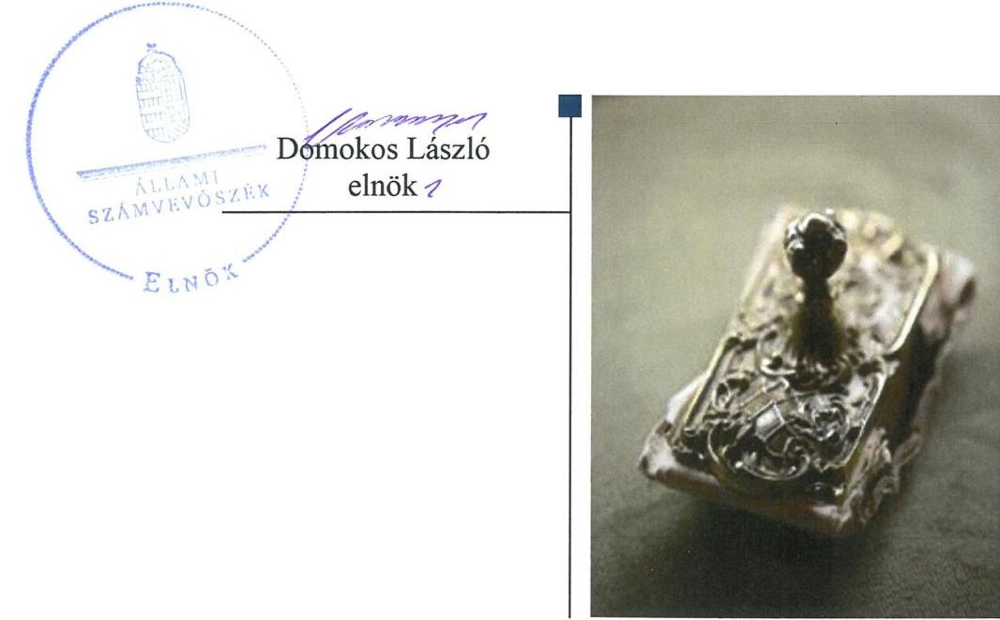

# Jelenetés 

## Önkormányzatok integritás- és belső kontrollrendszere

Az önkormányzatok belső kontrollrendszere kialakításának és múködtetésének ellenőrzése Kiscsécs Község Önkormányzata 2018.

18310
www.asz.hu

---

# Jelentés 

## Önkormányzatok integritás- és belsó kontrollrendszere

Az önkormányzatok belső kontrollrendszere kialakításának és múködtetésének ellenőrzése Kiscsécs Község Önkormányzata
2018. 12. hó 13. nap

---

# AZ ELLENŐRZÉST FELÜGYELTE:

## TÓTH MARIANNA felügyeleti vezető

## AZ ELLENŐRZÉST VEZETTE ÉS A VÉGREHAJTÁSÁÉRT FELELŐS:

### GÁL MAGDOLNA ellenőrzésvezető

## A PROGRAM ÖSSZEÁLLÍTÁSÁÉRT FELELŐS:

### TÓTPÁL SZABOLCS osztályvezető

---

**IKTATÓSZÁM:** EL-1141-005/2018

**TÉMASZÁM:** 2444

**ELLENŐRZÉS-AZONOSÍTÓ SZÁM:** V078921

---

Jelentéseink az Országgyűlés számítógépes hálózatán és az Interneta a www.asz.hu címen is olvashatóak.

---

# TARTALOMJEGYZÉK 

■ ÖSSZEGZÉS ..... 5
■ AZ ELLENŐRZÉS CÉLJA ..... 6
■ AZ ELLENŐRZÉS TERÜLETE ..... 7
■ AZ ELLENŐRZÉS HÁTTERE, INDOKOLTSÁGA ..... 8
■ A JELENTÉS LÉNYEGES KÉRDÉSKÖREI ..... 9
■ AZ ELLENŐRZÉS HATÓKÖRE ÉS MÓDSZEREI ..... 10
■ MEGÁLLAPÍTÁSOK ..... 12
■ JAVASLATOK ..... 13
■ MELLÉKLETEK ..... 15
I. sz. melléklet: Értelmező szótár ..... 15
■ FÜGGELÉK: ÉSZREVÉTELEK ..... 17
■ RÖVIDÍTÉSEK JEGYZÉKE ..... 19

---

.

---

# ÖSSZEGZÉS 

Kiscsécs Község Önkormányzata belső kontrollrendszerének kialakítása és müködtetése nem volt szabályszerű, az nem biztositotta a közpénzfelhasználás szabályosságát és a nemzeti vagyonnal történő felelős gazdálkodást. A belső kontrollrendszer kiépitettsége nem járult hozzá a korrupciós kockázatok kezeléséhez, az integritás szemlélet érvényesitéséhez.

## Az ellenőrzés társadalmi indokoltsága

Az Állami Számvevőszék a stratégiai céljával összhangban,- az Állami Számvevőszékről szóló 2011. évi LXVI. törvény felhatalmazása alapján - végzi a közpénzekkel, az állami és önkormányzati vagyonnal való felelős gazdálkodás, valamint a helyi önkormányzatok számviteli rendje betartásának és belső kontrollrendszere múködésének ellenőrzését. Magyarország Alaptörvénye az önkormányzatoktól is elvárja a kiegyensúlyozott, átlátható és fenntartható költségvetési gazdálkodás elvének érvényesítését, továbbá a nemzeti vagyonnal való rendeltetésszerű és felelős módon való gazdálkodást. Az Állami Számvevőszék stratégiájában az is megfogalmazódott, hogy támogatja az integritás alapú, átlátható és elszámoltatható közpénzfelhasználás megteremtését. Mindezekre tekintettel, a közpénzzel gazdálkodó szervezetek esetében a belső kontrollrendszer megfelelő múködése ellenőrzését prioritásként kezeli az Állami Számvevőszék.

## Főbb megállapítások, következtetések

Kiscsécs Község Önkormányzatánál a belső kontrollrendszer kiépítése nem történt meg. A Kiscsécs Község Önkormányzata gazdálkodási feladatait ellátó Kesznyéteni Közös Önkormányzati Hivatal a szervezetét, feladatai ellátásának részletes belső rendjét és módját megállapító szervezeti és múködési szabályzattal az ellenőrzött időszakban nem rendelkezett, Kiscsécs Község Önkormányzata az ellenőrzött időszakban nem kötött megállapodást a Kiscsécsi Roma Nemzetiségi Önkormányzattal. A jegyző belső szabályzatban nem határozta meg a teljes ellenőrzött időszakot lefedően a gazdálkodás részletes rendjét. A szabályozási hiányosságok miatt a pénzgazdálkodás felelős végrehajtása, a számviteli elszámolások szabályszerűsége, illetve a közpénzekkel való rendeltetésszerű és felelős gazdálkodás nem volt biztosított.

---

# AZ ELLENŐRZÉS CÉLJA 

Az ellenőrzés célja annak megállapítása volt, hogy szabályszerűen történt-e az Önkormányzat ${ }^{1}$ belső kontrollrendszerének kialakítása és múködtetése, az biztosította-e az önkormányzatoknál a közpénzfelhasználás szabályosságát, a közpénzekkel és a nemzeti vagyonnal történő szabályszerű és felelős gazdálkodást, a beszámolási és adatszolgáltatási kötelezettségek szabályszerű teljesítését. Az ellenőrzés keretében értékeltük az Önkormányzat korrupciós kockázatainak kezelését szolgáló integritás kontrollok kiépítettségét és az integritás szemlélet érvényesülését.

---

# AZ ELLENŐRZÉS TERÜLETE 

## Kiscsécs Község Önkormányzata

ködött.

Kiscsécs község az Észak-magyarországi régióban, Borsod-Abaúj-Zemplén megyében, a Tiszaújvárosi járásban található. Lakónépessége a Központi Statisztikai Hivatal Magyarország közigazgatási helynévkönyve alapján, 2017. január 1-jén 202 fő volt.

Az Önkormányzat gazdálkodási feladatait 2013. május 2ától a szervezeti egységekre nem tagolódott Hivatal ${ }^{2}$ látta el.

A polgármester 2014. október 12-től látja el feladatait, tevékenységét négy tagú Képviselő-testület támogatja. A jegyző ${ }^{3}$ 2013. óta tölti be hivatalát. Az Önkormányzat többségi tulajdoni részesedésű (50\% feletti) gazdasági társasággal nem rendelkezett. A településen Roma Nemzetségi Önkormányzat mű-

---

# AZ ELLENŐRZÉS HÁTTERE, INDOKOLTSÁGA 

A demokratikus társadalmakban alapvető igény, hogy a közpénzeket, a közvagyont használók tevékenységükről elszámoljanak, ahhoz egyértelmű és érvényesíthető felelősségi szabályok társuljanak. Ennek a jogos igénynek az érvényesítéséhez meg kell teremteni azokat a folyamatokat, rendszereket, amelyek nélkülözhetetlenek az elszámoltatáshoz. Az elszámoltatás eredményes működtetéséhez szükség van a megfelelő információs, kontroll-, értékelési - és beszámolási rendszerek kialakítására. A belső kontrollok kiépítettsége hozzájárul az integritási szemlélet kialakításához és érvényesüléséhez. A belső kontrollrendszer kialakítása és működtetése nélkül nem valósítható meg a közpénzek, a közvagyon szabályos, gazdaságos, hatékony és eredményes felhasználása.

A belső kontrollrendszer azt a célt szolgálja, hogy az államháztartás szervei működésük és gazdálkodásuk során a tevékenységeket szabályszerűen, gazdaságosan, hatékonyan, eredményesen hajtsák végre, teljesítsék elszámolási kötelezettségeiket és megvédjék az erőforrásokat a veszteségektől, a károktól, a nem rendeltetésszerű használattól. A belső kontrollrendszer magában foglalja mindazon szabályokat, eljárásokat, gyakorlati módszereket és szervezeti struktúrákat, kockázatkezelési technikákat, kontrolltevékenységeket, amelyek segítséget nyújtanak a szervezetnek céljai eléréséhez. A belső kontrollrendszer szabályozása háromszintű, a törvényi előírásokat az Áht. ${ }^{4}$ és a Mötv. ${ }^{5}$, a rendeleti szintű szabályozást az Ávr. ${ }^{6}$ és a Bkr. ${ }^{7}$ tartalmazza, amelyeket útmutatói szinten az NGM ${ }^{8}$ által kiadott standardok és kézikönyvek támogatnak.

A megfelelő belső kontrollrendszer jelentősen csökkenti a hibák és szabálytalanságok kockázatát. Az ÁSZ²Célja, hogy javuljon az ellenőrzött önkormányzatok belső kontrollrendszerének szabályozottsága, működésének megfelelősége, szabályszerűsége, hozzájárulva ezzel az egyensúlyi helyzet fenntarthatóságának biztosításához, biztosítva az önkormányzatnál a közpénzfelhasználás szabályosságát, a közpénzekkel és a nemzeti vagyonnal történő szabályszerű, gazdaságos, hatékony és eredményes gazdálkodást.

Az ellenőrzés várható hasznosulása négy szinten valósul meg. A törvényalkotás számára összegzett tapasztalatok állnak rendelkezésre a belső kontrollrendszer önkormányzati területen való kialakításáról, működtetéséről és hatásairól. Az ellenőrzés az ellenőrzött számára visszajelzést ad a belső kontrollrendszer kialakításában és működésében lévő hiányosságokról, javaslataival hozzájárul azok kiküszöböléséhez. Az ellenőrzés megállapításait és javaslatait más szervezetek is hasznosíthatják a rendezett gazdálkodási keretek kialakításához. A társadalom számára jelzi, hogy közpénz nem maradhat ellenőrizetlenül, az ÁSZ értékteremtő rend kialakításához és megőrzéséhez hozzájáruló tevékenysége pozitív hatással lesz a szervezetről kialakított összkép formálásában.

---

# A JELENTÉS LÉNYEGES KÉRDÉSKÖREI 

1.- Az önkormányzat belső kontrollrendszerének kialakítása és müködtetése szabályszerű volt-e, az biztositotta-e az önkormányzatnál a közpénzfelhasználás szabályosságát, a nemzeti vagyonnal történő felelős gazdálkodást?

---

# AZ ELLENŐRZÉS HATÓKÖRE ÉS MÓDSZEREI 

## Az ellenőrzés típusa

Megfelelőségi ellenőrzés.

## Az ellenőrzött időszak

Az ellenőrzött időszak a 2016. január 1. és december 31. közötti időszak.

## Az ellenőrzés tárgya

A helyi önkormányzatnak, mint éves költségvetési beszámoló készítésére kötelezett szervezetnek és az önkormányzati hivatalának belső kontrollrendszere. Az integritás szemlélet érvényesülése és az integritás kontrollrendszere.

## Az ellenőrzött szervezet

Kiscsécs Község Önkormányzata és a Kesznyéteni Közös Önkormányzati Hivatal

## Az ellenőrzés jogalapja

Az ÁSZ tv. ${ }^{10}$. 1. § (3) bekezdésében foglaltak alapján az ÁSZ általános hatáskörrel végzi a közpénzekkel és az állami és önkormányzati vagyonnal való felelős gazdálkodás ellenőrzését. Az ÁSZ tv. 5. § (2) bekezdése alapján az államháztartás gazdálkodásának ellenőrzése keretében az ÁSZ ellenőrzi a helyi önkormányzatok gazdálkodását, valamint az ÁSZ tv. 5. § (6) bekezdése alapján ellenőrzése során értékeli az államháztartás szám-viteli rendjének betartását és a belső kontrollrendszer múködését.

## Az ellenőrzés módszerei

Az ÁSZ az ellenőrzést az ellenőrzési program ellenőrzési kérdései, az ellenőrzött időszakban hatályos jogszabályok, az ellenőrzés szakmai szabályok és módszertanok figyelembe vételével, valamint a nemzetközi standardokat irányadónak tekintve végezte.

Az ellenőrzés ideje alatt az ellenőrzött szervezettel történő kapcsolattartást az ÁSZ Szervezeti és Múködési Szabályzatának vonatkozó előírásai alapján biztosítottuk.

---

Az ellenőrzési kérdések megválaszolásához szükséges bizonyítékok megszerzése az ellenőrzöttek által rendelkezésre bocsátott dokumentumokra, adatokra alapozva megfigyelés, kérdésfeltevés (információkérés), valamint elemző eljárással történt. Az ellenőrzési bizonyítékként felhasználható adatforrások közé tartoztak egyrészt az ellenőrzési programban felsorolt adatforrások, másrészt az ellenőrzés szempontjából releváns információt tartalmazó dokumentumok.

Amennyiben az önkormányzat múködését és gazdálkodását alapvetően meghatározó dokumentum hiánya miatt, valamely lényeges kérdéskörre vonatkozóan az ÁSZ megállapítást tett, további ellenőrzési tevékenységek az adott kérdéskörrel és az azzal szoros logikai kapcsolatban lévő kérdéskörökkel - ráépülő jelleggel - nem kerültek végrehajtásra.

---

# MEGÁLLAPÍTÁSOK 

## 1. Az önkormányzat belső kontrollrendszerének kialakítása és múködtetése szabályszerű volt-e, az biztosította-e az önkormányzatnál a közpénzfelhasználás szabályosságát, a nemzeti vagyonnal történő felelős gazdálkodást?

Összegző megállapítás

Az Önkormányzat és a Hivatal belső kontrollrendszerének kialakítása nem volt szabályszerű, az nem biztosította a közpénzfelhasználás szabályosságát és a nemzeti vagyonnal történő felelős gazdálkodást.

Az Önkormányzat a Nek. tv. ${ }^{11}$ 80. § (2) bekezdésében előírtak ellenére az ellenőrzött időszakban nem kötött megállapodást a Kiscsécsi Roma Nemzetiségi Önkormányzattal.

Az Önkormányzat gazdálkodási feladatait ellátó Hivatal az Áht. 10. § (5) bekezdésében előírtak ellenére az ellenőrzött időszakban a szervezetét, feladatai ellátásának részletes belső rendjét és módját megállapító szervezeti és múködési szabályzattal nem rendelkezett.

A jegyző a 2016. január 1.-2016. október 26. közötti időszakban belső szabályzatban nem határozta meg az Áht. 10. § (5) bekezdésében előírtak alapján a gazdálkodás részletes rendjét, továbbá az Ávr. 13. § (2) bekezdés a) pontja ellenére belső szabályzatban nem rendezte a kötelezettségvállalás, ellenjegyzés, teljesítés igazolása, érvényesítés, utalványozás gyakorlásának módjával, eljárási és dokumentációs részletszabályaival, valamint az ezeket végző személyek kijelölésének rendjével kapcsolatos belső előírásokat, feltételeket.

---

# JAVASLATOK 

Az ÁSZ tv. 33. § (1) bekezdésében foglaltak értelmében az ellenőrzött szervezet vezetője köteles a jelentésben foglalt megállapításokhoz kapcsolódó intézkedési tervet összeállítani és azt a jelentés kézhezvételétől számított 30 napon belül az ÁSZ részére megküldeni. Amennyiben az ellenőrzött szervezet vezetője nem küldi meg határidőben az intézkedési tervet, vagy továbbra sem elfogadható intézkedési tervet küld, az Állami Számvevőszék elnöke az ÁSZ tv. 33. § (3) bekezdése a) és b) pontjaiban foglaltakat érvényesítheti.

## a polgármesternek

1. Gondoskodjon a Nek. tv. 80. § (2) bekezdésének elöirásainak megfelelően az önkormányzat és a Kiscsécsi Roma Önkormányzat közötti megállapodás megkötéséről.
(1. sz. megállapítás (1) bekezdése alapján)

## a jegyzőnek

1. Gondoskodjon az Áht. 10.§ (5) bekezdésében elöírtaknak megfelelő Szervezeti és Müködési Szabályzat elkészitéséről.
(1. sz. megállapítás (2) bekezdése alapján)

---

.

---

# MELLÉKLETEK 

- I. SZ. MELLÉKLET: ÉRTELMEZŐ SZÓTÁR
helyi önkormányzat
integritás
kontrollkörnyezet
költségvetési szerv vezetője
(Bkr. alkalmazásában)
közös önkormányzati hivatal
önkormányzati hivatal

A helyi önkormányzat jogi személy. Az önkormányzati feladatok ellátását a képvi-selő-testület és szervei biztosítják. A képviselőtestület szervei: a polgármester, a főpolgármester, a megyei közgyűlés elnöke, a képviselő-testület bizottságai, a részönkormányzat testülete, a önkormányzati hivatal, a megyei önkormányzati hivatal, a közös önkormányzati hivatal, a jegyző, továbbá a társulás. A képviselő-testület a feladatkörébe tartozó közszolgáltatások ellátására - jogszabályban meghatározottak szerint - költségvetési szervet, a polgári perrendtartásról szóló törvény szerinti gazdálkodó szervezetet (a továbbiakban: gazdálkodó szervezet), nonprofit szervezetet és egyéb szervezetet (a továbbiakban együtt: intézmény) alapíthat, továbbá szerződést köthet természetes és jogi személlyel vagy jogi személyiséggel nem rendelkező szervezettel. A helyi önkormányzat éves költségvetési beszámolója magába foglalja a helyi önkormányzat - nem költségvetési szerveihez tartozó - feladataihoz kapcsolódó bevételeket és kiadásokat. A helyi önkormányzat összevont (konszolidált) költségvetési beszámolóját a helyi önkormányzatra és költségvetési szerveire vonatkozóan külön-külön beérkezett éves költségvetési beszámolók alapján a Kincstár készíti el és küldi meg az önkormányzatnak. (Forrás: Mötv. 41. § (1), (2), (6) bekezdései; Áhsz. 2. § (1) bekezdése, 6. § (1) bekezdés a) és f) pontja, 30. §-a, 37. § (1) és (6) bekezdése)
Az integritás elvek, értékek, cselekvések, módszerek, intézkedések konzisztenciáját jelenti: olyan magatartásmódot, amely meghatározott értékeknek felel meg. Az integritás a közszféra esetében a társadalom által elvárt nyilvánossági, átláthatósági, illetve jogi/etikai normáknak történő megfelelést jelenti.
(Forrás: a http://integritas.asz.hu honlapon közzétett „A 2012. évi integritás felmérés eredményeinek összefoglalója" című dokumentum 3. oldal 1. bekezdése)
A költségvetési szerv vezetője által kialakított olyan elvek, eljárások, belső szabályzatok összessége, amelyben világos a szervezeti struktúra, egyértelműek a felelősségi, hatásköri viszonyok és feladatok, meghatározottak az etikai elvárások a szervezet minden szintjén, átlátható a humánerőforrás-kezelés. (Forrás: Bkr. 6. § (1) bekezdés)
Helyi önkormányzat esetén a jegyző, főjegyző, társulás esetén a társulási megállapodásban meghatározott önkormányzat jegyzője. (Forrás: Bkr. 2. § n) pont nb) alpont)
települési képviselő-testület más települési képviselő-testülettel társult képviselőtestületet alakíthat, amely esetén a képviselő-testületek részben vagy egészben egyesítik a költségvetésüket, közös önkormányzati hivatalt tartanak fenn és intézményeiket közösen működtetik. (Forrás: Mötv. 56. § (1)-(2) bekezdései)
a polgármesteri hivatal, a főpolgármesteri hivatal, a megyei önkormányzati hivatal és a közös önkormányzati hivatal. (Forrás: Áht. 1. § 18. pont)

---

.

---

# FÜGGELÉK: ÉSZREVÉTELEK 

A jelentéstervezetet a Számvevőszék 15 napos észrevételezésre megküldte az ellenőrzött szervezet vezetőinek az ÁSZ tv. 29. §* (1) bekezdése előírásának megfelelően.

Az ÁSZ a jelentéstervezetet Kiscsécs Község Önkormányzata polgármesterének és jegyzőjének küldte meg. Észrevételt az ellenőrzött szervezet vezetői nem tettek.

[^0]
[^0]:    * 29. § (1) Az Állami Számvevőszék az ellenőrzési megállapításait megküldi az ellenőrzött szervezet vezetőjének vagy az általa megbízott személynek, és annak, akinek személyes felelősségét állapította meg.
    (2) Az ellenőrzött szervezet vezetője és a felelősként megjelölt személy az ellenőrzés megállapításaira tizenöt napon belül írásban észrevételt tehet.
    (3) Az Állami Számvevőszék az észrevételre a beérkezésétől számított harminc napon belül írásban válaszol. A figyelembe nem vett észrevételeket köteles a jelentésben feltüntetni, és megindokolni, hogy azokat miért nem fogadta el.

---

.

---

# RÖVIDÍTÉSEK JEGYZÉKE 

${ }^{1}$ Önkormányzat
${ }^{2}$ Hivatal
${ }^{3}$ jegyző
${ }^{4}$ Áht.
${ }^{5}$ Mötv.
${ }^{6}$ Ávr.
${ }^{7}$ Bkr.
${ }^{8}$ NGM
${ }^{9}$ ÁSZ
${ }^{10}$ ÁSZ tv.
${ }^{11}$ Nek. tv.

Kiscsécs Község Önkormányzata
Kesznyéteni Közös Önkormányzati Hivatal
Kesznyéteni Közös Önkormányzati Hivatal jegyzője
2011. évi CXCV. törvény az államháztartásról
2011. évi CLXXXIX. törvény Magyarország helyi önkormányzatairól 368/2011. (XII. 31.) Korm. rendelet az államháztartásról szóló törvény végrehajtásáról
370/2011. (XII. 31.) Korm. rendelet a költségvetési szervek belső kontrollrendszeréről és belső ellenőrzéséről
Nemzetgazdasági Minisztérium.
Állami Számvevőszék
2011. évi LXVI. törvény az Állami Számvevőszékről
2011. évi CLXXIX. törvény a nemzetiségek jogairól

---

# ÁLLAMI SZÁMVEVŐSZÉK 

1052 Budapest, Apáczai Csere János utca 10.
Levélcím: 1364 Budapest 4. Pf. 54
Telefon: +36 14849100 Telefax: +36 14849200
www.asz.hu