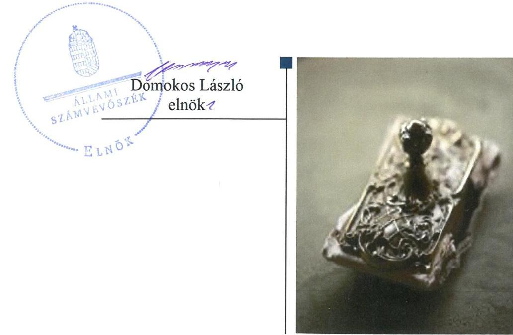

# Jelenetés 

## Önkormányzatok integritás- és belső kontrollrendszere

Az önkormányzatok belső kontrollrendszere kialakításának és működtetésének ellenőrzése Tiszabő Községi Önkormányzat 2018.

18311
www.asz.hu

---

# Jelenetés 

## Önkormányzatok integritás- és belső kontrollrendszere

Az önkormányzatok belső kontrollrendszere kialakításának és működtetésének ellenőrzése Tiszabő Községi Önkormányzat
2018. 12. hó 13. nap

---

# AZ ELLENŐRZÉST FELÜGYELTE:

## TÓTH MARIANNA felügyeleti vezető

## AZ ELLENŐRZÉST VEZETTE ÉS A VÉGREHAJTÁSÁÉRT FELELŐS:

### GÁL MAGDOLNA ellenőrzésvezető

### A PROGRAM ÖSSZEÁLLÍTÁSÁÉRT FELELŐS:

### TÓTPÁL SZABOLCS osztályvezető

---

**IKTATÓSZÁM:** EL-0657-050/2018

**TÉMASZÁM:** 2444

**ELLENŐRZÉS-AZONOSÍTÓ SZÁM:** V078916

---

Jelentéseink az Országgyűlés számítógépes hálózatán és az Interneten a www.asz.hu címen is olvashatóak.

---

# TARTALOMJEGYZÉK 

■ ÖSSZEGZÉS ..... 5
■ AZ ELLENŐRZÉS CÉLJA ..... 6
■ AZ ELLENŐRZÉS TERÜLETE ..... 7
■ AZ ELLENŐRZÉS HÁTTERE, INDOKOLTSÁGA ..... 8
■ A JELENTÉS LÉNYEGES KÉRDÉSKÖREI ..... 9
■ AZ ELLENŐRZÉS HATÓKÖRE ÉS MÓDSZEREI ..... 10
■ MEGÁLLAPÍTÁSOK ..... 12
■ JAVASLATOK ..... 13
■ MELLÉKLETEK ..... 15
I. sz. melléklet: Értelmező szótár ..... 15
■ FÜGGELÉK: ÉSZREVÉTELEK ..... 17
■ RÖVIDÍTÉSEK JEGYZÉKE ..... 19

---

.

---

# ÖSSZEGZÉS 

Tiszabő Községi Önkormányzat belső kontrollrendszerének kialakítása és működtetése nem volt szabályszerű, az nem biztosította a közpénzfelhasználás szabályosságát és a nemzeti vagyonnal történő felelős gazdálkodást. A belső kontrollrendszer kiépítettsége nem járult hozzá a korrupciós kockázatok kezeléséhez, az integritás szemlélet érvényesítéséhez.

## Az ellenőrzés társadalmi indokoltsága

Az Állami Számvevőszék stratégiai céljával összhangban - az Állami Számvevőszékről szóló 2011. évi LXVI. törvény felhatalmazása alapján - végzi a közpénzekkel, az állami és önkormányzati vagyonnal való felelős gazdálkodás, valamint a helyi önkormányzatok számviteli rendje betartásának és belső kontrollrendszere működésének ellenőrzését. Magyarország Alaptörvénye az önkormányzatoktól is elvárja a kiegyensúlyozott, átlátható és fenntartható költségvetési gazdálkodás elvének érvényesítését, továbbá a nemzeti vagyonnal való rendeltetésszerű és felelős módon való gazdálkodást. Az ÁSZ stratégiájában az is megfogalmazódott, hogy támogatja az integritás alapú, átlátható és elszámoltatható közpénzfelhasználás megteremtését. Mindezekre tekintettel, a közpénzzel gazdálkodó szervezetek esetében a belső kontrollrendszer megfelelő működésének ellenőrzését prioritásként kezeli az ÁSZ.

## Főbb megállapítások, következtetések

Tiszabő Községi Önkormányzat nem rendelkezett a teljes ellenőrzött időszakot lefedően a jogszabályban előírt számviteli szabályzatok jelentős részével, a pénzgazdálkodási jogkörök gyakorlására vonatkozó szabályzattal, valamint 2016. október 1-ig nem kötött megállapodást Tiszabő Roma Nemzetiségi Önkormányzattal. A Tiszabő Községi Önkormányzat gazdálkodási feladatait ellátó hivatal a szervezetét, feladatai ellátásának részletes belső rendjét és módját megállapító szervezeti és működési szabályzattal az ellenőrzött időszakban nem rendelkezett. A szabályzatok hiánya miatt a pénzgazdálkodás felelős végrehajtása, a számviteli elszámolások szabályszerűsége, illetve a közpénzekkel való rendeltetésszerű és felelős gazdálkodás nem volt biztosított.

---

# AZ ELLENŐRZÉS CÉLJA

Az ellenőrzés célja annak megállapítása volt, hogy szabályszerűen történt-e az Önkormányzat¹ belső kontrollrendszerének kialakítása és működtetése, az biztosította-e az önkormányzatnál a közpénzfelhasználás szabályosságát, a közpénzekkel és a nemzeti vagyonnal történő szabályszerű és felelős gazdálkodást, a beszámolási és adatszolgáltatási kötelezettségek szabályszerű teljesítését. Az ellenőrzés keretében értékeltük az Önkormányzat korrupciós kockázatainak kezelését szolgáló integritás kontrollok kiépítettségét és az integritás szemlélet érvényesülését.

---

# AZ ELLENŐRZÉS TERÜLETE 

## Tiszabő Községi Önkormányzat

Tiszabő község az Észak-Alföldi régióban, Jász-Nagykun-Szolnok megye Kunhegyesi járásában található, lakónépessége a Központi Statisztikai Hivatal Magyarország közigazgatási helynévkönyve alapján 2017. január 1-jén 2117 fő volt. Tiszabő Községi Önkormányzat hét tagú Képviselő-testületének munkáját az ellenőrzött időszakban két állandó bizottság segítette. A településen Roma Nemzetiségi Önkormányzat működött.

Tiszabő Községi Önkormányzat gazdálkodási feladatait a Tiszabői Polgármesteri Hivatal látta el. Az Önkormányzat gazdasági társaságban részesedéssel nem rendelkezett.

A Tiszabői Polgármesteri Hivatal nem tagolódott szervezeti egységekre, elkülönített gazdasági szervezettel nem rendelkezett, a foglalkoztatott köztisztviselők száma a 2016. év végén kilenc fő volt.

A polgármester a 2014. évi önkormányzati választások óta tölti be tisztségét, a jegyző ${ }^{2}$ személye 2016. évben egy alkalommal változott, a hivatalban lévő jegyző 2017. május 12-től látja el feladatait.

---

# AZ ELLENŐRZÉS HÁTTERE, INDOKOLTSÁGA 

A demokratikus társadalmakban alapvető igény, hogy a közpénzeket, a közvagyont használók tevékenységükről elszámoljanak, ahhoz egyértelmű és érvényesíthető felelősségi szabályok társuljanak. Ennek a jogos igénynek az érvényesítéséhez meg kell teremteni azokat a folyamatokat, rendszereket, amelyek nélkülözhetetlenek az elszámoltatáshoz. Az elszámoltatás eredményes működtetéséhez szükség van a megfelelő információs, kontroll-, értékelési - és beszámolási rendszerek kialakítására. A belső kontrollok kiépítettsége hozzájárul az integritási szemlélet kialakításához és érvényesüléséhez. A belső kontrollrendszer kialakítása és működtetése nélkül nem valósítható meg a közpénzek, a közvagyon szabályos, gazdaságos, hatékony és eredményes felhasználása.

A belső kontrollrendszer azt a célt szolgálja, hogy az államháztartás szervei működésük és gazdálkodásuk során a tevékenységeket szabályszerűen, gazdaságosan, hatékonyan, eredményesen hajtsák végre, teljesítsék elszámolási kötelezettségeiket és megvédjék az erőforrásokat a veszteségektől, a károktól, a nem rendeltetésszerű használattól. A belső kontrollrendszer magában foglalja mindazon szabályokat, eljárásokat, gyakorlati módszereket és szervezeti struktúrákat, kockázatkezelési technikákat, kontrolltevékenységeket, amelyek segítséget nyújtanak a szervezetnek céljai eléréséhez. A belső kontrollrendszer szabályozása háromszintű, a törvényi előírásokat az Áht. ${ }^{3}$ és a Mötv. ${ }^{4}$, a rendeleti szintű szabályozást az Ávr. ${ }^{5}$ és a Bkr. ${ }^{6}$ tartalmazza, amelyeket útmutatói szinten az NGM ${ }^{7}$ által kiadott standardok és kézikönyvek támogatnak.

A megfelelő belső kontrollrendszer jelentősen csökkenti a hibák és szabálytalanságok kockázatát. Az ÁSZ célja, hogy javuljon az ellenőrzött önkormányzatok belső kontrollrendszerének szabályozottsága, működésének megfelelősége, szabályszerűsége, hozzájárulva ezzel az egyensúlyi helyzet fenntarthatóságának biztosításához, biztosítva az önkormányzatnál a közpénzfelhasználás szabályosságát, a közpénzekkel és a nemzeti vagyonnal történő szabályszerű, gazdaságos, hatékony és eredményes gazdálkodást.

Az ellenőrzés várható hasznosulása négy szinten valósul meg. A törvényalkotás számára összegzett tapasztalatok állnak rendelkezésre a belső kontrollrendszer önkormányzati területen való kialakításáról, működtetéséről és hatásairól. Az ellenőrzés az ellenőrzött számára visszajelzést ad a belső kontrollrendszer kialakításában és működésében lévő hiányosságokról, javaslataival hozzájárul azok kiküszöböléséhez. Az ellenőrzés megállapításait és javaslatait más szervezetek is hasznosíthatják a rendezett gazdálkodási keretek kialakításához. A társadalom számára jelzi, hogy közpénz nem maradhat ellenőrizetlenül, az ÁSZ értékteremtő rend kialakításához és megőrzéséhez hozzájáruló tevékenysége pozitív hatással lesz a szervezetről kialakított összkép formálásában.

---

# A JELENTÉS LÉNYEGES KÉRDÉSKÖREI 

1. Az önkormányzat belső kontrollrendszerének kialakítása és működtetése szabályszerű volt-e, az biztosította-e az önkormányzatnál a közpénzfelhasználás szabályosságát, a nemzeti vagyonnal történő felelős gazdálkodást?

---

# AZ ELLENŐRZÉS HATÓKÖRE ÉS MÓDSZEREI 

## Az ellenőrzés típusa

Megfelelőségi ellenőrzés.

## Az ellenőrzött időszak

Az ellenőrzött időszak a 2016. január 1. és december 31. közötti időszak.

## Az ellenőrzés tárgya

A helyi önkormányzatnak, mint éves költségvetési beszámoló készítésére kötelezett szervezetnek és polgármesteri hivatalának belső kontrollrendszere. Az integritás szemlélet érvényesülése, az integritás kontrollrendszere.

## Az ellenőrzött szervezet

Tiszabő Községi Önkormányzat

## Az ellenőrzés jogalapja

Az ÁSZ tv. ${ }^{8}$ 1. § (3) bekezdésében foglaltak alapján az ÁSZ általános hatáskörrel végzi a közpénzekkel és az állami és önkormányzati vagyonnal való felelős gazdálkodás ellenőrzését. Az ÁSZ tv. 5. § (2) bekezdése alapján az államháztartás gazdálkodásának ellenőrzése keretében az ÁSZ ellenőrzi a helyi önkormányzatok gazdálkodását, valamint az ÁSZ tv. 5. § (6) bekezdése alapján ellenőrzése során értékeli az államháztartás számviteli rendjének betartását és a belső kontrollrendszer működését.

## Az ellenőrzés módszerei

Az ÁSZ ${ }^{9}$ az ellenőrzést az ellenőrzési program ellenőrzési kérdései, az ellenőrzött időszakban hatályos jogszabályok, az ellenőrzés szakmai szabályok és módszertanok figyelembe vételével, valamint a nemzetközi standardokat irányadónak tekintve végezte.

Az ellenőrzés ideje alatt az ellenőrzött szervezettel történő kapcsolattartást az ÁSZ Szervezeti és Működési Szabályzatának vonatkozó előírásai alapján biztosítottuk.

---

Az ellenőrzési kérdések megválaszolásához szükséges bizonyítékok megszerzése az ellenőrzöttek által rendelkezésre bocsátott dokumentumokra, adatokra alapozva megfigyelés, kérdésfeltevés (információkérés), valamint elemző eljárással történt. Az ellenőrzési bizonyítékként felhasználható adatforrások közé tartoztak egyrészt az ellenőrzési programban felsorolt adatforrások, másrészt az ellenőrzés szempontjából releváns információt tartalmazó dokumentumok.

Amennyiben az Önkormányzat működését és gazdálkodását alapvetően meghatározó dokumentum hiánya miatt, valamely lényeges kérdéskörre vonatkozóan az ÁSZ megállapítást tett, további ellenőrzési tevékenységek az adott kérdéskörrel és az azzal szoros logikai kapcsolatban lévő kérdéskörökkel - ráépülő jelleggel - nem kerültek végrehajtásra.

---

# MEGÁLLAPÍTÁSOK 

## 1. Az önkormányzat belső kontrollrendszerének kialakítása és működtetése szabályszerű volt-e, az biztosította-e az önkormányzatnál a közpénzfelhasználás szabályosságát, a nemzeti vagyonnal történő felelős gazdálkodást?

Összegző megállapítás

Az Önkormányzat belső kontrollrendszerének kialakítása nem volt szabályszerű, az nem biztosította a közpénzfelhasználás szabályozottságát és a nemzeti vagyonnal történő felelős gazdálkodást.

Az Önkormányzat a Számv.tv. ${ }^{10}$ 14. § (5) bekezdés b) és d) pontjaiban előírtak ellenére 2016. január 1. és 2016. július 1. közötti időszakban eszközök és a források értékelési szabályzatával, 2016. január 1 és május 16. közötti időszakban pedig pénzkezelési szabályzattal nem rendelkezett.

Az Önkormányzat a Nek. tv. ${ }^{11}$ 80. § (2) bekezdéseiben foglaltak ellenére a 2016. január 1. és 2016. október 1. közötti időszakban nem kötött megállapodást a Tiszabő Roma Nemzetiségi Önkormányzattal.

A jegyző a 2016. január 1.-2016. szeptember 20. közötti időszakban az Ávr. 13. § (2) bekezdés a) pontja ellenére belső szabályzatban nem rendezte a kötelezettségvállalás, ellenjegyzés, teljesítés igazolása, érvényesítés, utalványozás gyakorlásának módjával, eljárási és dokumentációs részletszabályaival, valamint az ezeket végző személyek kijelölésének rendjével kapcsolatos belső előírásokat, feltételeket.

Az Önkormányzat gazdálkodási feladatait ellátó hivatal az Áht. 10. § (5) bekezdésében előírtak ellenére az ellenőrzött időszakban nem rendelkezett a szervezetét, feladatai ellátásának részletes belső rendjét és módját megállapító szervezeti és működési szabályzattal.

---

# JAVASLATOK 

Az ÁSZ tv. 33. § (1) bekezdésében foglaltak értelmében az ellenőrzött szervezet vezetője köteles a jelentésben foglalt megállapításokhoz kapcsolódó intézkedési tervet összeállítani és azt a jelentés kézhezvételétől számított 30 napon belül az ÁSZ részére megküldeni. Amennyiben az ellenőrzött szervezet vezetője nem küldi meg határidőben az intézkedési tervet, vagy továbbra sem elfogadható intézkedési tervet küld, az Állami Számvevőszék elnöke az ÁSZ tv. 33. § (3) bekezdés a) és b) pontjaiban foglaltakat érvényesítheti.

## a polgármesternek

1. Intézkedjen az Állami Számvevőszék ellenőrzése során feltárt szabálytalanság tekintetében a munkajogi felelősség tisztázására irányuló eljárás megindításáról, és ennek eredménye ismeretében tegye meg a szükséges intézkedéseket.
(1. sz. megállapítás (4) bekezdése alapján)

## a jegyzőnek

1. Gondoskodjon az Áht. 10.§ (5) bekezdésében előírtaknak megfelelő Szervezeti és Működési Szabályzat elkészítéséről.
(1. sz. megállapítás (4) bekezdése alapján)

---

.

---

# MELLÉKLETEK 

- I. SZ. MELLÉKLET: ÉRTELMEZŐ SZÓTÁR
helyi önkormányzat
integritás
kontrollkörnyezet
költségvetési szerv vezetője
(Bkr. alkalmazásában)

A helyi önkormányzat jogi személy. Az önkormányzati feladatok ellátását a képviselő-testület és szervei biztosítják. A képviselőtestület szervei: a polgármester, a főpolgármester, a megyei közgyűlés elnöke, a képviselő-testület bizottságai, a részönkormányzat testülete, az önkormányzati hivatal, a megyei önkormányzati hivatal, a közös önkormányzati hivatal, a jegyző, továbbá a társulás. A képviselő-testület a feladatkörébe tartozó közszolgáltatások ellátására - jogszabályban meghatározottak szerint - költségvetési szervet, a polgári perrendtartásról szóló törvény szerinti gazdálkodó szervezetet (a továbbiakban: gazdálkodó szervezet), nonprofit szervezetet és egyéb szervezetet (a továbbiakban együtt: intézmény) alapíthat, továbbá szerződést köthet természetes és jogi személlyel vagy jogi személyiséggel nem rendelkező szervezettel. A helyi önkormányzat éves költségvetési beszámolója magába foglalja a helyi önkormányzat - nem költségvetési szerveihez tartozó
 - feladataihoz kapcsolódó bevételeket és kiadásokat. A helyi önkormányzat összevont (konszolidált) költségvetési beszámolóját a helyi önkormányzatra és költségvetési szerveire vonatkozóan külön-külön beérkezett éves költségvetési beszámolók alapján a Kincstár készíti el és küldi meg az önkormányzatnak. (Forrás: Mötv. 41. § (1), (2), (6) bekezdései; Áhsz. 2. § (1) bekezdése, 6. § (1) bekezdés a) és f) pontja, 30. §-a, 37. § (1) és (6) bekezdése)
Az integritás elvek, értékek, cselekvések, módszerek, intézkedések konzisztenciáját jelenti: olyan magatartásmódot, amely meghatározott értékeknek felel meg. Az integritás a közszféra esetében a társadalom által elvárt nyilvánossági, átláthatósági, illetve jogi/etikai normáknak történő megfelelést jelenti.
(Forrás: a http://integritas.asz.hu honlapon közzétett „A 2012. évi integritás felmérés eredményeinek összefoglalója" című dokumentum 3. oldal 1. bekezdése)
A költségvetési szerv vezetője által kialakított olyan elvek, eljárások, belső szabályzatok összessége, amelyben világos a szervezeti struktúra, egyértelműek a felelősségi, hatásköri viszonyok és feladatok, meghatározottak az etikai elvárások a szervezet minden szintjén, átlátható a humánerőforrás-kezelés. (Forrás: Bkr. 6. § (1) bekezdés)
Helyi önkormányzat esetén a jegyző, főjegyző, társulás esetén a társulási megállapodásban meghatározott önkormányzat jegyzője. (Forrás: Bkr. 2. § n) pont nb) alpont)

---

.

---

# FÜGGELÉK: ÉSZREVÉTELEK 

A jelentéstervezetet a Számvevőszék 15 napos észrevételezésre megküldte az ellenőrzött szervezet vezetőinek az ÁSZ tv. 29. § (1) bekezdése előírásának megfelelően.

Az ÁSZ a jelentéstervezetet Tiszabő Községi Önkormányzat polgármesterének és jegyzőjének küldte meg. Észrevételt az ellenőrzött szervezet vezetői nem tettek.

[^0]
[^0]:    * 29. § (1) Az Állami Számvevőszék az ellenőrzési megállapításait megküldi az ellenőrzött szervezet vezetőjének vagy az általa megbízott személynek, és annak, akinek személyes felelősségét állapította meg.
    (2) Az ellenőrzött szervezet vezetője és a felelősként megjelölt személy az ellenőrzés megállapításaira tizenöt napon belül írásban észrevételt tehet.
    (3) Az Állami Számvevőszék az észrevételre a beérkezésétől számított harminc napon belül írásban válaszol. A figyelembe nem vett észrevételeket köteles a jelentésben feltüntetni, és megindokolni, hogy azokat miért nem fogadta el.

---

.

---

# RÖVIDÍTÉSEK JEGYZÉKE 

${ }^{1}$ Önkormányzat
${ }^{2}$ jegyző
${ }^{3}$ Áht.
${ }^{4}$ Mötv.
${ }^{5}$ Ávr.
${ }^{6}$ Bkr.
${ }^{7}$ NGM
${ }^{8}$ ÁSZ tv.
${ }^{9}$ ÁSZ
${ }^{10}$ Számv tv.
${ }^{11}$ Nek. tv.

Tiszabő Községi Önkormányzat és a gazdálkodási feladatait ellátó Tiszabői Polgármesteri Hivatal
Tiszabői Polgármesteri Hivatal jegyzője
2011. évi CXCV. törvény az államháztartásról
2011. évi CLXXXIX. törvény Magyarország helyi önkormányzatairól 368/2011. (XII. 31.) Korm. rendelet az államháztartásról szóló törvény végrehajtásáról
370/2011. (XII. 31.) Korm. rendelet a költségvetési szervek belső kontrollrendszeréről és belső ellenőrzéséről
Nemzetgazdasági Minisztérium.
2011. évi LXVI. törvény az Állami Számvevőszékről

Állami Számvevőszék
2000. évi C. törvény a számvitelről
2011. évi CLXXIX. törvény a nemzetiségek jogairól

---

# ÁLLAMI SZÁMVEVŐSZÉK 

1052 Budapest, Apáczai Csere János utca 10.
Levélcím: 1364 Budapest 4. Pf. 54
Telefon: +36 14849100 Telefax: +36 14849200
www.asz.hu
