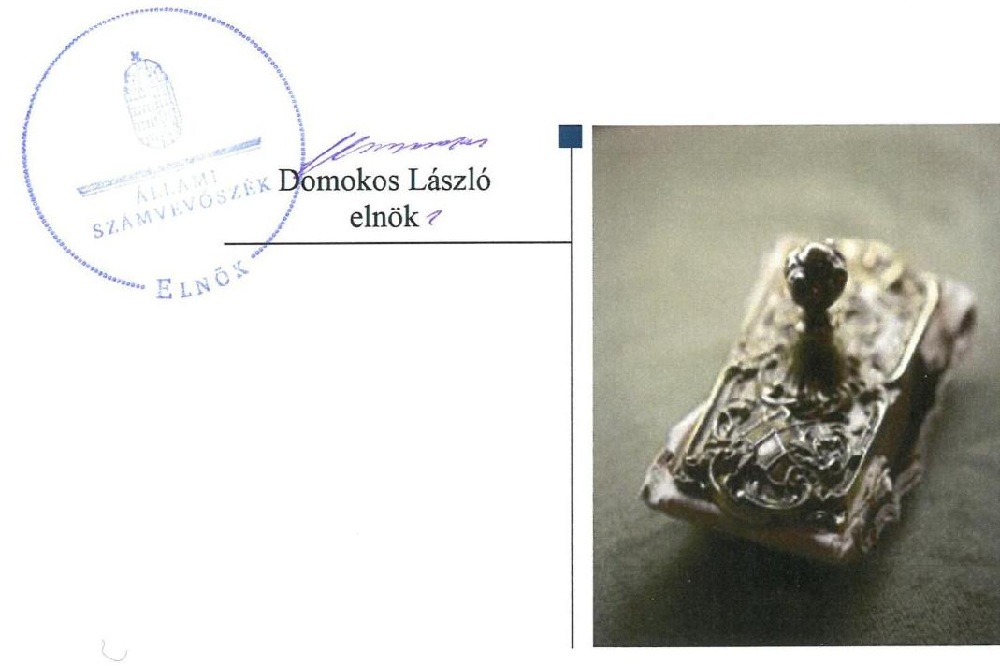
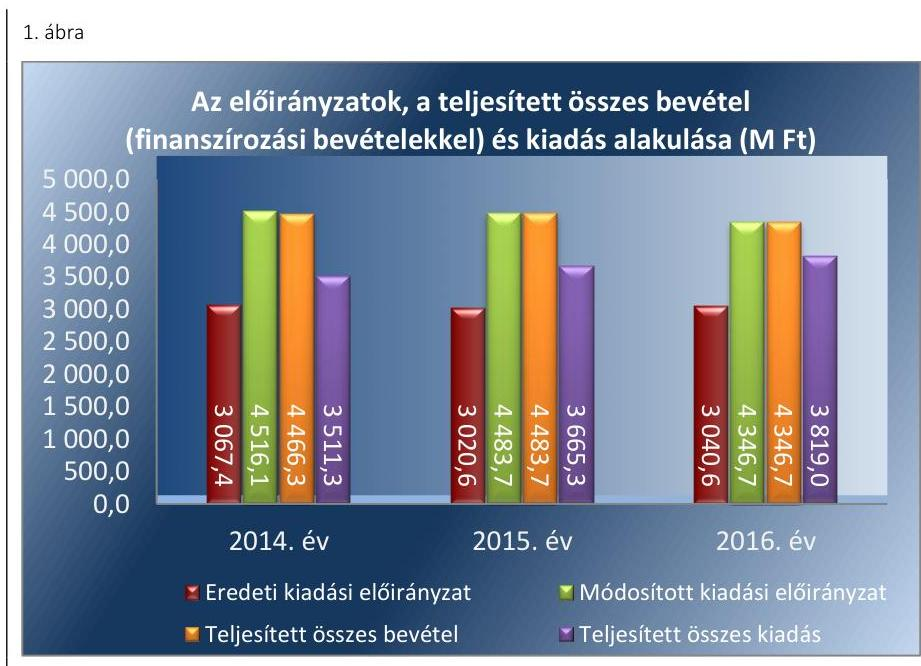
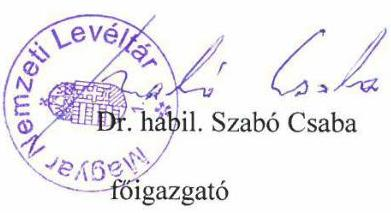
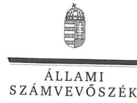
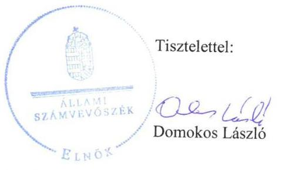
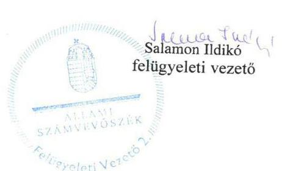

# Jelentés 

## A központi alrendszer intézményei

A központi alrendszer egyes intézményei pénzügyi és vagyongazdálkodásának ellenőrzése - Magyar Nemzeti Levéltár 2018. 12. hó 06. nap

---

# AZ ELLENŐRZÉST FELÜGYELTE:

- **SALAMON ILDIKÓ** felügyeleti vezető

- **AZ ELLENŐRZÉST VEZETTE ÉS A VÉGREHAJTÁSÁÉRT FELELŐS:**
  - **DR. GYŐRI GABRIELLA MÁRTA** ellenőrzésvezető
  - **A PROGRAM ÖSSZEÁLLÍTÁSÁÉRT FELELŐS:**
    - **TÓTPÁL SZABOLCS** osztályvezető

**IKTATÓSZÁM:** EL-0305-021/2018

**TÉMASZÁM:** 2450

**ELLENŐRZÉS-AZONOSÍTÓ SZÁM:** V079110

---

Jelentéseink az Országgyűlés számítógépes hálózatán és az Interneten a www.asz.hu címen is olvashatóak.

---

# TARTALOMJEGYZÉK 

■ ÖSSZEGZÉS ..... 5
■ AZ ELLENŐRZÉS CÉLJA ..... 6
■ AZ ELLENŐRZÉS TERÜLETE ..... 7
■ AZ ELLENŐRZÉS HÁTTERE, INDOKOLTSÁGA ..... 9
■ A JELENTÉS LÉNYEGES KÉRDÉSKÖREI ..... 10
■ AZ ELLENŐRZÉS HATÓKÖRE ÉS MÓDSZEREI ..... 11
■ MEGÁLLAPÍTÁSOK ..... 13
■ JAVASLATOK ..... 19
■ MELLÉKLETEK ..... 23
I. sz. melléklet: Értelmező szótár ..... 23
■ FÜGGELÉKEK ..... 27
I. sz. függelék a Megállapítások fejezethez ..... 27
II. sz. függelék: Észrevételek ..... 28
■ RÖVIDÍTÉSEK JEGYZÉKE ..... 49

---

.

---

# ÖSSZEGZÉS 

A Magyar Nemzeti Levéltár felett az irányító szervi joggyakorlás szabályszerű volt. A belső kontrollrendszer kialakítása és működtetése nem volt szabályszerű, ezáltal nem volt biztosított az átlátható és elszámoltatható közpénz felhasználás. A pénzügyi és vagyongazdálkodás nem volt szabályszerű. Az integritás kontrollrendszer működtetésének hiányosságai miatt az integritás szemlélet nem érvényesült.

## Az ellenőrzés társadalmi indokoltsága

A központi alrendszer részét képező intézmények alapvető rendeltetése a közfeladatok ellátásának biztosítása. A közpénzek felhasználásában meghatározó, központi alrendszerbe tartozó intézmények pénzügyi-, vagyongazdálkodási tevékenységük és feladatellátásuk súlya miatt jelentős hatást gyakorolhatnak a költségvetés egyensúlyának fenntartására. Hatással vannak továbbá az állami vagyonnal való gazdálkodás minőségére, a kormányzati (szak)politikák végrehajtására, illetve közfeladat ellátásuk vonatkozásában az állampolgárok életminőségére, jogaik és kötelezettségeik gyakorlására. Indokolt ezért, hogy az Állami Számvevőszék ezen intézmények pénzügyi és vagyongazdálkodását, az esetleges átalakulások szabályszerűségét rendszeresen ellenőrizze.

A Magyar Nemzeti Levéltárat, amely közfeladatot lát el és jelentős állami vagyont kezel, az Állami Számvevőszék korábban nem ellenőrizte.

## Főbb megállapítások, következtetések, javaslatok

A Magyar Nemzeti Levéltár feletti irányító szervi jogosultságokat (alapítóijogok gyakorlása, egyéb irányítási, felügyeleti jog gyakorlása, munkáltatói joggyakorlás) az Emberi Erőforrások Minisztériuma, mint irányító szerv szabályszerűen gyakorolta.

A belső kontrollrendszer kialakítása és működtetése az ellenőrzött időszakban nem volt szabályszerű. A Magyar Nemzeti Levéltárnál 2016. október 1-jétől az integrált kockázatkezelési rendszer koordinálására nem jelöltek ki szervezeti felelőst. A kontrolltevékenységek gyakorlása az ellenőrzött időszak egészében nem volt szabályszerű. Az ellenőrzött időszakban nem gondoskodtak a belső ellenőrzési tervekben foglaltak teljes körű végrehajtásáról.

A pénzügyi gazdálkodás nem volt szabályszerű. A bevételek beszedése és elszámolása során nem tartották be a jogszabályi- és a belső előírásokat. A kiadási előirányzatok felhasználása során a pénzgazdálkodási jogköröket nem a jogszabályi előírások szerint gyakorolták. A vagyongazdálkodás nem volt szabályszerű, mert a Magyar Nemzeti Levéltár nem rendelkezett az általa használt vagyoni kör egészére kiterjedő hatályú vagyonkezelési szerződéssel. A jogszabály erejénél fogva vagyonkezelésébe került vagyonelemekre vonatkozó - tulajdonosi joggyakorló felé fennálló bejelentési kötelezettségét az ellenőrzött időszak végéig nem teljesítette. A jogszabályi előírás és a belső szabályozásban foglaltak ellenére nem állított össze a mérleg fordulónapján meglévő eszközeit és forrásait mennyiségben és értékben, tételesen, ellenőrizhető módon tartalmazó leltárt.

A jogszabályok által előírt integritást támogató kontrollokat kiépítették, azonban a működtetésben feltárt hiányosságok miatt az integritás szemlélet nem érvényesült.

Az Állami Számvevőszék a Magyar Nemzeti Levéltár főigazgatójának 17 javaslatot tett.

---

# AZ ELLENŐRZÉS CÉLJA 

nyesülését.

Az ellenőrzés célja annak megítélése volt, hogy az ellenőrzött intézményre vonatkozó irányító szervi feladatellátás a jogszabályi előírások betartásával történt-e; az intézménynél a belső kontrollrendszer kialakítása és működtetése szabályszerű volt-e; az intézmény pénzügyi és vagyongazdálkodása megfelelt-e a jogszabályi előírásoknak és belső szabályzatainak; az intézmény átalakításának vagy átszervezésének lebonyolítása szabályszerűen történt-e. Az ellenőrzés keretében értékeltük az intézmény korrupciós kockázatainak kezelését szolgáló integritás kontrollok kiépítettségét és az integritás szemlélet érvé-

---

# AZ ELLENŐRZÉS TERÜLETE 

## Magyar Nemzeti Levéltár

Az MNL ${ }^{1}$ alapítója Magyarország Országgyűlése, irányító szerve az EMMI². Az MNL ellenőrzött időszakban működő szervezete a megyei levéltáraknak a Magyar Országos Levéltárba történő beolvadását követően alakult ki, amely integrációra a 2012. évi LXI. törvény³ és az 1107/2012. (IV. 11.) Korm. határozat ${ }^{4}$ értelmében - 2012. október 1-jei hatállyal került sor. Az MNL-nél az ellenőrzött időszakban az Áht. ${ }^{5}$ 11. §-ában meghatározott átalakulás nem történt.

Az MNL az Ltv. ${ }^{6}$-ben meghatározott közfeladat ellátására létrehozott jogi személy, amely gazdasági szervezettel rendelkezik, és amelyet főigazgató vezet. Az MNL átlagos statisztikai állományi létszáma a 2014. évi 682 főről 2016. évre 802 főre növekedett. A főigazgató és a gazdasági igazgató személye az ellenőrzött időszakban nem változott.

Az MNL által ellátott közfeladat az Ltv. rendelkezésein alapuló levéltári tevékenység. Alaptevékenysége körébe tartozik többek között az iratkezelési szabályzatok kiadásával összefüggő feladatok ellátása, az illetékességi körébe tartozó szervek nem selejtezhető köziratainak átvétele, őrzése, a közfeladatot ellátó szerveknél, illetve az állami gazdasági társaságoknál az irattári selejtezés és iratkezelés ellenőrzése, a maradandó értékű magániratok átvétele, megvásárlása, őrzése, gyűjtése, levéltár-tudományi szakkönyvtár működtetése. Egyéb feladatként nemzetközi kapcsolatokat tart fenn, bel- és külföldi mikrofilm- és kiadványcserét folytat, állományvédelmi és reprográfiai szolgáltatásokat nyújt.

Az MNL gazdálkodással összefüggő feladatait a Gazdasági Igazgatóság látta el, a megyei telephelyek gazdasági ügyintézőinek bevonásával. A megyei levéltárak, - mint telephely szervezeti egységek - éves elkülönített költségvetési előirányzattal, ehhez kapcsolódóan részleges előirányzat felhasználási jogkörrel rendelkeztek. Az MNL gazdálkodását az ellenőrzött időszakban költségvetési felügyelő felügyelte. Az MNL az ellenőrzött időszakban vállalkozási tevékenységet nem végzett.

Az MNL mérleg szerinti vagyona 2014. január 1-jén 9650,3 M Ft volt, ami 2016. december 31-re 9891,5 M Ft-ra nőtt. A 2014-2016. évi éves költségvetési beszámolók adatai alapján a teljesített összes bevétele (finanszírozási bevételekkel együtt) a 2014. évi 4466,3 M Ft-ról 2016-ra 4346,7 M Ft-ra csökkent, a teljesített összes kiadás a 2014. évi 3511,3 M Ft-ról 2016-ra 3819,0 M Ft-ra nőtt.

---

*Forrás: MNL 2014–2016. évi beszámolói*

---

# AZ ELLENŐRZÉS HÁTTERE, INDOKOLTSÁGA 

Az államháztartás központi alrendszerének közpénz felhasználása, az intézmények által ellátott közfeladatok sokrétűsége, valamint a feladatellátásához rendelt vagyon nagyságrendje indokolja, hogy az ÁSZ ${ }^{7}$ ellenőrzéseket folytasson a pénzügyi és vagyongazdálkodás területén. Az ÁSZ az ellenőrzései során feltárja a gazdálkodást, a központi alrendszer intézményei átalakulását, átszervezését érintő szabályozások esetleges hiányosságait, a szabályozással nem érintett gazdálkodási területeket, rámutathat a vagyongazdálkodási tevékenység - ezen belül a tulajdonosi joggyakorlás és vagyonkezelés - esetleges szabálytalanságaira, értékeli az állami vagyon nyilvántartására és elszámolására vonatkozó eljárásokat.

Az ellenőrzés hozzájárul a központi intézmények pénzügyi helyzetének pontosabb megítéléséhez, a jó gyakorlat kialakításán és terjesztésén keresztül az ellenőrzések elősegíthetik a gazdálkodás szabályszerűségének javítását.

---

# A JELENTÉS LÉNYEGES KÉRDÉSKÖREI 

1.     - Az irányító szerv ellenőrzött költségvetési szervre vonatkozó feladatellátása szabályszerű volt-e?
2.     - Az MNL belső kontrollrendszerének kialakítása és működtetése biztosította-e a közpénzekkel és a nemzeti vagyonnal történő átlátható, szabályszerű gazdálkodást?
3.     - Az MNL pénzügyi gazdálkodása szabályszerű volt-e?
4.     - Az MNL vagyongazdálkodása szabályszerű volt-e?
5. Érvényesült-e az integritás szemlélet és ennek megfelelően kiépítették-e az integritás kontrollrendszert az MNL-nél?

---

# AZ ELLENŐRZÉS HATÓKÖRE ÉS MÓDSZEREI 

## Az ellenőrzés típusa

Megfelelőségi ellenőrzés.

## Az ellenőrzött időszak

Az ellenőrzött időszak 2014. január 1-jétől 2016. december 31-ig tartott.

## Az ellenőrzés tárgya

Az MNL-re vonatkozó irányító szervi feladatok ellátása. Az MNL belső kontroll rendszerének kialakítása és működtetése. Az MNL pénzügyi és vagyongazdálkodása. Az MNL-nél az integritáskontrollok kiépítettsége, az integritás szemlélet érvényesülése.

Az ellenőrzés kiterjedt minden olyan körülményre és adatra, amely az ÁSZ jogszabályban meghatározott feladatainak teljesítéséhez, valamint a program végrehajtása folyamán felmerült újabb összefüggések feltárásához szükséges volt.

## Az ellenőrzött szervezet

A Magyar Nemzeti Levéltár és az irányító szervi feladatokat ellátó Emberi Erőforrások Minisztériuma.

## Az ellenőrzés jogalapja

Az ellenőrzés jogszabályi alapját az ÁSZ tv. ${ }^{8}$ 1. § (3) bekezdés, 5. § (2)-(4) és (6) bekezdései, valamint az Áht. 61. § (2) bekezdésének előírásai képezték.

## Az ellenőrzés módszerei

Az ellenőrzést az ÁSZ a szakmai program szempontjai, az ellenőrzött időszakban hatályos jogszabályok, az ellenőrzés szakmai szabályai, a jelen ellenőrzésre irányadó ÁSZ módszertanok figyelembevételével végezte.

Az ellenőrzés ideje alatt az ellenőrzött szervezetekkel történő kapcsolattartást az ÁSZ SZMSZ ${ }^{9}$-ének vonatkozó előírásai alapján biztosította az ÁSZ.

---

Az ellenőrzési kérdések megválaszolásához szükséges bizonyítékok megszerzése az ellenőrzöttek által rendelkezésre bocsátott dokumentumokra, adatokra alapozva, mintavételezés, valamint elemző eljárás útján történt. Az ellenőrzési bizonyítékként felhasználható adatforrások közé tartoztak egyrészt a szakmai program részletes szempontjainál felsorolt adatforrások, másrészt minden egyéb - az ellenőrzés folyamán feltárt, az ellenőrzés szempontjából információt tartalmazó - dokumentum.

Az ellenőrzés lefolytatásához az ellenőrzött szervezetek az ÁSZ által kért dokumentumok megküldésével - valamint az MNL a tanúsítványok kitöltésével - szolgáltattak adatokat.

Az MNL belső kontrollrendszere jogszabályi előírások szerinti kialakítása és működtetése szabályszerűségének értékelése az erre irányuló kérdésekre adott válaszok összesítése alapján, évente pillérenként (kontrollkörnyezet, kockázatkezelési rendszer, kontrolltevékenységek, információs és kommunikációs rendszer, monitoring rendszer) és összesítetten történt. A belső kontrollrendszer egyes pilléreinek kialakítása „szabályszerű", amennyiben az értékelt területen az elért és az elérhető pontok %-ban kifejezett, egész számra kerekített hányadosa meghaladta a 85%-ot, „nem szabályszerű", ha nem érte el a 85%-ot. A kontrollrendszer egésze esetében a „szabályszerű" értékelésnek a %-os értéken felül további feltétele volt, hogy egyik kontrollterület sem kaphatott „nem szabályszerű" értékelést. Az összesített értékelés a %-os értéktől függetlenül „nem szabályszerű" volt, ha az ellenőrzött kontrollterületek közül több mint egynek „nem szabályszerű" volt az értékelése.

Az MNL-nél a bevételek (tárgyi eszközök bérbeadásából) beszedésének szabályszerűsége, valamint a kiadási előirányzatok (külső személyi juttatások, dologi kiadások, felhalmozási kiadások) felhasználása szabályszerűsége mintavételes ellenőrzéssel történt. A bevételek beszedése, valamint a kiadási előirányzatok felhasználása „szabályszerű", ha a minta ellenőrzésének eredménye alapján 95%-os bizonyossággal a teljes sokaságban a hibás tételek aránya kisebb volt, mint 10%, „nem szabályszerű", ha a hibás tételek aránya a 10%-ot meghaladta. Abban az esetben, ha a teljes sokaság tekintetében a 10%-os hibaarányhoz való viszony megítélésének megbízhatósága nem érte el a 95%-ot, annak elérése érdekében az értékelés további szempontokkal egészült ki, a feltárt hibák értéke is figyelembe vételre került.

Az integritás szemlélet érvényesülésének értékelése az MNL ÁSZ Integritási Projektje keretében kitöltött kérdőíve alapján és az ÁSZ ellenőrzés rendelkezésére bocsátott dokumentumok felhasználásával történt.

---

# 1. Az irányító szerv ellenőrzött költségvetési szervre vonatkozó feladatellátása szabályszerű volt-e? 

Összegző megállapítás Az MNL-re vonatkozó irányító szervi feladatellátás szabályszerű volt.

Az ellenőrzött időszakban az alapítói jogosultságot az irányító szerv ${ }^{10}$ szabályszerűen gyakorolta, az Ávr. ${ }^{11}$-nek megfelelő
 tartalmú alapító okirat ${ }_{1-3}{ }^{12}$-at az Áht. előírásai alapján adta ki.

Az egyéb irányítási, felügyeleti és ellenőrzési jogosultságok keretében az ellenőrzött időszakban az irányító szerv meghatározta a költségvetés tervezése során érvényesítendő iránymutatásokat, az Ávr. alapján jóváhagyta az MNL elemi költségvetéseit, az Áhsz. ${ }^{13}$ alapján jóváhagyta az MNL éves költségvetési beszámolóit.

A munkáltatói jogokat az irányító szerv az Áht.-ban és a Kjt. ${ }^{14}$-ben foglaltaknak megfelelően, szabályszerűen gyakorolta.

## 2. Az MNL belső kontrollrendszerének kialakítása és működtetése biztosította-e a közpénzekkel és a nemzeti vagyonnal történő átlátható, szabályszerű gazdálkodást?

Összegző megállapítás Az MNL belső kontrollrendszerének kialakítása és működtetése nem biztosította a közpénzekkel és a nemzeti vagyonnal történő átlátható és szabályszerű gazdálkodást.
2.1. számú megállapítás

A kontrollkörnyezet kialakítása szabályszerű volt.
Az MNL az ellenőrzött időszakban rendelkezett az irányító szerv által jóváhagyott, Ávr.-nek megfelelő tartalmú SZMSZ ${ }_{1-4}{ }^{15}$-gyel. Az MNL az Ávr. rendelkezéseinek megfelelő Ügyrend ${ }_{1-2}{ }^{16}$-ben szabályozta a gazdasági szervezet és az alkalmazottak feladatait, a munkafolyamatok leírását, a kapcsolattartást és a helyettesítés rendjét.

A gazdálkodás részletes rendjét Kötelezettségvállalási szabályzat ${ }_{1-3}{ }^{17}$-ban szabályozták. A Kötelezettségvállalási szabályzat ${ }_{2}$ 2014. június 1-jétől a pénzügyi ellenjegyzésre jogosult kijelölésére, a Kötelezettségvállalási szabályzat ${ }_{3}$ 2015. június 17-től a pénzügyi ellenjegyzésre jogosultak és érvényesítők kijelölésére - a gazdasági vezető helyett - a főigazgatót hatalmazta fel az Ávr. 55. § (2) bekezdés a) pontjában és az Ávr. 58. § (4) bekezdésében előírtak ellenére.

Az MNL a Számv. tv. ${ }^{18}$ és az Áhsz. követelményeinek megfelelően elkészítette a Számviteli politika ${ }_{1-3}{ }^{19}$-at, a Számlarend ${ }_{1-2}{ }^{20}$-at, a Leltározási szabályzat ${ }_{1-3}{ }^{21}$-at, Értékelési szabályzat ${ }_{1-2}{ }^{22}$-t és Pénzkezelési szabályzat ${ }_{1-2}{ }^{23}$-t.

---

Az Ávr. előírásainak megfelelően belső szabályzatban rögzítették a belföldi és a külföldi kiküldetések rendjét ${ }_{1,2}{ }^{24}$, a reprezentációs kiadások szabályait ${ }^{25}$, a gépjármű igénybevételének szabályait ${ }^{26}$, továbbá a vezetékes és a mobiltelefonok használatának rendjéről ${ }_{1,2}{ }^{27}$ szóló szabályokat. Az MNL rendelkezett a Kbt. ${ }_{1,2}{ }^{28}$ előírásainak megfelelő Közbeszerzési szabályzat${ }_{1,2}{ }^{29}$-vel, valamint a Kbt. ${ }_{1,2}$ hatálya alá nem tartozó beszerzések lebonyolításával kapcsolatos eljárásrend${ }_{1-3}{ }^{30}$-mal. Az etikai elvárásokat az MNL-nél a Bkr. ${ }^{31}$-ben foglaltaknak megfelelően határozták meg a Szakmai Etikai Kódex${ }^{32}$-ben.

Az MNL ellenőrzési nyomvonalát ${ }^{33}$, szabálytalanságok kezelésének eljárásrendjét ${ }^{34}$ és a szervezeti integritást sértő események kezelésének eljárásrendjét ${ }^{35}$ a főigazgató a Bkr. előírásainak megfelelően kiadta.

# 2.2. számú megállapítás 

A kockázatkezelési rendszer kialakítása és működtetése 2016. évben nem volt szabályszerű.

Az MNL a kockázatkezelési rendszer működtetésének feltételeit 2014. január 1-je és 2016. szeptember 30-a között a Bkr. alapján megteremtette. A Kockázatkezelési szabályzat ${ }^{36}$ a Bkr.-ben előírtaknak megfelelően tartalmazta a kockázatok azonosításának, elemzésének, értékelésének, csoportosításának módját, a kockázati kitettség mérséklésének módszerét, valamint a kockázat kezelése érdekében szükséges intézkedések nyomon követésének rendjét. A Bkr. - 2016. október 1-jétől hatályos módosított 6. § (4) bekezdésében foglaltak ellenére az MNL főigazgatója nem szabályozta az integrált kockázatkezelés eljárásrendjét.

A Bkr. - 2016. október 1-jétől hatályos módosított - 7. § (2) bekezdésében foglaltak ellenére az MNL nem mérte fel a szervezet tevékenységében rejlő és szervezeti célokkal összefüggő kockázatokat, továbbá nem határozta meg az ezekkel kapcsolatban szükséges intézkedéseket. Az MNL főigazgatója a Bkr. - 2016. október 1-jétől hatályos - 7. § (4) bekezdésében foglaltak ellenére nem jelölt ki az integrált kockázatkezelési rendszer koordinálására szervezeti felelőst.

### 2.3. számú megállapítás

A kontrolltevékenységek gyakorlása nem volt szabályszerű.
A gazdálkodási jogkörök gyakorlóinak aláírás mintáit tartalmazó naprakész nyilvántartás vezetéséről 2014. évben és 2015. első félévében - az Ávr. 60. § (3) bekezdésében foglaltak ellenére - az MNL nem gondoskodott. Az Ávr. 55. § (2) bekezdés a) pontjában foglaltak ellenére a pénzügyi ellenjegyzésre jogosult személyeket, valamint az Ávr. 58. § (4) bekezdésében előírtak ellenére az érvényesítésre jogosult személyeket az ellenőrzött időszakban a gazdasági igazgató helyett a főigazgató jelölte ki.

A kötelezettségvállalások nyilvántartása a 2014-2016. években nem felelt meg az Áhsz. 14. melléklet II. 4. a)-b) és e)-h) pontjaiban foglalt tartalmi előírásoknak. A nyilvántartás nem tartalmazta a kötelezettségvállalás keltét, illetve a pénzügyi ellenjegyzésre vonatkozó adatokat; a kötelezettségvállalást tanúsító dokumentum keltét; a pénzügyi teljesítési határidőket dátum szerint; a kötelezettségvállalás módosulásaihoz kapcsolódóan az azokat tanúsító dokumentum megnevezését, iktatószámát, keltét, a pénzügyi ellenjegyzésre vonatkozó adatokat; a pénzügyi teljesítések dátumát, illetve az utalványozás Ávr. 59. § (2) bekezdése szerinti dokumentumának

---

azonosításához szükséges adatokat; a kötelezettség végleges vagy nem végleges jellegét.

A bevételi és kiadási előirányzatok teljesítése során a kontrolltevékenységek gyakorlása nem volt szabályszerű. A kontrolltevékenységek gyakorlása során feltárt hiányosságokat részletesen a 3. pont tartalmazza.

### 2.4. számú megállapítás

Az információs és kommunikációs folyamatok kialakítása és működtetése szabályszerű volt.

Az MNL főigazgatója az ellenőrzött időszakban kialakította és működtette a Bkr. előírásai alapján a szervezet információs rendszerét. Az MNL - az Info tv. ${ }^{37}$ és az Ávr. rendelkezései alapján - Közzétételi szabályzatban ${ }^{38}$ határozta meg a kötelezően közzéteendő adatok nyilvánosságra hozatalának rendjét. Az MNL Adatvédelmi szabályzatban ${ }^{39}$, valamint Informatikai és adatbiztonsági szabályzatban ${ }^{40}$ írta elő az Info tv. rendelkezéseinek eleget téve az adatok védelmével, megőrzésével kapcsolatos feladatokat, a felelősségi- és jogosultsági szabályokat.

Az MNL az Ávr.-ben és az Info tv.-ben előírt közzétételi kötelezettséget teljesítette.
2.5. számú megállapítás

Az MNL tevékenységének, a célok megvalósításának folyamatos és eseti nyomon követését biztosító rendszert kialakították és működtették. A belső ellenőrzés kialakítása és működtetése az ellenőrzött időszakban nem volt szabályszerű.

Az MNL a Bkr.-ben foglaltak alapján kialakította és működtette a szervezet tevékenységének, a célok megvalósításának nyomon követését biztosító rendszert.

A Bkr. 15. § (5) bekezdésében foglaltak ellenére 2014. január 1-je és 2014. augusztus 30. között az MNL-nél nem volt közalkalmazotti jogviszonyban foglalkoztatott belső ellenőr, a feladatokat külső szolgáltató bevonásával látták el. Az MNL az ellenőrzött időszakban rendelkezett a Bkr. alapján elkészített és felülvizsgált belső ellenőrzési kézikönyv ${ }_{1-3}{ }^{41}$-mal. A Bkr. előírásainak megfelelően elkészítették az éves ellenőrzési terveket, azonban az abban foglaltak teljes körű végrehajtásáról - a Bkr. 22. § (1) bekezdés b) pontjában foglaltak ellenére - az ellenőrzött időszak egyik évében sem gondoskodtak.

Az elvégzett ellenőrzésekről a Bkr.-ben foglaltaknak megfelelően a belső ellenőr elkészítette a jelentést. A Bkr. 45. § (3) bekezdésében foglaltak ellenére 2014-ben az intézkedési tervet az érintett szervezeti egységek nem készítették el és küldték meg határidőben a belső ellenőrzési vezető részére. A belső ellenőrzési vezető a Bkr.-nek megfelelően éves bontásban nyilvántartást vezetett az ellenőrzött időszakban az elvégzett belső ellenőrzésekről. Az ellenőrzött időszakban elvégzett külső ellenőrzésekről a Bkr.-ben foglalt beszámolási kötelezettségét az MNL főigazgatója az irányító szerv belső ellenőrzési vezetője felé teljesítette, azonban a Bkr. 14. § (2) bekezdésében foglaltak ellenére az irányító szerv vezetője felé nem teljesítette.

---

# 3. Az MNL pénzügyi gazdálkodása szabályszerű volt-e? 

## Összegző megállapítás

Az MNL pénzügyi gazdálkodása nem volt szabályszerű, mert a bevételek beszedése és elszámolása, a kiadási előirányzatok felhasználása során a jogszabályi előírásokat és a belső szabályozást nem tartotta be.

Az ellenőrzött időszakban a bevételek elszámolása nem volt szabályszerű, mert az érvényesítést az Ávr. 58. § (4) bekezdésében foglaltak ellenére nem az arra jogosult személy végezte. A bevétel beszedését az Önköltségszámítási szabályzat; ${ }^{42}$ V.1.d) pont 2. bekezdésében, az Önköltség-számítási szabályzat 25. pont 14. oldal 1. bekezdésében és a 8-9. számú mellékletében foglaltak ellenére - az ellenőrzött időszakban - nem támasztották alá önköltségszámítással. A bérleti szerződések megkötésekor - az Nvtv. ${ }^{43}$ 11. § (10) bekezdését figyelmen kívül hagyva - az MNL az ellenőrzött időszakban több esetben nem rendelkezett az Nvtv. 3. § (2) bekezdésében előírtak ellenére a szerződő fél nyilatkozatával arról, hogy átlátható szervezetnek minősül-e.

A kiadási előirányzatok felhasználása során a gazdálkodási jogkörök gyakorlása nem felelt meg a jogszabályi előírásoknak és a belső szabályozásnak:
$\longrightarrow$ a kötelezettségvállalás az ellenőrzött időszakban nem volt szabályszerű, mert az Ávr. 52. § (1) bekezdés a) pontjában foglaltak ellenére nem az arra jogosult személy végezte;
$\longrightarrow$ a pénzügyi ellenjegyzés az ellenőrzött időszakban nem volt szabályszerű, mert az Ávr. 55. § (2) bekezdés a) pontjában foglaltak ellenére nem az arra jogosult személy végezte, továbbá az Ávr. 54. § (6) bekezdésében és a Kötelezettségvállalási szabályzat ${ }_{1-3}$ IV. 6. pontjában foglaltak ellenére az ellenőrzött időszakban a pénzügyi ellenjegyző nem győződött meg arról, hogy a költségvetési felügyelő előzetes véleményezési jogát gyakorolhatta-e;
$\longrightarrow$ az érvényesítés az ellenőrzött időszakban nem volt szabályszerű, mert az Ávr. 58. § (4) bekezdésében foglaltak ellenére nem az arra jogosult személy végezte, illetve az Ávr. 58. § (3) bekezdésében foglaltak ellenére nem az okmány utalványozása előtt történt;
$\longrightarrow$ a teljesítésigazolás 2014-2016-ban nem volt szabályszerű, mert az Ávr. 57. § (3) bekezdésében foglaltak ellenére nem az arra jogosult személy végezte, illetve nem tartalmazta az igazolás dátumát, továbbá az Ávr. 57. § (1) bekezdésében foglaltak ellenére a teljesítésigazoló ellenőrzési feladatát nem látta el, mert a teljesítést ellenőrizhető okmányok hiányában igazolta;
$\longrightarrow$ az utalványozás az ellenőrzött időszakban nem volt szabályszerű, mert az Ávr. 59. § (1) bekezdésében foglaltak ellenére nem érvényesített okmány alapján történt, illetve az Ávr. 59. § (3) bekezdés g) pontjában foglaltak ellenére nem tartalmazta a keltezést, továbbá 2014-2015-ben az Ávr. 59. § (1) bekezdésében foglaltak ellenére nem az arra jogosult személy végezte.
Az Ávr. 50. § (1) bekezdés a)-c) pontjaiban foglaltak ellenére 2015-2016-ban a kötelezettségvállalás alapját képező egyes szerződések, illetve megrendelések nem tartalmazták a szakmai, műszaki teljesítés határidejét,

---

a pénzügyi teljesítés módját és feltételeit, a kifizetés határidejét. Az Ávr. 51. § (2) bekezdésében foglaltak ellenére - az ellenőrzött időszakban - az MNL állományába tartozó személyekkel kötött megbízási szerződések nem tartalmazták azon követelményt, hogy a díj kizárólag abban az esetben illeti meg az MNL állományába tartozó személyt, ha a szerződésben rögzített feladat mellett a munkakörébe tartozó feladatainak is maradéktalanul eleget tett, továbbá nem igazolták, hogy a megbízás körébe eső feladat nem volt - az MNL állományába tartozó - megbízott munkaköri feladata.

Az előirányzat maradvány megállapítása 2015-2016-ban nem volt szabályszerű, mert az MNL az Áhsz. 39. § (3) bekezdésének előírása ellenére a kötelezettségvállalással terhelt maradvány alátámasztásához nem vezetett az Áhsz. 14. melléklet II. 4. a)-b) és e)-h) pontjaiban foglaltaknak megfelelő tartalmú részletező nyilvántartást. Az MNL 2014-2016. évek tárgyévi kötelezettségvállalással terhelt költségvetési maradványának meghatározása az Ávr. 150. § (1) bekezdés b) pontjában foglaltaknak nem felelt meg.

# 4. Az MNL vagyongazdálkodása szabályszerű volt-e?
 ## Összegző megállapítás Az MNL vagyongazdálkodása nem volt szabályszerű.

Az MNL az ellenőrzött időszakban a budapesti székhelyének és telephelyeinek ingó és ingatlan vagyonelemeire, továbbá négy megyében található telephelyeinek egyes ingatlan vagyonelemeire kiterjedő hatályú vagyonkezelési szerződéssel${ }_{1-7}{ }^{44}$ rendelkezett. Az MNL a feladatellátását szolgáló további 69 telephelyén található ingó és ingatlanvagyon vonatkozásában annak ellenére nem rendelkezett vagyonkezelési szerződéssel, hogy az Nvtv. 3. § 19. pont aa) alpontjában foglaltak alapján vagyonkezelőnek minősült.

Az MNL telephelyeinek elhelyezésére szolgáló ingatlanok az Ltv. – 2012. december 28-tól hatályos – 37. § (1) bekezdésében foglaltak alapján térítésmentesen az MNL vagyonkezelésébe kerültek. Az MNL valamennyi telephelyére kiterjedő hatályú vagyonkezelési szerződés megkötésére – a Vtvr. ${ }^{45}$ 8. § (6) bekezdésében foglaltak ellenére – az ellenőrzött időszak végéig nem került sor.

Az MNL a törvényi kijelölés alapján vagyonkezelésébe került vagyonelemekre vonatkozó – tulajdonosi joggyakorló felé fennálló – Nvtv. 11. § (7a) bekezdésében előírt bejelentési kötelezettségét az ellenőrzött időszakban annak ellenére nem teljesítette, hogy az érintett, nemzeti vagyon körébe tartozó vagyonelemekre vonatkozóan már rendelkezett vagyonkezelői szerződéssel${ }_{1-7}$. A vagyonkezelői jog ingatlan-nyilvántartási bejegyzésére – az Nvtv. 11. § (7a) bekezdésében foglalt egyoldalú bejegyzési kérelem benyújtására – csak 2016. második félévében került sor, miközben a telephelyek elhelyezéséül szolgáló ingatlanok az Ltv. 37. § (1) bekezdése alapján már 2012. december 28-tól az MNL vagyonkezelésébe kerültek.

Az MNL a tulajdonosi joggyakorló MNV Zrt. ${ }^{46}$ felé fennálló – Vtvr. 14. § (1) bekezdésében előírt – adatszolgáltatási kötelezettséget a Vtvr. melléklet II/1. pontjában előírt határidőben nem teljesítette, kötelezettségének az MNV Zrt. felhívására tett eleget. Az MNL az ellenőrzött időszakban végrehajtott beruházások, felújítások elvégzéséhez – a vagyonkezelési

---

szerződéssel${ }_{1-7}$ és a Vtvr. 2015. szeptember 8-ig hatályos 9. § (6) bekezdés a) pontjában, illetve a Vtvr. 2015. szeptember 9-től hatályos 9/A. § (1) bekezdés a) pontjában előírtak ellenére – a tulajdonosi joggyakorló írásbeli engedélyével nem rendelkezett.

Az MNL a 2014-2016. években a mérlegtételek alátámasztásához – az Áhsz. 22. § (1) bekezdésében, a Számv. tv. 69. § (1) bekezdésében, a Leltározási szabályzat${ }_{2}$ VII/2. és 3. pontjaiban, a Leltározási szabályzat${ }_{3}$ 2.2. és 8. pontjában foglaltak ellenére – nem állított össze a mérleg fordulónapján meglévő eszközeit és forrásait mennyiségben és értékben, tételesen, ellenőrizhető módon tartalmazó leltárt. Az ellenőrzött időszakban az MNL olyan eszközöket mutatott ki mérlegeiben, amelyekre vonatkozóan az Nvtv. 11. § (1) bekezdésében foglaltak ellenére vagyonkezelési szerződéssel nem rendelkezett. A mérlegben kimutatott eszközök bekerülési értékének megállapítását az MNL a Számv. tv. 165. § (4) bekezdésében és az Áhsz. 15. § (2) bekezdésében foglaltak ellenére dokumentummal nem támasztotta alá.

# 5. Érvényesült-e az integritás szemlélet és ennek megfelelően ki-építették-e az integritás kontrollrendszert az MNL-nél? 

## Összegző megállapítás

Az MNL az integritás kontrollrendszert kiépítette, azonban annak működtetése nem volt megfelelő.

Az integritás szemlélet nem érvényesült.
Az MNL nem működtette megfelelően a jogszabályok által előírt integritást támogató kontrolljait és nem működtetett az integritást erősítő, nem kötelezően előírt kontrollokat.

---

# JAVASLATOK 

Az ÁSZ tv. 33. § (1) bekezdésében foglaltak értelmében az ellenőrzött szervezet vezetője köteles a jelentésben foglalt megállapításokhoz kapcsolódó intézkedési tervet összeállítani és azt a jelentés kézhezvételétől számított 30 napon belül az ÁSZ részére megküldeni. Amennyiben az ellenőrzött szervezet vezetője nem küldi meg határidőben az intézkedési tervet, vagy továbbra sem elfogadható intézkedési tervet küld, az Állami Számvevőszék elnöke az ÁSZ tv. 33. § (3) bekezdése a) és b) pontjaiban foglaltakat érvényesítheti.

## Magyar Nemzeti Levéltár főigazgatójának

1. Intézkedjen, hogy
a) a pénzügyi ellenjegyzésre és az érvényesítésre jogosult személyek kijelölésére vonatkozó belső szabályozás feleljen meg a jogszabályi előírásoknak;
b) pénzügyi ellenjegyzésre és az érvényesítésre jogosult személyek kijelölésére a jogszabályi előírásoknak megfelelően a gazdasági vezető által kerüljön sor.
(2.1. számú megállapítás 2. bekezdés 2. mondata, a 2.3. számú megállapítás 1. bekezdés 2. mondata alapján)
2. Intézkedjen a jogszabályi előírásoknak megfelelően az integrált kockázatkezelés eljárásrendjének szabályozására.
(2.2. számú megállapítás 1. bekezdése 3. mondata alapján)
3. Intézkedjen a jogszabályi előírásoknak megfelelően a szervezet tevékenységében rejlő és a szervezeti célokkal összefüggő kockázatok felmérésére, továbbá az egyes kockázatokkal kapcsolatban szükséges intézkedések meghatározására.
(2.2. számú megállapítás 3. bekezdés 1. mondata alapján)
4. Intézkedjen a jogszabályi előírásnak megfelelően az integrált kockázatkezelési rendszer koordinálására szervezeti felelős kijelölésére.
(2.2. számú megállapítás 3. bekezdés 2. mondata alapján)

---

5. Intézkedjen, hogy a jogszabályban
a) előírt tartalommal vezessék a kötelezettségvállalások nyilvántartását;
b) előírt tartalommal vezessék az előirányzat-maradvány megállapítását alátámasztó részletező nyilvántartást;
c) foglaltaknak megfelelően határozzák meg a tárgyévi kötelezettségvállalással terhelt költségvetési-maradványt.
(a 2.3. számú megállapítás 2. bekezdés, a 3. számú megállapítás 4. bekezdés alapján)
6. Intézkedjen a jogszabályi előírásoknak megfelelően a jóváhagyott éves belső ellenőrzési tervekben foglalt ellenőrzések végrehajtására.
(2.5. számú megállapítás 2. bekezdés 3. mondata alapján)
7. Intézkedjen a jogszabályi előírással összhangban a külső ellenőrzésekről az irányító szerv vezetője felé történő beszámolási kötelezettség teljesítésére.
(2.5. számú megállapítás 3. bekezdés 4. mondata alapján)
8. Intézkedjen, hogy
a) a bevételek elszámolása során az érvényesítést a jogszabályi előírásnak megfelelően az arra jogosult személy végezze;
b) a bevételek beszedése a belső szabályzatban rögzítetteknek megfelelően önköltségszámítással alátámasztottan történjen.
(3. számú megállapítás 1. bekezdés 1-2. mondata alapján)
9. Intézkedjen, hogy a nemzeti vagyon hasznosítására irányuló bérleti szerződések megkötésekor az MNL a jogszabályi előírásoknak megfelelően rendelkezzen nyilatkozattal arról, hogy a szerződő fél átlátható szervezetnek minősül.
(3. számú megállapítás 1. bekezdés 3. mondata alapján)

---

10. Intézkedjen, hogy a kiadási előirányzatok felhasználása során
a) a kötelezettségvállalást a jogszabályi előírásnak megfelelően az arra jogosult személy végezze;
b) a pénzügyi ellenjegyzést a jogszabályi előírásnak megfelelően az arra jogosult személy végezze;
c) a pénzügyi ellenjegyző a jogszabályban és a belső szabályzatban előírtaknak megfelelően győződjön meg arról, hogy a költségvetési felügyelő előzetes véleményezési jogát gyakorolhatta-e;
d) az érvényesítés a jogszabályban előírtaknak megfelelően – az okmány utalványozása előtt – történjen meg, és az érvényesítésre az arra jogosult személy által kerüljön sor;
e) a teljesítés igazolását az arra jogosult személy végezze, a teljesítés igazolása a jogszabályban előírtaknak megfelelően ellenőrizhető okmányok alapján történjen, továbbá tartalmazza az igazolás dátumát;
f) az utalványozás a jogszabályban előírtaknak megfelelően érvényesített okmány alapján történjen, és tartalmazza a keltezést.
(3. számú megállapítás 2. bekezdés alapján)
11. Intézkedjen, hogy a kötelezettségvállalás alapját képező szerződések, megrendelések a jogszabályi előírásoknak megfelelően tartalmazzák
a) a szakmai, műszaki teljesítés határidejét,
b) a pénzügyi teljesítés módját és feltételeit,
c) a kifizetés határidejét.
(3. számú megállapítás 3. bekezdés 1. mondata alapján)
12. Intézkedjen, hogy a jogszabályban előírtaknak megfelelően
a) az MNL állományába tartozó személyekkel kötött megbízási szerződések tartalmazzák azon követelményt, hogy a díj kizárólag abban az esetben illeti meg az MNL állományába tartozó személyt, ha a szerződésben rögzített feladat mellett a munkakörébe tartozó feladatainak is maradéktalanul eleget tett;
b) az MNL állományába tartozó személy részére megbízási díj a munkaköri leírása szerint számára előírt feladatra ne kerüljön fizetésre.
(3. számú megállapítás 3. bekezdés 2. mondata alapján)
13. Kezdeményezze, hogy a vagyonkezelési szerződés – a jogszabályi előírásokat betartva – kiterjedjen az MNL telephelyei elhelyezését szolgáló valamennyi ingatlanra, ingatlanrészre.
(4. számú megállapítás 2. bekezdés 2. mondata alapján)

---

14. Intézkedjen a jogszabályi előírásokat betartva
a) a törvényi kijelölés alapján az MNL vagyonkezelésbe került nemzeti vagyonra vonatkozó, a tulajdonosi joggyakorló felé fennálló bejelentési kötelezettség teljesítésére;
b) a tulajdonosi joggyakorló felé fennálló adatszolgáltatási kötelezettség határidőben történő teljesítésére.
(4. számú megállapítás 3. bekezdés 1. mondata és 4. bekezdés 1. mondata alapján)
15. Intézkedjen a jogszabályi előírással és a vagyonkezelési szerződésben foglaltakkal összhangban, hogy a beruházások, felújítások elvégzéséhez a tulajdonosi joggyakorló írásbeli engedélye rendelkezésre álljon.
(4. számú megállapítás 4. bekezdés 2. mondat alapján)
16. Intézkedjen – a jogszabályok és a belső szabályzatok előírásainak megfelelően – a mérlegtételek alátámasztásához a mérleg fordulónapján meglévő eszközöket és forrásokat mennyiségben és értékben, tételesen, ellenőrizhető módon tartalmazó leltár összeállítására.
(4. számú megállapítás 5. bekezdés 1. mondata alapján)
17. Intézkedjen, hogy a jogszabályi előírásoknak megfelelően az MNL a mérlegében olyan eszközöket mutasson ki, amelyekre vonatkozóan rendelkezik vagyonkezelési szerződéssel.
(4. számú megállapítás 5. bekezdés 2. mondata alapján)

---

# MELLÉKLETEK 

- I. SZ. MELLÉKLET: ÉRTELMEZŐ SZÓTÁR
állami vagyon
állami vagyonnak minősül:
a) az állam tulajdonában lévő dolog, valamint a dolog módjára hasznosítható természeti erő,
b) az a) pont hatálya alá nem tartozó mindazon vagyon, amely vonatkozásában törvény az állam kizárólagos tulajdonjogát nevesíti,
c) az állam tulajdonában lévő tagsági jogviszonyt megtestesítő értékpapír, illetve az államot megillető egyéb társasági részesedés,
d) az államot megillető olyan immateriális, vagyoni értékkel rendelkező jogosultság, amelyet jogszabály vagyoni értékű jogként nevesít. (Forrás: Vtv. 1. § (2) bekezdése)
állami vagyon használója Az a természetes vagy jogi személy, jogi személyiséggel nem rendelkező szervezet, aki, vagy amely törvény vagy szerződés alapján, bármely jogcímen (bérlet, haszonbérlet, használat stb.) állami vagyont birtokol, használ, szedi annak hasznait, hasznosít, ide nem értve a haszonélvezőt, a vagyonkezelőt és a tulajdonosi jogok gyakorlóját". (Forrás: Vtvr. 1. § (7) bekezdés a) pontja)
állami vagyon hasznosítása Az állami vagyont az MNV Zrt. maga kezeli, vagy szerződés – így különösen bérlet, haszonbérlet, megbízás – alapján központi költségvetési szervnek, természetes vagy jogi személynek, vagy jogi személyiséggel nem rendelkező gazdálkodó szervezetnek hasznosításra átengedi.
(Forrás: Vtv. 23. § (1) bekezdése, hatályos 2012. január 1-jétől)
Az állami vagyonnal a tulajdonosi joggyakorló maga gazdálkodik, vagy szerződés – így különösen bérlet, haszonbérlet, megbízás – alapján hasznosításra átengedi, illetőleg vagyonkezelésbe, haszonélvezetbe adja. (Forrás: Vtv. 23. § (1) bekezdése, hatályos 2013. június 28-ától)
állami vagyon kezelője /vagyonkezelő

ÁSZ Integritás Projekt
belső ellenőrzés
belső kontrollrendszer

Az állami vagyont az MNV Zrt. maga kezeli, vagy szerződés – így különösen bérlet, haszonbérlet, megbízás – alapján központi költségvetési szervnek, természetes vagy jogi személynek, vagy jogi személyiséggel nem rendelkező gazdálkodó szervezetnek hasznosításra átengedi." Az állami vagyonra vonatkozóan az MNV Zrt. kizárólag az Nvtv-ben meghatározott személyekkel köthet vagyonkezelési szerződést. (Forrás: Vtv. 27. § (1) bekezdése, hatályos 2012. január 1-jétől)
Az ÁSZ 2011-ben indította el a közintézmények integritását vizsgáló és fejlesztő kérdőíves kutatását, melynek hétéves felmérési időszaka 2017. évben zárult le. Az ÁSZ az Integritás felmérés keretében 2017. évben hetedik alkalommal értékelte a közszféra intézményeinek korrupciós kockázatait, illetve a korrupció ellen védelmet biztosító kontrollok kiépítettségét. (Forrás: https://asz.hu/tanulmanyok-2017-ev Elemzés a közszféra integritás helyzetéről 2017. Vezetői összefoglaló 4. oldal)
Független, tárgyilagos bizonyosságot adó és tanácsadó tevékenység, amelynek célja, hogy az ellenőrzött szervezet működését fejlessze és eredményességét növelje, az ellenőrzött szervezet céljai elérése érdekében rendszerszemléletű megközelítéssel és módszeresen értékeli, illetve fejleszti az ellenőrzött szervezet irányítási és belső kontrollrendszerének hatékonyságát. (Forrás: Bkr. 2. § b) pontja)
A belső kontrollrendszer a kockázatok kezelése és tárgyilagos bizonyosság megszerzése érdekében kialakított folyamatrendszer, amely azt a célt szolgálja, hogy a működés és gazdálkodás során a tevékenységeket szabályszerűen, gazdaságosan, hatéko-

---

belső

 kontrollrendszer területei
hasznosítás
információs és kommunikációs rendszer
integritás
irányító szerv/felügyeleti szerv
kockázat
kockázatkezelési rendszer
integrált kockázatkezelési rendszer
kontrollkörnyezet
kontrolltevékenységek
kommunikáció
közfeladat
nyan, eredményesen hajtsák végre, az elszámolási kötelezettségeket teljesítsék, megvédjék az erőforrásokat a veszteségektől, károktól és nem rendeltetésszerű használattól. (Forrás: Áht. 69. § (1) bekezdése)
A kontrollkörnyezet, a kockázatkezelési rendszer, a kontrolltevékenységek, az információs és kommunikációs rendszer, valamint a nyomon követési (monitoring) rendszer. (Forrás: Bkr. 3. §-a)
A nemzeti vagyon birtoklásának, használatának, hasznuk szedése jogának bármely a tulajdonjog átruházását nem eredményező jogcímen történő átengedése, ide nem értve a vagyonkezelésbe adást, valamint a haszonélvezeti jog alapítását. (Forrás: Nvtv. 3. § (1) bekezdés 4. pontja)
A költségvetési szerv vezetője által kialakított és működtetett olyan rendszer, mely biztosítja, hogy a megfelelő információk a megfelelő időben eljutnak az illetékes szervezethez, szervezeti egységhez, illetve személyhez. (Forrás: Bkr. 9. § (1) bekezdés)
Az integritás az elvek, értékek, cselekvések, módszerek, intézkedések konzisztenciáját jelenti, vagyis olyan magatartásmódot, amely meghatározott értékeknek megfelel. (Forrás: Nemzetgazdasági Minisztérium: Államháztartási belső kontroll standardok és gyakorlati útmutató 1.6.1. pontja, 2017. szeptember)
A költségvetési szerv tekintetében az Áht-ban meghatározott irányítási hatáskört gyakorló szerv. (Forrás: Áht. 1. § 9. pontja)
A kockázat annak a valószínűségét jelenti, hogy egy vagy több esemény vagy intézkedés nem kívánt módon befolyásolja a rendszer működését, céljainak megvalósulását. (Forrás: Javaslatok a korrupciós kockázatok kezelésére - Kockázatkezelési és ellenőrzési módszertan 35. oldal, ÁSZ)
Olyan irányítási eszközök és módszerek összessége, melynek elemei a szervezeti célok elérését veszélyeztető tényezők (kockázatok) azonosítása, elemzése, csoportosítása, nyomon követése, valamint szükség esetén a kockázati kitettség mérséklése. (Forrás: Bkr. 2. § m) pontja)
Olyan folyamatalapú kockázatkezelési rendszer, amely a szervezet minden tevékenységére kiterjed, egységes módszertan és eljárások alkalmazásával, a szervezet célkitűzéseinek és értékeinek figyelembevételével biztosítja a szervezet kockázatainak teljes körű azonosítását, azok meghatározott kritériumok szerinti értékelését, valamint a kockázatok kezelésére vonatkozó intézkedési terv elkészítését és az abban foglaltak nyomon követését. (Forrás: Bkr. 2. § m) pontja, 2016. október 1-jétől)
A költségvetési szerv vezetője által kialakított olyan elvek, eljárások, belső szabályzatok összessége, amelyben világos a szervezeti struktúra, a folyamatok átláthatók, egyértelműek a felelősségi, hatásköri viszonyok és feladatok, meghatározottak, ismertek és elfogadottak az etikai elvárások a szervezet minden szintjén, átlátható a humánerőforrás-kezelés. (Forrás: Bkr. 6. § (1) bekezdés)
A költségvetési szerv vezetője által a szervezeten belül kialakított (kontroll) tevékenységek, melyek biztosítják a kockázatok kezelését, hozzájárulnak a szervezet céljainak eléréséhez és erősítik a szervezet integritását. (Forrás: Bkr. 8. § (1) bekezdés)
Az a tevékenység, melynek során információtovábbítás valósul meg. A kommunikációs folyamat résztvevői között tájékoztatás történik, mely során tényeket, ezek magyarázatát közlik.
Jogszabályban meghatározott állami vagy önkormányzati feladat, amit az arra kötelezett közérdekből, a jogszabályban meghatározott követelményeknek és feltételeknek megfelelve végez, ideértve a lakosság közszolgáltatásokkal való ellátását, továbbá az állam nemzetközi szerződésekben vállalt kötelezettségeiből adódó közérdekű feladatokat, valamint e feladatok ellátásakor szükséges infrastruktúra biztosítását is. (Forrás: Nvtv. 3. § (1) bekezdés 7. pontja)

---

monitoring

monitoring-rendszer
tulajdonosi joggyakorló
vagyongazdálkodás

A monitoring általánosságban a különböző szintű szervezeti célok megvalósításának folyamatát kíséri figyelemmel, melynek során a releváns eseményekről és tevékenységekről (együtt: folyamatokról) rendszeres jelleggel, strukturált, döntéstámogató információkhoz jutnak a szervezet vezetői. (Forrás: NGM Útmutató a költségvetési szervek monitoring rendszeréhez 2011. november)
A költségvetési szerv vezetője köteles kialakítani a szervezet tevékenységének a célok megvalósításának nyomon követését biztosító rendszert, amely az operatív tevékenységek keretében megvalósuló folyamatos és eseti nyomon követésből, valamint az operatív tevékenységektől függetlenül működő belső ellenőrzésből áll. (Forrás: Bkr. 10. §)

Aki a nemzeti vagyon felett az államot vagy a helyi önkormányzatot megillető tulajdonosi jogok és kötelezettségek összességének gyakorlására jogosult. (Forrás: Nvtv. 3. § (1) bekezdés 17. pontja)

A nemzeti vagyongazdálkodás feladata a nemzeti vagyon rendeltetésének megfelelő, az állam, az önkormányzat mindenkori teherbíró képességéhez igazodó, elsődlegesen a közfeladatok ellátásához és a mindenkori társadalmi szükségletek kielégítéséhez szükséges, egységes elveken alapuló, átlátható, hatékony és költségtakarékos működtetése, értékének megőrzése, állagának védelme, értéknövelő használata, hasznosítása, gyarapítása, továbbá az állam vagy a helyi önkormányzat feladatának ellátása szempontjából feleslegessé váló vagyontárgyak elidegenítése. (Forrás: Nvtv. 7. § (2) bekezdése)

---

.

---

# FÜGGELÉKEK 

- I. SZ. FÜGGELÉK A MEGÁLLAPÍTÁSOK FEJEZETHEZ

Az ellenőrzés megállapította, hogy az MNL a 2014-2016. években összesen 10 esetben saját állományába tartozó munkavállaló részére fizetett ki megbizási díjat a velük kötött megbizási szerződések alapján. A kifizetésekkel kapcsolatban a következő szabálytalanságok kerültek megállapításra.
A teljesítésigazoló az Ávr. 57. § (1) bekezdésében foglaltak ellenére ellenőrizhető okmányok hiányában igazolta a teljesítést.
Az Ávr. 51. § (2) bekezdésében foglaltak ellenére a megbizási szerződések nem tartalmazták azon követelményt, hogy a díj kizárólag abban az esetben illeti meg az MNL állományába tartozó személyt, ha a szerződésben rögzített feladat mellett a munkakörébe tartozó feladatainak is maradéktalanul eleget tett.
Az Ávr. 51. § (2) bekezdése szerint a költségvetési szerv állományába tartozó személy részére megbizási díj a munkaköri leírása szerint számára előírható feladatra nem fizethető. Az MNL a megbizási díj kifizetések jogszerűségét nem igazolta, mert munkaköri leírásokkal nem igazolta, hogy a megbízás körébe eső feladat nem volt az MNL állományába tartozó megbízott munkaköri feladata.
Az ellenőrzési dokumentumok alapján nem zárható ki, hogy a megbizási dijak az állományba tartozó személyek részére a munkaköri leírásuk szerint számukra előírható feladatra kerültek kifizetésre, amelynek következtében a jogszabályellenes kifizetések (összesen 824942 Ft értékben) vagyoni hátrányt okozhattak az MNL-nél.

---

A jelentéstervezetet a Számvevőszék 15 napos észrevételezésre megküldte az ellenőrzött szervezetek vezetőinek az ÁSZ tv. 29. § (1) bekezdése előírásának megfelelően.

A Magyar Nemzeti Levéltár főigazgatója a jelentéstervezet megállapításaira írásban észrevételt tett. Az Emberi Erőforrások Minisztériuma az ÁSZ tv. 29. § (2) bekezdésében foglalt észrevételezési jogával nem élt.
A függelék tartalmazza a Magyar Nemzeti Levéltár főigazgatója által megküldött észrevételeket, illetve az el nem fogadott észrevételek elutasításának indoklását.

[^0]
[^0]:    * 29. § (1) Az Állami Számvevőszék az ellenőrzési megállapításait megküldi az ellenőrzött szervezet vezetőjének vagy az általa megbízott személynek, és annak, akinek személyes felelősségét állapította meg.
    (2) Az ellenőrzött szervezet vezetője és a felelősként megjelölt személy az ellenőrzés megállapításaira tizenöt napon belül írásban észrevételt tehet.
    (3) Az Állami Számvevőszék az észrevételre a beérkezésétől számított harminc napon belül írásban válaszol. A figyelembe nem vett észrevételeket köteles a jelentésben feltüntetni, és megindokolni, hogy azokat miért nem fogadta el.

---

Domokos László
elnök

Állami Számvevőszék

Budapest
Apáczai Cs. J. u. 10.
1052

Tárgy: Észrevételek a jelentéstervezetre
Iktatószám: 14/139-5/2018
Hivatkozási szám: EL-0665-048/2018
Mellékletek: 6 db

Budapest, 2018. október 25.

Tisztelt Elnök Úr!

Hivatkozással az Állami Számvevőszékről szóló 2011. évi LXVI. törvény 29. § (2) bekezdésére mellékelten megküldjük észrevételeinket a „A központi alrendszer intézményei - A központi Alrendszer egyes intézményei pénzügyi és vagyongazdálkodásának ellenőrzése - Magyar Nemzeti Levéltár" címmel készített számvevőszéki jelentéstervezetre.

Üdvözlettel,

Dr. habil. Szabó Csaba
főigazgató

Budapest, I., Bécsi kapu tér 2-4.
1250 Budapest, Pf. 3.
Telefon: (+36 1) 225-2800
Fax: (+36 1) 225-2817
Web: www.mnl.gov.hu

---

# Észrevételek a Magyar Nemzeti Levéltár pénzügyi és vagyongazdálkodási jelentéstervezetére 

A Magyar Nemzeti Levéltár, mint ellenőrzött szervezet élni kíván az Állami Számvevőszékről szóló 2011. évi LXVI. törvény 29. § (2) bekezdésében foglalt észrevételezési jogával.

Kérem annak lehetőségét, hogy az alábbiakban feltüntetett, rendelkezésre álló dokumentumokat bemutathassuk, mivel azok jelentős hatással vannak a megállapításokra. Az általunk feltöltött dokumentumok teljességéről korábban nyilatkoztunk, amely helytálló, és az Állami Számvevőszék által bekért dokumentumok jegyzékének megfelelt. Véleményünk szerint a jelentéstervezet túlnyomó része nem a valós képet mutatja az intézmény működéséről, gazdálkodásáról. A rendelkezésre bocsájtott dokumentumok kiegészítése indokolt lett volna a megállapítások alátámasztásához, viszont az Állami Számvevőszék részéről helyszíni ellenőrzésre nem került sor.

A 2012. október 1-jével létrejött Magyar Nemzeti Levéltár a több mint 260 éves múlttal bíró levéltárak életében példa nélkül álló intézmény. Az integráció végrehajtására pénzügyi forrás és felkészülési idő nem állt rendelkezésre. A 2013. április 26-án kelt Alapító Okirat kiadása után egy teljesen új szervezet és szabályozás kialakítására volt szükség. A jogelőd szervezetek nem rendelkeztek a jogszabályi előírásoknak megfelelő szabályzatokkal, ebből következően az intézményi keretek kialakítása során nem lehetett alapozni kialakult gyakorlatra.

A Magyar Nemzeti Levéltár a megyei levéltárak integrációjával 65 eltérő műszaki állapotú ingatlant, 20 eltérő gazdálkodási jogkörű szervezeti egységet, 20 eltérő finanszírozási hátterű megyei levéltárat, valamint 486 fő levéltári munkaerőt vett át. A 2012. október 1-jei átvételkor a 20 megyei levéltárból csak egyetlen esetben és egyszeri jelleggel került átadásra az ingatlanvagyon felújítására pénzügyi forrás, valamint egyetlen megyei levéltár esetében sem került átadásra az időszakonként jelentkező üzemeltetési költségek pénzügyi fedezete.

A vizsgált időszak éves költségvetéseinek (elő)tervezése során számbavételre került:

- a jelentős számú ingatlanvagyon üzemeltetési költséghiánya, átlagosan évi 30,0 millió forint összegben,
- a tartósan jelentkező bevételi lemaradás összege, szintén évi 30,0 millió forinttal,

---

- a foglalkoztatott munkavállalók közalkalmazotti előmenetele miatti kötelező illetményfejlesztés és járulékainak költsége, átlagosan évi 18,0 millió forintos összegben.

# A megállapításokkal kapcsolatos észrevételek részletezve 

### 2.2. számú megállapításra észrevétel

„A Bkr. - 2016. október 1-jétől hatályos módosított - 6. § (4) bekezdésében foglaltak ellenére az MNL főigazgatója nem szabályozta az integrált kockázatkezelés eljárásrendjét."

A Magyar Nemzeti Levéltár főigazgatója a 2016. december 1-jén kiadott, a szervezeti integritást sértő események kezelésének eljárásrendje címû szabályzattal szabályozta az integrált kockázatkezelés eljárásrendjét. Erre tekintettel a 2. számú javaslat intézkedést nem igényel.
„Az MNL a 2014. évben az 50/2013. (II. 25.) Korm. rendelet 3. § (1) bekezdésének rendelkezése ellenére nem mérte fel a működésével kapcsolatos integritási és korrupciós kockázatokat és nem készített egyéves korrupció megelőzési intézkedési tervet."

A megállapításban szereplő kormányrendelet hatálya a Kormány, valamint a Kormány tagjának irányítása vagy felügyelete alatt álló államigazgatási szervekre, és azok munkatársaira terjed ki. A Magyar Nemzeti Levéltár az EMMI háttérintézménye, nem államigazgatási szerv. Ennek ellenére a Magyar Nemzeti Levéltár 2014. évben a 14/1020-2/2014. iktatószámú kérdőíven felmérte az intézményben fennálló kockázatokat, majd a kockázatfelmérésről készült adatlapot megküldte az EMMI Belső Ellenőrzési Főosztályának. A felmérés az MNL kockázatszintfelmérő lap 2014.pdf néven került feltöltésre az Állami Számvevőszék rendszerébe. Az ezzel kapcsolatos főigazgatói intézkedésről szóló utasítást az 1. számú melléklet tartalmazza.
„A Bk. - 2016. október 1-jétől hatályos módosított - 7. § (2) bekezdésében foglaltak ellenére az MNL nem mérte fel a szervezet tevékenységében rejlő és szervezeti célokkal összefüggő kockázatokat, továbbá nem határozta meg az ezekkel kapcsolatos intézkedéseket."

---

A Magyar Nemzeti Levéltár 2016 novemberében elvégezte a kockázatok felmérését. Az erről szóló dokumentumot korrupciós kockázatok felmérése_2016.pdf címen töltötte fel az Állami Számvevőszék rendszerébe. Erre tekintettel a 3. számú javaslat intézkedést nem igényel.
„Az MNL főigazgatója a Bkr. - 2016. október 1-jétől hatályos - 7. § (4) bekezdésében foglaltak ellenére nem jelölt ki az integrált kockázatkezelési rendszer koordinálására szervezeti felelőst."

Az MNL főigazgatója 2017. február 3-án a 14/250-1/2017. iktatószámú ügyiraton kijelölte
 a szervezeti felelőst. A kijelölés dokumentumát a 2. számú melléklet tartalmazza. Erre tekintettel a 4. számú javaslat intézkedést nem igényel.

# 2.3. számú megállapításra észrevétel 

„A kötelezettségvállalások nyilvántartása a 2014-2016. években nem felelt meg az Áhsz. 14. melléklet II. 4. a)-b) és e)-h) pontjaiban foglalt tartalmi előírásoknak. „A nyilvántartás nem tartalmazta a kötelezettségvállalás keltét, illetve a pénzügyi ellenjegyzésre vonatkozó adatokat, a kötelezettségvállalást tanúsító dokumentum keltét, a pénzügyi teljesítési határidőket dátum szerint, a kötelezettségvállalás módosulásaihoz kapcsolódóan az azokat tanúsító dokumentum megnevezését, iktatószámát, keltét, a pénzügyi ellenjegyzésre vonatkozó adatokat, a pénzügyi teljesítések dátumát, illetve az utalványozás Ávr. 59. § (2) bekezdése szerinti dokumentumának azonosításához szükséges adatokat, a kötelezettségvállalás végleges vagy nem végleges jellegét."

A Magyar Nemzeti Levéltár gazdálkodás-ügyviteli feladatainak ellátásához a Computrend Zrt. által fejlesztett EcoStat Integrált Ügyviteli rendszert használja. Ugyanezen szoftvert használja még számos kórház, önkormányzat, valamint a Magyar Tudományos Akadémia intézményhálózata is. Az EcoStat Integrált Ügyviteli Rendszer részét képezi a kötelezettségvállalások analitikus nyilvántartását szolgáló Kötelezettségvállalási modul, amely modul szigorúan az Áhsz. 14. melléklet II. 4. a)-b) és e)-h) pontokban foglalt jogszabályi előírások szerint épül fel. A jelentéstervezetben felsorolt hiányosságok nélkül a kötelezettségvállalások nyilvántartása, a Kötelezettségvállalási modul használata nem lehetséges, mert a kötelezettségvállalás, illetve a kötelezettségvállalás dokumentumának kelte, a pénzügyi teljesítési határidők, a kötelezettségvállalás iktatószáma adatok kötelező adattartalmat képviselnek, ezek hiányában az EcoStat Integrált Ügyviteli Rendszer

---

Kötelezettségvállalási moduljában egyáltalán nincs lehetőség a tételek rögzítésére. A kötelezettségvállalások analitikus könyvelése (előzetes, végleges) szigorúan a Kötelezettségvállalási modulban történik, az analitikus könyvelés adatainak automatikus főkönyvi feladásával. A kötelezettségvállalási modul és a főkönyvi modul automatikus feladása alapján készültek és készülnek az időközi költségvetési jelentéseink, amiket a Magyar Államkincstár rendszeresen ellenőriz. Az évenkénti kötelezettségvállalási nyilvántartásokat az Állami Számvevőszék által megadott fejléc struktúra szerint töltöttük fel a „Mintavételezéshez szükséges adatállományok" címszó alatt, az „Intézmény 2014-2016. évi kötelezettségvállalásainak nyilvántartása Excel formátumban, évenkénti bontásban" megnevezésű sorhoz, amely táblázatformátum eltér a hivatkozott kormányrendeletben előírt adattartalomtól.

A 3. számú melléklet tartalmazza a Computrend Zrt. nyilatkozatát arra vonatkozóan, hogy az integrált ügyviteli program a mindenkor hatályos számviteli- és adójogi jogszabályoknak megfelelően működik. Erre tekintettel az 5. számú javaslat intézkedést nem igényel.

# 2.5. számú megállapításra észrevétel 

„Az ellenőrzött időszakban elvégzett külső ellenőrzésekről a Bkr.-ben foglalt beszámolási kötelezettségét az MNL főigazgatója az irányító szerv belső ellenőrzési vezetője felé teljesítette, azonban a Bkr. 14. § (2) bekezdésében foglaltak ellenére az irányító szerv vezetője felé nem teljesítette."

A Magyar Nemzeti Levéltár az éves ellenőrzési jelentésekre, valamint a külső ellenőrzésekre vonatkozó beszámolóját a Bkr. 14. § (2) bekezdésében foglaltak szerint rendre és határidőben megküldte az irányító szerv belső ellenőrzési vezetője részére. A 33/2014. (IX. 16.) számon kiadmányozott Emberi Erőforrások Minisztériuma Szervezeti és Működési Szabályzat 4. pont 8. § (1) bekezdésben foglaltak szerint az Emberi Erőforrások Minisztériumának hivatali szervezetét a közigazgatási államtitkár vezeti, a 11. § e) bekezdése szerint pedig a Belső Ellenőrzési Főosztály vezetőjét is irányítja. Álláspontunk szerint a részletezett hatásköri és irányítási struktúra alapján eleget tettünk beszámolási kötelezettségeinknek. Erre tekintettel a 7. számú javaslat intézkedést nem igényel.

## 3. számú összegző megállapításra észrevétel

---

„A bevétel beszedését az Önköltség-számítási szabályzat V. 1 d) pont 2. bekezdésében, az Önköltség-számítási szabályzat 5. pont 14. oldal 1. bekezdésében és a 8-9. számú mellékletében foglaltak ellenére - az ellenőrzött időszakban - nem támasztották alá önköltségszámítással."

A Magyar Nemzeti Levéltár a számvitelről szóló 2000. évi C. törvény 14. § (5) bekezdés c) pontjában és 51. §-ában, az államháztartás számviteléről szóló 4/2013. (I. 11.) Korm. rendelet 50. § (3) bekezdésében, valamint a 14/1093-1/2014. iktatószámú Önköltség-számítási szabályzat 1.1 pont bekezdésében, az V. 1 d) pont 2. bekezdésében, az 5. pont 1. bekezdésében és a 8-9. számú mellékletekben foglaltak szerint a rendszeresen végzett termékértékesítéseire és szolgáltatásaira vonatkozóan készíti el önköltségszámításait. A Magyar Nemzeti Levéltár önköltség-számítással állapítja meg többek között a kiadványainak eladási árát, az általa szervezett tanfolyamok és képzések részvételi díját, a reprográfiai díjakat, a vendégszobák bérleti díjait, azonban ezek bemutatását az ellenőrzés nem kérte a dokumentumbekérés során. A dokumentumok rendelkezésre állnak.

Érvényesítési, ellenjegyzési, kötelezettségvállalási, teljesítésigazolási, utalványozási jogkörök gyakorlásával kapcsolatos megállapításokra tett észrevételek:

A Magyar Nemzeti Levéltárban átlagosan 210 fő rendelkezik gazdálkodási jogkörök gyakorlására aláírási jogosultsággal. Az aláírásra jogosultak esetleges távolléte esetében - az aláírási jogosultságok szigorú szabályozása mellett is - előfordulhatott, hogy írásban nem felruházott jogkörű munkatárs látta el a feladatot. Az ellenőrzés megállapításait figyelembe véve erősítjük a belső kontrollrendszert, illetve felülvizsgáljuk az aláírási jogosultságok gyakorlásának rendjét.
„.. továbbá az Ávr. 54. § (1) bekezdésében és a Kötelezettségvállalási szabályzat IV. 6. pontjában foglaltak ellenére az ellenőrzött időszakban a pénzügyi ellenjegyző nem győződött meg arról, hogy a költségvetési felügyelő előzetes véleményezési jogát gyakorolhatta-e."

A Magyar Nemzeti Levéltárhoz kirendelt költségvetési felügyelő a kötelezettségvállalásokhoz kapcsolódó előzetes véleményezési jogát mindvégig gyakorolta, joggyakorlásának esetleges sérülését soha nem jelezte, havi rendszerességgel jelentéseket készített a Magyar Nemzeti Levéltár vezetése, a Magyar Államkincstár és az irányító szerv részére. Távollétében elektronikus levél formájában, vagy telefonon kértük ki véleményét, illetve hozzájárulását az egyes kötelezettségvállalásokhoz kapcsolódóan. A költségvetési felügyelővel történő

---

együttműködés szabályait a 14/630-1/2014. iktatószámú Kötelezettségvállalási szabályzat 3.3.1. pontjában, majd a 14/592-1/2015. iktatószámú Kötelezettségvállalási szabályzat 3.3.1. pontjában rögzítettük. A költségvetési főfelügyelővel egyetértésben 100.000 Ft + áfa összeget meghaladó kötelezettségvállalások esetében kötelezően írtuk elő előzetes véleményezési jogát, joggyakorlására külön űrlapot rendszeresítettünk, amelyen az aláírási sorrend szerint a költségvetési főfelügyelő véleményezési lehetősége megelőzte a pénzügyi ellenjegyzői joggyakorlást.
„Az Ávr. 51. § (2) bekezdésében foglaltak ellenére - az ellenőrzött időszakban - az MNL állományában tartozó személyekkel kötött megbízási szerződések nem tartalmazták azon követelményt, hogy a díj kizárólag abban az esetben illeti meg az MNL állományába tartozó személyt, ha a szerződésben rögzített feladat mellett a munkakörébe tartozó feladatinak is maradéktalanul eleget tett, továbbá nem igazolták, hogy a megbízás körébe eső feladat nem volt - az MNL állományába tartozó - megbízott munkaköri feladata.

Az MNL-ben használt megbízási szerződéseink kivétel nélkül záradék formájában tartalmazzák az igazolást arról, hogy a megbízás ellátása megbízottnak nem munkaköri kötelessége. Az MNL kizárólag projekt-tevékenység ellátásra kötött megbízási szerződést az állományába tartozó munkavállalóval. Projekt-tevékenység finanszírozására szolgáló támogatási források alaptevékenység finanszírozására nem használhatóak fel, ezért kérjük, hogy a Függelékben megfogalmazott 10 db megbízási szerződés szerinti kifizetés azonosító adatait az MNL vezetése részére rendelkezésre bocsájtani szíveskedjenek, hogy az MNL alaptevékenységének ellátására biztosított központi költségvetési támogatás szabálytalan felhasználásának vélelmezése miatt belső vizsgálatot indíthassunk. Az állományba tartozó munkavállalók munkaköri leírásai rendelkezésre állnak, amelyek igazolják, hogy a megbízás körébe eső feladat nem volt a megbízott munkaköri feladata. Emellett a munkaköri feladatok maradéktalan ellátását a jelenléti ívek és a munkabeszámolók támasztják alá.
„Az előirányzat-maradvány megállapítása 2015-2016-ban nem volt szabályszerű, mert az MNL az Áhsz. 39. § (3) bekezdésének előírása ellenére a kötelezettségvállalással terhelt maradvány alátámasztásához nem vezetett az Áhsz. 14. melléklet II. 4.a)-b) és e)-h) pontjaiban foglaltaknak megfelelő tartalmú részletező nyilvántartást."

Az előirányzat-maradvány megállapítása 2015-2016. években az Áhsz. 39. § (3) bekezdésének előírásai szerint történt, azaz a kötelezettségvállalással terhelt maradvány alátámasztásához az intézmény vezette az Áhsz. 14. sz. melléklet II.4. a)-b) és e)-h) pontjaiban foglaltaknak

---

megfelelő tartalmú részletező (kötelezettségvállalási) nyilvántartást. A Magyar Nemzeti Levéltár gazdálkodás-ügyviteli feladatainak ellátásához a Computrend Zrt. által fejlesztett EcoStat Integrált Ügyviteli rendszert használja. Ugyanezen szoftvert használja még számos kórház, önkormányzat, valamint a Magyar Tudományos Akadémia intézményhálózata is. Az EcoStat Integrált Ügyviteli Rendszer részét képezi a kötelezettségvállalások analitikus nyilvántartását szolgáló Kötelezettségvállalási modul, amely modul szigorúan az Áhsz. 14. melléklet II. 4. a)-b) és e)-h) pontokban foglalt jogszabályi előírások szerint épül fel.

A 3. számú melléklet tartalmazza a Computrend Zrt. nyilatkozatát arra vonatkozóan, hogy az integrált ügyviteli program a mindenkor hatályos számviteli- és adójogi jogszabályoknak megfelelően működik.

# 4. számú összegző megállapításra észrevétel 

Az Ltv. 2012. december 28-tól hatályos módosításának indoklása szerint a Magyar Nemzeti Levéltárat a tagintézmények vagyonának kezelésével megilletik a tulajdonos jogai, és terhelik a tulajdonos kötelezettségei. A vagyonkezelői jog létesítése a levéltári feladatellátás feltételeinek hatékony biztosítását, az ingatlanvagyon állagának és értékének megőrzését, védelmét, továbbá értékének növelését szolgálja.

A Magyar Nemzeti Levéltár létrejöttével törvényi kijelöléssel kerültek a korábban a megyei levéltárak elhelyezéséül szolgáló ingatlanok és ingóságok az MNL vagyonkezelésébe. 2013. január 14. napján kelt, 12/42/2013. iktatószámú levelével az MNL eleget tett az MNV Zrt felé fennálló, az Nvtv. 11. § (7a) bekezdésében előírt bejelentési kötelezettségének. A törvény alapján vagyonkezelésébe került ingatlanok jegyzékének megküldése mellett kezdeményezte a vagyonkezelői szerződések megkötését. Az MNL az ellenőrzött időszakot megelőzően eleget tett bejelentési kötelezettségének. Az MNL megkeresését és a jegyzéket a 4. számú melléklet tartalmazza. Erre tekintettel a 14 a) javaslat intézkedést nem igényel.

A vagyonkezelői vizsgálat 2015 14_214_1_2016 néven az Állami Számvevőszék rendszerébe feltöltött, az MNV Zrt Ellenőrzési Igazgatósága által elvégzett vizsgálati jelentés a következő megállapításokat tette. „Az MNL 2013. és 2015. között többször kezdeményezte a vagyonkezelői szerződés(ek) megkötését, egyeztetéseket folytatott az érintett felekkel (MNV Zrt., Szociális és Gyermekvédelmi Főigazgatóság, fenntartó, érintett minisztériumok), azonban a szerződés realizálása ezidáig (2015. december 18.) nem történt meg. Az MNL 2015. október

---

06-án küldött kezdeményezésére a fenntartó EMMI Kultúráért felelős államtitkára is kérte a 2015. október 21-én kelt 520709-2/2015. számú levelében az MNV Zrt. Vagyonkezelők Vagyongazdálkodási Igazgatóságát az MNL vagyonkezelési szerződések véglegesítésére és megkötésére."

Fentiek arra mutatnak, hogy az MNL érdekkörén kívül eső okok miatt nem kerülhetett sor a vagyonkezelői szerződések megkötésére.
2016. július 1. napjáig az MNV Zrt azt a jogi álláspontot képviselte, hogy az ingatlannyilvántartásba történő bejegyzés az Nvtv. 11. § (7) bekezdése szerinti vagyonkezelői szerződés alapján történhet meg. A 2016. július 1. napján kelt, MNV/01/37819/2/2016. iktatószámú „Tájékoztatás vagyonkezelői jog törvényi kijelölés alapján történő megszerzéséről és a vagyonkezelői jogviszony kezdetéről" tárgyú levélben az MNV Zrt. mint tulajdonosi joggyakorló, első ízben tájékoztatta az MNL-t arról, hogy a Nvtv. 11. §. (7a) bekezdése szerinti törvényi kijelölésre tekintettel - újabb szerződés megkötése nélkül - a vagyonkezelő egyoldalú nyilatkozatát tartalmazó kérelme alapján kerülhet sor a vagyonkezelői jog ingatlannyilvántartásba történő bejegyzésére. Az MNV Zrt. levelét az 5. számú melléklet tartalmazza.

Fentiek alapján kezdeményeztük az MNL vagyonkezelői jogának bejegyzését az ingatlannyilvántartásba. Az ingatlannyilvántartási bejegyzés(ek) megtörténtéről minden alkalommal külön is tájékoztattuk az MNV Zrt-t, csatolva az ingatlannyilvántartási határozat másolatát. Ezzel eleget tettünk a törvényi kijelöléssel létrejött vagyonkezelői jog konkrét vagyonelemeire vonatkozó bejelentési kötelezettségünknek.

A tulajdonos MNV Zrt. felé fennálló adatszolgáltatási kötelezettség teljesítésével kapcsolatban a fent idézett MNV Zrt Ellenőrzési Igazgatósága
 által elvégzett vizsgálati jelentés a következő megállapítást tette. „Az MNV Zrt. közreműködésével az adatszolgáltató szoftver MNL általi használata 2015. október 8-tól megfelelően biztosított."

A Vtv. 14. § (1) bekezdésében előírt adatszolgáltatási kötelezettség határidőben történő teljesítését az adatszolgáltatás megtételéhez szükséges ügyviteli szoftver telepítése során felmerült informatikai probléma idézte elő. A vagyonkataszteri adatszolgáltatás megtételéhez szükséges szoftver operációs rendszer igénye nem volt kompatibilis a Magyar Nemzeti Levéltár informatikai hálózatának műszaki paramétereivel. A Magyar Nemzeti Levéltár az elmúlt években egy korszerű, fejlett operációs rendszerrel rendelkező informatikai hálózatot épített ki, amelyre több informatikus kolléga együttes munkájával sem sikerült telepíteni a

---

vagyonkataszteri adatszolgáltatás szoftverét. Az adatszolgáltatás megtétele céljából, telepítési próbálkozások sorozatát követően, jelentős informatikai kockázatot vállalva, egy elavult operációs rendszerű, korszerű vírusvédelemre nem alkalmas szerverre telepítettük a vagyonkataszteri adatszolgáltatás szoftverét. Az informatikai probléma elhárításával kapcsolatos elektronikus levelezés rendelkezésre áll, amely alátámasztja állításunkat.

Az informatikai technikai akadályok elhárítását követően haladéktalanul eleget tettünk adatszolgáltatási kötelezettségünknek. Az adatszolgáltatási kötelezettségünk teljesítésében naprakész az intézmény, így a 14 b) javaslat intézkedést nem igényel.
„Az MNL a 2014-2016. években a mérlegtételek alátámasztásához - az Áhsz. 22. § (1) bekezdésében, a Számv. tv. 69. § (1) bekezdésében, a Leltározási szabályzat VII/2. és 3. pontjaiban, a Leltározási szabályzat 2.2. és 8. pontjában foglaltak ellenére - nem állított össze a mérleg fordulónapján meglévő eszközeit és forrásait mennyiségben és értékben, tételesen, ellenőrizhető módon tartalmazó leltárt. Az ellenőrzött időszakban az MNL olyan eszközöket mutatott ki mérlegeiben, amelyekre vonatkozóan a Nvtv. 11. § (1) bekezdésében foglaltak ellenére vagyonkezelési szerződéssel nem rendelkezett."

A Magyar Nemzeti Levéltár minden beszámolási évben elkészíti, illetve összeállítja a számvitelről szóló 2000. évi C. tv. 69. § (1) bekezdésében, az államháztartás számviteléről szóló 22. § (1) bekezdésében, valamint a Leltározási szabályzat VII/2. és 3. pontjaiban, a Leltározási szabályzat 2.2. és 8. pontjában leírtaknak megfelelő, a mérlegsorok alátámasztására szolgáló leltárát. Ezek meglétét, illetve ezek mérlegsorokkal való egyezőségét az MNL belső ellenőrzése, a pénzeszközök mérlegsorok tekintetében az irányító szerv is ellenőrizte.

A mérlegsorokat alátámasztó leltárösszesítőket, leltár-kiértékeléseket, a kapcsolódó főkönyvi kartonokat a „Vagyongazdálkodás" címszó alatt, a „Leltározás összesített kiértékeléséről készített dokumentum, leltározási jegyzőkönyv, a mérlegsorokat alátámasztó leltár egyeztetések dokumentumai" elnevezésű sorhoz töltöttük fel az Állami Számvevőszék által rendelkezésünkre bocsájtott webfelületen. A leltározások teljes dokumentációja - terjedelmük miatt - nem került feltöltésre, a Gazdasági Igazgatóságon rendelkezésre állnak.

Az Nvtv. 11. § (1) értelmében a vagyonkezelői jog vagyonkezelési szerződéssel jön létre, kivételt képez azonban a törvényi kijelölés. Ahogy azt az Állami Számvevőszék a jelentésének 4. pont 3. bekezdésében is megállapította, törvényi kijelölés útján kerültek az MNL vagyonkezelésébe a hivatkozott vagyonelemek. Így jogszerűen kerültek kimutatásra a

---

mérlegben a törvényi vagyonkezelői jogon alapuló ingatlanelemek. Erre tekintettel a 16. és a 17. számú javaslat intézkedést nem igényel.

A mérlegben kimutatott eszközök bekerülési értékének megállapítását az MNL a Számv. tv. 165. § (4) bekezdésében és az Áhsz. 15. § (2) bekezdésében foglaltak ellenére dokumentummal nem támasztotta alá.

A Magyar Nemzeti Levéltár a számvitelről szóló 2000. évi C. tv. 167. § (7) bekezdésben foglaltak alapján maradéktalanul eleget tesz az Sztv. 165. § (4) bekezdésében foglaltaknak. Az analitikus nyilvántartások és a bizonylatok adatai közötti egyeztetés és ellenőrzés lehetősége biztosított, tekintettel arra, hogy a Magyar Nemzeti Levéltár integrált ügyviteli rendszert használ gazdálkodás-ügyviteli feladatainak ellátására, az analitika és főkönyvi könyvelés egyezőségét zárt ügyviteli rendszerrel biztosítja.

Az államháztartás számviteléről szóló 4/2013. (I. 11.) Korm. rendelet 15. § (2) bekezdésben foglaltakat a Magyar Nemzeti Levéltár betartotta és betartja. A költségvetési beszámoló részét képező mérlegben kimutatott vagyonelemeket a 2012. évi LXI. tv-ben, a nemzeti vagyonról szóló 2011. évi CXCVI. tv. 11. § (1) és (5) bekezdésében, valamint az államháztartásról szóló 4/2013. (I. 11.) Korm. rendelet 10. § (2) bekezdésében foglaltak szerint vette nyilvántartásba.

Budapest, 2018. október 25.

---

ELNÖK

Ikt. szám: EL-0665-053/2018.

# Dr. Szabó Csaba úr 

főigazgató
Magyar Nemzeti Levéltár

## Budapest

## Tisztelt Főigazgató Úr!

Köszönettel megkaptam „A központi alrendszer intézményei - A központi alrendszer egyes intézményei pénzügyi és vagyongazdálkodásának ellenőrzése - Magyar Nemzeti Levéltár" című számvevőszéki jelentéstervezetben foglalt megállapításokra írásban tett, 14/139-5/2018. iktatószámú levelében megküldött észrevételeit.

Tájékoztatom főigazgató urat, hogy a jelentésben - az Állami Számvevőszékről szóló 2011. évi LXVI. törvény 29. § (3) bekezdése alapján - a figyelembe nem vett észrevételeket szerepeltetjük az el nem fogadás indokának feltüntetésével együtt.

Az Állami Számvevőszék észrevételekre vonatkozó álláspontjáról a felügyeleti vezető által készített részletes tájékoztatást mellékelten megküldöm.

Budapest, 2018. H. hó 16. nap

Melléklet: Tájékoztatás az észrevételek kezeléséről

---

# Tájékoztatás   az észrevételek kezeléséről 

„A központi alrendszer intézményei - A központi alrendszer egyes intézményei pénzügyi és vagyongazdálkodásának ellenőrzése - Magyar Nemzeti Levéltár" című számvevőszéki jelentéstervezetre 14/139-5/2018. iktatószámú levelében tett észrevételeit áttekintettük, azok kezeléséről az alábbi tájékoztatást adom.

## 1. Jelentéstervezet 14. oldal 2.2. számú megállapítás 1. bekezdés 3. mondatára tett észrevétel

Az észrevételt nem fogadtuk el. A költségvetési szervek belső kontrollrendszeréről és belső ellenőrzéséről szóló 370/2011. (XII. 31.) Korm. rendelet (továbbiakban: Bkr.) 6. § (4) bekezdés a szervezet integritást sértő események kezelésének eljárásrendje mellett az integrált kockázatkezelés eljárásrendje szabályozási kötelezettségét is előírja. A Bkr. 2. § m) pontja szerint az „integrált kockázatkezelési rendszer: olyan folyamatalapú kockázatkezelési rendszer, amely a szervezet minden tevékenységére kiterjed, egységes módszertan és eljárások alkalmazásával, a szervezet célkitűzéseinek és értékeinek figyelembevételével biztosítja a szervezet kockázatainak teljes körű azonosítását, azok meghatározott kritériumok szerinti értékelését, valamint a kockázatok kezelésére vonatkozó intézkedési terv elkészítését és az abban foglaltak nyomon követését."
Az észrevételében foglaltakkal ellentétben a 2016. december 1-jén kiadott a „Szervezeti integritást sértő események kezelésének eljárásrendje a Magyar Nemzeti Levéltárban" című szabályzat az integrált kockázatkezelés eljárásrendjére vonatkozóan nem tartalmaz rendelkezéseket. Az észrevételében hivatkozott és az ellenőrzés részére átadott szabályzat a Bkr. 6. § (4a) bekezdésében előírt tartalommal, a Magyar Nemzeti Levéltár (továbbiakban: MNL) működése során a szervezeti integritást sértő események kezelésének eljárásrendjét szabályozza. Az ellenőrzés idején hatályban lévő, 2013. október 1-ével kiadott kockázatkezelési szabályzatban sem tartalmazta - a Bkr. 6.§ (4) bekezdésében, 2016. október 1-jétől kötelező előírt - az integrált kockázatkezelés eljárásrendjére vonatkozó szabályokat. Ennek következtében a megállapítás és a kapcsolódó javaslat módosítása nem indokolt.
2. Jelentéstervezet 14. oldal 2.2. számú megállapítás 2. bekezdés 1. mondatára tett észrevétel

Az észrevételt elfogadtuk. A jelentéstervezetet ennek megfelelően pontosítjuk. Köszönettel vettük arra vonatkozó tájékoztatását, hogy a Levéltár 2015-2016. években annak ellenére felmérte a korrupciós kockázatokat, hogy ezzel kapcsolatos jogszabályi kötelezettsége nem volt. Reméljük a későbbiekben is kiemelt figyelmet fordít a Levéltár működését veszélyeztető integritási és korrupciós kockázatok feltárására és megelőzésére.

---

# 3. Jelentéstervezet 14. oldal 2.2. számú megállapítás 3. bekezdés 1. mondatára tett észrevétel 

Az észrevételt nem fogadtuk el. Köszönettel vettük arra vonatkozó tájékoztatását, hogy a 2015. évtől kezdődően, így 2016. évben is felmérték az MNL korrupciós kockázatait. Az ellenőrzés részére „korrupciós kockázatok felmérése 2016.pdf" néven átadott, korrupciós kockázatok 2016. évi felmérésének célja - a 14/859-1/2016. iktatószámú levelükben foglaltak szerint - „az értékalapú szervezeti működés elősegítése, szervezeti kultúra terjesztése, korrupció megelőzése, a korrupciót kiváltó okok feltárása, az elszámoltatható és átlátható működés elősegítése". Ezzel szemben - a Bkr. 7. § (2) bekezdése szerint - az integrált kockázatkezelési rendszer működtetése során a költségvetési szerv tevékenységében rejlő és szervezeti célokkal összefüggő kockázatokat kell felmérni. Az MNL általi korrupciós kockázatok felmérése az államigazgatási szervek integritásirányítási rendszeréről és az érdekérvényesítők fogadásának rendjéről szóló 50/2013. (II. 25.) Korm. rendelet - melynek hatálya az észrevételben is írtak szerint az MNL-re nem terjed ki - 3. § (1) bekezdése szerinti, a működéssel kapcsolatos integritási és korrupciós kockázatok felmérését jelenti. Így a korrupciós kockázatok felmérése nem azonos a Bkr. 7. § (2) bekezdésében előírt, a szervezet tevékenységében rejlő és szervezeti célokkal összefüggő kockázatok felmérésének, valamint az ezekkel kapcsolatos intézkedések meghatározásának feladatával. Ennek következtében a megállapítás és a kapcsolódó javaslat módosítása nem indokolt.
4. Jelentéstervezet 14. oldal 2.2. számú megállapítás 3. bekezdés 2. mondatára tett észrevétel

Az észrevételt nem fogadtuk el. Az észrevétel nem vitatta az ellenőrzési megállapítást, amely szerint az MNL főigazgatója a Bkr. - 2016. október 1-jétől hatályos - 7. § (4) bekezdése előírása ellenére az integrált kockázatkezelési rendszer koordinálására szervezeti felelőst nem jelölt ki. Az észrevétel szerint az integrált kockázatkezelési rendszer koordinálásának felelősét 2017. február 3-án, az ellenőrzött 2014-2016. éveken túl jelölték ki, ezért az ellenőrzött időszakra vonatkozó megállapítás és a kapcsolódó javaslat módosítása nem indokolt.
5. Jelentéstervezet 14. oldal 2.3. számú megállapítás 2. bekezdésére tett észrevétel

Az észrevételt nem fogadtuk el. Az EL-0305-002/2017. iktatószámú adatbekérő levél 2. számú mellékletében az ellenőrzés lefolytatásához bekérésre került a „Kötelezettségvállalások nyilvántartása", továbbá az EL-0305-003/2017. iktatószámú adatbekérő levél 2. számú mellékletében a „kötelezettségek analitikus, főkönyvi nyilvántartása", valamint - az észrevételben is hivatkozott mintavételezéshez - a „2014-2016. évi kötelezettség-vállalásainak nyilvántartása Excel formátumban, évenkénti bontásban". Az adatszolgáltatások során egyik esetben sem bocsátottak rendelkezésre olyan nyilvántartást a kötelezettségvállalásokról, amely igazolná az észrevételben írtakat, vagyis azt, hogy a nyilvántartás megfelel az államháztartás számviteléről szóló 4/2013. (I. 11.) Korm. rendelet (továbbiakban: Áhsz.) 39. § (1) bekezdésében foglaltaknak, illetve a 39. § (3) bekezdésében hivatkozott 14. melléklet

---

II. 4. a)-b) és e)-h) pontjaiban foglalt tartalmi előírásoknak. Az Áhsz. 39. § (1) bekezdés előírása szerint a „kötelezettségvállalások, más fizetési kötelezettségek, valamint ezek teljesítésére kiható gazdasági eseményekről a valóságnak megfelelő, folyamatos, zárt rendszerű, áttekinthető nyilvántartást kell vezetni". E követelménynek az ellenőrzés részére átadott kötelezettségvállalások nyilvántartása nem felelt meg, mivel az Áhsz. 14. melléklet II. 4. a)-b) és e)-h) pontjaiban foglaltakat nem tartalmazta.
Az ellenőrzés megállapításai az Állami Számvevőszékről szóló 2011. évi LXVI. törvény (továbbiakban: ÁSZ tv.) 28. § (2) bekezdése alapján az ellenőrzött szervezet által az ellenőrzéséhez kapcsolódóan, az ellenőrzés lefolytatásához a törvényi határidőben rendelkezésre bocsátott, a teljességi és hitelességi nyilatkozatban feltüntetett dokumentumokon alapulnak. A főigazgató a 14/932-5/2017. iktatószámú levélben megküldött teljességi és hitelességi nyilatkozatban arról nyilatkozott, hogy az átadott dokumentumok, adatok megbízhatóak, és a bekért adatokra vonatkozóan teljes körű információt tartalmaznak, továbbá felelősséget vállalt az átadott dokumentumok hitelességéért, valódiságáért, hiánytalanságáért. Erre tekintettel a megállapítás és a kapcsolódó javaslat módosítása nem indokolt.
6. Jelentéstervezet 15. oldal 2.5. számú megállapítás 3. bekezdés 4. mondatára tett észrevétel

Az észrevételt nem fogadtuk el. Az észrevétel nem cáfolta, hanem magyarázatot adott a feladat végrehajtásának elmaradására. A Bkr. 14. § (2) bekezdése szerint a külső ellenőrzésekről vezetett nyilvántartás alapján be kell számolni az irányító szerv vezetőjének, valamint az irányító szerv belső ellenőrzési vezetőjének. Az
 észrevételében írtak szerint a „33/2014. (IX. 16.) számon kiadmányozott Emberi Erőforrások Minisztériuma Szervezeti és Működési Szabályzat 4. pont 8. § (1) bekezdésben foglaltak szerint az Emberi Erőforrások Minisztériumának hivatali szervezetét a közigazgatási államtitkár vezeti, a 11. § e) bekezdése szerint pedig a Belső Ellenőrzési Főosztály vezetőjét is irányítja", ezért az EMMI „hatásköri és irányítási struktúra alapján" az MNL eleget tett a beszámolási kötelezettségének. A Bkr. nem tartalmaz olyan rendelkezést, amely előírná, hogy az alá-és fölérendeltségi viszonyok következtében az irányító szerv vezetőjének nem szükséges a beszámoló megküldése. Erre tekintettel a megállapítás és a kapcsolódó javaslat módosítása nem indokolt.
7. Jelentéstervezet 16. oldal 3. számú megállapítás 1. bekezdés 2. mondatára tett észrevétel

Az észrevételt nem fogadtuk el. Az EL-0665-021/2018. iktatószámú adatbekérő levél 2. számú melléklet II. pontjában a bevételek beszedése és elszámolása szabályszerűségének ellenőrzéséhez bekérésre került ,,a szerződés, megállapodás megkötését megelőzően a bevétel előírásával kapcsolatban keletkezett belső dokumentáció", a bevétel beszedését alátámasztó szerződés, megállapodás, határozat vagy egyéb dokumentum" valamint „a bérlő, használó kiválasztási eljárásának dokumentumai". melyek közé az önköltségszámítás dokumentumai - mint a szerződésben, megállapodásban rögzített díjat alátámasztó belső dokumentum - is beletartoznak. A bevételi mintatételekhez a megállapításban kifogásolt dokumentumok

nem kerültek átadásra annak ellenére, hogy a főigazgató a 2018. április 12-ei keltezésű teljességi és hitelességi nyilatkozatokon arról nyilatkozott, hogy az átadott dokumentumok, adatok megbízhatóak, és a bekért adatokra vonatkozóan teljeskörű információt tartalmaznak, továbbá felelősséget vállalt az átadott dokumentumok hitelességéért, valódiságáért, hiánytalanságáért. Erre tekintettel a megállapítás és a kapcsolódó javaslat módosítása nem indokolt.
8. Jelentéstervezet 16. oldal 3. számú megállapítás 1. bekezdés 1. mondatára és 2. bekezdésére tett észrevétel
Az észrevételt nem fogadtuk el. Az észrevétel nem vitatta az érvényesítési, pénzügyi ellenjegyzési, kötelezettségvállalási, teljesítésigazolási, utalványozási jogkörök gyakorlásával kapcsolatos ellenőrzési megállapításokat. Köszönettel vettük tájékoztatását, amely szerint erősíteni kívánják a belső kontrollrendszert, illetve felülvizsgálják az aláírási jogosultságok gyakorlásának rendjét.
9. Jelentéstervezet 16. oldal 3. számú megállapítás 2. bekezdés 2. alpontjára tett észrevétel
Az észrevételt nem fogadtuk el. Az EL-0665-021/2018. iktatószámú adatbekérő levél 2. számú melléklet I. pontjában a kiadási előirányzatok felhasználása szabályszerűségének ellenőrzéséhez bekérésre kerültek a kötelezettségvállalás és pénzügyi ellenjegyzés dokumentumai. Az észrevétel szerint „külön űrlapot" rendszeresítettek, ,,amelyen az aláírási sorrend szerint a költségvetési felügyelő véleményezési lehetősége megelőzte a pénzügyi ellenjegyzői joggyakorlást". A mintatétekkel kapcsolatos adatszolgáltatás során azonban az ellenőrzés részére nem adtak át olyan dokumentumot, amely igazolná, hogy a pénzügyi ellenjegyző meggyőződött arról, hogy a költségvetési felügyelő az előzetes véleményezési jogát gyakorolhatta-e.
Az ellenőrzés megállapításai az ÁSZ tv. 28. § (2) bekezdése alapján az ellenőrzött szervezet által az ellenőrzéséhez kapcsolódóan, az ellenőrzés lefolytatásához a törvényi határidőben rendelkezésre bocsátott, a teljességi és hitelességi nyilatkozatban feltüntetett dokumentumokon alapulnak. A főigazgató a 2018. április 12-ei keltezésű teljességi és hitelességi nyilatkozatokon arról nyilatkozott, hogy az átadott dokumentumok, adatok megbízhatóak, és a bekért adatokra vonatkozóan teljeskörű információt tartalmaznak, továbbá felelősséget vállalt az átadott dokumentumok hitelességéért, valódiságáért, hiánytalanságáért. Erre tekintettel a megállapítás és a kapcsolódó javaslat módosítása nem indokolt.

# 10. Jelentéstervezet 16-17. oldal 3. számú megállapítás 3. bekezdés 2. mondatára tett 

észrevétel
Az észrevételt nem fogadtuk el. Az ellenőrzés megállapításai az ÁSZ tv. 28. § (2) bekezdése alapján az ellenőrzött szervezet által az ellenőrzéséhez kapcsolódóan, az ellenőrzés lefolytatásához a törvényi határidőben rendelkezésre bocsátott, a teljességi és hitelességi nyilatkozatban feltüntetett dokumentumokon alapulnak. A külső személyi juttatások ellenőrzéséhez átadott megbízási szerződések ismételt áttekintése során megerősítést nyert a 3. számú megállapítás 3. bekezdés 2. mondatában tett megállapítás, ugyanis a saját dolgozókkal kötött megbízási szerződések közül több

szerződés esetében - az észrevételben foglaltakkal ellentétben - nem történt meg az észrevételben jelzett záradékolás, ezáltal az államháztartásról szóló 2011. évi CXCV. törvény végrehajtásáról szóló 368/2011. (XII. 31.) Korm. rendelet (továbbiakban: Ávr.) 51. § (2) bekezdés előírására ellenére nem történt meg annak igazolása, hogy a megbízási szerződés tárgyát képező feladat nem volt a megbízott munkaköri feladata. A hibás tételek aránya meghaladta „Az ellenőrzés módszerei" fejezet 12. oldal 4. bekezdésében leírt, az ellenőrzés során alkalmazott módszertan szerinti, a „nem szabályszerű" minősítés hibahatárát.
A pénzügyi gazdálkodás szabályszerűségének, a kiadási előirányzatok felhasználásának értékelése az MNL által az ellenőrzés során rendelkezésre bocsátott adatállományokból az ellenőrzésre kiválasztott mintatételekhez kapcsolódóan, az EL-0665-021/2018. iktatószámú adatbekérő levélben bekért, és az MNL által az ellenőrzéshez rendelkezésre bocsátott dokumentumok ellenőrzésén alapult. Az MNL által rendelkezésre bocsátott dokumentumok tájékoztatást adnak az ellenőrzött kifizetésekről így azokból a jelentéstervezetben a megbízási díjakkal kapcsolatosan megállapított hiányosságok beazonosíthatók.
Köszönettel vettük tájékoztatását, amely szerint „Az állományba tartozó munkavállalók munkaköri leírásai rendelkezésre állnak, amelyek igazolják, hogy a megbízás körébe eső feladat nem volt a megbízott munkaköri feladata. Emellett a munkaköri feladatok maradéktalan ellátását a jelenléti ívek és a munkabeszámolók támasztják alá." Az Ávr. 51. § (2) bekezdés előírása szerint a szerződésben kell kikötni, hogy a díj kizárólag abban az esetben illeti meg az MNL állományába tartozó személyt, ha a szerződésben rögzített feladat mellett a munkakörébe tartozó feladatainak is maradéktalanul eleget tett. Az ellenőrzés részére átadott megbízási szerződések nem tartalmaztak ilyen kitételt. A fentiek miatt a megállapítás és a kapcsolódó javaslat módosítása nem indokolt.

# 11. Jelentéstervezet 17. oldal 3. számú megállapítás 4. bekezdés 1. mondatára tett észrevétel 

Az észrevételt nem fogadtuk el, az 5. számú észrevételhez kapcsolódó indoklás szerint.
12. Jelentéstervezet 17. oldal 4. számú megállapítás 2. bekezdés 2. mondatára, a 3. bekezdés 1. mondatára, valamint a 4. bekezdés 1. mondatára tett észrevétel

Az észrevételt nem fogadtuk el.
Az észrevétel nem vitatta az ellenőrzési megállapítást, amely szerint az ellenőrzött időszak végéig nem kötötték meg az MNL valamennyi telephelyére kiterjedő hatályú vagyonkezelési szerződést, továbbá hogy az MNV Zrt. felé fennálló adatszolgáltatási kötelezettségnek határidőben nem tettek eleget, hanem ezek körülményeit magyarázta, a kapcsolódó intézkedésekről adott tájékoztatást.
Az észrevétel szerint továbbá a nemzeti vagyonról szóló 2011. évi CXCVI. törvény (továbbiakban: Nvtv.) 11. § (7a) bekezdésében előírt MNV Zrt. felé fennálló bejelentési kötelezettségének a 12/42/2013. iktatószámú levelével eleget tett. Az ellenőrzés megállapításai az ÁSZ tv. 28. § (2) bekezdése alapján az ellenőrzött szervezet által az

ellenőrzéséhez kapcsolódóan, az ellenőrzés lefolytatásához a törvényi határidőben rendelkezésre bocsátott, a teljességi és hitelességi nyilatkozatban feltüntetett dokumentumokon alapulnak, ezért az észrevételhez csatolt dokumentumokat nem vettük figyelembe. Az EL-0305-002/2017, valamint az El-0305-003/2017. adatbekéréshez kapcsolódó 2017. október 11-én és a 2018. március 8-án aláírt teljességi és hitelességi nyilatkozat 2b) mellékletében a főigazgató arról nyilatkozott, hogy a tulajdonosi joggyakorló felé történő bejelentési kötelezettség teljesítését igazoló dokumentum nem áll rendelkezésre, ezért azt az ÁSZ részére nem küldték meg.
A fentiek miatt a megállapítások és a kapcsolódó javaslatok módosítása nem indokolt.

# 13. Jelentéstervezet 18. oldal 4. számú megállapítás 5. bekezdés 1. és 2. mondatára tett észrevétel 

Az észrevételt nem fogadtuk el. Az ellenőrzés megállapításai az ÁSZ tv. 28. § (2) bekezdése alapján az ellenőrzött szervezet által az ellenőrzéséhez kapcsolódóan, az ellenőrzés lefolytatásához a törvényi határidőben rendelkezésre bocsátott, a teljességi és hitelességi nyilatkozatban feltüntetett dokumentumokon alapulnak. A főigazgató a 2017. október 11-ei, valamint a 2018. március 8-ai keltezésű teljességi és hitelességi nyilatkozatban arról nyilatkozott, hogy az átadott dokumentumok, adatok megbízhatóak, és a bekért adatokra vonatkozóan teljeskörű információt tartalmaznak, továbbá felelősséget vállalt az átadott dokumentumok hitelességéért, valódiságáért, hiánytalanságáért.
Az ellenőrzés lefolytatásához, a törvényi határidőben a mérleg tételeinek alátámasztásához nem bocsátottak rendelkezésre olyan leltárt, amely a számvitelről szóló 2000. évi C. törvény (továbbiakban: Számv. tv.) 69. § (1) bekezdése, valamint az Áhsz. 22. § (1) bekezdése előírásának megfelelően tételesen, ellenőrizhető módon tartalmazza a mérleg fordulónapján meglévő valamennyi eszközt és forrást mennyiségben és értékben. Tájékoztatom továbbá, hogy az ellenőrzési megállapítás a Számv. tv. 69. § (1) bekezdésében szabályozott, a mérleg tételeinek alátámasztásához összeállítandó leltárra, és nem a Számv. tv. 69. § (3)-(4) bekezdésében szabályozott leltározásra vonatkozóan tett megállapítást.
Az észrevétel szerint továbbá „jogszerűen kerültek kimutatásra a mérlegben a törvényi vagyonkezelői jogon alapuló ingatlanelemek.". A köziratokról, a közlevéltárakról és a magánlevéltári anyag védelméről szóló 1995. évi LXVI. törvény 37. § (1) bekezdése szerint a MNL vagyonkezelésébe kerültek az MNL tagintézményeinek elhelyezéséül szolgáló ingatlanok, valamint ingatlanrészek. Az MNL éves költségvetési mérlege - a 2016. évi beszámoló adatai szerint - a törvényi felhatalmazással vagyonkezelésbe kapott - az észrevételben hivatkozott - ingatlanokon túl az immateriális javak, valamint gépek, berendezések, felszerelések, járművek nettó értékét is tartalmazza.
Az Nvtv. 11. § (1) bekezdése szerint a vagyonkezelői jog - törvényi kijelölés kivételével - vagyonkezelési szerződéssel jön létre. Az Áhsz. 10. § (2) bekezdése szerint az éves költségvetési beszámoló mérlegében a vagyonkezelésbe kapott nemzeti vagyonba tartozó befektetett eszközöket és forgóeszközöket kell kimutatni. Az MNL a jogszabályi előírások ellenére az éves költségvetési beszámolók mérlegében az

immateriális javak, valamint gépek, berendezések, felszerelések, járművek mérlegsoron olyan vagyontárgyakat is kimutatott, amelyekre vonatkozóan nem rendelkezett vagyonkezelési szerződéssel.
A fentiek alapján a megállapítások és a kapcsolódó javaslatok módosítása nem indokolt.

# 14. Jelentéstervezet 18. oldal 4. számú megállapítás 5. bekezdés 3. mondatára tett észrevétel 

Az észrevételt nem fogadtuk el. Észrevétele szerint „A költségvetési beszámoló részét képező mérlegben kimutatott vagyonelemeket a 2012. évi LXI. tv-ben, a nemzeti vagyonról szóló 2011. évi CXCVI. tv. 11. § (1) és (5) bekezdésében, az államháztartásról szóló 4/2013. (I. 11.) Korm. rendelet 10. § (2) bekezdésében foglaltak szerint vette nyilvántartásba." Az éves mérlegben - az észrevételben írtakkal ellentétben - olyan, ingatlan vagyonnak nem minősülő eszközöket is kimutattak, amelyek esetében nem minősültek vagyonkezelőnek, továbbá a törvényi felhatalmazással vagyonkezelésbe került ingatlan vagyon bekerülési értéke megállapítása sem volt - erre vonatkozó vagyonkezelési szerződés hiányában - dokumentált, a vagyonkezelői jogot alapító törvényi előírások értékadatokról nem rendelkeztek. Az ellenőrzés megállapításai az ÁSZ tv. 28. § (2) bekezdése alapján az ellenőrzött szervezet által az ellenőrzéséhez kapcsolódóan, az ellenőrzés lefolytatásához a törvényi határidőben rendelkezésre bocsátott, a teljességi és hitelességi nyilatkozatban feltüntetett dokumentumokon alapulnak. Az ellenőrzés részére nem került átadásra olyan dokumentum, amely alapján megállapítható a mérlegben kimutatott eszközök bekerülési értéke. Ennek következtében a megállapítás és a kapcsolódó javaslat módosítása nem indokolt.
Tájékoztatom, hogy az észrevételéhez csatolt dokumentumokat az észrevétel kezelése során nem vettük figyelembe, mivel ellenőrzés megállapításai az ÁSZ tv. 28. § (2) bekezdése alapján az ellenőrzött szervezet által az ellenőrzéséhez kapcsolódóan, az ellenőrzés lefolytatásához a törvényi határidőben rendelkezésre bocsátott, a teljességi és hitelességi nyilatkozatban feltüntetett dokumentumokon alapulnak. A dokumentumok utólagos bemutatására a törvényi előírások nem biztosítanak lehetőséget.

Köszönettel vettük a hibák, hiányosságok kijavítását
 érdekében időközben végrehajtott intézkedésekről szóló tájékoztatását. Az ellenőrzött időszakot követően megtett intézkedésekre tekintettel, az ellenőrzött időszakra vonatkozó megállapítások módosítása nem indokolt.

Budapest, 2018. /1. hó / $\boldsymbol{\theta}$ nap

---

.

---

# RÖVIDÍTÉSEK JEGYZÉKE 

${ }^{1}$ MNL
${ }^{2}$ EMMI
${ }^{3}$ 2012. évi LXI. törvény
${ }^{4} 1107 / 2012$. (IV. 11.) Korm. határozat
${ }^{5}$ Áht.
${ }^{6}$ Ltv.
${ }^{7}$ ÁSZ
${ }^{8}$ ÁSZ tv.
${ }^{9}$ ÁSZ SZMSZ
${ }^{10}$ irányító szerv
${ }^{11}$ Ávr.
${ }^{12}$ alapító okirat ${ }_{1}$
alapító okirat ${ }_{2}$
alapító okirat ${ }_{3}$
${ }^{13}$ Áhsz.
${ }^{14}$ Kjt.
${ }^{15} \mathrm{SZMSZ}_{1}$
SZMSZ $_{2}$
SZMSZ $_{3}$
SZMSZ $_{4}$
${ }^{16}$ Ügyrend $_{1}$
Ügyrend $_{2}$
${ }^{17}$ Kötelezettségvállalási szabályzat ${ }_{1}$

Magyar Nemzeti Levéltár
Emberi Erőforrások Minisztériuma
2012. évi LXI. törvény a köziratokról, a közlevéltárakról és a magánlevéltári anyag védelméről szóló 1995. évi LXVI. törvény és az elmúlt rendszer titkosszolgálati tevékenységének feltárásáról és az Állambiztonsági Szolgálatok Történeti Levéltára létrehozásáról szóló 2003. évi törvény módosításáról
1107/2012. (IV. 11.) Korm. határozat a megyei levéltáraknak a Magyar Országos Levéltárba történő beolvadásáról (hatályos: 2012. április 11-től 2015. február 12-ig)
2011. évi CXCV. törvény az államháztartásról (hatályos: 2012. január 1-jétől)
1995. évi LXVI. törvény a köziratokról, a közlevéltárakról és a magánlevéltári anyag védelméről (hatályos: 1996. január 1-jétől)
Állami Számvevőszék
2011. évi LXVI. törvény az Állami Számvevőszékről (hatályos: 2011. július 1-jétől)

Állami Számvevőszék Szervezeti és Működési Szabályzata
Emberi Erőforrások Minisztériuma
368/2011. (XII. 31.) Korm. rendelet az államháztartásról szóló 2011. évi CXCV. törvény végrehajtásáról (hatályos: 2012. január 1-jétől)
Magyar Nemzeti Levéltár 13419/2014. iktatószámú alapító okirat kiegészítése (hatályos: 2014. január 1-jétől 2014. március 23-ig)
Magyar Nemzeti Levéltár 18191/2014. iktatószámú alapító okirata (hatályos: 2014. március 24-től 2016. július 17-ig)

Magyar Nemzeti Levéltár 36546/2016. iktatószámú alapító okirata (hatályos: 2016. július 18-tól)
4/2013. (I. 11.) Korm. rendelet az államháztartás számviteléről (hatályos: 2014. január 1-jétől)
1992. évi XXXIII. törvény a közalkalmazottak jogállásáról (hatályos: 1992. július 1-jétől)
A Magyar Nemzeti Levéltár Szervezeti és Működési Szabályzata (hatályos: 2012. december 20-tól 2014. február 6-ig)
A Magyar Nemzeti Levéltár Szervezeti és Működési Szabályzata (hatályos: 2014. február 7-től 2014. augusztus 18-ig)
A Magyar Nemzeti Levéltár Szervezeti és Működési Szabályzata (hatályos: 2014. augusztus 19-től 2016. október 24-ig)
A Magyar Nemzeti Levéltár Szervezeti és Működési Szabályzata (hatályos: 2016. október 25-től)
A Magyar Nemzeti Levéltár Gazdasági Igazgatóságának Ügyrendje (hatályos: 2012. december 19-től 2014. február 5-ig)

A Magyar Nemzeti Levéltár Gazdasági Igazgatóságának Ügyrendje (hatályos: 2014. február 6-tól)

A Magyar Nemzeti Levéltár Kötelezettségvállalási Utalványozási Pénzügyi igazolási és Érvényesítési Szabályzata (hatályos: 2013. június 1-jétől 2014. május 31-ig)

---

Kötelezettségvállalási szabályzat ${ }_{2}$

Kötelezettségvállalási szabályzat ${ }_{3}$
${ }^{18}$ Számv. tv.
${ }^{19}$ Számviteli politika ${ }_{1}$
Számviteli politika ${ }_{2}$
Számviteli politika ${ }_{3}$
${ }^{20}$ Számlarend ${ }_{1}$
Számlarend ${ }_{2}$
Számlarend ${ }_{3}$
${ }^{21}$ Leltározási szabályzat ${ }_{1}$
Leltározási szabályzat ${ }_{2}$
Leltározási szabályzat ${ }_{3}$
${ }^{22}$ Értékelési szabályzat ${ }_{1}$
Értékelési szabályzat ${ }_{2}$
${ }^{23}$ Pénzkezelési szabályzat ${ }_{1}$
Pénzkezelési szabályzat ${ }_{2}$
${ }^{24}$ belföldi és külföldi kiküldetések rendje ${ }_{1}$
belföldi és külföldi kiküldetések rendje ${ }_{2}$
${ }^{25}$ reprezentációs kiadások szabályai
${ }^{26}$ gépjármű igénybevételének szabályai
${ }^{27}$ vezetékes és mobiltelefonok használatának rendje ${ }_{1}$
vezetékes és mobiltelefonok használatának rendje ${ }_{2}$
${ }^{28} \mathrm{Kbt} .1$
Kbt. 2
${ }^{29}$ Közbeszerzési szabályzat ${ }_{1}$
Közbeszerzési szabályzat ${ }_{2}$

A Magyar Nemzeti Levéltár Kötelezettségvállalási Utalványozási Pénzügyi igazolási és Érvényesítési Szabályzata (hatályos: 2014. június 1-jétől 2015. június 16-ig)
A Magyar Nemzeti Levéltár Kötelezettségvállalási Utalványozási Pénzügyi igazolási és Érvényesítési Szabályzata (hatályos: 2015. június 17-től)
2000. C törvény a számvitelről (hatályos: 2001. január 1-jétől)

A Magyar Nemzeti Levéltár Számviteli politikája (hatályos: 2013. november 15-től 2014. március 27-ig)
A Magyar Nemzeti Levéltár Számviteli politikája (hatályos: 2014. március 28-tól 2015. december 14-ig)

A Magyar Nemzeti Levéltár Számviteli politikája (hatályos: 2015. december 15-től)
A Magyar Nemzeti Levéltár Számlarendje (hatályos: 2014. január 1-jétől 2014. december 31-ig)
A Magyar Nemzeti Levéltár Számlarendje (hatályos: 2015. január 1-jétől 2015. december 31-ig)
A Magyar Nemzeti Levéltár Számlarendje (hatályos: 2016. január 1-jétől)
A Magyar Nemzeti Levéltár Eszközök és források leltározási és leltárkészítési szabályzata (hatályos: 2013. november 1-jétől 2014. szeptember 30-ig)
A Magyar Nemzeti Levéltár Eszközök és források leltározási és leltárkészítési szabályzata (hatályos: 2014. október 1-jétől 2016. október 14-ig)
A Magyar Nemzeti Levéltár Eszközök és források leltározási és leltárkészítési szabályzata (hatályos: 2016. október 15-től)
A Magyar Nemzeti Levéltár Eszközök és Források Értékelési Szabályzata (hatályos: 2014. január 1-jétől 2014. szeptember 30-ig)
A Magyar Nemzeti Levéltár Eszközök és Források Értékelési Szabályzata (hatályos: 2014. október 1-jétől)
A Magyar Nemzeti Levéltár Pénzkezelési Szabályzata (hatályos: 2014. január 1-jétől 2014. május 30-ig)
A Magyar Nemzeti Levéltár Pénzkezelési Szabályzata (hatályos: 2014. június 1-jétől)
Magyar Nemzeti Levéltár belföldi és külföldi kiküldetési szabályzat (hatályos: 2014. április 10-től 2016. szeptember 14-ig)

Magyar Nemzeti Levéltár belföldi és külföldi kiküldetési szabályzat (hatályos: 2016. szeptember 15-től)

Magyar Nemzeti Levéltár reprezentációs kiadások szabályzata (hatályos: 2014. február 26-tól)
A Magyar Nemzeti Levéltár gépjármű üzemeltetési szabályzata (hatályos: 2013. október 1-jétől)
Magyar Nemzeti Levéltár vezetékes és mobiltelefon használatának szabályzata (hatályos: 2013. december 15-től 2014. május 15-ig)
Magyar Nemzeti Levéltár vezetékes és mobiltelefon használati szabályzat (hatályos: 2014. május 16-tól)
2011. évi CVIII. törvény a közbeszerzésekről (hatályos: 2015. október 31-ig)
2015. évi CXLIII. törvény a közbeszerzésekről (hatályos: 2015. november 1-jétől)

A Magyar Nemzeti Levéltár Közbeszerzési Szabályzata (hatályos: 2013. október 15-től 2016. január 19-ig)
A Magyar Nemzeti Levéltár Közbeszerzési Szabályzata (hatályos: 2016. január 20-tól)

---

${ }^{30}$ beszerzések lebonyolításával kapcsolatos eljárásrend
beszerzések lebonyolításával kapcsolatos eljárásrend
beszerzések lebonyolításával kapcsolatos eljárásrend ${ }_{3}$
${ }^{31}$ Bkr.
${ }^{32}$ Szakmai Etikai Kódex
${ }^{33}$ ellenőrzési nyomvonal
${ }^{34}$ szabálytalanságok kezelésének eljárásrendje
${ }^{35}$ szervezeti integritást sértő események kezelésének eljárásrendje
${ }^{36}$ Kockázatkezelési szabályzat
${ }^{37}$ Info tv.
${ }^{38}$ Közzétételi szabályzat
${ }^{39}$ Adatvédelmi szabályzat
${ }^{40}$ Informatikai és adatbiztonsági szabályzat
${ }^{41}$ belső ellenőrzési kézikönyv
${ }^{41}$ belső ellenőrzési kézikönyv
belső ellenőrzési kézikönyv ${ }_{5}$
${ }^{42}$ Önköltség-számítási szabályzat ${ }_{1}$
Önköltség-számítási szabályzat ${ }_{2}$
${ }^{43} \mathrm{Nvtv}$.
${ }^{44}$ vagyonkezelési szerződés
vagyonkezelési szerződés
vagyonkezelési szerződés ${ }_{3}$

Magyar Nemzeti Levéltár beszerzési szabályzat (hatályos: 2013. november 13-tól 2014. június 31-ig)
Magyar Nemzeti Levéltár beszerzési szabályzat (hatályos: 2014. július 1-jétől 2016. január 19-ig)
Magyar Nemzeti Levéltár beszerzési szabályzat (hatályos: 2016. január 20-tól)
370/2011. (XII. 31.) Korm. rendelet a költségvetési szervek belső
kontrollrendszeréről és belső ellenőrzésről (hatályos: 2012. január 1-jétől)
A Magyar Nemzeti Levéltár Szakmai Etikai Kódexe Ikt. sz. 14/695/2013 (hatályos: 2013. szeptember 6-tól)

6/2015. (07.08.) Főigazgatói utasítás az MNL Gazdasági igazgatóságának ellenőrzési nyomvonalairól (hatályos: 2015. július 8-tól); 17/2015. (10.30.) Főigazgatói utasítás az MNL vagyonvédelmi feladatainak ellátására vonatkozó belső kontroll folyamatait szabályozó dokumentumairól (hatályos: 2015. október 30-tól)
A Magyar Nemzeti Levéltár Szervezeti és Működési Szabályzata 2. melléklet (hatályos: 2012. december 20-tól 2014. február 6-ig); A Magyar Nemzeti Levéltár Szervezeti és Működési Szabályzata 2. melléklet (hatályos: 2014. február 7-től 2014. augusztus 18-ig); A Magyar Nemzeti Levéltár Szervezeti és Működési Szabályzata 2. melléklet (hatályos: 2014. augusztus 19-től 2016. október 24-ig); A Magyar Nemzeti Levéltár Szervezeti és Működési Szabályzata 2. melléklet (hatályos: 2016. október 25-től)
A Magyar Nemzeti Levéltár Szervezeti integritást sértő események kezelésének eljárásrendje (hatályos: 2016. december 1-jétől)
A Magyar Nemzeti Levéltár Kockázatkezelési Szabályzata (hatályos: 2013. október 1-jétől)
2011. évi CXII. törvény az információs önrendelkezési jogról és az információ szabadságról (hatályos: 2011. július 27-től)
A Magyar Nemzeti Levéltár Közzétételi szabályzata (hatályos: 2014. március 1-jétől)
A Magyar Nemzeti Levéltár adatvédelmi szabályzata (hatályos: 2014. január 1-jétől)
A Magyar Nemzeti Levéltár Informatikai és adatbiztonsági szabályzata (hatályos: 2014. január 1-jétől)
Magyar Nemzeti Levéltár Belső Ellenőrzési Kézikönyv (hatályos: 2013. október 1-jétől 2015. szeptember 30-ig)
Magyar Nemzeti Levéltár Belső Ellenőrzési Kézikönyv (hatályos: 2015. október 1-jétől 2016. december 14-ig)
Magyar Nemzeti Levéltár Belső Ellenőrzési Kézikönyv (hatályos: 2016. december 15-től)
Magyar Nemzeti Levéltár Önköltség-számítási szabályzata (hatályos: 2014. január 1-jétől 2014. november 30-ig)
Magyar Nemzeti Levéltár Önköltség-számítási szabályzat (hatályos: 2014. december 1-jétől)
2011. évi CXCVI. törvény a nemzeti vagyonról (hatályos: 2011. december 31-től)
370592/1997/0100 iktatószámú, 1997. december 11-én kelt vagyonkezelési szerződés
370592/2002/0120 iktatószámú, 2002. október 25-én kelt vagyonkezelési szerződés módosítás
370592/2004/0121 iktatószámú, 2004. február 18-án kelt vagyonkezelési szerződés módosítás

---

# Rövidítések jegyzéke 

vagyonkezelési szerződés
vagyonkezelési szerződés
vagyonkezelési szerződés
vagyonkezelési szerződés
${ }^{45}$ Vtvr.
${ }^{46}$ MNV Zrt.

SZT-39603 számú, 2013. április 2-án kelt vagyonkezelési szerződés
SZT-41975 számú, 2014. január 13-án kelt vagyonkezelési szerződés
SZT-39603 számú, 2014. április 2-án kelt vagyonkezelési szerződés
SZT-101162 számú, 2014. május 23-án kelt vagyonkezelési szerződés
254/2007. (X. 4.) Korm. rendelet az állami vagyonnal való gazdálkodásról (hatályos: 2007. október 4-től)
Magyar Nemzeti Vagyonkezelő Zrt.

---

ÁLLAMI SZÁMVEVŐSZÉK
1052 Budapest, Apáczai Csere János utca 10.
Levélcím: 1364 Budapest 4. Pf. 54
Telefon: +36 14849100 Telefax: +36 14849200
www.asz.hu
