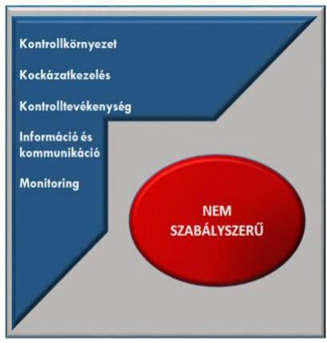

# Jelentés 

## Önkormányzatok integritás- és belső kontrollrendszere

Az önkormányzatok belső kontrollrendszere kialakításának és működtetésének ellenőrzése - Kőtelek Községi Önkormányzat
2018.

---

# Jelentés 

## Önkormányzatok integritás- és belső kontrollrendszere

Az önkormányzatok belső kontrollrendszere kialakításának és működtetésének ellenőrzése - Kőtelek Községi Önkormányzat
2018. 12. hó 21. nap

---

# AZ ELLENŐRZÉST FELÜGYELTE:

- VARGA EDIT felügyeleti vezető:
- AZ ELLENŐRZÉST VEZETTE ÉS A VÉGREHAJTÁSÁÉRT FELELŐS:
- BAJNAI ZSUZSANNA ellenőrzésvezető
- A PROGRAM ÖSSZEÁLLÍTÁSÁÉRT FELELŐS:
- TÓTPÁL SZABOLCS osztályvezető

**IKTATÓSZÁM:** EL-0347-014/2018.

**TÉMASZÁM:** 2444

**ELLENŐRZÉS-AZONOSÍTÓ SZÁM:** V078918

Jelentéseink az Országgyűlés számítógépes hálózatán és az Interneta a www.asz.hu címen is olvashatóak.

---

# TARTALOMJEGYZÉK 

■ ÖSSZEGZÉS ..... 5
■ AZ ELLENŐRZÉS CÉLJA ..... 6
■ AZ ELLENŐRZÉS TERÜLETE ..... 7
■ AZ ELLENŐRZÉS HÁTTERE, INDOKOLTSÁGA ..... 8
■ A JELENTÉS LÉNYEGES KÉRDÉSKÖREI ..... 9
■ AZ ELLENŐRZÉS HATÓKÖRE ÉS MÓDSZEREI ..... 10
■ MEGÁLLAPÍTÁSOK ..... 12
■ JAVASLATOK ..... 15
■ MELLÉKLETEK ..... 19
I. sz. melléklet: Értelmező szótár ..... 19
■ FÜGGELÉKEK ..... 21
I. sz. függelék a Megállapitások fejezethez ..... 21
II. sz. függelék: Észrevételek ..... 22
■ RÖVIDÍTÉSEK JEGYZÉKE ..... 23

---

.

---

# ÖSSZEGZÉS 

Kötelek Községi Önkormányzat belső kontrollrendszerének kialakítása és müködtetése nem volt szabályszerű, ezáltal nem volt biztosított a közpénzekkel, a nemzeti vagyonnal történő gazdaságos, átlátható és felelős gazdálkodás. A Roma Nemzetiségi Önkormányzattal kapcsolatos feladatok ellátása nem felelt meg a jogszabályi előírásoknak. Az integritási kontrollok kiépítettsége nem volt megfelelő.

## Az ellenőrzés társadalmi indokoltsága

Az Állami Számvevőszék alapvető feladata a közpénzekkel, az állami és önkormányzati vagyonnal való gazdálkodás ellenőrzése. Az Alaptörvény szerint az önkormányzatok kötelezettsége a kiegyensúlyozott, átlátható és fenntartható költségvetési gazdálkodás elvének érvényesítése, a nemzeti vagyonnal való rendeltetésszerű és felelős módon való gazdálkodás biztosítása. Az Állami Számvevőszék stratégiájában megfogalmazott célkitűzése az integritás alapú, átlátható és elszámoltatható közpénzfelhasználás elősegítése. Ennek megvalósítása érdekében az Állami Számvevőszék prioritásként kezeli a közpénzzel gazdálkodó szervezetek esetében a belső kontrollrendszer múködésének ellenőrzését.

Kőtelek Községi Önkormányzatot az Állami Számvevőszék korábban nem ellenőrizte.

## Főbb megállapítások, következtetések

Kőtelek Községi Önkormányzat belső kontrollrendszerének kialakítása és múködtetése nem a jogszabályi előírásoknak megfelelően történt.

A kontrollkörnyezet kialakítása nem volt szabályszerű. Az önkormányzati vagyonnal történő gazdálkodás szabályai nem feleltek meg a hatályos jogszabályi előírásoknak. A Kőteleki Közös Önkormányzati Hivatal nem rendelkezett szervezeti és múködési szabályzattal, ezáltal nem határozták meg egyértelmúen a múködés szervezeti kereteit, a felelősségi szinteket, hatásköröket, feladatokat.

Kockázatkezelési, illetve integrált kockázatkezelési rendszert a jegyző nem alakított ki. A kockázatelemzés elmaradása miatt a Kőtelek Községi Önkormányzat nem volt védett a korrupciós kockázatok ellen.

A gazdálkodási folyamatokhoz kapcsolódó kontrolltevékenységek múködtetése nem volt szabályszerű. Az ellenőrzési nyomvonal elkészítésének elmaradása, továbbá a gazdálkodási jogkörök gyakorlóiról és aláírás-mintáikról vezetett naprakész nyilvántartás hiánya miatt nem volt biztosított a közpénzfelhasználás szabályossága.

Az információs és kommunikációs folyamatok kialakítása és múködtetése nem volt szabályszerű. Nem rendelkeztek iratkezelési szabályzattal, ezáltal alapjaiban sérült az adatkezelés, az adatok védelme és az átláthatóság.

A jegyző nem gondoskodott a monitoring rendszer kialakításáról, a belső ellenőrzés múködtetése nem az előírások szerint történt.

Az integritás nem érvényesült az azt támogató kontrollok múködési hiányosságai, a kockázatelemzés elmaradása miatt.

---

# AZ ELLENŐRZÉS CÉLJA 

Az ellenőrzés célja annak megállapítása volt, hogy szabályszerűen történt-e az önkormányzat belső kontrollrendszerének kialakítása és működtetése, az biztosítottae az önkormányzatnál a közpénzfelhasználás szabályosságát, a közpénzekkel és a nemzeti vagyonnal történő szabályszerű és felelős gazdálkodást, a beszámolási és adatszolgáltatási kötelezettségek szabályszerű teljesítését. Az ellenőrzés keretében értékelte az ÁSZ ${ }^{1}$ az önkormányzat korrupciós kockázatainak kezelését szolgáló integritás kontrollok kiépítettségét és az integritás szemlélet érvényesülését.

---

# AZ ELLENŐRZÉS TERÜLETE 

## Kőtelek Községi Önkormányzat

Kőtelek Jász-Nagykun-Szolnok megyében található, állandó lakosainak száma 2016. január 1-jén 1617 fő volt a Központi Statisztikai Hivatal Magyarország közigazgatási helynévkönyve adatai alapján.

Az Önkormányzat ${ }^{2}$ hét tagú képviselő-testületének ${ }^{3}$ munkáját kettő állandó bizottság segítette. A településen Roma Nemzetiségi Önkormányzat ${ }^{4}$ múködött.

Az Önkormányzat múködével kapcsolatos feladatok ellátásáról a Közös Hivatal ${ }^{5}$ gondoskodott, amely önálló szervezeti egységekre nem tagolódott, gazdasági szervezettel nem rendelkezett. A Közös Hivatalban foglalkoztatott köztisztviselők száma 2016. év végén 11 fő volt.

A polgármester ${ }^{6}$ a 2010. évi önkormányzati választások óta tölti be tisztségét, a jegyző ${ }^{7}$ személye nem változott az ellenőrzött időszakban.

Az Önkormányzat a Közös Hivatalon kívül egy költségvetési szervvel rendelkezett.

Az Önkormányzat a 2016. évi konszolidált éves költségvetési beszámoló szerint 346,1 millió Ft költségvetési bevételt ért el, valamint 329,2 millió Ft költségvetési kiadást teljesített, vagyonának értéke 2016. december 31-én 1585,1 millió Ft volt.

---

# AZ ELLENŐRZÉS HÁTTERE, INDOKOLTSÁGA 

A DEMOKRATIKUS TÁRSADALMAKBAN alapvető igény, hogy a közpénzeket, a közvagyont használók tevékenységükről elszámoljanak, ahhoz egyértelmű és érvényesíthető felelősségi szabályok társuljanak. Ennek a jogos igénynek az érvényesítéséhez meg kell teremteni azokat a folyamatokat, rendszereket, amelyek nélkülözhetetlenek az elszámoltatáshoz. Az elszámoltatás eredményes működtetéséhez szükség van a megfelelő információs, kontroll-, értékelési és beszámolási rendszerek kialakítására. A belső kontrollok kiépítettsége hozzájárul az integritási szemlélet kialakításához és érvényesüléséhez. A belső kontrollrendszer kialakítása és működtetése nélkül nem valósítható meg a közpénzek, a közvagyon szabályos, gazdaságos, hatékony és eredményes felhasználása.

A BELSŐ KONTROLLRENDSZER azt a célt szolgálja, hogy az államháztartás szervei működésük és gazdálkodásuk során a tevékenységeket szabályszerűen, gazdaságosan, hatékonyan, eredményesen hajtsák végre, teljesítsék elszámolási kötelezettségeiket, és megvédjék az erőforrásokat a veszteségektől, a károktól, a nem rendeltetésszerű használattól. A belső kontrollrendszer magában foglalja mindazon szabályokat, eljárásokat, gyakorlati módszereket és szervezeti struktúrákat, kockázatkezelési technikákat, kontrolltevékenységeket, amelyek segítséget nyújtanak a szervezetnek céljai eléréséhez.

A megfelelő belső kontrollrendszer jelentősen csökkenti a hibák és szabálytalanságok kockázatát. Az ÁSZ célja, hogy javuljon az ellenőrzött önkormányzatok belső kontrollrendszerének szabályozottsága, működésének megfelelősége, szabályszerűsége, hozzájárulva ezzel az egyensúlyi helyzet fenntarthatóságának biztosításához, biztosítva az önkormányzatnál a közpénzfelhasználás szabályosságát, a közpénzekkel és a nemzeti vagyonnal történő szabályszerű, gazdaságos, hatékony és eredményes gazdálkodást.

AZ ELLENŐRZÉS VÁRHATÓ HASZNOSULÁSA négy szinten valósul meg. A törvényalkotás számára összegzett tapasztalatok állnak rendelkezésre a belső kontrollrendszer önkormányzati területen való kialakításáról, működtetéséről és hatásairól. Az ellenőrzés az ellenőrzött számára visszajelzést ad a belső kontrollrendszer kialakításában és működésében lévő hiányosságokról, javaslataival hozzájárul azok kiküszöböléséhez. Az ellenőrzés megállapításait és javaslatait más szervezetek is hasznosíthatják a rendezett gazdálkodási keretek kialakításához, a ,,jó gyakorlat" elterjesztésével azok az önkormányzatok is átvehetik a pozitív példákat, ahol nem végez ellenőrzést az ÁSZ.

Az ÁSZ ellenőrzései jelzik a társadalom számára, hogy közpénz nem maradhat ellenőrizetlenül, tevékenysége hozzájárul az értékteremtő rend kialakításához és megőrzéséhez.

---

# A JELENTÉS LÉNYEGES KÉRDÉSKÖREI 

1. Az Önkormányzat belső kontrollrendszerének kialakítása és müködtetése szabályszerű volt-e?
2. A nemzetiségi önkormányzat gazdálkodásával kapcsolatos feladatok ellátása szabályszerű volt-e?
3. Kiépítették-e az integritás kontrollokat az Önkormányzatnál?

---

# AZ ELLENŐRZÉS HATÓKÖRE ÉS MÓDSZEREI 

## Az ellenőrzés típusa

Megfelelőségi ellenőrzés.

## Az ellenőrzött időszak

2016. év

## Az ellenőrzés tárgya

A Kőtelek Községi Önkormányzatnak, mint éves költségvetési beszámoló készítésére kötelezett szervezetnek és a Kőteleki Közös Önkormányzati Hivatalnak belső kontrollrendszere, az integritás szemlélet érvényesülése az ellenőrzés tárgya.

Az ellenőrzés kiterjedt minden olyan körülményre és adatra, amely az ÁSZ jogszabályban meghatározott feladatainak teljesítéséhez, valamint a program végrehajtása folyamán felmerült újabb összefüggések feltárásához szükséges volt.

## Az ellenőrzött szervezet

Kőtelek Községi Önkormányzat, Kőteleki Közös Önkormányzati Hivatal

## Az ellenőrzés jogalapja

Az ÁSZ tv. ${ }^{8}$ 1. § (3) bekezdésében foglaltak alapján az ÁSZ általános hatáskörrel végzi a közpénzekkel és az állami és önkormányzati vagyonnal való felelős gazdálkodás ellenőrzését. Az ÁSZ tv. 5. § (2) bekezdése alapján az államháztartás gazdálkodásának ellenőrzése keretében az ÁSZ ellenőrzi a helyi önkormányzatok gazdálkodását, valamint az ÁSZ tv. 5. § (6) bekezdése alapján ellenőrzése során értékeli az államháztartás számviteli rendjének betartását és a belső kontrollrendszer múködését.

## Az ellenőrzés módszerei

Az ÁSZ az ellenőrzést az ellenőrzési program szempontjai, az ellenőrzött időszakban hatályos jogszabályok, az ellenőrzés szakmai szabályai, az egyes ellenőrzési típusokhoz kapcsolódó ÁSZ módszertanok figyelembevételével végezte.

---

Az ellenőrzés ideje alatt az ÁSZ az Önkormányzattal a kapcsolattartást az ÁSZ SZMSZ ${ }^{6}$-ének vonatkozó előírásai alapján biztosította.

Az ellenőrzési kérdések megválaszolásához szükséges bizonyítékok megszerzése az Önkormányzat által rendelkezésre bocsátott dokumentumokra, adatokra alapozva megfigyelés, szemle (szemrevételezés), valamint elemző eljárás keretében történt.

Az ellenőrzési bizonyítékként felhasználható adatforrások közé tartoztak egyrészt az ellenőrzési program részletes szempontjainál felsorolt adatforrások, másrészt minden - az ellenőrzés folyamán feltárt, az ellenőrzés szempontjából információt tartalmazó - dokumentum.

Az Önkormányzat belső kontrollrendszere jogszabályi előírások szerinti kialakításának és működtetésének szabályszerűségét az erre irányuló ellenőrzési kérdésekre adott válaszok összesítése alapján, pillérenként (kontrollkörnyezet, kockázatkezelési rendszer, kontrolltevékenységek, információs és kommunikációs rendszer, monitoring rendszer) és összesítetten is értékelte az ÁSZ. Az önkormányzat belső kontrollrendszere egyes pilléreinek kialakítása és működtetése „szabályszerü", amennyiben az értékelt területen az elért igen válaszok százalékban kifejezett, egész számra kerekített aránya, meghaladja a $85 \%$-ot, „nem szabályszerü", ha nem haladja meg, akkor a minősítés „nem szabályszerű" lesz. Az önkormányzat belső kontrollrendszerének összesített értékelése megegyezik a pillérenként (kontrollterületenként) alkalmazott százalékos értékelésekkel. A kontrollrendszer egésze esetében a „szabályszerü" értékelésnek a százalékos értéken felül további feltétele, hogy egyik kontrollterület sem kaphat „nem szabályszerű" értékelést. Az összesített értékelés a százalékos értéktől függetlenül „nem szabályszerű", ha az ellenőrzött kontrollterületek közül több mint egynek „nem szabályszerű" az értékelése.

A kontrolltevékenységek gyakorlása, működtetése megfelelőségét mintavételi eljárás alkalmazásával ellenőrizte az ÁSZ. A kiadások esetében az ellenőrzés azokra a legnagyobb értékű tételekre - a lényeges sokaságra terjedt ki, melyek összértéke eléri a teljes sokaság összértékének 50\%-át.

A közszféra integritás alapú kultúrájának kialakítása, megerősítése és működése szorosan összefügg a belső kontrollrendszer működésével, ezért az ellenőrzés kiterjedt annak értékelésére is, hogy a belső kontrollrendszer kialakítása és működtetése hogyan hatott az integritás szemlélet érvényesülésére.

---

# 1. Az Önkormányzat belső kontrollrendszerének kialakítása és múködtetése szabályszerű volt-e? 

Összegző megállapítás

1. ábra: A belső kontrollrendszer értékelése

Forrás: ÁSZ értékelés

## A belső kontrollrendszer kialakítása és működtetése nem volt szabályszerű.

A belső kontrollrendszer pillérenkénti és összesített értékelését az 1. ábra szemlélteti.

A KONTROLLKÖRNYEZET, a működés szervezeti kereteinek kialakítása nem volt szabályszerű, mert a jegyző nem állapította meg az Áht. ${ }^{10}$ 10. § (5) bekezdésében foglaltak ellenére a Közös Hivatal feladatai ellátásának részletes belső rendjét és módját szervezeti és működési szabályzatban. A képviselő-testület a Vagyonrendeletben ${ }^{11}$ nem határozta meg az Nvtv. ${ }^{12}$ 18. § (1) bekezdésében foglaltak ellenére forgalomképtelennek minősülő vagyonából a nemzetgazdasági szempontból kiemelt jelentőségű vagyonelemeket. Ennek elmaradása miatt nem történt meg azon vagyoni kör megjelölése, amely vonatkozásában fennállnak az Nvtv. 6. § (5) bekezdésében megjelölt elidegenítésre, terhelési tilalomra vonatkozó korlátozások. A Vagyonrendelet nem tartalmazta Mötv. ${ }^{13}$ 109.§ (4) bekezdésének előírása ellenére a vagyonkezelői jog ellenértékét, az ingyenes átengedés, a vagyonkezelői jog gyakorlásának, valamint a vagyonkezelés ellenőrzésének részletes szabályait.

A jegyző a Kttv ${ }^{14}$. 75. § (1) bekezdésének d) pontjában, továbbá a Kttv. 226. § (1) és (2) bekezdés a)-b) pontjaiban meghatározottak ellenére az ellenőrzött időszakban nem rendelkezett a feladatait és a munkakör betöltésével kapcsolatos követelményeket rögzítő munkaköri leírással.

A jegyző nem alakította ki a Számv. tv. ${ }^{15}$ 14. § (3), (5) és az Áhsz. ${ }^{16}$ 50. §. (1) bekezdéseinek előírása ellenére a Közös Hivatal számviteli politikáját, annak keretében az eszközök és a források leltárkészítési és leltározási szabályzatát, az eszközök és a források értékelési szabályzatát, a pénzkezelési szabályzatot.

A jegyző nem készített a Számv. tv. 161. § (1) és az Áhsz. 51. § (2) bekezdéseiben foglalt előírások ellenére számlarendet.

A KOCKÁZATKEZELÉS nem volt szabályszerű. A jegyző nem szabályozta a szabálytalanságok kezelésének eljárásrendjét, 2016. október 1-jétől a szervezeti integritást sértő események kezelésének eljárásrendjét, valamint az integrált kockázatkezelés eljárásrendjét a Bkr. ${ }^{17}$ 6. § (4) bekezdésében előírtak ellenére. A jegyző nem működtette a Bkr. 7. § (1) bekezdésében előírtak ellenére az integrált kockázatkezelési rendszert.

---

A KONTROLLTEVÉKENYSÉGEK kialakítása és múködtetése nem felelt meg az előírásoknak, mert a jegyző:
— nem készített a Bkr. 6. § (3) bekezdése ellenére a múködés folyamatairól ellenőrzési nyomvonalat;
— nem gondoskodott az Ávr. 60. § (3) bekezdésében foglaltak ellenére a kötelezettségvállalásra, pénzügyi ellenjegyzésre, teljesítés igazolására, érvényesítésre, utalványozásra jogosult személyekről és aláírás-mintájukról naprakész nyilvántartás vezetéséről.
A gazdálkodási jogkörök gyakorlása az ellenőrzött mintatételeknél nem volt szabályszerű, mert:
— sor került kötelezettségvállalás nélküli kifizetésre az Áht. 37. § (1) bekezdésében foglaltak ellenére, ezáltal sérült a Számv. tv. szerinti bizonylati elvre és bizonylati fegyelemre vonatkozó előírás;
— a teljesítésigazolás nem felelt meg az Áht. 38. § (1) és az Ávr. 57. § (1) bekezdésében foglaltaknak, mert a teljesítésigazoló ellenőrizhető okmányok hiányában nem ellenőrizte a kiadások teljesítésének jogosságát, összegszerűségét, valamint az ellenszolgáltatás teljesítését.

# AZ INFORMÁCIÓS ÉS KOMMUNIKÁCIÓS RENDSZERT a jegyző nem alakította ki a Bkr. 9. § (1) bekezdésében foglaltak ellenére. A jegyző nem készített az Ltv. ${ }^{18}$ 9. § (4) bekezdésének előírása ellenére iratkezelési szabályzatot. A Közzétételi szabályzatban ${ }^{19}$ a jegyző nem állapította meg az Info tv. ${ }^{20}$ 35. § (3) bekezdése ellenére az Info tv. 1. mellékletében foglalt adatok közzétételének részletes szabályait. 

A MONITORING-RENDSZERT a jegyző nem alakította ki a Bkr. 10. §-ában foglaltak ellenére. A belső ellenőrzés nem múködött szabályszerűen, mert a Bkr. 45. § (4) bekezdése ellenére a jegyző nem hagyta jóvá az intézkedési tervet. A belső ellenőrzési vezető nem gondoskodott a Bkr. 22. § (2) bekezdés b) pontjában foglaltak ellenére a belső ellenőrzések nyilvántartásáról.

A jegyző nem értékelte a Bkr. 11. § (1) bekezdésének előírása ellenére a belső kontrollrendszer minőségét.

## 2. A nemzetiségi önkormányzat gazdálkodásával kapcsolatos feladatok ellátása szabályszerű volt-e?

## Összegző megállapítás

A Roma Nemzetiségi Önkormányzat gazdálkodásával kapcsolatos feladatok ellátása nem felelt meg a jogszabályi előírásoknak.

A jegyző nem készítette el a számviteli politika keretében az Áht. 6/C. § (2) bekezdés b) pontjában, a Számv. tv. 14. § (5) bekezdés a-b) és d) pontjaiban foglaltak ellenére a Roma Nemzetiségi Önkormányzat leltározási, értékelési, pénzkezelési szabályzatát, továbbá a Számv. tv. 161. § (1) bekezdésében foglaltak ellenére a számlarendet, valamint nem rendelkezett az

---

Ávr. 13. § (3a) bekezdés a) pontjában foglaltak ellenére a Roma Nemzetiségi Önkormányzat tervezési, gazdálkodási, ellenőrzési, finanszírozási, adatszolgáltatási és beszámolási feladatairól.

# 3. Kiépítették-e az integritás kontrollokat az Önkormányzatnál? 

Összegző megállapítás Az integritás kontrollok kialakítása a fennálló kockázatoknál alacsonyabb szinten történt.

AZ INTEGRITÁST erősítő kontrollokat nem működtették, a korrupciós kockázatot nem kezelték az Önkormányzatnál. Az integritás erősítése nem szerepelt az Önkormányzat hosszú távú céljai között.

---

# JAVASLATOK 

Az ÁSZ tv. 33. § (1) bekezdésében foglaltak értelmében az ellenőrzött szervezet vezetője köteles a jelentésben foglalt megállapításokhoz kapcsolódó intézkedési tervet összeállítani és azt a jelentés kézhezvételétől számított 30 napon belül az ÁSZ részére megküldeni. Amennyiben az ellenőrzött szervezet vezetője nem küldi meg határidőben az intézkedési tervet, vagy továbbra sem elfogadható intézkedési tervet küld, az Állami Számvevőszék elnöke az ÁSZ tv. 33. § (3) bekezdése a) és b) pontjaiban foglaltakat érvényesítheti.

## Kőteleki Közös Önkormányzati Hivatal jegyzőjének

1. A Hivatal szabályszerű kontrollkörnyezetének kialakítása érdekében gondoskodjon:
a) a Polgármesteri Hivatal szervezeti és müködési szabályzatának elkészitéséről;
(1. sz. megállapítás 2. bekezdés 1. mondata alapján)
b) a jogszabályi előírásoknak megfelelő tartalmú számviteli politikájának írásba foglalásáról és annak keretében az eszközök és források leltárkészitési és leltározási szabályzatának, az eszközök és források értékelési szabályzatának, valamint a pénzkezelési szabályzatnak az elkészitéséről;
(1. sz. megállapítás 4. bekezdése alapján)
c) a számlarend elkészitéséről;
(1. sz. megállapítás 5. bekezdése alapján)
d) a Hivatal ellenőrzési nyomvonalának elkészitéséről;
(1. sz. megállapítás 7. bekezdés 1. francia bekezdése alapján
e) kötelezettségvállalásra, pénzügyi ellenjegyzésre, teljesités igazolására, érvényesitésre, utalványozásra jogosult személyek és aláírásmintájuk naprakész nyilvántartásának vezetéséről;
(1. sz. megállapítás 7. bekezdés 2. francia bekezdése alapján)
f) a jogszabályi előírásoknak megfelelően az iratkezelési szabályzat elkészitéséről;
(1. sz. megállapítás 9. bekezdés 2. mondata alapján)

---

g) a jogszabályi előírásoknak megfelelően a közzététel részletes szabályait rögzítő szabályzat elkészítéséről.
(1. sz. megállapítás 9. bekezdés 3. mondata alapján)
2. Az Önkormányzat szabályszerű kontrollkörnyezetének kialakítása érdekében intézkedjen a jogszabályi előírásoknak megfelelő tartalmú vagyonrendelet tervezet elkészitéséről;
(1. sz. megállapítás 2. bekezdés 2. mondata alapján)
3. A Hivatal szabályszerű integrált kockázatkezelési rendszerének kialakítása és müködtetése érdekében gondoskodjon:
a) a szervezeti integritást sértő események, valamint az integrált kockázatkezelés eljárásrendjének szabályozásáról;
(1. sz. megállapítás 6. bekezdés 2. mondata alapján)
b) az integrált kockázatkezelési rendszer müködtetéséről.
(1. sz. megállapítás 6. bekezdés 3. mondata alapján)
4. A kontrolltevékenységek szabályszerű kialakítása és müködtetése érdekében intézkedjen
a) jogszabályi előírásoknak megfelelő kötelezettségvállalásokról;
(1. sz. megállapítás 8. bekezdés 1. francia bekezdése alapján)
b) a teljesítésigazolás jogszabályi előírásoknak megfelelő gyakorlásáról;
(1. sz. megállapítás 8. bekezdés 2. francia bekezdése alapján)
5. Gondoskodjon a jogszabályi előírásoknak megfelelő információs és kommunikációs rendszer kialakításáról és müködtetéséről.
(1. sz. megállapítás 9. bekezdés 1. mondata alapján)
6. Gondoskodjon a célok megvalósítását szolgáló tevékenységek folyamatos és eseti nyomon követését biztosító monitoring rendszer kialakításáról és müködtetéséről.
(1. sz. megállapítás 10. bekezdés 1. mondata alapján)

---

7. A belső ellenőrzés szabályszerű müködtetése érdekében gondoskodjon a jogszabályi előírásnak megfelelően:
a) az intézkedési tervek jóváhagyásáról;
(1. sz. megállapítás 10. bekezdés 2. mondat 2. tagmondata alapján)
b) a belső ellenőrzések nyilvántartásáról.
(1. sz. megállapítás 10. bekezdés 3. mondata alapján)
8. A belső kontrollrendszer szabályszerű kialakítása és müködtetése érdekében gondoskodjon a belső kontrollrendszer minősége jogszabályi előírásnak megfelelő értékeléséről.
(1. sz. megállapítás 11. bekezdése alapján)
9. A Roma Nemzetiségi Önkormányzat gazdálkodásával kapcsolatos feladatok szabályszerű ellátása, valamint a Hivatal szabályszerű kontrollkörnyezetének kialakítása érdekében gondoskodjon:
a) a jogszabályi előírásoknak megfelelő tartalmú számviteli politika írásba foglalásáról és annak keretében az eszközök és források leltárkészítési és leltározási szabályzatának, az eszközök és források értékelési szabályzatának, valamint a pénzkezelési szabályzatnak az elkészítéséről;
10. sz. megállapítás 1. mondat 1. tagmondata alapján)
b) a számlarend elkészítéséről;
(2. sz. megállapítás 1. mondat 2. tagmondata alapján)
c) a Roma Nemzetiségi Önkormányzat tervezési, gazdálkodási, ellenőrzési, finanszírozási, adatszolgáltatási és beszámolási feladatainak belső szabályzataiban való rendezéséről.
(2. sz. megállapítás 1. mondat 3. tagmondata alapján)

---

# Kötelek Községi Önkormányzat polgármesterének 

1. A Hivatal szabályszerű kontrollkörnyezetének kialakítása érdekében intézkedjen:
a) a Polgármesteri Hivatal szervezeti és müködési szabályzatának a Képviselő-testület által való jóváhagyás kezdeményezéséről;
(1. sz. megállapítás 2. bekezdés 1. mondata alapján)
b) a jegyző munkaköri leírásának elkészítéséről;
(1. sz. megállapítás 3. bekezdése alapján)
2. Az Önkormányzat szabályszerű kontrollkörnyezetének kialakítása érdekében gondoskodjon a jogszabályi előírásoknak megfelelő tartalmú vagyonrendelet Képviselő-testület által való jóváhagyásának kezdeményezéséről;
(1. sz. megállapítás 2. bekezdés 2. mondata alapján)

---

# MELLÉKLETEK 

- I. SZ. MELLÉKLET: ÉRTELMEZŐ SZÓTÁR
belső ellenőrzés
belső kontrollrendszer
belső kontrollrendszer pillérei, kontrollterületei
helyi önkormányzat
információs és kommunikációs rendszer
integritás

Független, tárgyilagos bizonyosságot adó és tanácsadó tevékenység, amelynek célja, hogy az ellenőrzött szervezet működését fejlessze és eredményességét növelje, az ellenőrzött szervezet céljai elérése érdekében rendszerszemléletű megközelítéssel és módszeresen értékeli, illetve fejleszti az ellenőrzött szervezet irányítási és belső kontrollrendszerének hatékonyságát. (Forrás: Bkr. 2. § b) pontja)
A belső kontrollrendszer a kockázatok kezelése és tárgyilagos bizonyosság megszerzése érdekében kialakított folyamatrendszer, amely azt a célt szolgálja, hogy a müködés és gazdálkodás során a tevékenységeket szabályszerűen, gazdaságosan, hatékonyan, eredményesen hajtsák végre, az elszámolási kötelezettségeket teljesítsék, megvédjék az erőforrásokat a veszteségektől, károktól és nem rendeltetésszerű használattól. (Forrás: Áht. 69. § (1) bekezdése)
A kontrollkörnyezet, az (integrált) kockázatkezelési rendszer, a kontrolltevékenységek, az információs és kommunikációs rendszer, valamint a nyomon követési (monitoring) rendszer. (Forrás: Bkr. 3. §-a)
A helyi önkormányzat jogi személy. Az önkormányzati feladatok ellátását a képviselő-testület és szervei biztosítják. A képviselő-testület szervei: a polgármester, a főpolgármester, a megyei közgyűlés elnöke, a képviselő-testület bizottságai, a részönkormányzat testülete, az önkormányzati hivatal, a megyei önkormányzati hivatal, a közös önkormányzati hivatal, a jegyző, továbbá a társulás. A képviselő-testület a feladatkörébe tartozó közszolgáltatások ellátására - jogszabályban meghatározottak szerint - költségvetési szervet, a polgári perrendtartásról szóló törvény szerinti gazdálkodó szervezetet (a továbbiakban: gazdálkodó szervezet), nonprofit szervezetet és egyéb szervezetet (a továbbiakban együtt: intézmény) alapíthat, továbbá szerződést köthet természetes és jogi személlyel vagy jogi személyiséggel nem rendelkező szervezettel. A helyi önkormányzat éves költségvetési beszámolója magában foglalja a helyi önkormányzat - nem költségvetési szerveihez tartozó - feladataihoz kapcsolódó bevételeket és kiadásokat. A helyi önkormányzat összevont (konszolidált) költségvetési beszámolóját a helyi önkormányzatra és költségvetési szerveire vonatkozóan külön-külön beérkezett éves költségvetési beszámolók alapján a Kincstár készíti el és küldi meg az önkormányzatnak. (Forrás: Mötv. 41. § (1), (2), (6) bekezdései; Áhsz. 2. § (1) bekezdése, 6. § (1) bekezdés a) és f) pontja, 30. §-a, 37. § (1) és (6) bekezdése)
A költségvetési szerv vezetője által kialakított és működtetett olyan rendszer, mely biztosítja, hogy a megfelelő információk a megfelelő időben eljutnak az illetékes szervezethez, szervezeti egységhez, illetve személyhez. (Forrás: Bkr. 9. § (1) bekezdés)

Az integritás elvek, értékek, cselekvések, módszerek, intézkedések konzisztenciáját jelenti: olyan magatartásmódot, amely meghatározott értékeknek felel meg. Az integritás a közszféra esetében a társadalom által elvárt nyilvánossági, átláthatósági, illetve jogi/etikai normáknak történő megfelelést jelenti.

---

kockázatkezelési rendszer
kontrollkörnyezet
kontrolltevékenységek
költségvetési szerv vezetője (Bkr. alkalmazásában)
közös hivatal
(Forrás: a http://integritas.asz.hu honlapon közzétett „A 2012. évi integritás felmérés eredményeinek összefoglalója" című dokumentum 3. oldal 1. bekezdése)
Olyan irányítási eszközök és módszerek összessége, melynek elemei a szervezeti célok elérését veszélyeztető tényezők (kockázatok) azonosítása, elemzése, csoportosítása, nyomon követése, valamint szükség esetén a kockázati kitettség mérséklése. (Forrás: Bkr. 2. § m) pontja)
A költségvetési szerv vezetője által kialakított olyan elvek, eljárások, belső szabályzatok összessége, amelyben világos a szervezeti struktúra, egyértelműek a felelősségi, hatásköri viszonyok és feladatok, meghatározottak az etikai elvárások a szervezet minden szintjén, átlátható a humánerőforrás-kezelés. (Forrás: Bkr. 6. § (1) bekezdés)
A költségvetési szerv vezetője által a szervezeten belül kialakított (kontroll) tevékenységek, melyek biztosítják a kockázatok kezelését, hozzájárulnak a szervezet céljainak eléréséhez. (Forrás: Bkr. 8. § (1) bekezdés)
Helyi önkormányzat esetén a jegyző, főjegyző, társulás esetén a társulási megállapodásban meghatározott önkormányzat jegyzője. (Forrás: Bkr. 2. § n) pont nb) alpont)
települési képviselő-testület más települési képviselő-testülettel társult kép-viselő-testületet alakíthat, amely esetén a képviselő-testületek részben vagy egészben egyesítik a költségvetésüket, közös önkormányzati hivatalt tartanak fenn, és intézményeiket közösen működtetik. (Forrás: Mötv. 56. § (1)-(2) bekezdései)

---

# FÜGGELÉKEK 

- I. SZ. FÜGGELÉK A MEGÁLLAPÍTÁSOK FEJEZETHEZ

Magyarország Alaptörvényének 43. cikk (1) bekezdése alapján az Állami Számvevőszék törvényben meghatározott feladatkörében ellenőrzi az államháztartásból származó források felhasználását. Az önkormányzatok belső kontrollrendszere kialakításának és müködtetésének ellenőrzésével biztosítjuk a közpénzfelhasználás minél szélesebb körének ellenőrzését.
A számvevőszéki ellenőrzés az ellenőrzött szervezetnél a 2016. év dologi és felhalmozási kiadásainak ellenőrzése során 1309319 Ft összegű kiadásra vonatkozóan feltárta, hogy az Önkormányzat az államháztartásról szóló 2011. évi CXCV. törvény (a továbbiakban: Áht.) 37. § (1) bekezdésében foglalt előírások ellenére nem rendelkezett írásos kötelezettségvállalással. Továbbá az Önkormányzat 360000 Ft összegű kiadás esetében nem rendelkezett az Áht. 37. § (1) bekezdése ellenére írásos kötelezettségvállalással és az Áht. 38. § (1) bekezdése ellenére a teljesítésigazolás is hiányzott a kifizetéshez kapcsolódóan. Kötelezettségvállalási dokumentumok, illetve a teljesítés igazolásának hiányában nem bizonyított, hogy a kiadások valóban az Önkormányzatnál merültek fel, illetve annak feladatellátását szolgálták.
A kötelezettségvállalás célja, hogy a költségvetési forrás felhasználásának alapdokumentuma rendelkezésre álljon, ennek hiányában a kifizetést megelőző teljesítésigazolás szabályszerű elvégzése ellehetetlenül, hiszen hiányzik a teljesítés megtörténtének ellenőrzéséhez szükséges alapvető adatokat tartalmazó dokumentum.
A teljesítésigazolás célja, hogy a feladat ellátója meggyőződjön arról, hogy az adott szervezet a kiadást megrendelte e, illetve amennyiben igen, azt a szerződésnek megfelelően teljesítették-e. Ez hozzájárul a szervezet átláthatóságához, az elszámoltathatóság biztositásához.
Szabályszerü kötelezettségvállalás és teljesitésigazolás hiányában nem bizonyított, hogy a kiadások valóban az Önkormányzat érdekében merültek fel, illetve annak feladatellátását szolgálták, így nem zárható ki annak lehetősége, hogy a szabálytalan kifizetések az ellenőrzött szervezetnél vagyoni hátrányt okoztak.

---

A jelentéstervezetet a Számvevőszék 15 napos észrevételezésre megküldte az ellenőrzött szervezetek vezetőinek az ÁSZ tv. 29. §* (1) bekezdése előirásának megfelelően.

Az ÁSZ a jelentéstervezetet észrevételezésre megküldte Kőtelek Községi Önkormányzat polgármestere, valamint a Kőteleki Közös Önkormányzati Hivatal vezetője részére.
Kőtelek Községi Önkormányzat polgármestere, valamint a Kőteleki Közös Önkormányzati Hivatal vezetője az ÁSZ tv. 29. § (2) bekezdésében foglalt észrevételezési jogával nem élt, a jelentéstervezet megállapításaira a törvényes határidőn belül észrevételt nem tett.

[^0]
[^0]:    * 29. § (1) Az Állami Számvevőszék az ellenőrzési megállapításait megküldi az ellenőrzött szervezet vezetőjének vagy az általa megbízott személynek, és annak, akinek személyes felelősségét állapította meg.
    (2) Az ellenőrzött szervezet vezetője és a felelősként megjelölt személy az ellenőrzés megállapításaira tizenöt napon belül írásban észrevételt tehet.
    (3) Az Állami Számvevőszék az észrevételre a beérkezésétől számított harminc napon belül írásban válaszol. A figyelembe nem vett észrevételeket köteles a jelentésben feltüntetni, és megindokolni, hogy azokat miért nem fogadta el.

---

# RÖVIDÍTÉSEK JEGYZÉKE 

${ }^{1}$ ÁSZ
${ }^{2}$ Önkormányzat
${ }^{3}$ képviselő-testület
${ }^{4}$ Roma Nemzetiségi Önkormányzat
${ }^{5}$ Közös Hivatal
${ }^{6}$ polgármester
${ }^{7}$ jegyző
${ }^{8}$ ÁSZ tv.
${ }^{9}$ ÁSZ SZMSZ
${ }^{10}$ Áht.
${ }^{11}$ Vagyonrendelet
${ }^{12}$ Nvtv.
${ }^{13}$ Mötv.
${ }^{14}$ Kttv.
${ }^{15}$ Számv. tv.
${ }^{16}$ Áhsz.
${ }^{17}$ Bkr.
${ }^{18}$ Ltv.
${ }^{19}$ Közzétételi szabályzat
${ }^{20}$ Info tv.

Állami Számvevőszék
Kőtelek Községi Önkormányzat
Kőtelek Községi Önkormányzat képviselő-testülete
Kőtelek Község Roma Nemzetiségi Önkormányzata
Kőteleki Közös Önkormányzati Hivatal
Kőtelek Községi Önkormányzat polgármestere
Kőtelek Közös Önkormányzati Hivatal jegyzője
2011. évi LXV. törvény az Állami Számvevőszékről (hatályos 2011. július 1-jétől)

Az Állami Számvevőszék elnökének 4/2017. (XII.29.) ÁSZ utasítása az Állami Számvevőszék Szervezeti és Működési Szabályzatáról (hatályos 2018. január 1-jétől)
2011. évi CXCV. törvény az államháztartásról (hatályos 2012. január 1-jétől)

Kőtelek Községi Önkormányzat Képviselő-testületének 2/2004. (II. 10.) önkormányzati rendelete az önkormányzat vagyonáról és a vagyongazdálkodás szabályairól (hatályos 2004. március 1-től)
2011. évi CXCVI. törvény a nemzeti vagyonról (hatályos 2012. január 1-től)
2011. évi CLXXXIX. törvény Magyarország helyi önkormányzatairól (hatályos 2012. január 1-jétől)
2011. évi CXCIX. törvény a közszolgálati tisztviselőkről (hatályos 2012. március 1.)
2000. évi C törvény a számvitelről (hatályos 2001. január 1-től)
4/2013. (I. 11.) Korm. rendelet az államháztartás számviteléről (hatályos 2014. január 1-től)
370/2011. (XII. 31.) Korm. rendelet a költségvetési szervek belső kontrollrendszeréről és belső ellenőrzéséről
1995. évi LXVI. törvény a köziratokról, a közlevéltárakról és a magánlevéltári anyag védelméről (hatályos 1996. január 1-től)
A közérdekű adatok megismerésére irányuló kérelmek intézésének és a kötelezően közzéteendő adatok nyilvánosságra hozatalának szabályzata (hatályos 2016. június 1-től)
2011. évi CXII. törvény az az információs önrendelkezési jogról és az információszabadságról (hatályos 2011. július 27.)

---

# ÁLLAMI SZÁMVEVŐSZÉK 

1052 Budapest, Apáczai Csere János utca 10.
Levélcím: 1364 Budapest 4. Pf. 54
Telefon: +36 14849100 Telefax: +36 14849200
www.asz.hu