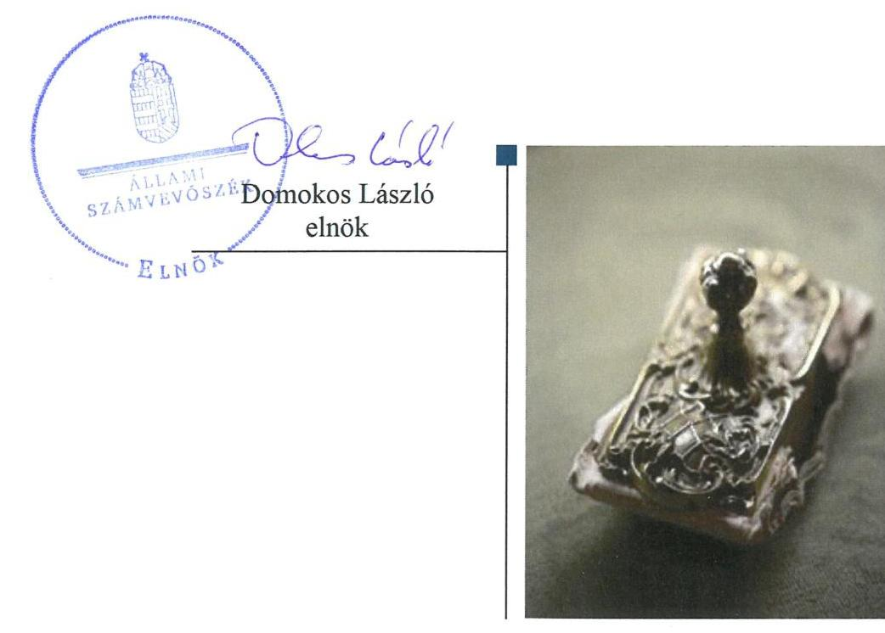
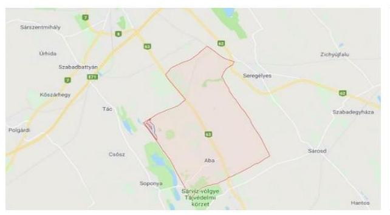
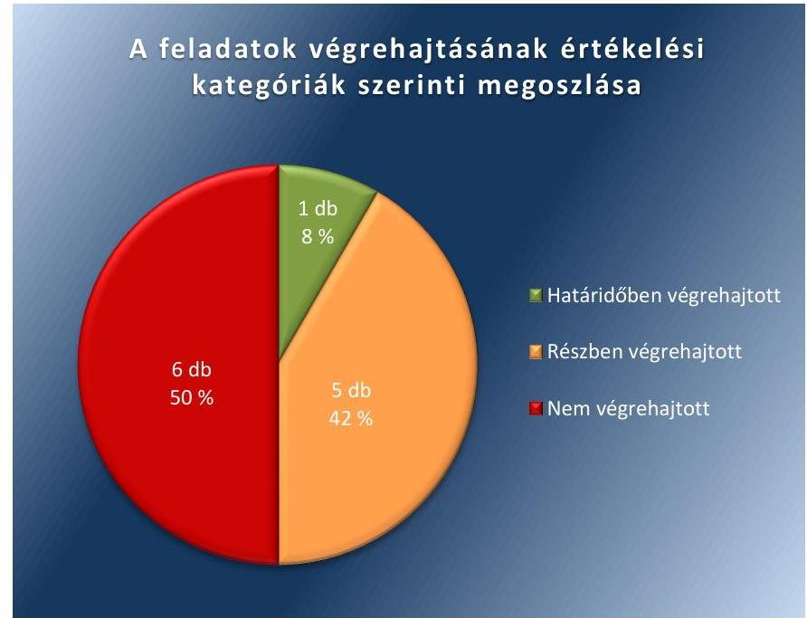

# Jelenetés 

## Utóellenőrzések

A helyi önkormányzatok adósságrendezési eljárásának utóellenőrzése - Aba Város Önkormányzata
2018.

---

# Jelentés 

## Utóellenőrzések

A helyi önkormányzatok adósságrendezési eljárásának utóellenőrzése - Aba Város Önkormányzata
2018. 12. hó 28. nap

---

# AZ ELLENŐRZÉST FELÜGYELTE: 

VARGA EDIT felügyeleti vezető

## AZ ELLENŐRZÉST VEZETTE ÉS A VÉGREHAJTÁSÁÉRT FELELŐS:

LACZI HEDVIG ANNA ellenőrzésvezető

## A PROGRAM ÖSSZEÁLLÍTÁSÁÉRT FELELŐS:

TÓTPÁL SZABOLCS osztályvezető

## A TÉMÁHOZ KAPCSOLÓDÓ KORÁBBI SZÁMVEVŐSZÉKI JELENTÉSEK:

- címe: Önkormányzati adósságrendezés ellenőrzése Aba Város Önkormányzata adósságrendezési eljárásának ellenőrzése
- sorszáma: 17038

IKTATÓSZÁM: EL-1309-001/2018
TÉMASZÁM: 2460
ELLENŐRZÉS-AZONOSÍTÓ SZÁM: V080420

---

# TARTALOMJEGYZÉK 

■ ÖSSZEGZÉS ..... 5
■ AZ ELLENŐRZÉS CÉLJA ..... 6
■ AZ ELLENŐRZÉS TERÜLETE ..... 7
■ AZ ELLENŐRZÉS HÁTTERE, INDOKOLTSÁGA ..... 8
■ A JELENTÉS LÉNYEGES KÉRDÉSKÖRE ..... 9
■ ELLENŐRZÉS HATÓKÖRE ÉS MÓDSZEREI ..... 10
■ MEGÁLLAPÍTÁSOK ..... 12
■ MELLÉKLETEK ..... 15
I. sz. melléklet: Aba Város Önkormányzata intézkedési terve végrehajtásának értékelése ..... 15
II. sz. melléklet: Aba Város Önkormányzata intézkedési terve ..... 19
■ FÜGGELÉK: ÉSZREVÉTELEK ..... 21
■ RÖVIDÍTÉSEK JEGYZÉKE ..... 23

---

.

---

# ÖSSZEGZÉS 

Aba Város Önkormányzata utóellenőrzése során az Állami Számvevőszék megállapította, hogy az intézkedési tervében meghatározott, lényeges feladatokat nem hajtották végre. A belső ellenőrzés kialakításáról és szabályszerű müködtetéséről nem gondoskodtak. A pénzügyi elszámoltathatóságra vonatkozó intézkedések elmaradása miatt továbbra sem biztosított a közpénzekkel való felelős és átlátható gazdálkodás.

## Az ellenőrzés társadalmi indokoltsága

Az Állami Számvevőszék stratégiájában célul tűzte ki a számvevőszéki munka hasznosulásának javítását. Ezzel összhangban ellenőrzi, hogy az ellenőrzött szervezet megvalósította-e a korábbi ellenőrzései által feltárt hibák, hiányosságok és szabálytalanságok megszüntetése céljából elkészített intézkedési tervében foglaltakat. A rendszeres utóellenőrzések hozzájárulnak a szükséges intézkedések tényleges végrehajtásához, ezáltal a közpénzügyek rendezettségének javulásához.

## Főbb megállapítások, következtetések

Az Állami Számvevőszék utóellenőrzése során Aba Város Önkormányzata megszegte a közreműködési kötelezettségét, adatszolgáltatási kötelezettségének nem tett eleget, ezért az Állami Számvevőszék a Magyar Államkincstárnál kezdeményezte, az államháztartás alrendszeréből származó egyes támogatások felfüggesztését Aba Város Önkormányzata egyidejű tájékoztatása mellett. A közreműködési kötelezettség teljesítését követően az Állami Számvevőszék kezdeményezte a vagyonmegóvási intézkedés felfüggesztését.

Aba Város Önkormányzata a szabálytalanságok megszüntetése érdekében tizenkét feladatból álló intézkedési tervet küldött meg az Állami Számvevőszék részére, amelyből egy feladatot határidőben, ötöt részben és hat feladatot nem hajtottak végre.

Az Integritás sérült, mivel a polgármester nem intézkedett az Állami Számvevőszék ellenőrzése során feltárt hiányosságok tekintetében a munkajogi felelősség tisztázásáról.

A belső kontrollrendszer szabályozottsága nem javult, mivel a jegyző nem gondoskodott a belső ellenőrzés kiépítéséről és szabályszerű működtetéséről valamint a gazdálkodás részletes rendjét, a jogkörök gyakorlásának módját szabályozó belső szabályzat elkészítéséről.

A pénzügyi gazdálkodás szabályszerűsége nem javult, mivel a polgármester nem gondoskodott az Aba Város Önkormányzata tulajdonában lévő gazdasági társaságok 2017. évi beszámolóinak előterjesztéséről, valamint a beszámoltatásuk rendjének elkészítéséről és a Képviselő-testület elé terjesztéséről. A Képviselő-testület nem hozott határozatot a gazdasági társaságok 2017. évi beszámolóinak és beszámoltatásuk rendjének elfogadásáról. A jegyző nem gondoskodott a megkötött vállalkozási szerződések illetve egyéb kötelezettségek felülvizsgálatáról, valamint az Aba Város Önkormányzata költségvetési szervei gazdálkodásának felülvizsgálatáról.

A jegyző nem gondoskodott az intézkedési tervben meghatározott feladatok végrehajtásáról szóló nyilvántartás vezetéséről.

---

# AZ ELLENŐRZÉS CÉLJA 

Az ellenőrzés célja annak értékelése volt, hogy a számvevőszéki jelentésben foglalt intézkedést igénylő megállapításokkal összhangban készített intézkedési tervben meghatározott feladatokat az ellenőrzött szervezet végrehajtotta-e.

---

# AZ ELLENŐRZÉS TERÜLETE 

## Aba Város Önkormányzata

Aba Város Fejér megyében található. A település állandó lakosainak száma a $\mathrm{KSH}^{1}$ helységnévtárának adatai alapján 4421 fő volt 2017. január 1-én.

Aba Város Önkormányzatánál a gazdálkodási feladatokat a Hivatal ${ }^{2}$ látta el. Aba Város polgármesterének ${ }^{3}$ és jegyzőjének ${ }^{4}$ személye az ellenőrzött időszakban nem változott.

Az ÁSZ ${ }^{5}$ 2009. január 1. és 2015. június 30. közötti időszakra vonatkozóan végezte el az Önkormányzat ${ }^{6}$ adósságrendezési eljárásának ellenőrzését. Az ellenőrzés célja az volt, hogy a lefolytatott adósságrendezési eljárás elérte-e a törvényben kitű-
zött célokat, és az eljárást követően biztosított és fenntartható volt-e az Önkormányzatnál a pénzügyi egyensúly. Az ÁSZ ellenőrizte az adósságrendezési eljárás folyamatának, az Önkormányzat gazdálkodásának és a pénzügyi gondnok feladatellátásának szabályszerűségét, valamint azt, hogy az adósságrendezési eljárás során az Önkormányzat folyamatosan teljesí-tette-e a kötelező feladatait, a hitelezők követelését vagyonarányosan ki-egyenlítette-e és helyre állt-e a fizetőképessége. Az ellenőrzésről szóló 17038 számú jelentését az ÁSZ 2017. február 14-én tette közzé.

Az Önkormányzat a Jelentésben ${ }^{7}$ meghatározott intézkedést igénylő feladatok végrehajtására Intézkedési tervet ${ }^{8}$ készített.

---

# AZ ELLENŐRZÉS HÁTTERE, INDOKOLTSÁGA 

Az ÁSZ tv. ${ }^{9}$ 33. § (1) bekezdése értelmében a számvevőszéki jelentések intézkedést igénylő megállapításaihoz és javaslataihoz kapcsolódóan az ellenőrzött szervezet vezetője intézkedési tervet köteles összeállítani, és az Állami Számvevőszék részére megküldeni.

Az ÁSZ által befogadott intézkedési tervben foglaltak megvalósítását az ÁSZ tv. 33. § (7) bekezdésében foglaltak alapján - az Állami Számvevőszék utóellenőrzés keretében ellenőrizheti. Az utóellenőrzések keretében - az intézkedések értékelése során - az Állami Számvevőszék figyelembe veszi az ellenőrzött szervezetek működési feltételeiben, valamint a jogszabályi előírásokban bekövetkezett változásokat.

Az utóellenőrzés során az ÁSZ értékeli, hogy az érintett számvevőszéki jelentésben foglalt intézkedést igénylő megállapításokkal és javaslatokkal összhangban, az ellenőrzött szervezet által készített intézkedési tervben meghatározott feladatokat a feladatra kijelöltek végrehajtották-e.

Az intézkedések végrehajtásával az adott terület szabályszerű múködése vonatkozásában a kockázatok csökkenhetnek, azonban hosszabb távon az intézkedési tervben foglaltak végrehajtásával önmagában nem szűnnek meg, csak akkor, ha beépülnek az ellenőrzött szervezet múködésébe, azokat folyamatosan karban tartják, figyelembe véve, illetve kezelve a változásokat. Emellett az intézkedések végrehajtásáig újabb kockázatok merülhetnek fel a szabályszerű múködés vonatkozásában, amelyek kezelése szintén kiemelten fontos az ellenőrzött szervezet számára.

Az ellenőrzött szervezet vezetője által készített intézkedési tervekben foglalt feladatok hiányos, illetve késedelmes végrehajtása, vagy annak elmaradása a szabályszerűség és a felelős vezetői magatartás vonatkozásában kockázatot hordoz, ami azt mutatja, hogy az ellenőrzések során feltárt hibák, hiányosságok és szabálytalanságok kezelése nem kapott kellő hangsúlyt. Az utóellenőrzés során is fennálló szabálytalanságok esetén a közpénz, közvagyon veszélyeztetettségi kockázat valószínűsített hatásának értékelése további intézkedéseket vonhat maga után.

Az ellenőrzött szervezet szintjén az utóellenőrzés feltárja, hogy a szervezet az intézkedések végrehajtásával hasznosította-e a korábbi ellenőrzési jelentésben a hiányosságok megszüntetése, illetve a kockázatok kezelése érdekében megfogalmazott javaslatokat, illetve az intézkedések végrehajtása elmaradásának következtében továbbra is fennálló szabálytalanság esetén értékeli a közpénzek, közvagyon veszélyeztetettségét.

Az ÁSZ szintjén az utóellenőrzés visszacsatolást ad az ellenőrzési jelentések hasznosulásáról, az intézkedések elmaradásának, vagy részleges megvalósulásának a közpénzek, közvagyon veszélyeztetettségére gyakorolt valószínűsített hatásának értékelése, további intézkedéseket vonhat maga után.

---

# A JELENTÉS LÉNYEGES KÉRDÉSKÖRE 

Az Önkormányzat az intézkedési tervben foglaltakat az elöirt határidőben végrehajtotta-e?

---

# ELLENŐRZÉS HATÓKÖRE ÉS MÓDSZEREI 

## Az ellenőrzés típusa

Megfelelőségi ellenőrzés.

## Az ellenőrzött időszak

Az utóellenőrzés alapját képező ÁSZ jelentés közzétételének napjától az ellenőrzésről szóló kiértesítő levél keltének napjáig, azaz 2017. február 14. és 2018. július 4. közötti időszak.

## Az ellenőrzés tárgya

Az ÁSZ tv. 2011. július 1-jei hatálybalépését követően a számvevőszéki jelentésben foglalt intézkedést igénylő megállapításokkal összhangban - az Önkormányzat által - készített Intézkedési tervben foglaltak végrehajtásának ellenőrzése.

## Az ellenőrzött szervezet

Aba Város Önkormányzata

## Az ellenőrzés jogalapja

Az ellenőrzés jogszabályi alapját az ÁSZ tv. 33. (7) bekezdésének előírása képezi.

## Az ellenőrzés módszerei

Az ellenőrzést az ellenőrzött időszakban hatályos jogszabályok, az ellenőrzés szakmai szabályai, a jelen ellenőrzésre irányadó ÁSZ módszertanok, az ellenőrzési programban foglalt értékelési szempontok szerint végeztük.

Az ellenőrzés ideje alatt az Önkormányzattal történő kapcsolattartást az ÁSZ SZMSZ ${ }^{31}$-ének vonatkozó előírásai alapján biztosítottuk.

Az utóellenőrzés megállapításait az ÁSZ rendelkezésére álló, valamint az ÁSZ adatbekérése szerint, az Önkormányzat által rendelkezésre bocsátott dokumentumok alapozták meg.

Az ellenőrzési bizonyítékként felhasználható adatforrások közé tartoztak egyrészt az ellenőrzési program részletes szempontjainál felsorolt

---

adatforrások, másrészt minden - az ellenőrzés folyamán feltárt, az ellenőrzés szempontjából információt tartalmazó - dokumentum.

Az intézkedési tervekben előírt feladatokat azok végrehajthatósága, illetve végrehajtása szempontjából az alábbiak szerint értékeltük:
"határidőben végrehajtott" a feladat, ha a teljesítés dokumentáltan, az intézkedési tervben előírt határidőben és tartalommal megtörtént;
"határidőn túl végrehajtott" a feladat, ha annak teljesítése az intézkedési tervben meghatározott módon, de az előírt határidőn túl történt meg;
"részben végrehajtott" a feladat, ha végrehajtása teljes körűen az intézkedési tervben előírt módon nem történt meg;
"nem végrehajtott" a feladat, ha a végrehajtás nem történt meg, vagy amennyiben a teljesítést nem dokumentálták;
"okafogyottá vált" a feladat, ha végrehajtására - meghatározott esemény bekövetkezése, továbbá külső körülmény, a működést érintő feltétel változása miatt - már nincs szükség, illetve lehetőség, és egyértelműen megállapítható, hogy az intézkedést szükségessé tevő körülmény a jövőben nem fordulhat elő;
"nem időszerü" az a feladat, amelynek ellenőrzési időszakon belüli végrehajtására azért nem került (kerülhetett) sor, mert az intézkedés alapjául szolgáló esemény nem következett be, de annak jövőbeni előfordulása lehetséges, a végrehajtása nem volt esedékes, vagy a végrehajtás határideje még nem járt le.
Az ellenőrzés lefolytatásához az Önkormányzat a tanúsítványok elektronikus kitöltésével, valamint az ÁSZ által kért dokumentumok elektronikus megküldésével szolgáltatott adatokat, amelyek valódiságát és teljes körűségét az ellenőrzött szervezet vezetője által tett teljességi és hitelességi nyilatkozat igazolja. Az így rendelkezésre bocsátott adatok, információk kontrollja az ellenőrzés keretében megtörtént.

Az ellenőrzött szervezet által megküldött intézkedési tervben meghatározott az ÁSZ által beazonosított feladatok a II. számú mellékletben kerültek bemutatásra.

---

# MEGÁLLAPÍTÁSOK 

## Az Önkormányzat az intézkedési tervben foglaltakat az előírt határidőben végrehajtotta-e?

Összegző megállapítás

Az Önkormányzat az intézkedési tervben szereplő tizenkét feladatból egyet határidőben, ötöt részben, hat feladatot nem hajtott végre. Az intézkedési tervben meghatározott feladatok végrehajtásáról a jogszabályban előírt nyilvántartást nem vezették.

Az Önkormányzat a szabálytalanságok megszüntetése érdekében tizenkét feladatból álló intézkedési tervet küldött meg az ÁSZ részére, amelyben a polgármesternek négy, a jegyzőnek hat a Képviselő-testületnek egy, a jegyző és a Képviselő-testület részére egy feladatot határozott meg.

Az intézkedési tervben meghatározott feladatokat, határidőket, felelősöket és a feladatok végrehajtását az I. sz. melléklet mutatja be.

A jegyző az intézkedési tervben meghatározott feladatok végrehajtásáról szóló, a Bkr. ${ }^{11} 14 . \S$ (1) bekezdésben előírt nyilvántartás vezetéséről nem gondoskodott.

Az Önkormányzat intézkedési tervében vállalt feladatok végrehajtásának értékelési kategóriák szerinti megoszlását az 1. ábra szemlélteti.

1. ábra

Fonrás: ÁSZ

---

AZ INTEGRITÁSSAL kapcsolatos kockázatok nem csökkentek, mivel a polgármester nem gondoskodott, az ÁSZ ellenőrzése során feltárt hiányosságok tekintetében a munkajogi felelősség tisztázására irányuló eljárás kezdeményezéséről (11).

A BELSŐ KONTROLLRENDSZER szabályszerű múködése nem volt biztosított, mivel a jegyző nem gondoskodott arról, hogy az Önkormányzati Hivatal rendelkezzen az Áht ${ }^{12}$.-ban foglaltak szerinti SZMSZ ${ }^{13}$-szel, valamint az Ávr ${ }^{14}$.- ben meghatározott a gazdálkodás részletes rendjét, a jogkörök gyakorlásának módját szabályozó belső szabályzattal. A jegyző nem gondoskodott továbbá az Áht. - ban, a Bkr. - ben és az Mötv ${ }^{15}$. - ben foglaltaknak megfelelő belső ellenőrzés kialakításáról és múködtetéséről (2.,3.,7.).

# A PÉNZÜGYI GAZDÁLKODÁS SZABÁLYSZERŰSÉGE ÉS A PÉNZÜGYI EGYENSÚLY 

szempontjából továbbra is kockázatot jelentett, hogy a polgármester nem gondoskodott az Önkormányzat gazdasági társaságainak ${ }^{16}$ esetében a beszámoltatásról szóló eljárásrend kidolgozásáról és a Képviselő-testület elé terjesztéséről valamint a 2017. évi beszámolók előterjesztéséről. A Képviselő-testület a múködési kifizetéseken túli kifizetések engedélyezésének saját hatáskörbe vonásáról, a gazdasági társaságok beszámoltatási eljárásrendjéről, valamint a gazdasági társaságok 2017. évi beszámolóinak elfogadásáról nem hozott határozatot. A jegyző nem gondoskodott a megkötött vállalkozási szerződések illetve egyéb kötelezettségek valamint az Önkormányzat költségvetési szervei gazdálkodásának felülvizsgálatáról.

Az Önkormányzat a Ptk.-ban foglaltak alapján felülvizsgálta Gazdasági Társaságai tevékenységét, az általuk ellátott feladatok szükségszerűségét (1.,4.,5.,6., 8.,9.,10.,12.).

Az Önkormányzat a pénzügyi egyensúly fenntarthatósága érdekében tett intézkedéseket, azonban a végre nem hajtott feladatok következtében a pénzügyi egyensúlyt veszélyeztető kockázatok nem csökkentek.

---

.

---

# MELLÉKLETEK

- I. SZ. MELLÉKLET: ABA VÁROS ÖNKORMÁNYZATA INTÉZKEDÉSI TERVE VÉGREHAJTÁSÁNAK ÉRTÉKELÉSE

|  1. | Intézkedési tervben meghatározott feladat* | Az intézkedési tervben meghatározott határidő | Az intézkedési tervben meghatározott felelős | A feladat végrehajtása  |
| --- | --- | --- | --- | --- |
|   | 1. | 2. | 3. | 4.  |
|   | Határidőben végrehajtott feladat |  |  |   |
|  1. | J1 „Gondoskodik likviditási terv jogszabályi előírásoknak megfelelő elkészítéséről. Havonta felülvizsgálja a likviditási terv érvényességét." | Azonnal majd, évente folyamatos | jegyző | A 2017. évi és a 2018. évi likviditási terv (eredeti előirányzat felhasználási ütemterv) az Áht. előírásainak megfelelően az Önkormányzat elkészítette.
A likviditási terv havonkénti felülvizsgálatának kötelezettsége, az Ávr. 122. § (3) bekezdésének hatályon kívül helyezésével 2017. január 1-vel megszűnt.  |
|   | Részben végrehajtott feladatok |  |  |   |
|  2. | J2 „A gazdálkodás szabályait (Áht. Ávr. Áhsz) felülvizsgáljuk, új szabályzatok kiadására kerül sor." | 2017.05.30. | jegyző
és pú. ov. | Végrehajtott feladat: Az Önkormányzat 2017. évben az Áhsz ${ }^{17}$-ben, és a Számv.tv. ${ }^{18}$-ben foglalt jogszabályi előírások szerint elkészítette a számviteli politikát, a számlarendet, az eszközök és források értékelési szabályzatot, az eszközök és források leltárkészítési és leltározási szabályzatot, a pénzkezelési szabályzatot, valamint az Áht.-ban, és az Ávr-ben foglaltak szerint a felesleges vagyontárgyak hasznosítási és selejtezési szabályzatot.
Nem végrehajtott feladat: Az Önkormányzati Hivatal az ellenőrzött időszakban nem rendelkezett az Áht. 10. § (5) bekezdésében és az Ávr. 13. § (1) bekezdésében foglaltaknak megfelelő SZMSZ-szel valamint az Ávr. 13. § (2) bekezdés a. pontjában megfogalmazott, a gazdálkodás részletes rendjét, a jogkörök gyakorlásának módját szabályozó belső szabályzattal.  |

---

|  3. | Intézkedési tervben meghatározott feladat* | Az intézkedési tervben meghatározott határidő | Az intézkedési tervben meghatározott felelős 3. | A feladat végrehajtása  |
| --- | --- | --- | --- | --- |
|  3. | J3, „A gazdálkodás szabályait (Áht. Ávr. Áhsz) felülvizsgáljuk, új szabályzatok kiadására kerül sor." | 2017.05.30. | jegyző és pü. ov. | Végrehajtott feladat: Az Önkormányzat 2017. évben az Áhsz.-ben, és a Számv.tv.-ben foglalt jogszabályi előírások szerint elkészítette a számviteli politikát, a számlarendet, az eszközök és források értékelési szabályzatot, az eszközök és források leltárkészítési és leltározási szabályzatot, a pénzkezelési szabályzatot, valamint az Áht.-ban, és az Ávr-ben foglaltak szerint a felesleges vagyontárgyak hasznosítási és selejtezési szabályzatot.
Nem végrehajtott feladat: Az Önkormányzati Hivatal az ellenőrzött időszakban nem rendelkezett az Áht. 10. § (5) bekezdésében és az Ávr. 13. § (1) bekezdésében foglaltaknak megfelelő SZMSZ-szel valamint az Ávr. 13. § (2) bekezdés a. pontjában megfogalmazott, a gazdálkodás részletes rendjét, a jogkörök gyakorlásának módját szabályozó belső szabályzattal.  |
|  4. | J7. és KT2. „A Kizárólag önkormányzati tulajdonban lévő gazdasági társaságok helyzetét felül kell vizsgálni, figyelembe véve az általuk ellátott feladatok szükségszerűségére, valamint azok ellátási helyének megfelelőségére is. Azon gazdasági társaságok esetén, melyek megmaradásáról dönt a képviselő testület, szabályozni kell a tulajdonosi beszámoltatás rendjét." | 2017.09.30. | jegyző, pü.ov., igazg. ov. | Végrehajtott feladat: Az Önkormányzat a Ptk. ${ }^{19}$ gazdasági társaságokra vonatkozó előírásai alapján felülvizsgálta a gazdasági társaságok helyzetét.  |
|  5. | P2. „A kizárólag önkormányzati tulajdonban lévő gazdasági társaságok helyzetét felül kell vizsgálni, figyelembe véve az általuk ellátott feladatok szükségszerűségére, valamint azok ellátási helyének megfelelőségére is. A társaságok éves beszámolóit a törvényben meghatározott határidőben | 2017.07.31. valamint folyamatos | polgármester | Végrehajtott feladat: Az Önkormányzat a Ptk. előírásai alapján felülvizsgálata a gazdasági társaságok helyzetét.
Nem végrehajtott feladat: A gazdasági társaságok 2017. évi beszámolóit a polgármester nem terjesztette a Képviselő-testület elé, így a Képvi-selő-testület nem tudott eleget tenni a Ptk. 3:109. § (2) bekezdésében rögzített kötelezettségének. A pénzügyi bizottság nem kísérte figyelemmel a társaságok pénzügyi, vagyoni helyzetét, és erről nem számolt be a Képviselő-testületnek.  |

---

|  5 | Intézkedési tervben meghatározott feladat* | Az intézkedési tervben meghatározott határidő | Az intézkedési tervben meghatározott felelős  |
| --- | --- | --- | --- |
|  1. |  | 2. | 3.  |

jóvá kell hagyni, a pénzügyi bizottságnak figyelemmel kell kísérnie a társaságok pénzügyi, vagyoni helyzetét, erről be kell számolnia a képviselő-testületnek." 6. P3. „A képviselő testület a kizárólag önkormányzati tulajdonban lévő gazdasági társaságok esetében a felülvizsgálat eredményeként dönt a társaságok megszüntetéséről vagy megtartásáról. Azon gazdasági társaságok esetében, melyek megmaradásáról dönt, a képviselő -testület, szabályozni kell a tulajdonosi beszámoltatás rendjét, valamint a törzstőke leszállítást kell végezni, ellenkező esetben a társaság megszüntetéséről kell intézkedni." 2017.09.30. polgármester Végrehajtott feladat: Az Önkormányzat a Ptk. előírásai alapján felülvizsgálata a gazdasági társaságok helyzetét, valamint intézkedett a törzstőke leszállításról, gazdasági társaság megszüntetésére nem került sor. Nem végrehajtott feladat: Azon gazdasági társaságok estében, amelyek megmaradásáról döntött a képviselő testület, nem szabályozták a tulajdonosi beszámoltatás rendjét.

# Nem végrehajtott feladatok

|  7. | J4. „A Bkr. előírásait figyelembe véve intézkedünk a belső ellenőrzési vezetői és a belső ellenőri feladatok folyamatos ellátásáról szerződéses jogviszonyban." | 2017.05.30. | jegyző | A jegyző szerződéses jogviszonyban nem gondoskodott az Áht. 70. § (1). bekezdés, a Bkr. 10. §, és 15. § (2) bekezdés valamint a Mötv. 119. § (4) bekezdésben foglaltak szerinti belső ellenőrzés kialakításáról és múködtetéséről.  |
| --- | --- | --- | --- | --- |
|  8. | J5. „Felül kell vizsgálni a megkötött vállalkozási szerződéseket, valamint a szerződéses jogviszonyban kifizetett egyéb kötelezettségeket (pl. van-e olyan kifizetés, mely munkaviszony vagy átalány jellegűen biztosít valakiknek bevételt)." | 2017.07.31. | jegyző, pü.o., ktg. vetési szervek vezetői | A jegyző nem gondoskodott a megkötött vállalkozási szerződések, valamint a szerződéses jogviszonyban kifizetett egyéb kötelezettségek felülvizsgálatáról.  |

---

|  8 | Intézkedési tervben meghatározott feladat* | Az intézkedési tervben meghatározott határidő | Az intézkedési tervben meghatározott felelős  |
| --- | --- | --- | --- |
|  9. | J6. „Az önkormányzat költségvetési szerveinek 2017. évi költségvetési adatai alapján felül kell vizsgálni azok gazdálkodásának egyensúlyát, a finanszírozás tarthatóságát. Ezen belül a jogszabályoknak megfelelő bér és létszámgazdálkodást." | 2017.09.30. | jegyző, pü.ov., igazg. ov  |
|  10. | P. 1 „A 60 napon túli elismert tartozás(ok) esetén a polgármester a helyzet kialakulásáról haladéktalanul tájékoztatja a Pénzügyi, Ügyrendi és Településfejlesztési Bizottságot, valamint 8 napon belül összehívja a képviselő-testületet. A képviselő -testület a fizetési kötelezettségek teljesítésére határozatot hoz vagy felhatalmazza a polgármestert az adósságrendezési eljárás megindítására." | jogszabályban meghatározott határidőben | polgármester  |
|  11. | P4. „Felkéri a Képviselő-testületet egy adhoc bizottság felállítására ezen eljárás lefolytatására. Az eljárás eredményének ismeretében felelősség fennállása esetén fegyelmi eljárás kezdeményezése a felelősök tekintetében." | 2017.09.30. | polgármester  |
|  12. | KT1. „A múködési kifizetéseken túli kifizetések engedélyezését a Képviselő -testület a következő pontokban előírt felülvizsgálatok jelentéseinek elfogadásáig saját hatáskörbe vonta." | azonnal | Képviselő-testület  |

[^0] [^0]: *Az Aba Város Önkormányzata által készített intézkedési terv 7-8. és a 13-14. sora összevonásra került

---

#### II. SZ. MELLÉKLET: ABA VÁROS ÖNKORMÁNYZATA INTÉZKEDÉSI TERVE

|  SZ. MELLÉKLET: ABA VÁROS ÖNKORMÁNYZATA INTÉZKEDÉSI TERVE |  |  |  |  |   |
| --- | --- | --- | --- | --- | --- |
|  Aba Város Önkormányzata |  |  | Intézkedési terv | ÁSZ 17038.számú jelentéséhez |   |
|  sor-
szám | Azadtszám | Ász megállapítás szövege | Intézkedés feladata | határideje | Végrehajtásért felelős személy  |
|  1. | 1.8 | A kontrollkórnyezet nem biztosította a kötelezettség vállalások és pénzügyi teljesítések szabályair (Akt. Avr. Ahsz.) felülvizsgáljuk, új szabályzatok kiadására kerül sor. |  | 2017.05.30 | jegyző és pú.ov  |
|  2. | 1.9 | A kontrolltevékenységek nem biztosítottak a válságköltségvetésen alapuló kifizetések szabályozó végrehajtását | A gazdálkodás szabályait (Akt. Avr. Ahsz.) felülvizsgáljuk, új szabályzatok kiadására kerül sor. | 2017.05.30 | jegyző és pú.ov  |
|  3. | 1.10 | A belső ellenőrzésre vonatkozóan előiről nyilvántartásokat nem vezették | A Bkr. előírásait figyelembe véve intézkedünk a belső ellenőrzési vezetői és a belső ellenőríteladatok folyamatos ellátásáról szerződéses jogviszonyban | 2017.05.30 | jegyző  |
|  4. | 2.4 | Az önkormányzat fizetőképessége nem állt helyre | A működési kifizetéseken túli kifizetések engedélyezését a Képviselőtestület a következő pontokban előiről felülvizsgálatok jelentéseinek elfogadásáig saját hatáskörbe vont | azormal | Képviselő-testület  |
|  5. | 3. | A pénzügyi egyensúly az adósásgrendezési követően sem állt helyre | Felül kell vizsgálni a megkötött vállalkozási szerződéseket, valamint a szerződéses jogviszonyban kifizetett egyéb kötelezettségeket (pl. van-e olyan kifizetés, mely munkaviszony vagy átalány jellegűen biztosít valakiknek bevételt) | 2017.07.31 | jegyző, pú.ov, kig. vetési szervek vezetői  |
|  6. |  |  | Az önkormányzat költségvetési szerveinek 2017. évi költségvetési adatai alapján felül kell vizsgálni azok gazdálkodásának egyensúlyát, a finanszírozás tarthatósáaját. Ezen belül a jogszabályoknak megfelelő bér- és létszámgazdálkodást. | 2017.09.30 | jegyző, pú.ov, igazg.ov  |
|  7. | 4. | Az önkormányzat nem állt tulajdonosi jogaival gazdasági társasági pénzügyi és vagyoni helyzete kockázatot jelent gazdálkodására nézve. | A kizárólag önkormányzati tulajdonban lévő gazdasági társaságok helyzetét felül kell vizsgálni, figyelembe véve az általuk ellátott feladatok szükségszerűségére, valamint azok ellátási helyének megfelelőségére is. Azon gazdasági társaságok esetén, melyek megmaradásáról dönt a képviselő-testület, szabályozni kell a tulajdonosi beszámoltatás rendjét. | 2017.07.31 | jegyző, pú.ov, igazg.ov  |
|  8. |  |  |  | 2017.09.30 | Képviselő-testület  |

---

|  SZG | Aba Város |  | Intézkedési terv |  | ÁSZ 17038.számú  |
| --- | --- | --- | --- | --- | --- |
|  sor-
szám | Önkormányzata
száma | Ász megálogítás
szövege | Intézkedés
feladata | Intézkedés
határideje | Jövetjettéssért
felelős személy  |
|   | Ász Javaslatok alapján |  |  |  |   |
|  9. | P.1 | Intézkedjen a lejárt esedékességű tartozások
fennállása esetén a jogszabályban meghatározott
feladatok teljesítéséről | A 60 napon túl ellémert tartozás(ok) esetén a polgármester a helyzet
kialakulásáról haladéktalanul tájékoztatja a Pénzügyi, Ügyrendi és
Településfejlesztési Bizottságot, valamint 8 napon belül összefonja a
képviselő-testületet. A képviselő-testület a fizetési kötelezettségek
teljesítésére határozatot hoz vagy felhatalmazza a polgármestert az
adósságrendezési eljárás megindítására. | jogszabályban
meghatározott
határidőben | Polgármester  |
|  10. | P.2 | Intézkedjen a jogszabályi előírásoknak megfelelően az
Önkorm. kizárólagos tulajdonában álló gazd-í
társaságokkal kapcsolatos tulajdonosi jogok
gyakorlásáról | A kizárólag önkormányzati tulajdonban lévő gazdasági társaságok
helyzetét felül kell vizsgálni, figyelembe véve az általuk ellátott feladatok
szükségszerüségére, valamint azok ellátási helyének megfelelőségére is. A
társaságok éves beszámolót a törvényben meghatározott határidőben jóvá
kell hagyni, a pénzügyi bizottságnak figyelemmel kell kísérelni a társaságok
pénzügyi, vagyoni helyzetét, erről be kell számolnia a képviselő-testületnek. | 2017.07.31,
valamint
folyamatos | Polgármester  |
|  11. | P.3 | Kezdeményezze a képviselő-testületnél az Önkorm.
kizárólagos tulajdonában álló gazd-í társaságoknál a
jogszabályi előírásban foglalt esetében a jobbefizetés
előírását, a törzsölke leszállítását, mindezek hiányában
a társaság átalakulását vagy jogutód nélküli
megszüntetését | A képviselő-testület a kizárólag önkormányzati tulajdonban lévő gazdasági
társaságok esetében a felülvizsgálat eredményeképpen dönt a társaságok
megszüntetéséről vagy megtartásáról. Azon gazdasági társaságok esetén,
melyek megmaradásáról dönt a képviselő-testület, szabályozni kell a
tulajdonosi beszámoltatás rendjét, valamint törzsölke leszállítást kell
végezni, ellenkező esetben a társaság megszüntetéséről kell intézkedni. | 2017.09.30 | Polgármester  |
|  12. | P.4 | Intézkedjen az Ász ellenőrzése során feltárt
hiányosságok tekintetében a munkajogi felelősség
bizdázására irányuló eljárás kezdeményezéséről és
ennek eredménye ismeretében tegye meg a szükséges
intézkedéseket | Felkéri a Képviselő-testületet egy ad-hoc bizottság felállítására ezen eljárás
lefolytatására. Az eljárás eredményeinek ismeretében felelősség
fennállásának esetén fegyelmi eljárás kezdeményezése a felelősök
tekintetében. | 2017.09.30 | Polgármester  |
|  13. | J.1 | Intézkedjen a likviditási terv jogszabályi előírásoknak
megfelelő elkészítéséről | Gondoskodéka likviditási terv jogszabályi előírásoknak megfelelő
elkészítéséről | Azonnal, majd
évente
folyamatos
folyamatos | Jegyző  |
|  14. |  |  | Hávonta felülvizsgálja a likviditási terv érvényességét |  | Jegyző  |

---

# FÜGGELÉK: ÉSZREVÉTELEK 

A jelentéstervezetet a Számvevőszék 15 napos észrevételezésre megküldte az ellenőrzött szervezet vezetőjének az ÁSZ tv. 29. §* (1) bekezdése előírásának megfelelően.

Az ÁSZ a jelentéstervezetet észrevételezésre megküldte Aba Város Önkormányzata polgármestere részére.
Aba Város Önkormányzatának polgármestere az ÁSZ tv. 29. § (2) bekezdésében rögzített észrevételezési jogával a tizenöt napos határidőn belül nem élt, észrevételét a törvényes határidőn túl küldte meg az ÁSZ részére. Az ellenőrzött szervezet vezetőjének a törvényes határidőt követően megküldött észrevételét az ÁSZ-nak nem áll módjában figyelembe venni, ezért a jelentéstervezet kézhezvételétől számított tizenöt napos határidő elmulasztása esetén úgy tekinti, hogy az ellenőrzött szerv vezetője a jelentéstervezetre nem tett észrevételt.

[^0]
[^0]:    * 29. § (1) Az Állami Számvevőszék az ellenőrzési megállapításait megküldi az ellenőrzött szervezet vezetőjének vagy az általa megbízott személynek, és annak, akinek személyes felelősségét állapította meg.
    (2) Az ellenőrzött szervezet vezetője és a felelősként megjelölt személy az ellenőrzés megállapításaira tizenöt napon belül írásban észrevételt tehet.
    (3) Az Állami Számvevőszék az észrevételre a beérkezésétől számított harminc napon belül írásban válaszol. A figyelembe nem vett észrevételeket köteles a jelentésben feltüntetni, és megindokolni, hogy azokat miért nem fogadta el.

---

.

---

# RÖVIDÍTÉSEK JEGYZÉKE 

${ }^{1}$ KSH
${ }^{2}$ Hivatal
${ }^{3}$ polgármester
${ }^{4}$ jegyző
${ }^{5}$ ÁSZ
${ }^{6}$ Önkormányzat
${ }^{7}$ Jelentés
${ }^{8}$ Intézkedési terv
${ }^{9}$ ÁSZ tv.
${ }^{10}$ ÁSZ SZMSZ
${ }^{11}$ Bkr.
${ }^{12}$ Áht.
${ }^{13}$ SZMSZ
${ }^{14}$ Ávr.
${ }^{15}$ Mötv.
${ }^{16}$ Önkormányzat Gazdasági Társaságai
${ }^{17}$ Áhsz.
${ }^{18}$ Számv.tv.
${ }^{19}$ Ptk.

Központi Statisztikai Hivatal
Aba Város Polgármesteri Hivatal
Aba Város Önkormányzatának polgármestere
Abai Polgármesteri Hivatal jegyzője
Állami Számvevőszék
Aba Város Önkormányzata
A 2017. február 14-én közzé tett 17038 számú jelentés - Önkormányzati adósságrendezés ellenőrzése - Aba Város Önkormányzata adósságrendezési eljárásának ellenőrzése
Aba Város Önkormányzat Képviselő testülete által a 251/2017. (XI.14..) számú határozattal elfogadott Kiegészített Intézkedési Terv
a 2011. évi LXVI. törvény az Állami Számvevőszékről
az Állami Számvevőszék elnökének 4/2017. (XII.29.) utasítása az Állami Számvevőszék Szervezeti és Működési Szabályzatáról
a 370/2011. (XII.31.) Korm. rendelet a költségvetési szervek belső kontrollrendszeréről és belső ellenőrzéséről
a 2011. évi CXCV. törvény az államháztartásról
Aba Város Polgármesteri Hivatal Szervezeti és Múködési Szabályzata
a 368/2011. (XII.31.) Korm. rendelet az államháztartásról szóló törvény végrehajtásáról
a 2011. évi CLXXXIX. törvény Magyarország helyi önkormányzatairól
Aba-Invest kft., Abaterm kft., Sárvíz Járóbeteg kft.
a 4/2013. (I.11.) Korm. rendelet az államháztartásról
a 2000. évi C. törvény a számvitelről
2013. évi V. törvény a Polgári Törvénykönyvről

---

# ÁLLAMI SZÁMVEVŐSZÉK 

1052 Budapest, Apáczai Csere János utca 10.
Levélcím: 1364 Budapest 4. Pf. 54
Telefon: +36 14849100 Telefax: +36 14849200
www.asz.hu