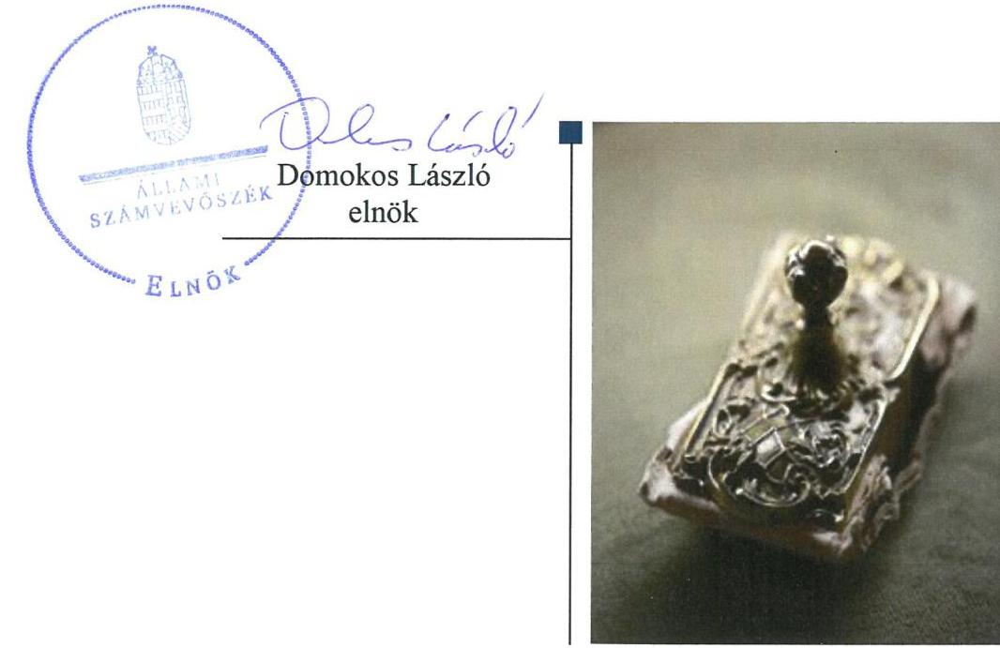
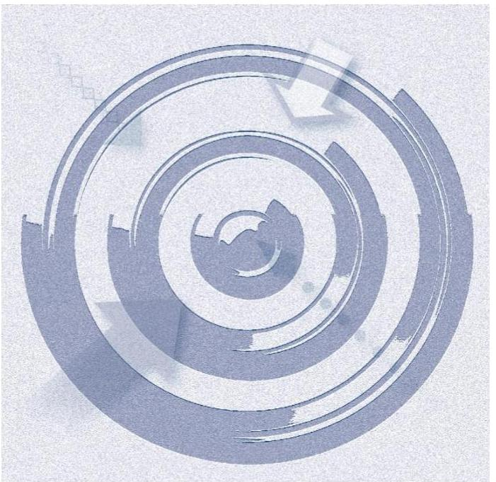
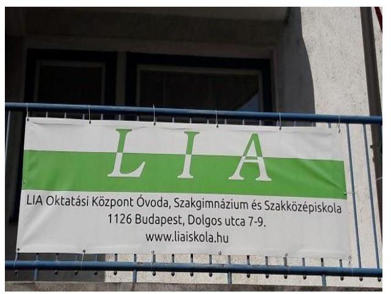
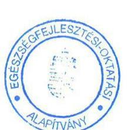
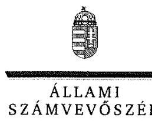
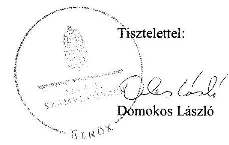
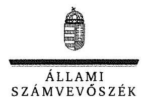

# Jelentés 

## Nem állami humánszolgáltatók ellenőrzése

A humánszolgáltatást nyújtó államháztartáson kívüli köznevelési és szociális intézmények, szolgáltatók fenntartói központi költségvetésből kapott támogatásai felhasználásának ellenőrzése - Egészségfejlesztési-Oktatási Alapítvány 2018.

---

# Jelentés 

## Nem állami humánszolgáltatók ellenőrzése

A humánszolgáltatást nyújtó államháztartáson kívüli köznevelési és szociális intézmények, szolgáltatók fenntartói központi költségvetésből kapott támogatásai felhasználásának ellenőrzése - Egészségfejlesztési-Oktatási Alapítvány
2018. 12. hó 16. nap

---

# AZ ELLENŐRZÉST FELÜGYELTE:

DR. NAGY IMRE felügyeleti vezető

# AZ ELLENŐRZÉST VEZETTE ÉS A VÉGREHAJTÁSÁÉRT FELELŐS:

MOLNÁR ZSUZSANNA ellenőrzésvezető

# A PROGRAM ÖSSZEÁLLÍTÁSÁÉRT FELELŐS:

TÓTPÁL SZABOLCS osztályvezető

---

IKTATÓSZÁM: EL-0379-017/2017.

TÉMASZÁM: 2448

ELLENŐRZÉS-AZONOSÍTÓ SZÁM: V079410

---

Jelentéseink az Országgyűlés számítógépes hálózatán és az Interneten a www.asz.hu címen is olvashatóak.

---

# TARTALOMJEGYZÉK 

■ ÖSSZEGZÉS ..... 5
■ AZ ELLENŐRZÉS CÉLJA ..... 6
■ AZ ELLENŐRZÉS TERÜLETE ..... 7
■ AZ ELLENŐRZÉS HÁTTERE, INDOKOLTSÁGA ..... 8
■ A JELENTÉS LÉNYEGES KÉRDÉSKÖREI ..... 9
■ AZ ELLENŐRZÉS HATÓKÖRE ÉS MÓDSZEREI ..... 10
■ MEGÁLLAPÍTÁSOK ..... 12
■ JAVASLATOK ..... 16
■ MELLÉKLETEK ..... 17
I. sz. melléklet: Értelmező szótár ..... 17
■ FÜGGELÉK: ÉSZREVÉTELEK ..... 19
■ RÖVIDÍTÉSEK JEGYZÉKE ..... 25

---

.

---

# ÖSSZEGZÉS 

Az Egészségfejlesztési-Oktatási Alapítvány - mint intézményfenntartó - megteremtette a költségvetési támogatások igénybevételének feltételeit, a támogatások felhasználásának átláthatóságát, elszámoltathatóságát biztosító szabályszerű gazdálkodási környezetet nem alakította ki. A köznevelési feladathoz rendelt költségvetési támogatásokat szabályszerűen fordította intézménye működtetésére. Beszámolási kötelezettségét nem teljesítette szabályszerűen, a közérdekű adatok közzétételi kötelezettségének nem tett eleget, ezáltal a közpénzekkel való gazdálkodásának átláthatóságát a nyilvánosság előtt nem biztosította.

## Az ellenőrzés társadalmi indokoltsága

Az Állami Számvevőszék stratégiájában hangsúlyos szerepet szán annak, hogy szilárd szakmai alapon álló, értékteremtő ellenőrzéseivel előmozdítsa a közpénzügyek átláthatóságát, rendezettségét, javaslataival a közpénzek és a közvagyon szabályos, gazdaságos, hatékony és eredményes felhasználását segítse. Stratégiájában az Állami Számvevőszék célul tűzte ki, hogy az államháztartáson kívülre nyújtott költségvetési támogatások ellenőrzésével hozzájárul ahhoz, hogy a közpénzeket az államháztartáson kívüli szervezetek is átlátható módon használják fel a közfeladatok szerződésben vállalt ellátása érdekében. Tekintettel az elmúlt években a köznevelés finanszírozását és a köznevelési intézmények fenntartását érintően végbement változásokra, a társadalom fokozott érdeklődéssel figyeli a köznevelési feladatok ellátására fordított források felhasználását. Fontos ezért az Állami Számvevőszéknek a közvéleményt biztosítania arról, hogy a közpénz államháztartáson kívüli felhasználása ezen a területen sem marad ellenőrizetlenül. Az ellenőrzés hozzájárul ahhoz is, hogy a nyilvánosság és a közszolgáltatást igénybevevők megfelelő tájékoztatást kapjanak az államháztartáson kívüli közfeladatot ellátók működéséről. Az Egészségfejlesztési-Oktatási Alapítványnál végzett ellenőrzést indokolja, hogy az alapítvány döntően közpénzekből biztosítja az érettségi vizsga utáni szakmai és nyelvi képzés lehetőségét az igénybevevők számára.

## Főbb megállapítások, következtetések, javaslatok

Az Egészségfejlesztési-Oktatási Alapítvány, mint intézményfenntartó számviteli politikájának tartalma nem felelt meg a jogszabályi előírásoknak, a támogatások felhasználásának átláthatóságát, elszámoltathatóságát biztosító szabályszerű gazdálkodási környezetet nem alakította ki. A költségvetési támogatások igénybevételének feltételeit az átvállalt közfeladat ellátás jogszabályi előírásoknak megfelelő megszervezésével megteremtette. A költségvetési támogatásokkal kapcsolatos igénylési, módosítási, elszámolási kötelezettségnek a Magyar Államkincstár felé a jogszabályi előírásoknak megfelelően eleget tett.

Az Egészségfejlesztési-Oktatási Alapítvány a humánszolgáltató intézménye közfeladat ellátásának működési kereteit szabályszerűen kialakította. Az intézmény szervezeti, személyi és tárgyi feltételeinek megteremtéséről gondoskodott. A köznevelési közfeladat ellátására kapott támogatást a jogszabályi előírásoknak megfelelően átadta intézményének, felhasználását azonban nem szabályszerűen tartotta nyilván.

Az Egészségfejlesztési-Oktatási Alapítvány nem végzett ellenőrzési és értékelési feladatokat, így annak hiányában nem alapozta meg a felhasznált közpénzek gazdálkodásával történő elszámolását. Beszámolási kötelezettségét nem teljesítette szabályszerűen, a kötelezően közzéteendő közérdekű adatokat nem hozta nyilvánosságra. A humánszolgáltatási közfeladatot ellátó intézménye működtetéséhez felhasznált közpénzekre vonatkozó gazdálkodásának átláthatóságát a nyilvánosság előtt nem biztosította.

Az Állami Számvevőszék a jelentésben foglalt megállapítások alapján az Egészségfejlesztési-Oktatási Alapítvány kuratóriumi elnökének a szabályozottsággal, a beszámolási, a nyilvántartási és közzétételi kötelezettségek teljesítésével kapcsolatban hat javaslatot fogalmazott meg. A javaslatokat megalapozó megállapításokra az érintettnek 30 napon belül intézkedési tervet kell készítenie.

---

# AZ ELLENŐRZÉS CÉLJA

**AZ ELLENŐRZÉS CÉLJA** annak értékelése volt, hogy az Egészségfejlesztési-Oktatási Alapítvány, mint köznevelési intézményfenntartó központi költségvetésből kapott támogatásainak felhasználása szabályszerű volt-e, a támogatások igénylése, évközi módosítása és év végi elszámolása megfelelte-e a jogszabályi előírásoknak.

---

# AZ ELLENŐRZÉS TERÜLETE 

## Az Egészségfejlesztési-Oktatási Alapítvány, mint intézményfenntartó

Az Egészségfejlesztési-Oktatási Alapítványt 2001-ben egy magánszemély hozta létre azzal a céllal, hogy biztosítsák az érettségizett, de szakmai végzettséggel nem rendelkező fiatalok számára a közép- és emelt szintű OKJ-s ${ }^{1}$ végzettség megszerzésének lehetőségét.

A Fenntartó ${ }^{2}$ vállalkozási tevékenységet az ellenőrzött időszakban nem folytatott.

Ügyvezető szerve a három főből álló kuratórium volt, akiknek személye az ellenőrzött időszakban nem változott. A Fenntartó képviseletére a kuratórium elnöke és társelnöke volt jogosult.

A Fenntartó 2001-ben megalapította a LIA Oktatási Központ Óvoda, Szakgimnázium és Szakközépiskola nevet viselő iskola egykori jogelőd intézményét. Az intézmény óvodai nevelési, szakgimnáziumi és szakközépiskolai nevelés-oktatási feladatokat látott el. Az intézmény ${ }^{3}$ budapesti székhelyén és telephelyén kívül 2016-ban hat városban rendelkezett telephellyel: Debrecenben, Gödöllőn, Győrben, Kaposváron, Veszprémben és Szolnokon.

Az intézményben a tanulólétszám folyamatosan csökkent. A 2014. évre 1983 fő, a 2015. évre 1363 fő, a 2016. évre 559 fő után igényelt költségvetési támogatást a Fenntartó.

A Fenntartót - a kincstári elszámolás alapján - megillető támogatás összege az ellenőrzött időszakban folyamatosan csökkent. A 2014. évi 582,7 M Ft-ról 2015-ben 379,0 M Ft-ra, 2016-ban pedig 140,3 M Ft-ra mérséklődött. A Fenntartó 2014. évi 115,9 M Ft összegű befektetett eszköz állománya 2016-ra 5\%-kal csökkent, rövid lejáratú kötelezettség állománya 8\%-kal nőtt, hosszú lejáratú kötelezettsége a Fenntartónak 2014-2016. között nem volt.

---

# AZ ELLENŐRZÉS HÁTTERE, INDOKOLTSÁGA 

A köznevelési feladatokat ellátó nem állami intézményfenntartók részére közfeladataik ellátására évente jelentős összegű pénzügyi támogatást biztosítottak a mindenkori költségvetési törvények a bennük megfogalmazott feltételek mellett.

Az Országgyűlés elfogadta a nemzeti köznevelésről szóló 2011. évi CXC. törvényt, amely jelentősen átalakította a korábbi finanszírozási rendszert 2013 szeptemberétől. Új feladatfinanszírozási forma (átlagbéralapú támogatás) jelent meg, amely az államháztartáson kívüli intézményfenntartókra is vonatkozik. Az ellenőrzés a finanszírozási rendszerben bekövetkezett változásokra, azok közfeladat ellátásra gyakorolt hatására fókuszált a költségvetési támogatásokat felhasználó államháztartáson kívüli szervezetek körében. Az ellenőrzés indokoltságát az is alátámasztotta, hogy az ÁSZ ${ }^{4}$ még nem ellenőrizte átfogóan e területet.

Az ÁSZ stratégiájában foglaltak alapján is indokolt az ellenőrzés, amely a társadalom számára jelzi, hogy a közpénz államháztartáson kívüli felhasználása sem maradhat ellenőrizetlenül. Az államháztartáson kívülre nyújtott költségvetési támogatások ellenőrzésével az ÁSZ hozzájárul ahhoz, hogy a közpénzeket a nem állami fenntartók átlátható módon használják fel a közfeladatok ellátására kötött szerződésekben vállalt kötelezettségek teljesítése érdekében. Az ÁSZ az ellenőrzés javaslataival hozzájárulhat az említett rendszerek szabályszerű támogatás-felhasználásához, javíthatja a társadalmi-gazdasági döntések megalapozottságát, amely a „jó kormányzás" feltétele.

---

# A JELENTÉS LÉNYEGES KÉRDÉSKÖREI 

1. A köznevelési humánszolgáltatási közfeladatot ellátó Fenntartó szabályszerű működési - és gazdálkodási környezet kialakításával megteremtette-e a költségvetési támogatások átlátható, elszámoltatható igénybevételének, felhasználásának feltételeit?
2. Az államháztartáson kívüli Fenntartó az átvállalt köznevelési közfeladathoz biztosított költségvetési támogatásokat szabályszerűen fordította-e a humánszolgáltató intézménye működtetésére?
3. Az államháztartáson kívüli Fenntartó a köznevelési intézménye működtetéséhez felhasznált közpénzekre vonatkozó gazdálkodásával a nyilvánosság előtt elszámolt-e, ennek megalapozása érdekében ellenőrzési, értékelési és a külső ellenőrzésekkel kapcsolatos intézkedési feladatait szabályszerűen látta-e el?

---

# AZ ELLENŐRZÉS HATÓKÖRE ÉS MÓDSZEREI 

## Az ellenőrzés típusa

Megfelelőségi ellenőrzés.

## Az ellenőrzött időszak

A 2014. január 1-je és 2016. december 31-e közötti időszak.

## Az ellenőrzés tárgya

Az ellenőrzés a köznevelési közfeladatokat ellátó államháztartáson kívüli fenntartó közfeladatainak ellátásához a költségvetési törvényekben biztosított központi költségvetési támogatások igénylése, évközi módosítása és év végi elszámolása fenntartói feladatainak ellátása, illetve e központi költségvetésből kapott támogatásaik közfeladatokra való fenntartó általi felhasználása szabályszerűségének értékelésére terjedt ki.

Az ellenőrzés nem terjedt ki a költségvetési támogatás igénylése, módosítása, elszámolása valódiságának, megalapozottságának, helyességének értékelésére, valamint a források intézmény általi felhasználásának értékelésére.

## Az ellenőrzött szervezet

Az Egészségfejlesztési-Oktatási Alapítvány, mint intézményfenntartó.

## Az ellenőrzés jogalapja

Az ellenőrzés jogszabályi alapját az ÁSZ tv. 1. § (3) bekezdésében, valamint az 5. § (3) bekezdésében foglalt előírások adták.

## Az ellenőrzés módszerei

Az ellenőrzést az ellenőrzési program kérdései, az adott időszakban hatályos jogszabályok, az ellenőrzés szakmai szabályok és módszertanok, valamint a nemzetközi standardok figyelembevételével végezte az ÁSZ.

A közpénzekkel való felelős gazdálkodás segítésére irányuló javaslatok kidolgozásakor a hatályos jogszabályok voltak az irányadóak.

Az ellenőrzés ideje alatt az ÁSZ a Fenntartóval történő kapcsolattartást az ÁSZ SZMSZ5-ének vonatkozó előírásai alapján biztosította.

---

Az ellenőrzési kérdések megválaszolásához szükséges bizonyítékok megszerzése az ellenőrzött által rendelkezésre bocsátott dokumentumokra, adatokra alapozva történt.

Az ellenőrzési bizonyítékként felhasznált adatforrások közé tartoztak egyrészt a szakmai program részletes szempontjainál felsorolt adatforrások, másrészt minden - az ellenőrzés folyamán feltárt, az ellenőrzés szempontjából információt tartalmazó - dokumentum.

Az ellenőrzés lefolytatásához a Fenntartó a kitöltött tanúsítványok, valamint az ÁSZ által kért dokumentumok átadásával szolgáltatott adatokat, információkat. Az így rendelkezésre bocsátott adatok, információk és a tanúsítványok adatai valódiságának kontrollja az ellenőrzés keretében történt.

A fenntartott intézménynél helyszíni szemle keretében győződtünk meg a tényleges feladatellátásról. A köznevelési humánszolgáltatások központi költségvetési támogatásai igénylésével, módosításával, elszámolásával kapcsolatos, államháztartáson kívüli fenntartó jogszabályokban előírt feladatai betartását, továbbá a központi költségvetési támogatások szabályszerű kezelését, nyilvántartását ellenőriztük a Fenntartónál, az ott rendelkezésre álló határozatok, nyilvántartások, beszámolók és egyéb dokumentumok alapján.

---

# MEGÁLLAPÍTÁSOK 

## 1. A köznevelési humánszolgáltatási közfeladatot ellátó Fenntartó szabályszerű működési - és gazdálkodási környezet kialakításával megteremtette-e a költségvetési támogatások átlátható, elszámoltatható igénybevételének, felhasználásának feltételeit?

Összegző megállapítás

A Fenntartó a költségvetési támogatások átlátható, elszámoltatható igénybevételének feltételeit megteremtette, a támogatások felhasználásának átláthatóságát, elszámoltathatóságát támogató szabályszerű számviteli szabályozást nem alakította ki.
1.1. számú megállapítás

A Fenntartó számviteli politikájának tartalma nem felelt meg a jogszabályi előírásoknak. A köznevelési közfeladat ellátását a jogszabályi előírások szerint megszervezte.

A Fenntartó számviteli politikájának ${ }^{6}$ tartalma nem felelt meg a Civilszr.ben ${ }^{7}$ foglaltaknak, mert - a Civilszr. 16. § (6) bekezdésében foglaltak ellenére - nem egyéb bevételként, illetve egyéb ráfordításként írta elő a továbbutalási céllal kapott támogatások elszámolását, hanem hosszú lejáratú kötelezettségként. Nem rögzítették a számviteli politikában - a Számv. tv. ${ }^{8}$ 14. § (4) és (11) bekezdéseiben előírtak ellenére - hogy mit tekintenek kivételes nagyságú vagy előfordulású bevételnek, költségnek, ráfordításnak.

A Fenntartót a Bíróság ${ }^{9}$ nyilvántartásba vette és rendelkezett a Ptk. ${ }^{10}$ előírásainak megfelelő alapító okirattal ${ }^{11}$. Szervezeti és működési szabályait SZMSZ ${ }^{12}$-ében, a költségvetési támogatás igénylésével, elszámolásával kapcsolatos szabályokat a költségvetési tervezési szabályzatban ${ }^{13}$ határozta meg a Fenntartó. A felelősségi körök meghatározásával szabályozta az engedélyezési, jóváhagyási, kontrolleljárásokat, valamint meghatározta az iratkezelés, a dokumentumokhoz való hozzáférés szabályait.
1.2. számú megállapítás

A Fenntartó a költségvetési támogatások igénylési, módosítási és elszámolási feladatait szabályszerűen látta el.

A költségvetési támogatások iránti igényét a Fenntartó az Nkt. vhr. ${ }^{14}$-ben előírt nyilatkozatokkal a 2014-2016. évekre vonatkozóan határidőre benyújtotta a Kincstárhoz ${ }^{15}$. A Fenntartó rendelkezett a költségvetési

 támogatásokat megállapító kincstári határozatokkal.

A Fenntartó minden évben határidőben eleget tett az Nkt. vhr.-ben foglaltaknak megfelelően a Kincstár felé - a költségvetési támogatás igényléséhez kötődő létszám adatokban bekövetkezett változással kapcsolatos bejelentési kötelezettségének.

A Fenntartó a központi költségvetésből kapott támogatásokra vonatkozó elszámolását minden évben benyújtotta az Nkt. vhr.-ben foglaltak

---

szerint, határidőben a Kincstár felé. A 2016. évi elszámolás során a Kincstár hiánypótlási felszólításának a Fenntartó eleget tett.

# 2. Az államháztartáson kívüli Fenntartó az átvállalt köznevelési közfeladathoz biztosított költségvetési támogatásokat szabályszerűen fordította-e a humánszolgáltató intézménye működtetésére? 

Összegző megállapítás

### 2.1. számú megállapítás

A Fenntartó az átvállalt köznevelési feladathoz biztosított költségvetési támogatásokat szabályszerűen fordította a közfeladatot ellátó intézménye működtetésére, a támogatás felhasználásának nyilvántartása azonban nem felelt meg a jogszabályi előírásnak.

A Fenntartó biztosította intézménye működtetésének szervezeti, személyi és tárgyi feltételeit.

Az intézmény alapító okiratát ${ }_{1-4}{ }^{16}$ - amely az Nkt. ${ }^{17}$ előírásainak megfelelően tartalmazta az intézmény és a Fenntartó nevét, székhelyét, az intézmény feladat-ellátási helyét, a feladat-ellátási helyenként felvehető maximális gyermek-, tanulólétszámot, a feladatellátást szolgáló vagyont és az a feletti rendelkezési jogot és az intézmény gazdálkodási jogosítványait - a Fenntartó kiadta. Az Intézményt a Kormányhivatal ${ }^{18}$ nyilvántartásba vette, az Nkt. vhr.-ben meghatározott $\mathrm{OM}^{19}$ azonosítóval rendelkezett.

A Fenntartó az Nkt. rendelkezésének megfelelően kinevezte az intézmény vezetőjét, meghatározta az intézmény költségvetéseit és az intézmény által kérhető térítési díj és tandíj megállapításának szabályait.

A Fenntartó megállapította intézménye könyvvezetési, beszámoló készítési kötelezettségét a Számv. tv.-ben foglaltaknak megfelelően.

A Fenntartó rendelkezett az intézmény - a közfeladat ellátáshoz szükséges személyi és tárgyi feltételek meglétét igazoló - működési engedélyével.

A Fenntartó a köznevelési közfeladat ellátására kapott támogatást szabályszerűen adta át intézményének, felhasználását azonban nem a jogszabályi előírásnak megfelelően tartotta nyilván.

A Fenntartó a Kincstár által 2014-2016. években a köznevelési feladat ellátására folyósított központi költségvetési támogatás teljes összegét átadta intézményének. A támogatásokat a Kvtv. ${ }_{1-3}{ }^{20}$ által meghatározott határidőben utalta tovább a Fenntartó.

A költségvetési támogatások felhasználásának nyilvántartása nem felelt meg az Nkt. vhr. 37/G. § (1) bekezdésében előírtaknak, mert a Fenntartó a támogatás felhasználásáról nem vezetett alapfeladatonkénti bontásban elkülönített nyilvántartást.

---

# 3. Az államháztartáson kívüli Fenntartó a köznevelési intézménye működtetéséhez felhasznált közpénzekre vonatkozó gazdálkodásával a nyilvánosság előtt elszámolt-e, ennek megalapozása érdekében ellenőrzési, értékelési és a külső ellenőrzésekkel kapcsolatos intézkedési feladatait szabályszerűen látta-e el? 

Összegző megállapítás

A Fenntartó a köznevelési intézménye működtetéséhez felhasznált közpénzekre vonatkozó gazdálkodását a nyilvánosság számára nem tette átláthatóvá, ellenőrzési és értékelési feladatokat nem végzett. Beszámolási kötelezettségét nem teljesítette szabályszerűen.
3.1. számú megállapítás

A Fenntartó ellenőrzési és értékelési feladatokat nem végzett, a külső ellenőrzés eredményeként keletkezett intézkedési kötelezettségének eleget tett.

A Fenntartó alapító okirata szerint működésének és gazdálkodásának ellenőrzésére felügyelő bizottságot ${ }^{21}$ hozott létre, amely az ellenőrzött időszakban nem végzett ellenőrzést.

A Fenntartó nem ellenőrizte - az Nkt. 83. § (2) bekezdés e), h) és i) pontjai alapján - az intézmény pedagógiai programját, házirendjét, valamint a SZMSZ-ét az ellenőrzött időszakban és nem értékelte a nevelési-oktatási intézmény pedagógiai programjában meghatározott feladatok végrehajtását, a pedagógiai-szakmai munka eredményességét.

A Kormányhivatal által végzett törvényességi ellenőrzés eredményeként keletkezett intézkedési kötelezettségének a Fenntartó eleget tett.
3.2. számú megállapítás

A Fenntartó beszámolási kötelezettségét nem teljesítette szabályszerűen, a felhasznált közpénzekre vonatkozó közzétételi kötelezettségének nem tett eleget.

A Fenntartó az ellenőrzött időszakban a jogszabályi előírásoknak és gazdálkodási szabályzatának ${ }^{22}$ megfelelően egyszerűsített éves beszámolót készített. Az egyszerűsített éves beszámolók - Civil tv. ${ }^{23}$ 29. § (2) bekezdés c) pontjában és a Civilszr. 6. § (6) bekezdésében foglaltak ellenére - nem tartalmaztak kiegészítő mellékletet. Az eredmény-kimutatásban a továbbutalási céllal kapott támogatás - a Civilszr. 16. § (6) bekezdésében foglaltak ellenére - nem egyéb bevételként, hanem hosszú lejáratú kötelezettségként került kimutatásra.

A közérdekű adatok megismerésére irányuló igények teljesítésének a rendjét a Fenntartó az Info tv. ${ }^{24} 30$. § (6) bekezdésében előírtak ellenére nem szabályozta.

Az Info tv.-ben meghatározott közzétételi listákon szereplő adatok pontos, naprakész és folyamatos közzétételének a részletes szabályait az Info tv. 35. § (3) bekezdésben foglalt előírások ellenére - mint adatfelelős és adatközlő szerv - nem állapította meg a Fenntartó.

---

Nem gondoskodott a Fenntartó az Info tv. 37. § (1) bekezdésében és alapító okiratában foglaltak ellenére az Info tv. 1. melléklet általános közzétételi listában felsorolt adatoknak a közzétételéről.

---

# JAVASLATOK 

Az ÁSZ tv. 33. § (1) bekezdésében foglaltak értelmében az ellenőrzött szervezet vezetője köteles a jelentésben foglalt megállapításokhoz kapcsolódó intézkedési tervet összeállítani és azt a jelentés kézhezvételétől számított 30 napon belül az ÁSZ részére megküldeni. Amennyiben az ellenőrzött szervezet vezetője nem küldi meg határidőben az intézkedési tervet, vagy továbbra sem elfogadható intézkedési tervet küld, az Állami Számvevőszék elnöke az ÁSZ tv. 33. § (3) bekezdése a) és b) pontjaiban foglaltakat érvényesítheti.

## Az Egészségfejlesztési-Oktatási Alapítvány kuratóriumi társelnökének

1. Intézkedjen a számviteli politika módosításáról, hogy megfeleljen a jogszabály aktuális rendelkezéseinek.
(1.1. sz. megállapítás 1. bekezdése alapján)
2. Intézkedjen, hogy a költségvetési támogatások felhasználásának nyilvántartása feleljen meg a jogszabályban előírtaknak.
(2.2. sz. megállapítás 2. bekezdése alapján)
3. Intézkedjen, hogy az egyszerűsített éves beszámoló feleljen meg a jogszabályban foglalt követelményeknek.
(3.2. sz. megállapítás 1. bekezdés 2.-3. mondata alapján)
4. Gondoskodjon az Info tv. előírásai alapján a közérdekű adatok megismerésére irányuló igények teljesítési rendjének szabályozásáról.
(3.2. sz. megállapítás 2. bekezdése alapján)
5. Gondoskodjon az Info tv. előírásai alapján a közzétételi kötelezettség teljesítésének részletes szabályai megállapításáról.
(3.2. sz. megállapítás 3. bekezdése alapján)
6. Tegyen eleget az Info tv.-ben és annak 1. mellékletében, valamint alapító okiratában foglaltak szerinti közzétételi kötelezettségnek.
(3.2. sz. megállapítás 4. bekezdése alapján)

---

# MELLÉKLETEK 

## I. SZ. MELLÉKLET: ÉRTELMEZŐ SZÓTÁR

humánszolgáltatás
költségvetési támogatás
köznevelési közfeladat

Külön törvényben meghatározott szociális, gyermekjóléti, gyermekvédelmi, közoktatási, felsőoktatási, kulturális közfeladatok (2014. évi Kvtv. 34. § (1), (4) bekezdés, 1. számú melléklet XX/20/2. alcím, 19. alcím, 2015. évi Kvtv. 43. § (1), (4) bekezdés, 1. számú melléklet XX/20/2/3. jogcím csoport, 19. alcím, 2016. évi Kvtv. 41. § (1), (4) bekezdés, 1. számú melléklet XX/20/2/3. jogcím csoport, 19. alcím).
a társadalombiztosítás pénzügyi alapjai kivételével az államháztartás központi alrendszeréből ellenérték nélkül, pénzben nyújtott támogatások (Áht. 1. § 14. pont)
A Kvtv-ekben (2013. évi CCXXX. törvény 33-34. §, 2014. évi C. törvény 42-43. §, 2015. évi C. törvény 40-41. §) megállapított támogatás. Például a 2015. évi C. törvény 40-41. § szerint többek között: Az Országgyűlés a köznevelési feladat ellátására átlagbéralapú támogatást állapít meg. A nevelési-oktatási, valamint pedagógiai szakszolgálati intézményt fenntartó nemzetiségi önkormányzat, az egyházi és magán köznevelési intézményfenntartója részére az általuk fenntartott nevelési-oktatási intézményben, továbbá pedagógiai szakszolgálati intézményben pedagógus és - a b) pont kivételével -nevelő-oktató munkát közvetlenül segítő munkakörben foglalkoztatottak után a 7. melléklet I. pontja, valamint az óvoda, egységes óvoda-bölcsőde esetében a 2. melléklet II. pont 1. alpontja szerint és az 5. alpontjában meghatározott jogosultak után, az őket ott megillető mértékek szerint. Működési támogatást állapít meg a nemzetiségi önkormányzat vagy az egyházi jogi személy által fenntartott nevelési-oktatási intézményekben ellátott, továbbá a pedagógiai szakszolgálati intézményekben gyógypedagógiai tanácsadásban, korai fejlesztésben, oktatásban és gondozásban, valamint a fejlesztő nevelésben részt vevő gyermekekre, tanulókra tekintettel a nemzetiségi önkormányzat és a bevett egyház részére a 7. melléklet II. pontja szerint.
Az Országgyűlés a szociális, gyermekjóléti, gyermekvédelmi közfeladatot ellátó intézményt, szolgáltatást fenntartó egyházi jogi személy, civil szervezet, közalapítvány, országos nemzetiségi önkormányzat, települési vagy területi nemzetiségi önkormányzat, gazdasági társaság, és a humánszolgáltatást alaptevékenységként végző, az Szja tv. hatálya alá tartozó egyéni vállalkozó (a továbbiakban együtt: nem állami szociális fenntartó) részére támogatást állapít meg a következők szerint: a támogatás a nem állami szociális fenntartót a települési önkormányzatok 2. melléklet III. pont 3. alpont c)-k) pontjában és III. pont 5. alpont a) pontjában meghatározott támogatásaival azonos jogcímeken, összegben és feltételek mellett illeti meg.
A köznevelési intézmény alapító okiratában foglalt feladat: óvodai nevelés, nemzetiséghez tartozók óvodai nevelése, általános iskolai nevelés-oktatás, nemzetiséghez tartozók általános iskolai nevelése-oktatása, kollégiumi ellátás, nemzetiségi kollégiumi ellátás, gimnáziumi nevelés-oktatás, szakközépiskolai nevelés-oktatás, szakiskolai nevelés-oktatás, nemzetiség gimnáziumi nevelés-oktatása, nemzetiség szakközépiskolai nevelés-oktatása, nemzetiség szakiskolai nevelés-oktatása, Köznevelési Hídprogramok keretében folyó nevelés-oktatás, felnőttoktatás, alapfokú művészetoktatás, fejlesztő nevelés, fejlesztő nevelés-oktatás, pedagógiai szakszolgálati feladat, a többi gyermekkel, tanulóval együtt nevelhető, oktatható sajátos nevelési igényű gyermekek, tanulók óvodai nevelése és iskolai nevelése-oktatása, azoknak a sajátos nevelési igényű gyermekeknek, tanulóknak az óvodai, iskolai, kollégiumi ellátása, akik a többi gyermekkel, tanulóval nem foglalkoztathatók együtt, a gyermekgyógyüdülőkben, egészségügyi intézményekben, rehabilitációs intézményekben tartós gyógykezelés alatt álló gyermekek tankötelezettségének teljesítéséhez szükséges oktatás, pedagógiai-szakmai szolgáltatás.

---

# Mellékletek 

köznevelési intézmény
nem állami, nem önkormányzati (államháztartáson kívüli) intézményfenntartó

A nevelési- oktatási intézmény, pedagógiai szakszolgálati intézmény, pedagógiai-szakmai szolgáltatást nyújtó intézmény.
A köznevelési és szociális, gyermekjóléti és gyermekvédelmi közfeladatokat/humánszolgáltatásokat ellátó intézményt fenntartó egyházi jogi személy, társadalmi szervezet, alapítvány, közalapítvány, civil szervezet, országos nemzetiségi önkormányzat, nonprofit gazdasági társaság, gazdasági társaság és a humánszolgáltatást alaptevékenységként végző, Szja tv. hatálya alá tartozó egyéni vállalkozó. (2013. évi Kvtv. 35. § (1), (3) bekezdés, 2014. évi Kvtv. 33. §, 34. § (1), (4) bekezdés, 2015. évi Kvtv. 42. §, 43. § (1), (4) bekezdés, 2016. évi Kvtv. 40. §, 41. § (1), (4) bekezdés)

---

# FÜGGELÉK: ÉSZREVÉTELEK 

A jelentéstervezetet a Számvevőszék 15 napos észrevételezésre megküldte az ellenőrzött szervezet vezetőjének az ÁSZ tv. 29. §* (1) bekezdése előírásának megfelelően.

Az Egészségfejlesztési-Oktatási Alapítvány kuratóriumi társelnöke élt az ÁSZ tv. 29. § (2) bekezdésében foglalt észrevételezési jogával, a törvényes határidőn belül észrevételt tett.
A függelék tartalmazza az ellenőrzött észrevételeit, illetve az el nem fogadott észrevételek elutasításának indoklását.

[^0]
[^0]:    * 29. § (1) Az Állami Számvevőszék az ellenőrzési megállapításait megküldi az ellenőrzött szervezet vezetőjének vagy az általa megbízott személynek, és annak, akinek személyes felelősségét állapította meg.
    (2) Az ellenőrzött szervezet vezetője és a felelősként megjelölt személy az ellenőrzés megállapításaira tizenöt napon belül írásban észrevételt tehet.
    (3) Az Állami Számvevőszék az észrevételre a beérkezésétől számított harminc napon belül írásban válaszol. A figyelembe nem vett észrevételeket köteles a jelentésben feltüntetni, és megindokolni, hogy azokat miért nem fogadta el.

---

# EGÉSZSÉGFEJLESZTÉSI-OKTATÁSI ALAPÍTVÁNY 1125 BUDAPEST, DIÓS ÁROK 60/D Telefon: 06-30-9322-404 

## ÁLLAMI SZÁMVEVŐSZÉK   Domokos László   elnök

## Tisztelt Elnök Úr!

Köszönettel megkaptuk a „Nem állami humánszolgáltatók ellenőrzése - A humánszolgáltatást nyújtó államháztartáson kívüli köznevelési és szociális intézmények, szolgáltatók fenntartói központi költségvetésből kapott támogatásai felhasználásának ellenőrzése - EgészségfejlesztésiOktatási Alapítvány" címmel készült számvevői jelentéstervezetet, amelyre az alábbi észrevételt tesszük.

Kérjük szépen az 1.1. számú megállapításban a „A Fenntartó számviteli politikájának tartalma nem felelt meg a jogszabályi előírásoknak" megfogalmazás helyett a
 részben nem felelt meg, mivel csak 2 apró hiba volt benne, nevezetesen a továbbutalási céllal kapott támogatásokat nem egyéb bevételként és egyéb ráfordításként írta elő a számviteli politika, hanem hosszú lejáratú kötelezettségként, illetve nem rögzítette, hogy mit tekint kivételes nagyságú vagy előfordulású bevételnek. Egyebekben teljes egészében megfelel a jogszabályi előírásoknak.

Kérjük a 3.1. számú megállapításban „Fenntartó ellenőrzési és értékelési feladatokat nem végzett” helyett „értékelési és ellenőrzési feladatokat nem teljeskörűen végzett”, mivel a fenntartó ellenőrizte az intézmény pedagógiai programját, házirendjét és az SZMSZ-ét.

A feltöltött dokumentumok között található a határozatok tára, amelynek itt kivonatolt határozatai demonstrálják, hogy az ellenőrzés minden esetben megtörtént, amikor az említett három dokumentum felülvizsgálatra szorult.

| 2014/8 | A pedagógiai program felülvizsgálata, kibővítése   során nem merült fel többletfinanszírozás   (többletórák, kötelezőn felüli eszköz stb.) a   pedagógiai programot a kuratórium tudomásul   vette. | 2014.   augusztus 26. | Dr. Koncz   Kornélia Ph.D |
| :-- | :-- | :-- | :-- |

| 2014/9 | A kuratórium az intézmény 2014/2015-ös tanév   pedagógiai programját, SZMSZ-ét és házirendjét   ellenőrizte és egyetértett vele. | 2014.   augusztus 26. | Dr. Koncz   Kornélia Ph.D |
| :-- | :-- | :-- | :-- |

| 2016/11 | A kuratórium az intézmény 2016/2017-es tanév   SZMSZ-ét és házirendjét ellenőrizte és egyetértett   vele. | 2016.   augusztus 22. | Dr. Koncz   Kornélia Ph.D |
| :-- | :-- | :-- | :-- |

| 2016/12 | A kuratórium az intézmény 2016/2017-ös tanév   pedagógiai programját ellenőrizte és egyetértett   vele. | 2016.   augusztus 22. | Dr. Koncz   Kornélia Ph.D |

---

2015-ben nem merült fel olyan körülmény, amely miatt pedagógiai programot, házirendet, és SZMSZ-t módosítani kellett volna.

Kérjük a 3.2. számú megállapításban „... a közpénzekre vonatkozó közzétételi kötelezettségének nem tett eleget” helyett „a közpénzekre vonatkozó közzétételi kötelezettségének csak részben tett eleget”, mivel a Bírósági Hivatal honlapjára feltöltött éves beszámoló a kötelezően előírt mellékletekkel együtt szerepel, valamint a beszámoló az alapító okiratban is szereplő módon a fenntartó intézményének székhelyén kifüggesztésre került.

Egyebekben kérjük javítani a végleges jelentés 22. oldalán a Világi Zsidó Iskola Alapítvány Felügyelő Bizottsága helyett az Egészségfejlesztési-Oktatási Alapítvány Felügyelő Bizottságára.

A jelentés többi megállapításával egyetértünk. 2018. január 1-jétől könyvelőváltás történt, valamint október hónapban a fenntartó alapító okirata is módosításra került. A továbbiakban nagyon figyelünk majd arra, hogy a kifogásolt kisebb-nagyobb hiányosságok, pontatlanságok ne forduljanak elő.

Budapest, 2018. október 24.

Tisztelettel

Dr. Koncz Kornélia
kuratóriumi társelnök

---

ELNÖK

# Dr. Koncz Kornélia Ph.D Úrhölgy 

kuratóriumi társelnök

Egészségfejlesztési-Oktatási Alapítvány

## Budapest

## Tisztelt Társelnök Úrhölgy!

A ,,Nem állami humánszolgáltatók ellenőrzése - A humánszolgáltatást nyújtó államháztartáson kivüli köznevelési és szociális intézmények, szolgáltatók fenntartói központi költségvetésből kapott támogatásai felhasználásának ellenőrzése - Egészségfejlesztési-Oktatási Alapítvány" címmel készített számvevőszéki jelentéstervezetre tett észrevételeit köszönettel megkaptam.
Az Állami Számvevőszék észrevételekre vonatkozó álláspontjáról a felügyeleti vezető által készített részletes tájékoztatást csatoltan megküldöm.
Tájékoztatom Társelnök úrhölgyet, hogy a számvevőszéki jelentésben - az Állami Számvevőszékről szóló 2011. évi LXVI. törvény 29. § (3) bekezdése alapján - a figyelembe nem vett észrevételeket szerepeltetjük annak megindoklásával, hogy azokat miért nem fogadtuk el.
Budapest, 2018. október 14.

Melléklet: Tájékoztatás az észrevételek kezeléséről

---

FELÜGYELETI VEZETŐ

Melléklet
Ikt.szám: EL-0700-041/2018.

# Tájékoztatás   az észrevételek kezeléséről 

A „Nem állami humánszolgáltatók ellenőrzése - A humánszolgáltatást nyújtó államháztartáson kivüli köznevelési és szociális intézmények, szolgáltatók fenntartói központi költségvetésből kapott támogatásai felhasználásának ellenőrzése - Egészségfejlesztési-Oktatási Alapítvány" címû jelentéstervezetre 2018. október 24-én tett (az Állami Számvevőszékhez 2018. október 29-én érkezett) észrevételét áttekintettük, annak kezelésével kapcsolatban a következő tájékoztatást adom.

1. A jelentéstervezet 1.1. számú megállapítás 1. bekezdésére és az 1. számú javaslatra vonatkozó észrevétel:
Az észrevételben az Egészségfejlesztési-Oktatási Alapítvány (továbbiakban: Alapítvány) kéri módosítani a számviteli politikára tett megállapítást „részben nem felelt meg” minősítésre, mivel véleménye szerint a feltárt hiányosságok csak apró hibák voltak.
Az észrevétel a megállapítást nem vitatja, a jelentéstervezet módosítása nem indokolt.

## 2. A jelentéstervezet 3.1. számú megállapítás 2. bekezdésére vonatkozó észrevétel:

Az észrevételben az Alapítvány kéri módosítani az értékelési és ellenőrzési feladatok teljesítésére tett megállapítást „nem teljes körűen végzett” minősítésre, mivel az Alapítvány ellenőrizte az intézmény pedagógiai programját, házirendjét és az SZMSZ-ét. Az ellenőrzések elvégzését a feltöltött határozatok tára szerinti kivonatolt határozatok demonstrálják a 2014. és a 2016. évekre.
Az észrevételt nem fogadjuk el. A 2017. december 11-ei keltezésű, EL-0379-006/2017. iktatószámú adatbekérő levél 2.31. pontjában kért, az Alapítvány által az intézménynél végzett ellenőrzésekről készült dokumentumot, jegyzőkönyvet, az ellenőrzésekről vezetett nyilvántartást az Alapítvány nem bocsátotta az ellenőrzés rendelkezésére. Az Alapítvány kuratóriumi társelnöke által aláírt 2017. december 21-ei keltezésű Teljességi és hitelességi nyilatkozat szerint az adatbekérés hivatkozott pontjához a fenntartó által elvégzett ellenőrzésekről nyilvántartásként az EFOA - Határozatok tárát adták át. Az alapítványi határozatok tára nem azonos az ellenőrzésekről vezetendő nyilvántartással, továbbá az ellenőrzések elvégzését az Alapítvány az Állami Számvevőszék részére átadott jegyzőkönyvvel, egyéb dokumentummal nem igazolta.
Az észrevétel alapján a jelentéstervezet módosítása nem indokolt.

## 3. A jelentéstervezet 3.2. számú megállapítás 4. bekezdésére és a 6. számú javaslatra vonatkozó észrevétel:

Az észrevételben az Alapítvány kéri módosítani a közzétételi kötelezettség teljesítés elmulasztására tett megállapítást „csak részben tett eleget” minősítésre, mivel a Bírósági Hivatal honlapjára feltöltött éves beszámoló a kötelezően előírt mellékletekkel együtt szerepel, valamint a beszámoló

---

az alapító okiratban is szereplő módon a fenntartó intézményének székhelyén kifüggesztésre került.

Az észrevételt nem fogadjuk el. Az információs önrendelkezési jogról és az információszabadságról szóló 2011. évi CXII. törvény (Info tv.) 33. § (1) bekezdése szerint az e törvény alapján kötelezően közzéteendő közérdekű adatokat internetes honlapon, digitális formában, bárki számára, személyazonosítás nélkül, korlátozástól mentesen, kinyomtatható és részleteiben is adatvesztés és -torzulás nélkül kimásolható módon, a betekintés, a letöltés, a nyomtatás, a kimásolás és a hálózati adatátvitel szempontjából is díjmentesen kell hozzáférhetővé tenni (a továbbiakban: elektronikus közzététel). Az Alapítvány észrevételében hivatkozott, a Bírósági Hivatal honlapján, illetve az intézmény székhelyén kifüggesztett beszámoló a hivatkozott jogszabály szerinti közzétételi kötelezettség teljesítéseként nem elfogadható. Az Info tv. 37. §-ában előírt 1. melléklet szerinti általános közzétételi listában meghatározott adatokat az Alapítvány nem tette közzé. Az ellenőrzés időszakában az Alapítvány nem rendelkezett internetes honlappal.
Az észrevétel alapján a jelentéstervezet módosítása nem indokolt.

# 4. A jelentéstervezet 22. oldalára vonatkozó észrevétel: 

Az észrevételben az Alapítvány kéri javítani a rövidítésjegyzékben a 20. hivatkozás magyarázatában jelenleg szereplő téves felügyelő bizottsági megnevezést az Egészségfejlesztési-Oktatási Alapítvány Felügyelő Bizottságára.
Az észrevételt elfogadjuk, a jelentéstervezetet módosítjuk.
Budapest, 2018. november 11.

Dr. Nagy Imre
felügyeleti vezető

---

# RÖVIDÍTÉSEK JEGYZÉKE 

${ }^{1}$ OKI
${ }^{2}$ Fenntartó
${ }^{3}$ intézmény
${ }^{4}$ ÁSZ
${ }^{5}$ ÁSZ SZMSZ
${ }^{6}$ számviteli politika
${ }^{7}$ Civilszr.
${ }^{8}$ Számv. tv.
${ }^{9}$ Bíróság
${ }^{10}$ Ptk.
${ }^{11}$ alapító okirat
${ }^{12}$ SZMSZ
${ }^{13}$ költségvetési tervezési szabályzat
${ }^{14}$ Nkt. vhr.
${ }^{15}$ Kincstár
${ }^{16}$ intézmény alapító okirata ${ }_{1-4}$
${ }^{17}$ Nkt.
${ }^{18}$ Kormányhivatal
${ }^{19}$ OM azonosító
${ }^{20} \mathrm{Kvtv}_{1-3}$

Országos Képzési Jegyzék
Egészségfejlesztési-Oktatási Alapítvány
LIA Alapítványi Óvoda és Szakközépiskola (2016. augusztus 31-ig)
LIA Oktatási Központ Óvoda, Szakgimnázium és Szakközépiskola (2016. szeptember 1-től)
Állami Számvevőszék
az Állami Számvevőszék elnökének 4/2017. (XII. 29.) ÁSZ utasítása az Állami Számvevőszék Szervezeti és Működési Szabályzatáról (hatályos: 2017. január 1-jétől)
Egészségfejlesztési-Oktatási Alapítvány Számviteli politika (hatályos: 2013. szeptember 1-jétől)
224/2000. (XII. 19.) Korm. rendelet az egyes egyéb szervezetek beszámoló készítési és könyvvezetési kötelezettségének sajátosságairól (hatályos 2001. január 1-jétől 2016. december 31-ig)
479/2016. (XII. 28.) Korm. rendelet a számviteli törvény szerinti egyes egyéb szervezetek beszámoló készítési és könyvvezetési kötelezettségének sajátosságairól (hatályos: 2017. január 1-jétől)
2000. évi C. törvény a számvitelről (hatályos 2001. január 1-jétől)

Fővárosi Bíróság
2013. évi V. törvény a Polgári Törvénykönyvről (hatályos: 2014. március 15-től)

Az Egészségfejlesztési-Oktatási Alapítvány Módosításokkal Egybeszerkesztett Alapító Okirata (hatályos 2013. március 21-től)
Az Egészségfejlesztési-Oktatási Alapítvány Szervezeti és Működési Szabályzata (hatályos 2007. október 30-tól)
Egészségfejlesztési-Oktatási Alapítvány Költségvetési Tervezési Szabályzat (hatályos: 2013. január 1-től)
229/2012. (VIII. 28.) Korm. rendelet a nemzeti köznevelésről szóló törvény végrehajtásáról (hatályos 2012. szeptember 1-jétől)
Magyar Államkincstár
1: A LIA Alapítványi Óvoda és Szakközépiskola alapító okirata (hatályos: 2014. január 1-jétől augusztus 31-ig)
2: LIA Alapítványi Óvoda és Szakképző Iskola alapító okirata (2014. szeptember 1-jétől 2015. augusztus 31-ig)
3: LIA Alapítványi Óvoda és Szakképző Iskola alapító okirata (2015. szeptember 1-jétől 2015. augusztus 31-ig)
4: LIA Oktatási Központ Óvoda, Szakgimnázium és Szakközépiskola alapító okirata (2016. szeptember 1-jétől 2016. december 31-ig)
2011. évi CXC. törvény a nemzeti köznevelésről (hatályos: 2012. szeptember 1-jétől)
Budapest Főváros Kormányhivatala
oktatási azonosító szám
1: 2013. évi CCXXX. törvény Magyarország 2014. évi központi költségvetéséről (hatályos: 2014. január 1-jétől)

---

${ }^{21}$ Felügyelő Bizottság
${ }^{22}$ gazdálkodási szabályzat
${ }^{23}$ Civil tv.
${ }^{24}$ Info tv.

2: 2014. évi C. törvény Magyarország 2015. évi központi költségvetéséről (hatályos: 2015. január 1-jétől)
3: 2015. évi C. törvény Magyarország 2016. évi központi költségvetéséről (hatályos: 2015. július 4-jétől)
Egészségfejlesztési-Oktatási Alapítvány Felügyelő Bizottsága
Az Egészségfejlesztési-Oktatási Alapítvány Gazdálkodási Szabályzat (hatályos: 2007. november 1-jétől)
2011. évi CLXXV. törvény az egyesülési jogról, a közhasznú jogállásról, valamint a civil szervezetek működéséről és támogatásáról (Hatályos: 2011. december 22-étől)
2011. évi CXII. törvény az információs önrendelkezési jogról és az információszabadságról (hatályos: 2011. július 27-től)

---

# ÁLLAMI SZÁMVEVŐSZÉK 

1052 Budapest, Apáczai Csere János utca 10.
Levélcím: 1364 Budapest 4. Pf. 54
Telefon: +36 1 4849100 Telefax: +36 1 4849200
www.asz.hu

