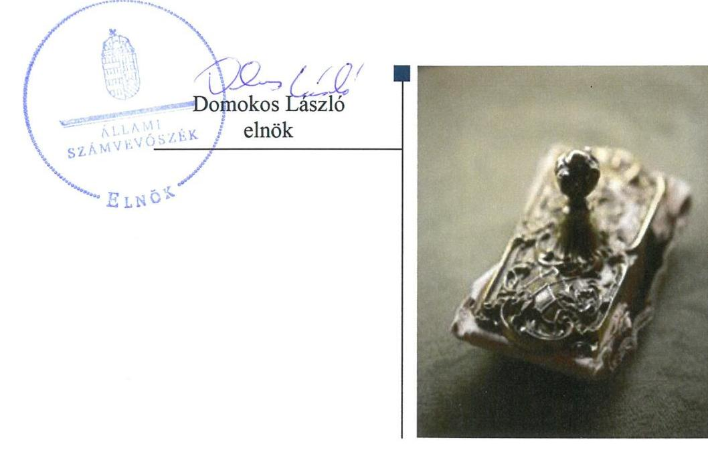
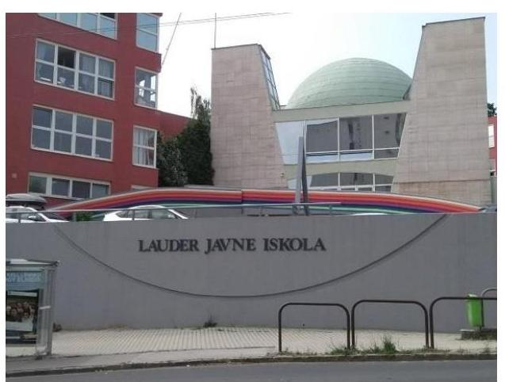
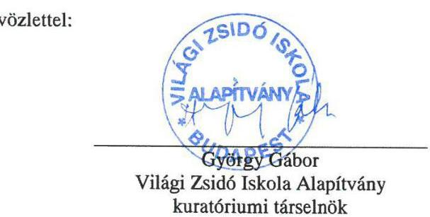
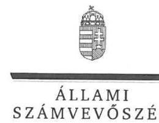
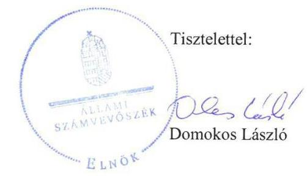

# Jelentés 

## Nem állami humánszolgáltatók ellenőrzése

A humánszolgáltatást nyújtó államháztartáson kívüli köznevelési és szociális intézmények, szolgáltatók fenntartói központi költségvetésből kapott támogatásai felhasználásának ellenőrzése - Világi Zsidó Iskola Alapítvány

2018

---

# Jelentés 

## Nem állami humánszolgáltatók ellenőrzése

A humánszolgáltatást nyújtó államháztartáson kívüli köznevelési és szociális intézmények, szolgáltatók fenntartói központi költségvetésből kapott támogatásai felhasználásának ellenőrzése - Világi Zsidó Iskola Alapítvány
2018. 12. hó 16. nap

---

# AZ ELLENŐRZÉST FELÜGYELTE:

DR. NAGY IMRE felügyeleti vezető

# AZ ELLENŐRZÉST VEZETTE ÉS A VÉGREHAJTÁSÁÉRT FELELŐS:

MOLNÁR ZSUZSANNA ellenőrzésvezető

# A PROGRAM ÖSSZEÁLLÍTÁSÁÉRT FELELŐS:

TÓTPÁL SZABOLCS osztályvezető

---

IKTATÓSZÁM: EL-0437-023/2018.

TÉMASZÁM: 2448

ELLENŐRZÉS-AZONOSÍTÓ SZÁM: V079411

---

Jelentéseink az Országgyűlés számítógépes hálózatán és az Interneta a www.asz.hu címen is olvashatóak.

---

# TARTALOMJEGYZÉK 

■ ÖSSZEGZÉS ..... 5
■ AZ ELLENŐRZÉS CÉLJA ..... 6
■ AZ ELLENŐRZÉS TERÜLETE ..... 7
■ AZ ELLENŐRZÉS HÁTTERE, INDOKOLTSÁGA ..... 8
■ A JELENTÉS LÉNYEGES KÉRDÉSKÖREI ..... 9
■ AZ ELLENŐRZÉS HATÓKÖRE ÉS MÓDSZEREI ..... 10
■ MEGÁLLAPÍTÁSOK ..... 12
■ JAVASLATOK ..... 16
■ MELLÉKLETEK ..... 17
I. sz. melléklet: Értelmező szótár ..... 17
■ FÜGGELÉK: ÉSZREVÉTELEK ..... 19
■ RÖVIDÍTÉSEK JEGYZÉKE ..... 25

---

.

---

# ÖSSZEGZÉS 

A Világi Zsidó Iskola Alapítvány - mint intézményfenntartó - a költségvetési támogatások szabályszerű felhasználásának feltételeit megteremtette. A köznevelési feladathoz rendelt költségvetési támogatásokat szabályszerűen fordította intézménye müködtetésére. A közszolgáltatás igénybevételének feltételeit nem határozta meg. A közérdekü adatok közzétételi kötelezettségének nem tett eleget, a közpénzekkel való gazdálkodásának átláthatóságát a nyilvánosság előtt nem biztositotta.

## Az ellenőrzés társadalmi indokoltsága

Az Állami Számvevőszék stratégiájában hangsúlyos szerepet szán annak, hogy szilárd szakmai alapon álló, értékteremtő ellenőrzéseivel előmozdítsa a közpénzügyek átláthatóságát, rendezettségét, javaslataival a közpénzek és a közvagyon szabályos, gazdaságos, hatékony és eredményes felhasználását segítse. Stratégiájában az Állami Számvevőszék célul tűzte ki, hogy az államháztartáson kívülre nyújtott költségvetési támogatások ellenőrzésével hozzájárul ahhoz, hogy a közpénzeket az államháztartáson kívüli szervezetek is átlátható módon használják fel a közfeladatok szerződésben vállalt ellátása érdekében. Tekintettel az elmúlt években a köznevelés finanszírozását és a köznevelési intézmények fenntartását érintően végbement változásokra, a társadalom fokozott érdeklődéssel figyeli a köznevelési feladatok ellátására fordított források felhasználását. Fontos ezért az Állami Számvevőszéknek a közvéleményt biztosítani arról, hogy a közpénz államháztartáson kívüli felhasználása ezen a területen sem marad ellenőrizetlenül. Az ellenőrzés hozzájárul ezzel ahhoz is, hogy a nyilvánosság és az igénybevevők megfelelő tájékoztatást kapjanak az államháztartáson kívüli közfeladatot ellátók müködéséről.

## Főbb megállapítások, következtetések, javaslatok

A Világi Zsidó Iskola Alapítvány, mint intézményfenntartó az átvállalt közfeladat ellátást a jogszabályi előírások szerint szervezte meg, a költségvetési támogatások szabályszerű igénybevételének, felhasználásának feltételeit megteremtette. A költségvetési támogatásokkal kapcsolatos igénylési, módosítási, elszámolási kötelezettségnek a Magyar Államkincstár felé a jogszabályi előírások szerint eleget tett.

A Világi Zsidó Iskola Alapítvány a kérhető térítési díj és tandíj megállapítás szabályait és a szociális alapon adható kedvezmények feltételeit nem szabályozta. Ezzel nem határozta meg köznevelési intézménye szabályszerű működtetésének kereteit, illetve a közszolgáltatás igénybevételének feltételei nem voltak átláthatóak a szolgáltatást igénybevevők számára. Az intézmény személyi és tárgyi feltételeinek megteremtéséről gondoskodott. A köznevelési közfeladat ellátására kapott támogatásokat intézménye működtetésére fordította és határidőben továbbutalta intézményének.

A Világi Zsidó Iskola Alapítvány ellenőrzési és értékelési feladatait szabályszerűen látta el. Beszámolási kötelezettségének szabályszerűen tett eleget, azonban a beszámolóra vonatkozó letétbe helyezési kötelezettségét a jogszabályban meghatározott határidőn túl teljesítette. A közérdekű adatok közzétételi kötelezettségének nem tett eleget, ezáltal a humánszolgáltatási közfeladatot ellátó intézménye működtetéséhez felhasznált közpénzekre vonatkozó gazdálkodásának átláthatóságát a nyilvánosság előtt nem biztosította.

Az Állami Számvevőszék a jelentésben foglalt megállapítások alapján a Világi Zsidó Iskola Alapítvány kuratóriuma társelnökének a szabályozottsággal, a nyilvántartási, letétbe helyezési és közzétételi kötelezettségek teljesítésével kapcsolatban 6 javaslatot fogalmazott meg. A javaslatokat megalapozó megállapításokra az érintettnek 30 napon belül intézkedési tervet kell készítenie.

---

# AZ ELLENŐRZÉS CÉLJA 

AZ ELLENŐRZÉS CÉLJA annak értékelése volt, hogy a Világi Zsidó Iskola Alapítvány, mint köznevelési intézményfenntartó központi költségvetésből kapott támogatásainak felhasználása szabályszerű volt-e, a támogatások igénylése, évközi módosítása és év végi elszámolása megfelelte a jogszabályi előírásoknak.

---

# AZ ELLENŐRZÉS TERÜLETE 

## Az Világi Zsidó Iskola Alapítvány, mint intézményfenntartó

A Világi Zsidó Iskola Alapítványt 1990-ben a Magyar Zsidó Kulturális Egyesület és magánszemélyek alapították a magyarországi világi zsidó óvoda, általános iskola, középiskola és zenei alapfokú művészeti iskola létrehozására és fenntartására.

A Fenntartó ${ }^{1}$ nyílt, közhasznú jogállású szervezet volt. Vállalkozási tevékenységet az ellenőrzött időszakban nem folytatott.

Úgyvezető szerve a hét főből álló kuratórium volt. A Fenntartó képviseletét a Társelnök és a kuratórium két tagja látták el, akik személyében az ellenőrzött időszakban nem történt változás.

A Fenntartó 1990-ben hozta létre a Budapesten működő Lauder Javne Zsidó Közösségi Óvoda, Általános Iskola, Középiskola és Zenei Alapfokú Művészeti Iskola jogelőd intézményét. Az Intézmény² óvodai, általános iskolai, gimnáziumi, szakközépiskolai nevelés-oktatási és alapfokú művészetoktatási tevékenységet végzett. Az iskola tanulóinak létszáma a 2014. évi 778 főről 2016-ra 886 főre emelkedett.

A Fenntartó összes bevétele a 2014. évi 1051,5 M Ft-ról 2016. évre 18,9 \%-kal 1251,3 M Ft-ra nőtt. 2014-ben 304,7 M Ft, 2015-ben 333 M Ft, 2016-ban 367,1 M Ft költségvetési támogatásban részesült a Fenntartó. 2014. évi 1640,5 M Ft-os saját tőkéje 2016-ra 1930,3 M Ft-ra nőtt. Befektetett eszközállománya 2014-ben 1244,4 M Ft volt, ami 2016-ra több mint 3\%-kal nőtt, 1285,2 M Ft-ra. 2014. évi rövid lejáratú kötelezettsége 4,6 M Ft volt, ami 2016-ra 4,8 M Ft-ra nőtt, hosszú lejáratú kötelezettsége nem volt.

---

# AZ ELLENŐRZÉS HÁTTERE, INDOKOLTSÁGA 

A köznevelési feladatokat ellátó nem állami intézményfenntartók részére közfeladataik ellátására évente jelentős összegű pénzügyi támogatást biztosítottak a mindenkori költségvetési törvények a bennük megfogalmazott feltételek mellett.

Az Országgyűlés elfogadta a nemzeti köznevelésről szóló 2011. évi CXC. törvényt, amely jelentősen átalakította a korábbi finanszírozási rendszert 2013 szeptemberétől. Új feladatfinanszírozási forma (átlagbéralapú támogatás) jelent meg, amely az államháztartáson kívüli intézményfenntartókra is vonatkozik. Az ellenőrzés a finanszírozási rendszerben bekövetkezett változásokra, azok közfeladat ellátásra gyakorolt hatására fókuszált a költségvetési támogatásokat felhasználó államháztartáson kívüli szervezetek körében. Az ellenőrzés indokoltságát az is alátámasztotta, hogy az ÁSZ ${ }^{3}$ még nem ellenőrizte átfogóan e területet.

Az ÁSZ stratégiájában foglaltak alapján is indokolt az ellenőrzés, amely a társadalom számára jelzi, hogy a közpénz államháztartáson kívüli felhasználása sem maradhat ellenőrizetlenül. Az államháztartáson kívülre nyújtott költségvetési támogatások ellenőrzésével az ÁSZ hozzájárul ahhoz, hogy a közpénzeket a nem állami fenntartók átlátható módon használják fel a közfeladatok ellátására kötött szerződésekben vállalt kötelezettségek teljesítése érdekében. Az ÁSZ az ellenőrzés javaslataival hozzájárulhat az említett rendszerek szabályszerű támogatás-felhasználásához, javíthatja a társa-dalmi-gazdasági döntések megalapozottságát, amely a „jól irányított állam" feltétele.

---

# A JELENTÉS LÉNYEGES KÉRDÉSKÖREI 

1. A köznevelési humánszolgáltatási közfeladatot ellátó Fenntartó szabályszerű müködési - és gazdálkodási környezet kialakításával megteremtette-e a költségvetési támogatások átlátható, elszámoltatható igénybevételének, felhasználásának feltételeit?
2. Az államháztartáson kívüli Fenntartó az átvállalt köznevelési közfeladathoz biztosított költségvetési támogatásokat szabályszerűen fordította-e a humánszolgáltató intézménye müködtetésére?
3. Az államháztartáson kívüli Fenntartó a köznevelési intézménye müködtetéséhez felhasznált közpénzekre vonatkozó gazdálkodásával a nyilvánosság előtt elszámolt-e, ennek megalapozása érdekében ellenőrzési, értékelési és a külső ellenőrzésekkel kapcsolatos intézkedési feladatait szabályszerűen látta-e el?

---

# AZ ELLENŐRZÉS HATÓKÖRE ÉS MÓDSZEREI 

## Az ellenőrzés típusa

Megfelelőségi ellenőrzés.

## Az ellenőrzött időszak

A 2014. január 1-je és 2016. december 31-e közötti időszak.

## Az ellenőrzés tárgya

Az ellenőrzés a köznevelési közfeladatokat ellátó államháztartáson kívüli fenntartó közfeladatai ellátásához a költségvetési törvényekben biztosított központi költségvetési támogatások igénylése, évközi módosítása és év végi elszámolása fenntartói feladatainak ellátása, illetve e központi költségvetésből kapott támogatásaik közfeladatokra való fenntartó általi felhasználása szabályszerűségének értékelésére terjedt ki.

Az ellenőrzés nem terjedt ki a költségvetési támogatás igénylése, módosítása, elszámolása valódiságának, megalapozottságának, helyességének értékelésére, valamint a források intézmény általi felhasználásának értékelésére.

## Az ellenőrzött szervezet

A Világi Zsidó Iskola Alapítvány, mint intézményfenntartó.

## Az ellenőrzés jogalapja

Az ellenőrzés jogszabályi alapját az ÁSZ tv. 1. § (3) bekezdésében, valamint az 5. § (3) bekezdésében foglalt előírások adták.

## Az ellenőrzés módszerei

Az ellenőrzést az ellenőrzési program kérdései, az adott időszakban hatályos jogszabályok, az ellenőrzés szakmai szabályok és módszertanok, valamint a nemzetközi standardok figyelembevételével végezte az ÁSZ.

A közpénzekkel való felelős gazdálkodás segítésére irányuló javaslatok kidolgozásakor a hatályos jogszabályok voltak az irányadóak.

Az ellenőrzés ideje alatt az ÁSZ a Fenntartóval történő kapcsolattartást az ÁSZ SZMSZ4-ének vonatkozó előírásai alapján biztosította.

---

Az ellenőrzési kérdések megválaszolásához szükséges bizonyítékok megszerzése az ellenőrzött által rendelkezésre bocsátott dokumentumokra, adatokra alapozva történt.

Az ellenőrzési bizonyítékként felhasznált adatforrások közé tartoztak egyrészt a szakmai program részletes szempontjainál felsorolt adatforrások, másrészt minden - az ellenőrzés folyamán feltárt, az ellenőrzés szempontjából információt tartalmazó - dokumentum.

Az ellenőrzés lefolytatásához a Fenntartó a kitöltött tanúsítványok, valamint az ÁSZ által kért dokumentumok átadásával szolgáltatott adatokat, információkat. Az így rendelkezésre bocsátott adatok, információk és a tanúsítványok adatai valódiságának kontrollja az ellenőrzés keretében történt.

A fenntartott intézménynél helyszíni szemle keretében győződtünk meg a tényleges feladatellátásról. A köznevelési humánszolgáltatások központi költségvetési támogatásai igénylésével, módosításával, elszámolásával kapcsolatos, államháztartáson kívüli fenntartó jogszabályokban előírt feladatai betartását, továbbá a központi költségvetési támogatások szabályszerű kezelését, nyilvántartását ellenőriztük a Fenntartónál, az ott rendelkezésre álló határozatok, nyilvántartások, beszámolók és egyéb dokumentumok alapján.

---

# 1. A köznevelési humánszolgáltatási közfeladatot ellátó Fenntartó szabályszerű múködési - és gazdálkodási környezet kialakításával megteremtette-e a költségvetési támogatások átlátható, elszámoltatható igénybevételének, felhasználásának feltételeit? 

Összegző megállapítás

A Fenntartó kialakította a szabályszerű múködési környezetet, a költségvetési támogatások átlátható, elszámoltatható igénybevételének, felhasználásának feltételeit.
1.1. számú megállapítás

A Fenntartó a jogszabályi előírások szerint szervezte meg a köznevelési közfeladat ellátását.

A Fenntartó rendelkezett a Ptk. ${ }^{5}$ előírásainak megfelelő alapító okirattal ${ }_{1,2}{ }^{6}$, melyben meghatározták szervezetét, múködési rendjét, a döntéshozatali jogköröket, valamint azok gyakorlásának módját. A Fenntartót a Bíróság ${ }^{7}$ nyilvántartásba vette.

A Fenntartó SZMSZ-ében ${ }^{8}{ }_{1,2}$ szabályozta az engedélyezési, jóváhagyási és kontrolleljárásokat.

A Fenntartó rendelkezett az ellenőrzött időszakban a Számv. tv. ${ }^{9}$ előírása szerint számviteli politikával, az annak keretében elkészítendő eszközök és a források leltárkészítési és leltározási szabályzatával, pénzkezelési szabályzattal, 2016. október 1-jétől az eszközök és a források értékelési szabályzatával.
1.2. számú megállapítás

A Fenntartó a költségvetési támogatások igénylési, módosítási és elszámolási feladatait szabályszerűen látta el.

A költségvetési támogatások iránti igényét a Fenntartó az Nkt. vhr. ${ }^{10}$-ben előírt nyilatkozatokkal a 2014-2016. évekre vonatkozóan határidőre benyújtotta a Kincstárhoz ${ }^{11}$. A Fenntartó rendelkezett a költségvetési támogatásokat megállapító kincstári határozatokkal.

A Fenntartó eleget tett a Kincstár felé az Nkt. vhr.-ben előírt határidőre a költségvetési támogatás igényléshez kötődő létszám adatokban bekövetkezett változással kapcsolatos bejelentési kötelezettségének.

A Fenntartó a központi költségvetésből kapott támogatásokra vonatkozó elszámolását minden évben benyújtotta az Nkt. vhr.-ben foglaltak szerint, határidőben a Kincstár felé. Visszafizetési kötelezettségének a Fenntartó eleget tett.

---

# 2. Az államháztartáson kívüli Fenntartó az átvállalt köznevelési közfeladathoz biztosított költségvetési támogatásokat szabályszerűen fordította-e a humánszolgáltató intézménye múködtetésére? 

Összegző megállapítás

2.1. számú megállapítás
2.2. számú megállapítás

A Fenntartó az átvállalt köznevelési feladathoz biztosított költségvetési támogatásokat szabályszerűen fordította a közfeladatot ellátó intézménye múködtetésére, a támogatás felhasználását azonban nem a jogszabályi előírás szerint tartotta nyilván.

A Fenntartó nem szabályszerűen biztosította az intézmény múködtetésének szervezeti kereteit, a személyi és tárgyi feltételek biztosítása megfelelt a jogszabályi előírásoknak.

A kérhető térítési díj és tandíj megállapításának szabályait és a szociális alapon adható kedvezmények feltételeit a Fenntartó az Nkt. ${ }^{12}$ 83. § (2) bekezdés c) pontjában és az Nkt. vhr. 37. § (3) bekezdésében foglaltak ellenére nem határozta meg.

A Fenntartó intézménye alapfeladatait az Nkt. előírásaival összhangban az Intézmény alapító okiratában ${ }_{1-3}{ }^{14}$ határozta meg. Az intézmény alapító okiratai ${ }_{1-3}$ az Nkt. előírásai szerint tartalmazták az intézmény és fenntartója nevét, székhelyét, az Intézmény feladat-ellátási helyét, a felvehető maximális gyermek- és tanuló létszámot, a feladatellátást szolgáló vagyont, a vagyon feletti rendelkezési, illetve használati jogot és a gazdálkodással öszszefüggő jogosítványokat.

Az intézményt a Kormányhivatal ${ }^{14}$ nyilvántartásba vette, az Nkt. vhr.ben meghatározott OM azonosítóval ${ }^{15}$ rendelkezett.

A közfeladat ellátásához szükséges Nkt.-ban előírt feltételeket - állandó székhelyet, telephelyet a feladatellátáshoz szükséges helyiségekkel - a Fenntartó biztosította, rendelkezett intézménye - a közfeladat ellátáshoz szükséges személyi és tárgyi feltételek meglétét igazoló - múködési engedélyével.

A Fenntartó az Nkt. rendelkezése szerint megbízta az intézmény vezetőjét, meghatározta az intézmény költségvetéseit.

A Fenntartó a köznevelési közfeladat ellátására kapott támogatásokat a jogszabályi előírás szerint átadta intézményének, a támogatások felhasználását azonban nem a jogszabályi előírás szerint tartotta nyilván.

A Fenntartó a Kincstár által 2014-2016. években a köznevelési feladat ellátására folyósított, támogatások teljes összegét átadta intézményének, a támogatások továbbutalása a Kvtv. ${ }_{1-3}{ }^{16}$ által meghatározott határidőn belül megtörtént.

A köznevelési közfeladat ellátására kapott támogatások felhasználásának nyilvántartása nem felelt meg az Nkt. vhr.-ben előírtaknak, mert a

---

Fenntartó a támogatások felhasználásáról - az Nkt. vhr. 37/G. § (1) bekezdésében foglaltak ellenére - nem vezetett alapfeladatonkénti bontásban elkülönített nyilvántartást.

# 3. Az államháztartáson kívüli Fenntartó a köznevelési intézménye múködtetéséhez felhasznált közpénzekre vonatkozó gazdálkodásával a nyilvánosság előtt elszámolt-e, ennek megalapozása érdekében ellenőrzési, értékelési és a külső ellenőrzésekkel kapcsolatos intézkedési feladatait szabályszerűen látta-e el? 

Összegző megállapítás

A Fenntartó a köznevelési intézménye múködtetéséhez felhasznált közpénzekkel való gazdálkodásával a nyilvánosság előtt nem számolt el. Ellenőrzési és értékelési feladatait szabályszerűen látta el, a külső ellenőrzésekhez kapcsolódó intézkedési kötelezettségének eleget tett.

A Fenntartó ellenőrzési és értékelési feladatait szabályszerűen látta el, a külső ellenőrzésekhez kapcsolódó intézkedési kötelezettségét teljesítette.

A Fenntartó működésének és gazdálkodásának ellenőrzésére a Civil tv. ${ }^{17}$ előírása szerint felügyelő bizottságot ${ }^{18}$ hozott létre.

A Fenntartó az Nkt.-ban foglaltak alapján 2015-ben és 2016-ban ellenőrizte intézménye SZMSZ-ét és értékelte az ellenőrzött időszakban a pedagógiai programban meghatározott feladatok végrehajtását, a pedagógiaiszakmai munka eredményességét. A házirend és a pedagógiai program ellenőrzésére nem került sor.

Hatósági ellenőrzésre hét alkalommal került sor az intézménynél a Kormányhivatal és a Katasztrófavédelmi Igazgatóság ${ }^{19}$ részéről. A Kincstár 2016-ban ellenőrizte a Fenntartónál a 2014. évben igénybevett támogatás elszámolásának szabályszerűségét. Az ellenőrzésekhez kötődő intézkedési kötelezettségének a Fenntartó eleget tett.

A Fenntartó beszámolási kötelezettségét szabályszerűen teljesítette, beszámolója közzétételi kötelezettségének nem a jogszabályi előírás szerint tett eleget. A felhasznált közpénzekre vonatkozó közzétételi kötelezettségét nem teljesítette.

A Fenntartó a jogszabályi előírások szerint eleget tett a beszámolási és könyvvezetési kötelezettségének. A Fenntartó Civil tv. előírása szerint készített közhasznúsági melléklete, mérlege és eredmény-kimutatása megfelelt a Civil tv. és a Civilszr. ${ }^{20}$ előírásainak.

A Fenntartó nem tett eleget a beszámoló Cnytv. ${ }^{21}$ 39. § (1) bekezdésében foglalt letétbe helyezési kötelezettségének a Civil tv. 30. § (1) bekezdésében meghatározott - az üzleti év mérleg-fordulónapját követő május 31-ei - határidőre. 2015. évi beszámolóját 2017. január 5-én, a 2016. évi

---

beszámolóját pedig 2017. június 6-án küldte meg az $\mathrm{OBH}^{22}$ részére. A közzététel két évben nem felelt meg a Civil tv. 30. § (1) bekezdésében foglaltaknak, mert 2014. és 2015. évekre vonatkozóan az egyszerűsített éves beszámoló részét képező kiegészítő melléklet nem került közzétételre.

A Fenntartó az Info tv. ${ }^{23} 30 . \S$ (6) bekezdésében előírtak ellenére nem gondoskodott a közérdekű adatok megismerésére irányuló igények teljesítése rendjének szabályozásáról.

Az adatok biztonságának, védelmének, valamint a titokvédelmi szabályok érvényre juttatásához szükséges eljárási szabályokat az Info tv. 7. § (2) bekezdésben foglalt előírások ellenére nem alakították ki.

Az Info tv.-ben meghatározott közzétételi listákon szereplő adatok pontos, naprakész és folyamatos közzétételének a részletes szabályait az Info tv. 35. § (3) bekezdésben foglalt előírások ellenére nem alakították ki.

Nem gondoskodott a Fenntartó - az Info tv. 37. § (1) bekezdésében foglaltak ellenére - az Info tv. 1. melléklet szerinti általános közzétételi listában meghatározott adatok közzétételéről.

---

# JAVASLATOK 

Az ÁSZ tv. 33. § (1) bekezdésében foglaltak értelmében az ellenőrzött szervezet vezetője köteles a jelentésben foglalt megállapításokhoz kapcsolódó intézkedési tervet összeállítani és azt a jelentés kézhezvételétől számított 30 napon belül az ÁSZ részére megküldeni. Amennyiben az ellenőrzött szervezet vezetője nem küldi meg határidőben az intézkedési tervet, vagy továbbra sem elfogadható intézkedési tervet küld, az Állami Számvevőszék elnöke az ÁSZ tv. 33. § (3) bekezdése a) és b) pontjaiban foglaltakat érvényesítheti.

## A Világi Zsidó Iskola Alapítvány kuratóriuma társelnökének

1. Intézkedjen a kérhető térítési díj és tandíj megállapítás szabályainak, valamint a szociális alapon adható kedvezmények feltételeinek a jogszabályban előírtak alapján történő meghatározásáról.
(2.1. sz. megállapítás 1. bekezdése alapján)
2. Intézkedjen, hogy a költségvetési támogatások felhasználásának nyilvántartása feleljen meg a jogszabályokban elöírtaknak.
(2.2. sz. megállapítás 2. bekezdése alapján)
3. Intézkedjen, hogy az egyszerüsített éves beszámoló megküldése a jogszabályban elöirt időpontban történjen meg.
(3.2. sz. megállapítás 2. bekezdés 1. mondata alapján)
4. Intézkedjen az Info tv. előírásai alapján a közérdekü adatok megismerésére irányuló igények teljesitési rendjének szabályozásáról.
(3.2. sz. megállapítás 3. bekezdése alapján
5. Intézkedjen az Info tv. előírásai alapján a szükséges intézkedések megtételéről.
(3.2. sz. megállapítás 4-5. bekezdései alapján)
6. Tegyen eleget az Info tv.-ben elöirt közzétételi kötelezettségnek.
(3.2. sz. megállapítás 6. bekezdése alapján)

---

# MELLÉKLETEK 

## I. SZ. MELLÉKLET: ÉRTELMEZŐ SZÓTÁR

humánszolgáltatás
költségvetési támogatás
köznevelési közfeladat

Külön törvényben meghatározott szociális, gyermekjóléti, gyermekvédelmi, közoktatási, felsőoktatási, kulturális közfeladatok (2014. évi Kvtv. 34. § (1), (4) bekezdés, 1. számú melléklet XX/20/2. alcím, 19. alcím, 2015. évi Kvtv. 43. § (1), (4) bekezdés, 1. számú melléklet XX/20/2/3. jogcím csoport, 19. alcím, 2016. évi Kvtv. 41. § (1), (4) bekezdés, 1. számú melléklet XX/20/2/3. jogcím csoport, 19. alcím).
a társadalombiztosítás pénzügyi alapjai kivételével az államháztartás központi alrendszeréből ellenérték nélkül, pénzben nyújtott támogatások (Áht. 1. § 14. pont)
A Kvtv-ekben (2013. évi CCXXX. törvény 33-34. §, 2014. évi C. törvény 42-43. §, 2015. évi C. törvény 40-41. §) megállapított támogatás. Például a 2015. évi C. törvény 40-41. § szerint többek között: Az Országgyűlés a köznevelési feladat ellátására átlagbéralapú támogatást állapít meg. A nevelési-oktatási, valamint pedagógiai szakszolgálati intézményt fenntartó nemzetiségi önkormányzat, az egyházi és magán köznevelési intézményfenntartója részére az általuk fenntartott nevelési-oktatási intézményben, továbbá pedagógiai szakszolgálati intézményben pedagógus és - a b) pont kivételével -nevelő-oktató munkát közvetlenül segítő munkakörben foglalkoztatottak után a 7. melléklet I. pontja, valamint az óvoda, egységes óvoda-bölcsőde esetében a 2. melléklet II. pont 1. alpontja szerint és az 5. alpontjában meghatározott jogosultak után, az őket ott megillető mértékek szerint. Múködési támogatást állapít meg a nemzetiségi önkormányzat vagy az egyházi jogi személy által fenntartott nevelési-oktatási intézményekben ellátott, továbbá a pedagógiai szakszolgálati intézményekben gyógypedagógiai tanácsadásban, korai fejlesztésben, oktatásban és gondozásban, valamint a fejlesztő nevelésben részt vevő gyermekekre, tanulókra tekintettel a nemzetiségi önkormányzat és a bevett egyház részére a 7. melléklet II. pontja szerint.
Az Országgyűlés a szociális, gyermekjóléti, gyermekvédelmi közfeladatot ellátó intézményt, szolgáltatást fenntartó egyházi jogi személy, civil szervezet, közalapítvány, országos nemzetiségi önkormányzat, települési vagy területi nemzetiségi önkormányzat, gazdasági társaság, és a humánszolgáltatást alaptevékenységként végző, az Szja tv. hatálya alá tartozó egyéni vállalkozó (a továbbiakban együtt: nem állami szociális fenntartó) részére támogatást állapít meg a következők szerint: a támogatás a nem állami szociális fenntartót a települési önkormányzatok 2. melléklet III. pont 3. alpont c)-k) pontjában és III. pont 5. alpont a) pontjában meghatározott támogatásaival azonos jogcímeken, összegben és feltételek mellett illeti meg.
A köznevelési intézmény alapító okiratában foglalt feladat: óvodai nevelés, nemzetiséghez tartozók óvodai nevelése, általános iskolai nevelés-oktatás, nemzetiséghez tartozók általános iskolai nevelése-oktatása, kollégiumi ellátás, nemzetiségi kollégiumi ellátás, gimnáziumi nevelés-oktatás, szakközépiskolai nevelés-oktatás, szakiskolai neve-lés-oktatás, nemzetiség gimnáziumi nevelés-oktatása, nemzetiség szakközépiskolai ne-velés-oktatása, nemzetiség szakiskolai nevelés-oktatása, Köznevelési Hídprogramok keretében folyó nevelés-oktatás, felnőttoktatás, alapfokú művészetoktatás, fejlesztő nevelés, fejlesztő nevelés-oktatás, pedagógiai szakszolgálati feladat, a többi gyermekkel, tanulóval együtt nevelhető, oktatható sajátos nevelési igényű gyermekek, tanulók óvodai nevelése és iskolai nevelése-oktatása, azoknak a sajátos nevelési igényű gyermekeknek, tanulóknak az óvodai, iskolai, kollégiumi ellátása, akik a többi gyermekkel, tanulóval nem foglalkoztathatók együtt, a gyermekgyógyüdülőkben, egészségügyi intézményekben, rehabilitációs intézményekben tartós gyógykezelés alatt álló gyermekek tankötelezettségének teljesítéséhez szükséges oktatás, pedagógiai-szakmai szolgáltatás.

---

# Mellékletek 

köznevelési intézmény
nem állami, nem önkormányzati (államháztartáson kívüli) intézményfenntartó

A nevelési- oktatási intézmény, pedagógiai szakszolgálati intézmény, pedagógiai-szakmai szolgáltatást nyújtó intézmény.
A köznevelési és szociális, gyermekjóléti és gyermekvédelmi közfeladatokat/humánszolgáltatásokat ellátó intézményt fenntartó egyházi jogi személy, társadalmi szervezet, alapítvány, közalapítvány, civil szervezet, országos nemzetiségi önkormányzat, nonprofit gazdasági társaság, gazdasági társaság és a humánszolgáltatást alaptevékenységként végző, Szja tv. hatálya alá tartozó egyéni vállalkozó. (2013. évi Kvtv. 35. § (1), (3) bekezdés, 2014. évi Kvtv. 33. §, 34. § (1), (4) bekezdés, 2015. évi Kvtv. 42. §, 43. § (1), (4) bekezdés, 2016. évi Kvtv. 40. §, 41. § (1), (4) bekezdés)

---

# FÜGGELÉK: ÉSZREVÉTELEK 

A jelentéstervezetet a Számvevőszék 15 napos észrevételezésre megküldte az ellenőrzött szervezet vezetőjének az ÁSZ tv. 29. §* (1) bekezdése előírásának megfelelően.

A Világi Zsidó Iskola Alapítvány kuratóriumi elnöke élt az ÁSZ tv. 29. § (2) bekezdésében foglalt észrevételezési jogával, a törvényes határidőn belül észrevételt tett.
A függelék tartalmazza az ellenőrzött észrevételeit, illetve az el nem fogadott észrevételek elutasításának indoklását.

[^0]
[^0]:    * 29. § (1) Az Állami Számvevőszék az ellenőrzési megállapításait megküldi az ellenőrzött szervezet vezetőjének vagy az általa megbízott személynek, és annak, akinek személyes felelősségét állapította meg.
    (2) Az ellenőrzött szervezet vezetője és a felelősként megjelölt személy az ellenőrzés megállapításaira tizenöt napon belül írásban észrevételt tehet.
    (3) Az Állami Számvevőszék az észrevételre a beérkezésétől számított harminc napon belül írásban válaszol. A figyelembe nem vett észrevételeket köteles a jelentésben feltüntetni, és megindokolni, hogy azokat miért nem fogadta el.

---

# Világi Zsidó Iskola Alapítvány 

a Lauder Javne Iskola fenntartója

## Domonkos László Elnök részére   Állami Számvevőszék   Budapest   Apáczai Csere János utca 10. 1052

Tárgy: Észrevételezés és intézkedési terv

Tisztelt Elnök Úr!

A 2018.10.08. keltezésű, EL-07759-023/2018. iktatószámú levelükre hivatkozva, a Világi Zsidó Iskola Alapítvány Számvevőszéki jelentéstervezetének megállapításai és a javaslati pontok figyelembe vételével az alábbi
észrevételezéseket tesszük:

## Észrevételek

1. A 3.2. megállapítás 2. bekezdés 1. mondata szerint az Alapítvány nem tett eleget a jogszabályokban meghatározott letétbe helyezési kötelezettségének.
Az egyszerúsített éves beszámoló minden évben az előírt határidőre be lett adva, melyeket igazolni tudunk.
(Beadási időpontok: 2015. évi beszámoló: 2016. május 31. 2016. évi beszámoló: 2017. május 31.)
Az önök által feltüntetett időpontok a módosított beadványok beérkezésének időpontjai. A 3. javaslati pontnak megfelelően az egyszerúsített éves beszámolók továbbra is a jogszabályban előírt határidőre be lesznek adva.
2. A 3.2. megállapítás 3-4-5. bekezdése szerint az Alapítvány nem tett eleget az Info tv.-ben elöirt szabályozásoknak: kö́́érdekü adatok megismerésére irányuló igények teljesitésének szabályozása; azatok biztonságának, védelmének, valamin a titokvédelmi szabályok érvényre juttatásához szükséges eljárási szabályozások.
A 4. és 5. javaslati pontokkal összhangban, a törvényi előírásnak megfelelően 2018. május 25. napjára elkészült az Alapítvány és a fenntartott intézmény adatvédelmi és adatkezelési szabályzata, amely megfelel a hivatkozott törvényi előírásoknak. Az adatkezelési tájékoztató a fenntartott intézmény honlapján lett közzétéve.
Az intézmény adatvédelmi tisztviselőt alkalmaz.

---

# Világi Zsidó Iskola Alapítvány 

a Lauder Javne Iskola fenntartója

és az alábbi intézkedési tervet nyújtjuk be:

## Intézkedési terv

A Világi Zsidó Iskola Alapítvány, 30 napon belül, az alábbi intézkedéseket hajtja végre:

1. A 2.1. számú megállapítás 1. bekezdése alapján, az 1. javaslati pontnak megfelelöen: Felülvizsgálja a meglévő térítési díj és tandíj szabályzatát, illetve a szociális alapon adható kedvezmények szabályzatát, ezeket összhangba hozza az Nkt. vonatkozó pontjaival, valamint ezeket közzéteszi az alapítvány által fenntartott intézmény honlapján.
2. A 2.2. számú megállapítás 2. bekezdése alapján, a 2. javaslati pontnak megfelelően: Gondoskodik a támogatások jogszabály által előírt alapfeladatonkénti felhasználásának nyilvántartásáról.
3. A 3.2. sz. megállapítás 6. bekezdése alapján, a 6. javaslati pontnak megfelelően: Felülvizsgálja az Info tv. 37. § (1) 1. mellékletében foglaltaknak megfelelően az intézmény honlapján elérhető közzétételi listáját és azt kiegészíti a törvényi előírásoknak megfelelően.

Kérem a fenti észrevételek szíves figyelembe vételét és az Intézkedési tervünk elfogadását!
Kelt: Budapest, 2018. 10. 18.

---

ELNÖK

Ikt.szám: EL-0759-027/2018.

# György Gábor úr 

kuratórium társelnöke

## Világi Zsidó Iskola Alapitvány

## Budapest

## Tisztelt Társelnök Úr!

A „Nem állami humánszolgáltatók ellenőrzése - A humánszolgáltatást nyújtó államháztartáson kivüli köznevelési és szociális intézmények, szolgáltatók fenntartói központi költségvetésböl kapott támogatásai felhasználásának ellenőrzése - Világi Zsidó Iskola Alapitvány" címmel készített számvevőszéki jelentéstervezetre tett észrevételeit köszönettel megkaptam.
Az Állami Számvevőszék észrevételekre vonatkozó álláspontjáról a felügyeleti vezető által készített részletes tájékoztatást csatoltan megküldöm.
Tájékoztatom Társelnök urat, hogy a számvevőszéki jelentésben - az Állami Számvevőszékről szóló 2011. évi LXVI. törvény 29. § (3) bekezdése alapján - a figyelembe nem vett észrevételeket szerepeltetjük annak megindoklásával, hogy azokat miért nem fogadtuk el.

Budapest, 2018. 11. hó 10 . nap

Melléklet: Tájékoztatás az észrevételek kezeléséről

---

# Tájékoztatás   az észrevételek kezeléséről 

A „Nem állami humánszolgáltatók ellenőrzése - A humánszolgáltatást nyújtó államháztartáson kivüli köznevelési és szociális intézmények, szolgáltatók fenntartói központi költségvetésböl kapott támogatásai felhasználásának ellenörzése - Világi Zsidó Iskola Alapítvány" címủ jelentéstervezetre 2018. október 18-án tett (az Állami Számvevőszékhez 2018. október 26-án érkezett) észrevételét áttekintettük, annak kezelésével kapcsolatban a következő tájékoztatást adom.

1. A jelentéstervezet 3.2. számú megállapítás 2. bekezdés 1. mondatára vonatkozó észrevétel:

Az észrevételben leírtak szerint a Világi Zsidó Iskola Alapítvány (a továbbiakban: Fenntartó) egyszerúsített éves beszámolója minden évben az előírt határidőre be lett adva, melyet igazolni tud. A jelentéstervezetben feltüntetett időpontok a módosított beadványok beérkezésének időpontjai. Az egyszerúsített éves beszámolók továbbra is a jogszabályban előírt határidőre be lesznek adva.
Az Állami Számvevőszék (a továbbiakban: ÁSZ) ellenőrzési megállapításait az adatbekérés folyamán bekért és az ellenőrzött által az ÁSZ rendelkezésére bocsátott adatok és dokumentumok alapján hozza meg. A Fenntartó vezetője 2018. február 12-én kelt Teljességi és hitelességi nyilatkozata szerint az ÁSZ részére átadott dokumentumok a bekért adatokra, dokumentumokra vonatkozóan teljes körű információt tartalmaznak. Az ellenőrzés rendelkezésére bocsátott beszámolók alapján a 2014. évi beszámoló 2015. 05.28-án, a 2015. évi beszámoló 2017.01.05-én, a 2016. évi beszámoló 2017.06.06-án érkezett meg az OBH-hoz. A civil szervezetek bírósági nyilvántartásáról és az ezzel összefüggő eljárási szabályokról szóló 2011. évi CLXXXI. törvény 39. § (4) bekezdése értelmében „A beszámoló megküldésére vonatkozó határidők tekintetében az OBH-hoz történő elektronikus úton történő megküldés esetén az informatikai szempontból szabályszerü - érkezés időpontja irányadó.", így a 2015. és a 2016. évi egyszerúsített beszámolók esetében a letétbe helyezési kötelezettségnek a Fenntartó határidőre nem tett eleget, az észrevétel alapján a jelentéstervezet módosítása nem indokolt. Az ellenőrzött időszakot követően megtett intézkedést az intézkedési terv összeállítása során indokolt figyelembe venni.
2. A jelentéstervezet 3.2. számú megállapítás 3-5. bekezdéseire vonatkozó észrevétel:

Az észrevételben leírtak szerint 2018. május 25 -én elkészült a Fenntartó és intézménye adatvédelmi és adatkezelési szabályzata, az adatvédelmi tájékoztató az intézmény honlapján közzé lett téve. Az intézmény adatvédelmi tisztviselőt alkalmaz.

Az ellenőrzött időszakot követően megtett intézkedést az intézkedési terv összeállítása során indokolt figyelembe venni. Az észrevételhez csatolt intézkedési tervet az ÁSZ az észrevételre adott válasz megküldésével egyidejűleg nem értékeli. Az észrevétel nem cáfolta, hanem megerősítette a jelentéstervezet megállapításait, ez alapján a jelentéstervezet módosítása nem indokolt. Az intézmény adatvédelmi tisztviselőjére vonatkozóan a jelentéstervezet megállapítást nem tartalmazott.

---

# 3. A jelentéstervezet 1., 2. és 6. javaslataira vonatkozó intézkedési terv: 

A végleges jelentés kézhezvételétől számított harminc napon belül kell az ÁSZ részére megküldeni a jelentésben foglalt megállapításokhoz kapcsolódóan összeállított intézkedési tervet. A tervezett intézkedéseknek alkalmasnak kell lenniük a feltárt hiányosságok megszüntetésére, a mulasztások következményeinek kezelésére. Minden tervezett intézkedés kapcsán szükséges a végrehajtásért felelős személy és a végrehajtás határidejének rögzítése.

Budapest, 2018. 11. hó 10 nap

$$
\square \square \square
$$

Dr. Nagy Imre
felügyeleti vezető

---

# RÖVIDÍTÉSEK JEGYZÉKE 

${ }^{1}$ Fenntartó
${ }^{2}$ Intézmény
${ }^{3}$ ÁSZ
${ }^{4}$ ÁSZ SZMSZ
${ }^{5}$ Ptk.
${ }^{6}$ alapító okirat ${ }_{1,2}$

## ${ }^{7}$ Bíróság

${ }^{8} \mathrm{SZMSZ}_{1,2}$

## ${ }^{9}$ Számv. tv.

${ }^{10}$ Nkt. vhr.
${ }^{11}$ Kincstár
${ }^{12} \mathrm{Nkt}$.
${ }^{13}$ Intézmény Alapító Okirata ${ }_{3-3}$

## ${ }^{14}$ Kormányhivatal

${ }^{15}$ OM azonosító
${ }^{16} \mathrm{Kvtv}_{1-3}$

## ${ }^{17}$ Civil tv.

${ }^{18}$ Felügyelő Bizottság
${ }^{19}$ Katasztrófavédelmi Igazgatóság

Világi Zsidó Iskola Alapítvány
Lauder Javne Zsidó Közösségi Óvoda, Általános Iskola, Középiskola és Zenei Alapfokú Művészeti Iskola (Rövid neve: Lauder Javne Iskola)
Állami Számvevőszék
az Állami Számvevőszék elnökének 4/2017. (XII. 29.) ÁSZ utasítása az Állami Számvevőszék Szervezeti és Működési Szabályzatáról (hatályos: 2017. január 1-jétől)
2013. évi V. törvény a Polgári Törvénykönyvről (hatályos: 2014. március 15-től)
1: Zsidó Világi Iskola Alapítvány - Alapító Okirat módosításokkal egységes szerkezetben (hatályos: 2012. november 19-től)
2: Zsidó Világi Iskola Alapítvány - Alapító Okirat módosításokkal egységes szerkezetben (hatályos: 2015. március 27-től)
Fővárosi Bíróság
1: Világi Zsidó Iskola Alapítvány Kuratóriumának Szervezeti Múködési Szabályzata (hatályos: 1997. február 19-től)
2: Világi Zsidó Iskola Alapítvány Kuratóriumának Szervezeti Múködési Szabályzata (hatályos: 2014. január 20-tól)
2000. évi C. törvény a számvitelről (hatályos: 2001. január 1-jétől)
229/2012. (VIII. 28.) Korm. rendelet a nemzeti köznevelésről szóló törvény végrehajtásáról (hatályos 2012. szeptember 1-jétől)
Magyar Államkincstár
2011. évi CXC. törvény - a nemzeti köznevelésről (hatályos:2012. szeptember 1-jétől)

1: Lauder Javne Iskola - Alapító Okirat
(egységes szerkezetben hatályos: 2013. szeptember 1-jétől)
2: Lauder Javne Iskola - Alapító Okirat
(egységes szerkezetben hatályos: 2014. szeptember 1-jétől)
3: Lauder Javne Iskola - Alapító Okirat
(egységes szerkezetben hatályos: 2015. szeptember 1-jétől)
Budapest Főváros Kormányhivatala
oktatási azonosító szám
1: 2013. évi CCXXX. törvény Magyarország 2014. évi központi költségvetéséről (hatályos: 2014. január 1-jétől)
2: 2014. évi C. törvény Magyarország 2015. évi központi költségvetéséről, (hatályos: 2015. január 1-jétől)
3: 2015. évi C. törvény Magyarország 2016. évi központi költségvetéséről (hatályos: 2015. július 4-től)
2011. évi CLXXV. törvény - az egyesülési jogról, a közhasznú jogállásról, valamint a civil szervezetek múködéséről és támogatásáról (hatályos: 2011. december 22-től)
Világi Zsidó Iskola Alapítvány Felügyelő Bizottsága
Fővárosi Katasztrófavédelmi Igazgatóság

---

${ }^{20}$ Civilszr.
${ }^{21}$ Cnytv.
${ }^{22} \mathrm{OBH}$
${ }^{23}$ Info tv.

224/2000. (XII. 19.) Korm. rendelet az egyes egyéb szervezetek beszámoló készítési és könnyvezetési kötelezettségének sajátosságairól (hatályos 2001. január 1-jétől)
2011. évi CLXXXI. törvény a civil szervezetek bírósági nyilvántartásáról és az ezzel összefüggő eljárási szabályokról (hatályos: 2011. december 23-tól)
Országos Bírósági Hivatal
2011. évi CXII. törvény az információs önrendelkezési jogról és az információszabadságról (hatályos: 2011. július 27-től)

---

# ÁLLAMI SZÁMVEVŐSZÉK 

1052 Budapest, Apáczai Csere János utca 10.
Levélcím: 1364 Budapest 4. Pf. 54
Telefon: +36 14849100 Telefax: +36 14849200
www.asz.hu