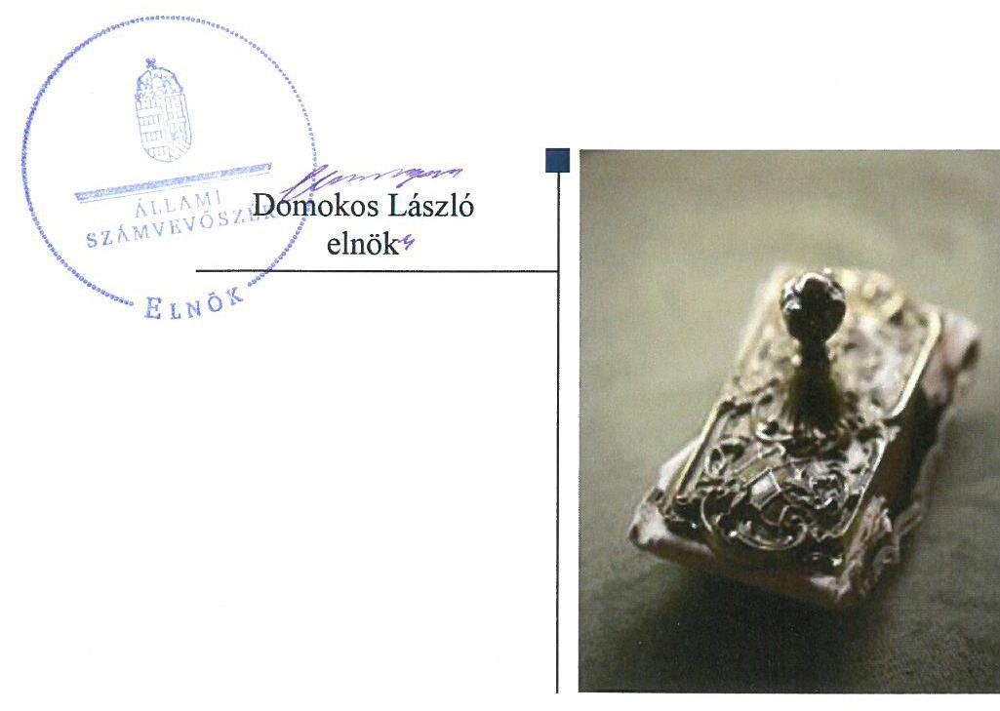
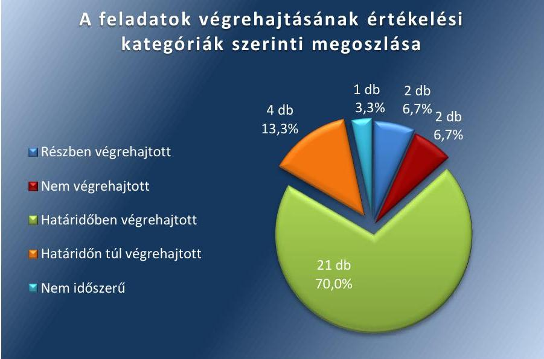

# Jelenetés 

## Utóellenőrzések

Az önkormányzatok belső kontrollrendszere kialakításának és működtetésének ellenőrzése Almásfüzitő Község Önkormányzata 2018. 12. hó 12. nap

---

|  J | AZ ELLENŐRZÉST FELÜGYELTE:  |
| --- | --- |
|   | DR. NÉMETH ERZSÉBET felügyeleti vezető  |
|   | AZ ELLENŐRZÉST VEZETTE ÉS A VÉGREHAJTÁSÁÉRT FELELŐS:  |
|   | DR. NAGY JUDIT ellenőrzésvezető  |
|   | A PROGRAM ÖSSZEÁLLÍTÁSÁÉRT FELELŐS:  |
|   | TÓTPÁL SZABOLCS osztályvezető  |
|   | A TÉMÁHOZ KAPCSOLÓDÓ KORÁBBI SZÁMVEVŐSZÉKI JELENTÉSEK:  |
|   | - címe: Az önkormányzatok belső kontrollrendszere - Az önkormányzatok belső kontrollrendszere kialakításának és működtetésének ellenőrzése - Almásfüzítő  |
|  J | - sorszáma: 16181  |
|   | IKTATÓSZÁM: EL-1284-001/2018  |
|   | TÉMASZÁM: 2460  |
|   | ELLENŐRZÉS-AZONOSÍTÓ SZÁM: V080421  |

---

# TARTALOMJEGYZÉK 

■ ÖSSZEGZÉS ..... 5
■ AZ ELLENŐRZÉS CÉLJA ..... 6
■ AZ ELLENŐRZÉS TERÜLETE ..... 7
■ AZ ELLENŐRZÉS HÁTTERE, INDOKOLTSÁGA ..... 8
■ A JELENTÉS LÉNYEGES KÉRDÉSKÖRE ..... 9
■ AZ ELLENŐRZÉS HATÓKÖRE ÉS MÓDSZEREI ..... 10
■ MEGÁLLAPÍTÁSOK ..... 12
■ MELLÉKLETEK ..... 15
■ FÜGGELÉK: ÉSZREVÉTELEK ..... 23
■ RÖVIDÍTÉSEK JEGYZÉKE ..... 25

---

.

---

# ÖSSZEGZÉS 

Az Állami Számvevőszék Almásfüzitő Község Önkormányzata belső kontrollrendszere kialakításának és működésének utóellenőrzése során megállapította, hogy az intézkedési tervben foglalt feladatok jelentős részét végrehajtották. A megtett intézkedéseknek köszönhetően a szabályozottság javult.

## Az ellenőrzés társadalmi indokoltsága

Az Állami Számvevőszék stratégiájában célul tűzte ki a számvevőszéki munka hasznosulásának javítását. Ezzel összhangban ellenőrzi, hogy az ellenőrzött szervezetek megvalósították-e a korábbi ellenőrzései által feltárt hibák, hiányosságok és szabálytalanságok megszüntetése céljából kialakított intézkedési terveikben foglaltakat. Az intézkedések végrehajtásával az adott terület szabályszerű működése vonatkozásában a kockázatok csökkenhetnek, ugyanakkor a végre nem hajtott intézkedések következtében újabb kockázatok merülhetnek fel, amelyek kezelése kiemelten fontos. A rendszeres utóellenőrzések hozzájárulnak a szükséges intézkedések tényleges végrehajtásához, ezáltal a közpénzügyek rendezettségének javulásához, a szabálytalan közpénzfelhasználás kockázatának a csökkentéséhez.

Az önkormányzatok brókercégeknél befektetett szabad pénzeszközeit érintő, 2015. évben történt események társadalmi jelentőségére tekintettel az ÁSZ az érintett településeken ellenőrzések előkészítéséről, megkezdéséről döntött. 2016-tól így az önkormányzatok belső kontrollrendszere kialakításának és működtetésének ellenőrzését kiegészítette az egyes befektetési döntések és azok végrehajtása, elszámolása szabályszerűségének ellenőrzésével.

## Főbb megállapítások, következtetések

Almásfüzitő Község Önkormányzata az Állami Számvevőszék intézkedést igénylő megállapításaira készített intézkedési tervében foglalt feladatok közül huszonegyet végrehajtott, négy feladatot határidőn túl, kettőt részben, további két feladatot nem hajtott végre, illetve egy nem volt időszerű.

Az intézkedések végrehajtásának eredményeként a belső kontrollrendszer működésének szabályszerűsége javult az Önkormányzatnál.

A kontrollkörnyezet keretében az önkormányzati SZMSZ-ben a vagyonnyilatkozat-tételi kötelezettséget kiterjesztették a Képviselő-testület nem képviselő tagjaira. A Jegyző gondoskodott a gazdálkodási szabályzatok felülvizsgálatáról, a teljesítésigazolásra és az összeférhetetlenségre vonatkozó előírások pontosításáról. A Jegyző nem gondoskodott a Környezetvédelmi program felülvizsgálatáról.

Az integrált kockázatkezelési rendszer működéséről szóló szabályzatot kiadták, amelyben a gazdálkodással kapcsolatos kockázatok felméréséről gondoskodtak.

Az információs és kommunikációs rendszer keretében biztosították az adatok védelmét, a közérdekű adatokat közzétették. A monitoring rendszer keretében a nyomon követést, a belső ellenőrzés működését biztosították. Elkészítették és a Képviselő-testület elé terjesztették a Stratégiai ellenőrzési tervet a 2016-2020. évekre vonatkozóan. A Jegyző nem gondoskodott az ellenőrzési nyomvonal kiegészítéséről, így az nem tartalmazta a befektetési szolgáltató megbízásához kapcsolódó felelősségi és információs szinteket, valamint az irányítási és ellenőrzési folyamatokat.

A pénzügyi gazdálkodási tevékenység a költségvetés tervezése során javult, a Jegyző gondoskodott a befektetésekkel kapcsolatos döntések szabályszerű végrehajtásáról, azonban az üzleti célú ingatlanok leltározása elmaradt.

A szabályszerű közpénzfelhasználás biztosítása érdekében az Almásfüzitő Község Önkormányzata tevékenységének szabályozottsága terén - a végre nem hajtott intézkedések miatt - további intézkedések szükségesek.

A Jegyző az intézkedési tervben rögzített feladatok végrehajtását tartalmazó nyilvántartást a jogszabályi előírásoknak megfelelően vezette.

---

# AZ ELLENŐRZÉS CÉLJA 

Az ellenőrzés célja annak értékelése volt, hogy a számvevőszéki jelentésben ${ }^{1}$ foglalt intézkedést igénylő megállapításokkal összhangban készített intézkedési tervben meghatározott feladatokat az ellenőrzött szervezet végrehajtotta-e.

---

# AZ ELLENŐRZÉS TERÜLETE 

## Almásfüzitő Község Önkormányzata

Almásfüzitő község Komárom-Esztergom megyében található. Lakosainak száma 2017. január 1-én 2103 fő ${ }^{2}$ volt. Az Önkormányzat ${ }^{3}$ Képviselő-testület ${ }^{4}$-ét a Polgármester ${ }^{5}$ és az Alpolgármester ${ }^{6}$ mellett további négy képviselő alkotja. Az Önkormányzat a Hivatalon ${ }^{7}$ kívül három intézménnyel - az óvodával, a szociális alapellátási intézménnyel, az intézmények konyhájával - látta el a feladatait.

A Polgármester 2017. június 11-től, a Jegyző ${ }^{8}$ 2011. március 1-jétől tölti be tisztségét.

Az Önkormányzat 2017. évi zárszámadási rendelete ${ }^{9}$ szerint 659,1 M Ft költségvetési bevételt ért el és 517,7 M Ft költségvetési kiadást teljesített.

Az Önkormányzat mérleg főösszege 2017-ben 2 280,7 M Ft volt, 184,2 M Ft összegű forgatási célú hitelviszonyt megtestesítő értékpapírral rendelkezett, míg tartós hitelviszonyt megtestesítő értékpapírja nem volt.

Az ÁSZ ${ }^{10}$ 2016. évben ellenőrizte az Önkormányzat gazdálkodását a 2014. január 1. - 2015. április 30. közötti időszak vonatkozásában. Az ellenőrzés célja annak értékelése volt, hogy az Önkormányzat belső kontrollrendszerének kialakítása és működtetése biztosította-e az önkormányzatnál a közpénzfelhasználás szabályosságát. Az ÁSZ ellenőrizte, hogy az önkormányzat egyes befektetési döntései és azok végrehajtása, elszámolása megfelelt-e a vonatkozó jogszabályoknak és belső szabályozásoknak, a kialakított kontrollrendszer támogatta-e a befektetési tevékenység szabályszerűségét. Az ÁSZ az ellenőrzésről szóló 16181 sorszámú jelentését 2016. december 1-jén hozta nyilvánosságra. Az ÁSZ jelentésében szereplő javaslatokra a Képviselő-testület intézkedési tervet fogadott el ${ }^{11}$.

Az utóellenőrzés az Önkormányzat ellenőrzéséről készült ÁSZ jelentés intézkedést igénylő megállapításai és javaslatai hasznosítására elfogadott intézkedési tervben foglalt feladatok 2016. december 1. - 2018. július 5. közötti végrehajtására irányult.

---

# AZ ELLENŐRZÉS HÁTTERE, INDOKOLTSÁGA 

Az ÁSZ tv ${ }^{12}$. 33. § (1) bekezdése értelmében a számvevőszéki jelentések intézkedést igénylő megállapításaihoz és javaslataihoz kapcsolódóan az ellenőrzött szervezet vezetője intézkedési tervet köteles összeállítani, és az Állami Számvevőszék részére megküldeni.

Az ÁSZ által befogadott intézkedési tervben foglaltak megvalósítását az ÁSZ törvény 33. § (7) bekezdésében foglaltak alapján - az Állami Számvevőszék utóellenőrzés keretében - ellenőrizheti. Az utóellenőrzések keretében - az intézkedések értékelése során - az Állami Számvevőszék figyelembe veszi az ellenőrzött szervezetek működési feltételeiben, valamint a jogszabályi előírásokban bekövetkezett változásokat. Az utóellenőrzés során az ÁSZ értékeli, hogy az érintett számvevőszéki jelentésben foglalt intézkedést igénylő megállapításokkal és javaslatokkal összhangban, az ellenőrzött szervezet által készített intézkedési tervben meghatározott feladatokat a feladatra kijelöltek végrehajtották-e.

Az intézkedések végrehajtásával az adott terület szabályszerű működése vonatkozásában a kockázatok csökkenhetnek, azonban hosszabb távon az intézkedési tervben foglaltak végrehajtásával önmagában nem szűnnek meg, csak akkor, ha beépülnek az ellenőrzött szervezet működésébe, azokat folyamatosan karban tartják, figyelembe véve, illetve kezelve a változásokat. Emellett az intézkedések végrehajtásáig újabb kockázatok merülhetnek fel a szabályszerű működés vonatkozásában, amelyek kezelése szintén kiemelten fontos az ellenőrzött szervezet számára.

Az ellenőrzött szervezet vezetője által készített intézkedési tervekben foglalt feladatok hiányos, illetve késedelmes végrehajtása, vagy annak elmaradása a szabályszerűség és a felelős vezetői magatartás vonatkozásában kockázatot hordoz, ami azt mutatja, hogy az ellenőrzések során feltárt hibák, hiányosságok és szabálytalanságok kezelése nem kapott kellő hangsúlyt. Az utóellenőrzés során is fennálló szabálytalanságok esetén a közpénz, közvagyon veszélyeztetettségi kockázat valószínűsített hatásának értékelése további intézkedéseket vonhat maga után.

Az ellenőrzött szervezet szintjén az utóellenőrzés feltárja, hogy a szervezet az intézkedések végrehajtásával hasznosította-e a korábbi ellenőrzési jelentésben a hiányosságok megszüntetése, illetve a kockázatok kezelése érdekében megfogalmazott javaslatokat, illetve az intézkedések végrehajtása elmaradásának következtében továbbra is fennálló szabálytalanság esetén értékeli a közpénzek, közvagyon veszélyeztetettségét. Az ÁSZ szintjén az utóellenőrzés visszacsatolást ad az ellenőrzési jelentések hasznosulásáról, az intézkedések elmaradásának, vagy részleges megvalósulásának a közpénzek, közvagyon veszélyeztetettségére gyakorolt valószínűsített hatásának értékelése, további intézkedéseket vonhat maga után.

---

# A JELENTÉS LÉNYEGES KÉRDÉSKÖRE 

Az Önkormányzat az intézkedési tervben foglaltakat az előírt határidőben végrehajtotta-e?

---

# AZ ELLENŐRZÉS HATÓKÖRE ÉS MÓDSZEREI 

## Az ellenőrzés típusa

Megfelelőségi ellenőrzés.

## Az ellenőrzött időszak

Az utóellenőrzés alapját képező számvevőszéki jelentés közzétételének napjától (2016. december 1.) az ellenőrzésről szóló kiértesítő levél keltének napjáig (2018. július 5.) tartó időszak.

## Az ellenőrzés tárgya

Az ÁSZ tv. 2011. július 1-jei hatálybalépését követően a számvevőszéki jelentésben foglalt intézkedést igénylő megállapításokkal és javaslatokkal összhangban - az Önkormányzat által - készített intézkedési tervben foglaltak végrehajtásának ellenőrzése volt.

## Az ellenőrzött szervezet

Almásfüzítő Község Önkormányzata

## Az ellenőrzés jogalapja

Az utóellenőrzés jogszabályi alapját az ÁSZ tv. 33. § (7) bekezdése képezi.

## Az ellenőrzés módszerei

Az ellenőrzést az ellenőrzött időszakban hatályos jogszabályok, az ellenőrzés szakmai szabályai, a jelen ellenőrzésre irányadó ÁSZ módszertanok, az ellenőrzési programban foglalt értékelési szempontok szerint, önállóan végezte az ÁSZ.

Az ÁSZ az ellenőrzés ideje alatt az ellenőrzött szervezettel történő kapcsolattartást az ÁSZ SZMSZ ${ }^{13}$-ének vonatkozó előírásai alapján biztosította.

Az utóellenőrzés megállapításait az ÁSZ rendelkezésére álló dokumentumok, valamint az ÁSZ adatbekérése szerint, az ellenőrzött szervezetek által rendelkezésre bocsátott dokumentumok, adatok alapján fogalmazta meg.

---

Az ellenőrzési kérdések megválaszolásához szükséges bizonyítékok megszerzése az ellenőrzött által rendelkezésre bocsátott dokumentumokra, adatokra alapozva megfigyelés, szemle (szemrevételezés), kérdésfeltevés (információkérés), alkalmazásával történt. Az ellenőrzési bizonyítékként felhasználható adatforrások közé tartoztak egyrészt az ellenőrzési program részletes szempontjainál felsorolt adatforrások, másrészt minden - az ellenőrzés folyamán feltárt, az ellenőrzés szempontjából információt tartalmazó - dokumentum.

Az intézkedési tervekben előírt feladatokat azok végrehajthatósága, illetve végrehajtása szempontjából az alábbiak szerint értékelte az ÁSZ:
$\longrightarrow$ „határidőben végrehajtott" a feladat, ha a teljesítés dokumentáltan, az intézkedési tervben előírt határidőben és tartalommal megtörtént;
$\longrightarrow$ „határidőn túl végrehajtott" a feladat, ha annak teljesítése az intézkedési tervben meghatározott módon, de az abban előírt határidőn túl történt meg;
$\longrightarrow$ „részben végrehajtott" a feladat, ha annak végrehajtása nem teljes körűen az intézkedési tervben előírt módon történt meg;
$\longrightarrow$ „nem végrehajtott" a feladat, ha a végrehajtás nem történt meg, dokumentumokkal nem igazolt annak teljesítése;
$\longrightarrow$ „okafogyottá vált" a feladat, ha végrehajtására - meghatározott esemény bekövetkezése, továbbá külső körülmény, a működést érintő feltétel változása miatt - már nincs szükség, illetve lehetőség, és egyértelműen megállapítható, hogy az intézkedést szükségessé tevő körülmény a jövőben nem fordulhat elő;
$\longrightarrow$ „nem időszerű" az a feladat, amelynek ellenőrzési időszakon belüli végrehajtására azért nem került (kerülhetett) sor, mert az intézkedés alapjául szolgáló esemény nem következett be, de annak jövőbeni előfordulása lehetséges, a végrehajtása nem volt esedékes, vagy a végrehajtás határideje még nem járt le.
Az ellenőrzés lefolytatásához az ellenőrzött szervezet a tanúsítványok elektronikus kitöltésével, valamint az ÁSZ által kért dokumentumok elektronikus megküldésével szolgáltatott adatokat, amelyek valódiságát és teljes körűségét az ellenőrzött szervezet vezetője által tett teljességi és hitelességi nyilatkozat
 igazolta. Az így rendelkezésre bocsátott adatok, információk kontrollja az ellenőrzés keretében történt.

---

# MEGÁLLAPÍTÁSOK 

## Az Önkormányzat az intézkedési tervben foglaltakat az előírt határidőben végrehajtotta-e?

Összegző megállapítás

Az Önkormányzat az intézkedési tervében meghatározott 30 feladat közül 21 feladatot határidőben, 4 feladatot határidőn túl, 2 feladatot részben, 2-t nem hajtott végre, továbbá 1 nem volt időszerű.

Az ÁSZ 16181. számú jelentésében a Polgármester részére 4, a Jegyző részére 7 javaslatot fogalmazott meg. Az intézkedési terv ${ }^{14}$ összesen 11 intézkedési pontból állt, amelyek 30 tartalmában különböző feladatot határoztak meg.

Az Önkormányzat intézkedési tervében meghatározott feladatokat, határidőket, a feladatok végrehajtásáért felelős személyeket és a feladatok végrehajtását összefoglalva az I. számú melléklet mutatja be.

Az ÁSZ javaslatai alapján készített intézkedési tervben rögzített feladatok végrehajtásáról a Jegyző a Bkr. ${ }^{15} 14 . \S$ (1) bekezdésében foglalt előírásnak megfelelően vezetett nyilvántartást.

Az intézkedési tervben meghatározott feladatok végrehajtásának értékelési kategóriák szerinti megoszlását az 1. ábra szemlélteti.

1. ábra

## A feladatok végrehajtásának értékelési kategóriák szerinti megoszlása

Forrás: ÁSZ

---

A BELSŐ KONTROLLRENDSZER működésének, ezen belül az egyes elemeinek szabályszerűsége a végrehajtott intézkedések eredményeként javult, az alábbiak szerint.

- A KONTROLLKÖRNYEZET KIALAKÍTÁSA keretében az önkormányzati SZMSZ ${ }^{16}$-t kiegészítették a Képviselő-testület bizottságai nem képviselő tagjainak vagyonnyilatkozat-tételi kötelezettségével. A Vagyonnyilatkozat-tételi szabályzatban ${ }^{17}$ meghatározták a vagyonnyilatkozat átadására, átvételére, nyilvántartására, az iratok megőrzésére, a személyes adatok védelmére vonatkozó szabályokat a Hivatal köztisztviselőire és a Képviselő-testület bizottságainak nem képviselő tagjaira vonatkozóan. A Közszolgálati szabályzatban ${ }^{18}$ meghatározták a köztisztviselők teljesítményértékelésének ajánlott elemeit a Korm. rendelet ${ }^{19}$ előírásainak megfelelően.
A Jegyző nem intézkedett a Környezetvédelmi program ${ }^{20}$ felülvizsgálatáról és annak Képviselő-testület elé terjesztése elmaradt. A Jegyző intézkedett a gazdálkodási szabályzatok felülvizsgálatáról, pontosításáról. A Kötelezettségvállalási szabályzat ${ }^{21}$ tartalmazta a gazdálkodási jogkörökre (a kötelezettségvállalásra, utalványozásra, pénzügyi ellenjegyzésre, érvényesítésre és a teljesítésigazolásra) vonatkozó kijelöléseket, az összeférhetetlenség elkerülését biztosító előírásokat.
- A KOCKÁZATKEZELÉSI RENDSZER keretében az integrált kockázatkezelési rendszer működéséről szóló szabályzatot ${ }^{22}$ kiadták, amelyben a gazdálkodással kapcsolatos kockázatok felméréséről gondoskodtak.

# - AZ INFORMÁCIÓS ÉS KOMMUNIKÁCIÓS 

RENDSZER keretében biztosították az adatok védelmét, a közérdekű adatok közzétételéről gondoskodtak.

- A MONITORING RENDSZER keretében a nyomon követést, a belső ellenőrzés működését biztosították. Elkészítették az előterjesztést a Stratégiai ellenőrzési tervről a 2016-2020. évekre vonatkozóan. A Jegyző a Bkr. 1. melléklete szerinti, a belső kontrollrendszerre vonatkozó nyilatkozattételi kötelezettségének eleget tett, azonban nem gondoskodott arról, hogy az ellenőrzési nyomvonal ${ }^{23}$ a Bkr. 6. § (3) bekezdésének megfelelően az Önkormányzat valamennyi tevékenységére kiterjedjen, azaz nem tartalmazta az értékpapír gazdálkodáshoz kapcsolódóan a befektetési szolgáltató megbízásához kapcsolódó felelősségi és információs szinteket, valamint az irányítási és ellenőrzési folyamatokat.

A PÉNZÜGYI GAZDÁLKODÁSI TEVÉKENYSÉG a költségvetés tervezése során javult, a Jegyző gondoskodott a befektetésekkel kapcsolatos döntések szabályszerű végrehajtásáról, azonban az üzleti célú ingatlanok mennyiségi felvétellel történő leltározásáról nem gondoskodtak. A Jegyző intézkedett arról, hogy az Önkormányzat értékpapírjainak beszerzése, nyilvántartása, értékelése, leltározása és az iratok megőrzése a Számv. tv. ${ }^{24}$ és az Áhsz. ${ }^{25}$ előírásaival összhangban történjen.

---

.

---

# MELLÉKLETEK

- I. SZ. MELLÉKLET: ALMÁSFÜZITŐ KÖZSÉG ÖNKORMÁNYZATA INTÉZKEDÉSI TERVÉNEK VÉGREHAJTÁSA AZ ÁSZ 16181 SZÁMÚ JELENTÉSÉHEZ KAPCSOLÓDÓAN

|  Sorszám | Intézkedési | Az intézkedési
tervben
meghatározott
határidő | Az intézkedési
tervben meghatározott fel-
adat felelőse | A feladat végrehajtása  |
| --- | --- | --- | --- | --- |
|   |  | Határidőben végrehajtott feladatok |  |   |
|  1. | A befektetésekkel kapcsolatos döntések meghozatala során a Képviselő-testület által meghatározott szabályok betartásával kell eljárni. | folyamatos | polgármester | A polgármester a befektetésekkel kapcsolatos döntések meghozatala során a Képviselő-testület által meghatározott szabályok betartásával döntött az értékpapírok vásárlásáról és beváltásáról.
A Képviselő-testület az Önkormányzat 2017. és 2018. évi költségvetési terveiről szóló rendeleteiben (4. § (2) bekezdésben) átruházta a polgármesterre a befektetési és forgatási célú hitelviszonyt megtestesítő értékpapírok vásárlását, beváltását, a szabad pénzeszközök betétként való elhelyezését és visszavonását értékhatár meghatározása nélkül.  |
|  2. | Az éves költségvetési rendeletek tervezése során biztosítani kell a költségvetési bevételek közgazdasági megalapozottságát, összhangban az Áht. ${ }^{26}$ 4. § (2) bekezdésében foglalt előírásokkal. | a 2017. évi költségvetés tervezéséhez igazodóan, illetve folyamatos | jegyző | A Jegyző összhangban az Áht. 4. § (2) bekezdésében foglalt előírásokkal, intézkedett az Önkormányzat 2017. és 2018. évi költségvetései tervezése során a saját bevételek előirányzatainál a bevételek - kötelező és önként vállalt feladatok - tervezéséről, azok tartalmazták a pénzügyi befektetések és az értékpapírok értékesítésének bevételeit is. Az előterjesztésekben a bevételeket szövegesen indokolták. A pénzügyi befektetések és az értékpapírok értékesítése bevételeinek megalapozottságát a 2017. és 2018. években a 2016. és 2017. évi értékpapír analitikák, nyilvántartások adták.  |
|  3. | A számlarendben - az Áhsz. 51. § (3) bekezdésében előírtaknak megfelelően - meg kell határozni az egységes rovatrend rovataihoz kapcsolódóan vezetett nyilvántartási számlák adataiból a pénzügyi könyveléshez készült összesítő bizonylatok (feladások) elkészítésének rendjét, valamint az összesítő bizonylat tartalmi és formai követelményeit. | Az intézkedés teljesült, számlarend 2016. december 1-ei módosítása tartalmazza az összesítő bizonylatok (feladások) elkészítésének rendjét, valamint az összesítő bizonylat tartalmi és formai követelményeit | jegyző | A Jegyző meghatározta az Áhsz. 51. § (3) bekezdésében előírtaknak megfelelően a Számlarend ${ }^{27}$ 2016. december 1-én hatályba lépett 1. számú módosításában az összesítő bizonylatok (feladások) elkészítésének rendjét, valamint az összesítő bizonylat tartalmi és formai követelményeit.  |

---

|  4. | A közszolgálati egyéni teljesítményértékelésről szóló 10/2013. (I. 21.) Korm. rendelet 9. § (1) és (3) bekezdéseiben foglaltaknak megfelelően belső szabályzatban (közszolgálati szabályzatban) meg kell határozni a köztisztviselők teljesítményértékelésének ajánlott elemeit. | 2017. március 31. | jegyző | A Közszolgálati szabályzat II. fejezetében (27. pont) meghatározták a köztisztviselők teljesítményértékelésének ajánlott elemeit.  |
| --- | --- | --- | --- | --- |
|  5. | Belső szabályzatban meg kell határozni a vagyonnyilatkozat átadására, nyilvántartására, a vagyonnyilatkozatban foglalt személyes adatok védelmére vonatkozó szabályokat a Hivatal köztisztviselői és a nem képviselő bizottsági tagjai tekintetében, összhangban a Vnytv. ${ }^{28} 11 . \S$ (6) bekezdésében foglalt előírásokkal. | 2017. március 31. | jegyző | A 2017. március 1-jétől hatályos Vagyonnyilatkozat-tételi szabályzat tartalmazta a vagyonnyilatkozatok átadására (7. pont), nyilvántartására (10. pont), a személyes adatok védelmére (11.1. pont) vonatkozó szabályokat a Hivatal köztisztviselőire (1.1. pont 3. alpont) és a Képviselő-testület bizottságainak nem képviselő tagjaira kiterjedően (1.1. pont 4. alpont), tekintettel a Vnytv. 11. § (6) bekezdésében foglalt előírásokra.
A Kötelezettségvállalási szabályzat ${ }^{21}$ tartalmazta a teljesítésigazolást végzők kijelölését (6. sz melléklet) és 8. §-ban az összeférhetetlenség elkerülését biztosító előírásokat. A belső ellenőr 2018-ban ellenőrizte a teljesítésigazolás gyakorlatát, és a 2018. évi belső ellenőrzési jelentés ${ }^{30}$ szerint azt megfelelőnek értékelte.  |
|  6 | Biztosítani kell, hogy a teljesítésigazolás során érvényesüljenek az Ávr. ${ }^{29} 60 . \S$ (2) bekezdésében foglalt, az összeférhetetlenségre vonatkozó előírásai. | folyamatos | jegyzői | A 2016. november 15-étől hatályba lépett Informatikai szabályzat ${ }^{31}$-ban a 6., 8. pontok tartalmaztak előírásokat az adatok biztonságának, védelmének érvényre juttatásához szükséges eljárásokat.  |
|  7. | Az Info. tv. 7. § (2)-(3) bekezdéseiben foglaltaknak megfelelően az adatvédelmi szabályzatban rögzíteni kell az adatok biztonságának, védelmének érvényre juttatásához szükséges eljárásokat. | 2017. április 30. | jegyző | A 2016. december 1-jétől hatályos Közzétételi szabályzat ${ }^{32} 4$. pont tartalmazott előírásokat a jegyző és az adatkezelő közötti adatátadás rendjére vonatkozóan.  |
|  8. | A közzétételi szabályzatban, meg kell határozni a jegyző és az adatkezelő közötti adatátadás rendjét, az Ávr. 13. § (2) bekezdés h) pontjában előírtaknak megfelelően. |  |  |   |

---

|  8
8
8 | Intézkedési
tervben
meghatározott
feladat | Az intézkedési
tervben
meghatározott
határidő | Az intézkedési
tervben
meghatározott
feladat felelőse | A feladat végrehajtása  |
| --- | --- | --- | --- | --- |
|  9. | Az Ikr. ${ }^{33}$ 8. § (2) bekezdésében foglaltakkal összhangban az informatikai adatbiztonsági szabályzatban rögzíteni kell az üzemeltetés és adatbiztonság feladatait, a kapcsolódó hatásköröket. | 2017. április 30. | jegyző | A 2016. november 15-étől hatályos Informatikai szabályzat ${ }^{34}$ 4. pont az üzemeltetésre, a 6., 8. pontok tartalmaztak előírásokat az üzemeltetés és az adatok biztonságának, védelmének feladataival és a kapcsolódó hatáskörökkel kapcsolatban  |
|  10. | Az Info tv. 37. § (1) bekezdésében és az 1. melléklet III./4. pontjában előírtaknak megfelelően közzé kell tenni az államháztartáshoz tartozó vagyonnal történő gazdálkodással összefüggő, ötmillió forintot elérő vagy azt meghaladó értékű pénzügyi szolgáltatásra vonatkozó – egyes befektetési – szerződései adatát, azaz a szerződések megnevezését (típusa), tárgyát, a szerződést kötő felek nevét, a szerződés értékét, határozott időre kötött szerződés esetében annak időtartamát, valamint az említett adatok változásait. | 2016. április 30., illetve folyamatos | jegyző | A közzététel az Info tv. ${ }^{35}$ 37. § (1) bekezdésében és az 1. melléklet III./4. pontban foglalt előírásoknak megfelelően megtörtént.  |
|  11. | Figyelemmel az Ávr. 57. § (1) és (4) bekezdéseiben, valamint a gazdálkodási szabályzatban foglaltakra, intézkedni kell a teljesítésigazolást végzők kijelölésére, biztosítani kell, hogy a teljesítés igazolását az arra kijelölt személyek végezzék és a feladat ellátása során az összeférhetetlenségi szabályok kerüljenek betartásra. Intézkedni kell, hogy az érvényesítési feladatokat az Ávr. 58. § (1) és (3) bekezdéseiben előírtaknak, valamint a gazdálkodási szabályzatban foglaltaknak megfelelően lássák el. | 2017. február 28., illetve folyamatos | jegyző | A Jegyző intézkedett, hogy a Kötelezettségvállalási szabályzat ${ }^{21}$ tartalmazza a teljesítésigazolást végzők kijelölését (6. sz melléklet) és 8. §-ban az összeférhetetlenség elkerülését biztosító előírásokat. A 2018. évi belső ellenőrzési jelentés számolt be a teljesítésigazolás megfelelőségéről.  |
|  12. | Az éves költségvetési beszámoló elkészítéséig teljesíteni kell a Bkr. 1. számú melléklete szerinti, a belső kontrollrendszerre vonatkozó nyilatkozattételi kötelezettséget, összhangban a Bkr. 11. § (2) bekezdésében foglalt előírásokkal. | folyamatos | jegyző | A Kötelezettségvállalási szabályzat ${ }^{21}$ tartalmazza az eljárás szabályait és tudomásulvételét az érintettek részéről, mint a megvalósítás első lépését. A 2018. évi belső ellenőrzési jelentés 2.2 pont az intézkedés teljesülését rögzítette.  |
|  13. | El kell készíteni és a Képviselő-testület elé kell terjeszteni a stratégiai ellenőrzési tervet, a Bkr. 22. § (1) bekezdés b) pontjában, a 29. § (1) bekezdésében, a 30. § (1) bekezdésében, és az 56. § (3) bekezdés a) pontjában foglaltaknak megfelelően.

 | a 2016. évi költségvetési beszámoló elkészítéséhez igazodóan, illetve folyamatos | jegyző | A Jegyző a nyilatkozattételi kötelezettségének eleget tett36, azt a Bkr. 11. § (2a) bekezdése szerint a zárszámadási rendelet tervezetével együtt a Képviselő-testület elé terjesztették.  |
|  14. |  | Az intézkedés teljesült, a Képviselő-testület a számú határozatával elfogadta a 2015-2020. időszakra szóló stratégiai ellenőrzési tervet. | jegyző | A Jegyző elkészítette és a polgármester a Képviselő-testület 2015. november 26-ai ülésére előterjesztette a Stratégiai ellenőrzési tervet a 2016-2020. időszakra vonatkozóan.  |

---

|  E
7
5
5 | Intézkedési
tervben
meghatározott
feladat | Az intézkedési
tervben
meghatározott
határidő | Az intézkedési
tervben
meghatározott fel-
adat felelőse | A feladat végrehajtása  |
| --- | --- | --- | --- | --- |
|  15. | A forgatási célú értékpapírok között nyilvántartott diszkontkincstárjegyet és egyedi portfoliókat – az Áhsz. 21. § (4) bekezdésében foglaltaknak megfelelően – a főkönyvi könyvelésben és a mérlegben bekerülési értéken kell kimutatni. | 2016. január 31., folyamatos | jegyző | Az értékpapír nyilvántartásban a Számv. tv 30. § (1) bekezdésével összhangban meghatározták a beszerzés célját, ezért a nyilvántartásban szereplő értékpapírokat a forgatási célú értékpapírok közé sorolták be. Rögzítették, hogy az értékpapír nyilvántartása bekerülési értéken történt, amely az Áhsz. 21. § (4) bekezdésében előírtakkal összhangban van.  |
|  16. | Az értékpapírok vonatkozásában is biztosítani kell a Számv. tv. 165. § (4) bekezdésében, Áhsz. 51. § (1) bekezdés b) pontjában, illetve az Áhsz. 52. §-ában előírt bizonylati elv és bizonylati fegyelem érvényesülését, a főkönyvi és analitikus nyilvántartások közötti egyeztetési, ellenőrzési lehetőséget, a számviteli elszámolások logikailag zárt rendszerének működését. | folyamatos | jegyző | A Számviteli politika 1.2.2. pontjában rögzítették, hogy a Hivatal az ASP integrált önkormányzati rendszer alkalmazásával biztosítja a kétféle számvitel vezetését (költségvetési és pénzügyi) logikailag zárt rendszerét. Az Önkormányzat csatlakozása az ASP integrált önkormányzati rendszerhez összhangban van az önkormányzati ASP rendszerről szóló 257/2016. (VIII. 31.) Korm. rendelet 12. § (2) bekezdésében foglaltakkal.  |
|  17. | Valamennyi értékpapír esetében vezetni kell a főkönyvi számlákhoz kapcsolódó analitikus nyilvántartást, az Áhsz. 39. § (3) bekezdésében, a 45. § (3) bekezdésében és a 14. melléklet VIII./1. alpontjában foglaltaknak megfelelően. | folyamatos | jegyző | Az Áhsz. 39. § (3) bekezdésében, a 45. § (3) bekezdésében előírtak megfelelően megtörtént az értékpapír nyilvántartás vezetése, az tartalmában megfelelő az Áhsz. 14. melléklet VIII./1. alpont a)-c) és g) bekezdéseinek.  |
|  18. | A Számv. tv. 15. § (2) bekezdésében foglalt teljesség és a 15. § (9) bekezdésében foglalt bruttó elszámolás számviteli alapelvének megfelelően az Önkormányzat számviteli nyilvántartásában be kell mutatni az értékpapírok forgalmához kapcsolódó gazdasági események teljes körét. | folyamatos | jegyző | A Jegyző intézkedett a Számv. tv. 15. § (2) bekezdésében foglalt teljesség és a 15. § (9) bekezdésében foglalt bruttó elszámolás számviteli alapelvének betartásáról. A Számlarend 1.2-ben rögzítették az analitikus és főkönyvi könyvelés kapcsolatát, azon belül meghatározták az értékpapírok, részesedések nyilvántartásának tartalmi elemeit, felelős megjelölésével. Az Áhsz. 39. § (3) bekezdésében, a 45. § (3) bekezdésében előírtak megfelelően vezették az előírt nyilvántartást, 2016. és 2017. értékpapír analitikákban követhető az adott évi értékpapír mozgás.  |
|  19. | Biztosítani kell, hogy értékpapír-forgalommal kapcsolatos szerződések legyenek fellehetők és elérhetők a Hivatal irattárában. | folyamatos | jegyző | A Jegyző intézkedett arról, hogy az értékpapír-forgalommal kapcsolatos szerződések iktatást követően a Polgármesteri Hivatal irattárában kerüljenek elhelyezésre és a konkrét tranzakciók bizonylatai a bankbizonylatok között kerüljenek lefűzésre.  |
|  20. | Az értékpapírok mérlegben kimutatott eszközértékét a tényleges bekerülési értékkel egyezően kell kimutatni, összhangban az Áhsz. 16. § (6) bekezdésében foglaltakkal. | folyamatos | jegyző | Az értékpapír nyilvántartás rögzítette, hogy az értékpapírok nyilvántartása bekerülési értéken történt, összhangban az Áhsz. 16. § (6) bekezdésében előírtakkal.  |

---

|  E
7
5
5 | Intézkedési
tervben meghatározott feladat | Az intézkedési
tervben
meghatározott
határidő | Az intézkedési
tervben meghatározott fel
adat felelőse | A feladat végrehajtása  |
| --- | --- | --- | --- | --- |
|  21. | A mérlegben kimutatott értékpapírok értékelését el kell végezni
és az esetleges értékvesztéseket az Áhsz. 18. § (2) bekezdésében
és a 27. § (7) bekezdésében, valamint 15-16. mellékletében előírtaknak megfelelően el kell számolni. | folyamatos | jegyző | A 2016. és 2017. évre vonatkozóan az értékpapír nyilvántartásban rögzítették, hogy az értékpapírok év végi értékelésének alapja az év végi fordulónapon az utolsó ismert (kibocsátó által közzétett) árfolyam a számlavezető bank közlése alapján. Az értékvesztés elszámolása az Áhsz. 18. § (2) bekezdésében és a 27. § (7) bekezdésében, valamint 15-16. mellékletében előírtaknak megfelelően történt.  |
|   |  | Határidőn túl végrehajtott feladatok |  |   |
|  22. | Az Önkormányzat Képviselő-testülete szervezeti és működési szabályzatban rögzíteni kell az önkormányzati bizottságok nem képviselő tagjai vagyonnyilatkozat-tételi kötelezettségét. | 2017. március 31. | a szervezeti és
működési szabály
zatról szóló
13/2010. (XI. 29.)
rendelet módosítása
tervezetének
előkészítéséért:
jegyző
a rendelet tervezet
képviselő-testület
elé terjesztéséért:
polgármester | Az önkormányzati SZMSZ 24. § (8) bekezdése tartalmazta a Képviselő-testület és bizottságainak tagjai vagyonnyilatkozat-tételi kötelezettségét, de az önkormányzati SZMSZ képviselő-testületi elfogadására határidőn túl, 2017. július 6-án került sor.  |
|  23. | A Bkr. 7. § (2) bekezdésében foglaltaknak megfelelően fel kell mérni a gazdálkodással kapcsolatos kockázatokat, meg kell határozni a szükséges intézkedéseket, azok teljesítésének folyamatos nyomon követési módját. | 2017. március 31. | jegyző | A gazdálkodással kapcsolatos kockázatok felmérésének kereteit a 2016. április 30-tól hatályos Kockázatkezelési szabályzat37-ban meghatározták. A 2018. március 8-tól hatályos Integrált kockázatkezelési szabályzat38 (2.4. pont) tartalmazta a kockázatok felmérésének eljárási szabályait. A 2018. évi belső ellenőrzési jelentés (2.1. h. pont) beszámolt a megvalósításról. A 2018-as kockázat felmérési adatlapokon a pénzügyi kockázatokat értékelték, de gazdálkodási kockázatot nem azonosítottak. A kockázatfelmérés határidőn túl, 2018. március 8-án teljesült.  |

---

|  23. | Intézkedési
tervben
meghatározott
feladat | Az intézkedési
tervben
meghatározott
határidő | Az intézkedési
tervben
meghatározott fel
adat felelőse | A feladat végrehajtása  |
| --- | --- | --- | --- | --- |
|  24. | Intézkedni kell, hogy a belső ellenőr vizsgálja és értékelje a belső kontrollrendszer kiépítésének, működésének jogszabályoknak és a belső szabályzatoknak való megfelelését, valamint a rendelkezésre álló erőforrásokkal való gazdálkodást. | 2016. december 31. | jegyző | A Képviselő-testület által elfogadott 2017. évi belső ellenőrzési terv39 tartalmazta az intézkedésben vállalt feladatokat, így a belső kontrollrendszer kiépítésének, működésének jogszabályoknak és a belső szabályzatoknak való megfelelését. Az elfogadott 2017. évi belső ellenőrzési terv megfelelt a 8kr. 29. § (1) bekezdésében foglaltaknak, kockázatelemzés alapján készült el. A jegyző igazolta a belső ellenőrzési tervben foglaltak végrehajtását, az Önkormányzat Képviselő-testülete a 69/2018. (V. 17.) AK Kt. határozatával elfogadta a teljesítés igazolását adó 2017. évi belső ellenőrzési jelentést.  |
|  25. | A számlarendben az Áhsz. 51. § (3) bekezdésében előírtaknak megfelelően meg kell határozni az értékpapírok analitikus nyilvántartásának formáját, tartalmát és vezetésének módját és vezetni kell az értékpapírok főkönyvi számláihoz analitikus nyilvántartást. | 2014. április 30., folyamatos | jegyző | Az erőforrásokkal való gazdálkodás ellenőrzését a 2018. évi belső ellenőrzési jelentés tartalmazta (a Polgármester a záradékot, melyben átvette a jelentést 2018. március 8-án aláírta), ezzel az Intézkedési tervben a Jegyző részére meghatározott második része határidőn túl teljesült.  |
|   |  |  |  | A Számlarend; 2016. november 30-ig a szabályozással nem egészült ki, 2016. december 1-jétől hatályos 1. számú módosítása és a 2018. január 1-jétől hatályos Számlarend;40 tartalmazta az értékpapírok analitikus nyilvántartásának formáját, tartalmát és vezetésének módját az Áhsz. 51. § (3) bekezdésében előírtaknak megfelelően.  |
|   |  |  |  | A 2016. és 2017. években az értékpapír analitika vezetése megtörtént.  |
|   |  | Részben végrehajtott feladatok |  |   |
|  26. | Az ellenőrzési nyomvonalban be kell mutatni az értékpapír vásárláshoz, illetve a befektetési szolgáltató megbízásához kapcsolódó felelősségi és az információs szinteket és kapcsolatokat, valamint az irányítási és ellenőrzési folyamatokat. | 2017. december 31. | jegyző | Végrehajtott feladat:  |
|   |  |  |  | A jegyző intézkedett a 8kr. 6. § (3) bekezdésében előírt ellenőrzési nyomvonal aktualizálásáról 2016. december 1-én, amely tartalmazta az értékpapír gazdálkodáshoz kapcsolódó felelősségi és az információs szinteket, valamint az irányítási és ellenőrzési folyamatokat.  |
|   |  |  |  | Nem végrehajtott feladat:  |
|   |  |  |  | Az ellenőrzési nyomvonal nem tartalmazza a befektetési szolgáltató megbízásához kapcsolódó felelősségi és az információs szinteket, valamint az irányítási és ellenőrzési folyamatokat.  |

---

|  E
7
5
5 | Intézkedési
tervben meghatározott feladat | Az intézkedési
tervben
meghatározott
határidő | Az intézkedési
tervben meghatározott fel
adat felelőse | A feladat végrehajtása  |
| --- | --- | --- | --- | --- |
|  27. | A könyvviteli mérleg tételeinek alátámasztásához a Számv. tv. 69. § (1) bekezdésében, illetve az Áhsz. 5. § (1) bekezdésében és a 22. § (1) bekezdésében meghatározottaknak megfelelően az értékpapírok értékét egyeztetéssel készített leltárral kell alátámasztani, az üzleti célú ingatlanokat mennyiségi felvétellel kell leltározni. | folyamatos | jegyző | Végrehajtott feladat:
A jegyző intézkedett a leltározás során a 2016. és 2017. december 31-i állapot szerinti az értékpapírok leltározásának egyeztetéssel történő elvégzéséről, annak eredményét a leltározás jegyzőkönyveiben rögzítették (leltár eltérés nem mutatható ki).
Nem végrehajtott feladat:
Az üzleti célú ingatlanok mennyiségi felvétellel történt leltározása nem történt meg.  |
|   |  | Nem végrehajtott feladatok |  |   |
|  28. | El kell készíteni az Önkormányzat jogszabályi előírásoknak megfelelő környezetvédelmi program tervezetét és a Képviselő-testület elé kell terjeszteni jóváhagyás végett. Felül kell vizsgálni, aktualizálni, szükség szerint módosítani a Képviselő-testület környezetvédelmi programról szóló 16/2003. (X. 6.) számú rendeletét. | 2016. április 30.
2017. április 30. | a környezetvédelmi programról szóló 16/2003. (X. 6.) számú rendelet felülvizsgálatáért, aktualizálásáért: jegyző a rendelet módosításának képviselő-testület elé terjesztéséért: polgármester | 2018-ban a Képviselő-testület megrendelte a felülvizsgálatot (Almásfúzitő Község Önkormányzat Képviselő-testületének 26/2018. (III. 8.) AK Kt. határozata a Települési Környezetvédelmi Program felülvizsgálatáról), és erre vonatkozóan 2018. március 23-án megtörtént a megbízási szerződés megkötése, de a környezetvédelmi programról szóló önkormányzati

 rendelet felülvizsgálata, aktualizálása, a Képviselő-testület elé terjesztése nem történt meg.  |
|  29. | A Számv. tv. 14. § (11) bekezdésében és az Áhsz. 50. § (1) bekezdésében előírtaknak megfelelően a jogszabályi változást követő 90 napon belül el kell végezni a számviteli politika, a számlarend és a számlarendet alátámasztó bizonylati rend aktualizálását. | folyamatos | jegyző | A Jegyző nem gondoskodott a Számv. tv. 14. § (11) bekezdésében és az Áhsz. 50. § (1) bekezdésében előírt törvénymódosítást követő változások 90 napon belüli átvezetéséről a számviteli politikában. A Jegyző nem gondoskodott továbbá a számlarend és a bizonylati rend aktualizálásáról. 2015. február 1. és 2018. január 1. között a számviteli politika, a számlarend és a bizonylati rend aktualizálása nem történt meg. A 2018. január 1-től hatályos Számlarend továbbra is tartalmazza a rendkívüli ráfordítás és rendkívüli bevétel kategóriákat, annak ellenére, hogy a Számv. tv. 86. §-a 2015. július 4-től hatályát vesztette.  |

---

|  30. |  | Az intézkedési
tervben
meghatározott
feladat | Az intézkedési
tervben
meghatározott
határidő | Az intézkedési
tervben meghatározott feladat felelőse  |
| --- | --- | --- | --- | --- |
|   |  | Nem időszerű feladat |  |   |
|  30. | Az osztalékhozam elérése érdekében tartós befektetés célból vásárolt értékpapírokat - a Számv. tv. 27. § (4) bekezdésében, az Áhsz. 11. § (9) bekezdésében foglaltaknak megfelelően - befektetett pénzügyi eszközként kell kimutatni. | folyamatos | jegyző | Az Önkormányzat az ellenőrzött időszakban nem rendelkezett tartós részesedések közt kimutatott hitelviszonyt megtestesítő értékpapírral. Értékpapír nyilvántartásában a Számv. tv. 30. § (1) bekezdésével összhangban meghatározta a beszerzés célját, ezért az Önkormányzat birtokában lévő értékpapírokat a forgatási célú értékpapírok közé sorolta be. A 2016. évi költségvetési beszámoló forgatási célú hitelviszonyt megtestesítő értékpapírok során 238,1 M Ft érték, míg a tartós hitelviszonyt megtestesítő értékpapírok mérlegzora 0 értéken szerepel. Ezzel az értékpapírokat azok besorolásával összhangban mutatta ki. Ezért jegyzői intézkedés meghozatalára az ellenőrzött időszakban nem volt szükség, a feladat nem volt időszerű.  |

---

# FÜGGELÉK: ÉSZREVÉTELEK 

A jelentéstervezetet a Számvevőszék 15 napos észrevételezésre megküldte az ellenőrzött szervezet vezetőjének az ÁSZ tv. 29. § (1) bekezdése előírásának megfelelően.
Az ellenőrzött szervezet vezetője a jelentéstervezet megállapításaira nem tett észrevételt.

[^0]
[^0]:    * 29. § (1) Az Állami Számvevőszék az ellenőrzési megállapításait megküldi az ellenőrzött szervezet vezetőjének vagy az általa megbízott személynek, és annak, akinek személyes felelősségét állapította meg.
    (2) Az ellenőrzött szervezet vezetője és a felelősként megjelölt személy az ellenőrzés megállapításaira tizenöt napon belül írásban észrevételt tehet.
    (3) Az Állami Számvevőszék az észrevételre a beérkezésétől számított harminc napon belül írásban válaszol. A figyelembe nem vett észrevételeket köteles a jelentésben feltüntetni, és megindokolni, hogy azokat miért nem fogadta el.

---

.

---

# RÖVIDÍTÉSEK JEGYZÉKE 

${ }^{1}$ Számvevőszéki jelentés
${ }^{2}$ Forrás
${ }^{3}$ Önkormányzat
${ }^{4}$ Képviselő-testület
${ }^{5}$ Polgármester
${ }^{6}$ Alpolgármester
${ }^{7}$ Hivatal
${ }^{8}$ Jegyző
${ }^{9}$ 2017. évi zárszámadási rendelet
${ }^{10}$ ÁSZ
${ }^{11}$ Intézkedési terv elfogadása
${ }^{12}$ ÁSZ tv.
${ }^{13}$ ÁSZ SZMSZ
${ }^{14}$ Intézkedési terv
${ }^{15}$ Bkr.
${ }^{16}$ Önkormányzati SZMSZ
${ }^{17}$ Vagyonnyilatkozat-tételi szabályzat
${ }^{18}$ Közszolgálati szabályzat
${ }^{19}$ Korm. rendelet
${ }^{20}$ Környezetvédelmi program
${ }^{21}$ Kötelezettségvállalási szabályzat ${ }_{1,2}$
„Az Önkormányzatok belső kontrollrendszere kialakításának és működtetésének ellenőrzése - Almásfüzitő 2016." című 16181. számú jelentés
Magyarország Közigazgatási helynévkönyve 2017. január 1. https://www.ksh.hu/docs/hun/hnk/hnk_2017.pdf (a 63. oldalon található)
Almásfüzitő Község Önkormányzata
Almásfüzitő Község Önkormányzata Képviselő-testülete
Almásfüzitő Község Önkormányzatának polgármestere
Almásfüzitő Község Önkormányzatának alpolgármestere
Almásfüzitő Község Önkormányzatának hivatala
Almásfüzitő Község Önkormányzata jegyzője
Almásfüzitő Község Önkormányzatának 10/2018. (V. 25.) Önkormányzati rendelete a 2017. évi zárszámadásáról
Állami Számvevőszék
Almásfüzitő Község Önkormányzata Képviselő-testületének 173/2016. (XII. 14.) AK Kt. számú határozata
2011. évi LXVI. törvény az Állami Számvevőszékről (hatályos: 2011. július 1.-jétől)

Az Állami Számvevőszék elnökének 4/2017. (XII. 29.) ÁSZ utasítása az Állami Számvevőszék Szervezeti és Működési Szabályzatáról (hatályos: 2018. január 1-jétől)
Almásfüzitő Község Önkormányzata Képviselő-testületének 173/2016. (XII. 14.) AK Kt. számú határozatával jóváhagyott intézkedési terv
370/2011. (XII. 31.) Korm. rendelet a költségvetési szervek belső kontrollrendszeréről és belső ellenőrzéséről (hatályos: 2012. január 1-jétől)
Almásfüzitő Község Önkormányzat Képviselő-testületének a Szervezeti és Működési Szabályzatáról szóló 6/2017. (VII. 6.) Önkormányzati rendelete (egységes szerkezetben a módosítására szolgáló 10/2017. (X. 20.), és 3/2018. (II. 15.) önkormányzati rendeletekkel)
Almásfüzitő Község Önkormányzat Vagyonnyilatkozat-tételi szabályzata az egyes vagyonnyilatkozat-tételi kötelezettségekről szóló 2007. évi CLII. törvény 3. § hatálya alá tartozó kötelezettek vagyonnyilatkozatának kezelésével összefüggő feladatok végrehajtására, hatályos 2017. március 1-jétől
Almásfüzitő Község Jegyzője 1/2018. (III. 01.) intézkedése az Almásfüzitői Polgármesteri Hivatal Közszolgálati szabályzatáról
10/2013. (I. 21.) Korm. rendelet a közszolgálati egyéni teljesítményértékelésről szóló
Almásfüzitő Község Önkormányzata Képviselő-testületének a Települési Környezetvédelmi Program megalkotásáról szóló 16/2003. (X. 6.) önkormányzati rendelete (2003-2008.)
Almásfüzitő Községi Önkormányzata Szabályzat a kötelezettségvállalás, utalványozás, pénzügyi ellenjegyzés, érvényesítés és a teljesítésigazolás rendjéről 2016 (hatályos: 2016. április 1-jétől)
Almásfüzitő Községi Önkormányzata Szabályzat a kötelezettségvállalás, utalványozás, pénzügyi ellenjegyzés, érvényesítés és a teljesítésigazolás rendjéről (hatályos: 2017. július 7-től)

---

${ }^{22}$ Integrált kockázatkezelési szabályzat
${ }^{23}$ Ellenőrzési nyomvonal
${ }^{24}$ Számv. tv.
${ }^{25}$ Áhsz.
${ }^{26}$ Áht.
${ }^{27}$ Számlarend: ${ }^{2}$
${ }^{28}$ Vnytv.
${ }^{29}$ Ávr.
${ }^{30}$ 2018. évi belső ellenőrzési jelentés
${ }^{31}$ Informatikai szabályzat
${ }^{32}$ Közzétételi szabályzat
${ }^{33}$ Ikr.
${ }^{34}$ Informatikai szabályzat
${ }^{35}$ Info tv.
${ }^{36}$ Jegyzői nyilatkozatok
${ }^{37}$ Kockázatkezelési szabályzat
${ }^{38}$ Integrált kockázatkezelési szabályzat
${ }^{39}$ Képviselő-testület által elfogadott 2017. évi belső ellenőrzési terv
${ }^{40}$ Számlarend:

Almásfüzitő Polgármesteri Hivatal Integrált kockázatkezelési szabályzat, hatályos 2018. március 8-tól
Almásfüzitő Község Önkormányzata Almásfüzitő Polgármesteri Hivatal Ellenőrzési nyomvonal, hatályos 2016. december 1-jétől
2000. évi C. törvény a számvitelről (hatályos: 2001. január 1-jétől)

4/2013. (I. 11.) Korm. rendelet az államháztartás számviteléről
2011. évi CXCV. törvény az államháztartásról (hatályos: 2011. december 31-től)

Almásfüzitő Polgármesteri Hivatal Számlarend (hatályos: 2015. február 1-jétől)
2007. évi CLII. törvény egyes vagyonnyilatkozat-tételi kötelezettségekről (hatályos: 2008. január 1-jétől)
368/2011. (XII. 31.) Korm. rendelet az államháztartásról szóló törvény végrehajtásáról (hatályos: 2012. január 1-jétől)
Komárom és Környéke Önkormányzati Társulás Belső ellenőrzési jelentés az Állami Számvevőszék ellenőrzése során tett javaslatok hasznosításának, végrehajtásának ellenőrzéséről Almásfüzitő Község Önkormányzatánál 2018. február (147-3/2018.)
Almásfüzitő Polgármesteri Hivatal Informatikai Szabályzata (hatályos: 2016. november 15-től)
Almásfüzitő Polgármesteri Hivatal A közérdekű adatok megismerésére irányuló kérelmek intézésének, a kötelezően közzéteendő adatok nyilvánosságra hozatalának rendje (hatályos: 2016. december 1-jétől)
335/2005. (XII. 29.) Korm. rendelet a közfeladatot ellátó szervek iratkezelésének általános követelményeiről
Almásfüzitői Polgármesteri Hivatal Informatikai Szabályzata (hatályos: 2016. november 15-től)
2011. évi CXII. törvény az információs önrendelkezési jogról és az információszabadságról (hatályos: 2011. július 27-től)
A jegyző 2017. április 15-i és a 2018. április 21-i nyilatkozata a Bkr. 1. melléklete szerint Almásfüzitő Polgármesteri Hivatalnál a 2016. és 2017. években a belső kontrollrendszer kialakításáról, valamint szabályszerű, eredményes, gazdaságos és hatékony működéséről
Almásfüzitő Község Önkormányzata, Almásfüzitő Polgármesteri Hivatal Kockázatkezelési szabályzat (hatályos: 2016. április 30-tól)
Almásfüzitő Község Önkormányzata, Almásfüzitő Polgármesteri Hivatal Kockázatkezelési szabályzat (hatályos: 2018. március 8-tól)
Almásfüzitő Község Önkormányzata Képviselő-testületének
149/2016. (XI. 24.) AK Kt. számú határozatával
Almásfüzitő Polgármesteri Hivatal Számlarend (hatályos: 2018. január 1.-jétől)

---

# ÁLLAMI SZÁMVEVŐSZÉK 

1052 Budapest, Apáczai Csere János utca 10.
Levélcím: 1364 Budapest 4. Pf. 54
Telefon: +36 14849100 Telefax: +36 14849200
www.asz.hu
