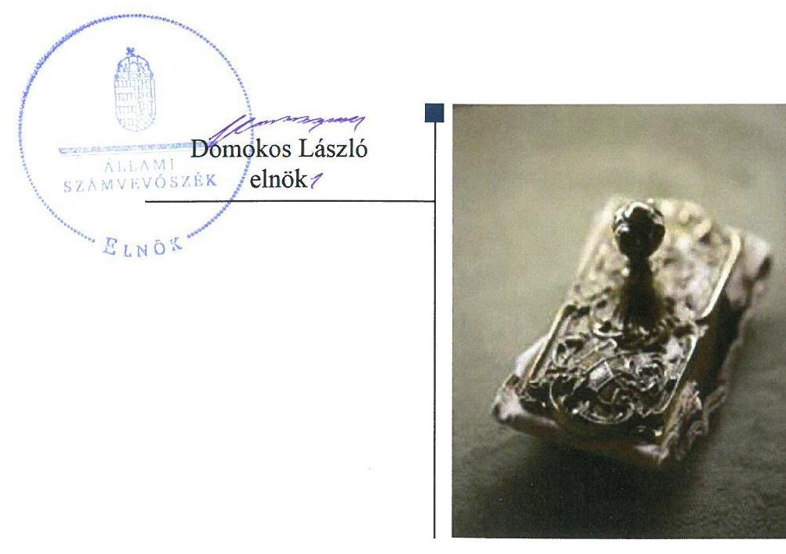
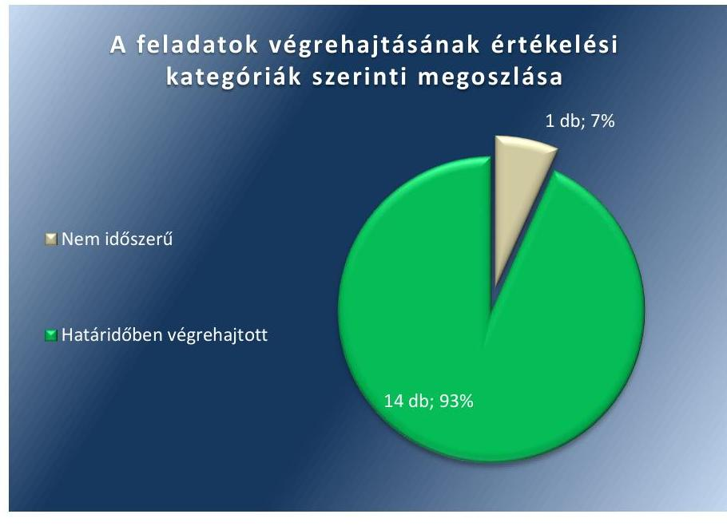

# Jelenetés 

## Utóellenőrzések

Az önkormányzatok belső kontrollrendszere kialakításának és működtetésének ellenőrzése Ceglédbercel Község Önkormányzata 2018. 12. hó 12. nap

---

|  | AZ ELLENŐRZÉST FELÜGYELTE: |
| :--: | :--: |
|  | DR. NÉMETH ERZSÉBET felügyeleti vezető |
|  | AZ ELLENŐRZÉST VEZETTE ÉS A VÉGREHAJTÁSÁÉRT FELELŐS: |
|  | DR. NAGY JUDIT ellenőrzésvezető |
|  | A PROGRAM ÖSSZEÁLLÍTÁSÁÉRT FELELŐS: |
|  | TÓTPÁL SZABOLCS osztályvezető |
|  | A TÉMÁHOZ KAPCSOLÓDÓ KORÁBBI SZÁMVEVŐSZÉKI JELENTÉSEK: |
|  | - címe: Önkormányzatok belső kontrollrendszere - Az önkormányzatok belső kontrollrendszere kialakításának és működtetésének ellenőrzése - Cegléd- |
| J | bercel |
| a www.asz.hu címen is olvashatóak. | sorszáma: $\quad 17010$ |
|  | IKTATÓSZÁM: EL-1285-001/2018 |
|  | TÉMASZÁM: 2460 |
|  | ELLENŐRZÉS-AZONOSÍTÓ SZÁM: V080424 |

---

# TARTALOMJEGYZÉK 

■ ÖSSZEGZÉS ..... 5
■ AZ ELLENŐRZÉS CÉLJA ..... 6
■ AZ ELLENŐRZÉS TERÜLETE ..... 7
■ AZ ELLENŐRZÉS HÁTTERE, INDOKOLTSÁGA ..... 8
■ A JELENTÉS LÉNYEGES KÉRDÉSKÖRE ..... 9
■ AZ ELLENŐRZÉS HATÓKÖRE ÉS MÓDSZEREI ..... 10
■ MEGÁLLAPÍTÁSOK ..... 12
■ MELLÉKLETEK ..... 15
■ FÜGGELÉK: ÉSZREVÉTELEK ..... 19
■ RÖVIDÍTÉSEK JEGYZÉKE ..... 21

---

.

---

# ÖSSZEGZÉS 

Az Állami Számvevőszék Ceglédbercel Község Önkormányzata gazdálkodásának utóellenőrzése során megállapította, hogy az intézkedési tervben foglalt feladatokat végrehajtották, amelynek következtében a belső kontrollrendszer működtetésének szabályszerűsége javult.

## Az ellenőrzés társadalmi indokoltsága

Az Állami Számvevőszék stratégiájában célul tűzte ki a számvevőszéki munka hasznosulásának javítását. Ezzel összhangban ellenőrzi, hogy az ellenőrzött szervezetek megvalósították-e a korábbi ellenőrzései által feltárt hibák, hiányosságok és szabálytalanságok megszüntetése céljából kialakított intézkedési terveikben foglaltakat. Az intézkedések végrehajtásával az adott terület szabályszerű működése vonatkozásában a kockázatok csökkenhetnek, ugyanakkor a végre nem hajtott intézkedések következtében újabb kockázatok merülhetnek fel, amelyek kezelése kiemelten fontos. A rendszeres utóellenőrzések hozzájárulnak a szükséges intézkedések tényleges végrehajtásához, ezáltal a közpénzügyek rendezettségének javulásához, a szabálytalan közpénzfelhasználás kockázatának a csökkentéséhez.

Az önkormányzatok brókercégeknél befektetett szabad pénzeszközeit érintő, 2015. évben történt események társadalmi jelentőségére tekintettel az ÁSZ az érintett településeken ellenőrzések előkészítéséről, megkezdéséről döntött. 2016-tól így az önkormányzatok belső kontrollrendszere kialakításának és működtetésének ellenőrzését kiegészítette az egyes befektetési döntések és azok végrehajtása, elszámolása szabályszerűségének ellenőrzésével.

## Főbb megállapítások, következtetések

Ceglédbercel Község Önkormányzata az Állami Számvevőszék intézkedést igénylő megállapításai alapján tett javaslataira készített intézkedési tervében tizenöt feladatot határozott meg, amelyből tizennégy feladatot határidőben végrehajtott, egy feladat végrehajtása nem volt időszerű.

A belső kontrollrendszer működésének szabályszerűsége javult az Önkormányzatnál.
A kontrollkörnyezet keretében az önkormányzati SZMSZ-ben a vagyonnyilatkozat-tételi kötelezettséget kiterjesztették a Képviselő-testület nem képviselő tagjaira. A Jegyző gondoskodott a gazdálkodási szabályzatok felülvizsgálatáról, a teljesítésigazolásra és az összeférhetetlenségre vonatkozó előírások pontosításáról. A Jegyző gondoskodott a Környezetvédelmi program felülvizsgálatáról, kiadásáról. A Polgármesteri Hivatal alapító okiratát a jogszabályi változásnak megfelelően aktualizálták.

Az integrált kockázatkezelési rendszer működéséről szóló szabályzatot hatályba léptették és a kapcsolódó belső ellenőrzés lefolytatásáról gondoskodtak.

Az információs és kommunikációs rendszer keretében biztosították az adatok védelmét, a közérdekű adatokat közzétették.

A Jegyző az intézkedési tervben rögzített feladatok végrehajtását tartalmazó nyilvántartást a jogszabályi előírásoknak megfelelően vezette.

---

# AZ ELLENŐRZÉS CÉLJA 

Az ellenőrzés célja annak értékelése volt, hogy a számvevőszéki jelentésben ${ }^{1}$ foglalt intézkedést igénylő megállapításokkal összhangban készített intézkedési tervben meghatározott feladatokat az ellenőrzött szervezet végrehajtotta-e.

---

# **AZ ELLENŐRZÉS TERÜLETE**

## **Ceglédbercel Község Önkormányzata**

Ceglédbercel község Pest megyében, a Ceglédi járásban található. A település lakosságszáma 2017. január 1-jén 4267 fő2 volt. A Képviselő-testület3 a Polgármester4 és az Alpolgármester5 mellett 5 fő képviselőből áll.

Az Önkormányzat6 az ellenőrzött időszakban a Polgármesteri Hivatal mellett Óvodát, Általános Iskolát és Alapfokú művészetoktatási Intézményt, Művelődési Házat és Könyvtárt, valamint Falumúzeumot működtetett.

A Polgármester 2014. október 12-től, a Jegyző7 2008. április 1-jétől látja el a feladatait.

Az Önkormányzat 2017. évi zárszámadási rendelete8 szerint 928,9 M Ft költségvetési bevételt ért el és 972,8 M Ft költségvetési kiadást teljesített, míg tartós hitelviszonyt és forgatási célú hitelviszonyt megtestesítő értékpapírral 2017. év végén nem rendelkezett.

**AZ ÁSZ**9 2016. évben ellenőrizte az Önkormányzat gazdálkodását a 2011. január 1. – 2015. április 30. közötti időszak vonatkozásában. Az ellenőrzés célja annak értékelése volt, hogy az Önkormányzat belső kontroll rendszerének kialakítása és működtetése biztosította-e az önkormányzatnál a közpénzfelhasználás szabályosságát. Az ÁSZ ellenőrizte, hogy az Önkormányzat egyes befektetési döntései és azok végrehajtása, elszámolása megfelelte-e a vonatkozó jogszabályoknak és belső szabályozásoknak, a kialakított kontrollrendszer támogatta-e a befektetési tevékenység szabályszerűségét. Az ÁSZ az ellenőrzésről szóló 17010. sorszámú jelentését 2017. január 11-én hozta nyilvánosságra. Az ÁSZ jelentésében szereplő javaslatokra a Képviselő-testület intézkedési tervet fogadott el10, amelyet az ÁSZ elnöke 2017. március 24-én hagyott jóvá.

---

# AZ ELLENŐRZÉS HÁTTERE, INDOKOLTSÁGA 

Az ÁSZ tv ${ }^{11}$. 33. § (1) bekezdése értelmében a számvevőszéki jelentések intézkedést igénylő megállapításaihoz és javaslataihoz kapcsolódóan az ellenőrzött szervezet vezetője intézkedési tervet köteles összeállítani, és az Állami Számvevőszék részére megküldeni.

Az ÁSZ által befogadott intézkedési tervben foglaltak megvalósítását az ÁSZ törvény 33. § (7) bekezdésében foglaltak alapján - az Állami Számvevőszék utóellenőrzés keretében ellenőrizheti. Az utóellenőrzések keretében - az intézkedések értékelése során - az Állami Számvevőszék figyelembe veszi az ellenőrzött szervezetek működési feltételeiben, valamint a jogszabályi előírásokban bekövetkezett változásokat. Az utóellenőrzés során az ÁSZ értékeli, hogy az érintett számvevőszéki jelentésben foglalt intézkedést igénylő megállapításokkal és javaslatokkal összhangban, az ellenőrzött szervezet által készített intézkedési tervben meghatározott feladatokat a feladatra kijelöltek végrehajtották-e.

Az intézkedések végrehajtásával az adott terület szabályszerű működése vonatkozásában a kockázatok csökkenhetnek, azonban hosszabb távon az intézkedési tervben foglaltak végrehajtásával önmagában nem szűnnek meg, csak akkor, ha beépülnek az ellenőrzött szervezet működésébe, azokat folyamatosan karban tartják, figyelembe véve, illetve kezelve a változásokat. Emellett az intézkedések végrehajtásáig újabb kockázatok merülhetnek fel a szabályszerű működés vonatkozásában, amelyek kezelése szintén kiemelten fontos az ellenőrzött szervezet számára.

Az ellenőrzött szervezet vezetője által készített intézkedési tervekben foglalt feladatok hiányos, illetve késedelmes végrehajtása, vagy annak elmaradása a szabályszerűség és a felelős vezetői magatartás vonatkozásában kockázatot hordoz, ami azt mutatja, hogy az ellenőrzések során feltárt hibák, hiányosságok és szabálytalanságok kezelése nem kapott kellő hangsúlyt. Az utóellenőrzés során is fennálló szabálytalanságok esetén a közpénz, közvagyon veszélyeztetettségi kockázat valószínűsített hatásának értékelése további intézkedéseket vonhat maga után.

Az ellenőrzött szervezet szintjén az utóellenőrzés feltárja, hogy a szervezet az intézkedések végrehajtásával hasznosította-e a korábbi ellenőrzési jelentésben a hiányosságok megszüntetése, illetve a kockázatok kezelése érdekében megfogalmazott javaslatokat, illetve az intézkedések végrehajtása elmaradásának következtében továbbra is fennálló szabálytalanság esetén értékeli a közpénzek, közvagyon veszélyeztetettségét. Az ÁSZ szintjén az utóellenőrzés visszacsatolást ad az ellenőrzési jelentések hasznosulásáról, az intézkedések elmaradásának, vagy részleges megvalósulásának a közpénzek, közvagyon veszélyeztetettségére gyakorolt valószínűsített hatásának értékelése, további intézkedéseket vonhat maga után.

---

# A JELENTÉS LÉNYEGES KÉRDÉSKÖRE 

Az Önkormányzat az intézkedési tervben foglaltakat az előírt határidőben végrehajtotta-e?

---

# AZ ELLENŐRZÉS HATÓKÖRE ÉS MÓDSZEREI 

## Az ellenőrzés típusa

Megfelelőségi ellenőrzés.

## Az ellenőrzött időszak

Az utóellenőrzés alapját képező számvevőszéki jelentés közzétételének napjától, 2017. január 11-től, az ellenőrzésről szóló kiértesítő levél keltéig, 2018. július 5-ig tartó időszak.

## Az ellenőrzés tárgya

Az ÁSZ tv. 2011. július 1-jei hatálybalépését követően a számvevőszéki jelentésben foglalt intézkedést igénylő megállapításokkal és javaslatokkal összhangban - az Önkormányzat által - készített intézkedési tervben foglaltak végrehajtásának ellenőrzése volt.

## Az ellenőrzött szervezet

Ceglédbercel Község Önkormányzata

## Az ellenőrzés jogalapja

Az utóellenőrzés jogszabályi alapját az ÁSZ tv. 33. § (7) bekezdésének előírásai képezik.

## Az ellenőrzés módszerei

Az ellenőrzést az ellenőrzött időszakban hatályos jogszabályok, az ellenőrzés szakmai szabályai, a jelen ellenőrzésre irányadó ÁSZ módszertanok, az ellenőrzési programban foglalt értékelési szempontok szerint, önállóan végezte az ÁSZ.

Az ÁSZ az ellenőrzés ideje alatt az ellenőrzött szervezettel történő kapcsolattartást az ÁSZ SZMSZ ${ }^{12}$-ének vonatkozó előírásai alapján biztosította.

Az utóellenőrzés megállapításait az ÁSZ rendelkezésére álló dokumentumok, valamint az ÁSZ adatbekérése szerint, az ellenőrzött szervezetek által rendelkezésre bocsátott dokumentumok, adatok alapján fogalmazta meg.

---

Az ellenőrzési kérdések megválaszolásához szükséges bizonyítékok megszerzése az ellenőrzött által rendelkezésre bocsátott dokumentumokra, adatokra alapozva megfigyelés, szemle (szemrevételezés), kérdésfeltevés (információkérés), alkalmazásával történt. Az ellenőrzési bizonyítékként felhasználható adatforrások közé tartoztak egyrészt az ellenőrzési program részletes szempontjainál felsorolt adatforrások, másrészt minden - az ellenőrzés folyamán feltárt, az ellenőrzés szempontjából információt tartalmazó - dokumentum.

Az intézkedési tervekben előírt feladatokat azok végrehajthatósága, illetve végrehajtása szempontjából az alábbiak szerint értékelte az ÁSZ:
$\longrightarrow$ „határidőben végrehajtott" a feladat, ha a teljesítés dokumentáltan, az intézkedési tervben előírt határidőben és tartalommal megtörtént;
$\longrightarrow$ „határidőn túl végrehajtott" a feladat, ha annak teljesítése az intézkedési tervben meghatározott módon, de az abban előírt határidőn túl történt meg;
$\longrightarrow$ „részben végrehajtott" a feladat, ha annak végrehajtása nem teljes körűen az intézkedési tervben előírt módon történt meg;
$\longrightarrow$ „nem végrehajtott" a feladat, ha a végrehajtás nem történt meg, dokumentumokkal nem igazolt annak teljesítése;
$\longrightarrow$ „okafogyottá vált" a feladat, ha végrehajtására - meghatározott esemény bekövetkezése, továbbá külső körülmény, a működést érintő feltétel változása miatt - már nincs szükség, illetve lehetőség, és egyértelműen megállapítható, hogy az intézkedést szükségessé tevő körülmény a jövőben nem fordulhat elő;
$\longrightarrow$ „nem időszerű" az a feladat, amelynek ellenőrzési időszakon belüli végrehajtására azért nem került (kerülhetett) sor, mert az intézkedés alapjául szolgáló esemény nem következett be, de annak jövőbeni előfordulása lehetséges, a végrehajtása nem volt esedékes, vagy a végrehajtás határideje még nem járt le.
Az ellenőrzés lefolytatásához az ellenőrzött szervezet a tanúsítványok elektronikus kitöltésével, valamint az ÁSZ által kért dokumentumok elektronikus megküldésével szolgáltatott adatokat, amelyek valódiságát és teljes körűségét az ellenőrzött szervezet vezetője által tett teljességi és hitelességi nyilatkozat igazolta. Az így rendelkezésre bocsátott adatok, információk kontrollja az ellenőrzés keretében történt.

---

# MEGÁLLAPÍTÁSOK 

## Az Önkormányzat az intézkedési tervben foglaltakat az előírt határidőben végrehajtotta-e?

Összegző megállapítás

Az Önkormányzat az intézkedési tervében meghatározott 15 feladat közül 14 feladatot határidőben hajtott végre, további 1 feladat végrehajtása nem volt időszerű.

Az ÁSZ 17010. számú jelentése alapján elkészült és elfogadott intézkedési terv ${ }^{13} 15$ feladatot tartalmazott.

Az Önkormányzat intézkedési tervében meghatározott feladatokat, határidőket, a feladatok végrehajtásáért felelős személyeket és a feladatok végrehajtását összefoglalva az I. számú melléklet mutatja be.

Az ÁSZ javaslatai alapján készített intézkedési tervben rögzített feladatok végrehajtásáról a Jegyző a Bkr. ${ }^{14} 14 . \S$ (1) bekezdésében foglaltak szerint vezetett nyilvántartást.

Az intézkedési tervben meghatározott feladatok végrehajtásának értékelési kategóriák szerinti megoszlását az 1. ábra szemlélteti.

1. ábra

A BELSŐ KONTROLLRENDSZER szabályozottsága, illetve működésének szabályszerűsége a végrehajtott intézkedések eredményeképpen javult, a szabálytalan működésből eredő kockázat csökkent.

A kontrollkörnyezet kialakítása keretében elfogadásra került a Polgármesteri Hivatal módosított, a jogszabályoknak megfelelő Alapító okirata ${ }^{15}$.

---

A Képviselő-testület módosította ${ }^{16}$ a Vagyonrendelet ${ }^{17}$-et, az Önkormányzati SZMSZ
 ${ }^{18}$-t és a 2016. évi költségvetési rendelet ${ }^{19}$-et, ezzel megszüntette a hatáskör párhuzamos szabályozását. A Képviselő-testület elfogadta a Polgármesteri Hivatal Etikai Szabályzatát ${ }^{20}$, a település Környezetvédelmi programját ${ }^{21}$ és 2016. december 17-től módosította az Önkormányzati SZMSZ-t, előírta az önkormányzati bizottságok nem képviselő tagjainak vagyonnyilatkozat-tételi kötelezettségét. 2017. február 1-jével Gazdasági vezető ${ }^{22}$ kinevezését módosították.

A kockázatkezelési rendszer tekintetében a Belső kontrollrendszer szabályzat ${ }^{23}$ II. fejezetében szabályozták az integrált kockázatkezelést. Az információs és kommunikációs rendszer keretében biztosították az adatok védelmét, a közérdekű adatok közzétételéről gondoskodtak. A monitoring rendszer keretében a Belső kontrollrendszer szabályzat és a Gazdálkodási szabályzat ${ }^{24}$ felülvizsgálatra és módosításra került.

A PÉNZÜGYI GAZDÁLKODÁSI TEVÉKENYSÉG értékelése nem volt időszerű.

---

.

---

# MELLÉKLETEK

- I. SZ. MELLÉKLET: CEGLÉDBERCEL KÖZSÉG ÖNKORMÁNYZATA INTÉZKEDÉSI TERVÉNEK VÉGREHAJTÁSA AZ ÁSZ 17010 SZÁMÚ JELENTÉSÉHEZ KAPCSOLÓDÓAN

|  5. 5. 5. 5. 5. | Intézkedési
tervben
meghatározott
határidő | Az intézkedési
tervben meg
határozott fel
adat felelőse | A feladat végrehajtása  |
| --- | --- | --- | --- |
|  Határidőben végrehajtott feladatok |  |  |   |
|  Ceglédbercel Község Önkormányzatának Képviselő-testülete 2016. december 15-én tárgyalta az „Egyes önkormányzati rendeletek felülvizsgálata és módosítása" című előterjesztést, melyben a jogalkotásról szóló 2010. évi CXXX. törvényben foglaltakra figyelemmel felülvizsgálatra került
• az önkormányzat vagyonáról és az önkormányzati vagyonnal történő gazdálkodás, továbbá a vagyonhasznosítás szabályairól 11/2004. (VIII. 11.) ÖK. sz. rendelete (Vagyonrendelet)
• a képviselő-testület és szervei Szervezeti és Működési Szabályzatáról szóló 7/2011. (V. 3.) önkormányzati rendelete (SZMSZ)
• az önkormányzat 2016. évi költségvetéséről szóló 1/2016. (II. 5.) önkormányzati rendelete különös tekintettel a hatásköröket érintő rendelkezésekre. A felülvizsgálat alapján a Képviselő-testület elfogadta a 15/2016. (XII. 16.) önkormányzati rendeletét, mellyel eleget tett az egyértelműen értelmezhető szabályozás követelményének és megszüntette a hatáskör párhuzamos szabályozását. Az SZMSZ-ből és a vagyonrendeletből törlésre kerültek a párhuzamos rendelkezések és a diszkontkincstárjegyek vásárlására, értékesítésére, beváltására vonatkozó polgármesteri hatáskörgyakorlás a költségvetési rendeletben került szabályozásra.
Ceglédbercel Község Önkormányzat Képviselő-testülete 2017. február 6-i ülésén tárgyalta a „Ceglédberceli Polgármesteri Hivatal alapító okiratának módosítása" című előterjesztést. A határozati javaslat szerint a Képviselő-testület az államháztartásról szóló 2011. évi CXCV. törvénynek és az államháztartásról szóló törvény végrehajtásáról szóló 368/2011. (XII. 31.) Kormányrendeletnek megfelelően módosítja a Ceglédberceli Polgármesteri Hivatal alapító okiratát. | A javaslatra tett intézkedés a rendelet hatálybalépésével (2016. december 17.) megvalósult. | polgármester (közreműködik: jegyző) | A Képviselő-testület felülvizsgálta a Vagyonrendeletet, az Önkormányzati SZMSZ-t és a 2016. évi költségvetési rendeletét. A felülvizsgálat alapján a Képviselő-testület elfogadta a módosító rendeletet, amely a Vagyonrendeletet, az Önkormányzati SZMSZ-t és a 2016. évi költségvetési rendeletet módosította. Az SZMSZ-ből és a vagyonrendeletből törlésre kerültek a párhuzamos rendelkezések és a diszkontkincstárjegyek vásárlására, értékesítésére, beváltására vonatkozó polgármesteri hatáskörgyakorlás a költségvetési rendeletben került szabályozásra. Ezzel eleget tett az egyértelműen értelmezhető szabályozás követelményének és megszüntette a hatáskör párhuzamos szabályozását.  |
|  2017. február 6. | jegyző |  | A Képviselő-testület a 10/2017. (02. 06.) ÖK. sz. határozatával elfogadta, -, a Polgármesteri Hivatal az Áht.25-nek és az Ávr.26-nek megfelelően módosított alapító okiratát,, amelynek azonosító száma a Magyar Államkincstár H/397-3/2017. és hatályos 2017. május 16-tól.  |

---

|  3. | Intézkedés történt Szeidl Józsefné – korábbi Pénzügyi és Adó csoportvezető – 2017. február 1. napjával hatályos gazdasági vezetői kinevezésére. |  | Az intézkedési tervben meghatározott feladat felelőse | A feladat végrehajtása  |
| --- | --- | --- | --- | --- |
|  4. | A Ceglédberceli Polgármesteri Hivatal Etikai Szabályzatát 75/2015. (06.01.) ÖK. számú határozatával fogadta el a képviselő-testület. A szabályzat tartalmazza a köztisztviselőkre vonatkozó hivatásetikai alapelvek részletes tartalmát, valamint az etikai eljárás szabályait. |  | polgármester (közreműködik: jegyző) | A kinevezést módosító okirat szerint 2017. február 1-jével kinevezték a gazdasági vezetőt.  |
|  5. | Ceglédbercel Község Önkormányzatának képviselő-testülete 2016. december 15-én tárgyalta az "Egyes önkormányzati rendeletek felülvizsgálata és módosítása" című előterjesztést, melyben felülvizsgálta és módosította a képviselő-testület és szervei Szervezeti és Működési Szabályzatáról szóló 7/2011. (V.3.) önkormányzati rendeletét (SZMSZ). A felülvizsgálat alapján a képviselő-testület elfogadta a 15/2016.(XII.16.) önkormányzati rendeletét, melyben rögzítette az önkormányzati bizottságok nem képviselő tagjainak vagyonnyilatkozat-tételi kötelezettségét. Ceglédbercel Község Önkormányzat Képviselő-testülete 2016. december 15-i ülésén tárgyalta a képviselő-testület 2017. évi munkatervét. A 155/2016.(12.15.) KT határozattal elfogadott munkaterv szerint a képviselő-testület 2017. március 27-én tárgyalja és fogadja el a település környezetvédelmi programját. |  | polgármester (közreműködik: jegyző) | A Képviselő-testület a 75/2015. (06. 01.) ÖK sz. határozatával fogadta el a Ceglédberceli Polgármesteri Hivatal Etikai Szabályzatát.  |
|  6. | Az Állami Számvevőszék ellenőrzése során feltárt hiányosságok tekintetében a munkajogi felelősség vizsgálata megindult. A tényállás tisztázását követően kerül sor a munkáltatói jogkörben szükséges intézkedések meghatározására. |  | polgármester (közreműködik: jegyző) | A Képviselő-testület a módosító rendeletével, 2016. december 17-től módosította az Önkormányzati SZMSZ 54. § (2) bekezdését, valamint 58. § (8) bekezdését. Ezzel előírta az önkormányzati bizottságok nem képviselő tagjainak vagyonnyilatkozat-tételi kötelezettségét, a Vnytv.27.4. § (2) pontjában foglaltakszerint.  |
|  7. | Az Állami Számvevőszék ellenőrzése során feltárt hiányosságok tekintetében a munkajogi felelősség vizsgálata megindult. A tényállás tisztázását követően kerül sor a munkáltatói jogkörben szükséges intézkedések meghatározására. |  | polgármester (közreműködik: jegyző) | A Képviselő-testület a 33/2017. (03. 27.) ÖK. Sz. határozattal elfogadta a település környezetvédelmi programját a településrendezési eszközök folyamatban lévő felülvizsgálatával összhangban. Ceglédbercel Község Önkormányzatának Környezetvédelmi programja 2017. március 27-én lépett hatályba.  |
|  8. |  |  | polgármester (közreműködik: jegyző) | Polgármesteri utasítás a Jegyzőnek beszámolási kötelezettséget írt elő, az ÁSZ ellenőrzés kapcsán tett intézkedésekről, melynek a Jegyző 2017. február 28-án kelt jelentésében eleget tett.  |
|  9. | Az Állami Számvevőszék ellenőrzése során feltárt hiányosságok tekintetében a munkajogi felelősség vizsgálata megindult. A tényállás tisztázását követően kerül sor a munkáltatói jogkörben szükséges intézkedések meghatározására. |  | polgármester, jegyző | A Jegyző beszámoltatatta a gazdasági vezetőt a feltárt hiányosságokkal összefüggésben. A gazdasági vezető beszámolási kötelezettségének 2017. február 28-án kelt jelentésében eleget tett. Ennek alapján a Jegyző további munkajogi intézkedéseket nem látott indokoltnak.  |

---

|  8. | A belső kontrollrendszer kialakításának és működtetésének felülvizsgálata keretében a kockázatkezelésre vonatkozó fejezet felülvizsgálatra kerül. A szabályzat szerinti eljárás biztosítása érdekében az előírások ismertetésre kerülnek a Polgármesteri Hivatal köztisztviselőivel. A belső ellenőrzés a belső kontrollrendszer kialakítása, kiemelten a kontrollkörnyezet keretében kialakítandó szabályzatok megfelelőségére szabályszerűségi ellenőrzést végez. | 2017. május 31. | jegyző | A belső kontrollrendszer felülvizsgálatra került és 2017. január 1-jei hatállyal új Belső kontrollrendszer szabályzat${ }^{28}$ került kiadásra. Megismeréséről a Polgármesteri Hivatal ügyintézői aláírásukkal nyilatkoztak. A belső ellenőrzés 2017. évben szabályszerűségi ellenőrzést${ }^{29}$ végzett a belső kontrollrendszer kialakítása, kiemelten a kontrollkörnyezet keretében kialakítandó szabályzatok megfelelőségére.  |
| --- | --- | --- | --- | --- |
|  9. | A belső kontrollrendszer kialakításának és működtetésének felülvizsgálata keretében a monitoring rendszerre vonatkozó fejezet felülvizsgálatra kerül. A szabályzat szerinti eljárás biztosítása érdekében az előírások ismertetésre kerülnek a Polgármesteri Hivatal ügyintézőivel. | 2017. május 31. | jegyző | A Belső kontrollrendszer szabályzat – és azon belül a monitoringra vonatkozó fejezet – felülvizsgálatra került és 2017. január 1-jei hatállyal új Belső kontrollrendszer szabályzat került kiadásra. A Hivatalban a szervezet tevékenységének, a célok megvalósításának nyomon követését biztosító rendszer keretében a folyamatos és eseti nyomon követést a Bkr. 10. §-ában előírtak szerint kialakították. Megismeréséről a Polgármesteri Hivatal ügyintézői aláírásukkal nyilatkoztak.  |
|  10. | A belső kontrollrendszer kialakításának és működtetésének felülvizsgálata keretében a kockázatkezelésre vonatkozó fejezet felülvizsgálatra kerül. A kontrolltevékenység részeként biztosításra kerül a folyamatba épített előzetes, utólagos vezetői ellenőrzés. A szabályzat szerinti eljárás biztosítása érdekében az előírások ismertetésre kerülnek a Polgármesteri Hivatal ügyintézőivel. A belső ellenőrzés a belső kontrollrendszer kialakítása, kiemelten a kontrollkörnyezet keretében kialakítandó szabályzatok megfelelőségére szabályszerűségi ellenőrzést végez. | 2017. május 31. | jegyző | A Belső kontrollrendszer szabályzat – és azon belül a monitoringra vonatkozó fejezet – felülvizsgálatra került és 2017. január 1-jei hatállyal új Belső kontrollrendszer szabályzat került kiadásra. A Hivatalban a szervezet tevékenységének, a célok megvalósításának nyomon követését biztosító rendszer keretében a folyamatos és eseti nyomon követést a Bkr. 10. §-ában előírtak szerint kialakították. Megismeréséről a Polgármesteri Hivatal ügyintézői aláírásukkal nyilatkoztak.  |
|  11. | Az Info tv. 37. § (1) bekezdésében és az 1. melléklet III./4. pontjában előírtak alapján a közzététel végrehajtásra kerül a www.cegledbercel.hu (http://cegledbercel.asp.lgov.hu/) honlapon. | 2017. március 31. | jegyző | A Belső kontrollrendszer szabályzat II. fejezetében szabályozták az integrált kockázatkezelést, amely felülvizsgálatra került és 2017. január 1-jei hatállyal új Belső kontrollrendszer szabályzat került kiadásra. A kontroll tevékenység részeként az ellenőrzési nyomvonal, mint a folyamatba épített előzetes, utólagos és vezetői ellenőrzés térképe kialakításra került. Megismeréséről a Polgármesteri Hivatal ügyintézői aláírásukkal nyilatkoztak. A 2017. évben a belső ellenőr szabályszerűségi ellenőrzést végzett a belső kontrollrendszer kialakítása, kiemelten a kontrollkörnyezet keretében kialakítandó szabályzatok megfelelőségére vonatkozóan.  |
|  12. | Az Info tv.${ }^{30}$ 37. § (1) bekezdésében és az 1. melléklet III./4. pontjában előírtak alapján az ötmillió forintot elérő vagy azt meghaladó értékű szerződéseket közzétették. | 2017. március 31. | jegyző | Az Info tv.${ }^{30}$ 37. § (1) bekezdésében és az 1. melléklet III./4. pontjában előírtak alapján az ötmillió forintot elérő vagy azt meghaladó értékű szerződéseket közzétették.  |

---

|  12. |  |  |   |
| --- | --- | --- | --- |
|  13. | Az Info tv. 37. § (1) bekezdésében és az 1. melléklet III./4. pontjában előírtak alapján a közzététel végrehajtásra kerül a www.cegledbercel.hu (http://cegledbercel.asp.lgov.hu/) honlapon. A honlapra feltöltésre kerülnek az önkormányzat döntéshozatalával kapcsolatos dokumentumok. A belső kontrollrendszer kialakításának és működtetésének felülvizsgálata keretében az információs és kommunikációs rendszerre vonatkozó fejezet felülvizsgálatra kerül. A szabályzat szerinti eljárás biztosítása érdekében az előírások ismertetésre kerülnek a Polgármesteri Hivatal ügyintézőivel. | 2017. május 31. | jegyző  |
|   | Az Állami Számvevőszék jelentése ismertetésre került a Polgármesteri Hivatal ügyintézőivel. A számvitelről szóló 2000. évi C. törvény 15. § (9) bekezdése szerinti bruttó elszámolás elve a 15. § (2) bekezdés szerinti teljesség elve és a 15. § (3) bekezdés szerinti valódiság elve a könyvelésben jogszerűen

 alkalmazásra kerül. A belső kontrollrendszer kialakításának és működtetésének felülvizsgálata keretében a kockázatkezelésre vonatkozó fejezet felülvizsgálatra kerül. A kontrolltevékenység részeként biztosításra kerül a folyamatba épített előzetes és utólagos vezetői ellenőrzés. A szabályzatok felülvizsgálata keretében Ceglédbercel Község Önkormányzat és intézményei Gazdálkodási szabályzata felülvizsgálatra kerül. A szabályzat szerinti eljárás biztosítása érdekében az előírások ismertetésre kerülnek a Polgármesteri Hivatal ügyintézőivel. A belső ellenőrzés az előírások be nem tartásában rejlő kockázatok azonosítása alapján szabályszerűségi ellenőrzést végez. | A javaslatra tett intézkedés 2017.01.11-én megvalósult. | gazdasági vezető  |
|   |  | 2017. május 31. | jegyző  |
|   | Nem időszerű feladat |  |   |
|  15. | 2015.06.11-től Ceglédbercel Község Önkormányzata a Magyar Államkincstártól vásárol Diszkont Kincstárjegyet. A vételi és beváltási tranzakciókról az adásvétel bizonylatain kívül értékpapír nyilvántartási-számla kivonattal is rendelkezik. A könyvvezetés ezen bizonylatok alapján történik. | A javaslatra tett intézkedés 2015.06.11-től megvalósult. | gazdasági vezető  |

Az Info tv. 37. § (1) bekezdésében és az 1. melléklet III./4. pontjában előírtak alapján az ötmillió forintot elérő vagy azt meghaladó értékű szerződéseket közzétették. Az Önkormányzat tartós hitelviszonyt és forgatási célú hitelviszonyt megtestesítő értékpapírral 2017. év végén nem rendelkezett. A Belső kontrollrendszer szabályzat IV. fejezetében szabályozták az információs és kommunikációs rendszert, amely felülvizsgálatra került és 2017. január 1-jei hatállyal új Belső kontrollrendszer szabályzat került kiadásra. Megismeréséről a Polgármesteri Hivatal ügyintézői aláírásukkal nyilatkoztak.

Az ÁSZ jelentést ismertették a Hivatal ügyintézőivel. A belső kontrollrendszer kialakításának keretében a Belső kontrollrendszer szabályzatba beépítésre kerültek az integrált kockázatkezelésre vonatkozó szabályok is. A kontrolltevékenység elemei, így a vezetői ellenőrzés is beépült a szabályozásba. A számviteli kontrollkörnyezetet, mint a könyvelés alapját, annak jogszerűségét, a Számv. tv. előírásainak való megfelelését belső ellenőrzés vizsgálta és nem volt elmarasztaló megállapítása.

A Gazdálkodási szabályzat felülvizsgálata megtörtént, 2017. február 1-jétől új szabályzat került kiadásra. Megismeréséről a Polgármesteri Hivatal ügyintézői aláírásukkal nyilatkoztak. A belső ellenőrzés az előírások be nem tartásában rejlő kockázatokat nem azonosított.

Az Önkormányzat 2015. június 11-től teljesítette a vállalást, azonban a 2015. évet követően nem vásárolt forgatási célú hitelviszonyt megtestesítő értékpapírt és 2016-ban megszüntette a korábban meglevőket. Az intézkedés végrehajtása az ellenőrzött időszakban „nem volt időszerű", mert az intézkedés alapjául szolgáló esemény – értékpapír vásárlás – nem következett be, de annak jövőbeni előfordulása lehetséges.

---

# FÜGGELÉK: ÉSZREVÉTELEK 

A jelentéstervezetet a Számvevőszék 15 napos észrevételezésre megküldte az ellenőrzött szervezet vezetőjének az ÁSZ tv. 29. § (1) bekezdése előírásának megfelelően.
Az ellenőrzött szervezet vezetője a jelentéstervezet megállapításaira nem tett észrevételt.

[^0]
[^0]:    * 29. § (1) Az Állami Számvevőszék az ellenőrzési megállapításait megküldi az ellenőrzött szervezet vezetőjének vagy az általa megbízott személynek, és annak, akinek személyes felelősségét állapította meg.
    (2) Az ellenőrzött szervezet vezetője és a felelősként megjelölt személy az ellenőrzés megállapításaira tizenöt napon belül írásban észrevételt tehet.
    (3) Az Állami Számvevőszék az észrevételre a beérkezésétől számított harminc napon belül írásban válaszol. A figyelembe nem vett észrevételeket köteles a jelentésben feltüntetni, és megindokolni, hogy azokat miért nem fogadta el.

---

.

---

# RÖVIDÍTÉSEK JEGYZÉKE 

${ }^{1}$ Számvevőszéki jelentés
${ }^{2}$ Forrás
${ }^{3}$ Képviselő-testület
${ }^{4}$ Polgármester
${ }^{5}$ Alpolgármester
${ }^{6}$ Önkormányzat
${ }^{7}$ Jegyző
${ }^{8}$ 2017. évi zárszámadási rendelet
${ }^{9}$ ÁSZ
${ }^{10}$ Intézkedési terv elfogadása
${ }^{11}$ ÁSZ tv.
${ }^{12}$ ÁSZ SZMSZ
${ }^{13}$ Intézkedési terv
${ }^{14}$ Bkr.
${ }^{15}$ Alapító okirat
${ }^{16}$ Módosító rendelet
${ }^{17}$ Vagyonrendelet
${ }^{18}$ Önkormányzati SZMSZ
${ }^{19}$ 2016. évi költségvetési rendelet
${ }^{20}$ Etikai Szabályzat
${ }^{21}$ Környezetvédelmi program
${ }^{22}$ Gazdasági vezető
${ }^{23}$ Belső kontrollrendszer szabályzat
„Az Önkormányzatok belső kontrollrendszere kialakításának és működtetésének ellenőrzése - Ceglédbercel 2017." című 17010. számú jelentés
Magyarország Közigazgatási helynévkönyve 2017. január 1.
https://www.ksh.hu/docs/hun/hnk/hnk_2017.pdf (a 69. oldalon található)
Ceglédbercel Község Önkormányzatának képviselő-testülete
Ceglédbercel Község Önkormányzatának polgármestere
Ceglédbercel Község Önkormányzatának alpolgármestere
Ceglédbercel Község Önkormányzata
Ceglédbercel Község Önkormányzata jegyzője
Ceglédbercel Község Önkormányzat Képviselő-testületének 9/2018. (V. 29.) önkormányzati rendelete a 2017. évi pénzügyi terv végrehajtásáról
Állami Számvevőszék
Ceglédbercel Község Önkormányzata Képviselő-testületének 12/2017. (02. 06.) ÖK. számú határozata
2011. évi LXVI. törvény az Állami Számvevőszékről (hatályos: 2011. július 1-től)
Az Állami Számvevőszék elnökének 4/2017. (XII. 29.) ÁSZ utasítása az Állami Számvevőszék Szervezeti és Működési Szabályzatáról (hatályos: 2018. január 1-től)
Ceglédbercel Község Önkormányzatának 12/2017. (02.06.) ÖK. határozatával elfogadott intézkedési terve
370/2011. (XII. 31.) Korm. rendelet a költségvetési szervek belső kontrollrendszeréről és belső ellenőrzéséről (hatályos: 2012. január 1-től)
Ceglédbercel Polgármesteri Hivatalának 10/2017. (02.06.) ÖK. sz. határozattal elfogadott, H/397-3/2017 sz., módosításokkal egységes szerkezetbe foglalt Alapító Okirata
Ceglédbercel Község Önkormányzata Képviselő-testületének 15/2016. (XII. 16.) rendelet egyes önkormányzati rendeletek módosításáról
Ceglédbercel Község Önkormányzata Képviselő-testületének 11/2004. (VIII. 11.) ÖK. sz. rendelete az önkormányzat vagyonáról és az önkormányzati vagyonnal történő gazdálkodás, továbbá a vagyonhasznosítás szabályairól
Ceglédbercel Község Önkormányzata Képviselő-testületének 7/2011. (V. 2.) önkormányzati rendelete a képviselő-testület és szervei Szervezeti és Müködési Szabályzatáról
Ceglédbercel Község Önkormányzata Képviselő-testületének 1/2016. (II. 5.) önkormányzati rendelete az önkormányzat 2016. évi költségvetéséről
Ceglédberceli Polgármesteri Hivatal Etikai Szabályzata, elfogadva a 75/2015.(06.01.) ÖK. számú képviselő-testületi határozattal.
Ceglédbercel Község Környezetvédelmi programja, elfogadva a 33/2017. (03.27.) ÖK. sz. határozattal
Ceglédbercel Község Polgármesteri Hivatal gazdasági vezetője, kinevezve 2017. február 1-jével a SZ/2-1/2017. sz. a kinevezés-módosítással.
Ceglédberceli Polgármesteri Hivatal Belső kontrollrendszer (hatályos: 2017. január 1-től)

---

${ }^{24}$ Gazdálkodási szabályzat
${ }^{25}$ Áht.
${ }^{26}$ Ávr.
${ }^{27}$ Vnytv
${ }^{28}$ Belső kontrollrendszer szabályzat
${ }^{29}$ 2017. évi belső ellenőri jelentés
${ }^{30}$ Info tv.

Ceglédberceli Polgármesteri Hivatal Gazdálkodási szabályzat (hatályos: 2017. február 1-től)
2011. évi CXCV. törvény az államháztartásról (hatályos: 2011. december 31-től) 368/2011.(XII.31.) Korm. rendelet az államháztartásról szóló törvény végrehajtásáról
2007. évi CLII. törvény egyes vagyonnyilatkozat-tételi kötelezettségekről (hatályos: 2007. december 7-től)
Ceglédberceli Polgármesteri Hivatal Belső kontrollrendszer (hatályos: 2017. január 1-től)
2017. május 31-én kelt „Belső ellenőri jelentés Ceglédbercel Község Önkormányzatának megbízásából készült belső ellenőri vizsgálatról, belső kontrollrendszer kialakításának ellenőrzéséről, kiemelten a kontrollkörnyezet kertében kialakítandó szabályzatok megfelelőségére"
2011. évi CXII. törvény az információs önrendelkezési jogról és az információszabadságról (hatályos: 2011. július 27-től)

---

# ÁLLAMI SZÁMVEVŐSZÉK 

1052 Budapest, Apáczai Csere János utca 10.
Levélcím: 1364 Budapest 4. Pf. 54
Telefon: +36 14849100 Telefax: +36 14849200
www.asz.hu
