# Jelentés 

## Az önkormányzatok gazdasági társaságai

Az önkormányzatok többségi tulajdonában lévő gazdasági társaságok gazdálkodásának ellenőrzése - Flesch Károly Közművelődési, Kulturális és Városmarketing Közhasznú Nonprofit Kft.

2018

---

# Jelentés 

## Az önkormányzatok gazdasági társaságai

Az önkormányzatok többségi tulajdonában lévő gazdasági társaságok gazdálkodásának ellenőrzése - Flesch Károly Közművelődési, Kulturális és Városmarketing Közhasznú Nonprofit Kft.
2018. 12. hó 27. nap
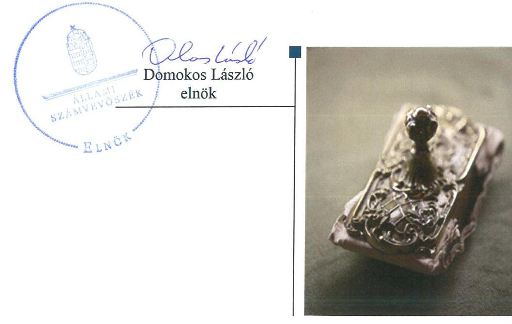

---

# AZ ELLENŐRZÉST FELÜGYELTE:

DR. HORVÁTH MARGIT felügyeleti vezető

## AZ ELLENŐRZÉST VEZETTE ÉS A VÉGREHAJTÁSÁÉRT FELELŐS:

DR. NAGY JUDIT ellenőrzésvezető

## A PROGRAM ÖSSZEÁLLÍTÁSÁÉRT FELELŐS:

TÓTPÁL SZABOLCS osztályvezető

IKTATÓSZÁM: EL-0158-112/2018.

TÉMASZÁM: 2447

ELLENŐRZÉS-AZONOSÍTÓ SZÁM: V079348

Jelentéseink az Országgyűlés számítógépes hálózatán és az Interneta a www.asz.hu címen is olvashatóak.

---

# TARTALOMJEGYZÉK 

■ ÖSSZEGZÉS ..... 5
■ AZ ELLENŐRZÉS CÉLJA ..... 6
■ AZ ELLENŐRZÉS TERÜLETE ..... 7
■ AZ ELLENŐRZÉS HÁTTERE, INDOKOLTSÁGA ..... 9
■ A JELENTÉS LÉNYEGES KÉRDÉSKÖREI ..... 10
■ AZ ELLENŐRZÉS HATÓKÖRE ÉS MÓDSZEREI ..... 11
■ MEGÁLLAPÍTÁSOK ..... 13
■ JAVASLATOK ..... 17
■ MELLÉKLETEK ..... 19
I. sz. melléklet: Értelmező szótár ..... 19
■ FÜGGELÉK: ÉSZREVÉTELEK ..... 21
■ RÖVIDÍTÉSEK JEGYZÉKE ..... 39

---

.

---

# ÖSSZEGZÉS 

A Flesch Károly Közművelődési, Kulturális és Városmarketing Közhasznú Nonprofit Korlátolt Felelősségű Társaság kizárólagos tulajdonosa, Mosonmagyaróvár Város Önkormányzata a tulajdonosi joggyakorlás kereteit szabályszerűen alakította ki, azonban tulajdonosi jogait nem gyakorolta szabályszerűen. A Társaság gazdálkodása, vagyongazdálkodása nem volt szabályszerű. A Társaság nem tett eleget a közérdekü adatokra vonatkozó közzétételi kötelezettségének. Nem volt biztositott gazdálkodásának átláthatósága és az elszámoltathatóság.

## Az ellenőrzés társadalmi indokoltsága

Magyarországon az önkormányzatok kötelező és önként vállalt feladataik ellátása során egyre szélesebb körben alkalmazzák a költségvetési szerveken kívüli feladatellátást, ezáltal az önkormányzati tulajdonú gazdasági társaságok is kiemelt fontosságú szerephez jutnak a lakossági szolgáltatások biztosításában. Az Állami Számvevőszék kiemelt célja, hogy a helyi önkormányzatok gazdálkodásában rejlő pénzügyi kockázatok feltárásával, az államháztartáson kívülre nyújtott költségvetési támogatások és ingyenes vagyonjuttatások, valamint az államháztartáson kívül múködő feladatellátó rendszerek ellenőrzéseivel hozzájáruljon ahhoz, hogy a közpénzeket az államháztartáson kívül múködő szervezetek is átlátható, rendezett módon használják fel.

Az önkormányzatok többségi tulajdonában álló gazdasági társaságok ellenőrzése kiemelt jelentőségű, mivel múködésük hatással van a tulajdonos önkormányzat gazdálkodására, gazdálkodásának egyes elemei befolyásolják az önkormányzati alszektor hiányát és az államadósságot.

Mosonmagyaróváron 2013-2016 között a Flesch Károly Közművelődési, Kulturális és Városmarketing Közhasznú Nonprofit Korlátolt Felelősségű Társaság közművelődési feladatokat látott el, Mosonmagyaróvár Város Önkormányzatával kötött feladat-ellátási szerződések alapján. Az Állami Számvevőszék ellenőrzése azért is indokolt volt, mert tevékenységén keresztül Mosonmagyaróvár és vonzáskörzete lakosságának széles köre kerülhetett kapcsolatba a Társaság által nyújtott szolgáltatásokkal.

## Főbb megállapítások, következtetések, javaslatok

Mosonmagyaróvár Város Önkormányzata a tulajdonosi joggyakorlás kereteit szabályszerűen kialakította, de nem gyakorolta tulajdonosi jogait szabályszerűen, mert a Társaság saját tőkéjének a rendezéséről határidőben nem intézkedett.

A Flesch Károly Közművelődési, Kulturális és Városmarketing Közhasznú Nonprofit Korlátolt Felelősségű Társaság múködése szabályozott volt, gazdálkodása és vagyongazdálkodása azonban nem volt szabályszerű. A bevételek és ráfordítások elszámolásának a Számv. tv. szerinti bizonylatokkal történő alátámasztottsága, továbbá a közhasznú és vállalkozási tevékenység elkülönítése nem volt biztosított.
2015. évre nem készült a számviteli beszámolót a Számv. tv. előírásainak megfelelően alátámasztó leltár, ezzel a Társaság megsértette a Számv. tv. szerinti valódiság elvét.

A Flesch Károly Közművelődési, Kulturális és Városmarketing Közhasznú Nonprofit Korlátolt Felelősségű Társaság az előírt, közérdekű adatokra vonatkozó közzétételi kötelezettségét nem teljesítette. A kormányzati szektorba tartozásból eredő adatszolgáltatási kötelezettségének nem tett eleget. 2016. január 1-től nem alakított ki a tevékenységének és a szervezeti célok megvalósításának nyomon követhetőségét biztosító rendszert.

Az Állami Számvevőszék a jelentésben foglalt megállapítások alapján a Társaság ügyvezetőjének 7 javaslatot, fogalmazott meg, Mosonmagyaróvár Város Polgármesterének 2 javaslatot tett a szabályszerű működés érdekében.

---

# AZ ELLENŐRZÉS CÉLJA 

Az ellenőrzés célja annak értékelése, hogy az önkormányzat vagyongazdálkodási tevékenysége során szabályszerűen gyakorolta-e tulajdonosi jogait. A gazdasági társaság szabályozottsága, gazdálkodása és vagyongazdálkodási tevékenysége, bevételeinek és ráfordításainak elszámolása megfelelt-e a jogszabályi és tulajdonosi előírásoknak. A gazdasági társaság kötelezettségállománya jelentett-e kockázatot a múködésre, valamint a gazdálkodás átláthatósága és elszámoltathatósága érdekében biztosítva volte a szolgáltatás dijának megalapozottsága szabályszerű önköltségszámítással. Az ellenőrzés célja továbbá annak
megítélése, hogy az önkormányzatok többségi tulajdonában lévő gazdasági társaságok gazdálkodásának a kormányzati szektor hiányára és az államadósságra befolyással bíró elemei a jogszabályi előírásoknak megfelelnek-e.

---

# AZ ELLENŐRZÉS TERÜLETE 

## Mosonmagyaróvár Város Önkormányzata és a kizárólagos tulajdonában álló Flesch Károly Közművelődési, Kulturális és Városmarketing Közhasznú Nonprofit Korlátolt Felelősségú Társaság

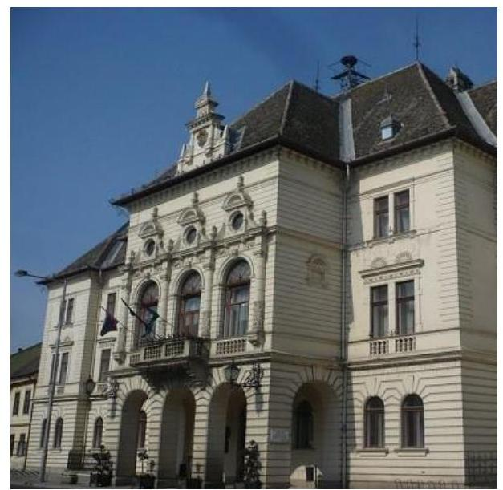

A Társaság ${ }^{1}$-ot az Önkormányzat ${ }^{2}$ kizárólagos tulajdonosként, közművelődési feladatok ellátása céljából, 2007. december 13án hozta létre. A Társaság megalakulásától nonprofit formában, kiemelkedően közhasznú jogállással rendelkezett, amely besorolása 2014. május 22-től közhasznú jogállásra változott.

A Társaság önkormányzati közművelődési közfeladatokat látott el, a Közműv. tv. ${ }^{3}$ 76. § (1) bekezdésében és az Mötv. ${ }^{4}$ 13. § (1) bekezdés 7. pontjában foglaltak alapján, amelyekre vonatkozóan az Önkormányzattal évente Feladat-ellátási szerződés ${ }_{1-4}{ }^{5}$-t kötött.

A Társaság tevékenységi körébe tartozott színházi produkciók fogadása, kulturális és közművelődési programok, városi rendezvények, fesztiválok szervezése. Mosonmagyaróvár és vonzáskörzete legnagyobb közművelődési, kulturális és rendezvényszervező vállalkozásaként, a Társaság feladata volt a Flesch Károly Kulturális Központ, a Fehér Ló Közösségi Ház és a FUTURA interaktív természettudományi Élményközpont múködtetése, illetve programjainak szervezése. A Társaság kiegészítő jelleggel végzett vállalkozási tevékenységet, amelynek keretében ajándékboltot üzemeltetett, termet, közterületet adott bérbe.

A városi televízió működtetését, a műsor összeállítást a Társaság kizárólagos tulajdonában álló gazdasági társaságok ${ }^{6}$ látták el.

A Társaság az ellenőrzött időszakban vagyonkezelésbe kapott vagyonnal nem rendelkezett, az Önkormányzat a feladatellátáshoz szükséges ingatlanvagyon vonatkozásában a Feladat-ellátási szerződés ${ }_{1-4}$ alapján, térítésmentes használatot biztosított, illetve a FUTURA interaktív természettudományi Élményközpont múködtetésére Üzemeltetési szerződés ${ }^{7}$-t kötött az Önkormányzattal.

A Társaság, önköltség-számítási szabályzat készítési kötelezettség alól a Számv. tv. 14. § (6) bekezdése előírása alapján mentesült, mivel egyszerűsített éves beszámolót készítő gazdálkodó volt, árképzését jogszabály nem szabályozta.

A Társaság gazdálkodásával kapcsolatos főbb adatok alakulását az 1. ábra mutatja be.

---

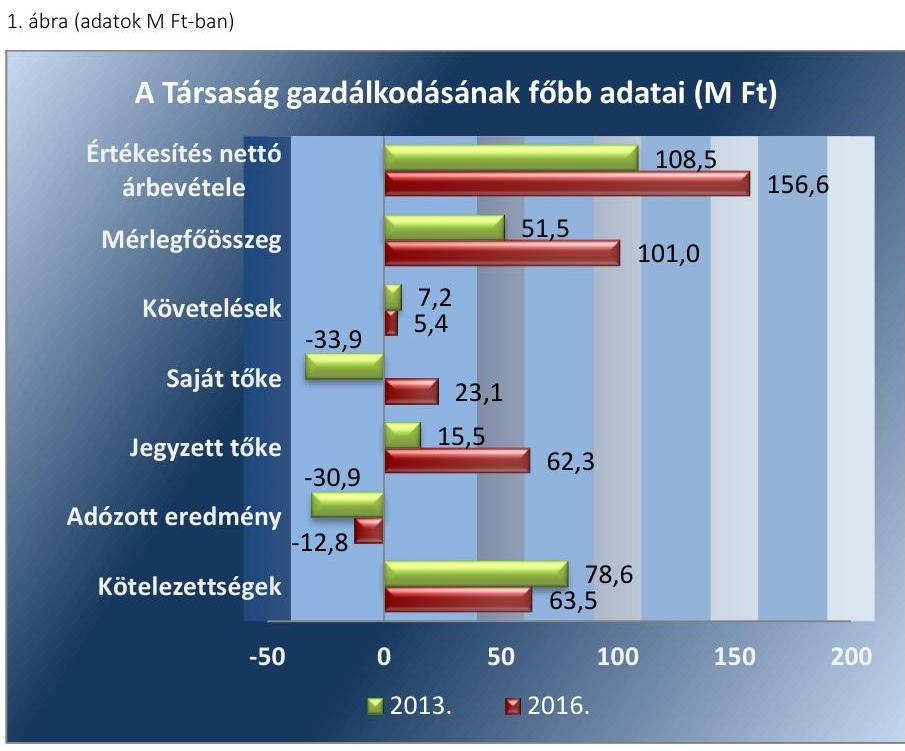

Forrás: A Társaság egyszerúsitett éves beszámolói
A Társaság mérlegfőösszege 2013-ról 2016-ra megduplázódott, az értékesítés nettó árbevétele 44,3 \%-kal nőtt.

A Társaság 0,5 M Ft-os jegyzett tőkéjét 2013. február 5-i bejegyzéssel 15,5 M Ft-ra (pénzbeli betét), 2014. október 14-i bejegyzéssel 62,25 M Ftra emelték, amely 15,5 M Ft pénzbeli betétből és 46,75 M Ft nem pénzbeli vagyoni hozzájárulásból állt.

A Társaság a 2013. és 2016. évet 30,9 M Ft illetve 12,8 M Ft veszteséggel zárta, 2014. és 2015. évben 17,3 M Ft illetve 5,8 M Ft nyereséget ért el.

A Társaság saját vagyona az elszámolt értékcsökkenés összegét meghaladóan növekedett.

A Feladat-ellátási szerződés ${ }_{1-4}$ alapján a Társaság évente átlagosan 232,4 M Ft támogatásban részesült az Önkormányzattól.

A Nemzetgazdasági Miniszter a Társaságot 2015-ben a kormányzati szektorba sorolt ${ }^{8}$ egyéb szervezetek között nyilvántartásba vette. A Társaságnak a Gst. tv. ${ }^{9}$ szerinti adósságot keletkeztető ügylete nem volt.

A foglalkoztatottak átlagos statisztikai állományi létszáma 2016. évben 57 fő volt, a 2013. évihez képest 4 fővel nőtt.

A Polgármester ${ }^{10}$ személyében 2014. június 1-jén történt változás. A Jegyző ${ }^{11}$ és az Ügyvezető ${ }^{12}$ személyében változás nem történt az ellenőrzött időszakban.

---

# AZ ELLENŐRZÉS HÁTTERE, INDOKOLTSÁGA 

AZ ÖNKORMÁNYZATI TULAJDONÚ GAZDASÁGI TÁRSASÁGOK ellenőrzése kiemelten fontos a vagyon megőrzése, megóvása érdekében, valamint a kormányzati szektor elszámolásaiban megjelenő önkormányzati tulajdonú gazdálkodó szervezetek esetében, amelyekkel szemben alapvető követelmény, hogy gazdálkodásuk, működésük szabályszerű, az általuk szolgáltatott adatok minél megbízhatóbbak legyenek.

A feladat-ellátás költségeinek, ráfordításainak alakulása a lakosság széles rétegét érinti. Az ellenőrzés várható hasznosulásaként ellenőrzéseink feltárhatják, hogy az önkormányzat a feladatellátásához rendelt vagyon működtetését a tulajdonostól elvárható gondossággal végezte-e, a feladatot ellátó gazdasági társaság a létesítő okiratban, szolgáltatási szerződésben foglaltak betartásával biztosította-e a feladat ellátását. Az ellenőrzés rávilágíthat arra, hogy a gazdasági társaság a vagyon használatával biztosí-totta-e a szolgáltatás folytatásának feltételeit, az önkormányzat által végzett tulajdonosi ellenőrzés hozzájárult-e a szabályszerű gazdálkodáshoz és feladatellátáshoz.

A megállapítások alapján megfogalmazott számvevőszéki javaslatok hasznosítása elősegítheti a meglévő hibák megszüntetését. A jó gyakorlatok bemutatásával az Állami Számvevőszék hozzájárul a követendő megoldások megismertetéséhez, terjesztéséhez.

---

# A JELENTÉS LÉNYEGES KÉRDÉSKÖREI 

1.- Az önkormányzati tulajdonosi joggyakorlás szabályszerű volt-e?
2.- A gazdasági társaság müködésének szabályozottsága, gazdálkodása, valamint vagyongazdálkodása szabályszerű volt-e?

---

# AZ ELLENŐRZÉS HATÓKÖRE ÉS MÓDSZEREI 

## Az ellenőrzés típusa

Megfelelőségi ellenőrzés.

## Az ellenőrzött időszak

2013. január 1-jétől 2016. december 31-ig.

## Az ellenőrzés tárgya

Mosonmagyaróvár Város Önkormányzata tulajdonosi joggyakorlása, valamint a Flesch Károly Közművelődési, Kulturális és Városmarketing Közhasznú Nonprofit Korlátolt Felelősségű Társaság gazdálkodásának szabályozottsága és szabályszerűsége.

Az ellenőrzés kiterjedt minden olyan körülményre és adatra, amely az ÁSZ ${ }^{13}$ jogszabályban meghatározott feladatainak teljesítéséhez, valamint a program végrehajtása folyamán felmerült újabb összefüggések feltárásához szükséges.

## Az ellenőrzött szervezet

Flesch Károly Közművelődési, Kulturális és Városmarketing Közhasznú Nonprofit Korlátolt Felelősségű Társaság és a kizárólagos tulajdonos Mosonmagyaróvár Város Önkormányzata

## Az ellenőrzés jogalapja

Az ellenőrzés jogszabályi alapját az ÁSZ tv. 1. § (3) bekezdése és 5. § (3)(5) bekezdései képezik.

## Az ellenőrzés módszerei

Az ellenőrzést a nemzetközi standardokat irányadónak tekintve az ellenőrzési program ellenőrzési kérdései, az ellenőrzött időszakban hatályos jogszabályok, az ellenőrzés szakmai szabályok és módszertanok figyelembe vételével végeztük.

Az ellenőrzés ideje alatt az ellenőrzött szervezettel történő kapcsolattartást az ÁSZ Szervezeti és Működési Szabályzatának vonatkozó előírásai alapján biztosítottuk.

---

Az ellenőrzési kérdések megválaszolásához szükséges bizonyítékok megszerzése a következő ellenőrzési eljárások alkalmazásával történt: megfigyelés, kérdésfeltevés (információkérés), összehasonlítás, valamint elemző eljárás. Az ellenőrzési bizonyítékként felhasználható adatforrások közé tartoztak egyrészt az ellenőrzési programban felsorolt adatforrások, másrészt adatforrás lehet még minden - az ellenőrzés folyamán - feltárt, az ellenőrzés szempontjából információkat tartalmazó dokumentum.

Az ellenőrzést a kérdésekre adott válaszok kiértékelésével, valamint a megjelölt adatforrások, a csatolt tanúsítványok felhasználásával, továbbá az adott időszakban hatályos jogszabályok figyelembe vételével folytattuk le.

A bevételek és ráfordítások elszámolása, valamint a vagyonnyilvántartás terén a szabályszerű működést véletlen mintavétellel ellenőriztük.

A mintavétellel ellenőrzött területek esetében minden egyes tétel vonatkozásában a szabályszerűségre vonatkozó kérdéseket tettünk fel, amelyek eredménye összesítésre került. „Szabályszerűnek" értékeltünk egy ellenőrzött területet, amennyiben 95\%-os bizonyossággal a teljes sokaságban az átlagos hibaarány legfeljebb 10\%, nem megfelelőnek, amennyiben 10\%-nál magasabb arányt képviselt. Abban az esetben, ha a teljes sokaság tekintetében a 10\%-os hibaarányhoz való viszony megítélésnek megbízhatósága nem érte el a 95\%-ot, annak elérése érdekében értékelésünket további szempontokkal egészítettük ki, és figyelembe vettük a feltárt hibák típusát és súlyát. Az anyagjellegű, egyéb illetve, pénzügyi ráfordítások elszámolására és a vagyonnyilvántartásra vonatkozó véletlen mintavételt kockázati alapú kiválasztással egészítettük ki, amelynek során a három legnagyobb összegű tételt választottuk ki.

---

# 1. Az önkormányzati tulajdonosi joggyakorlás szabályszerű volt-e? 

Összegző megállapítás

Az Alapító ${ }^{14}$ a tulajdonosi joggyakorlás kereteit szabályszerűen alakította ki, azonban a Társaság felett nem szabályszerűen gyakorolta a tulajdonosi jogokat.

Az Önkormányzat Gazdasági Program ${ }_{1-2}{ }^{15}$-ját az Mótv. 116. § (1)-(4) bekezdéseiben foglaltaknak megfelelően elkészítette, amely tartalmazta a Társaság által ellátott közfeladatokkal kapcsolatos fejlesztési elképzeléseket.

Az Önkormányzat a Vagyongazdálkodási rendeletben ${ }^{16}$ meghatározta azokat a szabályokat, amelyek alapján a város kulturális és közművelődési feladatainak támogatását finanszírozta.

Az Önkormányzat a helyi közművelődési tevékenységről Közművelődési rendelet ${ }_{1,2}$ - ${ }^{17}$ alkotott, ezzel eleget téve a Közműv. tv. 77. §-ban foglalt előírásoknak.

Az Önkormányzat - az Nvtv. ${ }^{18}$ 9. § (1) bekezdése ellenére - nem készített közép-és hosszú távú vagyongazdálkodási tervet.

A TULAJ DONOSI JOGGYAKORLÁS SZABÁLYAIT az Alapító a Társaságra vonatkozóan az Alapító Okirat ${ }_{1-7}{ }^{19}$-ben és a Társasági $\mathrm{SzMSz}_{1,2}$-ben ${ }^{20}$ a jogszabályok (Gt. ${ }^{21}$, Ptk. ${ }^{22}$ ) szerint határozta meg.

Az Alapító Okirat ${ }_{1-7}$ - a Ctv. ${ }^{23}$ és a Civil tv. ${ }^{24}$ előírásaival összhangban rendelkezett a közhasznú jogállású Társaság nyereségének fel nem oszthatóságáról.

Az Alapító Okirat ${ }_{1-7}$-ben szabályszerűen rögzítették, hogy az Alapító kizárólagos hatáskörébe tartozik a számviteli beszámoló elfogadása, a törzstőke emelés jóváhagyása, és az önkormányzati vagyon apportálása.

Az Alapító a Feladat-ellátási szerződés ${ }_{1-4}$-ben éves üzleti terv készítését írta elő. A Társaság üzleti terveit a Képviselő-testület ${ }^{25}$ jóváhagyta. Az elfogadott üzleti tervekben meghatározott, a Feladat-ellátási szerződés ${ }_{1-4}$-ben szereplő támogatás nyújtását az Önkormányzat havi részletekben vállalta és annak megfelelően teljesítette.

KÖNYVVIZSGÁLATRA a Társaság a Számv. tv. 155. § (2) bekezdése alapján kötelezett volt. A könyvvizsgáló személyét az Alapító Okirat ${ }_{1-7}$-ben szabályszerűen meghatározták.

A FELÜGYELŐBIZOTTSÁG ${ }^{26}$ tagjait az Alapító az Alapító Okirat ${ }_{1-7}$-ban kijelölte, meghatározta a Felügyelőbizottság hatáskörét, eleget téve a Gt. és a Taktv. ${ }^{27}$ előírásainak. A Felügyelőbizottság nem rendelkezett - a Gt. 34. § (4) bekezdése és a Ptk. 3:122. § (3) bekezdése előírásai ellenére -, az Alapító által jóváhagyott ügyrenddel.

---

# A TÖKEEGYENSÚLY FOLYAMATOS BIZTOSÍTÁ- 

SÁRÓL az Alapító nem gondoskodott a jogszabályok szerint.

A Társaság saját tőkéje 2013 végén már a második üzleti évben nem érte el a Gt. 114. § (1) bekezdésében a társasági formára kötelezően előírt jegyzett tőkét. Ezért 2014 évben az Alapító a Társaság jegyzett tőkéjének emeléséről hozott döntést, de a Ptk. 3:133. § (2) bekezdésében előírt határidőn túl, 50 nap késéssel.

2014-ben a saját tőke a jegyzett tőke kevesebb, mint fele volt. Az egyszerűsített éves beszámolóról készült jelentésében a könyvvizsgáló erre felhívta a figyelmet, azonban az Alapító a Ptk. 3:189. § (2) bekezdésében előírt intézkedési kötelezettségének nem tett eleget. A Társaság gazdálkodása 2015. évben nyereségessé vált, így a tőkehelyzet problémái megoldódtak.

A Társaság tőkehelyzetének alakulását az 1. táblázat mutatja be.

1. táblázat

| A TÁRSASÁG TŐKEHELYZETÉNEK ALAKULÁSA (M FT) |  |  |  |  |  |
| :--: | :--: | :--: | :--: | :--: | :--: |
|  | 2013.   (MFT) | 2014.   (MFT) | 2014.   (MFT) | 2015.   (MFT) | 2015.   (MFT) |
| Saját tőke | $-18,0$ | $-33,9$ | 30,2 | 36,0 | 23,2 |
| Jegyzett tőke | 0,5 | 15,5 | 62,3 | 62,3 | 62,3 |
| Eredménytartalék | 11,9 | $-18,5$ | $-49,4$ | $-32,1$ | $-26,3$ |
| Adózott eredmény | $-30,4$ | $-30,9$ | 17,3 | 5,8 | $-12,8$ |
| Jegyzett tőke törvényben meghatározott minimális szintje | 0,5 | 0,5 | 3,0 | 3,0 | 3,0 |

Forrás: A Társaság egyszerüuitett éves beszámolói

## AZ EGYSZERŰSÍTETT ÉVES BESZÁMOLÓK JÓVÁ-

HAGYÁSA tekintetében, a tulajdonosi joggyakorlás szabályszerű volt. Az Alapító a - Ptk. 3:109. § (2) bekezdése alapján -, a Társaság egyszerűsített éves beszámolóinak elfogadásáról szóló határozatai ${ }^{28}$-t, a Felügyelőbizottság írásbeli jelentése birtokában, a Ptk. 3:120. § (2) bekezdése előírásai szerint, a könyvvizsgáló korlátozás nélküli, hitelesítő záradékainak ismeretében hozta meg.
ELLENÖRZÉSI JOGOSÍTVÁNYAIVAL az Alapító - élve az Áht. 70. § (1) bekezdés d) pontjában biztosított jogával -, 2015-2016. években az üzleti terv teljesülését és a támogatás felhasználását ellenőrizte az önkormányzati belső ellenőrzési rendszerén keresztül. A Társaság gazdálkodásának javítására, a veszteséges gazdálkodás megszüntetése érdekében tett önkormányzati belső ellenőrzési javaslatok alapján az Ügyvezető intézkedési tervet készített.

A vezető tisztségviselők, a felügyelőbizottsági tagok és az Mt. ${ }^{29}$ 208. § hatálya alá tartozó munkavállalók javadalmazására, valamint a jogviszony megszűnése esetére biztosított juttatások módjának, mértékének legfőbb elveiről, annak rendszeréről az Alapító a Taktv. előírásai szerint Javadalmazási szabályzat ${ }^{30}$-ot alkotott.

---

# 2. A gazdasági társaság múködésének szabályozottsága, gazdálkodása, valamint vagyongazdálkodása szabályszerű volt-e? 

Összegző megállapítás

### 2.1. számú megállapítás

2.2. számú megállapítás

A Társaság gazdálkodása és vagyongazdálkodása szabályozott volt, de a végrehajtás nem volt szabályszerű.

A Társaság múködésének szabályozottsága megfelelt a jogszabályi előírásoknak. Ugyanakkor nem rendelkezett a közhasznú és a vállalkozási tevékenység elkülönítéséről számviteli szabályzataiban. A Társaság 2016. január 1-től nem alakított ki a tevékenységének és a célok megvalósításának nyomon követését biztosító rendszert.

A Társaság a Számv. tv. ${ }^{31}$ 14. § (3)-(5) bekezdése előírásának megfelelően, elkészítette a Számviteli Politika ${ }_{1-3}{ }^{32}$-át, a Pénzkezelési szabályzat ${ }_{1-3}{ }^{33}$-ot és a Leltározási szabályzat ${ }_{1-2}{ }^{34}$-ot, majd 2016. január 1-től az Eszközök és források értékelési szabályzat ${ }^{35}$-át, amelyek megfeleltek a Számv. tv. előírásainak.

A Társaság a Számv. tv. 161. § (1) bekezdése előírásai alapján elkészítette Számlarend ${ }_{1-3}{ }^{36}$-t. A számviteli szabályozásában nem rögzített olyan előírásokat, amelyekkel a közhasznú tevékenység bevételeinek, költségeinek, ráfordításainak (kiadásainak) elkülönítését megalapozta volna, így nem tett eleget az évente megkötött Feladat-ellátási szerződés ${ }_{1-4} 6$. pontjában előírt elkülönítési kötelezettségének.

A közérdekú adatok megismerésére irányuló igények teljesítésének rendjét meghatározó szabályzattal a Társaság nem rendelkezett, ezzel, nem tett eleget az Info tv. ${ }^{37}$ 30. § (6) bekezdésében foglaltaknak. A Bkr. ${ }^{38}$ 10. §, valamint 54/A. §-ban foglalt kötelezettsége ellenére 2016. január 1-től a Társaság nem alakította ki a tevékenységének és a célok megvalósításának nyomon követését biztosító rendszert.

A Társaság gazdálkodása és vagyongazdálkodása nem volt szabályszerű. Bevételeinek és ráfordításainak elszámolása nem felelt meg a jogszabályi előírásoknak. A 2015. évi leltár dokumentumai nem voltak szabályszerűek. A Társaság - a Taktv. és az Info tv. szerinti közzétételi kötelezettségének nem tett eleget.

A Társaságnál a bevételek és ráfordítások elszámolása nem szabályszerűen történt, az alábbi szabálytalanságok miatt:
A közhasznú és a vállalkozási-gazdasági tevékenység bevételeinek és ráfordításainak elkülönítése az elszámolás vonatkozásában nem történt meg, a Feladat-ellátási szerződés ${ }_{1-4} 6$. pontjában foglaltak ellenére. Ezért Társaság az egyszerűsített éves beszámolóval egyidejűleg készített közhasznúsági mellékletei a Civil tv. 29. § (6) bekezdése, valamint a Korm. rendelet ${ }^{39}$ 12. § (3) bekezdése előírásai ellenére nem szabályszerűek.

A bevételek és ráfordítások elszámolása keretében nem állítottak ki számviteli bizonylatot a Számv. tv. 165. § (1) bekezdése szerint.
Az Ügyvezető a saját tőke csökkenése miatt 2013-ban a Gt. 143. § (2) bekezdése a) pontjában, 2014. március 15 -től a

---

Ptk. 3:189. § (1) bekezdése a) és b) pontjaiban foglalt, a tőkehelyzet rendezése érdekében előírt intézkedési kötelezettségének nem tett eleget.

A Társaság a 2015. évi egyszerűsített éves beszámolót a Számv. tv. 69. § (1) bekezdésében foglaltak ellenére, leltárral nem támasztotta alá. A főkönyv és az analitika egyeztetését a Számv. tv. 69. § (2) bekezdésében foglaltak ellenére nem végezték el, megsértve ezzel a Számv. tv. 15. § (3) bekezdése szerinti valódiság elvét is.

Ugyanakkor a Társaság 2013., 2014. és 2016. években egyszerűsített éves beszámolóit leltárral alátámasztotta.

Az Úgyvezető az egyszerűsített éves beszámolókat a jogszabályi előírások szerint letétbe helyezte és közzétette.

Az Alapító a Feladat-ellátási szerződés ${ }_{1-4}$ alapján az önkormányzati támogatás felhasználásáról szakmai beszámoló készítési és pénzügyi elszámolási kötelezettséget írt elő, amelynek a Társaság eleget tett.

A Társaság az Áht. ${ }^{40}$ 107. § (1) bekezdése alapján - kormányzati szektorba tartozása miatti - az Ávr. ${ }^{41}$ 5. sz. melléklete 23. pontjai szerinti adatszolgáltatás teljesítésére volt kötelezett, amelynek nem tett eleget.

A Taktv. 2. § (1) bekezdésének ca) pontjában előírtak ellenére a Társaság vezető tisztségviselőinek és az Mt. 208. §-a szerinti vezető állású munkavállalóinak nyújtott pénzbeli juttatások adatait nem tették közzé.

A Társaság nem tett eleget az Info tv. 37. § (1) bekezdésében előírt közzétételi kötelezettségének, nem tette közzé az Info tv. 1. mellékletében meghatározott szervezeti, személyzeti, tevékenységre, müködésre, gazdálkodásra vonatkozó adatokat.

---

# JAVASLATOK 

Az ÁSZ tv. 33. § (1) bekezdésében foglaltak értelmében az ellenőrzött szervezet vezetője köteles a jelentésben foglalt megállapításokhoz kapcsolódó intézkedési tervet összeállítani és azt a jelentés kézhezvételétől számított 30 napon belül az ÁSZ részére megküldeni. Amennyiben az ellenőrzött szervezet vezetője nem küldi meg határidőben az intézkedési tervet, vagy továbbra sem elfogadható intézkedési tervet küld, az Állami Számvevőszék elnöke az ÁSZ tv. 33. § (3) bekezdése a) és b) pontjaiban foglaltakat érvényesítheti.

Javaslataink célja a Flesch Károly Közművelődési, Kulturális és Városmarketing Közhasznú Nonprofit Korlátolt Felelősségű Társaság gazdálkodása szabályszerűségének és gyakorlatának javítása annak érdekében, hogy a szabályozási környezet és az alkalmazott gyakorlat megfelelően tudja támogatni az átlátható működést.

## Flesch Károly Közművelődési, Kulturális és Városmarketing Közhasznú Nonprofit Korlátolt Felelősségű Társaság ügyvezetőjének

1. Intézkedjen a Társaság számviteli szabályozásában olyan előírások rögzítéséről, amelyek megalapozzák a közhasznú tevékenység bevételeinek, költségeinek, ráfordításainak elkülönítését.
(2.1. sz. megállapítás 2. bekezdés 2. mondata alapján)
2. Intézkedjen a közérdekü adatok megismerésére irányuló igények teljesítésének rendjét meghatározó szabályzat készitéséről az Info tv. előírásainak megfelelően.
(2.1. sz. megállapítás 3. bekezdés 1. mondata alapján)
3. Intézkedjen a Bkr. előírásainak megfelelően a célok megvalósítását, a tevékenység nyomon követését biztosító rendszer kialakításáról.
(2.1. sz. megállapítás 3. bekezdés 2. mondata alapján)
4. Intézkedjen a bevételek Számv. tv előírásainak megfelelő elszámolása érdekében.
(2.2. sz. megállapítás 1. bekezdés 1-2. pontjai alapján)

---

5. Intézkedjen a ráfordítások Számv. tv. előírásainak megfelelő elszámolása érdekében.
(2.2. sz. megállapítás 1. bekezdése 1-2. pontjai alapján)
6. Intézkedjen az Ávr. előírásai szerinti adatszolgáltatási kötelezettség teljesítéséről.
(2.2. sz. megállapítás 7. bekezdése alapján)
7. Intézkedjen a közzétételi kötelezettség teljesítéséről a Taktv. és az Info tv. előírásainak megfelelően.
(2.2. sz. megállapítás 8-9. bekezdései alapján)

Javaslataink célja az Önkormányzat szabályszerű működésének elősegítése, továbbá az önkormányzati tulajdonosi joggyakorlás kontrolljainak erősítése.

# Mosonmagyaróvár Város Önkormányzata polgármesterének 

1. Intézkedjen az Önkormányzat közép- és hosszú távú vagyongazdálkodási tervének elkészítéséről az Nvtv. előírásainak megfelelően.
(1. sz. megállapítás 4. bekezdése alapján)
2. Hívja fel a Felügyelőbizottság elnökét az FB ügyrendjének alapítói jóváhagyásra történő előterjesztésére a Ptk. előírásainak megfelelően.
(1. sz. megállapítás 10. bekezdés 2. mondata alapján)

---

# MELLÉKLETEK 

- I. SZ. MELLÉKLET: ÉRTELMEZŐ SZÓTÁR
gazdasági társaság
kormányzati szektorba sorolt egyéb szervezet
közszolgáltatás
nemzeti vagyon

Ptk. 3.88. § (1) bekezdése szerint „a gazdasági társaságok üzletszerű közös gazdasági tevékenység folytatására, a tagok vagyoni hozzájárulásával létrehozott, jogi személyiséggel rendelkező vállalkozások, amelyekben a tagok a nyereségből közösen részesednek, és a veszteséget közösen viselik".
az Áht. 3. § (2) és (3) bekezdésében foglaltakon kívül az Európai Közösséget létrehozó szerződéshez csatolt, a túlzott hiány esetén követendő eljárásról szóló jegyzőkönyv alkalmazásáról szóló 2009. május 25-i 479/2009/EK rendelet (a továbbiakban: 479/2009/EK rendelet) szerint a kormányzati szektorba sorolt szervezet (Áht. 1. § (12))
Az Ebktv. ${ }^{42}$ 3. § d) pontja a következőképpen határozza meg a közszolgáltatást: „szerződéskötési kötelezettség alapján a lakosság alapvető szükségleteinek ellátására irányuló szolgáltatás, így különösen a villamos energia-, gáz-, hő-, víz-, szenny-víz- és hulladékkezelési, köztisztasági, postai és távközlési szolgáltatás, továbbá a menetrend alapján közlekedő járművekkel végzett közforgalmú személyszállítás".
Nvtv. 1. § (2) bekezdése szerint többek között:
„az állam vagy a helyi önkormányzat kizárólagos tulajdonában álló dolgok, az a) pont hatálya alá nem tartozó, állam vagy a helyi önkormányzat tulajdonában lévő dolog,
az állam vagy a helyi önkormányzat tulajdonában lévő pénzügyi eszközök, továbbá az államot vagy a helyi önkormányzatot megillető társasági részesedések, az államot vagy a helyi önkormányzatot megillető bármely vagyoni értékkel rendelkező jogosultság, amelyet jogszabály vagyoni értékű jogként nevesít."

---

.

---

# FÜGGELÉK: ÉSZREVÉTELEK 

A jelentéstervezetet a Számvevőszék 15 napos észrevételezésre megküldte az ellenőrzött szervezet vezetőjének az ÁSZ tv. 29. §* (1) bekezdése előírásának megfelelően.

A Flesch Károly Közművelődési, Kulturális és Városmarketing Közhasznú Nonprofit Kft. ügyvezetője és Mosonmagyaróvár Város Önkormányzata polgármestere az ÁSZ tv. 29. § (2) bekezdésében foglalt észrevételezési jogával élt, a jelentéstervezetre észrevételt tett.
A függelék tartalmazza az ellenőrzöttek észrevételeit, továbbá az el nem fogadott észrevételek elutasításának indoklását.

[^0]
[^0]:    * 29. § (1) Az Állami Számvevőszék az ellenőrzési megállapításait megküldi az ellenőrzött szervezet vezetőjének vagy az általa megbízott személynek, és annak, akinek személyes felelősségét állapította meg.
    (2) Az ellenőrzött szervezet vezetője és a felelősként megjelölt személy az ellenőrzés megállapításaira tizenöt napon belül írásban észrevételt tehet.
    (3) Az Állami Számvevőszék az észrevételre a beérkezésétől számított harminc napon belül írásban válaszol. A figyelembe nem vett észrevételeket köteles a jelentésben feltüntetni, és megindokolni, hogy azokat miért nem fogadta el.

---

Ügyintéző: Csiszár Péter, Ügyvezető
Telefon: $\quad+36-96-579-706$
E-mail: csiszar.peter@fkkk.hu

## ÁLLAMI SZÁMVEVŐSZÉK

Budapest
Apáczai Csere János utca 10.
1052
Postacím: 1364 Budapest 4. Pf. 54.

## Tisztelt Állami Számvevőszék!

Hivatkozással a Tisztelt Állami Számvevőszék EL-0158-101/2018. iktatószámú, Az önkormányzatok többségi tulajdonában lévő gazdasági társaságok gazdálkodásának ellenőrzése - Flesch Károly Közművelődési, Kulturális és Városmarketing Közhasznú Nonprofit Kft. címủ számvevőszéki jelentéstervezetére - kiemelten a számvevőszéki javaslatokra - a Flesch Károly Közművelődési, Kulturális és Városmarketing Közhasznú Nonprofit Korlátolt Felelősségủ Társaság képviseletében eljárva az alábbi észrevételeket teszem:

A jelentéstervezet a Flesch Károly Közművelődési, Kulturális és Városmarketing Közhasznú Nonprofit Korlátolt Felelősségủ Társaság (továbbiakban: Társaság) ügyvezetőjének címezve a következőket emeli ki:

1. „Intézkedjen a Társaság számviteli szabályozásában olyan elöírások rögzitéséről, amelyek megalapozzák a közhasznú tevékenység bevételeinek, költségeinek, ráfordításaink elkülönítését."
A Társaság a 2017. október 31. napon kelt, EL-0158-006/2017. sz. levélben foglalt adatszolgáltatási kötelezettség alapján a 2017. november 9. napon kelt Teljességi és Hitelességi Nyilatkozat a bekért adatokra vonatkozóan 2a melléklet 12., 13., és 14. sorai szerint beküldte az ellenőrzött időszakban mindenkor hatályos Számlatükrőket. (Az ellenőrzött időszakban mindenkor hatályos Számlatükrőket a 2017. december 11. napon kelt, EL0158-031/2017. sz. levélben foglalt adatszolgáltatási kötelezettség teljesítésekor is csatoltuk, lásd. 2017. december 19. napon kelt Teljességi és Hitelességi Nyilatkozat a bekért adatokra vonatkozóan 2a melléklet 10., 11., és 12. sorai). A mindenkor hatályban lévő Számlatükör a Számlarend elválaszthatatlan részét képezi, melyek a mindenkor hatályos Szervezeti és Müködési Szabályzat függelékei.
A Társaságnál a mindenkor hatályos számlatükör 7 MUNKASZÁMOK része tartalmazza az évente megkötött Feladat-ellátási szerződés 6. pontjában előírt munkaszámonkénti (költségnemenkénti) elkülönítési kötelezettséget. Álláspontom szerint ezzel a Társaság a számviteli szabályozásában olyan előírást rögzített, mellyel a közhasznú tevékenység bevételeinek, költségeinek, ráfordításainak (kiadásainak) elkülönítését megalapozta, hiszen a szabályozásban meghatározott munkaszámokra (költségnemekre) az adott közhasznú

[^0]
[^0]:    Flesch Nonprofit Kft. $\cdot$ 9200 Mosonmagyaróvár, Pf.: 10 $\cdot$ 9200 Mosonmagyaróvár, Erkel F. u. 14. $\cdot$ Tel.: 0696 579706, Fax: 579632 $\cdot$ Adószám: 14152492-208 Bankszámlaszám: 58600252-11165189

---

tevékenység érdekében felmerült bevételek, költségek, ráfordítások (kiadások) kerülnek rögzítésre. A számlatükör 7 MUNKASZÁMOK részének felülvizsgálata az évente megkötött Feladat-ellátási szerződés, illetve a Számv. tv.-ben bekövetkezett változások okán a vizsgált időszakban három alkalommal is megtörtént.
Az adott évi Feladat-ellátási szerződés 6. pontja értelmében az adott évi szerződésben szereplő támogatás felhasználásáról a Társaság - első alkalommal - a tárgyévet követő év április 30-ig köteles elszámolni, az elszámolás szakmai beszámolót és pénzügyi elszámolást kell, hogy tartalmazzon. A szakmai beszámoló rövid beszámoló, szakmai értékelés a támogatás céljainak megvalósulásáról, a pénzügyi beszámoló pedig a Társaságra vonatkozó, számviteli előírásoknak megfelelő költségnemenkénti részletezés a közhasznú tevékenységről. A pénzügyi beszámoló részeként a Társaság a Feladat-ellátási szerződésben vállalt határidőig a belső szabályzataiban meghatározott elkülönített munkaszámok (költségnemek) alapján évente készít pénzügyi elszámolást a Feladat-ellátási szerződés $4 / 1$. pontja szerint elvégzett feladatainak teljesüléséről.
Véleményem szerint a Társaság a fentiekben ismertetettek alapján a közhasznú tevékenység bevételei, költségei, ráfordításai (kiadásai) elkülönítése tekintetében a szükséges szabályokat megalkotta (a hivatkozott számlatükrök 7 MUNKASZÁMOK rész szerint), ezt a Mosonmagyaróvári Polgármesteri Hivatal által lefolytatott ELL/8/2016. sz belső ellenőrzési jelentés 1.2. pont utolsó bekezdése is rögzíti. A belső szabályzatokban rögzítettek alapján a Társaság az éves Feladat-ellátási szerződés 6. pontjában foglalt beszámolási kötelezettségének eleget tett.

# 2. „Intézkedjen a közérdekü adatok megismerésére irányuló igények teljesitési rendjét meghatározó szabályzat készitéséröl az Info tv. elöirásainak megfelelöen" 

A Társaság az Info. tv. 30. § (6) bekezdése szerinti szabályzatot 2018. október 1. nappal megalkotta és hatályba léptette.

## 3. „Intézkedjen a Bkr. elöirásainak megfelelöen a célok megvalósitását, a tevékenység nyomon követését biztositó rendszer kialakításáról."

A Társaságnál 2014. január 1. naptól hatályos a Belső ellenőrzési szabályzat. A Belső ellenőrzési szabályzat II. 2.1. pontja rögzíti: „A belső ellenőrzési szervezet az Alapítói jogokat gyakorló költségvetési szerv belső egysége." A Belső ellenőrzési szabályzat alapján a Társaság Mosonmagyaróvár város Önkormányzatának, mint Alapítónak a belső ellenőrzési rendszerén keresztül alakította ki a tevékenységének és a célok megvalósításának nyomon követését biztosító rendszerét. 2016. szeptember 30. napig a Bkr 10. §-a alapján a Társaság tevékenységének, a célok megvalósításának nyomon követését biztosító rendszer (monitoring) két részből állt, az operatív tevékenység keretében megvalósuló folyamatos és eseti nyomon követésből, valamint az operatív tevékenységektől függetlenül működő belső ellenőrzésből.
Álláspontunk szerint a Bkr. 2016. október 1. naptól hatályos 10. § alapján a Társaságnál kialakított és müködtetett belső ellenőrzés kialakítása mellett a monitoringrendszer másik összetevője vagylagossá vált. A Társaságnál a belső ellenőrzési rendszer kialakítása a Belső ellenőrzési szabályzat megalkotásával megtörtént, így 2016. október 1. naptól a Társaság tevékenységének, a célok megvalósításának nyomon követését biztosító rendszer kialakításra került, és jelenleg is folyamatosan müködik.

[^0]2. oldal, összesen: 5

[^0]:    Flesch Nonprofit Kft. - 9200 Mosonmagyaróvár, Pf.: 10 - 9200 Mosonmagyaróvár, Erkel F. u. 14. - Tel.: 0696 579-706, Fax: 579-632 $\cdot$ Adószám: 14152492-2-08 Bankszámlaszám: 58600252-11165189

---

# 4. „Intézkedjen a bevételek Számv. tv elöírásainak megfelelő elszámolása érdekében." 

A 2.2. számú megállapítás 1. bekezdés 1. pontja szerinti elszámolásnak a Társaság a következők szerint eleget tesz:
Az adott évi Feladat-ellátási szerződés 6. pontja értelmében az adott évi szerződésben szereplő támogatás felhasználásáról a Társaság - első alkalommal - a tárgyévet követő év április 30-ig köteles elszámolni, az elszámolás szakmai beszámolót és pénzügyi elszámolást kell, hogy tartalmazzon. A szakmai beszámoló rövid beszámoló, szakmai értékelés a támogatás céljainak megvalósulásáról, a pénzügyi beszámoló pedig a Társaságra vonatkozó, számviteli előírásoknak megfelelő költségnemenkénti részletezés a közhasznú tevékenységről. A pénzügyi beszámoló részeként a Társaság a Feladat-ellátási szerződésben vállalt határidőig a belső szabályzataiban meghatározott elkülönített munkaszámok (költségnemek) alapján évente készít pénzügyi elszámolást a Feladat-ellátási szerződés $4 / 1$. pontja szerint elvégzett feladatainak teljesüléséről.

A jelentéstervezet 2.2. számú megállapítás 1. bekezdés 2. pontja szerint a Társaság a befolyó bevételeiről a Számviteli tv. 165. § (1) bekezdése alapján minden esetében számviteli bizonylatot állít ki, illetve fogad be. Álláspontom szerint a Társaság könyveibe csak és kizárólag Számv. tv. 166. § (1) bekezdése szerinti számviteli bizonylat alapján kerül rögzítésre bevételekhez kapcsolódó gazdasági esemény, így különösen: Társaság által kiállított számla, nyugta (vevő napló), pénztárbizonylat, hitelintézeti bizonylat, bankkivonat (bank, pénztárnapló), illetve a bevételek aktív és passzív elhatárolása kapcsán vegyes könyvelési bizonylatok.

## 5. „Intézkedjen a ráfordítások Számv. tv elöírásainak megfelelő elszámolása érdekében."

A 2.2. számú megállapítás 1. bekezdés 1. pontja szerinti elszámolásnak a Társaság a következők szerint eleget tesz:
Az adott évi Feladat-ellátási szerződés 6. pontja értelmében az adott évi szerződésben szereplő támogatás felhasználásáról a Társaság - első alkalommal - a tárgyévet követő év április 30-ig köteles elszámolni, az elszámolás szakmai beszámolót és pénzügyi elszámolást kell, hogy tartalmazzon. A szakmai beszámoló rövid beszámoló, szakmai értékelés a támogatás céljainak megvalósulásáról, a pénzügyi beszámoló pedig a Társaságra vonatkozó, számviteli előírásoknak megfelelő költségnemenkénti részletezés a közhasznú tevékenységről. A pénzügyi beszámoló részeként a Társaság a Feladat-ellátási szerződésben vállalt határidőig a belső szabályzataiban meghatározott elkülönített munkaszámok (költségnemek) alapján évente készít pénzügyi elszámolást a Feladat-ellátási szerződés $4 / 1$. pontja szerint elvégzett feladatainak teljesüléséről.

A jelentéstervezet 2.2. számú megállapítás 1. bekezdés 2. pontja szerint a Társaság a felmerülő ráfordításairól a Számviteli tv. 165. § (1) bekezdése alapján minden esetében számviteli bizonylatot állít ki, illetve fogad be. Álláspontom szerint a Társaság könyveibe csak és kizárólag Számv. tv. 166. § (1) bekezdése szerinti számviteli bizonylat alapján kerül rögzítésre a ráfordításokhoz kapcsolódó gazdasági esemény, így különösen: Társaság által befogadott számla (szállító napló), pénztárbizonylat, hitelintézeti bizonylat, bankkivonat (bank, pénztárnapló), a ráfordítások aktív és passzív elhatárolása, a tárgyi eszköz mozgások kapcsán

[^0]3. oldal, összesen: 5

[^0]:    Flesch Nonprofit Kft. - 9200 Mosonmagyaróvár, Pf.: 10 - 9200 Mosonmagyaróvár, Erkel F. u. 14. - Tel.: 0696 579.706, Fax: 579.632 $\cdot$ Adószám: 14152492-2-08 Bankszámlaszám: 58600252-11165189

---

vegyes könyvelési bizonylatok, továbbá a személyi jellegű ráfordítások kapcsán a felmerülő számviteli bizonylatok (munkaszerződés, bérösszesítő, fizetési jegyzék, stb.) alapján vegyes(bér) napló.
6. „Intézkedjen az Ávr. elöirásai szerinti adatszolgáltatási kötelezettség teljesitéséröl." A Társaság az Áht. 107. § (1) bekezdés, és az Ávr. 5. sz. melléklet 23. pontja alapján meghatározott adatszolgáltatás teljesítési kötelezettségének eleget tesz.
7. „Intézkedjen a közzétételi kötelezettség teljesitéséröl a Taktv. és az Info tv. elöirásainak megfelelöen."
A Társaság az Info. tv. 30. § (6) bekezdése szerinti szabályzat 2018. október 1. nappal történő megalkotását és hatályba léptetését követően a Taktv. 2. § (1) bekezdés ea) pontjában, illetve az Info tv. 37. § (1) bekezdésben előírt jogszabályi kötelezettség teljesítése érdekében közzétételi kötelezettségnek az Info tv. 1. melléklet szerinti tartalommal ás a Taktv.-ben foglaltak alapján a közzétételi kötelezettségnek eleget tesz.

# További észrevétel: 

A számvevőszéki jelentéstervezet 2.2. számú megállapítás 3. bekezdése szerint:
„A Társaság a 2015. évi egyszerüsitett éves beszámolót a Számv. tv. 69. § (1) bekezdése ellenére, leltárral nem támasztotta alá. A fökönvv és az analitika egyeztetését a Számv. tv. 69. § (2) bekezdésében foglaltak ellenére nem végezték el, megsértve ezzel a Számv. tv. 15. § (3) bekezdése szerinti valódiság elvét."
Álláspontom szerint a Társaság számvevőszéki jelentéstervezet 2.2. számú megállapítás 4. bekezdésében foglaltakhoz hasonlóan, mely így szól: „Ugyanakkor a Társaság 2013., 2014., és 2016. években egyszerüsített éves beszámolóit leltárral alátámasztotta." a 2015. évi egyszerűsített éves beszámolóját is leltárral támasztotta alá, ezzel eleget tett a Számv. tv. 69 § (1) (2) bekezdéseiben foglaltaknak, ezzel a Társaságnál 2013., 2014., és 2016. évhez hasonlóan 2015. évben is érvényesült a Számv. tv. 15. § (3) bekezdése szerinti valódiság elve.

A számvevőszéki jelentéstervezet 2.2. számú megállapítás 3. bekezdéseben szereplő a 2015. évi leltározással, illetve a 2015. évi főkönyv és analitika egyeztetésének hiányára vonatkozó számvevőszéki megállapítás a következőkkel magyarázható:
A Társaság könyvvizsgálója 2018. augusztusában megkereséssel fordult a Társaság ügyvezetőjéhez, mely szerint a Tisztelt Állami Számvevőszék a Társaságnál folyó ellenőrzéshez kapcsolódóan a Magyar Könyvvizsgálói Kamarához fordult a Társaságnál folyó számvevőszéki vizsgálattal összefüggésben végzett könyvvizsgálói tevékenység vélt vagy valós hiányosságaival kapcsolatban. A megkereséssel összefüggésben a Társaság ügyvezetője a következő írásbeli tájékoztatást adta a Könyvvizsgálónak, mely szó szerint a következő:

[^0]4. oldal, összesen: 5

[^0]:    Fiesch Nonprofit Kft. 9200 Mosonmagyaróvár, Pf.: 10 9200 Mosonmagyaróvár, Erkel F. u. 14. $\cdot$ Tel.: 0696 579-706, Fax: 579-632 $\cdot$ Adószám: 14152492-2-08 Bankszámlaszám: 58600252-11165189

---

„Tisztelt Könyvvizsgáló Úr!
Telefonon történt megkeresésére a társaságunknál lefolytatott Állami Számvevöszéki ellenörzéssel kapcsolatban az alábbi tájékoztatást és egyben nyilatkozatot tesszük.
Az Állami Számvevöszék ellenörzéséröl készült jegyzőkönyvvel még nem rendelkezünk, azt várhatóan október hónapban kapjuk kézhez. Kijelentjük, hogy a 2015. évi adatszolgáltatás során rossz fökönyvi kivonatot küldtünk el az Állami Számvevöszék részére, nem az utolsó zárás elötti idöpontra vonatkozót. Az általunk elküldött fökönyvi kivonatban az Önök által észrevételezett, javitásra kerülő tételek még szerepelnek (pld.: befektetett pénzügyi eszközök értékvesztésének elszámolása, gépjármü és egyéb adók helyes elszámolása, stb.).
A hibás adatszolgáltatást 2018. augusztus 31. napon jeleztük az Állami Számvevőszék illetékes felügyeleti vezetöje felé.
Az Önöknek okozott kellemetlenségért, a hibás adattájékoztatás miatt elnézést kérünk.
Jelen levelünket a könyvvizsgáló kérésére a Magyar Könyvvizsgálói Kamara tájékoztatásához állitottuk ki.

# Mosonmagyaróvár, 2018. 09. 03. 

Megértésüket köszönjük, tisztelettel:

## Flesch Károly Nonprofit Kft.   Cégszerü aláírás"

A hivatkozott megkeresés alapján álláspontom szerint megállapítható, hogy 2015. évre vonatkozóan adminisztratív hiba miatt nem a végleges, a főkönyv és analitika egyeztetését is tartalmazó főkönyvi kivonat került megküldésre, hanem egy korábbi (2018. február 26. keltezésű, lásd.: A Társaság a 2017. október 31. napon kelt, EL-0158-006/2017. sz. levélben foglalt adatszolgáltatási kötelezettség alapján a 2017. november 9. napon kelt Teljességi és Hitelességi Nyilatkozat a bekért adatokra vonatkozóan 2a melléklet 94. sor_Fökönyv_2015.pdf dokumentum). 2015. évre vonatkozó végleges főkönyvi kivonat alapján, a 2013., 2014., és 2016. évekhez hasonlóan, a főkönyv és analitika egyeztetése, továbbá a 2015. évi egyszerűsített éves beszámoló leltárral történő alátámasztása is megtörtént.

Kérem a megtett észrevételek és a fentiekben foglaltak szíves tudomásulvételét!

Mosonmagyaróvár, 2018. november 7.

Tisztelettel,
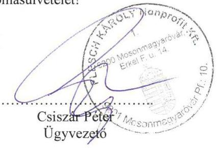

[^0]5. oldal, összesen: 5

[^0]:    Flesch Nonprofit Kft. - 9200 Mosonmagyaróvár, Pf.: 10 - 9200 Mosonmagyaróvár, Erkel F. u. 14. - Tel.: 0696 579.706, Fax: 579.632 $\cdot$ Adószám: 14152492-208 Bankszámlaszám: 58600252-11165189

---

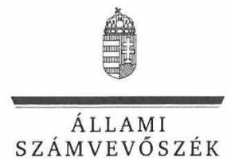

ELNÖK

Ikt.szám: EL-0158-108/2018.

# Csiszár Péter úr 

ügyvezető
Flesch Károly Közművelődési, Kulturális és Városmarketing Közhasznú Nonprofit Kft.

## Mosonmagyaróvár

## Tisztelt Ügyvezető Úr!

Köszönettel vettem „Az önkormányzatok gazdasági társaságai - Az önkormányzatok többségi tulajdonában lévő gazdasági társaságok gazdálkodásának ellenőrzése - Flesch Károly Közmüvelődési, Kulturális és Városmarketing Közhasznú Nonprofit Kft." címmel készített számvevőszéki jelentéstervezetre megküldött észrevételét.
Az Állami Számvevőszék észrevételre vonatkozó álláspontját a felügyeleti vezető által készített részletes tájékoztatás tartalmazza, amelyet levelemhez mellékeltem.
Tájékoztatom Ügyvezető urat, hogy az Állami Számvevőszék a figyelembe nem vett észrevételeket az Állami Számvevőszékről szóló 2011. évi LXVI. törvény 29. § (3) bekezdésében előírtak szerint köteles a jelentésében feltüntetni és megindokolni, hogy azokat miért nem fogadta el.

Budapest, 2018. 99 hó 29 nap
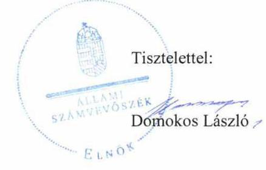

Melléklet: Tájékoztatás az észrevételek kezeléséről

---

# Tájékoztatás az észrevételek kezeléséről 

Megköszönöm Ügyvezető úrnak „Az önkormányzatok gazdasági társaságai - Az önkormányzatok többségi tulajdonában lévő gazdasági társaságok gazdálkodásának ellenörzése - Flesch Károly Közmüvelődési, Kulturális és Városmarketing Közhasznú Nonprofit Kft. " címmel készített jelentéstervezetre tett észrevételét. Az észrevétel kezeléséről az alábbi tájékoztatást adom.

## 1. sz. észrevétel:

Az észrevétel a jelentéstervezet 2.1. sz. megállapítás 2. bekezdés 2. mondatát és a Flesch Károly Közművelődési, Kulturális és Városmarketing Közhasznú Nonprofit Korlátolt Felelősségű Társaság (Társaság) ügyvezetőjének címzett 1. számú javaslatot érintette.
Ügyvezető úr a Társaság által végzett közhasznú tevékenység bevételeinek, költségeinek, ráfordításainak elkülönítésével összefüggő észrevételében arról tájékoztatott, hogy a Társaság ,,mindenkor hatályos", az ellenőrzés részére megküldött számlatükör „7 MUNKASZÁMOK" része tartalmazza a munkaszámonkénti (költségnemenkénti) elkülönítési kötelezettséget, ezzel a Társaság számviteli szabályozása olyan előírást rögzített, mellyel a közhasznú tevékenység bevételeinek, költségeinek, ráfordításainak (kiadásainak) elkülönítését megalapozza.
Az ellenőrzés rendelkezésére bocsátott dokumentumok ismételt áttekintését követően megállapítottam, hogy a 2013-2016. években hatályos számlatükör 7 MUNKASZÁMOK része egyes munkaszámok felsorolását tartalmazza, azonban ezen kívül a számlatükör, továbbá az ellenőrzés számára átadott, a 2013-2016. években hatályos számlarend, a 2013-2016. években hatályos számviteli politika sem tartalmazza a közhasznú bevételek, költségek, ráfordítások elkülönítésének módját, a tevékenységre közvetlenül el nem számolható költségek, ráfordítások felosztásának előírásait. Mindezekre tekintettel a jelentéstervezetben tett megállapítás megalapozott, helytálló, a megállapítást és a javaslatot nem módosítom.

## 2. számú észrevétel:

Az ügyvezetői tájékoztatás a jelentéstervezet 2.1. sz. megállapítás 3. bekezdés 1. mondatához és a Társaság ügyvezetőjének címzett 2. számú javaslatához kapcsolódott.
Ügyvezető úr által a közérdekủ adatok megismerésére irányuló igények teljesítési rendjét meghatározó szabályzat készítésével kapcsolatosan adott tájékoztatást tudomásul veszem. Ügyvezető úr a jelentéstervezet megállapításának és a javaslatának tartalmát nem vitatta. A jelentéstervezetben tett megállapítást és a javaslatot nem módosítom.

## 3. számú észrevétel:

Az észrevétel a jelentéstervezet 2.1. sz. megállapítás 3. bekezdés 2. mondatához és a Társaság ügyvezetőjének címzett 3. számú javaslatához kapcsolódott.
Ügyvezető úr a költségvetési szervek belső kontrollrendszeréről és belső ellenőrzéséről szóló 370/2011. (XII. 31.) Korm. rendelet (Bkr.) előírásainak megfelelő, a célok megvalósítását, a tevékenység nyomon követését biztosító rendszer kialakításával kapcsolatos észrevételében jelezte, hogy a Társaság 2014. január 1-től hatályos Belső ellenőrzési szabályzata rögzíti a Társaság belső ellenőrzési szervezetét. Az észrevétel szerint a Belső ellenőrzési szabályzat alapján a Társaság az Alapító belső ellenőrzési rendszerén keresztül alakította ki a tevékenységének és a

---

célok megvalósításának nyomon követését biztosító rendszerét a Bkr. 10. §-ában foglaltaknak megfelelően 2016. szeptember 30-ig, ezt követően pedig a Bkr. 2016. október 1-től hatályos 10. $\S$-ának megfelelő a belső ellenőrzési rendszer kialakítása a Belső ellenőrzési szabályzat megalkotásával. A Társaság álláspontja szerint a Bkr. 2016. október 1-től hatályos 10. §-ban a belső ellenőrzés kialakítása mellett a monitoring rendszer másik összetevője vagylagossá vált. Így a Belső ellenőrzési szabályzat megalkotásával 2016. október 1. napjával megtörtént a Társaság tevékenységének, a célok megvalósításának nyomon követését biztosító rendszer kialakítása.
Az észrevételt nem fogadom el, a jelentéstervezet megállapítását, és a javaslatot nem módosítom, mert az ellenőrzés rendelkezésére bocsátott, az észrevételben hivatkozott Belső ellenőrzési szabályzat tartalmával nem igazolt a belső ellenőrzés kialakítottsága.
Az ellenőrzés lefolytatására az EL-0047-001/2017. iktatószámú ellenőrzési programban foglaltak alapján a 2013-2016. évek közötti időszakot érintően került sor. Az EL-0158-006/2018. iktatószámú adatbekérő levél 2. számú melléklet „Szabályzatok" rész utolsó felsorolásában kértük az ellenőrzési rendszerre vonatkozó szabályzatokat. Ügyvezető úr által 2017. november 9-ei keltezéssel tett teljességi és hitelességi nyilatkozatának 2. a. melléklet 213. sorának tanúsága szerint az ellenőrzés számára a 2014. január 1-től hatályos belső ellenőrzési szabályzat átadása történt meg. A szabályzat észrevételben hivatkozott II. 2.1. pontja nem felel meg az államháztartásról szóló 2011. évi törvény CXCV. törvény (Áht.) 70. § (1) bekezdésben foglaltaknak, mivel a belső ellenőrzési szervezet, vagy személy tevékenységét nem a Társaság vezetőjének közvetlenül alárendelten láthatja el, annak kialakítását nem a Társaság, hanem Mosonmagyaróvár Város Önkormányzata hajtotta végre.

# 4. és 5. számú észrevételek első rész: 

Az észrevételek első része a jelentéstervezet 2.2. sz. megállapítás 1. bekezdés 1. pontját és a Társaság ügyvezetőjének címzett 4. és 5 . számú javaslatot érintette.
Ügyvezető úr mindkét észrevételében tájékoztatott a feladat-ellátási szerződésben szereplő támogatás felhasználása elszámolásának tartalmáról úgy a szakmai értékelés, mint a pénzügyi elszámolás vonatkozásában. Jelezte, hogy a pénzügyi beszámoló a Társaságra vonatkozó, ,számviteli elöírásoknak megfelelő költségnemenkénti részletezés"-sel készült a közhasznú tevékenységekről. Rögzítette továbbá, hogy a pénzügyi beszámoló részeként a Társaság a „belső szabályzataiban meghatározott elkülönített munkaszámok (költségnemek) alapján évente készít pénzügyi elszámolást" elvégzett feladatainak teljesítéséről.
Ügyvezető úr által tett észrevételeket az 1. számú észrevételhez adott tájékoztatásomra alapozottan nem fogadom el, a jelentéstervezet megállapítását, javaslatait nem módosítom. Tekintettel arra, hogy a Társaság a közhasznú bevételek, költségek, ráfordítások elkülönítésének módját, a tevékenységre közvetlenül el nem számolható költségek, ráfordítások felosztásának előírásait nem alakította ki, így azok szabályszerű elkülönítése sem történt meg. Az ellenőrzés számára átadott mintatételekhez kapcsolódó dokumentumokon nem szerepelt a közhasznú tevékenység elkülönítésére utaló feljegyzés, azonosító.

## 4. számú észrevétel második rész:

A 4. számú észrevétel második része a jelentéstervezet 2.2. sz. megállapítás 1. bekezdés 2. pontját, valamint az ügyvezetőnek címzett 4. számú javaslatot érintette.

---

Ügyvezető úr észrevételében jelezte, hogy a Társaság a befolyó bevételeiről minden esetben a számvitelről szóló 2000 . évi C. törvény (Számv. tv.) 165. § (1) bekezdése szerinti számviteli bizonylatot állít ki, illetve fogad be.
Az ellenőrzés során a szabályszerű működést véletlen mintavétellel ellenőriztük. A mintavétellel ellenőrzött területek esetében minden egyes tétel vonatkozásában a szabályszerűségre vonatkozó kérdéseket tettünk fel, amelyek eredménye összesítésre került. Megfelelőnek értékeltünk egy ellenőrzött területet, amennyiben $95 \%$-os bizonyossággal a teljes sokaságban az átlagos hibaarány legfeljebb $10 \%$, nem megfelelőnek, amennyiben $10 \%$-nál magasabb arányt képviselt. A Társaság által az ellenőrzés számára rendelkezésre bocsátott mintatételek esetében a fenti eljárás alapján olyan nagyságrendű hiányos dokumentálást találtunk, amely szerint a bevételek elszámolása összességében nem minősült szabályszerűnek.

# 5. számú észrevétel második rész: 

Az 5. számú észrevétel második része a jelentéstervezet 2.2. sz. megállapítás 1. bekezdés 2. pontját, valamint az ügyvezetőnek címzett 5 . számú javaslatot érintette.
Ügyvezető úr észrevételében jelezte, hogy a Társaság a felmerülő ráfordításairól minden esetben a számvitelről szóló 2000 . évi C. törvény (Számv. tv.) 165. § (1) bekezdése szerinti számviteli bizonylatot állít ki, illetve fogad be.
Az ellenőrzés során a szabályszerű működést véletlen mintavétellel ellenőriztük. A mintavétellel ellenőrzött területek esetében minden egyes tétel vonatkozásában a szabályszerűségre vonatkozó kérdéseket tettünk fel, amelyek eredménye összesítésre került. Megfelelőnek értékeltünk egy ellenőrzött területet, amennyiben $95 \%$-os bizonyossággal a teljes sokaságban az átlagos hibaarány legfeljebb $10 \%$, nem megfelelőnek, amennyiben $10 \%$-nál magasabb arányt képviselt. A Társaság által az ellenőrzés számára rendelkezésre bocsátott mintatételek esetében a fenti eljárás alapján olyan nagyságrendű hiányos dokumentálást találtunk, amely szerint a ráfordítások elszámolása összességében nem minősült szabályszerűnek.

## 6. számú észrevétel:

Az észrevétel a jelentéstervezet 2.2. sz. megállapítás 7. bekezdéséhez és a Társaság ügyvezetőjének címzett 6 . számú javaslatához kapcsolódott.
Ügyvezető úr észrevételében jelzetteket - mely szerint a „Társaság az Áht. 107. § (1) bekezdés, és az Ávr. 5. sz. melléklet 23. pontja alapján meghatározott adatszolgáltatás teljesitési kötelezettségének eleget tesz" nem fogadom el, a jelentéstervezetben tett megállapítást és a javaslatot nem módosítom tekintettel arra, hogy ellenőrzési dokumentumként csak az ÁSZ felhívására az Állami Számvevőszékről szóló 2011. évi LXVI. törvény (ÁSZ tv.) 28. § (2) bekezdésében meghatározott adatszolgáltatási időszakon belül megküldött és a teljességi és hitelességi nyilatkozatban szereplő dokumentumok vehetők figyelembe. Az EL-0158-006/2018. iktatószámú adatbekérő levél 2. számú melléklet „Egyéb dokumentumok" rész 24. felsorolás szerủ pontjában kértük a Társaság által teljesített az államháztartásról szóló törvény végrehajtásáról szóló 368/2011. (XII. 31.) Korm. rendeletben (Ávr.) előírt adatszolgáltatások dokumentumait. Ügyvezető úr által 2017. november 9-ei keltezéssel tett teljességi és hitelességi nyilatkozatának tanúsága szerint az ellenőrzés számára ilyen dokumentum átadása nem történt meg.

---

# 7. számú észrevétel: 

Az ügyvezetői tájékoztatás a jelentéstervezet 2.2. sz. megállapítás 8-9. bekezdéseihez és a Társaság ügyvezetőjének címzett 7. számú javaslatához kapcsolódott.
Ügyvezető úrnak a közzétételi kötelezettség teljesítéséről szóló tájékoztatását tudomásul veszem. Ügyvezető úr a jelentéstervezet megállapításának és a javaslatának tartalmát nem vitatta. A jelentéstervezetben tett megállapítást és a javaslatot nem módosítom.

## 8. számú észrevétel (További észrevételek rész):

Ügyvezető úrnak a 2015. évi egyszerűsített éves beszámoló leltárral történő alátámasztottságának adminisztratív hiba miatti hiányát magyarázó tájékoztatását tudomásul veszem. A jelentéstervezetben tett megállapítást és a javaslatot nem módosítom tekintettel arra, hogy ellenőrzési dokumentumként csak az ÁSZ felhívására az ÁSZ tv. 28. § (2) bekezdésében meghatározott adatszolgáltatási időszakon belül megküldött és a teljességi és hitelességi nyilatkozatban szereplő dokumentumok vehetők figyelembe. Ügyvezető úr által 2017. november 9-ei keltezéssel tett teljességi és hitelességi nyilatkozat - 2. a. melléklet 94. sorának - tanúsága szerint az ellenőrzés számára átadott főkönyvi kivonat megbízható, teljes körű, hiteles és hiánytalan volt. Az ellenőrzés során e dokumentum tartamának ellenőrzése és értékelése történt meg.

Budapest, 2018. M. hónap" 24.".
Dr. Horváth Margit
felügyeleti vezető

---

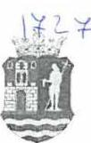

Hornáll H.

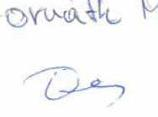

MOSONMAGYARÓVÁR VÁROS POLGÁRMESTERÉTŐL

Ügyiratszám: ELL / 28-2 /2018.
Ügyintéző: Grundtner Gábor
Telefon: 06-96/577-800

Tárgy: Észrevétel jelentéstervezet
megállapításaira
Hivatkozási szám: EL-0158-100/2018

ÁLLAMI SZÁMVEVŐSZÉK
Budapest
Apáczai Csere János u. 10.
1052

Postacím: 1364 Budapest 4. Pf. 54
E-mail: onkormányzat@t flesch_karoly@asz.hu

ÁLLAMI SZÁMVEVŐSZÉK
ÜGYVÍTELI IRODA
TE - 71600201811
2018 11 09

Tisztelt Állami Számvevőszék!

Hivatkozással a Tisztelt Állami Számvevőszék EL-0158-100/2018 Ikt. számú levél mellékleteként
megküldött EL-0158-099/2018 Ikt. számú, „Az önkormányzatok többségi tulajdonában lévő gazdasági
társaságok gazdálkodásának ellenőrzése – Flesch Károly Közművelődési, Kulturális és
Városmarketing Közhasznú Nonprofit Kft.” tárgyú számvevőszéki jelentéstervezet megállapításaira az
Állami Számvevőszékről szóló 2011. évi LXVI. tv. 29 § (2) bekezdése alapján az alábbi
észrevételeket teszem:

Jelentéstervezet 13. oldal, 1. sz. megállapítás 4. bekezdés:

„Az Önkormányzat – az Nvtv. 9. § (1) bekezdése ellenére – nem készített közép-és hosszú távú
vagyongazdálkodási tervet.”

Mosonmagyaróvár Város Önkormányzata 2013. március 7-ei ülésén alkotta meg a nemzeti vagyonról
szóló 2011. évi CXCVI. törvény (Nvtv.) 9. § (1) bekezdése szerinti közép- és hosszú távú
vagyongazdálkodási tervét (50/2013.(III.07.)Kt. határozat).

50/2013.(III.7.) Kt. határozat

Mosonmagyaróvár város Önkormányzatának Képviselő-testülete
Mosonmagyaróvár város Önkormányzatának közép- és hosszú távú
vagyongazdálkodási tervét jelen határozat 1. sz. mellékletében foglalt
tartalommal elfogadta.

POLGÁRMESTERI HIVATAL

Cím: 9200 Mosonmagyaróvár, Fő utca 11. tv. 105 EL: 06 96 / 577 805 Fax: 06 96 / 217 406
E-mail: arvay.istvan@mosonmagyarovar.hu Web: www.mosonmagyarovar.hu

---

# MOSONMAGYARÓVÁR VÁROS POLGÁRMESTERÉTÓL 

A vagyongazdálkodási terv módosítására 2016. október 20-án került sor (224/2016.(X.20.)Kt. határozat).
224/2016.(X.20.) Kt.
határozat

Mosonmagyaróvár Város Önkormányzat Képviselő-testülete - az Állami Számvevőszék távhőszolgáltatási közfeladat ellátás megfelelőségi ellenőrzésére tett Jelentésének iránymutatásai alapján összeállított és a 143/2016. (VI.23.) Kt. határozattal jóváhagyott Intézkedési terv javaslatainak teljesítésére - az 50/2013. (III.7.) Kt. határozattal elfogadott Mosonmagyaróvár Város Önkormányzatának közép- és hosszú távú vagyongazdálkodási tervét felülvizsgálta és a távhőszolgáltatási közfeladattal kapcsolatban elrendeli annak kiegészítését az alábbiakban megfogalmazott elvárásokkal:

## „Hosszú távú vagyongazdálkodási terv (2013-2023)

F, Kiemelt figyelmet kell forditani a közüzemi szolgáltatási szerzödés szerinti távhőszolgáltatás megfelelő biztositására, a fogyasztói igények maradéktalan kielégitésére, a tulajdonos önkormányzati elvárások teljesitésére.

Figyelemmel arra, hogy közszolgáltatási kötelezettségének az önkormányzat a kizárólagos tulajdonában álló gazdasági társaság útján tesz eleget és a gazdasági társaság Mosonmagyaróvár távhőszolgáltatási közfeladatát saját tulajdonában lévő eszközökkel látja el, az önkormányzat a társaság müködésének ellenőrzésén keresztül folyamatosan felügyeli, hogy a gazdasági társaság a közfeladat ellátáshoz szükséges és könyveiben nyilvántartott vagyon állagát megóvja, biztositva a vagyon értékének megóvását, alakitva ki a szolgáltatás üzembiztonságát, és biztositva a közfeladatok ellátását a környezettudatosság elvének érvényesülésével.
Figyelemmel kell kísérni a közfeladatot érintő vagyonelemek karbantartását, az értéknövelő beruházások és felújitások végrehajtását, valamint a közfeladatot érintő vagyon értékesitését. Érvényt kell szerezni azon követelménynek, miszerint a közszolgáltatás zavartalan biztositása érdekében a feladat-ellátást szolgáló vagyon - a gazdasági társaság müködését szabályozó Alapító okiratban foglaltakon túl - az önkormányzat elözetes jóváhagyásával idegenithető el vagy terhelhető meg.
A közfeladat ellátás során törekedni kell a költségtakarékosságra, az átláthatóságra, hatékonyságra, és arra az alapvető elvárásra, hogy a szolgáltatás igazodjon az önkormányzat teherbiró képességéhez."

Felelős: Dr. Árvay István polgármester
Határidő: 2016. október 31.

---

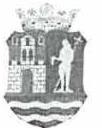

# MOSONMAGYARÓVÁR VÁROS POLGÁRMESTERÉTŐL

Mellékelten megküldöm a vagyongazdálkodási tervet, annak módosítását illetve a dokumentumok elfogadásáról szóló hitelesített határozati kivonatokat. Kérem, szíveskedjenek a jelentéstervezet vonatkozó megállapítását módosítani, mert az ellenőrzött időszak vonatkozásában Mosonmagyaróvár Város Önkormányzata közép-és hosszú távú vagyongazdálkodási terv készítése jogszabályi kötelezettségének eleget tett.

## Jelentéstervezet 13. oldal, 1. sz. megállapítás 10. bekezdés 2. mondata:

„A Felügyelőbizottság nem rendelkezett - a Gt. 34. § (4) bekezdése és a Ptk. 3:122. § (3) bekezdése előírásai ellenére -, az Alapító által jóváhagyott ügyrenddel.”

A Társaság Felügyelő Bizottsága 2018 szeptemberében kezdeményezte ügyrendjének aktualizálását és módosítását, melyet annak elfogadását követően az Alapító elé terjeszt. Az Ügyrend jóváhagyására várhatóan Mosonmagyaróvár Város Önkormányzata 2018. december havi Képviselő-testületi ülésén kerül sor.

Kérem fenti észrevételeim szíves elfogadását.

Mosonmagyaróvár, 2018. november 05.

Tisztelettel,

Dr. Arvay István
polgármester

Mellékletek:

- Határozati kivonat (2013.03.07), előterjesztés, vagyongazdálkodási terv (2013.02.28)
- Határozati kivonat (2016.10.20.), előterjesztés (2016.10.12)

POLGÁRMESTERI HIVATAL

CIN: 9200 Mosonmagyaróvár, Fő utca 11. Fő 105
TEL: 06 96 / 577 805
FAX: 06 96 / 217 406
E-MAIL: arvay.istvan@mosonmagyarovar.hu
Web: www.mosonmagyarovar.hu

---

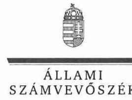

ELNÖK

Ikt.szám: EL-0158-106/2018.

Dr. Árvay István úr
polgármester
Mosonmagyaróvár Város Önkormányzata

Mosonmagyaróvár

# Tisztelt Polgármester Úr! 

Köszönettel vettem „Az önkormányzatok gazdasági társaságai - Az önkormányzatok többségi tulajdonában lévő gazdasági társaságok gazdálkodásának ellenörzése - Flesch Károly Közmüvelödési, Kulturális és Városmarketing Közhasznú Nonprofit Kft." címmel készített számvevőszéki jelentéstervezetre megküldött észrevételét.
Az Állami Számvevőszék észrevételre vonatkozó álláspontját a felügyeleti vezető által készített részletes tájékoztatás tartalmazza, amelyet levelemhez mellékeltem.
Tájékoztatom Polgármester urat, hogy az Állami Számvevőszék a figyelembe nem vett észrevételeket az Állami Számvevőszékről szóló 2011. évi LXVI. törvény 29. § (3) bekezdésében előírtak szerint köteles a jelentésében feltüntetni és megindokolni, hogy azokat miért nem fogadta el.

Budapest, 2018.
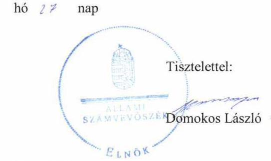

Melléklet: Tájékoztatás az észrevételek kezeléséről

---

# Tájékoztatás az észrevételek kezeléséről 

Megköszönöm Polgármester úrnak „Az önkormányzatok gazdasági társaságai - Az önkormányzatok többségi tulajdonában lévő gazdasági társaságok gazdálkodásának ellenörzése - Flesch Károly Közmüvelődési, Kulturális és Városmarketing Közhasznú Nonprofit Kft. " címmel készített jelentéstervezetre tett észrevételét. Az észrevétel kezeléséről az alábbi tájékoztatást adom.

## 1. sz. észrevétel:

Az észrevétel a jelentéstervezet 1. sz. megállapítás 4. bekezdését érintette, melyhez a polgármesternek címzett 1. számú javaslat kapcsolódott.
Polgármester úr az Önkormányzat közép-és hosszú távú vagyongazdálkodási tervére vonatkozó észrevételében arról tájékoztatott, hogy az Önkormányzat megalkotta a közép- és hosszú távú vagyongazdálkodási tervét, továbbá feltüntette az azt elfogadó és módosító határozatot, idézte annak tartalmát, valamint mellékelten megküldte a közép-és hosszú távú vagyongazdálkodási tervet, valamint módosítását.
Polgármester úr észrevételében foglaltakat tudomásul veszem, azonban a jelentéstervezetet nem módosítom a következők miatt:
Az észrevétel tartalmát, valamint a benyújtott dokumentumot az Állami Számvevőszék (ÁSZ) az ellenőrzés e szakaszában nem veszi figyelembe, tekintettel arra, hogy ellenőrzési dokumentumként csak az ÁSZ felhívására az Állami Számvevőszékről szóló 2011. évi LXVI. törvény (ÁSZ tv.) 28. § (2) bekezdésében meghatározott adatszolgáltatási időszakon belül megküldött és a teljességi és hitelességi nyilatkozatban szereplő dokumentumok vehetők figyelembe.
Az ellenőrzés lefolytatására az EL-0047-001/2017. iktatószámú ellenőrzési programban foglaltak alapján a 2013-2016. évek közötti időszakot érintően került sor. Az EL-0158-007/2018. iktatószámú adatbekérő levél 2. számú melléklet 6. bekezdés 1. felsorolásában kértük az Önkormányzat ellenőrzött időszakban hatályos rendeleteit, határozatait, döntéseit, az 5. felsorolásban egy listát kértünk a Flesch Károly Közművelődési, Kulturális és Városmarketing Közhasznú Nonprofit Kft. (Társaság) feladat-ellátására vonatkozó önkormányzati stratégiákról, programokról, tervekről és módosításaikról. Polgármester úr által 2017. november 7-ei keltezéssel tett teljességi és hitelességi nyilatkozatának 2. a. mellékletében nem szerepel az ellenőrzött időszakban hatályos közép- és hosszú távú vagyongazdálkodási terv, továbbá e melléklet 32. sorában rögzítettek szerint átadott, a Társaság feladat-ellátására vonatkozó önkormányzati stratégiák, programok, terveket felsoroló lista sem tartalmazza az ellenőrzött időszakban hatályos közép- és hosszú távú vagyongazdálkodási tervet.

## 2. sz. észrevétel:

Az észrevétel a jelentéstervezet 1. sz. megállapítás 10. bekezdés 2. mondatát érintette, melyhez a polgármesternek címzett 2 . számú javaslat kapcsolódott.
Polgármester úr a Társaság felügyelőbizottsága ügyrendjével kapcsolatos észrevételében a jelentéstervezet megállapítását nem vitatta, az ügyrend módosításának és jóváhagyásának tervezé-

---

séről tájékoztatott. Tájékoztatását tudomásul veszem, a jelentéstervezet megállapítását és javaslatát nem módosítom.

Budapest, 2018. 11. hónap " 27 ".
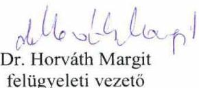

---

.

---

# RÖVIDÍTÉSEK JEGYZÉKE 

${ }^{1}$ Társaság
${ }^{2}$ Önkormányzat
${ }^{3}$ Közműv. tv.
${ }^{4}$ Mötv.
${ }^{5}$ Feladat-ellátási szerződés:-2013. évre

Feladat-ellátási szerződés:-2014. évre

Feladat-ellátási szerződés:-2015. évre

Feladat-ellátási szerződés:- 2016. évre
${ }^{6}$ A Társaságok kizárólagos tulajdonában álló gazdasági társaságok:
${ }^{7}$ Üzemeltetési szerződés
${ }^{8}$ Kormányzati szektorba sorolás
${ }^{9}$ Gst. tv.
${ }^{10}$ Polgármester:
Polgármester:
${ }^{11}$ Jegyző
${ }^{12}$ Ügyvezető
${ }^{13}$ ÁSZ
${ }^{14}$ Alapító

Flesch Károly Közművelődési, Kulturális és Városmarketing Közhasznú Nonprofit Korlátolt Felelősségű Társaság
Mosonmagyaróvár Város Önkormányzata
1997. évi CXL. törvény a muzeális intézményekről, a nyilvános könyvtári ellátásról és a közművelődésről (hatályos: 1998. január 1-től)
2011.évi CLXXXIX. törvény Magyarország helyi önkormányzatairól (hatályos: 2012. január 1-től)
Mosonmagyaróvár Város Önkormányzata és a Flesch Károly Közművelődési, Kulturális és Városmarketing Közhasznú Nonprofit Korlátolt Felelősségű Társaság között létrejött Közszolgáltatási, feladat-ellátási szerződés közhasznú feladat végzésére (hatályos: 2012. december 21-től - 2013. december 5-ig)
Mosonmagyaróvár Város Önkormányzata és a Flesch Károly Közművelődési, Kulturális és Városmarketing Közhasznú Nonprofit Korlátolt Felelősségű Társaság között létrejött Közszolgáltatási, feladat-ellátási szerződés közhasznú feladat végzésére (hatályos: 2013. december 6-tól - 2014. december 15-ig)
Mosonmagyaróvár Város Önkormányzata és a Flesch Károly Közművelődési, Kulturális és Városmarketing Közhasznú Nonprofit Korlátolt Felelősségű Társaság között létrejött Közszolgáltatási, feladat-ellátási szerződés közhasznú feladat végzésére (hatályos: 2014. december 16-tól - 2016. február 14-ig)
Mosonmagyaróvár Város Önkormányzata és a Flesch Károly Közművelődési, Kulturális és Városmarketing Közhasznú Nonprofit Korlátolt Felelősségű Társaság között létrejött Közszolgáltatási, feladat-ellátási szerződés közhasznú feladat végzésére (hatályos: 2016. február 15-től)
Városi Televízió és Médiacentrum Kft., Mosonmagyaróvári Regionális Televízió Szolgáltató Kft. „V.A."
Mosonmagyaróvár Város Önkormányzat és a Flesch Károly Közművelődési, Kulturális és Városmarketing Közhasznú Nonprofit Korlátolt Felelősségű Társaság között 2012. február 28-án létrejött Funkcionális üzemeltetési szerződés és annak 2013. szeptember 4-én kelt módosítása a FUTURA interaktív természettudományi Élményközpont üzemeltetésére
A 2015. december 30-án megjelent Hivatalos Értesítő 2015/66. sz. I. rész B. Helyi önkormányzatok alszektorba tartozó szervezetek 52. sz. helyén
2011. évi CXCIV. törvény Magyarország gazdasági stabilitásáról (hatályos: 2011. december 30-tól)
Mosonmagyaróvár Város Önkormányzata polgármestere (2010. január 1. - 2014. június 30.)
Mosonmagyaróvár Város Önkormányzata polgármestere (2014. július 1. - 2014. október 11. között polgármesteri jogkört gyakorló alpolgármesterként, 2014. évi önkormányzati választásoktól, mint polgármester)
Mosonmagyaróvár Város Önkormányzata jegyzője (feladatát 2012. március 30-tól látja el)
Flesch Károly Közművelődési, Kulturális és Városmarketing Közhasznú Nonprofit Korlátolt Felelősségű Társaság ügyvezetője (tisztségét 2010. november 15-től tölti be)
Állami Számvevőszék
Mosonmagyaróvár Város Önkormányzata

---

${ }^{15}$ Gazdasági program ${ }_{1}$
Gazdasági program ${ }_{2}$
${ }^{16}$ Vagyongazdálkodási rendelet
${ }^{17}$ Közművelődési rendelet ${ }_{1}$

Közművelődési rendelet ${ }_{2}$
${ }^{18} \mathrm{Nvtv}$.
${ }^{19}$ Alapító Okirat ${ }_{1-7}$
Alapító Okirat ${ }_{1}$

Alapító Okirat ${ }_{2}$

Alapító Okirat ${ }_{3}$

Alapító Okirat ${ }_{4}$

Alapító Okirat ${ }_{5}$

Alapító Okirat ${ }_{6}$

Alapító Okirat ${ }_{7}$
${ }^{20}$ Társasági SzMSz ${ }_{1}$

Társasági SzMSz ${ }_{2}$
${ }^{21}$ Gt.
${ }^{22}$ Ptk.
${ }^{23}$ Ctv.
${ }^{24}$ Civil tv.
${ }^{25}$ Képviselő-testület
${ }^{26}$ Felügyelőbizottság
${ }^{27}$ Taktv.
${ }^{28}$ A Társaság egyszerűsített éves beszámolóinak elfogadásáról szóló határozatai

Mosonmagyaróvár Város Önkormányzatának Gazdasági Programja 2011-2014
Mosonmagyaróvár Város Önkormányzatának Gazdasági Programja 2014-2019
Mosonmagyaróvár Város Önkormányzata képviselő-testületének 11/2012. (II. 24.) önkormányzati rendelete Mosonmagyaróvár Város Önkormányzata vagyonáról, a vagyon kezeléséről és hasznosításáról
Mosonmagyaróvár Város Önkormányzat Képviselő-testületének a közművelődési tevékenység helyi önkormányzati feladatairól és ellátásuk feltételeiről szóló 11/2008. (II. 22.) önkormányzati rendelete
Mosonmagyaróvár város Önkormányzat Képviselő-testületének a közművelődési tevékenység helyi önkormányzati feladatairól és ellátásuk feltételeiről szóló 5/2016. (II. 12.) önkormányzati rendelete
2011. évi CXCVI. törvény a nemzeti vagyonról (hatályos: 2012. január 1-től)

Flesch Károly Nonprofit Korlátolt Felelősségű Társaság alapító okiratai:
Alapító okirat (egységes szerkezetben); hatályos: 2012. november 29-től 2013. január 6-ig (bejegyezve Cg. 08-09-015734 cégjegyzékszám alatt)

Alapító okirat (egységes szerkezetben); hatályos: 2013. január 7-től 2013. február 28-ig (bejegyezve Cg. 08-09-015734 cégjegyzékszám alatt)

Alapító okirat (egységes szerkezetben); hatályos: 2013. március 1-től 2014. május 21-ig (bejegyezve Cg. 08-09-015734 cégjegyzékszám alatt)

Alapító okirat (egységes szerkezetben); hatályos: 2014. május 22-től 2014. szeptember 10-ig (bejegyezve Cg. 08-09-015734 cégjegyzékszám alatt)

Alapító okirat (egységes szerkezetben); hatályos: 2014. szeptember 11-től 2014. november 12-ig (bejegyezve Cg. 08-09-015734 cégjegyzékszám alatt)

Alapító okirat (egységes szerkezetben); hatályos: 2014. november 13-tól 2015. január 28-ig (bejegyezve Cg. 08-09-015734 cégjegyzékszám alatt)

Alapító okirat (egységes szerkezetben); hatályos: 2015. január 29-től (bejegyezve Cg. 08-09-015734 cégjegyzékszám alatt)
Flesch Károly Közművelődési, Kulturális és Városmarketing Közhasznú Nonprofit Korlátolt Felelősségű Társaság Szervezeti és Működési Szabályzata (hatályos: 2014. január 1-től 2016. szeptember 6-ig)
Flesch Károly Közművelődési, Kulturális és Városmarketing Közhasznú Nonprofit Korlátolt Felelősségű Társaság Szervezeti és Működési Szabályzata (hatályos: 2016. szeptember 6-tól)
2006. évi IV. törvény - a gazdasági társaságokról (hatályos: 2006. július 1-től 2014. március 14-ig)
2013. évi V. törvény a Polgári Törvénykönyvről (hatályos: 2014. március 15-től)
2006. évi V. törvény a cégnyilvánosságról, a bírósági cégeljárásról és a végelszámolásról (hatályos: 2006. július 1-től)
2011. évi CLXXV. törvény az egyesülési jogról, a közhasznú jogállásról, valamint a civil szervezetek müködéséről és támogatásáról (hatályos: 2011. december 22-től)
Mosonmagyaróvár Város Önkormányzata Képviselő-testülete
Flesch Károly Közművelődési, Kulturális és Városmarketing Közhasznú Nonprofit Korlátolt Felelősségű Társaság Felügyelőbizottsága
2009. évi CXXII. törvény - a köztulajdonban álló gazdasági társaságok takarékosabb müködéséről (hatályos: 2009. december 4-től) Mosonmagyaróvár Város Önkormányzata Képviselő-testülete 52/2014. (IV. 24.) számú Kt. határozata

---

|  | Mosonmagyaróvár Város Önkormányzata Képviselő-testülete 88/2015. (IV. 23.) számú Kt. határozata |
| :--: | :--: |
|  | Mosonmagyaróvár Város Önkormányzata Képviselő-testülete 79/2016. (IV. 28.) számú Kt. határozata |
|  | Mosonmagyaróvár Város Önkormányzata Képviselő-testülete 70/2017. (IV. 26.) számú Kt. határozata |
| ${ }^{29} \mathrm{Mt}$. | 2012. évi I. törvény a munka törvénykönyvéről (hatályos: 2012. július 1-től) |
| ${ }^{30}$ Javadalmazási szabályzat | Flesch Károly Közművelődési, Kulturális és Városmarketing Közhasznú Nonprofit Korlátolt Felelősségű Társaság Javadalmazási Szabályzata, amelyet Mosonmagyaróvár Város Önkormányzata Képviselő-testülete 275/2012. (XI. 29.) határozatában fogadott el |
| ${ }^{31}$ Számv. tv. | 2000. évi C törvény a számvitelről (hatályos: 2001. január 1-től) |
| ${ }^{32}$ Számviteli Politika ${ }_{1}$ | Flesch Károly Közművelődési, Kulturális és Városmarketing Közhasznú Nonprofit Korlátolt Felelősségű Társaság Számviteli politikája (hatályos: 2012. január 1-től) |
| Számviteli Politika ${ }_{2}$ | Flesch Károly Közművelődési, Kulturális és Városmarketing Közhasznú Nonprofit Korlátolt Felelősségű Társaság Számviteli politikája (hatályos: 2015. január 1-től) |
| Számviteli Politika ${ }_{3}$ | Flesch Károly Közművelődési, Kulturális és Városmarketing Közhasznú Nonprofit Korlátolt Felelősségű Társaság Számviteli politikája (hatályos: 2016. január 1-től) |
| ${ }^{33}$ Pénzkezelési Szabályzat ${ }_{1}$ | Flesch Károly Közművelődési, Kulturális és Városmarketing Közhasznú Nonprofit Korlátolt Felelősségű Társaság Eszközök és források értékelési szabályzata (hatályos: 2012. augusztus 1-től |
| Pénzkezelési Szabályzat ${ }_{2}$ | Flesch Károly Közművelődési, Kulturális és Városmarketing Közhasznú Nonprofit Korlátolt Felelősségű Társaság Eszközök és források értékelési szabályzata (hatályos: 2013. augusztus 1-től) |
| Pénzkezelési Szabályzat ${ }_{3}$ | Flesch Károly Közművelődési, Kulturális és Városmarketing Közhasznú Nonprofit Korlátolt Felelősségű Társaság Eszközök és források értékelési szabályzata (hatályos: 2016. szeptember 1-től |
| ${ }^{34}$ Leltározási Szabályzat ${ }_{1}$ | Flesch Károly Közművelődési, Kulturális és Városmarketing Közhasznú Nonprofit Korlátolt Felelősségű Társaság Leltározási és selejtezési szabályzata (hatályos: 2008. január 1-től) |
| Leltározási Szabályzat ${ }_{2}$ | Flesch Károly Közművelődési, Kulturális és Városmarketing Közhasznú Nonprofit Korlátolt Felelősségű Társaság Leltározási és selejtezési szabályzata (hatályos: 2016. január 1-től) |
| ${ }^{35}$ Eszközök és források értékelési szabályzata | Flesch Károly Közművelődési, Kulturális és Városmarketing Közhasznú Nonprofit Korlátolt Felelősségű Társaság Eszközök és források értékelési szabályzata (hatályos: 2016. január 1-től) |
| ${ }^{36}$ Számlarend $_{1}$ | Flesch Károly Közművelődési, Kulturális és Városmarketing Közhasznú Nonprofit Korlátolt Felelősségű Társaság Számlarendje 2008. (hatályos: 2008. január 1-től) |
| Számlarend $_{2}$ | Flesch Károly Közművelődési, Kulturális és Városmarketing Közhasznú Nonprofit Korlátolt Felelősségű Társaság Számlarendje (hatályos: 2014. január 1-től) |
| Számlarend $_{3}$ | Flesch Károly Közművelődési, Kulturális és Városmarketing Közhasznú Nonprofit Korlátolt Felelősségű Társaság Számlarendje (hatályos: 2016. január 1-től) |
| ${ }^{37}$ Info tv. | 2011. évi CXII. törvény az információs önrendelkezési jogról és az információszabadságról (hatályos: 2011. július 27-től) |
| ${ }^{38}$ Bkr. | 370/2011. (XII. 31.) Korm. rendelet a költségvetési szervek belső kontrollrendszeréről és belső ellenőrzéséről (hatályos: 2012. január 1-től) |
| ${ }^{39}$ Korm. rendelet | 350/2011. (XII. 30.) Korm. rendelet a civil szervezetek gazdálkodása, az adománygyűjtés és a közhasznúság egyes kérdéseiről (hatályos: 2012. január 1-től) |
| ${ }^{40}$ Áht. | 2011. évi CXCV. törvény az államháztartásról (hatályos: 2012. január 1-től) |

---

${ }^{41}$ Ávr
${ }^{42}$ Ebktv.

368/2011. (XII. 31.) Korm. rendelet az államháztartásról szóló törvény végrehajtásáról
2003. évi CXXV. törvény az egyenlő bánásmódról és az esélyegyenlőség előmozdításáról (hatályos: 2004. január 27-től)

---

ÁLLAMI SZÁMVEVŐSZÉK
1052 Budapest, Apáczai Csere János utca 10.
Levélcím: 1364 Budapest 4. Pf. 54
Telefon: +36 14849100 Telefax: +36 14849200
www.asz.hu