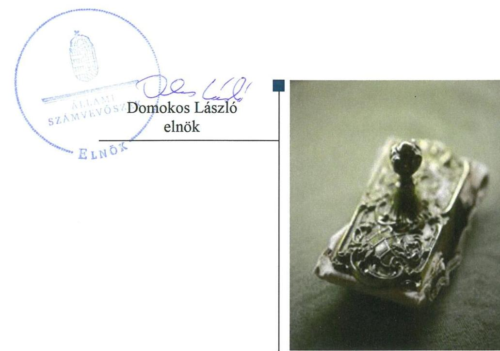
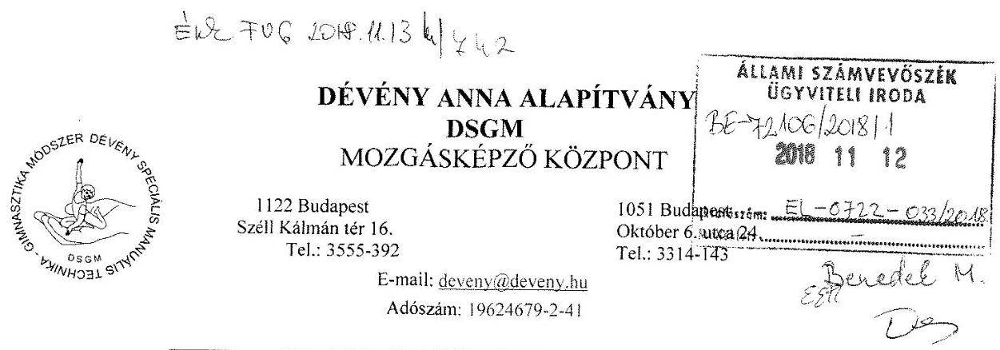
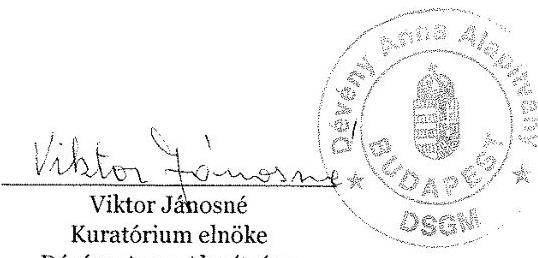
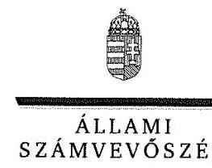
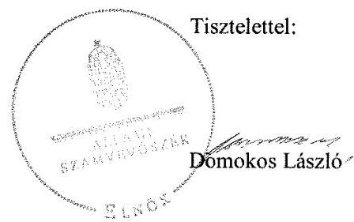
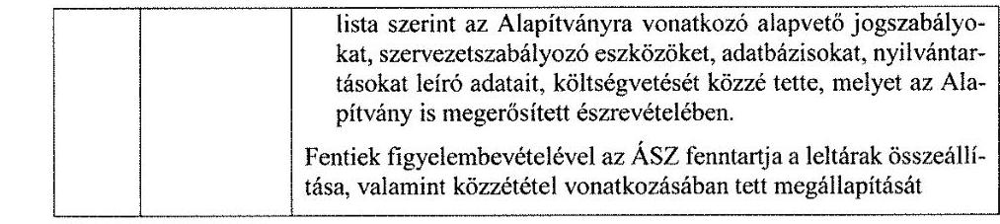
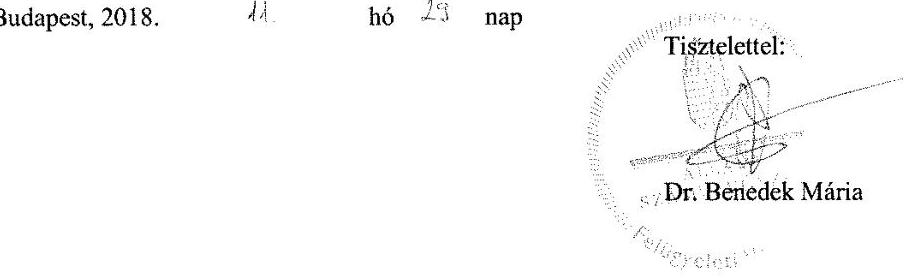

# Jelentés 

## Alapítványok ellenőrzése

Alapítványok gazdálkodásának ellenőrzése - Dévény Anna Alapítvány 2018. 12. hó 11. nap

---

# AZ ELLENŐRZÉST FELÜGYELTE:

DR. BENEDEK MÁRIA felügyeleti vezető

# AZ ELLENŐRZÉST VEZETTE ÉS A VÉGREHAJTÁSÁÉRT FELELŐS:

MARTUS BETTINA ellenőrzésvezető

# A PROGRAM ÖSSZEÁLLÍTÁSÁÉRT FELELŐS:

TÓTPÁL SZABOLCS osztályvezető

---

IKTATÓSZÁM: EL-0722-036/2018

TÉMASZÁM: 28

ELLENŐRZÉS-AZONOSÍTÓ SZÁM: V077514

---

Jelentéseink az Országgyűlés számítógépes hálózatán és az Interneten a www.asz.hu címen is olvashatóak.

---

# TARTALOMJEGYZÉK 

- ÖSSZEGZÉS ..... 5
- AZ ELLENŐRZÉS CÉLJA ..... 6
- AZ ELLENŐRZÉS TERÜLETE ..... 7
- AZ ELLENŐRZÉS HÁTTERE, INDOKOLTSÁGA ..... 8
- A JELENTÉS LÉNYEGES KÉRDÉSKÖREI ..... 9
- AZ ELLENŐRZÉS HATÓKÖRE ÉS MÓDSZEREI ..... 10
- MEGÁLLAPÍTÁSOK ..... 12
- JAVASLATOK ..... 17
- MELLÉKLETEK ..... 19
I. sz. melléklet: Értelmező szótár ..... 19
- FÜGGELÉK: ÉSZREVÉTELEK ..... 21
- RÖVIDÍTÉSEK JEGYZÉKE ..... 39

---

.

---

# ÖSSZEGZÉS 

Az Állami Számvevőszék a Dévény Anna Alapítvány ellenőrzése során megállapította, hogy a gazdálkodása a 2014-2016. években nem volt szabályszerű. A költségvetési és egyéb támogatások felhasználását, elszámolását nem a jogszabályi előírások szerint végezte, ezáltal nem biztosította tevékenysége elszámoltathatóságát. A Dévény Anna Alapítvány beszámolási kötelezettségét nem teljesítette, ennek következtében nem biztosította gazdálkodása átláthatóságát.

## Az ellenőrzés társadalmi indokoltsága

Az alapítványok, mint az alapító által az alapító okiratban meghatározott tartós cél megvalósítására létrehozott jogi személyek tevékenységüket az alapító által juttatott vagyon kezelésével, felhasználásával látják el. Az alapítványok működésükre és szakmai tevékenységük ellátására költségvetési támogatásban vagy ingyenes vagyonjuttatásban részesülhetnek. Az Állami Számvevőszék stratégiájában megfogalmazta, hogy az államháztartáson kívülre nyújtott költségvetési támogatások és ingyenes vagyonjuttatások, valamint az államháztartáson kívül működő közfeladat-ellátó rendszerek ellenőrzéseivel hozzájárul ahhoz, hogy a közpénzeket az államháztartáson kívül működő szervezetek is átlátható, rendezett módon használják fel a közvagyon átlátható, hatékony, költségtakarékos működtetése, értékének megőrzése, állagának védelme, értéknövelő használata, hasznosítása és gyarapítása érdekében.

## Főbb megállapítások, következtetések, javaslatok

A Dévény Anna Alapítvány szervezeti kereteit és gazdálkodására vonatkozó szabályzatait nem a jogszabályi előírások szerint alakította ki, tehát nem biztosította a közpénzekkel való elszámoltatható gazdálkodás kereteit. Nem gondoskodott az egyéb adat- és titokvédelmi szabályok érvényre juttatásáról, illetve a kötelezően közzéteendő közérdekű adatok elektronikus közzétételi kötelezettségének teljesítéséről. A Dévény Anna Alapítvány gazdálkodása nem volt szabályszerű.

A Dévény Anna Alapítvány a jogszabályi előírások ellenére a költségvetési és egyéb támogatásokat nem szabályszerűen használta fel és számolta el. A 2014-2016. években az egyszerűsített éves beszámolókhoz, a mérlegtételek alátámasztásához leltárt nem állított össze, ezáltal nem biztosította tevékenysége átláthatóságát és az elszámoltathatóságot.

Az ÁSZ az ellenőrzés megállapításai alapján a Dévény Anna Alapítvány Kuratóriumának elnöke részére 12 javaslatot fogalmazott meg.

---

# AZ ELLENŐRZÉS CÉLJA 

AZ ELLENŐRZÉS CÉLJA annak megállapítása volt, hogy a Dévény Anna Alapítvány gazdálkodása során betartotta-e a vonatkozó jogszabályi előírásokat, szabályszerűen használta-e fel a kapott költségvetési támogatásokat, az államháztartásból meghatározott célra ingyenesen juttatott vagyon használata, hasznosítása a jogszabályi előírásoknak megfelelően történt-e, az alapítvány működését szolgáló ellenőrzési és nyilvántartási rendszerek szabályszerűen működtek-e.

---

# **AZ ELLENŐRZÉS TERÜLETE**

## **Dévény Anna Alapítvány**

A Dévény Anna Alapítványt 1990-ben 200 ezer Ft induló vagyonnal Dévény Anna alapította.

A Dévény Anna Alapítvány célja a DSGM – Dévény Speciális Manuális Technika – Gimnasztika módszer, mint az eredeti, hagyományostól eltérő, sajátos komplex mozgásrehabilitációs szisztéma – és minden azzal rokon mozgásfejlesztő tevékenység – alkalmazása, elterjesztése és továbbfejlesztése.

Közhasznú jogállását 1998-ban szerezte meg, amely keretén belül többek között gyógyító-, egészségügyi rehabilitációs és szociális tevékenységet folytatott.

A közfeladatot ellátó Dévény Anna Alapítvány az államháztartásból ingyenesen juttatott vagyonnal, vagyoni hozzájárulással nem rendelkezett. Nem vagyoni hozzájárulást az alapítótól nem kapott. A 2014-2016. években államháztartási és azon kívüli forrásból összesen 391,8 millió Ft támogatást, adományt kapott, amelynek megoszlását forrásonként az 1. ábra szemlélteti.

1. ábra

|  KAPOTT TÁMOGATÁSOK, ADOMÁNYOK MEGOSZLÁSA (MILLIÓ FT) |  |  |  |   |
| --- | --- | --- | --- | --- |
|  Forrás | 2014. év | 2015. év | 2016. év | Összesen  |
|  Központi költségvetési támogatás | 40,0 | 59,7 | 39,4 | 139,1  |
|  Helyi önkormányzati költségvetési támogatás | 0,4 | 0,4 | 0,2 | 1,0  |
|  Európai Szociális Alap és Magyarország költségvetése társfinanszírozásából kapott támogatás | 14,2 | 3,8 | - | 18,0  |
|  Normatív támogatás | 22,5 | 28,2 | 39,1 | 89,8  |
|  Személyi jövedelemadó 1% | 18,8 | 18,1 | 17,1 | 54,0  |
|  Egyéb támogatás és adomány | 31,4 | 29,4 | 29,1 | 89,9  |
|  Összesen | 127,3 | 139,6 | 124,9 | 391,8  |

*Forrás: Alapítvány 2014-2016. évi fióknaplói*

A 2014-2016. években a Dévény Anna Alapítvány gazdasági társaságban részesedéssel nem rendelkezett, befektetési tevékenységet nem végzett. A 2014. évben ingatlanhasznosításból származó gazdasági-vállalkozási bevétele származott 1,2 millió Ft értékben.

Külső ellenőrzést a Dévény Anna Alapítványnál 2016-ban az Országos Egészségbiztosítási Pénztár végzett. A külső ellenőrző szerv intézkedést igénylő megállapításokat, javaslatokat nem tett.

---

# AZ ELLENŐRZÉS HÁTTERE, INDOKOLTSÁGA 

Társadalmi elvárás a közpénzek értékelvű, rendeltetésszerű felhasználása, a közpénzekből nyújtott támogatások átláthatóságának megteremtése, amelyhez az ÁSZ ${ }^{1}$ az államháztartásból nyújtott támogatások ellenőrzésével kíván hozzájárulni. Az ÁSZ Stratégiájában${ }^{2}$ rögzített célkitűzése, hogy az államháztartáson kívülre nyújtott költségvetési támogatások és az ingyenes vagyonjuttatás ellenőrzésével hozzájáruljon ahhoz, hogy a közpénzeket a civil szervezetek is átlátható módon használják fel. Továbbá az alapítványok gazdálkodása szabályszerűségének bemutatásával hozzájárul ahhoz, hogy a társadalom objektív képet alkothasson az alapítványok működéséről.

Az ellenőrzés eredményeinek célzott felhasználói a nyilvánosság, a jogalkotó, továbbá az alapítványok alapítói és szervei. Az ellenőrzés eredményeképp a törvényalkotás számára tapasztalatok állnak rendelkezésre az alapítványok gazdálkodása szabályozásához. Az ellenőrzött szervezetek szintjén gazdálkodásuk vonatkozásában a hiányosságok, szabálytalanságok feltárása, az ennek kapcsán megfogalmazott megállapítások elősegíthetik az alapítványok szabályszerű gazdálkodását, míg a társadalom számára információt szolgáltat arról, hogy az alapítványok a közpénzeket szabályszerűen használták-e fel. Az alapítványok gazdálkodása szabályszerűségének bemutatásával az ellenőrzés értékteremtő módon járul hozzá az ÁSZ stratégiai céljainak megvalósításához, a nyilvánosság megfelelő tájékoztatásához.

---

# A JELENTÉS LÉNYEGES KÉRDÉSKÖREI 

1. Az alapítvány gazdálkodása szabályszerű volt-e?
2. Az alapítvány szabályszerűen használta-e fel a kapott támogatásokat?
3. Az alapítvány a működését szolgáló nyilvántartási és ellenőrzési rendszereket szabályszerűen működtette-e, valamint a beszámolási kötelezettségét teljesítette-e?

---

# AZ ELLENŐRZÉS HATÓKÖRE ÉS MÓDSZEREI 

## Az ellenőrzés típusa

Szabályszerűségi ellenőrzés.

## Az ellenőrzött időszak

2014-2016. évek.

## Az ellenőrzés tárgya

Az ellenőrzés tárgya az alapítvány vonatkozó jogszabályi előírások szerinti gazdálkodási tevékenysége volt. Ezen belül az alapítvány a gazdálkodásához kapcsolódó szervezeti és szabályozási kereteinek a jogszabályi előírásoknak megfelelő kialakítása, a kapott költségvetési és egyéb támogatások, az alapítványi célok megvalósítására juttatott vagyon, vagyoni hozzájárulás szabályszerű felhasználására irányuló tevékenysége. Az államháztartásból meghatározott célra ingyenesen juttatott vagyonnak tekintjük az ellenőrzés során az államháztartási forrásból származó, az alapítványi célok megvalósítására rendelkezésre bocsátott vagyoni hozzájárulást is. Az ellenőrzés kiterjedt továbbá az alapítvány működését, gazdálkodását szolgáló nyilvántartási, ellenőrzési tevékenységére.

## Az ellenőrzött szervezet

Dévény Anna Alapítvány

## Az ellenőrzés jogalapja

Az ÁSZ tv. ${ }^{3}$ 1. § (3) bekezdése, 5. § (3) bekezdése, továbbá az Ectv. ${ }^{4}$ 47. §-a.

## Az ellenőrzés módszerei

Az ellenőrzést a szakmai program szempontjai, az ellenőrzött időszakban hatályos jogszabályok, a jelen ellenőrzésre irányadó ÁSZ módszertan figyelembe vételével és a nemzetközi standardokat irányadónak tekintve végezte az Állami Számvevőszék.

Az ellenőrzés ideje alatt az ellenőrzött szervezettel történő kapcsolattartás az ÁSZ Szervezeti és Működési Szabályzatának vonatkozó előírásai alapján történt.

---

Az ellenőrzési kérdések megválaszolásához szükséges bizonyítékok megszerzése az ellenőrzött által rendelkezésre bocsátott dokumentumokra, adatokra alapozva megfigyelés, szemle (szemrevételezés), kérdésfeltevés (információkérés), mintavételezés, valamint elemző eljárás útján történt. A mintavételezés véletlen mintavételi eljárással történt.

Tételesen ellenőriztük a beruházások, felújítások; mintavétellel az alapcélra fordított kiadások és ráfordítások, valamint az alapítvány által nyújtott támogatások elszámolásának szabályszerűségét a legalább 100.000 Ft értékű tételek esetében. Mintavétellel ellenőriztük továbbá az alapítvány beszámolóinál a mérlegtételek besorolását, év végi értékelését, azok leltárral való alátámasztottságát. A minta alapján a sokaságban előforduló hibaarányt becsültük. „Szabályszerűnek" értékeltünk egy ellenőrzött területet, amennyiben 95\%-os bizonyossággal a teljes sokaságban a hibaarány legfeljebb 10\%, „nem szabályszerűnek", amennyiben 10\%-nál magasabb arányt képviselt.

Az ellenőrzési bizonyítékként felhasználható adatforrások közé tartoztak egyrészt a szakmai program részletes szempontjainál felsorolt adatforrások, másrészt minden egyéb -az ellenőrzés folyamán - feltárt, az ellenőrzés szempontjából információt tartalmazó dokumentum.

Az ellenőrzés lefolytatásához az ellenőrzött a tanúsítványok kitöltésével, hitelesítésével és azok, valamint az ÁSZ által kért dokumentumok megküldésével szolgáltatott adatokat. Az így rendelkezésre bocsátott adatok, információk, a tanúsítványok adatai valódiságának kontrollja az ellenőrzés keretében történt.

---

# 1. Az alapítvány gazdálkodása szabályszerű volt-e? 

## Összegző megállapítás

### 1.1. számú megállapítás

Az Alapítvány gazdálkodása nem volt szabályszerű.

Az Alapítvány gazdálkodásának szervezeti kereteit nem szabályszerűen alakította ki.

Az Alapítvány ${ }^{5}$ rendelkezett Alapító okirattal ${ }_{1,2,3,4}{ }^{6}$, amelyek rögzítették a Ptk. ${ }_{1,2}{ }^{7}$-ben előírt tartalmi elemeket.

Az alapító kijelölte az Alapító okirat ${ }_{1,2,3,4}$-ben a Kuratórium ${ }^{8}$ és az FB${ }^{9}$ tagjait, valamint meghatározta az Alapítvány képviseletére jogosultak körét.

Az Alapítvány Alapító okirat előírásai vonatkozásában feltárt szabálytalanságokat az 1. táblázat tartalmazza.

## AZ ALAPÍTÓ OKIRAT ELŐÍRÁSAI VONATKOZÁSÁBAN FELTÁRT SZABÁLYTALANSÁGOK

| Sorszám | Megállapítás | Megjegyzés |
| :--: | :--: | :--: |
| 1. | A Kuratórium az Alapító okirat ${ }_{1,2,3,4}$ 11.5. pontjában előírtak ellenére nem hozta létre Szervezeti és működési szabályzatát. |  |
| 2. | Az FB az Ectv. 40. § (2) bekezdésében és az Alapító Okirat ${ }_{1,2,3,4}$ 13.1. pontjában foglaltak ellenére ügyrendjét nem állapította meg. |  |

1.2. számú megállapítás

Az Alapítvány gazdálkodására vonatkozó belső szabályozás nem felelt meg a jogszabályi előírásoknak.

Az Alapítvány a 2014-2016. években az egyszerűsített éves beszámolóit elkészítette, amelyek az Ectv. 29. § (2) és (3) bekezdése szerint tartalmazták a mérleget, az eredménykimutatást, a kiegészítő mellékletet, valamint a közhasznúsági mellékletet.

Az Alapítvány a gazdálkodására vonatkozó belső szabályozásait a jogszabályi előírások ellenére nem alakította ki.

Az Alapítvány gazdálkodására vonatkozó belső szabályozások kapcsán feltárt szabálytalanságokat a 2. táblázat tartalmazza.
2. táblázat

A GAZDÁLKODÁSRA VONATKOZÓ BELSŐ SZABÁLYOZÁSOK KAPCSÁN FELTÁRT SZABÁLYTALANSÁGOK

| Sorszám | Megállapítás | Megjegyzés |
| :--: | :--: | :--: |
| 1. | Az Alapítvány a Számv. tv. ${ }^{10}$ 14. § (3) bekezdésében foglaltak ellenére - a törvényben rögzített alapelvek, értékelési előírások alapján - az adottságainak, körülményeinek leginkább megfelelő számviteli politikát nem alakította ki és nem foglalta írásba. Az Alapítvány a Számv. tv. 14. § (5) bekezdésének ellenére nem készítette el az eszközök és a források leltárkészítési és leltározási szabályzatát, az eszközök és források értékelési szabályzatát és a pénzkezelési szabályzatát. |  |

---

| Sorszám | Megállapítás | Megjegyzés |
| :--: | :--: | :--: |
| 2. | Számlarendet az Alapítvány a

 Számv. tv. 161. § (1) bekezdésében foglaltak ellenére nem készített a 2014-2016. években. |  |
| 3. | Az Alapítvány az Info. tv. ${ }^{11}$ 7. § (2) bekezdésében foglaltak ellenére nem alakította ki azokat az eljárási szabályokat, amelyek az Info. tv. valamint az egyéb adat- és titokvédelmi szabályok érvényre juttatásához szükségesek. |  |
| 4. | Az Alapítvány a 2014-2016. években az Info tv. 35. § (3) bekezdésének előírása ellenére nem állapította meg belső szabályzatban az Info tv. 35. § (1) bekezdés szerinti - a közzétételi listákon szereplő adatok pontos, naprakész és folyamatos közzétételi - kötelezettsége teljesítésének részletes szabályait. |  |

1.3. számú megállapítás

Az Alapítvány gazdálkodása során a 2014. évben nem szabályszerűen, a 2015. és 2016. években szabályszerűen járt el.

Az Alapítvány a 2014-2016. években a költségvetési tervek készítése során - az Ecvhr. ${ }^{12}$ előírtak szerint - az ésszerű gazdálkodás elve szerint járt el, valamint azokat a Civilszr. alapján készített beszámoló tartalmi elemeinek megfelelően készítette el.

A gazdasági-vállalkozási tevékenységnek minősülő ingatlan hasznosítási tevékenység bevételét az Alapítvány az Ectv. szerint 2014-ben elkülönítetten, a számviteli előírások szerint tartotta nyilván.

Az Alapítvány gazdasági-vállalkozási tevékenységéhez kapcsolódó szabálytalanságokat a 3. táblázat mutatja be.
3. táblázat

# A GAZDASÁGI-VÁLLALKOZÁSI TEVÉKENYSÉGHEZ KAPCSOLÓDÓ SZABÁLYTALANSÁGOK 

Sorszám | Megállapítás | Megjegyzés |
| :-- | :-- | :-- |
| 3. | Az Alapítvány a gazdasági-vállalkozási tevékenységeihez kapcsolódó költségeket, ráfordításokat (kiadásokat) 2014-ben az Ectv. 20. §-ában foglaltak ellenére nem az Ectv. 19. § (2) bekezdés szerinti részletezésben elkülönítetten, nem a számviteli előírások szerint tartotta nyilván. A működési- és egyéb költségeket, ráfordításokat (kiadásokat) az Ectv. 21. §-ában foglaltak ellenére az alapcél szerinti és a gazdasági-vállalkozási tevékenység között a tevékenységei árbevételének (bevételének) arányában nem osztotta meg évente. |  |
| 2. | Az Alapítvány a 2014. évben a kamat bevételt az Ectv. 20. §-ában foglaltak ellenére nem az Ectv. 19. § (1) bekezdés szerinti részletezésben elkülönítetten, nem a számviteli előírások szerint tartotta nyilván. |  |
| 3. | Az Alapítvány a 2014. évi eredménykimutatásában a Civilszr. ${ }^{13}$ 15. § (5) bekezdésében előírtak ellenére a közhasznú tevékenységével és a vállalkozási tevékenységgel összefüggő tételeket elkülönítetten nem mutatta ki. |  |

Forrás: ÁSZ

### 1.4. számú megállapítás

Az Alapítvány kiadásainak elszámolása nem volt szabályszerű.
A beszerzett immateriális javak, tárgyi eszközök aktiválása és állományba vétele, a bekerülési értékének megállapítása és értékcsökkenés elszámolása megtörtént.

A kiadások elszámolásának vonatkozásában feltárt szabálytalanságokat a 4. táblázat tartalmazza.

---

# A KIADÁSOK ELSZÁMOLÁSÁVAL KAPCSOLATOS SZABÁLYTALANSÁGOK 

| Sorszám | Megállapítás | Megjegyzés |
| :--: | :--: | :--: |
| 1. | Az Alapítvány könyvviteli elszámolását közvetlenül alátámasztó bizonylatai a 2014-2016. években a Számv. tv. 167. § (1) bekezdés c) pontjában foglaltak ellenére nem tartalmazták a gazdasági műveletet elrendelő személy megjelölését, valamint az utalványozó és a rendelkezés végrehajtást igazoló személy aláírását. A Számv. tv. 167. § (1) bekezdés h) és i) pontjában előírtak ellenére nem tartalmazták a könyvelés módjára, valamint az érintett könyvviteli számlákra történő hivatkozást, a könyvviteli nyilvántartásokban történt rögzítés időpontját és igazolását. |  |
| 2. | Az Alapítvány a Számv. tv. 165. § (2) bekezdésben előírtak ellenére a beruházásokhoz és a felújításokhoz tartozó kiadásait szabályszerűen kiállított bizonylatok nélkül könyvelte a 2015. évben. | Az Alapítvány a 2014. és a 2016. évben szabályszerűen kiállított bizonylatokkal könyvelt. |

Forrás: ÁSZ

## 2. Az alapítvány szabályszerűen használta-e fel a kapott támogatásokat?

## Összegző megállapítás

### 2.1. számú megállapítás

## A kapott támogatások felhasználása nem volt szabályszerű.

## A költségvetési támogatások felhasználása, elszámolása nem volt szabályszerű.

Az ellenőrzött időszakban az Alapítvány az államháztartás központi és a helyi önkormányzati alrendszeréből költségvetési támogatást kapott.

A civil szervezetnek költségeit és ráfordításait az Ectv: 20.§ szerint 2015. november 27-ig a 19. § (2) a)-d) pontjaiban előírtak alapján az alapcél szerinti, gazdálkodási vállalkozási tevékenység, működési költségek, értékcsökkenési leírás és egyéb költség szerint megbontva kellett nyilvántartani. Az Ectv. 2015. november 28-tól a korábbi előírásoktól eltérő szabályokat állapított meg, melynek alapján a civil szervezetnek az Ectv. 20. § (4) bekezdése szerint olyan nyilvántartást kellett vezetni, amiből támogatásonként megállapítható és ellenőrizhető a kapott támogatás felhasználása.

Az Alapítvány támogatásainak nyilvántartásával és elszámolásával kapcsolatos hiányosságokat az 5. táblázat tartalmazza.
5. táblázat

TÁMOGATÁSOK NYILVÁNTARTÁSÁNAK ÉS ELSZÁMOLÁSÁNAK HIÁNYOSSÁGAI

| Sorszám | Megállapítás | Megjegyzés |
| :--: | :--: | :--: |
| 1. | Az Alapítvány a 2014. január 1.- 2015. november 27. közötti időszakban a Civilszr. 17. § (8) bekezdésében előírtak ellenére a költségvetési támogatásokról nem alakított ki (részletezett) olyan nyilvántartási rendszert, hogy abból a közpénzek felhasználásával, átláthatóbbá tételével kapcsolatos információk rendelkezésre álljanak. |  |
| 2. | Az Alapítvány a 2015. november 28. - 2016. december 31. közötti időszakban az Ectv. 20. § (4) bekezdésben foglaltak ellenére - az EMMI támogatás kivételével - nem vezetett olyan elkülönített számviteli nyilvántartást, amelynek alapján támogatásonként megállapítható és ellenőrizhető a kapott támogatás felhasználása. |  |

---

# 2.2. számú megállapítás 

Az Alapítványnak az alapcélhoz kapott egyéb adomány és támogatás nyilvántartása a jogszabályi előírások alapján szabályszerű volt.

Az Alapítvány alapcéljához kapott egyéb adományainak és támogatásainak nyilvántartása az Ectv. előírásai szerint történt.

## 3. Az alapítvány a működését szolgáló nyilvántartási és ellenőrzési rendszereket szabályszerűen működtette-e, valamint a beszámolási kötelezettségét teljesítette-e?

Összegző megállapítás

Az Alapítvány a működését szolgáló nyilvántartási és ellenőrzési rendszereket nem szabályszerűen működtette, valamint a beszámolási kötelezettségét nem szabályszerűen teljesítette.
3.1. számú megállapítás

Az Alapítvány éves beszámolási és közzétételi kötelezettségét, nyilvántartásai vezetését nem szabályszerűen teljesítette.

Az Alapítvány, mint egyéb szervezet a 2014-2016. évekre a Számv. tv. 4. § (1) bekezdésében, valamint a Civilszr. 6. § (1) bekezdésében előírtak alapján a vagyoni, pénzügyi és jövedelmi helyzetéről az üzleti évek könyveinek lezárását követően elkészítette beszámolóját.

Az Alapítvány egyszerűsített éves beszámolóinak és a mérlegtételek értékeléséhez kapcsolódó szabálytalanságokat a 6. táblázat tartalmazza.
6. táblázat

## AZ EGYSZERŰSÍTETT ÉVES BESZÁMOLÓK ÉS A MÉRLEGTÉTELEK SZABÁLYTALANSÁGAI

| Sorszám | Megállapítás | Megjegyzés |
| :--: | :--: | :--: |
| 1. | Az Alapítvány a 2014-2016. évi beszámolóinak elkészítéséhez és mérlegtételeinek alátámasztásához a Számv. tv. 69. § (1) bekezdése ellenére nem állított össze olyan leltárt, amely tételesen, ellenőrizhető módon tartalmazza az Alapítványnak a mérleg fordulónapján meglévő eszközeit és forrásait mennyiségben és értékben. |  |
| 2. | A beszámoló elkészítéséhez, a mérleg tételeinek alátámasztásához a Számv. tv. 69. § (2) bekezdésében előírt kötelezettségét az Alapítvány 2014-2015. években nem teljesítette, a főkönyvi könyvelés és az analitikus nyilvántartások adatai közötti egyeztetést az üzleti év mérlegfordulónapjára vonatkozóan nem végezte el. |  |
| 3. | Az Ectv. 29. § (4) bekezdésében foglalt előírások ellenére az Alapítvány a kiegészítő mellékletében nem mutatta be a támogatási program keretében végleges jelleggel felhasznált összegeket támogatásonként. |  |
| 4. | Az Ectv. 29. § (5) bekezdésében foglalt előírások ellenére az Alapítvány a kiegészítő mellékletében nem mutatta be a szervezet által az üzleti évben végzett főbb tevékenységeket, programokat. |  |

Forrás: ÁSZ
Az Alapítvány a 2015-2016. évekre vonatkozó egyszerűsített éves beszámolóit és közhasznúsági mellékleteit az Ectv.-ben előírtak szerint letétbe helyezte és közzétette a jogszabályban előírtak szerint.

Az Alapítvány számviteli beszámolóinak letétbe helyezésével, valamint közzétételével kapcsolatos szabálytalanságokat a 7. táblázat tartalmazza.

---

7. táblázat

# A BESZÁMOLÓK LETÉTBE HELYEZÉSÉVEL ÉS KÖZZÉTÉTELÉVEL KAPCSOLATBAN FELTÁRT SZABÁLYTALANSÁGOK 

| Sorszám | Megállapítás | Megjegyzés |
| :-- | :-- | :-- |

---

# JAVASLATOK 

Az ÁSZ tv. 33. § (1) bekezdésében foglaltak értelmében az ellenőrzött szervezet vezetője köteles a jelentésben foglalt megállapításokhoz kapcsolódó intézkedési tervet összeállítani és azt a jelentés kézhezvételétől számított 30 napon belül az ÁSZ részére megküldeni. Amennyiben az ellenőrzött szervezet vezetője nem küldi meg határidőben az intézkedési tervet, vagy továbbra sem elfogadható intézkedési tervet küld, az Állami Számvevőszék elnöke az ÁSZ tv. 33. § (3) bekezdés a) és b) pontjaiban foglaltakat érvényesítheti.

## a Kuratórium elnökének

1. Intézkedjen arról, hogy a Kuratórium az Alapító okirat 11.5. pontjában előírtak szerint hozza létre szervezési és működési szabályzatát.
(1. táblázat 1. sz. megállapítás alapján)
2. Intézkedjen arról, hogy az Ectv.-ben és az Alapító Okiratban előírtaknak megfelelően az FB az ügyrendjét állapítsa meg.
(1. táblázat 2. sz. megállapítás alapján)
3. Intézkedjen arról, hogy a Számv. tv. előírásainak megfelelően a törvényben rögzített alapelvek, értékelési előírások alapján alakítsa ki és foglalja írásba a gazdálkodó adottságainak, körülményeinek leginkább megfelelő - a törvény végrehajtásának módszereit, eszközeit meghatározó - számviteli politikát, valamint a számviteli politika keretében készítse el az eszközök és a források leltárkészítési és leltározási szabályzatát, az eszközök és a források értékelési szabályzatát, a pénzkezelési szabályzatot.
(2. táblázat 1. sz. megállapítás alapján)
4. Intézkedjen a Számv. tv. előírása szerint számlarend készítéséről.
(2. táblázat 2. sz. megállapítás alapján)
5. Gondoskodjon az Info tv.-ben foglaltaknak megfelelően a közzétételi listákon szereplő adatok pontos, naprakész és folyamatos közzétételére vonatkozó kötelezettség teljesítésének részletes szabályai belső szabályzatban történő megállapításáról.
(2. táblázat 4. sz. megállapítás alapján)

---

6. Intézkedjen arról, hogy a Számv. tv. előírásainak megfelelően a könyvviteli elszámolást közvetlenül alátámasztó bizonylat tartalmazza a gazdasági műveletet elrendelő személy megjelölését, az utalványozó és a rendelkezés végrehajtását igazoló személy aláírását, továbbá a könyvelés módjára, az érintett könyvviteli számlákra történő hivatkozást, valamint a könyvviteli nyilvántartásokban történt rögzítés időpontját, igazolását.
(4. táblázat 1. sz. megállapítás alapján)
7. Intézkedjen az Ectv. előírása szerint olyan elkülönített számviteli nyilvántartás vezetéséről, amelynek alapján támogatásonként megállapítható és ellenőrizhető a kapott támogatás felhasználása.
(5. táblázat 2. sz. megállapítás alapján)
8. Intézkedjen arról, hogy a Számv. tv. előírása szerint a beszámoló elkészítéséhez, a mérleg tételeinek alátámasztásához olyan leltárt állítsanak össze, amely tételesen, ellenőrizhető módon tartalmazza az Alapítványnak a mérleg fordulónapján meglévő eszközeit és forrásait mennyiségben és értékben.
(6. táblázat 1. sz. megállapítás alapján)
9. Intézkedjen a Számv. tv. előírása szerint a főkönyvi könyvelés és az analitikus nyilvántartások adatai közötti egyeztetés elvégzéséről az üzleti év mérlegfordulónapjára vonatkozóan.
(6. táblázat 2. sz. megállapítás alapján)
10. Intézkedjen arról, hogy az Ectv. előírása szerint az Alapítvány kiegészítő mellékletében mutassa be a támogatási program keretében végleges jelleggel felhasznált összegeket támogatásonként.
(6. táblázat 3. sz. megállapítás alapján)
11. Intézkedjen arról, hogy az Ectv. előírása szerint az Alapítvány kiegészítő mellékletében mutassa be a szervezet által az üzleti évben végzett főbb tevékenységeket és programokat.
(6. táblázat 4. sz. megállapítás alapján)
12. Intézkedjen az Info. tv. előírása szerint az 1. melléklet szerinti általános közzétételi listában meghatározott adatok közül a II./1., a II./6., és a III./1. pontban meghatározott adatok közzétételéről.
(7. táblázat 2. sz. megállapítás alapján)

---

# MELLÉKLETEK 

- I. SZ. MELLÉKLET: ÉRTELMEZŐ SZÓTÁR
alapító
alapítvány
adomány
államháztartás

Az alapítványt, mint jogi személyt az alapító okiratban meghatározott tartós cél folyamatos megvalósítására létrehozó, az

 alapítvány részére az alapító okiratban meghatározott, az alapítványi cél megvalósításához szükséges pénzbeli és nem pénzbeli vagyoni hozzájárulást teljesítő személy(ek)/jogi személy(ek). (Forrás: Ptk. 2 3:378. §, 3:382. § (2) bek.)
Magánszemély, jogi személy és jogi személyiséggel nem rendelkező gazdasági társaság (a továbbiakban együtt: alapító) - tartós közérdekű célra - alapító okiratban alapítványt hozhat létre. Alapítvány elsődlegesen gazdasági tevékenység folytatása céljából nem alapítható. Az alapítvány javára a célja megvalósításához szükséges vagyont kell rendelni. Az alapítvány jogi személy. Az alapítvány a bírósági nyilvántartásba vételével jön létre. (Forrás: Ptk. 1 74/A. § (1) - (2) bekezdés)
Az alapítvány az alapító által az alapító okiratban meghatározott tartós cél folyamatos megvalósítására létrehozott jogi személy. Az alapító az alapító okiratban meghatározza az alapítványnak juttatott vagyont és az alapítvány szervezetét. Alapítvány nem alapítható gazdasági-vállalkozási tevékenység folytatására. Az alapítvány az alapítványi cél megvalósításával közvetlenül összefüggő gazdasági tevékenység végzésére jogosult. Alapítvány nem lehet korlátlan felelősségű tagja más jogalanynak, nem létesíthet alapítványt és nem csatlakozhat alapítványhoz. (Forrás: Ptk. 2 3:378§, 3:379. § (1) - (3) bekezdés)

A civil szervezetnek - létesítő/alapító okiratban rögzített céljaira - ellenszolgáltatás nélkül juttatott eszköz, illetve nyújtott szolgáltatás (Forrás: Ectv. 2. § 1. pont)
az a pénzbeli vagy természetbeni juttatás, amelyet az adományozó az adományozott civil szervezet alapcéljának, illetve közhasznú céljának elérésére ellenszolgáltatás nélkül juttat (Forrás: Ecvhr. 1. § (5) bekezdés a) pont)
a közhasznú szervezet részére törvényben meghatározott közhasznú tevékenysége támogatására, valamint az egyházi jogi személy részére törvényben meghatározott tevékenysége támogatására, továbbá a közérdekű kötelezettségvállalás céljára az adóévben visszafizetési kötelezettség nélkül adott támogatás, juttatás, térítés nélkül átadott eszköz könyv szerinti értéke, térítés nélkül nyújtott szolgáltatás bekerülési értéke, feltéve hogy az nem jelent az e törvényben meghatározottakon túl vagyoni előnyt az adományozónak, az adományozó tagjának vagy részvényesének, vezető tisztségviselőjének, felügyelőbizottsága vagy igazgatósága tagjának, könyvvizsgálójának, illetve ezen személyek vagy a természetes személy tag vagy részvényes közeli hozzátartozójának azzal, hogy nem minősül vagyoni előnynek az adományozó nevére, tevékenységére történő utalás (Forrás: a társasági adóról és az osztalékadóról szóló 1996. évi LXXXI. törvény 4. § 1/a. pont)
Az államháztartás a közfeladatok ellátásának egységes szervezeti, tervezési, gazdálkodási, ellenőrzési, finanszírozási, adatszolgáltatási és beszámolási szabályok szerint működő rendszere, amely központi és önkormányzati alrendszerből áll.
Az államháztartás központi alrendszerébe tartozik az állam, a központi költségvetési szerv, a törvény által az államháztartás központi alrendszerébe sorolt köztestület, és ezen köztestület által irányított köztestületi költségvetési szerv.
Az államháztartás önkormányzati alrendszerébe tartozik a helyi önkormányzat, a helyi nemzetiségi önkormányzat és az országos nemzetiségi önkormányzat, a Mötv. és a nemzetiségek jogairól szóló 2011. évi CLXXIX. törvény szerint létrehozott társulás, valamint a területfejlesztésről és a területrendezésről szóló törvény alapján létrejött

---

államháztartásból származó forrás
beruházás
civil szervezet

Felügyelőbizottság
gazdasági-vállalkozási tevékenység
költségvetési támogatás
közhasznú tevékenység
vagyoni hozzájárulás
területfejlesztési önkormányzati társulás, a térségi fejlesztési tanács, és a megnevezett szervezetek által irányított költségvetési szerv. (Forrás: Áht. ${ }^{14}$ 2-3. §)
az államháztartás központi és önkormányzati alrendszeréből származó forrás
A tárgyi eszköz beszerzése, létesítése, saját vállalkozásban történő előállítása, a beszerzett tárgyi eszköz üzembe helyezése. A beruházás a meglévő tárgyi eszköz bővítését, rendeltetésének megváltoztatását, átalakítását, élettartamának, teljesítőképességének közvetlen növelését eredményező tevékenység. (Forrás: Számv. tv. 3. § (4) bekezdés 7. pont)
2014. március 15-ig: a civil társaság, illetve a Magyarországon nyilvántartásba vett egyesület - a párt kivételével -, valamint az alapítvány. Civil szervezet alatt az e törvény II-VI. és VIII-X. fejezetében a civil társaságot, továbbá a VII-X. fejezetében a kölcsönös biztosító egyesületet és a szakszervezetet nem kell érteni. (Forrás: Ectv. 2. § 6. pont)

2014. március 15-től: a civil társaság; a Magyarországon nyilvántartásba vett egyesület - a párt, a szakszervezet és a kölcsönös biztosító egyesület kivételével és - a közalapítvány és a pártalapítvány kivételével - az alapítvány. (Forrás: Ectv. 2. § 6. pont)
Az alapítók a létesítő okiratban három tagból álló felügyelőbizottságot hozhatnak létre, azzal a feladattal, hogy az ügyvezetést a jogi személy érdekeinek megóvása céljából ellenőrizze. (Forrás: Ptk. 3 :36-3:28 §)
A jövedelem- és vagyonszerzésre irányuló vagy azt eredményező, üzletszerűen végzett gazdasági tevékenység, kivéve az adomány (ajándék) elfogadását, a létesítő okiratban meghatározott cél szerinti tevékenységet (ideértve a közhasznú tevékenységet is), - 2015. november 28-tól - a pénzeszközök betétbe, értékpapírba, társasági részesedésbe történő elhelyezését és az ingatlan megszerzését, használatának átengedését és átruházását. (Forrás: Ectv. 2. § 11. pont)
Az államháztartás alrendszerei terhére nyújtott pénzbeli vagy nem pénzbeli juttatás, amelyet a támogató nem elsősorban ellenszolgáltatás ellenében, de konkrét program megvalósítása vagy meghatározott időszakban a támogatott szervezet működtetése érdekében nyújt. Költségvetési támogatás különösen: a pályázat útján, valamint egyedi döntéssel kapott költségvetési támogatás; az Európai Unió strukturális alapjaiból, illetve a Kohéziós Alapból származó, a költségvetésből juttatott támogatás; az Európai Unió költségvetéséből vagy más államtól, nemzetközi szervezettől származó támogatás és a személyi jövedelemadó meghatározott részének az adózó rendelkezése szerint felajánlott összege. (Forrás: Ectv. 2. § 15. pont)
Minden olyan tevékenység, amely a létesítő okiratban megjelölt közfeladat teljesítését közvetlenül vagy közvetve szolgálja, ezzel hozzájárulva a társadalom és az egyén közös szükségleteinek kielégítéséhez. (Forrás: Ectv. 2. § 20. pont)
Az alapítvány alapítója által az alapításkor az alapítvány részére teljesítendő olyan hozzájárulás, amelynek értékét nem lehet visszakövetelni. Az alapító által az alapítvány rendelkezésére bocsátott vagyon pénzből és nem pénzbeli vagyoni hozzájárulásból állhat. Az alapítónak legalább az alapítvány működésének megkezdéséhez szükséges vagyont a nyilvántartásba-vételi kérelem benyújtásáig át kell ruháznia az alapítványra. Az alapítónak a teljes juttatott vagyont legkésőbb az alapítvány nyilvántartásba vételétől számított egy éven belül kell átruháznia az alapítványra. (Forrás: Ptk. 3:9. § (1) bek., 3:10. § (1) bek., 3:382. § (2)-(3) bek.)

---

# FÜGGELÉK: ÉSZREVÉTELEK 

A jelentéstervezetet a Számvevőszék 15 napos észrevételezésre megküldte az ellenőrzött szervezet vezetőjének az ÁSZ tv. 29. § (1) bekezdése előírásának megfelelően.
A részben elfogadott észrevétel alapján a Számvevőszék módosította a jelentést.

A függelék tartalmazza az ellenőrzött észrevételeit, illetve az el nem fogadott észrevételek elutasításának indoklását.

[^0]
[^0]:    * 29. § (1) Az Állami Számvevőszék az ellenőrzési megállapításait megküldi az ellenőrzött szervezet vezetőjének vagy az általa megbízott személynek, és annak, akinek személyes felelősségét állapította meg.
    (2) Az ellenőrzött szervezet vezetője és a felelősként megjelölt személy az ellenőrzés megállapításaira tizenöt napon belül írásban észrevételt tehet.
    (3) Az Állami Számvevőszék az észrevételre a beérkezésétől számított harminc napon belül írásban válaszol. A figyelembe nem vett észrevételeket köteles a jelentésben feltüntetni, és megindokolni, hogy azokat miért nem fogadta el.

---

# Domokos László 

## elnök

## Állami Számvevőszék

Budapest
Pf. 54 .
1364

## Tárgy: Észrevétel az Állami Számvevőszék Dévény Anna Alapítvány ellenőrzése keretében készített számvevőszéki jelentéstervezetére

Tisztelt Elnök Úr!
A Dévény Anna Alapítvány (székhely: 1051 Budapest Október 6. u. 24; adószám: 1962679-2-41; „Alapítvány") köszönettel megkapta az alapítványok/közalapítványok gazdálkodásának ellenőrzése keretében a Dévény Anna Alapítvány tekintetében elkészített számvevőszéki jelentéstervezetet.
Az Alapítvány mindenekelőtt kiemeli, hogy elkötelezett amellett, hogy a tevékenységét a jogszabályi előírásoknak megfelelően folytassa. A jelentéstervezetet e szemléletben áttekintette és a jelentéstervezetre az alábbi észrevételeket teszi:

## A jelentéstervezet összegzés pontjára tett észrevétel

A jelentéstervezet összegzés pontjára vonatkozóan tájékoztatja az Alapítvány a tisztelt Állami Számvevőszéket, hogy az Alapítvány vezetőségének személyi összetételében 2016. évben változások történtek. Dévény Anna mint az Alapítvány alapítója 2016. évben visszahívta tisztségéből a kuratóriumi elnökét és ezzel egyidejűleg kinevezte Viktor Jánosnét az Alapítvány kuratóriumának elnökének.
Az Alapítvány kuratóriuma a kuratóriumi tagok személyében bekövetkezett változást követően megkezdte az Alapítvány folyamatainak áttekintését, szükség esetén azok dokumentálását és/vagy újraszervezését.
Az Alapítvány a működéséhez szükséges szabályzatokat folyamatosan alakította ki, azokat alkalmazta, azonban azok aláírására az ellenőrzött időszakban alakilag megfelelő formában nem került sor, amiből a tisztelt Állami Számvevőszék azt a téves következtetést vonta le, hogy a szabályok érvényre juttatását nem biztosította az Alapítvány.
Az Alapítvány a kapott támogatásokat a támogatási cél szerint használta fel, az ellenőrzött időszakban a támogatások összegéről a támogatást nyújtók felé elszámolást nyújtott be a támogatást nyújtók által előírt formai és tartalmi követelmények szerint. A tisztelt Állami Számvevőszék a költségvetési és egyéb támogatások nem szabályszerű felhasználására vonatkozó téves következtetéseket abból vonta le, hogy az Alapítvány a támogatásokkal való elszámoláskor a támogatást nyújtó által előírt formában készítette el az elszámolást és nem vezetett elkülönített számviteli nyilvántartást a támogatások elszámolása tekintetében.

---

Az Alapítvány a vizsgált időszakban valamennyi évben készített évvégi leltárt, azonban a leltárban az egyes leltári tételek értékét abban a 2014. és 2015. évben nem tüntette fel. Az Alapítvány a 2016. évtől kezdődően javította gyakorlatát és a 2016. évtől kezdődően rendelkezik olyan leltárral, amelyben az egyes tételek mennyiség és érték szerint is szerepelnek.
Az Alapítvány kuratóriumának elnöke a részére megfogalmazott 12 javaslatot áttekintette és az intézkedési terv kialakításáról, valamint az abban foglaltak mielőbbi megvalósításáról gondoskodik.

# A jelentéstervezet ellenőrzés területe pontjára tett észrevétel 

A tisztelt Állami Számvevőszék az Alapítvány célját pontatlanul határozta meg, az Alapítvány célja ugyanis a szülési oxigénhiányos agykárosodásban szenvedő csecsemők speciális DSGM-mel (Dévény Speciális Manuális Technika-Gimnasztika módszer) történő gyógyítása és mozgásrehabilitációja, immár országos hálózat keretében.
Az eredeti és egyedülálló Dévény Speciális manuális technika - Gimnasztika Módszert (DSGM) Dévény Anna gyógytornász, művészi torna szakedző dolgozta ki kettős képzettségének gyakorlati tapasztalatai alapján. Az általa kifejlesztett DSGM minden eddigi eljárástól eltérő új, komplex szemléletre épülő mozgásrehabilitációs szisztéma, mellyel kiemelkedő eredmények érhetők el a szülési oxigénhiányos agykárosodásban szenvedő csecsemőknél, valamint a mozgássérülések valamennyi területén, gyerekeknél és felnőtteknél.
A sikeres terápia kulcsa a komplex mozgásszemlélet, valamint egy speciális izom-ín kezelés, amely helyreállítja a zsugorodott és letapadt izmok és inak kóros állapotát valamint direkt ingereket képes eljuttatni az agyba.

## A jelentéstervezet 1.1. számú megállapítására tett észrevétel

Az Alapítvány a kuratóriuma összetételében bekövetkezett személyi változást követően megkezdte a szervezeti és működési szabályzatának átdolgozását. A szervezeti és működési szabályzat módosított verziójának tervezete el is készült, azonban Dévény Anna 2017. évi halála következtében a szervezeti és működési szabályzat átalakítása szükségessé vált, hiszen az Alapítvány életében Dévény Anna meghatározó szerepet töltött be.
Az Alapítvány gondoskodik arról, hogy a kuratórium a következő kuratóriumi ülésen az Alapítvány szervezeti és működési szabályzatának végleges verzióját kialakítsa és a felügyelőbizottság elnöke mihamarabb felügyelőbizottsági ülést hívjon össze a felügyelőbizottság ügyrendjének kialakítása és megállapítása céljából.

## A jelentéstervezet 1.2. számú megállapítására tett észrevétel

Az Alapítvány a számviteli politikáját, a számlarendet, a leltárkészítése és leltározási szabályzatát, az eszközök és források értékelési szabályzatát, valamint a pénzkezelési szabályzatát kialakította, azokat alkalmazta. Az Alapítvány kuratóriumának elnöke a dokumentumokat elektronikus formában „sk" jelzéssel látta el, azokat papíralapon azonban nem írta alá.
Az Alapítvány közzétételre vonatkozó szabályzattal nem rendelkezett,
 ugyanakkor ahogy a tisztelt Állami Számvevőszék is megállapította, a közzétételi kötelezettségének eleget tett.
Az Alapítvány álláspontja szerint a gazdálkodás kereteit meghatározó belső szabályozást kialakította és a kialakított belső szabályozásban foglaltak szerint járt el. Az Alapítvány gondoskodik arról, hogy a kialakított belső szabályzatai alakilag is megfelelően elfogadásra kerüljenek, illetve dolgozik azon, hogy a jelenleg hatályos adatvédelmi előírásoknak megfeleljen.

---

# A jelentéstervezet 1.3. számú megállapítására tett észrevétel 

Az Alapítvány a gazdasági-vállalkozási tevékenységéhez kapcsolódó gyakorlatát 2015. évtől kezdődően módosította, így a gazdasági-vállalkozási tevékenységével kapcsolatos gyakorlatát már az ellenőrzési időszakon belül szabályszerűvé tette.

## A jelentéstervezet 1.4. számú megállapítására tett észrevétel

Az Alapítvány az 1.4. számú megállapítás alatti 4. táblázat 2. pontja tekintetében kéri a tisztelt Állami Számvevőszéket, hogy a megállapítását szíveskedjen bővebben kifejteni, mivel az Alapítvány részére a pontban foglaltakból nem egyértelmű, hogy a tisztelt Állami Számvevőszék megállapításának mi az oka.
Az Alapítvány az 1.4. számú megállapítás alatti 4. táblázat 1. pontja tekintetében észrevételezi, hogy a számvitelről szóló 2000. évi C. törvény 167. § (1) bekezdése c) pontjának célja, hogy a vagyontárgyak mozgása (jellemzően a pénzkiadások, a készletfelhasználások) során érvényesüljön a tulajdon védelme és az elszámolások valódisága. Az Alapítvány alapító okiratában rögzítettek alapján az Alapítvány kuratóriumának elnöke, illetve a kuratórium egyik tagja rendelkezik önálló képviseleti és aláírási joggal, így e két személy jogosult az Alapítvány nevében és képviseletében önállóan döntést hozni a vagyontárgyak mozgása tekintetében. Az Alapítvány álláspontja szerint a képviseleti jog szabályozottsága következtében biztosított az Alapítvány tulajdonának védelme. Az Alapítvány tudomásul veszi a tisztelt Állami Számvevőszék jelentéstervezetében foglaltakat és a számvitelről szóló 2000. évi C. törvény 167. § (1) bekezdése c) pontjának megfelelő adatokat a jövőben feltünteti a számviteli bizonylatokon.

A Magyar Könyvvizsgáló Kamara https://www.mkvk.hu/tudastar/konzultacio/144 url alatt elérhető konzultációs kérdésre adott jogértelmezésből egyértelmű, hogy a számvitelről szóló 2000. évi C. törvény 167. § (1) bekezdése h) és i) pontjában megfogalmazott követelmények szerepe, hogy visszakereshetővé, könnyen ellenőrizhetővé tegyék a bizonylatok és a számviteli nyilvántartások közötti kapcsolatot. Az Alapítvány a fenti kötelezettségének a számvitelről szóló 2000. évi C. törvény 167. § (7) bekezdése szerint elektronikus könyvelési rendszer alkalmazásával tett eleget. Ennek megfelelően a bizonylat hozzárendelése a könyveléshez a bizonylat sorszáma (azonosítója) alapján visszakereshető módon, a könyvelésben történt rögzítés időpontját megőrizve és az utólagos módosítás lehetőségét kizárva történt.

## A jelentéstervezet 2.1. számú megállapítására tett észrevétel

Az Alapítvány a kapott támogatásokat a támogatási cél szerint használta fel, az ellenőrzött időszakban a támogatások összegéről a támogatást nyújtók felé elszámolást nyújtott be az előírt formai és tartalmi követelmények szerint. Az Alapítvány álláspontja szerint ebből következően megtévesztő a tisztelt Állami Számvevőszék azon megállapítása, hogy a kapott támogatások felhasználása nem volt szabályszerű, mivel az Alapítvány valamennyi olyan támogatás tekintetében, amely támogatással a támogatást nyújtó felé elszámolási kötelezettsége állt fenn, a támogatást nyújtó által előírt formában készített elszámolást az ellenőrzött, 2014-2016. közötti időszakban.
Az Alapítvány nem vezetett főkönyvi szám szinten elkülönített számviteli nyilvántartást a támogatások elszámolása tekintetében, mivel az Alapítvány álláspontja szerint a főkönyvi szám szinten elkülönített számviteli nyilvántartás vezetését jogszabály nem írja elő. Az Alapítvány olyan nyilvántartási rendszerrel rendelkezik, amelyből utólag, bármikor lekérdezhető az egyes támogatások felhasználására vonatkozó információ.

## A jelentéstervezet 3.1. számú megállapítására tett észrevétel

Az Alapítvány a 2016. évtől kezdődően a leltárkészítés folyamán különböző adattartamú dokumentumokat használ, tekintettel arra, hogy a leltárkészítés folyamatában valamennyi eljáró személynek más információra van szüksége. Az Alapítvány a leltárhoz szükséges információkat olyan leltáríven gyűjti össze, amelyen az egyes tételek és a mennyiség szerepel, majd a mennyiségileg azonosított tételek egy olyan nyilvántartásba kerülnek, ahol azok értéke is feltüntetésre került. Az Alapítvány a tisztelt Állami Számvevőszék részére a leltár tekintetében a 2016. év tekintetében nem a

---

megfelelő listát bocsátotta rendelkezésre. A 2016. évtől kezdődően ugyanis rendelkezik olyan leltárral, amelyben a tételek mennyiség és érték szerint is szerepelnek.
Az Alapítvány a kiegészítő mellékletben feltüntette a támogatásonként felhasznált összegeket, azok felhasználására vonatkozó részletes információt azonban nem rögzített, tekintettel arra, hogy a támogatások felhasználása a működési költség finanszírozását szolgálta. Az Alapítvány a tisztelt Állami Számvevőszék megállapítását tudomásul veszi és a támogatások felhasználása tekintetében részletesebb információt tüntet fel a kiegészítő mellékletben.
Az Alapítvány a kiegészítő mellékletben az Alapítvány célja cím alatt tüntette fel az Alapítvány éves tevékenységét. Az Alapítvány a cél szerinti tevékenységén túl, további tevékenységet nem folyatott 2014-2015. években, a 2016. év tekintetében pedig a tájékoztató jellegű adatok között feltüntette az Alapítvány éves kiemelt tevékenységét, azaz az Alapítvány munkájának országos kiterjesztését.
Az Alapítvány gondoskodik arról, hogy a tisztelt Állami Számvevőszék által megjelölt, általános közzétételi listán szereplő adatokat a honlapján mihamarabb közzétegye.
Kérem, hogy a fenti észrevételeket szíveskedjen a tisztelt Állami Számvevőszék figyelembe venni a jelentés elkészítése során.

Kelt: Budapest, 2018. november 8.

---

ELNÖK

# Viktor Jánosné úrhölgy 

elnök
Dévény Anna Alapítvány

## Budapest

## Tisztelt Elnök Úrhölgy!

Köszönettel megkaptam az Állami Számvevőszékhez 2018. november 12. napján érkezett „Alapítványok ellenőrzése - Alapítványok gazdálkodásának ellenőrzése - Dévény Anna Alapítvány" című számvevőszéki jelentéstervezetben foglalt megállapításokra tett észrevételét.

Tájékoztatom Elnök úrhölgyet, hogy a figyelembe nem vett észrevételeket - az Állami Számvevőszékről szóló 2011. évi LXVI. törvény 29. § (3) bekezdése alapján - az Állami Számvevőszék a jelentésben szerepelteti azok elutasítása indoklásának feltüntetésével együtt.

Az Állami Számvevőszék észrevételekre vonatkozó álláspontjáról a felügyeleti vezető által készített részletes tájékoztatást csatoltan megküldöm.

Budapest, 2018. 11. hó 20. nap

Melléklet: Tájékoztatás a figyelembe nem vett észrevételekről, azok elutasításának indokairól

---

# FELÜGYELETI VEZETŐ 

1. számú melléklet
az EL-0722-034/2018. ikt. számú levélhez

## Tájékoztatás

a részben figyelembe vett és figyelembe nem vett észrevételekről, azok indokairól

| 1. | Észrevétel: | Az észrevétel 1. oldalán az ÁSZ jelentéstervezet „Összegzés" fejezetben foglalt megállapításra: „Az Állami Számvevőszék a Dévény Anna Alapítvány ellenőrzése során megállapította, hogy a gazdálkodása a 2014-2016. években nem volt szabályszerű. A költségvetési és egyéb támogatások felhasználását, elszámolását nem a jogszabályi előírások szerint végezte, ezáltal nem biztosította tevékenysége elszámoltathatóságát. A Dévény Anna Alapítvány beszámolási kötelezettségét nem teljesítette, ennek következtében nem biztosította gazdálkodása átláthatóságát." „A Dévény Anna Alapítvány szervezeti kereteit és gazdálkodására vonatkozó szabályzatait nem a jogszabályi előírások szerint alakította ki, tehát nem biztosította a közpénzekkel való elszámoltatható gazdálkodás kereteit. Nem gondoskodott az egyéb adat- és titokvédelmi szabályok érvényre juttatásáról, illetve a kötelezően közzéteendő közérdekű adatok elektronikus közzétételi kötelezettségének teljesítéséről. A Dévény Anna Alapítvány gazdálkodása nem volt szabályszerű.   A Dévény Anna Alapítvány a jogszabályi előírások ellenére a költségvetési és egyéb támogatásokat nem szabályszerűen használta fel és számolta el. A 2014-2016. években az egyszerűsített éves beszámolókhoz, a mérlegtételek alátámasztásához leltárt nem állított össze, ezáltal nem biztosította tevékenysége átláthatóságát és az elszámoltathatóságot" tett észrevétel.   „A jelentéstervezet összegzés pontjára vonatkozóan tájékoztatja az Alapítvány a tisztelt Állami Számvevőszéket, hogy az Alapítvány vezetőségének személyi összetételében 2016. évben változások történtek. Dévény Anna mint az Alapítvány alapítója 2016. évben visszahívta tisztségéből a kuratóriumi elnökét és ezzel egyidejűleg kinevezte Viktor Jánosnét az Alapítvány kuratóriumának elnökének. |
| :--: | :--: | :--: |

---

|  | Az Alapítvány kuratóriuma a kuratóriumi tagok személyében bekövetkezett változást követően megkezdte az Alapítvány folyamatainak áttekintését, szükség esetén azok dokumentálását és/vagy újraszervezését.   Az Alapítvány a működéséhez szükséges szabályzatokat folyamatosan alakította ki, azokat alkalmazta, azonban azok aláírására az ellenőrzött időszakban alakilag megfelelő formában nem került sor, amiből a tisztelt Állami Számvevőszék azt a téves következtetést vonta le, hogy a szabályok érvényre juttatását nem biztosította az Alapítvány.   Az Alapítvány a kapott támogatásokat a támogatási cél szerint használta fel, az ellenőrzött időszakban a támogatások összegéről a támogatást nyújtók felé elszámolást nyújtott be a támogatást nyújtók által előírt formai és tartalmi követelmények szerint. A tisztelt Állami Számvevőszék a költségvetési és egyéb támogatások nem szabályszerű felhasználására vonatkozó téves következtetéseket abból vonta le, hogy az Alapítvány a támogatásokkal való elszámoláskor a támogatást nyújtó által előírt formában készítette el az elszámolást és nem vezetett elkülönített számviteli nyilvántartást a támogatások elszámolása tekintetében.   Az Alapítvány a vizsgált időszakban valamennyi évben készített év végi leltárt, azonban a leltárban az egyes leltári tételek értékét abban a 2014. és 2015. évben nem tüntette fel. Az Alapítvány a 2016. évtől kezdődően javította gyakorlatát és a 2016. évtől kezdődően rendelkezik olyan leltárral, amelyben az egyes tételek mennyiség és érték szerint is szerepelnek.   Az Alapítvány kuratóriumának elnöke a részére megfogalmazott 12 javaslatot áttekintette és az intézkedési terv kialakításáról, valamint az abban foglaltak mielőbbi megvalósításáról gondoskodik." |
| :--: | :--: |
| Válasz: | Az ÁSZ az észrevétel 1-2. és 6. bekezdéseiben foglaltakat nem tekinti észrevételnek. |
| Indoklás: | Az „Összegzés" pontjában foglaltakra leírtak 1-2. és 6. bekezdéseit az ÁSZ nem tekinti észrevételnek, abban az Alapítvány a vezetőség személyi összetételében történt változásokról, a változást követően az Alapítvány folyamatainak áttekintéséről, valamint a jelentéstervezetben megfogalmazott javaslatok áttekintéséről, az intézkedési terv kialakításáról, az abban foglaltak mielőbbi megvalósításáról ad tájékoztatást. |
| Válasz: | Az ÁSZ az észrevétel 3-5. bekezdéseiben foglaltakat nem veszi figyelembe |
| Indoklás: | Az észrevétel nem megalapozott. A 2018. május 8-án az ÁSZ által az Alapítvány részére megküldött ellenőrzés megkezdéséről szóló |

---

|  |  | kiértesítő levélben foglaltak alapján az Alapítvány tájékoztatást kapott arról, hogy az ellenőrzés a mellékelt EL-0091-001/2017. iktatószámú ellenőrzési program szerint kerül lefolytatásra. A levél mellékletét képező ellenőrzési programban foglalt ellenőrzés módszere szerint az ellenőrzési kérdések megválaszolásához szükséges bizonyítékok megszerzése az ellenőrzött által az adatszolgáltatásra biztosított határidőben az ÁSZ rendelkezésre bocsátott dokumentumokra, adatokra alapoz. Az ÁSZ a vonatkozó megállapítását az ellenőrzött szervezet által az adatszolgáltatásra biztosított határidőben az ÁSZ rendelkezésére bocsátott dokumentumok alapján tette meg. Az ellenőrzés végrehajtása során az ÁSZ a jogszabályok, az ellenőrzési program, az ellenőrzési szakmai szabályok, módszerek és az etikai normák szerint járt el, az ellenőrzés eredményei, az ellenőrzési megállapítások dokumentumokkal alátámasztottak, adatokkal megalapozottak.   Az „Összegzés" pontjára tett észrevétel 3. bekezdése alapján az ellenőrzött által beküldött dokumentumok felülvizsgálata során az ÁSZ megállapította, hogy az Alapítvány az adatszolgáltatásra biztosított határidőben hiteles dokumentumokkal nem igazolta a szabályzatok kialakítását, jelen tájékoztatás 4. pont indoklás részében kifejtettek alapján.   Az „Összegzés" pontjára tett észrevétel 4. bekezdése alapján az ellenőrzött által beküldött dokumentumok felülvizsgálata során az ÁSZ megállapította, hogy az Alapítvány hiteles dokumentumokkal nem igazolta olyan elkülönített nyilvántartás vezetését, amelyben az Ectv. előírásának megfelelően támogatásonként megállapítható és ellenőrizhető a kapott támogatás felhasználása, jelen tájékoztatás 7. pont indoklás részében kifejtettek

 alapján.   Az „Összegzés" pontjára tett észrevétel 5. bekezdése alapján az ellenőrzött által beküldött dokumentumok felülvizsgálata során az ÁSZ megállapította, hogy az Alapítvány az adatszolgáltatásra biztosított határidőben dokumentumokkal nem igazolta olyan leltár összeállítását, amely tételesen, ellenőrizhető módon tartalmazza az Alapítványnak a mérleg fordulónapján meglévő eszközeit és forrásait mennyiségben és értékben, jelen tájékoztatás 8. pont indoklás részében kifejtettek alapján.   Fentiek figyelembevételével az ÁSZ fenntartja az „Összegzés" fejezet vonatkozásában tett megállapítását. |
| 2. | Észrevétel: | Az észrevétel 2. oldal 3-5. bekezdései az ÁSZ jelentéstervezet „Az ellenőrzés területe" fejezetében foglaltakra: „A Dévény Anna Alapítvány célja az agysérülések különböző formáinál a mozgásrehabilitáció megvalósítása, a mozgássérült gyermekek és felnőttek mentális fejlesztése, pszichés segítségadás, valamint tanácsadó szolgálat szervezése" tett észrevétel.   „A tisztelt Állami Számvevőszék az Alapítvány célját pontatlanul határozta meg, az Alapítvány célja ugyanis a szülési oxigénhiányos |

---

|  |  | agykárosodásban szenvedő csecsemők speciális DSGM-mel (Dévény Speciális Manuális Technika-Gimnasztika módszer) történő gyógyítása és mozgás-rehabilitációja, immár országos hálózat keretében.   Az eredeti és egyedülálló Dévény Speciális manuális technika Gimnasztika Módszert (DSGM) Dévény Anna gyógytornász, művészi torna szakedző dolgozta ki kettős képzettségének gyakorlati tapasztalatai alapján. Az általa kifejlesztett DSGM minden eddigi eljárástól eltérő új, komplex szemléletre épülő mozgásrehabilitációs szisztéma, mellyel kiemelkedő eredmények érhetők el a szülési oxigénhiányos agykárosodásban szenvedő csecsemőknél, valamint a mozgássérülések valamennyi területén, gyerekeknél és felnőtteknél.   A sikeres terápia kulcsa a komplex mozgásszemlélet, valamint egy speciális izom-ín kezelés, amely helyreállítja a zsugorodott és letapadt izmok és inak kóros állapotát valamint direkt ingereket képes eljuttatni az agyba." |
| :--: | :--: | :--: |
|  | Válasz: | Az ÁSZ az észrevételt részben veszi figyelembe. |
|  | Indoklás: | Az észrevétel részben megalapozott. Az észrevétel alapján az ellenőrzött szervezet által az adatszolgáltatásra biztosított határidőben az ÁSZ ellenőrzés rendelkezésére bocsátott dokumentumok felülvizsgálata során az ÁSZ megállapította, hogy az Alapítvány Alapító Okirata szerinti cél nem teljes körűen, hanem rövidítve került kifejtésre a jelentéstervezet „Ellenőrzés területe" fejezetben, a fő cél és az azon belüli részcélok alapján.   Fentiek figyelembevételével az ÁSZ pontosítja a Dévény Anna Alapítvány céljának meghatározását az Alapító Okiratban foglalt 5. „Az Alapítvány célja" pontban meghatározott szöveg szerint. |
| 3. | Észrevétel: | Az észrevétel 2. oldal 6-7. bekezdései az ÁSZ jelentéstervezet 1.1 pontjában foglalt megállapításra: „Az Alapítvány gazdálkodása szervezeti kereteit nem szabályszerűen alakította ki"   A jelentéstervezet 12. oldal 1. táblázat 1-2. sorszámú megállapításai: ,,A Kuratórium az Alapító okirat ${ }_{1,2,3,4}$ 11.5. pontjában előírtak ellenére nem hozta létre Szervezeti és működési szabályzatát." és „Az FB az Ectv. 40. § (2) bekezdésében és az Alapító Okirat ${ }_{1,2,3,4}$ 13.1. pontjában foglaltak ellenére ügyrendjét nem állapította meg." tett észrevétel.   „Az Alapítvány a kuratóriuma összetételében bekövetkezett személyi változást követően megkezdte a szervezeti és működési szabályzatának átdolgozását. A szervezeti és működési szabályzat módosított verziójának tervezete el is készült, azonban Dévény Anna 2017. évi halála következtében a szervezeti és működési szabályzat átalakítása szükségessé vált, hiszen az Alapítvány életében Dévény Anna meghatározó szerepet töltött be.   Az Alapítvány gondoskodik arról, hogy a kuratórium a következő |

---

|  |  | kuratóriumi ülésen az Alapítvány szervezeti és működési szabályzatának végleges verzióját kialakítsa és a felügyelőbizottság elnöke mihamarabb felügyelőbizottsági ülést hívjon össze a felügyelőbizottság ügyrendjének kialakítása és megállapítása céljából." |
| :--: | :--: | :--: |
|  | Válasz: | Az ÁSZ az észrevételt nem veszi figyelembe. |
|  | Indoklás: | Az észrevétel nem megalapozott. Az EL-0091-001/2017. iktatószámú ellenőrzési program alapján lefolytatott ellenőrzés során az ÁSZ a vonatkozó megállapítását az ellenőrzött szervezet által az adatszolgáltatásra biztosított határidőben az ÁSZ rendelkezésre bocsátott dokumentumok alapján tette meg. Az ellenőrzés végrehajtása során az ÁSZ a jogszabályok, az ellenőrzési program, az ellenőrzési szakmai szabályok, módszerek és az etikai normák szerint járt el, az ellenőrzés eredményei, az ellenőrzési megállapítások dokumentumokkal alátámasztottak, adatokkal megalapozottak. Az észrevétel alapján az ellenőrzött által az adatszolgáltatásra biztosított határidőben beküldött dokumentumok felülvizsgálata során az ÁSZ megállapította, hogy az Alapítvány az adatszolgáltatásra biztosított határidőben dokumentumokkal nem igazolta, hogy az Alapító Okirata 11.5. pontjában előírtak szerint létrehozta Szervezeti és működési szabályzatát, valamint az Alapító Okirata 13.1. pontjában előírtak szerint az FB megállapította Ügyrendjét, melyet az ellenőrzött is megerősített észrevételében.   Fentiek figyelembevételével az ÁSZ fenntartja az Alapítvány Szervezeti és Működési Szabályzata és Ügyrendje vonatkozásában tett megállapítását. |
|  | Észrevétel: | Az észrevétel 2. oldal 8-10. bekezdéseiben az ÁSZ jelentéstervezet 12. oldal 1.2. számú megállapításra: „Az Alapítvány gazdálkodására vonatkozó belső szabályozás nem felelt meg a jogszabályi előírásoknak" tett észrevétel.   „Az Alapítvány a számviteli politikáját, a számlarendet, a leltárkészítési és leltározási szabályzatát, az eszközök és források értékelési szabályzatát, valamint a pénzkezelési szabályzatát kialakította, azokat alkalmazta. Az Alapítvány kuratóriumának elnöke a dokumentumokat elektronikus formában „sk" jelzéssel látta el, azokat papíralapon azonban nem írta alá.   Az Alapítvány közzétételre vonatkozó szabályzattal nem rendelkezett, ugyanakkor ahogy a tisztelt Állami Számvevőszék is megállapította a közzétételi kötelezettségének eleget tett.   Az Alapítvány álláspontja szerint a gazdálkodás kereteit meghatározó belső szabályozást kialakította és a kialakított belső szabályozásban foglaltak szerint járt el. Az Alapítvány gondoskodik arról, hogy a kialakított belső szabályzatai alakilag is megfelelően elfogadásra kerüljenek, illetve dolgozik azon, hogy a jelenleg hatályos adatvédelmi előírásoknak megfeleljen." |

---

|  | Válasz: | Az ÁSZ az észrevételt nem veszi figyelembe |
| :--: | :--: | :--: |
|  | Indoklás | Az észrevétel nem megalapozott. Az EL-0091-001/2017. iktatószámú ellenőrzési program alapján lefolytatott ellenőrzés során az ÁSZ a vonatkozó megállapítását az ellenőrzött szervezet által az adatszolgáltatásra biztosított határidőben az ÁSZ rendelkezésre bocsátott dokumentumok alapján tette meg. Az ellenőrzés végrehajtása során az ÁSZ a jogszabályok, az ellenőrzési program, az ellenőrzési szakmai szabályok, módszerek és az etikai normák szerint járt el, az ellenőrzés eredményei, az ellenőrzési megállapítások dokumentumokkal alátámasztottak, adatokkal megalapozottak. Az észrevétel alapján az ellenőrzött által az adatszolgáltatásra biztosított határidőben beküldött dokumentumok felülvizsgálata során az ÁSZ megállapította, hogy az Alapítvány az adatszolgáltatásra biztosított határidőben hiteles dokumentumokkal nem igazolta, hogy a számviteli politikáját kialakította és írásba foglalta, továbbá elkészítette az eszközök és a források leltárkészítési és leltározási szabályzatát, az eszközök és források értékelési szabályzatát, a pénzkezelési szabályzatát és a számlarendet. Továbbá hiteles dokumentumokkal nem igazolta az Info tv.-ben előírt - az egyéb adat és titokvédelmi szabályok érvényre juttatásához szükséges eljárási szabályok kialakítását, valamint a közzétételi kötelezettsége teljesítésének részletes szabályai megállapítását, melyet az Alapítvány is megerősített észrevételében.   Fentiek figyelembevételével az ÁSZ fenntartja a jelentéstervezetben az Alapítvány gazdálkodására vonatkozó belső szabályozás tárgyában tett megállapítását. |
| 5. | Észrevétel: | Az észrevétel 3. oldal 1. bekezdésében az ÁSZ jelentéstervezet 13. oldal 1.3. számú megállapításra: „Az Alapítvány gazdálkodása során a 2014. évben nem szabályszerűen, a 2015. és 2016. években szabályszerűen járt el" tett észrevétel.   „Az Alapítvány a gazdasági-vállalkozási tevékenységéhez kapcsolódó gyakorlatát 2015. évtől kezdődően módosította, így a gazdasági-vállalkozási tevékenységével kapcsolatos gyakorlatát már az ellenőrzési időszakon belül szabályszerűvé tette." |
|  | Válasz: | Az ÁSZ az észrevételt nem veszi figyelembe |
|  | Indoklás | Az észrevétel nem megalapozott. Az EL-0091-001/2017. iktatószámú ellenőrzési program alapján lefolytatott ellenőrzés során az ÁSZ a vonatkozó megállapítását az ellenőrzött szervezet által az adatszolgáltatásra biztosított határidőben az ÁSZ rendelkezésre bocsátott dokumentumok alapján tette meg. Az ellenőrzés végrehajtása során az ÁSZ a jogszabályok, az ellenőrzési program, az |

---

|  |  | ellenőrzési szakmai szabályok, módszerek és az etikai normák szerint járt el, az ellenőrzés eredményei, az ellenőrzési megállapítások dokumentumokkal alátámasztottak, adatokkal megalapozottak.   Az ÁSZ ellenőrzés az Alapítvány gazdálkodása során a gazdasági-vállalkozási tevékenységeihez kapcsolódóan a 2014. évre vonatkozóan állapított meg szabálytalanságot, a 2015-2016. évre vonatkozóan szabályszerűnek ítélte azt. Az Alapítvány is ezt erősítette meg észrevételében.   Fentiek figyelembevételével az ÁSZ fenntartja az Alapítvány gazdálkodása, azon belül a gazdasági-vállalkozási tevékenységei vonatkozásában tett megállapítását. |
| :--: | :--: | :--: |
| 6. | Észrevétel: | Az észrevétel 3. oldal 2-4. bekezdéseiben az ÁSZ jelentéstervezet 13. oldal 1.4. számú megállapításra: „Az Alapítvány kiadásainak elszámolása nem volt szabályszerű."   4. táblázat 2. sorszámú megállapítás: „Az Alapítvány a Számv. tv. 165. § (2) bekezdésben előírtak ellenére a beruházásokhoz és a felújításokhoz tartozó kiadásait szabályszerűen kiállított bizonylatok nélkül könyvelte a 2015. évben. Megjegyzés: „Az Alapítvány a 2014. és a 2016. évben szabályszerűen kiállított bizonylatokkal könyvelt."   4. táblázat 1. sorszámú megállapítás: „Az Alapítvány könyvviteli elszámolását közvetlenül alátámasztó bizonylatai a 2014-2016. években a Számv. tv. 167. § (1) bekezdés c) pontjában foglaltak ellenére nem tartalmazták a gazdasági műveletet elrendelő személy megjelölését, valamint az utalványozó és a rendelkezés végrehajtást igazoló személy aláírását. A Számv. tv. 167. § (1) bekezdés h) és i) pontjában előírtak ellenére nem tartalmazták a könyvelés módjára, valamint az érintett könyvviteli számlákra történő hivatkozást, a könyvviteli nyilvántartásokban történt rögzítés időpontját és igazolását." tett észrevétel.   „Az Alapítvány az 1.4. számú megállapítás alatti 4. táblázat 2. pontja tekintetében kéri a tisztelt Állami Számvevőszéket, hogy a megállapítását szíveskedjen bővebben kifejteni, mivel az Alapítvány részére a pontban foglaltakból nem egyértelmű, hogy a tisztelt Állami Számvevőszék megállapításának mi az oka.   „Az Alapítvány az 1.4. számú megállapítás alatti 4. táblázat 1. pontja tekintetében észrevételezi, hogy a számvitelről szóló 2000. évi C. törvény 167. § (1) bekezdése c) pontjának célja, hogy a vagyontárgyak mozgása (jellemzően a pénzkiadások, a készletfelhasználások) során érvényesüljön a tulajdon védelme és az elszámolások valódisága. Az Alapítvány alapító okiratában rögzítettek alapján az Alapítvány kuratóriumának elnöke, illetve a kuratórium egyik tagja rendelkezik önálló képviseleti és aláírási joggal, így e két személy jogosult az Alapítvány nevében és képviseletében önálló- |

---

|  | lóan döntést hozni a vagyontárgyak mozgása tekintetében. Az Alapítvány álláspontja szerint a képviseleti jog szabályozottsága következtében biztosított az Alapítvány tulajdonának védelme. Az Alapítvány tudomásul veszi a tisztelt Állami Számvevőszék jelentéstervezetében foglaltakat és a számvitelről szóló 2000. évi C. törvény 167. § (1) bekezdése c) pontjának megfelelő adatokat a jövőben feltünteti a számviteli bizonylatokon. A Magyar Könyvvizsgáló Kamara https://www.mkvk.hu/tudastar/konzultacio/144 url alatt elérhető konzultációs kérdésre adott jogértelmezésből egyértelmű, hogy a számvitelről szóló 2000. évi C. törvény 167. § (1) bekezdése h) és i) pontjában megfogalmazott követelmények

 szerepe, hogy visszakereshetővé, könnyen ellenőrizhetővé tegyék a bizonylatok és a számviteli nyilvántartások közötti kapcsolatot. Az Alapítvány a fenti kötelezettségének a számvitelről szóló 2000. évi C. törvény 167. § (7) bekezdése szerint elektronikus könyvelési rendszer alkalmazásával tett eleget. Ennek megfelelően a bizonylat hozzárendelése a könyveléshez a bizonylat sorszáma (azonosítója) alapján visszakereshető módon, a könyvelésben történt rögzítés időpontját megőrizve és az utólagos módosítás lehetőségét kizárva történt. |
| :--: | :--: |
| Válasz: | Az ÁSZ az észrevételt nem veszi figyelembe |
| Indoklás: | Az észrevétel nem megalapozott. Az EL-0091-001/2017. iktatószámú ellenőrzési program alapján lefolytatott ellenőrzés során az ÁSZ a vonatkozó megállapítását az ellenőrzött szervezet által rendelkezésre bocsátott dokumentumok alapján tette meg. Az ellenőrzés végrehajtása során az ÁSZ a jogszabályok, az ellenőrzési program, az ellenőrzési szakmai szabályok, módszerek és az etikai normák szerint járt el, az ellenőrzés eredményei, az ellenőrzési megállapítások dokumentumokkal alátámasztottak, adatokkal megalapozottak. A 2018. április 3-án az Alapítvány részére megküldött ellenőrzés megkezdéséről szóló kiértesítő levélben foglaltak alapján az Alapítvány tájékoztatást kapott arról, hogy az ellenőrzés a mellékelt ellenőrzési program szerint kerül lefolytatásra. A levél mellékletét képező EL-0091-001/2017. számú ellenőrzési programban foglalt ellenőrzés módszere szerint az ellenőrzési kérdések megválaszolásához szükséges bizonyítékok megszerzése az ellenőrzött által rendelkezésre bocsátott dokumentumokra, adatokra alapoz, a minták kiválasztása véletlen mintavételi eljárással történik. A számvevőszéki ellenőrzés általános alapelvei szerint a mintavétel az ellenőrzés speciális eszköze, eljárása. Segítségével az ellenőrzést végző személy egy adatállomány, statisztikai sokaság összes tételének vizsgálata helyett a kiválasztott tételek meghatározott jellemzőinek elemzése és kiértékelése útján szerezhet - a teljes állományra vonatkozó következtetések levonására alkalmas - ellenőrzési bizonyítékokat. Az ellenőrzési munka hatékonyságának és eredményességének biztosítása érdekében az ellenőrzést végző személynek mintavételt kell alkalmaznia. Az ész- |

---

|  |  | revétel alapján az ellenőrzött által az ellenőrzés rendelkezésére bocsátott mintatételek dokumentumainak felülvizsgálata során az ÁSZ megállapította, hogy az Alapítvány által megküldött mintatétel dokumentumok fenti módszertan szerint elvégzett értékelése eredményeképp a jelentéstervezetben tett megállapítás helytálló, tényszerű és objektív, mivel az Alapítvány dokumentumokkal azt igazolta, hogy   - a Számv. tv. 165. § (2) bekezdésben előírtak ellenére a beruházásokhoz és a felújításokhoz tartozó kiadásait szabályszerűen kiállított bizonylatok nélkül könyvelte a 2015. évben.   - a Számv. tv. 167.§ (1) bekezdés c), h), i) pontjaiban foglalt előírás ellenére könyvviteli elszámolását közvetlenül alátámasztó bizonylatai nem tartalmazták a gazdasági műveletet elrendelő személy megjelölését, valamint az utalványozó és a rendelkezés végrehajtást igazoló személy aláírását, a könyvelés módjára, valamint az érintett könyvviteli számlákra történő hivatkozást, a könyvviteli nyilvántartásokban történt rögzítés időpontját és igazolását.   Fentiek figyelembevételével az ÁSZ fenntartja az Alapítvány könyvviteli elszámolását közvetlenül alátámasztó bizonylatokra vonatkozóan tett megállapítását. |
| 7. | Észrevétel: | Az észrevétel 3. oldal 5-6. bekezdéseiben az ÁSZ jelentéstervezet 14. oldal 2.1. számú megállapításra: „A költségvetési támogatások felhasználása, elszámolása nem volt szabályszerű.” tett észrevétel.   Az Alapítvány a kapott támogatásokat a támogatási cél szerint használta fel, az ellenőrzött időszakban a támogatások összegéről a támogatást nyújtók felé elszámolást nyújtott be az előírt formai és tartalmi követelmények szerint. Az Alapítvány álláspontja szerint ebből következően megtévesztő a tisztelt Állami Számvevőszék azon megállapítása, hogy a kapott támogatások felhasználása nem volt szabályszerű, mivel az Alapítvány valamennyi olyan támogatás tekintetében, amely támogatással a támogatást nyújtó felé elszámolási kötelezettsége állt fenn, a támogatást nyújtó által előírt formában készített elszámolást az ellenőrzött, 2014-2016. közötti időszakban.   Az Alapítvány nem vezetett főkönyvi szám szinten elkülönített számviteli nyilvántartást a támogatások elszámolása tekintetében, mivel az Alapítvány álláspontja szerint a főkönyvi szám szinten elkülönített számviteli nyilvántartás vezetését jogszabály nem írja elő. Az Alapítvány olyan nyilvántartási rendszerrel rendelkezik, amelyből utólag, bármikor lekérdezhető az egyes támogatások felhasználására vonatkozó információ.” |
|  | Válasz: | Az ÁSZ az észrevételt nem veszi figyelembe |

---

|  | Indoklás: | Az észrevétel nem megalapozott. Az EL-0091-001/2017. iktatószámú ellenőrzési program alapján lefolytatott ellenőrzés során az ÁSZ a vonatkozó megállapítását az ellenőrzött szervezet által az adatszolgáltatásra biztosított határidőben az ÁSZ rendelkezésre bocsátott dokumentumok alapján tette meg. Az ellenőrzés végrehajtása során az ÁSZ a jogszabályok, az ellenőrzési program, az ellenőrzési szakmai szabályok, módszerek és az etikai normák szerint járt el, az ellenőrzés eredményei, az ellenőrzési megállapítások dokumentumokkal alátámasztottak, adatokkal megalapozottak. Az észrevétel alapján az ellenőrzött által az adatszolgáltatásra biztosított határidőben beküldött dokumentumok felülvizsgálata során az ÁSZ megállapította, hogy az Alapítvány az adatszolgáltatásra biztosított határidőben dokumentumokkal teljes körűen nem igazolta, hogy a költségvetési támogatásokkal a támogatók felé a támogatási szerződésben foglalt határidőben elszámolt, valamint a pénzügyi elszámolást a támogatók elfogadták.   Az Alapítvány az adatszolgáltatásra biztosított határidőben hiteles dokumentumokkal nem igazolta olyan elkülönített nyilvántartás vezetését, amelyben az Ectv. 20. § (4) bekezdésben foglalt előírásnak megfelelően támogatásonként megállapítható és ellenőrizhető a kapott támogatás felhasználása.   Fentiek figyelembevételével az ÁSZ fenntartja a támogatások elszámolása vonatkozásában tett megállapítását. |
| :--: | :--: | :--: |
| 8. | Észrevétel: | Az észrevétel 3. oldal 7. és 4. oldal 1-4. bekezdéseiben az ÁSZ jelentéstervezet 15. oldal 3.1. számú megállapításra: „Az Alapítvány éves beszámolási és közzétételi kötelezettségét, nyilvántartásai vezetését nem szabályszerűen teljesítette.” „Az Alapítvány a 2014-2016. évi beszámolóinak elkészítéséhez és mérlegtételeinek alátámasztásához a Számv. tv. 69. § (1) bekezdése ellenére nem állított össze olyan leltárt, amely tételesen, ellenőrizhető módon tartalmazza az Alapítványnak a mérleg fordulónapján meglévő eszközeit és forrásait mennyiségben és értékben” tett észrevétel.   „Az Alapítvány a 2016. évtől kezdődően a leltárkészítés folyamán különböző adattartalmú dokumentumokat használ, tekintettel arra, hogy a leltárkészítés folyamatában valamennyi eljáró személynek más információra van szüksége. Az Alapítvány a leltárhoz szükséges információkat olyan leltáríven gyűjti össze, amelyen az egyes tételek és a mennyiség szerepel, majd a mennyiségileg azonosított tételek egy- olyan nyilvántartásba kerülnek, ahol azok értéke is feltüntetésre került. Az Alapítvány a tisztelt Állami Számvevőszék részére a leltár tekintetében a 2016. év tekintetében nem a megfelelő listát bocsátotta rendelkezésre. A 2016. évtől kezdődően ugyanis rendelkezik olyan leltárral, amelyben a tételek mennyiség és érték szerint is szerepelnek.”   „Az Alapítvány a kiegészítő mellékletben feltüntette a támogatásonként felhasznált összegeket, azok felhasználására vonatkozó |

---

|  | részletes információt azonban nem rögzítette, tekintettel arra, hogy” a támogatások felhasználása a működési költség finanszírozását szolgálta. Az Alapítvány a tisztelt Állami Számvevőszék megállapítását tudomásul veszi és a támogatások felhasználása tekintetében részletesebb információt tüntet fel a kiegészítő mellékletben.” „Az Alapítvány a kiegészítő mellékletben az Alapítvány célja cím alatt tüntette fel az Alapítvány éves tevékenységét. Az Alapítvány a cél szerinti tevékenységén túl, további tevékenységet nem folyatott 2014- 2015. években, a 2016. év tekintetében pedig a tájékoztató jellegű adatok között feltüntette az Alapítvány éves kiemelt tevékenységét, azaz az Alapítvány munkájának országos kiterjesztését.”   „Az Alapítvány gondoskodik arról, hogy tisztelt Állami Számvevőszék által megjelölt, általános közzétételi listán szereplő adatokat a honlapján mihamarabb közzétegye.” |
| :--: | :--: |
| Válasz: | Az ÁSZ az észrevételt nem veszi figyelembe |
| Indoklás: | Az észrevétel nem megalapozott. Az EL-0091-001/2017. iktatószámú ellenőrzési program alapján lefolytatott ellenőrzés során az ÁSZ a vonatkozó megállapítását az ellenőrzött szervezet által az adatszolgáltatásra biztosított határidőben az ÁSZ rendelkezésre bocsátott dokumentumok alapján tette meg. Az ellenőrzés végrehajtása során az ÁSZ a jogszabályok, az ellenőrzési program, az ellenőrzési szakmai szabályok, módszerek és az etikai normák szerint járt el, az ellenőrzés eredményei, az ellenőrzési megállapítások dokumentumokkal alátámasztottak, adatokkal megalapozottak. Az észrevétel alapján az ellenőrzött által az adatszolgáltatásra biztosított határidőben beküldött dokumentumok felülvizsgálata során az ÁSZ megállapította, hogy az Alapítvány az adatszolgáltatásra biztosított határidőben   - dokumentumokkal nem igazolta az Alapítvány a 2014-2016. évi beszámolóinak elkészítéséhez és mérlegtételeinek alátámasztásához a Számv. tv. 69. § (1) bekezdésében előírtak alapján olyan leltár összeállítását, amely tételesen, ellenőrizhető módon tartalmazza az Alapítványnak a mérleg fordulónapján meglévő eszközeit és forrásait mennyiségben és értékben, melyet az Alapítvány is megerősített észrevételében.   - dokumentumokkal azt igazolta, hogy az Ectv. 29. § (4) bekezdésében foglalt előírások ellenére az Alapítvány a kiegészítő mellékletében nem mutatta be a támogatási program keretében végleges jelleggel felhasznált összegeket támogatásonként.   - dokumentumokkal azt igazolta, hogy az Ectv. 29. § (5) bekezdésében foglalt előírások ellenére az Alapítvány a kiegészítő mellékletében nem mutatta be a szervezet által az üzleti évben végzett főbb tevékenységeket, programokat.   - dokumentumokkal nem igazolta, hogy a tevékenységéhez kapcsolódóan az Info. tv. 37. § (1) bekezdésében meghatározottak alapján az Info tv. 1. melléklete szerinti általános közzétételi |

---

Budapest, 2018.

---

# RÖVIDÍTÉSEK JEGYZÉKE 

${ }^{1}$ ÁSZ
${ }^{2}$ ÁSZ Stratégiája
${ }^{3}$ ÁSZ tv.
${ }^{4}$ Ectv.
${ }^{5}$ Alapítvány
${ }^{6}$ Alapító okirat ${ }_{1}$
Alapító okirat ${ }_{2}$
Alapító okirat ${ }_{3}$
Alapító okirat ${ }_{4}$
${ }^{7}$ Ptk. ${ }_{1}$

Ptk. ${ }_{2}$
${ }^{8}$ Kuratórium
${ }^{9}$ FB
${ }^{10}$ Számv. tv.
${ }^{11}$ Info. tv.
${ }^{12}$ Ecvhr.
${ }^{13}$ Civilszr.
${ }^{14}$ Áht.

Állami Számvevőszék
az Állami Számvevőszék hivatalos stratégiai dokumentum rendszere
az Állami Számvevőszékről szóló 2011. évi LXVI. törvény (hatályos 2011. július 1-jétől)
Az egyesülési jogról, a közhasznú jogállásról, valamint a civil szervezetek működéséről és támogatásáról szóló 2011. évi CLXXV. törvény (hatályos 2011. december 22-től)
Dévény Anna Alapítvány
Alapító okirat (hatályos 2013. május 31-től 2014. február 23-ig)
Alapító okirat (hatályos 2014. február 24-től 2015. április 14-ig)
Alapító okirat (hatályos 2015. április 15-től 2016. június 5-ig)
Alapító okirat (hatályos 2016. június 6-tól)
a Polgári Törvénykönyvről szóló 1959. évi IV. törvény (hatálytalan 2014. március 15-től)
a Polgári Törvénykönyvről szóló 2013. évi V. törvény (hatályos 2014. március 15-től)
a Dévény Anna Alapítvány Kuratóriuma
a Dévény Anna Alapítvány Felügyelő bizottsága
a számvitelről szóló 2000. évi C. törvény (hatályos 2001. január 1-jétől)
az információs önrendelkezési jogról és az információszabadságról szóló 2011. évi CXII. törvény (hatályos 2011. július 27-től)
A civil szervezetek gazdálkodása, az adománygyűjtés, és a közhasznúság egyes kérdéseiről szóló 350/2011. (XII. 30.) Korm. rendelet (hatályos 2012. január 1-jétől)
224/2000. (XII. 19.) Korm. rendelet a számviteli törvény szerinti egyes egyéb szervezetek beszámoló készítési és könyvvezetési kötelezettségének sajátosságairól (hatályos 2001. január 1-jétől)
az államháztartásról szóló 2011. évi CXCV. törvény (hatályos 2011. december 31-től)

---

ÁLLAMI SZÁMVEVŐSZÉK
1052 Budapest, Apáczai Csere János utca 10.
Levélcím: 1364 Budapest 4. Pf. 54
Telefon: +36 14849100 Telefax: +36 14849200
www.asz.hu
