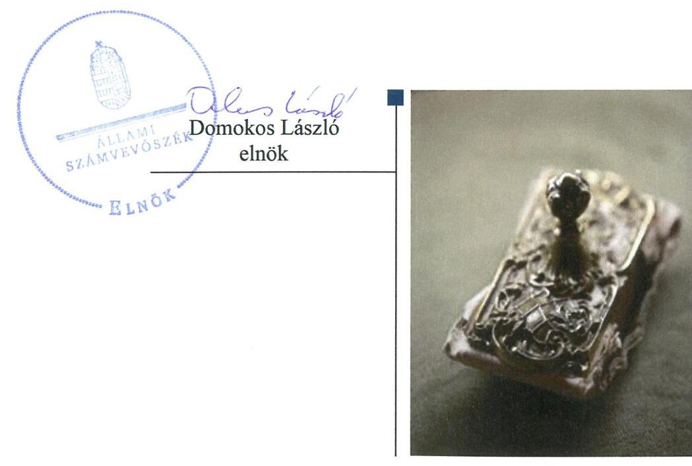
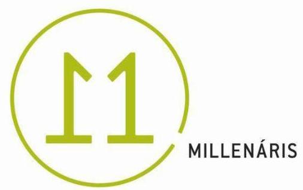
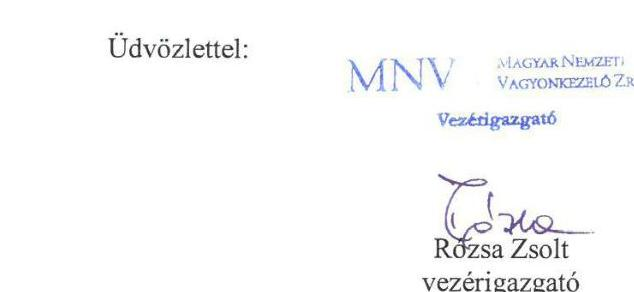
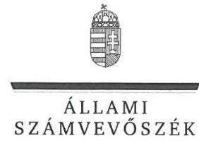
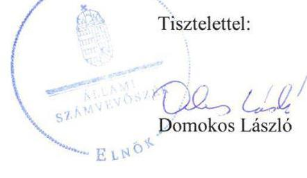

# Jelentés 

## Állami tulajdonú gazdasági társaságok

Az állami tulajdonban lévő gazdálkodó szervezetek vagyonmegőrzési és gazdálkodási tevékenységének ellenőrzése - Millenáris Tudományos Kulturális Nonprofit Kft.
2018.

---

# Jelentés 

## Állami tulajdonú gazdasági társaságok

Az állami tulajdonban lévő gazdálkodó szervezetek vagyonmegőrzési és gazdálkodási tevékenységének ellenőrzése - Millenáris Tudományos Kulturális Nonprofit Kft.
2018. 12. hó 14. nap

---

# AZ ELLENŐRZÉST FELÜGYELTE:

DR. NAGY IMRE felügyeleti vezető

# AZ ELLENŐRZÉST VEZETTE ÉS A VÉGREHAJTÁSÁÉRT FELELŐS:

MODER BEATRIX ellenőrzésvezető

VALASTYÁNNÉ DR. VÍZHÁNYÓ JÚLIA ellenőrzésvezető

# A PROGRAM ÖSSZEÁLLÍTÁSÁÉRT FELELŐS:

TÓTPÁL SZABOLCS osztályvezető

IKTATÓSZÁM: V-1362-175/2016

|  Jelentéseink az Országgyűlés számítógépes hálózatán és az Interneten a www.asz.hu címen is olvashatóak. | TÉMASZÁM: 2470  |
| --- | --- |
|   | ELLENŐRZÉS-AZONOSÍTÓ SZÁM: V081301; V075933  |

---

# TARTALOMJEGYZÉK 

■ ÖSSZEGZÉS ..... 5
■ AZ ELLENŐRZÉS CÉLJA ..... 7
■ AZ ELLENŐRZÉS TERÜLETE ..... 8
■ AZ ELLENŐRZÉS HÁTTERE, INDOKOLTSÁGA ..... 10
■ A JELENTÉS LÉNYEGES KÉRDÉSKÖREI ..... 11
■ AZ ELLENŐRZÉS HATÓKÖRE ÉS MÓDSZEREI ..... 12
■ MEGÁLLAPÍTÁSOK ..... 15
■ JAVASLATOK ..... 22
■ MELLÉKLETEK ..... 25
I. sz. melléklet: Értelmező szótár ..... 25
II. sz. melléklet: A Társaság feletti tulajdonosi joggyakorlás alakulása ..... 30
III. sz. melléklet: A beruházás előkészítéséhez és kivitelezéséhez nyújtott költségvetési támogatások ..... 31
■ FÜGGELÉK: ÉSZREVÉTELEK ..... 33
■ RÖVIDÍTÉSEK JEGYZÉKE ..... 39

---

.

---

# ÖSSZEGZÉS 

A Millenáris Tudományos Kulturális NKft. feletti tulajdonosi joggyakorlás az ellenőrzött időszakban szabályszerű volt. A Millenáris NKft. gazdálkodása és vagyongazdálkodása a 2012-2015. években nem felelt meg a jogszabályi előírásoknak. A 2016. évben a szabályszerű gazdálkodás és vagyongazdálkodás feltételeit kialakították. A vagyongazdálkodás a 2016. évben szabályszerű volt. A közzétételi kötelezettségnek a Társaság hiányosan tett eleget, ezáltal a gazdálkodás nyilvánosságát és ezzel az átláthatóságát nem biztositotta.
A Nemzeti Táncszínház új játszóhelyének kialakítása beruházás döntés-előkészítése megfelelő volt. A Millenáris NKft. szervezeti és müködési folyamatai, belső szabályozottsága a beruházás elszámoltathatóságának biztositása szempontjából kockázatot hordozott.

## Az ellenőrzés társadalmi indokoltsága

Az állami tulajdonú gazdálkodó szervezetek a nemzeti vagyon részét képezik, ezért ellenőrzésük kiemelten fontos a nemzeti vagyon megőrzése, megóvása érdekében. Az állami vagyonnal való gazdálkodás alapvető célja az állami vagyon átlátható, rendeltetésszerű és felelős felhasználásának biztosítása. Kiemelten fontos, hogy a kormányzati szektor elszámolásaiban megjelenő gazdálkodó szervezetek - így a Millenáris NKft. - működése, gazdálkodása szabályszerű, az általuk szolgáltatott adatok megbízhatóak legyenek.

Az Állami Számvevőszék stratégiájában megfogalmazott egyik kiemelt célja, hogy az államháztartáson kívül müködő feladatellátó rendszerek ellenőrzéseivel hozzájáruljon ahhoz, hogy a közpénzeket az államháztartáson kívül müködő szervezetek is átlátható, rendezett módon használják fel a szerződésben átvállalt állami feladatok ellátása érdekében.

Az Állami Számvevőszék az általa korábban ellenőrizetlen területek, szervezetek körébe tartozó társaságnál végzett ellenőrzést. A számvevőszéki ellenőrzés hozzájárul a közpénzek, közvagyon szabályos, átlátható, elszámoltatható és eredményes felhasználásához.

Jelen ellenőrzés hozzájárul továbbá az ÁSZ kockázatértékelő rendszere alapján kiválasztott, államháztartásból származó forrásból finanszírozott beruházások eredményességéhez, a beruházási folyamat transzparenciájának biztosításához a Millenáris NKft-nél, mint „A Nemzeti Táncszínház új játszóhelyének kialakítása" beruházást előkészítő gazdasági társaságnál és a Miniszterelnökségnél.

## Főbb megállapítások, következtetések, javaslatok

I.

A Millenáris NKft. feletti tulajdonosi jogokat az MNV Zrt., a Miniszterelnökség és a Forster Központ szabályszerűen gyakorolta.

A 2012-2015. években a Millenáris NKft. gazdálkodásának szabályozottsága a számlarend, az értékelési szabályzat és az önköltségszámítás rendjére vonatkozó szabályzat hiánya, a számviteli politika hiányosságai és a hiányos leltározási szabályzat miatt nem felelt meg a jogszabályi előírásoknak. A Millenáris NKft. müködésének szabályozottsága a 2016. évben javult, de számlarenddel és közbeszerzési szabályzattal az ellenőrzött időszakban nem rendelkezett.

A Millenáris NKft. vagyongazdálkodása a 2012-2015. években nem volt szabályszerű, míg 2016-ban szabályszerű volt. A 2012-2015. években a vagyonváltozást eredményező döntéseket szabályszerűen hozták meg, azonban a mérlegben kimutatott eszközöket és forrásokat szabályszerű leltárral nem támasztották alá. A 2016. évben az éves beszámolót leltárral alátámasztották.

---

A Millenáris NKft. a számviteli jogszabályokban és a tulajdonosi joggyakorlók által előírt tervezési, beszámolási, adatszolgáltatási kötelezettségét teljesítette. A közérdekű adatok közzétételének, illetve a közérdekű adatok megismerésére irányuló igények teljesítésének rendjét rögzítő szabályzattal nem rendelkeztek, a közzétételi kötelezettségüknek nem szabályszerűen tettek eleget, így a gazdálkodás átláthatóságát nem biztosították.
II.

A Bkr. előírásai ellenére a beruházásra vonatkozóan nem alakított ki a célok megvalósításának nyomon követését biztosító rendszert. A Millenáris NKft. belső ellenőrzést a jogszabályi előírások ellenére a 2014-2016. években nem működtetett. A kontrolltevékenység részeként a beruházási tevékenységre vonatkozóan a szervezeti célok elérését veszélyeztető kockázatok csökkentésére irányuló kontrollok kiépítését, különösen a döntések szabályszerűségi szempontból történő jóváhagyása, illetve ellenjegyzése vonatkozásában nem biztosították.

A Támogató részéről a beruházás döntés-előkészítése, a beruházási folyamat meghatározása az irányadó jogszabályok, közjogi szervezetszabályozó eszközök előírásainak megfelelően történt. A beruházás előkészítéséhez és megvalósításához szükséges költségvetési támogatás és a szakhatósági engedélyek a Társaság rendelkezésre álltak. A beruházás előkészítése keretében megkötött vállalkozási szerződések a helyénvalósági szempontok szerinti követelményeknek nem feleltek meg.

Az Állami Számvevőszék a Millenáris Tudományos Kulturális Nonprofit Kft. ügyvezetőjének 10 javaslatot fogalmazott meg.

---

# AZ ELLENŐRZÉS CÉLJA 

Az ellenőrzés célja annak értékelése volt, hogy a tulajdonosi jogok gyakorlása szabályszerű volt-e; a gazdálkodó szervezet szabályozottsága, gazdálkodása és vagyongazdálkodási tevékenysége megfelelt-e a jogszabályi és a tulajdonosi előírásoknak; biztosítva volt-e a közfeladatok átláthatósága és elszámoltathatósága érdekében a közszolgáltatás dijának megalapozottsága szabályszerű önköltségszámítással; a vagyonváltozást eredményező döntések esetében a tulajdonosi jogok gyakorlója és a gazdálkodó szervezet szabályszerűen jártak-e el. Az ellenőrzés célja volt továbbá annak megítélése, hogy a kormányzati szektorba sorolt állami tulajdonban (résztulajdonban) lévő gazdálkodó szervezetek gazdálkodásának a kormányzati szektor hiányára és az államadósságra befolyással bíró elemei a jogszabályi előírásoknak megfeleltek-e.

Az ellenőrzés célja volt továbbá a beruházás eredményes megvalósulásának elősegítése érdekében, a folyamatban lévő beruházás vonatkozásában, a döntés-előkészítésétől a kivitelezés megkezdéséig felmerülő kockázatok beazonosításának és az integritási szempontok érvényesülésének értékelése.

---

# AZ ELLENŐRZÉS TERÜLETE 

## Millenáris Tudományos Kulturális Nonprofit Korlátolt Felelősségú Társaság

A Millenáris NKft. ${ }^{1}$ jogelődjét 2008. évben 100,0 M Ft²-os jegyzett tőkével alapította a Magyar Állam. A szintén állami tulajdonú Kisrókus 2000 Múemlékvédő Nonprofit Kft. 2009. évi beolvadásával a jegyzett tőkéje 8300,0 M Ft-ra nőtt, amely az ellenőrzött időszakban nem változott. A Millenáris NKft. 2014. május 19-ig közhasznú nonprofit társaságként, azt követően nonprofit társaságként múködött.

A tulajdonosi jogokat 2012. január 1-jétől 2014. december 14-ig az MNV Zrt. ${ }^{3}$, 2014. december 15. és 2015. november 2. között a Miniszterelnökség, 2015. november 3-tól 2016. december 31-ig a Forster Központ gyakorolta, majd 2017. január 1-jétől ismét a Miniszterelnökség volt a tulajdonosi jogok gyakorlója. A Forster Központ feladatellátása tekintetében az ellenőrzést a Miniszterelnökségnél - mint a tulajdonosi joggyakorlás szempontjából jogutód szervezetnél - folytattuk le.

A Millenáris NKft. főtevékenysége az Alapító okirat ${ }_{1-8}{ }^{4}$ szerint a 2012-2014. években múzeumi - közhasznú - tevékenység, azt követően saját és bérelt ingatlan bérbeadása, üzemeltetése volt. Közhasznú tevékenységet ténylegesen a 2012. év végéig végzett. Az alapító célja az volt, hogy a Millenáris Parkban közérdekú és üzleti rendezvényekre is alkalmas kulturális és oktatási központ múködjön.

Az Alapító5 által meghatározott feladatokat a Millenáris NKft. a saját vagyonába tartozó eszközökkel végezte, vagyonkezelésre, hasznosításra átvett állami tulajdonú vagyontárgyai nem voltak. Más gazdasági társaságban részesedéssel, kapcsolt vállalkozással nem rendelkezett. A Millenáris NKft. tevékenysége a 2013-2015. években veszteséges volt. A 2016-os évben a Millenáris NKft. eredményesen gazdálkodott, adózott eredménye 140,8 M Ft volt. A Millenáris NKft.-nél a foglalkoztatottak átlagos statisztikai létszáma 2012-ben 27 fő, a 2016. évben 12 fő volt. Az ügyvezető személye az ellenőrzött időszakban két alkalommal változott. A hivatalban lévő ügyvezető 2017. február 7-től tölti be a vezető tisztségét.

A Millenáris NKft. az NGM ${ }^{6}$ miniszter közleménye alapján az ellenőrzött időszakban kormányzati szektorba sorolt egyéb szervezet volt , amelyre 2014. január 1-jétől a Bkr. ${ }^{7}$ hatálya kiterjedt. A Társaság a Számv. tv. ${ }^{8}$ előírása alapján könyvvizsgálatra kötelezett volt.

A Társaság feletti tulajdonosi joggyakorlás alakulását a II. melléklet szemlélteti.

A 1435/2014. (VII. 31.) Korm. határozatban a Kormány felkérte a Miniszterelnökséget vezető minisztert, hogy tegye meg a szükséges intézkedéseket a Nemzeti Táncszínház Nonprofit Kft. közremúködésével a Nemzeti Táncszínház új játszóhelyének a Millenáris Teátrum épületében történő műszaki kialakítása érdekében. A Társaságnak, mint a Millenáris Teátrum ingatlan tulajdonosának a 1435/2014. (VII. 31.), 1597/2014. (XI. 3.),

---

1277/2016. (VI. 7.) Korm. határozatokhoz kapcsolódó Támogatási Szerződések alapján közfeladata volt a beruházás előkészítési- és megvalósítási tevékenység lebonyolítása. A Támogató a Miniszterelnökség volt. Az ellenőrzött időszak a beruházás első döntés-előkészítésétől a beruházás kivitelezési szakaszának megkezdéséig terjedő időszak volt. Az ellenőrzött időszakban a beruházás előkészítéséhez és kivitelezéséhez nyújtott költségvetési támogatásokat a III. sz. melléklet mutatja be.

---

# AZ ELLENŐRZÉS HÁTTERE, INDOKOLTSÁGA 

Az állami tulajdonú gazdálkodó szervezetek gazdálkodása jellemzően a közérdeklődés és a média figyelmének középpontjában áll, amihez hozzájárul a gazdálkodásuk körébe tartozó - közvetlen vagy közvetett állami tulajdonú - vagyon nagysága, illetve az általuk ellátott közszolgáltatások minősége és hatékonysága.

Az Európai Unióban az 1994. év óta hatályos túlzott hiány eljárás mindig kihívást jelentett a tagállamok számára. Kiemelten fontosak a kormányzati szektor elszámolásaiban megjelenő állami tulajdonú gazdálkodó szervezetek, amelyekkel szemben alapvető követelmény, hogy gazdálkodásuk, múködésük szabályszerű, az általuk szolgáltatott adatok minél megbízhatóbbak legyenek.

Az ÁSZ ${ }^{9}$ célkitűzése, hogy ellenőrzésével rámutasson az állami tulajdonú gazdálkodó szervezetek gazdálkodási tevékenységével kapcsolatos jó gyakorlatra és szabálytalanságokra, hozzájáruljon az államháztartáson kívüli, de (közvetlenül vagy közvetve) állami vagyont használó gazdálkodó szervezetek tevékenységének átláthatóságához, valamint felhívja a figyelmet a jogszabályi követelmények teljesítéséhez szükséges feltételek hiányosságára.

Az ellenőrzés várható hasznosulásaként az ellenőrzés megállapításai a jogalkotás számára segítséget nyújthatnak az átláthatóságot biztosító szabályozáshoz. Az ellenőrzöttek számára visszajelzést ad a vagyongazdálkodási tevékenységgel, beszámolással kapcsolatos szabálytalanságokról és kockázatokról. Az ellenőrzés tapasztalatai segítik és erősítik az ÁSZ hozzáadott értéket teremtő elemző tevékenységét és tanácsadó szerepét.

A beruházások előkészítésére fókuszáló ellenőrzés megállapításainak hasznosításaként lehetőség nyílhat még a beruházás folyamatában a feltárt hiányosságok, szabálytalanságok megszüntetéséhez szükséges korrekciók megtételére, a kontrollok erősítésére.

Jelen ellenőrzés ezáltal hozzájárulhat az ÁSZ kockázatértékelő rendszere alapján kiválasztott, államháztartásból származó forrásból finanszírozott beruházások eredményességéhez, a beruházási folyamat transzparenciájának biztosításához.

Az ellenőrzés eredményeinek célzott felhasználói a nyilvánosság, valamint a beruházások előkészítésében és megvalósításában résztvevő szervezetek.

---

# A JELENTÉS LÉNYEGES KÉRDÉSKÖREI 

1. A tulajdonosi jogok gyakorlása szabályszerű volt-e?
2. A Társaság müködésének szabályozottsága megfelelt-e az előírásoknak?
3. A Társaságnál a gazdálkodási, vagyongazdálkodási, adatszolgáltatási és ellenőrzési feladatok ellátása szabályszerű volt-e?
4. A beruházás döntés-előkészítése, a beruházási folyamat meghatározása az irányadó jogszabályok, közjogi szervezet szabályozó eszközök előírásainak megfelelően történt-e?
5. A Társaság szervezeti és müködési folyamatai, belső szabályozottsága alkalmas volt-e a beruházás átláthatóságának, elszámoltathatóságának biztositására?

---

# AZ ELLENŐRZÉS HATÓKÖRE ÉS MÓDSZEREI 

## Az ellenőrzés típusa

Megfelelőségi ellenőrzés.

## Az ellenőrzött időszak

Az ellenőrzött időszak 2012. január 1-2016. december 31.
A beruházás tekintetében az ellenőrzött időszak a 2014-2016. évi központi költségvetésben megjelenő beruházás első döntés-előkészítésétől, a 1435/2014. (VII. 31.) Korm. határozat kiadásától, 2014. július 31-től a beruházás kivitelezési szakaszának megkezdéséig, 2017. január 18-ig terjedő időszak.

## Az ellenőrzés tárgya

A Millenáris Tudományos Kulturális Nonprofit Kft. gazdálkodása, kiemelten vagyongazdálkodási tevékenysége, a tulajdonosi jogok gyakorlása, továbbá a kormányzati szektorba sorolt gazdasági társaság gazdálkodásának a kormányzati szektor hiányára és az államadósságra befolyással bíró elemei.

Az ellenőrzés kiterjedt minden olyan körülményre és adatra, amely az ÁSZ jogszabályban meghatározott feladatainak teljesítéséhez, valamint a program végrehajtása folyamán felmerült újabb összefüggések feltárásához szükséges volt.

Az ellenőrzés tárgyát képezték a beruházás döntés-előkészítését beterjesztő és a beruházást előkészítő gazdasági társaság döntés-előkészítési és beruházás előkészítési tevékenységének múködési folyamatai, azok belső szabályozottsága, a kivitelezés előkészítésének megfelelősége.

Az ellenőrzés kiterjedt továbbá minden olyan körülményre és adatra, amely az ÁSZ jogszabályban meghatározott feladatainak teljesítéséhez, valamint a program végrehajtása folyamán felmerült újabb összefüggések feltárásához szükséges volt.

## Az ellenőrzött szervezet

Millenáris Tudományos Kulturális Nonprofit Korlátolt Felelősségű Társaság, Magyar Nemzeti Vagyonkezelő Zrt., Miniszterelnökség.

---

# Az ellenőrzés jogalapja 

Az ellenőrzés jogalapját az ÁSZ tv. ${ }^{10} 1 . \S$ (3) bekezdése és 5. § (2)-(5) bekezdései képezték.

## Az ellenőrzés módszerei

Az ellenőrzést az ellenőrzött időszakban hatályos jogszabályok, az ellenőrzés szakmai szabályok és módszertanok figyelembevételével végeztük.

Az ellenőrzési kérdések megválaszolásához szükséges bizonyítékok megszerzése a következő ellenőrzési eljárások alkalmazásával történt: megfigyelés, kérdésfeltevés (információkérés), összehasonlítás, valamint elemző eljárás. Az ellenőrzési bizonyítékként felhasználható adatforrások közé tartoztak egyrészt az ellenőrzési programban felsorolt adatforrások, másrészt az ellenőrzés során feltárt, az ellenőrzés szempontjából információkat tartalmazó dokumentumok.

A bevételek és ráfordítások elszámolását, valamint a vagyonnyilvántartás szabályszerűségét véletlen mintavétellel ellenőriztük. A mintatételek értékelése alapján, egyrészt a sokaságban előforduló hibás tételek arányát becsültük, másrészt az irányítottan kiválasztott tételeket értékeltük. A jogszabályoknak és a belső előírásoknak megfelelőnek, azaz szabályszerűnek tekintettük az adott területet, amennyiben a minta ellenőrzésének eredménye alapján 95\%-os bizonyossággal a teljes sokaságban a hibaarány kisebb volt, mint 10\%, nem megfelelőnek értékeltük, ha a hibaarány a 10\%ot meghaladta. A ráfordítások elszámolására és a vagyonnyilvántartásra vonatkozó véletlen mintavételt kockázati alapú kiválasztással egészítettük ki, amelynek során évente a három legnagyobb összegű tételt választottuk ki.

Az ellenőrzést az ellenőrzési program szempontjai, kérdései, az ellenőrzött időszakban hatályos jogszabályok, az ellenőrzés szakmai szabályai, az ÁSZ megfelelőségi ellenőrzési módszertana alapján kellett elvégezni.

Az ellenőrzés ideje alatt az ellenőrzött szervezettel történő kapcsolattartást az ÁSZ Szervezeti és Működési Szabályzatának vonatkozó előírásai alapján biztosítottuk.

A program ellenőrzési szempontjait a szabályszerűségi szempontok szerinti ellenőrzésben a jogszabályi, a közjogi szervezetszabályozó eszközök, további belső utasítások, belső szabályozók előírásai, a helyénvalósági szempontok szerinti ellenőrzésben az ÁSZ ellenőrzései során beazonosított „jó gyakorlatok" és általánosan elfogadott szakmai szabályok alapján határoztuk meg.

Az ellenőrzési kérdések megválaszolásához szükséges bizonyítékok megszerzése a következő ellenőrzési eljárások alkalmazásával történt: megfigyelés, kérdésfeltevés (információkérés), összehasonlítás, valamint elemző eljárás. Az ellenőrzési bizonyítékként felhasználható adatforrások közé tartoztak egyrészt az ellenőrzési programban felsorolt adatforrások, másrészt adatforrás lehetett még minden - az ellenőrzés folyamán - feltárt, az ellenőrzés szempontjából információkat tartalmazó dokumentum.

---

Az ellenőrzés során minden olyan körülményt és adatot is ellenőrizni kellett, amely a program végrehajtása kapcsán felmerült újabb összefüggéseknek az ellenőrzés céljaival összhangban lévő feltárásához szükséges volt.

Tekintettel arra, hogy lényeges sokaság elemszáma kisebb volt, mint az előírt minta-elemszám tételesen ellenőriztük a beruházás előkészítése keretében megkötött vállalkozási szerződések jogszabályi és belső előírásoknak való megfelelőségét és a kötelezően közzéteendő adatok nyilvánosságra hozatalának szabályszerűségét.

Minden egyes tétel vonatkozásában a szabályszerűségre vonatkozó kérdéseket tettünk fel, amelyek eredménye összesítésre került. „Szabályszerűnek" értékeltünk egy ellenőrzött területet, amennyiben 95\%-os bizonyossággal a lényeges sokaságban az átlagos hibaarány legfeljebb 10\%, „nem szabályszerűnek", amennyiben 10\%-nál magasabb arányt képviselt.

---

# 1. A tulajdonosi jogok gyakorlása szabályszerű volt-e? 

Összegző megállapítás

Az MNV Zrt., a Miniszterelnökség és a Forster Központ a tulajdonosi jogokat szabályszerűen gyakorolta.

A TULAJDONOSI JOGGYAKORLÁS RENDJÉT az MNV Zrt. Igazgatósága az Alapító okirat ${ }_{1-5}$-ban, az MNV Zrt. SZMSZ ${ }_{1-4}$-ben ${ }^{11}$, a Monitoring szabályzatban ${ }^{12}$ és a tulajdonosi ellenőrzések rendjére vonatkozó szabályzat ${ }_{1-3}$-ban ${ }^{13}$ határozta meg. A Vtv. ${ }^{14}$ és az MNV Zrt. SZMSZ ${ }_{1-4}$ előírásával összhangban a tulajdonosi jogokat az MNV Zrt. Igazgatósága gyakorolta. A Miniszterelnökség a tulajdonosi jogok gyakorlásának rendjét az Alapító okirat ${ }_{5,6}$-ban és a Miniszterelnökségi SZMSZ ${ }^{15}$-ben határozta meg, a Millenáris NKft. feletti tulajdonosi jogok gyakorlására a Miniszterelnökség parlamenti államtitkára rendelkezett felhatalmazással. A Forster Központ SZMSZ ${ }^{16}$-e tartalmazta, hogy az elnök felel a Forster Központ tulajdonosi jogainak rendeltetésszerű gyakorlásáért.

A tulajdonosi joggyakorló ${ }_{1-3}{ }^{17}$ alapítói hatáskörben - a Gt. ${ }^{18}$ és a Ptk. ${ }^{19}$ előírásaival összhangban - az Alapító okirat ${ }_{1-8}$-ban és az alapítói határozattal jóváhagyott társasági SZMSZ ${ }_{1-4}$-ben ${ }^{20}$ meghatározta a feladatellátás követelményeit, a kizárólagos jogkörébe tartozó döntéseket, az ügyvezető feladat- és hatáskörét. Az ügyvezetés ellenőrzésére a Taktv. ${ }^{21}$, a Gt. és a Ptk. ${ }_{2}$ előírásaival összhangban három tagú $\mathrm{FB}^{22}$-t működtetett és alapítói határozattal megválasztotta a könyvvizsgáló ${ }_{1-3}{ }^{23}$-t.

A tulajdonosi joggyakorló ${ }_{1-3}$ a hatásköreit a Gt. és a Ptk. ${ }_{2}$, illetve az Alapító okirat ${ }_{1-8}$ előírásainak megfelelően gyakorolta. Az FB javaslata alapján Alapítói határozattal jóváhagyta a Millenáris NKft. üzleti terveit, valamint a könyvvizsgáló és az FB beszámolóról készített írásbeli jelentésének birtokában - az éves számviteli beszámolóit.

A MONITORING TEVÉKENYSÉGET az MNV Zrt. az ellenőrzött időszakban a Monitoring szabályzatának megfelelően működtette, a gazdálkodás alakulását folyamatosan nyomon követte és értékelte. A Miniszterelnökség az előírt negyedéves adatszolgáltatás alapján és az ügyvezető beszámoltatásával tájékozódott a Társaság működéséről. A Forster Központ monitoring tevékenysége a 2015. évi I-III. negyedéves beszámoló és az éves számviteli beszámoló megtárgyalásán keresztül valósult meg.

A JAVADALMAZÁSI SZABÁLYZAT ${ }_{1-3}{ }^{24}$-ot a tulajdonosi joggyakorló a Taktv. előírásainak megfelelően megalkotta és alapítói határozattal elfogadta.

---

# 2. A Társaság múködésének szabályozottsága megfelelt-e az előírásoknak? 

Összegző megállapítás

A Millenáris NKft. múködésének szabályozottsága a 2012-2015. években nem volt szabályszerű, a 2016. évben múködésének szabályozottsága javult.

A TÁRSASÁGI SZMSZ ${ }_{1-4}$ az Alapító okirat ${ }_{1-8}$ előírásaival összhangban biztosította a Millenáris NKft. szabályozott múködésének kereteit. Tartalmazta a tevékenységi kört, a képviselet és a cégjegyzés módját, a szervezeti felépítést, a szervezeti egységek feladat- és hatáskörét.

A SZÁMVITELI POLITIKA ${ }_{1}{ }^{25}$ aktualizálása a Számv. tv. 14. § (11) bekezdésének, illetve a Számviteli politikában foglalt, évenkénti felülvizsgálatra vonatkozó előírása ellenére a 2012-2015. években nem történt meg, emiatt a társaság megnevezését, társasági formáját, valamint a 2014. évtől a közhasznú szervezetre vonatkozó előírásokat nem a valós állapotnak megfelelően tartalmazta.

A 2012. és 2015. közötti időszakban a Számv. tv. 14. § (5) bekezdés b) és c) pontjában, valamint 161. § (1) bekezdésében foglalt előírások ellenére a Millenáris NKft. nem rendelkezett eszközök és források értékelési szabályzatával, önköltségszámítás rendjére vonatkozó szabályzattal, valamint számlarenddel. A Számv. tv. 161/A. § (1)-(2) bekezdése ellenére nem alakították ki a könyvvezetésre, bizonylatolásra vonatkozó részletes belső szabályokat a kiegészítő melléklet adatainak közvetlen alátámasztására alkalmas módon.

A számviteli szabályzatokat a 2016. évben a Millenáris NKft. - a számlarend kivételével - a jogszabályi előírások szerint megalkotta. A 2016. évben a számlarendet a Számv. tv. 161. § (1) bekezdésében foglaltakat megsértve nem készítették el.

A 2012-től 2015-ig terjedő időszakban a leltározási szabályzat ${ }_{1}{ }^{26}$-ban meghatározták a leltározás lebonyolításának és dokumentálásának bizonylati rendjét és felelőseit, azonban a Számv. tv. 69. § (1)-(3) bekezdéseiben foglalt előírások érvényesítéséhez szükséges szabályokat nem határozták meg, mivel nem rendelkeztek egyértelműen, minden eszköz és forrás csoportra kiterjedően, a mérlegben kimutatott eszközök és források leltározásának gyakoriságáról. A 2016. évben a leltározási szabályzat ${ }_{2}$ - ban foglaltak megsértették a Számv. tv. 69. § (3) bekezdésében foglaltakat, mivel a tárgyi eszközök mennyiségi felvétellel történő leltározásának gyakoriságát 3 év helyett 5 évenként írták elő.

A számviteli szabályzatok hiányosságai ellenére a könyvvizsgáló ${ }_{1-2}$ az ellenőrzött időszakban a Társaság számviteli beszámolóit korlátozás nélküli hitelesítő záradékkal látta el. A 2016. évben a könyvvizsgáló ${ }_{3}$ jelentését figyelemfelhívással látta el a számviteli politikában meghatározott értékcsökkenési leírás pontosítása miatt.

A pénzkezelési szabályzat ${ }^{27}$ megfelelt a Számv. tv. előírásainak.
ÖNKÖLTSÉGSZÁMÍTÁS rendjére vonatkozó szabályzatát a Millenáris NKft. csak a 2016. évben alakította ki, a 2012-2015. évben a

---

Számv. tv. 14. § (5) bekezdés c) pont előírása ellenére nem készített. A Millenáris NKft. a 2016. évben Önköltségszámítási szabályzatát ${ }^{28}$ a jogszabályi előírásoknak megfelelően elkészítette, és szolgáltatásainak önköltségét a 2016. évben a szabályzatban foglalt elő-, közbenső- és utókalkulációkkal támasztotta alá.

Közbeszerzési szabályzattal a Társaság az ellenőrzött időszakban a Kbt. ${ }^{29}$ 22. § (1)-(2) bekezdése, valamint a Kbt. ${ }^{30}$ 27. § (1)-(2) bekezdése előírásai ellenére nem rendelkezett.

# 3. A Társaságnál a gazdálkodási, vagyongazdálkodási, adatszolgáltatási és ellenőrzési feladatok ellátása szabályszerű volt-e? 

Összegző megállapítás

A Társaságnál a gazdálkodási feladatok ellátása nem volt szabályszerű. A vagyongazdálkodás a 2012-2015. években nem volt szabályszerű, a 2016. évben szabályszerű volt. A Társaság tervezési és beszámolási kötelezettségének eleget tett, azonban közzétételi kötelezettségét nem teljesítette.
3.1. számú megállapítás

A 2012-2015. években a bevételek elszámolása megfelelt, a ráfordítások elszámolása nem felelt meg a jogszabályi előírásoknak. A 2016. évben a bevételek és ráfordítások elszámolása nem volt szabályszerű.

A BEVÉTELEK és a kormányzati hiányt befolyásoló bevételek elszámolása a 2012-2015. években szabályszerű volt. Az árbevételek kiszámlázása a szerződésekben foglaltak szerint történt. A 2016. évben az értékesítés nettó árbevételének elszámolása nem volt szabályszerű, a Számv. tv. 167. § (1) bekezdésének h) pontjában előírt könyvelés módjára, az érintett könyvviteli bizonylatokra történő hivatkozás nem volt megfelelő.

AZ ANYAGJELLEGŰ RÁFORDÍTÁSOK, és a kormányzati hiányt befolyásoló ráfordítások, valamint az egyéb, a rendkívüli és a pénzügyi műveletek ráfordításainak elszámolása a 2012-2016. években nem volt szabályszerű.

A 2012. évi közhasznú tevékenység és a vállalkozási tevékenységek ráfordításait - a közvetlen anyagköltség kivételével - nem különítették el, így a Számv. tv. 161/A. § (2) bekezdésének előírása ellenére nem biztosították a közhasznúsági melléklet eredmény-kimutatásának szabályszerű elkészítéséhez szükséges adatokat. A 2012. - 2015. években a bizonylatok nem feleltek meg az előírt tartalmi követelményeknek, mivel a Számv. tv. 167. § (1) bekezdésének c) pontjában előírtak ellenére nem tartalmazták a műveletet elrendelő személy, illetve a rendelkezés végrehajtását igazoló személy aláírását. A Számv. tv. 167. § (1) bekezdésének h) pontja szerinti, a könyvelés módjára, az érintett könyvviteli számlákra történő hivatkozás nem volt megfelelő. A ráfordítások elszámolását alátámasztó bizonylatok a 2016-os évben nem álltak rendelkezésre, amivel megsértették a Számv. tv. 165. § (1) bekezdésében foglaltakat.

---

A SZEMÉLYI JELLEGŰ RÁFORDÍTÁSOK elszámolása a Számv. tv. és a Számviteli politika előírásainak megfelelt.

AZ ÉRTÉKCSÖKKENÉSI LEÍRÁS elszámolása a 2012-2015. években megfelelően történt, az állományba vétel, üzembe helyezés és az értékcsökkenési leírás alapját képező bekerülési érték megállapítása szabályszerű volt. A számviteli beszámolók kiegészítő mellékletében azonban a Számv. tv. 92. § (2) bekezdésének előírása ellenére nem mutatták be az elszámolt értékcsökkenést az előírt részletezésben, valamint az elszámolt terven felüli értékcsökkenés összegét.

A 2016. évben az értékcsökkenés elszámolása nem volt szabályszerű. Az értékcsökkenés elszámolásának alapját képező bekerülési érték alátámasztását nem szabályszerűen kiállított bizonylatok alapján végezték el, ezzel megsértették a Számv. tv. 165. § (2) bekezdésében foglaltakat.

A Millenáris NKft. gazdálkodásának a kormányzati szektor hiányára és az államadósságra befolyással bíró elemei nem gyakoroltak hatást a kormányzati szektor hiányára.

# 3.2. számú megállapítás 

A Millenáris NKft. vagyongazdálkodása a 2012-2015. években nem volt szabályszerű, a 2016. évben szabályszerű volt.

A VAGYON NYILVÁNTARTÁSA a 2012-2015. években nem volt szabályszerű. A számviteli beszámolók mérlegét a Számv. tv. 69. § (1) bekezdésének előírása ellenére, az eszközöket és forrásokat tételesen, mennyiségben és értékben ellenőrizhető módon tartalmazó leltárral nem támasztották alá. A 2012-2013. évekre vonatkozó leltárdokumentumok a tárgyi eszközöket és a kis értékű eszközöket tartalmazták, az egyéb eszközök (készletek, követelések, pénzeszközök, stb.) és a források mérlegértékét leltárdokumentumokkal nem támasztották alá. A 2014-2015. évi beszámolók mérlegét alátámasztó, a tárgyi eszközökre vonatkozó leltárdokumentumok az egyes tárgyi eszköz-csoportokra csak összesített értékadatokat tartalmaztak, tételes, egyedi mennyiségi és érték adatokat azonban nem. A 2016. évben a Társaság vagyonát leltárral alátámasztották.

## A VAGYON VÁLTOZÁSÁT EREDMÉNYEZŐ DÖNTÉ-

SEK vonatkozásában az Alapító okirat ${ }_{1-8}$ szerinti döntési hatásköröket betartották.
3.3. számú megállapítás

A Millenáris NKft. a tervezési, beszámolási kötelezettségének a jogszabályi és tulajdonosi előírásoknak megfelelően eleget tett. A Társaság a jogszabályi előírásokban előírt közzétételi kötelezettségének nem tett eleget.

Az Alapító okirat ${ }_{1-8}$-ban, a társasági SZMSZ ${ }_{1,2}$-ben és a tulajdonosi joggyakorló ${ }_{1-3}$ által előírt tervezési, beszámolási, adatszolgáltatási és egyéb tájékoztatási kötelezettségeit a Társaság az előírt rendszerességgel, határidőre teljesítette.

AZ ÉVES ÚZLETI TERVEKET a Millenáris NKft. a tulajdonosi joggyakorló ${ }_{1-3}$ elvárásaival összhangban elkészítette, amelyeket az FB elfogadást javasoló határozataival a tulajdonosi joggyakorlók részére benyújtott, azok elfogadása alapítói határozatokkal megtörtént.

---

AZ ÉVES SZÁMVITELI BESZÁMOLÓKAT és a közhasznú jogállás időszakára - a 2012-2014. évekre - a közhasznúsági mellékletet a Millenáris NKft. a Civil tv. ${ }^{31}$ előírásai szerint, határidőben elkészítette. Az alapítói határozatokkal elfogadott nem közhasznú éves számviteli beszámolók letétbe helyezése és közzététele a Számv. tv. előírásainak megfelelően, határidőben megtörtént.

A KÖZÉRDEKŰ ADATOK közzétételének rendjét az Info tv. ${ }^{32}$ 35. § (3) bekezdés előírása ellenére a Társaság nem szabályozta, az Info tv. 30. § (6) bekezdésében előírtak ellenére a közérdekú adatok megismerésére irányuló igények teljesítésének rendjét rögzítő szabályzatot nem készített.

A Társaság az Info tv. 37. § (1) bekezdésben és a Taktv. 2. § (1) bekezdésében előírt közzétételi kötelezettségének nem tett eleget, mivel a 2012. és a 2016. évi beszámolóit, valamint a 2012-2016. évekre vonatkozóan az FB tagok és a Mt. ${ }^{33}$ szerinti vezető állású munkavállalók adatait honlapján nem tette közzé.
3.4. számú megállapítás

A 2014-2016. években a belső ellenőrzés múködtetéséről nem gondoskodtak. A Társaság a szervezet tevékenységének, a célok megvalósításának nyomon követését biztosító rendszert nem alakított ki.

A társasági SZMSZ ${ }_{1,2}$ rögzítette a belső ellenőrzés feladatait. A belső ellenőr a 2012-2013. években két alkalommal végzett eseti ellenőrzést, amelyek során javaslatokat nem fogalmazott meg.

A Millenáris NKft., mint kormányzati szektorba sorolt egyéb szervezet, a Bkr. 1. § (2) bekezdés d) pontja és 10. § előírása ellenére 2014. január 1jétől 2016. december 31-ig nem gondoskodott a szervezet tevékenységének, a célok megvalósításának nyomon követését biztosító rendszer kialakításáról.

A Bkr. 6. § (3) bekezdés előírásai ellenére az ügyvezető nem készítette el a Társaság ellenőrzési nyomvonalát.
2014. január 1-jétől 2016. szeptember 30-ig a Bkr. 6. § (4) előírásai ellenére a Társaság ügyvezetője a szabálytalanságok kezelésének eljárásrendjét nem szabályozta.

A Bkr. 7. § (1) bekezdés előírásai ellenére az ügyvezető 2014. január 1jétől 2016. szeptember 30-ig kockázatkezelési rendszert, 2016. október 1jétől integrált kockázatkezelési rendszert nem alakított ki és nem múködtetett.

---

# 4. A beruházás döntés-előkészítése, a beruházási folyamat meghatározása az irányadó jogszabályok, közjogi szervezet szabályozó eszközök előírásainak megfelelően történt-e? 

Összegző megállapítás

A beruházás döntés-előkészítése, a beruházási folyamat meghatározása az irányadó jogszabályok, közjogi szervezetszabályozó eszközök előírásainak megfelelően történt. A beruházás előkészítéséhez és megvalósításához szükséges szakhatósági engedélyek rendelkezésre álltak.

A BERUHÁZÁSRÓL az ME ${ }^{34}$ 2014. július 3-ai dátummal Előterjesztést ${ }^{35}$ készített a Kormány részére. Az Előterjesztés megfelelt a 1144/2010. (VII. 7.) Korm. határozat ${ }^{36}$ II. 10. a) és c) pontjának. Az Előterjesztés 1. mellékletében tartalmazta a döntési javaslatot, amely a Kormány 1435/2014. (VII. 31.) Korm. határozatában megjelent.

A beruházáshoz szükséges központi költségvetési források biztosítása minden esetben a beruházási döntés (Kormányhatározatok) szerint történt. Az előkészítéshez szükséges költségvetési források rendelkezésre bocsátása támogatási szerződések keretében történt, minden forráskijelöléshez kapcsolódott támogatási szerződés. Az ellenőrzött időszakban a támogatott cél megvalósításának ütemét, határidejét, illetve az eredetileg megítélt támogatás összegét kormányzati hatáskörben, kormányhatározat alapján Támogatási szerződés ${ }_{1,2}{ }^{37}$-ek keretében a szerződésekhez csatolt támogatotti kérelem alapján módosították.

## A MILLENÁRIS TERÜLETÉN MEGVALÓSÍTANDÓ

egyes beruházásokkal összefüggő közigazgatási hatósági ügyek kiemelt jelentőségű üggyé nyilvánításáról és az eljáró hatóságok kijelöléséről szóló 395/2014. (XII. 31.) Korm. rendelet az ingatlanon új kulturális központ, valamint park kialakítására irányuló, beruházásokkal összefüggő közigazgatási hatósági ügyeket nemzetgazdasági szempontból kiemelt jelentőségű üggyé nyilvánította. A szakhatósági engedélyek a megvalósítás tervezett ütemezése szerint rendelkezésre álltak.

---

# 5. A Társaság szervezeti és müködési folyamatai, belső szabályozottsága alkalmas volt-e a beruházás átláthatóságának, elszámoltathatóságának biztosítására? 

## A Társaság szervezeti és müködési folyamatai, belső szabályozottsága a beruházás átláthatósága, elszámoltathatósága vonatkozásában kockázatot hordozott.

A Társaság szervezeti és müködési folyamatai, belső szabályozottsága a beruházás átláthatósága, elszámoltathatósága vonatkozásában helyénvalósági szempontok szerint kockázatot hordozott. A kontrollkörnyezet kialakítása során belső szabályzatban külön a beruházási tevékenységhez kapcsolódó kontrolltevékenységeket nem határoztak meg. A Társaság 2014. évtől belső szabályzataiban a felelősségi körök meghatározásával a beruházási tevékenység tekintetében az engedélyezési, jóváhagyási és kontrollelljárásokat nem szabályozta. 2016. október 1-jétől a kontrolltevékenység részeként a beruházási tevékenységre vonatkozóan nem biztosította a szervezeti célok elérését veszélyeztető kockázatok csökkentésére irányuló kontrollok kiépítését, különösen a döntések szabályszerűségi szempontból történő jóváhagyása, illetve ellenjegyzése vonatkozásában.

A Társaság a lebonyolítói, műszaki ellenőri, vállalkozói, ennek keretében a tervezői feladatok ellátására 18 vállalkozási szerződést kötött. A beruházás előkészítése keretében megkötött vállalkozási szerződések a helyénvalósági szempontok szerinti követelményeknek nem feleltek meg, mert minden szerződésnél, mint pénzügyi döntésnél hiányzott az ellenjegyzés. A jogi személlyel, jogi személyiséggel nem rendelkező szervezettel kötött visszterhes szerződés esetén hiányzott a szervezet képviselőjének nyilatkozata arra vonatkozóan, hogy átlátható szervezetnek minősül, illetve a szerződésekben egy kivételével nem kerültek rögzítésre a többletmunka igénybevételére vonatkozó feltételek, amely a beruházás eredményes megvalósítása szempontjából kockázatot jelentett.

---

# JAVASLATOK 

Az ÁSZ tv. 33. § (1) bekezdésében foglaltak értelmében az ellenőrzött szervezet vezetője köteles a jelentésben foglalt megállapításokhoz kapcsolódó intézkedési tervet összeállítani és azt a jelentés kézhezvételétől számított 30 napon belül az ÁSZ részére megküldeni. Amennyiben az ellenőrzött szervezet vezetője nem küldi meg határidőben az intézkedési tervet, vagy továbbra sem elfogadható intézkedési tervet küld, az Állami Számvevőszék elnöke az ÁSZ tv. 33. § (3) bekezdése a) és b) pontjaiban foglaltakat érvényesítheti.

## a Millenáris Tudományos Kulturális Nonprofit Kft.   Ügyvezetőjének

1. Intézkedjen a számlarend jogszabályi rendelkezéseknek megfelelő elkészitéséről.
(2. sz. megállapítás 4. bekezdés 2. mondata alapján)
2. Biztosítsa a leltározási szabályzat jogszabályban foglalt követelményeknek való megfelelését.
(2. sz. megállapítás 5. bekezdés 2. mondata alapján)
3. Intézkedjen a közbeszerzési szabályzat elkészitéséről.
(2. sz. megállapítás 9. bekezdése alapján)
4. Intézkedjen a számviteli elszámolások szabályszerű végrehajtására, ezen belül a bevételek, az anyagjellegú ráfordítások, egyéb ráfordítások, a pénzügyi múveletek ráfordításai, a kormányzati hiányt befolyásoló ráfordítások és az értékcsökkenés elszámolása tekintetében a jogszabályi előírások betartására.
(3.1. sz. megállapítás 1. bekezdés 3. mondata, a 2-3. bekezdései és a 6. bekezdése alapján)
5. Intézkedjen a jogszabályban foglaltak alapján, a közérdekú adatok közzétételének rendjét rögzítő szabályzat elkészítéséről.
(3.3. sz. megállapítás 4. bekezdés 1. tagmondata alapján)
6. Intézkedjen a jogszabályban foglaltak alapján, a közérdekú adatok megismerésére irányuló igények teljesítésének rendjét rögzítő szabályzat elkészítéséről.
(3.3. sz. megállapítás 4. bekezdés 2. tagmondata alapján)

---

7. Gondoskodjon a közzétételi kötelezettségek jogszabályi előírásnak megfelelő teljesítéséről.
(3.3. sz. megállapítás 5. bekezdése alapján)
8. Intézkedjen a szervezet tevékenységének, a célok, megvalósitásának nyomon követését biztositó rendszer kialakításáról.
(3.4. sz. megállapítás 2. bekezdése alapján)
9. Intézkedjen a Társaság ellenőrzési nyomvonalának elkészitéséről.
(3.4. sz. megállapítás 3. bekezdése alapján)
10. Intézkedjen az integrált kockázatkezelési rendszer kialakításáról és müködtetéséről.
(3.4. sz. megállapítás 5. bekezdése alapján)

---

.

---

# MELLÉKLETEK 

## I. SZ. MELLÉKLET: ÉRTELMEZŐ SZÓTÁR

állami vagyon
állami vagyon kezelése/hasznosítása
állami vagyon hasznosítására kötött szerződés
állami vagyon értékesítése
gazdasági társaság
gazdálkodó szervezet
a) Az állam tulajdonában lévő dolog, valamint a dolog módjára hasznosítható természeti erő,
b) az a) pont hatálya alá nem tartozó mindazon vagyon, amely vonatkozásában törvény az állam kizárólagos tulajdonjogát nevesíti,
c) az állam tulajdonában lévő tagsági jogviszonyt megtestesítő értékpapír, illetve az államot megillető egyéb társasági részesedés,
d) az államot megillető olyan immateriális, vagyoni értékkel rendelkező jogosultság, amelyet jogszabály vagyoni értékű jogként nevesít.
Forrás: Vtv. 1. § (2) bekezdése
2012. november 10-től az állami vagyon fogalma kiegészül a következő ponttal:
e) az állam tulajdonában lévő pénzügyi eszközök

Forrás: Vtv. 1. § (2) bekezdése
2013. június 27-ig:

Az állami vagyont az MNV Zrt. maga kezeli, vagy szerződés - így különösen bérlet, haszonbérlet, megbízás - alapján központi költségvetési szervnek, természetes vagy jogi személynek, vagy jogi személyiséggel nem rendelkező gazdálkodó szervezetnek hasznosításra átengedi. Az állami vagyonra vonatkozóan az MNV Zrt. kizárólag az Nvtv ${ }^{38}$-ben meghatározott személyekkel köthet vagyonkezelési szerződést.
Forrás: Vtv. 23. § (1), 27. § (1)
2013. június 28-ától:

Az állami vagyonnal az MNV Zrt. maga gazdálkodik, vagy szerződés - így különösen bérlet, haszonbérlet, megbízás - alapján központi költségvetési szervnek, természetes vagy jogi személynek, vagy jogi személyiséggel nem rendelkező gazdálkodó szervezetnek hasznosításra átengedi, illetőleg vagyonkezelésbe, haszonélvezetbe adja. Az állami vagyonra vonatkozóan az MNV Zrt. kizárólag az Nvtv-ben meghatározott személyekkel köthet vagyonkezelési szerződést.
Forrás: Vtv. 23. § (1), 27. § (1)
Az állami vagyon hasznosítására kötött szerződések elsődleges célja az állami vagyon hatékony működtetése, állagának védelme, értékének megőrzése, illetve gyarapítása, az állami és közfeladatok ellátásának elősegítése.
Forrás: Vtv. 23. § (2) bekezdése
Állami vagyon tulajdonjogának bármely jogcímen történő, visszterhes átruházása.
Forrás: Vhr. ${ }^{39}$ 1. § (7) bekezdés d) pont)
A Ptk2. 3:88. § (1) bekezdése szerint „a gazdasági társaságok üzletszerű közös gazdasági tevékenység folytatására, a tagok vagyoni hozzájárulásával létrehozott, jogi személyiséggel rendelkező vállalkozások, amelyekben a tagok a nyereségből közösen részesednek, és a veszteséget közösen viselik".
2014. március 14-ig:

A Ptk. ${ }^{40}$ 685. § c) pontja szerint gazdálkodó szervezet: „az állami vállalat, az egyéb állami gazdálkodó szerv, a szövetkezet, a lakásszövetkezet, az európai szövetkezet, a gazdasági társaság, az európai részvénytársaság, az egyesülés, az európai gazdasági egyesülés, az európai területi együttműködési csoportosulás, az egyes jogi személyek vállalata, a leányvállalat, a vízgazdálkodási társulat, az erdő birtokossági társulat, a végrehajtói iroda, az egyéni cég, továbbá az egyéni vállalkozó."

---

# 2014. március 15-től: 

A gazdasági társaság, az európai részvénytársaság, az egyesülés, az európai gazdasági egyesülés, az európai területi együttműködési csoportosulás, a szövetkezet, a lakásszövetkezet, az európai szövetkezet, a vízgazdálkodási társulat, az erdőbirtokossági társulat, az állami vállalat, az egyéb állami gazdálkodó szerv, az egyes jogi személyek vállalata, a közös vállalat, a végrehajtói iroda, a közjegyzői iroda, az ügyvédi iroda, a szabadalmi ügyvivői iroda, az önkéntes kölcsönös biztosító pénztár, a magánnyugdíjpénztár, az egyéni cég, továbbá az egyéni vállalkozó. Az állam, a helyi önkormányzat, a költségvetési szerv, az egyesület, a köztestület, valamint az alapítvány gazdálkodó tevékenységével összefüggő polgári jogi kapcsolataira is a gazdálkodó szervezetre vonatkozó rendelkezéseket kell alkalmazni.
Forrás: $\mathrm{Pp}^{41} .396 . \S$
kormányzati szektorba sorolt egyéb szervezet

MNV Zrt.
nemzeti vagyon
a) az állam vagy a helyi önkormányzat kizárólagos tulajdonában álló dolgok,
b) az a) pont hatálya alá nem tartozó, állam vagy a helyi önkormányzat tulajdonában lévő dolog,
c) az állam vagy a helyi önkormányzatot tulajdonában lévő pénzügyi eszközök, továbbá az államot vagy a helyi önkormányzatot megillető társasági részesedések,
d) az államot vagy a helyi önkormányzatot megillető bármely vagyoni értékkel rendelkező jogosultság, amelyet jogszabály vagyoni értékű jogként nevesít,
e) Magyarország határa által körbezárt terület feletti légtér,
f) az üvegházhatású gázok kibocsátási egységeinek kereskedelméről szóló törvény szerint kibocsátási egység és légiközlekedési kibocsátási egység, valamint az ENSZ Éghajlatváltozási Keretegyezménye és annak Kiotói Jegyzőkönyve végrehajtási keretrendszeréről szóló törvény szerinti kiotói egység,
g) állami vagy helyi önkormányzati fenntartású közgyűjtemény (muzeális intézmény, levéltár, közgyűjteményként működő kép- és hangarchívum, valamint könyvtár) saját gyűjteményében nyilvántartott kulturális javak körébe tartozó dolog, kivéve, ha az állami vagy önkormányzati tulajdon jogszerű létrejötte kétséget kizáró módon nem bizonyítható és a dologra nézve más a tulajdonjogát bizonyítja vagy a kulturális javakra vonatkozó jogszabályokban meghatározott eljárás keretében valószínűsíti (g. pont módosult 2013. december 7-től),
h) a régészeti lelet,
i) a nemzeti adatvagyon körébe tartozó állami nyilvántartások fokozottabb védelméről szóló törvény szerinti nemzeti adatvagyon.
Forrás: Nvtv. 1. § (2)
Ctv. ${ }^{42}$ 9/F. § (2) bekezdése szerint „az a gazdasági társaság minősül nonprofit gazdasági társaságnak és cégnevében az a gazdasági társaság tüntetheti fel a nonprofit jelleget, amelynek létesítő okirata tartalmazza, hogy a gazdasági társaság tevékenységéből származó nyereség a tagok között nem osztható fel, hanem az a gazdasági társaság vagyonát gyarapítja." (hatályos 2014. március 15-től)

---

tulajdonosi ellenőrzés
tulajdonosi jogok gyakor-
lója

### 2014. március 14-ig:

Az állami vagyon kezelőjét, haszonélvezőjét, használóját megillető jogok gyakorlását, annak szabályszerűségét, célszerűségét az MNV Zrt. - szükség szerint területi szervei útján - ellenőrzi.

### 2014. március 15-től:

Az állami vagyon használóját, vagyonkezelőjét és haszonélvezőjét megillető jogok gyakorlását, annak szabályszerűségét, a kötelezettségek teljesítését, valamint a vagyon rendeltetése szerinti célszerűségét a tulajdonosi joggyakorló rendszeresen ellenőrzi.
Forrás: Vhr. 20. § (1)
1.

### 2013. június 27-ig:

Az állami vagyon felett a Magyar Államot megillető tulajdonosi jogok és kötelezettségek összességét - ha törvény eltérően nem rendelkezik - az állami vagyon felügyeletéért felelős miniszter (a továbbiakban: miniszter) gyakorolja, aki e feladatát a Magyar Nemzeti Vagyonkezelő Zártkörűen Működő Részvénytársaság (a továbbiakban: MNV Zrt.), a Magyar Fejlesztési Bank, illetve a tulajdonosi joggyakorló szervezet útján látja el. A miniszter miniszteri rendeletben, a törvényben meghatározott állami vagyoni kör tekintetében, meghatározott időtartamra, a joggyakorlás egyes szabályainak meghatározásával - az őt megillető tulajdonosi jogok és kötelezettségek összességének, illetve azok meghatározott részének gyakorlóját az Áht. szerinti központi költségvetési szervek, ezek intézménye, továbbá a 100\%-ban állami tulajdonban álló gazdasági társaságok közül kijelölheti.
Forrás: Vtv. 3. § (1) és (2)

### 2013. június 28-ától:

A rábízott állami vagyon felett az államot megillető tulajdonosi jogok és kötelezettségek összességét tulajdonosi joggyakorlóként:
a) ha törvény vagy miniszteri rendelet eltérően nem rendelkezik, a Magyar Nemzeti Vagyonkezelő Zártkörűen Működő Részvénytársaság (a továbbiakban: MNV Zrt.),
b) törvényben kijelölt személy vagy
c) az állami vagyon felügyeletéért felelős miniszter (a továbbiakban: miniszter) által rendeletben kijelölt személy gyakorolja.
[...] A miniszter e törvény felhatalmazása alapján - a meghatározott célok hatékonyabb elérése érdekében, miniszteri rendeletben, az ott meghatározott állami vagyoni kör tekintetében, meghatározott időtartamra - e törvény keretei között, a joggyakorlás egyes szabályainak meghatározásával - az államot megillető tulajdonosi jogok és kötelezettségek összességének, illetve azok meghatározott részének gyakorlóját az Áht. szerinti központi költségvetési szervek, ezek intézménye, továbbá a 100\%ban állami tulajdonban álló gazdasági társaságok közül kijelölheti.
Forrás: Vtv. 3. § (1) és (2)
2.

Aki a nemzeti vagyon felett az államot vagy a helyi önkormányzatot megillető tulajdonosi jogok és kötelezettségek összességének gyakorlására jogosult
Forrás: Nvtv. 3. § (1) 17. pontja

### 2014. július 16-ától:

A rábízott állami vagyon felett az államot megillető tulajdonosi jogok és kötelezettségek összességét tulajdonosi joggyakorlóként - ha törvény vagy miniszteri rendelet eltérően nem rendelkezik - az MNV Zrt. gyakorolja.
A tulajdonosi jogokat

---

a) az MFB Magyar Fejlesztési Bank Zártkörűen Működő Részvénytársaság és a Magyar Posta Zártkörűen Működő Részvénytársaság felett a kormányzati tevékenység összehangolásáért felelős miniszter,
b) azon állami tulajdonban álló ingatlanok felett, amelyek egy része a Nemzeti Földalapba tartozik, az állami vagyon felügyeletéért felelős miniszter (a továbbiakban: miniszter) az agrárpolitikáért felelős miniszterrel közösen, a Nemzeti Földalapról szóló törvény, valamint annak végrehajtására kiadott jogszabályban meghatározottak szerint,
c) az Egészségbiztosítási Alap ellátási vagyona tekintetében az egészségbiztosításért felelős miniszter,
d) a Nyugdíjbiztosítási Alap ellátási vagyona tekintetében a nyugdíjpolitikáért felelős miniszter
gyakorolja.
Forrás: Vtv. 3. § (1) és (2)
2015. július 10-étól:

A rábízott állami vagyon felett az államot megillető tulajdonosi jogok és kötelezettségek összességét tulajdonosi joggyakorlóként - ha törvény vagy miniszteri rendelet eltérően nem rendelkezik - az MNV Zrt. gyakorolja.
A tulajdonosi jogokat
a) az MFB Magyar Fejlesztési Bank Zártkörűen Működő Részvénytársaság, és a Magyar Posta Zártkörűen Működő Részvénytársaság, az ENKSZ Első Nemzeti Közműszolgáltató Zártkörűen Működő Részvénytársaság és a KAF Központi Adatgyűjtő és Feldolgozó Zártkörűen Működő Részvénytársaság felett - ha miniszteri rendelet eltérően nem rendelkezik - a kormányzati tevékenység összehangolásáért felelős miniszter,
b) azon állami tulajdonban álló ingatlanok felett, amelyek egy része a Nemzeti Földalapba tartozik, az állami vagyon felügyeletéért felelős miniszter (a továbbiakban: miniszter) az agrárpolitikáért felelős miniszterrel közösen, a Nemzeti Földalapról szóló törvény, valamint annak végrehajtására kiadott jogszabályban meghatározottak szerint,
c) az Egészségbiztosítási Alap ellátási vagyona tekintetében az egészségbiztosításért felelős miniszter,
d) a Nyugdíjbiztosítási Alap ellátási vagyona tekintetében a nyugdíjpolitikáért felelős miniszter
gyakorolja.
Forrás: Vtv. 3. § (1) és (2)
2016. december 22-étől:

A rábízott állami vagyon felett az államot megillető tulajdonosi jogok és kötelezettségek összességét tulajdonosi joggyakorlóként - ha törvény vagy miniszteri rendelet eltérően nem rendelkezik - az MNV Zrt. gyakorolja.
A tulajdonosi jogokat
a) az MFB Magyar Fejlesztési Bank Zártkörűen Működő Részvénytársaság, a Magyar Posta Zártkörűen Működő Részvénytársaság, az ENKSZ Első Nemzeti Közműszolgáltató Zártkörűen Működő Részvénytársaság és a KAF Központi Adatgyűjtő és Feldolgozó Zártkörűen Működő Részvénytársaság felett - ha miniszteri rendelet eltérően nem rendelkezik - a kormányzati tevékenység összehangolásáért felelős miniszter,
b) azon állami tulajdonban álló ingatlanok felett, amelyek egy része a Nemzeti Földalapba tartozik, az állami vagyon felügyeletéért felelős miniszter (a továbbiakban: miniszter) az agrárpolitikáért felelős miniszterrel közösen, a Nemzeti Földalapról szóló

---

törvény, valamint annak végrehajtására kiadott jogszabályban meghatározottak szerint,
c) az Egészségbiztosítási Alap ellátási vagyona tekintetében az egészségbiztosításért felelős miniszter,
d) a Nyugdíjbiztosítási Alap ellátási vagyona tekintetében a nyugdíjpolitikáért felelős miniszter
gyakorolja.
Forrás: Vtv. 3. § (1) és (2)

---

II. SZ. MELLÉKLET: A TÁRSASÁG FELETTI TULAJDONOSI JOGGYAKORLÁS ALAKULÁSA

| A TÁRSASÁG FELETTI TULAJDONOSI JOGGYAKORLÁS ALAKULÁSA |  |  |  |  |
| :--: | :--: | :--: | :--: | :--: |
| Idöszak | Tulajdonosi joggyakorló | Jogszabály | Tulajdonosi joggyakorlásra felhatalmazott | Felhatalmazás |
| 2012. január 1-től   2014. december 14-ig | MNV Zrt. | Vtv. 3. § (1) bekezdés a) pont | MNV Zrt.   Igazgatóság   elnöke | MNV Zrt. SZMSZ ${ }^{43}$ |
| 2014. december 15-től   2015. november 2-ig | ME | 49/2014. (XII. 11.) NFM rendelet, 20/2015. (IV. 23.) NFM rendelet 1. § | ME parlamenti államtitkár | ME SZMSZ |
| 2015. november 3-tól 2016. december 31-ig | Forster Központ | 47/2015. (XI. 2.) MvM rendelet 1. § a) pont | Forster Központ Elnök | Forster Központ SZMSZ |
| 2017. január 1-től | ME | 65/2016. (XII. 28.) NFM rendelet 1. § c) pont | ME társasági port-   folió   kezeléséért   felelős helyettes   államtitkár | ME SZMSZ (2017. február 9-től) |

---

# A BERUHÁZÁS ELŐKÉSZÍTÉSÉHEZ ÉS KIVITELEZÉSÉHEZ NYÚJTOTT KÖLTSÉGVETÉSI TÁMOGATÁSOK 

| Korm. határozat | Összeg | Támogatás forrása | Támogatási cél | Támogatási szerződés megkötése | Támogatás felhasználási időszaka | Támogatással való elszámolás határideje |
| :--: | :--: | :--: | :--: | :--: | :--: | :--: |
| 1435/2014.   (VII.31.) egyéni kérelem alapján | 150,0 M Ft | 2014. évi központi költségvetés | TERVEZÉSI ÉS ELŐKÉ-   SZÍTÉSI MUNKÁLA-   TOK VÉGZÉSE | 2015. január 20. | 2014. december 1 2015. április 30. | 2015. május 31. |
|  |  |  |  | mód.:2015. december 15. | 2014. december 1 2016. június 30. 2014. december 1 2017. december 31. | 2016. július 31. 2018. január.31. |
| 1520/2015.   (VII.27.) 18. pontja egyéni kérelem alapján |  |  |  | mód.: 2016. június 27. |  |  |
| 1597/2014. (XI.3.) egyéni kérelem alapján | 2669,0 M Ft | 2015. évi központi költségvetés | BEUHÁZÁS KIVITELE-   ZÉSI MUNKÁLATAI-   NAK ELVÉGZÉSE | 2015. június 19. | 2015. február 1 2016. április 30. 2015. február 1 2017. december 31 | 2016. május 31. |
|  |  |  |  | mód.: 2016. június 27. |  |  |
| 1277/2016. (VI.7.) egyéni kérelem alapján | 500,0 M Ft | 2016. évi központi költségvetés | BEUHÁZÁS KIVITELE-   ZÉSÉHEZ TÖBBLET-   FORRÁS BIZTOSÍTÁSA | 2016. október 14. | 2015. február 1 2018. április 30. 2015. február 1 2018. május 31. | 2018. május 31. 2018. június 30. |

Forrás: Támogatási szerződések, kormányhatározatok

---

.

---

# FÜGGELÉK: ÉSZREVÉTELEK 

A jelentéstervezetet a Számvevőszék 15 napos észrevételezésre megküldte az ellenőrzött szervezetek vezetőinek az ÁSZ tv. 29. §* (1) bekezdése előirásának megfelelően.

Az ÁSZ a jelentéstervezetet észrevételezésre megküldte a Magyar Nemzeti Vagyonkezelő Zrt. vezérigazgatójának,, a Miniszterelnökséget vezető miniszternek és a Millenáris Tudományos Kulturális Nonprofit Kft. ügyvezetőjének.
A Miniszterelnökség nem élt az ÁSZ tv. 29. § (2) bekezdésében foglalt észrevételezési jogával, Magyar Nemzeti Vagyonkezelő Zrt. nem tett észrevételt a törvényes határidőn belül. A függelék tartalmazza a Millenáris Tudományos Kulturális Nonprofit Kft. ügyvezetője által tett észrevételt, illetve az el nem fogadott észrevétel elutasításának indoklását.

[^0]
[^0]:    * 29. § (1) Az Állami Számvevőszék az ellenőrzési megállapításait megküldi az ellenőrzött szervezet vezetőjének vagy az általa megbízott személynek, és annak, akinek személyes felelősségét állapította meg.
    (2) Az ellenőrzött szervezet vezetője és a felelősként megjelölt személy az ellenőrzés megállapításaira tizenöt napon belül írásban észrevételt tehet.
    (3) Az Állami Számvevőszék az észrevételre a beérkezésétől számított harminc napon belül írásban válaszol. A figyelembe nem vett észrevételeket köteles a jelentésben feltüntetni, és megindokolni, hogy azokat miért nem fogadta el.

---

# MNV   Magyar Nemzet   VAGYONKEZELÓ ZRT   VEZÉRIGAZGATO 

Állami Számvevőszék

## Domokos László

elnök

1052 Budapest
Apáczai Cs. J. u. 10.

Ikt. sz.: MNV/01/1923/13/2018.
Hiv. sz.: EL-0694-031/2018.

Tisztelt Elnök Úr!
Tájékoztatom, hogy az MNV Zrt. a 2018. október 26. napján, ,,Az állami tulajdonban lévő gazdálkodó szervezetek vagyonmegőrzési és gazdálkodási tevékenységének ellenőrzése - Millenáris Tudományos Kulturális Nonprofit Kft." tárgyában kézhez vett, EL-0694-031/2018. ikt. sz. Jelentés-tervezetre nem kíván észrevételt tenni.

Budapest, 2018. november „""

---

Domokos László
elnök

Állami Számvevőszék

Budapest

Iktatószám:H:1:1:1:1:1:1:1:1:1:1:1:1:1:1:

Tisztelt Elnök Úr!

Az EL-0694-030/2018. iktatószámú, az „Állami tulajdonú gazdasági társaságok – Az állami tulajdonban lévő gazdálkodó szervezetek vagyonmegőrzési és gazdálkodási tevékenységének ellenőrzése – Millenáris Tudományos Kulturális Nonprofit Kft.” című jelentéstervezetre az alábbi észrevételt tesszük:

Az ellenőrzés megállapítása (MEGÁLLAPÍTÁSOK; 2. A Társaság működésének szabályozottsága megfelelte az előírásoknak?; Összegző megállapítás; A SZÁMVITELI POLITIKA):

A 2016. évben a leltározási szabályzat –ban foglaltak megsértették a Számv. tv. 69. § (3) bekezdésében foglaltakat, mivel a tárgyi eszközök mennyiségi felvétellel történő leltározásának gyakoriságát 3 év helyett 5 évenként írták elő.

A 2016. július 1-től hatályos Eszközök és források leltározási és leltárkészítési szabályzata (11/2016. (VII.01.) sz. ügyvezetői utasítás) a tárgyi eszközök leltározását eszközcsoportonként határozza meg.

A szabályzat a különböző tárgyi eszköz csoportok leltározására 1 vagy 2 évenkénti időtartamot határoz meg, kivétel az ingatlanok, építmények, lealapozott gépek és berendezések, amely 5 évente leltározandóak a szabályzat szerint.

Kérjük, a fenti megállapítás pontosítását.

Köszönjük az ellenőrzés építő jellegű megállapításait, amelyek alapján törekszünk a szervezeti és működési folyamatokat érintő kockázatok csökkentésére.

Budapest, 2018. november 09.

Tisztelettel:

Giazzer Tamás
ügyvezető igazgató

Millenáris Nonprofit Kft.
1024 Budapest,
Kis Rákos u. 16-20.
Adószám: 20644633-2-41

Millenáris Nonprofit Kft.
1024 Budapest, His Rákos utca 16-20. Telefon: (36 1) 336 4000
e-mail: millenaringmillenaris.hu

---

ELNÖK

Ikt.szám: EL-0694-037/2018.

# Glázer Tamás 

ügyvezető
Millenáris Tudományos Kulturális Nonprofit Kft.

## Budapest

## Tisztelt Ügyvezető Úr!

Az „Állami tulajdonú gazdasági társaságok - Az állami tulajdonban lévő gazdálkodó szervezetek vagyonmegőrzési és gazdálkodási tevékenységének ellenőrzése - Millenáris Tudományos Kulturális Nonprofit Kft." címmel készített számvevőszéki jelentéstervezethez adott észrevételével kapcsolatban az alábbiakról tájékoztatom.
Az Állami Számvevőszékről szóló 2011. évi LXVI. törvény (ÁSZ tv.) 29. § (2) bekezdése értelmében az ellenőrzött szervezet vezetője és a felelősként megjelölt személy tehet írásban észrevételt az ellenőrzés megállapításaira tizenöt napon belül.
Az Állami Számvevőszék észrevételre vonatkozó álláspontjáról a felügyeleti vezető által készített részletes tájékoztatást csatoltan megküldőm.
Tájékoztatom Ügyvezető urat, hogy a számvevőszéki jelentésben ÁSZ tv. 29. § (3) bekezdése alapján - a figyelembe nem vett észrevételeket szerepeltetjük annak indoklásával, hogy azokat miért nem fogadtuk el.

Budapest, 2018. év 18. hó 11 nap

Tisztelettel:

Melléklet: Tájékoztatás

---

# Tájékoztatás 

## az észrevétel kezeléséről

A „Állami tulajdonú gazdasági társaságok - Az állami tulajdonban lévő gazdálkodó szervezetek vagyonmegőrzési és gazdálkodási tevékenységének ellenőrzése - Millenáris Tudományos Kulturális Nonprofit Kft." című jelentéstervezetre (továbbiakban: Jelentéstervezet) az ellenőrzött szervezet vezetőjeként 2018. november 9-én tett, az Állami Számvevőszékhez 2018. november 13-án érkezett, MILL-Á/705-2/2018. iktatószámú észrevételét áttekintettük, annak kezelésével kapcsolatban a következő tájékoztatást adom.

## 1. A jelentéstervezet Megállapítások 2. számú összegző megállapítás 5. bekezdés második mondatára vonatkozó észrevétel:

A Millenáris Tudományos Kulturális Nonprofit Kft. (Társaság) a Jelentéstervezet „A 2016. évben a leltározási szabályzatz-ban foglaltak megsértették a Számv. tv. 69. § (3) bekezdésében foglaltakat, mivel a tárgyi eszközök mennyiségi felvétellel történő leltározásának gyakoriságát 3 év helyett 5 évenként írták elő." A megállapításához tett észrevétel szerint „A 2016. július 1-től hatályos Eszközök és források leltározási és leltárkészitési szabályzata (11/2016. (VII.01). sz. ügyvezetői utasitás) a tárgyi eszközök leltározását eszközcsoportonként határozza meg. A szabályzat a különböző tárgyi eszköz csoportok leltározására 1 vagy 2 évenkénti időtartamot határoz meg, kivétel az ingatlanok, épitmények, lealapozott gépek és berendezések, amely 5 évente leltározandóak a szabályzat szerint."

Az észrevételt nem fogadjuk el. Az észrevételben jelzettek szerint az Eszközök és források leltározási és leltárkészitési szabályzat VI. 2. Eszközök és források leltározásának módja és gyakorisága pontja a tárgyi eszközök körébe tartozó „az ingatlanok, épitmények, lealapozott gépek és berendezések" tekintetében az 5 évenként elvégzendő leltározását határozza meg, amely nem felel meg a Számv. tv. 69. § (3) bekezdésében foglalt előírásnak. Tekintettel arra, hogy az ingatlanok, épitmények, lealapozott gépek és berendezések a tárgyi eszközök körébe tartoznak, az Eszközök és források leltározási és leltárkészitési szabályzata a tárgyi eszközökre vonatkozóan nem felel meg a Számv. tv. 69. § (3) bekezdésében foglalt követelménynek, így az észrevétel nem teszi indokolttá a megállapítás módosítását.

Budapest, 2018. 92. hó 4 nap

Dr. Nagy Imre felügyeleti vezető

---

.

---

# RÖVIDÍTÉSEK JEGYZÉKE 

${ }^{1}$ Millenáris NKft./Társaság
${ }^{2} \mathrm{M} F \mathrm{~Ft}$
${ }^{3}$ MNV Zrt.
${ }^{4}$ Alapító okirat ${ }_{1-8}$

Millenáris Tudományos Kulturális Nonprofit Korlátolt Felelősségű Társaság millió forint
Magyar Nemzeti Vagyonkezelő Zrt.
Millenáris NKft. 186/2011. (V. 30.) számú Alapítói Határozattal elfogadott Alapító okirata (hatályos: 2011. május 30-tól 2012. május 28-ig)
Millenáris NKft. 242/2012. (V. 29.) számú Alapítói Határozattal elfogadott Alapító okirata (hatályos: 2012. május 29-től 2013. május 21-ig)
Millenáris NKft. 198/2013. (V. 22.) számú Alapítói Határozattal elfogadott Alapító okirata (hatályos: 2013. május 22-től 2013. október 6-ig)
Millenáris NKft. 526/2013. (X. 7.) számú Alapítói Határozattal elfogadott Alapító okirata (hatályos: 2013. október 7-től 2014. május 18-ig)
Millenáris NKft. 175/2014. (V. 19.) számú Alapítói Határozattal elfogadott Alapító okirata (hatályos: 2014. május 19-től 2015. november 15-ig)
Millenáris NKft. 5/2015. (V. 30.) és 6/2015. (V. 30.) számú Alapítói Határozattal elfogadott Alapító okirata (hatályos: 2015. november 16-tól)
Millenáris NKft. 01/2016. (III.. 31.), 02/2016. (III. 31.), 03/2016. (III.. 31.) és 4/2016. (III. 31.) számú Alapítói Határozattal elfogadott Alapító okirata (hatályos: 2016. április 1-től)
Millenáris NKft. Alapító okirata egységes szerkezetben
(hatályos: 2016. december 30-tól)
a Millenáris NKft. ${ }^{5}$ jogelődjét 2008. évben 100,0 M Ft ${ }^{5}$-os jegyzett tőkével alapította a Magyar Állam
Nemzetgazdasági Minisztérium
370/2011. (XII. 31.) Korm. rendelet a költségvetési szervek belső kontrollrendszeréről és belső ellenőrzéséről
a 2000. évi C. törvény a számvitelről (hatályos: 2001. január 1-jétől)
Állami Számvevőszék
2011. évi LXVI. törvény az Állami Számvevőszékről (hatályos: 2011. július 1-jétől)

MNV Zrt. 301/2011. (V. 30.) IG. határozattal jóváhagyott szervezeti és müködési szabályzata (hatályos: 2011. május 30-tól 2012. április 23-ig)
MNV Zrt. 180/2012. (IV. 23.) IG. határozattal jóváhagyott szervezeti és müködési szabályzata (hatályos: 2012. április 23-tól 2012. október 8-ig)
MNV Zrt. 508/2012. (X.08.) IG. határozattal jóváhagyott szervezeti és müködési szabályzata (hatályos: 2012. október 8-tól 2013. július 1-ig)
MNV Zrt. 430/2013. (VI. 17.) IG. határozattal jóváhagyott szervezeti és müködési szabályzata (hatályos: 2013. július 1-tól)
MNV Zrt. 559/2013. (XII. 19.) számú vezérigazgatói utasítással elfogadott társasági Monitoring szabályzata
MNV Zrt. 46/2011. (X. 5.) számú vezérigazgatói utasítással kiadott tulajdonosi ellenőrzési szabályzat (hatályos: 2011. október 5-től 2013. augusztus 6-ig)
MNV Zrt. 37/2013. (VIII. 7.) számú vezérigazgatói utasítással kiadott tulajdonosi ellenőrzési szabályzat (hatályos: 2013. augusztus 7-től 2014. szeptember 7-ig) MNV Zrt. 39/2014. (IX. 8.) számú vezérigazgatói utasítással kiadott tulajdonosi ellenőrzési szabályzat (hatályos: 2014. szeptember 8-tól)

---

${ }^{14}$ Vtv.
${ }^{15}$ Miniszterelnökségi SZMSZ
${ }^{16}$ Forster Központ SZMSZ-e
${ }^{17}$ tulajdonosi joggyakorló $1-3$
${ }^{18} \mathrm{Gt}$.
${ }^{19}$ Ptk. 2
${ }^{20}$ társasági SZMSZ ${ }_{1-4}$
${ }^{21}$ Taktv.
${ }^{22} \mathrm{FB}$
${ }^{23}$ könyvvizsgáló $1-3$
${ }^{24}$ javadalmazási szabályzat ${ }_{1,2,3}$
${ }^{25}$ számviteli politika $1,2 \quad$| 2007. évi CVI. törvény az állami vagyonról (hatályos:2007. január 1-jétől) |
| :-- |
| a Miniszterelnökséget vezető miniszter 1/2014. (VII. 23.) számú utasítása a |
| Miniszterelnökség Szervezeti és Müködési Szabályzatáról (hatályos: 2014. július |
| 23- 2015. július 15., módosította a 20/2015. (VII. 15.) MvM utasítás (közzétéve a |
| Hivatalos Értesítő 2014. évi 37. számában) |
| a Forster Központ Szervezeti és Müködési Szabályzata, a 10/2015. (IV. 24.) MvM |
| utasítás 1. számú melléklete |
| tulajdonosi joggyakorló: MNV Zrt. 2012. január 1-jétől 2014. december 14-ig |
| tulajdonosi joggyakorló: Miniszterelnökség 2014. december 15-től 2015. |
| november 2-ig, illetve 2017. január 1-jétől |
| tulajdonosi joggyakorló: Forster Központ 2015. november 3-tól 2016. december |
| 31-ig |
| 2006. évi VI. törvény a gazdasági társaságokról |
| (hatályos: 2006. július 1-től 2014. március 14-ig) |
| 2013. évi V. törvény a Polgári Törvénykönyvről |
| (hatályos: 2014. március 15-től) |
| Millenáris NKft. 140/2010. számú alapítói határozattal jóváhagyott Szervezeti és |
| működési szabályzata (hatályos: 2010. november 8-tól 2014. május 31-ig) |
| Millenáris NKft. Szervezeti és müködési szabályzata, amelyet a FB a 9/2014. |
| (IV. 23.) számú határozatával hagyott jóvá (hatályos: 2014. június 1-jétől) |
| Millenáris NKft. 3/2016. számú alapítói határozattal jóváhagyott Szervezeti és |
| működési szabályzata (hatályos: 2016. június 1-től 2016. június 30-ig) |
| Millenáris NKft. egységes szerkezetbe foglalt Szervezeti és működési szabályzata |
| (hatályos: 2016. július 1-től) |
| 2009. évi CXXII. törvény a köztulajdonban álló gazdasági társaságok takarékosabb |
| működéséről (hatályos: 2009. december 4-től) |
| Millenáris NKft. felügyelő bizottsága |
| Millenáris NKft. könyvvizsgálója 2011. május 31-től 2013. október 7-ig |
| Millenáris NKft. könyvvizsgálója 2013. november 14-től 2016. május 31-ig |
| Millenáris NKft. könyvvizsgálója 2016. június 1-től 2017. május 31-ig |
| javadalmazási szabályzat: Millenáris NKft. 52/2010. (I. 27.) számú alapítói |
| határozattal elfogadott javadalmazási szabályzata |
| (hatályos: 2010. január 27-től 2012. május 29-ig) |
| javadalmazási szabályzat: Millenáris NKft. 242/2012. (V. 29.) számú alapítói |
| határozattal elfogadott javadalmazási szabályzata |
| (hatályos: 2012. május 29-től 2013. május 22-ig) |
| javadalmazási szabályzat: Millenáris NKft. 198/2013. (V. 22.) számú alapítói |
| határozattal elfogadott javadalmazási szabályzata (hatályos: 2013. május 22-től) |
| számviteli politika: a Millenáris NKft. számviteli politikája |
| (hatályos: 2008. február 1-től) |
| számviteli politika: a Millenáris NKft. számviteli politikája |
| (hatályos: 2016. július 1-től) |
| leltározási szabályzat: a Millenáris NKft. leltározási szabályzata |
| (hatályos: 2011. január 1-től 2016. június 30-ig) |
| leltározási szabályzat: a Millenáris NKft. leltározási szabályzata |
| (hatályos: 2016. július 1-től) |
| a Millenáris NKft. 1/2008. számú ügyvezetői utasítással kiadott pénzkezelési |
| szabályzata (hatályos: 2008. február 1-jétől) |
| A Társaság Önköltségszámítási szabályzata (hatályos: 2016. július 1-től) |

---

${ }^{29}$ Kbt. 1
${ }^{30} \mathrm{Kbt} .2$
${ }^{31}$ Civil tv.
${ }^{32}$ Info tv.
${ }^{33} \mathrm{Mt}$.
${ }^{34} \mathrm{ME}$
${ }^{35}$ Előterjesztés
${ }^{36}$ 1144/2010. (VII. 7.) Korm. határozat
${ }^{37}$ Támogatási szerződés1

Támogatási szerződés2
${ }^{38} \mathrm{Nvtv}$.
${ }^{39} \mathrm{Vhr}$.
${ }^{40}$ Ptk. 1
${ }^{41} \mathrm{Pp}$.
${ }^{42} \mathrm{Ctv}$.
${ }^{43}$ MNV Zrt. SZMSZ
2011. évi CVIII. törvény a közbeszerzésekről (hatályos: 2011. VIII. 21-től)
2015. évi CXLIII. törvény a közbeszerzésekről (hatályos: 2015. XI. 1-től)
a 2011. évi CLXXV. törvény az egyesülési jogról, a közhasznú jogállásról, valamint a civil szervezetek múködéséről és támogatásáról (hatályos: 2011. december 22-étől)
2011. évi CXXII. törvény az információs önrendelkezési jogról és az információszabadságról (hatályos: 2011. július 27-től)
2012. évi I. törvény a munka törvénykönyvéről

Miniszterelnökség, Támogató, a beruházást beterjesztő szervezet
Miniszterelnökség ikt. szám ME/895/2014. Előterjesztés a Kormány részére a Nemzeti Táncszínház új játszóhelyének kialakításáról, Budapest, 2014. június 1144/2010. (VII. 7.) Korm. határozat a Kormány ügyrendjéről
a ME-JHSZ/J/1729/4 (2014) ikt. sz., a Miniszterelnökség és a Társaság között 2015. január 20-án a beruházás előkészítésére aláírt támogatási szerződés, és annak a Forster Központ és a Társaság között 2015. december 15-én kelt 1. sz. és 2016. június 27-én kelt 2. sz. módosítása
a GF/JSZF/527/15/2015 ikt. sz., a Miniszterelnökség és a Társaság között 2015. június 19-én a beruházás megvalósításra aláírt támogatási szerződés, valamint annak a Forster Központ és a Társaság között 2016. június 27-én kelt 1. sz., és 2016. október 14-én kelt 2. sz. módosítása
2011. évi CXCVI. törvény a nemzeti vagyonról (hatályos: 2012. január 1-jétől) 254/2007. (X. 4.) Korm. rendelet az állami vagyonnal való gazdálkodásról (hatályos: 2007. október 4-től)
1959. évi IV. törvény a Polgári Törvénykönyvről
(hatálytalan: 2014. március 15-től)
1952. évi III. törvény a polgári perrendtartásról
2006. évi V. törvény a cégnyilvánosságról, a bírósági cégeljárásról és a végelszámolásról (hatályos: 2006. július 1-jétől)
MNV Zrt. 430/2013. VI. 17. IG. határozattal jóváhagyott Szervezeti és Működési Szabályzata 2013. június 17. (hatályos: 2013. július 1-től)

---

# ÁLLAMI SZÁMVEVŐSZÉK 

1052 Budapest, Apáczai Csere János utca 10.
Levélcím: 1364 Budapest 4. Pf. 54
Telefon: +36 14849100 Telefax: +36 14849200
www.asz.hu