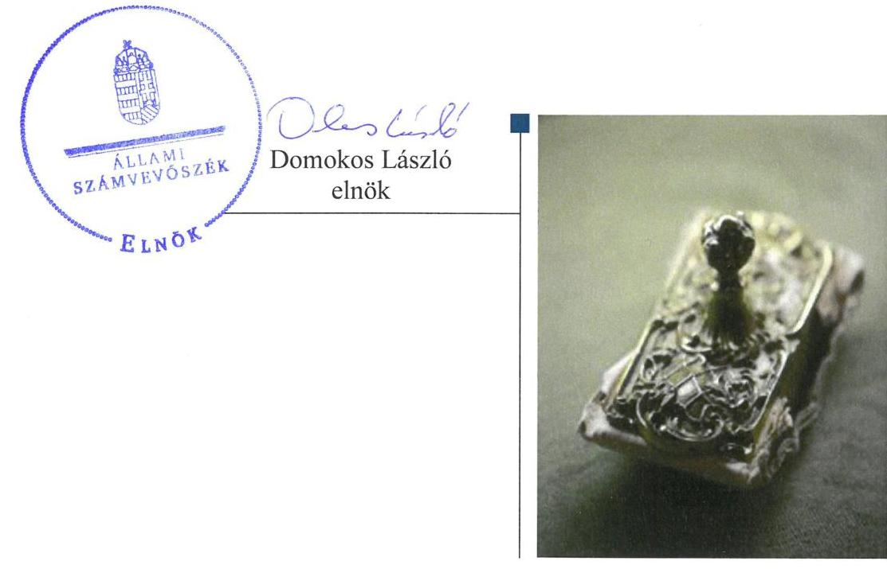
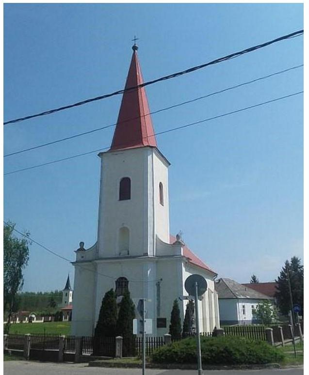
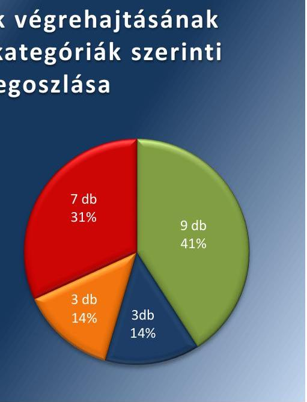
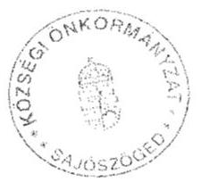
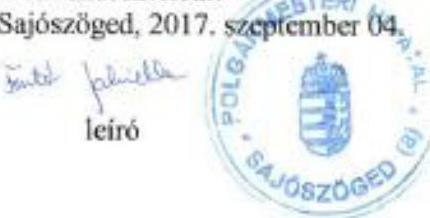
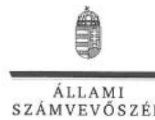

# Jelentés 

## Utóellenőrzések

Az önkormányzatok belső
kontrollrendszere kialakításának és működtetésének ellenőrzése -
Sajószöged Községi Önkormányzat
2018. 12. hó 24. nap

---

# AZ ELLENŐRZÉST FELÜGYELTE: 

DR. NAGY IMRE felügyeleti vezető

## AZ ELLENŐRZÉST VEZETTE ÉS A VÉGREHAJTÁSÁÉRT FELELŐS:

KISTÓTH KRISZTINA ellenőrzésvezető

## A PROGRAM ÖSSZEÁLLÍTÁSÁÉRT FELELŐS:

TÓTPÁL SZABOLCS osztályvezető

## A TÉMÁHOZ KAPCSOLÓDÓ KORÁBBI SZÁMVEVŐSZÉKI JELENTÉSEK:

- címe: Az önkormányzatok belső kontrollrendszere kialakításának és működtetésének ellenőrzése - Sajószöged
- sorszáma: 17077

IKTATÓSZÁM: EL-1444-001/2018.
TÉMASZÁM: 2460
ELLENŐRZÉS-AZONOSÍTÓ SZÁM: V-080430

---

# TARTALOMJEGYZÉK 

■ ÖSSZEGZÉS ..... 5
■ AZ ELLENŐRZÉS CÉLJA ..... 6
■ AZ ELLENŐRZÉS TERÜLETE ..... 7
■ AZ ELLENŐRZÉS HÁTTERE, INDOKOLTSÁGA ..... 8
■ A JELENTÉS LÉNYEGES KÉRDÉSKÖRE ..... 9
■ ELLENŐRZÉS HATÓKÖRE ÉS MÓDSZEREI ..... 10
■ MEGÁLLAPÍTÁSOK ..... 12
■ MELLÉKLETEK ..... 15
I. sz. melléklet: Sajószöged Községi Önkormányzat intézkedési terve végrehajtásának értékelése ..... 15
II. sz. melléklet: Sajószöged Községi Önkormányzat intézkedési terve ..... 21
■ FÜGGELÉK: ÉSZREVÉTELEK ..... 29
■ RÖVIDÍTÉSEK JEGYZÉKE ..... 43

---

.

---

# ÖSSZEGZÉS 

Sajószöged Községi Önkormányzat szabályozottsága javult. Ugyanakkor a szabályszerű működés érdekében a nem vagy csak részben végrehajtott intézkedések miatt a belső kontroll rendszer nem biztosította a felelős gazdálkodást és az elszámoltathatóságot. A közvagyonnal való gazdálkodás átláthatóságát és nyilvánosságát nem biztosították.

## Az ellenőrzés társadalmi indokoltsága

Az Állami Számvevőszék stratégiájában célul tűzte ki a számvevőszéki munka hasznosulásának javítását. Ezzel összhangban ellenőrzi, hogy az ellenőrzött szervezet megvalósította-e a korábbi ellenőrzései által feltárt hibák, hiányosságok és szabálytalanságok megszüntetése céljából elkészített intézkedési tervében foglaltakat. A rendszeres utóellenőrzések hozzájárulnak a szükséges intézkedések tényleges végrehajtásához, ezáltal a közpénzügyek rendezettségének javulásához.

## Főbb megállapítások, következtetések

Sajószöged Községi Önkormányzat az intézkedési tervében meghatározott huszonkettő feladatból kilencet határidőben, hármat határidőn túl, hármat részben hajtott végre, hetet pedig nem hajtott végre.

Sajószöged Községi Önkormányzatnál javult a szabályozottság az Integrált Kockázatkezelési Szabályzat és a Polgármesteri Hivatal Ellenőrzési Nyomvonal Kialakításának Szabályzata elkészítésével és a hivatali szervezeti és működési szabályzat és a munkaköri leírások kiegészítésével. A kockázatkezelési rendszer kiterjedt a befektetési tevékenységre, ezzel támogatta a tevékenység szabályszerű végzését, a közvagyon megóvását és gyarapítását. A monitoring rendszer szabályszerűsége javult a 2018-2021 évi stratégiai tervvel, illetve az ellenőrzési terveket megalapozó kockázatelemzések készítésével.

A belső kontroll rendszeren belül a kontrolltevékenységek keretében nem gondoskodtak a teljesítés igazolás és az érvényesítés jogszabályi megfelelőségéről. Az információs és kommunikációs rendszer keretében a beszámolási szintek, határidők és módok meghatározásának és a kötelező közzétételek elmulasztásával az önkormányzat nem biztosította a közvagyonnal való gazdálkodás nyilvánosságát és átláthatóságát. Az adatvédelmi és adatbiztonsági szabályzatot közzétették.

A jegyző nem gondoskodott a részvények és ingatlanok jogszabályi előírásoknak megfelelő leltározásáról. A leltározás elmaradása a vagyongazdálkodásra vonatkozóan kockázatot jelent.

Sajószöged Községi Önkormányzat nem vezetett nyilvántartást az intézkedési tervben rögzített feladatok végrehajtásáról. A nyilvántartás vezetésének hiánya nem biztosította a feladat-végrehajtás nyomon követését, növelte a feladat-végrehajtás elmaradásának kockázatát.

---

# AZ ELLENŐRZÉS CÉLJA 

Az ellenőrzés célja annak értékelése volt, hogy a számvevőszéki jelentésben foglalt intézkedést igénylő megállapításokkal összhangban készített intézkedési tervben meghatározott feladatokat az ellenőrzött szervezet végrehajtotta-e.

---

# AZ ELLENŐRZÉS TERÜLETE

## Sajószöged Községi Önkormányzat

Sajószöged község Borsod-Abaúj-Zemplén megyében található, 1 362 hektáron terül el. Állandó lakosainak száma a KSH által közzétett népességi adatok szerint 2017. január 1-jén 2 185 fő volt.

A Polgármester¹ a 2012. április 21-i időközi önkormányzati választások óta vezeti a 7 tagú Képviselő-testületet, amely kettő állandó bizottságot hozott létre. A Jegyző² 1999. október 1. óta látja el feladatait.

A 2017. évi éves költségvetési beszámoló szerint a 2017. évben az Önkormányzat³ 394 M Ft költségvetési kiadást teljesített és 590 M Ft költségvetési bevétellel gazdálkodott.

Az Önkormányzat a Hivatalon kívül egy intézménnyel, valamint egy 100%-os tulajdoni részesedésű gazdasági társasággal látta el feladatait.

Az ÁSZ⁴ 2014. január 1. és a 2015. április 30. közötti időszakra vonatkozóan végezte el az Önkormányzat belső kontrollrendszere kialakításának és működtetésének ellenőrzését, az egyes befektetési tevékenységeinek ellenőrzése tekintetében az ellenőrzött időszak a 2011. január 1. – 2015. április 30. közötti időszak volt. Az ellenőrzés célja annak megállapítása volt, hogy az önkormányzat belső kontrollrendszerének kialakítása, továbbá egyes elemeinek működtetése biztosította-e a közpénz felhasználás szabályosságát. Az erőforrásokkal való szabályszerű és hatékony gazdálkodáshoz szükséges követelmények érvényesítése, számonkérése, ellenőrzése megtörtént-e az önkormányzatnál. A belső kontrollrendszer kialakítása és működtetése támogatta-e az integritás szemlélet érvényesülését, valamint a belső kontrollrendszer kialakításának és működtetésének szabályszerűségének értékelése. Az ÁSZ továbbá ellenőrizte, hogy az önkormányzat egyes befektetési döntései és azok végrehajtása, elszámolása megfelelte-e a vonatkozó jogszabályoknak és belső szabályozásoknak, a kialakított kontrollrendszer támogatta-e a befektetési tevékenység szabályszerűségét. Az ÁSZ 2017. május 23-án hozta nyilvánosságra az 17077-es számú jelentését.

Az ÁSZ jelentés az Önkormányzat Jegyzője részére öt, a Polgármester részére négy intézkedést igénylő megállapítást tartalmazott. Ez alapján a Polgármester az ÁSZ Elnökének megküldte az Önkormányzat 22 feladatot tartalmazó, a Képviselő-testület⁵ által 85/2017. (VIII. 31.) számú határozattal jóváhagyott intézkedési tervét.

---

# AZ ELLENŐRZÉS HÁTTERE, INDOKOLTSÁGA 

Az ÁSZ tv. ${ }^{6}$ 33. § (1) bekezdése értelmében a számvevőszéki jelentések intézkedést igénylő megállapításaihoz és javaslataihoz kapcsolódóan az ellenőrzött szervezet vezetője intézkedési tervet köteles összeállítani, és az Állami Számvevőszék részére megküldeni.

Az ÁSZ által befogadott intézkedési tervben foglaltak megvalósítását az ÁSZ törvény 33. § (7) bekezdésében foglaltak alapján - az Állami Számvevőszék utóellenőrzés keretében ellenőrizheti. Az utóellenőrzések keretében - az intézkedések értékelése során - az Állami Számvevőszék figyelembe veszi az ellenőrzött szervezetek működési feltételeiben, valamint a jogszabályi előírásokban bekövetkezett változásokat.

Az utóellenőrzés során az ÁSZ értékeli, hogy az érintett számvevőszéki jelentésben foglalt intézkedést igénylő megállapításokkal és javaslatokkal összhangban, az ellenőrzött szervezet által készített intézkedési tervben meghatározott feladatokat a feladatra kijelöltek végrehajtották-e.

Az intézkedések végrehajtásával az adott terület szabályszerű működése vonatkozásában a kockázatok csökkenhetnek, azonban hosszabb távon az intézkedési tervben foglaltak végrehajtásával önmagában nem szűnnek meg, csak akkor, ha beépülnek az ellenőrzött szervezet működésébe, azokat folyamatosan karban tartják, figyelembe véve, illetve kezelve a változásokat. Emellett az intézkedések végrehajtásáig újabb kockázatok merülhetnek fel a szabályszerű működés vonatkozásában, amelyek kezelése szintén kiemelten fontos az ellenőrzött szervezet számára.

Az ellenőrzött szervezet vezetője által készített intézkedési tervben foglalt feladatok hiányos, illetve késedelmes végrehajtása, vagy annak elmaradása a szabályszerűség és a felelős vezetői magatartás vonatkozásában kockázatot hordoz, ami azt mutatja, hogy az ellenőrzések során feltárt hibák, hiányosságok és szabálytalanságok kezelése nem kapott kellő hangsúlyt. Az utóellenőrzés során is fennálló szabálytalanságok esetén a közpénz, közvagyon veszélyeztetettségi kockázat valószínűsített hatásának értékelése további intézkedéseket vonhat maga után.

Az ellenőrzött szervezet szintjén az utóellenőrzés feltárja, hogy a szervezet az intézkedések végrehajtásával hasznosította-e a korábbi ellenőrzési jelentésben a hiányosságok megszüntetése, illetve a kockázatok kezelése érdekében megfogalmazott javaslatokat, illetve az intézkedések végrehajtása elmaradásának következtében továbbra is fennálló szabálytalanság esetén értékeli a közpénzek, közvagyon veszélyeztetettségét.

Az ÁSZ szintjén az utóellenőrzés visszacsatolást ad az ellenőrzési jelentések hasznosulásáról, az intézkedések elmaradásának, vagy részleges megvalósulásának a közpénzek, közvagyon veszélyeztetettségére gyakorolt valószínűsített hatásának értékelése, további intézkedéseket vonhat maga után.

---

# A JELENTÉS LÉNYEGES KÉRDÉSKÖRE 

Az Önkormányzat az intézkedési tervben foglaltakat az előírt határidőben végrehajtotta-e?

---

# ELLENŐRZÉS HATÓKÖRE ÉS MÓDSZEREI 

## Az ellenőrzés típusa

Megfelelőségi ellenőrzés.

## Az ellenőrzött időszak

Az utóellenőrzés alapját képező ÁSZ jelentés közzétételének napjától az ellenőrzésről szóló kiértesítő levél keltének napjáig tartó időszak, 2017. május 23. - 2018. július 4.

## Az ellenőrzés tárgya

Az ÁSZ tv. 2011. július 1-jei hatálybalépését követően a számvevőszéki jelentésben foglalt intézkedést igénylő megállapításokkal összhangban - az Önkormányzat által - készített Intézkedési tervben foglaltak végrehajtásának ellenőrzése.

## Az ellenőrzött szervezet

Sajószöged Községi Önkormányzat és a Sajószögedi Polgármesteri Hivatal

## Az ellenőrzés jogalapja

Az ellenőrzés jogszabályi alapját az ÁSZ tv. 33. § (7) bekezdésének előírásai képezik.

## Az ellenőrzés módszerei

Az ellenőrzést az ellenőrzött időszakban hatályos jogszabályok, az ellenőrzés szakmai szabályai, a jelen ellenőrzésre irányadó ÁSZ módszertanok, az ellenőrzési programban foglalt értékelési szempontok szerint, végeztük.

Az ellenőrzés ideje alatt az Önkormányzattal történő kapcsolattartást az ÁSZ SZMSZ²-ének vonatkozó előírásai alapján biztosítottuk.

Az utóellenőrzés megállapításait az ÁSZ rendelkezésére álló, valamint az ÁSZ adatbekérése szerint, az Önkormányzat által rendelkezésre bocsátott dokumentumok alapozták meg.

Az ellenőrzési bizonyítékként felhasználható adatforrások közé tartoztak egyrészt az ellenőrzési program részletes szempontjainál felsorolt

---

adatforrások, másrészt minden - az ellenőrzés folyamán feltárt, az ellenőrzés szempontjából információt tartalmazó - dokumentum.

Az intézkedési tervekben előírt feladatokat azok végrehajthatósága, illetve végrehajtása szempontjából az alábbiak szerint értékeltük:
$\longrightarrow$ „határidőben végrehajtott" a feladat, ha a teljesítés dokumentáltan, az intézkedési tervben előírt határidőben és tartalommal megtörtént;
$\longrightarrow$ „határidőn túl végrehajtott" a feladat, ha annak teljesítése az intézkedési tervben meghatározott módon, de az előírt határidőn túl történt meg;
$\longrightarrow$ „részben végrehajtott" a feladat, ha végrehajtása teljes körűen az intézkedési tervben előírt módon nem történt meg;
$\longrightarrow$ „nem végrehajtott" a feladat, ha a végrehajtás nem történt meg, vagy amennyiben a teljesítést nem dokumentálták;
$\longrightarrow$ „okafogyottá vált" a feladat, ha végrehajtására - meghatározott esemény bekövetkezése, továbbá külső körülmény, a működést érintő feltétel változása miatt - már nincs szükség, illetve lehetőség, és egyértelműen megállapítható, hogy az intézkedést szükségessé tevő körülmény a jövőben nem fordulhat elő;
$\longrightarrow$ „nem időszerű" az a feladat, amelynek ellenőrzési időszakon belüli végrehajtására azért nem került (kerülhetett) sor, mert az intézkedés alapjául szolgáló esemény nem következett be, de annak jövőbeni előfordulása lehetséges, a végrehajtása nem volt esedékes, vagy a végrehajtás határideje még nem járt le.
Az ellenőrzés lefolytatásához az Önkormányzat a tanúsítványok elektronikus kitöltésével, valamint az ÁSZ által kért dokumentumok elektronikus megküldésével szolgáltatott adatokat, amelyek valódiságát és teljes körűségét az ellenőrzött szervezet vezetője által tett teljességi és hitelességi nyilatkozat igazolta. Az így rendelkezésre bocsátott adatok, információk kontrollja az ellenőrzés keretében megtörtént.

---

# MEGÁLLAPÍTÁSOK 

## Az Önkormányzat az intézkedési tervben foglaltakat az előírt határidőben végrehajtotta-e?

Összegző megállapítás

Az Önkormányzat az intézkedési tervben szereplő huszonkettő feladatból kilencet határidőben, hármat határidőn túl hajtott végre, hármat részben, hetet nem hajtott végre. Az intézkedési tervben meghatározott feladatok végrehajtásáról nem vezettek nyilvántartást.

Az Önkormányzat az általa elkészített intézkedési tervében ${ }^{8}$ meghatározott feladatok közül kilencet határidőben, hármat határidőn túl hajtott végre, hármat részben végrehajtott, hetet pedig nem hajtott végre.

A feladatokat, határidőket, megjelölt felelősöket és a feladatok végrehajtásának értékelését az I. sz. melléklet mutatja be.

Az Önkormányzat az intézkedési tervben meghatározott feladatok végrehajtásáról nem vezette a Bkr. ${ }^{9}$ 14. § (1) bekezdésben előírt nyilvántartást.

Az Önkormányzat intézkedési tervében vállalt feladatok végrehajtásának értékelését az 1. ábra szemlélteti.

1. ábra

## A feladatok végrehajtásának értékelési kategóriák szerinti megoszlása

- Határidőben végrehajtott
- Határidőn túl végrehajtott
- Részben végrehajtott
- Nem végrehajtott

A BELSŐ KONTROLL SZERINTI ELSZÁMOLTATHATÓSÁG keretében a szabályszerű működés érdekében a Képviselő-testület szervezeti és működési szabályzatát kiegészítette az önkormányzati bizottságok nem képviselő tagjainak vagyonnyilatkozat tételi kötelezettségével (1). A jegyző intézkedett a köztisztviselők munkaköri leírásában a
 végzettségre, szakképzetségre vonatkozó követelmények meghatározásával, azonban nem gondoskodott a köztisztviselői munkaviszony megszűnésekor a munkakör dokumentált átadás-átvételéről (13).

A kockázatkezelési rendszer javult az Integrált kockázatkezelési szabályzat ${ }^{10}$ kiadásával, mely függelékében tartalmazza a befektetési tevékenységgel kapcsolatos kockázatok, a kapcsolódó intézkedések és a nyomon követés módjának meghatározását. A jegyző elkészítette a Hivatal ${ }^{11}$ Ellenőrzési Nyomvonal Kialakításának Szabályzatát ${ }^{12}$ (8) és módosította a hivatali SZMSZ ${ }^{13}$-t (11,12).

A jegyző nem gondoskodott, hogy a teljesítésigazolást végző személy rendelkezzen a kötelezettségvállaló általi kijelöléssel, és hogy a teljesítés igazolását és érvényesítést a gazdálkodási szabályzatban megjelölt személy végezze (17), ugyanakkor intézkedett, hogy érvényesítésre és a kötelezettségvállalás pénzügyi ellenjegyzésére feljogosított személy rendelkezett az Ávr ${ }^{14} .55$ § (3) bekezdésben előírt végzettséggel (9).

A gazdálkodás nyilvánossága és átláthatósága nem volt biztosított, mert a Hivatali SZMSZ nem tartalmazta a beszámolási szintek, határidők és módok meghatározását (18). A jegyző kiadta a közzétételi szabályzatot ${ }^{15}$ (3), azonban a rendelkezések betartásáról nem gondoskodott. A jegyző intézkedett az adatvédelmi és adatbiztonsági szabályzat közzétételéről, de nem gondoskodott a 2017. évi éves költségvetési beszámoló közzétételéről (14). Továbbá nem tette közzé Sajószöged 5 millió Ft-ot meghaladó befektetési döntéseit (16). Az iratkezelési szabályzat ${ }^{16}$ kiegészítésre került a küldemény munkahelyről történő kivitelére, munkahelyen kívüli tanulmányozására vonatkozó rendelkezéssel, de nem történt meg a személyes adatok kezeléséhez való hozzájárulást tartalmazó, illetve a közérdekű adatok megismerésére irányuló kérelmek kezelésére vonatkozó rendelkezések szabályozása (15).

A monitoring rendszer szabályozottsága és szabályszerűsége javult a Hivatali SZMSZ kiegészítésével az operatív tevékenységek keretében megvalósuló folyamatos és eseti nyomon követés szabályaival, (4), továbbá a 2018. évi belső ellenőrzési terv tartalmazta az ellenőrzési terveket megalapozó elemzéseket és a kockázatelemzés eredményének összehasonlító bemutatását (5). A jegyző jóváhagyta a belső ellenőrzési vezető által készített 2018-2021 évekre szóló stratégiai ellenőrzési tervet (6), azonban nem gondoskodott az ellenőrzési program elkészítéséről (20).

# AZ EGYES BEFEKTETÉSEK SZÁMVITELI ELSZÁ-

MOLÁSA ÉS NYILVÁNTARTÁSA érdekében a jegyző nem gondoskodott a befektetésekkel kapcsolatos gazdasági események jogszabályi előírások szerinti rögzítéséről a számviteli nyilvántartásokban. A jegyző intézkedett a 2011. és 2012. évi beszámolóban szereplő KÖZVIL ${ }^{17}$ részvény hibás bekerülési érték kijavításáról, de az ELMIR részvény bekerülési értékét nem támasztotta alá (21).

A jegyző nem gondoskodott a részvényeknek és ingatlanoknak a jogszabályi előírásoknak megfelelő leltározásáról. Az Áhsz. ${ }^{18} 22$ § (1)-(2) és a

---

Számv. tv. ${ }^{19} 69$ § (1) - (3) bekezdése ellenére nem intézkedett a materializált KÖZVIL részvény és az ingatlanok tekintetében a mérlegtételek leltári alátámasztásáról és az EHEP ${ }^{20}$ részvények egyeztetéssel történő leltározásról (22).

---

# MELLÉKLETEK

■ I. SZ. MELLÉKLET: SAJÓSZÖGED KÖZSÉGI ÖNKORMÁNYZAT INTÉZKEDÉSI TERVE VÉGREHAJTÁSÁNAK ÉRTÉKELÉSE

|  5. | Az intézkedési tervben rögzített feladat | Az intézkedési tervben meghatározott határidő | Az intézkedési tervben meghatározott felelős | A feladat végrehajtása  |
| --- | --- | --- | --- | --- |
|  1. | 2. | 3. Határidőben végrehajtott feladatok |  | 5.  |
|  1. | P1. A képviselő-testület 6/2017.(V.04.) önkormányzati rendeletével módosította a szervezeti és működési szabályzatáról szóló 1 I/2014.(X.31.) önkormányzati rendeletét a képviselő-testület bizottságának nem képviselő tagjainak vagyonnyilatkozat tételére vonatkozó kötelezettségének kiegészítésével. | további intézkedést nem igényel | polgármester | Az önkormányzati bizottságok nem képviselő tagjainak vagyonnyilatkozat tételére vonatkozó kötelezettségét előíró képviselő-testületi SZMSZ módosítást a Képviselő-testület a 6/2017.(V.04.) önkormányzati rendelettel 2017. május 4-én elfogadta.  |
|  2. | P4. Az ellenőrzés során feltárt hiányosságok, szabálytalanságok tekintetében a munkajogi felelősség kivizsgálásra kerül, ennek ismeretében az erre vonatkozó intézkedés megtörténik. | 2017. szeptember 30. | polgármester | A polgármester 2017. szeptember 30-án intézkedett az Állami Számvevőszék ellenőrzése során feltárt hiányosságok és szabálytalanságok tekintetében a munkajogi felelősség kivizsgálására. Megállapította, hogy a jegyző fegyelmi vétséget nem követett el, álláspontja szerint a feltárt hiányosságok pótlására és a szabálytalanságok kezelésére szükséges intézkedéseket megtették, ezért fegyelmi eljárás lefolytatása nem indokolt.  |
|  3. | J1.fb. Az információs önrendelkezési jogról és az információs szabadságról szóló 2011. évi CXII. törvény (a továbbiakban: Info tv.) 35. § (I)-(2) bekezdései szerinti kötelezettség teljesítésének részletes szabályairól belső szabályzatot kell kiadni. | 2017. december 31. | jegyző | A jegyző 2017. december 21-én a 4/2017 (XII.21.) számú jegyzői utasítás mellékleteként kiadott Közzétételi Szabályzatban gondoskodott az Info tv. 35. § (I)-(2) bekezdései szerinti kötelezettség teljesítésének részletes szabályairól szóló belső szabályzat kiadásáról.  |
|  4. | J1.g. A Polgármesteri Hivatal szervezeti és működési szabályzatát - a Bkr. 10.§-ának megfelelően - ki kell egészíteni azoknak a szóbeli és írásos beszámolók készítésének részletes szabályaival, melyek a szervezet tevékenységének, a célok megvalósításának nyomon követését biztosítják. | 2017. december 31. | jegyző | A Képviselő-testület 2017. december 21-én kelt, 117/2017. (XII.21) sz. képviselő-testületi határozatában elfogadta a Hivatali SZMSZ kiegészítését, mely tartalmazta a Bkr. 10. §-ának megfelelően a szervezet tevékenységének, a célok megvalósításának nyomon követését biztosító rendszer részeként a szóbeli és írásos beszámolók készítésének részletes szabályait.  |

---

|  1. | Az intézkedési tervben rögzített feladat | Az intézkedési tervben meghatározott határidő | Az intézkedési tervben meghatározott felelős | A feladat végrehajtása  |
| --- | --- | --- | --- | --- |
|  1. | 2. | 3. | 4. | 5.  |
|  5. | J1.h. Az éves ellenőrzési terveknek - a Bkr. 31.§ (4) bekezdés a) és d) pontjának megfelelően - tartalmazni kell az ellenőrzési terveket megalapozó elemzéseket, a kockázatelemzés eredményének összefoglaló bemutatását, valamint az ellenőrizendő időszak pontos meghatározását is. | 2017. december 31. | jegyző, belső ellenőrzési vezető | A jegyző 2017. december 01-jén jóváhagyta a belső ellenőrzési vezető által készített 2018. évi belső ellenőrzési tervet, melyet a Képviselő-testület a 114/2017. (XII.21.) sz. határozatában 2017. december 21-én fogadott el. A 2018. évi belső ellenőrzési terv a Bkr. 31. § (4) bekezdés a) és d) pontjának megfelelően tartalmazta az ellenőrzési terveket megalapozó elemzéseket, a kockázatelemzés eredményének összehasonlító bemutatását (3. oldal és 1. sz. melléklet), valamint az ellenőrzési időszak pontos meghatározását (6. sz. melléklet).  |
|  6. | J1.i. El kell készíteni a Bkr. 30.§-a szerinti stratégiai ellenőrzési tervet. | 2017. december 31. | jegyző, belső ellenőrzési vezető | A jegyző 2017. december 01-jén jóváhagyta a belső ellenőrzési vezető által készített 2018-2021 évekre szóló stratégiai ellenőrzési tervet, melyet a Képviselő-testület a 115/2017. (XII.21.) sz. határozatában 2017. december 21-én fogadott el.  |
|  7. | J5. Az ellenőrzés során feltárt hiányosságok, szabálytalanságok tekintetében a munkajogi felelősség kivizsgálásra kerül, ennek ismeretében az erre vonatkozó intézkedés megtörténik. | 2017. szeptember 30. | jegyző | A jegyző 2017. szeptember 30-án intézkedett az Állami Számvevőszék ellenőrzése során feltárt hiányosságok és szabálytalanságok tekintetében a munkajogi felelősség kivizsgálására és egyeztetést végzett. Megállapította, hogy a feladatkörükbe tartozó hiányosságok pótlására és a szabálytalanságok kezelésére a köztisztviselők (gazdasági vezető, pénzügyi ügyintéző) a szükséges intézkedéseket megtették, ezért fegyelmi eljárás lefolytatása nem indokolt.  |
|  8. | J1.a. A költségvetési szervek belső kontrollrendszeréről és belső ellenőrzéséről szóló 370/2011. (XII. 31.) Korm. rendelet (a továbbiakban: Bkr.) 7.§ (1) bekezdésének előírása szerint integrált kockázatkezelési rendszert kell működtetni. Kiemelt figyelmet kell fordítani a befektetési tevékenységgel kapcsolatos kockázatok felmérésére, az egyes kockázatokkal kapcsolatos intézkedések meghatározására, valamint azok teljesítésének, folyamatos nyomon követésének módjára. | Az Intézkedési terv elfogadását követően folyamatosan | jegyző | A jegyző a 3/2017. (XII.21.) számú utasításában, a Hivatal Integrált Kockázatkezelési Szabályzatában (hatályos:2018. január 01-től) gondoskodott a Bkr. 7.§ (1) bekezdésének előírása szerinti integrált kockázatkezelési rendszer kialakításáról és annak működtetéséről. A jegyző az 5/2017. (XII.21.) számú utasításában gondoskodott a Hivatal Ellenőrzési Nyomvonal Kialakításának Szabályzatának (hatályos:2018. január 1-től) elkészítéséről. A 3/2017. (XII.21.) számú, Sajószöged Polgármesteri Hivatal Integrált Kockázatkezelési Szabályzatának 4. sz. függeléket képező befektetési tevékenység Integrált kockázatkezelési leltárában meghatározásra kerültek a kockázatok, azok felmérése, az egyes kockázatokkal kapcsolatos intézkedések meghozatalára teendő intézkedések, az egyes kockázatok bekövetkezésének hatása. A befektetési tevékenység integrált kockázatkezelési leltárában meghatározásra kerültek a kockázatok folyamatos nyomon követésének módja és a feladatgazdák.  |

---

|  1. | Az intézkedési tervben rögzített feladat | Az intézkedési tervben meghatározott határidő | Az intézkedési tervben meghatározott felelős | A feladat végrehajtása  |
| --- | --- | --- | --- | --- |
|  1. | 2. | 3. | 4. | 5.  |
|  9. | J1.e. A kötelezettségvállalás pénzügyi ellenjegyzésére feljogosított személynek minden esetben a felsőoktatásban szerzett gazdasági szakképzettséggel, vagy legalább középfokú iskolai végzettséggel és emellett pénzügyi-számviteli végzettséggel is kell rendelkeznie.
Az érvényesítési feladatokat ellátó személynek az államháztartásról szóló törvény végrehajtásáról szóló 368/2011. (XII. 31.) Korm. rendelet (Ávr.) 55.§ (3) bekezdése szerinti végzettséggel kell rendelkeznie. A döntések szabályszerű jóváhagyásával a kontrolltevékenységeknek biztosítani kell a gazdasági események elszámolásával kapcsolatos kockázatok csökkentését. | Az intézkedési terv elfogadását követően folyamatosan | jegyző, gazdasági vezető | Az ÁSZ részére megküldött végzettséget igazoló dokumentumok alapján az érvényesítésre és a kötelezettségvállalás pénzügyi ellenjegyzésére a 2018. január 1-től hatályos munkaköri leírás alapján feljogosított személy rendelkezett a felsőoktatásban szerzett gazdasági szakképzettséggel, vagy legalább középfokú iskolai végzettséggel és emellett pénzügyi-számviteli végzettséggel is.  |
|   |  | Határidőn túl végrehajtott feladatok |  |   |
|  10. | P2. A képviselő-testület 52/2017.(V.25.) határozatával megbízást adott a Holocén Természetvédelmi Egyesület (3525 Miskolc, Kossuth út 13.) részére Környezetvédelmi Program elkészítésére. A Környezetvédelmi Program elkészülte, a hatóságok által történt véleményezése, illetve az esetleges korrekciók után a polgármester a Környezetvédelmi Program tervezetet a képviselő-testület elé terjeszti. | 2017. december 31. | polgármester | A polgármester a Képviselő-testület elé terjesztette Sajószöged Környezetvédelmi Programját, melyet a Képviselő testület 2018. április 26-án a 31/2018.(IV.26) számú határozatával elfogadott.  |
|  11. | P3. A jogszabályi előírásoknak megfelelően kiegészített hivatali SZMSZ-tervezetet a soron következő képviselőtestületi ülésen jóváhagyásra elő kell terjeszteni. (A képviselő-testület 59/2017.(VI.29.) határozatával a hivatali SZMSZ-t módosította.) | 2017. június 29. | polgármester | A polgármester a Képviselő testület elé terjesztette a módosított hivatali SZMSZ-t. A Képviselő-testület 2017. június 29-i 59/2017. (VI.29.) számú határozata szerinti hivatali SZMSZ kiegészítése tartalmazta az ÁMK²1-t, mint a Hivatalhoz rendelt költségvetési szervet. Azonban a hivatal alapító okiratának kelte, az alapítás időpontja, a hivatal szervezeti egységeinek engedélyezett létszáma tekintetében a hivatali SZMSZ-t

 a Képviselő-testület 9/2018. (II.1.) számú határozatában 2018. február 1-én módosította.  |
|  12. | J2. A jogszabályi előírásoknak megfelelően kiegészített hivatali SZMSZ-tervezetet a soron következő képviselőtestületi ülés előtt a polgármester elé kell terjeszteni. | 2017. június 23. | jegyző | A jegyző a polgármester elé terjesztette a kiegészített hivatali SZMSZ tervezetét. A Képviselő-testület 2017. június 29-i 59/2017. (VI.29.) számú határozata szerinti hivatali SZMSZ kiegészítése tartalmazta az ÁMK-t, mint a Hivatalhoz rendelt költségvetési szervet. Azonban a hivatal alapító okiratának kelte, az  |

---

|  Az intézkedési tervben rögzített feladat | Az intézkedési tervben meghatározott határidő | Az intézkedési tervben meghatározott felelős | A feladat végrehajtása  |
| --- | --- | --- | --- |
|  1. | 2. | 3. | 4.  |
|   |  |  | alapítás időpontja, a hivatal szervezeti egységeinek engedélyezett létszáma tekintetében a hivatali SZMSZ-t a Képviselő-testület 9/2018. (II.1.) számú határozatában 2018. február 1-én módosította.  |
|  Részben végrehajtott feladatok |  |  |   |
|  13. | J1.c. A köztisztviselők munkaköri leírásában egyértelműen meg kell határozni a munkakör betöltésével kapcsolatos végzettségre, szakképzettségre vonatkozó követelményeket. A köztisztviselő jogviszonya megszűnésekor a munkakör átadás-átvétele dokumentáltan kell megtörténnie. | Az Intézkedési terv elfogadását követően folyamatosan | jegyző  |
|  14. | J1.fc. Gondoskodni kell az Info tv. 37.§ (1) bekezdésében és 1. mellékletének II/I. és III/I. pontjában foglalt előírások folyamatos végrehajtásáról, amelynek keretében közzé kell tenni - többek között - az adatvédelmi és adatbiztonsági szabályzat hatályos és teljes szövegét, valamint az éves költségvetési beszámolót. | 2017. december 31. | jegyző  |
|  15. | J1./fd Az iratkezelési szabályzatot felül kell vizsgálni és ki kell egészíteni a közfeladatot ellátó szervek iratkezelésének általános követelményeiről szóló 335/2005. (XII.29.) Korm. rendelet 37. és 38.§-aiban meghatározott, a küldemény munkahelyről történő kivitelére, munkahelyen kívüli tanulmányozására, feldolgozására, tárolására, valamint a személyes adatok kezeléséhez való hozzájárulást tartalmazó, illetve a közérdekű adatok megismerésére irányuló kérelmek kezelésére vonatkozó rendelkezésekkel. | 2017. december 31. | jegyző  |
|  Végrehajtott feladatrész: |  |  |   |
|  2018. január 1-től kerültek meghatározásra a köztisztviselők munkaköri leírásában a munkakör betöltésével kapcsolatos végzettségre, szakképzettségre vonatkozó követelmények. A köztisztviselők munkaköri leírásában rögzítésre kerültek a 29/2012. (III.7.) Korm. rendelet 22. 1. számú melléklet szerinti, adott munkakörhöz tartozó képesítési követelmények. |  |  |   |
|  Nem végrehajtott feladatrész: |  |  |   |
|  A jegyző nem intézkedett a Kttv. 23. 74 § (1) bekezdésében előírtak ellenére, a köztisztviselő(k) jogviszonya megszűnésekor a munkakör átadás-átvétel dokumentálásáról. |  |  |   |
|  Végrehajtott feladatrész: |  |  |   |
|  Az adatvédelmi és adatbiztonsági szabályzat közzétételéről a jegyző gondoskodott, annak teljes szövege megtalálható az Önkormányzat honlapján. |  |  |   |
|  Nem végrehajtott feladatrész: |  |  |   |
|  A jegyző nem gondoskodott az Info tv. 37.§ (1) bekezdésében és 1. mellékletének III/I. pontjában foglalt előírások végrehajtásáról, a 2017. évi éves költségvetési beszámoló közzétételéről. |  |  |   |
|  Végrehajtott feladatrész: |  |  |   |
|  A jegyző az iratkezelési szabályzatot felülvizsgálta, a 2./2017. (XI.23.) sz. jegyzői utasításában kiadta a Sajószögedi Polgármesteri Hivatal Iratkezelési Szabályzatát. Az Iratkezelési szabályzatban meghatározásra került a közfeladatot ellátó szervek iratkezelésének általános követelményeiről szóló 335/2005. (XII.29.) Korm. rendelet 37.§-aiban meghatározott, a küldemény munkahelyről történő kivitelére, munkahelyen kívüli tanulmányozására vonatkozó rendelkezések. |  |  |   |

---

|  1. | Az intézkedési tervben rögzített feladat | Az intézkedési tervben meghatározott határidő | Az intézkedési tervben meghatározott felelős | A feladat végrehajtása  |
| --- | --- | --- | --- | --- |
|  1. | 2. | 3. | 4. | 5.  |
|   |  |  |  | Nem végrehajtott feladatrész:  |
|   |  |  |  | A jegyző nem gondoskodott az iratkezelési Szabályzatban a közfeladatot ellátó szervek iratkezelésének általános követelményeiről szóló 335/2005. (XII.29.) Korm. rendelet 37. és 38.§-aiban meghatározott feldolgozásra, tárolásra, valamint a személyes adatok kezeléséhez való hozzájárulást tartalmazó, illetve a közérdekű adatok megismerésére irányuló kérelmek kezelésére vonatkozó rendelkezések szabályozásáról.  |
|   |  |  | Nem végrehajtott feladatok |   |
|  16. | J1.b. Biztosítani kell az önkormányzati vagyonnal való gazdálkodás nyilvánosságát és átláthatóságát az Info tv. 37.§ (1) bekezdésének 1. melléklete III/4. pontjának előírásainak megfelelően. | Az intézkedési terv elfogadását követően folyamatosan | jegyző | A jegyző a 4/2017 (XII.21.) számú Sajószögedi Polgármesteri Hivatal Közzétételi Szabályzata (hatályos: 2018. január 01-től) 1. sz. mellékletében meghatározásra került az Info tv. 37. § (1) bekezdésének 1. melléklete III/4. pontja előírásainak megfelelő gazdálkodási adatok közzétételi listája. Az Info tv. 37. § (1) bekezdésének 1. melléklete III/4. pontja szerinti közzétételi lista Sajószöged honlapján nem tartalmaz adatokat, így nem tartalmazza Sajószöged 5 millió Ft-ot meghaladó főkegarantált befektetési jegy vásárlását (2017.09.19.), valamint eladásait a Polgármesteri utasításban és az Info tv. 37. (1) bekezdésének 1. mellékletének III/4. pontja előírásainak ellenére.  |
|  17. | J1.d. A gazdálkodási jogkörök gyakorlása során be kell tartani a jogszabályi előírásokat, kiemelt figyelemmel arra, hogy a teljesítés igazolását végző személy rendelkezzen a kötelezettségvállaló általi felhatalmazással ezen gazdálkodási jogkör gyakorlására, valamint arra, hogy a teljesítést igazolást és érvényesítést a gazdálkodási szabályzatban megjelölt személy végezze. | Az intézkedési terv elfogadását követően folyamatosan | jegyző, gazdasági vezető | A jegyző nem intézkedett, hogy az Ávr. 57 § (4) bekezdésnek megfelelően a teljesítésigazolást végző személy rendelkezzen a kötelezettségvállaló általi kijelöléssel és hogy az Ávr. 57 § (3) és az 58 § (4) bekezdések előírásai szerint a teljesítés igazolást és érvényesítést a gazdálkodási szabályzatban megjelölt személy végezze.  |
|  18. | J1.fa. Az információs és kommunikációs rendszert szabályszerűen kell kialakítani és működtetni. Az információs rendszerek keretében a beszámolási rendszereket úgy kell működtetni, hogy azok hatékonyak, megbízhatóak, pontosak és összehasonlíthatóak legyenek, a beszámolási szintek, határidők és módok világosan meg le- | 2017. december 31. | jegyző | A 2018. február 05-én kihirdetésre került a Képviselő-testület 3/2018. (II.05.) önkormányzati rendeletével elfogadott Hivatali SZMSZ nem tartalmazta az információs rendszerekkel kapcsolatos, Bkr. 9. § (2) pontjában meghatározott beszámolási rendszerekkel kapcsolatos működtetési követelményéket, hogy azok hatékonyak, megbízhatóak, pontosak és összehasonlíthatóak legyenek, a beszámolási szintek, határidők és módok és világosan legyenek meghatározva.  |

---

|  1. | Az intézkedési tervben rögzített feladat | Az intézkedési tervben meghatározott határidő | Az intézkedési tervben meghatározott felelős | A feladat végrehajtása  |
| --- | --- | --- | --- | --- |
|  1. | 2. | 3. | 4. | 5.  |
|   | gyenek határozva. Ennek érdekében módosítani szükséges a Polgármesteri Hivatal szervezeti és működési szabályzatát. |  |  |   |
|  19. | J1.fe. Az iratkezelési szabályzatot .......a köziratokról, a közlevéltárakról és a magánlevéltári anyag védelméről szóló 1995. évi LXVI. törvény 10.§(1) bekezdésének megfelelően meg kell küldeni a Magyar Nemzeti Levéltárnak és a BAZ Megyei Kormányhivatalnak. | 2017. december 31. | jegyző | A jegyző a köziratokról, a közlevéltárakról és a magánlevéltári anyag védelméről szóló 1995. évi LXVI. törvény 10.§(1) bekezdésének ellenére nem intézkedett az iratkezelési szabályzat megküldéséről a Magyar Nemzeti Levéltárnak és a BAZ Megyei Kormányhivatalnak.  |
|  20. | J1.j. Gondoskodni kell arról, hogy az ellenőrzési programok aláírására a Bkr. 33.§ (2) bekezdés j) pontjában foglaltaknak megfelelően kerüljön sor. | ellenőrzési tervek szerint | jegyző, belső ellenőrzési vezető | A belső ellenőrzési tervben 2018. április időszakra, 10 ellenőri nappal ütemezett belső ellenőrzési kézikönyv aktualizálását alátámasztó ellenőrzés szerepelt. Az ellenőrzéshez a Bkr. 33.§ (2) bekezdésben foglaltak ellenére a jegyző nem gondoskodott az ellenőrzési program elkészítéséről.  |
|  21. | J3. A befektetésekkel kapcsolatos gazdasági események jogszabályi előírásoknak megfelelő rögzítéséről a számviteli nyilvántartásokban gondoskodni kell. | Az Intézkedési Terv elfogadását követően folyamatos | jegyző, gazdasági vezető | A 17077 számú ÁSZ jelentésben megállapított KÖZVIL bekerülési érték hibát javító korrekciós könyvelés 2017. december 31-i időpontra vonatkozóan megtörtént. A befektetésekkel kapcsolatos további megküldött gazdasági eseménynél (ELMIR részvény) a jegyző nem gondoskodott az Áhsz. 16§ (5) bekezdés szerinti bekerülési érték minősítést alátámasztó dokumentációról.  |
|  22. | J4. Az éves költségvetési beszámoló mérlegében kimutatott részvényeket és ingatlanokat jogszabályi előírásoknak megfelelő leltárral kell alátámasztani. | Az Intézkedési Terv elfogadását követően folyamatos | jegyző, gazdasági vezető | A jegyző a materializált KÖZVIL részvényre és az ingatlanokra vonatkozóan az Áhsz. 22§ (2) bekezdése ellenére, mely a leltározás végrehajtását a Számv.tv. 69 § (1) - (3) bekezdés szerint írja elő, nem gondoskodott a mérlegtételek leltárral történő alátámasztásáról. Az EHEP részvények, mint idegen helyen tárolt dematerializált értékpapírok esetében a leltár és leltározás nem felelt meg a jogszabályi előírásoknak, mivel  |
|   |  |  |  | - a Számv. tv. 69. § (1) bekezdésében, illetve az Áhsz. 22. § (1)-(2) bekezdésben foglaltak ellenére a leltár nem tartalmazta az EHEP részvények értékét,  |
|   |  |  |  | - a leltározást a Számv. tv. 69. § (2) bekezdésében illetve az Áhsz. 22. § (1)-(2) bekezdésben foglaltakkal szemben nem a főkönyvi könyvelés és az analitikus nyilvántartások adatai közötti egyeztetéssel hajtották végre.  |

---

# II. SZ. MELLÉKLET: SAJÓSZÖGED KÖZSÉGI ÖNKORMÁNYZAT INTÉZKEDÉSI TERVE 

## 1472

Sajószöged Községi Önkormányzat Polgármesterétől
3599 Sajószöged, Ady Endre út 71.
Telefon: 49/540-743, Fax: 49/540-744
Email: sajoszoged@gmail.com

Ügyiratszám: 388-11/2017.
Tárgy: Módosított intézkedési terv megküldése

Hivatkozási szám: V-1074-141/2016

Domokos László úr
elnök

Állami Számvevőszék
Budapest
Apáczai Csere János utca 10.
1052

ÁLLAMISZÁMVEVŐSZÉK
$8 E-842712071$
firkezett: 2017. SZEPTEMBER 08.
Iktatószám: 12 (OZ) - 146/2017
Melléklet:
FV 823 JOY. 011 (020

## Tisztelt Elnök Úr!

Fenti számra hivatkozva mellékelten megküldöm az Intézkedési Terv kijavítására, kiegészítésére tett észrevételeik figyelembe vételével készült Módosított Intézkedési Tervet.

Sajószöged, 2017. szeptember 05.

dr. Gulyás Mihály
polgármester

---

Sajószöged Községi Önkormányzat
Képviselő-testülete

Jegyzőkönyvi kivonat

Készült Sajószöged Községi Önkormányzat Képviselő-testületének 2017. augusztus 31-én tartott nyílt ülésének jegyzőkönyvéből

Sajószöged Községi Önkormányzat Képviselő-testülete a jelenlévő 7
 képviselőből, 7 igen szavazattal, ellenszavazat és tartózkodás nélkül az alábbi határozatot hozza:

85/2017.(VIII.31.) Képviselő-testületi határozat

Tárgy: A 74/2017.(VII.27.) Képviselő-testületi határozat mellékletének módosítása/kiegészítése

a./ Sajószöged Községi Önkormányzat Képviselő-testülete a 74/2017. (VII.27.) határozatával elfogadott "Az önkormányzatok belső kontrollrendszere kialakításának és működtetésének ellenőrzése-Sajószöged" ellenőrzéséről szóló jelentés végrehajtására vonatkozó Módosított Intézkedési Tervet az alábbiak szerint módosítja/kiegészíti:

Az ÁSz jelentés jegyzőnek címzett 1. javaslatra készített intézkedési tervpont (5) bekezdésében "Az érvényesítési feladatokat ellátó személynek a Bkr. 55.§ (3) bekezdése szerinti végzettséggel kell rendelkeznie." szövegrész helyébe a "Az érvényesítési feladatokat ellátó személynek az államháztartásról szóló törvény végrehajtásáról szóló 368/2011. (XII. 31.) Korm. rendelet (Ávr.) 55.§ (3) bekezdése szerinti végzettséggel kell rendelkeznie." szövegrész lép.

Az ÁSz jelentés jegyzőnek címzett 1. javaslatára készített intézkedési tervpont kiegészül a következő (7)-(11) bekezdésekkel:

"A Polgármesteri Hivatal szervezeti és működési szabályzatát - a Bkr. 10.§-ának megfelelően - ki kell egészíteni azoknak a szóbeli és írásos beszámolók készítésének részletes szabályaival, melyek a szervezet tevékenységének, a célok megvalósításának nyomon követését biztosítják.

Felelős: jegyző
Határidő: 2017. december 31.

Az éves ellenőrzési terveknek - a Bkr. 31.§ (4) bekezdés a) és d) pontjának megfelelően - tartalmazni kell az ellenőrzési terveket megalapozó elemzéseket, a kockázatelemzés eredményének összefoglaló bemutatását, valamint az ellenőrizendő időszak pontos meghatározását is.

Felelős: belső ellenőrzési vezető
Határidő: 2017. december 31.

El kell készíteni a Bkr. 30.§-a szerinti stratégiai ellenőrzési tervet.

---

# Felelős: belső ellenőrzési vezető   Határidő: 2017. december 31. 

Gondoskodni kell arról, hogy az ellenőrzési programok aláírására a Bkr. 33.§ (2) bekezdés j) pontjában foglaltaknak megfelelően kerüljön sor.

## Felelős: belső ellenőrzési vezető   Határidő: ellenőrzési tervek szerint"

b./ A Képviselő-testület a 74/2017. (VII.27.) határozatával elfogadott „Az önkormányzatok belső kontrollrendszere kialakításának és működtetésének ellenőrzése-Sajószöged" ellenőrzéséről szóló jelentés végrehajtására vonatkozó Módosított Intézkedési Tervet a módosításokkal egységes szerkezetben e határozat melléklete szerint fogadja el.

Felelős: dr. Boros István címzetes főjegyző
Határidő: azonnal
k.m.f.
dr. Gulyás Mihály sk.
polgármester
dr. Boros István sk. címzetes főjegyző

A kivonat hiteléül:
Sajószöged, 2017. szeptember 04.

---

# MÓDOSÍTOTT INTÉZKEDÉSI TERV 

az Állami Számvevőszék „Az önkormányzatok belső kontrollrendszere kialakításának és működtetésének ellenőrzése - Sajószöged" címmel készített jelentésben foglalt megállapításokhoz

Az ÁSz Jelentés javaslatai a polgármesternek:

1. Intézkedjen az önkormányzati bizottságok nem képviselő tagjainak vagyonnyilatkozat tételére vonatkozó kötelezettségét tartalmazó képviselő-testületi SZMSZ-tervezet Képviselő-testület elé terjesztéséről.
(2. számú megállapítás 5. bekezdés 1. mondata alapján)

A képviselő-testület 6/2017.(V.04.) önkormányzati rendeletével módosította a szervezeti és működési szabályzatáról szóló 11/2014.(X.31.) önkormányzati rendeletét a képviselő-testület bizottságának nem képviselő tagjainak vagyonnyilatkozat tételére vonatkozó kötelezettségének kiegészítésével.

Felelős: polgármester
Határidő: további intézkedést nem igényel
2. Intézkedjen a jogszabályi előírásnak megfelelő környezetvédelmi program-tervezet Képviselő-testület elé terjesztéséről.
(2. számú megállapítás 15. bekezdés 2. mondata alapján)

A képviselő-testület 52/2017.(V.25.) határozatával megbízást adott a Holocén
P2 Természetvédelmi Egyesület ( 3525 Miskolc, Kossuth út 13.) részére Környezetvédelmi Program elkészítésére.
A Környezetvédelmi Program elkészülte, a hatóságok által történt véleményezése, illetve az esetleges korrekciók után a polgármester a Környezetvédelmi Program tervezetét a képviselőtestület elé terjeszti.

Felelős: polgármester
Határidő: 2017. december 31.
3. Intézkedjen a jogszabályi előírásoknak megfelelően kiegészített hivatali SZMSZ-tervezet jóváhagyásáról.
(2. számú megállapítás 1. bekezdése alapján)

A jogszabályi előírásoknak megfelelően kiegészített hivatali SZMSZ-tervezetet a soron következő képviselő-testületi ülésen jóváhagyásra elő kell terjeszteni.
(A képviselő-testület 59/2017.(VI.29.) határozatával a hivatali SZMSZ-t módosította.)
Felelős: polgármester
Határidő: 2017. június 29.

---

4. Intézkedjen az Állami Számvevőszék ellenőrzése során feltárt hiányosságok és/vagy szabálytalanságok tekintetében a munkajogi felelősség kivizsgálására irányuló eljárás megindításáról, és az eljárás eredményének ismeretében tegye meg a szükséges intézkedéseket.
(1. számú megállapítás 2. bekezdése, 2. számú megállapítás 2-4., 9-11. bekezdései alapján)

Az ellenőrzés során feltárt hiányosságok, szabálytalanságok tekintetében a munkajogi felelősség kivizsgálásra kerül, ennek ismeretében az erre vonatkozó intézkedés megtörténik.

Felelős: polgármester
Határidő: 2017. szeptember 30.

Az ÁSz Jelentés javaslatai a jegyzőnek:

1. Intézkedjen az ellenőrzés során a belső kontrollrendszer egyes elemei jogszabályi előírásnak megfelelő kialakításáról és működtetéséről, valamint a gazdálkodási jogkörök gyakorlása során a jogszabályi előírások betartásáról.
(1. számú megállapítás 2-3. bekezdései, 2. számú megállapítás 2-4., 6-7, 9-13. bekezdései alapján)

A költségvetési szervek belső kontrollrendszeréről és belső ellenőrzéséről szóló 370/2011. (XII. 31.) Korm. rendelet (a továbbiakban: Bkr.) 7.§ (1) bekezdésének előírása szerint integrált kockázatkezelési rendszert kell működtetni. Kiemelt figyelmet kell fordítani a befektetési tevékenységgel kapcsolatos kockázatok felmérésére, az egyes kockázatokkal kapcsolatos intézkedések meghatározására, valamint azok teljesítésének, folyamatos nyomon követésének módjára.

Felelős: jegyző
Határidő: Az Intézkedési Terv elfogadását követően folyamatos
Biztosítani kell az önkormányzati vagyonnal való gazdálkodás nyilvánosságát és átláthatóságát az Info tv. 37.§ (1) bekezdésének 1. melléklete III/4. pontjának előírásainak megfelelően.

Felelős: jegyző
Határidő: Az Intézkedési Terv elfogadását követően folyamatos
A köztisztviselők munkaköri leírásában egyértelműen meg kell határozni a munkakör betöltésével kapcsolatos végzettségre, szakképzettségre vonatkozó követelményeket. A köztisztviselő jogviszonya megszűnésekor a munkakör átadás-átvétele dokumentáltan kell megtörténjen.

Felelős: jegyző
Határidő: Az Intézkedési Terv elfogadását követően folyamatos

---

A gazdálkodási jogkörök gyakorlása során be kell tartani a jogszabályi előírásokat, kiemelt figyelemmel arra, hogy a teljesítés igazolását végző személy rendelkezzen a
11.d kötelezettségvállaló általi felhatalmazással ezen gazdálkodási jogkör gyakorlására, valamint arra, hogy a teljesítést igazolást és érvényesítést a gazdálkodási szabályzatban megjelölt személy végezze.

Felelős: gazdasági vezető
Határidő: Az Intézkedési Terv elfogadását követően folyamatos
A kötelezettségvállalás pénzügyi ellenjegyzésére feljogosított személynek minden esetben a felsőoktatásban szerzett gazdasági szakképzettséggel, vagy legalább középfokú iskolai végzettséggel és emellett pénzügyi-számviteli végzettséggel is kell rendelkeznie. Az érvényesítési feladatokat ellátó személynek az államháztartásról szóló törvény végrehajtásáról szóló 368/2011. (XII. 31.) Korm. rendelet (Ávr.) 55.§ (3) bekezdése szerinti végzettséggel kell rendelkeznie. A döntések szabályszerű jóváhagyásával a kontrolltevékenységeknek biztosítani kell a gazdasági események elszámolásával kapcsolatos kockázatok csökkentését.

Felelős: gazdasági vezető
Határidő: Az Intézkedési Terv elfogadását követően folyamatos

Az információs és kommunikációs rendszert szabályszerűen kell kialakítani és működtetni. Az információs rendszerek keretében a beszámolási rendszereket úgy kell működtetni, hogy azok hatékonyak, megbízhatóak, pontosak és összehasonlíthatóak legyenek, a beszámolási szintek, határidők és módok világosan meg legyenek határozva. Ennek érdekében módosítani szükséges a Polgármesteri Hivatal szervezeti és működési szabályzatát. Az információs önrendelkezési jogról és az információs szabadságról szóló 2011. évi CXII. törvény ( a továbbiakban: Info tv.) 35. § (1)-(2) bekezdései szerinti kötelezettség teljesítésének részletes szabályairól belső szabályzatot kell kiadni.
Gondoskodni kell az Info tv. 37.§ (1) bekezdésében és 1. mellékletének II/1. és III/1.
11.fc pontjában foglalt előírások folyamatos végrehajtásáról, amelynek keretében közzé kell tenni - többek között - az adatvédelmi és adatbiztonsági szabályzat hatályos és teljes szövegét, valamint az éves költségvetési beszámolót.
Az iratkezelési szabályzatot felül kell vizsgálni és ki kell egészíteni a közfeladatot ellátó szervek iratkezelésének általános követelményeiről szóló 335/2005. (XII.29.) Korm. rendelet 37.és 38.§-aiban meghatározott, a küldemény munkahelyről történő kivitelére, munkahelyen kívüli tanulmányozására, feldolgozására, tárolására, valamint a személyes adatok kezeléséhez való hozzájárulást tartalmazó, illetve a közérdekű adatok megismerésére irányuló kérelmek kezelésére vonatkozó rendelkezésekkel, majd a köziratokról, a közlevéltárakról és a magánlevéltári anyag védelméről szóló 1995. évi LXVI. törvény 10.§(1) bekezdésének megfelelően meg kell küldeni a Magyar Nemzeti Levéltárnak és a BAZ Megyei Kormányhivatalnak.

Felelős: jegyző
Határidő: 2017 december 31.

---

A Polgármesteri Hivatal szervezeti és működési szabályzatát - a Bkr. 10.§-ának megfelelően - ki kell egészíteni azoknak a szóbeli és írásos beszámolók készítésének részletes szabályaival, melyek a szervezet tevékenységének, a célok megvalósításának nyomon követését biztosítják.

# Felelős: jegyző 

Határidő: 2017. december 31.
Az éves ellenőrzési terveknek - a Bkr. 31.§ (4) bekezdés a) és d) pontjának megfelelően - tartalmazni kell az ellenőrzési terveket megalapozó elemzéseket, a kockázatelemzés eredményének összefoglaló bemutatását, valamint az ellenőrizendő időszak pontos meghatározását is.

Felelős: belső ellenőrzési vezető
Határidő: 2017. december 31.
El kell készíteni a Bkr. 30.§-a szerinti stratégiai ellenőrzési tervet.
Felelős: belső ellenőrzési vezető
Határidő: 2017. december 31.
Gondoskodni kell arról, hogy az ellenőrzési programok aláírására a Bkr. 33.§ (2) bekezdés j) pontjában foglaltaknak megfelelően kerüljön sor.

Felelős: belső ellenőrzési vezető
Határidő: ellenőrzési tervek szerint
2. Intézkedjen a jogszabályi előírásoknak megfelelően kiegészített hivatali SZMSZ-tervezet elkészítéséről és jóváhagyás céljából a polgármester elé terjesztéséről.
(2. számú megállapítás 1. bekezdése alapján)

A jogszabályi előírásoknak megfelelően kiegészített hivatali SZMSZ-tervezetet a soron következő képviselő-testületi ülés előtt a polgármester elé kell terjeszteni.

Felelős: jegyző
Határidő: 2017. június 23.
3. Intézkedjen a befektetésekkel kapcsolatos gazdasági események jogszabályi előírásoknak megfelelő rögzítéséről a számviteli nyilvántartásokban.
(4. számú megállapítás 1. bekezdése alapján)

A befektetésekkel kapcsolatos gazdasági események jogszabályi előírásoknak megfelelő rögzítéséről a számviteli nyilvántartásokban gondoskodni kell.

Felelős: gazdasági vezető
Határidő: Az Intézkedési Terv elfogadását követően folyamatos
4. Intézkedjen az éves költségvetési beszámoló mérlegében kimutatott részvények és ingatlanok jogszabályi előírásoknak megfelelő leltárral történő alátámasztásáról.

---

# (4. számú megállapítás 2-3. bekezdése alapján) 

Az éves költségvetési beszámoló mérlegében kimutatott részvényeket és ingatlanokat jogszabályi előírásoknak megfelelő leltárral kell alátámasztani.

Felelős: gazdasági vezető
Határidő: Az Intézkedési Terv elfogadását követően folyamatos
5. Intézkedjen az Állami Számvevőszék ellenőrzése során feltárt hiányosságok és/vagy szabálytalanságok tekintetében a munkajogi felelősség tisztázására irányuló eljárás megindításáról, és ennek eredménye ismeretében tegye meg a szükséges intézkedéseket.
(1. számú megállapítás 3. bekezdése alapján,
2. számú megállapítás 6. bekezdése,
4. számú megállapítás 1-3. bekezdései)

Az ellenőrzés során feltárt hiányosságok, szabálytalanságok tekintetében a munkajogi felelősség kivizsgálásra kerül, ennek ismeretében az erre vonatkozó intézkedés megtörténik.

Felelős: jegyző
Határidő: 2017. szeptember 30.

---

# FÜGGELÉK: ÉSZREVÉTELEK 

A jelentéstervezetet a Számvevőszék 15 napos észrevételezésre megküldte az ellenőrzött szervezetek vezetőinek az ÁSZ tv. 29. § (1) bekezdése előírásának megfelelően.

Az ÁSZ a jelentéstervezetet észrevételezésre megküldte Sajószöged Községi Önkormányzat polgármesterének és Sajószögedi Polgármesteri Hivatal jegyzőjének.
A függelék tartalmazza Sajószöged Községi Önkormányzat polgármesterének és Sajószögedi Polgármesteri Hivatal jegyzőjének közös észrevételeit, illetve az el nem fogadott észrevételek elutasításának indoklásait.

[^0]
[^0]:    * 29. § (1) Az Állami Számvevőszék az ellenőrzési megállapításait megküldi az ellenőrzött szervezet vezetőjének vagy az általa megbízott személynek, és annak, akinek személyes felelősségét állapította meg.
    (2) Az ellenőrzött szervezet vezetője és a felelősként megjelölt személy az ellenőrzés megállapításaira tizenöt napon belül írásban észrevételt tehet.
    (3) Az Állami Számvevőszék az észrevételre a beérkezésétől számított harminc napon belül írásban válaszol. A figyelembe nem vett észrevételeket köteles a jelentésben feltüntetni, és megindokolni, hogy azokat miért nem fogadta el.

---

Sajószöged Községi Önkormányzat Polgármesteri Hivatala
3599 Sajószöged, Ady Endre út 71.
Telefon: 49/540-743, Fax: 49/540-744
Email: sajoszoged@gmail.com

Ügyiratszám: 1/1021-7/2018
ü.i.: dr. Boros István

Tárgy: Számvevőszéki jelentéstervezetre
tett észrevételek
Hiv.szám: EL-0768-032/2018.
Melléklet: 7 db

Domokos László elnök úr
részére

Állami Számvevőszék

Budapest
Apáczai Csere János utca 10.
1052

Tisztelt Elnök Úr!

Az „Önkormányzat belső kontrollrendszere – Az önkormányzatok belső kontrollrendszere
kialakításának és működtetésének ellenőrzése – Sajószöged utóellenőrzése” című
számvevőszéki jelentéstervezetben foglalt megállapítások vonatkozásában az Állami
Számvevőszékről szóló 2011. évi LXVI. törvény 29. § (2) bekezdése alapján az alábbi
észrevételeket tesszük:

„Részben végrehajtott feladatok” (1.sz. melléklete az Intézkedési Terv végrehajtásának
értékelése)

13. A jelentéstervezet nem végrehajtott feladatrészként rögzíti, hogy „A jegyző nem intézkedett
a Kttv. 74. § (1) bekezdésben előírtak ellenére, a köztisztviselő(k) jogviszonya megszűnésekor
a munkakör átadása-átvétele dokumentálásáról”

A munkaköri átadás-átvétel szabályait az 1/2015.(I.27.) jegyzői intézkedéssel kiadott
Közszolgálati Szabályzat (1. melléklet) III. fejezete tartalmazza. Ez a szabályozási mód
megegyezik a Belügyminisztérium [2/2013.(V.23.) BM KAT utasítás a Belügyminisztérium
Közszolgálati Szabályzatáról III. fejezet 5.
 cím] és a Kormányhivatalok (pld: Borsod-Abaúj-
Zemplén Megyei Kormányhivatalt vezető kormánymegbízott 26/2018. (V. 07.) utasítása a
Borsod-Abaúj-Zemplén Megyei Kormányhivatal közszolgálati szabályzatáról IV. fejezete 15.

---

cím) gyakorlatával.
14. A jelentéstervezet nem végrehajtott feladatrészként rögzíti, hogy „A jegyző nem gondoskodott az Info tv. 37. § (1) bekezdésben és 1. mellékletének III/I. pontjában foglalt előírások végrehajtásáról, a 2017. évi éves költségvetési beszámoló közzétételéről.”
A feladat végrehajtása időközben megtörtént, a 2017. évi költségvetési beszámolót és hiányzó adatokat feltöltöttük a közzétételi listára.
„Nem végrehajtott feladatok”
16. A közzétételi listára feltöltésre kerültek a hiányzó adatok, így a tőkegarantált befektetési jegyek eladásáról - vásárlásáról rendelkező polgármesteri utasítások is.
17. Álláspontunk szerint a gazdálkodási jogkör gyakorlása során a jogszabályi előírásokat betartottuk - betartjuk. Az Ávr. 57. § (4) bekezdése főszabályként a kötelezettségvállalót jelöli ki teljesítésigazolásra - Önkormányzatunk ezt az előírást követi a gazdálkodási szabályzattal megegyező módon. A 2018. június 28-tól hatályos gazdálkodási szabályzat 3. melléklete tartalmazza a polgármester írásbeli kijelölését azon kiadások esetében, melynek kedvezményezettje a jegyző (2. melléklet). Mivel a jegyző a kötelezettségvállaló és a teljesítést igazoló egy személyben, saját magának nem ad írásbeli felhatalmazást a fenti jogszabályhely alapján.
19. Téves az a megállapítás, miszerint „A jegyző a köziratokról, a közlevéltáraktól és a magánlevéltári anyag védelméről szóló 1995. évi LXVI. törvény 10. § (1) bekezdésének ellenére nem intézkedett az iratkezelési szabályzat megküldéséről a Magyar Nemzeti Levéltárnak és a Borsod-Abaúj-Zemplén Megyei Kormányhivatalnak.”
Az iratkezelési szabályzat elérhetőségi útvonalát az ÁSZ adatkezelő felületére feltöltöttük, a linkre kattintva látható a Magyar Nemzeti Levéltár és a Borsod-Abaúj-Zemplén Megyei Kormányhivatal vezetőjének egyetértő nyilatkozata (3. melléklet).
20. Álláspontunk szerint a kifogásolt esetben ellenőrzési program készítése nem szükséges. Sajószöged Községi Önkormányzat 2018. évi ellenőrzési terve a Bkr. 29. § (1) bekezdésének megfelelően az államháztartásért felelős miniszter által közzétett módszertani útmutató figyelembevételével készült.
Az éves ellenőrzési terv tartalmára vonatkozóan a Bkr. 31. § (4) bekezdése tartalmaz előírásokat. A vonatkozó bekezdés (l) pontja szerint az ellenőrzési terv tartalmazza az egyéb tevékenységeket, amelyet a miniszter által közzétett útmutatóhoz tartozó 3. számú - „Tevékenységek” megnevezésű - melléklet „Egyéb tevékenységek” oszlopa tartalmaz. A melléklet „Egyéb tevékenység” oszlopához tartozó magyarázata meghatározza a nem ellenőrzési jellegű feladatokat, amelyek közé tartozik véleményünk szerint a belső ellenőrzési kézikönyv aktualizálása is. Tehát az ellenőrzési terv 6. számú „Az ellenőrzések ütemezése” című mellékletében szereplő táblázat első sorában szereplő feladat nem ellenőrzési feladat, ezért került N.É. jelölés mind az azonosított kockázati tényezőkhöz, mind pedig az ellenőrzés típusához. Mivel azonban ellenőri kapacitást jelent, úgy gondoltuk, a mellékletek számszaki összhangját úgy tudjuk megfelelően biztosítani, ha ebben a táblázatban is szerepeltetjük. (4. melléklet)

---

21. A feladat végrehajtása során adminisztrációs hiba történt. A KÖZVIL részvények neve tévesen ELMIR részvényként került feltüntetésre a könyvelés során, illetve a tárgyi eszköz kartonon elnevezése is ELMIB részvényként került megadásra, ami szintén téves. A KÖZVIL részvényeket az ELMIB Zrt. adta át részünkre, ez volt a tévedés oka.
A nyilvántartások javítását elvégeztük. (5. melléklet)
A 2015-2016. évi bekerülési értéke 2117210 Ft tévesen lett megállapítva 2017. december 31-én.
A helyes bekerülési érték 973.754 Ft. A különbözet könyvelését -1.143.456 Ft csökkentést - 2018. november 15-én elvégeztük.

KÖZVIL részvény

|  |   |   |   |   |
| --- | --- | --- | --- | --- |
|  Dátum |  |  |  |   |
|  2014-ig |  |  |  |   |
|  2014-ig | 3640000 | 3640000 |  | 2014-ig névérték  |
|  2014-ig | 3249996 | 3249996 |  | ÁSZ megállapítás alapján  |
|  2015 |  | 1180000 | 1180000 | már könyvelt 2015-ben (névérték)  |
|  2015 | 1709946 | 407264 | 1302682 | 2015. évi KÖZVIL részvény bekerülési érték és névérték különbözete  |
|  2016 | 1587264 | 566490 | 1020774 | 2016. évi KÖZVIL részvény bekerülési érték  |
|  Összesen: | 10187206 | 9043750 | 1143456 | Eltérés könyv szerinti érték és valós érték 2017. 12. 31-én  |

2018. 11. 15-én könyv szerinti nyilvántartási érték

9043750 * 1143456 Ft eltérés könyvelése megtörtént. 22. Az éves költségvetési beszámoló mérlegében kimutatott részvények és ingatlanok jogszabályi előírásoknak megfelelő leltárral alátámasztása megtörtént (6. melléklet).

Nem értünk egyet továbbá az összegző megállapítás azon kijelentésével, miszerint „Az Önkormányzat az intézkedési tervben meghatározott feladatok végrehajtásáról nem végzett a Bkr. 14. § (1) bekezdésben előírt nyilvántartást.”
Fenti nyilvántartást vezettük, de az ÁSZ adatkérő felületén nem találtunk olyan utasítást, mely szerint azt is fel kellene töltenünk és ilyen kötelezettséget előíró jogszabályhely sem ismert előttünk.
A nyilvántartást mellékeljük. (7. melléklet)
Sajószöged, 2018. november 21.
dr. Gulyás Mihály ${ }^{3}$

---

Függelék: Észrevételek
polgármester
címzetes főjegyző

---

# dr. Gulyás Mihály Úr 

polgármester

Sajószöged Községi Önkormányzat

## Sajószöged

## Tisztelt Polgármester Úr!

Az „Utóellenőrzések - Az önkormányzatok belső kontrollrendszere kialakításának és működtetésének ellenőrzése - Sajószöged Községi Önkormányzat” címmel készített számvevőszéki jelentéstervezetre Sajószögedi Polgármesteri Hivatal főjegyzőjével közösen tett észrevételeit köszönettel megkaptam.
Az Állami Számvevőszék észrevételekre vonatkozó álláspontjáról a felügyeleti vezető által készített részletes tájékoztatást csatoltán megküldöm.
Tájékoztatom Polgármester urat, hogy a számvevőszéki jelentésben - az Állami Számvevőszékről szóló 2011. évi LXVI. törvény 29. § (3) bekezdése alapján - a figyelembe nem vett észrevételeket szerepeltetjük annak megindoklásával, hogy azokat miért nem fogadtuk el.

Budapest, 2018.
hó 4. nap

Tisztelettel:

Domokos László

Melléklet: Tájékoztatás az észrevételek kezeléséről

---

FELÜGYELETI VEZETŐ

Melléklet
Ikt. szám: EL-0768-034/2018.

# Tájékoztatás   az észrevételek kezeléséről 

Az ,,Utóellenőrzések - Az önkormányzatok belső kontrollrendszere kialakításának és működtetésének ellenőrzése - Sajószöged Községi Önkormányzat" címü jelentéstervezetre 2018. november 21-én tett (az Állami Számvevőszékhez 2018. november 28-án érkezett) észrevételét áttekintettük, annak kezelésével kapcsolatban a következő tájékoztatást adom.

1. A jelentéstervezet I. számú melléklet, Részben végrehajtott feladatok, 13. sor, a nem végrehajtott feladatrészre vonatkozó észrevétel:
Az Önkormányzat az észrevételéhez mellékelte Sajószöged Község Önkormányzata Címzetes Főjegyzőjének 1/2015. (I. 27.) intézkedését a Közszolgálati szabályzatról, amelynek III. fejezete tartalmaz előírásokat a munkakör átadás-átvételi szabályaira.
Az észrevételt nem fogadjuk el. Az Önkormányzat az észrevételhez csatolt szabályzatot nem adta át az ellenőrzés részére, azt a polgármester által aláírt teljességi és hitelességi nyilatkozat átadott dokumentumokat rögzítő melléklete sem tartalmazta. Az Önkormányzat az ÁSZ adatbekéréseihez megküldött 2018. június 18-ai teljességi és hitelességi nyilatkozatában kijelentette, hogy az ÁSZ részére átadott dokumentumok, adatok a bekért adatokra, dokumentumokra vonatkozóan teljes körű információt tartalmaznak. Az észrevétel alapján a jelentéstervezet módosítása nem indokolt.
2. A jelentéstervezet I. számú melléklet, Részben végrehajtott feladatok, 14. sor, a nem végrehajtott feladatrészre vonatkozó észrevétel:
Az észrevételben az Önkormányzat jelezte, hogy a 2017. évi költségvetési beszámoló és hiányzó adatok közzététele időközben megtörtént.
Az észrevételben leírtak a megállapítást nem vitatják, a jelentéstervezet módosítása az észrevétel alapján nem indokolt.
3. A jelentéstervezet I. számú melléklet, Nem végrehajtott feladatok, 16. sorra vonatkozó észrevétel:
Az észrevételben az Önkormányzat jelezte, hogy a közzétételi listákra időközben felkerültek a hiányzó adatok, polgármesteri utasítások.
Az észrevételben leírtak a megállapítást nem vitatják, a jelentéstervezet módosítása az észrevétel alapján nem indokolt.

---

# 4. A jelentéstervezet I. számú melléklet, Nem végrehajtott feladatok, 17. sorra vonatkozó észrevétel: 

Az Önkormányzat vitatta az intézkedési tervben rögzített feladat nem végrehajtottként történő értékelését, amelynek alátámasztására az észrevételéhez mellékelte a Sajószögedi Polgármesteri Hivatal Gazdálkodási szabályzatának 3. sz. mellékletét.
Az észrevételt nem fogadjuk el. Az Önkormányzat az észrevételhez csatolt 3. számú mellékletet nem adta át az ellenőrzés részére, azt a polgármester által aláírt teljességi és hitelességi nyilatkozat átadott dokumentumokat rögzítő melléklete sem tartalmazta. Az Önkormányzat az ÁSZ adatbekéréseihez megküldött 2018. június 18-ai teljességi és hitelességi nyilatkozatában kijelentette, hogy az ÁSZ részére átadott dokumentumok, adatok a bekért adatokra, dokumentumokra vonatkozóan teljes körű információt tartalmaznak. Az észrevétel alapján a jelentéstervezet módosítása nem indokolt.

## 5. A jelentéstervezet I. számú melléklet, Nem végrehajtott feladatok, 19. sorra vonatkozó észrevétel:

Az észrevétel szerint téves a megállapítás, miszerint a jegyző nem intézkedett az iratkezelési szabályzat megküldéséről a Magyar Nemzeti Levéltár és a Borsod-Abaúj-Zemplén Megyei Kormányhivatal részére. Az ellenőrzés részére átadták a Magyar Nemzeti Levéltár Borsod-Abaúj-Zemplén Megyei Levéltára vezetőjének és a Borsod-Abaúj-Zemplén Megyei Kormányhivatal vezetőjének egyetértő nyilatkozatát a Sajószögedi Polgármesteri Hivatal Egyedi Iratkezelési Szabályzatára vonatkozóan.
Az észrevételt nem fogadjuk el. Az Önkormányzat az intézkedési tervben vállalt feladat (az iratkezelési szabályzat megküldése a Magyar Nemzeti Levéltár és a Borsod-Abaúj-Zemplén Megyei Kormányhivatal részére) teljesítésének igazolására nem küldött be dokumentumot. A bemutatott egyetértő nyilatkozatok nem egyenértékűek a megküldés igazolásával. Az észrevétel alapján a jelentéstervezet módosítása nem indokolt.

## 6. A jelentéstervezet I. számú melléklet, Nem végrehajtott feladatok, 20. sorra vonatkozó észrevétel:

Az észrevétel szerint az ellenőrzési terv elkészítéséhez, az ellenőrzési kézikönyv aktualizálásához kapcsolódóan ellenőrzési program készítése, aláírása nem szükséges, azt az ellenőrzés rendelkezésére bocsátott ellenőrzési terv „Egyéb tevékenységek” oszlopa tartalmazta, mint nem ellenőrzés jellegű, azonban ellenőri kapacitást jelentő feladatot. A feladatot az ellenőrzési terv mellékletei számszaki összhangjának biztosítása miatt szerepeltették a táblázatban.
Az észrevételt nem fogadjuk el. Az Önkormányzat által az ellenőrzés rendelkezésére bocsátott 2018. évi belső ellenőrzési terv 6. sz. mellékletének („Az ellenőrzések ütemezése 2018. év”) 1. sora tartalmazta a belső ellenőrzési kézikönyv aktualizálását, mint ellenőrzési feladatot. Ennek végrehajtásához ellenőrzési programot a polgármester által aláírt teljességi és hitelességi nyilatkozat átadott dokumentumokat rögzítő melléklete nem tartalmazott. Az Önkormányzat az ÁSZ adatbekéréseihez megküldött 2018. június 18-ai teljességi és hitelességi nyilatkozatában kijelentette, hogy az ÁSZ részére átadott dokumentumok, adatok a bekért adatokra, dokumentumokra vonatkozóan teljes körű információt tartalmaznak. Az észrevétel alapján a jelentéstervezet módosítása nem indokolt.

---

# 7. A jelentéstervezet I. számú melléklet, Nem végrehajtott feladatok, 21. sorra vonatkozó észrevétel: 

Az észrevételben leírtak szerint a feladat végrehajtása során adminisztrációs hiba történt. A KÖZVIL részvények nevét tévesen ELMIR részvényként tüntették fel a könyvelésben és az eszközkartonon egyaránt. A nyilvántartások javítását elvégezték. A részvények bekerülési értékét szintén tévesen állapították meg, a különbözet könyvelését 2018. novemberében rendezték.
Az észrevétel a megállapítást nem vitatja, a jelentéstervezet módosítása nem indokolt.

## 8. A jelentéstervezet I. számú melléklet, Nem végrehajtott feladatok, 22. sorra vonatkozó észrevétel:

Az Önkormányzat az észrevételéhez mellékelte az éves költségvetési beszámoló mérlegében kimutatott részvények és ingatlanok leltárral történő alátámasztását.
Az észrevételt nem fogadjuk el. Az Önkormányzat az észrevételhez csatolt szabályzatot nem adta át az ellenőrzés részére, azt a polgármester által aláírt teljességi és hitelességi nyilatkozat átadott dokumentumokat rögzítő melléklete sem tartalmazta. Az Önkormányzat az ÁSZ adatbekéréseihez megküldött 2018. június 18-ai teljességi és hitelességi nyilatkozatában kijelentette, hogy az ÁSZ részére átadott dokumentumok, adatok a bekért adatokra, dokumentumokra vonatkozóan teljes körű
 információt tartalmaznak. Az észrevétel alapján a jelentéstervezet módosítása nem indokolt.

## 9. A jelentéstervezet Főbb megállapítások, következtetések rész 4. bekezdésére vonatkozó észrevétel:

Az Önkormányzat nem értett egyet azzal a megállapítással, hogy „Sajószöged Községi Önkormányzat nem vezetett nyilvántartást az intézkedési tervben rögzített feladatok végrehajtásáról.". Észrevétele szerint a nyilvántartást vezették, de az ÁSZ adatbekérő felületén nem találtak annak feltöltésére utasítást, illetve ilyen kötelezettséget előíró jogszabályhelyet sem ismernek. A nyilvántartást az észrevételükhöz mellékelték.
Az észrevételt nem fogadjuk el. A 2018. június 8-ai keltezésű EL-0768-004/2018. iktatószámú adatbekérő levél 2. sz. melléklet 1.1.4. pontja tartalmazta az ÁSZ ellenőrzési megállapításaihoz kapcsolódó intézkedési tervben foglaltak végrehajtásáról vezetett nyilvántartást, mint feltöltésre kért dokumentumot. Az Önkormányzat az észrevételhez csatolt nyilvántartást nem adta át az ellenőrzés részére, azt a polgármester által aláírt teljességi és hitelességi nyilatkozat átadott dokumentumokat rögzítő melléklete sem tartalmazta. Az Önkormányzat az ÁSZ adatbekéréseihez megküldött 2018. június 18-ai teljességi és hitelességi nyilatkozatában kijelentette, hogy az ÁSZ részére átadott dokumentumok, adatok a bekért adatokra, dokumentumokra vonatkozóan teljes körű információt tartalmaznak. Az észrevétel alapján a jelentéstervezet módosítása nem indokolt.

Budapest, 2018. 12. hó 11. nap
Dr. Nagy Imre
felügyeleti vezető

---

ELMÖK

Ikt.szám: EL-0768-035/2018.

dr. Boros István Úr
címzetes főjegyző

Sajószögedi Polgármesteri Hivatal

Sajószöged

Tisztelt Főjegyző Úr!

Az „Utóellenőrzések – Az önkormányzatok belső kontrollrendszere kialakításának és működésének ellenőrzése – Sajószöged Községi Önkormányzat" címmel készített számvevőszéki jelentéstervezetre Sajószöged Községi Önkormányzat polgármesterével közösen tett észrevételeit köszönettel megkaptam.

Az Állami Számvevőszék észrevételekre vonatkozó álláspontjáról a felügyeleti vezető által készített részletes tájékoztatást csatoltán megküldöm.

Tájékoztatom Főjegyző urat, hogy a számvevőszéki jelentésben – az Állami Számvevőszékről szóló 2011. évi LXVI. törvény 29. § (3) bekezdése alapján – a figyelembe nem vett észrevételeket szerepeltetjük annak megindoklásával, hogy azokat miért nem fogadtuk el.

Budapest, 2018. 12. hó 13. nap

Tisztelettel:

Dómokos László

Melléklet: Tájékoztatás az észrevételek kezeléséről

1852 BUDAPEST, APÁCZAI CSERE JÁNOS UTCA 10. 1304 Budapest 4. Pf. 54 telefon: 484 9181 fax: 484 9201

38

---

# Tájékoztatás   az észrevételek kezeléséről 

Az „Utóellenőrzések - Az önkormányzatok belső kontrollrendszere kialakításának és működtetésének ellenőrzése - Sajószöged Községi Önkormányzat" címü jelentéstervezetre 2018. november 21-én tett (az Állami Számvevőszékhez 2018. november 28-án érkezett) észrevételét áttekintettük, annak kezelésével kapcsolatban a következő tájékoztatást adom.

1. A jelentéstervezet I. számú melléklet, Részben végrehajtott feladatok, 13. sor, a nem végrehajtott feladatrészre vonatkozó észrevétel:
Az Önkormányzat az észrevételéhez mellékelte Sajószöged Község Önkormányzata Címzetes Főjegyzőjének 1/2015. (I. 27.) intézkedését a Közszolgálati szabályzatról, amelynek III. fejezete tartalmaz előírásokat a munkakör átadás-átvételi szabályaira.
Az észrevételt nem fogadjuk el. Az Önkormányzat az észrevételhez csatolt szabályzatot nem adta át az ellenőrzés részére, azt a polgármester által aláírt teljességi és hitelességi nyilatkozat átadott dokumentumokat rögzítő melléklete sem tartalmazta. Az Önkormányzat az ÁSZ adatbekéréseihez megküldött 2018. június 18-ai teljességi és hitelességi nyilatkozatában kijelentette, hogy az ÁSZ részére átadott dokumentumok, adatok a bekért adatokra, dokumentumokra vonatkozóan teljes körű információt tartalmaznak. Az észrevétel alapján a jelentéstervezet módosítása nem indokolt.
2. A jelentéstervezet I. számú melléklet, Részben végrehajtott feladatok, 14. sor, a nem végrehajtott feladatrészre vonatkozó észrevétel:
Az észrevételben az Önkormányzat jelezte, hogy a 2017. évi költségvetési beszámoló és hiányzó adatok közzététele időközben megtörtént.
Az észrevételben leírtak a megállapítást nem vitatják, a jelentéstervezet módosítása az észrevétel alapján nem indokolt.
3. A jelentéstervezet I. számú melléklet, Nem végrehajtott feladatok, 16. sorra vonatkozó észrevétel:
Az észrevételben az Önkormányzat jelezte, hogy a közzétételi listákra időközben felkerültek a hiányzó adatok, polgármesteri utasítások.
Az észrevételben leírtak a megállapítást nem vitatják, a jelentéstervezet módosítása az észrevétel alapján nem indokolt.

---

# 4. A jelentéstervezet I. számú melléklet, Nem végrehajtott feladatok, 17. sorra vonatkozó észrevétel: 

Az Önkormányzat vitatta az intézkedési tervben rögzített feladat nem végrehajtottként történő értékelését, amelynek alátámasztására az észrevételéhez mellékelte a Sajószögedi Polgármesteri Hivatal Gazdálkodási szabályzatának 3. sz. mellékletét.
Az észrevételt nem fogadjuk el. Az Önkormányzat az észrevételhez csatolt 3. számú mellékletet nem adta át az ellenőrzés részére, azt a polgármester által aláírt teljességi és hitelességi nyilatkozat átadott dokumentumokat rögzítő melléklete sem tartalmazta. Az Önkormányzat az ÁSZ adatbekéréseihez megküldött 2018. június 18-ai teljességi és hitelességi nyilatkozatában kijelentette, hogy az ÁSZ részére átadott dokumentumok, adatok a bekért adatokra, dokumentumokra vonatkozóan teljes körű információt tartalmaznak. Az észrevétel alapján a jelentéstervezet módosítása nem indokolt.
5. A jelentéstervezet I. számú melléklet, Nem végrehajtott feladatok, 19. sorra vonatkozó észrevétel:
Az észrevétel szerint téves a megállapítás, miszerint a jegyző nem intézkedett az iratkezelési szabályzat megküldéséről a Magyar Nemzeti Levéltár és a Borsod-Abaúj-Zemplén Megyei Kormányhivatal részére. Az ellenőrzés részére átadták a Magyar Nemzeti Levéltár Borsod-Abaúj-Zemplén Megyei Levéltára vezetőjének és a Borsod-Abaúj-Zemplén Megyei Kormányhivatal vezetőjének egyetértő nyilatkozatát a Sajószögedi Polgármesteri Hivatal Egyedi Iratkezelési Szabályzatára vonatkozóan.
Az észrevételt nem fogadjuk el. Az Önkormányzat az intézkedési tervben vállalt feladat (az iratkezelési szabályzat megküldése a Magyar Nemzeti Levéltár és a Borsod-Abaúj-Zemplén Megyei Kormányhivatal részére) teljesítésének igazolására nem küldött be dokumentumot. A bemutatott egyetértő nyilatkozatok nem egyenértékűek a megküldés igazolásával. Az észrevétel alapján a jelentéstervezet módosítása nem indokolt.

## 6. A jelentéstervezet I. számú melléklet, Nem végrehajtott feladatok, 20. sorra vonatkozó észrevétel:

Az észrevétel szerint az ellenőrzési terv elkészítéséhez, az ellenőrzési kézikönyv aktualizálásához kapcsolódóan ellenőrzési program készítése, aláírása nem szükséges, azt az ellenőrzés rendelkezésére bocsátott ellenőrzési terv „Egyéb tevékenységek" oszlopa tartalmazta, mint nem ellenőrzés jellegű, azonban ellenőri kapacitást jelentő feladatot. A feladatot az ellenőrzési terv mellékletei számszaki összhangjának biztosítása miatt szerepeltették a táblázatban.
Az észrevételt nem fogadjuk el. Az Önkormányzat által az ellenőrzés rendelkezésére bocsátott 2018. évi belső ellenőrzési terv 6. sz. mellékletének (,Az ellenőrzések ütemezése 2018. év") 1. sora tartalmazta a belső ellenőrzési kézikönyv aktualizálását, mint ellenőrzési feladatot. Ennek végrehajtásához ellenőrzési programot a polgármester által aláírt teljességi és hitelességi nyilatkozat átadott dokumentumokat rögzítő melléklete nem tartalmazott. Az Önkormányzat az ÁSZ adatbekéréseihez megküldött 2018. június 18-ai teljességi és hitelességi nyilatkozatában kijelentette, hogy az ÁSZ részére átadott dokumentumok, adatok a bekért adatokra, dokumentumokra vonatkozóan teljes körű információt tartalmaznak. Az észrevétel alapján a jelentéstervezet módosítása nem indokolt.

---

# 7. A jelentéstervezet I. számú melléklet, Nem végrehajtott feladatok, 21. sorra vonatkozó észrevétel: 

Az észrevételben leírtak szerint a feladat végrehajtása során adminisztrációs hiba történt. A KÖZVIL részvények nevét tévesen ELMIR részvényként tüntették fel a könyvelésben és az eszközkartonon egyaránt. A nyilvántartások javítását elvégezték. A részvények bekerülési értékét szintén tévesen állapították meg, a különbözet könyvelését 2018. novemberében rendezték.
Az észrevétel a megállapítást nem vitatja, a jelentéstervezet módosítása nem indokolt.

## 8. A jelentéstervezet I. számú melléklet, Nem végrehajtott feladatok, 22. sorra vonatkozó észrevétel:

Az Önkormányzat az észrevételéhez mellékelte az éves költségvetési beszámoló mérlegében kimutatott részvények és ingatlanok leltárral történő alátámasztását.
Az észrevételt nem fogadjuk el. Az Önkormányzat az észrevételhez csatolt szabályzatot nem adta át az ellenőrzés részére, azt a polgármester által aláírt teljességi és hitelességi nyilatkozat átadott dokumentumokat rögzítő melléklete sem tartalmazta. Az Önkormányzat az ÁSZ adatbekéréseihez megküldött 2018. június 18-ai teljességi és hitelességi nyilatkozatában kijelentette, hogy az ÁSZ részére átadott dokumentumok, adatok a bekért adatokra, dokumentumokra vonatkozóan teljes körű információt tartalmaznak. Az észrevétel alapján a jelentéstervezet módosítása nem indokolt.

## 9. A jelentéstervezet Főbb megállapítások, következtetések rész 4. bekezdésére vonatkozó észrevétel:

Az Önkormányzat nem értett egyet azzal a megállapítással, hogy „Sajószöged Községi Önkormányzat nem vezetett nyilvántartást az intézkedési tervben rögzített feladatok végrehajtásáról.". Észrevétele szerint a nyilvántartást vezették, de az ÁSZ adatbekérő felületén nem találtak annak feltöltésére utasítást, illetve ilyen kötelezettséget előíró jogszabályhelyet sem ismernek. A nyilvántartást az észrevételükhöz mellékelték.
Az észrevételt nem fogadjuk el. A 2018. június 8-ai keltezésű EL-0768-004/2018. iktatószámú adatbekérő levél 2. sz. melléklet 1.1.4. pontja tartalmazta az ÁSZ ellenőrzési megállapításaihoz kapcsolódó intézkedési tervben foglaltak végrehajtásáról vezetett nyilvántartást, mint feltöltésre kért dokumentumot. Az Önkormányzat az észrevételhez csatolt nyilvántartást nem adta át az ellenőrzés részére, azt a polgármester által aláírt teljességi és hitelességi nyilatkozat átadott dokumentumokat rögzítő melléklete sem tartalmazta. Az Önkormányzat az ÁSZ adatbekéréseihez megküldött 2018. június 18-ai teljességi és hitelességi nyilatkozatában kijelentette, hogy az ÁSZ részére átadott dokumentumok, adatok a bekért adatokra, dokumentumokra vonatkozóan teljes körű információt tartalmaznak. Az észrevétel alapján a jelentéstervezet módosítása nem indokolt.

Budapest, 2018. 12. hó 11. nap
Dr. Nagy Imre
felügyeleti vezető

---

.

---

# RÖVIDÍTÉSEK JEGYZÉKE 

${ }^{1}$ Polgármester
${ }^{2}$ Jegyző
${ }^{3}$ Önkormányzat
${ }^{4}$ ÁSZ
${ }^{5}$ Képviselő-testület
${ }^{6}$ ÁSZ tv.
${ }^{7}$ ÁSZ SZMSZ
${ }^{8}$ intézkedési terv
${ }^{9}$ Bkr.
${ }^{10}$ Integrált kockázatkezelési szabályzat
${ }^{11}$ Hivatal
${ }^{12}$ Ellenőrzési Nyomvonal Kialakításának Szabályzata
${ }^{13}$ hivatali SZMSZ
${ }^{14}$ Ávr.
${ }^{15}$ Közzétételi szabályzat
${ }^{16}$ Iratkezelési szabályzat
${ }^{17}$ KÖZVIL
${ }^{18}$ Áhsz.
${ }^{19}$ Számv. tv.
${ }^{20}$ EHEP
${ }^{21}$ ÁMK
${ }^{22}$ 29/2012. (III.7.) Korm. rendelet
${ }^{23} \mathrm{Kttv}$.

Sajószöged Községi Önkormányzat polgármestere
Sajószöged Községi Önkormányzat jegyzője
Sajószöged Községi Önkormányzat
Állami Számvevőszék
Sajószöged Községi Önkormányzat Képviselő-testülete
az Állami Számvevőszékről szóló 2011. évi LXVI. törvény
az Állami Számvevőszék Szervezeti és Működési szabályzata
A Sajószöged Községi Önkormányzat Képviselő-testülete által 2017. augusztus 31-én 85/2017 (VIII.31.) iktatószámú számú határozattal elfogadott intézkedési terv
a költségvetési szervek belső kontrollrendszeréről és belső ellenőrzéséről szóló 370/2011. (XII. 31.) Korm. rendelet
3/2017. számú jegyzői utasítással kiadott Integrált kockázatkezelési szabályzat, hatályos 2018. január 1. napjától
Sajószögedi Polgármesteri Hivatal
5/2017. számú jegyzői utasítással kiadott Ellenőrzési Nyomvonal Kialakításának Szabályzata, hatályos 2018. január 1. napjától
Sajószögedi Polgármesteri Hivatal Szervezeti és működési szabályzata 368/2011. XII.31.) Korm. rendelet az államháztartásról szóló törvény végrehajtásáról
4/2017. számú jegyzői utasítás mellékleteként kiadott Közzétételi Szabályzat, hatályos 2018. január 1. napjától
2/2017. jegyzői utasítással kiadott Iratkezelési szabályzat, hatályos 2018. február 8. napjától
Első Magyar Közvilágítási Zrt.
4/2013. (I.11.) Korm. rendelet az államháztartás számviteléről
2000. évi C. törvény a számvitelről

Első Hazai Energiaportfolió Részvénytársaság
Sajószögedi Általános Művelődési Központ
29/2012. (III. 7.) Korm. rendelet
a közszolgálati tisztviselők képesítési előírásairól
2011. évi CXCIX. törvény a közszolgálati tisztviselőkről

---

# ÁLLAMI SZÁMVEVŐSZÉK 

1052 Budapest, Apáczai Csere János utca 10.
Levélcím: 1364 Budapest 4. Pf. 54
Telefon: +36 14849100 Telefax: +36 14849200
www.asz.hu
