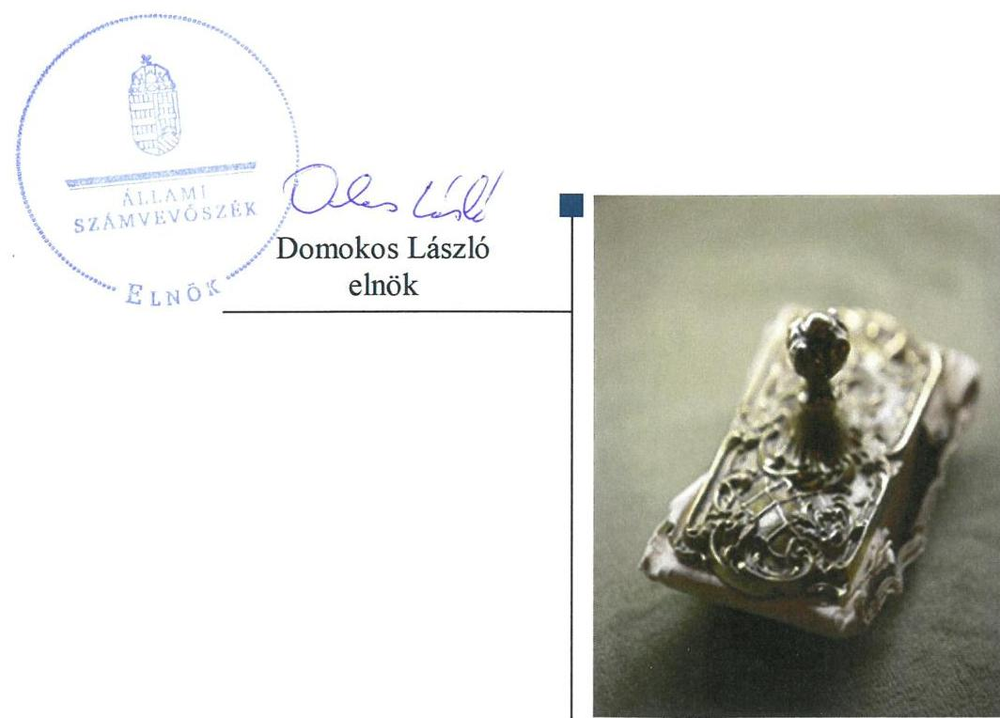
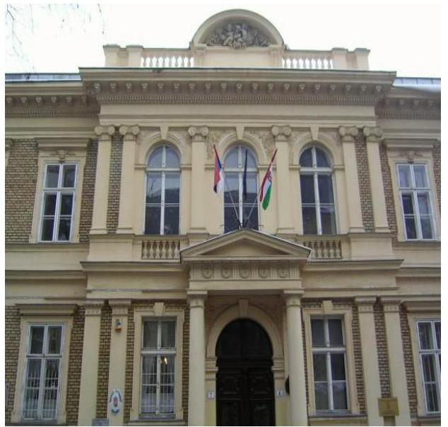
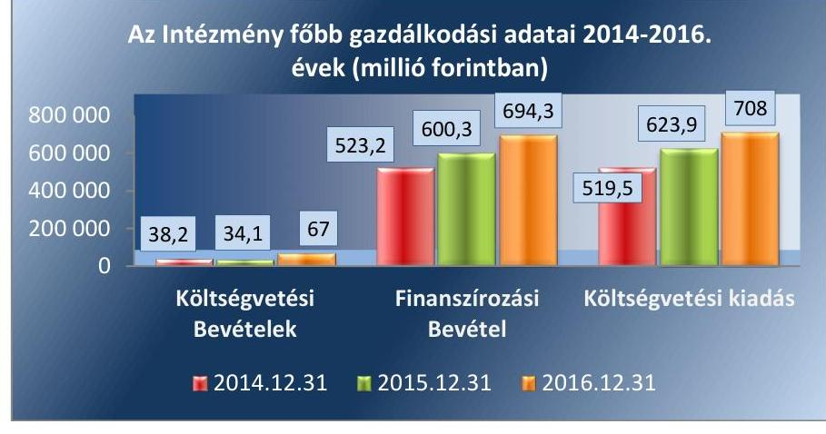
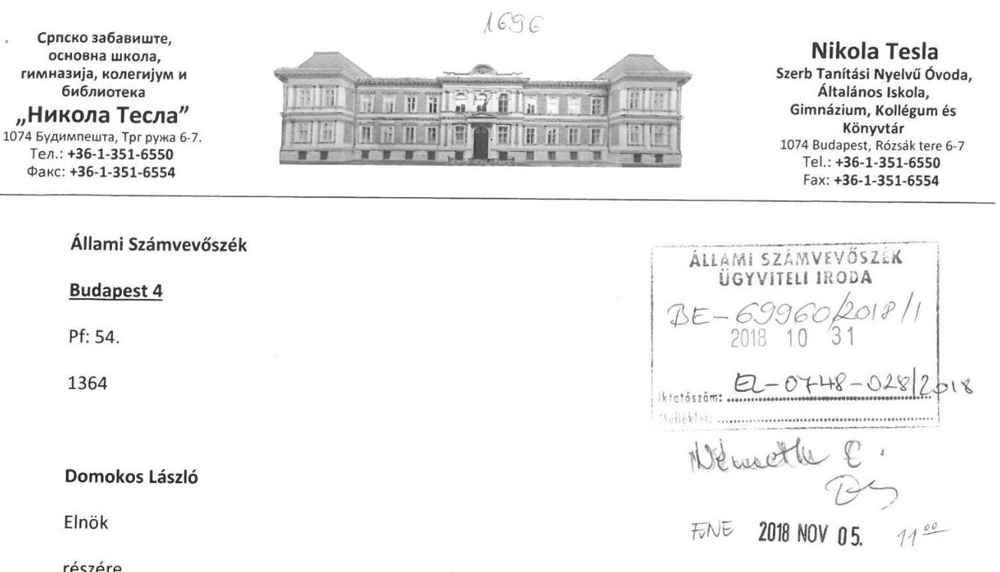
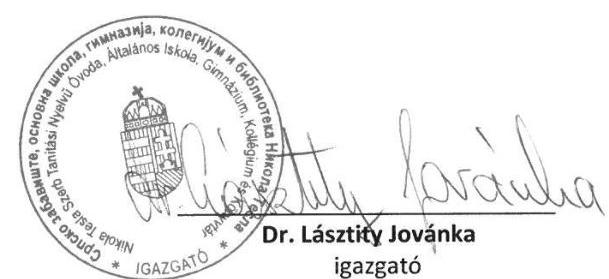
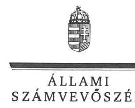
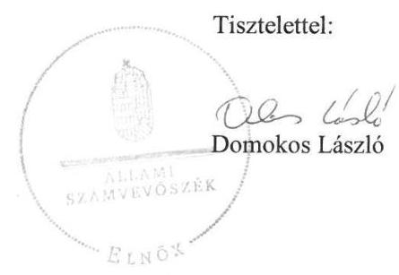
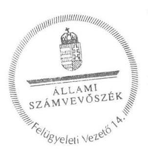

# Jelentés

**Az országos nemzetiségi önkormányzatok fenntartásában levő intézmények gazdálkodásának ellenőrzése**

Nikola Tesla Szerb Tanítási Nyelvű Óvoda, Általános Iskola, Gimnázium és Kollégium 2018.

18323 www.asz.hu

---

# Jelentés 

## Az országos nemzetiségi önkormányzatok fenntartásában levő intézmények gazdálkodásának ellenőrzése

Nikola Tesla Szerb Tanítási Nyelvű Óvoda, Általános Iskola, Gimnázium és Kollégium 2018. 12. hó 20. nap

---

# AZ ELLENŐRZÉST FELÜGYELTE: 

DR. NÉMETH ERZSÉBET felügyeleti vezető 2018. november 29-ig
KAKAS SÁNDOR felügyeleti vezető 2018. november 30-tól
AZ ELLENŐRZÉST VEZETTE ÉS A VÉGREHAJTÁSÁÉRT FELELŐS:
DR. JAKAB KORNÉL ellenőrzésvezető
A PROGRAM ÖSSZEÁLLÍTÁSÁÉRT FELELŐS:
TÓTPÁL SZABOLCS osztályvezető

IKTATÓSZÁM: EL-0365-029/2018.
Jelentéseink az Országgyúlés számítógépes hálózatán és az Interneten a www.asz.hu címen is olvashatóak.

TÉMASZÁM: 2463
ELLENŐRZÉS-AZONOSÍTÓ SZÁM: V080605

---

# TARTALOMJEGYZÉK 

■ ÖSSZEGZÉS ..... 5
■ AZ ELLENŐRZÉS CÉLJA ..... 6
■ AZ ELLENŐRZÉS TERÜLETE ..... 7
■ AZ ELLENŐRZÉS HÁTTERE, INDOKOLTSÁGA ..... 8
■ A JELENTÉS LÉNYEGES KÉRDÉSKÖREI ..... 9
■ AZ ELLENŐRZÉS HATÓKÖRE ÉS MÓDSZEREI ..... 10
■ MEGÁLLAPÍTÁSOK ..... 12
■ JAVASLATOK ..... 17
■ MELLÉKLETEK ..... 21
I. sz. melléklet: Értelmező szótár ..... 21
■ FÜGGELÉK: ÉSZREVÉTELEK ..... 23
■ RÖVIDÍTÉSEK JEGYZÉKE ..... 35

---

.

---

# ÖSSZEGZÉS 

A Szerb Országos Önkormányzat a Nikola Tesla Szerb Tanítási Nyelvü Óvoda, Általános Iskola, Gimnázium és Kollégium feletti alapitási jogkörgyakorlása szabályszerü volt, az irányitási, ellenörzési és munkáltatói jogkörgyakorlása nem volt szabályszerü. A Nikola Tesla Szerb Tanítási Nyelvü Óvoda, Általános Iskola, Gimnázium és Kollégium müködése és gazdálkodása szabályozási környezetének kialakítása, pénzügyi- és vagyongazdálkodása nem volt szabályszerü.

## Az ellenörzés társadalmi indokoltsága

Magyarország Alaptörvényének XXIX. cikke kimondja, hogy a magyarországi nemzetiségek államalkotó tényezők. Joguk van anyanyelvük használatához, a sajátnyelven való névhasználathoz, saját kultúrájuk ápolásához és az anyanyelvű oktatáshoz. A nemzetiségek létrehozhatnak helyi és országos önkormányzatokat. A nemzetiségek jogaira vonatkozó részletes szabályokat Magyarországon sarkalatos törvény határozza meg. A nemzetiségi közfeladatok ellátásához az állami központi költségvetés támogatást nyújt, melyet a nemzetiségi önkormányzatok kizárólag e feladataik ellátására használhatnak fel.

## Föbb megállapítások, következtetések, javaslatok

A Szerb Országos Önkormányzat, a Nikola Tesla Szerb Tanítási Nyelvü Óvoda, Általános Iskola, Gimnázium és Kollégium feletti alapítási jogkörgyakorlása szabályszerű volt, az irányítási, ellenőrzési és munkáltatói jogkörgyakorlása nem volt szabályszerű.

Az Intézmény belső kontrollrendszere nem védte meg a veszteségektől és a nem rendeltetésszerú használattól annak erőforrásait. Az Intézmény müködése és gazdálkodása szabályozási környezetének kialakítása nem volt szabályszerű. A kockázatkezelési rendszer kialakítása és müködtetése nem volt szabályszerű. A kontrolltevékenység kialakítása és müködtetése nem volt szabályszerű. Az információs és kommunikációs rendszer, a tevékenység és a célok megvalósításának folyamatos és eseti nyomon követését biztosító rendszer, valamint a belső ellenőrzés kialakítása és müködtetése nem volt szabályszerű.

A pénzügyi gazdálkodás esetében, a kiadási előirányzatok felhasználása során az Intézmény nem tartotta be a vonatkozó jogszabályi előírásokat.

Az előirányzat-maradvány megállapítása és elszámolása nem felelt meg a vonatkozó jogszabályi rendelkezéseknek. Az Intézmény nem a jogszabályi előírásoknak megfelelően készítette el a költségvetési beszámolóit és nem teljesítette beszámolási kötelezettségét.

Az Intézmény vagyongazdálkodása nem volt szabályszerű.

---

# AZ ELLENŐRZÉS CÉLJA 

AZ ELLENŐRZÉS CÉLJA annak értékelése volt, hogy az országos nemzetiségi önkormányzatok által alapított és fenntartott intézmények gazdálkodása, a belső kontrollrendszer kialakítása és múködése, a fenntartó önkormányzat által nyújtott támogatás, illetve az államháztartásból meghatározott célra ingyenesen juttatott vagyon felhasználása a jogszabályi előírásoknak megfelelően történt-e.

---

# **AZ ELLENŐRZÉS TERÜLETE**

## **Nikola Tesla Szerb Tanítási Nyelvű Óvoda, Általános Iskola, Gimnázium és Kollégium**

A budapesti székhelyű Nikola Tesla Szerb Tanítási Nyelvű Óvoda, Általános Iskola, Gimnázium és Kollégiumot a Klebelsberg Intézményfenntartó Központ 2013. augusztus 28-ával adta át a Szerb Országos Önkormányzatnak. Az Intézmény1 fenntartója és működtetője a 2014-2016. évek között az Önkormányzat2 volt. Az Intézmény székhelyeként és telephelyeként megjelölt ingatlanokat – mely a Fővárosi Önkormányzat, a Magyar Állam, a Budai Szerb Ortodox Egyházmegye, továbbá Lórév Község Önkormányzat kizárólagos tulajdonát képezte – használati megállapodások alapján használta.

Az Intézmény az Njt.3 és a Nektv.4 szerinti közfeladata, alapfeladata a magyarországi szerb nemzetiség óvodai nevelése, alap- és középfokú oktatás és nevelés volt. Az Iskolában a jóváhagyott pedagógiai program alapján a nemzetiségi oktatás évfolyamonként két párhuzamos osztályban folyt. Az Iskolába felvehető maximális gyermeklétszám az ellenőrzött időszak alatt 505 főről 669 főre növekedett. Az Intézmény 2014. május 28-tól hatályos Alapító Okirat5-a szerint a lórévi általános iskolai nevelést és oktatást folytató tagintézménnyel bővült. Az Intézmény ellenőrzött időszakban teljesített bevételeinek és kiadásainak alakulását az 1. ábra mutatja be.

1. ábra

*Forrás: Az Intézmény 2014-2016. évi éves költségvetési beszámoló*

Az Intézmény gazdasági szervezettel rendelkezett, vállalkozási tevékenységet nem végzett. Az Intézmény vezetőjének6 személye az ellenőrzött időszakban nem változott. Az Iskolánál foglalkoztatottak létszáma a 2014. évi 117 főről 2016. évre 136 főre növekedett.

Az Intézmény Áht.7 11. § szerinti átalakítására az ellenőrzött időszakban nem került sor.

---

# AZ ELLENŐRZÉS HÁTTERE, INDOKOLTSÁGA 

Az Alaptörvény ${ }^{8}$ XXIX. cikke kimondja, hogy a magyarországi nemzetiségek államalkotó tényezők. Joguk van anyanyelvük használatához, a saját nyelven való névhasználathoz, saját kultúrájuk ápolásához és az anyanyelvű oktatáshoz. A nemzetiségek létrehozhatnak helyi és országos önkormányzatokat. A nemzetiségek jogaira vonatkozó részletes szabályokat Magyarországon sarkalatos törvény határozza meg. A nemzetiségi közfeladatok ellátásához az állami központi költségvetés támogatást nyújt, melyet a nemzetiségi önkormányzatok kizárólag e feladataik ellátására használhatnak fel.

Az országos nemzetiségi önkormányzatok az általuk képviselt nemzetiség kulturális autonómiájának megteremtése érdekében intézményeket hozhatnak létre és vehetnek át. Az éves költségvetési törvények közvetlenül az intézményfenntartó országos nemzetiségi önkormányzatokhoz rendelik az általuk fenntartott intézmények működési támogatását. A nemzetiségi önkormányzati intézmények költségvetési gazdálkodásának, belső kontrollrendszerének kialakítása és működtetése ellenőrzésével biztosítjuk a közpénzfelhasználás minél szélesebb körének ellenőrzését, ennek során azonos szempontok szerint értékeljük az egyes országos nemzetiségi önkormányzatok fenntartásában levő intézmények gazdálkodási tevékenységét.

Az ellenőrzés eredményeként az ellenőrzött költségvetési szervek gazdálkodása javulhat, átfogó képet kaphatunk az országos nemzetiségi önkormányzatok által fenntartott intézmények gazdálkodásának sajátosságairól, hiányosságairól és az alkalmazott jó gyakorlatokról, erősítve a társadalmi bizalmat. Az ellenőrzés tapasztalatai alapján, hiányosságok feltárásával, azok megszüntetésére vonatkozó javaslatokkal hozzájárulunk a közpénzek átlátható, szabályszerű felhasználásához.

---

# A JELENTÉS LÉNYEGES KÉRDÉSKÖREI 

1. Az Önkormányzat szabályszerűen gyakorolta-e az ellenőrzött intézménnyel kapcsolatos feladatait?
2. Az Intézmény müködése és gazdálkodása során megfelelően alakította-e ki a szabályozási környezetet, belső kontrollrendszere megvédte-e a veszteségektől és nem rendeltetésszerü használattól az Intézmény erőforrásait?
3. Az Intézmény pénzügyi gazdálkodása szabályszerű volt-e?
4. Az Intézmény vagyongazdálkodása szabályszerű volt-e?

---

# AZ ELLENŐRZÉS HATÓKÖRE ÉS MÓDSZEREI 

## Az ellenőrzés típusa

Megfelelőségi ellenőrzés.

## Az ellenőrzött időszak

2014. január 1. - 2016. december 31.

## Az ellenőrzés tárgya

Az Állami Számvevőszék ellenőrzése tárgya a Szerb Országos Önkormányzat által irányított és fenntartott intézmény gazdálkodása, a belső kontrollrendszer kialakítása és múködése, a fenntartó önkormányzat által nyújtott támogatás, illetve az államháztartásból meghatározott célra ingyenesen juttatott vagyon felhasználása jogszabályi előírásoknak való megfelelőségének értékelése volt. Az ellenőrzés feltárhatta a gazdálkodást, az átalakulását, átszervezését érintő szabályozások esetleges hiányosságait, a szabályozással nem érintett gazdálkodási területeket, rámutathatott a vagyongazdálkodási tevékenység - ezen belül kiemelten a tulajdonosi joggyakorlás és vagyonkezelés - esetleges szabálytalanságaira, illetve értékelte a nemzeti vagyon nyilvántartására és elszámolására vonatkozó eljárásokat.

## Az ellenőrzött szervezet

Nikola Tesla Szerb Tanítási Nyelvű Óvoda, Általános Iskola, Gimnázium és Kollégium és a Szerb Országos Önkormányzat.

## Az ellenőrzés jogalapja

Az ellenőrzés jogszabályi alapját az ÁSZ tv. ${ }^{9}$ 1. § (3) bekezdés, 5. § (2)-(6) bekezdései, valamint az Áht. 61. § (2) bekezdésének előírásai képezték.

## Az ellenőrzés módszerei

Az ellenőrzést az ellenőrzési program szempontjai, az ellenőrzött időszakban hatályos jogszabályok, az ellenőrzés szakmai szabályai, a jelen ellenőrzésre irányadó ÁSZ ${ }^{10}$ módszertanok figyelembevételével végeztük. Az ellenőrzési kérdések megválaszolásához szükséges bizonyítékok megszer-

---

zése az ellenőrzött által rendelkezésre bocsátott dokumentumokra, adatokra alapozva, a kockázat alapú mintavételezés, valamint elemző eljárás útján történt.

Az országos nemzetiségi önkormányzatok által alapított és fenntartott intézmények gazdálkodása, a fenntartó önkormányzat által nyújtott támogatás, illetve az államháztartásból meghatározott célra ingyenesen juttatott vagyon felhasználása jogszabályi előírásoknak való megfelelőségét a 2014-2016. évek vonatkozásában értékeltük. Az intézmény belső kontrollrendszerének kialakítása és működése szabályszerűségét, a gazdálkodási jogkörök gyakorlását a 2016. év vonatkozásában ítéljük meg.

A 2016. évi bevételek és a kiadások esetében az ellenőrzés azokra a legnagyobb értékű tételekre - a lényeges sokaságra - terjedt ki, melyek összértéke eléri a teljes sokaság összértékének 50\%-át. A kockázat alapú mintavételezés alapja, a gazdasági események értékének nagysága volt. Az ellenőrzési bizonyítékként felhasználható adatforrások közé tartoztak egyrészt az ellenőrzési program részletes szempontjainál felsorolt adatforrások, másrészt minden egyéb - az ellenőrzés folyamán feltárt, az ellenőrzés szempontjából információt tartalmazó - dokumentum. Az ellenőrzés lefolytatásához az ellenőrzött szervezet a tanúsítványok kitöltésével, valamint az ÁSZ által kért dokumentumok megküldésével szolgáltatott adatokat.

Az ellenőrzés ideje alatt az ellenőrzött szervezettel történő kapcsolattartást az ÁSZ SZMSZ ${ }^{11}$-ének vonatkozó előírásai alapján biztosítottuk.

---

# 1. Az Önkormányzat szabályszerűen gyakorolta-e az ellenőrzött intézménnyel kapcsolatos feladatait? 

Összegző megállapítás

Az Önkormányzatnak az Iskolával kapcsolatos irányítási és ellenőrzési, valamint a munkáltatói jog gyakorláshoz kapcsolódó jogosultságok érvényesítése nem volt szabályszerű. Az alapításhoz kapcsolódó jogosultság gyakorlása megfelelt a jogszabályi előírásoknak.

AZ INTÉZMÉNY Alapító Okirata ${ }_{1-4}{ }^{12}$ megfelel az Ávr. ${ }^{13}$ előírásainak. Alapító Okirat ${ }_{1-4}$-át az Önkormányzat az ellenőrzött időszakban az Ávr. előírásainak megfelelően módosította.

A Szerb Országos Önkormányzat Közgyűlése az Intézmény 2016. évi beszámolóját nem hagyta jóvá, mellyel megsértették az Áhsz. ${ }^{14} 32$. § (1a) bekezdése előírását, valamint a 2014. évi és a 2016. évi maradványát nem állapította meg, mellyel nem tett eleget az Ávr. 155. § (2) bekezdésében foglalt kötelezettségének.

Az Önkormányzat, mint fenntartó nem élt az Nektv. 85. § (2) bekezdésében foglalt jogával, azaz nem kötelezte az intézményvezetőt arra, hogy az intézmény tevékenységéről átfogó módon beszámoljon.

Az Önkormányzat, mint fenntartó nem élt az Nektv. 83. § (2) bekezdésének e) pontjában foglalt jogával és nem ellenőrizte a köznevelési intézmény gazdálkodását, múködésének törvényességét, hatékonyságát, a szakmai munka eredményességét.

Az Önkormányzat a munkáltatói jogokat a Gazdasági vezető ${ }^{15}$ tekintetében nem a jogszabályi előírásoknak megfelelően gyakorolta, a Gazdasági vezető kinevezéséről 2014. évben az Áht. 9. § c) pontja, majd a 2015. évtől az Áht. 9. § d) pontja ellenére nem gondoskodott.

## 2. Az Intézmény müködése és gazdálkodása során megfelelően alakította-e ki a szabályozási környezetet, belső kontrollrendszere megvédte-e a veszteségektől és nem rendeltetésszerü használattól az Intézmény erőforrásait?

Összegző megállapítás

Az Intézmény müködése és gazdálkodása szabályozási környezetének kialakítása nem volt szabályszerű. Az Intézmény belső kontrollrendszere nem védte meg a veszteségektől és a nem rendeltetésszerü használattól annak erőforrásait.

A KONTROLLKÖRNYEZET kialakítása nem volt szabályszerű.

---

Az Intézmény SZMSZ-el nem rendelkezett az ellenőrzött időszakban, mellyel megsértették az Nektv. 25. §-ának (1) bekezdésében, valamint az Áht. 10. §-ának (5) bekezdésében foglalt előírásokat.

Az Intézmény 2016. október 1-ig nem rendelkezett a gazdálkodás részletes rendjét meghatározó Ügyrenddel ${ }^{16}$, ezzel megsértette az Áht. 10. § (5) bekezdésében foglalt jogszabályi előírásokat. Az Ávr. 13. § (2) bekezdés b), e) és f) pontjaiban előírtakat megsértve az Intézmény vezetője nem szabályozta a múködéshez kapcsolódó, pénzügyi kihatással bíró, jogszabályban nem szabályozott kérdéseket.

Az Intézmény a 2016. október 1-jétől hatályos Ügyrendjében az Ávr. előírásaival összhangban meghatározta a kötelezettségvállalásra, a pénzügyi ellenjegyzésre, a teljesítésigazolásra, az érvényesítésre és az utalványozásra vonatkozó belső előírásokat és feltételeket.

Az Intézmény 2016. február 29-ig Számviteli Politikát ${ }^{17}$ nem készített, ezáltal nem tett eleget a Számv. tv. ${ }^{18}$ 14. § (3) és (5) bekezdéseiben foglalt előírásoknak. A 2016. március 1-jén hatályba lépett Számviteli Politika megfelelt a jogszabályi előírásoknak.

Az Intézmény 2016. február 29-ig nem készítette el az Eszközök és Források Értékelési Szabályzatát, valamint az Eszközök és Források Leltározási és Leltárkészítési Szabályzatát, ezzel megsértette a Számv. tv. 14. § (5) bekezdés a) és b) pontja szerinti rendelkezéseket. Az Eszközök és Források Értékelési Szabályzatot ${ }^{19}$, valamint az Eszközök és Források Leltározási és Leltárkészítési Szabályzatot ${ }^{20}$ 2016. március 1-jével léptette hatályba, melyek megfeleltek a jogszabályban foglalt előírásoknak.

Az Intézmény 2016. augusztus 31-ig Önköltség Számítási Szabályzatot ${ }^{21}$ és Pénzkezelési Szabályzatot ${ }^{22}$ nem készített, ezáltal nem tett eleget a Számv. tv. 14. § (5) bekezdés c) és d) pontjában előírt kötelezettségének. Az Önköltség Számítási Szabályzatot és a Pénzkezelési Szabályzatot 2016. szeptember 01-jével léptette hatályba, mely megfelelt a jogszabályi előírásnak.
Az Intézmény az egységes számlakeret alapján számlarendet és az azt alátámasztó bizonylati rendet az Áhsz. 51. § (2) bekezdése, valamint a Számv tv. 161. § (2) bekezdés d) pontja ellenére nem készített.

Az Intézmény rendelkezett a Bkr. ${ }^{23}$ előírásainak megfelelő Etikai Kó-dex ${ }^{24}$-szel.

A KOCKÁZATKEZELÉSI RENDSZER kialakítása és múködtetése nem volt szabályszerű.

Az Intézmény vezetője 2016. május 31-ig a Bkr. 7. § (1)-(2) bekezdése előírásai ellenére a kockázatkezelési rendszert nem alakította ki és nem múködtette. A kockázatkezelési rendszer kialakítását és múködtetését a 2016. június 1-jén hatályba lépett Kockázatkezelési Szabályzat ${ }^{25}$, valamint a 2016. július 1-jén hatályba lépett FEUVE Szabályzat ${ }^{26}$ biztosította.

Az Intézmény vezetője 2016. október 1-jét követően nem alakított ki és nem működtetett integrált kockázatkezelési rendszert, ezzel megsértette a Bkr. 3. § b) pontjának és a 7. § (1) bekezdésének előírásait.

Az Intézmény vezetője 2016. április 29-ig nem készítette el a szabálytalanság kezelésének eljárásrendjét, ezzel megsértette a Bkr. 6. § (4) bekez-

---

désének előírásában foglaltakat. A szabálytalanságok kezelését a 2016. április 30-án hatályba lépett Szabálytalanságok Kezelésének Eljárásrendje ${ }^{27}$ biztosította.

Az Intézmény vezetője 2016. november 30-ig nem készítette el a szervezeti integritást sértő események kezelésének szabályozását, ezzel nem tett eleget a Bkr. 6. § (4) bekezdés előírásának. A 2016. december 1-ével hatályba léptetett Szervezeti Integritást Sértő Események Eljárásrendje ${ }^{28}$ nem felelt meg a Bkr. 6. § (4a) bekezdésében foglalt előírásoknak, ugyanis az nem határozta meg az érintettek meghallgatásának eljárási szabályait és a vonatkozó dokumentumok átvizsgálásának szabályait.

A KONTROLLTEVÉKENYSÉG kialakítása és múködtetése nem volt szabályszerű. A gazdálkodási jogkörök gyakorlóinak kijelölése nem volt szabályszerű, nem érvényesültek a gazdálkodási jogkörök gyakorlásához rendelt kontrollok, a kötelezettségvállalások pénzügyi ellenjegyzését az Ávr. 55. § (2) bekezdés a) pontjában foglalt előírástól eltérően, nem az arra jogosult gazdasági vezető végezte el. Az érvényesítést az Ávr. 58. § (4) bekezdés előírásától eltérően nem a gazdasági vezető, vagy az általa kijelölt személy végezte.

# AZ INFORMÁCIÓS ÉS KOMMUNIKÁCIÓS FOLYAMATOK kialakítása és múködtetése nem volt szabályszerű. 

Az Intézmény vezetője nem alakította ki és nem működtette az Intézmény információs és kommunikációs rendszerét, ezzel megsértette a Bkr. 3. § d) pontjában és 9. § (1)-(2) bekezdéseiben foglalt előírásokat.

Az Intézmény vezetője nem szabályozta a közérdekű adatok megismerésére irányuló igények teljesítésének rendjét és a kötelezően közzéteendő adatok nyilvánosságra hozatalának rendjét, nem tett eleget az Info. tv. ${ }^{29}$ 30. § (6), 35. § (3) bekezdéseiben, az Ávr. ${ }^{30}$ 13. § (2) bekezdés h) pontjában, valamint a 305/2005. (XII.25.) Korm. rendelet ${ }^{31}$ 3. §-ában előírt rendelkezéseknek.

Az Intézmény az Ltv. ${ }^{32}$ előírásának megfelelően rendelkezett egyedi Iratkezelési Szabályzattal ${ }^{33}$. Az Iratkezelési szabályzat az irattári tervet, mint kötelező mellékletet nem tartalmazta, ezzel megsértették az lkr. ${ }^{34} 3$. § (2) bekezdésében foglalt előírást. A kiadmányozásra vonatkozó szabályozást, az Intézmény belső szabályzataiban nem határozta meg, mellyel nem tett eleget az lkr. 52-54. §-aiban rögzített rendelkezéseknek. Az iktatás gyakorlata megfelelt az lkr.-ben előírt szabályoknak.

Az Intézmény - az Info. tv. 1. melléklet I. Szervezeti, személyzeti adatok 1. pont kivételével - nem tett eleget elektronikus közzétételi kötelezettségének, ezzel megsértve az Info. tv. 33. § (1) bekezdésben, az Info. tv. 37. § (1) bekezdésben valamint az Info. tv. 1. mellékletében előírt kötelezettséget.

Az Intézmény az Áht. szerinti, az elemi költségvetésre, az éves költségvetési beszámolóra, az időközi költségvetési jelentésre és az időközi mérlegjelentésre előírt adatszolgáltatási kötelezettségét nem teljesítette, megsértve ezzel az Áht. 108. § (1) bekezdés a) és b) pontjaiban foglaltakat.

---

AZ INTÉZMÉNY VEZETŐJE nem a jogszabályi előírásoknak megfelelően alakította ki az Intézmény tevékenységének, a célok megvalósításának folyamatos- és eseti nyomon követését biztosító rendszerét és a belső ellenőrzést.

Az Intézmény vezetője nem adott ki olyan szabályzatokat, nem alakított ki és nem múködtetett olyan folyamatokat a szervezeten belül, amelyek biztosították volna a rendelkezésre álló források szabályszerű, szabályozott, gazdaságos, hatékony és eredményes, átlátható felhasználását, ezzel megsértette a Bkr. 6. § (2) bekezdésében előírt rendelkezést. Az Intézmény vezetője a Bkr. 10. § előírásai ellenére nem alakította ki az Iskolában az operatív tevékenységek keretében megvalósuló folyamatos és eseti nyomon követés rendszerét.

Az Intézmény vezetője a belső ellenőrzés kialakításáról és múködtetéséről külső szolgáltató bevonásával megbízási szerződés keretében gondoskodott. A belső ellenőr funkcionális függetlensége biztosított volt.

A belső ellenőr, mint belső ellenőrzési vezető a belső ellenőrzésekhez kapcsolódó nyilvántartás vezetési kötelezettségének nem tett eleget ezzel megsértette a Bkr. 50. § (1) bekezdésében foglalt előírást.

Az Intézmény vezetője az Intézmény belső kontrollrendszerének minőségét a Bkr. 1. számú melléklet szerinti nyilatkozatban közel egy év késedelemmel értékelte, ezzel megsértette a Bkr. 11. § (2) bekezdését. Az Intézmény a nyilatkozatot az Önkormányzat részére a Bkr. 11. § (2) bekezdése előírásai ellenére nem küldte meg.

AZ INTEGRITÁS kontrollok nem müködtek megfelelően. Az Intézmény csekély mértékben müködtetett az integritást erősítő kötelezően előírt kontrollokat. Kockázatelemzése nem volt teljes körü, nem támogatta megfelelően az integritás kontrollokat. Az Intézmény világos célokat állított, amelyet külső és belső érdekeltek tudomására is hozott. Nyilvánossá tette az integritás elősegítése érdekében felállított céljait.

# 3. Az Intézmény pénzügyi gazdálkodása szabályszerű volt-e? 

## Összegző megállapítás Az Intézmény pénzügyi gazdálkodása nem volt szabályszerű.

A BEVÉTELEK elszámolása megfelelt a jogszabályi előírásoknak.
A KIADÁSI ELŐIRÁNYZATOK felhasználása során az ellenőrzés által kiválasztott - a módszertani leírás alapján a lényeges sokaság elemének minősített - 13,5 M Ft értékű mintatételből 13,5 M Ft érték esetében az Ávr. 55. § (2) bekezdés a) pontjában foglalt előírástól eltérően a kötelezettségvállalások pénzügyi ellenjegyzését, valamint az Ávr. 58. § (4) bekezdésében foglaltak ellenére az érvényesítést nem az arra jogosult gazdasági vezető végezte el. A szerződések az Ávr. előírásának megfelelően tartalmazták a szakmai, műszaki teljesítés mennyiségi és minőségi jellemzőinek meghatározását, a teljesítés határidejét, a kifizetendő összeget, azonban az Ávr. 50. § (1) bekezdés c) pontjának előírásától eltérően nem minden esetben tartalmazta a kifizetés határidejét. A felhalmozási kiadásokhoz kapcsolódó gazdasági események elszámolásának nyilvántartása

---

esetenként nem az Áhsz. 40 § (1) bekezdésében és a 15. mellékletben meghatározott egységes rovatrend előírásának megfelelően történt.

AZ ELŐIRÁNYZAT-MARADVÁNY megállapítása és elszámolása nem felelt meg az Áhsz. 39. § (3) bekezdésében foglaltaknak, mivel az Intézmény nem rendelkezett az Áhsz. 14. melléklet II. 4. a)-g) pontjainak megfelelő kötelezettségvállalások, más fizetési kötelezettségek nyilvántartásával.

AZ ÉVES KÖLTSÉGVETÉSI BESZÁMOLÓKAT az Intézmény elkészítette, azonban a Számv tv. 69. § (1) bekezdésének megfelelő leltárral nem rendelkezett. A 2014-2016. években a Számv. tv. 161. § (2) bekezdés c) pontjának előírásától eltérően nem szabályozták a főkönyvi számla és analitikus nyilvántartás kapcsolatát, ezáltal nem volt biztosított a Számv. tv. 165. § (4) bekezdésében foglaltaktól eltérően a főkönyvi könyvelés, az analitikus nyilvántartások és a bizonylatok adatai közötti egyeztetés és ellenőrzése lehetősége.

Az Intézmény az Áhsz. 32. § (1) bekezdés előírásait megsértve az éves költségvetési beszámolóit a jogszabályban meghatározott határidőn túl küldte meg az Önkormányzat részére, illetve a 2016. évi beszámoló vonatkozásában a beszámolót a megjelölt határidőn túl töltötte fel a Kincstár rendszerébe.

# 4. Az Intézmény vagyongazdálkodása szabályszerű volt-e? 

## Összegző megállapítás Az Intézmény vagyongazdálkodása nem volt szabályszerű.

AZ INTÉZMÉNY az Áhsz. 20. § (1) és a Számv. tv. 46. § (3) bekezdéseiben foglaltak ellenére a követelések, kötelezettségek, időbeli elhatárolások, sajátos elszámolások tekintetében nem végezte el a mérlegben szereplő eszközök és a források év végi értékelését.

Az ellenőrzött időszakban nem rendelkezett az Áhsz. 22. §-ában foglalt előírásoknak megfelelő leltárral, ugyanis az nem tartalmazta tételesen, ellenőrizhető módon a mérlegforduló napján meglévő eszközöket és forrásokat mennyiségben és értékben.

Az ellenőrzött időszakban az Intézmény az Áhsz. 17. mellékletében foglalt előírástól eltérően, nem rendelkezett a könyvviteli elszámolást alátámasztó analitikus nyilvántartással a követelések, az aktív időbeli elhatárolások, az egyéb sajátos eszközoldali elszámolások, a 2014-2015. években a kötelezettségek vonatkozásában.

---

# JAVASLATOK 

Az ÁSZ tv. 33. § (1) bekezdésében foglaltak értelmében az ellenőrzött szervezet vezetője köteles a jelentésben foglalt megállapításokhoz kapcsolódó intézkedési tervet összeállítani és azt a jelentés kézhezvételétől számított 30 napon belül az ÁSZ részére megküldeni. Amennyiben az ellenőrzött szervezet vezetője nem küldi meg határidőben az intézkedési tervet, vagy továbbra sem elfogadható intézkedési tervet küld, az Állami Számvevőszék elnöke az ÁSZ tv. 33. § (3) bekezdése a) és b) pontjaiban foglaltakat érvényesítheti.

## a Szerb Országos Önkormányzat elnökének

1. Gondoskodjon az Áhsz. előirásainak megfelelően, hogy a Közgyülés az Intézmény beszámolóját hagyja jóvá, valamint költségvetési maradványát az Ávr. szerint a zárszámadási határozatával egy időben állapítsa meg.
(1. sz. megállapítás 2. bekezdése alapján)
2. Gondoskodjon az Áht. szerint az Intézmény gazdasági vezetőjének kinevezéséről.
(1. sz. megállapítás 5. bekezdése alapján)

## Nikola Tesla Szerb Tanítási Nyelvű Óvoda, Általános Iskola, Gimnázium és Kollégium igazgatójának

1. Tegyen intézkedéseket az Ávr. előírásai szerint a müködéséhez kapcsolódó, a költségvetési szerv előirányzatait terhelő pénzügyi kihatással bíró, jogszabályban nem szabályozott kérdések szabályozása érdekében.
(2. sz. megállapítás 3. bekezdés 2. mondata alapján)
2. Intézkedjen a Számv. tv. és az Áhsz. előírásainak megfelelően az Iskola feladatellátásához szükséges számlarend és bizonylati rend elkészítéséről.
(2. sz. megállapítás 8. bekezdése alapján)
3. Intézkedjen a Bkr. szerinti integrált kockázatkezelési rendszer kialakítása és müködtetése érdekében.
(2. sz. megállapítás 12. bekezdése alapján)

---

4. Alakítsa ki és müködtesse a Bkr. előírásai szerint az Intézmény információs és kommunikációs rendszerét.
(2. sz. megállapítás 17. bekezdése alapján)
5. A jogszabályi elöírásoknak megfelelően intézkedjen a közérdekü adatok megismerésére irányuló igények teljesitésének, továbbá a kötelezően közzéteendő adatok nyilvánosságra hozatalának rendjének kialakításáról.
(2. sz. megállapítás 18. bekezdése alapján)
6. Intézkedjen az Iratkezelési szabályzat Ikr. előírásainak megfelelő kiegészitéséről.
(2. sz. megállapítás 19. bekezdés 3. mondata alapján)
7. Tegyen eleget az Info tv. előírásainak megfelelően elektronikus közzétételi kötelezettségének.
(2. sz. megállapítás 20. bekezdése alapján)
8. Tegyen eleget az Áht. szerinti, az elemi költségvetésre, az éves költségvetési beszámolóra, az időközi költségvetési jelentésre és az időközi mérlegjelentésre elöirt adatszolgáltatási kötelezettségének.
(2. sz. megállapítás 21. bekezdése alapján)
9. A Bkr. előírásainak megfelelően olyan szabályzatokat adjon ki, folyamatokat alakítson ki és müködtessen a szervezeten belül, amelyek biztosítják a rendelkezésre álló források átlátható, szabályszerű, szabályozott, gazdaságos, hatékony és eredményes felhasználását.
(2. sz. megállapítás 23. bekezdés 1. mondata alapján)
10. Alakítsa ki a Bkr. előírásainak megfelelően a szervezet tevékenységének és a célok megvalósitásának folyamatos és eseti nyomon követését biztositó rendszert.
(2. sz. megállapítás 23. bekezdés 2. mondata alapján)
11. Gondoskodjon a gazdálkodási jogkörök Ávr. előírásai szerinti gyakorlásáról.
(3. sz. megállapítás 2. bekezdés 1-3. mondatai alapján)

---

12. Intézkedjen a felhalmozási kiadásokhoz kapcsolódó gazdasági események egységes rovatrend szerinti nyilvántartásáról.
(3. sz. megállapítás 2. bekezdés 4. mondata alapján)
13. Gondoskodjon a kötelezettségvállalások, más fizetési kötelezettségek Áhsz. szerinti nyilvántartásáról.
(3. sz. megállapítás 3. bekezdése alapján)
14. Gondoskodjon a Számv. tv. előírásainak megfelelő, leltárral alátámasztott költségvetési beszámoló elkészítéséről.
(3. sz. megállapítás 4. bekezdés 1. mondata alapján)
15. Biztosítsa a fökönyvi könyvelés, az analitikus nyilvántartások és a bizonylatok adatai közötti egyeztetés és ellenőrzés Számv. tv. szerinti lehetőségét.
(3. sz. megállapítás 4. bekezdés 2. mondata alapján)
16. Gondoskodjon a mérlegben szereplő eszközök és források Számv. tv. és Áhsz. előírásainak megfelelő értékeléséről.
(4. sz. megállapítás 1. bekezdése alapján)
17. Intézkedjen olyan leltár összeállításáról, amely az Áhsz. előírásainak megfelelően, tételesen, ellenőrizhető módon tartalmazza az Intézmény mérleg fordulónapján meglévő eszközeit és forrásait mennyiségben és értékben.
(4. sz. megállapítás 2. bekezdése alapján)
18. Gondoskodjon arról, hogy a könyvviteli elszámolást alátámasztásához az analitikus nyilvántartások az Áhsz-nek megfelelően rendelkezésre álljanak.
(4. sz. megállapítás 3. bekezdése alapján)

---

.

---

# MELLÉKLETEK 

- I. SZ. MELLÉKLET: ÉRTELMEZŐ SZÓTÁR
finanszírozási bevétel irányító szerv
költségvetési bevétel
költségvetési kiadás
közfeladat
működtetés
nemzetiségi önkormányzat
nemzetiségi köznevelési intézmény
nemzetiségi többcélú intézmény
tulajdonosi joggyakorló

Az intézmény finanszírozási bevételét képezte: belföldi finanszírozási bevételei A költségvetési szerv tekintetében az e törvényben meghatározott irányítási hatáskört gyakorló szerv. (Forrás: Áht. 1. § 9. pontja)
Az intézmény költségvetési bevételét képezte: működési bevételek; felhalmozási bevételek; működési célú átvett pénzeszközök; működési célú támogatások államháztartáson belülről;
Az intézmény költségvetési kiadását képezte: személyi juttatások; munkaadót terhelő járulékok és szociális hozzájárulási adó; dologi kiadások; egyéb működési célú kiadások; beruházások
Jogszabályban meghatározott állami vagy önkormányzati feladat, amit az arra kötelezett közérdekből, a jogszabályban meghatározott követelményeknek és feltételeknek megfelelve végez, ideértve a lakosság közszolgáltatásokkal való ellátását, továbbá az állam nemzetközi szerződésekben vállalt kötelezettségeiből adódó közérdekű feladatokat, valamint e feladatok ellátásakor szükséges infrastruktúra biztosítását is. (Forrás: Nvtv. 3. § (1) bekezdés 7. pontja, hatálytalan: 2015. január 1-jétől) „Közfeladat a jogszabályban meghatározott állami vagy önkormányzati feladat". A közfeladatok ellátása költségvetési szervek alapításával és működtetésével, vagy azok ellátásához szükséges pénzügyi fedezet törvényben meghatározott eszközökkel, részben, vagy egészben történő biztosításával valósul meg. (Forrás: Áht. 3/A. § (1) bekezdés, hatályos 2015. január 1-jétől)
A nemzeti vagyon birtoklásából, használatából, hasznai szedéséből, a nemzeti vagyon fenntartásából és üzemeltetéséből álló tevékenységek együttese, amely - jogszabály vagy szerződés alapján - a nemzeti vagyon felújítására, fejlesztésére, a birtoklásának, használatának hasznai szedése jogának továbbengedésére is kiterjed. (Forrás: Nvtv. 3. § 10. pontja)

A nemzetiségek jogairól szóló törvényben meghatározott nemzetiségi közszolgáltatási feladatokat ellátó, testületi formában működő, jogi személyiséggel rendelkező, demokratikus választások útján e törvény alapján létrehozott szervezet, amely a nemzetiségi közösséget megillető jogosultságok érvényesítésére, a nemzetiségek érdekeinek védelmére és képviseletére, a feladat- és hatáskörébe tartozó nemzetiségi közügyek települési, területi vagy országos szinten történő önálló intézésére jön létre. (Forrás: a nemzetiségek jogairól szóló 2011. évi CLXXIX. törvény, 2. § 2. pont)
Az a köznevelési intézmény, amelynek alapító okirata a nemzeti köznevelésről szóló törvényben foglaltak szerint tartalmazza a nemzetiségi feladatok ellátását, feltéve, hogy e feladatokat a köznevelési intézmény ténylegesen ellátja, továbbá óvoda, Intézmény és kollégium esetén a tanulók legalább huszonöt százaléka részt vesz a nemzetiségi óvodai nevelésben, illetve a nemzetiségi Intézményi nevelésben-oktatásban. nemzetiségi többcélú intézményen, nemzetiségi tagintézményen és nemzetiségi köznevelési intézmény intézményegységén a köznevelési törvény szerinti többcélú intézmény, tagintézmény és intézményegység értendő (Forrás: Nemzetiségi tv. 2. § 4. pont b,)

Aki a nemzeti vagyon felett az államot vagy a helyi önkormányzatot megillető tulajdonosi jogok és kötelezettségek összességének gyakorlására jogosult. (Forrás: Nvtv. 3. § (1) bekezdés 17. pontja)

---

vagyongazdálkodás
nemzeti vagyon

A nemzeti vagyongazdálkodás feladata a nemzeti vagyon rendeltetésének megfelelő, az állam, az önkormányzat mindenkori teherbíró képességéhez igazodó, elsődlegesen a közfeladatok ellátásához és a mindenkori társadalmi szükségletek kielégítéséhez szükséges, egységes elveken alapuló, átlátható, hatékony és költségtakarékos működtetése, értékének megőrzése, állagának védelme, értéknövelő használata, hasznosítása, gyarapítása, továbbá az állam vagy a helyi önkormányzat feladatának ellátása szempontjából feleslegessé váló vagyontárgyak elidegenítése. (Forrás: Nvtv. 7. § (2) bekezdése)
a) az állam vagy a helyi önkormányzat kizárólagos tulajdonában álló dolgok,
b) az a) pont hatálya alá nem tartozó, az állam vagy a helyi önkormányzat tulajdonában lévő dolog,
c) az állam vagy a helyi önkormányzat tulajdonában lévő pénzügyi eszközök, továbbá az államot vagy a helyi önkormányzatot megillető társasági részesedések,
d) az államot vagy a helyi önkormányzatot megillető bármely vagyoni értékkel rendelkező jogosultság, amelyet jogszabály vagyoni értékű jogként nevesít,
e) Magyarország határa által körbezárt terület feletti légtér,
f) az üvegházhatású gázok kibocsátási egységeinek kereskedelméről szóló törvény szerinti kibocsátási egység és légiközlekedési kibocsátási egység, valamint az ENSZ Éghajlatváltozási Keretegyezménye és annak Kiotói Jegyzőkönyv végrehajtási keretrendszeréről szóló törvény szerinti kiotói egység,
g) állami vagy helyi önkormányzati fenntartású közgyűjtemény (muzeális intézmény, levéltár, közgyűjteményként működő kép- és hangarchívum, valamint könyvtár) saját gyűjteményében nyilvántartott kulturális javak körébe tartozó dolog, kivéve, ha az állami vagy önkormányzati tulajdon jogszerű létrejötte kétséget kizáró módon nem bizonyítható és a dologra nézve más a tulajdonjogát bizonyítja vagy a kulturális javakra vonatkozó jogszabályokban meghatározott eljárás keretében valószínűsíti,
h) a régészeti lelet,
i) a nemzeti adatvagyon körébe tartozó állami nyilvántartások fokozottabb védelméről szóló törvény szerinti nemzeti adatvagyon.
(Forrás: Nvtv. 1.§ (2) bekezdés)

---

# FÜGGELÉK: ÉSZREVÉTELEK 

A jelentéstervezetet a Számvevőszék 15 napos észrevételezésre megküldte az ellenőrzött szervezetek vezetőinek az ÁSZ tv. 29. §* (1) bekezdése előírásának megfelelően.

Nikola Tesla Szerb Tanítási Nyelvü Óvoda, Általános Iskola, Gimnázium és Kollégium igazgatója a jelentéstervezet megállapításaira írásban észrevételt tett, a Szerb Országos Önkormányzat elnöke a jelentéstervezet megállapításaira nem tett észrevételt.
Az ÁSZ tv. 29. § (3) bekezdésével összhangban az ÁSZ a Függelékben feltünteti az ellenőrzés megállapításaival kapcsolatban tett, figyelembe nem vett észrevételeket, és megindokolja, hogy azokat miért nem fogadta el.

[^0]
[^0]:    * 29. § (1) Az Állami Számvevőszék az ellenőrzési megállapításait megküldi az ellenőrzött szervezet vezetőjének vagy az általa megbízott személynek, és annak, akinek személyes felelősségét állapította meg.
    (2) Az ellenőrzött szervezet vezetője és a felelősként megjelölt személy az ellenőrzés megállapításaira tizenöt napon belül írásban észrevételt tehet.
    (3) Az Állami Számvevőszék az észrevételre a beérkezésétől számított harminc napon belül írásban válaszol. A figyelembe nem vett észrevételeket köteles a jelentésben feltüntetni, és megindokolni, hogy azokat miért nem fogadta el.

---

Tárgy: Észrevétel, tájékoztatás a Számvevőszék jelentéstervezetére

Tisztelt Domokos László Elnök Úr!

A Nikola Tesla Szerb Tanítási Nyelvű Óvoda, Általános Iskola, Gimnázium, Kollégium és Könyvtár részére megküldött Számvevőszéki jelentéstervezetet 2018.10.13-án megkaptuk, és a törvényi előírásoknak megfelelően a tett megállapításokra 15 napon belül észrevételt teszünk.

Jelentés lényeges kérdéskörei az Intézmény vonatkozásában:
2. Az Intézmény múködése és gazdálkodása során megfelelően alakította-e ki a szabályozási környezetet, belső kontrollrendszere megvédte-e a veszteségektől és nem rendeltetésszerú használattól az Intézmény erőforrásait?

Ezen kérdéskörre vonatkozó föbb ASZ megállapítások: 2.1-2.9 pontokban összefoglalva, összevonva írtuk le és ezen pontonként tettük meg észrevételünket.
2.1 / Az intézmény az ellenőrzött időszakban nem rendelkezett SZMSZ-el, illetve az beküldött Úgyrend, a Számviteli Politika, Eszközök és Források Értékelési Szabályzata, Eszközök és Források Leltározási és Leltárkészítési Szabályzata, az Önköltség Számítási Szabályzata, a Pénzkezelési Szabályzata, a Kockázatkezelési Szabályzata, a FEUVE Szabályzata, és a Szabálytalanságok Kezelésének Eljárásrendje, 2016. év során - akár december 1-vel- léptek hatályba. Ez alapján az ellenőrző szerv olyan megállapítást tett, - helyesen - hogy az intézmény nem tett eleget a szabályzatok életbelépését megelőző időszakra a vonatkozó jogszabályok, kormányrendeletek előírásainak, azokat nem tartotta be. (2. sz. megállapítás 2,3,4,5,6,7,12, 14. bekezdések)

---

Észrevétel, tájékoztatás az 2.1 pontban összefoglalt megállapításokra:
Az Intézmény sajnálatos módon az adatszolgáltatást rosszul értelmezve nem a 2016. teljes évre vonatkozó Szabályzatokat csatolta be az ellenőrzésre, hanem a legutolsó érvényben lévőket.

Igen, az Intézmény a leadott szabályzatok, SZMSZ, érvényességi ideje előtt is rendelkezett ezen kötelezően elkészített és alkalmazott szabályzatokkal, melyeket hatályon kívül helyezve lefúzve tárol az Intézményben.

Kérem a Tisztelt Ellenőrző szervet, tegye lehetővé, ezen Szabályzatok, SZMSZ mely a honlapunkön is elérhető - pótlólagos bemutatását, mert nem szeretnénk, hogy az általunk rosszul értelmezett adatszolgáltatás miatt az intézményünk „Szabálytalanul,, müködőnek minősülne.
2.2 / Az intézmény nem rendelkezett egységes számlakerettel, számlarenddel. (2. sz. megállapítás 8. bekezdés)

Észrevétel, tájékoztatás az 2.2 pontban leírt megállapításokra
Az Intézmény sajnálatos módon nem adta át a kért dokumentumokat ellenőrző szerv részére, annak ellenére, hogy rendelkezett - rendelkezik számlakerettel, számlarenddel.

Kérem a Tisztelt Ellenőrző szervet, tegye lehetővé, ezen dokumentumok pótlólagos bemutatását.
2.3 /Az intézmény vezetője 2016. október 1-ét követően nem alakított ki és nem müködtetett integrált kockázatkezelési rendszert (2. sz. megállapítás 13. bekezdés)

Tájékoztatás az 2.3 pontban leírt megállapításra
Észrevétel jogos, az Intézmény a meglévő kockázatkezelési rendszer mellett a teljes körű és integrált kockázatkezelési rendszer kialakítását 2018 év során végezte el, és befejezése, alkalmazása ez év végével fog megtörténni.
2.4 / Az intézmény vezetője 2016. november 30-ig nem készítette el a szervezeti integritást sértő események kezelésének szabályozását és nem határozta meg az érintettek meghallgatásának eljárási szabályait és a vonatkozó dokumentumok átvizsgálásának szabályait. (2. sz. megállapítás 15. bekezdés)

Tájékoztatás a 2.4 pontban összefoglalt megállapításra
Észrevétel jogos, az Intézmény a meglévő szabályzatot ki fogja egészíteni, és módosítani az észrevételezett hiányosságok pótlásával a következő 3 hónapon belül.
2.5 / A gazdálkodási jogkörök gyakorlóinak a kijelölése nem volt szabályszerű. ... az Avr.55§
(2) bekezdés a) pontjában foglalt előírástól eltérően nem az arra jogosult gazdasági vezető végezte el. (2. sz. megállapítás 16. bekezdés)

---

Tájékoztatás az 2.5 pontban leírt megállapításra
Az Intézmény sajnálatos módon nem adta át az Ellenőrző szerv részére a kiadott kijelölést a pénzügyi ellenjegyzésre, melyre a meghatalmazást 2015. év során a gazdasági vezető írt alá.

Kérem a Tisztelt Ellenőrző szervet, tegye lehetővé, ezen dokumentum pótlólagos bemutatását.
2.6 / Az intézmény vezetője nem alakította ki és nem múködteti az Intézmény információs és kommunikációs rendszerét, nem szabályozta a közérdekü adatok megismerésére irányuló igények teljesítésének rendjét, az iratkezelési szabályzat nem tartalmazta az irattári tervet, és nem tett eleget elektronikus közzétételi kötelezettségének (az szervezeti és személyzeti adatok kivételével) (2. sz. megállapítás 17,18,19,20. bekezdés)

Tájékoztatás az 2.6. pontban összefoglalt megállapításra
A megállapítás részben jogos az Intézmény a 2011. évi CXII törvény 1. mellékletének II. és III. pontja szerinti közzétételi listának csak részben tett eleget a saját honlapján és a jogszabályi változásokat a közérdekű adatok megismerésére irányuló igények teljesítésének rendjében a teljeség igénye nélkül csak az SZMSZ-ben szabályozta, de a beidézett törvény szerinti elektronikus közzétételi kötelezettségének az ágazati jogszabályokban meghatározott információs rendszerekhez (KIR, KIFIR, DARI, KIR-STAT) történő adatszolgáltatások teljesítésével jelentős mértékben eleget tett.
2.7 / Az Intézmény az Áht. szerinti az elemi költségvetésre, az éves költségvetési beszámolóra, az időközi költségvetési jelentére, az időközi mérlegjelentésre előírt adatszolgáltatási kötelezettségét nem teljesítette. (2. sz. megállapítás 21. bekezdés)

Tájékoztatás a 2.7 pontban összefoglalt megállapításra
Az Intézmény minden esetben határidőre elkészíti és átadja az Áth. 108§ (1) bek. a) és b) pontjában előírt adatszolgáltatási, jelentési kötelezettségét az intézmény fenntartója a Szerb Országos Önkormányzat részére, mely dokumentumokat - a kérteket - be is csatoltuk az ellenőrző szerv részére. Amennyiben az adatszolgáltatásunk esetlegesen hiányos volt, kérem, tegyék lehetővé annak pótlását.
2.8 / Az intézmény vezetője nem adott ki olyan szabályzatokat, nem alakított ki és nem múködtetett olyan folyamatokat, melyek biztosították volna a rendelkezésre álló források szabályszerű, szabályozott, gazdaságos, hatékony és eredményes, átlátható felhasználását, és nem alakított ki az iskolában az operatív tevékenységek keretében megvalósuló folyamatos és eseti nyomon követés rendszerét. (2. sz. megállapítás 23. bekezdés)

Tájékoztatás a 2.8 pontban összefoglalt megállapításra
Az Intézmény ki fogja egészíteni a folyamatba épített és belső ellenőrzési rendszerét és el fogja készíteni - 3 hónapon belül - minden munkafolyamatára vonatkozó ellenőrzési nyomvonalát, ehhez tartozó eljárásrendet, a kockázati térképet és mindehhez szükséges szabályzatát, melyet alkalmazni is fog.

---

2.9 / A belső ellenőr a belső ellenőrzéshez kapcsolódó nyilvántartásnak nem tett eleget. (2. sz. megállapítás 25. bekezdés)

Tájékoztatás az 2.9 pontban leírt megállapításra
A belső ellenőr minden évben táblázatba, - a jogszabályi előírásokat betartva - elkészítette az elvégzett ellenőrzésekről a nyilvántartásokat, csak sajnálatos módon ezek nem lettek becsatolva.

Kérem a Tisztelt Ellenőrző szervet, tegye lehetővé, ezen dokumentumok pótlólagos bemutatását.

# 3. Az Intézmény pénzügyi gazdálkodása szabályszerű volt -e? 

Ezen kérdéskörre vonatkozó főbb ASZ megállapítások: 3.1-3.5 pontokban összefoglalva, összevonva írtuk le és ezen pontonként tettük meg észrevételünket
3.1 / Az Intézmény az Ávr. 55§ (2) a) pontban foglalt előírásoktól eltérően a pénzügyi ellenjegyzést, valamint a Ávr. 58§ (4) bekezdésben foglaltak ellenére az érvényesítést nem az ara jogosult végezte el. (3. sz. megállapítás 2. bekezdés)

Tájékoztatás a 3.1 pontban összefoglalt megállapításra
Az Intézmény sajnálatos módon nem adta át az Ellenőrző szerv részére az kiadott kijelölést a pénzügyi ellenjegyzésre, és az érvényesítésre, melyre a meghatalmazást 2015. év során a gazdasági vezető, illetve az Intézmény Igazgatója írt alá.

Kérem a Tisztelt Ellenőrző szervet, tegye lehetővé, ezen dokumentum pótlólagos bemutatását.
3.2 / Az Intézmény szerződései az Ávr 50 § (1) a) pontban foglalt előírásoktól eltérően nem minden esetben tartalmazzák a kifizetés határidejét. (3. sz. megállapítás 2. bekezdés közepe)

Tájékoztatás a 3.2 pontban összefoglalt megállapításra
Az szerződéseink, ajánlatkéréseink felülvizsgálatával kötelezően kitöltendő pontként jelöltük meg a fizetési határidőt, így ezen mulasztásunk, hiányosságunk a következőkben már nem fog jelentkezni.
3.3 / Az Intézménynél a felhalmozási kiadásokhoz kapcsolódó gazdasági események elszámolásának nyilvántartása esetenként nem az Áhsz 40 § (1) bekezdésben meghatározott egységes rovatrendet előírásának megfelelően történt. (3. sz. megállapítás 2. bekezdés utolsó mondata)

---

Tájékoztatás az 3.3 pontban összefoglalt megállapításra
A gazdasági vezető át fogja nézni a jelenlegi szokásjog szerint fennálló rovatrendet és ki fogja adni azokat az intézkedéseket, melyek szükségesek, hogy a könyvelés megfeleljen az előírt rovatrendnek, a rovatrend szabályszerűen kerüljön alkalmazásra és az esetlegesen előforduló hibák kijavítása megtörténjen.
3.4 / Az Intézmény nem rendelkezett megfelelő kötelezettségvállalás és más fizetési kötelezettség nyilvántartásával. (3. sz. megállapítás 3. bekezdés)

Tájékoztatás az 3.4 pontban összefoglalt megállapításra
Az Intézmény 2018-ban bevezette, és alkalmazza az EPER iktatási programját, és ennek segítségével a kötelezettségvállalását és más fizetési kötelezettségeit is nyilván tudja tartani.
3.5 / Az Intézmény az éves költségvetési beszámolókat elkészítette, azonban megfelelő leltárral nem rendelkezett. Nem lett szabályozva a főkönyvi számla és az analitikus nyilvántartás kapcsolata, így egyeztetés, ellenőrzés lehetősége nem volt biztosított (3. sz. megállapítás 4. bekezdés)

Tájékoztatás az 3.5 pontban összefoglalt megállapításra
Az Intézmény 2018-éves záráshoz már a teljes eszközök források leltárát el fogja készíteni, ehhez a szükséges feladatokat kiadta, illetve az analitikák havi, negyedéves, esetenként éves egyeztetését is kialakította.

# 4. Az Intézmény vagyongazdálkodása szabályszerű volt-e? 

Ezen kérdéskörre vonatkozó föbb ASZ megállapítások: 4.1-4.3 pontokban összefoglalva, összevonva írtuk le és ezen pontonként tettük meg észrevételünket
4.1 / Az Intézmény a követelések, kötelezettségek az időbeli elhatárolások, sajátos elszámolások tekintetében nem végezte el a mérlegben szereplő eszközök források év végi átértékelését. (4. sz. megállapítás 1. bekezdés)

Tájékoztatás az 4.1 pontban összefoglalt megállapításra
A könyvekben a befektetett eszközök a készletek a valós piaci értéket mutatják, külföldi pénznemben követelése, kötelezettsége nincs, így ezen tételek is a valós értéket tükrözték az előző években is.

Az Intézmény 2018-éves záráshoz az eszközök, források átértékelése el fog készülni, része lesz a beszámolónak.
4.2 / Az Intézmény az ellenőrzött időszakban nem rendelkezett megfelelő leltárral. (4. sz. megállapítás 2. bekezdés)

---

Tájékoztatás a 4.2 pontban összefoglalt megállapításra
Az Intézmény minden évben elkészítette a készlet leltárát mennyiségben és értékben, illetve a szabályzatban előírt tárgyi eszköz leltárt is, de sajnos nem minden eszköz és forrás leltára készült el.
2018. év zárásakor a jogszabályi előírások és szabályzatok alapján minden eszköz leltára el fog készülni.
4.3 / Az Intézmény nem rendelkezett a könyvviteli elszámolást alátámasztó analitikus nyilvántartással a követelések, az aktív időbeli elhatárolások, egyéb sajátos eszközoldali elszámolások, a 2014-2015. években a kötelezettségek vonatkozásában. (4. sz. megállapítás 3. bekezdés)

Tájékoztatás a 4.3 pontban összefoglalt megállapításra
Az Intézmény 2018-éves záráshoz minden szükséges analitikus nyilvántartást el fog készíteni, ahogy azokat már folyamatában is készíti.

Budapest, 2018.10.24.

Tisztelettel:

---

ELNÖK

Ikt.szám: EL-0748-029/2018

# Dr. Lásztity Jovánka úrhölgy 

igazgató

Nikola Tesla Szerb Tanítási Nyelvü Óvoda, Általános Iskola, Gimnázium, Kollégium és Könyvtár

## Budapest

## Tisztelt Igazgató Úrhölgy!

„Az országos nemzetiségi önkormányzatok fenntartásában lévő intézmények gazdálkodásának ellenőrzése - Nikola Tesla Szerb Tanítási Nyelvü Óvoda, Általános Iskola, Gimnázium és Kollégium" címú jelentéstervezetre tett észrevételét köszönettel megkaptam.
Az ellenőrzési megállapításokra vonatkozó észrevételét az Állami Számvevőszékről szóló 2011. évi LXVI. törvény (a továbbiakban: ÁSZ tv.) 29. § (2) bekezdésében meghatározott tizenöt napos határidőn belül küldte meg. Az Állami Számvevőszék észrevétellel kapcsolatos álláspontját a mellékletként csatolt, a felügyeleti vezető által készített indokolás tartalmazza.
Tájékoztatom, hogy az Állami Számvevőszék a figyelembe nem vett észrevételeket az ÁSZ tv. 29. § (3) bekezdésében előírtak szerint köteles a jelentésében feltüntetni és megindokolni, hogy azokat miért nem fogadta el.

Budapest, 2018. 11. hó 20 nap

Tisztelettel:

Melléklet: Észrevételre adott válasz

---

# „Az országos nemzetiségi önkormányzatok fenntartásában lévő intézmények gazdálkodásának ellenörzése - Nikola Tesla Szerb Tanítási Nyelvü Óvoda, Általános Iskola, Gimnázium és Kollégium" címü jelentéstervezethez tett észrevételre adott válasz 

Nikola Tesla Szerb Tanítási Nyelvü Óvoda, Általános Iskola, Gimnázium, Kollégium és Könyvtár (továbbiakban: Intézmény)

A jelentéstervezetre tett észrevételeket áttekintettem, annak kezelésével kapcsolatban a következő tájékoztatást adom.

- A 2.1/ észrevételében igazgató úrhölgy jelzi, hogy az adatszolgáltatást rosszul értelmezve nem a 2016. teljes évre vonatkozó szabályzatokat csatolták be az Állami Számvevőszék (továbbiakban: ÁSZ részére), hanem a legutolsó érvényben lévőket. Az Intézmény a leadott szabályzatok érvényességi ideje előtt is rendelkezett a kötelezően elkészített és alkalmazott szabályzatokkal, melyeket hatályon kívül helyezve, lefüzve tárolnak az intézményben, és kéri a hatályon kívül helyezett szabályzatok pótlólagos bemutatásának lehetőségét. Az ÁSZ tv. 28. § (2) bekezdése alapján az ellenőrzés jelenlegi szakaszában nincs már lehetőség pótlólagosan megküldésre kerülő ellenőrzési dokumentumokat befogadnunk. A jelentéstervezet kapcsolódó megállapításainak módosítása nem indokolt.
- A 2.2/ észrevételében igazgató úrhölgy tájékoztat, hogy az Intézmény rendelkezik számlakerettel, számlarenddel és kéri ezen dokumentumok pótlólagos bemutatásának lehetőségét. Az ÁSZ tv. 28. § (2) bekezdése alapján az ellenőrzés jelenlegi szakaszában nincs már lehetőség pótlólagosan megküldésre kerülő ellenőrzési dokumentumokat befogadnunk. A jelentéstervezet kapcsolódó megállapításainak módosítása nem indokolt.
- A 2.3/ észrevétel nem vitatja a jelentéstervezet megállapítását. Igazgató úrhölgy tájékoztat, hogy a teljes körű és integrált kockázatkezelési rendszer kialakítását 2018. év során végezte el, és befejezése, alkalmazása ez év végével fog megtörténni. Az Állami Számvevőszékről szóló 2011. évi LXVI. törvény (továbbiakban: ÁSZ tv.) 33. § (1) bekezdése alapján az ellenőrzött szervezet vezetője a nyilvánosságra hozott ÁSZ jelentésben foglalt, intézkedést igénylő megállapításokra köteles intézkedési tervet készíteni. Ennek elkészítésére a jelentés nyilvánosságra hozatala után 30 nap áll majd rendelkezésére. A megállapítás módosítása nem indokolt.
- A 2.4/ észrevétel nem vitatja a jelentéstervezet megállapítását. Igazgató úrhölgy tájékoztat, hogy az Intézmény a szervezeti integritást sértő események kezelésének szabályzatát ki fogja egészíteni, és módosítani az észrevételezett hiányosságok pótlásával a következő 3 hónapon belül. Az ÁSZ tv. 33. § (1) bekezdése alapján az ellenőrzött szervezet vezetője a nyilvánosságra hozott ÁSZ jelentésben foglalt, intézkedést igénylő megállapításokra köteles intézkedési tervet készíteni. Ennek elkészítésére a jelentés nyilvánosságra hozatala után 30 nap áll majd rendelkezésére. A megállapítás módosítása nem indokolt.
- A 2.5/ észrevételében igazgató úrhölgy jelzi, hogy az Intézmény nem adta át az ÁSZ részére a kiadott kijelölést a pénzügyi ellenjegyzésre, melyre a meghatalmazást 2015. év során a gazdasági vezető írt alá és kéri a dokumentum bemutatásának pótlólagos lehetőségét. Az ÁSZ tv. 28. § (2) bekezdése alapján az ellenőrzés jelenlegi szakaszában nincs már lehetőség pótlólagosan megküldésre kerülő ellenőrzési dokumentumokat befogadnunk. A jelentéstervezet kapcsolódó megállapításainak módosítása nem indokolt.

---

- A 2.6/ észrevételében igazgató úrhölgy tájékoztat, hogy az információs önrendelkezési jogról és az információszabadságról szóló 2011. évi CXII. törvény (továbbiakban Info tv.) 1. melléklete szerinti közzétételi listának csak részben tett eleget a saját honlapján, azonban az ágazati jogszabályokban meghatározott információs rendszerekhez történő adatszolgáltatások teljesítésével jelentős mértékben eleget tett.
Az észrevételben nevesített információs rendszerekhez (KIR, KIFIR, DARI, KIRSTAT) történő adatszolgáltatás nem pótolja az Info tv. szerinti közzétételi kötelezettséget, ezért a jelentéstervezet kapcsolódó megállapításának módosítása nem indokolt.
- A 2.7/ észrevétel szerint az Intézmény minden esetben határidőre elkészíti és átadja a Szerb Országos Önkormányzat részére az elemi költségvetésre, az éves költségvetési beszámolóra, az időközi költségvetési jelentésre, az időközi mérlegjelentésre előírt, törvény szerinti adatszolgáltatási kötelezettségét. Az észrevétel kapcsán ismételten áttekintettük az ellenőrzés során rendelkezésre bocsátott dokumentumokat. Megállapítottuk, hogy a Magyar Államkincstár részére történő adatszolgáltatást nem teljesítette, mivel azt dokumentummal nem igazolta. Az ÁSZ tv. 28. § (2) bekezdése alapján az ellenőrzés jelenlegi szakaszában nincs már lehetőség pótlólagosan megküldésre kerülő ellenőrzési dokumentumokat befogadnunk. A jelentéstervezet kapcsolódó megállapításainak módosítása nem indokolt.
- A 2.8/ észrevétel nem vitatja a jelentéstervezet megállapítását. Igazgató úrhölgy tájékoztat, hogy az Intézmény ki fogja egészíteni a folyamatba épített és belső ellenőrzési rendszerét, továbbá 3 hónapon belül elkészíti minden munkafolyamatra az ellenőrzési nyomvonalat és a kapcsolódó dokumentumokat. Az ÁSZ tv. 33. § (1) bekezdése alapján az ellenőrzött szervezet vezetője a nyilvánosságra hozott ÁSZ jelentésben foglalt, intézkedést igénylő megállapításokra köteles intézkedési tervet készíteni. Ennek elkészítésére a jelentés nyilvánosságra hozatala után 30 nap áll majd rendelkezésére. A megállapítás módosítása nem indokolt.
- A 2.9/ észrevétel szerint a belső ellenőr minden évben elkészítette az elvégzett ellenőrzésekről a nyilvántartásokat, azonban ezeket nem küldték be az ÁSZ részére és kéri a dokumentum pótlólagos bemutatásának lehetőségét. Az ÁSZ tv. 28. § (2) bekezdése alapján az ellenőrzés jelenlegi szakaszában nincs már lehetőség pótlólagosan megküldésre kerülő ellenőrzési dokumentumokat befogadnunk. A jelentéstervezet kapcsolódó megállapításainak módosítása nem indokolt.
- A 3.1/ észrevételében igazgató úrhölgy jelzi, hogy az Intézmény nem adta át az ÁSZ részére a kiadott kijelölést a pénzügyi ellenjegyzésre és az érvényesítésre, melyre a meghatalmazást 2015. év során a gazdasági vezető illetve az Intézmény igazgatója írt alá, továbbá kéri a dokumentum bemutatásának pótlólagos lehetőségét. Az ÁSZ tv. 28. § (2) bekezdése alapján az ellenőrzés jelenlegi szakaszában nincs már lehetőség pótlólagosan megküldésre kerülő ellenőrzési dokumentumokat befogadnunk. A jelentéstervezet kapcsolódó megállapításainak módosítása nem indokolt.
- A 3.2/ észrevétel nem vitatja a jelentéstervezet megállapítását. Igazgató úrhölgy tájékoztat, hogy a szerződéseik, ajánlatkéréseik felülvizsgálatával kötelezően kitöltendő pontként jelölik meg a fizetési határidőt. Az ÁSZ tv. 33. § (1) bekezdése alapján az ellenőrzött szervezet vezetője a nyilvánosságra hozott ÁSZ jelentésben foglalt, intézkedést

---

igénylő megállapításokra köteles intézkedési tervet készíteni. Ennek elkészítésére a jelentés nyilvánosságra hozatala után 30 nap áll majd rendelkezésére. A megállapítás módosítása nem indokolt.

- A 3.3/ észrevétel nem vitatja a jelentéstervezet megállapítását. Igazgató úrhölgy tájékoztat, hogy a gazdasági vezető át fogja nézni a jelenlegi szokásjog szerint fennálló rovatrendet és ki fogja adni azokat az intézkedéseket, melyek szükségesek, hogy a könyvelés megfeleljen az előírt rovatrendnek. Az ÁSZ tv. 33. § (1) bekezdése alapján az ellenőrzött szervezet vezetője a nyilvánosságra hozott ÁSZ jelentésben foglalt, intézkedést igénylő megállapításokra köteles intézkedési tervet készíteni. Ennek elkészítésére a jelentés nyilvánosságra hozatala után 30 nap áll majd rendelkezésére. A megállapítás módosítása nem indokolt.
- A 3.4/ észrevétel nem vitatja a jelentéstervezet megállapítását. Igazgató úrhölgy tájékoztat, hogy az Intézmény 2018-ban bevezette és alkalmazza az EPER nevű iktatási programját, melynek segítségével a kötelezettségvállalását és más fizetési kötelezettségeit is nyilván tudja tartani. Az ÁSZ tv. 33. § (1) bekezdése alapján az ellenőrzött szervezet vezetője a nyilvánosságra hozott ÁSZ jelentésben foglalt, intézkedést igénylő megállapításokra köteles intézkedési tervet készíteni. Ennek elkészítésére a jelentés nyilvánosságra hozatala után 30 nap áll majd rendelkezésére. A megállapítás módosítása nem indokolt.
- A 3.5/ észrevétel nem vitatja a jelentéstervezet megállapítását. Igazgató úrhölgy tájékoztat, hogy az Intézmény a 2018. éves záráshoz a teljes eszközök leltárát el fogja készíteni, melyhez a szükséges feladatokat kiadta, illetve az analitikák havi, negyedéves, esetenként éves egyeztetését is kialakította. Az ÁSZ tv. 33. § (1) bekezdése alapján az ellenőrzött szervezet vezetője a nyilvánosságra hozott ÁSZ jelentésben foglalt, intézkedést igénylő megállapításokra köteles intézkedési tervet készíteni. Ennek elkészítésére a jelentés nyilvánosságra hozatala után 30 nap áll majd rendelkezésére. A megállapítás módosítása nem indokolt.
- A 4.1/ észrevétel szerint a könyvekben a befektetett eszközök, a készletek a valós piaci értéket mutatják, külföldi pénznemben követelése, kötelezettsége nincs az Intézménynek, így e tételek is a valós értéket tükrözték az előző években is. A 2018 éves záráshoz az eszközök, források átértékelése el fog készülni, része lesz a beszámolónak. Az észrevétel kapcsán ismételten áttekintettük az ellenőrzés során rendelkezésre bocsátott dokumentumokat. Megállapítottuk, hogy az Intézmény mérlegében szereplő eszközök és források év végi értékelését nem végezte el, mivel a követelések, kötelezettségek, időbeli elhatárolások, sajátos elszámolások és a forrás oldal értékelései hiányoztak, azt dokumentummal nem igazolta. Az ÁSZ tv. 33. § (1) bekezdése alapján az ellenőrzött szervezet vezetője a nyilvánosságra hozott ÁSZ jelentésben foglalt, intézkedést igénylő megállapításokra köteles intézkedési tervet készíteni. Ennek elkészítésére a jelentés nyilvánosságra hozatala után 30 nap áll majd rendelkezésére. A megállapítás módosítása nem indokolt.
- A 4.2/ észrevétel nem vitatja a jelentéstervezet megállapítását. Igazgató úrhölgy tájékoztat, hogy az Intézmény minden évben elkészítette a készlet leltárát mennyiségben és értékben, illetve a szabályzatban előírt tárgyi eszköz leltárt is, azonban nem minden eszköz és forrás leltára készült el. A 2018. év zárásakor a jogszabályi előírások és szabályzatok alapján minden eszköz leltára el fog készülni. Az ÁSZ tv. 33. § (1) bekezdése alapján az

---

ellenőrzött szervezet vezetője a nyilvánosságra hozott ÁSZ jelentésben foglalt, intézkedést igénylő megállapításokra köteles intézkedési tervet készíteni. Ennek elkészítésére a jelentés nyilvánosságra hozatala után 30 nap áll majd rendelkezésére. A megállapítás módosítása nem indokolt.

- A 4.3/ észrevétel nem vitatja a jelentéstervezet megállapítását. Igazgató úrhölgy tájékoztat, hogy az Intézmény a 2018. évi záráshoz minden szükséges analitikus nyilvántartást el fog készíteni, ahogy azokat már folyamatában is készíti. Az ÁSZ tv. 33. § (1) bekezdése alapján az ellenőrzött szervezet vezetője a nyilvánosságra hozott ÁSZ jelentésben foglalt, intézkedést igénylő megállapításokra köteles intézkedési tervet készíteni. Ennek elkészítésére a jelentés nyilvánosságra hozatala után 30 nap áll majd rendelkezésére. A megállapítás módosítása nem indokolt.

Budapest, 2018. 11. hó 2 nap

Tisztelettel:

Dr. Németh Erzsébet felügyeleti vezető

---

# RÖVIDÍTÉSEK JEGYZÉKE 

${ }^{1}$ Intézmény
${ }^{2}$ Önkormányzat
${ }^{3}$ Njt.
${ }^{4}$ Nektv.
${ }^{5}$ Alapító Okirat?
${ }^{6}$ Intézmény vezetője
${ }^{7}$ Áht.
${ }^{8}$ Alaptörvény
${ }^{9}$ ÁSZ tv.
${ }^{10}$ ÁSZ
${ }^{11}$ ÁSZ SZMSZ
${ }^{12}$ Alapító Okirat?

Alapító Okirat?
Alapító Okirat?
Alapító Okirat?
${ }^{13}$ Ávr.
${ }^{14}$ Áhsz.
${ }^{15}$ Gazdasági vezető
${ }^{16}$ Ügyrend
${ }^{17}$ Számviteli Politika
${ }^{18}$ Számv. tv.
${ }^{19}$ Eszközök és Források Értékelési Szabályzata
${ }^{20}$ Eszközök és Források Leltározási és Leltárkészítési Szabályzat
${ }^{21}$ Önköltség Számítási Szabályzat

Nikola Tesla Szerb Tanítási Nyelvű Óvoda, Általános Iskola, Gimnázium és Kollégium
Szerb Országos Önkormányzat
2011. évi CLXXIX. törvény a nemzetiségek jogairól
(hatályos 2011. december 20-tól)
2011. évi CXC. törvény a nemzeti köznevelésről
(hatályos 2012. szeptember 1-jétől)
Nikola Tesla Szerb Tanítási Nyelvű Óvoda, Általános Iskola, Gimnázium és Kollégium alapító okirata (hatályos 2014. május 28-tól)
A Nikola Tesla Szerb Tanítási Nyelvű Óvoda, Általános Iskola, Gimnázium és Kollégium igazgatója
2011. évi CXCV. törvény az államháztartásról (hatályos 2011. december 31-től) Magyarország Alaptörvénye (hatályos 2012. január 1-jétől)
2011. évi LXVI. törvény az Állami Számvevőszékről (hatályos 2011. július 1-jétől) Állami Számvevőszék
Az Állami Számvevőszék elnökének 4/2017. (XII.29.) ÁSZ utasítása az Állami Számvevőszék Szervezeti és Működési Szabályzatáról
Nikola Tesla Szerb Tanítási Nyelvű Óvoda, Általános Iskola, Gimnázium és Kollégium alapító okirata (hatályos 2013. augusztus 28-tól)
Nikola Tesla Szerb Tanítási Nyelvű Óvoda, Általános Iskola, Gimnázium és Kollégium alapító okirata (hatályos 2014. május 28-tól)
Nikola Tesla Szerb Tanítási Nyelvű Óvoda, Általános Iskola, Gimnázium és Kollégium alapító okirata (hatályos 2014. szeptember 6-tól)
Nikola Tesla Szerb Tanítási Nyelvű Óvoda, Általános Iskola, Gimnázium és Kollégium alapító okirata (hatályos 2015. április 25-től)
368/2011. (XII. 31.) Korm. rendelet az államháztartásról szóló törvény végrehajtásáról (hatályos 2012. január 1-jétől)
4/2013. (I. 11.) Korm. rendelet az államháztartás számviteléről (hatályos 2014. január 1-jétől)
Nikola Tesla Szerb Tanítási Nyelvű Óvoda, Általános Iskola, Gimnázium és Kollégium gazdasági vezetője
Nikola Tesla Szerb Tanítási Nyelvű Óvoda, Általános Iskola, Gimnázium és Kollégium Ügyrendje (hatályos 2016. október 1-jétől)
Nikola Tesla Szerb Tanítási Nyelvű Óvoda, Általános Iskola, Gimnázium és Kollégium Számviteli Politika (hatályos 2016. március 1-jétől)
A számvitelről szóló 2000. évi törvény (hatályos 2000. szeptember 21-től)
Nikola Tesla Szerb Tanítási Nyelvű Óvoda, Általános Iskola, Gimnázium és Kollégium Eszközök és Források Értékelési Szabályzata (hatályos 2016. március 1-jétől)

Nikola Tesla Szerb Tanítási Nyelvű Óvoda, Általános Iskola, Gimnázium és Kollégium Eszközök és Források Leltározási és Leltárkészítési Szabályzata (hatályos: 2016. március 1-jétől)
Nikola Tesla Szerb Tanítási Nyelvű Óvoda, Általános Iskola, Gimnázium és Kollégium Önköltség Számítási Szabályzata (hatályos 2016. szeptember 1-jétől)

---

${ }^{22}$ Pénzkezelési Szabályzat
${ }^{23}$ Bkr.
${ }^{24}$ Etikai Kódex
${ }^{25}$ Kockázatkezelési Szabályzat
${ }^{26}$ FEUVE Szabályzat
${ }^{27}$ Szabálytalanságok Kezelésének Eljárásrendje
${ }^{28}$ Szervezeti Integritást Sértő Események Eljárásrendje
${ }^{29}$ Info. tv.
${ }^{30}$ Ávr.
${ }^{31}$ 305/2005 (XII.25.) Korm. rendelet
${ }^{32}$ Ltv.
${ }^{33}$ Iratkezelési Szabályzat
${ }^{34} \mathrm{ikr}$.

Nikola Tesla Szerb Tanítási Nyelvű Óvoda, Általános Iskola, Gimnázium és Kollégium Pénzkezelési Szabályzat (hatályos 2016. szeptember 1-jétől)
A költségvetési szervek belső kontrollrendszeréről és belső ellenőrzéséről szóló 370/2011. (XII.31.) Korm. rendelet (hatályos 2012. január 1-jétől)
Nikola Tesla Szerb Tanítási Nyelvű Óvoda, Általános Iskola, Gimnázium és Kollégium Etikai Kódexe (hatályos 2015. november 30-tól)
Kockázatkezelési Szabályzat (hatályos 2016. június 1-jétől)
Folyamatba épített, Előzetes és Utólagos Vezetői Ellenőrzés (FEUVE) Szabályzat (hatályos 2016. július 1-jétől)

Szabálytalanságok Kezelésének Eljárásrendje (hatályos 2016. április 30-tól)
Szervezeti Integritást Sértő Események Eljárásrendje (hatályos 2016. december 1-jétől)
Az információs önrendelkezési jogról és az információszabadságról szóló 2011. évi CXII. törvény (hatályos 2011. július 27-től)
Az államháztartásról szóló törvény végrehajtásáról szóló 368/2011. (XII.31.) Korm. rendelet (hatályos: 2012. január 1-jétől)
A közérdekú adatok elektronikus közzétételére, az egységes közadatkereső rendszerre, valamint a központi jegyzék adattartalmára, az adatintegrációra vonatkozó részletes szabályokról szóló 305/2005. (XII.25.) Korm. rendelet (hatályos 2006. január 1-jétől)
A köziratokról, a közlevéltárakról és a magánlevéltári anyag védelméről szóló 1995. évi LXVI. törvény (hatályos 1996. január 1-jétől)
Nikola Tesla Szerb Tanítási Nyelvű Óvoda, Általános Iskola, Gimnázium és Kollégium Iratkezelési Szabályzat (hatályos 2011. január 1-jétől)
A közfeladatot ellátó szervek iratkezelésének általános követelményeiről szóló 335/2005. (XII.29.) Korm. rendelet (hatályos 2006. január 1-jétől)

---

# ÁLLAMI SZÁMVEVŐSZÉK 

1052 Budapest, Apáczai Csere János utca 10.
Levélcím: 1364 Budapest 4. Pf. 54
Telefon: +36 14849100 Telefax: +36 14849200
www.asz.hu