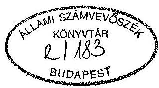
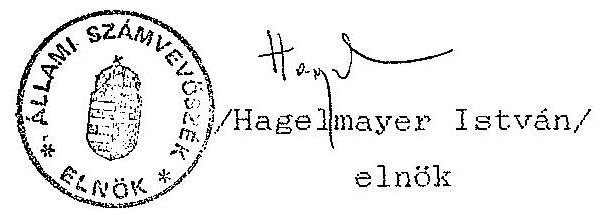

# JELENTÉS 

a Független Kisgazda-, Földmunkás- és Polgári Párt 1991-1993. évi gazdálkodása törvényességének ellenôrzésérôl

---

# Allami Számvevõszék 

IV. Vagyonellenőrzési Igazgatóság
$\mathrm{V}-1010-20 / 1993$.

## J K L K N T E S

a Független Kisgazda-, Földmunkás- és Polgári Párt 1991 - 1993. évi gazdálkodása törvényességének ellenőrzéséröl

## I.

A vizsgálat célja, módszere, idôszaka, körülményei

A pártok müködéséröl és gazdálkodásáról szóló - többször módosított - 1989. évi XXXIII. törvény (továbbiakban párttörvény) 10. par. (1) bekezdése, valamint az Allami Számvevõszékrõl szóló 1989. évi XXXVIII. törvény 5. paragrafusa alapján a pártok gazdálkodása törvényességének ellenôrzésére az Allami Számvevõszék (továbbiakban: ASZ) jogosult. A törvényi felhatalmazás alapján az ASZ második félévi munkatervének megfelelôen vizsgálta a Független Kisgazda-, Földmunkás- és Polgári Párt (a továbbiakban: párt) gazdálkodása törvényességét.

Az ellenôrzés célja annak megállapítása volt, hogy a párt müködéséhez szabályszerűen igénybevehetõ forrásokat használt-e fel, a párttörvényben engedélyezett gazdálkodó tevékenységet folytatott-e, valamint betartotta-e a gazdálkodással összefüggõ pénzü-gyi-számviteli szabályokat, továbbá, hogy megtették-e a szüksé-

---

ges intézkedéseket az 1991. évben készült ASZ vizsgálati jelentésben megállapított szabálytalanságok kiküszöbölésére.

Az ellenőrzött időszak 1991. január 1-től 1993. június 30-ig terjedt. A helyszíni ellenőrzés 1993. szeptember 6-tól október 22-ig tartott.

Az ellenőrzés módszere szúrópróbaszerű vizsgálat volt, a párt országos központjában rendelkezésre bocsátott iratok, dokumentumok alapján, figyelemmel a Magyar Közlöny 1991. évi 28. számában közzétett vizsgálati programra.

Az ellenőrzés végrehajtása során figyelemmel kellett lenni magasszintü jogszabályi változásokra:

- a számvitelről szóló 1991. évi XVIII. törvény (továbbiakban: számviteli törvény) módosította a számvitellel szemben támasztott jogszabályi követelményeket;
- a párttörvényt módosító 1992. évi LXXXI. törvény módosította az előző évi gazdálkodásról a Magyar Közlönyben közzéteendő beszámoló tartalmát.

A hivatkozott jogszabályi változások a vizsgált időszakot két szakaszra osztották, eltérő követelmények érvényesülését kellett tehát vizsgálni a különböző idôszakokban.

# A vizsgálat körülményei 

Az egyidejűleg három gazdasági évet (1991, 1992, 1993) érintő ellenőrzés lefolytatására az alábbi előzmények miatt került sor. - az ASZ a párt 1990. évi gazdálkodásáról 1991. évben készült jelentésében hét pontban hívta fel a párt elnökét a megállapított jogszabálysértések, hibák kiküszöbölésére,

---

- az ASZ jóváhagyott 1992. II. félévi munkaterve szerint a párt 1991. évi gazdálkodása törvényességének ellenôrzését 1992. augusztus - szeptember hónapokban végezte volna. A helyszíni ellenőrzés lefolytatása meghiúsult, amelynek alapvető oka, hogy a párt törvényes képviselete 1992. júliusától vitatott volt, egyidejúleg két helyen folyt gazdálkodó tevékenység, a folyamatban lévő bírósági eljárás következtében nem volt legitim képviselöje a pártnak,
- a Legfelsőbb Bíróság döntésének eredményeként 1993. novemberében rendeződött a párt képviseleti jogosultsága, erre tekintettel folytatta le az ASZ a jelenlegi három évet átfogó ellenőrzést,
- a vizsgálat lefolytatását az is meghatározta, hogy a korábbi ASZ jelentésben a számviteli rendszert illetően felsorolt hiányosságok, hibák kiküszöbölésére, a tényleges helyzet felmérésére - a jogi képviselet tisztázását követően - a párt ez év májusában okleveles könyvvizsgálóval kötött szerződést. A könyvszakértő a feladat teljesitéseként mintegy 700 oldal terjedelmü "Könyvszakértői jelentést" készített, amelynek megállapításaira, javaslataira figyelemmel volt az ellenőrzés.

Az előzőekre tekintettel a tapasztalt szabálytalanságok reális rögzítése mellett a vizsgálat során elsősorban arra kellett helyezni a hangsúlyt, hogy a párt által eddig megtett intézkedések elégségesek voltak-e arra, hogy a jövőre nézve garantálják a gazdálkodás törvényes keretek között történő szabályszerű folytatását, és milyen további intézkedések szükségesek a törvényes gazdálkodási rend kialakítása érdekében.

---

# II. 

## A párt gazdálkodásáról szóló éves beszámolók ellenőrzési tapasztalatai

1. A párt 1991. évi gazdálkodásáról közzétett pénzügyi zárómérleg ellenőrzése

### 1.1. Altalános megállapítások

A párt pénzügyi zárómérlegét (1. sz. melléklet) a párttörvény akkor hatályos előirása szerint 1992. március 31-ig lett volna köteles megjelentetni, a mérleg kelte azonban április 15. További hiba, hogy az adatokat nem Ft-ban, hanem ezer Ft-ban rögziti.

Tartalmi hiba, hogy a közzétett pénzügyi zárómérleg nem teljeskörü, mind részleteiben, mind föösszegeiben pontatlan, a tényleges állapottól eltérő adatokat tartalmaz. A vizsgálat megállapítása szerint a pénzügyi zárómérleg az országos központ naplófôkönyvének és a megyei szervezetek adatszolgáltatásának adataiból készült, a helyi szervezetek adatait egyáltalán nem tartalmazza. A megyei szervezetek adatszolgáltatásaiból csak az állapítható meg, hogy ezek több mint 800 ezer Ft-ot juttattak a helyi szervezeteknek.

A helyi szervezetek saját bevételeiről, továbbá a juttatott és a saját bevételekből teljesitett kiadásokról adatot nem tartalmaz a pénzügyi zárómérleg.

Pontatlanságokat okoznak az országos központban vezetett naplófőkönyvekben tapasztalható könyvelési hibák, halmozó-

---

dások ki nem szürése, valamint a megyei adatszolgáltatások részben összevont volta és az ezekben tapasztalható hibák is.

Az ellenőrzés előzőekben részletezett megállapításait az országos központban rendelkezésre bocsátott dokumentumokra alapozza, jelezni szükséges azonban, hogy a közzétett mérleghez számítási anyag nem lelhető fel, a megyei adatszolgáltatások alapbizonylatai az országos központban nem találhatók meg. Továbbá a vizsgálat megerősíti a Könyvszakértői jelentés azon megállapítását, hogy az országos központ naplófőkönyveinek mintegy ötven könyvelési tételéhez az alapbizonylatok nem lelhetők fel, az igy alapbizonylatok nélkül csak pénztárbizonylatok alapján ellenőrizhető tételék összesen több mint 1 millió Ft-ot tesznek ki. A megyei szervezetek adatszolgáltatásainak alapbizonylatai többségükben nem szerezhetők be a kapott tájékoztatás szerint, mivel a megyei vezetésekben bekövetkezett személyi változások és egyéb események következtében nem állnak a párt rendelkezésére.

# 1.2. Részletes megállapítások 

A rendelkezésre bocsátott dokumentumok alapján megállapított hibák:

- a tagdíjak összege nem teljeskörü és pontatlan, a helyi szervezetek adatait egyáltalán nem tartalmazza, a megyei szervezetek esetében a Békés megyei szervezet adatszolgáltatásából az volt megállapítható, hogy a között adat a tagdijak $30 \%$-a, ennek ellenére a között adat szolgált alapul a

---

mérleg összeállításához. Az országos központ naplófôkönyvei "tagdij, tagsági könyv, jelvény stb. eladásból" összevont rovatot tartalmaznak, ennek csekély része csak tagdijbevétel;

- az egyéb hozzájárulások mérlegsor részletezése pontatlan, a megyei szervezetek adatszolgáltatásai csak jogi személy, magánszemély alábontást tartalmaznak, a jogi személynek nem minősülö gazdasági társaságoktól rovat hiányzik, további problémát okoz, hogy egyes megyék, pl. Borsod-Abaúj-Zemplén megye csak az összesen sort töltötte ki, igy az összesítõben esetlegesen került a magánszemélytől alrovatba a kapott összeg. A helyi szervezetek adatait a mérlegsor nem tartalmazza;
- a párt propaganda tevékenységéből mérlegsor pontos összegét a helyi szervezetek adatainak hiányán túl az is megállapíthatatlanná teszi, hogy a jelvény, zászló, tagkönyv stb. eladásból befolyt összegek egy részét az országos központ és a megyei szervezetek is bevételként tüntették fel, igy e mérlegsor adata halmozódást tartalmaz;
- az egyéb bevétel mérlegsor nem tartalmazza a helyi szervezetek adatait, további hiba, hogy csak kamattérítés és kárrendezés jogcímet tartalmaz, a megyei szervezetek adatszolgáltatásai az egyéb bevétel további részletezésénél "egyéb" jogcímén összesen több mint 770 ezer Ft-ot tartalmaznak, ennek jogcimbontása nem állapítható meg. Az országos központ naplófôkönyveiben is pontatlan az egyéb bevétel összege;

---

- a tényleges kiadások nem tartalmazzák a helyi szervezetek kiadásait;
- a tényleges kiadások 1/c során "a párt által támogatott intézmény (vállalkozói tagozat) 1035 ezer Ft" szerepel. Az ellenőrzés megállapítása szerint a vállalkozói tagozat nem volt jogi személy, a részére juttatott összegeket a megfelelő mérlegsorokon, a felhasználás jogcímeinek megfelelően kellett volna szerepeltetni;
- a munkabérek, bérjellegủ kiadások mérlegsoron feltüntetett adat pontatlan, mert egyes megyei szervezetek bruttó módon, más szervezetek pedig nettó módon (adóelöleg, nyugdij és egészségbiztosítási járulék nélkül) tüntették fel adataikat. Ennek következtében az "adók, illetétek mérlegsor adata is pontatlan, ilyen címen a megyei szervezetek adatszolgáltatásaiban található adat, a pénzügyi zárómérlegben nem;
- az "általános költségek" a "sajtó és propaganda költség" és a "választásokkal kapcsolatos költség" mérlegsorok tartalma nem ellenőrizhető, az országos központ naplófőkönyvei és alapbizonylatai adatai alapján nem lehet megállapítani, hogy mely kiadás mely mérlegsoron jelenik meg, a megyei szervezetek adatszolgáltatásaihoz pedig alapbizonylatok nem állnak rendelkezésre;
- a pénzügyi zárómérleg "c" részét, amely a párt tényleges pénzügyi helyzetét volt hivatott bemutatni, nem a párttörvény akkor hatályos előirásainak megfelelően tették közzé, így ennek ellenőrzésére nem volt mód.

---

2. A párt 1992. évi gazdálkodásáról közzétett éves beszámoló ellenőrzése

A párt 1992. évi gazdálkodásáról készített beszámoló (2. sz. melléklet) a Magyar Közlöny 1993. évi április 2-i 38. számában jelent meg.

Az ellenőrzés megállapítása szerint a közzétett beszámoló nem nyújt valós képet a párt bevételeiről és kiadásairól a következök miatt:

- a közzétett beszámoló csak az országos központ adatai felhasználásával készült, amelyek pontatlanok;
- nem tartalmazza sem a helyi sem a megyei szervezetek bevételeit és kiadásait;

A beszámoló ily módon történt összeállításával a számviteli törvényben rögzített következö alapelvek nem érvényesültek:

- a teljesség elvét sérti, hogy a beszámoló nem tartalmazza sem a helyi, sem a megyei szervezetek bevételi és kiadási adatait, továbbá az országos központ USD devizaszámlájára utalt adomány értékét;
- a következetesség elvét sérti, hogy a beszámolóban az egyes sorok tartalma esetleges, nem egyértelmü;
- a valódiság elvét sérti, hogy az országos központnál bizonylati hiányosságok következtében nem állapítható meg, hogy adott mérlegzorba valóban odatartozó adatok szerepel-nek-e, továbbá, hogy valamennyi gazdasági eseményt rögzi-

---

tették-e, illetve nem szerepel-e a beszámolóban olyan kiadás, amely nem a pártot terhelte.

# III. 

## A beszámolók megalapozottságát alátámasztó könyvvizsgálati megállapítások

## 1. A könyvvezetés ellenőrzése

A korábbi ASZ vizsgálati jelentések rögzítették, hogy a párt egésze a jogi személy az alapszabály kifejezett eltérő rendelkezése hiányában, következésképp, mivel a vizsgálat idöpontjáig a helyzet nem változott, az 1991. és 1992. évi valamennyi gazdasági eseményét központilag kellett volna valamely választott könyvvezetési rendszernek megfelelően egységesen rögzíteni, ez azonban nem történt meg.
1.1. Az 1991. évi könyvvezetés szúrópróbaszerü ellenőrzése

Az 1991. évi V-49-20/1991. sz. Vizsgálati Jelentés a könyvvezetési kötelezettséget illetően 27-28. oldalán felsorolta a január 1. - szeptember 30. közötti időszakra vonatkozóan szúrópróbaszerü ellenőrzéssel megállapított hiányosságokat.

A korábban már hivatkozott Könyvszakértői jelentés "a párt 1991. évi pénzügyi tevékenységéről, javaslat a tárgyidőszaki mérleg összeállítására" c. kötete az országos központ vonatkozásában a II. és III. pontjában összegzi a megállapított hibákat, hiányosságokat, amelyeket az ASZ ellenőrzés megerősít.

---

A megyei szervezetek 1991. évi könyvvezetése nem volt egységes, ezt a korábbi AZZ vizsgálati jelentés és a Könyvszakértöi jelentés "Megyei szervezetek ellenörzése" c. kötete is megállapítja. Tekintettel arra, hogy a megyei szervezetek könyvvezetéssel kapcsolatos dokumentumai az országos központban nem voltak fellelhetőek azokat az ellenőrzés nem vizsgálta.
1.2. Az 1992. évi könyvvezetés szúrópróbaszerũ ellenőrzése

Az 1992. évi könyvvezetést vizsgálva az ellenőrzés megállapította, hogy a párt országos központja január 1-jével számítógépes kettős könyvvitelre tért át. Az áttéréssel összefüggésben nem tartották be a jogszabályi elöírásokat.

A kettős könyvvitellel összefüggésben nem gondoskodtak a számlarend elkészítéséröl, csak számlatükröt tudtak a vizsgálat rendelkezésére bocsátani, ezt azonban nem aktualizálták. A fôkönyvi számlák és az analitikus nyilvántartások nem egyeztethetőek. A számítógépes program adatai alapján az adatok visszakeresése igen nehézkes, egyértelmũ azonosító adat hiányában csak egy hónap bizonylatainak tételes átvizsgálásával volt elvégezhető adott bizonylat adatának a fôkönyvi számlával való egyeztetése. A számítógépes programról felhasználói dokumentációt nem tudtak az ellenőrzés rendelkezésére bocsátani.

A fôkönyvi számlák tartalmét vizsgálva az volt megállapítható, hogy azok az alapbizonylatokon található kontirozások alapján nem egyeztethetőek. Egy alapbizonylaton nem ritkán több kontirozás is található, azonban a tétel végül mindegyik számlakijelöléstől eltérő számlán szerepel. A kontiro-

---

zás esetlegességére utal, hogy pl. plakátkészitést tartalmaz az 534. Könyv, folyóirat, napilap, az 533. Irodaszer, nyomtatvány és az 536. Propaganda anyagok elnevezésủ számla is. Vagy említhető az 1331. alaptevékenység bútorai elnevezésű számla, amelyen szerepel többek között gázkazán vásárlás és nyomtató, kábel vásárlása is.

Az eszközbeszerzéseket és a költségeket illetően az a jogszabályellenes gyakorlat érvényesült, hogy az előzetesen felszámított általános forgalmi adót ezek tartalmazzák, azt nem kontirozták külön.

A kontirozások helyességének ellenőrzését nehezíti, hogy a főkönyvi számlák sok esetben "számla nincs" megjelöléssel tartalmaznak kiadási összegeket. Ezen összegek esetében az ellenőrzésnek nincs lehetősége állást foglalni, hogy adott összeg megfelelő számlán szerepel-e, továbbá az sem állapítható meg, hogy a kiadás a pártot terhelte-e.

Törvénysértő volt az a gyakorlat, hogy az 539. sz. kis értékú tárgyi eszközök elnevezésű főkönyvi számlán költségként számoltak el több mint 1 millió Ft értékú tárgyi eszközt a beszerzéskor. A 20 ezer Ft feletti egyedi értékü tárgyi eszközöket az 1. számlaosztályban kellett volna szerepeltetni. A hibás könyvelés miatt a főkönyvi kivonatban szerepeltetett 2894 ezer Ft összeg nem a kis értékú tárgyi eszközök beszerzésének helyes összege.

A könyvszakérői jelentés "az 1992. évi számviteli tevékenység értékeléséről és javaslat az éves beszámoló elkészitésére" c. kötetet I/4. pontjában megállapítja "A könyvelést a párt utólag végezte el, 1992. III. negyedévé-

---

tõl kezdte felvinni adatait, ezért korábbi idõszakos zárások nem voltak", amelyet az ASZ vizsgálat megerõsit. Az ellenôrzés egyetért ugyanazon pont összegzõ megállapításával és következtetésével is: "Összegezve megállapítható, hogy a könyvviteli rendszer alkalmazásának szabályozatlansága olyan helyzetet teremtett, hogy több tétel költségkénti könyvelése nem kontrollálható, bizonylathiányok miatt feladások nincsenek, és ezért a mérleg dokumentációs alapja tekintetében nem tartjuk a könyvelést megbízhatónak. A fenti hiányosságot kiküszöbölni csak a teljes anyag újrakönyvelésével, vagy egy olyan rendszerú adategyeztetéssel lenne elképzelhetõ, amely valamennyi pénzforgalmi és vegyesbizonylat kontirozását ismételten ellenőrzi és szükség esetén felülbírálja."
1.3. Az 1993. évi könyvvezetés szúrópróbaszerũ ellenőrzése

Az ellenôrzés szúrópróbaszerũen vizsgálta az 1993. I. félévi könyvvezetést is, ennek során tekintettel kellett lenni a könyvszakértõi jelentés "a párt 1993. évi fõkönyvi könyvelésérõl a módosított és egységes ügyviteli rend szerint" címũ, továbbá a "Kiegészítés a Független Kiegaz-da-, Földmunkás- és Polgári Párt 1993. évi ügyvitelérõl készített könyvszakértõi jelentéshez" c. kötetben foglaltakra, figyelemmel arra, hogy a megbízás tárgyát az 1993. I. félévi pénzügyi és számviteli anyag könyvviteli rögzítése képezte. Az ellenôrzés megállapítása szerint a kialakított "egységes számviteli rendszer" nem felel meg a jogszabályi követelményeknek a következõk miatt:

- nem épülnek be a helyi szervek pénzforgalmi adatai a számvitelbe;

---

- a megyei szervezetek adatainak könyvelése összevontan a szervezetek által készített féléves pénzforgalmi jelentések alapján egy összegben történt, amelynek dokumentációs anyaga a megyei szervezeteknél vezetett pénzforgalmi nyilvántartás (naplófőkönyv, pénztárjelentés vagy arról pénzforgalmi nyilvántartás). Ez a gyakorlat nem felel meg a számviteli törvény elöírásainak, egy párton belül ugyanis nem lehet a kettős és egyszeres könyvvitel gyakorlatát egyidejüleg folytatni; továbbra is fennáll az a probléma, hogy nem az országos központban rögzítenek egységesen valamennyi gazdasági eseményt;
- az egységes kontirozást biztosító számlarend nem készült, a "Kiegészítés ..." c. kötet 1. sz. melléklete címével ellentétben nem számlarend, hanem számlatükör, további probléma, hogy a 0 . és a 2 . számlaosztály számlaszámokat és megnevezéseket nem tartalmaz. A 9. számlaosztály számláinak tagolása nem megfelelő, nem tartalmaz számlát a jogi személynek nem minősülő gazdasági társaságtól származó hozzájárulások nyilvántartására. A 4. számlaosztályban nem nyitottak számlát az előzetesen felszámított AFA nyilvántartására.

Az országos központ főkönyvi számlái szúrópróbaszerủ ellenőrzése során kontirozási hibákat is megállapított az ellenőrzés, így pl. a 92. Állami költségvetésből támogatás elnevezésű számlán 45 ezer Ft összegű "leltározási hozzájárulás" is könyvelve van helytelenül, az 524. Egyéb szociális támogatás elnevezésű számlán más szervezeteknek nyújtott támogatások is szerepelnek.

---

A megyei szervezetek adatai alapján történt könyvelés nem elfogadható a már jelzett indokon túl azért sem mert ezek pontatlanok. Igy pl. Szabolcs-Szatmár megye adatszolgáltatásában a hozzájárulásokból származó bevétel adat összesen sora van csak kitöltve, így nem megbizható az összesítõben a magánszemélytõl származó hozzájárulás adat; vagy pl. Vas megye adatszolgáltatásában egyéb bevételként szerepel SzJA visszavét is, amely ugyancsak korrekció nélkül lett összesítve.

A vizsgálatról készült részjelentésre tett észrevételéhez a párt csatolta a "Számvitelpolitikai irányelvek" és "A párt megyei-, és helyi szervezeteinek ügyviteli rendje" tárgyú belsõ utasitásokat. Ezek alkalmazása révén egységes számviteli rend alakulhat ki.
2. Analitikus nyilvántartások és a bizonylati rend ellenõrzése
1991. és 1992. évben a kötelezõ̃en elöírt analitikus nyilvántartások közül a párt csak az SzJA köteles kifizetések nyilvántartását vezette.

Az álló- (tárgyi) és tartós fogyóeszközök egyedi nyilvántartását, a szállítók követelését, az elszámolásra kiadott előlegek, továbbá a vásárolt értékeikkek egyedi nyilvántartását ebben az idõszakban nem vezették. Ezek hiánya is közrejátszik abban, hogy a könyvelés pontossága nehezen állapítható meg.

A párt "Házipénztár kezelési szabályzat"-ot csak 1992. január 1-jével adott ki, amely a deviza-, illetve valutaforgalom elszámolás szabályozását nem tartalmazza.

---

A szigorú számadási kötelezettségũ nyomtatványok körét sem 1991-ben, sem 1992. évben nem jelölték ki, nem szabályozták azok használatának és nyilvántartásának feltételeit.
2.1. Bizonylati elv és bizonylati fegyelem érvényesülésének ellenörzése

A házipénztár forgalma és kezelése szabályait valamint az utalványozásra jogosult személyek kijelölését esetenként, a párt határozataiban rögzítették 1992. január 1-ig.

Az ellenőrzés megállapításai szerint 1991. január 1. 1991. december 31-ig, 1992. január 1. - 1992. szeptember 30-ig terjedõ idõszakban a pénztárbizonylatok kiállítása alaki-tartalmi szempontból egyaránt szabálytalan, mert általában hiányzik az utalványozó és ellenõr aláírása, több esetben a kiállítás dátuma, a kifizetés alapbizonylata, egyes esetekben az összeeg átvevöjének aláírása, továbbá meghatalmazás nélküli pénzfelvétel is történt más személy helyett. Elöfordult néhány esetben az is, hogy maga a pénztáros utalványozott önmaga részére és vette fel az összeget a pénztárból.

Végsõ soron nem állapítható meg, hogy ténylegesen annyi pénztári kifizetés és bevételezés történt-e, mint amennyit a könyvelésben rögzítettek, mivel mindkét évben tüntek el alapbizonylatok.

A párt jelenlegi elnöke a jogszabálysértõ gyakorlat miatt büntető feljelentést tett az akkori gazdasági vezetők, a pénztáros és ismeretlen tettes ellen 1993. augusztusában. A

---

feljelentések intézése a vizsgálat időszakában folyamatban volt.
2.2. Költségtérítések gyakorlatának ellenőrzése

A párt nem tartotta be a:

- hivatali gépjármú hivatali-,
- saját gépjármú hivatali célú
használatával kapcsolatos jogszabályi rendelkezéseket.

A gépjármúvek üzemanyagelszámolásnál általában nem az út-vonal-nyilvántartás alapján történő norma szerinti elszámolást alkalmazták, hanem üzemanyagszámlák alapján térítették meg a költségeket.

Előfordult néhány esetben, hogy vidéki utazásokkal kapcsolatosan napidijként $1200 \mathrm{Ft} /$ nap térítést számoltak el.

A párt a jogszabálysértó gyakorlatot az 1993. június 18-ával hatálybaléptetett belsõ szabályzattal szüntette meg.
2.3. Utólagos elszámolásra kiadott előlegek nyilvántartása és elszámoltatása

Az elszámolásra kiadott előlegek felvételének visszafizetésének és elszámolásának rendjét 1991-1992. évben nem szabályozták, annak ellenére, hogy sürü gyakorisága és a felvett összegek nagyságrendje ezt külön indokolta volna. Az utólagos elszámolásra felvett összegek 1992. évben 8,5 millió Ft-ot jelentettek. A kiadott összegeket - ahogy a Könyvszakértői jelentés is leszögezi -, a jogosultak rész-

---

ben visszafizették, vagy kiadásként elszámolta a párt, de végsôsoron nem minden esetben rendezték az érintett személyekkel a részükre kifizetett elõlegeket. Az elszámolásra adott elõlegek fôkönyvi számlán 1031700 Ft összegũ tartozás, elszámolatlan felvét szerepelt az év végén. Az el nem számolt elõlegek visszafizetése érdekében a párt 1993-ban felszólításokat, büntetõ feljelentéseket tett, amelyek intézése a vizsgálat idôszakában folyamatban volt.
2.4. Külföldi hivatalos célú utazások devizaelszámolási gyakorlata

A párt devizafelhasználásának volumene és szabályszerűsége - 1991. és 1992. évre vonatkozólag - a pénztárbizonylatok és könyvelési adatok alapján nem állapítható meg, mivel 1991. évben a naplófôkönyv nem tartalmazza a devizaforgalmat, 1992. évben pedig fôkönyvi számlát nem nyitottak.

A külföldi kiutazások ügyvitelének be1sõ szabályozatlansága, a hatályos rendelkezésekkel ellentétes gyakorlata, amely végsôsoron 1992. szeptember 28-ig a házipénztár megkerülésével folyt, vonta maga után azt, hogy 1991. évben a kiutazó személyeket 1070212 Ft összegũ 1992. évben pedig 1344829 Ft összegũ valutával - banki folyószámla-kivonat tanúsága szerint - nem számoltatták el. A hibás gyakorlat következtében nem lehetett megállapítani a tényleges valuta felhasználás összegét. A párt devizafelhasználása, illetve igénylése mindkét évben az engedélyezett kereten belül volt.

A külföldi kiutazásban résztvevôket 1993. évben a párt már elszámoltatta, visszamenőlegesen az év közepétől. Eletbe-

---

léptette a "Külföldi kiküldetési utasítás és költségelszámolás" nyomtatványt.

A valuta átvételét és mozgását ekkor már minden esetben dokumentálták, pénztárbevételi és kiadási bizonylat kiállításával, megnyitották a valutaelszámolási főkönyvi számlát (ezen csak a valutakiadást könyvelték, a felvételt, illetve keretösszeget viszont nem), a kiutazókat végsősoron elszámoltatták. Az elszámoltatást követöen valuta visszafizetésekre is sor került. A párt jelenlegi elnöke büntető feljelentést is tett valuta elsikkasztása miatt, amelynek intézése a vizsgálat idópontjában folyamatban volt.
2.5. Adózásra vonatkozó szabályok betartásának ellenőrzése

A párt a személyi jövedelemadóról szóló 1992. LXXV. törvénnyel módosított 1991. évi XC. törvény, illetve az adózás rendjéről szóló 1990 . évi XCI. törvényben foglaltaknak nem minden vonatkozásban tett eleget. Ugyanis 1992. évben a kifizetett munkabérekből adóelöleget nem fizettek, adóbevallást nem nyújtottak be az Adóhivatalnak, hanem utólag rendezték személyi jövedelemadó fizetési kötelezettségüket.

Az adó bevallása és befizetése 1993. évben már az előirásoknak megfelelően folyt.
2.6. Társadalombiztosításra vonatkozó jogszabályok betartása

A párt, mint munkáltató, 1991. és 1992., valamint 1993. évben eleget tett társadalombiztosítási feladatainak, igy: - a tb alapokat megillető befizetéseket,

---

- nyilvántartási és adatszolgáltatási kötelezettségeket,
- tb ellátások kifizetését
teljesítette.

# IV. 

## A párt bevételi forrásainak és gazdálkodó tevékenységének vizsgálata

A párt bevételi forrásai tagdíjakból, hozzájárulásokból, állami költségvetési támogatásból és gazdálkodó tevékenységbôl származnak, összhangban a párttörvény 4. par. (1) bek. rendelkezéseivel.

A párt a párttörvény 6. par. (1) bek. a. pontjában említett gazdálkodó tevékenységek közül a kiadványok, jelvények és egyéb tárgyak értékesítésének lehetôségével élt. A párttörvény 6. par. 1. bek. b. pontja alapján az országos központ a tulajdonában álló ingatlant hasznosította díj ellenében. A megyei szervezetek 1992. évi adatszolgáltatásai alapján az állapítható meg, hogy a Hajdú Bihar megyei szervezet jelentett gazdálkodó tevékenységbôl származó bevételt.

Az országos központ az ellenőrzés rendelkezésére bocsátotta a gazdálkodással kapcsolatos határozatok gyüjteményét, ezek közül az Országos Elnökség 1992. július 13-i ülésének 189. sz. határo zata kölcsönnyújtás témájával kapcsolatos. A kölcsön nyújtása ellentétes a párttörvény 6. paragrafusának rendelkezéseivel, azonban intézkedés megtétele nem szükséges, a kapott tájékoztatás szerint annak összegét visszafizették.

---

A párt elnöke az Állami Számvevõszékhez intézett 1993. június 21-i keltü levelében jelezte, hogy az Országos Elnökség határozata alapján lekötött betétben magánszemélyek nevére jelentôs összegeket helyeztek el, amelyek idôközben megszüntek, az összegeket befizették a párt bankszámlájára. A vizsgálat megállapításai megerôsítik a leírtakat. Annak megállapítása érdekében, hogy ezzel megsértették-e a hatályos jogszabályok elõírását, az Állami Számvevôszék a Legfôbb Ugyészséget keresi meg.

# V. 

## Az ASZ korábbi jelentésében foglalt felhívásra tett intézkedések

A párt az ASZ 1991. évi Vizsgálati jelentésében tett felhívás 1-4. pontjában felsorolt - a párt számvitelével kapcsolatos hibák, hiányosságok megszüntetésére a tényleges helyzet felmérésére vállalkozási szerzôdést kötött 1993. május 28-án könyvszakértôvel. A könyvszakértôi jelentésben foglaltakra figyelemmel a párt számvitelpolitikai irányelveket adott ki, továbbá kialakította a párt megyei és helyi szervezeteinek ügyviteli rendjét. A Könyvszakértôi jelentés megállapításaival, javaslataival e jelentés megfelelô pontjai tartalmaznak értékelést.

A 120253 Ft összegũ névtelen adomány elkülönített kezelésérõl a párt a vizsgálat idôtartalma alatt intézkedett, mivel a párttörvényben elôírt alapítványt - ahova a névtelen adományt be kell fizetni - az Országgyûlés még nem hozta létre.

---

A Polgári Allattenyésztő és Ertékesítő Hangya Szövetkezet részére nyújtott hitel visszakövetelésére a vizsgálat lezárásáig intézkedés nem történt.

Az egyéb jogszabálysértó gyakorlatok megszüntetése érdekében a párt 1993.II. félév végén belsõ szabályzatokat adott ki.

Az 1990. és 1991. évi gazdálkodásról pontositott pénzügyi zárómérleg elkészitésére felhívás nem indokolt, tekintettel a nem pótolható adathiányokra.

A párt országos központja - a jogi képviselet tisztázását követôen - a gazdálkodási szabálytalanságok kiküszöbölésére az elôzôekben jelzett intézkedéseket tette. Az intézkedéseken túlmenően a párt elnöke személyes felelősségrevonásokat is kezdeményezett, valamint a jelentés III. fejezetében említett esetekben feljelentéseket tett. A megtett intézkedésekre figyelemmel további felelősségrevonás nem indokolt.
VI.

Felhívás a szükséges intézkedések megtételére

A vizsgálat tapasztalatai alapján a pártvezetés által már megtett intézkedések figyelembevételével a párttörvény 10. par. (4) bekezdésében kapott felhatalmazás alapján felhívom a párt elnökét, hogy intézkedjen:

1. a tényleges állapotnak megfelelő 1992. évi gazdálkodási adatokat tartalmazó beszámoló elkészítéséról és közzétételéről a Magyar Közlönyben;

---

2. a továbbra is fennálló hitel visszakövetelése iránt,
3. az elszámolatlan külföldi hivatalos célú valutafelvételek elszámolása iránt.

Budapest, 1993. december 23.

Melléklet: 2 db

---

A Független Kisgazda-, Földmunkás- és Polgári Párt 1991. évi pénzügyi zárómérlege
A) Tényleges bevételek

1. Tagdijak
2. Állami költségvetésbôl származó támogatás
3. Egyéb hozzájárulások
a) jogi személyektól
b) jogi személyeknek nem minósüló támogatásból
c) magánszemélyektól
4. A párt propagandatevékenységebôl
5. Egyéb bevétel
a) kamattérítés
b) kárrendezés

Összes tevékenységgel összefüggő bevétel
B) Tényleges kiadások

1. Hozzájárulások juttatása
b) a párt helyi szervei számára
c) a párt által támogatott intézmény (vál-
lalkozói tagozat)
d) más társadalmi szervezet számára

Együtt:
2. Személyzeti költségek
a) munkabérek, bérjellegủ kiadások
b) költségtérítések, napidijak
c) társadalombizt. jár.
d) szociális, udülésí támogatás

Együtt:
29974
3. Általános költségek
a) adók, illetékek
b) épületek fenntartása közüzemi díjak 4075
c) helyiségek bére 6375
d) adminisztráció, porta 6266
e) különféle egyéb ksg.
33307

Együtt:
50023
4. Sajtó és propaganda 5220
5. Választások, választmány 2384

Összes kiadás a gazdasági évben 91637
C) Tényleges pénzügyi helyzet a gazdasági év zárásakor

Bevételek
92980
Kiadások
91637

Gazdasági év eredménye
1343

Dr. Torgvän József s. k., elnök

---

9. A környczetvédelmi és természctvédelmi feladatok megvalósitása érdekében
a) az Alföld egyes időszerü környezetvédelmi, tájvédelmi ćs tájhaszncsitási kérdéseiről szóló 24/1991. (IV. 17.) OGY határozat és ennek végrehajtásáról hozott 3515/1991. (XI. 28.) Korm. határozat éricimében, az Alföld fejlesztési programjáhozilleszkedően a megyci önkormányzat bevonásával koncepciót kell késziteni és ennek alapján ütemicrvet kidolgozni a munkák elvégzésćhez szükséges finanszírozás módjára;
Felelös: kïrnyczctvédelmi és terïletfejlesztési miniszter, a megyci önkormányzat elnökének bevonásával
Határidő: folyamatos
b) létre kell hozni a Körös-Maros Vidéki Nemzeti Park megvalósitása érdekében a Természetvédelmi Igazgatóságot;
Felelös: környezetvédelmi és területfejlesztési miniszter, a megyci önkormányzat elnökénck bevonásával
Határidó: 1994. június 30.
c) állapotfelvételt kell késziteni a megye természeti ér lékeinck védelme érdekében.
Felelös: környezetvédelmi és területfejlesztési miniszter
Határidó: 1994. június 30.
10. Információk adása a nemzetközi programokról. A programokhoz csatlakozó megyci fejlesztési tervek elbírálásának felgyorsitása. A megye fejlesztési programjának megszervezésćbe külföldi menedzserek bekapcsolása.
Felelös: nemzetközi gazdasági kapcsolatok minisztere, az érintett tárcák miniszterei, a köztársasági megbízott és a megyci önkormányzat elnökének bevonásával
Határidó: a nemzetközi programok határideje.
11. Tájékoztatást kell adni a helyi önkormányzatok által felhasználható kormányzati pénzügyi eszközökröl, azok elnyerési lehetőségeiről.
Felelös: belügyminiszter, az érintett tárcák miniszterei, a megyci önkormányzat elnökének és a köztársasági megbízott bevonásával
Határidó: folyamatos
12. Az intézkedési programban leginkább érintett telcpülésekre, a rövid és közöttávú feladatok megvalósitása érdekében (az érintett megyei és helyi szervek bevonásával) javaslatot kell tenni a településrendezési tervek soronkívüli felülvizsgálatához szükséges eszközök biztositására, továbbá javaslatot kell késziteni a sajátos térségi szabályozásra, beleértve a külterületeket is.
Felelös: környezetvédelmi és területfejlesztési miniszter, belügyminiszter, a megyci önkormányzat elnökének, és az érintett önkormányzatok polgármestereinek bevonásával
Határidó: 1993. december 31.

## V. rész

## KÖZLEMENYEK HIRDETMÉNYEK

Az $\mathrm{FKgP}$
1992. évi pénzügyi zárómérlege
$\mathrm{m} / \mathrm{Ft}$
A) Bevételek

1. Tagdijak 113
2. Állami költségvetésből származó támogatás 128790
3. Képviselöi csoportnak nyújtott támogatás
4. Egyéb hozzájárulások, adományok
4.1 Jogi személyektől
4.1.1 Belföldi hozzájárulás 90
4,1,2 Külföldi hozzájárulás
4.2 Jogi személynek nem minősülő gazdasági társaságtól
4.2.1 Belföldi hozzájárulás
4.2.2 Külföldi hozzájárulás
4.3 Magánszemélyektől
4.3.1 Belföldi hozzájárulás 10
4.3.2 Külföldi hozzájárulás
5. A párt által alapított vállalat és korlátolt felelősségủ társaság nyereségéből származó bevétel
6. Egyéb bevétel 8081

Összes bevétel a gazdasági évben 137084

---

## B) Kiadások

1. Támogatás a párt országgyúlési csoportja számára:
2. Támogatás egyéb szervezeteknek (20 megye)
3. Vállalkozások alapítására fordított öszszegek
4. Múködési kiadások
5. Eszközbeszerzés
6. Politikai tevékenység kiadása
7. Egyéb kiadás

Összes kiadás a gazdasági évben

Dr. Torgyán József s. k., elnök

A Demokrata Koalíció 1992. évi pénzügyi zárómérlege.
A) Bevételek

1. Tagdíjak
2. Állami költségvetésből származó támogatás
3. Képviselői csoportnak nyújtott állami támogatás
4. Egyéb hozzájárulások, adományok
4.1 Jogi személyektól
4.1.1 Belföldiektól
4.1.2 Külföldiektól
4.2 Jogi személynek nem minősülő gazdasági társaságtól
4.2.1 Belföldiektól
4.2.2 Külföldiektól
4.3 Magánszemélyektól
4.3.1 Belföldiektól
4.3.2 Külföldiektól
5. A párt által alapított vállalat és korlátolt felelősségủ társaság nyereségéből származó bevétel
6. Egyéb bevétel

197554

Összes bevétel a gazdasági évben
19068054
B) Kiadások

1. Támogatás a párt országgyúlési csoportja számára
2. Támogatás egyéb szervezeteknek 125000
3. Vállalkozások alapítására fordított öszszegek
4. Müködési kiadások 4937677
5. Eszközbeszerzés 675480
6. Politikai tevékenység kiadása 2197004
7. Egyéb kiadások 10666404

Összes kiadás a gazdasági évben
György István s. k., elnök

Mráv József s. k., ügyvezető elnök

Poroszlay Jenő s. k., gazdasági alelnök

## A Fővárosi Bíróság

16. Fpk. 624/1990/27. határozata
felszámolási egrárás meginditásának közzétételéról

## Végzés

A Fővárosi Bíróság a FORTUNÁ-ALFA Kereskedelmi Kft. (1118 Budapest, Késmárki u. 8., korábbi elnevezése és székhelye: FORTUNA Ügynöki Kft., 1012 Budapest,