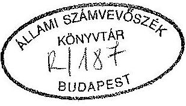
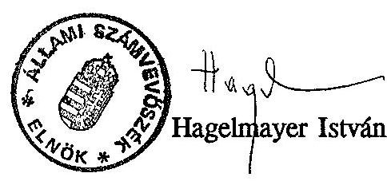

# Sllami 8xámverösxék 

## JELENTÉS

a Kereskedelemfejlesztési Alap pénzügyi-gazdasági ellenôrzésérôl

---

A vizsgálatot végezték:

| Dr. Burján Margit | számvevô tandcsos |
| :-- | :-- |
| Dr. Benkô János | számvevô tandcsos |
| Czunyi Lajos | számvevô tandcsos |
| Simon Ákosné | számvevô tandcsos |
| Patai Tamás | számvevô tandcsos |

A vizsgálatot vezette:

Hegedüsné
dr. Müllern V̇̀ronika
számvevô fôtandcsos

---

# JELENTÉS 

## a Kereskedelemfejlesztési Alap pénzügyi-gazdasági ellenôrzésérôl

A Kereskedelemfejlesztési Alap (továbbiakban KFA Alap) jogszabályban megfogalmazott feladata az exportcélú kereskedelemfejlesztés, az exportképes áru, szolgáltatás és az anyagi értékeket képviselô jogok külpiaci bevezetésének, illetve a központi állami kezdéményezésű kereskedelemfejlesztési tevékenységeknek a támogatása.

Az Alap 1992. évben 5,1 milliárd Ft-tal gazdálkodott, melyhez a költségvetés 3,2 milliárd Ft-tal járult hozzá.

Az Alapot a Nemzetközi Gazdasági Kapcsolatok Minisztériuma kezeli. Tárcán belül ezt a feladatot elsősorban a Kereskedelemfejlesztési és Marketing Főosztály végzi 23 fővel, (továbbiakban: alapkezelő főosztály). Az Alappal kapcsolatos feladatok ellátásában a HIT Investcenter-Tradeinform Magyar Befektetési és Kereskedelemfejlesztési Vállalat is közreműködik. A vállalatnak fővárosi és vidéki ügyfélszolgálati irodái vannak, átlaglétszáma összesen 72 fó.

## Ellenốzésünk során arra kerestünk választ, hogy:

- Az exportorientált gazdaságpolitika eszközeként müködő Alap miként segítette a magyar áruk, szolgáltatások és a szellemi termékek külpiacra jutását, versenyképességének fokozását;
- Az Alap kezelését ellátó minisztérium szervezeti egységei, valamint az információs szolgálat (HIT) müködése, szervezettsége és szabályozottsága biztosítja-e az Alap törvényes, célszerű és eredményes felhasználását.

---

Vizsgálatunk 1991-1993. I. félévére terjedt ki. Ellenőrzéseinket elsősorban az alapkezelő főosztálynál, kapcsolódó jelleggel 7 vásárszervező cégnél, 15 gazdálkodó szervezetnél és 3 vállalkozói érdekképviseletnél végeztük.

# I. 

## Következtetések, javaslatok

A magyar gazdaság nyitottsága miatt az exportnak meghatározó jelentősége van, mivel a GDP 35-40\%-a a külpiacon realizálódik. Hatással van a költségvetésre, a külső és belső piaci egyensúlyra, a gazdálkodó szféra jövedelmezőségére, a foglalkoztatásra.

A hazai vállalkozóknak egyre inkább fel kell venni a versenyt a fejlett országok piacán megjelenő versenytársaikkal, akik saját hazájukban élvezik az exportot támogató kedvezményeket. Az IMF felmérése szerint az export ösztönzésére ezek az országok egyre nagyobb összegeket fordítanak, bár ez az arány már az 1980-as években is jelentős volt. (Az USA-ban az export 20\%-a, Angliában, Franciaországban mintegy $35 \%$-a, Japánban csaknem $40 \%$-a teljesült állami garanciavállalással, illetve szubvencionált hitelekkel.)

Gazdasági rendszerünk a piacgazdaságra való átállás időszakát éli. Ebben a szakaszban az államnak sajátos szerepe van az exportképes árualapok növelésében, illetve a késztermékek piacra juttatásában.
A külgazdasági feladatok végrehajtását segítő exportösztönzést is az átalakulás jellemzi éppen akkor, amikor nagy szükség lenne egy már kialakult, jól múködő támogatási rendszerre, amely az exportot és ezen keresztül a termelés növekedését is segíthetné. (1993. I. félévében az EGK és az EFTA országok felé 30-35\%-kal csökkent a kivitelünk.)

Az 1986-ban bevezetett lineáris exportösztönzési rendszer hatása ma már nem érzékelhető, a fejlesztéscentrikus támogatások is jórészt megszűntek. Ennek a keretében működött a Kereskedelempolitikai Alap (a KFA jogelődje), melynek segítségével - 7 év alatt 17 milliárd Ft felhasználásával - több mint 200 vállalat, szövetkezet exportját ösztönözték (1993-ban már csak 6 szerződés élt). A Kereskedelempolitikai Alap eredményességét önmagában nem lehet megítélni, mivel hatását együttesen fejtette ki a lineáris exportösztönzési rendszer többi

---

elemével. A rendszer múködésének szakmai megítélése nem egyértelmű, amihez az Alap szabályozatlan múködése, ellenőrzési hiányosságai is hozzájárultak.

Az 1990-es évek elején egy új exportösztönzési rendszer elemei léptek életbe, amely már a GATT elvárásainak is megfelelt, és figyelembe vette a fejlett piacgazdasággal rendelkező országok külkereskedelmi gyakorlatát. Ennek keretében került bevezetésre 1991-ben a Kereskedelemfejlesztési Alap azzal a céllal, hogy segítse a termékek külpiaci megjelenését.

A KFA - mint elkülönített állami pénzalap - múködéséről törvény intézkedik. Tárcán belüli szabályozása hiányos. A kezelő tárca SZMSZ-ében megjelölt feladatokat ugyanis az alapkezelő főosztály ügyrendben nem részletezte, ehhez kapcsolódóan nem rögzítette az egyes munkakörök feladatait sem. Nem szabályozta az Alap gazdálkodását, nem alakította ki a számviteli és bizonylati rendet. Mindezek következménye, hogy az analitikus nyilvántartásaik, az erre épülő számviteli adatok pontatlanok, hibásak voltak. Előfordult, hogy még olyan alapinformációk sem álltak rendelkezésre, melyek szükšégesek lettek volna a gazdálkodói döntéshozatalhoz. (Ezek közül néhányat csak az ellenőrzés kérésére, esetenként több hónap alatt tudtak elkészíteni, sőt előfordult, hogy a kéréstől az alapkezelő főosztály elzárkózott.)

Mindennek következménye, hogy az Országgyűlésnek 1991. és 1992-ben bemutatott pénzforgalmi mérlegek nem valósak, sem a bevételek, sem a kiadások nem egyeztek meg a tényleges adatokkal.

A vizsgált időszakban az Alap 11,4 milliárd Ft bevétellel rendelkezett, amiből 9,7 milliárd Ft kiadást teljesített. Forrásainak $95 \%$-a a központi költségvetésből, a többi jórészt a vállalatoknak nyújtott kedvezményes támogatások visszafizetéséből származott. Gazdálkodását mindvégig a forrásbőség jellemezte, ennek következményeként év végi záróállománya is igen jelentős volt (1,3, illetve 1,6 milliárd Ft) A Sevillai Világkiállítás lebonyolítását szolgáló Sevillai Alapot is a Kereskedelemfejlesztési Alapon belül kezelték szabálytalanul (ez az Alap is elkülönített állami pénzalap). Az alapok finanszírozásban nem különültek el egymástól. A pénzbőség lehetőséget adott arra is, hogy ugyanazt a feladatot kétszer finanszírozzák.

Az Alap kiadásainak több mint felét ( 4,9 milliárd Ft) a már jelzett Kereskedelempolitikai Alap áthúzódó kötelezettségeinek teljesítésére fordították. A források másik felét - közel azonos arányban - egyedi, kollektív támogatásokra és kormánydöntések finanszírozására használták fel. Ezen belül a jogszabály szerinti jogcímek (pl. kiállítás, reklám, propaganda) kiadásait nem lehet elkülöníteni, mivel az egyes jogcímek között jelentős az átfedés.

---

A kiállításokon való részvételek tervezését ugyan időben megkezdték, de az előkészítés során tapasztalt hiányosságok megnehezítették a rendezvények szabályszerű lebonyolítását, pénzügyi elszámolását. Tapasztalataink szerint ez a finanszírozott négy világkiállításnál (Sevilla, Genova, Taejon, Expo 96) éppúgy előfordult, mint az országprogramok keretében lebonyolított, vagy az egyéb, ún. "hivatalos" kiállítások esetében.

Az Alapból egyedi és ún. nagy tanulmányok készítését támogatták. Az egyedi kérelmek befogadását, bírálati szempontjait előre nem határozták meg, ez is hozzájárult ahhoz, hogy az elkészült tanulmányok rendkívül eltérő minőségűek voltak, jónéhánynak pedig vitatható volt az információtartalma. Ezzel ellentétben az ún. nagy tanulmányok jó színvonalúak voltak, viszont céljaikat tekintve a Minisztérium gazdasági döntéseit segítették, így azokat elsősorban a tárca költségvetéséből kellett volna finanszírozni.

A minőségbiztosítás keretében rendszerek kiépítését és egyedi feladatokat támogattak. A minőségigazolás iránt az elmúlt időszakban jelentős igény mutatkozott, ennek ellenére Magyarországon még nincs olyan szervezet, amelynek minősítését nemzetközi viszonylatban is elismernék.

Nem képviselt jelentős nagyságrendet a külföldi szabadalmaztatásokra kifizetett támogatás. Ezek csekély száma ellenére a pályázókkal megkötött megállapodásokat számos esetben kifogásoltuk.

A vállalkozói és kamarai típusú szervezeteknek nyújtott támogatások felhasználását az érdekképviseleti szervek jelentős száma miatt az elaprózottság jellemezte, de a rendszer jellegéből adódóan a párhuzamos támogatás sem zárható ki.

A tárca a külkereskedelmi oktatást központi koncepció alapján kívánja megvalósítani. Így az Alapból rendelkezésre álló oktatási célú pénzeszközöket is ennek érdekében kívánja a jövőben felhasználni.

A különféle kereskedelemfejlesztési akciók teljesítésének ellenőrzését az alapkezelő nem szabályozta, így arra csak elvétve került sor. Ugyancsak kifogásoltuk a lezárt akciók pénzügyi elszámoltatásának gyakorlatát is, mivel azok dokumentáltsága, részletezettsége nem nyújtott lehetőséget a pénzeszközök szabályszerű és célirányos felhasználásának megítéléséhez.

A Kereskedelemfejlesztési Alap gazdálkodását sosem ellenőrizte a tárca átfogóan. Célellenőrzéseket végeztek ugyan, ezek elsősorban a külföldi kiállításokhoz

---

kapcsolódtak. Az alapkezelő főosztályon nem alakították ki a belső ellenőrzés rendszerét, így az csak hiányosan, eseti jelleggel működött.

Az alapkezelőnél tapasztalt szabályozatlanság, a mérlegvalódiság hiánya, az ellenőrzési rendszer kiépítetlensége felveti a kezelő felelősségét.

A Kereskedelemfejlesztési Alap jogszabályszerủ és hatékony működése érdekében javasoljuk:

# I. A Kormánynak 

1. Az exportfinanszírozásban a fejlett országok által alkalmazott módszerek mellett a hazai átalakulás sajátosságaihoz igazodó megoldásokat indokolt alkalmazni. Az adó visszatérítések és a kollektív ösztönzési formák mellett fő hangsúlyt az exportfinanszírozás eszköztárának és forrásainak bővítésére célszerű helyezni.
2. Mielőbb létre kell hozni olyan hazai minőségellenőrzési intézetet, amelynek tanúsításait nemzetközi viszonylatban is elfogadják, esetleg a Minőségellenőrző RT még meglévő bázisán, az Alap támogatásával.
3. Meg kell szüntetni a külföldi szabadalmaztatások két helyről történő támogatását, célszerűbb lenne ezzel a feladattal az Országos Műszaki Fejlesztési Bizottságot megbízni.

## II. A Nemzetközi Gazdasági Kapcsolatok Minisztériumának

1. A Szervezeti Működési Szabályzat 18. §. (3.a) pontja szerint el kell készíteni a Kereskedelemfejlesztési és Marketing Főosztály ügyrendjét, a főosztály dolgozóinak munkaköri leírásait.
2. El kell készíteni a Kereskedelemfejlesztési Alap tervezési, gazdálkodási, pénzügyi, számviteli feladatainak belső szabályozását. Az Alap számviteli rendszerén belül olyan analitikus nyilvántartást kell kialakítani, mely információt nyújt az Alap jogcímenkénti kifizetésének alakulásáról, az év közben folyósított előlegekről, a visszterhes támogatásokról és adóvisszafizetésről.
3. A számítógépes nyilvántartási rendszerben az átfedéseket meg kell szüntetni az igényelt és a ténylegesen odaítélt támogatásoknál, ki kell alakítani az adatbevitel és a nyilvántartások ellenőrzési rendszerét.

---

4. A központi rendezésű kiállításokon belül át kell tekinteni az egyes jogcímeket, meg kell határozni azok szakmai és pénzügyi kritériumrendszerét, ehhez igazítva ki kell alakítani a pénzügyi nyilvántartásokat, ellenőrzéseket.
5. A Sevillai Világkiállítással kapcsolatban:
-a Sevillai Alap számláját meg kell szüntetni, maradványát a KFA számlájára át kell utalni;
-a HUNGEXPO Rt-vel kötött szerződéseket a könyvvizsgálói megállapítások függvényében mielőbb le kell zárni, ideértve a két étterem - KFA bevételeket és kiadásokat érintő - elszámolásait is;
-a rendezvényhez kapcsolódó eszközöket nyilvántartásba kell venni;
-a Kormánybiztosi Hivatal számláját meg kell szüntetni, rendezni kell a pavilon hasznosítását.
6. A kereskedelemfejlesztési akciók pénzügyi elszámolási, ellenőrzési rendjét szabályozni kell:
— meg kell követelni a tételes előkalkuláció benyújtását, az eljárási díj befizetését, a támogatási szerződésekben a támogatott célokat pontosan meg kell határozni;
-a visszatérítendő támogatáshoz kedvezményes kamatot, a nem teljesített feladatokra kiadott előlegek után "büntetőkamatot" indokolt felszámítani;
— az ún. "listás" elszámolás helyett a bizonylatokkal alátámasztott elszámolást kell bevezetni;
— az Alapból történő értéktöbbletadó kifizetéseket meg kell szüntetni.
7. A kereskedelemfejlesztési akciók során jogtalanul kifizetett összegeket vissza kell fizettetni a KFA javára.
8. A tanulmányok támogatásának odaítélése előtt figyelembe kell venni és fokozottan kell hasznosítani a kereskedelmi kirendeltségek információs lehetőségeit.
9. A MÜSZI Rt támogatását felül kell vizsgálni, az általuk kiadott újság finanszírozását meg kell szüntetni.
10. A HIT múködéséhez nyújtott támogatás összegét felül kell vizsgálni, meg kell teremteni az összhangot a támogatás nagyságrendje és az elvégzendő feladatok között. Szorosabb szakmai együttműködést kell kialakítani az alapkezelő főosztály és a Vállalat között.

---

11. Az Alap költségvetésének, beszámoló jelentésének érdemi felülvizsgálatával meg kell bízni a tárca Költségvetési Önálló Osztályát.
12. Az Alap gazdálkodásának rendszeres pénzügyi-gazdasági ellenőrzését az Ellenőrzési Önálló Osztály feladatává kell tenni.
13. Kezdeményezni szükséges az Alapot kezelő felelősségre vonását az Alap kezelésének, működésének szabályozatlanságáért, a mérlegvalódiság megsértéséért, az ellenőrzési rendszer hiányáért.

# II. 

## Megállapítások

A magyar gazdaságban a külkereskedelmi tevékenység meghatározó fontosságú. Az exportorientált gazdaságpolitika - különösen a gazdasági rendszerváltás miatt behatárolja az állam szerepvállalását, ami alapvetően az exportfejlesztési rendszer egyes elemeinek kialakítására, szabályozására irányul, magába foglalva a szükséges jogi és intézményrendszert is.

Magyarországon az exportfejlesztések támogatásának eszköztára más volt a rendszerváltás előtt, mint jelenleg. Az 1990-es évekig - a tervgazdálkodás követelményeihez igazodva - részben a közvetlen termelési szférához kapcsolódott, és mint lineáris exportösztönző rendszer jelent meg. Ennek egyik elemeként működött a lineáris kereskedelempolitikai támogatás, melynek forrása a Kereskedelempolitikai Alap (KPA) volt.

Hazánkban a piacgazdaságra való átmenet időszakában az eszköztár szűkült, de tovább élt a bankhitelekkel történő, és a műszaki fejlesztéshez kapcsolódó (KMÜFA) támogatás. Új elemként került bevezetésre a kamatátvállalás (kamatbonifikáció), a garanciaalap és 1991-től a kollektív, illetve egyéni vállalkozók exportösztönzését szolgáló Kereskedelemfejlesztési Alap (KFA). Ezek az eszközök, elsősorban az exportképes árualapok előállítását segítő fejlesztéseket, az infrastruktúra kiépítését és a piacra jutás megkönnyítését szolgálják.

A fejlett piacgazdasággal rendelkező országokban az export ösztönzésére alapvetően három elem szolgál: forgalmiadó-visszatérítés, (nálunk a fejlesztések utáni 1991-ben megszünt), az exportfinanszírozás (hitel, biztosítási - és garan-

---

ciaalap) és a kollektív exportösztönzés, melynek keretében kereskedelmi alapot müködtetnek.

Ezek az eszközök "GATT-komformak", azaz megfelelnek a GATT vonatkozó előírásainak, illetve a Szubvenciós Kódexben is szerepelnek. (Ez az egyezmény azonban nem foglalkozik a mezőgazdaság exportfinanszírozásával és a kereskedelmi alapok felhasználásával.)

# 1. A Kereskedelemfejlesztési Alap jogi szabályozottsága, müködése, kezelő szerve- 

zete

A KFA-t 1991-ben hozták létre, a pénzügyi kötelezettségeket tekintve a Kereskedelempolitikai Alap jogutódjaként.

### 1.1. Az Alap jogi szabályozottsága

A KFA-t elöször kormányrendelet, majd törvény szabályozta. A 46/1991. (III.28.) sz. kormányrendelet már alapvetően meghatározta az Alap forrásait, felhasználási jogcímeit, működési feltételeit.

Az elkülönített állami pénzalapok törvényi szintű szabályozásának kötelezettsége miatt (Áht. 12 §. 1 bek.) az Alap működéséről 1993-tól az 1992. évi LXXXIII. tv. III. fejezete intézkedett.

A jogi szabályozásra az "állam egyes feladatainak érdekében" hozott törvény keretében került sor, amely egyidejűleg (I-VII. fejezetében) hét egymástól rendeltetésében, működésében alapvetően eltérő alapot (pl. környezetvédelmi, idegenforgalmi, vízügyi) szabályoz.

Célszerübb lett volna e helyett a KFA-t egy olyan törvény, vagy felső szintű jogszabály keretében szabályozni, amely az exportösztönzés rendszerét, feladatait (szakmai és pénzügyi) komplex módon kezeli. Ez egyben lehetőséget adott volna a GATT elvárások egységes kifejezésének és hosszabb távon rögzíthette volna az exportfinanszírozás egyes elemeinek működését, forrásait.

A törvényi szabályozáshoz jó alapot szolgáltathatott volna a Kormány kialakított külgazdasági stratégiája, ennek elfogadására csak a vizsgálat befejezése után került sor.

A törvény előírásai alapvetően megegyeznek a korábbi kormányrendelet szabályozásával. Új elemként deklarálta a törvény, hogy a KFA működési költségei az

---

Alapból finanszírozhatók. Ez utóbbira azonban egy esetben került sor, a HIT vállalat finanszírozásánál.

Úgy a rendelet, mint a törvény "vissza nem térítendő" és "visszatérítési kötelezettséggel" nyújtott támogatást ismer. Ez utóbbinál kedvezményes kamat és kamatmentesség is megállapítható. Mindkét jogszabály végrehajtásánál gondot okozott, hogy a visszatérítési kötelezettség, a kamat és a kamatmentesség kritériumrendszerét nem rögzítették. Ezek hiányát a tárca belső szabályozással nem pótolta, erről a pályázati döntések során egyedi mérlegeléssel határoztak. A támogatást megpályázók ezekről a feltételekről nem értesülhettek. Ezzel függ össze az a helytelen gyakorlat is, hogy kamatot nem alkalmaztak.

A Külkereskedelmi Tájékoztatóban 1991. április és 1993. február hóban közzétették a "Támogatási kérelmek elbírálásának szempontjai"-t, a visszatérítendő támogatás igénybevételének lehetőségét azonban ténylegesen nem szabályozták. Az alapkezelő főosztály által készített belső használatú anyagban úgy fogalmazzlạk, hogy "a visszatérítendő támogatás kivételes esetben, méltányossági alapon adható". A méltányossági kritériumok pedig nem kerültek rögzítésre, így a döntések objektivitása nem követhető nyomon.

A KFA-t megelőzően működő KPA-t - melynek áthúzódó fizetési kötelezettségei még 1993-ban is éltek - nem jogszabály, hanem egy 1967-ből származó (10.115/1967. sz.) Gazdasági Bizottsági határozat, ezen túlmenően titkos minősítésű kormányhatározatok és leiratok szabályozták.

# 1.2. Az Alap müködése, kezelő szervezete 

A KFA kezelését úgy a rendelet, mint a törvény az NGKM hatáskörébe rendeli. A törvény ezen túl rögzíti azt is, hogy az "Alap felett a nemzetközi gazdasági kapcsolatok minisztere jogosult rendelkezni".

A minisztérium Szervezeti és Müködési Szabályzata szerint önálló szervezeti egység a Befektetési és Kereskedelemfejlesztési Ügynökség, mely három főosztályból áll, közülük a Kereskedelemfejlesztési és Marketing főosztály feladata a KFA kezelése. Az Alappal kapcsolatban más szervezeti egységnek nincs kijelölt feladata, még a fejezeti feladatokat ellátó Költségvetési Önálló osztálynak, illetve az Ellenőrzési Önálló osztálynak sem. Mindkét osztálynak indokolt lett volna hatáskört biztosítani, ezzel ugyanis a tárca pénzügyi felügyeleti jogait operatív módon gyakorolhatta volna.

---

A jogelőd KPA szakmai feladataival az ügynökségen belül a Vállalkozási Főosztály foglalkozott, az Exportfejlesztő Tárcaközi Bizottság titkársági teendőinek ellátása révén. A Tárcaközi Bizottság döntött a lineáris kereskedelempolitikai támogatás felhasználásról, melynek forrása a KPA volt. A KPA pénzügyi feladatait 1991-től a Kereskedelemfejlesztési Főosztály vette át. Az ügynökségen belül a harmadik fơosztálynak az Alapot érintő feladata nem volt.

A kormányzati szintű feladatok végrehajtását segíti - mint háttérszervezet - az 1991-ben létrehozott HIT Invest Center-Tradeinform Magyar Befektetési és Kereskedelemfejlesztési Vállalat. A vállalat jogutódja a KOPINT-DATORG keretében működött Invest Centernek és a Tradeinformnak (1993. II. félévétől már Rt-ként működik). Tevékenysége alapvetően információszolgáltatás ( 72 fős átlaglétszámmal), melynek keretében megyei ügyfélszolgálati irodákat is müködtet, ebből 34 fő vidéken dolgozik.

A vállalat és a Kereskedelemfejlesztési és Marketing Főosztály feladatai között átfedéseket tapasztaltunk a KFA-ból finanszírozott tanulmányok és a HIT kiadványok célja, tartalma között. Ez egy koordináltabb együttmúködéssel, információáramlással kiszűrhető lett volna (pl. országismertetők, "Hogyan kereskedjünk?" sorozat).

Ugyanakkor a HIT munkájában is figyelembe kellene venni a Főosztály szakmai tapasztalatait és javaslatait annak érdekében, hogy a pályázókat az eddigieknél szélesebb körű információval lássák el. Tapasztalataink szerint több, konkrétabb szakmai segítséget kellene nyújtani az Alapkezelő Főosztálynak a megyei irodák dolgozói részére, melynek eredményeként az ügyintézés színvonala is emelkedhetne.

A fejlett piacgazdasággal rendelkező országokban a kereskedelem fejlesztésére, exportösztönzésre jól működő intézményi struktúrát alakítottak ki, melyek állami vagy félállami intézményként működnek, felügyeletüket általában a miniszter vagy a Kormány tagjai gyakorolják, működésüket a költségvetés finanszírozza.

Ezek a szervezetek általában több száz fővel müködnek, kiterjedt bel- és külföldi irodahálózatuk van, előfordul, hogy a külképviseleti funkciókat is ellátják. Ilyenek pl. az olasz Külkereskedelmi Intézet (ICE) az ír Iparfejlesztési Szervezet (IDA), a kanadai Exportfejlesztő Intézet (ECD), az angol Külkereskedelmi Tanács (BOTB), a finn Külkereskedelmi Egyesülés (FFTA).

A központilag irányított szervezetek szoros kapcsolatban vannak a különféle kamarákkal, érdekképviseleti szervekkel, bankokkal, esetenként a döntéshozatalban is részt vesznek. Hazánkban a külkereskedelmi áruforgalom növelésében, a termékek külföldi propagálásában, az értékesítés elősegítésében meghatározó az állam

---

szerepe. Így a KFA odaítélésében is erős az állami befolyás, a kamarák, érdekképviseletek ez irányú közreműködése még csak korlátozottan érvényesül. Nem vesznek részt a folyamatban a kis- és középvállalatok képviselöi - holott a KFA elsősorban ezek érdekében működik -, a bankok és az ugyancsak exportösztönzést támogató OMFB sem.

A Minisztérium 1991. évi SZMSZ-e a KFA kezelésének tárca szintű átfogó feladatait rögzíti és nem tér ki azokra a részletes szabályokra, melyek szükségesek ahhoz, hogy az Alap törvényszerűen, célszerűen és eredményesen működhessen. Mindezeket a Kereskedelemfejlesztési és Marketing Főosztály ügyrendjének kellett volna tartalmazni, ami viszont nem készült el.

Az SZMSZ kiadását követően az alapkezelő főosztályvezető 1992. szeptemberében és 1993. februárjában a felügyeletet gyakorló helyettes államtitkárnak írt feljegyzésben a Főosztály átszervezésére tesz javaslatot. Ügyrend hiányában azonban az átszervezést, a "tervezett feladatmegosztást" nem lehet követni és minősíteni,

Főosztályon belül a munkaköri leírások sem készültek el, így tisztázatlanok a dolgozók feladatai, felelősségi-, és jogkörei, holott az SZMSZ 18 §.(3) bek. mindezek szabályozását a főosztályvezető hatáskörébe rendeli.

Nem alakítottak ki a Főosztály "Kereskedelemfejlesztési osztályán" belül pénzügyi egységet, (pl. csoportot), holott az osztályvezetői szinthez rendelték a "pénzügyeket" és két ügyintézőt is megbíztak - részmunkaidőben - ilyen típusú feladattal. Munkakörüket azonban nem határozták meg konkrétan.

Némi eligazítást ad erre a már jelzett - helyettes államtitkárnak szóló 1992. évi - feljegyzés, amely pl. a fómunkatárs feladatairól így tájékoztat: "Könyveli az Alapot" és "Nyilvántartja a hivatalos kiállítások kifizetését", ez utóbbi természetesen része az előbbi átfogó feladatnak. Az egyik főelőadó munkaköri kötelezettségébe tartozik, hogy "Vezeti a keretek nyilvántartását (Bordó könyv)". Az 1993. évi feljegyzés még ennél is szükebb szavú.

A főosztályi munkaszervezést jellemzi, hogy műszaki végzettségű dolgozót bíztak meg pénzügyi-számviteli, mérlegkészítési feladatokkal, holott az osztály rendelkezik üzemgazdász képesítésű munkatárssal is. Jobb munkaszervezéssel, a két dolgozó közötti munkaterület-átcsoportosítással többletlétszám nélkül is szakszerűen ellátható lenne a feladat.

A Főosztály létszáma 23 fő, amely a főosztályvezető megítélése szerint elegendő a törvényben foglalt feladatok elvégzéséhez.

---

A KFA kezelését meghatározó gazdálkodási szabályzattal nem rendelkeznek. Hiányzik a számviteli rend szabályozása (Ápt. 52. §.), nem intézkedtek megfelelően a tervezés-beszámolás feladatairól, a bevételek beszedésének rendjéről sem (4/1991. /II.13./ PM rendelet). A támogatási kérelmek nyilvántartási rendje nem követhető.

A szervezet és az Alap kezelésének szabályozatlansága, a rossz munkaszervezés következménye, hogy a KFA müködésének áttekintése csak igen körülményesen lehetséges.

Az elmaradt szabályozással összefüggésben az Alap tevékenységében, gazdálkodásában, nyilvántartási rendjében, ellenőrzésében számos hiányosság tapasztalható. Mindennek következménye, hogy az Alap mérlegei nem valósak. (Lásd még 5. pontot továbbá 2,3. számú mellékleteket)

A KFA-nak - jogszabály szerint - feladatát képezi a KPA korábban vállalt, és még esedékes kötelezettsége. A KPA felhasználásával kapcsolatos döntések, szerződéskötések még 1986-87-ben lezárultak, ezt követően csak szerződésmódosításokra került sor. Az Alap kintlevőségének beszedését nem szabályozták, mindennek következménye, hogy a KPA kintlevőségeinek nagyságrendje sem állapítható meg.

# 2. A Kereskedelemfejlesztési Alap forrása, likviditása 

Az Alap jogszabály szerinti feladata az exportcélú kereskedelemfejlesztés, az exportképes áru, szolgáltatás és az anyagi értéket képviselő jogok külpiaci bevezetésének, illetve a központi kezdeményezésű kereskedelemfejlesztési tevékenység támogatása.

A fejlett placgazdasággal rendelkező országokban az exportösztönzést szolgáló állami támogatások nagyságrendje összefügg az éves kivitel mértékével, annak általában 2-3\%-át jelenti. Ilyen célú alapok müködnek pl. Finn-, Ír-, Olaszországban, Angliában, Belgiumban, Kanadában. Ausztriában viszont az Alapot nem a költségvetésböl, hanem a kamarai tagok külön adójából finanszírozzák.

A vizsgált időszakban (1991-1993. I. félév) az Alap forrása 11.486 millió Ft volt, ebből ténylegesen 9.683 millió Ft-ot használtak fel, 1993. I féléves záróegyenlege 1.803 millió Ft volt.

Az Alap forrásait alapvetően a költségvetési támogatás határozta meg (84\%), a saját bevételeit ( $4,3 \%$ ) a vállalkozási szféra által teljesített visszafizetések, tőkejövedelem, minimális önkéntes befizetés, illetve 1993-tól az eljárási díj jelentette.

---

Bevételeit 11,7\%-kal növelte az év végi pénzmaradványa, záróállománya. (2. sz. melléklet)

# 2.1. A KFA forrásainak tervezése, likviditása 

A vizsgált időszakban az Alap forrásai jelentősen meghaladták kiadásait, forrásbősége rendszeres volt, így likviditási gondok nem merültek fel. Évenkénti átlagos forrástöbblete megközelítette az 1 milliárd Ft-ot. (Év végi maradványa 1,6 és 1,3 milliárd Ft volt.) 1991. II. félévétől havonta 0,8 - 2,2 milliárd Ft közötti pénztartalékkal rendelkezett, amit a folyamatosan csökkenő KPA kötelezettségek is befolyásoltak. 1993-ban már a legmagasabb havi kiadás sem haladta meg a tárgyhóban befolyt bevételek $88 \%$-át. A hóvégi bankszámla-egyenlegek 1991-ben átlag 2 havi, 1992-ben 4-6 havi támogatás összegének feleltek meg.

Mindezeket felismerve a pótköltségvetés keretében 1992-ben az eredetileg tervezett 4 milliárd Ft költségvetési támogatást 800 millió Ft-tal csökkentették, ami nem okozott finanszírozási gondokat. (Év végi maradvány 1,3 milliárd Ft volt.)

A költségvetési támogatásokat a PM a jogszabályi előirásokkal összhangban, időarányosan finanszírozta. Előfordult (négy alkalommal), hogy egy-egy havi támogatást késéssel utaltak át, ez azonban nem okozott nehézséget a kiadások teljesitésében.

A forrásbőséget támasztja alá az is, hogy az Alap kezelője nem volt érdekelt abban, hogy a számlavezető banknál (MNB) szabad forrásait kamatjövedelem érdekében hasznosítsa, sőt lehetőség nyílt arra is, hogy szabad pénzeszközeiről átmenetileg lemondjon.

A Sevillai Világkiállításra 1991-ben a kormányhatározat döntésén felül (500 millió Ft), további 650 millió Ft-ot utaltak át, év végi pénzmaradványuk még így is 1,6 milliárd Ft volt. 1992-ben a HIT vállalatot három hónapig "túlfinanszírozták" ( 30 millió Ft-tal), ami ténylegesen ingyen forgóeszköz hitelként funkcionált. A pénzmaradvány ez év végén 1,3 milliárd Ft volt, mely 1993. I. félév végére 1,8 milliárd Ft-ra nőtt.

A forrásbőségnek és a számvitelből nyerhető információk hiányának (kintlevőségek, követelések állománya) következményeként az Alap tervszámai minden évben megalapozatlanok voltak. Előfordult az is, hogy kiadási igényeiket forrástöbbletükhöz "igazították".

---

forrás ( 6,4 milliárd Ft) ellenére kiadásaikat 5,2 milliárd Ft összegben tervezték. Vagyis ténylegesen nem volt szükség ilyen nagyságrendű költségvetési támogatásra. (1991. évi tényleges kiadásuk 4,3 milliárd Ft volt.) Saját bevételeik között meghatározó a vállalkozóknak nyújtott visszterhes támogatások visszafizetése. A követelések naprakész vezetésének hiánya miatt bevételi tervszámaikat a vizsgált időszakban lényegesen túltervezték, így a tervezett előirányzatnak (1,1 milliárd Ft) mindössze 1/4-e realizálódott. Kirívó volt az 1993. évi túltervezés, az I. félév végére ugyanis csak $8 \%$-os volt a teljesítés.

Forrásbőség ismeretében tervezték a KPA áthúzódó kötelezettségeinek előirányzatát is. (A nyilvántartásból nem állapítható meg a tényleges fizetési kötelezettség). 1992-ben a vállalati kifizetéseket 2 milliárd Ft-ra becsülték, mely reális volt, mégis 3 milliárd Ft-ot terveztek. 1993-ra a betervezett 0,6 milliárd Ft (mivel már csak 6 gazdálkodó szervezet érintett) az I. félév végére 0,1 milliárd Ft-ra teljesült.

# 2.2. A KFA és a Sevillai Alap keresztfinanszírozása 

A 128/1990. (XII.31.) Korm. rendelet szabályozta az 1992. évi Sevillai Világkiállítás magyar kormánybiztosának feladatát és hatáskörét, valamint a Sevillai Világkiállítási Alap (SVA) működését. A kormányrendelet szerint ez az Alap a Világkiállításon történő magyar részvétel előkészítésének, megvalósításának, a magyar kiállítás üzemeltetésének finanszírozási célját szolgáló elkülönített állami pénzalap. A rendelet részletesen szabályozta a forrásokat, és az Alap felhasználásának jogcímeit is.

Az SVA-t tárcán belül a Kereskedelemfejlesztési és Marketing főosztály kezelte (a főosztályvezető egyben a világkiállítás kormánybiztos-helyettese is volt).

Az Alap finanszírozása, számviteli nyilvántartása több szempontból kifogásolható:

- A kormányrendelet 4 §. (1) bek. d) pontja szerint az SVA forrását képezik "a Kormány külön döntése alapján más állami pénzalapból történő átcsoportosítások". Ennek megfelelően egy titkos minősítésű határozattal a Kormány 1991. évre 500 millió Ft-ot átcsoportosított a KFA-ból az SVA-ba. 1991-ben kormánydöntés nélkül további 400 millió Ft csoportosítottak át. (Az SVA forrásainak csaknem $95 \%$-át a KFA fedezte.)
- A kormányrendelet szerint a világkiállítás kiadásait (előkészítés, megvalósítás, üzemeltetés, utóhasznosítás) az SVA fedezi. Ezzel szemben a kiállítás kiadásait hol az SVA-ból, hol a KFA-ból finanszírozták úgy 1991-ben, mint 1992-ben.

---

Mindez anélkül történt, hogy a Kormány a két alap között átcsoportosítást hajtott volna végre. Ez lehetőséget adott arra, hogy az SVA szabad forrásait lekösse, és még az ebből származó kamatokkal is növelje kiadásait.

- A Kormány döntése alapján 1991. februárjában átcsoportosított 500 millió Ft-ból 400 millió Ft-ot 6 hónapra lekötöttek a számlavezető Agrobanknál, amiből 88 millió Ft kamatbevételt realizáltak. Így az ez idő alatt jelentkező kiadásokat ( 395 millió Ft-ot) a KFA finanszírozta. Az összeg visszafizetésére csak 1991. és 1992. években négy részletben került sor. Az SVA-nak lehetősége nyílt arra is, hogy 1992-ben összesen 600 millió Ft-ot ismételten lekössön (1-2 hónapra), amiből 93 millió Ft kamatbevétele származott. (A pénzbőség ellenére az SVA 70 millió Ft-tal tartozik a KFA-nak.)
- A világkiállításon magyar részről az építést, üzemeltetést, programokat két fővállalkozó szervezte, a HUNGEXPO Rt és a MAKONA Kft. A HUNGEXPO Rt részére megbízás alapján a Főosztály előleget fizetett. Az előlegek folyamatos elszámoltatására azonban nem került sor, hanem újabb előleget utaltak át a vállalat részére (összesen 5 alkalommal). Az előlegek nagyságrendje átlag 100 millió Ft-ot meghaladó nagyságrendű volt. A HUNGEXPO Rt a részére kiutalt, átmenetileg szabad forrásait számlavezető bankjánál lekötötte és az ebből származó kamatot 5,2 millió Ft-ot átutalta az Alapba.
- A HUNGEXPO Rt és a MAKONA Kft szerződést kötött egymással 35 millió Ft összegben. A jogviszony formális volt, mivel a HUNGEXPO Rt a visszaigényelt 7,1 millió Ft ÁFA-t befizette az Alap javára. (Ugyanis az ÁFA visszaigénylésére csak így nyílt lehetőség.)
- Az SVA mint elkülönített állami pénzalap (saját bankszámlája volt) külön számviteli nyilvántartása ellenére az Alapról sem költségvetés, sem mérleg nem készült, így az Országgyűlés nem ismerhette meg azokat, nem kapott átfogó tájékoztatást az Alap - és ezen keresztül a világkiállítás - pénzügyeiről.

Az SVA müködése jogszabálysértő, mivel nincs összhangban az 1992 évi Áht-vel és a 4/1991. (II.13.) PM rendelettel.

---

# 2.3. A vállalkozói szférának nyújtott visszterhes támogatásokból származó bevételek kezelése 

A KFA müködését szabályozó rendelet, illetve törvény lehetőséget ad a visszterhes támogatásokra. A támogatások odaítélésének feltételrendszere szabályozatlan maradt, mint ahogy azt az 1. pontban jeleztük.

Mindez összefügg azzal, hogy ezek a támogatások, melyek gyakorlatilag hitelként funkcionáltak, kizárólag kamatmentesek voltak, holott a jogszabályok a kamat felszámítására is lehetőséget adtak. (Ezek a támogatások főként a minőségbiztosítási jogcímet érintették.)

Az igénybe vett támogatásokból a vizsgált időszak végére 46,7 millió Ft ( 32 db ) lejárt fizetési kötelezettség, azaz kintlevőség keletkezett, ez a kiutalásoknak több mint $21 \%$-át jelentette. 1991-1993. VII. 31. között 140 kérelemre nyújtottak ilyen típusú támogatást 220,6 millió Ft összegben. A visszafizetési morál fokozatosan romlott, ugyanis 1992. december 31 -én ez az arány még csak $6,6 \%$ volt ( 14,6 millió Ft).

A lejárt kintlevőségek behajtására 1993-ig nem történt intézkedés, még fizetési felszólítással sem éltek. 1993-ban a 32 kötelezett közül mindössze ötöt szólítottak fel.

A hátralékok növekedésének megállítására csak 1993. I. negyedévében tettek intézkedést, ettől kezdve banki nyilatkozatot kérnek a vállalkozó fizetőképességéről.

## 3. A Kereskedelemfejlesztési Alap felhasználása

Az Alapból a vizsgált időszakban 9.683 millió Ft, azaz 84\% felhasználás történt. Meghatározó volt a KPA áthúzódó - a már említett 1986-87-ben kötött szerződésekben rögzített - kötelezettségek teljesítése: 4.924 millió Ft ( $51 \%$ ), a titkos kormányhatározatokkal finanszírozott 4 kiemelt kiállítás, illetve egyéb - nem mindig kereskedelemfejlesztési célokat szolgáló - témák támogatása 1.765 millió Ft (18\%). Így a vizsgált időszakban az Alap forrásának mindössze 2.994 millió Ft (31\%) volt szabad rendelkezésű, amit a jogszabályban meghatározott célokra évenként betervezhettek. Ezzel alapvetően egyedi és központi (kollektív) kezdeményezésű kereskedelemfejlesztési akciókat támogattak. Az alapkezelő jelenlegi nyilvántartási rendje, illetve a jogcímek közötti átfedések miatt nincs lehetőség arra, hogy a jogcímenkénti (pl. kiállítás, tanulmány, reklám, propaganda) felhasználást el

---

lehessen különíteni. Előfordult olyan ráfordítás is, amely az államigazgatás kiadásait kímélte.

Az NGKM gépesítése címen 1991. évben az Alapból 2.528 ezer Ft-ot fizettek ki.
Az 1991. és 1992. években a SKÁLA WT Ciprusi Iroda fenntartásához - mely az NGKM részére állami feladatot lát el - 6.765 ezer Ft-tal járult hozzá az Alap. A Pénzügyminisztérium által 1992. októberében Budapesten rendezett Nemzetközi Csődkonferencia lebonyolítási költségeiből 1.000 ezer Ft-ot az Alap finanszírozott.

Megjegyezzük, hogy a tárca az Alapot csak 1993. évben mutatta be részletes jogcímekre bontva az Országgyűlésnek, 1991-92. években nem.

# 3.1. A KPA áthúzódó kötelezettségei, az exportfejlesztő pályázatok rendje 

A KPA az 1986-ban bevezetett lineáris exportfejlesztő pályázati rendszer egyik elemének - a lineáris kereskedelempolitikai támogatás - forrásaként müködött. A rendszer müködésének célja az volt, hogy a termelés szerkezetét konzerváló exportszubvenciók helyett egy fejlesztéscentrikus ösztönzési rendszer alapját rakja le. Eszközei a folyó- és fejlesztési támogatások voltak. Egyrészt preferenciákat foglalt magába (lineáris kereskedelempolitikai támogatás, ÁFA-visszatérítés, bérpreferencia, nyereségadó kedvezmény) melyekkel a meglévő kapacitások jobb kihasználását segítette. Másrészt új beruházások, fejlesztések létrehozását támogatta: állami alapjuttatással (amit vissza kellett fizetni) kedvezményes bankhitellel, KMÜFA-ból nyújtott forrásokkal. További kedvezmények voltak a vámpreferenciák, a gépimport engedélyezése, a felhalmozási adókedvezmény. Míg a preferenciák forrása kizárólag a központi költségvetés volt, addig ez utóbbi támogatási formák közül az állami alapjuttatás és a KMÜFA kötődött a költségvetéshez.

A költségvetési forrás és a hitelszféra által finanszírozott elemek együttesen, egymást kiegészítve müködtek. Indításnál a Külkereskedelmi Minisztérium, a vizsgálat idején az NGKM Vállalkozásfejlesztési Főosztálya koordinálta a pályázati rendszer müködését, döntési jogosítványokkal pedig - mindvégig - a Tárcaközi Bizottság rendelkezett, melynek titkársági teendőit is az előbbi főosztály látta el. Hatáskörükbe tartozott a pályázati rendszer egységes kezelése, a meghirdetéstől a nyilvántartásig, az "ellenőrzésig", a kötelezettségek elemzéséig. Így a KPA-ból történő felhasználás minősítését is csak a lineáris exportösztönzési rendszer egészébe helyezve lehet elvégezni és szabályszerűségét, célszerűségét, eredményességét értékelni.

---

A rendszer pályázati formában müködött, egy pályázat keretében bármelyik elemre, vagy egyszerre akár többféle támogatásra is igényt lehetett benyújtani.

A pályázati felhívás mellékletei "szigorúan titkos" minősitésủek voltak, amelyek a feltételeket is tartalmazták, köztük a KPA-ból történő igénylés lehetőségét is. Elsősorban a nagyvállalati kört célozzák meg, a titkosság ellenére azonban igen sok kisvállalat, szövetkezet is nyújtott be és nyert el pályázatot.

A KPA-ból támogatott vállalatok, szövetkezetek száma 214 db volt. Erre csak az 1986. és 1987. években lehetett pályázni. Ezután már csak szerződésmódosításokra került sor, így az alap folyósítása csak a kifutó szerződések alapján történt. A támogatottak száma fokozatosan csökkent, 1991-ben 88, 1992-ben 41, 1993. I. félévben már csak 6 "élő" szerződés volt. Az ebből származó kötelezettségekre a KFA-ból 1991-1993. I. félévében 4,9 milliárd Ft-ot fizettek ki.

A rendszer (ezen belül a KPA) müködését - 1991 elött és után egyaránt - a szabályozatlanság jellemezte. Nem rögzítették az Alap felhasználásának, nyilvántartásának, ellenőrzésének, a kintlevőségek behajtásának rendjét. A Tárcaközi Bizottság müködését szabályzat hiányában a napi gyakorlat alakította.

A pályázók - amennyiben lineáris kereskedelempolitikai támogatást is igényeltek a felajánlott exporttöbblet arányában az Alapból előleget hívhattak le, önbevallás alapján.

Az exporttöbblet $51 \%$-os teljesítéséig (azaz bázis év $=100 \%+50 \%$ többlet) nem járt semmilyen preferencia, így lineáris kereskedelempolitikai támogatás, azaz KPA sem. 51-100\% között arányos igénybevétel volt, $101 \%$ felett járt a támogatás, mértéke azonban eltérő volt, míg pl. a Gördülöcsapágy Müvek $30 \%$-ot, a KITE ugyanolyan teljesités esetén $39,4 \%$-ot kapott.

A végleges elszámolásra a mérleg ismeretében került sor, amit a pályázó saját bevallása, döntése alapján hívott le, illetve fizetett vissza támogatási összeget. A büntető kamat lehetősége is fennállt, így a rendszer elvileg szigorú feltételek mellett működött. Olyannyira, hogy a pályázók - különösen 1990 után, likviditási gondjaik miatt - kérték a Bizottságtól, hogy engedélyezze az előírtnál nagyobb előleg lehívását, ettől azonban az minden esetben elzárkózott.

A KPA igénybevételének látszólag szigorú feltételei a gyakorlati végrehajtás során lényegesen oldódtak, ami két okra vezethető vissza:

- Alapvető gondot jelentett, hogy nem volt ellenőrzés, ilyet sem 1991 előtt, sem utána egyik főosztály sem végzett, így az önbevallásnak nem volt kontrollja. Évente ugyan írásbeli beszámolót kértek - ezek beérkezési aránya $80 \%$ volt -,

---

melyekben a vállalatok teljesítményéről, piaci helyzetéről tájékozódtak, ezzel azonban nem lehetett pótolni az elmaradt ellenőrzéseket.

Az 1986-os pályázati kiírás szerint "a lineáris támogatási rendszer teljesítését az általános pénzügyi ellenőrzés során minősítik." Az Alap ellenőri feladatait gyakorlatilag az APEH-tól várták el, ennek rendjéről, gyakoriságáról, információ áramlásáról azonban megállapodás nem jött létre. (Így a rendszer müködésének első két évében APEH ellenőrzés nem volt, mivel a hivatal csak 1988-tól müködik.) Ellenőrzésre általában az öt évenkénti gyakorisággal végzett adóellenőrzés keretében került sor, de csak azoknál a cégeknél, melyeket az APEH kijelölt átfogó ellenőrzésre. Először 1991-ben került sor az 1990-ben lejárt, majd 1992-ben az 1991-ben lejárt szerződések ( 78 db ) ellenőrzésére.

A kintlevőségek nyilvántartása, behajtása a Kereskedelemfejlesztési és Marketing Főosztály feladata lenne, erről azonban nem vezetnek nyilvántartást, így nem lehet megállapítani, hogy a KPA-nak mennyi volt a kintlevősége.

Megjegyezzük, hogy a kintlevőségekről szóló információt a Vállalkozásfejlesztési Főosztály sem igényelte. Ez a Főosztály ugyan számítógépes nyilvántartást vezet arról, hogy kik kértek és kaptak támogatást, milyen nagyságú exporttöbblet felajánlást tettek, illetve a Bizottság milyen támogatási forrást ítélt meg. Arról azonban nincs adat, hogy a pályázók mennyit hívtak le (többet, vagy kevesebbet), van-e kintlevőség. Ezt a Tárcaközi Bizottság sem igényelte.

Az Alapnak 374 millió Ft-os lízingkötbérrel tartozik a Csenger Agrofrukt, melyet az APEH 1992. szeptemberi ellenőrzése állapított meg.

Az exportösztönzési rendszer keretében lehetősége van az exportáló vállalatoknak a gépek importja helyett azok lízingelésére. A vállalások nem teljesítése esetén kötbért kell fizetni, s ez az 1991. évi PM állásfoglalás szerint az Alapot illeti.

- A gyakorlati végrehajtás során másodsorban az okozott gondot, hogy a KPA működésének szabályozása - ezen belül a támogatás lehívása - nem volt teljes körű. Ennek következménye, hogy olyan lehívások is történtek, melyek szabálytalanok voltak. Megjegyezzük, hogy ezt a hiányosságot egy következetesen kialakított ellenőrzési rendszerrel jórészt ki lehetett volna küszöbölni. (A jogtalan lehívásokról általában az APEH ellenőrzéseiből értesültek).

Előfordult, hogy az Alapból úgy vettek igénybe támogatást, hogy betudták korábbi szerződések többletexportját.

---

A Medicor-t 89 millió Ft visszafizetésére kötelezte az APEH, a jogtalanul igénybe vett támogatások miatt, melyet a vállalat 1992-ben visszatérített. A GANZ Danubius Konténerterminál Leányvállalat 107 millió Ft exportbevételt számolt el, mely szintén egy másik szerződés eredményeként született. A vizsgálat a vállalatot 2,4 millió Ft visszafizetésére kötelezte. Az Üvegipari Múveknél 5,3 millió Ft visszafizetésének szükségességét állapította meg az APEH a fentiekhez hasonló indokok alapján.

Sor kerülhetett arra is, hogy nem saját termelésből, illetve fejlesztésből realizálódott többletexport után is igényeljenek és folyósítsanak támogatást. Ezeket a problémákat a Bizottság 1990-tól részletesebben vizsgálta. Mégis sor került arra, hogy a Szolnok Holding, amelynek 1990-ben és 1991-ben termelő tevékenysége nem volt, támogatásban részesüljön. ( 1,9 millió Ft)

A szervezeti változásokat be kellett jelenteni a Tárcaközi Bizottságnak, - mert ezt követően a szerződéseket módosítani kellett - amit egyesek késve, vagy egyáltalán nem jelentettek be.

A GANZ Danubius 1989. január 1-i átalakulását csak 1991. júniusában jelezte. A Hajdú-Bihar megyei vállalatok (Hajdúbőszörményi Faipari Vállalat, Hajdú SZÖVKER Rt) sem kezdeményezték az átalakulás miatti szerződésmódosításokat.

A lineáris kereskedelempolitikai támogatási rendszer "kifutására" a mérési metodika már labilissá vált, a bázishoz való viszonyítás érdekében a dollárban jelentkező export bevételeket forintra számították vissza. A sorozatos forint leértékelések miatt történt átszámítások következtében egészen más volument képviselt az export dollárban és forintban számítva.

Mindezen hiányosságok következménye, hogy a lineáris exportösztönző rendszer, ezen belül a KPA hatékonyságának, eredményességének minősitése még szakmai körökben sem egyértelmü.

A gazdasági rendszerváltást megelőzően beindított exportösztönzési rendszer időzitésében, eszközrendszerében is kedvezően értékelhető. A kialakított feltételek a fejlett piacgazdasági környezetet kívánták biztosítani az exportjukat bővítő vállalatoknak. A kedvezmények egy része a költségvetést nem terhelte.

A pályázatokban résztvevő gazdálkodói kör részére import- és bérliberalizálást, illetve a KPA támogatása árfolyampótlékot jelentett.

---

Eszközrendszere részben még igazodott a tervgazdasági körülményekhez, de már magában foglalta a továbbképés, a fejlett világban elfogadott megoldások lehetőségének egy részét is.

Nemzetgazdasági szinten a KGST összeomlásával, a belső piac szükülésével 1986. és 1992 között az összes export a hullámzások ellenére alig csökkent. Ugyanakkor a dollárexport 1991-ben és 1992-ben is növekedett. Az EK-ba irányuló kivitel 1992-ben $60 \%$-kal volt magasabb, mint 1990-ben és 1989-hez képest megkétszereződött.

A lineáris exportösztönzési rendszerben résztvevők köre 1986-1992 között a nemzetgazdaság szintjén teljesült exportnak átlagosan 20-30\%-át adta. A rendszer hatásmechanizmusa azonban 1990-től fokozatosan gyengült.

Müködése során 48,7 milliárd Ft-ot használtak fel, ebből a költségvetés 30 milliárd Ft-ot fedezett. A költségvetési támogatás $60 \%$-át ( 18 milliárd Ft-ot) a KPA jelentette. (1. sz. melléklet)
Számítások szerint 1986-tól a fejlesztési támogatásokkal 120 milliárd Ft értékű beruházás jött létre.

A résztvevők köre elsősorban a gép-, a könnyű- és a vegyiparból, valamint az élelmiszer- és feldolgozóiparból került ki. Az 1986-1992 közötti exportvállalásokat 400 milliárd Ft-ra, mintegy $20 \%$-kal túlteljesítették.

A rendszer eredményességének vizsgálata csak az egyes elemek összehasonlításában minősíthető, külön-külön nem. Számítások szerint a rendszer keretében nyújtott 1 Ft támogatás 6,6 Ft exporttöbbletet eredményezett.

A kimutatott eredményességre utaló számítások valódiságtartalmát kétségessé teszik az ellenőrzési, jogszabályi hiányosságok, ezért azok inkább a rendszer müködésének tendenciáit, arányait, hatásmechanizmusát tükrözik.

# 3.2. Egyéni kezdeményezésű kereskedelemfejlesztési akciók 

Az egyéni kezdeményezésű akciókon belül ellenőrzésünk során a tanulmányokhoz, minőségbiztosításhoz, szabadalmaztatáshoz nyújtott támogatásokat tekintettük át. Emellett megvizsgáltuk a vállalkozási és kamarai típusú szervezetek támogatását is. (Ez utóbbi központi kezdeményezésű támogatásokat is tartalmaz.)

---

# 3.2.1. Külpiaci tanulmányok 

A piackutató tanulmányok célja, hogy segítséget nyújtsanak az új termékek külpiaci megjelenéséhez, információt adjanak a piac bővítéséhez, a termékek struktúra-változásához.

Ennek az elvárásnak akkor lehet eleget tenni, ha a tanulmánykészítők az adott témakört és a kapcsolódó piacot a legapróbb részletekig ismerik, így véleményük szakszerűen és célirányosan, végső következtetéseik pedig jól szolgálják a vállalkozók döntéseit.

Az Alapból egyedi kérelmekhez kapcsolódó, és ún. nagy tanulmányokat finanszíroztak.

Az egyedi kérelmekre készített külpiaci tanulmányokat szinte kivétel nélkül 50\%-os vissza nem térítendő támogatásban részesítették. Pályázati feltételként nem volt előírva vázlat, tematika készítése, ezt a támogatási kérelmek befogadása után a megállapodások keretében sem pótolták. Így a tanulmány címének esetleges megjelölésén túl - vázlat és tematika hiányában - minden esetben a tanulmánykészítőtől függött, hogy az adott címet milyen tartalommal töltötte ki. Ezért azok utólagos minősítése igen nehéz volt.

A tanulmánycímek változatosak voltak, annak ellenére, hogy a támogatási engedélyek zömmel csak "piaci tanulmányt" említenek.

Így pl. piackutató tanulmány, eladhatósági vizsgálat, értékesítési lehetőségek vizsgálata, értékesítési terv, reklámterv, piaci felvevőképesség vizsgálat, marketingstratégia, -program, -terv, ár, és konkurrenciavizsgálat.

A kérelmek további hiányossága volt, hogy általában nem tartalmazták a tanulmánykészítő cég (esetleg magánszemély) nevét, így azokat a támogatásról történő döntés előtt az alapkezelő nem ismerhette, nem véleményezhette. Ezek gyakran ismeretlen, nemrég alakult cégek voltak, melyektől színvonalas tanulmányt még nemigen lehetett elvárni. Előfordult az is, hogy a támogatott külföldi vállalkozóval készíttetett tanulmányt (Zalaegerszegi Hűtőipari Kft angol és német, Chemolép Kft osztrák, Győri Ipari Park Kft osztrák, a Tiszai Kőolajfinomító angol vállalkozóval).

A befogadott kérelmek ezen hiányosságai önmagában is megkérdőjelezik az alapkezelő érdemi felülvizsgálatának lehetőségét.Hozzátartozott ehhez az is, hogy az elkészült tanulmányok bírálati szempontjait sem szabályozták. Mindezek következményeként az elkészített munkák rendkívül eltérő minőségűek voltak.

---

Számos olyan tanulmány került kifizetésre, amelyek piackutatással, marketinggel foglalkozó tankönyvek rövidítései voltak (Így 1992. évi tanulmányokra a Csepp Kft-nek 600, a Consult BT-nek 240, a Del-oro-tex Kft-nek 720, a Népművészek Háziipari Szövetkezetnek 400, a Katamarán Kft-nek 450 ezer Ft támogatás került kifizetésre).

Vitatható az olyan tanulmányok elkészítésének támogatása is, melyeket ismert cégekből létrejött új vállalkozások kérelmeztek. Ezek ugyanis már évek óta gyártják, forgalmazzák, exportálják a termékeiket, így ismerik az értékesítés lehetőségeit is.

A Zalaegerszegi Hütőipari Kft-nek készített 15 oldalas angliai piaci tanulmány ( 1,6 millió Ft) amely szerint: "Magyarország méretei miatt nem meghatározó szállító semmilyen cikkben ezen a piacon. A chips, zöldborsó, zöldbab, kelbimbó árszintje lényegesen alatta marad annál, amennyiért a magyar szállító ezeket a termékeket ide tudja szállítani."

Az Erdőkémia Vállalat részére készített tanulmány, amely "a faszén külföldi értékesítési lehetőségei"-ről szól, ugyancsak nem mond újat a vállalatnak, mivel ezt a tevékenységet már több évtizede folytatja.(198 ezer Ft).

# A tanulmányok egy részének információtartalma vitatható, megállapításaik esetenként formálisak voltak. 

A Grill Bt-nek készült 3 tanulmány 1992-ben a boksa faszén eladhatóságáról Ausztria, Sváje, Olaszország vonatkozásában. Mindegyik 8 oldalas volt ( 3 oldal a megrendelő bemutatása, 3 oldal néhány cég nevével, címével, kiszerelési javaslattal és árral, 1 oldal a tanulmánykészítővel kötött szerződés, támogatása 485 ezer Ft volt).

Air Travel Kft-nek 1992-ben készült 13 oldalas tanulmány (1 oldal a cím, 5 oldal táblázat, 2 oldal a megbízó bemutatása, 5 oldal általános ismertetés Kazahsztán piacáról 150 ezer Ft támogatást fizettek ki).

A Trans Agent Bt-nek, illetve egy egyéni vállalkozónak két különböző tanulmánykészítő csaknem azonos anyagot írt. Mindkettő cca. 20 oldal, amelynek háromnegyed része más írógéppel, más formában van írva mint a többi és az orosz, illetve ukrán gazdaság költségvetési deficítjéről, állami gabonafelvásárlásairól szólnak. Csak az utolsó oldalon javasolják a Queen üdítő és élesztő exportját. A kifizetett támogatás 225 ezer Ft illetve 160 ezer Ft volt.

Az Enter-Go Bt 1992-ben készített tanulmánya a magyar vállalkozók bolgár piacon való megjelenésének lehetőségeiről szól. A 41 oldalas tanulmány mintegy felében tankönyv jellegű földrajzi, demográfiai leírások vannak, az adatok még 1986-1989. évekre vonatkoznak. Az Európa Stúdió Kft-nek készített anyag utolsó két oldalából kitűnik, hogy a "tanulmány" egy USA kiadvány fordítása. A kifizetett támogatás 330 ezer Ft.

---

Az ellenőrzés által megvizsgált tanulmányok közül ( 88 db ) mindössze egy esetben fordult elő, hogy az alapkezelő nem fizette ki a támogatást, mivel "annak jelentős része olyan szakmai tájékoztatást tartalmaz, amellyel a tanulmány elkészülte előtt is bizonyára tisztában voltak" (Mikloid Kft).

Tapasztalataink szerint az egyedi kérelemre készített tanulmányok jobban hasznosulhatnának, minőségük színvonala javulhatna, ha az alapkezelő bevezetné a tanulmánykészítő cégek zsűriztetését, és előnyben részesítené a már referenciamunkával bemutatkozott szervezeteket, ebbe a körbe tartozhatnának a szakirányú felkészültségű szakembereket foglalkoztató kutatóintézetek is.

A Minisztérium szélesebb körben hasznosíthatná e téren a kereskedelmi kirendeltségek szakmai információs tevékenységét is. (Jelenleg 65 országban 87 kereskedelmi kirendeltség múködik.) A vizsgált időszakban egyébként már készültek kirendeltség által írott anyagok (pl. Ausztria, Hollandia, Chile).

Jó példaként említhető, hő̉y az Alap támogatásával készült olyan kiadvány - "Reklám külföldön ingyen" -, amely a vállalkozások számára a piacfelmérést, kapcsolatteremtést címlistájával jelentősen megkönnyítheti.

A tárca által is jó színvonalúnak minősített piaci tanulmányokat célszerű lenne tematikusan rendezni és a tanulmányok szélesebb körű hasznosításáról a tanulmánykészítő hozzájárulásával gondoskodni.Tapasztalataink szerint ugyanis az elkészített tanulmányok egy része színvonalas volt (pl. az Unirobot Kft-nek, ÉGSZI-Tisza Kft-nek, Diatrade Kft-nek készült, vagy az Intermark Kft készítette számos tanulmány).
Az egyedi tanulmányok hasznosulásáról az alapkezelőnek nincs információja. Rendelkezik ugyan a tanulmányokkal, azokat azonban "nem elsősorban direkt hasznosítás, hanem a pénzügyi átutalásokhoz kapcsolódó ellenőrzés és dokumentálás céljából" kérte be.

Az ún. nagy tanulmányok az NGKM Közgazdasági Főosztályának igényei és az általa jóváhagyott tematikák szerint készültek. Ezek egyértelműen jó színvonalúak, amelyeket különböző kutatóintézetek (Ipargazdasági, Agrárgazdasági, BUVÁTI stb.) esetleg felkért vállalkozások (ECOLAB Kft, Econoconsult Kft stb) készítettek. Alapul szolgálnak a minisztérium koncepcionális, stratégiai döntéseihez, intézkedéseihez. Az alapkezelő csak lebonyolító ezekben az esetekben, mivel mind a megállapodások, mind a kifizetések a Közgazdasági Főosztály engedélyével történtek. A tanulmányokból a minisztérium könyvtárában is elhelyeztek példányokat.

---

Ezek a tanulmányok az Alap céljait, a kereskedelemfejlesztést csak igen áttételesen szolgálták, ezért ezeket alapvetően a minisztérium költségéből kellett volna finanszírozni. Az ún. nagy tanulmányok esetében a megkötött szerződések egy része szabálytalan volt.

#### Abstract

A Közgazdasági Főosztály 1992. januárjában az alapkezelő helyett, közvetlenül szerződött az Agrárgazdasági Kutatóintézettel. Ez azonban nem támogatási megállapodás - amit rendelet szerint az Alapból lehet fizetni -, hanem meghi̇ási szerződés volt.

A Közgazdasági Főosztály 1993. januárjában ismét megkereste a jelzett kutatóintézetet. Az alapkezelő erre a kérelemre megbízási szerződést kötött a kutatóintézettel, melynek összege 2,6 millió Ft volt. Az Alapból nemcsak ezt az összeget, hanem az ez után felszámított ÁFA-t is kifizette. Úgy a megbízási szerződés megkötése, mint az ÁFA kifizetése szabálytalan volt.

Az NGKM Kereskedelemfejlesztési és Befektetési Ügynöksége felkérte az Econoconsult Kft-t egy tanulmány elkészitésére, amihez az alapkezelő $100 \%$-os támogatásra megállapodást kötött. ( 14,6 millió Ft) A Kft-nek a támogatási megállapodás után az ÁFA felszámítására is lehetőséget adtak (kb. 3,7 millió Ft) annak ellenére, hogy rendelkeztek egy APEH állásfoglalással, ami ezt kizárta.

# 3.2.2. Vállalkozói és kamarai típusú szervezetekkel történt megállapodások 

A vizsgált időszakban ezekkel a szervezetekkel részben keretmegállapodásokat (VOSZ, MGYOSZ, IPOSZ, MÜSZI) részben együttmúködési megállapodásokat kötöttek. Utóbbiak alapján egyedi támogatásokra került sor. A támogatások zömmel kiállításokhoz, szakember találkozókhoz és tanulmányokhoz kapcsolódtak. Az alapkezelő ezeket ugyan "nagy megállapodás" címszóval jelöli, de ettől függetlenül egyedi kérelemre is kötöttek megállapodást, pl. a MÜSZI-vel, a Magyar Marketing Szövetséggel.

A szervezeteknek nyújtott támogatásokra - az érdekképviseleti szervek nagy száma miatt - összességében jellemző volt a koncentráció helyett a szétaprózottság és nem volt kizárva a vállalkozói kör párhuzamos támogatása sem.

A Vállalkozók Országos Szövetségével (VOSZ) 1991. évre kötött keretmegállapodás $50 \%$-os támogatás mellett 83,4 millió Ft összegről szól, amiből a tanulmányokra 5 millió Ft esik. Tartalmát tekintve 3 tanulmányt és 11 kiállítást tartalmaz.

---

Megjegyezzük, hogy az előkalkulációk még hét piaci tanulmányt jeleznek 4,5 millió Ft összeggel. A megállapodásban a tanulmányok átadását az NGKM nem igényelte.

Megállapításaink szerint 1991. évben az 50\%-os támogatás általános kikötése ellenére a szakértői, hostess, tolmács, (London, New York, Budapest, Moszkva) esetenként a vendéglátás, sajtófogadás (Málta) költségeit 100\%-ban támogatták.

Az 1992-1993. évi megállapodások a kiállítások iránti egyre csökkenő érdeklődést tükrözik, így 1992-ben a keretmegállapodás már csak 50,9 millió Ft-ról szólt. 1993-ban már csak az együttműködést rögzítik, aminek keretében egyedi kérelmek támogathatók. Egy kiállításra 22,3 millió Ft-ot terveznek.

A VOSZ és az NGKM között létrejött megállapodás "végrehajtója" az Economix Kft volt. Az átutalt támogatások a VOSZ-on csak "átfutottak", az összeget a VOSZ számlájáról készpénzzel fizették ki a Kft-nek. A számlák tényleges jogcím szerinti bontása csak a Kft-nél ellenőrizhető, amit azonban az alapkezelő nem végzett el.

A Magyar Gazdasági Kamara 1991. és 1993. júniusa között 41 millió Ft-ot kapott a KFA-ból, szerződéses megállapodások keretében. A Kamara 1992. évi igénye 80 millió Ft-os nagyságrendű volt, s annak 50\%-át előlegként igényelte. A szerződéses megállapodásban ezek az "igények" 15,9 millió Ft-ra "zsugorodtak". A Minisztérium 25\%-os előleget adott. Ebből a kifizetett két legnagyobb tétel a Tavaszi BNV keretében a kamarák nemzetközi találkozója volt (melynek tervezett 12,3 millió Ft-os költségeiből 5,0 millió Ft-ot finanszírozott a KFA) és az exportképes kisvállalkozók őszi BNV-n való részvétele. Ez utóbbihoz az Alap 1,5 millió Ft-tal járult hozzá. A források többi részét szakember-találkozókon, szakvásárokon, konferenciákon való részvételre vette igénybe a Kamara. A szerződésben rögzítetteken kívül 1992-ben további 5 millió Ft-ot kapott a Kamara eseti támogatásként szemináriumokra, reklám- és sajtótevékenységre.

A Magyar Marketing Szövetség az 1992. évi megállapodás keretében két tanulmány elkészítéséhez kapott támogatást ( 3,3 millió Ft). Ezek információtartalmuk miatt nem valószínű, hogy új érdemi döntésre lehetőséget adnának, éppen a szövetség szakterülete, jellege miatt.

Az egyik (15 oldal) megállapítja, hogy a cégek jelenleg alig foglalkoznak marketing-tevékenységgel, kevés az ehhez szükséges szakember, a megbecsülésük alacsony, ezért javítani szükséges a marketing-oktatást. A másik tanulmány (melynek témája a sörrel, a szesszel, a dohánnyal, a növényolajjal, és az izzólámpával kapcsolatos marketing-munkával foglalkozik) megállapítja, hogy a nemzetgazdaságban bent lévő külföldi tőke meghatározó súlya miatt, illetve a

---

tőlük független cégek bérmunka-végzésének növekedése miatt, ezen cégeknek nincs lehetőségük saját marketing stratégia kialakítására.

A MÜSZI Rt és az NGKM között 1991-1992. évre szóló megállapodás 1991. októberében jött létre. Ennek keretében az alapkezelő támogatja ( $50 \%$-os mértékben) a MÜSZI "Agrárkülkereskedelmi Tájékoztató" című kiadványát (1991-1993. összesen 5,5 millió Ft). A lap célja az agrár-külkereskedelemben érdekelt vállalkozók döntéselőkészítésének segítése. Az NGKM elvárása szerint min. 1.000 db-os példányszámot kell elérni, ezen belül 300 példány ingyenesen az NGKM által meghatározott címekhez kerül. Megjegyezzük, hogy ez utóbbihoz az NGKM nem adott címlistát a MÜSZI-nek.

A mintegy 1.100 példányban megjelenő lapnak mindössze 49 előfizetője van, a többi példány ingyenesen kerül szétosztásra.

Az ingyenes példányokat külkereskedelmi kirendeltségek, a MÜSZI szerződéses partnerei, oktatási intézmények, külkereskedelmi vállalkozások kapták, ez utóbbiak között viszont számos, a mezőgazdaságban érdektelen cég is szerepelt: Magas- és Mélyépítő Kft, Garázsipari Kft, Bányagépgyártó Vállalat, Vegyterv, Közművelődési Kft stb.

A MÜSZI 1991-ben 16,2 millió Ft-ot kapott a "MEZŐHÍR" elektronikus adatbázisfejlesztéséhez, azzal a céllal, hogy ellássa az élelmiszer-gazdálkodási vállalkozásokat tőzsdei és egyéb adatokkal. A ellenőrzés által bekért terjesztési lista 155 címet tartalmaz, amelyből azonban mintegy 60 nem élelmiszer-gazdasági vállalkozás volt (pl. Állami Építőipari Vállalat, Téglagyár, Fűtőber, NGKM, Lila Nyulak BT).

Megjegyezzük, hogy hasonló adatbázisok kiépítésére az MGYOSZ és az Agrárgazdasági Kutatóintézet is kapott támogatást, ezért indokolt lenne az adatbázisok összekapcsolását is esetenként támogatni.

A KOPINT-DATORG Rt támogatásának a külkereskedelmi információs rendszer fenntartása, fejlesztése volt a célja, amelyre az Alapból 1991. és 1993. júniusa között 163 millió Ft-ot használt fel (1991-ben 83, 1992-ben 68 millió Ft-ot). A támogatások mintegy felét éves megállapodások keretében, negyedévente folyósította a KFA. A másik fele kutatásokhoz, piaci tanulmányokhoz, illetve sajtótermékekhez nyújtott fedezetet.

A megállapodásban szereplő átutalások mellett mindegyik évben sor került előlegek átutalására is (1991. májusában 10 millió Ft-os nagyságrendben). Sajátos megoldásként 1991. júliusában 13 millió Ft-ot utaltak át az Alapból az 1990. évi

---

kerettúllépés finanszírozására, 1992. decemberében pedig az év végi elszámolással egyidejúleg 6,7 millió Ft-ot folyósítottak 1993. évi előlegként. Ezt követően 1993. januárjában újabb 5,3 millió Ft előleget utaltak át. Az előlegek érdemi elszámoltatására azonban nem került sor.

# 3.2.3. Minőségbiztosítás, külföldi szabadalmaztatás 

A gazdasági rendszerváltást követően a magyar termékek külpiaci elhelyezése miatt fokozott igény merült fel a minőség, illetve a minőség igazolása iránt. A fejlett piacgazdasággal rendelkező országokban csak az EK által nyilvántartott minőségvizsgáló intézetek által kiállított minőségbiztosítási szakértői igazolványok, illetve minőségbiztosítási rendszerek meglétét igazoló tanúsítványok számítanak elfogadható, hiteles okiratnak.

Az EK minőségbiztosítási előírásait a "EN 45.000" szabályozza, ennek hazai megfelelője az "ISO 9000" volt.

Magyarországon a minőségellenőrzésnek alapvető problémája, hogy nincs kormány szinten koordináló szervezete. A minőséggel kapcsolatos követelményeket, szabványokat a Szabványügyi Hivatal határozza meg. A minőségi követelmények kialakításával, elérésével valamennyi termelő ágazatot felügyelő tárca foglalkozik. Így pl. az 1993-as minőségellenőrzési koncepciót az IKM készíti.

A minőségbiztosításhoz szükséges gép-műszer fejlesztésekre az elmúlt 4-5 évben a KMÜFA, illetve az OTKA együtt több, mint 1 milliárd Ft-ot használt fel (pl. Diósgyőri Kohászati Üzemek, MTA MMSZ 150-150 millió Ft).

Gondot okoz az is, hogy nincs az országban egy olyan minőségellenőrző-tanúsító szervezet, melynek tevékenységét nemzetközileg, így az EK tagországok is elismernék. Tekintettel arra, hogy egy-egy gyártó, vagy ellenőrző vonal minőségbiztosítási rendszerének tanúsítványa 2-3 évig érvényes és a tanúsítványokért devizában kell fizetni, ezért indokolt lenne egy ilyen hazai szervezet létrehozása, esetleg a MERT még meglévő bázisán az Alap támogatásával.

A minőségbiztosítási rendszerek kiépítésével, illetve az ehhez szükséges szakemberképzéssel, vizsgáztatások szervezésével 1991-ben az NGKM alapvetően a Minőségellenőrző RT-t támogatta. Később - a versenysemlegesség érdekében - a vegyes tulajdonú vállalatok is bekapcsolódhattak, s ma már ezek tevékenysége vált meghatározóvá.

---

A minőségbiztosításhoz a tárca általában maximális. 75\%-os támogatást adott.

Támogatásban részesültek pl. a különféle DUNAFERR Kft-k ( 61,5 millió Ft,) Videoton Holding Kft-i ( 34,5 millió Ft) a Borsodchem Rt ( 14,3 millió Ft) a Magyar Viscosa ( 12,7 millió Ft) a Vegyépszer ( 11,2 millió Ft), átlag 5-5 millió Ft-ot kapott a Bácshús Rt, a Globus Konzervgyár és a Füzfoi Nitrokémia.

A minőségbiztosítás támogatásának sajátos formája volt az, amikor egy-egy új termék mintadarabjának egyszeri minőségtanúsítását támogatták annak érdekében, hogy a termék kiállításon bemutatható legyen.(pl. 3838/2354/a/92 sz., 3735/2229/a/91 sz., 1083/1114/a/92 sz. ügyiratok)

A KFA-ból minőségbiztosításra fordított támogatások eredményessége, hatékonysága ma még nem mutatható ki, mivel a minőségbiztosítási rendszerek kiépítése folyamatban van.

Az egyszeri minőségtanúsítás hasznosulásáról az alapkezelő nem rendelkezik információval, mivel a gyártó tapasztalatainak, eredményeinek bemutatását nem igényli.

A külföldi szabadalmaztatások darabszáma és az e célra kifizetett összegek a vizsgált időszakban nem voltak jelentősek (összesen 72 db .) Az ellenőrzés során megvizsgált szabadalmaztatásokkal kapcsolatos megállapodások azonban számos esetben kifogásolhatóak voltak:

- A kérelmek egy része nem tartalmazta a hazai szabadalmi bejegyzés, illetve az Országos Találmányi Hivatalnál történt bejelentés befogadószámát (pl. Bertalan és Tsai Rt).
- A megállapodások egy részében nem jelölték meg a külországot, ahová a szabadalmaztatáshoz támogatást nyújt az Alap (esetenként ez csak a kérelem irataiból volt kideríthető: pl. 2092/2500/a/92 számú, 1651/1954/a/92 számú ügyiratokból).
- Az alapkezelő nem szabályozta azt, hogy a terméket hány országba lehet bejelenteni, így kötöttek olyan támogatási megállapodást is, amelyek a termék 30 országban illetve szinte az egész világon történő szabadalmi bejelentésére vonatkoztak ("gyógyászati segédeszköz "talpbetét").

---

- 1991. évben néhány külföldi szabadalmi bejelentést a rendelet engedélyezte maximális $75 \%$-os támogatással ellentétben $100 \%$-ban támogatott az alapkezelő (Varikopax, Biosignal Kft).
- A megállapodásokban általában nem írták elő, hogy a támogatás lehívásakor - a megvalósulás ellenőrizhetősége érdekében - az oltalom levél másolatát meg kell küldeni az alapkezelőnek. (Csak 1993-tól kérik be az oltalomleveleket.)
- Jogszabály szerint támogatni csak külföldi szabadalmaztatást lehet, mégis előfordult, hogy szabadalom fenntartásához is támogatást adott az alapkezelő (3339/1960/a/91 számú ügyirat). Ez a megállapodás a szabadalom fenntartásához támogatási összeghatárt nem is tartalmaz, csak a bejelentésekhez, piackutatáshoz és szabadalmi katalógus összeállításához ígér 740 ezer Ft vissza nem térítendő támogatást. Ennek ellenére 1992. szeptember közepéig 1,6 millió Ft-ot fizettek ki a megállapodásra.

A támogatott kérelmek mintégý harmadában a külföldi bejegyeztetéshez már akkor támogatást adott az Alap, - bár a jogszabállyal összhangban volt - amikor még Magyarországon sem dőlt el, hogy a szellemi termék megkapja-e a szabadalmi bejegyzést.

Hazánkban a külföldi szabadalmaztatáshoz az OMFB által kezelt KMÜFA is adhat támogatást. Ilyenkor az Alap csak a KMÜFA által nem támogatott költségekhez nyújt támogatást (pl. 2092/2500/a/92 számú kérelem). Célszerű és hatékonyabb lenne a két helyről származó támogatást összevonni és - az ebben egyébként is szakmailag nagyobb tapasztalattal rendelkező - OMFB hatáskörébe utalni.

A külföldi szabadalmaztatásokhoz nyújtott támogatások eredményességét nem lehet értékelni, mivel az alapkezelő nem rendelkezik információval arról - a támogatási megállapodások a támogatottat erre nem kötelezik - hogy a támogatott szabadalmak tulajdonosuknak az adott országban hoztak-e eredményt.

# 3.2.4. A kérelmek elbírálása, szakmai teljesítések pénzügyi elszámoltatása, ellenőrzése 

A vizsgált időszakban nem szabályozták írásban a kérelmek elbírálási rendjét, szempontjait, pénzügyi elszámoltatását, nyilvántartását és ellenőrzését. Ebből adódóan az egyedi kérelmekre történő oktatási, szabadalmaztatási, minőségtanúsítási, tanulmánykészítési kérelmek befogadásában, támogatási megállapodásában, a

---

teljesítések pénzügyi elszámoltatásában, nyilvántartásában számos hiányosságot tapasztaltunk.

# 3.2.4.1 A kérelmek befogadása, elbírálása 

A beérkezett kérelmek egy része adathiányos volt, ezért a kérelmezőket zömmel újabb adatszolgáltatásra kellett volna írásban felszólítani. Az alapkezelő az ügyintézési idő rövidségére hivatkozva azonban gyakran telefonon "tisztázta a problémákat" az ügyféllel. Ennek során az új, vagy módosított adatokat - esetleg többször egymást követően - rávezették az eredeti kérelemekre. Azt azonban általában már nem rögzítették, hogy ki, mikor és kivel konzultált. A kérelmezett célok és költségek is gyakran módosultak, ezért az ügyiratból utólag már ennek ok-okozati összefüggéseit sem lehet megállapítani.

A kérelmezők többsége - a megjelentetett előirás ellenére - nem készített tételes előkalkulációt, az összköltségeket is csak 50 - 100 ezer Ft-os pontossággal adta meg.

Megjegyezzük, hogy az alapkezelő sem rendelkezett a kalkulációk megítéléséhez olyan segédletekkel, (pl. külföldi kiállítások szolgáltatási árjegyzékei, hazai papír- és nyomdai árak) melyek alapján a betervezett költségek jogosságát meg lehetett volna ítélni.

Bírálati szempontok hiányában a kérelmek elutasítása nem volt gyakori, az alapkezelő és a társaságlyok szinte minden kérelemmmel egyetértettek, és jórészt 50\%-os mértékű vissza nem térítendő támogatást javasoltak.

Szabályzat hiányában egyedi döntés függvénye volt az is, hogy egy kérelmezőnek hány kiállítási részvételt, szabadalmaztatási helyet engedélyeztek, illetve évente hány támogatási megállapodást kötöttek vele.

A támogatási kérelmek befogadását 1993-tól eljárási díj megfizetéséhez kötötték. Tapasztalataink szerint az alapkezelő az előírtnál kevesebb eljárási díjat fizetőt nem szólította fel pótbefizetésre, ennek ellenére megkötötte vele a megállapodást (pl. Puma Bridge Kft, MOL RT. Állami Pénzverő). Ugyanakkor az előírtnál magasabb összeget befizetőknek nem utalta vissza a többletet (pl. Cominpex Kft, Videoton Holding, Hagész Rt).

---

# 3.2.4.2 A támogatási megállapodások hiányosságai 

Mind a rendelet, mind a törvény szövege támogatási szerződésről szól. 1993. májusig a támogatások engedélyezése formalevéllel történt.

A megállapodásokban gyakran a támogatott célokat meglehetősen nagyvonalúan rögzítették (pl. tanulmány cím nélkül, hirdetésre, prospektusra), ezen belül az alcímeket nem határolták el.
Pl. nem mindig derül ki, - sokszor a kérelemből sem, - hogy hány hirdetés hányszor, hol jelenhet meg, a prospektus milyen papíron, hány példányban, milyen technológiával készülhet. Így a megállapodások tervezett költségeinek és a megítélt támogatásoknak az összehasonlítására nem volt mód.

A megállapodások érvényességét az alapkezelő szóban egy évben határozta meg, de ezt a megállapodásban nem rögzítették.
Az alapkezelő visszatérítendő támogatást - a minőségbiztosítási rendszerek támogatását kivéve - ritkán alkalmazott, a "méltányosságból" adható támogatás feltételeit pedig nem szabályozta.
1993. elejéig a következő értelemzavaró megfogalmazással készültek a támogatási engedélyek:"Kérésének helyt adva a visszatérítendő támogatás összegét előlegként biztosítom..."

A visszatérítendő támogatás lejárati idejét gyakran nem a végelszámolás időpontjához kötötték, hanem előfordult 3, illetve 6 hónapos lejárat is.

Mind a rendelet, mind a törvény lehetővé teszi, a visszatérítendő támogatás utáni kamatfelszámitást. Az alapkezelő azonban ezzel nem élt.

Az egyéni akciókhoz külön kérésre 25\%-os előleget lehetett adni, általában azonban (ellentétben a Külkereskedelmi Tájékoztató 1991. április 23-i számában közöltekkel) nem a támogatási összeg $25 \%$-ában, hanem az alapkezelő által elfogadott, a megállapodásban rögzített költségek $25 \%$-ában határozták azt meg. A törvény megjelenése óta viszont hivatalosan már nincs szabályozva az előleg mértéke.

Az előleggel történő elszámolás határidejét eltérően állapították meg ( 1,5 hónaptól 1 évig). A differenciálás oka az ügyiratokból nem állapítható meg, de célszerútlennek tekinthető, hogy az előlegre a végelszámolásnál rövidebb határidőt állapítottak meg.

---

Az alapkezelő a megállapodásokban általában előírta, hogy a kiadványokon, reklámeszközökön a támogatottnak fel kell tüntetni, hogy az a Kereskedelemfejlesztési Alap támogatásával készült. Nem rendelkezett viszont a felirat nagyságáról, betűtípusáról és a megjelenés helyéről.

Előfordult, hogy a támogatott nem tüntette fel az előírt szöveget, a támogatást azonban részére mégis kifizették (pl. 1699/2O28/a/92, 373/351/a/92 számú ügyiratok).

A megállapodásban általában kikötötték, hogy a támogatott tanulmány, videó, prospektus egy példányát az elszámolással együtt az alapkezelő részére meg kell küldeni. Nem írták elő viszont a minőségi kézikönyv, a műszaki kézikönyv, a szabadalmi oltalomlevél beküldését, a támogatással megvalósult mintadarab, makett, reklámtábla, kiállítási stand fényképpel történő igazolását.

Többször előfordult, hogy az akciót követően utólagosan engedélyezett az alapkezelő támogatást (pl. OTK 1991. évi megállapodása, Program Szerszámkészítő és Fémöntészeti Rt 1991. évi megállapodása, IPOSZ 1991. évi záhonyi kiállítása, Soproni Városi Gazdasági Kamara 1992. évi megállapodása).

Célszerűtlennek minősíthető néhány olyan támogatási megállapodás, - a vissza nem térítendő támogatás kifizetése mellett - amely a támogatott tényleges áruértékesítését tette lehetővé, az értékesítés költségeinek 50\%-os megtérítésével (pl: IPOSZ záhonyi kiállítása, Kortárs Galéria japán kiállítása, Imperiál Tokaji Kft boraukciója, Interkoncert Rt borfesztiváli borvására stb).

Előfordult, hogy az alapkezelő felszámolás alatt álló cégekkel is kötött 50\%-os mértékű támogatási megállapodást (pl. 3470/2O26/a/91 számú ügyirat).

Az alapkezelő 1993. májusától új megállapodási (szerződési) formát vezetett be. Belső használatú kitöltési útmutatót is készített az ügyintézők részére, azonban ennek használatát írásban nem rendelték el.

Ebben rögzítik, hogy a nem megfelelő színvonalú akció támogatása megvonható, de nem határozzák meg jogcímenként a megfelelő színvonal tartalmát, így továbbra sem lesz mód annak ellenőrzésére, illetve a színvonaltalan megoldások támogatásának megvonására (pl. a tanulmányokhoz még "generáltematika" sem készül, pedig ilyet a szerződés tervezetének véleményezésekor a Jogi és Titkársági Főosztály is javasolt). A jövőben nem mindig kívánja meg az alapkezelő, hogy a támogatott reklámeszközön az Alap támogatása feltüntetésre kerüljön. Ennek előzetes eldöntését az ügyintézőre bízza.

---

# 3.2.4.3. Támogatások pénzügyi elszámoltatása és ellenőrzése 

A támogatás igénybevételének az elszámolását - mind a rendelet, mind a törvény okmányok, számlák benyújtásához köti. Ezzel szemben a megállapodásokban nem ezt rögzítették, hanem a következőket:
"Az engedélyezett támogatás a számlák pénzügyi kiegyenlítése után hívható le a pénzügyi rendezést igazoló okmányokra való hivatkozással az alábbiak szerint:számlaszám, pénzügyi teljesítés kelte, jogcím, összeg/Ft."

Ez az un. "listás" elszámolás a költségek felülvizsgálatát, jogcímek szerinti ellenőrzését nem teszi lehetővé, sőt a támogatott számára szabálytalan elszámolásra is módot ad.

A MIRKÖZ Szövetkezet 1991. decemberében támogatási megállapodást kötött az alapkezelővel, amiről 1992. januárjában elszámolt, és felvett 5,4 millió Ft-ot, ami a tanulmánykészités (emellett mintadarab, minőségellenőrzés, referenciafilm^előállítás) költségeinek $50 \%$-át jelentette.

A piaci tanulmány költségeinél három számlát vezetett fel a listára, az egyik bár kifizetve ténylegesen a megállapodás megkötése után lett - 1989. decemberi keltezésú, és ÁFA-t is tartalmaz. A másik a szövetkezet vagyonértékelését végző igazságügyi szakértő költségjegyzéke volt. (A nyomdaköltségek és referenciafilmek költségeihez felsorolt számlák ténylegesen kendők, autóstáskák, mappák, csokornyakkendők vásárlásáról szóltak. A mintadarab előállításához pedig gépet - gyártóeszközt - is vásároltak.)

A listán felsorolt, számlaszám nélküli tételek (önbizonylatok) dokumentációját a szövetkezet nem tudta bemutatni.

Az Ipartestületek Budapesti Szövetségének 1992. júniusi kölni kiállítási részvételét az Alapból a listás elszámolás után, a megállapodás alapján 1,4 millió Ft ( $50 \%$-os) támogatásban részesítették. A kiállítási helydijat zömében Németország Kormánya és a kölni Kézmüves Kamara fizette. Az e címen - a listán számlaszám nélkül - jelölt költségek bizonylati alátámasztásaként egy kölni szállodaszámla szerepelt. A listán jelölt számlák ÁFA-t is tartalmaztak.

Az IPOSZ 1991. októberi záhonyi kiállításához 1992. februári utólagos megállapodás alapján 1,3 millió Ft ( $50 \%$-os) vissza nem térítendő támogatást adott az alapkezelő. Az IPOSZ saját vállalkozását (INTERMERKANT Kft) bízta meg a kiállítás lebonyolításával, amely egyébként a támogatást is kapta. A Kft dokumentációjának ellenőrzésekor kiderült, hogy a listán jelölt számlák számos tétele ÁFA-t is tartalmazott. A kiállító kisiparosok előre kifizették a helydijat, katalógusdijat, a szervezés költségeit. A kiutalt támogatásból differenciált mértékben visszakaptak ugyan 696 ezer Ft-ot, de 600 ezer Ft a Kft-nél maradt.

---

Indokoltnak tartjuk, hogy az un. "listás" elszámolást az alapkezelő szüntesse meg, ehelyett a bizonylatokkal alátámasztott elszámoltatást alkalmazza. (Megjegyezzük, hogy az 1993-tól bevezetett új megállapodási forma továbbra is fenntartja ezt a szabálytalan elszámolási módot.)

Esetenként előfordult, hogy az alapkezelő̉ kérésére vagy a támogatott önként a listás elszámoláshoz néhány számlamásolatot is csatolt. A kifizetések során azonban ezeket nem vették figyelembe, vagy nem ellenőrizték azokat.

A számlamásolat ismeretében az ÁFA összege kifizetésre került (pl. 2471/3188/a/92 megállapodás 1993. március 26-i részelszámolása; 3179/1583/a/92 megállapodás 636/92. sz. átutalási megbizása; 3339/1960/a/91 számú megállapodás Danubia számláinak többsége)

Az Alginit Kft. külön engedéllyel kiállítási propaganda- szolgáltatás elszámolására kapott lehetőséget. A megküldött számlamásolat 5 éjszakai szállás és reggeli költségeit tartalmazza. Az alapkezelő ezt is kifizette.

Az ellenőrzés hiányára utal, hogy a Dunaferr Qualitest Kft lezárt elszámolása szerint (a vissza nem térítendő támogatást felvette, a visszatérítendő támogatást visszafizette) 94.284 Ft-tal több vissza nem térítendő támogatást kapott - hibás összeadás folytán - mint amennyi járt volna. Az alapkezelő félévvel az elszámolást követően még nem kérte azt vissza.

Szükségesnek tartjuk, hogy a jogtalanul kifizetett összegeket mielőbb fizettessék vissza a kérelmezőkkel.

Mivel a kiutalt előleg és a visszatérítendő támogatás után nem számít fel kamatot az alapkezelő, ez lehetőséget nyújt a támogatottak időleges forgóeszköz problémáinak megoldásához.

A 358/391/a/92. számú megállapodás alapján 1992. áprilisában 2,7 millió Ft előleget vettek fel, ebből 1993. áprilisában 2 millió Ft-ot visszafizettek, mivel a feladatot nem végezték el.

Az Agora Kft. 1992. április 30-án a megállapodásával egyidejűleg 1,5 millió Ft előleget kapott. 1993. májusában 1,2 millió Ft-ot visszautalt, mivel egy kijelölt jogcímet nem teljesített.

A Diatrade Kft. mintegy 420 e Ft fel nem használt visszatérítendő támogatást fizetett vissza.

A VOSZ illetve az Economix Kft az 1992. évi támogatás végelszámolásakor 16,7 M Ft előleget utalt vissza;

---

# 3.3. Központi kezdeményezésű kereskedelemfejlesztési akciók 

A központi (kollektív) kezdeményezésű akciókon belül elsősorban a külföldi kiállításon való megjelenés, a külkereskedelmi célú oktatás és az információ szolgáltatással, tanácsadással foglalkozó szervezet támogatását vizsgáltuk. (Megjegyezzük, hogy ezek között egyedi kezdeményezésű támogatások is előfordultak.)

### 3.3.1. Külföldi kiállításokra (vásárokra) fordított előirányzatok felhasználása

A KFA által támogatott kiállítások különféle kategóriákba sorolhatók. Ide tartoznak a kormány által támogatott világkiállítások: Sevilla, Genova, Taejon, Expo 96. (A Sevillai Világkiállítás ellenőrzési tapasztalatait külön függelék tartalmazza.)

A világkiállításokra kinevezett kormánybiztosok hatáskörét, feladatkörét jogszabályok rögzítik, míg a lebonyolításukhoz szükséges pénzügyi keretekről titkos minősitésű kormányhatározatok döntenek.

Az ún. országprogramok keretében is rendeztek kiállításokat.
E programok 2-3 éven át 50-100\%-kal támogatott központi kezdeményezésű akciók voltak (pl. kiállítás, reklám, propaganda, szakembertalálkozók) melyek az USA-ba, Japánba, Angliába, Ausztriába, a FÁK országaiba, Szlovákiába, Cseh-, Lengyel-, Német-, Olaszországba irányultak.

Ugyancsak központilag kezdeményezték az ún. hivatalos kiállításokat (ezek az országprogramokkal átfedtek), illetve önálló (áru)bemutatókat. (Mindezeken túl egyedi kérelmeket is támogattak max. $50 \%$-os mértékig, ahol a vállalkozó saját kezdeményezésére jelent meg a kiállításokon.)

Az alapkezelő 1991. júniusában úgy foglalt állást, hogy a hivatalos kiállításokkal szemben erőteljesen támogatja az országprogramokat, mivel azok a külkereskedelmi irányelvekben rögzített, hazánk gazdasági kapcsolatában meghatározó országok felé irányulnak, és egyben egy koncentráltabb pénzfelhasználásra is lehetőséget adnak. Ez az elképzelés nem érvényesült egyértelműen, mert még 1993-ban is a tervezett kiállítások közel felét az országprogramon kívüli hivatalos kiállítások jelentették.

A ténylegesen megvalósult hivatalos kiállítások darabszáma (az alapkezelő által kimutatott adatok szerint) 1991-ben 33 db volt, 1993. I. félévében 23 db . 1992-ben az országprogramok keretébe tartozó kiállításokat csak részben mutatták ki, így kimaradt a németországi relációból pl. a két berlini, a lipcsei, a hannoveri, hamburgi vásár (ezek támogatása kb. 30 millió Ft volt).

---

Megjegyezzük, hogy a hivatalos kiállítások meghatározása nem teljesen egyértelmü az alapkezelő gyakorlatában (plaz önálló termékbemutatók egy része a hivatalos kiállítások között, mások külön kerültek kimutatásra), megnehezítve ezzel az Alap felhasználásának, hatékonyságának elemzését, s az évenkénti összehasonlítást.

Az egyedi kérelmekre támogatott kiállítási részvétel darabszámát és a támogatás összegét sem lehet a jelenlegi nyilvántartásokból megállapítani.

# 3.3.1.1 A kiállítások tervezése, lebonyolítása 

A programok tervezését az alapkezelő időben - a rendezvény kezdete előtt - közel egy évvel megkezdte. Javaslatok alapján előzetes listát készített, ami azonban nem tartalmazott rendezvényenkénti indoklást, elemzést, számítási anyagot. A listát tárcaegyeztetés után általában már a III. negyedévben véglegesítették.

A kiállításokon egyre inkább a mezőgazdaság és az élelmiszeripar túlsúlya vált jellemzővé, a többi iparág részvétele mérséklődött. A vásári megjelenések jórészt a rendezvények ciklusideje (1-2 év) szerint ismétlődtek. Néhányat inkább csak jogfolytonosság miatt tartottak fenn, mivel jelentőségük egyre csökkent (Koppenhága, Teherán, Kairo, Lipcse). Pozitívumként vethető fel, hogy 1-2 sikertelennek minősített rendezvény központi támogatását megszüntették (pl. Barcelona, Genf).

A hivatalos kiállítások, önálló termékbemutatók szervezésére az alapkezelő évente általában pályázatot hirdetett. Míg az 1990-es évekig a HUNGEXPO Rt egyeduralma volt a jellemző, addig a vizsgált időszakban 6 gazdálkodó szervezet HUNGEXPO Rt, MAHÍR, PROMO, INTERPRESS, INTERREKLÁM, Ipari Rek-lám-részvétele vált általánossá, közülük az előbbi három volt a meghatározó. Ezek mellett évente 1-1 új szervezet jelenléte is előfordult. 1991-től ugyanis két fordulóban versenyeztették a szervezeteket, a döntés a helyettes államtitkár szintjén volt.

A pályázati szempontok évenként változtak, eleinte csak a szakmai tartalom volt a meghatározó, 1992-1993-ban már az elfoglalásra kerülő területekre és a bekerülési költségekre is a pályázóktól kértek javaslatot. Előfordult, hogy a kiállítás célkitűzéseinek megfogalmazása általánosításokat tartalmazott (pl. "magyar élelmiszerek bemutatása...", a magyar bútoripar termékeinek bemutatása ..."). Ez az általánosítás a kiállított termékekre is vonatkozott.

Amennyiben az alapkezelő az általános támogatási szempontokat, a kiállítási költségek kalkulációs rendjét előre, hosszabb távra meghatározta volna, nem

---

lenne szükség ezeket minden egyes rendezvénynél külön meghirdetni, különösen a zártkörű megbízásos pályázati rendszernél.

A központi rendezvények pályázataihoz csak 1993-tól kértek be előkalkulációt, de ezek tartalma nem volt egyértelmü. Utókalkuláció már készült 1992-ben is, de ebben egyes költségek összevontan jelennek meg. A kalkulációban nem különült el a vállalatok költségeinek csökkentésére szánt támogatás.

Ahhoz, hogy az alapkezelő a pályázók igényeit ellenőrizni tudja, a kritériumokat előre meghatározza, szükség lenne az országonkénti rendezvények főbb díjtételeinek ismeretére (pl. helydíj, közmúdíjak, kedvezmények). Ugyanis egyre gyakoribb, hogy a kinti rendezvények főszervezői már eleve kedvezményeket biztosítanak (pl. ingyenes helydij), részben azért, hogy "teltház" legyen a kiállításon, részben pedig egy-egy országot akarnak támogatni ezzel a gesztussal (pl. Tokio Foodex 93). Hasonló helyzet volt Taejonban, ahol a költségek közel 20\%át átvállalták a dél-koreai rendezők, Genovában pedig közel 1/3-át. Ezen túl indokolt lenne a helyi "értéktöbbletadő" visszaigénylésének rendjét is ismerni. Mindkét tétel ugyanis esetenként jelentős hasznot eredményez a szervezőknek.

A devizás számlákat értéktöbblet adóval állítják be a kiállításszervezők. Mivel az alapkezelő tételes számlaellenőrzést nem végez, ezért azokat minden esetben ki is fizette, holott azt a szervező a legtöbb országban visszaigényelheti (pl. Németország, Dánia).

A pályázatokat elnyert szervezőkkel jogszabály szerint - a támogatás feltételeiről, a pénzügyi teljesítésről, az ütemezésről, visszatérítésről - szerződést kellene kötni, de 1991-92-ben még a pályázatok helyettesítették a szerződéseket. Ezt követően már jórészt megállapodások jöttek létre.

A kiállításszervezők által benyújtott pályázatok egy része nem tartalmazta a résztvevők megnevezését, a kiállítandó termékeket, ezekre a hiányosságokra gyakran a társfóosztályok hívták fel a figyelmet. Előfordult, hogy túlzottnak találták a helydíjra, installációra, reklámra fordítandó összegeket, ennek ellenére az alapkezelő (jogállásából eredően) engedélyezte az előkalkuláció szerinti összegek arányos részének kifizetését.

Előfordult, hogy a visszafizetések feltételeit sem rögzítették, így csak az alapkezelő által elrendelt vizsgálat után térítették vissza a támogatást (pl. PROMO, Torontó CNE 7,9 millió Ft).

A több éves előkészítési hiányosságok a Sevillai Világkiállítás egészében visszatükröződtek.

---

A világkiállításon való részvételről ugyan már 1987-ben döntöttek, de lényegesen kisebb területben és bérelt standokban gondolkodtak. Így a tervezett költségeket kb. 30-50 millió Ft-ra becsülték. A végleges döntésre a világkiállítás megkezdése előtt másfél évvel került sor, ekkor már nagyobb területtel, saját pavilonnal számoltak, a kiadásokat 15 millió USD-ban ( 910 millió Ft), a bevételeket 4,5 millió USD-ban ( 270 millió Ft) határozták meg.

A kiállítás előkészítése során az időzavar folyamatos volt, ami többek között összefüggött a társadalmi-gazdasági rendszerváltással, a "Bécs-Budapest" világkiállítás koncepcióváltásával, de jelentősen módosult a Sevillai Világkiállítás építésiszervezési koncepciója is. Pl. a pavilon építésére vonatkozó nyertes pályázat "lepkeházat" tervezett, amihez díszítő elemként több tízezer élő lepke kellett volna. A pályázati díjak 2 millió Ft-ot jelentettek.

A megnyitás előtt szűk másfél évvel még hiányzott a magyar rendezvény színhelyének terve, a végleges tartalmi koncepció, a reklám- és promotionterv, és nem utolsó sorban a pénzügyi tervek sem voltak meg. A kiállítás pavilonját végül pályázaton kívüli felkérésre Makovecz Imre tervezte, s ez a végül is határidőre elkészült épület jelentette a magyar kiállítás kuriózumát.

A kiállítás lebonyolítását két cég végezte (HUNGEXPO Rt és a MAKONA Kft, ez utóbbi fővállalkozásban folytatta a pavilon kivitelezését is). A szervezők először csak hiányos megbízás,majd szerződés keretében végezték feladataikat. (Megbízás keretében 540 millió Ft előleget kaptak.)

# A felgyorsult események, az időszűke miatt a két szervezővel megkötött szerződés hiányosságokat takart. 

A MAKONA Kft-vel 600 millió Ft összegben maximált, általánydíjas szerződést kötöttek. (Megjegyezzük, hogy ekkor már az építési munkálatok készültségi foka $50-60 \%$-os volt.) Ezen belül 43 millió Ft fővállalkozói díjat állapítottak meg, aminek a többletköltséget is fedezni kellett volna. Az alapkezelő ennek ellenére 14 millió Ft túlfizetést teljesített. Ennek $80 \%$-át ( 4 millió Ft késedelmi díjat és 7,2 millió Ft konyhatechnológiai többletköltséget) az alapkezelő átvállalta és kifizette, annak ellenére, hogy szerződés szerint nem az Ő kötelezettsége lett volna. Ezt a döntését a felek közötti vita rendezésének szükségességével indokolta. A konyhatechnológiai költségeket később a HUNGEXPO Rt szerződésében részben érvényesítette.

Ugyanezen szerződés 74 millió Ft-ot tartalmaz egyéb költség címén, ennek tartalmát nem részletezték. Ténylegesen korábbi alvállalkozói szerződéseket takar. Ezzel a hazai lebonyolítási költség együtt ( $43+74$ millió Ft) 117 millió Ft-ot jelentett, ami a szerződés közel $20 \%$-a volt. (A kivitelezők külföldi szállásköltségét az Alap külön fedezte.) A szerződés 17 millió Ft tartalékot

---

tartalmazott, ennek felhasználása sem volt minden tételnél egyformán indokolt (pl. filmvetítő beszerzés, illetve prospektusok).

A HUNGEXPO Rt-vel létrejött megállapodások is ellentmondásokat takarnak mind a kiadásoknál, mind a bevételeknél. Pl. az eredetileg jóváhagyott megállapodásban 500,9 millió Ft-ból 508 millió Ft felhasználását engedélyezték. A megállapodásban elöbb rögzítették, hogy a bevételek az Alap forrását képezik, majd pár sorral lejjebb arról írnak, hogy a nettó árbevételt a szervező és az Alap között megosztják. A megállapodás, majd a szerződés megalapozatlanságát tükrözi - ami a kormányhatározat előkészítetlenségére vezethető vissza -, hogy a kereskedelmi és vendéglátói tevékenységekből származó bevételi tervszámok irreálisak voltak.

Az 1993. évi Taejoni Világkiállítás előkészítése során a HUNGEXPO Rt-vel megkötött szerződés jónéhány kérdésben nem foglal állást, ami előre felveti az elszámolás nehézségeit. (Nem rögzítik, pl.hogy milyen összegű díjat kap a HUNGEXPO Rt, ha a szerződésben rögzített kiadási keretet betartja, csak a megtakarításról határoznak.)

A kiállítások lebonyolításában, végrehajtásában, pénzügyi elszámolásában "visszaköszöntek" azok a hiányosságok, melyek már az előkészítés során megjelentek.

A PROMO által rendezett 1992. évi hamburgi kiállítás installációja összesen 6,6 millió Ft-ba került, azaz többe, mint más pályázó teljes árajánlata. Kivitelezői versenyeztetés, árajánlat-kérés, írásos szerződéskötés nem volt.
Az 1993. évi brnói "Fogyasztási cikk vásárt" a MAHÍR bonyolította. Az általa benyújtott elszámolásban reklámtáblák címén 323 ezer Ft van beállítva, ugyanakkor hiányzik róla az egységár és a db feltüntetése. A kiállítás zárását követően a MAHÍR által elkészített beszámoló utókalkulációja mind a 7 tételében hibás volt. A főösszeg mintegy 160 ezer Ft-os összeadási hibát tartalmazott és erre számolták fel a vállalkozási díjat (20\%). A vizsgálatok során 512 ezer Ft jogtalan kifizetést állapítottunk meg.

A MAHÍR rendezte az 1992. évi oberwarti vásárt. A Minisztérium részére készített - utókalkuláción alapuló - elszámolásában 4,5 millió Ft költséget mutatott ki. A számlával igazolt költségek összege 3,7 millió Ft volt. A ténylegesen felmerült költségek alapján felszámítható vállalkozási díj 735 ezer Ft lehetne az elszámolt 890 ezer Ft-tal szemben. A MAHÍR bevétele az Alapból és a résztvevők befizetéséből 5,4 millió Ft, kiadása 4,4 millió Ft volt.

Az 1993. évi grazi vásár - amelyet szintén a MAHÍR rendezett - elszámolásában hasonló nagyságrendű eltérést tapasztaltunk (az elszámolt 7.7 millió Ft helyett 6 millió Ft volt a vállalat tényleges kiadása).

A FÁK-országokban rendezett ufai kiállításon a rendező Wunderland Kft 10,6 millió Ft kiadást számolt el a Minisztérium felé. A tételes ellenőrzés során 4,6

---

millió Ft kiadást igazoltak számlával. A résztvevő kiállítók által átutalt összeg 4,6 millió Ft, az igénybe vett KFA támogatás 4,8 millió Ft volt.

A kazányi kiállításra a Wunderland Kft 9,7 millió Ft kiadást számolt el. A tételes ellenőrzés során 8,1 millió Ft kiadást igazoltak számlával. A Minisztérium 3,6 millió Ft-ot, a résztvevő kiállítók 9,3 millió Ft-ot utaltak a Kft részére. (A szervezőknek a számlával igazoltakon túlmenően még felmerülhetett rezsiköltsége, de nem abban a nagyságrendben, ami a nagy összegű eltérést igazolná.)

Koppenhága TEMA 93-nál a PROMO a vállalt területnek csak 1/3-ára "akvirált", azaz szervezett kiállítókat. A vállalkozói díjat is tartalmazó teljes költséget (3,1 millió Ft) az alapkezelő átvállalta, ugyanakkor a cég a Terimpexnek is felszámított 298 ezer Ft-ot.

A HUNGEXPO Rt a Basel "MUBA 93" Fogyasztási Cikk Vásár utókalkulációjának területbérleti díj költségeiben 1,2 millió Ft összeget nem tudott számlával igazolni. Ebből az alapkezelőnek 420 ezer Ft jár vissza.

A nem kellő körültekintéssel végzett előkészítés megnehezítette a Genovai Világkiállítás pénzügyi el̊számolását is. A kiállítás-szervező HUNGEXPO Rt 34,4 millió Ft ráfordítást mutatott ki, melynek $15 \%$-os jutaléka 5,2 millió Ft volt. A számlákkal igazolt tényleges kiadás több, mint 100 ezer Ft-tal alacsonyabb volt.

Az elszámolási hiányosságok összefüggésben voltak azzal, hogy a szerződés nem rögzíti pontosan a közvetlen költségek tartalmát. Szabálytalan eljárás, hogy nem a pénzügyi teljesítéskor érvényes devizaárfolyammal, hanem átlagárfolyammal számoltak. A HUNGEXPO Rt számviteli rendje nem alkalmas a szerződés szerinti előkalkulációnak megfelelően elkülöníteni a kiadásokat. A szerződésben nem rögzítik, hogy a jutalék milyen kiadások fedezetére szolgál, a HUNGEXPO Rt saját költségei közül mit számíthat fel.

Két titkos kormányhatározat döntött arról, hogy az Alap pénzátadás keretében támogassa az Expo 96 rendezvényt. Ennek keretében 61,4, illetve 100 millió Ft pénzátadásra került sor a Világkiállítási Programiroda (VKPI) részére. Míg az utóbbira a felhasználást igazoló dokumentumokat az ellenőrzés rendelkezésére tudta bocsátani, az előbbihez már nem rendelkezett teljes körű bizonylatokkal. (Mintegy 11,5 millió Ft felhasználása - megfelelő szerződés nyilvántartás hiányában - utólag már azonosíthatatlan volt.)

A kapcsolódó vizsgálatok tapasztalatai szerint a 161,4 millió Ft átutalt összeggel szemben a kiállítás céljaira kimutathatóan - a vizsgálat lezárásáig - ennél lényegesen kevesebb volt a felhasználás, összesen 91 millió Ft. A 100 millió Ft 70\%-át 8 hónapra tartósan lekötötték, melyből 5,3 millió Ft kamatot realizáltak. Mindez

---

összefüggött azzal, hogy az Iroda a 100 millió Ft-ból csak 25 millió Ft-ot kért előlegként, de az egészet megkapta.

A VKPI annak ellenére, hogy az átutalt összegeket csak részben használta fel, az NGKM-től újabb támogatást igényelt a Taejoni Világkiállításon való részvételre. Az alapkezelő a kérést - helyesen - elutasította. (Az Iroda 22 millió Ft-tal számolt.)

# 3.3.1.2 A kiállítások lezárása, értékelése 

A kiállítások befejezését követően, azok lezárásaként egy-két hónappal később beszámoló keretében értékelték a szakmai célokat, teljesítéseket.

Ettől a gyakorlattól eltért a Sevillai Világkiállítás lezárása, melyről menet közben és a zárást követően is beszámoltak a Kormánynak.

Az értékelés alkalmával tapasztalataink szerint nem kellő szigorral követelték meg a vállalások teljes körű betartását, az elmaradt teljesítések nem jártak szankcionálással, az esetlegesen hiányzó összeget az Alapból "pótolták".

PI. a tárca az 1993. évi koppenhágai kiállításra 200-250 m2-en javasolt magyar részvételt, a kiállításszervező ezzel szemben 180 m 2 -t ajánlott. A ténylegesen elfoglalt terület azonban csak 60 m 2 volt, az alapkezelő a szokásostól eltérően végül $100 \%$-ban támogatta a részvételt, ami több, mint kétszeres fajlagos költséget jelentett.

## Az elszámolások értékelésének lazasága több kiállításnál is tapasztalható volt.

A hamburgi önálló bemutatóhoz a PROMO plakát helyett szórólapot készittetett, amit az alapkezelő tudomásul vett, annak ellenére, hogy versenyeztetés során ez volt az egyik előnye más pályázóval szemben. A cég támogatásából nem vontak le amiatt sem, hogy a kiállítás nettó területének felét sem tudta kiállítókkal "megtölteni". Még fél millió Ft-ot kapott a jóváhagyott összegen felül, az OIH és az EXPO 96. iroda információs stand költségeire. Így a teljes bekerülés 15.5 millió Ft volt, holott a másik két pályázó 5 , illetve 8,5 millió Ft-ot kért.

Az 1991. évi "Lipcsei Tavaszi Vásárt" a HUNGEXPO Rt rendezte, a tárca illetékes területi fóosztálya szerint a kiállítás beszámolója "meglehetősen használhatatlan volt". Ennek ellenére hozzájárultak ahhoz, hogy a még nem finanszírozott 1 millió Ft-ot kifizessék.

A berlini "Grüne Woche 92" rendezvény jellegét tekintve fogyasztói vásár. A rendező által beígért 5 "biztos becsalogatóból" elmaradt a magyar csárda, a

---

vetőmag árustand, helyette protokoll tárgyalót létesítettek. Sajátos gondot vetett fel az is, hogy a kiállító cégek többsége nem ismerte a vásár jellegét, így az árusításra nem tudott felkészülni. A szervezőtől a kiállítás lezárását követően a jelzett hiányosságok miatt levonás nem történt, viszont a területnövekedéssel összefüggésben további 1,8 millió Ft-ot kapott.

A Sevillai Világkiállítás teljes körű pénzügyi elszámolására a rendezvény lezárását követően egy évvel még nem került sor. A három fő finanszírozott témakör közül csak a MAKONA Kft-vel történt meg a végleges elszámolás (összesen 613 millió Ft nettó árbevételt realizált a Kft), a HUNGEXPO Rt és a Kormánybiztosi Hivatal költségvetése még nem került lezárásra.

A HUNGEXPO Rt által benyújtott elszámolást sem a világkiállítás idején felmerült költségekre, sem az utóhasznosításra vonatkozóan az alapkezelő nem fogadta el, ezért azt könyvvizsgálói ellenőrzésnek vetette alá. Jellemző hiányosságok voltak: devizabevételeket és kiadásokat nem könyveltek, éttermi költségeket nem különitették el, az általános költségek elszámolása nem volt egyértelmü.

A Hivatal számláinak lezárását nehezítik a pavilon utóhasznosításának gondjai, s az értéktöbbletadó visszaigénylése.

Az elszámolás hiányosságait a kiállítás ideje alatt szervezett belső ellenőrzéssel, a HUNGEXPO Rt tételes pénzügyi elszámolásának megkövetelésével ki lehetett volna szürni. A helyszínen ugyanis volt pénzügyi szakember.

Mindennek következménye, hogy a Sevillai Világkiállítás teljes költsége, illetve bevételei még nem állapíthatók meg. Az ellenőrzés becslése szerint a kiadások 1,2 milliárd Ft-ra, a bevételek pedig 0,2 milliárd Ft-ra tehetők. A kormányhatározatban jóváhagyott jogcímek szerinti bevételek jóval a tervezett alatt maradtak.
Ehhez hozzájárult az is - amit a kormánybiztos a Kormány elé terjesztett jelentésében rögzít -, hogy a pavilon éttermi bevételeinek csökkenése tervezési hiba (hasznos terület csökkenés) miatt következett be.

# 3.3.1.3 A kiállítások ellenőrzése 

Az alapkezelő által a kiállítások, vásárok tekintetében folytatott pénzügyi ellenőrzés nemcsak az előbb említett világkiállítás vonatkozásában hiányos, hanem általános jelenség volt. Nyilatkozata szerint pedig kétféle ellenőrzést is gyakorolnak, részben a helyszínen, részben a támogatások elszámolásához bekért okmányok átvizsgálásával.

---

A fóosztály munkatársai közül (Sevillai Világkiállításon kívül) 1991-ben 14, 1992-ben 15, 1993-ban (augusztus végéig) 17 fő utazott. ( 2-11 nap közötti szórással) A vizsgált időszakban összesen 93 utazás volt, (kiállítás ellenőrzés 45 db, konferencia, tárgyalás, tanulmányút, szeminárium együttesen 48 db ). Átlag egy személyre 1,5 - 2 utazás jutott, ami évente 0 - 8 között változott. Az utazások döntően a minisztérium költségvetése, néhány esetben Phare keret terhére történtek. Előfordult, hogy a kiállítás szervezőnek átutalt támogatásból finansziroztattak egy tíz napos kiküldetést.

A kiutazók útijelentésükben számoltak be a rendezvény szakmai színvonaláról, a pénzügyi ellenőrzések (költségek vizsgálata, tételes számlaellenőrzés) azonban minden alkalommal elmaradtak akkor is, amikor a rendezvényre két fő is kiutazott, s közülük az egyik pénzügyi szakember volt. Mindezt alátámasztották a rendezvény-szervezőknél végzett kapcsolódó ellenőrzéseink megállapításai is.

A Genovai Világkiállítás ellenőrzését a tárca ellenőrzési osztályának vezetője és az alapkezelő egyik munkatársa végezte.

A vizsgált bizonylatok száma 11 db volt, míg a könyvelt tételek száma 145, a szúrópróbaszerű ellenőrzéssel lényeges hiányosságot nem állapítottak meg. Jelentésükben rögzítették, hogy az "egyes tételek jogosságát nem vizsgálták", illetve "a számlák tartalmának jogosságáért és helyességéért a felelősséget nem vállalják fel, ez a HUNGEXPO Rt felelőssége". Megjegyezzük, hogy a kiállítások érdemi ellenőrzésének többségét éppen a helyszínen lehet elvégezni.

Összefoglalva megállapítható, hogy az alapkezelő sem a kiküldetések során, sem itthon nem tett eleget a 46/1991. (III.26) kormányhatározat 8. §. (2), illetve az 1992. évi LXXXIII. tv. 26. §. (3) bekezdésében foglalt pénzügyi ellenőrzésnek.

# 3.3.2. A külkereskedelmi célú oktatás támogatása 

Az oktatás támogatása nem volt jellemző a vizsgált időszakban, (összesen 21,6 millió Ft) a támogatások - melyek vissza nem térítendő, $50 \%$-os mértékűek voltak, néhány kisebb tanfolyam (OTK, Index Kft stb.) TDK pályadíj, néhány jegyzet megvalósításához járultak hozzá.

Ezeknél a támogatásoknál az alapkezelő csak lebonyolító volt, mivel a kérelmek elbírálásában az NGKM Személyzeti és Munkaügyi Főosztálya véleménye volt a döntő.

A Minisztérium a külkereskedelmi oktatást központi koncepcióval egységes tantervvel és tananyaggal tervezi megvalósítani. Kezdeményezésére jött létre a külkereskedelmet oktató iskolák szövetsége (KÜLKESZ), így az Alapból rendelkezésre álló pénzeszközöket is ennek érdekében kívánja a jövőben felhasználni.

---

# 3.3.3. A HIT vállalat támogatása 

A HIT vállalat 1991. januárjában alakult. Létesítő határozatában 60 millió Ft-ot határozott meg a minisztérium, amit a jogelőd KOPINT-DATORG-nak kellett volna biztosítani. Ehelyett 8,7 millió Ft eszközt adott át, így a vállalat forgóeszköz nélkül kezdte meg működését. Ezt követően rendszeressé vált, hogy müködéséhez az Alap támogatást nyújtott.

1991-re összesen 164 millió Ft-ot kapott, év végi maradványa 80 millió Ft volt. 1992-ben -a maradványt nem említve - újabb 120 millió Ft-ot igényelt. Ezt az összeget azonban nem kapta meg, chelyett két szerződés keretében összesen 97 millió Ft "támogatásban" részesült. Tárgyévi pénzmaradványa 48 millió Ft volt.

1993-ra már 264,1 millió Ft-ot kértek és kaptak a KFA-ból. 1993. június 30-i pénzmaradványuk 89 millió Ft volt, a szerződés szerint a II. félévben még további 115 millió Ft-ra tarthatnak igényt.

## 4. A számítógépes adatfeldolgozás rendszere

Az alapkezelő 1992-ig nem rendelkezett olyan számítógépes nyilvántartói rendszerrel, amely az Alap szakmai és pénzügyi adatait tartalmazta. 1990-ben született döntés a számítógépes adatfeldolgozás bevezetéséről.

A fejlesztés nem a KFA, hanem KMÜFA terhére történt. Az alapkezelő megbízásából a Kereskedelmi és Pénzügyi Szervezési Tanácsadó Rt (KERSZI) pályázta meg és nyerte el a KMÜFA támogatást, s az INVESTBANK-kal előbb 1991. augusztusában, majd a továbbfejlesztés érdekében 1993. februárjában kötött szerződést ( 725 , illetve 1.797 ezer Ft). A feladat - kutatási-fejlesztési tevékenységként besorolva - felhasználói program készítését jelentette. A továbbfejlesztés eredeti határideje 1993. március, majd a módosítás után 1993. augusztusa lett. Ezeken túl további 785,5 ezer Ft összegű szerződés megkötésére került sor a KERSZI-vel, az 1992. - 1993. évi szoftver- költségvetési, ügyrendi és konzultációs feladatok ellátására. Így a KMÜFA ráfordítás 3,3 millió Ft (gépekkel együtt 4 millió Ft ) volt.

Az INVESTBANK által megkötött szerződések hiányossága, hogy azokból nem derült ki egyértelműen, hogy mit kívánt valójában az alapkezelő elvégeztetni. (Így pl. a továbbfejlesztés során elvégzendő feladatokat, részhatáridőket a pályázat tartalmazott, a szerződés nem.)

Indokoltnak tartottuk volna, hogy az alapkezelő a munka beindítása előtt más elkülönített állami alapok nyilvántartási rendszere felől tájékozódjon. Vélhető, hogy ezzel időt és pénzeszközt takaríthatott volna meg.

---

A számítógépes információs rendszer müködésére (kezelésére és szolgáltatásaira) részletes "felhasználói" leírások készültek. Ezzel elvileg jelentősen javultak a KFA naprakész nyilvántartásának és az azonnali információ-szolgáltatásának esélyei. A továbbfejlesztés ugyancsak javíthatja a pénzügyi és számviteli adatok pontosságát, az összesítések kontroll lehetőségét az iktatószámok hozzárendelésével.

A bevezetést követő viszonylag rövid idő alatt a rendszer müködésének minősége még nem ítélhető meg teljeskörűen. A kialakított programok alapján lehetőség nyílt arra, hogy a nyilvántartások, számviteli adatok naprakészek legyenek, az információszolgáltatás felgyorsuljon. A gyakorlatban azonban már néhány probléma felvetődött, amit korrigálni indokolt. (Ennek következménye az is, hogy az ellenőrzés részére átadott adatok még pontatlanok voltak, pl. támogatásról készült összesítések.)

Gondot okoznak pl a lekérdezéseknél egyes definíciók pontatlanságából, az adatrögzítés értelmezési gondjaiból eredő hibák, továbbá az a tény, hogy a számítógépi n̉yilvántartás rendszeres belső ellenőrzéséről az alapkezelő fóosztály 1992-ben nem gondoskodott.

Pontatlan pl. a "visszautasítva" sor definíciója, "az első (összes engedély) értéknek a visszautasított része". A "megjelenítésben" pedig keverednek az "összes elbírált kérelem" és az "összes engedély" számadatai (db, érték).

Az 1993. I. félévben visszautasított kérelmeket a gépi tablóban $1 \mathrm{Ft} / \mathrm{db}$ értéken vették számításba "technikai okok"-ra hivatkozással. Ez a rendszerfejlesztő általi felülvizsgálatot igényli.

A gépi adatfeldolgozás során nyert támogatási összesítők esetenként olyan hiányosságokat takarnak, amelyek miatt egy-egy kereskedelemfejlesztési akció minősítése nehézségekbe ütközik. Ilyen volt pl. az országonkénti támogatás tablója.

A fóosztály által az 1992. év "ország"-adataira 3 időpontban átadott föösszesítő adatok jelentősen eltértek egymástól. Az átadott gépi alapozású előzetes kimutatás (1993. április hó) még 1.271 db engedélyezett támogatást tartalmazott, az 1993. április 21-i végleges táblázat már 1.317 db-ot mutatott ki. Az 1993. augusztus 31-i gépi összesítő összes elbírált kérelem címén $1.085 \mathrm{db}-\mathrm{ot}$ tartalmazott, amelyből a visszautasítások ( 143 db ) levonásával ténylegesen 942 db engedélyezett kérelem volt. A dán viszonylatban engedélyezett támogatásként a gépben és hivatalos tanúsítványban 42 millió Ft szerepel, holott ebből a döntő tételt - 40 millió Ft-ot - visszautasították.

A számítógépi adatfeldolgozásban az átlagos lemaradás 2-3 hét. Folyó év augusztus végén viszont 2 hónapos adatbeviteli lemaradás volt, fóként a fejlesztés miatti átállás s az adatrögzítő szabadságolása, a helyettesítés hiánya, valamint a megnö-

---

vekedett adatbázis következtében. A szakmai ügyintézőknél telepített számítógépek használatba vétele még hátra van.

# 5. Az Alap számviteli bizonylati rendje, ellenőrzése 

### 5.1. Számviteli rend, bizonylati fegyelem

A KFA és a szabálytalanul ezen belül kezelt Sevillai Alap számviteli-bizonylati rendje, az ehhez kapcsolódó különféle analitikus nyilvántartások használata a vizsgált időszakban teljeskörűen szabályozatlan volt.

1991-ben a megállapodásokról nyilvántartást nem vezettek, 1992-től ezek már a számítógép törzsadattárában voltak. Program hiányában azonban pl. az adatok jogcím szerinti kigyűjtésére, különféle rendszerezésre alkalmatlanok voltak.

Előlegnyilvántartást az alapkezelő nem vezetett, így az előlegként kiutalt összegek elszámolásának nyomon követése nem volt lehetséges. Az Alap kezelője sem a még "élő", sem a már lejárt megállapodásokra kiutalt előlegekről nem tudott számot adni.

Ugyancsak hiányzik a visszterhesen nyújtott támogatások nyilvántartása is. A KFA-ból folyósított visszatérítendő támogatások listáját az alapkezelő az ellenőrzés kérésére csak 3 hónap alatt tudta elkészíteni. Így a kintlevőségek figyelemmel kísérése esetleges volt, előfordult ugyan néhány felszólítólevél kiküldése, de ez nem vált rendszeressé (pl. Csepp Kft, Pique Kft).

Az analitikus nyilvántartások rendszerének - a törvényben rögzített jogcímek szerinti - kiépítése sürgető feladat. A jelenlegi ugyanis sok esetben áttekinthetetlen, pontatlan, nehezíti az alapkezelő döntéshozatalát.

A külkereskedelmi oktatási, szabadalmaztatási, minőségbiztosítási és tanulmányi megállapodásokról 1993. április 19-én kért adatokat az alapkezelő csak július 14-re tudta kézíratban, hiányosan összegyüjteni, sőt 1991. év vonatkozásában a külföldi szabadalmaztatások és 1992. év tekintetében a piaci tanulmányok esetében közölte, hogy csak a Főosztály ügymenetének jelentős akadályoztatásával tudná azt teljességgel elkészíteni.

Az 1992. évről készített alapkezelői beszámoló 162 db tanulmányi, 141 db minőséggel kapcsolatos és 40 db szabadalmaztatási kérelem támogatásáról szól. Az ellenőrzés részére átadott adatok összesítése viszont $134 \mathrm{db}, 104 \mathrm{db}, 34 \mathrm{db}$.

---

A KFA egyszeres számviteli rendjét a Kereskedelempolitikai Alap hagyományainak megfelelően vezették. A könyvviteli nyilvántartás vezetése 1991. XII. 31-ig nem felelt meg a Ápt. 53. §. (3) bekezdésében foglaltaknak, továbbá az 1991. évi számviteli törvényben foglalt valódiság, világosság és bruttó elszámolás alapelveinek.

A gazdasági események megnevezése több esetben elmaradt (pl. a 91/576, 92/60, 92/108, 923/121 könyvelés tételszámokról).

Havi és éves könyvviteli zárlatot nem készítenek, a minisztérium felső vezetése részére készített havi jelentések a könyvviteli adatokkal nem egyeztek.

Az analitikus nyilvántartást nem zárták le havonta, nem egyeztették a könyvviteli zárlattal.

Az alap könyvviteli nyilvántartását a fóosztályvezető nem hitelesítette, folyamatos sorszámmal nem látták el.

A könyvelési lapokon az idősoros könyvelést megszakításokkal és kihagyásokkal vezetik.
A könyvviteli nyilvántartásban a javítások szabálytalanok, ceruzás, utólagos beírás is található, melynek összege a havi kiadások összegében nem is szerepel (1991. (X.9.) 556/a. tsz. 507 ezer Ft).

A pénzfelhasználások bizonylati alátámasztása sem felelt meg a 4/1991. (II.13.) PM rend. 17. §. (1) - (2) bek., 18. §. (2) - (3) bekezdésben foglaltaknak.

A bevételek beszedéséről bizonylatot nem készítenek.
A bizonylatokat nem érvényesítik.
Az okmányokat írásbeli rendelkezés útján nem utalványozzák.
A pénzfelhasználásokat igazoló bizonylatok "felszerelése" minden esetben hiányos volt. Az alapszerződéseket nem csatolják, a több ütemben történő kifizetéseknél a szükséges hivatkozások elmaradtak.

Mindezek következménye, hogy az Alapról készített, és az Országgyűlésnek bemutatott 1991. és 1992. évi pénzforgalmi mérlegek nem valósak. (2-3. sz. mellékletek) Egyik évben sem egyeznek meg a bevételek és a kiadások a számviteli nyilvántartások adataival. Míg 1991-ben a teljesített bevételek föösszege 8 millió, a kiadásoké 117 millió Ft-tal volt kevesebb, addig 1992-ben mind a bevételek, mind a kiadások 17 millió Ft-tal magasabb összegben realizálódtak. Főösszegen belül az egyes jogcímek esetében is hol nagyobb, hol kisebb adatot közöltek, de előfordult az is, hogy kimaradtak tételek a mérlegből (pl. kamatbevétel, egyéb bevétel).

Megjegyezzük, hogy a tényleges adatokat csak a helyszíni ellenőrzés során tételes kigyűjtéssel lehetett megállapítani, amiben az alapkezelő munkatársai is

---

közremüködtek. A munka befejezését követően a közös jegyzőkönyv aláirásától viszont az alapkezelő "elzárkózott", azaz megtagadta azt.

# 5.2. Az Alap pénzügyi-gazdasági ellenőrzése 

Az Alap gazdálkodásának nincs kialakítva és szabályozva a belső ellenőrzési rendszere. A munkafolyamatba épített belső ellenőrzést nem szervezték meg. A kereskedelemfejlesztési osztályvezető - akihez a számviteli feladatok is tartoznak nem gyakorolja munkaköri kötelezettségéből adódóan e tevékenységet. (Számára ezt nem is írták elő.)

A vezetői ellenőrzés esetlegesen a kötelezettségvállaláson, utalványozáson keresztül érvényesül, de a gazdálkodás szabályozatlansága, az analitikus nyilvántartások hiánya miatt, az érdemi ellenőrzés nem válhatott gyakorlattá.
Függetlenített belső ellenőrzés nincs, azt a feladat nagyságrendje nem is igényli.
Az NGKM szervezeti müködési szabályzata szerint a tárca ellenőrzési részlegének nem feladata az Alap pénzügyi-gazdasági ellenőrzése, de a vizsgált időszakban még célvizsgálat keretében sem ellenőrizték teljeskörűen az Alap gazdálkodását.

Az Alap felhasználásához kapcsolódóan tíz alkalommal végeztek célellenőrzést, ebből hat kiállításokhoz kapcsolódott. A helyszíni vizsgálatok elsődlegesen a szakmai teljesítésekre és nem a pénzügyi elszámolásokra vonatkoztak.

Az Ellenőrzési Önálló Osztály célellenőrzés keretében megvizsgálta a Sheraton Kft támogatását. Az ellenőrzési jelentésből megállapítható, hogy a támogatottnak megalapozatlan elképzelései voltak. (Helyszíni ellenőrzést nem végeztek, csak a rendelkezésre bocsájtott bizonylatokat vizsgálták.) Végül - bár a támogatott akció célját nem érte el - az elfogadható számlák alapján a megígért 2 millió Ft-tal szemben 1,3 millió Ft mégis kifizetésre került.

Budapest, 1993. december

Melléklet: 4 db
függelék és táblák

---

# A Sevillai Világkiállítás magyar részvételének ellenőrzése 

Amerika felfedezése 500. évfordulójának méltó megünneplésére 1983-ban határoztak a Sevillai Világkiállítás megrendezéséről. A rendezvényt 1992. április 20. október 12. között tartották.

A magyar részvételről 1987. júliusában (a Nemzetközi Gazdasági Kapcsolatok Bizottsága határozatával) dőntöttek, kimondva, hogy a magyar részvételhez központi támogatást kell biztosítani.

Ekkor még $500-800 \mathrm{~m}^{2}$-es kiállítási területtel, és bérelt standok igénybevételével számoltak, várható költségként 30 - 50 millió Ft-ot becsültek.

A rendezvény előkészítési munkáit a HUNGEXPO RT már 1988. végén megkezdte a Kereskedelmi Minisztérium felhatalmazása alapján. A cég költségbecslése ekkor már 500 millió Ft volt, mivel pavilonépítést és lényegesen nagyobb kiállítási területet vettek számításba.

Végső döntésre egy 1990. novemberi titkos kormányhatározattal került sor. A döntés háromváltozatos előterjesztésen alapult, s a legkisebb költségű "C" variánst hagyta jóvá. Ebben meghatározták a kiállítás pénzügyi kereteit is. A költségeket 15.162 ezer USD-ben (akkori árfolyamon: 910 millió Ft), a bevételeket 4.500 ezer USD-ben ( 270 millió Ft) jelölték meg, így a nettó bekerülési költség 10.662 ezer USD ( 640 millió Ft) volt. Ez nem tartalmazta a pavilon lebontásának költségeit, illetve az ebből származó bevételek előirányzatát.

A felhasználások alapvetően három területen jelentkeztek: az épület és az állandó program, az üzemeltetés és zárás, illetve a Kormánybiztosi Hivatal helyszíni müködése.

---

A magyar részvétel munkálatait két fővállalkozó bonyolította, a HUNGEXPO RT (előkészítés, üzemeltetés, zárás utáni feladatok) és a MAKONA Kft. (az épület kivitelezése, az állandó program szervezése).
Az 1068/1990. (XII.31.) sz. kormányhatározat - a kormánybiztos kinevezése mellett - arról döntött, hogy a titkárság feladatait az "erre a célra felállított külön szervezeti egység látja el". Ennek érdekében hét fős helyszíni stábot hoztak létre - 7-10 hónapos külszolgálatra - a Kormánybiztos helyettes vezetésével (titkár, sajtófőnök, kulturális igazgató, biztonsági főnök, két fő adminisztrátor-szervező, pénzügyes).
A Hivatal felállítását az alapkezelő szerint elsősorban "az tette szükségessé, hogy - a korábbi évek gyakorlatától eltérően - a helyszínen közvetlenül érvényesítse a kormányzati elképzeléseket és megfelelő felügyeletet lásson el a kiállítást üzemeltető HUNGEXPO RT felett".

# 1. A kiállításon való magyar részvétel előkészítése 

A magyar részvétel előkészítésében jelentős késés volt. Ebben közrejátszott a szervezési koncepció permanens változása, a hazánk kelet-nyugati "híd" szerepét hangsúlyozni kívánó elképzeléseknek az időközbeni változások szerinti módosítása, a spanyolok által kijelölt terület helyett nagyobb helyigény, és nem utolsósorban a pavilon építése körüli bonyodalom.

A pavilonra vonatkozó ötletpályázat nyertese "lepkeházat" kívánt építeni, ahol a díszitő elemek élő lepkék lettek volna. A pályázatok díjazására összesen 2 millió Ft-ot fizettek ki. Végül a pályázattól független tervezói megbízás alapján épült fel az épület.

Mindezek következményeként a világkiállítás megnyitása előtt szűk másfél évvel még hiányzott a végleges tartalmi koncepció, a helyszíni programokra vonatkozó elképzelés, a rendezvény színhelyének terve, a reklám és promotion terv, és a kiállítás finanszírozását szolgáló jóváhagyott részletes költségvetés.

Ehhez járult még az addig egyedüli fővállalkozó HUNGEXPO RT és a MAKONA Kft viszonyának "elmérgesedése" is, ami végül (1991. márciusában) a két fél közötti feladat megosztásra késztette az NGKM-et.

Az időzavar miatt előfordult, hogy bizonyos kérdéseket nem kellő körültekintéssel rendeztek, így a végrehajtás műszaki, jogi, pénzügyi garanciái sem voltak megfelelőek. A kivitelezés és az üzemeltetés előkészítése ugyanis hosszabb ideig

---

fővállalkozói szerződés nélkül, hiányos megbízás alapján folyt. (Ennek keretében a MAKONA Kft-nek 360 millió Ft, a HUNGEXPO-nak 180 millió Ft-ot utaltak át.)

A HUNGEXPO Rt-vel 1991. április 19-én kötöttek megállapodást, 1992. március 30-án pedig fővállalkozói szerződést. A MAKONA Kft-vel 1991. októberében kötöttek (nap megjelölése nélkül) fővállalkozói szerződést. Ezekben a megjelölt feladatokat nem rögzítették kellő részletezettséggel, ami a későbbiek folyamán viták forrása lett.

Nem határozták meg az NGKM igényeit, a különféle szolgáltatások főbb paramétereit (pl. propaganda anyaggal szembeni részletes minőségi igények; filmek tartalma, mondanivalója, időtartama; rendezvények tartalma, összetétele). Ezeket "menetközben" többnyire nem dokumentálva, szóbeli megállapodásokkal helyettesítették. A szerződésekhez előkalkulációt nem készítettek, az alvállalkozók versenyeztetése pedig általában nem volt jellemző.

A MAKÓNA Kft-vel 600 millió Ft összegű szerződést kötöttek. A szerződés (maximált összeghatárú volt) tételeit általánydíjként fogadták el, a tartalékkeret kivételével. (Ez utóbbi felhasználását jóváhagyáshoz kötötték.) Ebben 74 millió Ft-ot állítottak be "egyéb költség" címén, de a költségek jogcímeit nem részletezték. Valójában korábban megkötött külkereskedelmi lebonyolítási, illetve két organizációs alvállalkozói szerződést takart.
A szerződés 8\% (43 millió Ft) fơvállalkozói díjat tartalmazott, így az előbbi költség és ez a díj összesen 117 millió Ft-ot - azaz a szerződés közel 20\%-át jelentette. (A kivitelezők külföldi szálláshelyeit az NGKM a HUNGEXPO RT-n keresztül külön biztosította.)

A HUNGEXPO Rt-vel létrejött eredeti megállapodás pénzügyi adatai ellentmondásosak voltak, ami a költségekre és a bevételekre egyaránt vonatkozott. Az NGKM folyamatosan kényszerủ engedményeket tett a HUNGEXPO Rt felé, előbb a kormányhatározathoz képest a megállapodásban, majd ehhez viszonyítva a szerződésben.

Az épület-kivitelezési munkák 7 hónapig (1992. október elejéig) a pavilonlétesítés 55 - 60\%-os készültségi fokáig a megrendelö részéről múszaki kontroll nélkül folytak, az NGKM ugyanis nem alkalmazott a beruházás ellenőrzésére alkalmas szakembert. Külső műszaki ellenőrt is csak 1991. októberétől foglalkoztatott.

---

# 2. A kiállítási részvétel lebonyolítása 

A sevillai magyar megjelenés alapját jelentő épületet - mint kiállítási művet Makovecz Imre tervezte. Ehhez zenére, zörejekre, hangokra, harangjátékokra, életfára, filmre alapozott mintegy 22 perces állandó program (show) tartozott (Mindezt a MAKONA Kft fővállalkozásban szervezte.)

A pavilon egy-egy csoportban kb. 100 embert tudott fogadni (a kimutatások szerint a rendezvény ideje alatt a látogatók száma 620 ezer fő volt). A programot tucatnyi együttes, kb. 250 énekes, táncos-szólista fellépése, filmvetítések, képzőmúvészeti és egyéb rendezvények egészítették ki.

A jelentős késéssel indult, de végül határidőre elkészült pavilont már építés közben is megkülönböztetett figyelem kísérte. Szakértői vélemények szerint a magyar megjelenés sikere, az ország imázsának javítása elsősorban az épület varázsának volt köszönhető. Azóta a tervező nemzetközi elismerésben is részesült.

Az NGKM értékelése szerint a nagyközönség számára rendezett eseményeken "a jól érthető, könnyed megközelítés, ugyanakkor az országra jellemző specialitások és nem az elvont gondolatok hoztak sikert".
Az állandó program (együtt 50 millió Ft-ba került) zenei és filmanyagának fogadtatása a kormány előterjesztés szerint nem volt egyértelműen pozitív. Az utóbbi célra viszont többletköltségek is felmerültek. A két téma főbb költségöszszetevőit a következők mutatják.

Filmgyártásra és eszközbeszerzésre szerződés szerint az NGKM a MAKONA Kft-nek 30 millió Ft-ot fizetett ki. Ebben egy tízperces film készítése önmagában 15 millió Ft-ot jelentett, amit még további dologi költségek növeltek. A film közvetlenül a nyitás előtt lett kész. A megrendelő (NGKM) szerint a film "alapvetően pesszimista hangvétele és idegenek számára kevésbé érthető volta nem illett a világkiállítás alapkoncepciójához (felfedezés és jövő), a könnyed szórakozásra vágyó látogatók hangulatához". A helyszíni és sajtóészrevételek miatt az NGKM végül - kész tények elé állítva - kénytelen volt új filmet készíttetni. "Az ország tájait, építészeti és kulturális értékeit felvillantó film javította a program megítélését", ugyanakkor lényegesen kevesebbe került, mint az előző. (mindössze 3 millió Ft-ba)

---

Mivel "technikai szükségszerűségből" további 7,4 millió Ft volt a vetítőgép pótlólagos beszerzése, így a két film és a kapcsolódó egyéb költség több mint 40 millió Ft-ot jelentett. (A minisztérium 1991. márciusi megbízásában maximum 15 millió Ft-tal számolt.)

Az előzőek miatt kifizetett 30 millió Ft-tal, valamint a vetítőre átutalt 7,4 millió Ft-tal szemben a fővállalkozó csak 34,7 millió Ft-ról tudott dokumentáltan elszámolni.
"Zenemű" címén 10 millió Ft került kifizetésre. Ebből a MAKONA Kft pályázaton kívüli felkérésre két főnek 4,8 millió Ft-ot fizetett. Majd a Zeneművészek Szövetségének tiltakozására pályázatot írt ki. A zsűri által 4 bemutatásra alkalmasnak ítélt műre 1,5 millió Ft-ot utalt ki a szerzőknek. A zeneszerzőknek kifizetett összesen 6,3 millió Ft-on túl, a komponálást elősegítő különféle digitális, elektronikus eszközök is beszerzésre kerültek, amit ideiglenesen a szerzők használatába adtak. Ezek után az NGKM 1992. december végi beszámolójában leírta: "a látogatók által tesztelt művek - bármély zseniálisak egy zenekritikus számára - az átlaghallgatók részére egy kivételével élvezhetetlennek bizonyultak."
Ezért a programba csak egy zenemű került, amiért 320 ezer Ft pályadíjat fizettek ki.

A rendezvény előkészítési hiányosságai, az időzavar a pénzügyi kifizetésekre is kihatott.

A MAKONA Kft-vel megkötött szerződés szerint a vállalkozási díj főösszege nem haladhatja meg a 600 millió Ft-ot, az esetleges többletköltségeket a fővállalkozói díj ( 43 millió Ft) terhére kell elszámolni. Az NGKM azonban 14 millió Ft szerződésen kívüli kifizetést is teljesített. Ebből $20 \%$ ismerhető el tényleges többletként, a további $80 \%$ a részhatáridő csúszások miatt kialakult helyzettel magyarázható, viszont kevésbé fogadható el, mint pótlólagos NGKM igény.

Az NGKM 4 millió Ft többletköltséget vállalt át a MAKONA Kft egyik alvállalkozója által benyújtott késedelmi díj címén.

A rövid határidő, valamint a két fővállalkozó közötti vita feloldására a tárca a vállalkozási díjon felül 7,2 millió Ft konyhatechnológiai többletköltséget vállalt át a MAKONA Kft-től. A többletköltség érvényesítésére fél évvel később került sor, a HUNGEXPO Rt módosított szerződésének keretében. Ennek értelmében a cég a bekerülés $30 \%$-áért átveszi az eszközöket, ha azokat nem tudják értékesíteni. Ez a megállapodás nem egyenértékủ a költségek azonnali áthárításával, azért sem, mivel még határidőhöz sem kötötték az átvételt. (A pavilon hasznosulása miatt a HUNGEXPO mentesül a költségektől.)

---

Könyvre, videóra, prospektusokra a fővállalkozói szerződésben 20 millió Ft-tal számoltak, ennek keretében 40 ezer db prospektus készítésével kalkuláltak. A módosított szerződés már 410 ezer db prospektus elkészítését rögzíti a könyv és a videó mellett (szerződés végösszege: 20,7 millió Ft, amit az NGKM kifizetett). Ennek ellenére ezután a tartalékkeret terhére, a kiállításon megjelentetett prospektusok 40 ezerről 500 ezer darabra való növekedése miatt 3 millió Ft költségnövekményt fogadott el az NGKM a MAKONA Kft-től.

A tartalékkeret terhére a jegyzőkönyvezett feladatváltozással összefüggésben maximum 1,3 millió Ft többletköltség tekinthető elfogadhatónak. A további ráfordításokat az épületet népszerűsítő (írásban nem rögzített) feladatokra költötték.

Megjegyezzük, hogy a HUNGEXPO Rt "promotion, reklám, sajtó" propaganda címén elszámolásaiban ráfordításként további több mint 100 millió Ft-ot mutat ki.

# 3. A kiállításon való részvétel_lezárása, pénzügyi elszámolása 

A világkiállítás magyar részvételének teljeskörű pénzügyi lezárására még nem került sor, (a vizsgálat befejezéséig) így a kiállítás finanszírozását szolgáló Sevillai Alapnak az Agrobanknál vezetett számláját és a Sevillában működő Kormánybiztosi Hivatal devizaszámláját még nem szüntették meg. (1993. július 30-i állományuk 13,6 millió Ft, illetve 2,3 millió ESP volt.)
3.1. A 3 fő felhasználó közül (MAKONA Kft. HUNGEXPO RT, Kormánybiztosi Hivatal) egyedül csak a MAKONA Kft-vel kötött szerződést és pótlólagos megállapodást zárták le.

A Kft. végül is 613 millió Ft árbevételt ért el, ez a cég 1991-1992. évi nettó árbevételének mintegy $90 \%$-át jelentette.

A HUNGEXPO Rt-vel két szakaszban (1990-1991. illetve 1992. év) kötöttek előkészítési, üzemeltetési és karbantartási szerződést. Az eredeti megállapodás 532,6 millió Ft, majd az ezt módosító szerződés 598 millió Ft összegű. (Ez utóbbi 15 millió Ft kedvezményt is tartalmazott.) A kiállítás zárása utáni őrzési-állagmegóvá-si-értékesítési feladatokra külön szerződésben, 40,5 millió Ft-ban állapodtak meg. (Ezen belül a bruttó árrés $15 \%$-volt.) Így a két szerződés együttesen 638,5 millió Ft-ot jelentett. Az eladott értékek után a vállalattal még további $15 \%$-os jutalékban állapodtak meg.

---

A HUNGEXPO RT-vel kötött szerződésben az NGKM rögzítette, hogy 1993. február 28-ig sor kerül a végelszámolásra. A cég benyújtotta az elszámolást, azonban a tárca azt számvitelileg megalapozatlannak találta, ezért áprilisban külsõ szakértőket kért fel annak ellenőrzésére. A szakértői megállapítások alapján a teljes bizonylati anyag le- illetve újrakönyvelésére, az ehhez kapcsolódó számviteli rend kialakítására kérte fel a vállalat vezetését. Ezért a külső szakértői ellenőrzést 2 hónapra felfüggesztette, a folytatásra 1993. augusztus közepén került sor. A szakértők szerint alapvető hiányosságot jelentett, hogy a HUNGEXPO vállalkozását képező "éttermi költségek nem kerültek elválasztásra" az NGKM költségeitől, "a Sevillában keletkezett devizabevétel és az ebből teljesített kifizetések lekönyvelése teljesen hiányzott, ami nemcsak a felek megállapodásával ellentétes, de a számviteli törvényben foglaltakkal is." Nem tisztázták, hogy a cég általános költségei közé mit lehet elszámolni, s mi terheli a Sevillai Alapot. Ez utóbbi különösen indokolt lett volna, mivel "a jelentôs (17,5, majd 15\%-os) vállalkozói díjnak kellett fedezetet nyújtani a HUNGEXPO RT rezsijére és nyereségére."

Az NGKM 35,7 millió Ft - szerződésen felüli - átutalását a cég az alapszerződés forrásai között mutatta ki. Ugyanakkor 28 millió Ft költségnövekedést számolt el az NGKM felé, a pavilonban lévố étterem ráfordításaként, holott a tárca csak "elôtámogatást" vállalt e tekintetben.

A cég elszámoltatását akadályozta, hogy az nem tett eleget az NGKM-mel kötött szerződésben foglaltaknak, miszerint a "HUNGEXPO RT köteles gondoskodni az olyan nyilvántartásról, és annak megőrzéséről, ami a megbízó részére bármikor átadható és ellenőrizhető". A cég a kiállítás pénzügyi lebonyolításáról megfelelő, bizonylatokkal teljeskörűen alátámasztott, számviteli nyilvántartásokkal nem rendelkezett.

Az NGKM a HUNGEXPO RT havi elszámoltatásával, a kapcsolódó bizonylatok áttekintésével, helyszíni ellenőrzéssel jórészt elejét tudta volna venni a hibás elszámolásnak. A rendszeres elszámoltatásokkal a lezárás átfutási ideje is lerövidíthetővé vált volna. Erre a Sevillában 6 hónapig müködő Kormánybiztosi Hivatalban is volt lehetőség, mivel pénzügyi felkészültségủ szakembert is alkalmaztak.

Az alapkezelő főosztály menet közben egy ízben végzett pénzügyi ellenőrzést a HUNGEXPO Rt-nél. Az 1991. december 31-ig elszámolt előkészítési költségek ellenőrzésére 1992. nyarán került sor. Ennek keretében felszólította a céget, hogy utaljon vissza 4,2 millió Ft-ot az Alapba. A HUNGEXPO Rt ennek nem tett eleget, sôt a tárca felé megküldött első elszámolásában sem szerepeltette.

---

A HUNGEXPO RT elszámolásai - a külső szakértői vizsgálat megállapításait is figyelembe véve - 1993. augusztus közepétől folyamatos átdolgozás alatt állnak.

A szeptember 14-i elszámolásban a cég reprezentáció és fogadások címén 18,8 millió ESP ( 14,5 millió Ft) összeget állított be. Ez az összeg a nyersanyagot alapul véve a reprezentációnál 200, a fogadásoknál $400 \%$-os rezsikulcsnak felel meg. A pavilon HUNGEXPO RT részéről kinevezett igazgatóhelyettese egy hónappal korábban (1993. augusztus 18-án) még csak 200\%-os rezsikulccsal számolt. Ez az eltérés önmagában több mint 7,3 millió ESP ( 5,7 millió Ft) többletkiadást jelent az NGKM-nek.

A kiállítás zárása utáni feladatokról és utóhasznosításokról szóló szerződés elszámolását 1993. augusztusában készítette el a HUNGEXPO RT, ami ugyancsak hibás volt. (Erre a szerződésre az NGKM még nem teljesített kifizetést.)

A HUNGEXPO Rt elszámolásában szereplő, NGKM-et terhelő nettó költségben ( 22,8 millió Ft) ugyanis a megtérüléseket és az árbevételeket ( 6,8 millió Ft-ot) nem költségcsökkentő, hanem növelő tényezőként vették számításba.

Az NGKM-et terhelő valós nettó költség alig haladja meg a szerződésben rögzített költségek egynegyedét, azaz a 9-10 millió Ft-ot.

# 3.2. A Kormánybiztosi Hivatal költségeinek elszámolása 

A kormány 1990. novemberi titkos határozata, mely a világkiállításon való magyar részvétel pénzügyi feltételeiről döntött, még nem számolt a Kormánybiztosi Hivatal múködésével, erről egy újabb (december végi) kormányhatározat döntött.

A Kormánybiztos - azaz a miniszter - 1991. és 1992. évekre a Hivatal költségvetését 53,5 millió Ft kiadási és 4 millió Ft bevételi előirányzattal hagyta jóvá, tehát a nettó kiadás 49,5 millió Ft volt.

A világkiállítás befejezését követően a Hivatal számviteli nyilvántartással egyező, bizonylatokkal alátámasztott pénzügyi elszámolására még nem került sor. Kiadásai között jelentősebb tételek voltak az irodabérlettel és bútorral (17,4 millió ESP) a lakásokkal ( 14,3 millió ESP) a munkabérekkel ( 5,5 millió $\mathrm{Ft}+9,2$ millió ESP) és hat db (ebből 5 db újj) gépkocsi vásárlásával és üzemeltetésével kapcsolatos költségek ( 8,4 millió ESP).

---

A gépkocsikat (a bútorokhoz hasonlóan) úgy vásárolták meg, hogy a kiállítás befejezését követően az eladó visszavételezi azokat. A vásárlás mintegy $20 \%$-kal alatta maradt a hazai átlagáraknak, a visszavételezés (félév után) csak a vásárlási árak $50 \%$-áért történt. A gépkocsik leadása, azaz visszavételezése után az 5 viszonylag új Renault gépkocsiból 3 db -ot a kiküldöttek vásároltak meg.

Az utazási költségek is igen jelentős nagyságrendet képviseltek. A Hivatal alkalmazottai az előkészítés és az üzemeltetés idején utazási költségek címén (beleértve a családtagok repülőjegyét is) 4,5 millió $\mathrm{Ft}+500$ ezer ESP-t használtak fel. Újságírók utaztatására 0,8 millió Ft-ot fordítottak, a zárás után (1993. VII.31-ig) még további kb. félmillió Ft utazási költség merült fel.

A Hivatal - számlavezetők által kimutatott - összes kiadása 11,5 millió Ft, és 59,2 millió ESP volt. Függő́ tételként szerepel még mintegy 1,8 - 2 millió ESP értéktöbbletadó (IVA). mivel annak visszatérítésére még nem került sor.

A Hivatal sevillai bankszámláját a kiállítás bezárása után egy évvel még nem szüntelte íneg a tárca, a havi számlakivonatok még nem teljeskörűen állnak rendelkezésre, így a kimutatott kiadási összeget sem lehet pontosan megítélni.

A Hivatal könyvelését az előkészítés szakaszában az Intercorporation RT végezte, az NGKM pénzügyi ellenőrzése szerint megfelelően. A rendezvény alatt a helyszínen lévő, pénzügyi felkészültségű munkatárs végezte ezeket a feladatokat. Az NGKM ellenőrzése ezt ugyancsak megfelelőnek ítélte, annak ellenére, hogy hiányzott a devizaátszámításoknak megfelelő tételes forintnyilvántartás.
A zárás után a titkártól és a pénzügyes munkatárstól átvett munkafeladatok (bizonylatok, elszámolások, egyéb pénzügyi dokumentumok) átadásáról nem készült szabályos jegyzőkönyv.

Emiatt pl. a bérelt lakásokkal kapcsolatos dokumentumokat csak több részletben sikerült összegyűjteni, nem tudták bemutatni a HUNGEXPO RT-nek átadott egy db, 625 ezer ESP-ért vásárolt Ford Fiesta gépkocsiról az átadás-átvétel időpontját, az átadás feltételeit rögzítő dokumentumot (Mivel a gépkocsit az eladónak 46 napos késedelemmel adták vissza, ezért egyharmaddal csökkent a megtérülés bevétele.)

# 3.3. A rendezvény bevételi tervének teljesülése 

A kormány 1990. évi titkos határozata a bevételeket 4,5 millió USD-ben jelölte meg (1990.évi áron 270 millió Ft). Ezen belül az éttermi árusítás 3,5 millió USD-vel ( 210 millió Ft), illetve a marketingjogok (szponzori támogatás) 1 millió USD-vel ( 60 millió Ft) szerepeltek.

---

A pavilon helyszíni értékesítését is betervezték, de ennek várható eladási árával a bevételek között nem számoltak.
A bevételi előirányzatokat az NGKM idôközben saját hatáskörben folyamatosan és jelentősen módosította.

A vendéglátás bevételi elöirányzatát a kormányhatározatban rögzített 3,5 millió USD-vel szemben elöször 1,5 millió USD-re mérsékelte, majd gyakorlatilag nullára csökkentette, a szponzori bevételt pedig felére. A pavilon eladásából viszont pótlólag 3 millió USD-vel számolt.

A vendéglátói bevételek 2 millió USD-vel való előirányzatcsökkentése lényegében a pavilonon kívüli u.n. koncessziós étteremmel volt összefüggésben. A kormányhatározat mellékletét - mely a pénzügyi számításokat tartalmazza- a HUNGEXPO készítette. Ezt az NGKM nem ellenőrizte megfelelően, s így nem derült ki, hogy ezzel a bevételi előirányzattal csak akkor lehet számolni, ha az étterem költségeit is a tárca állja. Erről viszont az alapkezelő szerint a HUNGEXPO RT "elfelejtett" tájékoztatást adni a megbízójának. Így a HUNGEXPO RT ezt az éttermet vállalkozásban múködtette és a megvalósítás lehetőségéért a nettó nyereség 10\%ának befizetését vállalta. A pavilonon belüli étteremmel összefüggésben a kiállítás megnyitása elôtt 1 hónappal a HUNGEXPO RT már csak annyit vállalt, hogy a "nettó nyereség elérésére törekszik".
Az NGKM vendéglátási bevételeire vonatkozóan 1992. évvégi kormánybeszámolójában már csak 16 millió Ft tiszta bevételt becsült, a HUNGEXPO RT viszont az 1993. február végi elszámolásaiban veszteséget mutatott ki. (Az elszámolások hitelessége még nem igazolt.)

A vendéglátói tevékenység nyereségének elmaradását alapvetően két (egymással eléggé ellentétes) okkal magyarázza a kormánybiztos a kormánynak készített jelentésekben (a koncessziós étterem bevételi hiányán túl):

- A pavilon a kiállítás céljainak megfelelt, de funkcionális feladatokra (személyzet elhelyezésére, árutárolásra, vendégfogadásra) kevésbé. Pl. Az eredetileg elvárt 150 fó helyett a pavilonon belüli étterem befogadóképessége 100 fôre csökkent. (A MAKONA - HUNGEXPO RT között folyó vitába az NGKM megfelelő szakember hiányában nem tudott beleszólni.) Az árusítóhely (mely ajándéktárgyakat értékesített) a pavilon szűkössége miatt az épületbe nem fért be, a külső tér pedig eleve korlátozott volt. A Kormány felé küldött NGKM jelentés mind a férőhelycsökkenést, mind az árusítóhely problémáját tervezési hibának minősíti.
Az EXPO szabályzat az összes beépített kiállítási terület 20\%-ában, de max.

---

$600 \mathrm{~m}^{2}$-ben határolta be a vendéglátó és kereskedelmi tevékenység területét. (A pavilon összes hasznos területe mintegy $1700 \mathrm{~m}^{2}$, ebből a vendéglátói és kereskedelmi tevékenység területe $250 \mathrm{~m}^{2}$ volt.)

- Az éttermek a nyári szezonban nem várt alacsony látogatottsággal múködtek. Az ajándéktárgyak közül pedig csak az egész apró tárgyak keltek el, a nagyobbak felhalmozódva növelték a tárolási gondokat. (Nem vették figyelembe, hogy a nagy nyári melegben a látogatók nem fognak nagyobb terhekkel közlekedni.)

A marketing jogokból (szponzorálásból) származó bevételek összesen csak 7,3 millió Ft-ot, a tervezettnek 1/8-át jelentették, amit az - időközben gazdasági gondokkal küzdő - hazai nagyvállalatokra épített támogatások elmaradása indokolt, új hazai mecénásokat pedig nem tudtak szerezni. A végleges kulturális programterv késedelme is közrejátszott az alacsony bevételekben. Ennek pótlására sorsjegyet akartak kibocsátani, de hosszas előkészítés után erre nem került sor. Kisebb bevételt (azaz költségcsökkentést) jelentett viszont egyes fellépti díjak spanyol részről történő átvállalása ( 4,7 millió ESP).

A pavilon értékesítési lehetóségei a kezdeti várakozások alatt maradtak, mivel a kiállítás zárása idejére egyre több ország ingyenesen, vagy névleges összegért hagyta ott épületét, tehát a kínálat jelentős volt. Az NGKM a pavilont felértékeltette. Az 1,2 millió ESP-ba került vagyonértékelés 3,5 millió USD eszmei értéket határozott meg. Viszont vásárlóként csak egy vevő jelentkezett, (EUROINGES KFT) de ez is csak a felértékelt összeg 1/7részét ajánlotta fel. A magyar fél még így is megtakarítja a bontás költségeit, amit a tervező hazaszállítással együtt $1,6 \mathrm{M}$ USD-re (1990-es áron 100 millió Ft-ra) becsült.

Vételi előlegként a spanyol fél 20 ezer USD (2 millió ESP) fizetett. A felek között a múszaki átadás-átvétel megtörtént 1993. március végén a végleges megállapodás aláírásával együtt. A spanyol fél banki kezességről okmányt még nem mutatott be, azt (az elhúzódó) közjegyző általi hitelesítéshez kötötte.

Ellentmondás, hogy a "Megállapodás" szerint a magyar fél a pavilont 1993. III. 30-án átadta a vevőnek, viszont a mellékletet képező átadás-átvételi jegyzőkönyv szerint "az épület kulcsainak átadására az adásvételi szerződésnek a közjegyzó előtti aláírása után kerül sor", ami viszont még nem történt meg.

---

A megállapodásban foglaltak felhívják a figyelmet az alábbiakra:
Az épület végleges fennmaradásáról még nem döntöttek.
Ha az eddigiek szerint csak 1997-ig kapnak fennmaradási engedélyt, úgy a vevő a pavilont addig használja, majd a lebontás és szétszerelés költségeit vállalja (ebben az esetben vételár nem esedékes). Abban viszont nem állapodtak meg, hogy a terület helyreállítást vállalja-e a vevő vagy sem.

Amennyiben az épületre a jelenlegi 4 év fennmaradást 30 évre meghosszabbítanák, akkor a vevő 0,5 millió USD vételi árat fizetne 1993-tól számított "évenkénti kamattal". A megállapodásból azonban nem derül ki, hogy a vételi árat részletekben is lehet e fizetni, hány részletben, milyen ütemezésben, milyen számlára kell a befizetést teljesíteni.

Az épület biztosítása a hazi ÁB-AEGON Biztosítónál 1993. március végén lejárt. Az eladó nem ismeri, hogy a vásárló - a korábbiakhoz hasonló feltételekkel, s az eladási ár értékében - új biztosítást kötött-e, ugyanis a pavilon esetleges megsemmisülése esetén a biztosítási kártérítés a magyar felet illeti.

---

A lineáris exportösztönzési rendszer keretében kifizetett költségvetési támogatások
1. sz. melléklet
a V-39-27/1992-93.sz. jelentéshez
(millió Ft)

| Megnevezés | 1986 | 1987 | 1988 | 1989 | 1990 | 1991 | 1992 | 0sszesen |
| :--: | :--: | :--: | :--: | :--: | :--: | :--: | :--: | :--: |
| AFA visszatérítés | 335 | 641 | 840 | 586 | 135 | 23 | - | 2560 |
| bérpreferencia | 71 | 33 | - | - | - | - | - | 104 |
| nyer.adókedvezmény | 19 | 91 | 146 | 238 | 132 | 55 | 26 | 707 |
| ker.pol.alap | 1405 | 2844 | 2828 | 3627 | 3655 | 2304 | 950 | 17613 |
| állami alap jutt. | 144 | 455 | 534 | 264 | 187 | 41 | - | 1625 |
| bankhitel | 730 | 2058 | 2221 | 1081 | 585 | 367 | 90 | 7132 |
| Kmúfa | 19 | 19 | 12 | 140 | - | - | - | 190 |

---

2. sz. melléklet
a V-39-27/1992-93.sz. jelentéshez

# A Kereskedelemfejlesztési Alap forrásainak és 

felhasználásának alakulása
/1991-1993. I. félév/
/A Sevillai Alap adatait is tartalmazza/
millió Ft-ban

| Megnevezés |  | 1991. év | 1992. év |  | 1993.I.félév |
| :--: | :--: | :--: | :--: | :--: | :--: |
|  | OGY elé terjesztett | Tényl. | OGY elé terjesztett | Tényl. | Tényleges |
| Nyitóállomány | 1.340 | 1.340 | 1.548 | 1.657 | 1.312 |
| I. Folyó bevétel összesen. | 5.141 | 5.133 | 3.356 | 3.458 | 1.555 |
| Ebböl:   vállalk.szférából | 49 | 41 | 156 | 149 | 94 |
| költségv.támog. | 5.004 | 5.004 | 3.200 | 3.201 | 1.450 |
| Egyéb bevétel |  |  | - | 16 | 10 |
| Kamatbevétel | 88 | 88 | - | 92 | 1 |
| II. Tökebevétel |  |  | 694 | 500 | - |
| összes bevétel | 5.141 | 5.133 | 4.050 | 3.958 | 1.555 |
| Nyitó + összes bevétel | 6.481 | 6.473 | 5.598 | 5.615 | 2.867 |
| I. Folyó kiadás összesen | 4.324 | 4.316 | 4.286 | 4.303 | 1.064 |
| Támogatások | 3.811 | 3.553 | 3.444 | 3.437 | 927 |
| Kormánydöntésre | 513 | 763 | 842 | 866 | 136 |
| II. Tökekiadás | 609 | 500 | - | - | - |
| összes kiadás | 4.933 | 4.816 | 4.286 | 4.303 | 1.064 |
| Záróállomány | 1.548 | 1.657 | 1.312 | 1.312 | 1.803 |

---

# 3. sz. melléklet   a V-39-27/1992/93. sz.   jelentéshez 

Kereskedelemfejlesztési Alap felhasználásának jogcimenkénti alakulása /Tőkekiadás nélkül/
/1991-1992./
/Sevillai Alap kiadásait is tartalmazza/
millió Ft-ban

| Megnevezés | 1991. év | 1992. év | 1993.I.félév |  |
| :-- | :--: | :--: | :--: | :--: |
|  | OGY elé   terjesz-   tett | Tényl.   terjesz-   tett | OGY elé   terjesz- Tényl. Tényleges |  |
| Ker.pol.Alap | - |  |  |  |
| kötelezettségek |  |  |  |  |
| Exportfejlelsztő |  |  |  |  |
| pályázat | 2.699 | 2.699 | 2.008 | 2.008 |
| Egyéb ker.pol. | 100 | 100 | - | - |
| Egyeditámogatás | 674 | 418 | 945 | 938 |
| Kollektív támogatások | 338 | 338 | 491 | 491 |
| Kormánydöntés alapján |  |  |  |  |
| Sevillai Világkiáll. | 379 | 629 | 499 | 522 |
| Világkiáll.Progr.ir. | 61 | 61 | 100 | 100 |
| VPOP támogatása | - | - | 80 | 80 |
| EK vámveszteség | - | - | 31 | 31 |
| Unesco Világörökség |  |  |  |  |
| rendezvénysorozat | - | - | 14 | 14 |
| HUDEFO Alapítvány |  |  |  |  |
| támogatása | 40 | 40 | 50 | 50 |
| Hungaróring | 33 | 33 | 33 | 34 |
| Genovai Szakvilágkiáll. | - | - | 25 | 25 |
| Taejon Szakvilágkiáll. | - | - | 10 | 10 |
| Puskás Tivadar Alapitv. | - | - | - | - |
| Kiadás összesen | 4.324 | 4.318 | 4.286 | 4.303 |

1.064