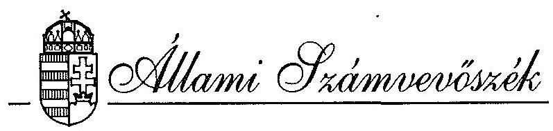

# JELENTÉS 

a Központi Statisztikai Hivatal részére a
PHARE forrásból juttatott pénzügyi támogatás felhasználásának vizsgálatáról
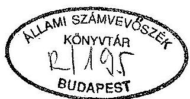

---

A vizsgálatot vezette:

| Kemény Emil | számvevô tanácsos |
| :-- | :-- |

A vizsgálatban részt vettek:

Bank Lajos
Dr. Bogáti Edit
Fülöp Istvánné
Jakab Péter
Réthelyi Jenô
Rundik János
Tardos József
számvevô tanácsos
osztályvezető fôtanácsos
számvevő tanácsos
számvevő tanácsos
számvevô
számvevő tanácsos
számvevő

---

# TARTALOMJEGYZÉK 

Oldal
I. BEVEZETÉS ..... 1
II. ÖSSZEFOGLALÓ MEGÁLLAPÍTÁSOK, AJÁNLÁSOK ..... 4
III. RÉSZLETES MEGÁLLAPÍTÁSOK ..... 9

1. TERVEZÉS, ELŐKÉSZÍTÉS ..... 9
1.1. A program előkészítése ..... 9
1.2. Tenderkiírás és értékelés ..... 9
2. A PHARE PROGRAM ÉS A STATISZTIKAI TEVÉKENYSÉG KORSZERŰSÍTÉSE ..... 11
2.1. Új statisztikai törvény ..... 11
2.2. A Gazdasági Szervezetek Statisztikai Regisztere ..... 12
3. A PHARE PROGRAM MEGVALÓSÍTÁSA ..... 14
3.1. A KSH PHARE iroda múködése ..... 14
3.2. A rendszer telepítése ..... 15
3.3. Áttérés az új számítástechnikai rendszerre ..... 18
3.4. Adatbiztonság, adatvédelem ..... 19
3.5. Továbbképzés ..... 23
4. A PROJEKT PÉNZÜGYI ELLENŐRZÉSE ..... 24
4.1. Alapszerződés ..... 24
4.2. Munkaprogramok ..... 27
4.3. Adózási, vám- és illetékszabályok ..... 29
4.4. A Pénzügyi nyilvántartás rendszere ..... 31
4.5. Bankszámlák ..... 31
4.6. Kifizetések ..... 33
4.7. A PHARE-on kívüli források ..... 34

---

# JELENTÉS 

## a Központi Statisztikai Hivatal részére a PHARE forrásból juttatott pénzügyi támogatás felhasználásának vizsgálatáról

## I.

## BEVEZETÉS

A közép- és kelet-európai országok átalakulásának elősegítésére az Európai Gazdasági Közösség (továbbiakban: EK) PHARE néven 1989-ben segélyprogramot kezdeményezett.

Ennek magyarországi végrehajtásáról az 1156/1989. (12.22.) MT határozat, az azt módosító 1007/1990. (07.18.), illetve az 1003/1991. (01.14.) kormányhatározatok rendelkeznek.

A program végrehajtásának feltételeiről az EK Brüsszeli Bizottsága (továbbiakban: Bizottság) és a Magyar Kormány keretmegállapodást írt alá 1990. IX. 3-án.

Ennek alapján került sor a "Magyar Statisztikai Információs Rendszer" címú Finanszírozási Megállapodás megkötésére.

A Megállapodást a Magyar Kormány nevében a Központi Statisztikai Hivatal (továbbiakban KSH) elnöke, az EK nevében a Bizottság elnökhelyettese írta alá 1992. március 19 -én, illetve április 13-án.

---

A szerződés fơbb adatai:
A projekt száma: H 9201
Időtartama: az aláírást követő három éven belül.
Célkitüzése:

- könnyen elérhető, megbízható információk biztosítása a statisztikai adatok felhasználói számára, ezáltal is támogatva a folyamatban lévő magyarországi reformot;
- megteremteni egy gyorsan alkalmazkodó és rugalmasan változó statisztikai adatfeldolgozás feltételeit az egyre növekvő komplex követelményeknek megfelelően;
- elősegíteni a magyar statisztikai információs rendszer integrálódását az európai rendszerbe, az Európa Tanács adatvédelmi alapelveinek fenntartása mellett.

A program költségelőirányzata: 9.500 .000 ECU.
A projekt megvalósításáért a KSH elnöke, az általa kijelölt elnökhelyettes, illetve az erre a célra szervezett PHARE programiroda a felelős.

Az Állami Számvevőszék a vizsgálatot elnökének határozata alapján végezte, szem előtt tartva az Európai Közösség Számvevőszékével kialakított együttmúködést. Ennek megfelelően az ellenőrzés célja annak megállapítása volt, hogy:

- az előkészítésért és megvalósításért felelős KSH hogyan érvényesíti az EK és a kormány között megkötött Keretmegállapodásban, és a Finanszírozási Megállapodásban foglaltakat,
- a program megvalósítása megfelel-e a Finanszírozási Megállapodásnak,
- a PHARE források felhasználása illeszkedik-e a hazai jogszabályi keretekhez, hogyan ellenőrzik a pénzeszközök felhasználását,
- az adatok felvétele, feldolgozása, tárolása, az adatvédelmi rendszer kialakítása és biztonsága mennyiben felel meg a statisztikáról szóló 1993. évi XLVI. törvény, valamint a személyes adatok védelméről és a közérdekủ adatok nyilvánosságáról szóló 1992. évi LXIII. törvény előírásainak.

---

# Az ellenőrzés módszere: 

Az Állami Számvevőszéknél kialakított, s a nemzetközi gyakorlatnak megfelelő módszertan alapján a vizsgálati programhoz rendeltük a projekt megvalósításának kritikus pontjait és folyamatait, majd ezekhez rendeltük az ellenőrzés kérdésköreit és követelményeit.

Ellenőrzésünk megállapításai a KSH által rendelkezésünkre bocsátott angol és magyar nyelvű dokumentumokra, a különböző szintű vezetőkkel folytatott interjúkra és helyszíni szemlékre támaszkodnak.

## Ellenőrzött időszak:

Az ellenőrzés alapvetően a Finanszírozási Megállapodás aláírásának időpontjától az 1993. november 30. közötti időszak eseményeire terjedt ki, de a program előkészítésének megítéléséhez feldolgoztuk a tervezés 1989-ig visszanyúló dokumentumait is.

A helyszíni ellenőrzés kezdete: 1993. október 4., befejezése: 1993. november 30. volt.

## Az ellenőrzött szervezet:

Központi Statisztikai Hivatal
1024 Budapest, Keleti Károly u. 5-7.
Ezen belül: - PHARE Programiroda
— Informatikai Főosztály
— Gazdasági Ágazatok Főosztály
—Adatgyűjtés és Módszertani Koordinációs Főosztály
—Oktatási (önálló) Osztály
—Nemzetközi Tájékoztatások Osztálya
— Heves Megyei KSH Igazgatóság
—Borsod-Abaúj-Zemplén Megyei KSH Igazgatóság
A jelentés angol fordítását az ÁSZ Elnöke megküldi az Európai Közösség Számvevőszékének, tájékoztatás céljából.

---

II.

# ÖSSZEFOGLALÓ MEGÁLLAPÍTÁSOK, AJÁNLÁSOK 

## Összefoglaló megállapítások

- A PHARE program megteremtette a lehetőséget a Központi Statisztikai Hivatal működési feltételeinek korszerűsítéséhez, forrást biztosítva világszínvonalú hardver és szoftver eszközök beszerzésére, közel egy milliárd forinttal tehermentesítve a költségvetést.
- A projekt előkészítése körültekintő és szakmailag alapos volt; megfelelő hátteret teremtett az informatikai rendszer fejlesztésének sikeres megvalósításához.
- A KSH - a PHARE program végrehajtása során - figyelembe vette a statisztikáról szóló 1993. évi XLVI. új törvény követelményeit, illetve a programból adódó lehetőségekkel megfelelően készíti elő a törvényben megfogalmazott feladatok végrehajtását.
A PHARE program által megvalósuló eszközrendszer megteremti a technikai lehetőségét a Gazdasági Szervezetek Statisztikai Regiszterének kialakítására és hatékony működtetésére.

A PHARE programnak, ezen belül a Gazdasági Szervezetek Statisztikai Regiszterének szerves részét képező statisztikai információs rendszer külső adatforrásainak jelenlegi helyzete miatt a különböző külső államigazgatási, vagy ún. adminisztratív adatforrások hasznosítását korlátozzák, hogy
$=$ a statisztikai törvényben a különböző államigazgatási szervek, vagy szervezeteik részére előírt elvi adatátadási kötelezettség ugyan kiinduló alap, de nem elegendő arra, hogy ezen kötelezettségnek az érintettek valóban eleget tegyenek.
= Hiányzik a főbb információs rendszerek (statisztikai, pénzügyi, monetáris, külkereskedelmi) közötti összhang megteremtéséről intézkedő kormányrendelet az átfedések és párhuzamosságok kiiktatása érdekében.

---

= Nincs eldöntve kormányzati szinten, hogy ki felel az adatok minőségéért (tartalmi és számszerủ megalapozottság) a KSH adatgyűjtésén kívüli adatforrások esetében.

A különböző államigazgatási, vagy ún. adminisztratív adatforrások átfedés és párhuzamosság nélküli hasznosítása, az adatminőség biztosítása jelentős költségvetési megtakarításra nyújtana lehetőséget.

- A teljes szoftver és hardver rendszer telepítése (installálása), minőségi átvétele ütemezve, a tervek szerint történt, bár a helyszíni ellenőrzés lezárásának időpontjában még a fejlesztés ezen szakaszának lezárását jelentő teljes rendszerdokumentáció nem állt rendelkezésünkre.

Az új számítástechnikai rendszerre történő áttérés (migrálás) megvalósítására - a szoftver és hardver installálását követően - 2 évet prognosztizált a KSH. A migráció végrehajtása - több ezer program áttelepítése és az új adatok integrálása az új rendszerre - alapvetően a KSH informatikai munkatársaira vár, akik egyébként is ezen rendszerek fejlesztői, illetve használói.

A PHARE forrásból megvalósuló - közel 1 Mrd Ft értékủ - fejlesztés teljes hasznosulásához szükséges a migráció mielőbbi befejezése és a Regiszter üzembe állítása.

A migráció felgyorsításához jelentős nemzetgazdasági érdek fűződik. A Kormány működését támogató korszerű információk elmaradásán túl a berendezés évente, hozzávetőleg 200 M Ft-ot veszít az értékéből (erkölcsi, fizikai amortizáció). A KSH belső gazdálkodási lehetőségei nem nyújtanak lehetőséget a migráció felgyorsításához. A feladat megoldására a vizsgálat lezárásakor a KSH részletes migrációs és pénzügyi ütemtervvel nem rendelkezett. Az ütemterv készítése folyamatban van.

- Az adatvédelem fogalmát a jelentésben komplex módon értelmeztük, beleértjük az adat- és titokvédelmet, valamint a múködésbiztonságot.

A projekt keretében beszerzett hardver és szoftver eszközök potenciálisan alkalmasak a feladatok biztonságos elvégzésére.

---

A törvények által megkívánt adatvédelem az alapszoftverrel kielégítően támogatott, de az adatvédelem végrehajtása lemaradásban van, és az adatvédelem szabályozása még csak részben és átmenetileg történt meg.

A vizsgálat időszakában a KSH nem tudott rendelkezésünkre bocsátani olyan feladattervet, amely az adatvédelem belső intézkedéseit, és ennek idóbeli ütemezését tartalmazta volna.

- A program pénzügyi teljesítésében 1993. december 31-ig a várható kötelezettség 7511,6 eECU, ezzel szemben a finanszírozáshoz csak 6702.8 eECU áll rendelkezésre, így a fennálló forráshiány 808,8 eECU. A KSH Programiroda 1993 júniusában kelt harmadik 6 havi munkaprogramban jelentette, hogy a folyamatos finanszírozás érdekében szükséges további 1260 eECU átutalása Brüsszelből.
Az EK szerződés szabályai szerint a segély második részének átutalását meg kell előznie egy auditálásnak, de a vizsgálat befejezéséig a PHARE segély felhasználását sem az EK Bizottság munkatársai, sem független auditáló cég nem ellenőrizte.
- A Keretmegállapodás "Általános feltételek" 13. cikk 1. pontja kimondja, hogy "adók, vámok és importilletékek nem finanszírozhatók az EK segélyből".

A megállapodásban foglaltak végrehajtása folyamatosan gondot okozott a PHARE forrás felhasználói számára. A PM 1992-ben állásfoglalásban intézkedett az ÁFA visszaigényléséről, de 1993. évre az új adótörvény ezt a lehetőséget megszüntette.

Az adóvisszaigénylés körüli bonyodalmak rendezésére az NGKM OECD Segélykoordinációs Titkársága nem a hazai szabályozáson keresztüli megoldást választotta, hanem felhatalmazást kért és kapott a kormánytól a nemzetközi Keretmegállapodás módosításának kezdeményezésére, amire 1993. márciusában került sor. A javasolt módosítás lényegileg törli az Általános Feltételek 13. cikk 1. pont 2. bekezdését. Ezzel a Keretmegállapodás hatálya kiterjedne a magyar szállítók számlázási rendjére is.

Ez a megoldás gyakorlatilag csak úgy végrehajtható, ha a PM vagy az APEH egyedileg engedélyezi a magyar szállítóknak, hogy az általános eljárási rendtől, a hatályos ÁFA törvénytől eltérő módon - ÁFA tartalom nélkül számlázzanak.

---

- 1992. szeptember 28-án az EK átutalt 6335000 ECU-t az első munkaprogram alapján a Magyar Hitelbank Rt.-nél vezetett számlára. 1992. novemberében a PHARE Programiroda (továbbiakban PMU) egy második bankszámlát is nyitott az Iparbanknál, ahová 3.7 millió ECU-t áthelyezett az MHB számláról.

Az Iparbanknál A PMU csak a 3,1 millió ECU tartós lekötéséről intézkedett, 0,6 millió ECU-t azonnal lehívható betétként kezeltek.
A számlán egy májusi kifizetést követően minimális pénzmozgás volt, tartós lekötésre azonban mégsem került sor.

Az Iparbankkal kötött szerződés és számlakezelés - az MHB szerződéshez viszonyítva - hátrányos volt a projekt részére, mivel a második számla megnyitása miatt 5550 ECU átutalási költségtöbblet, és az MHB-nél a tartós lekötés lehívható betétté minősítése miatt mintegy 25000 ECU kamatelmaradás keletkezett. Fentieken kívül becslésünk szerint további, mintegy 40000 ECU kamatbevételtől is elestek, az Iparbank - a tételek zömében alacsonyabb - kamatértékei és a tartós lekötések elmaradása miatt.

A szabad pénzek körültekintőbb tartós lekötésével és a második bank gondosabb kiválasztásával a kamat mértékét jelentősen növelni lehetett volna.

- A KSH Programiroda által rendelt - saját működéséhez szükséges - szolgáltatási és szállítási számláknál, a teljesítés és átvétel elismerésére nem találtunk igazolást.

A PMU ügykezelési rendszerében nem látható a Programiroda, mint bonyolító szervezet és a KSH, mint intézmény számviteli rendszerének kapcsolata, a beszerzett eszközök leltárba, illetve nyilvántartásba vétele.

- A PMU a kifizetéseket ECU egyenértékben, a számlát adó által igényelt valuta nemében teljesítette. Több esetben találkoztunk idegen valutában történt kifizetéssel magyarországi cégek, vállalkozók, magánemberek teljesítésének elszámolásakor.

Ezen esetekben figyelmen kívül hagyták a hatályban lévő 1/1974. PM rendelet megfelelő előírásait, amely szerint devizahatósági engedély nélkül magyar állampolgár munkavégzéséért csak forint javadalmazást kaphat.

---

# Ajánlások 

## Kormánynak:

- Gondoskodjon a statisztikáról szóló 1993. évi XLVI. törvényben megfogalmazott adatátadási kötelezettségnek - az 1039/1993 (V.21.) kormányhatározaton túlmenő - részletes szabályozásáról, amely biztosítja az adatszolgáltatás egységességét, összhangját és minőségét, továbbá tisztázza a felelősségi viszonyokat.
- Vizsgálja meg az új statisztikai rendszerre való áttérés gyorsításához szükséges többletforrás juttatásának lehetőségét fejezeten belüli forrásból, vagy a központi költségvetési tartalék terhére.
- Gondoskodjon arról, hogy az NGKM és a PM rendezzék a PHARE, illetve az egyéb nemzetközi segélyprogramok igénybevételénél jelentkező ÁFA folyó évi visszatérítésének kérdését, és soron kívül intézkedjék a Keretmegállapodásban foglalt kötelezettség teljesítése érdekében.

## A KSH Elnökének:

- Dolgoztassa ki a migráció részletes ütemtervét és terjessze a kormány elé a végrehajtás gyorsításához szükséges többletforrás igényét.
- Intézkedjen egy részletes adatvédelmi feladatterv kidolgozására, majd az abban foglaltak tételes végrehajtásáról.
- Számoltassa be a PMU vezetőjét a második bankszámla nyitásáról és a kamatkiesés körülményeiről.
- Szabályozza a KSH szervezetén belül működő PMU a pénzügyi-bizonylati és számviteli rendjét - az intézet számvitelével összhangban -, illetve a tulajdon védelmét.
- Vizsgáltassa felül az 1/1974. PM rendelet előírását sértő deviza kifizetéseket és szükség szerint éljen a felelősségre vonással.

---

# III. 

## RÉSZLETES MEGÁLLAPÍTÁSOK

## 1. TERVEZÉS, ELŐKÉSZÍTÉS

### 1.1. A program előkészítése

Az 1980-as évek végére a KSH számítástechnikai rendszere elérte teljesítőképessége határait; a működő rendszer a megnövekedett szolgáltatásoknak nem, vagy csak nehezen tudott eleget tenni. A vezetés 1989-ben átfogó változásokat tartalmazó koncepció tervet dolgozott ki. E koncepció terv és az EUROSTAT KSH-ról készített tanulmánya alapján a KSH "Project Javaslatot" készített a PHARE támogatás elnyerésére, amely tartalmazta a statisztikai rendszer átalakításának igényét előidéző folyamatokat, az átalakítás koncepcióját, megalapozását és a fejlesztési stratégiát. A dokumentum rögzítette a hardver, szoftver és telekommunikációs célkitűzéseket, felvázolta a fejlesztés alternatíváit, és a várható beruházási költségeket.

Megvalósíthatósági tanulmányban meghatározták a hardver és szoftver igényeket, abból kiindulva, hogy a statisztikai rendszer átalakítása mit igényel. Ekkor még érezhető a meglévő IBM rendszer meghatározó szerepe.

A tervezés dokumentumai alapján megállapíthattuk, hogy a projekt előkészítése körültekintő és szakmailag alapos volt; megfelelő hátteret teremtett a fejlesztés sikeres megvalósításához.

### 1.2. Tenderkiírás és értékelés

A KSH a Projekt megvalósítására irányuló tender felhívását 1992. március 28 -án tette közzé, a tender bontására 1992. július 1-én került sor.

A döntési és beszerzési folyamat lépéseit a KSH szabályosan hajtotta végre és a célszerűség szempontjait figyelembe vette.

---

# Tételesen: 

a.) Megvalósíthatósági tanulmányokkal megalapozták a hardver- és szoftvereszközök összetételét, figyelemmel az üzemeltetés költségeire is.
b.) A beszerzendő eszközök alternatíváinak kidolgozásában a fejlesztő, és a felhasználói oldal is közreműködött.
c.) Több lépcsőben elemezték a potenciális szállítókat, a pályáztatást körültekintően hajtották végre és a beérkezett ajánlatokat szabályos körülmények között értékelte ki a KSH, szakmailag elismert zsűri segítésével.
—Elemeztük a kiértékelésnél alkalmazott súlyozást.

1. sz. ábra

## A tender kiértékelésénél alkalmazott súlyozás

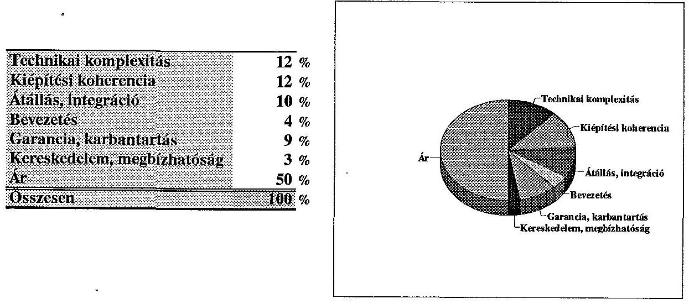

Az EK gyakorlatnak megfelelően a technikai/műszaki és árjellemzők 50-50\%-os megoszlását tükrözi a diagram. A KSH a szállítói megbízhatóságot (különválasztva a garancia-tényezőtől) $3 \%$-os súllyal a hetedik (utolsó) helyen szerepeltette, míg ez a hazai, de különösen a nemzetközi gyakorlatban második, vagy harmadik tényező (lásd 1. sz. ábra).

---

- A bírálati szempontok megfelelő részletességgel kiterjedtek a technikai paraméterekre és teljesítményi tulajdonságokra. A központi számítógép esetében az egyetértési (konkordancia) mutató megfelelit a szokásos értéknek.
d.) A program ellenőrzésére létrehozott Felügyelő Bizottság (Steering Committee) jóváhagyásával alakult ki a végső sorrend az IBM és a Hewlett Packard (továbbiakban HP) között, utóbbi javára. A program előkészítésével és iṇdításával kapcsolatos észrevéleteink a következők:
- A projekt gyakorlati beindítása, az EK részére történt - a HP szerződéssel kapcsolatos - kiegészítő információk megküldése, megválaszolása és elfogadása miatt 3 hónapot késett a magyar fél szerződéstervezetének megküldéséhez képest.
- Tekintettel a számítástechnikai beszerzés legmagasabb fokú koncentrációjára - amikor mindent egy szállítótól rendelnek meg - a viszonylag alacsony kereskedelmi/megbízhatósági súlyszám felvételét kockázatos tényezőként értékeljük a rövidlistás zsúrizés során.

# 2. A PHARE PROGRAM ÉS A STATISZTIKAI TEVÉKENYSÉG KORSZERŰSÍTÉSE 

## 2.1. Új statisztikai törvény

A projekt megvalósításának időszaka alatt született a statisztikáról szóló 1993. évi XLVI. törvény, amely előírja a Központi Statisztikai Hivatal feladatait. Az Országgyúlés, a kormányzat, a gazdaság és a társadalom részéről nagy mértékben nőtt az igény a friss, új információk iránt. Ennek a követelménynek a KSH csak az adatgyűjtési idő lerövidítésével és a központi adatbázis-információk elérési lehetőségeinek megnövelésével tud eleget tenni.

---

# A KSH külső kapcsolatai 

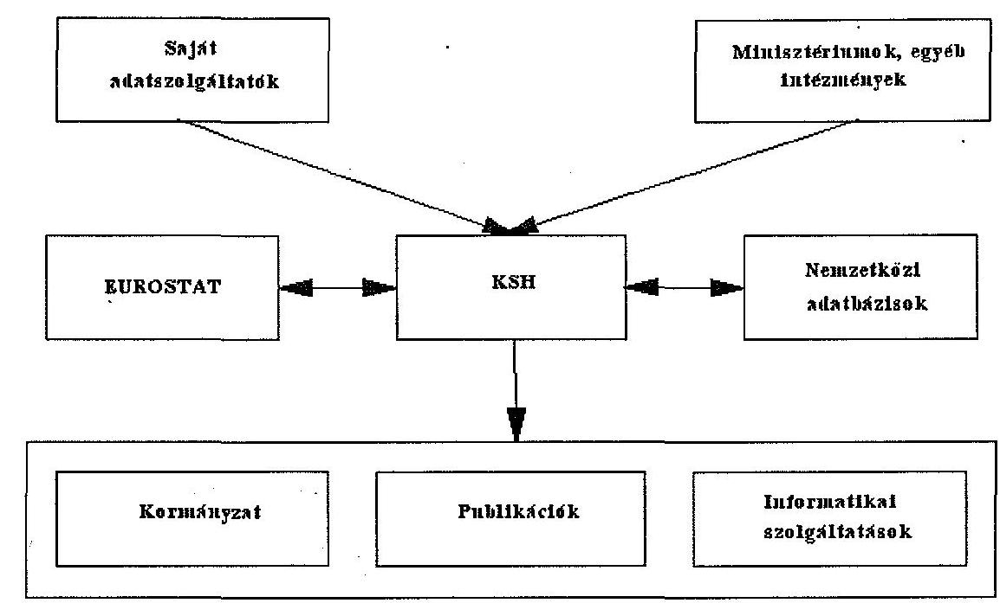

A rendszerváltással, (privatizációval) kapcsolatosan ugrásszerűen megnőtt a gazdasági egységek száma, amely a korábban kidolgozott statisztikai rendszerek átdolgozását, új alapokra helyezését igényli. A statisztikai adatszolgáltatás iránti igény is megváltozott, amit a statisztikai törvény is kifejez.

A KSH - a PHARE program végrehajtása során - figyelembe vette a törvény módosításából következő feladatokat.

### 2.2. A Gazdasági Szervezetek Statisztikai Regisztere (Business Register)

A kormány részére készített KSH előterjesztés az 1994. évre szóló Országos Statisztikai Adatgyűjtési Programról (1993. október) kiemelt feladatként kezeli a statisztikai regiszter fejlesztését.

A PHARE program megteremtette a technikai feltételeit annak, hogy a Regiszter egységes és korszerű adatbázisra épüljön.

---

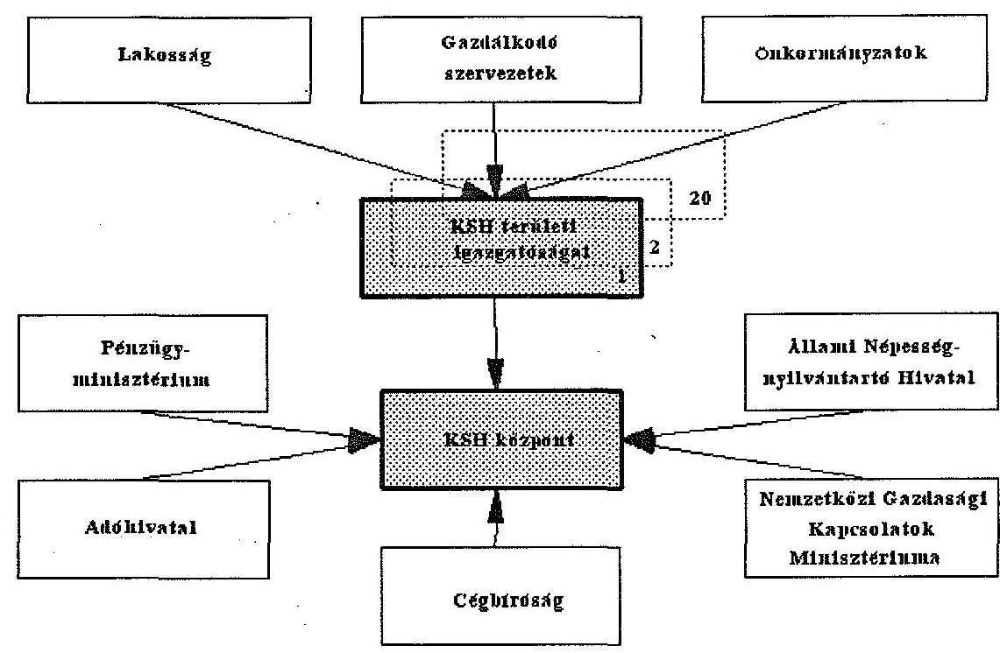

A statisztikai adatszolgáltatók nyilvántartásához szükséges adatok több külső és belső adatforrásból származhatnak.

A különböző államigazgatási nyilvántartások adatainak hasznosítása szorosan kapcsolódik a PHARE projekt tartalmához és hatékony múködtetéséhez.

A különböző államigazgatási, vagy ún. adminisztratív adatforrások átfedés és párhuzamosság nélküli hasznosítása jelentős költségvetési megtakarítási lehetőséget tartalmaz. E kérdés vizsgálatát az egész államigazgatásban végre kellene hajtani és kapcsolni a várható államigazgatási és államháztartási reformhoz.

A KSH az 1994. évre szóló Országos Statisztikai Adatgyűjtési Programra (OSAP) vonatkozó előterjesztésében hivatkozik az Országos Műszaki Fejlesztési Bizottság OSAP-hoz csatolt véleményére: "Szükséges tájékoztatni a kormányt az egyes főbb információs rendszerek (statisztikai, pénzügyi, monetáris, vám) közötti összehangolás jelenlegi helyzetéről és arról, hogy az 1994. évi OSAP eredményez-e érdemi változást e téren, és melyek a további teendők." A kialakult 1994. évi statisztikai program átmeneti állapotot

---

tükröz miután még nem került elfogadásra a statisztikai törvény végrehajtásáról intézkedő kormányrendelet.

Kormányzati szinten nincs eldöntve, ki felel az adatok minőségéért a KSH adatgyűjtésén kívüli adatforrások esetében. A statisztikai törvényben a különböző államigazgatási szervek részére előírt adatátadási kötelezettség kiinduló alap, de nem elegendő a kötelezettség realizálására.

# 3. A PHARE PROGRAM MEGVALÓSÍTÁSA 

### 3.1. A KSH PHARE Programiroda müködése

A PHARE program kialakult gyakorlatának megfelelően a KSH létrehozta a PHARE Programirodát (Programme Management Unit; PMU) és szerkezetileg illesztette a KSH működési rendjébe.
4. sz. ábra

A KSH-PHARE program megvalósulásának szervezeti struktúrája
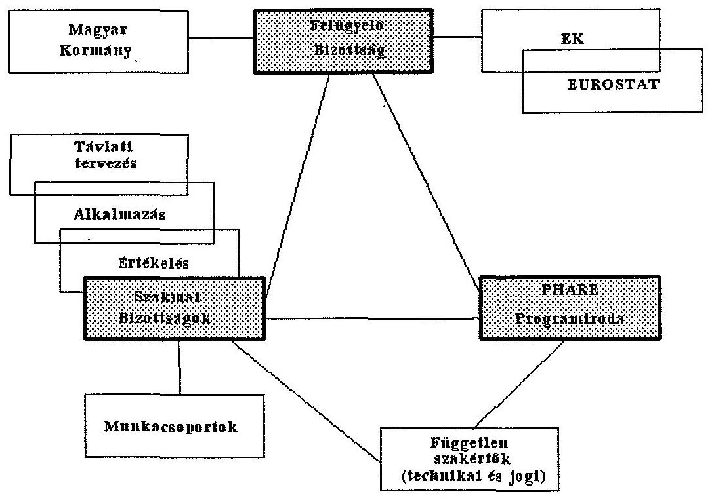

---

# 3.2. A rendszer telepítése (installálás) 

A tendert - generál szállítóként - elnyerő Hewlett-Packard Hungary ütemtervet készített vállalt kötelezettségének teljesítésére, amely tartalmazta a központba, valamint a megyei kirendeltségekhez telepített hardver és szoftver eszközök átvételének, tesztelésének teljesítésigazolásának lépéseit. A rendszer installálása az ütemterveknek megfelelően történik.

### 3.2.1 Megyei Igazgatóságok

A gépek átvétele szervezetten, szakszerüen történt. Az átvételre a rendszer későbbi üzemeltetőit egy Útmutató segítségével készítették fel.
A minőségi átvétel (provisional acceptance) során elvégezték azokat a müködési teszteket, amelyeket a HP állított össze a KSH követelményeinek megfelelően. Az esetleges hibákat, észrevételeket feljegyezték. A minőségi átvételt dokumentálták, amelyet a HP és a KSH megyei igazgatóságán kijelölt személy írt alá (Provisional Acceptance Form).
Mindkét általunk vizsgált megyei igazgatóságon a minőségi átvétel a mintaszerű előkészítés következtében egy nap alatt megvalósult, említésre méltó hiányosság nem volt.
A KSH személyi számítógép állományának alakulása a telepítés befejezése után:
5. sz. ábra
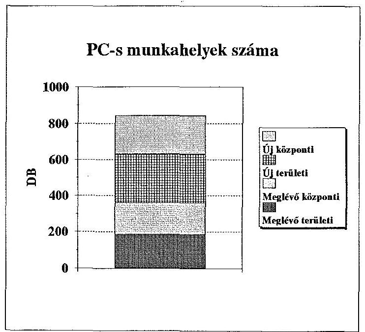

---

6. sz. ábra

# A régi és az új központi rendszer néhány jellemzőjének összehasonlítása 

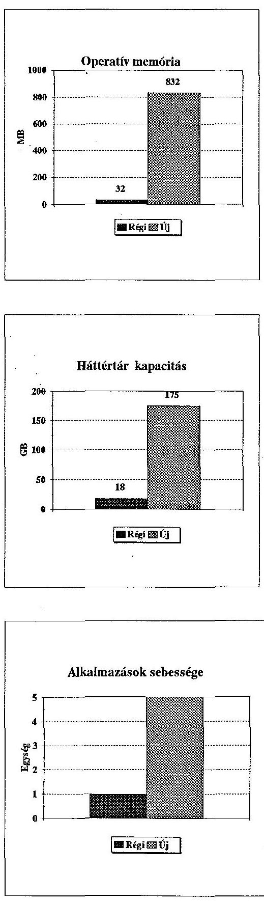

---

3.2.2 A központban először az egyik szerver (központi egység) felszerelése történt meg, annak érdekében, hogy minél hamarabb elkezdhessék a munkatársak oktatását. Ezután telepítették a HP munkaállomásokat. A központ hálózatának kialakítása után jutott el a fejlesztés oda, hogy a legnagyobb központi gépet (Emerald - a vezéregységet azonosító fantázianév) installálják, az IBM-HP gép-gép kapcsolatot teszteljék és átvegyék.
A központi gép teljesítményének vizsgálatához a teszteket a HP-vel közösen dolgozták ki és hajtották végre. (Proposal of the Emerald performance tests for the Hungarian Statistical Office). A teljesítmény tesztelés három feladatot tartalmazott:

- Egy SAS Programrendszerben fejlesztett alkalmazás összehasonlítását a két központi gépen. A teljesítményvizsgálat eredményeképpen kiderült, hogy a HP több mint ötször gyorsabb a korábbi IBM központi gépnél.
- Az általában szűk keresztmetszetet jelentő input-output műveletek végrehajtását az Emerald fele annyi idő alatt végezte el, mint a korábbi IBM gép.
— Vizsgálták az Emerald teljesítményét abból a szempontból is, hogy milyen időket tapasztalnak akkor, ha nagyméretű adatállományokat generálnak ORACLE V. 7 adatbáziskezelő segítségével.

A régi és az új központi gép (mainframe) néhány jellemzőjének összehasonlítását a 6. sz ábra mutatja.
3.2.3 Az X. 25 típusjelű távadathálózat kiépítése, installálása, konfigurálása, tesztelése megtörtént, a helyszíni vizsgálat során létrejött a kapcsolat a központtal.
3.2.4 Az alapszoftverek installálását, a hardver-teszttel egyidejűleg hajtották végre.

Az ORACLE V. 6 adatbáziskezelő installálása és tesztelése az ORACLE tesztelési útmutató alapján történt.

A SAS és az SPSS statisztikai programrendszerek installálása, átvétele megtörtént.

---

A rendszerekhez a dokumentációk is rendelkezésre állnak, többségük magyar nyelven. A levelező rendszer a helyszíni vizsgálat időpontjában még nem működött teljeskörűen.

Összefoglalva megállapíthatjuk, hogy a teljes rendszer installálása, minőségi átvétele gondosan ütemezve, a tervek szerint történik. A helyszíni ellenőrzés lezárásának időpontjában az átvétel még nem fejeződött be és így a rendszerdokumentáció nem állt rendelkezésünkre.

# 3.3. Áttérés az új számítástechnikai rendszerre (Migráció) 

Az új számítástechnikai rendszerre történő áttérés megvalósítására a szoftver és hardver installálását követően - 2 évet prognosztizált a KSH, ennek megfelelően a vizsgálat időpontjában a készültségi állapot egy kezdeti fázist tükrözött.

A KSH felmérte a felhasználói igényeket - egyelőre a fejlesztés költség- és idővonzata nélkül -, elemezte az adatvagyont archiválási és közvetlen elérési szempontból, és folyik a metaadatbázis kialakítására a javaslat előkészítése. Előirányozták és részben megkezdték a kísérleti rendszerek fejlesztését, üzemeltetését, amely az informatikusok, statisztikusok együttműködését segíti elő és pontosíthatóvá teszi a korábbi javaslatokban szereplő idő- és kapacitásszükségletek aktualizálását.
A migráció végrehajtása - tehát több ezer program áttelepítése és az új adatok integrálása az új rendszerre - a KSH informatikai munkatársaira vár, akik egyébként is ezen rendszerek fejlesztői, illetve használói. E szakembergárda feladata a jelenlegi felkészülés, majd a migrációval kapcsolatos fejlesztés a statisztikai szolgáltatások párhuzamos ellátása mellett.

A PHARE forrásból megvalósuló - közel I Mrd Ft értékủ - fejlesztés teljes hasznosulásához szükséges a migráció mielőbbi befejezése, és a Regiszter üzembe állítása.

A KSH belső gazdálkodási lehetőségei nem nyújtanak kellő alapot a migráció felgyorsításához. PHARE forrásból a feladat nem valósítható meg. Mivel a KSH tartalékokkal, átcsoportosítható pénzeszközökkel nem rendelkezik, ezért az átállásból következő többlet feladatokat csak abban az esetben tudja végrehajtani, ha az ezekhez szükséges erőforrások is rendelkezésre állnak.

---

A migráció fázisaira és azok finanszírozására a KSH részletes ütemtervvel a vizsgálat időpontjában nem rendelkezett. Az ütemterv készítése folyamatban van.

# 3.4. Adatbiztonság, adatvédelem 

Az adatvédelem fogalmát a jelentésben komplex módon értelmezzük, beleértjük az adat- és titokvédelmet, valamint a müködésbiztonságot.

A vizsgálat időpontjában az adatbiztonsági és adatvédelmi intézkedések és eljárások gyakorlati megvalósítására, tesztelésére, illetve e módszerek finomítására még nem került sor. Ebből következően csak az volt vizsgálható, hogy az adott hardver vagy szoftver eszköz potenciálisan alkalmas-e az igényeknek, illetve a törvényi előírásoknak megfelelő adat- és titokvédelmi környezet megvalósítására, beleértve a személyiségi jogokat érintő adatállományok kezelését és hozzáférhetőségét is.

A teljes rendszer adat- és müködésbiztonsági, valamint titokvédelmi kockázatelemzésére nem került sor és ezt nem is tervezik.

### 3.4.1 A rendszer fizikai környezete

A központi szervereket a meglévő klimatizált számítógépterembe telepítették, így környezetük biztonsági szempontból megfelelőnek minősíthető. Mindemellett illetéktelen behatolás ellen védelmet nyújtó riasztó rendszerrel a központi gépterem nincs ellátva. Automatikus tüzoltó berendezés nincs, és mivel a rendszer 24 órás felügyelet nélküli üzemét tervezik, az éjszakai portaszolgálat feladata az intézkedés egy esetleges géptermi tűz esetén. A számítógépterem gyors és teljes áramtalánithatósága megnyugtatóan nem megoldott. A központi gépterem másodlagos elektromágneses sugárzás szempontjából nem árnyékolt, így nem védett a külső lehallgatástól vagy az esetleges manipulációs külső behatolástól.

A vidéki központokban a géptermek megfelelő elkülönítése a befogadó épületben nem mindenhol megoldott. A géptermeket tűzjelzőberendezés védi. Automatikus tűzoltó berendezés, illetve illetéktelen behatolás ellen védő riasztóberendezés nincs.

---

# 3.4.2 Az adatbiztonság hardver feltételei 

Az új központi gépek, illetve munkaállomások egységes hardver, illetve szoftver architektúrát képviselnek, minőségüket, technikai megoldásaikat tekintve magas műszaki színvonalú eszközök:
-a központi gépek automatikus hibakorrekcióra képes memória-blokkokkal rendelkeznek;
—a központi szerverek háttértárai biztonsági diszk-alrendszerekből állnak, melyek hiba esetén lehetővé teszik a rendszerleállítás és adatvesztés nélküli diszkcserét;
—a rendszer architektúrájából adódóan jelentős bővítési lehetőségekkel rendelkezik, a rendelkezésre álló háttértárakról a folyamatos és biztonságos mentési eljárásokhoz szükséges kapacitás rendelkezésre áll. A mentések fizikailag elkülönített tárolása az új rendszerben megoldható. Jelenleg ez még nem gyakorlat, a mentések üzemszerű szabályozása kialakítás alatt van;
—a rendszer háttértárainak tartalmát az állományok aktivitási mutatói alapján hierarchikus módon kezeli;
— valamennyi szervert ún. BATTERY BACKUP rendszer védi áramkimaradáskor. E rendszer 15 perces áramkimaradás áthidalására alkalmas. Mivel szünetmentes tápegység e szervereket nem védi, 15 percet meghaladó áramkimaradás esetén e gépek adatvesztések nélküli újraindíthatósága nem garantált;
—a HP 9000-890-es szerver (Emerald) önálló intelligens szünetmentes tápegységről üzemel (hálózat-kimaradás esetén képes a központi vezérgép adatvesztések nélküli automatikus leállítására). E tápegység nem áll a hálózat menedzser szoftver felügyelete alatt;

Sem a központi gépeknél, sem a munkaállomásoknál nem volt szempont azok lehallgathatósága, zavarhatósága, másodlagos elektromágneses sugárzásukból visszanyerhető információk védelme.

---

# 3.4.3 Adathálózat 

A hálózat megtervezése a HP javaslatai alapján és közreműködésével készült. A hálózati topológia a központban és a megyei irodákban is megfelelően dokumentált.

A központi épületek között vezetett hálózat üvegszálas, amely biztonsági szempontból (lehallgathatóság, zavarhatóság, villámcsapás) is igényes müszaki megoldás.

A megyei irodák és a központ közötti távadatátviteli vonalak külső behívás ellen védettek, a vonali adatforgalom azonban semmilyen rejtjelezési módszerrel nem védett.

A hálózat management szoftvere magas szinten támogatja a hálózati elemek aktív megfigyelését, a hibabehatárolást, a hálózat működése szempontjából kritikus paraméterek folyamatos ellenőrzését.

Önálló fejlesztői szerverrel rendelkezik a rendszer, így az éles rend'szerektől elkülönítve, generált adatokon folyhat a fejlesztés, tesztelés. Szintén önálló szerveren tesztelhetők az operációs rendszer módosításai is.

### 3.4.4 A szoftverek biztonsági vonatkozásai

A központi gépek, valamint a munkaállomások operációs rendszere a dokumentumok alapján eleget tesz az USA védelmi minisztériuma által kidolgozott biztonsági ajánlás C2-es (Controlled Access Protection) kategóriájának. (Department of Defense Computer Security Center, Directive 5215, C2). Az operációs rendszer biztonsági tulajdonságai összhangban vannak a KSH számítógéprendszerével szemben reálisan támasztható követelményekkel.

Az ORACLE adatbáziskezelő rendszeren keresztül a felhasználókhoz, illetve az egyes állományokhoz rendelhető, az operációs rendszer hozzáférési kontrolljának lehetőségeit meghaladó hozzáférés védelmi eszközök alkalmazására van lehetőség.

---

# 3.4.5 Vírusvédelem 

A PC-s munkaállomásokon a VIRSEC és CHKVIR víruskereső szoftverek, valamint az ún. "adatforgalmi munkahelyek" rendszere véd a vírusfertőzésektől. A központi gépek és intelligens munkaállomások (workstation) a UNIX operációs rendszerre tekintettel nem rendelkeznek vírusvédelmi szoftverrel.

### 3.4.6 A migráció biztonsági vonatkozásai

Adatbiztonsági, adatvédelmi szempontból a project egyik talán legkritikusabb pontja a meglévő adatállományok és alkalmazások új rendszerre történő áttelepítése. Az IBM és HP rendszer közötti adatátviteli feladatokat cél-hardver és szabványos szoftver eszközök segítségével oldották és oldják meg. A használt eszközök az adattranszfer oldaláról garantálják az IBM rendszer állományainak adatvesztés nélküli áttelepítését.

A migráció biztonságos végrehajtása szempontjából nagyon fontos, hogy a teṅderben követelmény volt, hogy a megajánlott szoftver eszközök, protokollok megfeleljenek a nyílt rendszerek szabvány-ajánlásainak. E hard-ver-szoftver környezet ellenére igazi nehézséget a SAS rendszereken kívüli korábbi alkalmazások HP környezetre történő áttelepítése jelent, hiszen itt a két rendszer minden lényeges elemében különbözik egymástól (operációs rendszer, file-kezelés, adatbáziskezelő, batch illetve on-line interaktív feldolgozási mód stb.). Az áttelepítés gyakorlatilag a meglévő alkalmazások korszerűsített változatának teljes újra programozását jelenti. A project keretében beszerzett hardver és szoftver eszközök pontenciálisan alkalmasak e feladat biztonságos elvégzésére.

A teljesen új architektúrát jelentő környezetbe a SAS programcsomag által kezelt alkalmazások problémamentesen migrálhatók, mivel a SAS különböző operációs rendszer alatt futó változatai teljes kompatibilitást biztosítanak.

---

# 3.4.7 Karbantartás, javítás 

A PHARE project keretén belül beszerzett berendezésekre 3 év garancia érvényes, ezen belül minden meghibásodás elhárítását a HP szervízhálózata végzi. A javítást a hiba bejelentésétől számított 4 órán belül a szervíznek meg kell kezdenie.

Összefoglalva megállapítható, hogy a jogszabály által megkívánt adatvédelem az alapszoftverrel kielégítően támogatott, de az adatvédelem gyakorlati végrehajtása lemaradásban van, és az adatvédelem szabályozása még csak részben és átmenetileg történt meg.

A közbenső átmeneti intézkedések (KSH elnökének 6/1992. utasítása) nem elégségesek a rendszerjellegủ adatvédelemhez.

A törvényi és a jogszabályi háttér megfelelő követelményeket támaszt az adatés titokvédelemhez, ezeket azonban az alkalmazás során realizálni szükséges, a felhasznált rendszerek adta lehetőségek figyelembevételével.

A vizsgálat időszakában a KSH nem tudott rendelkezésünkre bocsátani olyan feladattervet, amely az adatvédelem belső intézkedéseit, és ennek időbeli ütemezését tartalmazta volna.

### 3.5. Továbbképzés

Az új rendszer biztonságos működtetése és alkalmazása szempontjából rendkívül fontos, hogy üzemeltetői és felhasználói oldalról egyaránt, felkészült, önálló munkavégzésre alkalmas szakembergárda kerüljön kiképzésre.

A Pénzügyi Megállapodás 50.000 ECU-t irányzott elő szakképzésre és 150.000 ECU-t tanulmányutakra. Egy későbbi költségvetési átcsoportosítás (1993. február) során a két tételt a korábbival megegyező előirányzattal összevonták.

Tanfolyamok, illetve tanulmányutak finanszírozására további lehetőségek is vannak a költségvetésben. Az információs rendszer szállítóival kötött szerződések szakképzésre - tehát a szállítandó gépi berendezések és programok használatának betanítására - is tartalmaznak előírásokat. Így a fö- és alvál-

---

lalkozókkal kötött szerződések alapján 291.768 ECU-t fordítottak a rendszer működtetői és felhasználói szakmai betanítására.

A szakképzésre, hivatalos külföldi utazásra a teljes program közel $6 \%$-át irányozták elő.

A tanfolyamok szervezése során a rendszer installálásához, az adatbázis fejlesztéshez és a statisztikusi gépfelhasználói igényekhez igazodva, több lépcsőben - 18-20 féle tanfolyamon - közel 1800 jelentkezővel számoltak és mintegy 300-460 össztanfolyami napot terveztek.
Költségkímélés céljából az első lépcsőben kiképzett szakemberek továbboktatják a felhasználásban érintetteket. Az információs rendszer szállítói által rendezett tanfolyamok eredményessége csak a rendszer munkába állítása, tehát az ismeretek gyakorlati alkalmazása után értékelhető. A KSH szakmai vezetőinek véleménye szerint a képzési programok tematikája és az ismertetésükre fordított idő a felhasználók számára elegendőnek látszik az új rendszer működtetéséhez.

A külföldi tanulmányutak és konferenciákon való részvétel egy része közvetlenül kapcsolatba hozható a KSH információs rendszerének moder- $\cdot$ nizálásával (pl. 50 fő kiutazása Böblingenbe egy rövid tanfolyamra), más részüknél azonban csak közvetett lehet a kapcsolat (pl. rendszeresen megrendezett - informatikai témákkal is foglalkozó nemzetközi statisztikai konferenciák). A vizsgálat a konferenciák tartalmi kérdéseibe nem tudott és nem is kívánt belemenni, megelégedett annak megállapításával, hogy e kiutazások szerepeltek az EK Képviselet által jóváhagyott kiutazási tervben.

Megállapítható, hogy A PHARE program eddigi sikeres megvalósításában nagy szerepe van a megfelelő fogadókészségnek és a magas színvonalú szakmai hozzáértésnek.

# 4. A PROJEKT PÉNZÜGYI ELLENŐRZÉSE 

### 4.1. Alapszerződés

A pénzügyi megállapodás (Financing Memorandum) szerint a H9201 program végrehajtására három éves időtartamra 9,5 millió ECU-t hagyott jóvá.

---

Az előirányzatot nyolc költségvetési címre (Budget Line, BL) osztották fel, beleértve a tartalékot is. A költségek felosztását, a költségvetési sorok megnevezését, és a hozzájuk rendelt előirányzati összegeket az 1.sz. táblázat tartalmazza.
7. sz. ábra

# PHARE-KSH projekt pénzforrásai 

|  | ECU |
| :--: | :--: |
| Alaprendszerek | 7089000 |
| PC-k és nyomtatók | 711000 |
| Kiadványszerkesztés | 100000 |
| Adatbáziskezelés | 400000 |
| Project Management | 550000 |
| Továbbképzés | 200000 |
| Tartalék | 450000 |
| Összesen | 9500000 |

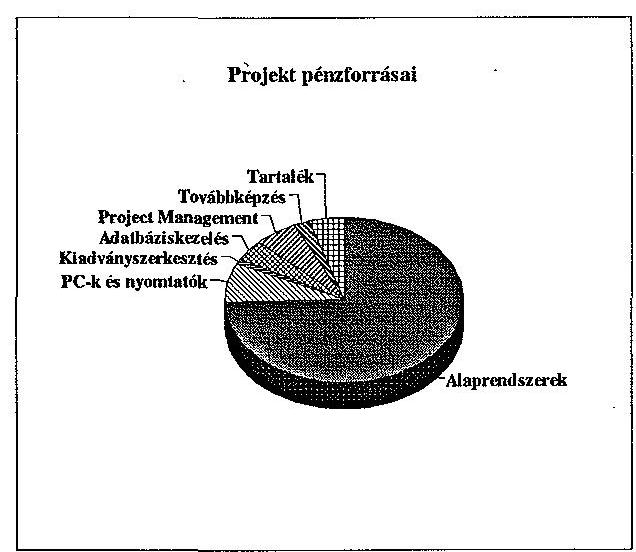

Az első 6 havi munkaprogram 1992. december 31-ig 6335 eECU felhasználását irányozta elő, melyből 6105 eECU volt a HP szerződés időarányos része. A szerződés EK általi jóváhagyására csak 1993 áprilisában került sor. Így a pénzügyi kifizetés 1992. végéig a tanácsadók díjazására, az oktatási programra és a PMU beszerzéseire összesen 88,2 eECU volt.
1993. március 3-i levelében a KSH kérte az egyes költségsorok módosítását a teljes előirányzat végösszegének változatlanul hagyása mellett. Az EK ezt 1993. május 14-i levelével jóváhagyta.

---

# A H9201 PROGRAM PÉNZÜGYI HELYZETE

|  Sorszám | Költségvetési sor (BL) | Pénzügyi Megállapodás (FM) | Módosítás | Első Munkaprogram 1992.07.01 - 12.31. | Második Munkaprogram 1993.01.01 - 06.30. | Harmadik Munkaprogram 1993.07.01 - 12.31. | Kifizetett összesen (várható)  |
| --- | --- | --- | --- | --- | --- | --- | --- |
|   |  |  |  | Előirányzat | Szerződött Kifizetett | Előirányzat | Szerződött Kifizetett  |
|  BL 1 | Alaprendszerek (HW, alap SW) | 7200.0 | 7089.0 | 5360.0 | 0.0 | 0.0 | 4170.0  |
|  BL 2 | PC-k és nyomtat | 650.0 | 711.0 | 390.0 | 0.0 | 0.0 | 308.9  |
|  BL 3 | Kiadványszerkesztés | 100.0 | 100.0 | 60.0 | 14.6 | 13.2 | 30.0  |
|  BL 4 | Adatbázisékezelés | 350.0 | 400.0 | 355.0 | 0.0 | 0.0 | 259.7  |
|  BL 5 | Project Management | 550.0 | 550.0 | 40.0 | **44.1 | 42.6 | 200.0  |
|  BL 6 | Továbbképzés | 50.0 | 200.0 | 22.0 | 20.3 | 20.3 | 14.0  |
|  BL 7 | Tanulmányok | 150.0 | 0.0 | 108.0 | 106.7 | 12.1 | 95.9  |
|  BL 8 | Tartalék | 400.0 | 450.0 | 0.0 | 0.0 | 0.0 | 0.0  |
|   | Összesen | 9450.0 | 9500.0 | 6335.0 | 185.7 | 88.2 | 5078.5  |
|   | AFA | 0.0 | 0.0 | 0.0 | 0.0 | 0.0 | 0.0  |
|   | Bankköltség | 0.0 | 0.0 | 0.0 | 0.0 | 5.7 | 0.0  |
|   | Kamat | 0.0 | 0.0 | 0.0 | 85.6 | 0.0 | 0.0  |

- Az FM-ben összeadási hiba van, melyet a módosítással a tartaléknál korrigáltak ** Nem tartalmazza a PMU tanácsadók Brüsszelből fizetett szerződését 302.8 eECU-t

---

A program állása szerint a BL3-5-6 sorokon előirányzott összegek felhasználásra kerülnek. A BL1-2-4 sorokon előirányzott 8200 eECU-ből a HP szerződés leköt 7632,3 eECU-t, így a megtakarítás 567,7 eECU. Ha ehhez hozzávesszük a 450 eECU tartalékot, és az 1993. szeptember 30-ig elért 367,8 eECU kamat 70,7 eECU ÁFA kifizetése miatt csökkent hányadát, 297,1 eECU-t, akkor 1314,8 eECU szabad keret áll még rendelkezésre. Ebből kívánják fedezni a jelenlegi, működő IBM rendszer és az új HP rendszer összekapcsolását.

Ezen munkák I. ütemének előirányzata mintegy 500 eECU, melyből 100 eECU felhasználása még 1993-ban várható.

# 4.2. Munkaprogramok 

A Megállapodás aláírását követően készült el a PHARE előírásoknak megfelelően az első 6 havi munkaprogram, amely az 1992. július 1 - december 31. közötti időszakot öleli fel.

A megvalósítási terv költségsoronként tartalmazza az elvégzendő feladatokat és az ehhez szükséges pénzügyi keretet. A PHARE programok finanszírozási gyakorlatának megfelelően, az EK Bizottság 1992. szeptember 28-án átutalta az előirányzat kétharmad részét ( 6335 eECU) a Magyar Hitelbank Rt.-nél nyitott számlára. Az időszak alatt a pénzügyi teljesítés 88,2 eECU volt (1. tábla).

Az alacsony pénzügyi teljesítés oka az, hogy a HP szerződés-tervezet jóváhagyása az EK részéről 1992. decemberétől 1993. áprilisáig elhúzódott. A második 6 havi munkaprogram 1993. január 1. - június 30. közötti időszakra vonatkozik. Tartalmazza az előző időszakról készült részletes beszámoló jelentést (Progress Report), az elvégzendő feladatokat és az MHB-nál vezetett számla pénzügyi mozgását.

Nem tartalmazza azonban azt a tényt, hogy 1992. novemberében egy második számlát nyitottak az Iparbanknál is, melyre még abban az évben átutaltak összesen 3700 eECU-t. Az időszak pénzügyi teljesítése 2817,7 eECU (l. tábla).

---

Az időarányos pénzügyi teljesítés 44.6 \%-kal elmarad a tervezettől, amely szintén a HP szerződéstervezet-aláírás elhúzódásának következménye.

A harmadik 6 havi munkaprogram 1993. július 1. - december 31. közötti időszakra vonatkozik. Szerkezeti felépítése megegyezik az előző munkaprogramokéval.

Az 1 - 3 munkaprogramok összesített pénzügyi teljesítése a program kezdetétől 1993. szeptember 30-ig:
— első munkaprogram 93,9 eECU
— második munkaprogram 2889,1 eECU
— harmadik munkaprogram (09. 30-ig) 128,6 eECU
összesen 3111,6 eECU

A harmadik munkaprogram alatt mintegy 4400 eECU kifizetése várható feltételezve, hogy a szerződés késői aláírása miatt a második munkaprogram idejére ütemezett, mintegy 800 eECU értékű HP teljesítés megtörténik, és az IBM és HP rendszerek összekapcsolásához szükséges munkákra a mintegy 100 eECU felhasználásra kerül.

Az 1993. december 31-ig várható pénzügyi kötelezettség 7511,6 eECU, ezzel szemben a finanszírozáshoz rendelkezésre áll 6335.0 eECU átutalt előleg és 367.8 eECU kamat, összesen 6702.8 eECU. A fennálló forráshiány 808,8 eECU.

A PMU a harmadik 6 havi munkaprogramban jelentette, hogy a folyamatos finanszírozás érdekében szükséges további 1.26 eECU átutalása.

Az EK szerződés szabályai szerint a segély második részének átutalását meg kell hogy előzze egy auditálás annak megállapítására, hogy az előlegként átutalt összeget a programnak és az előírásoknak megfelelően használták-e fel. A PMU szóban és írásban kérte az auditálást, az EK Bizottság budapesti kirendeltségétől, de a vizsgálat befejezéséig a PHARE segély felhasználását sem az EK Bizottság munkatársai, sem független auditáló cég nem ellenőrizte.

Az auditálás elmaradása akadályozhatja a kért további részletek utalását és így veszélyeztetheti a program folyamatos finanszírozását.

---

Várható pénzügyi teljesítés 1993. dec. 31-ig
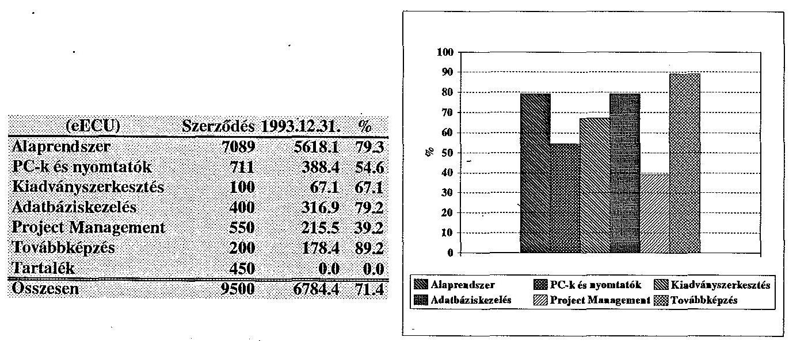

# 4.3. Adózási, vám- és illetékszabályok 

A Keretmegállapodás "Általános feltételek" 13. cikk 1. pontja kimondja, hogy "adók, vámok és importilletékek nem finanszírozhatók az EK segélyből".

Ugyanezen cikk 2. pontja szerint "Amennyiben az EK segélyből finanszírozott szállítási szerződés magyarországi eredetű terméket is magában foglal, a szerződés a szóban forgó termék gyári ára alapján kötendő meg, amelyhez hozzáadandók az adott termékre Magyarországon érvényes belső adó és díjtételek."

A megállapodásban foglaltak végrehajtása folyamatosan gondot okozott a PHARE forrás felhasználói számára.

A Keretmegállapodásban foglaltak végrehajthatósága (ÁFA fizetések) érdekében többszöri levélváltásra került sor a KSH illetve az APEH, a PM, és az NGKM között.

---

A PM 1992-ben állásfoglalásban intézkedett segélyprogramok esetén az ÁFA visszatérítéséről, de 1993. évre az új adótörvény ezt a lehetőséget megszüntette.

Az NGKM 1993. április 14-i telefaxának 3. pontja szerint "....., as to PHARE is not ready to pay, however can prefinance ÁFA in certain cases." (a PHARE szerint nem engedélyezett a kifizetés, mindazonáltal megelőlegezhető az ÁFA, meghatározott esetekben).

Az 1993. május 21. és 24 -én benyújtott HP számlák alapján 42625 ECU és 28080 ECU ÁFA kifizetés vált esedékessé, melyet a PMU, az átutalt tőke magyarországi kamatának terhére megelőlegezett, az NGKM telefax alapján. A program várható összes ÁFA kifizetési kötelezettsége 240.000 ECU.

Az 1993. július 8-i Felügyelő Bizottsági ülés állásfoglalása alapján - a kérdés rendezetlensége miatt - a további ÁFA kifizetést szüneteltetik. Megjegyezzük, hogy a Felügyelő Bizottság munkájában a PM és az NGKM képviselője is rendszeresen részt vesz.

Az' adóvisszaigénylés körüli bonyodalmak rendezésére az NGKM OECD Segélykoordinációs Titkársága nem a hazai szabályozáson keresztüli megoldást - tehát a törvény hatálya alóli eseti felmentést - választotta, hanem felhatalmazást kért és kapott a kormánytól a nemzetközi Keretmegállapodás módosításának kezdeményezésére.
A Kormányhatározat felhatalmazást ad Keretmegállapodás módosítására abból a célból, hogy "a hazai beszállításook azonos elbírálás alá essenek az importból származó beszerzésekkel..." tehát, hogy a hazai szállítók is ÁFA mentes árral versenyezhessenek.

A módosításra vonatkozó kezdeményezést 1993. márciusában megküldték az EK Bizottság részére. A javasolt módosítás lényegileg törli az Általános Feltételek 13. cikk 1. pont 2. bekezdését. Ezzel a Keretmegállapodás hatálya kiterjedne a magyar szállítók számlázási rendjére is.

Ez a megoldás gyakorlatilag csak úgy végrehajtható, ha a PM vagy az APEH egyedileg engedélyezi a magyar szállítóknak, hogy az általános eljárási rendtől, a hatályos ÁFA törvénytől eltérő módon - ÁFA tartalom nélkül számlázzanak.

---

Ezzel a megoldással a gond az, hogy ami eddig a PHARE forrásból fizető vevő oldalán keletkezett (amit eddig esetenként igényeltek vissza), most a szállító, a számlát kibocsátó (ÁFA számlázás) oldalán jelenik meg.

# 4.4. A Pénzügyi nyilvántartás rendszere 

A PHARE támogatás felhasználásának nyilvántartása az EK által kifejlesztett számítógépes könyvelési és beszámolási rendszeren (PHACSY) alapszik. A számítógépes programot az EK térítésmentesen biztosította a KSH részére, csupán a szoftver hazai alkalmazását kellett megoldani.

A rendszer a H9201 program jóváhagyásától működik, a támogatás (előleg) átutalást, a felhasználásokat a program indulásától rögzíti.

A PHARE források érkeztetése, nyilvántartása a PMU által kizárólagosan használt PHACSY rendszeren keresztül teljes mértékben elkülönül a KSH rendelkezésére álló egyéb forrásoktól.

A számítógépes nyilvántartás mellett a szükséges, rendszerezett analitikus nyilvántartások megtalálhatók, az egyeztethetőség biztosított.

A nyilvántartási rendszer a megbízhatósági, átláthatósági és teljességi követelményeknek megfelel.

### 4.5. Bankszámlák

A számlavezetésre bekért ajánlatok összevetése után a KSH a H9201 PHARE program forrásainak kezelésére a Magyar Hitelbank RT-nél (MHB) nyitott 1992. júniusában elkülönített számlát, melyet ECU-ben vezetnek. A szerződésben meghatározták az aláírásra, számlaigazolásra jogosultakat, melyek egyike a Program Engedélyező Tisztségviselő.
1992. szeptember 28-án az EK átutalt 6335000 ECU-t az első munkaprogram alapján, az MHB-nél vezetett számlára.
1992. október 9-én ebből lekötnek

- 5000 eECU-t tartósan folyamatos egy hónapra (term deposit) éves 10,5\% kamatra

---

- 1300 eECU-t lehívható betétként (for uncertain period, all deposit) éves $7 \%$ kamatra
- 35 eECU-t nyitott számlára

1992. novemberében a H9201 program részére egy újabb, második bankszámlát is nyitottak az Iparbanknál. A második bankszámla megnyitásának indokai a PMU 1993. október 15 -én kelt Feljegyzése szerint, az elbizonytalanodott banki helyzet miatt a kockázat csökkentése és az Iparbank kedveżőbb, gyorsabb, olcsóbb szolgáltatási feltételei voltak.

Az Iparbanknál megnyitott számlára 1992. november és december folyamán három tételben (1100; 2000; 600 eECU) összesen 3700 eECU-t utaltak át a 6335 eECU-ból.

Az átutalás hatásaként 5550 ECU átutalási költség merült fel. Ezzel egyidőben, - a HP szerződés közelinek vélt aláírási időpontja és az ezt követő előlegfizetési kötelezettség miatt - a tartós lekötést megváltoztatták lehívható betétre. A szerződés aláírásának elhúzódása miatt az előleget nem kellett utalni, és a lekötés megváltoztatása mintegy 25000 ECU kamat-elmaradást okozott.

Az azonos időszakra vonatkoztatott tartós lekötés kamata az Iparbanknál egy tétel kivételével - alacsonyabb volt mint az MHB-nél.

Az MHB-nél maradt 2,635 millió ECU-ből 2,4 millió ECU folyamatos egy hónapos lekötése a fizetési kötelezettségek figyelembevételével megtörtént. Az utolsó intézkedés szerint 1993. szeptember 6 - október 6 közötti időszakra 2,0 millió ECU-t kötöttek le éves $7,5 \%$-os kamat mellett.

Az Iparbanknál a PHARE PMU 1993. január 5-én csak a 3,1 millió ECU lekötéséről intézkedett, a 0,6 millió ECU-t lehívható betétként kezelték. Az Iparbanknál vezetett számláról az első kifizetés 1993. május 18 -án történt 2456791 ECU és 28080 ECU (ÁFA) értékben.
A bankszámla
— 1993. május 31-i zárási értéke
1352893,47 ECU
— 1993. 06.01.- 09.30. között kifizetés
113521,65 ECU
— 1993. szeptember 30-i zárási érték
1255613,83 ECU
— 1993. november 30-i zárási érték
6137,35 ECU.

---

A számlán májustól októberig minimális pénzmozgás volt, tartós lekötésre mégsem került sor.
1993. május 31-ig összesen 62 esetben történt szerződés szerinti kifizetés (Payments relating to contracts). Ebből egy esetben az Iparbanktól és 61 esetben az MHB-tól. Eszerint az Iparbank által ajánlott garantált átutalások és olcsóbb szolgáltatási költség lehetőségét nem használták ki.

Összességében megállapítható, hogy az Iparbankkal kötött szerződés és számlakezelés az MHB-szerződéshez viszonyítva hátrányos volt a projekt részére, és a már említett 30550 ECU mellett becslésünk szerint további mintegy 40000 ECU kamatbevételtől estek el, az Iparbank - a tételek zömében alacsonyabb - kamatértékei és a tartós lekötések elmaradása miatt.

# 4.6. Kifizetések 

4.6.1 . A H9201 program terhére kifizetések a jóváhagyott szállítási és szolgáltatási szerződések teljesítésekor, a számlák beérkezését követően történnek. A PMU-nál dolgozó Pénzügyi Adminisztrátor minden számlát ellenőriz, minden kifizetést jóváhagy, aláírása a számlákon megtalálható. A másik aláíró a Program Engedélyező Tisztségviselő.

A HP-szerződés teljesítéséhez a harmadik munkaprogram mellékleteként kidolgozták az átvételt igazoló nyomtatványt (Acceptance Form), melyet rendszeresen alkalmaznak. A HP-szerződés, a benyújtott rész-számlák és az átvételt igazoló nyomtatványok beazonosíthatók.

A PMU által rendelt egyéb szolgáltatási és szállítási számláknál, a megrendelő részéről a teljesítés és átvétel elismerésére nem találtunk igazolást. A pénzügyi fegyelmet nem biztosítja az a gyakorlat amely szerint a számla szerinti kifizetések nem a megrendelések teljesítésigazolására épülnek.

A PMU ügykezelési rendszerében nem látható a Programiroda, mint bonyolító szervezet és a KSH, mint intézmény számviteli rendszerének kapcsolata, a beszerzett eszközök leltárba vételének módja.

---

4.6.2 A PMU a kifizetéseket ECU egyenértékben, a számlát adó által igényelt valuta nemében teljesítette.

Több esetben találkoztunk idegen valutában történt kifizetéssel magyarországi cégek, vállalkozók, magánemberek teljesítésének elszámolásakor, mint például:

- I and B Business Developing Ltd, Budapest;
- TOPTEL Szolgáltató BT, Budapest;
- IQ SOFT SZKI, Budapest;
- Tender kiértékelésben résztvevő szakértők.

Ezen esetekben figyelmen kívül hagyták a hatályban lévő 1/1974. PM rendelet megfelelő előirásait, amely szerint devizahatósági engedély nélkül magyar állampolgár munkavégzéséért csak forint javadalmazást kaphat.

# 4.7. A PHARE-on kívüli források 

A KSH 69 millió Ft-ot kapott - a kormány 3176/1993. határozatával a PHARE segélyprogram keretében megvalósítandó statisztikai információs rendszerfejlesztés végrehajtásához - a központi költségvetés általános tartalékából.

Ebből a határozat jóváhagyását követően 50,0 millió Ft azonnal, 19 millió Ft pedig - a kivitelezés ütemének megfelelően - a II. félévben használható fel.

A KSH-nál 1993-ban el kell végezni a beérkező számítógépek elhelyezéséhez és működtetéséhez nélkülözhetetlen beruházásokat, felújításokat és egyszeri beszerzéseket. Az ehhez engedélyezett 69 millió Ft csak a legfőbb munkálatokat vette számításba (pl. kiegészítő berendezések beszerzése, adatátviteli és telekommunikációs hálózatkiépítés, elektromos hálózatcsere stb.).

---

A KSH az 1994. évi költségvetés előkészítésénél az 1994. évre áthúzódó feladatokra 16 millió Ft biztosítását kérte, mely a Pénzügyminisztérium jóváhagyásával beépült a Hivatal 1994. évi költségvetésébe.

A PHARE program teljes megvalósításáig - döntően a migráció és a Regiszter megvalósításának gyorsításához - további kormányzati források szükségesek. Ezek mértéke és ütemezése a program előrehaladásának és a költségvetés teherviselő képességének egyaránt függvénye, és mindenképp egyedi mérlegelést igényel.

Budapest, 1994. február
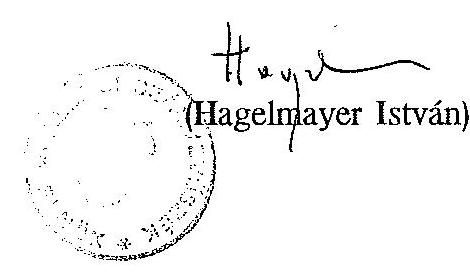

---

# Központi Statisztikai Hivatal

## Elnök

600- /1994 /77

Dr. Hagelmayer István úr, az Állami Számvevőszék elnöke

Budapest

Tisztelt Elnök Úr!

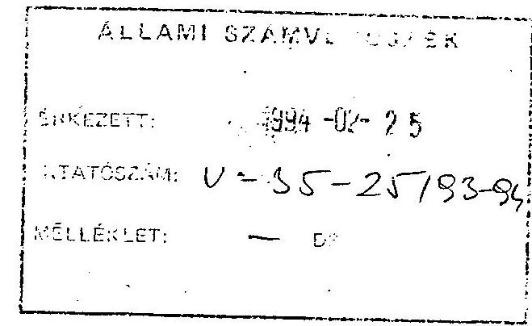

A Központi Statisztikai Hivatal részére juttatott PHARE forrásból nyújtott pénzügyi támogatások felhasználásáról készült Állami Számvevőszék által összeállított Jelentést megkaptam.

Tájékoztatom Elnök Urat, az ellenőrzésben résztvevő szakemberek munkájukat korrektül, nagy szakmai hozzáértéssel végezték.

## A Jelentés egyes félreértésre okot adó pontjaihoz az alábbi észrevételeket tesszük:

A teljes rendszerdokumentáció (5.0. 6. bekezdés) a rendszer átvételét megelőző tesztelési szakaszban 1993 december folyamán került átadásra és elfogadásra többszöri pontosítást és kiegészítést követően.

A PHR-H9201 sz. tender a magyar kormányzat nevében lett meghirdetve az EK és a KSH közös finanszírozásában. (11.0. 1.2 pont)

A projekt gyakorlati beindítása az eredeti elképzelésekhez képest 3 hónapot késett a szerződés EK általi jóváhagyási folyamatának elhúzódása miatt (13.0. d. pont, 2. bekezdés).

A Programíroda és a KSH számviteli rendszerének kapcsolatával összefüggésben tett megállapításra (8.0. utolsó bekezdés) szükséges megjegyezni, hogy a PHARE szabályok szerint az EK segélykeret kezelését és nyilvántartását a külön e célra létrehozott PMU-k végzik egészen addig a pillanatig, ameddig a kedvezményezett - jelen esetben a KSH saját számviteli rendszerébe nem veszi át (azaz aktiválja) a beszerzett eszközöket.

---

A rendszer teljes átvételi tesztjét követően, 1993 december 14-én a KSH PHARE Iroda szoros együttműködésben a Költségvetési és Gazdálkodási Főosztállyal elvégezte a rendszer aktiválását (leltárba, nyilvántartásba vételét) a KSH számviteli rendszerébe. Az aktivált eszközök értéke a KSH 1993. évi mérlegében szerepel.

A magyar magánszemélyeknek, illetve a magyar jogi személyek részére devizában teljesített kifizetésekkel kapcsolatosan (9.o. 2. bekezdés) a projekt keretében kötött fontosabb szerződések előkészítése érdekében alkalmazott jogi szakértő véleménye alapján jártunk el (a vizsgálat megállapítása szerint helytelenül).

# ,Az alábbiakban tájékoztatom Elnök Urat a megtett intézkedésekröl: 

- 1994 február 1-i hatállyal kijelöltem a migrálásért felelős munkatársat, aki 1994 március 31-ig előterjeszti a részletes migrációs ütemtervet. Ez alapját képezi a többletforrásigény összeállításának, amelyet a Kormány elé terjesztünk.
1994 április 30 -ig kialakítjuk migrációs munkacsoport feladattervét, kijelöljük az állandó és ideiglenes tagokat és megkezdjük a feladatok végrehajtását.
A munkacsoport vezetője rendszeresen beszámol az Elnökségnek és a Vezetői Kollégiumnak.
- A Hivatal adat- és titokvédelmi szabályzatát 1994. november 30 -ig kidolgozzuk' külső szakértők bevonásával, a korábbi szabályzatok felhasználásával, a statisztikai törvény végrehajtási utasításával összhangban. A szabályzat belső intézkedési tervet is tartalmaz.

Az adatbiztonság hardware feltételei (müködésbiztonság, automatikus tüzoltó, áramtalanító, külső behatolás ellen védelmet nyújtó riasztó, elektromágneses surgárzás szempontjából árnyékolt) biztosítása érdekében felülvizsgáljuk az áramkimaradás következményeit és kezelésének módját és 1994. szeptember 30-ig a költségigény feltüntetésével a probléma megoldására javaslat készül az Elnökség részére.

- A PHARE Iroda vezetőjét szóban és írásban beszámoltattam a banki műveletekről.
- Elrendeltem, hogy a PHARE Iroda vezetője az Iroda saját müködéséhez szükséges eszközök beszerzésénél is igazolja a teljesítést és az átvételt. A számlákat csak az igazolás megléte esetén lehet kifizetni.

---

- Az 1/1994.PM.sz.rendelet hatálya alá tartozó ténykedéseket felülvizsgáltattam és intézkedtem a rendelet maradéktalan betartásáról. Ennek során nyomatékosan felhívtam a PMU vezető figyelmét arra, hogy a jövőben az érvényben lévő jogszabályokat következetesen tartsa be.
Egyúttal elrendeltem, hogy a PMU segitésére korábban alkalmazott jogi szakértő a jövőben nem foglalkoztatható.

Budapest, 1994 február 22.
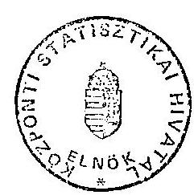

Üdvözlettel:
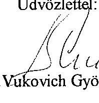