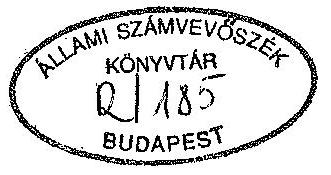
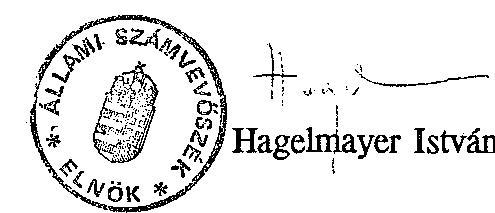

# JELENTÉS 

az önkormányzatok pénzgazdálkodásának (pénzügyi folyamatának), pénzkezelésének törvényességi, szabályszerűségi vizsgálatáról

---

# JELENTÉS 

az önkormányzatok pénzgazdálkodásának (pénzügyi folyamatának), pénzkezelésének törvényességi, szabályszerűségi vizsgálatáról

A helyi önkormányzatok pénzgazdálkodási és pénzkezelési törvényességi feladataira
—az államháztartásról szóló 1992. évi XXVIII. törvény,
—a helyi önkormányzatok és szerveik, a köztársasági megbízottak, valamint egyes centrális alárendeltségủ szervek feladatát és hatáskörét szabályozó 1991. évi XX. törvény,
—az éves költségvetési törvények,
—a számvitelről szóló 1991. évi XVIII. törvény és annak a költségvetési szervekre vonatkozó végrehajtásáról szóló 179/1991. (XII.30.) Kormányrendelet, illetve azt módosító 67/1993.(V.5.) Kormányrendelet,
—a költségvetési szervek gazdálkodását szabályozó 4/1991. (II.13.) PM. rendelet
tartalmaznak előírásokat. A helyszíni vizsgálat befejezését követően jelent meg a Kormánynak az államháztartási törvényben, és a Magyar Köztársaság 1992. évi állami költségvetésről és az államháztartás vitelének 1991. évi szabályairól szóló 1991. évi XCI. törvényben kapott felhatalmazása alapján a költségvetési szervek tervezésének, gazdálkodásának, elszámolásának rendszerét szabályozó 137/1993. (X.12.) sz. rendelete.

A pénzgazdálkodásra megjelenő, annak egyes elemeit szabályozó rendelkezések keretjellegủek voltak, illetve a pénzkezelésre vonatkozó központi szabályok a

---

dereguláció következtében megszüntek. Ennek következtében a helyi szabályozás jelentősége növekedett, nélkülözhetetlenné vált. Az önkormányzatok azonban nagyrészt nem tudtak alkalmazkodni az új helyzethez, a megváltozott körülményekhez.

A vizsgálat célja annak megállapítása volt, hogy
—az önkormányzat pénzügyi folyamatai és a feladatellátás összhangja hogyan biztosított,
— miképpen ítélhető meg az önkormányzat likviditási helyzete,
—a pénzgazdálkodás, pénzkezelés szabályozását és annak végrehajtását teljeskörűen megvalósították-e.

Az Állami Számvevőszék az 1993. évi munkaterv alapján a pénzgazdálkodás (pénzügyi folyamatok), a pénzkezelés törvényességét, szabályszerűségét 10 megyében és a fővárosban ellenőrizte. Az ellenőrzés 176 települési önkormányzatot érintett, amely az összes önkormányzat 5,5\%-a. A települési önkormányzatok közül a vizsgálat 14 városra, 22 nagyközségre, és 140 községre terjedt ki.

# I. 

## Megállapítások

## 1. A pénzgazdálkodás, pénzkezelés szabályozottsága

A pénzgazdálkodás szabályozását a helyhatósági választások óta eltelt időszakban több ellentmondás jellemezte. A tanácsrendszer megszűnésével egyidejűleg az önkormányzatisághoz kapcsolódó pénzgazdálkodás átfogó szabályozása nem történt meg. A szabályozásban három szakasz különböztethető meg;

Az első szakasz a helyhatósági választásoktól 1990. szeptember 30-tól 1991. február 13-ig tartott. Ebben az időszakban a pénzgazdálkodási feladatokat még az 1979. évi pénzügyi törvény, és a költségvetési szervek gazdálkodását szabályozó többször módosított 19/1980. (X.27.) PM. sz. rendelet határozta meg.

A második szakaszban, 1991. február 13-tól 1992. július 1-ig az Államháztartási törvény hatálybalépéséig az önkormányzati pénzgazdálkodás egyes elemeit

---

- kötelezettségvállalás, utalványozás, ellenjegyzés - az 1991. évi költségvetést megállapító 1990. évi CIV. törvény határozta meg. A törvény alapján a pénzügyminiszter a 4/1991. (II.13.) PM. sz. rendeletben állapította meg a költségvetési szervek gazdálkodását, és ezen belül a pénzgazdálkodási feladatokat. A rendelet hatálya a helyi önkormányzati költségvetési szervekre is kiterjedt.

Az önkormányzati törvény azonban nem határozta meg, hogy az önkormányzat költségvetési szervnek tekintendő-e, vagy a polgármesteri hivatalt és a körjegyzóséget kell érteni alatta. Ezért a pénzgazdálkodási feladatokat egyértelmúen nem lehetett végrehajtani és számonkérni.

Nem segítette kellően a helyi szabályozást, a helyi önkormányzatok és szerveik, a köztársasági megbízottak, valamint egyes centrális alárendeltségủ szervek feladatés hatáskörét szabályozó 1991. évi XX. törvény sem. A pénzgazdálkodás egymásra épülő folyamatai közül ugyanis csak a kötelezettségvállalást és az ellenjegyzést állapította meg.

A pénzgazdálkodás szabályozásának harmadik szakaszát az Államháztartási törvény hatálybalépésétől lehet számítani. A törvény meghatározta a költségvetési szervek és az önkormányzati költségvetési szervek pénzgazdálkodási feladatait. Költségvetési szervként nevesíti meg a megyei önkormányzati hivatalt, a polgármesteri hivatalt, a körjegyzőséget és a közös képviselőtestület hivatalát, ezáltal a besorolást egyértelművé tette.
Az Államháztartási törvény végrehajtására azonban több mint egy évig, a 137/1993. (X.12.) Kormányrendelet hatálybalépéséig részletes szabályozás nem jelent meg. Mindaddig nem helyezték hatályon kívül a 4/1991. (II.13.) PM. rendeletet, így tulajdonképpen két egymással össze nem függő jogszabály volt hatályban.

Az önkormányzatok pénzkezelésére központi jogszabály nincs. A házipénztár kezeléséről szóló 99/1982. (XII.28.) PM. sz. rendeletet a dereguláció során hatályon kívül helyezték.
A pénzkezelést a számviteli törvény és a költségvetési szervek számvitelére vonatkozó 179/1991.(XII.30.) PM. sz. rendelet szerint - az analitikus nyilvántartáshoz kapcsolódóan - az önkormányzatoknak saját maguknak kellene szabályozni. E kötelezettségüknek azonban megfelelő iránymutatás és segítség nélkül csak részben és számos hiányosság mellett tettek eleget.

---

# 2. Az önkormányzatok likviditási helyzete 

Az önkormányzatok pénzügyi helyzete 1992. évben a csökkenő GDP és a szűkös költségvetési lehetőségek ellenére kiegyensúlyozott volt. Az önkormányzatok az éves GDP 15-16 \%-ával gazdálkodhattak. A költségvetési kiadások az államháztartáson belül $24-25 \%$-ot tettek ki.

A vizsgált polgármesteri hivatalok 21.286 .051 ezer Ft előirányzatból gazdálkodtak. A tervezett feladataikhoz szükséges források döntő mértékét kitevő állami támogatások kiszámítható finanszírozása nagymértékben segítette a gazdálkodásuk stabilitását, a cél és címzett támogatásokon keresztül a kiemelt fejlesztések megvalósítását.

A vizsgált önkormányzatoknál a tartós betét átlagos állománya 1992. évben 544.600 ezer Ft volt, amelynek a költségvetéshez viszonyított részaránya nem jelentő́s $(2.6 \%)$.
A vizsgálatok tapasztalatai szerint tartós, hosszúlejáratú bankbetéteket elsősorban a céltámogatások elnyeréséhez szükséges saját források miatt helyezték el a bankokban az önkormányzatok. A feladatok és a lehetőségek alapján a betétállomány nagymértékben differenciálódott. Az átlagnál magasabb volt a községeknél, és átlag alatti a betétállomány részaránya a fővárosi kerületeknél, a 10.000 fő feletti városoknál. Az önkormányzatok azonban a tartósan szabad pénzeszközöket gyakran rövidlejáratú betétben helyezték el, és azt többször meghosszabbították, mivel így lehetővé vált központi támogatás elnyerése is (pl. önhibájukon kívül hátrányos helyzetben lévő önkormányzatok támogatása).

A vizsgált körben az önkormányzatok eladósodását nem tapasztaltuk. A hosszúlejáratú hitel 1992. évi átlagos állománya 535,761 ezer Ft volt, ami a költségvetés föösszegének mindössze csak 2,5\%-a. A hosszúlejáratú hitelek nagy részét még a tanácsok által a lakásberuházásokra felvett lakáscélú hitelek alkotják.

Kivételt képez Csongrád megyében Dóc község, ahol céltámogatással épült fel a társközségből önállóvá vált önkormányzat általános iskolája, melyhez 1992. decemberében 10.000 ezer Ft hitelt vettek fel, a költségvetésük föösszegének több mint $60 \%$-át.

Az önkormányzatok pénzügyi helyzete, likviditása 1992. évben stabil volt, a fizetési kötelezettségeiknek nagyrészt eleget tettek. Késedelmi kamatot általában a pénzgazdálkodás szabályainak be nem tartása miatt fizettek.

---

A vizsgált önkormányzatok késedelmesen fizetett számláinak összege nem jelentős, 24 önkormányzatnál 1992. évben 16.434 ezer Ft, a késedelem napjainak száma 5.475 nap, a kifizetett kamat összege 335,7 ezer Ft volt.

A saját bevételek, a központi támogatások, az állami hozzájárulások és a felmerült kiadások időbeli összehangolása pénzellátási tervet a vizsgált 176 önkormányzat közül 21 (11,93\%) - intézményhálózattal, nagyobb fejlesztésekkel rendelkező városi és nagyközségi önkormányzat készített. A pénzellátási tervvel rendelkező önkormányzatok nagyrészt a havi pénzellátást alkalmazták. Az újonnan létrejött polgármesteri hivatalok nem tartották szükségesnek a tervszerű pénzellátást, mivel a kiadások idején a számlán lévő pénzállomány a finanszírozást biztosította.

A vizsgált önkormányzatok pénzmaradványa 1992. évben 2,1 milliárd Ft volt, melynek forrását 1,1 milliárd Ft bevételi többlet, és 1 milliárd Ft kiadási megtakarítás képezte.
A pénzmaradvány részaránya a költségvetési előirányzathoz viszonyítva 9,86\% volt, mely önkormányzatonként $0,2 \%$-tól $54,0 \%$-ig szóródott. Az intézményekkel nem rendelkező községi önkormányzatoké magasabb (32,2-54\%), míg a városoké, illetve az intézményeket is fenntartó községi önkormányzatoké alacsonyabb ( 0,2 $24,6 \%$ ) volt. A költségvetés főösszegének $9,86 \%$-át képező, magas maradvány oka egyrészt az óvatos tervezés, a bevételek nem kellő számbavétele, másrészt a fejlesztési forrásokhoz szükséges saját erő biztosítása több évi gyűjtögetést igényelt.
A pénzmaradvány jelentős része nem használható fel szabadon az előző évről (évekről) áthúzódó kötelezettségek és beruházások, felújítások miatt.

Szolnok megyében az 1992. évi pénzmaradványnak csak 57,2\%-a használható fel évközi, előre nem tervezhető kiadásokra, az áremelkedések részbeni ellentételezésére. A szabad pénzmaradvány részaránya a megyében legkisebb (11,4\%) Tiszavárkony községben, és legnagyobb (100\%) Kengyel községben.

Az önkormányzatok pénzügyi stabilitását az általános és céltartalék eredendően nem befolyásolta. A tartalék összegét az önkormányzat határozza meg, törvény, jogszabály kötelező mértéket nem állapít meg. A tartalékképzés többnyire maradékelv alapján történt, így általában nem a gazdálkodás biztonságát szolgálta, hanem a beruházások, felújítások megkezdését.
1992-ben az önkormányzatok tartalékelőirányzata magas volt, a költségvetés főösszegén belül 10,5\% arányt képviselt.

---

A 200 fő alatti községekben $40,1 \%$, a 200-500 közötti községekben $26,3 \%$, az 500-1.000 közötti községekben $21,8 \%$, az 1.000 fó feletti községekben $13,8 \%$, a városokban már csak 4,8 és $7 \%$-ot tettek ki.

A tartalék mértéke a településtípusokon belül is rendkívül differenciált a térségi különbözőségekből, a települések általános helyzetéből és az eltérő infrastrukturális intézményi ellátottságából adódóan.
1993-ban egyrészt részben a feladatra tervezés, a központi intézkedések, másrészt a szabályozórendszer módosulása miatt a tartalék volumene és aránya is jelentősen csökkent, $0-42,1 \%$-ig terjedt, az átlag mértéke $6,3 \%$.

A fơvárosban és Pest megyében a tartalék részaránya 1993-ban 0-18,7\%. Öt település és a XVIII. kerületi önkormányzat tartaléka nem éri el az $1 \%$-ot, míg öt település (Bag, Pillsszentlászló, Pusztavacs, Sóskút, Szokolya) költségvetésében egyáltalán nincs tartalék.

Somogy megyében a tartalék előirányzat 1993. évben 0,3-42,3\%-ig terjed, az átlag $10,7 \%$ volt.

Az önkormányzatok a hosszúlejáratú, tartós bankbetétek, a tartalékok és pénzmaradványok viszonylag magas összege és részaránya következtében, illetve a hoszszúlejáratú kötelezettségek és a működési célú hitelek viszonylag alacsony összegét figyelembe véve tartós hitelezői pozícióban voltak.

# 3. A pénzgazdálkodás, pénzkezelés szabályszerűsége 

A költségvetés végrehajtása során jelentkező pénzgazdálkodási feladatokat az önkormányzatok nem kezelték a jelentőségüknek megfelelően. A pénzgazdálkodás egymásra épülő, összefüggő elemeit rendszerszemléletben, átfogóan nem szabályozták arra hivatkozva, hogy ilyen kötelezettséget sem törvény, sem más jogszabály nem határozott meg.
A vizsgált önkormányzatok közül csak 7 készített (3,9\%) pénzgazdálkodási szabályzatot. A pénzgazdálkodás egyes elemeit eltérő formában, módszerrel és tartalommal határozták meg.

A vizsgált önkormányzatok közül 13 a kötelezettségvállalást, utalványozást és ellenjegyzést a Szervezeti és Müködési Szabályzatban, 116 önkormányzat egyéb módon (számlarend, ügyrend, ügyrend melléklete, éves költségvetés, stb.) és 47 önkormányzat egyáltalán nem szabályozta.

---

A szabályozások túl általánosak, hézagosak. A beszerzett típus szabályzatokat nem adaptálták a helyi körülményekhez.

Somogy megyében Sávoly körjegyzöséghez kapcsolódó önkormányzatok pénzgazdálkodási szabályzata megegyezett a TÁKISZ-tól és Kadarkút nagykö̉zség önkormányzattól vásárolt szabályzattal olyannyira, hogy még a jegyző nevét sem változtatták meg.

Csongrád megyében az önkormányzatok a kötelezettségvállalás, az ellenjegyzés, az érvényesités és az utalványozás szabályait a TÁKISZ által kiadott minta házipénztári szabályzat alapján állították össze, és nem vették fïgyelembe a helyi sajátosságokat.

A szabályzatok későn, döntően 1992. végén léptek hatályba, de előfordult 1993. évi jóváhagyás is.

Győr-Moson-Sopron megyében a pénzgazdálkodás szabályait Rábcakapi községben 1993. január 2-án, Barbacs községben 1992. november 30-án, Bősárkány községben 1993. március 30-án hagyták jóvá.

Jász-Nagykun-Szolnok megyében Mezőtúr városban még a Városi Tanács VB. 1989. október 15-én állapította meg a pénzgazdálkodási feladatokat.

A kötelezettségvállalást, mint a pénzgazdálkodás egyik alapelemét az önkormányzatok nem szabályozták egyértelműen. A feladatköröket több esetben nem határolták el. A szabályzatokban nincs rögzítve, hogy az azonos jogkörrel feljogosítottak milyen sorrendben és értékben jogosultak a kötelezettségvállalás gyakorlására. Más esetben a szabályzatok a törvényi szöveget nevesítés és felhatalmazás nélkül tartalmazzák. Az önkormányzatok közül 150 önkormányzatnál kizárólagosan a polgármester, 26 önkormányzatnál a polgármester által állandó vagy ideiglenes jelleggel felhatalmazott személy végzi a kötelezettségvállalást.
A kötelezettségvállalásokat általában nem tartották nyilván, ezért nem rendelkeztek a költségvetés végrehajtásával kapcsolatos információval. A kötelezettségvállalást a körjegyzőségek önkormányzatonként végezték. A kötelezettségvállalás ellenjegyzését általában a jegyzők vagy a gazdálkodási előadók látták el.
A kötelezettségvállalás és ellenjegyzés szabályozásánál és gyakorlásánál valamennyi önkormányzatnál tapasztalhatók hiányosságok, amelyek arra utalnak, hogy a szabályozást többnyire formai kötelezettségként kezelték.

[^0]
[^0]:    Csongrád megyében Felgyő önkormányzatnál törvénysértő módon vállaltak kötelezettséget 1992. és 1993. években a költségvetési előirányzat terhére végzett több milliós nagyságrendű vállalkozási, építési szerződések megkötése-

---

kor, mivel a szerződéseket a polgármester egyedül írta alá, ellenjegyzés nélkül. Szentes városban a megrendelőket a gondnoki teendők ellátásával megbízott hivatali dolgozó írta alá.

A Heves megyei Ivád, Erdökövesd és Parád önkormányzatnál semmiféle szabályzat nem rendezi a kötelezettségvállalás jogosultságát.

Jász-Nagykun-Szolnok megyében Mezőtưr városban még a Városi Tanács VB. 1989. X. 25 -én elfogadott ügyrendjének értelmezése alapján a polgármester és az alpolgármesterek, illetve eseti megbizás alkalmával a jegyzó jogosult a kötelezettségvállalásra.

Vas megyében a 15 önkormányzat közül egyiknél sem vezettek nyilvántartást a kötelezettségvállalásokról.

Bács-Kiskun megyében az önkormányzatoknál általános volt, hogy a szerződések nincsenek ellenjegyezve. Szerződéseket aláirnak arra fel nem hatalmazott hivatali dolgozók is.

Somogy megyében Vörs önkormányzatnál a megrendelőket, vállalkozási szerződéseket nem csatolták a kifizetések alapját képező bizonylatokhoz.

A pénzgazdálkodási feladatok közül a legtöbb hiányosság az érvényesítés során jelentkezett. A kisebb településeken az érvényesítéshez szükséges pénzügyi szakképesítés és a jogszabályok ismerete, a változások figyelemmel kisérésére sok esetben nem biztosított. Az érvényesítést végző dolgozók közül 108 fő rendelkezik pénzügyi szakképesítéssel.
A készpénzben történő kiadásoknál és bevételeknél az érvényesítés nagyrészt elmaradt. Nem vizsgálták bizonyítható módon a jogosultságot, a kiadások összegszerűségét, a fedezetet és az előírt alaki követelményeket. A készpénzbizonylatok nem tartalmazták az érvényesítési záradékot, hiányoztak az érvényesítést igazoló aláírások. A raktárral nem rendelkező önkormányzatok készpénz kiadásait igazoló bizonylatokra nem vezették rá a felhasználás helyét, az áru és szolgáltatás átvételét. A kistelepüléseknél az érvényesítés utólagosan történt. Az érvényesítést végzők írásbeli megbízása többségében elmaradt. Az érvényesítést a körjegyző́égek önkormányzatonként végezték.
Az érvényesítés során 100 önkormányzat megvizsgálta a teljesítés jogosságát $(56,8 \%)$, és 76 önkormányzat ( $43,2 \%$ ) nem. Az alaki követelményeket 67 önkormányzat $(38,1 \%)$ tartotta csak be.

Csongrád megyében 1990. szeptember 30-tól, a megalakulásuk óta Pitvaros, Ambrózfalva, Csanádfalva önkormányzatoknál egyetlen bizonylatot sem érvényesítettek. Ugyancsak nem érvényesítették a bizonylatokat Pest megyében

---

Gyömrő, Hernád, Pilisszentlászló és Szokolya, Vas megyében Egyházashetye, Borgáta, Köcsk, Somogy megyében Sávoly, Fönyed önkormányzatoknál.

Heves megyében Gyöngyöshalászi önkormányzatnál a szabályzatuktól eltérően a jegyző sorozatosan hatáskör nélkül érvényesített.

Komárom-Esztergom megyében Dorog városi önkormányzatnál a szabályozásuk szerint érvényesítést célszerütlenül csak a pénzügyi osztályvezető végezhet.

Vas megyében a vizsgált 15 önkormányzat közül 5 önkormányzatnál az érvényesítők csak gimnáziumi végzettségűek.

Az utalványozást 131 önkormányzatnál a polgármester, 45 önkormányzatnál a polgármester által felhatalmazott személy látta el. Társadalmi megbízatású polgármester esetében és a körjegyzőséghez tartozó önkormányzatoknál a pénzgazdálkodás folyamatos biztosítása érdekében az utalványozási jogot a jegyző, illetve körjegyző gyakorolta. Az utalvány ellenjegyzője a jegyző, vagy a hivatalon belül valamelyik pénzügyi dolgozó volt. A körjegyzőségek a hozzájuk kapcsolódó önkormányzatok utalványozását és az utalvány ellenjegyzését önkormányzatonként végezték.
A kiadások és bevételek teljesítését elrendelő utalványozást több ellentmondás jellemezte. Az önkormányzatok nem tartották be még a saját szabályozásukat sem. Az utalványozásra olyan utalványrendeletet alkalmaztak, amely többnyire nem felelt meg a tartalmi és formai követelményeknek (hiányzott a befizető és a kedvezményezett neve, a fizetés időpontja, a terhelendő bankszámla száma és megnevezése, stb.).

A vizsgálat 34 önkormányzatnál tárt fel összeférhetetlenséget. Összeférhetetlenséget jelentett, hogy az önkormányzat jegyzője egyidejűleg, ugyanarra a teljesítésre vonatkozóan utalványozási és ellenjegyzési feladatokat is ellátott, illetve a polgármester és a jegyző saját maga részére végzett utalványozást.
Azoknál az önkormányzatnál, ahol nem hatalmaztak fel a polgármesteren kívül további személyeket is utalványozásra, az utalványozás általában utólagosan történt. Ezt bizonyította, hogy távollétük esetén is szerepelt a bizonylatokon az aláírásuk. Több esetben az utalványozást nem bizonylatonként végezték.

Csongrád megyében Szentes városban 300 ezer Ft kifizetést utalványozott a jegyző helyettes, holott a szabályzatuk szerint csak 50 ezer Ft-ig volt utalványozási jogosultsága.

---

Komárom-Esztergom megyében Kecskéd és Bokod önkormányzatoknál a banki és készpénz kiadásoknál az utalványozás és ellenjegyzés, míg Kömlődön és Csémen az ellenjegyzés rendszeresen nem történt meg.

Somogy megyében Balatonkeresztúr önkormányzatnál az utalványozást nem bizonylatonként, hanem naponta egy alkalommal végezték. A készpénzfizetési bizonylatok utalványozását rendszeresen a jegyző, az ellenjegyzést a polgármester végezte. A polgármester és a jegyző saját maga részére utalványozta a kiküldetési költséget. Összeférhetetlenséget jelentett Balatonmáriafürdő önkormányzatnál, hogy az utalványozásra feljogosított jegyző házastársa is végezte az érvényesítést, amelyet a szabályzatuk nem zárt ki.

Vas megyében Répcelak és Csánig önkormányzatoknál a banki teljesítések utalványozása nem bizonylatonként, hanem számlakivonatonként történt. Egyházashetye körjegyzőséghez tartozó önkormányzatoknál utalványozást, ellenjegyzést egyáltalán nem végeztek.

Pest megyében Pillsszentlászló és Szokolya önkormányzatok a kiadások és bevételek teljesítésekor az utalványozást és az ellenjegyzést egyáltalán nem biztosították. Galgahévízen, Hernádon és Kakucson az utalványozó és ellenjegyzó ugyanaz.

Az önkormányzatok a fizetési kötelezettségek teljesítésére döntő többségben a készpénzkímélő fizetési módokat alkalmazták, ennek ellenére a készpénzfizetés nagysága 1992-ben az előző évhez viszonyítva kismértékben növekedett. Megnövekedtek a több százezer forintos készpénzben történő teljesítések. A növekedés a vállalkozások likviditási problémái miatt kialakult bizalmatlanság, a gazdaság problémái, az elszámolási utalvány megszűnése, a bank és postaköltségek jelentős emelkedése hatására következett be.
Sok esetben a fizetési módok között az önkormányzatok nem választhatnak, mivel ezáltal veszélyeztetik a szolgáltatások, beruházások megvalósítását, esetenként pedig a kereskedelemben készpénzfizetés alkalmával kedvezményt kapnak. 1993. július és augusztus hónapban 154 önkormányzat alkalmazta a készpénzkímélő fizetési módokat, 22 önkormányzat nagyobb részt készpénzfizetéssel tett eleget kötelezettségének.

A vizsgálat idején 141 önkormányzatnak volt jóváhagyott házipénztár kezelési szabályzata. A szabályzatok többsége még az 1990. december 31 -én hatályon kívül helyezett 99/1982. (XII.28.) PM. sz. rendelet alapján készült, néhány önkormányzat pedig a tanácsok idején készített szabályzatot használta.
A házipénztár keretösszegét 5-1.000 ezer Ft-ban állapították meg, az átlag

---

azonban csak 70 ezer Ft volt. A keretet többnyire betartották. Az egy hónapra jutó átlagos kifizetés 252-12.018 ezer Ft között szóródott.

A szabályzatok általában nem tartalmazzák a pénztári ellenőrzések, a zárlatok időtartamát, a pénztárban lévő pénzkészlet ellenőrzését. Sok esetben a vásárolt, vagy kapott mintaszabályzatok helyi adaptálása sem történt meg. A körjegyzőségekhez kapcsolódó önkormányzatok pénzkezelési szabályozása általában nem önkormányzatonként került jóváhagyásra.

Baranya megyében Olasz, Hárságy önkormányzatoknak 1986. évben, Homoród önkormányzatnak 1987. évben készült szabályzata volt.

Komárom-Esztergom megyében Kecskéd önkormányzatnak 1984. évben készült, és 1987. évben módosított, de azóta sem aktualizált a szabályzata.

A házipénztárban két havi bizonylati reprezentáció alapján végzett vizsgálatunk tapasztalatai kedvezőtlenek. A hiányos helyi pénztári szabályozásokat az önkormányzatok csak részben tartották be.
A házipénztári pénzforgalom bonyolítására csak 89 önkormányzat alkalmazta a bevételi és kiadási pénztárbizonylatokat, amelyeken a legtöbb esetben az érvényesítés és az ellenjegyzés maradt el, gyakran utólag történt az alárírás. 87 önkormányzat viszont pénztárbizonylatok nélkül bonyolította le a pénzforgalmat.

A pénztári be- és kifizetések feljegyzésére az időszaki pénztárjelentést és a számítógépes feldolgozásra is alkalmas naplót vezették. A kistelepüléseken a pénzforgalom bonyolítására a "K" betétkönyvet alkalmazták, emellett a bevételi és kiadási pénztárbizonylatot, a pénztárnaplót nem vezették.

Baranya megyében Berkesd körjegyzőségnél a szabályozások szerinti pénztárnaplót nem alkalmazták, helyette az egylapos, hitelesítés nélküli készpénznaplót vezették, de 1993. júliusában - szabadságolás miatt - erre sem került sor.

Heves megyében Szíhalom és Gyöngyöshalászi községi önkormányzatoknál a pénztári bevételeket és kiadásokat egy papírlapon "két oszlopban" rögzítették, amit másnap a pénztárzárás után megsemmisítettek.

Pest megyében Hernád önkormányzatnál nem hitelesített "kockás füzetet" használtak pénztárkönyvnek.

Az elszámolásra kiadott előlegekről a vizsgált önkormányzatok 51\%-a vezetett nyilvántartást, melyek azonban általában nem tartalmazták a felvétel jogcímét,

---

rendeltetését, az engedélyező aláírását és az elszámolási határidőt. Az elszámolási határidők betartását nem követték figyelemmel, a pénztárból kiadott előlegekről az önkormányzatok felénél nem számoltak el határidőre.

Somogy megyében Fonyód városi önkormányzatnál a gépkocsik üzemeltetésére kiadott előlegekről rendszeresen egy és három hónapos késéssel számoltak el.

Pest megyében az elszámolásokat általában néhány napon, legkésőbb egy hónapon belül bonyolítják le, azonban Galgahévizen újabb előlegek kiadására is sor került az előzőekkel való elszámolás előtt.

A készpénzmegőrzés biztonságát az önkormányzatok lehetőségükhöz mérten igyekeztek biztosítani. A városokban és nagyközségekben a házipénztárakat külön helyiségekben, a községekben általában közös helyiségekben működtették. A készpénzt mindenütt elzárhatóan, páncélszekrényben, vagy lemezszekrényben vagy vaskazettában tartották. A legkorszerűbb megőrzési mód, a riasztóberendezés csak néhány nagyobb önkormányzatnál volt.
A készpénzkezeléssel kapcsolatos bizonylatokat többnyire szigorú számadású nyomtatványként kezelték. A pénztárosok egy része felelősségi nyilatkozatot nem tett.

Somogy megyében Sávoly körjegyzőséghez tartozó önkormányzatoknál a készpénzcsekkről nyilvántartást nem vezettek. A körjegyzőséghez kapcsolódó Szegerdő önkormányzat polgármestere több előre bankszerüen aláirt készpénzcsekket magánál tartott, így nem érvényesülhetett az ellenjegyzés hatásköre és a szigorú számadású nyomtatványként való nyilvántartási kötelezettség.

Az értékpapírok megőrzését az önkormányzatoknak csak kétharmada szabályozta. A nyilvántartások pontossága, folyamatossága többségében kifogásolható.

A pénztárkezelési szabályzatban az ellenőrzés nem kapott megkülönböztetett szerepet, mindössze 60 önkormányzat végzett saját szabályzata szerint ellenőrzést. Az önkormányzatoknál a pénztárellenőrzésekről jegyzökönyvek nem készültek.

Komárom-Esztergom megyében a szabályozások szerint az önkormányzatok legtöbb esetben 10 naponként, illetve pénztárátadáskor készitettek pénztárzárlatot.

Heves megyében Parád városnál sem szabályzatban, sem a gyakorlatban nem foglalkoztak pénztárellenőrzéssel.

---

Baranya megyében Komló város kivételével az önkormányzatoknál pénztárellenőrzés nem volt.

Pest megyében a pénztár átadása-átvétele a kistelepülési önkormányzatoknál rendszerint jegyzőkönyv felvétele nélkül történt, a pénztárat pl. Galgahévízen több személy is kezelte.

Az Állami Számvevőszék által tartott pénztárrovancs 56.882 Ft hiányt és 113.594 Ft többletet rögzített 43 (25\%) önkormányzatnál, a hiány mértéke 0,60-20.799 Ft-ig szóródott. A tényleges pénzkészlet eltérése a pénztárjelentés egyenlegéhez képest $1,8 \%$. A hiányok és többletek a vizsgálat során rendezésre kerültek.
A megállapítások alapján 5 fő személyi felelősségre vonását kezdeményeztük. A személyi felelősségre vonások nagyrészt befejeződtek.

A hiányok és többletek alapvetően a könyvelés és az ellenőrzés hiányosságával hozhatók összefüggésbe. Az önkormányzatok a banki és készpénz bizonylatok könyvelésekor általában nem biztosították a számviteli törvényben és a 179/1991.(XII.30.) Kormányrendelet 38 §-ában meghatározott késedelem nélküli, könyvviteli számlákon történő feljegyzést, melyben közrejátszott a központi számviteli szabályozás és az ezen alapuló számítástechnikai program késése is.

Pest megyében Nagykörösön a pénzmozgás és a könyvelés között 1-2 hét, az önkormányzatok többségénél 1 hónap az eltérés. Galgahévízen 1993. elejétől nem történt meg a pénzeszközök jelentős részének szakfeladatokra történő könyvelése.

A fővárosban, a XVIII. kerületben a könyvelés késése 1-1,5 hónap volt.

# 4. Az önkormányzatok pénzgazdálkodásának szervezeti keretei és ellenőrzése 

A pénzgazdálkodás szervezeti kereteit az önkormányzatok a Szervezeti és Működési Szabályzatban, illetve ügyrendjükben határozták meg. A városokban, a fővárosi kerületi hivatalokban elkülönített szervezeti egységet (iroda, osztály) hoztak létre. A nagyközségek szervezeti formája általában a csoportszerveződés. A községekben szinte mindenütt a jegyző, körjegyző irányítása alatt lévő ügyintézők végezték a pénzgazdálkodási, pénzkezelési feladatokat. A kistelepüléseken a hivatal kis létszáma miatt egy-egy dolgozó tartós távolléte esetén a pénzgazdálkodási feladatok szabályszerű ellátása szinte megoldhatatlan.

---

Komárom-Esztergom megyében a pénzgazdálkodási feladatokat Dorog városnál pénzügyi osztály, Környe községben gazdálkodási csoport, Csám községben a gazdálkodási ügyintéző végzi. Kömlőd községben a kis létszám és egy dolgozó tartós távolléte miatt a hivatal valamennyi előadója végzi a pénzügyi feladatokat.

Heves megyében Vísznek, Parád, Rózsaszentmárton önkormányzatoknál a pénztárosi feladatokat nem a gazdálkodási előadó látja el, hanem kapesolt munkakörben az adóügyi előadó.

A pénzgazdálkodási folyamatokra épülő belső ellenőrzés nem működött megfelelően, függetlenített belső ellenőrt csak a nagyobb önkormányzatok alkalmaztak.

Az önkormányzatok a felügyeletük alá tartozó önálló és részben önálló intézményekre vonatkozó pénzügyi, gazdasági ellenőrzési kötelezettségüknek csak részben tettek eleget. A Pénzügyi Ellenőrző Bizottságok az intézményi gazdálkodást csak kivételesen tekintették át. Egyre általánosabbá vált, hogy az ellenőrzéseket társulások, vagy független szakértők közreműködésével végezték.
A vizsgált önkormányzatok a felügyeletük alá tartozó 628 költségvetési intézmény közül csak 187-nél végeztek pénzügyi, gazdasági ellenőrzést (29,3 \%).
Az intézménnyel rendelkező 127 önkormányzatból a pénzgazdálkodási és pénzkezelési feladatokat mindössze 47 önkormányzat vizsgálta meg.

Baranya megyében az önkormányzatok megalakulásuk óta egyetlen intézménynél sem vizsgálták a pénzgazdálkodást és pénzkezelést.

Heves megyében Vísznek önkormányzat Pénzügyi Ellenőrző Bizottsága mind a hét intézményénél tartott 1992. évben szabályszerűségi vizsgálatot.

Az ellenőrzések hasznosítása kifogásolható, mivel az általuk feltárt hiányosságok zöme vizsgálatunk során is előfordult.

---

# II. 

## Következtetések, javaslatok

Az önkormányzatok pénzügyi helyzete, likviditása 1992-ben kiegyensúlyozott volt. A vizsgálat stabil pénzügyi kondíciókat tapasztalt még az intézményhálózattal rendelkező településeken is. Ebben a szabályozókon túl szerepet játszik, hogy ezek az önkormányzatok kialakult gazdálkodási gyakorlattal, illetve nagyobb mozgástérrel rendelkeznek, és ha a többi önkormányzathoz mérten szükösebben is, de még mindig tartalékok és szabad pénzeszközök birtokában tudták a feladataikat ellátni. Az önkormányzatok gazdálkodását az óvatosság, a biztonságra való törekvés jellemezte, költségvetésük nem címzetten is tartalékot hordozott. Ugyanakkor a beruházások, felújítások indításához szükséges saját forrás biztosítása miatt erős "tartalékolási" kényszer volt jellemző, ami több éven át tartó gyűjtögetést jelentett. Finanszírozási, likviditási gondok ennek következtében sem jelentkeztek. A vizsgált körben az önkormányzatok eladósodása sem állapítható meg.
Az 1993. évi tartalékok csökkenése azonban már utal a bevételek és a kiadási szükségletek összehangolásának a fokozódó nehézségeire.

Az önkormányzatok pénzgazdálkodásának, pénzkezelésének szabályozottsága nem kielégítő. A pénzgazdálkodási feladatokat az önkormányzatok nagy része még a tanácsok által kialakított módszer szerint rutinból végezte. A helyi szabályozás követelményének az egyértelmű jogi előirások, kellő útmutatások hiányában az önkormányzatok jelentős része megfelelő színvonalon nem tudott eleget tenni. Főleg azokon a kisebb településeken, ahol gyakorlati tapasztalatokkal sem rendelkeztek.
A pénzgazdálkodás szabályszerű ellátásának feltételrendszere a nagyobb településeken lényegesen jobb volt. Ennek ellenére a gazdálkodási jogkörök szabályozatlansága, a pénzkezelésre vonatkozó egyértelmű, részletes előírások hiánya, valamint a szűkkörű helyi szabályozások be nem tartása miatt valamennyi önkormányzatnál tárt fel a vizsgálat olyan hiányosságokat, amelyek a számviteli rendre, bizonylati fegyelemre, vagyonvédelemre vonatkozó jogszabályi előírásokat figyelmen kívül hagyják.

Mindez arra utal, hogy az önkormányzatok a kötelezettségvállalás, ellenjegyzés, érvényesítés és utalványozás feladatait nem kezelték jelentőségüknek megfelel-

---

lóen sem a gazdálkodás ellátása, sem a belső ellenőrzés biztosítása terén. Ugyanakkor a gazdálkodási jogkörök centralizálása nem szolgálja az önkormányzati feladatellátás szabályszerű működésének, a szükséges mértékű operativitásának a feltételeit.

A pénzgazdálkodásban meglévő hiányosságokhoz, szabálytalanságokhoz hozzájárult az állami ellenőrzés rendszerében bekövetkezett változás is. A külső ellenőrzés éveken át elmaradt, az önkormányzati ellenőrzés nem működött megfelelően. Ezért az ellenőrzés szabályszerűségre ösztönző hatása nem érvényesülhetett.

Az Állami Számvevőszék megállapításai, javaslatai és ajánlásai kedvező fogadtatásban részesültek. Az önkormányzatok nagy része már a vizsgálat ideje alatt pontosította, egyértelműbbé, teljesebbé tette a pénzgazdálkodási, pénzkezelési szabályzatát. Gondoskodtak a pénztári bizonylatok, nyilvántartások bevezetéséről, naprakészségéről, módosították a pénztárkeretet, értékpapírjaikat a pénztárba helyezték, nyilvántartásba vették. Felhívással éltek a bizonylati fegyelem betartására, a szabályszerű pénzkezelésre, és felvetésünk alapján személyi felelősségvonásokat kezdeményeztek. Emellett az önkormányzatok intézkedési tervben határozták meg a feladatokat, melyek többnyire pénzellátási, likviditási és ellenőrzési tervek elkészítésére, a hiányzó szabályzatok pótlására, a meglévők felülvizsgálatára, a bizonylatok ellenőrzése során tapasztalt hiányosságok megszüntetésére, a vagyonvédelem biztosítására tartalmaznak előírásokat felelősök és határidők megjelölésével.

Az ellenőrzés során szerzett tapasztalatok alapján a pénzgazdálkodás, pénzkezelés feladatainak szabályszerű ellátása érdekében az Állami Számvevőszék a következőket ajánlja:

- A Belügyminisztérium - a Területi Államháztartási és Közigazgatási Információs Szolgálatról szóló 19/1991. (I.29.) Kormányrendelet 3 §-a 2 /b/pontjának megfelelően - a TÁKISZ-okon keresztül segítse az Államháztartási törvény végrehajtását szabályozó, a költségvetési szervek gazdálkodásának, beszámolójának rendszeréről szóló 137/1993. (X.12.) Kormányrendelet végrehajtását.
- Az Államháztartási Törvény módosításakor a Pénzügyminisztérium biztosítsa, hogy a végrehajtás részletes szabályai minél előbb jelenjenek meg.

---

- A Belügyminisztérium a TÁKISZ-ok bevonásával segitse eló, hogy az önkormányzatok a számviteli törvényben és a költségvetés alapján gazdálkodó szervek beszámolási és könyvvezetési kötelezettségéről szóló 179/1991.(XII.30.) Kormányrendelet 38. §-ában foglalt naprakész pénzforgalmi könyvelésnek eleget tudjanak tenni.
- Az önkormányzatok pénzügyi stabilitása érdekében törvényben kellene meghatározni - az évközi előre nem látható feladatok finanszírozása miatt - az általános és céltartalék eredeti költségvetéshez viszonyított mértékét. Célszerű lenne az eladósodottság nagyságát is szabályozni, mivel az önkormányzati törvény semmilyen eszközrendszert, szankciót nem tartalmaz az önkormányzatok fizetésképtelenségére vonatkozóan.

Budapest, 1994. január

---

# A vizsgálatot irányította: 

Németh Péterné
szita László

A helyszíni vizsgálatot végezték:

Baranya megye:
Koronics Károlyné
Bács-Kiskun megye:
Nagy János
Csongrád megye:
dr. Boda Sándor
Csiszárné dr. Kosik Mária
Győr-Moson-Sopron megye:
Szeli Tibor
Heves megye:
Hevesi Kornél
Jász-Nagykun-Szolnok megye:
Buczkó András
dr. Csapó Anna
Komárom-Esztergom megye:
Böröcz Imre
Pest megye:
dr. Spilák Antal
Majer Lajosné
Somogy megye:
Szita László
régióvezető főtanácsos
számvevő tanácsos közremúködésével
számvevő tanácsos
számvevő tanácsos
számvevő tanácsos
számvevő tanácsos
számvevő tanácsos
számvevő tanácsos
számvevő tanácsos
számvevő tanácsos

---

Vas megye:
dr. Gyuk József
számvevő tanácsos
Főváros:
dr. Telkes Imre
Marosi Gyöngyi
dr. Magyar György
számvevő
számvevő tanácsos
számvevő

---

# K im u t a t á s   az önkormányzatok pénzügyi helyzetéről 

1992. évi eredeti
költségv. előirányzat (E Ft) ..... $21.286 .051,6$
1992. évi tartós betét átlagos
állománya (E Ft) ..... 544.610
1992. évi hosszúlejáratú hitel
átlagos állománya (E Ft) ..... 535.761
1992. évi pénzmaradvány (E Ft) ..... 2.092 .080
Ebből: bevételi többlet ..... 1.055 .937
kiadási megtakarítás ..... 969.799
Késedelmesen fizetett számlák
összege (E Ft) ..... 16.434
Késedelem mértéke napokban ..... 5,5
Késedelmi kamat mértéke (E FT) ..... 335,7
1993. évi költségvetésben tervezett
tartalék összege (E Ft) ..... $1.324 .114,62$
$\%$-a a költségvetéshez képest ..... 6,26